

<h1>
الوحدة 5 - صنع الخرائط
</h1>

المؤلفة: Ketty, Ben Hur, Ali, Samah, Mohammad Ali

<h2>
مقدمة تعليمية
</h2>

ستزودك هذه الوحدة بنظرة عامة على الخطوات الشائعة اللازمة لإكمال الخريطة في QGIS. مع نهاية الوحدة، يجب أن يكون المشاركون قد اكتسبوا المفاهيم والمهارات التالية؛

*   لوحة الخريطة والطبقات ذات الصّلة
*   مخطط الطباعة (The print layout) وتخطيط الطباعة (print layout)
*   عناصر الخريطة وخصائصها

بالإضافة إلى ذلك، سيتعلمون المهارات التالية؛

*   استخدام تخطيط الطباعة لعمل خريطة
*   إضافة عناصر الخريطة إلى الخريطة
*   إدارة تصاميم الطباعة المختلفة

<h2>
الأدوات والموارد المطلوبة لهذه الوحدة هي:
</h2>

*    حاسوب
*   اتصال بالإنترنت
*   QGIS 3.16 مثبّت على الحاسوب
*   طبقة Dubai_Boundary (داخل Dubai_Boundary.gpkg. يجدر الاشارة ان ملف Dubai_Boundary يضم الحدود الادارية.
*   مستوصفات amenity_clinic (داخل amenity_clinic.gpkg.
*   مناطق UAE_Boundary (داخل UAE_Boundary.gpkg.
*   طبقة تسوية Dubai عالية الدقة Dubai High Resolution Settlement Layer clipped_population.tif

<h2>
المؤهلات المطلوبة
</h2>

*   المعرفة الأساسية لتشغيل حاسوب
*   فهم مقبول جميع الوحدات السابقة

<h2>
مصادر إضافية
</h2>

*   تخطيط خريطة QGIS 
    *   [https://docs.qgis.org/3.16/en/docs/training_manual/map_layout/map_layout.html](https://docs.qgis.org/3.16/en/docs/training_manual/map_layout/map_layout.html)
*   نماذج التصاميم 
    *   [https://layout-hub.github.io/](https://layout-hub.github.io/)
*   مدير النّمط 
    * [https://docs.qgis.org/3.16/en/docs/user_manual/style_library/style_manager.html](https://docs.qgis.org/3.16/en/docs/user_manual/style_library/style_manager.html)
*   مكتبة النّمط 
    * [https://docs.qgis.org/3.16/en/docs/user_manual/style_library/index.html](https://docs.qgis.org/3.16/en/docs/user_manual/style_library/index.html)

<h2>
مقدمة موضوعية
</h2>

لنبدأ بمثال:

لرسم خريطة، ستحتاج أوّلاً إلى موضوع ترغب في فهمه بشكل أفضل، على سبيل المثال "التوزيع المكاني للعيادات عبر مقاطعة Dubai في UAE". ستلاحظ أن الموضوع يوفر كلاً من المَسْأَلَة التي سيتم استكشافها والموقع الجغرافي. الآن يمكنك المتابعة لإنشاء خريطة، مستفيداً من هذه المعلومات والبيانات ذات الصلة التي ستتيح لك استكشاف السؤال بشكل أدقّ. 

<h2>
تفصيل المفاهيم
</h2>

ستركز هذه الوحدة على المفاهيم الرئيسية التالية لرسم الخرائط: لوحة الخريطة والطبقات ذات الصلة وتخطيط الطباعة وعناصر وخصائص الخريطة. أولاً، في ما يلي تعريفات مختصرة لكل منها؛

*   لوحة الخريطة والطبقات ذات الصلة: قد تكون أهم عنصرفي واجهة المستخدم داخل QGIS لأنها تعرض الخريطة المكوّنة من طبقات خريطة متراكبة وتسمح بالتفاعل مع الخريطة والطبقات. تم تناول هذا الموضوع في الوحدة 0: مقدمة إلى QGIS
*   مخطط الطباعة وتخطيط الطباعة: يوفر مخطط الطباعة إمكانيات متزايدة للتخطيط والطباعة. يتيح لك إضافة عناصر مثل لوحة خريطة QGIS، والتسميات النصيّة ، والصور، ومفاتيح الرسم البياني، وأشرطة المقياس، والأشكال الأساسية، والسّهام، وجداول السمات، وإطارات HTML. باستخدام تخطيط الطباعة، يمكنك إنشاء خرائط وأطالس جميلة يمكن طباعتها أو حفظها كملف PDF أو صورة أو ملف SVG. هذه طريقة فعالة لمشاركة المعلومات الجغرافية التي يتم إنتاجها باستخدام QGIS والتي يمكن تضمينها في التقارير أو نشرها. يمكنك حفظ التخطيط كقالب أو نموذج وتحميله مرة أخرى في جلسة أخرى. أخيرًا، يمكن إنشاء عدة خرائط بناءً على قالب من خلال مولّد الأطلس. توضح الصورة أدناه مخطط الطباعة وواجهة تخطيط الطباعة. تفتح هذه الواجهة عند فتح تخطيط طباعة جديد.

Figure 5.1: تخطيط الطّباعة

*   عناصر الخريطة وخصائصها: تحتوي الخرائط على الكثير من المعلومات ولكن معظما يحتوي على الأشياء الخمسة التالية: العنوان، والمفتاح، والشبكة، والبوصلة للإشارة إلى الاتجاه، والمقياس. ويخبرك العنوان بما يتم تمثيله على الخريطة.

<h2>
المحتوى الرئيسي
</h2>

<h3>
عنوان المرحلة 1: تصدير لوحة الخريطة
</h3>

في هذا البرنامج التعليمي، سنعرض طريقتين "لتصدير لوحة الخريطة" إلى تخطيط طباعة QGIS. الطريقة الأولى واضحة ومباشرة بينما تستكشف الطريقة الثانية الإمكانات الأكثر تقدمًا التي يوفرها تخطيط الطباعة.

<h4><strong>
الطريقة الأولى: تصدير لوحة الخريطة بدون تخطيط الطباعة
</strong></strong></h4>

1. يجب إضافة طبقات البيانات إلى لوحة QGIS. يمكن بعد ذلك تصميم الطبقات بحيث يتم توضيح و إيصال المعلومات الكامنة في بياناتك. أضف زخرفات الخريطة بالنقر فوق عرض -> زخرفات (View ‣ Decorations). حدد زخرفة الخريطة المفضلة لديك. على سبيل المثال، يمكنك إضافة تسمية العنوان وشريط المقياس وتسمية حقوق النشر. لكل زخرفة يجب عليك تحديد الإعدادات في مربع الحوار.
2. الخطوة الأخيرة هي تصدير الخريطة إما إلى صيغة صورة أو صيغة pdf. للقيام بذلك، انقر فوق مشروع ‣ استيراد / تصدير ثم حدد صيغة التصدير المفضلة لديك. يجب أن يظهر مربع حوار التصدير أدناه.

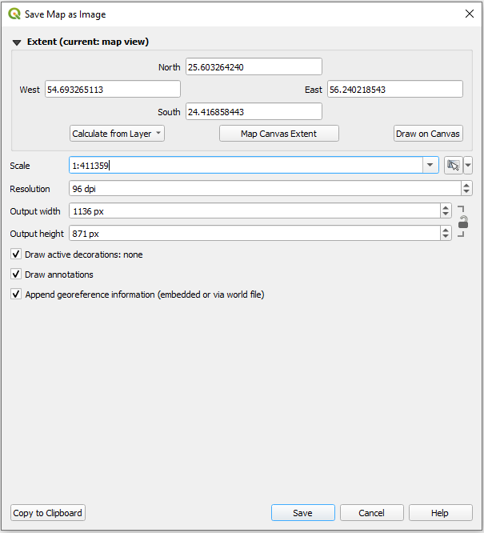

Figure 5.2: تصدير الخريطة

3. انقر فوق حفظ. سيتم حفظ الخريطة الموجودة في لوحة qgis بصيغة pdf أو مستند صورة. تصفح حتى تصل إلى الموقع حيث تم حفظ الملف وستتمكن الآن من طباعة الخريطة أو مشاركتها.

Figure 5.3: تصدير لوحة الخريطة بصيغة صور

<h4><strong>
الطريقة الثانية: تصدير لوحة الخريطة إلى تخطيط الطباعة
</strong></h4>

1. في هذا البرنامج التعليمي، سننشئ خريطة توضح 1) موقع المراكز الصحية و 2) الكثافة السكانية لمنطقة Dubai في UAE. يجب أن تكون طبقات البيانات قد أضيفت إلى لوحة QGIS مسبقاً.  يمكن بعد ذلك تصميم الطبقات بحيث يتم توضيح و إيصال المعلومات الكامنة في بياناتك.

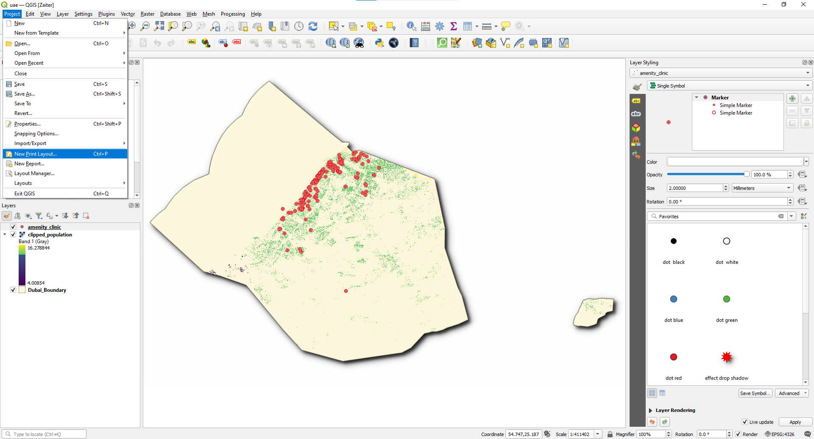

Figure 5.4: إنشاء تخطيط طباعة جديد

2. يمكن الآن تصدير لوحة الخريطة إلى تخطيط الطباعة. انقر على "زر تخطيط طباعة جديد"  new print layout layout button. يمكن الوصول إلى هذا عبر شريط الأدوات . يمكنك الوصول أيضاً باستخدام شريط قائمة "المشاريع" (Projects menu bar). سيفتح حوار عنوان يطالبك بكتابة عنوان تخطيط الطباعة. اكتب "Dubai" وانقر فوق موافق.

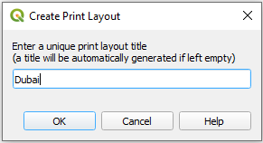

Figure 5.5: تسمية تخطيط الطباعة

3. سيتم فتح تخطيط الطباعة

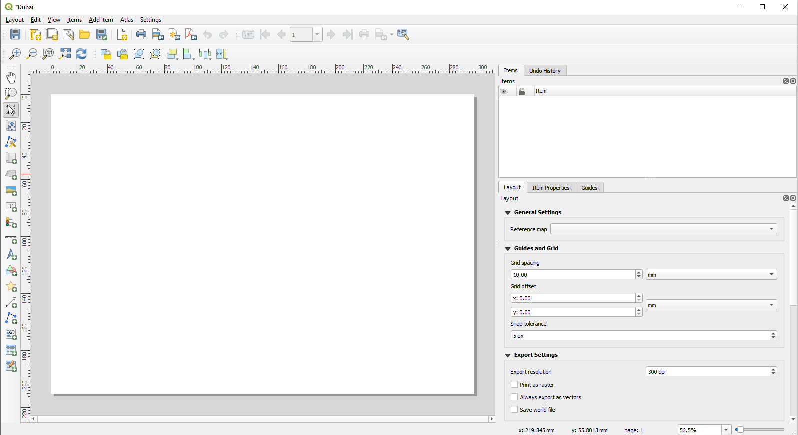

Figure 5.6: نافذة تخطيط الطباعة

4. ستلاحظ أن لوحة تخطيط الطباعة فارغة. لإضافة خريطة مصممة من لوحة QGIS، انقر على زر "إضافة خريطة جديدة إلى التخطيط"  ، وانقر بزر الماوس الأيسر على الماوس وارسم مستطيلًا في المساحة البيضاء في وسط تخطيط الطباعة. يجب أن يتم إضافة الخريطة. لقد قمت للتو بتصدير الخريطة إلى تخطيط الطباعة. أصبح من الممكن الآن إضافة جميع عناصر الخريطة الأخرى مثل العنوان، والمفتاح، الشبكات ، إلخ.

Figure 5.7: أضف الخريطة إلى تخطيط الطباعة

<h4><strong>
أسئلة الاختبار
</strong></h4>

1. ما هي لوحة خريطة QGIS ؟ (مربعات اختيار)
2. بماذا يستخدم تخطيط الطباعة ؟ (مربعات اختيار)
3. أي مما يلي ليس عنصر خريطة ؟ (زر الراديو)

<h4><strong>
إجابات الاختبار
</strong></h4>

1. أ. تُظهر الخريطة المكونة من طبقات الخريطة المتراكبة	 ب. يسمح بالتفاعل مع الخريطة والطبقات	 ج. أداة لصنع الخرائط
2. أ. يوفر تخطيطًا وقدرات طباعة متزايدة 	ب. يسمح لك بإضافة عناصر الخريطة            ج. التعامل مع كل من تصدير وطباعة الخرائط
3. أ. العنوان 		ب. مقياس 		ج. مفتاح الخريطة	 د. الألوان والتصاميم

<h3>
عنوان المرحلة 2: إضافة عناصر الخريطة إلى تخطيط الطباعة وتحريرها
</h3>

الآن وقد تمت إضافة الخريطة المصمّمة إلى تخطيط الطباعة، فقد حان الوقت لإضافة عناصر الخريطة ذات الصلة مثل العنوان والمقياس والمفتاح والشبكة والبيانات الوصفية وما إلى ذلك إلى تخطيط الطباعة. توجد معظم الأزرار على يسار تخطيط الطباعة.

1. انقر فوق الزر  "إضافة تسمية" (Add label)، واضغط باستمرار على زر الماوس الأيسر وارسم مستطيلاً حيث تريد وضع عنوان الخريطة. اكتب العنوان ضمن قائمة "الخصائص الرئيسية" (Main properties) على الجانب الأيمن من تخطيط الطباعة. يمكن تغيير خصائص الخط ضمن عنصر القائمة "المظهر" (Appearance).

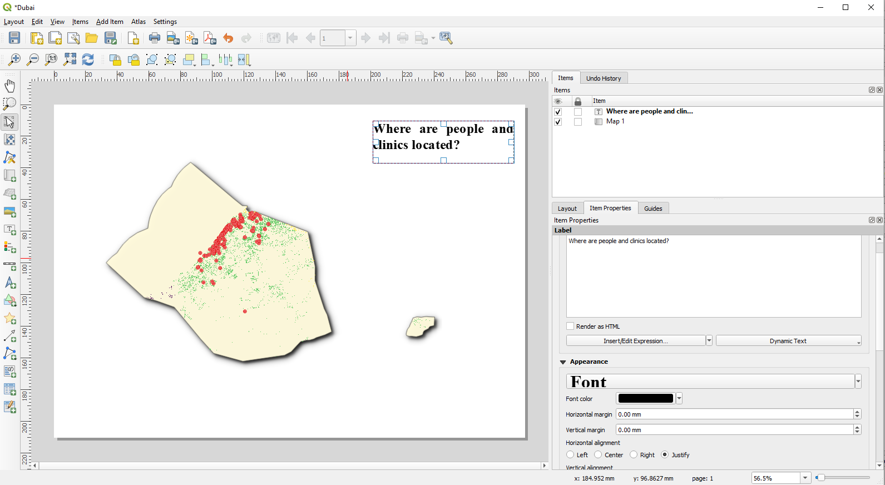

Figure 5.8: أضف عنوان الخريطة

2. بعد ذلك، سنضيف مفتاح الخريطة والمقياس. يمكن إضافة بيان إحالة البيانات باستخدام الزر "إضافة تسمية" مرر الماوس فوق الزر الموجود على يسار تخطيط الطباعة وانقر فوق الزر المفضل. اتبع نفس الخطوات الموضحة في 1. أعلاه لإضافة عنصر الخريطة إلى تخطيط الطباعة. يمكنك إضافة عناصر أخرى للخريطة، لكن كن حذرًا حتى لا تزدحم الخريطة كثيرًا.

Figure 5.9a: أضف شريط مقياس إلى الخريطة

Figure 5.9b: أضف مفتاح خريطة إلى الخريطة

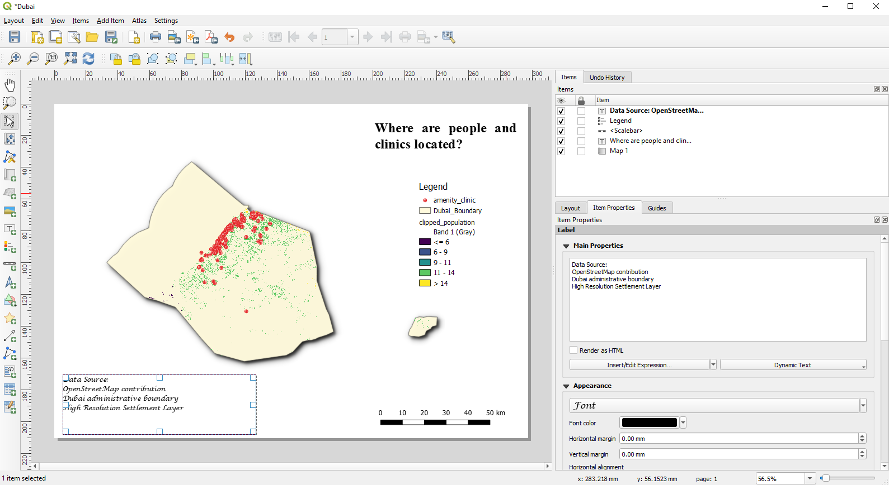

Figure 5.9c: أضف الإسناد إلى الخريطة

3. إذا كان تخطيط الخريطة مُناسباً لك، فيمكن تصدير الخريطة بصيغة pdf أو png أو jpeg أو svg، وتكون جاهزة للطباعة وإلا احفظ التخطيط. يمكن الوصول إلى جميع وظائف الحفظ عبر قائمة "التخطيط" (layout).
4. احفظ الخريطة كصورة عبر التخطيط ‣ تصدير كصورة … (Layout ‣ Export as Image) أو بالنقر فوق الزر تصدير كصورة  (Export as Image) . سيسألك QGIS عن الملف الذي تريد حفظ الخريطة به بالإضافة إلى معاييرالصورة.

Figure 5.10: خيارات حفظ الخريطة كصورة

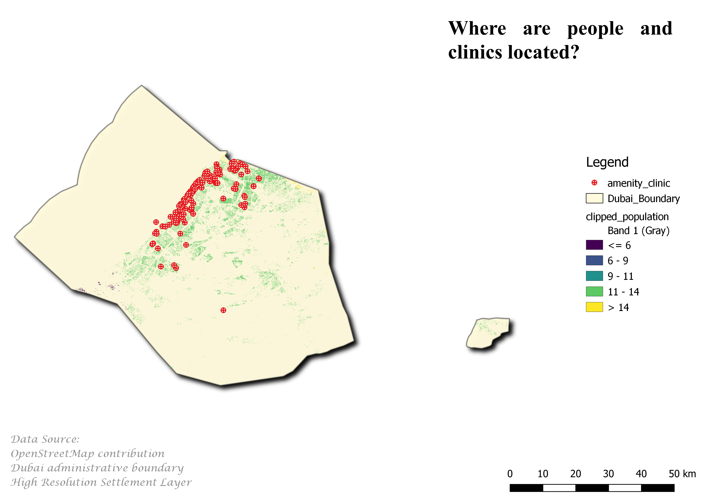

Figure 5.11:الخريطة المصدّرة بصيغة صورة

<h4><strong>
أسئلة الاختبار
</strong></h4>

1. ضمن أي من علامات التبويب التالية يمكنك تغيير خصائص عناصر الخريطة؟ (زر الراديو)
2. ما هو الفرق بين مخطط الطباعة وتخطيط الطباعة
3. كيف يمكنك إضافة نص الإسناد إلى تخطيط الخريطة

<h4><strong>
إجابات الاختبار
</strong></h4>

1. أ. التكوين Composition  	ب. خصائص العنصر Item properties  	ج. جيل أطلس Atlas generation
2. يتيح لك تخطيط الطباعة إضافة خرائط من لوحة الخريطة بينما يسمح لك مخطط الطباعة بتكوين خريطتك
3. أضف مربع عنوان، ثم اكتب نص الإسناد. لاحظ أن مربع العنوان يسمح لك بإضافة جميع أشكال النص إلى خريطتك.

<h3>
عنوان المرحلة 3: التشغيل الآلي لإنشاء الخريطة باستخدام إمكانيات أطلس
</h3>

إذا كانت مؤسستك تنشر خرائط مطبوعة أو عبر الإنترنت، فغالبًا ما تحتاج إلى إنشاء العديد من الخرائط بنفس القالب أو النموذج - عادةً واحد لكل وحدة إدارية أو منطقة اهتمام. يمكن أن يستغرق إنشاء هذه الخرائط يدويًا وقتًا طويلاً وإذا كنت ترغب في تحديثها بشكل منتظم، فقد يتحول إلى عمل روتيني. لدى QGIS أداة تسمى أطلس يمكنها مساعدتك في إنشاء قالب خريطة ونشر عدد كبير من الخرائط لمناطق جغرافية مختلفة بسهولة. سنأخذ مقاطعات UAE المختلفة كمثال، وهنا الحدود الإدارية للـ7 مقاطعة؛

Figure 5.12: Coverage layer

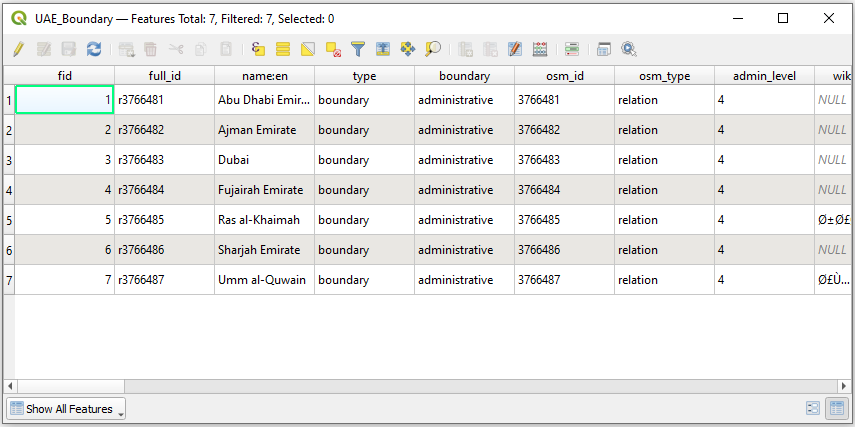

Figure 5.13: جدول السمات

1. ستعمل هذه الطبقة كطبقة تغطية خارجية (coverage layer) مما يعني أن QGIS Atlas سيحدد خريطة واحدة لكل معلم في طبقة التغطية هذه. في النتيجة، سيتم إنشاء 7 خريطة.

2. افتح أو أنشئ تخطيط طباعة جديدًا وأضف خريطة.

Figure 5.14: تخطيط طباعة أطلس

3. في الجزء الأيمن من تخطيط الطباعة، تأكد من تحديد قائمة أطلس Atlas وتحديد مربع إنشاء أطلس Generate an atlas. يمكنك أيضًا فتح إعدادات أطلس باستخدام زر إعدادات أطلس    على شريط أدوات أطلس Atlas toolbar.

Figure 5.15:  إنشاء أطلس

4. الخطوة التالية هي اختيار طبقة التغطية؛ طبقة التغطية هي طبقة الفهرس (index layer) المستخدمة لإنشاء كل صفحة. سيتم إنشاء خريطة / صفحة واحدة للأطلس لكل معلم في طبقة التغطية. في حالتنا، سيؤدي استخدام طبقة تغطية "UAE_Boundary" إلى إنشاء خريطة لكل مقاطعة من الـ7 مقاطعة. يغير QGIS Atlas نطاق العرض ديناميكيًا لكل معلم في طبقة التغطية. يمكنك اختيار جعل طبقة التغطية مخفية في الخرائط التي تقوم بإنشائها (أي أن طبقة التغطية لن تكون مرئية في تخطيط الطباعة) وتحديد اسم كل صفحة من صفحات أطلس الخاصة بك. يمكنك أيضًا إجراء بعض التصفية والفرز لطبقة التغطية إذا كنت بحاجة إلى ذلك. بالنسبة للإخراج (Output)، يمكنك اختيار الحصول على ملف واحد كمخرج عن طريق تحديد خانة الاختيار "تصدير ملف Single عند الإمكان" (Singe file export when possible). إذا لم يتم تحديد هذه الخانة، فسوف تقوم بإنشاء ملف واحد لكل خريطة.

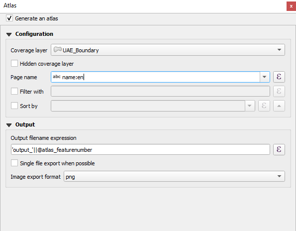

Figure 5.16: حدد طبقة التغطية

5. الآن بعد أن قمنا بتعيين طبقة التغطية، يجب أن نخبر مخطط الطباعة أن يقوم باستخدام الأطلس للتحكم في مدى الخرائط (المنطقة المرئية على الخريطة القابلة للطباعة) التي سننشئها. في علامة التبويب خصائص العنصر (Item Properties)، حدد مربع التحكم بواسطة أطلس (Controlled By Atlas).

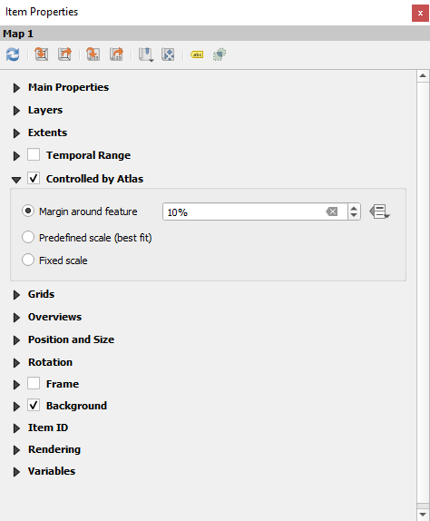

Figure 5.17: تأكد من أن نطاق الخريطة يتحكم فيه الأطلس

6. لمعاينة Atlas الخاص بك، انقر فوق الزر Preview Atlas   على شريط أدوات Atlas. سيُظهر لك هذا الـ7 خريطة التي قمت بإنشائها. استخدم شريط أدوات Atlas  للتنقل في خرائط Atlas.

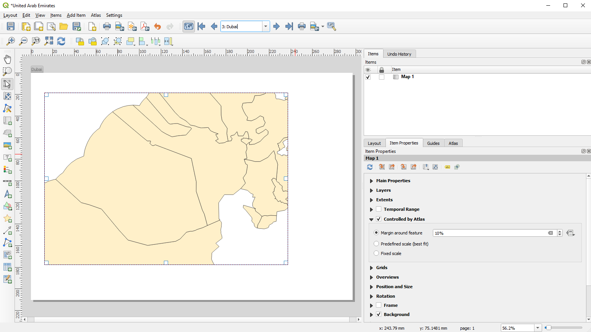

معاينة أطلس -  Figure 5.18: Atlas Preview

7. يمكنك تصدير خرائط أطلس عبر زر تصدير أطلس (Export Atlas)  إما كصور أو ملفات PDF. حدد تصدير أطلس كصورة (Export Atlas as Image). يجب أن يكون لديك 7 خريطة تم إنشاؤها بحيث تُظهر كل خريطة مدى المقاطعة.

Figure 5.19: Atlas Outputs - مخرجات أطلس

8. نصيحة: في هذا المثال، قمنا فقط بتعيين طبقة التغطية. تكمن قوة الأطلس عند رسم خرائط لعدة طبقات. على سبيل المثال، لدينا بيانات العيادات وشبكة الطرق والكثافة السكانية للبلد بأكمله والتي تم تحميلها كطبقات في QGIS. ونرغب في إنشاء خريطة واحدة لكل مقاطعة تظهر هذه الطبقات نفسها. يتطلب استخدام Atlas منا إنشاء نموذج تخطيط واحد فقط والسماح لـ Atlas بمعالجة إنشاء الخرائط الأخرى بناءً على طبقة التغطية التي نستخدمها.

9. نصيحة: يمكنك استخدام تعبيرات QGIS وتجاوزات تعريف البيانات (Data Defined overrides) لتعيين عناصر الخريطة الأخرى في Atlas الخاص بك بحيث تتغيرهذه العناصر أيضًا وبشكل ديناميكي بالإعتمادًا على معلم طبقة التغطية التي يتم تعيينها. على سبيل المثال، يمكنك استخدام تعبير QGIS الذي يستدعي قيمة الحقل NAME_1 على الملصق الخاص بك بحيث يتغير ديناميكيًا إلى قيمة NAME_1 للميزة الحالية التي يتم تعيينها.

لمزيد من المعلومات حول QGIS Atlas ، راجع: <a href="https://www.youtube.com/watch?v=tOnMJBUvEjY">https://www.youtube.com/watch?v=tOnMJBUvEjY</a>.

