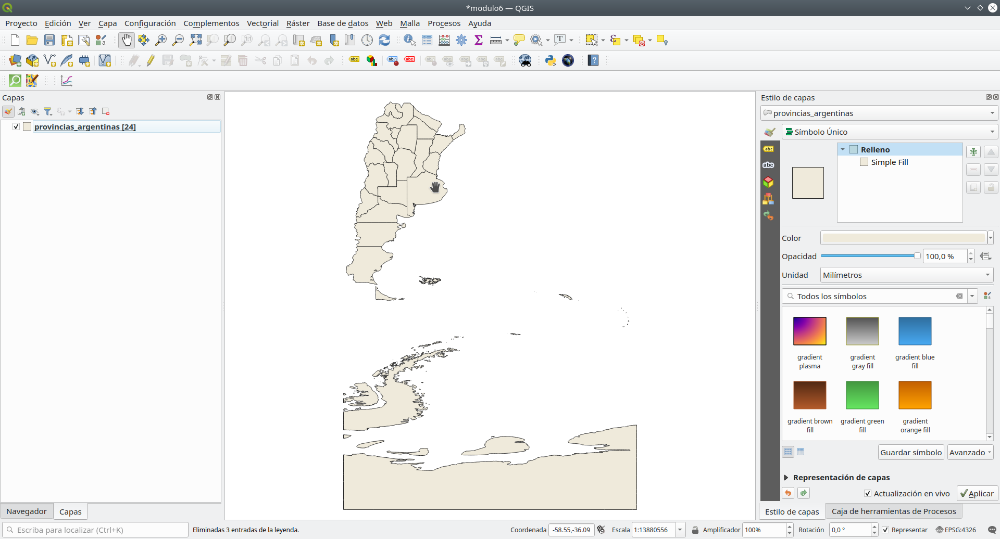
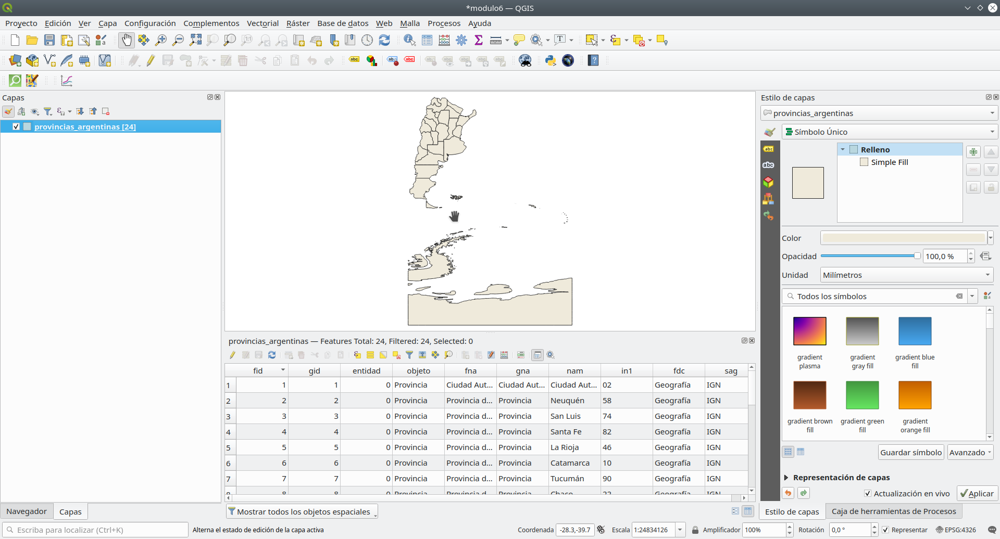
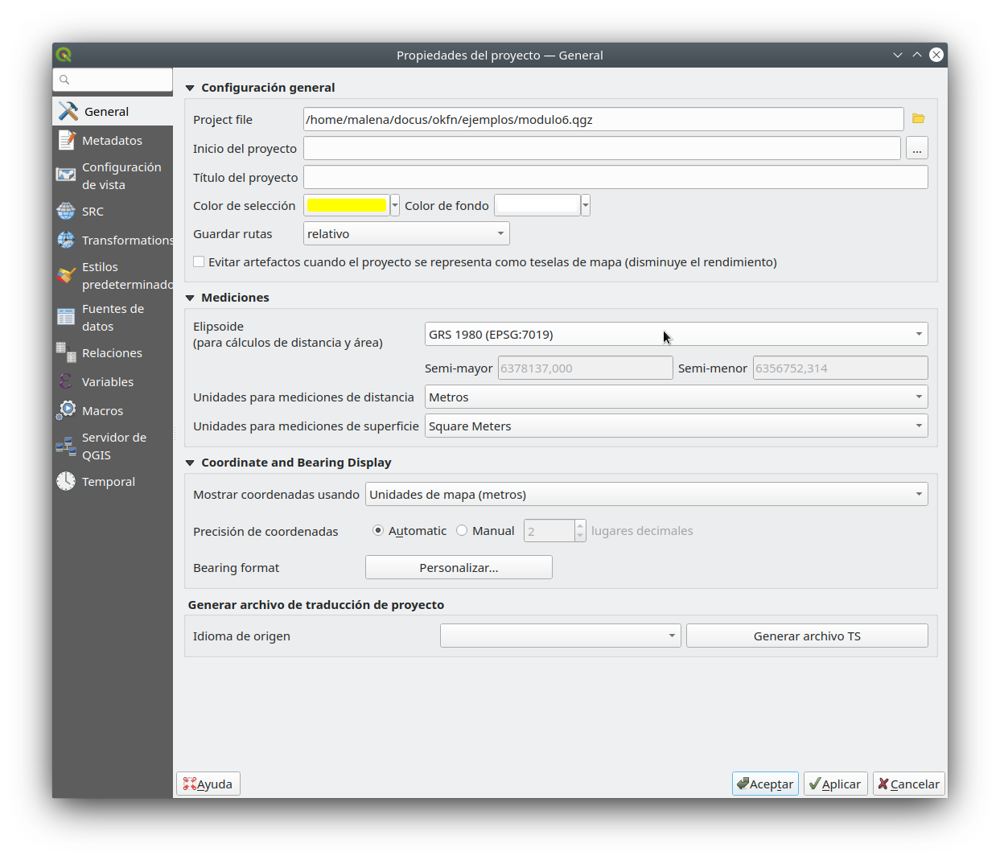
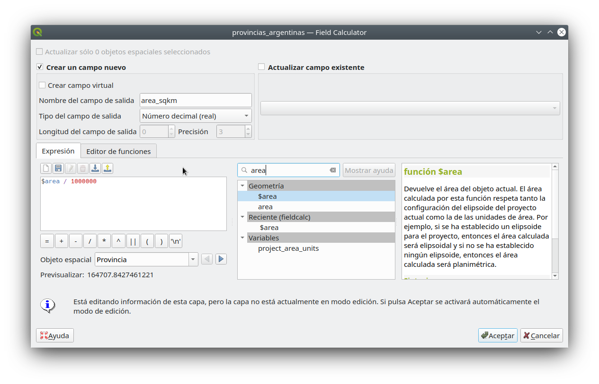
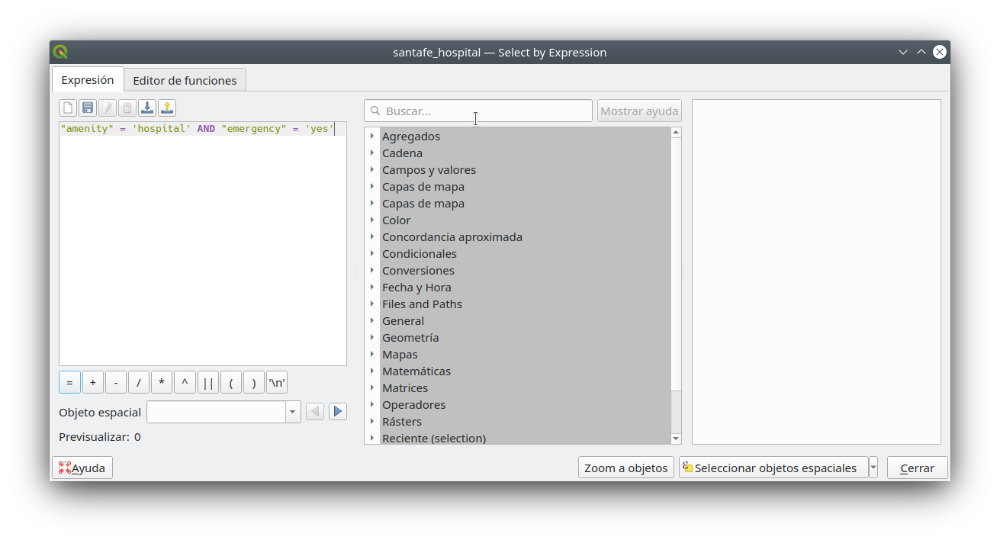
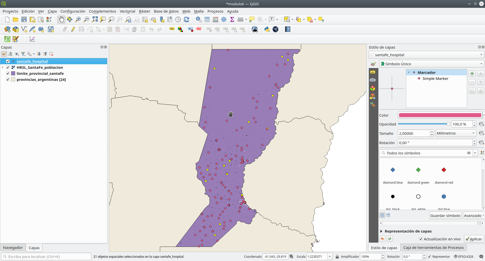

# Módulo 6 - Atributos de capa

**Autor:** Ketty, Ben Hur

## Introducción Pedagógica

Este módulo le proporcionará una descripción general de los pasos comunes necesarios para trabajar con la tabla de atributos y los atributos de capa en QGIS. Al final del módulo, podrá comprender los siguientes conceptos;

*   Trabajar con la tabla de atributos
*   Usar la calculadora de campo
*   Motor de expresión QGIS
*   Refactorizar campos

Además, aprenderá las siguientes habilidades;

*   Presentación de la interfaz de la tabla de atributos
*   Interactuar con entidades en una tabla de atributos
*   Guardar entidad seleccionada como nueva capa
*   Editar campos de capa

Utilizará la calculadora de campo y el motor de expresión qgis para ejecutar operaciones y funciones matemáticas en QGIS.


## Herramientas y recursos necesarios

*   Computadora de trabajo
*   Conexión a Internet
*   QGIS 3.16 y superior
*   Capa límite administrativa de Santa Fe, Argentina (dentro del modulo6.gpkg)
*   Hospitales de Santa Fe, Argentina (dentro del modulo6.gpkg)
*   Provincias de Argentina (dentro del modulo6.gpkg)
*   Capa de asentamiento de alta resolución de Santa Fe, Argentina


## Prerrequisitos

*   Comprensión de todos los módulos anteriores
*   Conocimientos básicos sobre el funcionamiento de una computadora


## Recursos adicionales

*   Trabajo con la tabla de atributos - [https://docs.qgis.org/3.16/en/docs/user_manual/working_with_vector/attribute_table.html?highlight=layer%20attributes](https://docs.qgis.org/3.16/en/docs/user_manual/working_with_vector/attribute_table.html?highlight=layer%20attributes)
*   Expresiones QGIS - [https: / /docs.qgis.org/3.16/en/docs/pyqgis_developer_cookbook/expressions.html](https://docs.qgis.org/3.16/en/docs/pyqgis_developer_cookbook/expressions.html)


## Introducción temática

Comencemos con un ejemplo:

En algunos casos, por ejemplo, para fines de planificación de infraestructura, es posible que desee conocer el área de los polígonos en una capa . Si tiene un polígono, esto no sería un problema. Pero, ¿qué pasa si tiene muchos polígonos / áreas en la capa? Calcular cada área una por una es casi imposible. La capa de vector de límite administrativo de Filipinas tiene muchos polígonos, lo que significa que sería un buen conjunto de datos para este tutorial. Vamos a calcular el área de cada polígono de forma automática. En total, se calculará el área de 81 provincias.


## Desglose de los conceptos

Gran parte del trabajo que realiza al crear un mapa implica trabajar con atributos de capa. Ya sea que esté dibujando la capa, configurando una ventana emergente, realizando análisis o visualizando, necesita cierto nivel de conocimiento de los campos de la capa y los valores que contienen. Si es su propia capa, conoce y comprende sus atributos. Pero si no es así, ¿cómo se obtiene ese conocimiento? Lo más probable es que inspeccione los nombres de los campos y examine los valores de los campos en busca de algunas pistas. Y si tiene suerte, encontrará documentación que describe los atributos de la capa.

La tabla de atributos muestra información sobre las características de una capa seleccionada. Cada fila de la tabla representa una característica (con o sin geometría) y cada columna contiene un dato particular sobre la característica. Las características de la tabla se pueden buscar, seleccionar, mover o incluso editar. Específicamente, hay dos nuevas propiedades de campo que describen los valores contenidos en un campo;


*   Descripción del campo: unas pocas palabras, una oración o un párrafo de texto que describe los valores del campo.
*   Tipo de valor de campo: una palabra clave que categoriza el tipo de valores contenidos en el campo. La palabra clave ayuda a las personas a entender cómo usar los valores y permite que QGIS y otras aplicaciones cliente hagan sugerencias más inteligentes para trabajar con ellos, por ejemplo, los tipos de valores en el campo pueden ser enteros, cadenas, booleanos, dobles o de coma flotante.

Aquí hay un ejemplo ; Suponga que tiene una capa de parcela de tierra que tiene estos campos:

*   ID de parcela - entero
*   Propietario - cadena
*   Dirección de la calle - cadena
*   Descripción de la propiedad - cadena
*   Edificios - entero
*   Área de terreno - doble
*   Valor tasado - doble
*   Fecha de tasación - Fecha

Si tuviera que describir estos valores de campo , puede escribir algo como esto:

*   ID de parcela - el identificador único de la parcela
*   Propietario- el nombre del dueño de la propiedad
*   Dirección de la calle - la ubicación de la parcela
*   Descripción de la propiedad - la descripción legal de la propiedad
*   Edificios - el número de edificios en la parcela
*   Área del terreno: el tamaño de la parcela en acres
*   Valor tasado: el valor de la parcela y los edificios en dólares
*   Fecha de tasación: la fecha de la última tasación

Al observar estas descripciones, se destacan algunas palabras, como: identificador, nombre, ubicación , descripción, número, tamaño, valor y fecha. Estas son las _palabras clave_ (keywords) que describen los valores del campo. Las palabras clave de tipo de valor de campo se construyen a partir de este tipo de palabras. Son:

*   Nombre o Título
*   Descripción
*   Tipo o Categoría
*   Recuento o Cantidad
*   Porcentaje o Relación
*   Medición
*   Identificador único
*   Ordenado o clasificado
*   Binario
*   Ubicación o Nombre de lugar
*   Coordenada
*   Fecha y hora

En el ejemplo de capa de parcela anterior, el campo ID de parcela es un campo entero. Si el tipo de valor de campo indica que los valores de campo representan un identificador único en lugar de un recuento, QGIS no sugeriría dibujar este atributo de campo usando colores o símbolos graduados.

Además, otros conceptos como la función de calculadora de campo en la tabla de atributos permiten realizar cálculos sobre la base de valores de atributos existentes o funciones definidas, por ejemplo, para calcular la longitud, el área o la densidad de población. Tenga en cuenta que los posibles cálculos están determinados por los atributos o la composición de sus datos. Por ejemplo, solo es posible calcular la densidad de población si hay un campo con recuentos de población. Usando el motor de expresión y la calculadora de campo, luego continuaría construyendo una expresión o fórmula para calcular la densidad de población. En este caso la fórmula sería; población total como número de personas / área de tierra cubierta por esa población. Notará que es importante saber qué representa cada uno de los campos en la tabla de atributos de capa. Esto significa que necesita conocer y comprender sus datos a fondo. Esto hace que sea más fácil aplicar funciones y expresiones y, por lo tanto, generar análisis y visualizaciones / productos de mapas significativos.


### Título de la fase 1: Edición de atributos de capa

#### **Contenido / Tutorial**

La tabla de atributos muestra información sobre las características de una capa seleccionada. Cada fila de la tabla representa una característica (con o sin geometría) y cada columna contiene un dato particular sobre la característica. Las características de la tabla se pueden buscar, seleccionar, mover o incluso editar.

1. Cargue la capa vectorial de provincias PHL (que se encuentra dentro de modulo6) en QGIS. Puede saber cuántas entidades hay en la entidad actual haciendo clic con el botón derecho en la capa en el Panel de capas ‣ Mostrar recuento de entidades. Como puede ver a continuación, la capa vectorial tiene muchas características. En total, hay 81 características correspondientes a 81 provincias.



Figura 6.1: Varios polígonos

2. El siguiente paso es explorar la interfaz de la tabla de atributos. Abra la tabla de atributos haciendo clic derecho en la capa en el Panel de capas ‣  Abrir tabla de atributos. También puede hacer clic en el botón  Abrir tabla  de atributos de la barra de herramientas de atributos. Así es como se ve la tabla de atributos. La barra de herramientas tiene una variedad de botones, coloque el cursor sobre cada botón para ver la funcionalidad incorporada.


Figura 6.2: Abrir tabla de atributos

Si no desea que la tabla de atributos sea una ventana flotante, sino que se acople en la interfaz QGIS, puede hacer clic en el botón  Acoplar tabla de atributos . Cuando están acopladas, las tablas de atributos aparecerán como pestañas en lugar de ventanas individuales.



Figura 6.3: Tabla de atributos acoplados

3.  Para los cálculos de área, el Sistema de referencia de coordenadas debe ser proyectado. Esto le permite calcular las distancias correctamente. Recuerde, nuestro interés es calcular automáticamente el área para cada una de las 24 provincias. Verifique el Sistema de referencia de coordenadas de la capa vectorial. Si se trata de un sistema de referencia de coordenadas geográficas, vuelva a proyectar la capa a un sistema de coordenadas proyectadas. Consulte las diferentes proyecciones en el sitio web de [EPSG](https://epsg.io). Esto es Argentina, usaremos POSGAR 2007 / Argentina[ Zona 3](https://epsg.io/5345), EPSG: 5345. De los módulos anteriores donde las proyecciones de mapas se discuten ampliamente, es posible que ya sepa que las proyecciones de mapas se aplican en relación con una ubicación determinada en la tierra.

4. Verifique la configuración del proyecto; Vaya a: **Proyecto ‣ Propiedades Propiedades ‣ General**.



Figura 6.4: Configuración general

5. A continuación, haga clic en el  botón Abrir calculadora de campo en la barra de herramientas de atributos para abrir la calculadora de campo. Se abrirá el diálogo de la calculadora de campo; complete el nombre del campo de salida, en este caso será 'AREA (SQ KM)'. Elija el número decimal (doble) en el tipo de campo de salida. Cambie la precisión a 2 lugares decimales. Para calcular el área, use la siguiente expresión:

```
$area / 1000000
```

Puede encontrar esta expresión en **Geometría**. Haga clic en Aceptar y calculará automáticamente el área de cada polígono. Tenga en cuenta que el cálculo del área depende del sistema de referencia de coordenadas utilizado, por lo que puede obtener resultados diferentes según el CRS que utilizó. También puede buscar y encontrar información sobre expresiones en el lado derecho de la Calculadora de campo o el Generador de expresiones.



Figura 6.5: Cuadro de diálogo de la calculadora de campo

6. Abra la tabla de atributos para ver el resultado. Acaba de editar el contenido de la tabla de atributos, de forma automatizada en lugar de escribir los valores en cada celda uno por uno.


Figura 6.6: Nueva tabla de atributos con el nuevo campo y atributos


#### **Preguntas de evaluación**


1. Una tabla de atributos es una base de datos o un archivo de tabla que contiene información sobre un conjunto de características geográficas.

2. Las características geográficas están generalmente dispuestas de modo que cada fila representa una característica y cada columna representa un atributo de entidad.

3. Es necesario volver a proyectar capas antes de los cálculos de área cuando la capa tiene un sistema de referencia de coordenadas geográficas.

#### **Respuestas**

1. Verdadero
2. Verdadero
3. Verdadero


### Fase 2: Comprender y trabajar con datos de atributos, consultas y análisis

#### **Contenido / Tutorial**

En este punto, es posible que observe que la tabla de atributos almacena datos espaciales y no espaciales. En este tutorial, descubrirá formas de trabajar con datos de tablas de atributos. Por ejemplo, usando expresiones, seleccione Clínicas en Pampanga con un centro de emergencia, todas usando datos de la tabla de atributos.

1. Agregue los siguientes conjuntos de datos de Filipinas al lienzo del mapa de QGIS;
*   Capa de límite administrativo de Pampanga (dentro de module6.gpkg)
*   Clínicas de Pampanga (dentro de module6.gpkg)
*   Provincias de PHL (dentro de module6.gpkg)
*   Capa de asentamiento de alta resolución de Pampanga


Figura 6.7: Agregar diferentes capas


2. La selección se aplicará a la capa de Clínicas, por lo tanto, abra la tabla de atributos para la capa Clínica. Haga clic en seleccionar entidades usando el botón expresión  y escriba la siguiente expresión en el generador de expresiones;

```
"amenidad" = 'clínica' AND "Emergencia" = 'Yes'
```

Notarás que la expresión tiene varios predicados como el signo de comparación (=), el predicado lógico (Y) y una cadena que está entre comillas simples (''). También hay dos nombres de atributos (amenidad, emergencia) y sus valores (clínica, sí).



Figura 6.8: Diálogo del constructor Seleccionar por expresión

3. Se selecciona una clínica. Puede ver la selección resaltada en amarillo. La clínica seleccionada también se resalta en la tabla de atributos. Ahora sabemos que solo hay una clínica con un centro de emergencia en la provincia de Pampanga.



Figura 6.9: La clínica / característica seleccionada está resaltada (amarillo)


Figura 6.10: La clínica / característica seleccionada está resaltada (azul)

También es posible hacer selecciones haciendo clic en una característica dentro del lienzo del mapa.

El desarrollo de una expresión funcional comienza con la comprensión de sus datos; por ejemplo, los atributos y los valores que contienen. Luego haciendo las preguntas correctas y finalmente, desarrollando la expresión correcta, considerando todas las reglas matemáticas que hacen que un error sea libre de expresión.


#### **Preguntas de evaluación**

1. Estos operadores los proporciona el constructor de expresiones. {+, -, *}
2. Las comillas simples deben incluir una cadena.
3. La tabla de atributos almacena solo datos no espaciales.

#### **Respuestas del cuestionario**

1. Verdadero
2. Verdadero
3. Falso


### Título de la fase 3: Expresiones avanzadas de QGIS

El diálogo Generador de expresiones ofrece acceso a la:

*   Pestaña Expresión	 ([https://docs.qgis.org/3.16/en/docs/user_manual/working_with_vector/expression.html#functions- list](https://docs.qgis.org/3.16/en/docs/user_manual/working_with_vector/expression.html#functions-list)) que, gracias a una lista de funciones predefinidas, ayuda a escribir y comprobar la expresión a utilizar;
*   Pestaña Editor de funciones	 ([https://docs.qgis.org/3.16/en/docs/user_manual/working_with_vector/expression.html#function-editor](https://docs.qgis.org/3.16/en/docs/user_manual/working_with_vector/expression.html#function-editor)) que ayuda a ampliar la lista de funciones mediante la creación de funciones personalizadas.

#### **Contenido / Tutorial**

Hay muchos casos de uso de expresiones, aquí hay algunos ejemplos. Observe cómo se desarrollan las expresiones y qué operadores o predicados se utilizan. También es importante el hecho de que todas estas expresiones se desarrollan en función del contenido del conjunto de datos. Puede adaptar esto a su conjunto de datos de elección.

1. Desde la Calculadora de campo, calcule un campo "pop_density" utilizando los campos "total_pop" y "area_km2" existentes:

```
"total_pop" / "area_km2"

```

2. Actualice el campo "density_level" con categorías de acuerdo con los valores de "pop_density":

```
CASE WHEN "pop_density" < 50 THEN 'Low population density'
     WHEN "pop_density" >= 50 AND  "pop_density" < 150 THEN 'Medium population density'
     WHEN "pop_density" > 150 THEN 'High population density'
END

```

3. Aplicar un estilo categorizado a todas las características según si el precio medio de la vivienda es inferior o superior a 10000 chelines por metro cuadrado:

```
"precio_m2"> 10000

```

4. Con la herramienta "Seleccionar por expresión ...", seleccione todas las entidades que representan áreas de "Alta densidad de población" y cuyo precio medio de la vivienda es superior a 10000 pesos por metro cuadrado:


```
"nivel de densidad" = 'Alta densidad poblacional' y "precio_m2"> 10000

```

5. Asimismo, la expresión anterior también podría usarse para definir qué características deben ser etiquetadas o mostradas en el mapa.

#### **Preguntas de evaluación**

1. Tanto la calculadora de campo como el diálogo Seleccionar por expresión se pueden usar para desarrollar expresiones - _Verdadero_
2. Expresiones se puede usar para actualizar un nuevo campo - _Verdadero_
3. Expresiones se puede usar para aplicar un estilo - _Verdadero_