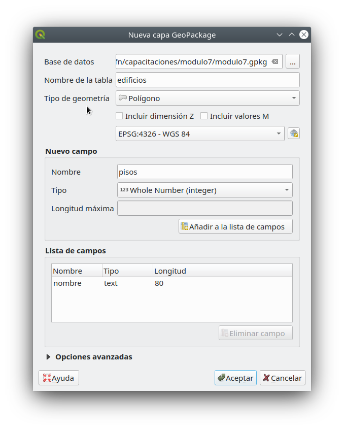
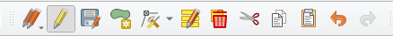
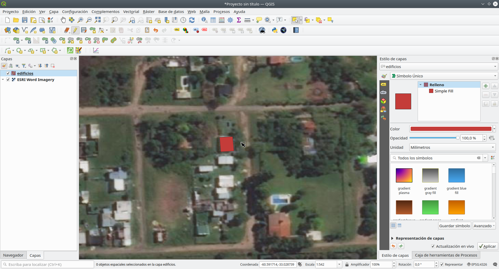
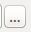
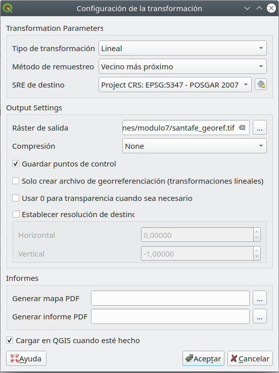
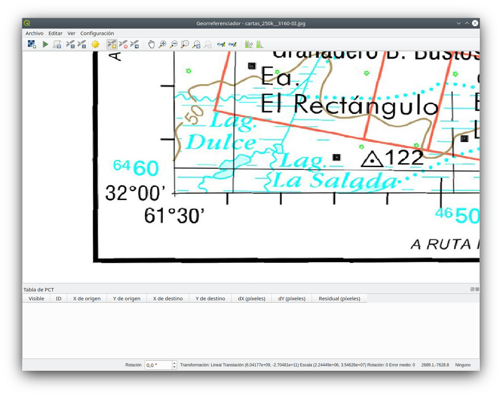
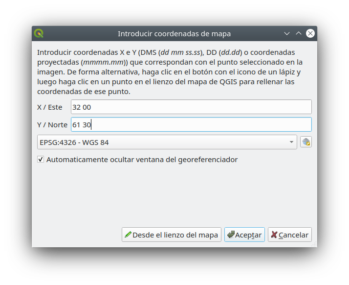
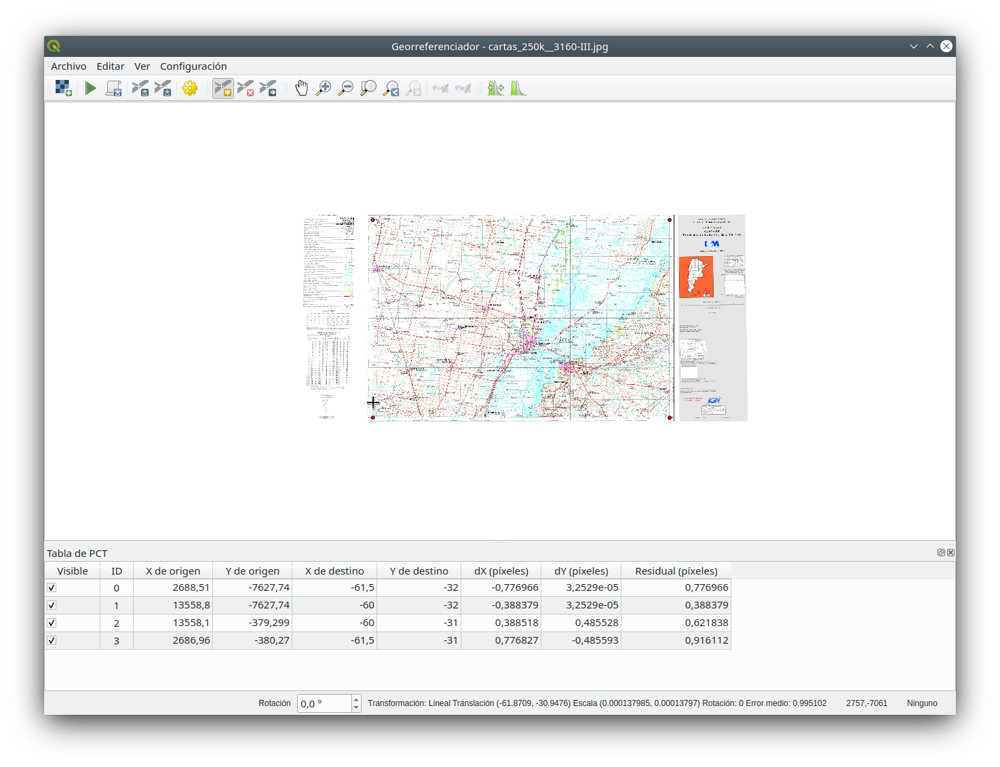
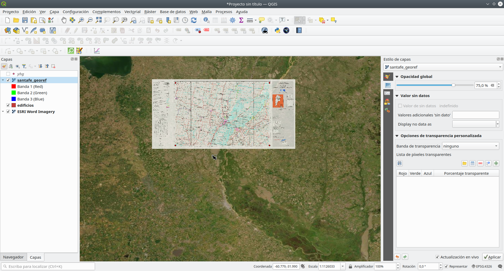

# Módulo 7: Creación y edición de capas

**Autor:** Ketty, Ben Hur

## Introducción Pedagógica

Este módulo está diseñado para enseñarle cómo usar las herramientas QGIS para crear una nueva capa SIG. Aprenderá conceptos como digitalización y georreferenciación. Además, aprenderá los siguientes conceptos;

*   Digitalización
*   Georreferenciación
*   Computadora de trabajo
*   Acceso a Internet
*   QGIS 3.16 o posterior
*   Mapa topográfico de Santa Fe

## Prerrequisitos

*   Un conocimiento razonable de todos los módulos anteriores
*   Conocimientos básicos de operación de una computadora

## Recursos adicionales

*   Creación de capas - [https://docs.qgis.org/3.16/en/docs /user_manual/managing_data_source/create_layers.htmlrodales](https://docs.qgis.org/3.16/en/docs/user_manual/managing_data_source/create_layers.html)
*   Digitalización de forestales - [https://docs.qgis.org/3.16/en/docs/training_manual/forestry/stands_digitazing.html?highlight=digitizing](https://docs.qgis.org/3.16/en/docs/training_manual/forestry/stands_digitazing.html?highlight=digitizing)
*   Lectura adicional: [Georreferenciación de un mapa](https://docs.qgis.org/3.16/en/docs/training_manual/forestry/map_georeferencing.html?highlight=georeferencing)

## Introducción temática

Comencemos con un ejemplo. 

Imaginemos que su departamento está planeando construir nuevos hospitales para la provincia. Es posible que deseen realizar una evaluación previa ambiental para el proyecto de infraestructura planificado. La evaluación puede implicar la realización de una investigación sobre los datos disponibles. Como puede imaginar, hay una gran cantidad de datos geográficos disponibles en formatos que no pueden integrarse inmediatamente con otros datos SIG. Algunos de estos datos pueden estar en forma de mapas antiguos, imágenes de satélite de alta resolución o imágenes de detección remota que se utilizan a menudo para hacer mapas digitales como Google Maps y OpenStreetMap. Crear y editar es bueno para actualizar cambios en sus capas o base de datos. Aquí es donde entra en juego la Creación y Edición de capas. Una forma en la que se pueden crear nuevos datos en un SIG es a través de la digitalización. Otros métodos incluyen georreferenciación, escaneo y vectorización, recorte, selección y luego guardado. Es importante recordar que los datos creados dependen de la singularidad de la fuente original. Por ejemplo, la siguiente imagen muestra que cada producto de imagen producirá un conjunto de datos único.

Figura 7.1: Imágenes de sensores remotos de diferentes costas. A. Datos del radar interferométrico de apertura sintética (IFSAR) (utilizando microondas para recopilar datos para crear imágenes representativas), B. Datos lidar topográficos y batimétricos (datos de altura y elevación representados por colores), C. Imágenes hiperespectrales (agregando color a la energía invisible) y D. Fotografía digital (colores visibles del ojo humano representados como ellos mismos)

## Desglose de los conceptos

La digitalización en SIG es el proceso de “rastrear”, de una manera geográficamente correcta, información de medios / mapas. El proceso de georreferenciación se basa en la coordinación de puntos en la imagen escaneada (datos a ser georreferenciados) con puntos en un dato geográficamente referenciado (datos a los cuales la imagen será georreferenciada). Al "vincular" puntos en la imagen con esas mismas ubicaciones en los datos referenciados geográficamente, creará una transformación que convierte la ubicación de la imagen completa en la ubicación geográfica correcta.

 on top of an aerial photo")

Figura 7.2: Aquí, los edificios han sido digitalizados (trazados) sobre una foto aérea

Georreferenciación, por otro lado es el proceso de tomar una imagen digital, podría ser una foto aérea, un mapa geológico escaneado o una imagen de un topográfico. mapa y agregar información geográfica a la imagen para que el SIG o el software de mapeo puedan "colocar" la imagen en su ubicación apropiada en el mundo real.

## Contenido principal

QGIS le permite crear nuevas capas en diferentes formatos. Proporciona herramientas para crear GeoPackage, Shapefile, SpatiaLite, formato GPX y capas temporales de Scratch (también conocidas como capas de memoria). La edición le permite agregar, eliminar y modificar características en conjuntos de datos vectoriales. El primer paso es poner el conjunto de datos en modo de edición. Seleccione la capa en el Panel de Capas y haga clic en Capa | Alternar edición. Alternativamente, puede hacer clic con el botón derecho en una capa en el panel Capas y elegir Alternar edición en el menú contextual. Se pueden editar varias capas a la vez. La capa que se está editando actualmente es la seleccionada en el Panel de Capas. Una vez en el modo de edición, la barra de herramientas de digitalización se puede utilizar para agregar, eliminar y modificar funciones.

La digitalización, como habrá adivinado, es el arte (o la ciencia) de crear datos vectoriales digitales a partir de otra fuente, como una imagen rasterizada. Para comenzar a digitalizar, primero debemos ingresar al modo de edición. El software GIS comúnmente requiere un modo de edición separado, para evitar que los usuarios editen o eliminen datos importantes accidentalmente. El modo de edición se activa o desactiva individualmente para cada capa.

### Título de la fase 1: Creación de una nueva capa GeoPackage o Shapefile

#### **Creación de una nueva capa GeoPackage**

1. Para crear una nueva capa GeoPackage, presione el botón Nueva capa GeoPackage  en el menú Capa ‣ Crear capa o en la barra de herramientas del Administrador de fuentes de datos. El cuadro de diálogo Nueva capa de GeoPackage se mostrará como se muestra en la Figura 7.3.

Figura 7.3: Cuadro de diálogo Nueva capa de GeoPackage

2. El primer paso es indicar la ubicación del archivo de la base de datos. Esto se puede hacer presionando el  botón  a la derecha del campo Base de datos y seleccionar un archivo GeoPackage existente o crear uno nuevo. QGIS agrega automáticamente la extensión correcta al nombre que proporcione.
3. Escriba un nombre para la nueva capa / tabla un nombre (nombre de la tabla)
4. Defina el tipo de geometría. Si no es una capa sin geometría, puede especificar si debe incluir dimensión Z y / o Incluir valores M.
5. Especifique el sistema de referencia de coordenadas usando el botón

6. Para agregar campos a la capa que está creando:

    1. Ingrese el Nombre del campo
    2. Seleccione el Tipo de datos. Los tipos admitidos son datos de texto, número entero (tanto entero como integer64), número decimal, fecha y fecha y hora, binario (BLOB) y booleano.
    3. Dependiendo del formato de datos seleccionado, ingrese la Longitud máxima de valores.
    4. Haga clic en el botón  Agregar a la lista de campos. 

7. Reproduzca los pasos anteriores para cada campo que necesite agregar.
8. Una vez que esté satisfecho con los atributos, haga clic en Aceptar. QGIS agrega la nueva capa a la leyenda, y puede editarla como se describe en la sección

#### **Creación de un nuevo Shapefile**

1. Para crear una nueva capa de formato ESRI Shapefile, presione el botón  New Shapefile Layer ... en el menú Capa ‣ Crear capa ‣ o desde el Barra de herramientas del Administrador de fuentes de datos. El cuadro de diálogo Nueva capa de Shapefile se mostrará como se muestra en la Figura 7.4.

Figura 7.4: Diálogo de nueva capa de shapefile

2. Proporcione una ruta y un nombre de archivo usando el botón… al lado del campo Nombre de archivo. QGIS agrega automáticamente la extensión correcta al nombre que proporcione.
3. A continuación, indique la codificación de archivo de los datos
4. Elija el tipo de geometría de la capa: Sin geometría (que da como resultado un archivo en formato .DBF), punto, multipunto, línea o polígono
5. Especifique si la geometría debe tener dimensiones adicionales: Ninguna, Z (+ Valores M) o valores M
6. Especifique el sistema de referencia de coordenadas usando el botón, puede seleccionar el WGS84 universal que es adecuado para proyectos de mapeo web en todo el mundo.

7. Para agregar campos a la capa que está creando:

    1. Ingrese el nombre del campo
    2. Seleccione el tipo de datos. Solo se admiten los atributos Número decimal, Número entero, Datos de texto y Fecha.
    3. Dependiendo del formato de datos seleccionado, ingrese la Longitud y Precisión.
    4. Haga clic en el botón Agregar a la lista de campos . 

8. Reproduzca los pasos anteriores para cada campo que necesite agregar.
9. Una vez que esté satisfecho con los atributos, haga clic en Aceptar. QGIS agrega la nueva capa a la leyenda, y puede editarla como se describe en la siguiente Fase, 'Digitalización de una capa existente de este módulo.

### Título de la fase 2: Digitalización de una capa existente

#### Contenido / Tutorial

Este tutorial mostrará cómo crear un nuevo shapefile utilizando datos auxiliares como imágenes de satélite proporcionadas por Google. En la práctica, se dispondrá de datos precisos sobre el terreno. Estos serían datos cualitativos precisos sobre la característica topológica. Es importante saber qué característica le gustaría crear de antemano, por ejemplo, si es una capa vectorial de punto, línea o polígono. Cuando creamos la capa, debemos definir qué tipo de datos contendrá. El propósito de este tutorial es crear un tipo de datos que se pueda manipular, analizar y almacenar fácilmente utilizando un sistema GIS, de ahí la necesidad de crear archivos vectoriales. Crearemos entidades poligonales como ejemplo;

1. Antes de que pueda agregar nuevos datos vectoriales, necesita un conjunto de datos vectoriales (una capa) para agregarlos. En nuestro caso, comenzaremos por crear una nueva capa de datos y luego le agregaremos características. Primero, debemos definir nuestro conjunto de datos.
2. Cree un nuevo proyecto en QGIS haciendo clic en el ícono _Proyecto Nuevo_.
3. Vaya a _Capa ‣ Crear capa ‣ Nueva capa de GeoPackage_. Se le presentará el siguiente diálogo:

Figura 7.5: Nuevo diálogo de GeoPackage

En este punto debemos decidir qué tipo de conjunto de datos queremos crear. Recuerde que una capa de datos sólo puede contener entidades de puntos, líneas o polígonos, nunca una mezcla. Cuando creamos la capa, debemos definir qué tipo de datos contendrá.

Dado que los polígonos están formados por puntos y líneas, creemos polígonos. Una vez que haya dominado esto, crear un punto o una capa de línea debería ser fácil.

Dentro del diálogo, especifique un nombre de archivo para el nuevo archivo, codificación de archivo, tipo de geometría, el CRS y agregue datos específicos para el Nuevo Campo. Agregue otros nombres de campo. Esto requiere un modelo de datos prediseñado que capture correctamente toda la información sobre dicha característica.

4. El segundo paso es agregar la capa de satélite ESRI World Imagery al lienzo del mapa de QGIS. Agregamos esto en un módulo anterior y debería estar disponible para usar en el Panel del navegador en XYZ Tiles.

Figura 7.6.1: Lienzo QGIS después de agregar la capa ESRI World Imagery

5. Amplíe la imagen hasta que pueda ver características como tejados, carreteras, árboles, etc. Los tejados pueden actuar como un proxy 2D para edificios, por lo que digitalizamos la nueva capa de construcción creada.

Figura 7.6.2: ESRI World Imagery capa de zoom

6. Entremos en modo de edición para la capa de _edificios_
7. Elija _edificios_ en el Panel de Capas
8. Pulse en el _botón Editar_ 
9. Si no puede encontrar este botón, asegúrese de que la barra de herramientas Digitalización esté habilitada. Debe haber una marca de verificación en la casilla "_digitalización_" en _Ver ‣ Barras de herramientas ‣digitalización_
10. Una vez que esté en el modo de edición, las herramientas de digitalización se activarán

Figura 7.7: Herramientas de digitalización

De izquierda a derecha en la imagen de arriba, son:

*   Edición: activa / desactiva el modo de edición.
*   Guardar ediciones de capa: guarda los cambios realizados en la capa.
*   Agregar función: comience a digitalizar una nueva función.
*   Mover entidad (es): mueve una entidad completa.
*   Herramienta de nodo: mueve solo una parte de una entidad.
*   Borrar lo seleccionado: elimina la función seleccionada (solo se activa si se selecciona una función).
*   Cortar entidades: corta la entidad seleccionada (solo se activa si se selecciona una entidad).
*   Copiar funciones: copia la función seleccionada (solo se activa si se selecciona una función).
*   Pegar entidades: pega una entidad cortada o copiada de nuevo en el mapa (solo se activa si una entidad se ha cortado o copiado).

Queremos agregar una nueva característica.

11. Haga clic en _Agregar función_  para comenzar a digitalizar. Digitalizaremos los edificios.
12. Comience haciendo clic en un punto en algún lugar a lo largo del borde del edificio.
13. Coloque más puntos haciendo clic más a lo largo del borde, hasta que la forma que está dibujando cubra completamente el campo. Esto es muy similar a dibujar un polígono. El vértice inicial y el vértice final deben tocarse, de lo contrario sigue siendo una línea.
14. Para colocar el último punto, haga clic con el botón derecho donde desee que esté. Esto finalizará la función y mostrará el cuadro de diálogo Atributos.
15. Complete los valores como se muestra aquí

Figura 7.8.1: Digitalización de una nueva característica

Figura 7.8.2: Agregando los atributos

16. Haga clic en _Aceptar_. ¡Has creado una nueva función!

Figura 7.8.3: Nueva función creada

Si comete un error al digitalizar una función, siempre puede editarla más tarde. Simplemente termine de digitalizar la característica y luego siga estos pasos:

*   Seleccione la característica con la herramienta _Seleccionar característica_

*   Luego use una de estas herramientas para editar la característica

<table>
  <tr>
   <td>

   </td>
   <td>Mover las herramientas de características
   </td>
   <td>Mover todas las características
   </td>
  </tr>
  <tr>
   <td>

   </td>
   <td>Herramientas de nodo
   </td>
   <td>Mueven solo un punto en donde usted puede haber hecho clic incorrectamente.
   </td>
  </tr>
  <tr>
   <td>

   </td>
   <td>Eliminar seleccionado
   </td>
   <td>Deshazte de la característica por completo para que puedas volver a intentarlo.
   </td>
  </tr>
  <tr>
   <td>Ve a Editar ‣ Deshacer o presiona Ctrl + Z en el teclado.
   </td>
   <td>Deshacer errores.
   </td>
   <td>
   </td>
  </tr>
</table>

17. Ahora inténtalo por tu cuenta, digitaliza todos los edificios en la imagen.

### Título de la Fase 3: Georreferenciación de un mapa Topo

#### **Contenido / Tutorial**

Para georreferenciar el mapa;

1. Abra la herramienta Georreferenciador, Ráster ► Georreferenciador
2. Haga clic en el botón Agregar ráster  para agregar el archivo de imagen del mapa topográfico cartas_250k__3160-III.jpg, como imagen a georreferenciar. El mapa topográfico se agregará al lienzo del georreferenciador. Ahora puede acercar la imagen para leer los detalles del mapa. Una forma de hacerlo es leyendo los metadatos y la información de la leyenda en la parte inferior y luego relacionándolos con las características en el mapa.

Figura 7.9: Mapa en el lienzo Georreferenciador

A continuación, debe definir la configuración de transformación para georreferenciar el mapa:

3. Abra Configuración ► Configuración de transformación o haga clic en el botón Configuración de transformación .
4. Haga clic en el  icono junto al cuadro Ráster de salida, vaya a la carpeta y cree la carpeta 'datos pampanga' y nombre el archivo como santafe_georef.tif.
5. Establezca el resto de parámetros como se muestra a continuación

Figura 7.10: Parámetros de transformación

Al seleccionar los parámetros de transformación, los aspectos a considerar son:

*   la complejidad y distorsión del mapa (los mapas de forma regular normalmente solo necesitan usar parámetros de transformación simples)
*   la cantidad de GCP que usted puede tener en el mapa: cuanto más complejo es el tipo de transformación, más GCP se necesitan para obtener buenos resultados.
*   la distribución de GCP en el mapa - una mala distribución de GCP resulta en más distorsión, especialmente en ecuaciones de transformación de orden superior.
*   más (o más complejo) no siempre es mejor.

<table>
  <tr>
   <td>
<strong>Orden de transformación</strong>
   </td>
   <td><strong>Mínimo de GCP requeridos</strong>
   </td>
  </tr>
  <tr>
   <td>1
   </td>
   <td>3
   </td>
  </tr>
  <tr>
   <td>2
   </td>
   <td>6
   </td>
  </tr>
  <tr>
   <td>3
   </td>
   <td>10
   </td>
  </tr>
  <tr>
   <td>4
   </td>
   <td>15
   </td>
  </tr>
  <tr>
   <td>5
   </td>
   <td>21
   </td>
  </tr>
  <tr>
   <td>6
   </td>
   <td>28
   </td>
  </tr>
  <tr>
   <td>7
   </td>
   <td>36
   </td>
  </tr>
</table>

Solo para estar seguro, siempre tenga al menos uno más que el mínimo para agregar redundancia.

6. Haga clic en Aceptar.
7. El mapa contiene varias retículas que marcan las coordenadas en el mapa, las usaremos para georreferenciar esta imagen. Puede usar las herramientas de zoom y panorámica como lo hace habitualmente en QGIS para inspeccionar la imagen en la ventana del Georreferenciador.
8. Acérquese a la esquina inferior izquierda del mapa y observe que hay una cruz con un par de coordenadas, X e Y, que, como se mencionó anteriormente, están en el CRS, PRS 1992 también escrito como PRS 92, como se menciona en la leyenda del mapa topográfico.
9. Haga clic en el botón Agregar punto  y haga clic en la intersección de la cruz filar (panorámica y zoom según sea necesario).
10. En el diálogo Ingresar coordenadas del mapa, escriba las coordenadas que aparecen en el mapa (Y: 14 ° 45 '00' 'y X: 120 ° 30' 00 '').

Figura 7.11.1: Ingrese las coordenadas del mapa

Figura 7.11.2: Ingrese las coordenadas del mapa

11. Haga clic en Aceptar.

La primera coordenada para la georreferenciación ya está lista. A continuación se muestra una captura de pantalla de lo que puede esperar en este punto.

Figura 7.12: Primera coordenada para la georreferenciación

12. Aleje la imagen y muévase hacia la derecha hasta que encuentre otro punto de mira y calcule cuántos kilómetros se ha movido. Trate de alejar los puntos de control terrestres lo más posible entre sí. Digitalice al menos tres puntos de control de tierra más de la misma manera que hizo el primero. Consejo: asegúrese de que los puntos están distribuidos de manera bastante uniforme en la imagen, por ejemplo, en las cuatro esquinas de la imagen o a distancias iguales entre sí. Esto afecta el rendimiento del algoritmo de transformación. Lo que a su vez da como resultado tasas de error más altas.

13. Con ya tres puntos de control terrestre digitalizados, podrá ver el error de georreferenciación como una línea roja que sale de los puntos. El error en píxeles también se puede ver en la tabla GCP en las columnas dX [píxeles] y dY [píxeles]. Los residuales no deben ser superiores a un umbral que establezca, si es así, debe revisar los puntos que ha digitalizado y las coordenadas que ha ingresado para encontrar cuál es el problema. Puede utilizar la imagen de arriba como guía.

14. Agregue más puntos de control hasta que esté satisfecho con los resultados esperados.
15. Puede guardar el **archivo de viales de GCP ► Guardar puntos de GCP como…**.

16. Finalmente, georreferenciar su mapa con **Archivo ► Iniciar georreferenciación** o el botón Iniciar georreferenciación .

Figura 7.13: GCP agregados

Figura 7.14: Mapa georreferenciado cargado en QGIS

Nota: Para verificar que sus datos estén georreferenciados correctamente, puede abrir el mapa topográfico. Su mapa y esta imagen deberían coincidir bastante bien. Establezca la transparencia del mapa al 75% y compárelo con la imagen aérea.

#### **Preguntas del cuestionario**

1. ¿Qué es la digitalización en SIG? (casillas de verificación)
2. ¿Cuál de los siguientes conjuntos de datos auxiliares admitirá la digitalización? (casillas de verificación)
3. ¿Qué factores pueden afectar la precisión de los datos durante la digitalización? (botón de opción)
4. ¿Qué se puede hacer para mejorar la precisión? (casillas de verificación)
5. ¿Por qué es importante un modelo de datos al crear nuevos datos? (botón de opción)

#### **Respuestas **

1.  a. el proceso de convertir datos geográficos de una imagen escaneada o una imagen digital en datos vectoriales mediante el seguimiento de las características

    b. describe la conversión puramente analógica a digital de datos y documentos existentes

    c. proceso por el cual las coordenadas de un mapa, imagen u otras fuentes de datos se convierten a un formato digital en un _SIG
    
    d. se refiere a la creación de una representación digital de objetos o atributos físicos

2.  a. Puntos de datos GPS

    b. Mapas topográficos
    
    c. Imágenes de satélite
    
    d. Gráficos y tablas

3.  a. Resolución de los datos (espacial, temporal, radiométrica)
    
    b. Iluminación
    
    c. Ubicación de la característica
    
    d. Tipo de característica

4.  a. obtener fuentes de datos precisas
    
    b. establecer metas de calidad de datos
    
    c. revisar los datos y volver a editar o revertir las ediciones

5.  a. permite capturar información completa sobre la función

    b. automatiza el proceso

    c. captura errores de digitalización