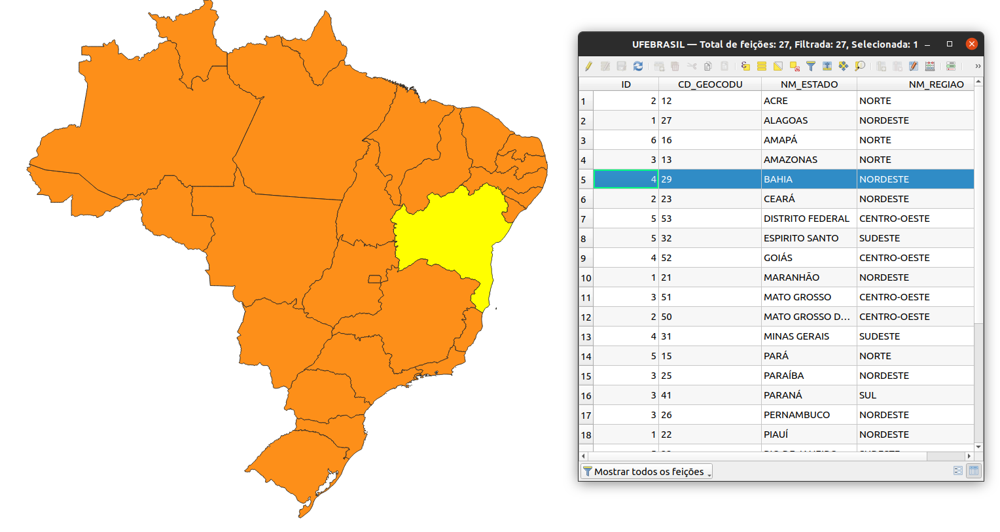

## Módulo 0 - Introdução suave a conceitos de GIS

**Autor**: Ben Hur

### Introdução pedagógica

Este módulo serve como uma introdução suave aos conceitos geográficos necessários para trabalhar com sistemas de informação geográfica (SIG, ou GIS em língua inglesa). Ao final deste módulo, os alunos deverão compreender os seguintes conceitos:

*   projeções cartográficas
*   sistemas de referência de coordenadas
*   formatos de dados espaciais (exemplo: vetores e rasters)
*   componentes e funções de um SIG
*   usos de um SIG
*   exemplos de uso de GIS e outras aplicações geoespaciais

Além disso, este módulo irá também introduzir alguns conceitos chave de softwares livres e de código aberto (Free and Open Source Software, ou FOSS) e softwares livres e de código aberto para aplicações geoespaciais (FOSS4G).

### Ferramentas e recursos necessários

As ferramentas e recursos necessários para este módulo são:

*   computador
*   conexão de internet

### Pré-requisitos

*   conhecimento básico de uso de computadores

### Recursos adicionais

* A Gentle Introduction to GIS - [https://docs.qgis.org/3.16/en/docs/gentle_gis_introduction/index.html](https://docs.qgis.org/3.16/en/docs/gentle_gis_introduction/index.html)
*  QGIS User Guide - [https://docs.qgis.org/3.16/en/docs/user_manual/](https://docs.qgis.org/3.16/en/docs/user_manual/)
* QGIS Training Manual - [https://docs.qgis.org/3.16/en/docs/training_manual/index.html](https://docs.qgis.org/3.16/en/docs/training_manual/index.html)
* QGIS website - [https://qgis.org/en/site/](https://qgis.org/en/site/)
* OSGeo website - [https://www.osgeo.org/](https://www.osgeo.org/)
* OSGeoLive website - [https://live.osgeo.org/en/index.html](https://live.osgeo.org/en/index.html)
* What is free software? - [https://www.gnu.org/philosophy/free-sw.en.html](https://www.gnu.org/philosophy/free-sw.en.html)
* Open source definition - [https://opensource.org/osd](https://opensource.org/osd)

### Introdução temática

Vamos começar com um exemplo:

Você pode ter ouvido a frase “todos os mapas mentem”, ou você viu uma postagem nas redes sociais afirmando que “O mapa mundi que você conheceu a vida inteira está errado!”. Bem, não é que os mapas estejam deliberadamente querendo mentir para você, mas a realidade é que os mapas não têm como te mostrar toda a verdade. Um exemplo disso são os tamanhos relativos dos países.

The True Size Of ("O verdadeiro tamanho de") ([https://thetruesize.com/](https://thetruesize.com/)) é um mapa online (ou aplicativo web) interessante que mostra como os tamanhos relativos dos países são distorcidos em um dos mapas mais comuns que usamos (o mapa que usa a projeção de Mercator). Ele também mostra alguns exemplos de tipos de dados espaciais sobre os quais aprenderemos mais neste módulo. Tente usar esse site para comparar o tamanho do seu país com o de outros.

#### Detalhando os conceitos

Então por que isso acontece? Como você aprenderá neste módulo, é difícil representar a forma tridimensional da Terra em uma folha de papel plana. Para fazer isso, os cartógrafos usam o que é chamado de **projeção cartográfica**, para projetar os pontos da superfície tridimensional da Terra em uma superfície plana. No entanto, ao fazer isso, eles introduzem alguma **distorção**. Essa distorção pode ser de forma, tamanho, direção e distâncias dos objetos representados no mapa. Todos os mapas têm pelo menos uma dessas distorções. Por causa dessa distorção, um mapa nunca pode mostrar toda a verdade sobre a Terra.

No mapa online que usamos, o mapa de fundo que não muda de tamanho (em cinza) é um exemplo de **dados raster**. Os dados raster são representações do mundo baseadas em pixels, semelhantes a como fotografias funcionam. Enquanto isso, a forma dos países que podemos mover são exemplos de **dados vetor, ou vetoriais**. Os dados vetoriais, ao contrário dos rasters, representam o mundo usando objetos discretos (no sentido matemático da palavra), como pontos, linhas e polígonos.

### Conteúdo principal

#### Título da Fase 1: Mapas e Coordenadas

##### Conteúdo / Tutorial

Quando as pessoas pensam na Terra atualmente, elas geralmente imaginam uma massa esférica azul, verde, branca e marrom flutuando no espaço. É por isso que tradicionalmente usamos globos para representar a Terra.

<table>
   <tr>
    <td>
         
         Figura 1. A Bola de Gude Azul (<a href="https://commons.wikimedia.org/wiki/Earth#/media/File:The_Blue_Marble.jpg"> https://commons.wikimedia.org/wiki/Earth#/media/File:The_Blue_Marble.jpg</a>)
    </td>
    <td>
         
         Figura 2. Globo de l'Isle (1765) (<a href="https://commons.wikimedia.org/wiki/Globe#/media/File:3quarter_globe.jpg"> https://commons.wikimedia.org/wiki/Globe#/media/File:3quarter_globe.jpg</a>)
    </td>
   </tr>
</table>

No entanto, embora o globo seja capaz de capturar a maioria das características da Terra, ele possui duas desvantagens principais:

*    Os globos são pesados e difíceis de transportar.
*    Os globos só podem ser usados em pequenas escalas (por exemplo, encontrar locais de países, as posições relativas de cidades, etc.). Eles são praticamente inúteis para atividades que exigem grandes escalas ou detalhes finos (por exemplo, navegação dentro de uma cidade).

É aqui que entram os mapas. Os mapas corrigem essas duas desvantagens dos globos, representando a Terra como uma superfície plana. Ao fazer isso, os mapas se tornam portáteis e adequados para uma infinidade de usos. Dito isso, os mapas também apresentam uma desvantagem própria. Através do processo de conversão de um objeto tridimensional (globo) em um bidimensional (mapa), distorções são geradas, de tal forma que é impossível para um mapa capturar perfeitamente as diferentes características da Terra (ou seja, formas, áreas e direções).

###### Projeções cartográficas

Uma projeção cartográfica é usada para achatar a superfície da Terra (ou de um globo qualquer) em um plano, a fim de criar um mapa. Este processo de transformação gera distorção.

Pense na Terra como uma laranja. Se você descascá-la, poderá deixá-la plana, mas nunca poderá torná-la perfeitamente plana. Você sempre encontrará um dos seguintes problemas:

*   **Alongamento** - o alongamento da casca (ou superfície) em uma ou mais direções
*   **Rasgos** - a divisão ou ruptura da casca (ou superfície)
*   **Compressão** - o encurtamento ou encolhimento da casca (ou superfície)

Por causa desses problemas, cada mapa contém distorção em uma ou mais das seguintes características:

*   **Forma**
*   **Área**
*   **Distância**
*   **Direção**

As projeções cartográficas podem preservar (sem distorção) uma ou mais dessas características, mas nunca todas ao mesmo tempo. Outra opção é balancear e minimizar as distorções para todas as características ao mesmo tempo. Isso se deve à natureza das próprias características.

Características principais como **Forma** e **Área** são **mutuamente excludentes** e não podem ser preservadas simultaneamente. Enquanto isso, as características secundárias **Distância** e **Direção** **não têm como estar corretas em todos os lugares** do mapa.

Ao escolher qual projeção cartográfica usar, é importante que você considere o propósito do mapa. Por exemplo, se deseja realizar análises baseadas em área, é melhor usar uma projeção cartográfica que preserva a área.

Existem várias classificações de projeções cartográficas. A primeira é baseada nas **características que elas preservam**.

*   Projeções de mapa **conforme** ou **ortomórficas** são aquelas que preservam a forma ou a conformidade angular. Estes são comumente usados ​​para fins de navegação ou meteorológicos. As formas são preservadas, mas as áreas são distorcidas. Quanto maior a área, maior a distorção.
*   Projeções de mapa de **equivalente** ou **de igual área** são aquelas que preservam a proporção ou áreas relativas dos objetos no mapa. Nesse tipo de projeção cartográfica, quanto maior a área mapeada, mais precisa ela será.
*   As projeções cartográficas **equidistantes** preservam a distância das linhas que originam em um ou dois pontos no mapa ou têm escala adequada ao longo de uma ou mais linhas.
*   As projeções cartográficas **azimutais** preservam a direção a partir de um ou dois pontos no mapa. São úteis para mapear rotas de aeronaves e embarcações marítimas entre portos.

Uma única projeção cartográfica pode preservar mais de uma característica (por exemplo, uma projeção azimutal equidistante que preserva a direção e as distâncias a partir de um ou dois pontos no mapa), mas nem todas delas, como mostrado na tabela abaixo.

<table>
  <tr>
   <td>
   </td>
   <td><strong>Conforme</strong>
   </td>
   <td><strong>Equivalente</strong>
   </td>
   <td><strong>Equidistante</strong>
   </td>
   <td><strong>Azimutal</strong>
   </td>
  </tr>
  <tr>
   <td>

<strong>Conforme</strong>

   </td>
   <td>-
   </td>
   <td>Não
   </td>
   <td>Não
   </td>
   <td>Sim
   </td>
  </tr>
  <tr>
   <td>

<strong>Equivalente</strong>

   </td>
   <td>Não
   </td>
   <td>-
   </td>
   <td>Não
   </td>
   <td>Sim
   </td>
  </tr>
  <tr>
   <td>

<strong>Equidistante</strong>

   </td>
   <td>Não
   </td>
   <td>Não
   </td>
   <td>-
   </td>
   <td>Sim
   </td>
  </tr>
  <tr>
   <td>

<strong>Azimutal</strong>

   </td>
   <td>Sim
   </td>
   <td>Sim
   </td>
   <td>Sim
   </td>
   <td>-
   </td>
  </tr>
</table>

Tabela: Ambas características podem ser preservadas por um mapa ao mesmo tempo?

Existe outra classificação de projeções cartográficas que não preserva nenhuma das características do mapa, mas tenta minimizar todas as distorções no mapa. Estes são chamados de projeções **Erro Mínimo (Minimum Error, ou Compromise)** (mapas que não preservam a forma nem a área são chamados de **Afiláticos**).

Uma maneira de visualizar a distorção é usando o que é chamado de **indicador de Tissot**. Este indicador caracteriza as distorções locais usando círculos e mostrando como esses círculos são transformados ao longo do mapa.

Figura 3. Projeção conforme com seu índice de Tissot. Os círculos permanecem como círculos por todo o mapa, mas suas áreas aumentam a medida que os círculos se movem do equador em direção aos pólos.

Figura 4. Projeção equivalente com seu índice de Tissot. Os círculos tornam-se elipses, mas suas áreas permanecem as mesmas.

Figura 5. Projeção equidistante com seu índice de Tissot. Observe que as alturas dos círculos são iguais, o que significa que a escala / distâncias ao longo dos meridianos são preservadas.

Figura 6. Projeção azimutal equidistante com seu índice de Tissot. Observe que os círculos estão todos apontando para o centro do mapa e as alturas dos círculos são todas iguais.

Outra maneira de classificar as projeções do mapa é pela **superfície desenvolvível ("developable surface")** usada para criar o mapa. Uma superfície é desenvolvível se ela puder ser planificada sem introduzir distorções. As superfícies mais comumente usadas são: Cilindros (Figura 7), Cones (Figura 8) e Planos (Figura 9).

Figura 7. As projeções cilíndricas têm meridianos (longitude) e paralelos (latitude) encontrando-se em ângulos retos com as distâncias entre os meridianos sendo iguais.

Figura 8. As projeções cônicas têm meridianos retos indo para um ponto nos pólos. Os paralelos são arcos.

Figura 9. As projeções planas (comumente usadas em projeções azimutais) têm meridianos retos semelhantes às projeções cônicas, mas seus paralelos são círculos em vez de arcos.

Existem inúmeras outras superfícies desenvolvíveis que podem ser usadas para transformar um globo em um mapa. Eles podem ser uma variação das superfícies comuns, como no caso de projeções pseudo-cilíndricas e pseudo-cônicas ou podem ser superfícies únicas e diferentes, como no mapa Dymaxion, que usa um icosaedro (poliedro com 20 faces), ou a Projeção de Cahill-Keyes que usa um octaedro (poliedro com 8 faces).

A projeção de um mapa também pode ser classificada de acordo com seu **aspecto** (Figura 10) ou o modo como a superfície desenvolvível está posicionada no globo: Normal, Transversal ou Oblíqua.

Figura 10. Aspectos de uma projeção cartográfica

###### Sistemas de referência de coordenadas

Um **Sistema de Referência de Coordenadas (SRC, ou CRS na sigla em inglês)** é usado para especificar a localização de um objeto na superfície da Terra por meio do uso de coordenadas. SRCs podem ser classificados em dois:

*   **Sistemas de referência de coordenadas geográficas** usam graus de latitude e longitude como coordenadas para se referir à posição.
*   **Sistemas de referência de coordenadas projetadas** usam unidades lineares (por exemplo, metros, pés, quilômetros) de leste e norte como coordenadas.

O conhecimento dos sistemas de referência de coordenadas é importante porque mesmo que dois mapas (ou camadas) mostrem o mesmo local, as coordenadas das localizações nesses mapas serão diferentes se os SRC que eles usam forem diferentes.

**Veja este exemplo:** Mapa A e Mapa B mostram a mesma área e extensão. Eles são basicamente o mesmo mapa. A única diferença é o sistema de referência de coordenadas que eles usam. O Mapa A usa SRC X e o Mapa B usa SRC Y. Digamos que obtivemos a coordenada do Ponto 1, que é (10, 10), do Mapa A. Se olharmos para a coordenada (10,10) no Mapa B, é possível que o Ponto 1 não esteja lá, pois o Mapa B usa um SRC diferente. Ou, se você sobrepor os mapas um ao outro usando uma referência comum, os objetos dos dois mapas não coincidirão. Este conhecimento de sistemas de referência de coordenadas é importante para qualquer tipo de GIS.

As versões do QGIS anteriores à versão 3 tinham a opção de ativar o que é chamado de "OTF" ou "Transformação On-The-Fly (em 'tempo real')". Isso permitia que camadas com diferentes SRC fossem projetadas na tela do mapa como se estivessem no mesmo SRC. Com o QGIS 3 em diante, esta opção é ativada automaticamente como comportamento padrão do QGIS. QGIS também executa esta ação automaticamente para tarefas de processamento. Isso é muito importante porque se as camadas não estiverem no mesmo SRC, os resultados das consultas espaciais e do processamento como junções espaciais, clipes, etc. podem ser comprometidos.

Você pode notar que alguns Sistemas de Referência de Coordenadas são referidos por seu Código EPSG. Este código se refere ao código do SRC no conjunto de dados de parâmetros geodésicos EPSG, que é um registro de dados geodésicos, sistemas de referência espacial, elipsóides terrestres, transformações de coordenadas e unidades de medida relacionadas. A maioria dos GIS, incluindo QGIS, referem-se ao código EPSG para identificar sistemas de referência de coordenadas, projeções e realizar transformações entre esses sistemas.

Alguns códigos EPSG comuns incluem:

*   **EPSG: 4326** - WGS 84, sistema de coordenadas de latitude / longitude baseado no Sistema de Posicionamento Global (GPS) entre outros.
*   **EPSG: 3857** - Projeção Web Mercator usada para exibição por muitas ferramentas de mapeamento baseadas na web, como OpenStreetMap e Google Maps
*   **EPSG: 31973 a EPSG: 31974 e EPSG: 31978 a EPSG: 31985** - Universal Transverse Mercator (UTM) Zonas 19N a 20N, e 18S a 25S. Zonas UTM usadas no Brasil
*   **EPSG: 4674** - Sistema de Referência SIRGAS 2000, utilizado nas Américas a partir do ano 2000

##### Quiz

1. Que tipo de projeção é melhor para os seguintes casos?
    1. um mapa de uso geral que precisa ter uma aparência agradável
    2. um mapa mostrando uma análise de área por unidade entre diferentes locais
    3. um mapa que mostra uma comparação de uma zona de 10 km de raio de diferentes locais
2. Que tipo de sistema de referência de coordenadas (geográfico ou projetado) é melhor utilizado para os seguintes casos?
    4. mostrar a localização de pontos usando GPS
    5. calcular a distância entre dois pontos
3. Verdadeiro ou falso - É possível preservar as seguintes características do mapa juntas em um único mapa:
    6. Área e forma
    7. Distância e direção

#### Título da fase 2: Tipos de dados espaciais

##### Conteúdo / Tutorial

Em sua essência, um Sistema de Informação Geográfica (SIG) deve ser capaz de modelar objetos, informações e fenômenos do mundo real, como limites de lotes, rios, estradas, temperatura, etc. Ele faz isso por meio de modelos de dados espaciais.

Os modelos de dados espaciais são compostos de dois componentes principais que, quando combinados, modelam a realidade. Esses componentes são:

*   **Feições espaciais (ou geometria)**
*   **Atributos**

Existem dois modelos principais de dados espaciais: **raster** e **vetorial**. Embora qualquer objeto do mundo real possa ser representado por qualquer um dos dois modelos de dados, um deles é geralmente melhor para representar certos objetos do mundo real do que o outro.

###### Dados raster

Os dados raster são mais utilizados ​​para representar fenômenos contínuos, como elevação ou temperatura.

Um raster é uma representação de objetos do mundo real composta de linhas e colunas de células ou pixels, no qual cada célula ou pixel representa uma área geográfica (pense em uma fotografia ou imagem). O valor da célula representa o valor de um atributo na referida área geográfica. O tamanho da área depende da resolução espacial do raster.

Rasters são bastante úteis para modelagem de adequação de locais (suitability modelling), pois você pode combinar rasters por meio de operações matemáticas (álgebra de raster).

Figura 12. Um raster consiste em pixels de tamanhos iguais em linhas e colunas.

Um pixel raster pode conter apenas um valor de cada vez. Assim, um raster pode modelar apenas um objeto ou fenômeno por vez.

###### Dados vetoriais

Os dados vetoriais são mais utilizados ​​para representar objetos discretos.

Os dados vetoriais possuem três formas: ponto, linha e polígono. São mais preciso que rasters porque pontos, linhas e polígonos são modelados usando coordenadas bem definidas, tornando-os melhores na representação de objetos discretos do que rasters.

Os vetores são comumente usados ​​quando necessitamos precisão com comprimentos, áreas e distâncias. Eles também são úteis ao realizar análises de rede (por exemplo, encontrar o caminho mais curto um ponto a outro em uma rede de vias).

Figura 13. Um vetor consiste em feições com seus atributos correspondentes.

Comparado aos pixels raster, uma feição vetorial pode conter mais de um valor por vez. Esses valores são armazenados como colunas na tabela de atributos. Cada feição é armazenada como uma linha.

##### Quiz

1. Qual tipo de dado pode representar melhor os seguintes objetos / fenômenos:
    1. estradas
    2. casas
    3. densidade populacional
    4. perigo de inundação

#### Título da Fase 3: Sistema de Informação Geográfica (SIG)

##### Conteúdo / Tutorial

As informações geográficas e de localização tornaram-se onipresentes no século 21 em todos os níveis de granularidade. Temos satélites, aeronaves e até drones comerciais que são capazes de capturar grandes quantidades de dados brutos em grandes áreas por longos períodos de tempo. Existem também sensores que coletam e reúnem informações de localização, como o GPS e outros aplicativos em nossos telefones e dispositivos.

Com todos esses dados à nossa disposição, é fundamental saber gerenciá-los, analisá-los e apresentá-los. É aqui que entram os Sistemas de Informação Geográfica, ou mais comumente conhecidos como SIG, ou GIS.

SIG é uma ferramenta / framework / sistema que nos permite trabalhar com informação geográfica (ou espacial) e sua correspondente informação de atributo (não espacial). Em particular, um GIS deve ser capaz de:

*  **Coletar**, **armazenar**, **editar**, **manipular**, ou em termos mais gerais, **gerenciar** dados espaciais.
* **Analizar** os dados usando seu componente espacial (onde os dados estão) ou atributo (o valor dos dados).
* **Apresentar** os dados e análises como informações significativas por meio de mapas, gráficos, plotagens e outras visualizações.

_SIG não é apenas mapeamento_. Embora a elaboração de mapas seja um dos aspectos mais importantes e comumente conhecidos do SIG, ela ainda é apenas uma parte de seus muitos recursos. Podemos ver a estrutura SIG moderna como sendo composta por:

* **Dados** - referem-se às informações utilizadas pelo SIG que podem ou não conter informações de localização (por exemplo, nomes de lojas, localizações de lojas).
* **Tecnologia** - inclui os componentes de hardware e software de um SIG - as máquinas, instrumentos e computadores com os aplicativos de software usados ​​para fazer o trabalho geoespacial.
* **Métodos e análises** - referem-se à ciência e matemática em SIG, que permitem realizar consultas e cálculos espaciais e não espaciais (de atributos).
* **Visualização** - embora semelhante aos métodos e análises, a visualização pode ser considerada como um componente separado, pois se refere especificamente aos meios pelos quais um SIG representa os dados graficamente. Isso inclui não apenas mapas, embora seja o caso mais comum, mas também tabelas, gráficos, etc.
* **Pessoas** - são as pessoas e / ou grupos de pessoas que estão envolvidas no uso, desenvolvimento, ensino e manutenção de SIG.

Todas as partes da estrutura SIG moderna - dos dados às pessoas - são essenciais para garantir seu sucesso.

##### Perguntas do questionário

1. Verdadeiro ou falso:
    1. Um SIG só pode ser usado com dados geoespaciais.
    2. Um mapa é sempre o resultado ao se usar um SIG.
    3. Aprender SIG é difícil e caro.

#### Título da Fase 4 (adicional): Software Livre e de Código Aberto para uso Geoespacial (FOSS4G)

##### Conteúdo / Tutorial

QGIS é apenas um exemplo de software livre e de código aberto para uso geoespacial (FOSS4G). Outros exemplos de FOSS4G são GRASS, PostGIS, GeoServer, GeoNode, etc. Esses aplicativos FOSS4G são ótimas ferramentas para trabalhar não só porque são confiáveis, mas também porque, sendo gratuitos e de código aberto, têm uma barreira de entrada menor e são altamente personalizáveis para qualquer necessidade. Você pode encontrar uma variedade de softwares geoespaciais gratuitos e de código aberto para cada necessidade e para cada parte do "stack" geoespacial.

")

Figura 14. Uma amostra de stack geoespacial de código aberto (ou FOSS4G) (de Simon Nitz ([https://twitter.com/si_nitz?lang=en](https://twitter.com/si_nitz?lang=en)))

###### Software grátis

__Livre como em liberdade e não apenas grátis.__

Software livre é o software que adere às Quatro Liberdades Essenciais do Software Livre, que são:

1. A liberdade de executar o programa como desejar, para qualquer propósito (liberdade 0).
2. A liberdade de estudar como o programa funciona e alterá-lo para que ele faça o que você deseja (liberdade 1). O acesso ao código-fonte é uma pré-condição para isso.
3. A liberdade de redistribuir cópias para que você possa ajudar outras pessoas (liberdade 2).
4. A liberdade de distribuir cópias de suas versões modificadas para outros (liberdade 3). Ao fazer isso, você pode dar a toda a comunidade a chance de se beneficiar com suas mudanças. O acesso ao código-fonte é uma pré-condição para isso.

###### Código aberto

Softwares de código aberto são aqueles que possuem licenças que permitem uso sem precisar pagar royalties e que permitem a reutilização do software, juntamente com acesso livre ao código-fonte. Por convenção, essas licenças de código aberto são aquelas que estão em conformidade com a definição de código aberto prevista pela Open Source Initiative. O código-fonte aberto não só garante acesso gratuito ao software e código-fonte, mas também a capacidade de redistribuir o software sem custos adicionais.

Por causa da natureza aberta do software de código aberto, ele também é um ótimo modelo de desenvolvimento de software, no qual todos são livres para atualizar, melhorar, modificar e compartilhar suas modificações com a comunidade.

###### OSGeo

Existem muitos softwares geoespaciais de código aberto e, às vezes, a parte mais difícil é saber onde e como começar a trabalhar com esses softwares. Felizmente, a Open Source Geospatial Foundation (OSGeo) ([https://www.osgeo.org/](https://www.osgeo.org/)) existe para ajudar a promover a adoção global de tecnologia geoespacial aberta e apoiar o desenvolvimento dessas tecnologias.

##### Perguntas do questionário

N/D

#### Se você quiser ir mais longe

Se você quiser testar usar aplicativos FOSS4G facilmente, experimente o OSGeoLive ([https://live.osgeo.org/en/index.html](https://live.osgeo.org/en/index.html)) que é uma distribuição Linux (sistema operacional) que vem pré-instalado com QGIS, GRASS e outros aplicativos FOSS4G.

#### Para praticar suas novas habilidades, tente...

N/D

#### Dicas

N/D
