# **Module 9 - Raster processing and analysis**

**Author**: Codrina Ilie

## Pedagogical Introduction

This module is focused on a specific type of geographical data model: raster geodata.

By the end of this module, learners will have the basic understanding of the following concepts:

*   raster data model
*   grid point vs grid cell
*   bands of a raster dataset
*   map algebra 
*   the four resolutions of a raster (spatial, temporal, spectral and radiometric)
*   Resampling
*   Batch processing
*   change detection


## Required Tools and Resources

*   This module has been prepared using [QGIS version 3.16 - Hannover](https://qgis.org/en/site/forusers/download.html)
*   [module9.gpkg](data/module9.gpkg)
    *   Rajshahi_division
*   [High Resolution Settlement Layer](data/HRSL_Rajshahi_Population.tif)
*   [SRTM Digital Elevation Model](data/SRTM_DEM)
*   [Global Land Cover Map 2015-2019](data/Global_Land_Cover_Map)
*   The coordinate reference system used is the Gulshan 303 / Bangladesh Transverse Mercator, EPSG 3106. 

## Prerequisites: 

*   Basic knowledge of operating a computer
*   A robust understanding of modules 0, 1, 2, 6 and 8 of this curriculum. 


## Thematic introduction

## Breakdown of the concepts

### The raster data model

A raster is a regular matrix of values, as in figure 9.1.


Figure 9.1 - A matrix of values

Values can be assigned either to **grid points**, mostly to the centroids, and in this case the raster can be referred to as a lattice. The second option is for the values to be assigned to the whole of the **grid cell** - called pixels (see figure 9.2). For the first case, the raster usually represents a continuous field, such as elevation, temperature, precipitations, chemical concentrations etc. For the second case, when the values are assigned to the entire area of the pixel, the raster usually represents an image - a satellite image, a scanned map, converted vector maps (see Phase 2). It must be noted that this data model is not particularly efficient for networks and other types of data heavily dependent on lines, such as property boundaries. 


Figure 9.2 - On the left side, the values are assigned to centroids. 

On the right, values are assigned to the grid cell area - the pixel. 				


### Rational of raster processing

As in the case of vector data processing, the rationale behind the raster data processing is based on the very same capacity of the geographical information systems to store, process  and represent information of the real world phenomena, just that the way in which this is accomplished differs. Instead of having distinct points, lines and polygons stored as collections of x and y coordinates, we have a matrix of values that drapes over a specific area like a mesh. To have a clearer picture in mind, imagine the temperature maps shown on TV. Temperature is a continuous field, there are no places on the surface of the Earth without temperature, be it positive, negative or 0.

Many operations can be performed on raster datasets, the concept of geoprocessing detailed in module 8 applies here as well. The term used to encompass the operations that can be performed on rasters is _map algebra_. 

**Map algebra** represents a set of primitive operations[^1] in a GIS which allows two or more raster layers of _similar dimensions_ to produce a new raster layer (map) using various operations such as addition, subtraction, comparison etc.  

There are four categories of operations that can be performed on rasters, as follows: 

*   Arithmetic operations: addition, subtraction, multiplication, division.
*   Statistical operations: minimum, maximum, average, median.
*   Relational operations provide comparisons between cells using functions such as greater than, smaller than or equal to.
*   Trigonometric operations: sine, cosine, tangent, arcsine between two or more raster datasets.
*   Exponential and logarithmic operations use exponent and logarithm functions.

For each of these operations, there are algorithms implemented in most GIS environments that allow a user to apply them on her data. In the following, we will also implement some of the most common operations to get a sense of how to work with and what should one expect from this kind of data processing. 

The concept of _similar dimensions_ refers to the characteristics of the raster datasets. That is, the operations detailed above can not be performed with meaningful results on 2 raster datasets with different spatial, temporal or spectral resolutions. In the following, we will very shortly introduce all four resolutions that are relevant for raster imagery.

Remembering what are the 4 types of resolutions of a satellite imagery (raster with values assigned to cell area - pixels): 

1. **Spatial resolution** corresponds to the elementary size of the ground surface measured, it is expressed in units of length and it represents the length of a pixel side (see figure 9.3). For example, as you’ve seen in module 3, the High Resolution Settlement Layer Data has a spatial resolution of 30 meters, i.e. each pixel of the dataset estimates the number of people living within a 30-meter. 

2. **Temporal resolution** is associated with overhead imagery (images acquired by satellites, planes, helicopters, drones) and it corresponds to the period between 2 consecutive images of the exact same point on Earth, taken in the same conditions (as much as possible), such as the same aircraft, same altitude etc. For example, Landsat 8 has a temporal resolution of 16 days, i.e. each point on Earth is revisited by the Landsat 8 satellite each 16 days[^2]. 

3. **Spectral resolution** - the sensors onboard of satellites or airplanes capture electromagnetic radiance coming from all objects on Earth - water, settlements, forests, roads, buildings, bare land etc. - and the sensors are specifically built to capture it at a given known spectral band (or wavelength). The human eye can see a very small part of the electromagnetic spectrum - the visible light (red, green and blue), but sensors can ‘see’ much more! (see figure 9.4)


)](media/fig94.png "Electromagnetic spectrum (photo credit [NASA Science](https://science.nasa.gov/ems/01_intro))")

Figure 9.4 - Electromagnetic spectrum (photo credit NASA Science - [https://science.nasa.gov/ems/01_intro](https://science.nasa.gov/ems/01_intro))

4. **Radiometric resolution** is determined by the number of bits into which the recorded radiation is divided. In 8-bit data, the digital numbers (DN) can range from 0 to 255 for each pixel (28 ¼ 256 total possible numbers). Clearly, more bits means that the sensor can detect more subtle changes in the energy it captures, that leads to a ‘clearer’ image, a  higher radiometric accuracy of the sensor but also requires more space to store the data. 

**Spectral bands**

A raster dataset contains one or more layers called bands. Each band stores another set of information on the area the raster covers. Each band has the exact same extent and coordinates, but not necessarily the same spatial resolution. Also, aside from the values stored, there are other key properties contained, such as: maximum, minimum and mean cell values and _histogram_ of cell values. 

A **histogram** is an approximate representation of the distribution of numerical data (see figure 9.5), in other ways is a manner in which one can get a sense of the data at hand.


Figure 9.5 - Example of a histogram, where x is a raster layer

Why is this important in our context? Because, as mentioned at the beginning, a raster is a matrix of continuous numerical values (remember the temperature example) and a histogram helps the user understand how the values of his rasters are distributed. Each bar groups the cell values that fall in a specific range, higher the bar more cells have values in that specific range. In case, the raster has more than one band, then the histogram will be computed for each one. There are no gaps between the ranges depicted on a histogram, the histogram is used only for continuous data.  


## Main content 

### Phase 1: Understanding your raster data.

In the last two decades, the number of satellites capturing data from Earth has grown exponentially. Furthermore, an open data access policy that has been adopted by different space agencies, such as NASA for the [Landsat program](https://www.usgs.gov/core-science-systems/nli/landsat/landsat-data-access?qt-science_support_page_related_con=0#qt-science_support_page_related_con) or the European Space Agency for the [Copernicus program](https://www.copernicus.eu/en/access-data), has opened the door for an overwhelming stream of Earth Observation data. As a natural consequence, the scientific progress of algorithms, methodologies and the development of more powerful tools to process raster data - especially satellite imagery - has been impressive and extensive in fields such as agriculture, forestry, urban development, humanitarian activities, ocean and sea water monitoring, security and so many more. In the following 3 phases, we will introduce some of the most common processing techniques and what results to expect from them. 


#### **Step 1. Prepare your working environment.** 

We will strat by adding to your QGIS project all the raster datasets that we will be working with, as follows: 

*   High Resolution Settlement Layer Data 
*   Shuttle Radar Topography Mission (SRTM) Digital Elevation Model (DEM)
*   Moderate Dynamic Land Cover: the 5 available epochs 2015, 2016, 2017, 2018 and 2019. 

As the High Resolution Settlement Layer Data has been presented in a previous module, we will also detail information on the other 2 dataset we will employ in this module. 

1. Shuttle Radar Topography Mission (SRTM) Digital Elevation Model (DEM) is a global digital surface model (DSM) dataset with a horizontal resolution of approximately 30 meters (1 arcsec mesh). A DSM includes ground surface, vegetation and man-made objects, such as buildings, bridges etc. as opposed to the digital terrain model (DTM) that considered strictly the terrain. 

2. Dynamic Land Cover Map is a  Copernicus Global Land Service (CGLS) product derived from the PROBA-V 100 m time-series and several other land cover datasets. The product provides primary land cover discrete classes, as well as continuous field layers for all basic land cover classes that provide proportional estimates for vegetation/ground cover for the land cover types. The product has 3 bands: discrete_classification, forest_type and urban_coverfraction. The following 2 tables present the values for each discrete class: 

Tabel 1 Discrete_classification band value table

<table>
  <tr>
   <td><strong>Value</strong>
   </td>
   <td><strong>Color</strong>
   </td>
   <td><strong>Description</strong>
   </td>
  </tr>
  <tr>
   <td>0
   </td>
   <td>282828
   </td>
   <td>Unknown. No or not enough satellite data available.
   </td>
  </tr>
  <tr>
   <td>20
   </td>
   <td>FFBB22
   </td>
   <td>Shrubs. Woody perennial plants with persistent and woody stems and without any defined main stem being less than 5 m tall. The shrub foliage can be either evergreen or deciduous.
   </td>
  </tr>
  <tr>
   <td>30
   </td>
   <td>FFFF4C
   </td>
   <td>Herbaceous vegetation. Plants without persistent stem or shoots above ground and lacking definite firm structure. Tree and shrub cover is less than 10 %.
   </td>
  </tr>
  <tr>
   <td>40
   </td>
   <td>F096FF
   </td>
   <td>Cultivated and managed vegetation / agriculture. Lands covered with temporary crops followed by harvest and a bare soil period (e.g., single and multiple cropping systems). Note that perennial woody crops will be classified as the appropriate forest or shrub land cover type.
   </td>
  </tr>
  <tr>
   <td>50
   </td>
   <td>FA0000
   </td>
   <td>Urban / built up. Land covered by buildings and other man-made structures.
   </td>
  </tr>
  <tr>
   <td>60
   </td>
   <td>B4B4B4
   </td>
   <td>Bare / sparse vegetation. Lands with exposed soil, sand, or rocks and never has more than 10 % vegetated cover during any time of the year.
   </td>
  </tr>
  <tr>
   <td>70
   </td>
   <td>F0F0F0
   </td>
   <td>Snow and ice. Lands under snow or ice cover throughout the year.
   </td>
  </tr>
  <tr>
   <td>80
   </td>
   <td>0032C8
   </td>
   <td>Permanent water bodies. Lakes, reservoirs, and rivers. Can be either fresh or salt-water bodies.
   </td>
  </tr>
  <tr>
   <td>90
   </td>
   <td>0096A0
   </td>
   <td>Herbaceous wetland. Lands with a permanent mixture of water and herbaceous or woody vegetation. The vegetation can be present in either salt, brackish, or fresh water.
   </td>
  </tr>
  <tr>
   <td>100
   </td>
   <td>FAE6A0
   </td>
   <td>Moss and lichen.
   </td>
  </tr>
  <tr>
   <td>111
   </td>
   <td>58481F
   </td>
   <td>Closed forest, evergreen needle leaf. Tree canopy >70 %, almost all needle leaf trees remain green all year. Canopy is never without green foliage.
   </td>
  </tr>
  <tr>
   <td>112
   </td>
   <td>9900
   </td>
   <td>Closed forest, evergreen broad leaf. Tree canopy >70 %, almost all broadleaf trees remain green year round. Canopy is never without green foliage.
   </td>
  </tr>
  <tr>
   <td>113
   </td>
   <td>70663E
   </td>
   <td>Closed forest, deciduous needle leaf. Tree canopy >70 %, consists of seasonal needle leaf tree communities with an annual cycle of leaf-on and leaf-off periods.
   </td>
  </tr>
  <tr>
   <td>114
   </td>
   <td>00CC00
   </td>
   <td>Closed forest, deciduous broad leaf. Tree canopy >70 %, consists of seasonal broadleaf tree communities with an annual cycle of leaf-on and leaf-off periods.
   </td>
  </tr>
  <tr>
   <td>115
   </td>
   <td>4E751F
   </td>
   <td>Closed forest, mixed.
   </td>
  </tr>
  <tr>
   <td>116
   </td>
   <td>7800
   </td>
   <td>Closed forest, not matching any of the other definitions.
   </td>
  </tr>
  <tr>
   <td>121
   </td>
   <td>666000
   </td>
   <td>Open forest, evergreen needle leaf. Top layer- trees 15-70 % and second layer- mixed of shrubs and grassland, almost all needle leaf trees remain green all year. Canopy is never without green foliage.
   </td>
  </tr>
  <tr>
   <td>122
   </td>
   <td>8DB400
   </td>
   <td>Open forest, evergreen broad leaf. Top layer- trees 15-70 % and second layer- mixed of shrubs and grassland, almost all broadleaf trees remain green year round. Canopy is never without green foliage.
   </td>
  </tr>
  <tr>
   <td>123
   </td>
   <td>8D7400
   </td>
   <td>Open forest, deciduous needle leaf. Top layer- trees 15-70 % and second layer- mixed of shrubs and grassland, consists of seasonal needle leaf tree communities with an annual cycle of leaf-on and leaf-off periods.
   </td>
  </tr>
  <tr>
   <td>124
   </td>
   <td>A0DC00
   </td>
   <td>Open forest, deciduous broad leaf. Top layer- trees 15-70 % and second layer- mixed of shrubs and grassland, consists of seasonal broadleaf tree communities with an annual cycle of leaf-on and leaf-off periods.
   </td>
  </tr>
  <tr>
   <td>125
   </td>
   <td>929900
   </td>
   <td>Open forest, mixed.
   </td>
  </tr>
  <tr>
   <td>126
   </td>
   <td>648C00
   </td>
   <td>Open forest, not matching any of the other definitions.
   </td>
  </tr>
  <tr>
   <td>200
   </td>
   <td>80
   </td>
   <td>Oceans, seas. Can be either fresh or salt-water bodies.
   </td>
  </tr>
</table>


Tabel 2 forest_type band value table

<table>
  <tr>
   <td>Value
   </td>
   <td>Color
   </td>
   <td>Description
   </td>
  </tr>
  <tr>
   <td>0
   </td>
   <td>282828
   </td>
   <td>Unknown
   </td>
  </tr>
  <tr>
   <td>1
   </td>
   <td>666000
   </td>
   <td>Evergreen needle leaf
   </td>
  </tr>
  <tr>
   <td>2
   </td>
   <td>9900
   </td>
   <td>Evergreen broad leaf
   </td>
  </tr>
  <tr>
   <td>3
   </td>
   <td>70663E
   </td>
   <td>Deciduous needle leaf
   </td>
  </tr>
  <tr>
   <td>4
   </td>
   <td>A0DC00
   </td>
   <td>Deciduous broad leaf
   </td>
  </tr>
  <tr>
   <td>5
   </td>
   <td>929900
   </td>
   <td>Mix of forest types
   </td>
  </tr>
</table>


To organize your layers better, group them by category, as follows: for the land cover 5 raster layers, make one group named Land Cover (in the Layers Panel, click on the Add Group button ). For the digital surface model, make one group named SRTM DEM. 

Don’t forget to also add the boundary of the working area, division of Rajshahi, which is a vector dataset. 

Your QGIS map window should look like in figure 9.6, maybe in slightly different colors. 


Figure 9.6 - Loaded raster datasets


#### **Step 2. Understand what you are looking at.** 

Next, we will use a series of tools that will allow us to get a sense of the data we are working with. 

After loading all the datasets, we will check the coordinate reference system in which all our datasets are in.  As we know from previous modules, QGIS offers the possibility to reproject all datasets loaded into the project on the fly, however that could lead to geoprocessing issues along the way. Thus, even if all layers are correctly overlaid, as can one say by visual inspection, we will proceed in reprojecting them all in the official coordinate system of our region of interest, Rajshahi division - EPSG: 3106. 

There are several ways to get information on the loaded layers in QGIS, some providing the user with more details than others. For a quick overview of a dataset’s metadata, **double-click the layer and open Properties ‣ Information**.

For layer HRSL_Rajshahi_Population, the information window would look like in figure 9.7. 


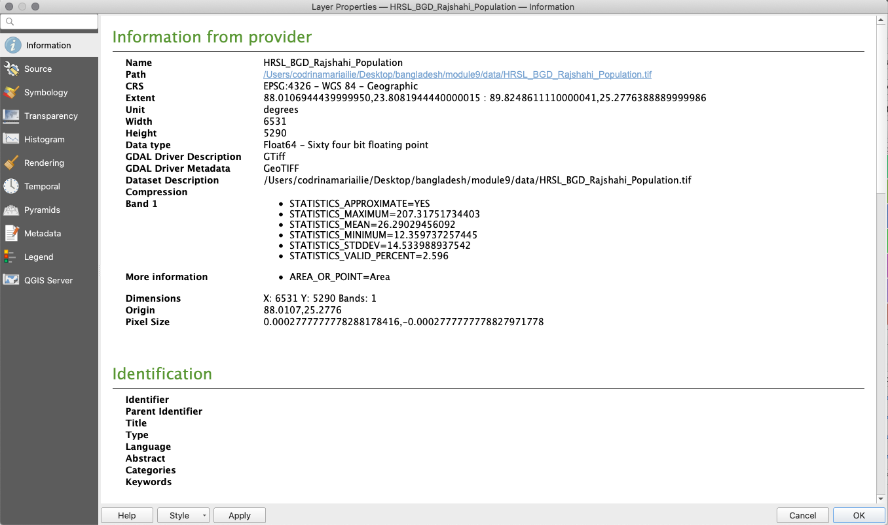

Figure 9.7 - Extracting basic metadata from a raster layer

With regard to our first question on what CRS is being used for the datasets we have loaded, we can observe that even if the HRSL is correctly overlaid, the dataset native’s projection is EPSG 4326 - WGS 84 - Geographic, with units measured in degrees. We also identify that this specific raster layer has only one band, yet the pixel size is difficult to read as the measurement is in degrees and not meters, which would make it easier to understand. 

Thus, the first thing to do is to reproject all datasets we will work with in the same coordinate system - EPSG 3106.

Starting with the HRSL datasets, we go to **Raster ‣ Projections ‣ Warp (Reproject)** (see figure 9.8).


Figure 9.8 - Reproject functionality in QGIS

After selecting the Warp functionality, a new window will appear allowing the user to set the correct parameters (see figure 9.9a). 


 QGIS window")

Figure 9.9a - Warp (reproject) QGIS window

If you selected the output to be **[Save to temporary file]** then there will be a raster layer named `Reprojected` in the Layers Panel. This is a memory layer and you can rename this layer to Reprojected_HRSL_BGD_Rajshahi_Population and save it to make it persistent.


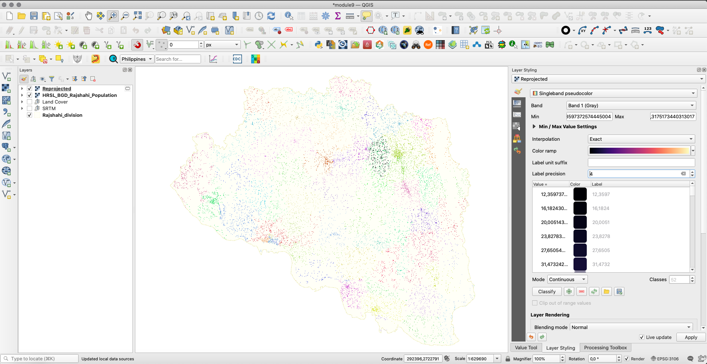

Figure 9.9b - Reprojected HRSL

You will notice that unlike when you reprojected vector datasets, there is a new parameter that you can set “Resampling method to use”. 

**Resampling** represents the interpolation of the cell values so that it transforms the raster as indicated by the user. There are multiple resampling methods available within the warp functionality, each with its own mathematical support. Yet, detailed explanations on each one is not the scope of this exercise. Further reading is available at references. 

In this particular case, we want to reproject population data - numerical values and based on the selected resampling method (nearest neighbour),  the coordinate of each output pixel will be used to calculate a new value from close-by pixel values in the input layer (see figure 9.10). 


Figure 9.10 - Resample method - nearest neighbour (photo credit: ILWIS documentation - [(http://spatial-analyst.net/ILWIS/htm/ilwisapp/resample_functionality.htm](http://spatial-analyst.net/ILWIS/htm/ilwisapp/resample_functionality.htm))

Input pixels are represented by dashed black lines, coordinates of input pixels by black dots; output pixels are represented by red solid lines, coordinates of output pixels by red plus signs. The grey arrows indicate how output values are determined. It can be seen in figure 9.10, some values of the input map may be used twice in the output map, while other input values may not be used at all. That is why, although one of the fastest methods to resample,  it is not appropriate in our case, as we are working with numerical data - population data. This resampling method is suitable for categorical data - such as land cover values. 

To reproject our population raster dataset, we will use the bilinear interpolation method to resample the pixel values (see figure 9.11).


Figure 9.11 - Resample method - bilinear (photo credit: ILWIS documentation - [(http://spatial-analyst.net/ILWIS/htm/ilwisapp/resample_functionality.htm](http://spatial-analyst.net/ILWIS/htm/ilwisapp/resample_functionality.htm))

The bilinear method determines the new value of a cell based on a weighted distance average of the four nearest input cell centers. It is useful for continuous data and will cause some smoothing of the data. 

We proceed in checking the CRS of the 5 land cover datasets that we have loaded into our QGIS project. Accessing **Layer properties ‣ information**, we can see that all 5 land cover layers are projected in EPSG:3857 - WGS 84 / Pseudo-Mercator. One solution would be to use the Reproject tool and configure for each layer individually. Yet, a faster way is to use the reproject functionality running as a **batch process**.

**Batch processing** is the ability of running repetitive processes on data, with minimum user interaction. Most QGIS functionalities have this option available and it can be activated in the process window by clicking the **Run Batch Process** button  and switching to the Run batch process tab (see figure 9.12). 


Figure 9.12 - Batch processing tab on a QGIS functionality window


For the 5 land cover raster layers, we will use the batch processing and as resample method nearest neighbour. To add a new layer, click on the + pictogram. To automatically fill the CRS and resampling method parameters, click on autofill button on top of the corresponding columns and select `Fill down`. Rename the reprojected rasters by adding the EPSG code at the end of the name, for example LandCover2015, will become landCover2015_3106. Set your parameters as in figure 9.13: source CRS: EPSG: 3857, target CRS EPSG 3106, resampling method to use: nearest neighbour (we explained in the paragraph above why), nodata value for output bands: 255 (from the information window, we see the data type - yte - 8bit unsigned integer - which means that the maximum value can be 255), output resolution:100 m (as the initial land cover rasters). After setting all parameters, check the box in the left corner of the window - **Load layers on completion** and click **Run**. 


Figure 9.13a - Batch processing to reproject the land cover rasters


Figure 9.13b - Autofill output names


Figure 9.13c - Reprojected land cover rasters

Next comes the digital surface model rasters. As one can observe, to cover our region of interest, we needed several _raster tiles_. When raster files become too large - imagine one single DSM file at 30 m for Europe which has over 10 million square kilometers - they are splitted into **tiles** because, in smaller areas, they are more easily manageable. 

Although we could use the wrap tool in batch mode to reproject all the DSM raster files, at a visual inspection, one can also notice that the delimitations between each tile is fairly visible, making it, at least, visually unattractive. What would be useful is to have a complete overview of the terrain, as a continuous phenomena - as it is, in fact - without artificial disruptions. To obtain that, we will use the GDAL merge tool, available in the Processing toolbar to merge all DSM rasters together. To open it, go to **Processing ‣ Toolbox** and in the search bar write **Merge** (see figure 9.14). Alternatively, you can search for Merge in the Locator Bar.


Figure 9.14 - Finding the GDAL merge tool in the Processing Toolbox 

In the merge window that opens, select the DSM raster files that we want to mosaic and click run. The result should look like in figure 9.15c. 


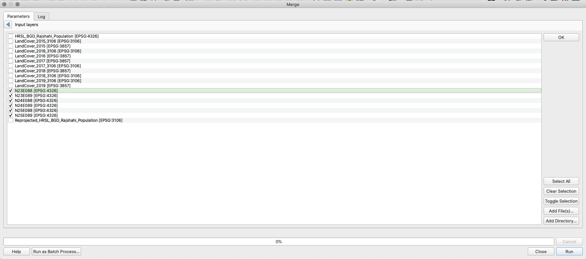

Figure 9.15a - Selecting the SRTM layers to merge


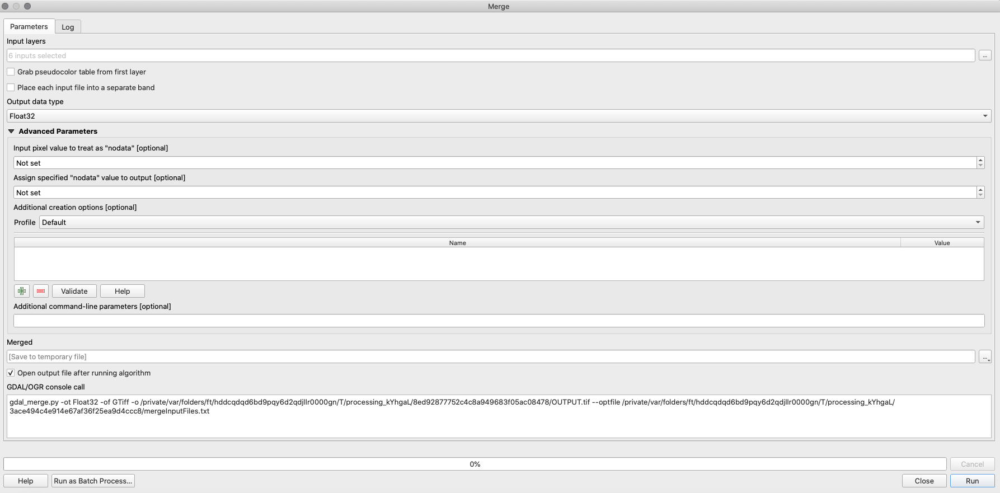

Figure 9.15b - Parameters of the Merge processing algorithm


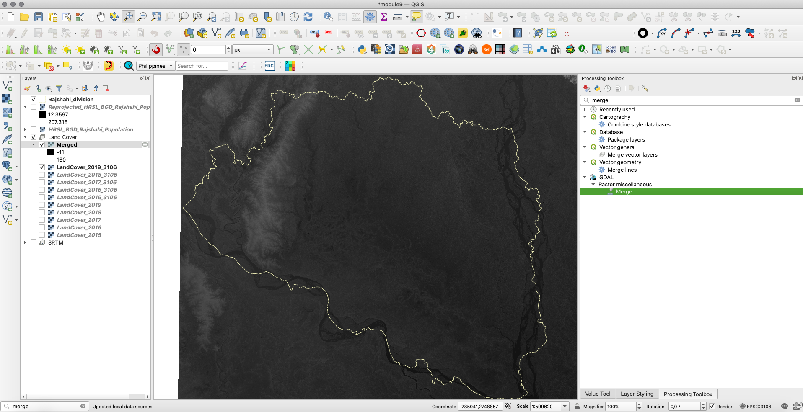

Figure 9.15c - Mosaic of all DSM files corresponding to our work region


Now, we can proceed to reprojecting the mosaic - one file, instead of 6 files. Go to **Raster ‣ projection ‣ Wrap (reproject)** and set the known parameters: 

   * Source CRS EPSG 4326
   * Target CRS: EPSG:3106 
   * Resampling method: Nearest neighbour
   * Output file resolution - 30 m. 

At his point, we should have all layers in the same CRS - EPSG 3106. 


Figure 9.15d - Reproject Merged raster


We can do another check to make sure that all rasters we are working with are projected as well as getting any additional information on the data by running a batch process of Raster Information on all. To open the functionality window, go to **Raster ‣ Miscellaneous ‣ Raster Information**. Your batch processing raster information window should look as in figure 9.16. 


Figure 9.16 - Batch process to extract information in a separate HTML file for multiple raster layers

A raster information HTML file should look like below. A HTML file can be open with any text editor or web browser of your choice. 


```
        Driver: GTiff/GeoTIFF
Files: /Users/codrinamariailie/Desktop/bangladesh/module9/data/SRTM_3106.tif
Size is 6835, 11125
Coordinate System is:
PROJCRS["Gulshan 303 / Bangladesh Transverse Mercator",
    BASEGEOGCRS["Gulshan 303",
        DATUM["Gulshan 303",
            ELLIPSOID["Everest 1830 (1937 Adjustment)",6377276.345,300.8017,
                LENGTHUNIT["metre",1]]],
        PRIMEM["Greenwich",0,
            ANGLEUNIT["degree",0.0174532925199433]],
        ID["EPSG",4682]],
    CONVERSION["Bangladesh Transverse Mercator",
        METHOD["Transverse Mercator",
            ID["EPSG",9807]],
        PARAMETER["Latitude of natural origin",0,
            ANGLEUNIT["degree",0.0174532925199433],
            ID["EPSG",8801]],
        PARAMETER["Longitude of natural origin",90,
            ANGLEUNIT["degree",0.0174532925199433],
            ID["EPSG",8802]],
        PARAMETER["Scale factor at natural origin",0.9996,
            SCALEUNIT["unity",1],
            ID["EPSG",8805]],
        PARAMETER["False easting",500000,
            LENGTHUNIT["metre",1],
            ID["EPSG",8806]],
        PARAMETER["False northing",0,
            LENGTHUNIT["metre",1],
            ID["EPSG",8807]]],
    CS[Cartesian,2],
        AXIS["(E)",east,
            ORDER[1],
            LENGTHUNIT["metre",1]],
        AXIS["(N)",north,
            ORDER[2],
            LENGTHUNIT["metre",1]],
    USAGE[
        SCOPE["unknown"],
        AREA["Bangladesh"],
        BBOX[18.56,88.01,26.64,92.67]],
    ID["EPSG",3106]]
Data axis to CRS axis mapping: 1,2
Origin = (295249.772100000001956,2876965.559799999929965)
Pixel Size = (30.000000000000000,-30.000000000000000)
Metadata:
  AREA_OR_POINT=Area
Image Structure Metadata:
  INTERLEAVE=BAND
Corner Coordinates:
Upper Left  (  295249.772, 2876965.560) ( 87d57'14.69"E, 25d59'57.38"N)
Lower Left  (  295249.772, 2543215.560) ( 88d 0' 8.21"E, 22d59'11.58"N)
Upper Right (  500299.772, 2876965.560) ( 90d 0'10.79"E, 26d 0'49.49"N)
Lower Right (  500299.772, 2543215.560) ( 90d 0'10.53"E, 22d59'56.93"N)
Center      (  397774.772, 2710090.560) ( 88d59'27.15"E, 24d30'11.60"N)
Band 1 Block=6835x1 Type=Float32, ColorInterp=Gray
    Computed Min/Max=-37.000,163.000
  Minimum=-37.000, Maximum=163.000, Mean=20.340, StdDev=11.396
  Metadata:
    STATISTICS_MAXIMUM=163
    STATISTICS_MEAN=20.33998464611
    STATISTICS_MINIMUM=-37
    STATISTICS_STDDEV=11.395520725269
    STATISTICS_VALID_PERCENT=100
```


After preparing the rasters by reprojecting them into the CRS we are working with and reading their metadata to better understand the files, it is time to delve in the actual data. To achieve that, we will calculate and interpret the histograms (see Breakdown of concepts section for details) of our rasters. 

To calculate a histogram, select the raster layer you are interested in, open by double clicking the `Properties` dialog window and go to `Histogram` (see figure 9.17). 


Figure 9.17 - Histogram window

Hit the `Compute histogram` button and QIS quill automatically compute it. 

After computing the histogram, we can see that the mouse turns into a loupe. It is a tool that allows inspection of the histogram, seeing how the frequency of different value ranges. Zooming in and you can see something like in figure 9.18. 

To go back to full view, click left. 


Figure 9.18 - Zooming in on the DSM_mosaic_3106 computed histogram

More than just seeing the distribution of the numerical values of the pixels, the histogram allows the user to reclassify the values for visualisation of the raster. To do that use the 2 tools to pinpoint on the histogram the new min and max values (see figure 9.19). 


Figure 9.19 - Selecting min and max values to reclassify the raster

After pressing apply, the raster will be represented using the new selected min-max range. This functionality allows the user to ignore extreme values that can stretch ab-normally the raster. 

Even though the next tool we use is a plugin (see module 1 for plugin details), we consider it very useful in starting working with raster. We are referring to the **Value Tool** that allows immediate identification of cell values by hovering over raster layers. 

Go to **Plugin ‣ Manage and Install Plugins** and search for the **Value Tool** plugin and click install. Afterwards, right click on the QGIS main window bar to open all available Panels and Toolbars in your QGIS installation and select the **Value Tool panel**. Check your QGIS interface to see where it opened.


Figure 9.20 - The Value Tool Panel

The practicality of this tool resides in its simplicity of use, with just a few clicks, one can very easily extract value cells in the exact areas of interest. Furthermore, it allows this for all loaded raster layers. 

The Value Tool has 3 tabs: Table, Graph, Options (see figure 9.21).


Figure 9.21 - Loaded value tool - highlight on first tab - Table

The first tab - Table - presents a list of all loaded raster layers and the values of cells, as the user moves the mouse. There is also the possibility of selecting with how many decimals the values should be displayed. If the mouse is hovered outside a raster layer extent, instead of a value, a message will be displayed: “out of extent”. 

The second tab - Graph - displays in a united graph all values it reads at the position of the mouse. It allows the user to insert values for min and max on the Y axis - that is the axis of cell values. The X axis lists all bands of the raster it displays in the tabel, with the corresponding order numbers: the band that has number 1 in first tab, will also be number 1 in the graph. 

The third tab allows the user to customize what the `Value Tool` displays: what layers (all, only the visible ones or the selected ones) and which bands to show. 


#### **Quiz questions**

1. Can raster layers be reprojected in other coordinate systems?
*   _Yes._
*   No.
2. Can there be any gaps between the value ranges of a histogram computed for a raster layer?
*   Yes. 
*   _No._
3. Can different bands of the same raster dataset have different resolutions? 
*   _Yes._ 
*   No. 


### Phase 2: Intro to working with raster data

Now that we’ve learned how to extract basic information on the loaded raster datasets, we will continue with a more in-depth raster data processing in order to obtain new derived rasters and, in consequence, more information.

As you may have noticed, due to the raster data model structure, the layers we have loaded are expanding over our region of interest - Rajshahi division. That is undesirable due to several reasons but mainly because you end up processing more data than you actually need, which translates in bigger storage and computer processing needs. That is why, before moving forward to any other steps, we will make sure that we process exactly as much data as we need. **Be aware** as you will start working on your own datasets, that the size of your files is an important factor when it comes to processing times. The bigger the files, more time will be required. Because of the model data structure - raster vs vector - raster files are usually much larger. 

As you have noticed by now, the datasets we load into a GIS - in our case into QGIS - can be processed together even if they are of different nature, such as joining csv tables to vector layers to add information to geometries. The same applies to raster and vector data, as we will see. 

To work only with raster layers that are relevant to our Rajshahi division, we will use the vector extent layer (Rajshahi_division) to cut/clip all relevant raster layers. Go to **Raster ‣ Extraction ‣ Clip Raster by Mask Layer** (see figure 9.22). Similarly, you can search for Clip in the Processing Toolbar or the Locator bar.


Figure 9.22 - Using a vector mask to extract the raster data on a specific region

Given that we will work with 7 raster layers - the 5 Land Cover layers - the digital surface model and the HRSLl, we will use Batch processing to clip all layers at once. **Be aware,** if you have skipped the reprojecting step you have layers in different projections and the algorithm will either not work or produce unexpected results. 

Your batch processing window setup should look like in figure 9.23. 


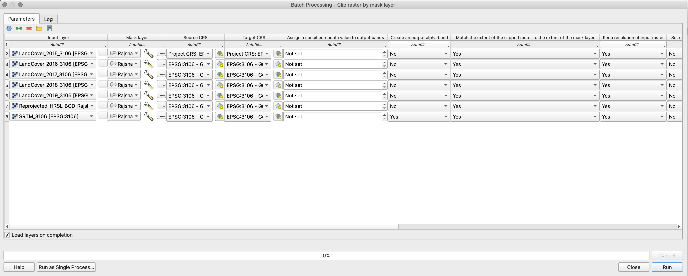

Figure 9.23 - Batch process cliping all required raster layers by Rajshahi division geometry

The parameters setup are the following:
* mask layer: Rajshahi_division
* both source and target CRS is EPSG 3106
* select yes to: `match the extent of the clipped raster to the mask layer` and `keep resolution of input layer`. 
* Be aware, for the DSM_mosaic we will also select yes` to create an output alpha band`. Load layers at completion. 

If everything went smoothly, your QGIS main window should look like in figure 9.24. 


Figure 9.24 - Raster layers clipped by Rajshahi division contour.  

Now, imagine that you have to present a report on where most people are living but with consideration to the altitude[^4]. You must know how many people live between 0 and 20 m altitude in the Rajshahi division. There are a few elements to consider. Firstly, what is the data we will use and what are its characteristics. For population, we have the High Resolution Settlement Layer Data and for relief, we have the ALOS World 3D - 30m (AW3D30). Both raster layers have a spatial resolution of 30m, which allows us to proceed to other considerations. Relief is a continuous phenomena, the spread of the population is not, yet the report would make no sense to be done by the 30m pixel. We need to identify all the pixels with cell values from 0 to 20. Considering the histogram of the SRTM_3106 for our region of interest, we’ve seen that most cell values are between -28 and 50m. We can proceed to making a basic relief map based on the following divisions: 

1. -28 - 0m
2. 0 - 5m
3. 5 - 10m
4. 15 - 15m
5. 20 - 20m
6. 50 - 50m

Using your knowledge acquired in module 4, you can style the DSM layer by these categories. Your map should look like in figure 9.25.


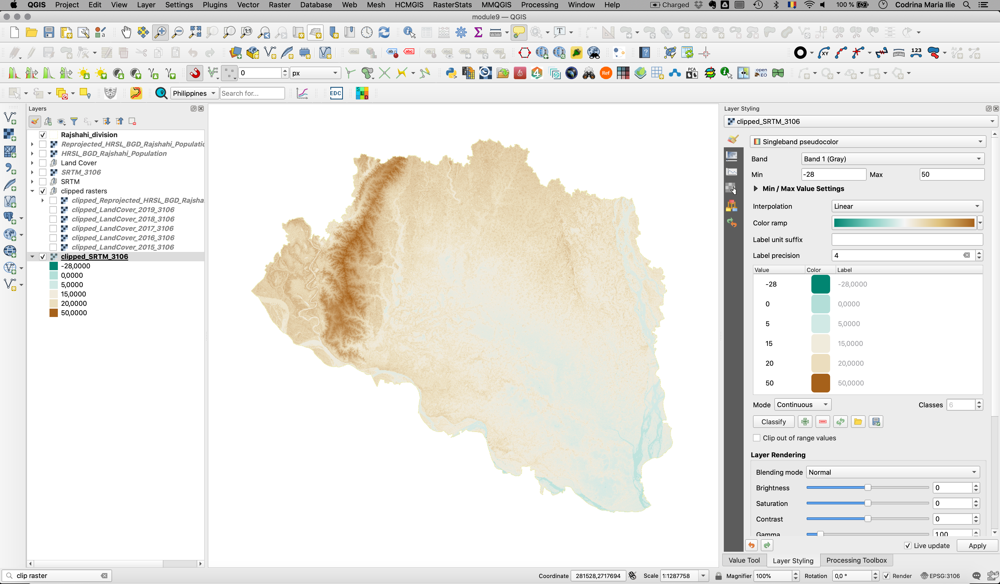

Figure 9.25 - clipped_SRTM_3106 representation

In order to calculate the number of people based on the raster data HRSL that live up to 20 meters in Rajshahi division, we must see which pixels fall in each of those categories. To do that, we will use **Raster Calculator**. This is a functionality allowing the user to perform calculations on the basis of existing raster pixel values. The results are written to a new raster layer in a GDAL[^5]-supported format.

There are several ways to open the raster calclulator in QGIS. You can do so from the Menu bar **Raster ‣ Raster Calculator** or by searching raster calculator on the Processing Toolbox or Locator bar. If we run the Raster Calculator under Raster analysis in the Processing Toolbox, the window in Figure 9.26b should appear. 


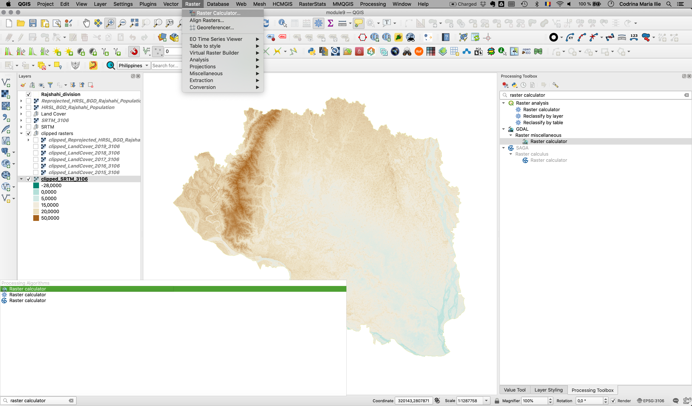

Figure 9.26a - Opening the Raster calculator


Figure 9.26b - Raster calculator

In this window, we can recognize the operations detailed in the Concepts section, substractions, additions, comparisons and all the others (see page 3). **clipped_SRTM_3106@1** The naming convention for the rasters can be observed: what comes before the @ is the name of the raster layer, what comes after the @ is the number of the band.


Next, we will ‘slice’ our clipped_SRTM_3106 raster layer to extract only the pixels with values up to 20 meters. We know that the value cells of the clipped_SRTM_3106 represent a continuous numerical data (not discrete values, such as LandCover). Therefore, the operation we need to employ in this case is a comparison one - cell values <= 20 meters. To obtain this, we will write the following the Raster Calculator: 

```
"clipped_SRTM_3106@1" <= 20
``` 

Set the **Reference layer** as **Clipped_Reprojected_Merged_SRTM@1**. Your Raster Calculator should look like in figure 9.27.


Figure 9.27 - Inserting a formula into the Raster Calculator. 

Your result should look like in figure 9.28. 


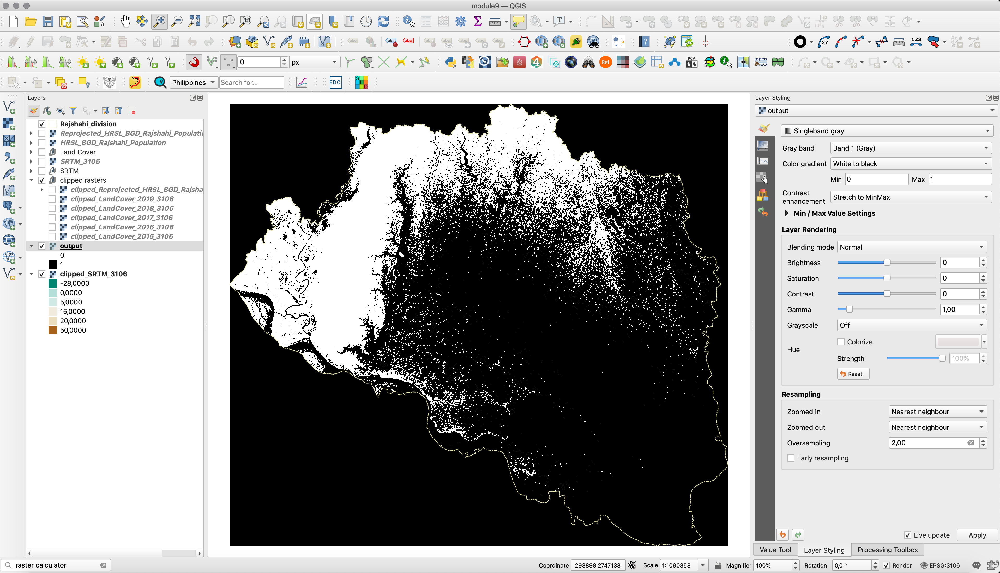

Figure 9.28 - Result of identify all pixel values that are below 200 meters using the Raster Calculator

The result will be named `Output`. You can rename this to `< 20`. As we can see in the Layers Panel, the raster layer we have obtained has only 2 values 0 and 1. That is because we have used a rational operation, a comparison, therefore every pixel that is below 20 meters received value = 1 and all above, value = 0. We can test this by using the `Value Tool`. Figure 9.29 presents only pixels of value 1, in other words the pixels we are interested in for our exercise. 


Figure 9.29 - Spatial distribution of all pixels of value 1, meaning with altitude lower than 20 meters 

Going further, we can show the spatial distribution of population at the 30 m spatial resolution only in this specific geographical region, we’ve selected - Rajshahi division, below 20m. To do that, we again employ Raster Calculator. 

The formula is fairly simple, given that all SRTM cell values we are interested in have value 1. 

Open the Calculator and insert the following formula: 

```
output@1" * "clipped_Reprojected_HRSL_BGD_Rajshahi_Population@1"
```


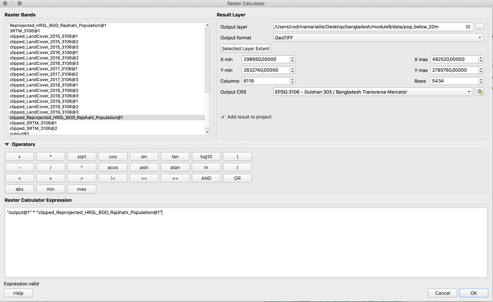

Figure 9.30 - Using raster calculator to identify population distribution classes based on altitude of up to 200m

As opposed to previous raster calculator use, we have used 2 different raster datasets to obtain the desired result, yet you will observe that even if there are pixels that fall outside the DMS_clipped200.tif in the result, their value is 0. Use Value Tool to check (see figure 9.31). 


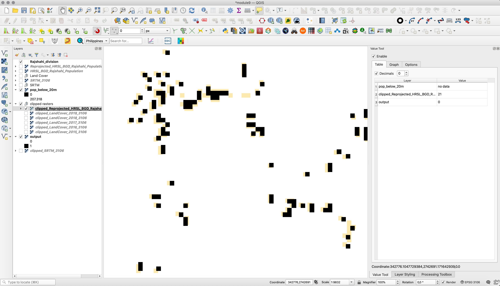

Figure 9.31 - Using Value Tool to check results of Raster Calculator

You can see that even if Reprojected_HRSL_Rajshahi_Population has values in this specific mouse location, the raster obtained with Raster Calculator HRSL_DSM has value 0. 

Next, we present the spatial distribution of the population that lives below 20m in Rajshahi division. To choose an appropriate classification, we calculate the histogram. We can notice that most values are between 0.1 and 50 people per 30m. The classification we’ve chosen is visible in figure 9.32. 


Figure 9.32 - Distribution of population that lives below 20m in Rajshahi division, represented at a 30m resolution. 

If we are interested in the total number of people living below 20m in Rajshahi division and not the geographical distribution per 30 m spatial resolution, then we need to sum up all pixel values of the raster layer output. One way to obtain this number is to transform the output from raster to vector and them [....]

To do that go to **Raster ‣ Conversion ‣ Polygonize (Raster to Vector)** (see figure 9.33a). 


Figure 9.33a - Raster to vector conversion

Remember that this raster layer had only 2 values - 0 and 1, so choose as the parameter by which to construct the vector the DN (digital number). 


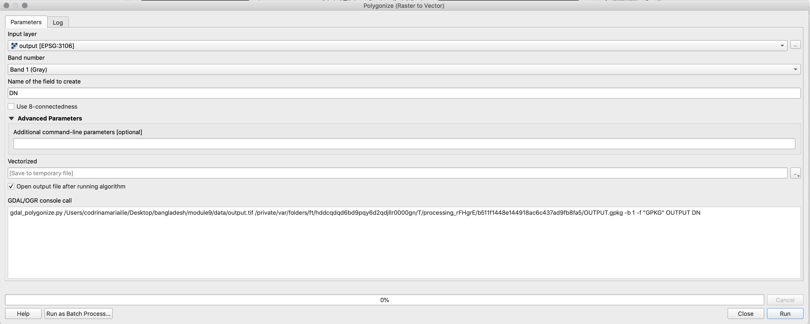

Figure 9.33b - Raster to vector conversion parameters

Note that it's possible that you will have multiple features in the vectorized layer instead of just 2. In order to just have 2 features, you can run the **Dissolve** algorithm and choose **DN** as the Dissolve Field. This will result in having just 2 features in the layer. Also, don't forget to fix invalide geometries using the **Fix invalid geometries** algorithm if you encounter some geometry issues. Your result should look like in figure 9.34. 


Figure 9.34 -  Result of converting a raster dataset to a vector dataset. 

Delete the geometry of value 0. 

To find our answer we will use **Zonal Statistics**. To quickly find this functionality, open the Processing Toolbox and type in the search box “zonal” (see figure 9.35).


Figure 9.35 - Identifying Zonal Statistics in the Processing Toolbox

In the window that has opened, select the parameters like in figure 9.36. As statistics calculated, select: count, sum, min and max. 


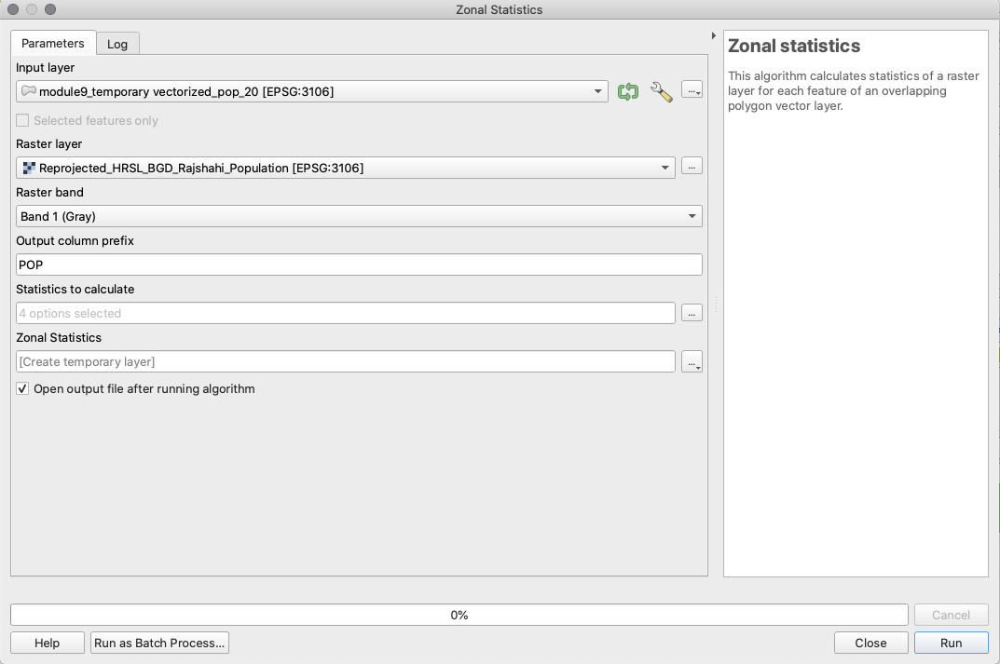

Figure 9.36 - Setting the parameters for Zonal Statistics

The resulting layer is a vector layer that has as attributes the statistics that we have selected (see figure 9.37). 


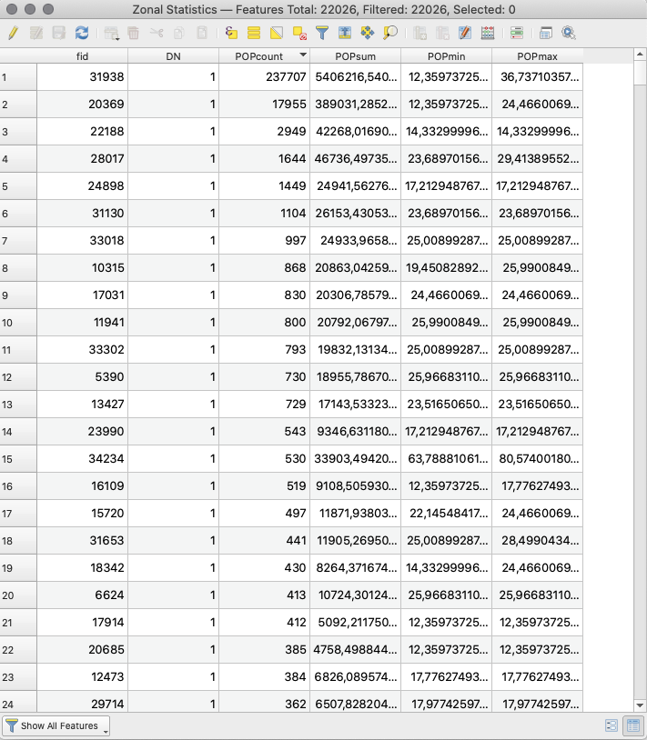

Figure 9.37 - Resulting vector layer of Zonal Statistics

And with this final step, we answered our exercise, how many people (and where) are living below 20m in Rajshahi division. 


#### **Quiz questions**

1. Can raster data be clipped? 
*   _<span style="text-decoration:underline;">Yes</span>._
*   _No._
2. Can one use vector datasets loaded in the QGIS project in Raster Calculator?
*   _Yes._
*   _<span style="text-decoration:underline;">No.</span>_
3. Can raster datasets be converted to vector datasets?
*   _<span style="text-decoration:underline;">Yes</span>._
*   _No._


### **Phase 3: Working with raster and vector data.**

In the previous phase, we have seen how we can process 2 raster datasets in order to derive new information. We have used the digital surface model and the High Resolution Settlement Layer to find out how many people live below 20m in Rajshahi division. Before doing any analysis, we made sure that the datasets were in the same projection and, furthermore if the rasters have the same spatial resolution so that the results we obtained are viable. When referring to the coordinate reference system, the reasoning is clear, but why the same spatial resolution? 

Remembering spatial resolution, it is the size of the ground surface measured in units of length, in other words, the size of the pixel measured on ground. If a raster has a 30m resolution, that means that the smallest linear object we could detect on that image is of 30 m, any smaller and we could not detect it. Continuing the analogy, we can compare it with the scale of a map. If a map has a scale of 1:25000, that means that 1 unit of length on the map represents 25000 units on the ground, that is 1 cm is 25000cm, 1 cm on the map equals 250m on the ground. For example, a 2km road would have 8 cm on the map.

Why is that important when working with raster datasets? Figure 9.38 might offer an explanation.


Figure 9.38 - Example of different resolutions specific to different satellite imagery - Landsat and SPOT -  for the same area 

_(Photo credit: Congedo,  L.  and  Munafò,  M, (2013) Assessment  of  Land  Cover  Change  Using Remote  Sensing:  Objectives,  Methods  and  Results, Rome:  Sapienza  University.  Available  at:
http://www.planning4adaptation.eu/_

Figure 9.38 details the relation between the resolution of the satellite imagery and the land cover information extracted from these images captured. Remember as we detailed at the beginning that the value of the pixel cell is attributed to the entire area it covers, yet that does not mean that is the reality on the ground. These represent decisions made by the EO experts that derive various products based on Earth Observation imagery - all documented in peer-reviewed papers and algorithm descriptions. Further explanations are beyond the scope of this module, but it is important to keep in mind the relation between what a sensor onboard a satellite captures and the products we use. 

Coming back to our region of interest - Rajshahi division - we can test these differences with the data that we have at hand. We have loaded into our QGIS project the 5 raster layers of LandCover for 5 years: 2015, 2016, 2017, 2018 and 2019. Next, we will load a mosaic of Sentinel-2[^6] imagery. We will load the WMS layer EOX Sentinel-2 cloudless, available [here](https://s2maps.eu/). Remembering from module 2, to add a WMS layer, go to **Layer ‣ Add layer ‣ Add WM/WMTS Layer..**

When the add window opens, use the following parameters:
```
Name: EOX Sentinel-2
URL: https://tiles.maps.eox.at/wms?service=wms&request=getcapabilities
```


Figure 9.39 - Adding a WMS layer to QGIS 

After connecting to the newly WMS layer added, we will load the layer named Sentinel-2 cloudless layer for 2019 by EOX - 4326 into QGIS. After zooming to the region of interest extent, your map window should look like in figure 9.40. 


Figure 9.40  - Sentinel-2 cloudless layer for 2019 by EOX - 4326 for Rajshahi division

Although the LandCover products have been obtained using other satellite data (Proba-V), let us compare the 2 layers so we can get a sense of what different resolutions mean. Remember that the LandCover product is at 100m and Sentinel 2 imagery is at 10m. To accomplish that, we will open the ClippedLandCover 2019 and the WMS layer. To make comparisons between 2 layers, we will use a new plugin that you must install. Therefore, go to **Plugins ‣ manage and install plugins** and write in the search box `MapSwipe Tool`. Once you install it, it should appear as a new pictogram in your toolbar (). 


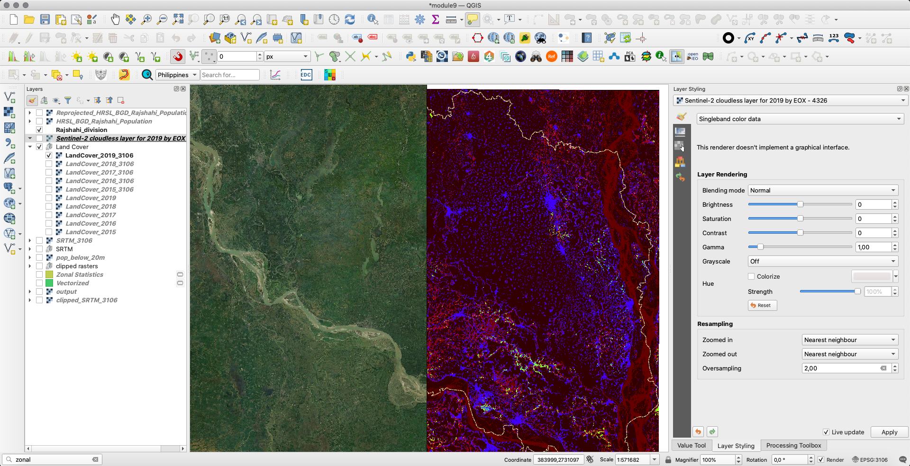

Figure 9.41 - Comparing 2 raster layers using MapSwipe Tool plugin 

To activate the MapSwipe tool, click on it while the raster layer you want to drape is selected in the Layers Panel. The resolution differences are obvious, as well as the fact that the satellite product (Land Cover) has been developed using a satellite image (PROBA-V) of a coarser resolution. However, the general larger classes are well identified, as can be seen in figure 9.42. 


 on top of Sentinel 2 mosaic (30m)")

Figure 9.42 - LandCover2019 obtained from PROBA-V(100m) on top of Sentinel 2 mosaic (30m)

Adding the HRSL to the map, will show a good match between HRSL and the LandCover. The urban space is depicted in red and, as you can see in figure 9.43, it is almost completely covered by the HRSL layer. 


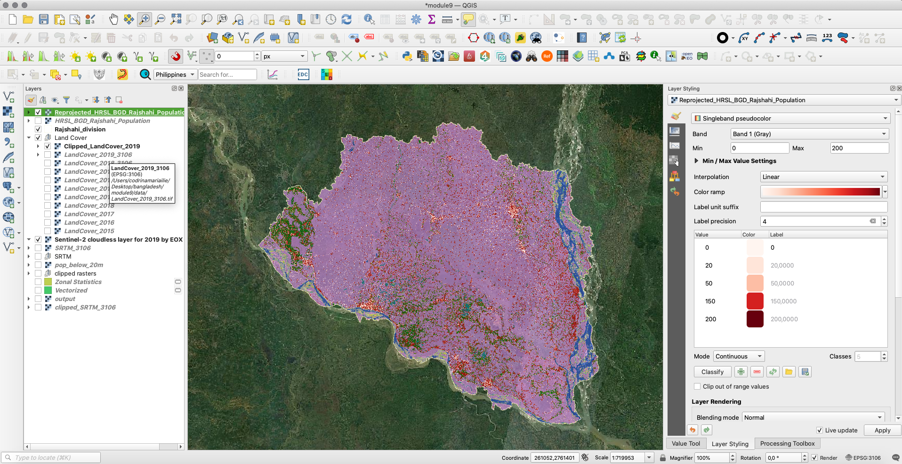

Figure 9.43 - HRSL added on top of the Clipped_LandCover 2019.

However, zooming in you can see the difference in resolution between the 2 raster products, as in figure 9.44. 


Figure 9.44 - Difference in spatial resolution between HRSL (30m - pinkish) and the Clipped_LandCover 2019 (100m - red and green colours)

Now, if any analysis would be made using these rasters, these results would not be viable, because we would be comparing values that apply to different resolutions. As a preprocessing phase, the user must _resample_ one of the 2 to match. 

**Resampling** refers to changing the cell values due to changes in the raster cell grid and there are only 2 options: (1) **upsampling** refers to cases where we are converting to higher resolution/smaller cells and (2) **downsampling** is resampling to lower resolution/larger cell sizes. 

Let us imagine the following exercise. We need to identify the population numbers for each category of land cover we have defined in the Rajshahi division. As explained above, we need to _pre-process_ the data we have in order to get viable results from our analysis, i.e. in our case, we need to bring both our raster datasets to the same spatial resolution. As detailed above, we can either increase or decrease the pixels’ dimensions. It must be highlighted that resample, with up or downscale, will involve an interpolation process (see page 12 for more details) - so the result introduces a statistical error. The usual practice is to resample all rasters to correspond to the raster with the lower resolution, but again this decision must be taken with consideration to all factors. Detailing the decision making process for resampling raster layers far exceeds the scope of this curriculum. 

A difference between the 2 products must be highlighted: the LandCover product covers the **entire area** of the considered extent, as opposed to the HSRL product, where the raster layer contains strictly the cell where values above 0 exist. This situation poses issues when interpolation cell values to resample, because no matter the interpolation method chosen, that would take into consideration the surrounding pixels, following a specific well-defined algorithm and in this particular situation, the edge pixels are not at the edge of the study region, but within it. Therefore, in our demonstrative case, we will consider upsampling the Land Cover product from 100m to 30m resolution to match the LandCover product resolution. The resampling method we choose is crucial, as results can vary significantly. For the purpose of demonstration, we will resample the LandCover product using 2 different methods - Nearest Neighbour and Mode. 

To resample, go to **Raster ‣ Projections ‣ Wrap (reproject).** In the functionality window set the following parameters: 
* input layer: ClippedLandCover 2019, 
* Source CRS and Target CRS: EPSG: 3106, 
* Resampling method: Nearest Neighbour, 
* No data: 255, output file resolution: 30, 
* Output data type: use input layer data type, 
* georeference extent: select the ClippedLandCover 2019 layer. 

Save the output layer as LC2019_NearestNeighbour. 


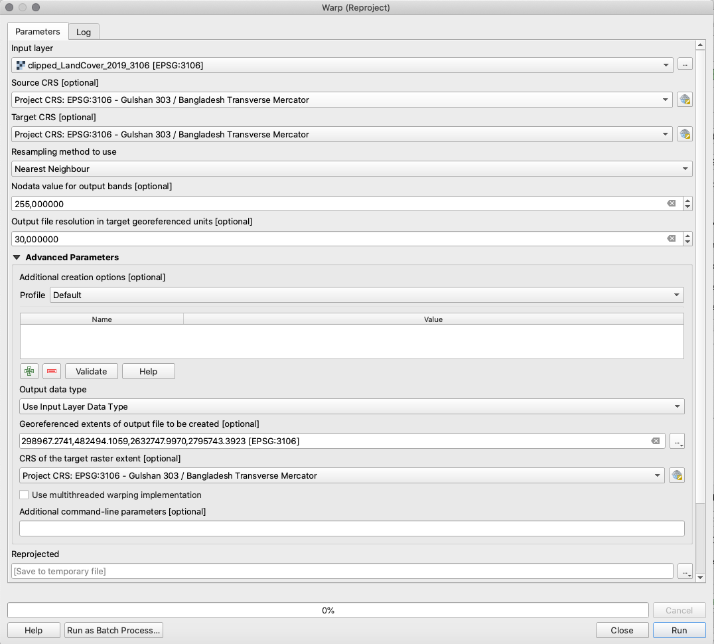

Figure 9.45 - Resampling the Land Cover layer


Follow the exact steps, except that for resample method parameter choose Mode. Save the output layer as LC2019_Mode.  

Now, let’s compare results - see figure 9.46a and 9.46b. 


Figure 9.46a - Resampling Land Cover product using the Nearest Neighbour resampling method


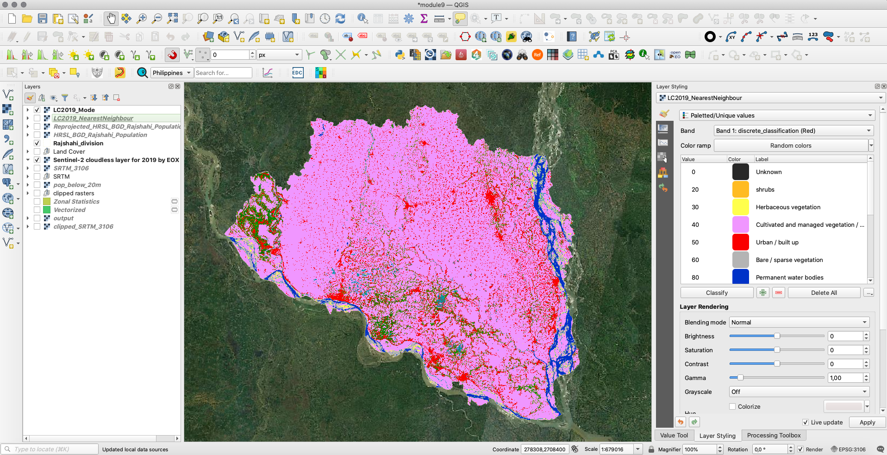

Figure 9.46b - Resampling Land Cover product using the Mode resampling method

Both rasters have the same symbology applied and we can observe that in figure 9.46_a there are values that don’t fall in either category - pixels are not showing. However, we know that the Land Cover product is a seamless layer - it has no gaps between the same categories defined. Let us dig deeper and look at the histograms for all three layers. For that go to **Properties ‣ Histogram** and choose from Prefs/Actions to show only Band 1. Save the histogram by clicking on the save icon on the right side of the window (see figure 9.47).


Figure 9.47 - Show values only for one selected band in the histogram.

Figure 9.48 (a), (b) and (c) present the 3 histograms of interest. 


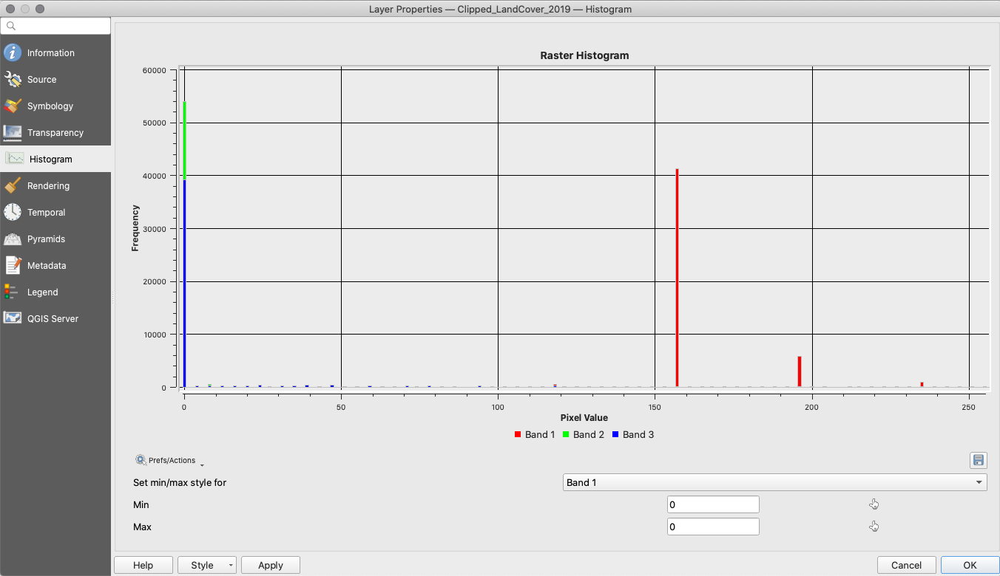


Figure 9.48 - Histograms of (a) Clipped_Reprojected_LandCover 2019 (100m), (b) LC2019_NearestNeighbour and (c) LC2019_Mode

We can observe the differences in the distribution of values for the 3 datasets, emphasis on (b), where we used the nearest neighbour resampling method, resulting - as expecting - in a calculated pixel values and thus resulting in values that do not correspond with any values in the Land Cover product (see table 1, page 7). Hence, the white spaces - pixels with no color assigned in figure 9.45. As inferred, the mode resampling method - or majority resampling method -  selects the value which appears most often.

At this point, your map windows should look like in figure 9.49. 


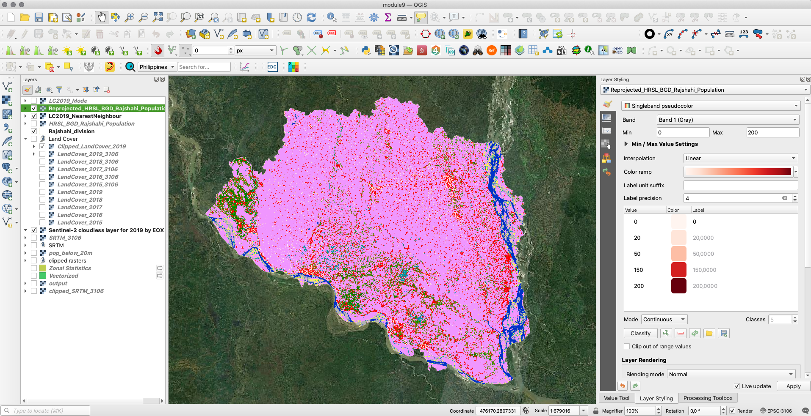

Figure 9.49 - The 2 raster products: Land Cover 2019 and HRSL overlaid. 

Going back to our exercise, the requirements was to identify the population numbers for each category of land cover we have defined in the Rajshahi division. At this point, we have pre-processed our raster data, as to have it in the same coordinate system, with the same spatial resolution. We will continue with a conversion algorithm, we will transform the raster dataset Land Cover into a vector dataset - polygon type. This will allow us to more easily identify the population count for each land cover category. 

For conversions, from raster to polygon, as well as from vector to polygon, go to **Raster ‣ Conversion** and here we have more options. We will choose **Polygonize (Raster to vector)..** We will convert to vector the latest raster dataset that we have obtained: LC2019_Mode. Your result should look like in figure 9.50b. 


 raster layer")

Figure 9.50a - Polygonizing the LC2019_Mode (30m) raster layer


 raster layer")

Figure 9.50b - Result of polygonizing the LC2019_Mode (30m) raster layer

As we can observe, each pixel - each group of adjacent pixels with the same category code (see table 1, page 7) was converted into one polygon. However, we are not interested in each distinct region, but in the entire category. Thus, we will dissolve the vector layer we have obtained using the class identification as the common attribute (**Vector ‣ Geoprocessing tools ‣ Dissolve** - for more details, check module 8).

Attaching the same styling as for the raster and we will notice the same vector classes correspond to the raster ones (see figure 9.51). 


Figure 9.51 - LC2019_Mode polygonez 

As we can observe, the HRSL’s pixels are, as expected, not perfectly contained in a polygon of the land cover product (see picture 9.52).


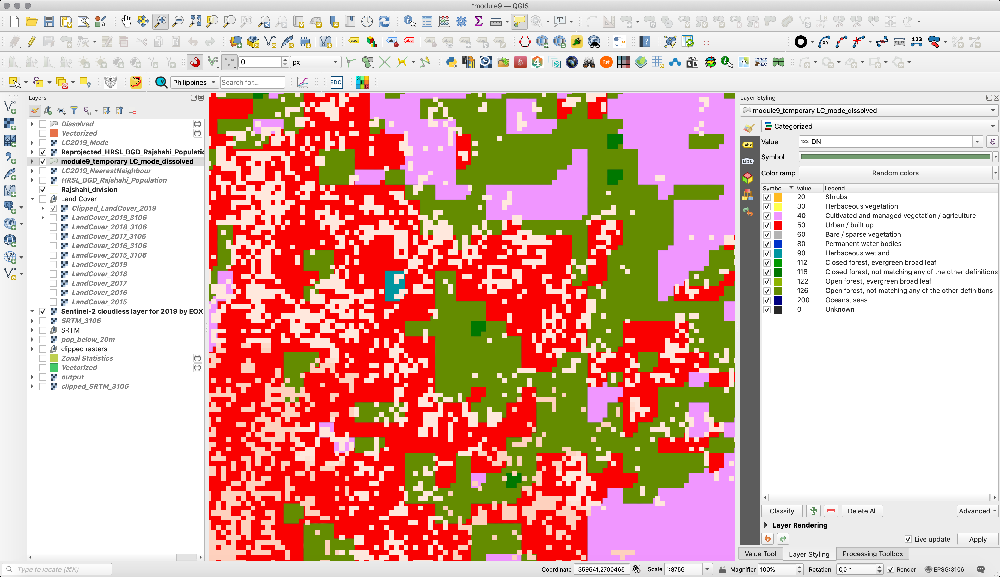

Figure 9.52 - Mismatch of HRSl pixels and the land cover vector dataset  

To eliminate this inconvenience, we will vectorize the HRSL layer as well, just that this time we will transfer the pixel cell value to a point - the geometric center of each pixel.

Go to **Processing ‣ Toolbox**. In the search bar write the keywords `raster point` and choose the `Raster pixels to points` algorithm (see figure 9.53a). Save the output as HRSL_points. 


Figure 9.53a - Raster pixels to points


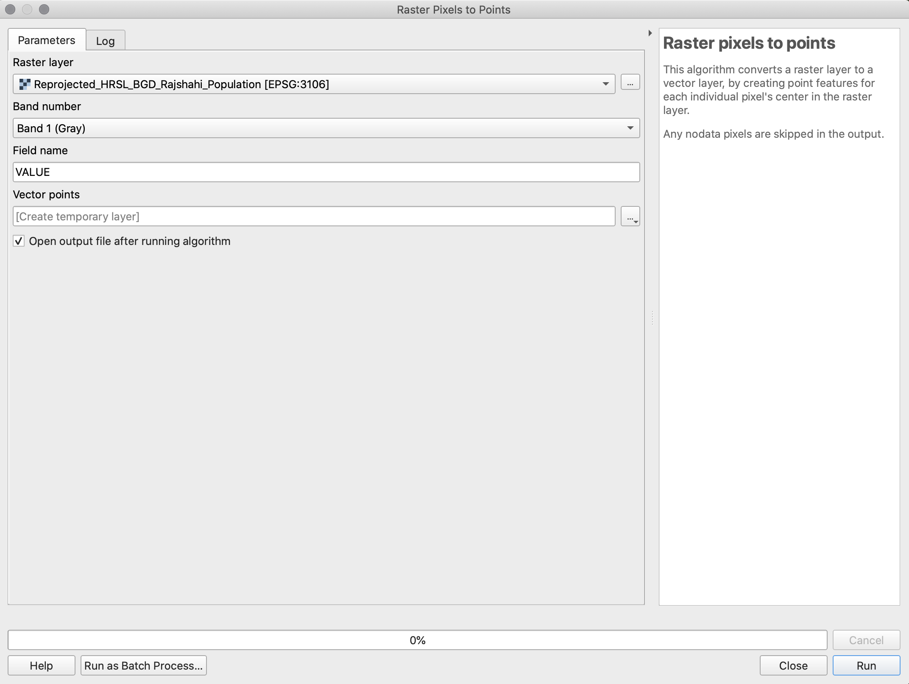

Figure 9.53b - Running Raster pixels to points algorithm

Considering the extent of your study area, this operation can be significantly lengthy in time. Figure 9.54 shows how many points we have obtained for Rajshahi division.


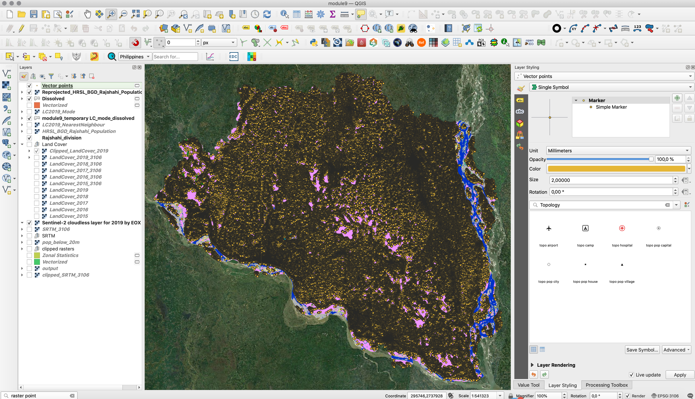

Figure 9.54 - Loading point vector data obtained

The number of features is considerably high and without importing it into a database, any kind of processing or visualisation would require too much time. In these types of situations, the reasonable solution is to divide the datasets we have to process into manageable chunks. Therefore, we will consider processing the necessary calculations on smaller well-defined areas. To split the HRSL layer we will use the option to create a VRT. Select the HRSl layer and choose **Export as..** In the new window, tick on the **Create VRT** option and set the following parameters: browse to a folder where the splitted raster will be exported to, CRS: EPSG:3106, VRT tiles: max columns 2000, max rows: 2000 (see figure 9.55).


Figure 9.55 - Creating a VRT file with specific raster tiles

After exporting, load all the raster tiles into your QGIS project. The result should look like in figure 9.56. 


Figure 9.56 - Raster tiles for the Rajshahi division HRSL 

Next, we will re-run the **Raster pixels to points** algorithm for each of the raster tiles. Because we have several tiles, we will use the batch processing function (see figure 9.57).


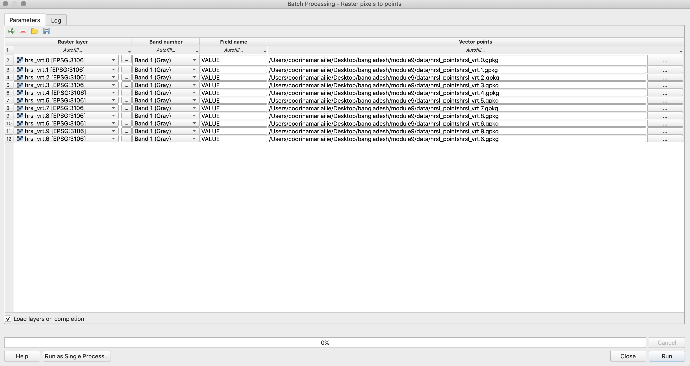

Figure 9.57 - Running raster to points for all raster tiles 

The resultant vector points should look like in figure 9.58. 


Figure 9.58 - Point vector dataset for the HRSL layer with pixel values stored in the VALUE column

Taking a closer look at the results of the algorithm, we can see that the vector points fall exactly in the center of the pixel they extract the value from (see figure 9.59.).


Figure 9.59 - Verifying the values of the point vector data vs. raster pixel values

To resolve the exercise, the sum of the values of points extracted from the HRSL product that fall within each polygon of the land cover product must be calculated. To do that, we will use a function that is available in Field Calculator - `aggregation()`. This function is quite powerful as it does spatial joins on the fly allowing various calculations. In our case, the function must identify the points that fall into each polygon and then sum up the values of those points. To do that, go the attribute table of the LC2019_Mode vector dataset and open the field calculator. Creating a new field, introduce the following expression:


```
aggregate(
    layer:= 'HRSL_vectors1',
    aggregate:='sum',
    expression:=VALUE,
    filter:=intersects($geometry, geometry(@parent))
)
```


Where, <code>layer<em> </em></code>is the name of the dataset from which we want to extract information (in our case, the point dataset that holds the pixel values of the HRSL raster layer), <code>aggregate</code> - indicates the action to be performed once the spatial join is confirmed (sum, count, mean, median, concatenate etc.), <code>expression - </code>indicates the what column we want to extract data from, <code>filter - </code>indicates<code> </code>the geometry function (intersect, within etc.) (see figure 9.60).


Figure 9.60 - Using built-in functions with field calculator

The results are, as expected, saved in the attribute table of the LC2019_Mode. And thus, the exercise has been completed. 

**Please, be aware! This last step can be excessively lengthy depending on the volume of your data! Test to find your best tiling dimensions.**

If using the Field Calculator and the aggregate function doesn't work, we can also use the **Join attributes by location (summary)** algorithm to compute for the sum of the values of the points inside the LC_Mode_vector features.


 algorithm")

Figure 9.61 - Parameters of the Join attributes by location (summary) algorithm


 algorithm")

Figure 9.62 - Output of the Join attributes by location (summary) algorithm

In this third phase of our module 9, we have worked with raster, as well as with vector data. We have taken a closer look at what resampling means and what are the implications of the rasters characteristics, such as coordinate reference system, spatial resolution etc. Most often, one must work with both raster and vector datasets and thus, it is important to know that it is possible in a number of ways. We’ve also tested a number of conversions, from raster to vector and vice-versa. However, in our processing we must not lose sight of the phenomena we are studying, as well as the initial scale at which the data has been collected, be it vector or raster. When performing conversions, it is important to know the correspondence between a map scale and raster resolution. According to cartographer Waldo Tobler “the rule is divide the denominator of the map scale by 1000 to get the detectable size in meters. The resolution is one half of this amount.” In other words, the formula would be:  `map scale = raster resolution (in m) X 2 X 1000. `

The solutions given to our exercises in this module, as in module 8 as well, are just one way to solve the requirements. As one advances the study of the open source tools for geospatial, one finds out that there are several possibilities to get to the same outcome - some better than others. 


#### Quiz questions 

1. What is the name of the process through which the resolution of a raster datasets can be made higher or lower?
*   _<span style="text-decoration:underline;">Resampling.</span>_ 
2. What does a histogram show us? 
*   <span style="text-decoration:underline;">The frequency of pixel values, arranged in adjacent value ranges.</span>
3. Can a raster dataset be converted to a polygon? What about the other way around?
*   <span style="text-decoration:underline;">Yes and yes. </span>


## References:

Center for International Earth Science Information Network - CIESIN - Columbia University. 2018. Gridded Population of the World, Version 4 (GPWv4): Population Density, Revision 11. Palisades, NY: NASA Socioeconomic Data and Applications Center (SEDAC). [https://doi.org/10.7927/H49C6VHW](https://doi.org/10.7927/H49C6VHW). Accessed DAY MONTH YEAR.

Resampling methods: [https://gisgeography.com/raster-resampling/](https://gisgeography.com/raster-resampling/)


<!-- Footnotes themselves at the bottom. -->
## Notes

[^1]:
     A primitive operation is a basic computation performed by an algorithm.  
[^2]:
     The temporal resolution depends on latitude. 
[^3]:
     JAXA is the Japan Aerospace Exploration Agency 
[^4]:
     For the sake of this exercise we will consider the DSM as a digital elevation model. For more details on the differences please see the Breakdown of concepts section
[^5]:
     The Geospatial Data Abstraction Library (GDAL) is a computer software library for reading and writing raster and vector geospatial data formats. 
[^6]:
     Sentinel-2 is an Earth observation mission from the Copernicus Programme that systematically acquires optical imagery at high spatial resolution (10 m to 60 m) over land and coastal waters. For more details go [here](https://sentinel.esa.int/web/sentinel/missions/sentinel-2). 
