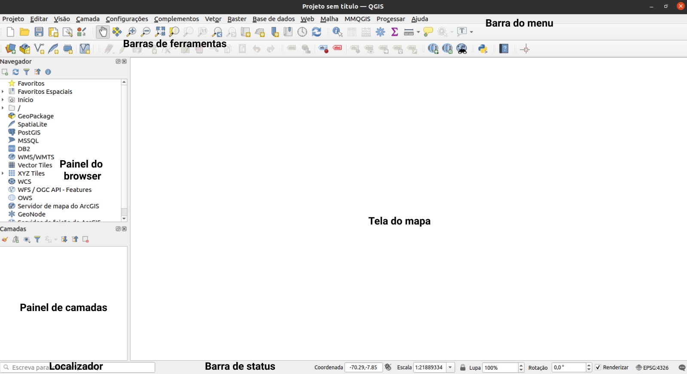
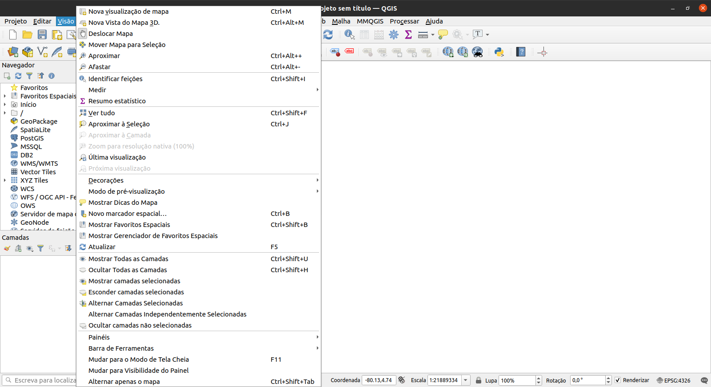
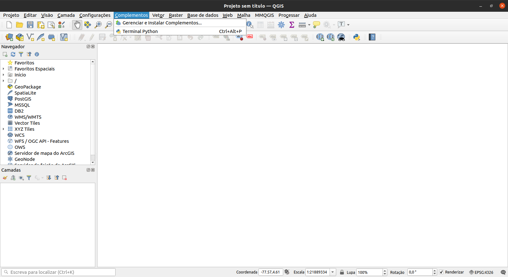
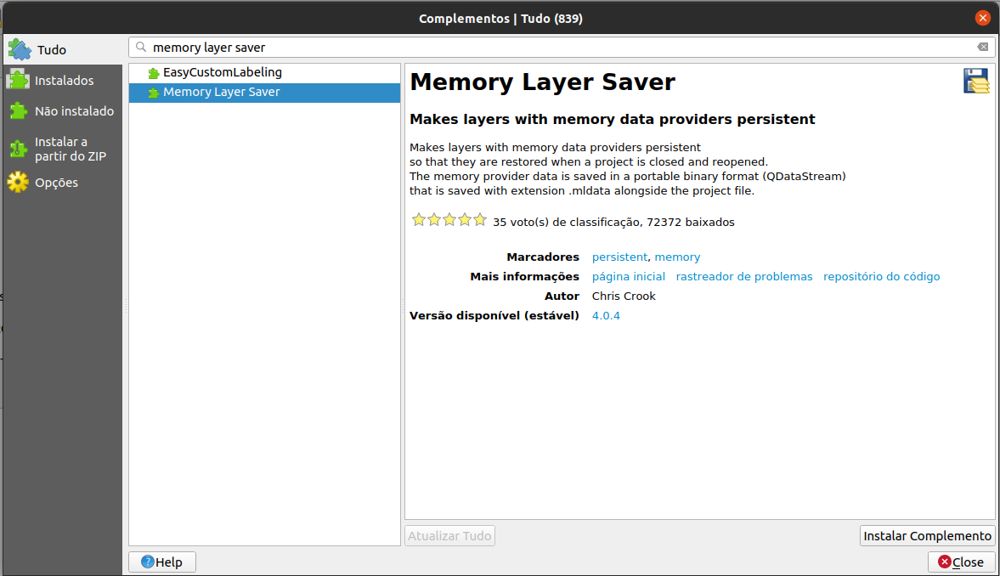
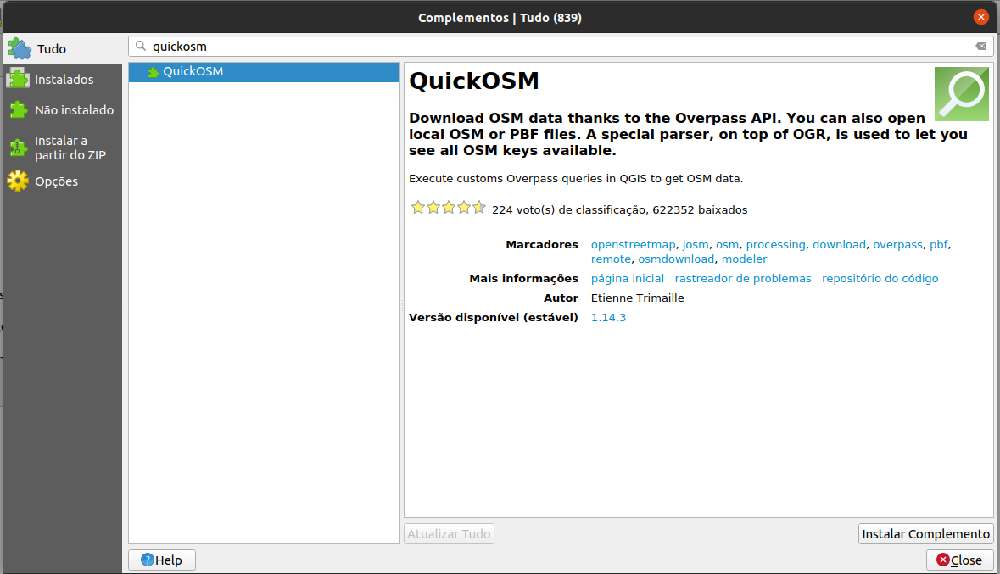
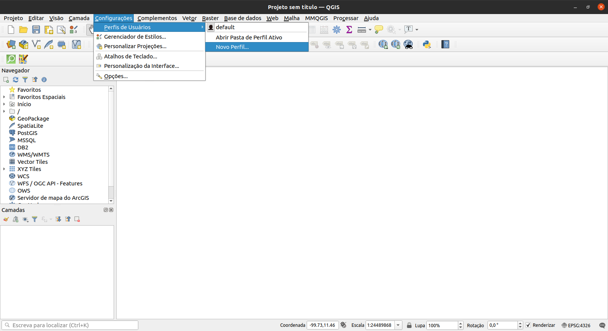

# Módulo 1 - Introdução ao QGIS

**Autor**: Ben Hur

## Introdução Pedagógica

Este módulo serve como uma introdução ao QGIS. No final deste módulo, os alunos devem estar familiarizados com:

* O que é o QGIS
* Interface do QGIS
* Configurações do QGIS
* Complementos do QGIS

Eles também devem aprender:

* Como instalar e abrir o QGIS
* As diferentes partes e recursos da interface do QGIS
* Como editar o layout e o tema da interface
* As diferentes configurações do QGIS, como alterá-las e como elas afetam o QGIS
* O que são perfis de usuário e como usá-los
* O que são complementos e como instalá-los

O módulo também irá discutir algumas nuances do QGIS e o que o torna único ou diferente de outros softwares GIS, como formatos de arquivo QGIS.

## Ferramentas e recursos necessários

As ferramentas e recursos necessários para este módulo são:

*   Computador
*   Conexão de internet
*   QGIS 3.16 instalado no computador ([https://qgis.org/en/site/forusers/download.html](https://qgis.org/en/site/forusers/download.html))

## Pré-requisitos

*   Conhecimento básico de informática

## Recursos adicionais

* Manual do usuário QGIS - [https://docs.qgis.org/3.16/en/docs/user_manual/](https://docs.qgis.org/3.16/en/docs/user_manual/)
* Manual de treinamento QGIS - [https://docs.qgis.org/3.16/en/docs/training_manual/index.html](https://docs.qgis.org/3.16/en/docs/training_manual/index.html )

## Introdução temática

O mapa abaixo ([https://flic.kr/p/2jFfGJP](https://flic.kr/p/2jFfGJP)), de Andrés Felipe Lancheros Sánchez, mostra partes da cidade de Bogotá na Colômbia feitas no estilo da pintura "Noite estrelada" de Vincent van Gogh.

Este próximo mapa ([https://flic.kr/p/2jAsphv](https://flic.kr/p/2jAsphv)) mostra dados de rastreamento de tempestade da NOAA (o órgão de metereologia do governo dos EUA) entre 1851 e 2020 feitos por Fajr Alim.

Este próximo ([https://flic.kr/p/FA9TiR](https://flic.kr/p/FA9TiR)) é um mapa da Ilha Kerguelen, feito por Heinrich Lingnau Schneider.

Este último ([https://flic.kr/p/2kqVzsg](https://flic.kr/p/v2kqVzsg)) é de tentativas de arremessos de quadra e pontos marcados por tentativa durante a temporada 81 do Torneio de Basquete Masculino UAAP em as Filipinas por Ben Hur Pintor.

O que todos esses mapas têm em comum? Todos eles foram feitos usando o QGIS.

## Detalhamento dos conceitos

Os mapas mostrados acima foram todos criados no QGIS ([https://qgis.org/en/site/](https://qgis.org/en/site/)), um Sistema de Informação Geográfica (SIG, ou GIS) gratuito e de código aberto. O QGIS pode ser usado com todos os tipos de dados espaciais (como dados de basquete no último exemplo) e não apenas com dados geoespaciais relacionados à Terra.

As pessoas são capazes de criar mapas maravilhosos e surpreendentes, como os exemplos acima, porque o QGIS é gratuito, de código aberto e possui recursos poderosos de gerenciamento de dados, análise e apresentação.

## Conteúdo principal

### Título da fase 1: Introdução ao QGIS e à interface do QGIS

#### **O que é o QGIS**

**QGIS**, conhecido como Quantum GIS antes de seu lançamento 2.X, é um Sistema de Informação Geoespacial (GIS) maduro, multiplataforma, gratuito e de código aberto.

É um GIS de nível enterprise que possui recursos para coletar, armazenar, analisar, apresentar e gerenciar dados espaciais e não espaciais. Ele também se integra bem com outras tecnologias geoespaciais existentes e serve como parte integrante de qualquer pilha (stack) FOSS4G (Software Livre e de Código Aberto para Geoespacial).

Por ser multiplataforma, o QGIS pode ser executado em GNU / Linux, macOS, Windows e até mesmo Android.

#### **Ciclo de lançamento e versões**

Os lançamentos e o desenvolvimento do QGIS seguem um cronograma / roteiro baseado no tempo ([https://www.qgis.org/en/site/getinvolved/development/roadmap.html](https://www.qgis.org/en/site/ getinvolved / development / roadmap.html)).

Uma versão do QGIS é especificada por três números (X.Y.Z). Por exemplo, QGIS 3.16.4.

* X refere-se à versão principal. Neste caso, QGIS 3.
* Y refere-se à versão de lançamento. Neste caso, a versão 16. As versões de lançamento são sempre números pares, pois os números ímpares são reservados para versões de desenvolvimento.
* Z refere-se ao Point Release (PR) dessa versão. Para 3.16.4, isso significa que é o quarto ponto de lançamento da versão 3.16.

Existem três ramificações (ou branches) principais do QGIS que os usuários podem instalar. Estas são a ramificação **Long Term Release (LTR)**, a ramificação **Latest Release (LR)** e a ramificação **Development (Nightly)**.

* **Long Term Release (LTR)** tem esse nome porque é mantido e recebe correções de bug até o próximo LTR ser lançado. Atualmente, isso significa um (1) ano. Em fevereiro de 2021, o LTR atual é 3.16.4. Está programado para ser substituído pelo QGIS 3.22.4 em fevereiro de 2022.
* **Última versão (LR)** refere-se a versão de lançamento do QGIS que contém os recursos mais recentes ou mais recentes. Um novo LR é lançado a cada quatro (4) meses. Por exemplo, um novo LR 3,18 foi lançado em fevereiro de 2021. O próximo LR (3.20) será lançado 4 meses a partir de agora, ou seja, em junho de 2021. Atualmente, cada terceiro LR se torna o próximo LTR. Por exemplo, o LTR de fevereiro de 2021 é a versão 3.16. O terceiro LR de 3.16 é 3.22, portanto, o próximo LTR será baseado na versão de lançamento 3.22.
* **Development / Nightly** é baseado na versão mais recente do código-fonte QGIS, mas é útil se você deseja testar, depurar ou ajudar no desenvolvimento do QGIS.

Então, qual versão você deve usar? Depende. Se você precisa de uma versão que é mantida por mais tempo e não precisa necessariamente de novos recursos à medida que são lançados, a versão LTR pode ser a versão para você. Se você precisa dos recursos mais recentes e não se importa em fazer uma atualização a cada poucos meses, a versão LR pode ser ideal para você. Às vezes, também é bom dar uma olhada nas versões de desenvolvimento ou noturnas, especialmente se você estiver curioso ou animado com os próximos recursos do QGIS.

Para obter mais informações, visite: [https://bnhr.xyz/2020/10/26/about-qgis-versions-release-cycle-english.html](https://bnhr.xyz/2020/10/26/ about-qgis-versions-release-cycle-english.html)

#### **Exemplos de mapas QGIS**

Figura 1.1. Demonstração do mapa QGIS

Para mais mapas criados com o QGIS, visite: [https://www.flickr.com/groups/2244553@N22/pool/with/50355460063/](https://www.flickr.com/groups/2244553@N22/ piscina/com/50355460063/)

#### **Instalando o QGIS**

QGIS é multiplataforma e funciona em Linux, Windows e macOS. Sendo de código aberto, você pode construir e instalar o QGIS a partir de seu código-fonte, disponível em [https://github.com/qgis/QGIS/](https://github.com/qgis/QGIS/).

Instaladores e instruções de instalação também estão disponíveis em [https://qgis.org/en/site/forusers/download.html](https://qgis.org/en/site/forusers/download.html) ou [https: //qgis.org/en/site/forusers/alldownloads.html](https://qgis.org/en/site/forusers/alldownloads.html).

Para **Linux (ou GNU / Linux)**, o QGIS geralmente está disponível no gerenciador de pacotes de sua distribuição. Para usuários Debian / Ubuntu, o QGIS tem repositórios para os ramos LR, LTR e Desenvolvimento (Development), bem como versões do QGIS com dependências do PPA ubuntugis-unstable. O QGIS também está disponível como pacote Flatpak ou no Conda.

Para **Windows**, os usuários podem escolher entre o instalador de rede OSGeo4W ou os instaladores independentes. Há um instalador independente para a versão LTR e LR.

Os instaladores autônomos são os mais fáceis de instalar e são recomendados para iniciantes. Várias versões do QGIS podem ser instaladas em seu computador ao mesmo tempo. Isso significa que você pode ter ambas as versões QGIS 3.16 e 3.18 instaladas.

O OSGeo4W Network Installer é um pouco mais avançado e complexo do que os instaladores autônomos, mas também oferece a capacidade de atualizar e atualizar sua versão do QGIS no local, o que significa que você não precisará desinstalar uma versão mais antiga se quiser instalar um mais novo.

Em alguns casos, você precisará de direitos de administrador para instalar o QGIS, portanto, se estiver instalando em um computador onde o seu usuário não possui direitos de administrador, pode ser necessário pedir ao seu administrador de TI ou escritório para instalar o QGIS para você.

A instalação no Windows também vem com QGIS com GRASS (outro GIS Livre e de Código Aberto).

Observe que o QGIS está [removendo lentamente o suporte de 32 bits para Windows](https://blog.qgis.org/2020/10/15/phasing-out-32-bit-support-in-qgis/), então é melhor para instalar o QGIS em um computador que executa um sistema operacional de 64 bits.

Para o **macOS**, existem instaladores oficiais "All-in-one" assinados para macOS High Sierra (10.13) e mais recentes. O QGIS ainda não foi autenticado conforme exigido pelas regras de segurança do macOS Catalina (10.15). Na primeira inicialização, clique com o botão direito no ícone do aplicativo QGIS, segure a tecla Option e escolha Abrir.

#### **Partes da interface do QGIS**

Depois de instalar o QGIS, você pode executá-lo ou abri-lo como faria com qualquer programa em seu computador. Ao abrir o QGIS, você será saudado com a Interface do Usuário (IU, ou UI em inglês) padrão que se parecerá com a abaixo.

Figura 1.2. A interface QGIS em uma nova instalação

Existem seis partes principais da interface de usuário do QGIS - barra de menu, tela do mapa, barra de ferramentas, painéis, barra de status e localizador.

No centro da interface está uma tela de mapa. Painéis e barras de ferramentas podem ser posicionados em torno dessa tela. Os painéis também podem ser acoplados para criar um painel com várias abas. Existem também outras partes da interface, como a interface Python, janelas de complemento, etc.

**Barra de menus** - a barra de menus é um menu hierárquico simples que fornece acesso às funções e comandos do QGIS. Geralmente está localizado na parte superior da interface.

**Tela do mapa** - a tela do mapa é onde as camadas carregadas no QGIS são mostradas. Este é também o local onde os filtros, seleções, e simbologias criadas pelo usuário são refletidas. Mais de uma tela de mapa pode estar presente a qualquer momento. Um usuário pode aplicar zoom, panorâmica e até mesmo girar a tela do mapa. Uma tela de mapa também pode mostrar dados 3D.

**Barras de ferramentas** - as barras de ferramentas mostram botões de acesso fácil aos comandos, recursos, complementos do QGIS. Eles podem ser movidos e encaixados na tela do mapa. A lista de barras de ferramentas pode ser encontrada, ativada e desativada na barra de menus em **Exibir ‣ Barras de ferramentas**. Exemplos de barras de ferramentas são a barra de ferramentas de atributos e a barra de ferramentas de digitalização.

**Painéis** - os painéis são semelhantes às barras de ferramentas, mas, em vez de botões, fornecem uma interface para funções e recursos mais complexos. O painel de camadas e o painel do navegador são dois exemplos. Semelhante às barras de ferramentas, eles podem ser movidos e encaixados na tela do mapa. A lista de painéis pode ser encontrada, ativada e desativada na barra de menus em **Exibir ‣ Painéis**.

**Barra de status** - a barra de status é comumente encontrada na parte inferior da interface e mostra informações relevantes, como CRS, escala, notificações, etc.

**Barra Localizadora** - a barra Localizadora é encontrada no canto inferior esquerdo da interface do QGIS. Ele permite que o usuário acesse facilmente camadas, campos, algoritmos de processamento e outras funcionalidades no QGIS. Este é um dos recursos mais poderosos do QGIS.

Figura 1.3. Partes da interface QGIS

Uma das belezas do QGIS é a personalização ele que oferece aos seus usuários. Essa personalização começa com a interface do usuário. Ao editar algumas configurações e mover algumas partes da interface, você pode ter um QGIS semelhante a este abaixo:

Figura 1.4. A interface QGIS com algumas personalizações

#### **Tutorial / Exercício 1: Mudando a aparência e layout da interface QGIS**

1. Abra o **QGIS**
2. Clique no menu **Visão**

3. Observe o menu **Painéis**

4. Observe o menu **Barras de ferramentas**

5. Selecione as **Barras de ferramentas** e **Painéis** que você deseja mostrar na interface do usuário. Alguns dos painéis úteis incluem **Estilização de camadas** e **Caixa de Ferramentas de Processamento**.
6. Mova as **Barras de Ferramentas** e **Painéis** para as posições que fizerem mais sentido para você

**Resetando a interface QGIS**

Para redefinir sua tela para as configurações padrão, vá para **Configurações ‣ Opções ‣ Guia Sistema ‣ Configurações ‣ Botão Redefinir** e reinicie o QGIS.

#### **Perguntas do questionário**

1. Verdadeiro ou falso:
    1. Você pode ter várias telas de mapa - ***Verdadeiro***
    2. Você pode mostrar ou ocultar painéis e barras de ferramentas - ***Verdadeiro***
    3. Você só pode colocar painéis no lado esquerdo ou direito da tela do mapa - ***Falso (você também pode colocar painéis acima ou abaixo da tela do mapa)***

### Título da fase 2: Complementos (Complementos) QGIS

A capacidade de adicionar, criar e estender a funcionalidade do QGIS por meio de complementos (ou plug-ins) é um de seus recursos mais poderosos.

A partir do QGIS 3.16.3, existem mais de 700 complementos disponíveis para o usuário baixar e melhorar. Esses complementos variam do complexo ao simples.

Os complementos QGIS podem ser classificados como:

* **Complementos core** - integrado à sua versão do QGIS, não pode ser desinstalado
* **Complementos externos** - manualmente instalados por meio de busca em um repositório externo (ou seja, QGIS Official Plugin Repository) ou através do código-fonte.

Os complementos podem ser instalados de três (3) maneiras:

1. Através da caixa de diálogo Gerenciar e instalar complementos (**Complementos ‣ Gerenciar e instalar complementos**)
2. Instalando do ZIP, que pode ser acessado na guia **Instalar do ZIP** na caixa de diálogo Gerenciar e instalar complementos.
3. Adicionando manualmente o código-fonte na pasta de complementos do seu perfil QGIS. Essa pasta geralmente pode ser encontrada em:
    1. **Linux**: .local/share/QGIS/QGIS3/profiles/default/python/plugins
    2. **Mac OS X**: Biblioteca/Aplicativo/Suporte/QGIS/QGIS3/profiles/default/python/plugins
    3. **Windows:** C:\\Usuário\<Nome>\AppData\Roaming\QGIS\QGIS3\profiles\default\python\plugins

Figura 1.5. Acessando a caixa de diálogo Gerenciar e instalar complementos

**Diálogo Gerenciar e Instalar Complementos**

A caixa de diálogo Gerenciar e instalar complementos se conecta ao repositório de complementos oficiais do QGIS (ou qualquer repositório que você indicar na guia Configurações) para buscar complementos disponíveis para sua versão do QGIS. Possui cinco (5) abas:

* **Aba Tudo** - mostra TODOS os complementos disponíveis para sua versão QGIS, incluindo aqueles que já estão instalados em sua máquina
* **Aba Instalados** - mostra apenas os complementos instalados em sua máquina
* **Aba não instalado** - mostra os complementos que não estão instalados em sua máquina
* **Aba Instalar a partir do do ZIP** - permite que você instale complementos de um arquivo ZIP
* **Aba Opções** - oferece opções sobre quando verificar se há atualizações de complementos, incluir ou não complementos experimentais e obsoletos ou adicionar / alterar o repositório para buscar complementos

Se o complemento que você está procurando está marcado como experimental ou obsoleto, você precisa marcar **Mostrar complementos experimentais** e **Mostrar complementos obsoletos** na guia Opções.

A **Barra de Pesquisa** permite que você pesquise complementos encontrados no(s) repositório(s) de complementos aos quais você está conectado.

Figura 1.6. A caixa de diálogo Gerenciar e instalar complementos

#### **Tutorial / Exercício 2: Instalando um complemento QGIS**

1. Abra a caixa de diálogo **Gerenciar e instalar complementos** em **Complementos ‣ Gerenciar e instalar complementos** na barra de menus. Isso abrirá a caixa de diálogo Gerenciar e instalar complementos.

2. Instale os complementos a seguir procurando por eles na guia **Todos** e clicando em **Instalar complemento** no canto inferior direito da caixa de diálogo Gerenciar e instalar complementos.
   - Memory Layer Saver

   - QuickOSM

3. Verifique se os complementos foram instalados com sucesso. O plugin Memory Layer Saver deve estar disponível em **Complementos ‣ Memory Layer Saver** na barra de menus, enquanto o plugin QuickOSM deve estar disponível em **Vetor ‣ QuickOSM** na barra de menus.

#### **Perguntas do questionário**

1. Verdadeiro ou falso
    1. Você pode remover ou desinstalar os complementos do Core - ***Falso***
    2. Você pode adicionar complementos que não são encontrados no repositório oficial de complementos do QGIS - ***Verdadeiro***

### Título da Fase 3: Configurações QGIS

**Configurações do sistema e do projeto**

As configurações do QGIS permitem que você edite e gerencie coisas diferentes sobre o QGIS, como perfis de usuário, estilos, sistemas de referência de coordenadas, atalhos de teclado, a interface do usuário, cores padrão, etc. As configurações do sistema podem ser encontradas no menu **Configurações** e são as configurações padrão usadas pelo QGIS, a menos que sejam substituídas pelas configurações de um projeto. As configurações do projeto podem ser encontradas em **Projeto ‣ Propriedades** e referem-se às configurações ou propriedades do projeto atual. Esses valores substituem os padrões do sistema.

Figura 1.7. As configurações do sistema

Figura 1.8. Configurações do projeto

**Mudando o tema QGIS**

Você pode alterar a aparência do QGIS em **Configurações ‣ Opções ‣ Aba Geral**.

Você pode escolher entre três temas - padrão (default), Blend of Grey e Night Mapping. Você também pode alterar o tamanho dos ícones, a fonte usada pelo QGIS e outros padrões do sistema.

Figura 1.9. Configurações gerais do QGIS

Para algumas configurações no QGIS, pode ser necessário reiniciar o aplicativo para que tenham efeito.

**Perfis de usuário**

QGIS 3.X introduziu o conceito de Perfis de Usuário QGIS.

Um perfil de usuário é uma coleção de configurações para complementos instalados, barras de ferramentas habilitadas, organização da interface do usuário e outras configurações. QGIS vem com um Perfil de Usuário padrão chamado default. Perfis de usuário permitem que o usuário crie configurações diferentes para análises específicas (por exemplo, um perfil de usuário específico para gestão de recursos hídricos, digitalização de dados, cartografia, etc.), projetos particulares ou mesmo clientes.

Perfis de usuário podem ser criados e acessados ​​na barra de menus em: **Configurações ‣ Perfis de usuário**.

O perfil de usuário ativo é mostrado com [Perfil do usuário] na barra de título.

Figura 1.10. Acessando perfis de usuário

Os perfis de usuário são salvos em um diretório em seu computador que pode ser acessado clicando em **Configurações ‣ Perfis de usuário ‣ Abrir pasta de perfil ativo**.

#### **Tutorial / Exercício 03: Criando um Perfil de Usuário**

1. Vá para **Configurações ‣ Perfis de usuário ‣ Novo perfil ...**

2. Dê um nome ao seu novo perfil de usuário.

3. Uma nova janela QGIS deve abrir com seu novo perfil de usuário. Observe que o nome do seu perfil é mostrado na barra de título do QGIS.

4. Você percebe alguma diferença no novo perfil do usuário? Verifique a interface do usuário, os complementos e as configurações do perfil antigo e do novo perfil que você criou.

#### **Perguntas do questionário**

1. Verdadeiro ou falso
    1. Você só pode ter um perfil de usuário no QGIS. - ***Falso (você pode ter vários perfis de usuário)***
    2. Você não pode substituir as configurações e propriedades do sistema. - ***Falso***

### Título da Fase 4 (adicional): Formatos de arquivo do QGIS

#### **Arquivo de projeto QGIS (QGS / QGZ)**

Projetos QGIS estão para QGIS como arquivos .mxd são para ArcMap. Esses arquivos vêm como **QGS (*.qgs)** ou **QGZ (*.qgz)**. A principal diferença entre os dois é que o formato QGZ é um arquivo compactado (zip) contendo um arquivo QGS e um arquivo QGD. O formato QGS é um formato XML para armazenar projetos QGIS. O arquivo QGD é o banco de dados sqlite associado do projeto QGIS que contém dados auxiliares para o projeto. Se não houver dados auxiliares, o arquivo QGD ficará vazio.

Um arquivo de projeto QGIS contém tudo o que é necessário para armazenar um projeto QGIS, incluindo:

* título do projeto
* CRS do projeto
* a árvore de camadas
* configurações de ajuste
* relações
* a extensão da tela do mapa
* modelos de projeto
* legend
* docas mapview (2D e 3D)
* as camadas com links para os conjuntos de dados subjacentes (fontes de dados) e outras propriedades da camada, incluindo extensão, CRS, junções, estilos, renderizador, modo de mesclagem, opacidade e muito mais
* propriedades do projeto

Os arquivos do projeto QGIS podem ser salvos em um banco de dados GeoPackage ou PostGIS. Salvar o arquivo do projeto junto com o arquivo de estilo e as camadas correspondentes em um único GeoPackage facilita o compartilhamento de projetos QGIS.

#### **Definição da camada QGIS (QLR)**

Um arquivo de definição de camada QGIS (**QLR**) é um arquivo XML que contém um ponteiro para a fonte de dados da camada, além das informações de estilo QGIS para a camada. Atualmente, um arquivo QLR corresponde a uma única camada apenas.

O caso de uso para este arquivo é simples: ter um único arquivo para abrir uma fonte de dados e trazer todas as informações de estilo relacionadas. Os arquivos QLR também permitem definir a fonte de dados subjacente em um arquivo fácil de abrir.

Um exemplo de uso de QLR é para abrir uma camada de um banco de dados PostGIS. Em vez de se conectar ao banco de dados, encontrar a camada e aplicar um filtro, você pode apenas abrir um arquivo .qlr que aponta para a camada PostGIS correta com seu estilo e filtro correspondentes.

#### **Arquivo de estilo QGIS (QML)**

**QML** é um formato XML para armazenar estilos de camadas. Um arquivo QML (.qml) contém todas as informações que dizem ao QGIS como renderizar geometrias de feições que incluem definições de símbolos, tamanhos e rotações, rótulos, opacidade, modo de mesclagem e muito mais.

Um arquivo .qml deve ter o mesmo nome da fonte de dados a que ele corresponde. Quando ele for encontrado no mesmo diretório ou pasta da fonte de dados, carregar a fonte de dados também carregará automaticamente seu estilo, conforme definido no arquivo .qml.

Por exemplo, se você tiver um GeoJSON chamado `regioes.geojson` e um arquivo QML chamado `regioes.qml`, carregar as `regioes.geojson` no QGIS aplicará os estilos definidos em `regioes.qml` na camada carregada.

Ao usar GeoPackages (.gpkg), um arquivo .qml muitas vezes não é necessário, pois você pode salvar o estilo de uma camada diretamente no geopacote.

### Se você quiser ir mais longe:

Você pode tentar criar seu próprio plugin QGIS. Se não houver um complemento que faça o que você deseja, você pode criar um você mesmo.

O **Plugin Builder** é um plugin que cria um modelo que pode servir como ponto de partida para o desenvolvimento do plugin QGIS para que você não precise criar um desde o início. Você pode instalá-lo na caixa de diálogo Gerenciar e instalar complementos.

Claro, você sempre pode criar um plugin do zero. Se você estiver interessado em criar seu próprio plugin, pode verificar a documentação oficial do QGIS ([https://documentation.qgis.org/](https://documentation.qgis.org/)). Para complementos Python, é uma boa ideia verificar o PyQGIS Developer Cookbook ([https://docs.qgis.org/3.16/en/docs/pyqgis_developer_cookbook/](https://docs.qgis.org/3.16/en/docs/pyqgis_developer_cookbook /)).

Para obter mais informações, consulte: [https://bnhr.xyz/2018/10/08/qgis-plugins-3.0.html](https://bnhr.xyz/2018/10/08/qgis-plugins-3.0. html)

### Para praticar suas novas habilidades, tente ...

* Altere o tema e a aparência da interface do usuário QGIS de acordo com sua preferência.
* Instale outros complementos QGIS.
* Altere outras configurações do QGIS.
    * Crie um sistema de referência de coordenadas personalizado
    * Adicione uma tela inicial personalizada ([https://bnhr.xyz/2020/09/05/custom-splash-screen-qgis.html](https://bnhr.xyz/2020/09/05/custom-splash -screen-qgis.html))

### Dicas

N/D
