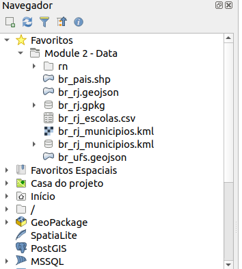
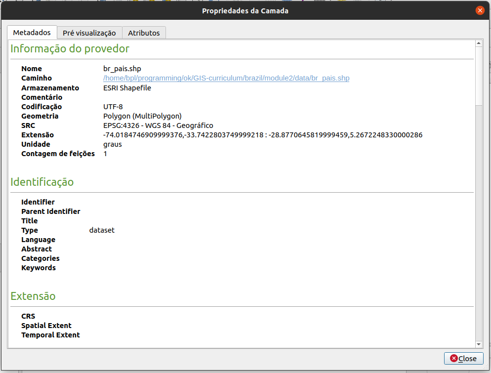
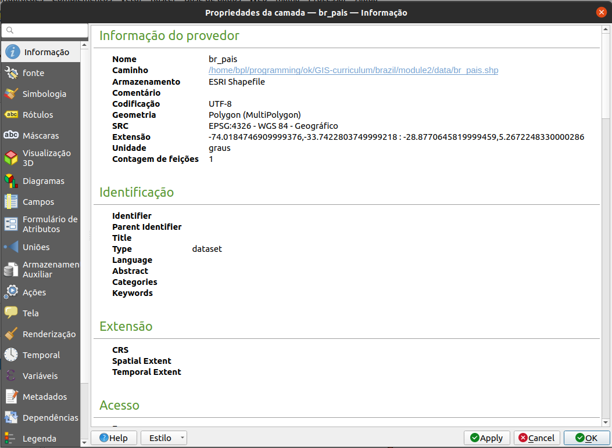
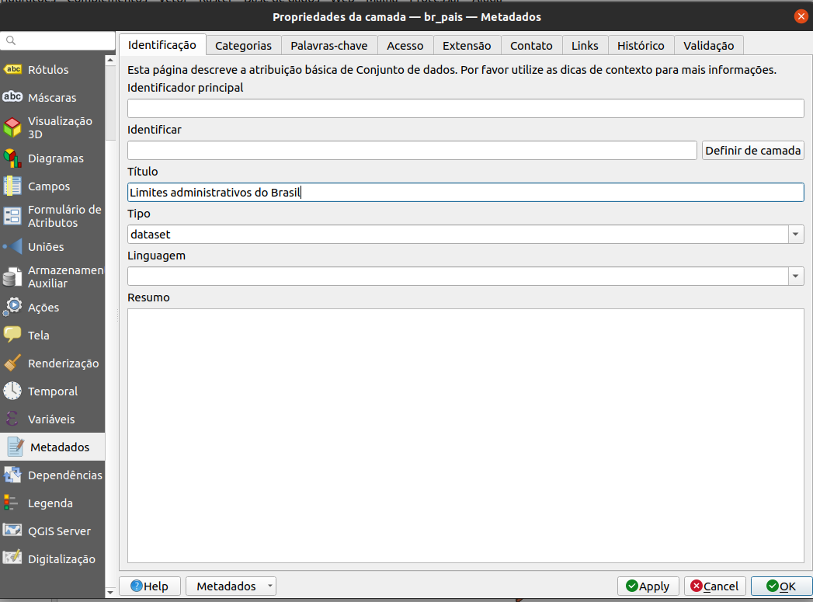
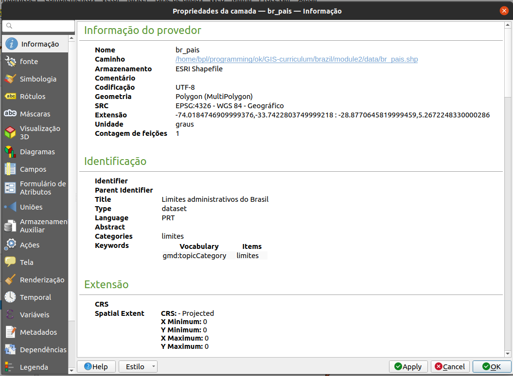
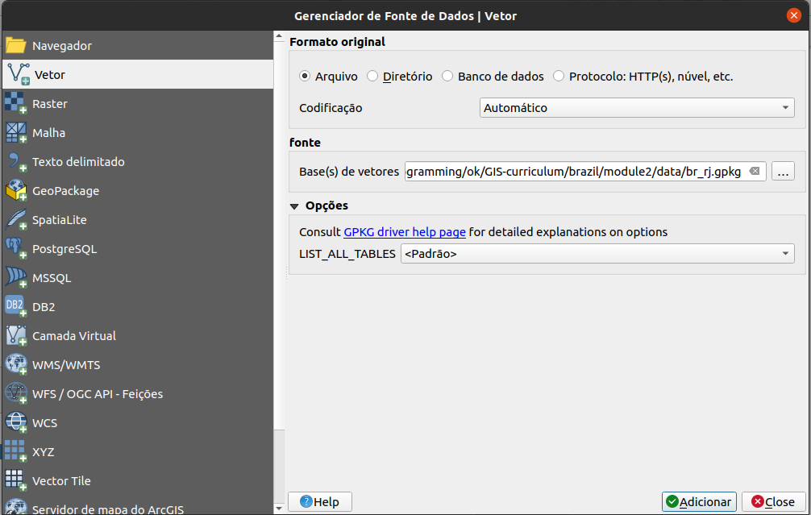
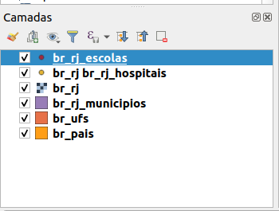
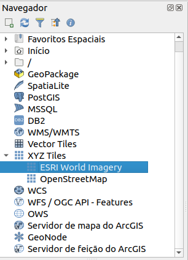
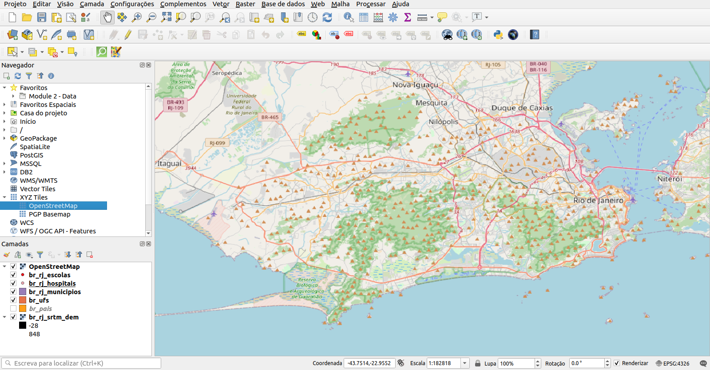
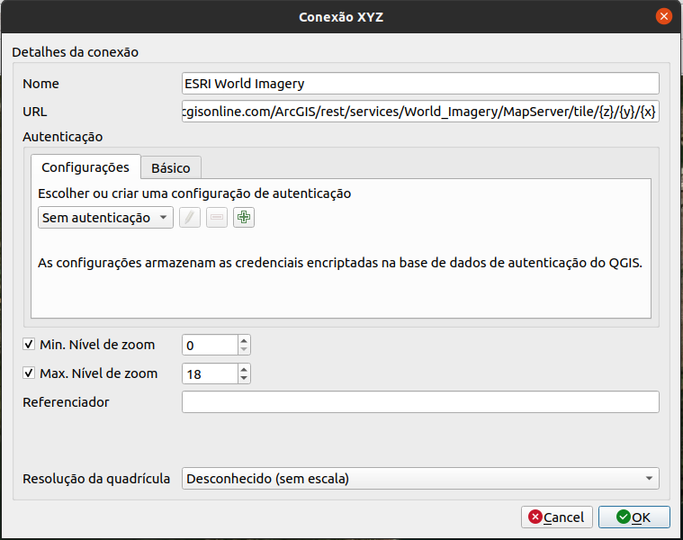

# Módulo 2 - Camadas no QGIS

** Autor **: Ben Hur

## Introdução Pedagógica

Este módulo irá ensinar-lhe os conceitos básicos das camadas no QGIS e como carregá-las. No final deste módulo, os alunos devem estar familiarizados com:

* as diferentes fontes de dados e formatos de arquivo que podem ser carregados no QGIS
* as diferentes maneiras que os dados podem ser carregados no QGIS
* alguns formatos de arquivo de dados comuns

Eles também devem ser capazes de:

* carregar camadas (vetores e rasters) usando o painel do navegador e o gerenciador de fonte de dados
* conectar o QGIS a serviços remotos
* trabalhar com camadas temporárias e virtuais
* instalar alguns plug-ins que carregarão outros conjuntos de dados no QGIS
* mostrar propriedades da camada, como metadados informações
* salvar e exportar camadas


## Ferramentas e recursos necessários

As ferramentas e recursos necessários para este módulo são:

* computador
* conexão à Internet
* QGIS 3.16 instalado no computador ([https://qgis.org/en/site/forusers /download.html](https://qgis.org/en/site/forusers/download.html))


## Pré-requisitos

* conhecimento básico de operação de um computador
* familiaridade com formatos de dados espaciais e a interface QGIS (conclusão dos Módulos 0 e 1)


## Recursos adicionais

* QGIS User Guide - [https://docs.qgis.org/3.16/en/docs/user_manual/](https://docs.qgis.org/3.16/en/docs/user_manual/)
* Manual de treinamento QGIS - [ https://docs.qgis.org/3.16/en/docs/training_manual/index.html](https://docs.qgis.org/3.16/en/docs/training_manual/index.html)
* Basemaps no QGIS - [https://bnhr.xyz/2018/10/07/basemaps-in-qgis.html](https://bnhr.xyz/2018/10/07/basemaps-in-qgis.html)
* Conectando o QGIS ao Serviços remotos - [https://bnhr.xyz/2018/10/12/connecting-qgis-to-remote-services.html] (https://bnhr.xyz/2018/10/12/connecting-qgis-to -remote-services.html)
* Spreadsheet Layers Plugin - [https://bnhr.xyz/2018/07/27/plugin-fridays-spreadsheet-layers-plugin.html](https://bnhr.xyz/2018/ 27/07 / plugin-fridays-spreadsheet-layers-plugin.html)


## Introdução temática


Figura 2.1. Uma sobreposição de mapa contendo diferentes camadas e tipos de dados ([https://saylordotorg.github.io/text_essentials-of-geographic-information-systems/s11-02-multiple-layer-analysis.html](https://saylordotorg. github.io/text_essentials-of-geographic-information-systems/s11-02-multiple-layer-analysis.html))

Aprendemos nos módulos anteriores que modelos de dados espaciais, como vetores e rasters, são modelos de objetos do mundo real e fenômenos e, embora seja perfeitamente normal ter uma única camada que modele uma única coisa (por exemplo, elevação, temperatura, localização de residências, zoneamento, etc.), na prática, se quisermos realizar análises úteis ou criar um modelo que reflita o mundo real melhor, então, precisaríamos usar vários dados e camadas juntos. Sobrepor vários mapas temáticos da mesma área, colocando-os uns sobre os outros, é uma das técnicas de análise geográfica mais antigas e comuns.


## Detalhamento dos conceitos

A imagem acima nos dá um exemplo simples e concreto disso. Imagine que você é um consultor GIS encarregado de encontrar a melhor localização para um novo restaurante de franquia (por exemplo um McDonalds). Para fazer isso, você precisaria reunir as informações relevantes que o ajudariam a decidir. Isso pode incluir informações sobre as ruas da cidade, lotes de terreno, localização e distribuição de possíveis clientes, a topografia da área, uso do solo, etc.

Esses conjuntos de dados podem vir em diferentes tipos e formatos. Alguns podem ser arquivos vetoriais, enquanto outros podem ser raster. Alguns podem estar no mesmo sistema de referência de coordenadas, enquanto outros podem estar em sistemas de referência de coordenadas diferentes. Alguns podem ser arquivos locais encontrados em seu computador, enquanto outros só podem ser carregados pela Internet. Por causa das muitas possibilidades do tipo de dados que você precisaria para sua análise espacial, um bom GIS deve ser capaz de manipular e gerenciar uma variedade de fontes de dados.


## Conteúdo principal

### Título da fase 1: Tipos de dados, formatos de arquivo, o painel do navegador e o painel de camadas

#### **Tipos de dados e formatos de arquivo comuns**

Além dos modelos de dados espaciais (rasters e vetores) discutidos no primeiro módulo, a familiaridade com formatos de arquivo geoespaciais e seus prós e contras também é importante para qualquer pessoa que faça análise espacial.

A maioria das pessoas que são novas em GIS geralmente são apresentadas aos dados espaciais por meio de shapefiles. A maioria das pessoas nunca supera esse formato e usa shapefiles para todos os tipos e formas de dados vetoriais. Isso é semelhante a como uma marca específica como a Coca Cola começa a ser usada como o termo geral para refrigerantes. Isso não é necessariamente errado, mas é lamentável, pois os shapefiles são apenas um dos muitos tipos de formato de dados vetoriais. Na verdade, há muitos outros formatos de vetor como geopackage, geojson, topojson e flatgeobuf. O formato do shapefile, embora onipresente, tem algumas limitações significativas, como:

* Não é apenas um arquivo único. Na verdade, um shapefile consiste em vários arquivos, 3 dos quais são obrigatórios: .shp, .shx, .dbf. Todos os outros arquivos são chamados de arquivos secundários (sidecar).
* Tem um limite de tamanho de 2 GB para cada arquivo individual.
* Os nomes dos campos são limitados a 10 caracteres.
* Colunas de atributos são limitadas a 255 colunas.
* Não há suporte para alguns tipos de dados, como tempo.
* Não armazena explicitamente topologia.

Outros formatos de dados, como GeoPackage, GeoJSON, TopoJSON e flatgeobuff, corrigem essas limitações dos shapefiles. Na verdade, QGIS e GRASS GIS mudaram para GeoPackage como o formato de arquivo vetorial padrão ao importar ou exportar camadas e, embora GeoPackage também tenha algumas limitações, é um formato completamente aberto e permite que a comunidade ajude a moldar o futuro do formato.

Então, se não shapefiles, o que você deve usar?

Não há nada de errado em usar shapefiles, especialmente se for adequado ao seu caso de uso. Se você não precisa de um conjunto de dados que vai além de 2 GB; se não houver problema em ter um limite de 10 caracteres para os nomes dos campos; ou se você estiver trabalhando com um pequeno número de arquivos localmente, um shapefile é totalmente adequado.

No entanto, se você deseja empacotar seu projeto QGIS junto com todas as camadas (vetores, rasters), estilos e modelos; ou você deseja compartilhar vários tipos de camadas e dados espaciais em um único arquivo, vale a pena dar uma olhada em um GeoPackage. GeoPackages e GeoJSONs também são compatíveis com a web e podem ser usados ​​diretamente por bibliotecas de mapeamento da web, como Mapbox e Leaflet.

Você pode ler mais no link abaixo: [https://bnhr.xyz/2018/12/12/i-choose-geopackage.html](https://bnhr.xyz/2018/12/12/i-choose -geopackage.html)

Enquanto isso, qualquer formato que pode ser representado como uma grade de pixels ou células pode ser lido pelo QGIS como dados raster. Isso inclui formatos de imagem como PNG (.png) e JPEG (.jpg). É importante notar que embora todos os formatos de arquivo de imagem possam ser lidos como rasters, nem todos são georreferenciados ou contêm informações geoespaciais que nos permitem localizá-los corretamente na Terra. Para instâncias como essa, podemos usar o que é conhecido como um arquivo mundial (ou world) ([https://en.wikipedia.org/wiki/World_file](https://en.wikipedia.org/wiki/World_file)). Um arquivo world é um arquivo de dados de texto simples separado, cujo nome é o mesmo do arquivo raster ao qual pertence e cuja extensão de arquivo tem a letra w adicionada ao final. Por exemplo, o arquivo world para **world.png** será nomeado **world.pngw** ou **world.pgw**.

Alguns formatos de arquivo de imagem contêm georreferenciamento e informações explícitas e não precisam de um arquivo word. Alguns exemplos são GeoTIFFs (.tif ou tiff) e formato de arquivo ERDAS Imagine (.img).

Para obter mais informações sobre formatos de arquivo, você também pode acessar: [https://saylordotorg.github.io/text_essentials-of-geographic-information-systems/s09-03-file-formats.html](https://saylordotorg. github.io/text_essentials-of-geographic-information-systems/s09-03-file-formats.html) Os

Dados geoespaciais também podem vir no formato de bancos de dados geoespaciais. Eles podem ser bancos de dados de nível empresarial, como o Postgres, gratuito e de código aberto, com extensão PostGIS ([https://postgis.net/](https://postgis.net/)) ou ArcSDE, proprietário da ESRI. Existem também bancos de dados geográficos de arquivos que podem armazenar diferentes tipos de dados (por exemplo, vetores e rasters) dentro deles. Alguns exemplos são o OGC GeoPackage, gratuito e aberto (.gpkg) ([https://www.geopackage.org/](https://www.geopackage.org/)) e o formato patenteado File Geodatabase da ESRI (.gdb).


#### **Tipos de fontes de dados**

Um dos recursos mais poderosos do QGIS é sua capacidade de conectar, carregar e usar diferentes dados espaciais e não espaciais de uma variedade de fontes. O QGIS pode abrir:

* arquivos raster e vetoriais
* bancos de dados locais
* arquivos e bancos de dados na Internet por meio de seu identificador de recurso uniforme (URI) ou localizador de recurso uniforme (URL),
* serviços da web (serviços da web OSGeo e serviços da web ArcGIS), tile services e portais de dados como GeoNode
* e muitos mais...

O QGIS também pode conectar e carregar dados de serviços como dados SRTM da NASA, imagens do planeta, SentinelHub, Google Earth Engine e OpenStreetMap através de plug-ins.

Isso torna o QGIS um componente integral para qualquer infraestrutura ou fluxo de trabalho de dados espaciais.


#### **Carregando camadas no QGIS**

Existem várias maneiras de carregar camadas no QGIS. Estes incluem:

1. **Arraste e solte** a camada na Tela do Mapa QGIS ou no Painel de Camadas. Esta pode ser a maneira mais fácil de carregar uma camada no QGIS, mas não é a abordagem recomendada, pois há várias coisas que podem dar errado ao usar esta abordagem, como ao carregar dados tabulares não espaciais, por exemplo CSVs.
2. Usando o **Painel do navegador**.
3. Usando o **Gerenciador de fonte de dados**.
4. Usando a **barra de ferramentas do Gerenciador de fonte de dados** e a **barra de ferramentas Gerenciar camadas**.

** NOTA: ** _Ao carregar camadas, as cores padrão de suas camadas podem ser diferentes das cores padrão mostradas neste módulo._


#### **O painel do navegador**

O **Painel do navegador** exibe uma árvore de arquivos que mostra os arquivos e pastas do seu computador, bem como as conexões com bancos de dados e servidores web. Por padrão, ele é encaixado no lado esquerdo da interface do usuário QGIS junto com o Painel de Camadas.

O painel do navegador expõe muitas funcionalidades para conectar, carregar e mostrar informações sobre camadas. Você também pode criar conexões para diretórios favoritos e marcadores espaciais no painel do navegador.

Para saber mais sobre o painel do navegador, acesse: [https://docs.qgis.org/3.16/en/docs/user_manual/introduction/browser.html](https://docs.qgis.org/3.16/en /docs/user_manual/introduction/browser.html)


#### **Exercício 01.1: O painel do navegador**

1. Abra o QGIS.
2. Verifique o painel do navegador (Figura 2.2). Se você não conseguir encontrar o painel do navegador, pode torná-lo visível em **Exibir ‣ Painéis ‣ Painel do navegador** na barra de menus.

! [O painel do navegador QGIS](media/qgis-browser-1.png "O painel do navegador QGIS")

Figura 2.2. O painel do navegador

3. Observe como os drives e pastas podem ser expandidas para mostrar as subpastas dentro delas.
4. Localize a pasta **Módulo 2 - Camadas no QGIS** (Figura 2.3) na árvore de arquivos (observe onde você salvou ou baixou o arquivo). Você deve ser capaz de ver os dados necessários para esta pasta de trabalho. No meu exemplo à direita, vinculei a pasta mencionada a um dos meus Favoritos para acessá-la facilmente no painel do navegador. Você pode adicionar um diretório favorito ao Painel do navegador clicando com o botão direito em Favoritos e adicionando o diretório.
5. Verifique os arquivos dentro da pasta (Figura 2.3). Existem vários deles. A partir da própria árvore de arquivos, já podemos ter uma ideia dos arquivos e camadas que podemos carregar no QGIS. Os ícones à esquerda dos nomes indicam se os dados são um vetor , um raster , um banco de dados  ou dados tabulares simples .




Figura 2.3. Os arquivos do módulo no painel do navegador

6. Existem 5 arquivos na pasta de dados:

    1. um GeoPackage (Philippines_NCR.gpkg) que contém um arquivo vetorial (NCR_Jollibee) e raster (NCR_SRTM_DEM);
    2. um GeoJSON (NCR_districts.geojson);
    3. um arquivo flatgeobuf (NCR_municities.fgb);
    4. um arquivo de forma (NCR_admin_boundary.shp); e
    5. um arquivo de valores separados por vírgula (CSV) (NCR_McDonalds.csv).

7. Clique com o botão direito em NCR_admin_boundary.shp e clique em Propriedades da camada (Figura 2.4). Isso abre a janela de propriedades da camada (Figura 2.5). Observe as informações fornecidas na janela. Qual é a geometria da camada? Qual CRS é usado? Quantos recursos existem na camada?


Figura 2.4 Verificando as propriedades da camada



Figura 2.5. Propriedades da camada no painel do navegador


8. Além de fornecer metadados nas camadas, você também pode visualizar a geometria e os atributos da camada na janela de propriedades da camada.
9. Você pode carregar uma camada do painel do navegador:

    1. **clicando duas vezes na camada**
    2. **clicando com o botão direito na camada ‣ Adicionar camada ao projeto**
    3. **arrastando a camada para a área do mapa**

10. Tente carregar as camadas **NCR_admin_boundary**, **NCR_districts** e **NCR_municities** usando qualquer um dos métodos acima.


Figura 2.6. As camadas vetoriais carregadas no QGIS


#### **O painel de camadas**

O painel de camadas lista todas as camadas atuais no projeto. Ele ajuda a gerenciar sua visibilidade e ordem e pode ser usado para mostrar as propriedades da camada. O painel de camadas pode ser ativado em **Exibir ‣ Painéis ‣ Painel de camadas** ou usando o atalho **CTRL + 1**. Ele também é chamado de legenda do mapa. Se você carregou todos os vetores do exercício anterior, seu painel de camadas deve aparecer como abaixo:


Figura 2.7. O painel de camadas

A visibilidade de uma camada pode ser controlada marcando ou desmarcando a caixa à esquerda do nome da camada. Ao arrastar as camadas para cima ou para baixo no painel Camadas, sua ordem pode ser alterada. Semelhante ao software de manipulação de imagem como GIMP ou Photoshop, as camadas listadas perto do topo são desenhadas sobre as camadas listadas abaixo. Portanto, se duas camadas mostrarem a mesma área, a camada mais alta no painel camadas será desenhada no topo da camada inferior e pode ocultar a camada inferior na tela do mapa. É importante notar esse ponto porque pode haver casos em que pensamos que uma camada não aparece no QGIS quando na realidade está sendo coberta ou escondida por uma camada em cima dela.

**NOTA:** A ordem Z das camadas no Painel de camadas pode ser substituída pelo **Painel de ordem das camadas**.

O painel de camadas também permite ao usuário renomear e remover camadas, filtrar a visibilidade da camada, criar e gerenciar grupos de camadas e visualizações de mapas.

A tabela de atributos de uma camada vetorial também pode ser aberta no painel Camadas **clicando com o botão direito do mouse na camada ‣ Abrir tabela de atributos**.

Para saber mais sobre o painel de camadas, acesse: [https://docs.qgis.org/3.16/en/docs/user_manual/introduction/general_tools.html#layers-panel](https://docs.qgis.org /3.16/en/docs/user_manual/introduction/general_tools.html#layers-panel)


#### **Propriedades da camada**

Clicar com o botão direito em uma camada no painel Camadas e selecionar Propriedades da camada abrirá a caixa de diálogo Propriedades da camada.



Figura 2.8. A caixa de diálogo Propriedades da camada

Existem várias guias na caixa de diálogo Propriedades da camada que permitem ao usuário ver informações e até mesmo editar / modificar propriedades relacionadas à camada.

A guia Informações mostra uma representação somente leitura de informações resumidas e metadados da camada atual, incluindo:

* o provedor de dados
* metadados
* geometria ou informações de campo

A guia Fonte mostra as configurações gerais para uma camada vetorial.

Abas como Simbologia, Rótulos, Máscaras e Visualização 3D permitem que o usuário modifique a simbologia e o estilo da camada.

Outras guias permitem que os usuários realizem junções com a Camada (Junção), obtenham informações sobre os campos de atributos (Campos), adicionem Formulários personalizados para adicionar novos dados (Formulários de Atributo) e muito mais.

Outra guia que vale a pena mencionar é a guia Metadados, que fornece ao usuário a capacidade de criar e editar um relatório de metadados na camada. Isso inclui informações sobre:

* Identificação de dados: atribuição básica do conjunto de dados (dado pai, identificador, título, resumo, idioma ...);
* Categorias às quais os dados pertencem, como categorias ISO e personalizadas;
* Palavras-chave para recuperar os dados e conceitos associados seguindo um vocabulário padrão;
* Acesso ao conjunto de dados (licenças, direitos, taxas e restrições);
* Extensão do conjunto de dados, seja espacial (CRS, extensão do mapa, altitudes) ou temporal;
* Contato do(s) proprietário(s) do conjunto de dados;
* Links para recursos auxiliares e informações relacionadas; e
* História do conjunto de dados.

Um resumo das informações preenchidas é fornecido na guia Validação e ajuda a identificar possíveis problemas relacionados ao formulário de metadados. Atualmente, os metadados são salvos no arquivo de projeto, mas também podem ser salvos em um arquivo .qmd separado ao lado das camadas baseadas em arquivo ou em um banco de dados .sqlite local para camadas remotas.

Para saber mais sobre as propriedades da camada vetorial, acesse: [https://docs.qgis.org/3.16/en/docs/user_manual/working_with_vector/vector_properties.html](https://docs.qgis.org/3.16/en /docs/user_manual/working_with_vector/vector_properties.html)

Para saber mais sobre as propriedades da camada raster, vá para: [https://docs.qgis.org/3.16/en/docs/user_manual/working_with_raster/raster_properties.html](https: //docs.qgis.org/3.16/en/docs/user_manual/working_with_raster/raster_properties.html)


#### **Metadados geoespaciais**

Metadados são simplesmente dados sobre os dados. Eles responde, o "quem, o que, quando, onde e como" dos dados e vem em todas as formas e tamanhos. Para fins de GIS, geralmente estamos preocupados com metadados geoespaciais. Os metadados geoespaciais são descritos pelo US Federal Geographic Data Committee (FGDC) como:

_“um arquivo de informações, geralmente apresentado como um documento XML, que captura as características básicas de um recurso de dados ou informações. Representa quem, o quê, quando, onde, por que e como do recurso. Metadados geoespaciais comumente documentam dados digitais geográficos, como arquivos de Sistema de Informação Geográfica (GIS), bancos de dados geoespaciais e imagens da Terra, mas também podem ser usados ​​para documentar recursos geoespaciais, incluindo catálogos de dados, aplicativos de mapeamento, modelos de dados e sites relacionados. Os registros de metadados incluem os principais elementos do catálogo da biblioteca, como Título, Resumo e Dados de Publicação; elementos geográficos, como extensão geográfica e informações de projeção; e elementos de banco de dados, como Definições de Rótulo de Atributo e Valores de Domínio de Atributo.”_

A importância dos metadados é que eles não apenas promovem a transparência, mas também facilitam o compartilhamento de dados e informações. É por isso que é importante sempre adicionar metadados aos nossos conjuntos de dados. Ao adicionar metadados, é igualmente importante seguir padrões - regras e práticas amplamente promovidas, aceitas e seguidas - para que os metadados que criamos sejam interoperáveis. Um desses padrões é a ISO 19115: 2014 “Informação Geográfica - Metadados” da ISO / TC 211 ([https://www.iso.org/obp/ui/#iso:std:iso:19115:-1:ed-1:v1:en] (https://www.iso.org/obp/ui/#iso:std:iso:19115:-1:ed-1:v1:en))


#### **Exercício 01.2: Adicionando metadados**

1. Abra as Propriedades da camada da camada NCR_admin_boundary.
2. Verifique as informações mostradas na guia Informações e observe as informações mostradas. Está completo? Podemos adicionar mais informações?


Figura 2.9. Propriedades de informações da camada NCR_admin_boundary

3. Vá para a guia Metadados e tente adicionar mais informações sobre a camada, como extensão, categoria de dados, licença, etc. Clique em OK quando terminar.



Figura 2.10. Editando alguns metadados

4. Vá para a guia Informações novamente e veja se algo mudou.



Figura 2.11. A guia Informações depois de editar alguns metadados


#### Perguntas do questionário

1. Verdadeiro ou falso:

    1. Todos os arquivos vetoriais são shapefiles. - *** Falso (um shapefile é um formato de arquivo de um arquivo vetorial. Outros formatos de arquivo de dados vetoriais incluem geopackage, geojson e flatgeobuf) ***
    2. Quando renderizado no mapa, uma camada que é superior no painel de camadas sempre cobrirá ou aparecerá no topo de uma camada que está abaixo no painel de camadas. - *** Falso (quando ativado, a ordem no painel de ordem de camadas substituirá a ordem no painel de camadas) ***
    3. Você pode verificar as informações de metadados sobre uma camada no painel Camadas e no painel do navegador. - *** Verdadeiro ***


### Título da fase 2: O gerenciador de fonte de dados e conexão com serviços remotos

#### **O Gerenciador de fonte de dados**

Se você não quiser usar o painel do navegador para carregar camadas, você sempre pode usar o **Gerenciador de fonte de dados**.

O **Gerenciador de fonte de dados** foi introduzido com o lançamento do QGIS 3. É um local único para adicionar e carregar camadas de diferentes fontes de dados no QGIS. Antes de sua introdução, havia janelas separadas para carregar diferentes fontes de dados (ou seja, uma para rasters, outra para vetores, etc.). Ele pode ser acessado via **Camadas ‣ Gerenciador de fonte de dados** ou **CTRL + L**.


Figura 2.12. O Gerenciador de fonte de dados


#### ** Exercício 02.1: O Gerenciador de fonte de dados **

1. Abra o **Gerenciador de fonte de dados**. Ele contém guias no lado direito que pertencem ao tipo de fonte de dados que você deseja carregar ou conectar. Semelhante ao navegador, você pode carregar e conectar vários tipos de dados do Gerenciador de fonte de dados.
2. **Carregando vetores**

    1. Para carregar vetores, vá para a guia Vetor. Podem ser carregados arquivos, arquivos dentro de um diretório, um banco de dados e até mesmo arquivos remotos por meio de um protocolo como HTTP, nuvem, etc.
    2. Vamos carregar o arquivo vetorial (NCR_Jollibee) encontrado dentro do geopackage Philippines_NCR. Esta camada é uma camada de pontos das localizações do restaurante de fast food Jollibee em NCR.

        1. Tipo de fonte: Arquivo
        2. Fonte: Selecione o geopackage Philippines_NCR usando o botão 
        3. Clique em Adicionar
        4. Se houver mais de 1 arquivo vetorial dentro do geopackage, o QGIS pedirá que você selecione quais carregar.



Figura 2.13. Carregando um vetor dentro de um GeoPackage

3. **Carregando Rasters**

    1. Para carregar um raster, vá para a aba Raster. Arquivos e arquivos remotos podem ser carregados por meio de um protocolo como HTTP, nuvem, etc. Há um raster (NCR_SRTM_DEM) dentro do geopackage Philippines_NCR. Este raster é um modelo digital de elevação da região NCR. Para carregá-lo:

        1. Tipo de fonte: Arquivo
        2. Fonte: Selecione o geopackage Philippines_NCR usando o botão pesquisar 
        3. Clique em Adicionar
        4. Se há mais de 1 arquivo raster dentro do geopackage, o QGIS irá pedir para você selecionar quais carregar


Figura 2.14. Carregando um raster dentro de um GeoPackage

4. **Carregando CSV e outros arquivos de texto delimitado**

    1. Além de vetores e rasters, outro arquivo comum em GIS são CSVs e planilhas. Felizmente, é relativamente fácil carregar esses arquivos no QGIS.
    2. CSVs e outros arquivos de texto delimitados podem ser carregados por meio da guia Texto Delimitado no Gerenciador de Fonte de Dados, adicionando-os do Painel do Navegador e até mesmo arrastando-os para a Tela do Mapa. No entanto, algumas coisas devem ser consideradas se o CSV que você possui contém informações de geometria (por exemplo, localizações de pontos). A regra geral é:

        1. Use o Gerenciador de fonte de dados para carregar CSVs, quer eles contenham ou não informações de geometria.
        2. Se os CSVs forem carregados por meio do painel do navegador ou arrastando-os, certifique-se de que haja um arquivo CSVT correspondente para preservar os tipos de dados do campo.
        3. Se você encontrar problemas ao preservar os tipos de dados para seus textos delimitados (especificamente CSVs), você pode usar o que é chamado de arquivo CSVT. Você pode ler mais sobre como carregar CSVs no QGIS no seguinte link: [https://bnhr.xyz/2018/08/07/specifying-csv-data-types-using-a-csvt-file.html](https: //bnhr.xyz/2018/08/07/specifying-csv-data-types-using-a-csvt-file.html)

    3. CSVs e planilhas podem ser carregados no QGIS com ou sem informações espaciais ou geométricas. Quando carregados com informações espaciais, são tratados como dados vetoriais. Quando são carregados sem, são tratados como dados tabulares normais.
    4. Há um arquivo CSV na pasta de dados denominado NCR_McDonalds.csv que contém as localizações dos pontos das filiais do McDonald's no NCR. Para carregá-lo:

        1. Vá para a guia Texto delimitado
        2. Nome do arquivo: Selecione o NCR_McDonalds CSV usando o botão pesquisar 
        3. Formato de arquivo: CSV
        4. Opções de registro e campos: mantenha o padrão
        5. Definição de geometria:

            * Coordenadas de ponto
            * Campo X: longitude
            * Campo Y: latitude
            * Geometria CRS: EPSG: 4326 - WGS 84

        6. Configurações de camada: Marque Olhar arquivo e Usar índice espacial

            * Quando Olhar arquivo é marcado, as atualizações para o CSV local são refletidas automaticamente na camada carregada no QGIS.
            * Usar índice espacial adicione um índice espacial à camada carregada, o que torna o processamento vetorial mais rápido.


Figura 2.15. Carregando um arquivo CSV

Assim que todas as camadas dos exercícios anteriores forem carregadas, o Painel de camadas deve ser semelhante à imagem abaixo:



Figura 2.16. Painel de camadas com todas as camadas carregadas


A tela do mapa deve ser semelhante a:


Figura 2.17. Interface QGIS com todas as camadas carregadas


Sinta-se à vontade para reorganizar as camadas no painel de camadas.


#### **Conectando QGIS a Serviços Remotos**

Além de arquivos vetoriais e raster, QGIS também pode se conectar a serviços remotos, como serviços de tiles, OGC Web Services (WMS, WFS), e até ESRI ArcGIS Web Services. Esta conexão pode ser criada a partir do painel do navegador ou do gerenciador de fonte de dados.


#### **Exercício 02.2: Conectando-se a tiles XYZ**

Os tiles XYZ geralmente são usados ​​como mapas base e não são utilizados apenas em aplicativos de desktop, mas, mais comumente, em aplicativos da web.

Para conectar a um servidor de tiles:

1. Vá para **Painel do navegador**
2. **Clique com o botão direito do mouse em XYZ Tiles ‣ Nova conexão**
3. Adicione o seguinte:

`` `
    Nome: PGP Basemap
    URL: https://basemapserver.geoportal.gov.ph/tiles/v2/PGP/{z}/{x}/{y}.png
`` `
4. Clique em OK.

! [Adicionando uma conexão XYZ no QGIS](media/xyz-1.png "Adicionando uma conexão XYZ no QGIS")

Figura 2.18. Adicionando uma conexão XYZ no QGIS

5. Isso deve adicionar um item PGP Basemap em XYZ Tiles no painel do navegador.



Figura 2.19. Servidor PGP Basemap Tile adicionado ao Painel do Navegador

6. Você pode carregar a camada de mosaico XYZ como qualquer outra camada do Painel do Navegador.



Figura 2.20. Camada PGP Basemap carregada no QGIS

7. Tente adicionar a camada ESRI World Imagery também.

`` `
    Nome: ESRI World Imagery
    URL: https://server.arcgisonline.com/ArcGIS/rest/services/World_Imagery/MapServer/tile/{z}/{y}/{x}
` ``




**BÔNUS:** Se você deseja adicionar vários mapas de base em tiles XYZ no painel do navegador, siga as instruções nesta postagem: [https://bnhr.xyz/2018/10/07/basemaps-in-qgis.html](https://bnhr.xyz/2018/10/07/basemaps-in-qgis.html)

** BÔNUS 2: ** Você pode adicionar os URLs dos tileservers encontrados no site Leaflet Providers ([https://leaflet-extras.github.io/leaflet-providers/preview/](https://leaflet- extras.github.io/leaflet-providers/preview/)) como tiles XYZ no painel do navegador.


#### **Exercício 02.3: Conectando-se a WMS / WMTS e WFS**

WMS ou Web Map Service é um Open Geospatial Consortium (OGC) ([https://www.ogc.org/](https://www .ogc.org /)) padrão de serviço da web de reclamação para exibição de imagens (tiles raster) pela Internet. Quando os dados são fornecidos via WMS, o usuário não pode editar diretamente as informações contidas neles nem alterar seu estilo.

Enquanto isso, o WFS ou Web Feature Services é outro serviço da Web compatível com OGC para servir recursos (vetores) pela Internet. Quando os dados são fornecidos via WFS, o usuário tem acesso aos atributos subjacentes e à geometria, permitindo alterar estilos, editar e usar a camada para análise vetorial.

Para conectar-se a um WMS:

1. Vá para **Painel do navegador**
2. **Clique com o botão direito em WMS / WMTS ‣ Nova conexão**
3. Adicione o seguinte:
`` `
Nome: perigo de inundação LiPAD 100 anos
URL de: https://api.mapbox.com/styles/v1/osmph/cjqrynb300m522sper0emmgs6/wmts?access_token=sk.eyJ1Ijoib3NtcGgiLCJhIjoiY2pxbjF6czN2MGllbTQy4bXVUOW44ZDlMS
`` `
Clique em adicionar


Figura 2.21. Criação de uma nova conexão WMS / WMTS

5. Isso deve adicionar um item de perigo de inundação LiPAD 100 anos nas conexões WMS / WMTS e OWS no painel do navegador.


Figura 2.22. O LiPAD 100-year Flood Hazard WMS adicionado ao painel do navegador

6. Você pode carregar as camadas WMS como qualquer outra camada do painel do navegador.


Figura 2.23. Mapa de risco de inundação do WMS carregado no QGIS

7. A conexão com o WFS segue o mesmo procedimento.


#### **Perguntas do questionário**

1. Verdadeiro ou falso:

    1. Você só pode carregar arquivos locais no QGIS - *** Falso (você também pode carregar arquivos remotos, como aqueles armazenados online ou servidos por serviços da web) ***


### Título da Fase 3: Exportando Camadas, Camadas na Memória (Temporárias) e Camadas Virtuais

#### **Exportando Camadas do QGIS**

Exportar camadas (ou salvar camadas em arquivos) é simples no QGIS. Simplesmente **clique com o botão direito do mouse na camada ‣ Exportar** para visualizar as opções de exportação da camada.


Figura 2.24. Exportar uma camada do QGIS

* **Salvar recursos como ...** permite que você salve a camada raster ou vetorial.

    * Quando um **filtro** está ativo na camada vetorial, apenas os recursos filtrados (aqueles que aparecem na tela do mapa) são exportados.

    * **Salvar recursos selecionados como ...** é uma opção para camadas vetoriais que permite salvar apenas os recursos selecionados atualmente.
    * **Salvar como arquivo de definição de camada ...** cria um arquivo QLR (consulte Módulo 1, Formatos de arquivo QGIS) para a camada
    * **Salvar como arquivo de estilo de camada QGIS ...** salva um arquivo QML (consulte Módulo 1, Formatos de arquivo QGIS) para a camada

Ao exportar uma camada, o QGIS oferece a opção de selecionar o formato do arquivo de saída, os campos a serem incluídos (se for um arquivo vetorial), o sistema de referência de coordenadas de saída e outras opções. Isso significa que você pode realizar a projeção de coordenadas exportando uma camada.


Figura 2.25. Caixa de diálogo Salvar Camada de Vetor

Para obter mais informações sobre como salvar uma camada de um arquivo existente, vá para: [https://docs.qgis.org/3.16/en/docs/user_manual/managing_data_source/create_layers.html#save-layer-from-an- arquivo existente] (https://docs.qgis.org/3.16/en/docs/user_manual/managing_data_source/create_layers.html#save-layer-from-an-existing-file)


#### **Camadas na memória**

Às vezes, não precisamos ou não queremos salvar fisicamente as camadas que usamos em nossa análise em nossos computadores, especialmente se forem apenas temporárias.

QGIS entende isso e permite que os usuários criem camadas **temporárias / rascunho (scratch)**. Essas camadas podem ser usadas de forma semelhante às camadas vetoriais regulares, mas não precisam ser permanentemente salvas em um arquivo em nossas unidades de armazenamento porque o QGIS as armazena na memória ou RAM. Camadas temporárias são mostradas no Painel de camadas com este ícone .

Os resultados dos algoritmos de processamento são armazenadas como camadas temporárias por padrão.

A desvantagem das camadas temporárias é que o QGIS “**esquece**” essas “**camadas na memória**” quando é fechado. Para remediar isso, podemos usar o **plugin Memory Layer Saver** para permitir que nossas camadas temporárias sejam persistentes. Ao salvar um projeto QGIS que usa camadas temporárias, é uma boa prática executar / ativar o plugin Memory Layer Saver primeiro. Para usar o plugin Memory Layer Saver, simplesmente vá para **Plugins ‣ Memory Layer Saver** antes de salvar e fechar seu projeto QGIS. Na próxima vez que você abrir seu projeto QGIS, as camadas temporárias (ou camadas na memória) ainda devem estar presentes.

É claro que você também pode tornar a camada temporária permanente, exportando a camada para um arquivo. Ao clicar no ícone  você abrirá automaticamente uma caixa de diálogo de exportação de camada.


#### **Camadas virtuais**

Uma camada virtual é um tipo especial de camada vetorial que é criada “instantaneamente” como resultado de uma consulta de dados de outra camada.

Por exemplo, podemos criar uma camada virtual que cria um buffer em torno de outra camada. Sempre que uma nova feição for adicionada à camada fonte, a camada virtual será atualizada automaticamente.

Atualmente, as camadas virtuais não parecem funcionar com as camadas fonte na memória.

As camadas virtuais são dinâmicas. Isso significa que quando a camada de base / origem é atualizada, a camada virtual também é atualizada. Isso pode economizar espaço e reduzir a duplicação de dados, já que os dados da camada virtual simplesmente obterão dados da camada base sem a necessidade de salvar nada no disco, embora possa haver alguma sobrecarga de desempenho se consultas ou operações complexas forem usadas para definir a camada virtual.

Códigos semelhantes a SQL são usadas para definir a camada virtual.

As camadas virtuais dependem de outras camadas, portanto, é importante que as camadas de base não sejam movidas ou renomeadas.

Quando a camada de base é atualizada, você precisa atualizar a exibição do mapa fazendo uma movendo ou ampliando o mapa para mostrar a atualização da camada virtual.


#### **Perguntas do questionário**

1. Verdadeiro ou falso:

    1. Ao exportar uma camada vetorial, você pode selecionar o formato para salvá-la. -- ***Verdadeiro***
    2. Camadas temporárias (ou scratch) são sempre esquecidas pelo QGIS quando ele é fechado. - *** Falso (elas podem se tornar persistentes usando o plug-in Memroy Layer Saver)***
    3. Quando a camada de base para uma camada virtual é atualizada, a camada virtual é automaticamente atualizada na tela do mapa sem a necessidade de entrada do usuário. - ***Falso (o usuário precisa atualizar a tela do mapa, movimentando ou ampliando antes que a atualização da camada virtual seja refletida na tela)***


### Se você quiser ir mais longe:


#### **Instale alguns plug-ins que servem como fontes de dados**

Alguns plug-ins fornecem a funcionalidade de carregar dados no QGIS. Estes incluem dados vetoriais, imagens de satélite, arquivos raster, mapas de base, etc. Tente instalar os seguintes plug-ins e descubra que tipo de dados eles carregam no QGIS:

* QuickOSM ([https://plugins.qgis.org/plugins/QuickOSM/](https://plugins.qgis.org/plugins/QuickOSM/))
* SRTM-Downloader ([https://plugins.qgis.org/plugins/SRTM-Downloader/](https://plugins.qgis.org/plugins/SRTM-Downloader/))
* QuickMapServices ([https://plugins.qgis.org/plugins/quick_map_services/](https://plugins.qgis.org/plugins/quick_map_services/))

PS Alguns desses plug-ins exigem que você se inscreva para uma conta com o provedor de dados.


#### **Conecte-se a instâncias GeoNode**

GeoNode ([https://geonode.org/](https://geonode.org/)) é um sistema de gerenciamento de conteúdo geoespacial de código aberto construído com uma pilha FOSS4G madura que inclui PostGIS, GeoServer, MapStore, etc. Você pode pensar no GeoNode como um portal de dados geoespaciais. Você pode conectar facilmente o QGIS a uma instância GeoNode através do conector GeoNode no Painel do Navegador ou no Gerenciador de Fonte de Dados.

1. Vá para o **Painel do navegador**
2. Clique com o botão direito em **GeoNode ‣ Nova conexão**
3. Adicione o seguinte:
`` `
Nome: UNESCO IHP-WINS
URL: [http://ihp-wins.unesco.org/](http://ihp-wins.unesco.org/)
`` `


Você pode saber mais sobre como conectar o QGIS a serviços remotos em: [https://bnhr.xyz/2018/10/12/connecting-qgis-to-remote-services.html](https://bnhr.xyz/2018/ 12/10 / Connecting-qgis-to-remote-services.html)


#### **Exercício / Tutorial sobre Camadas Virtuais**

1. Abra o QGIS.
2. Carregue uma imagem de satélite ou mapa base de satélite via tiles XYZ ou plugin QuickMapServices (por exemplo, Google Satellite).
3. Crie uma nova camada de geopackage com  na barra de ferramentas do Gerenciador de fonte de dados. Nomeie-o como `arvores`, adicione campos de raio (número inteiro) e espécies (texto) e use um CRS projetado (por exemplo, EPSG: 3857)


Quando for avisado de que o arquivo já existe, selecione Adicionar nova camada.


4. Ative a edição na camada `arvores` clicando com o botão direito nela ‣ Alterne a edição ou clique  na barra de ferramentas de digitalização.
5. Selecione uma área na imagem de satélite que contenha árvores.
6. Com a edição ativada, habilite a adição de pontos à camada Árvores clicando em  (CTRL +.).
7. Digitalize árvores individuais clicando em sua localização e adicionando as informações de atributo. Faça isso para 4 árvores. Para este exercício, você pode apenas adivinhar as informações.


8. Depois de adicionar os pontos, não se esqueça de salvar suas edições clicando em  na barra de ferramentas Digitalização antes de desligar a Edição.

 adicionados]")

9. Adicione uma camada virtual clicando em 
na barra de ferramentas do Gerenciador de fonte de dados.
10. Defina o nome da camada para `cobertura_de_arvores`. Importe as árvores. Adicione a seguinte consulta:
```
select fid, buffer(geometry, radius), species from arvores
```


Adicione um novo ponto e, em seguida, atualize a exibição do mapa (aplicando zoom ou panorâmica na tela do mapa) para ver a atualização na camada virtual. O que você notou?


### Para praticar suas novas habilidades, tente ...

#### **Carregar rasters e vetores encontrados na internet**

Além de arquivos binários locais (vetores, rasters), o QGIS também pode carregar vetores e rasters encontrados na Internet. Use o Gerenciador de fonte de dados para carregar os dados do seguinte URL:

https://raw.githubusercontent.com/benhur07b/stomp-covid19-data/master/spatial/stompcovidph_regions.geojson


#### **Carregar uma planilha no QGIS usando o plugin Spreadsheet Layers**

Instale o plugin Spreadsheet Layers e tente carregar uma planilha no QGIS. O plugin aceita formatos Open Document Standard (.ods) e arquivos Microsoft Excel (.xls, .xlsx).

Leia aqui: [https://bnhr.xyz/2018/07/27/plugin-fridays-spreadsheet-layers-plugin.html](https://bnhr.xyz/2018/07/27/plugin-fridays-spreadsheet -layers-plugin.html)


### Dicas

1. Se você precisar de uma camada de mapa mundial, tente digitar **world** na barra de Coordenadas da barra de Status. O que acontece? Este é apenas um dos "óvos de páscoa" (easter eggs), ou surpresas encontradas no QGIS quando você digita certas palavras na barra de Coordenadas.
