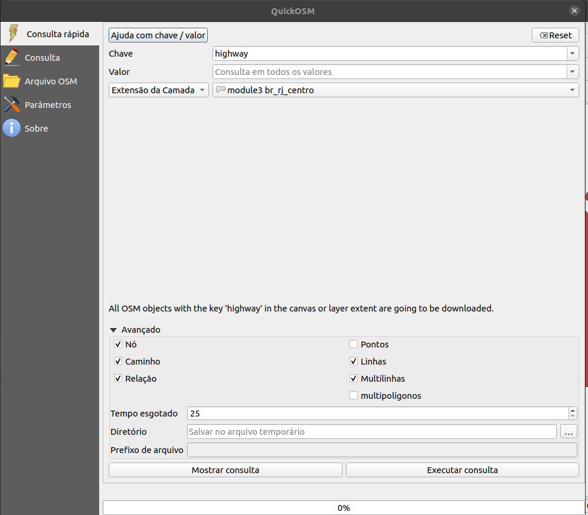
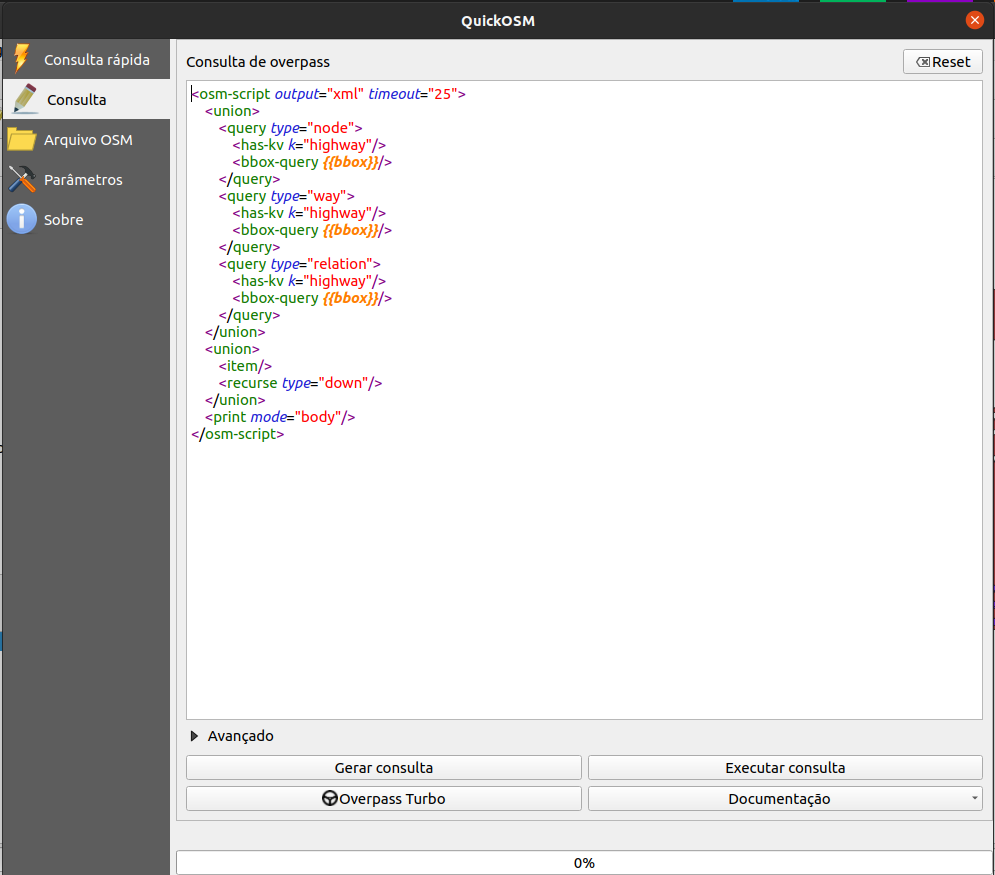
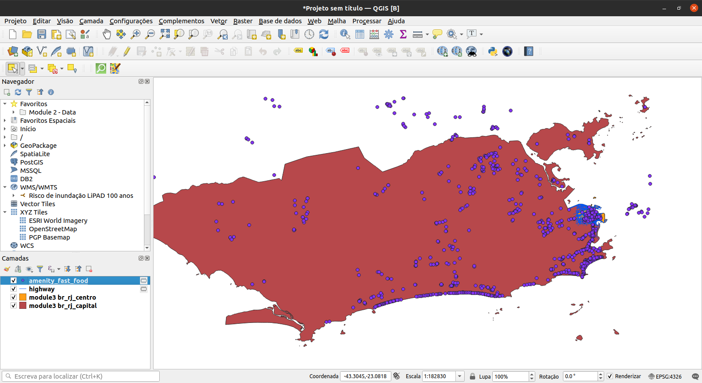

# Módulo 3 - OpenStreetMap e a camada de assentamentos de alta resolução

**Autor**: Ben Hur

## Introdução pedagógica

Este módulo apresentará o OpenStreetMap (OSM) e a camada de assentamentos de alta resolução (High Resolution Settlement Layer - HRSL). No final deste módulo, os alunos estarão familiarizados com:

* Princípios do OpenStreetMap
* Dados e casos de uso do OpenStreetMap
* Dados e casos de uso da camada de assentamentos de alta resolução

Eles também devem ser capazes de:

* carregar dados OSM como vetores e tiles no QGIS
* carregar o raster HRSL no QGIS

## Ferramentas e recursos necessários

As ferramentas e recursos necessários para este módulo são:

* computador
* conexão com a internet
* QGIS 3.16 instalado no computador ([https://qgis.org/en/site/forusers/download.html](https://qgis.org/en/site/forusers/download.html))
* Camadas vetoriais `br_rj_capital` e `br_rj_centro` (dentro de [module3.gpkg](module3.gpkg)).

## Pré-requisitos

* conhecimento básico de operação de um computador
* familiaridade com formatos de dados espaciais, a interface QGIS e como carregar camadas no QGIS (conclusão dos Módulos 0, 1 e 2)

## Recursos adicionais

* OpenStreetMap - [https: / /www.openstreetmap.org/](https://www.openstreetmap.org/)
* OpenStreetMap Wiki - [https://wiki.openstreetmap.org/](https://wiki.openstreetmap.org/)
* Manual do usuário da API OVerpass - [https://dev.overpass-api.de/overpass-doc/en/](https://dev.overpass-api.de/overpass-doc/en/)
* Facebook - AHigh Resolution Settlement Layer - [https://research.fb.com/downloads/high-resolution-settlement-layer-hrsl/](https://research.fb.com/downloads/high-resolution-settlement-layer-hrsl/)
* CEISIN - High Resolution Settlement Layer - [https://ciesin.columbia.edu/data/hrsl/](https://ciesin.columbia.edu/data/hrsl/)
* HDX HRSL - [https://data.humdata.org/search?organization=facebook&q=%22High%20Resolution%20Population%20Density%20Maps%20%2B%20Demographic%20Estimates%22](https://dados.humdata.org/search?organization=facebook&q=%22High%20Resolution%20Population%20Density%20Maps%20%2B%20Demographic%20Estimates%22)

## Introdução temática

Os mapas se tornaram onipresentes em nossas vidas diárias. Podemos simplesmente acessar nossos telefones e abrir aplicativos que utilizam mapas e dados de localização. Existem aplicativos que usamos para nos orientar e nos localizar, para navegar e ir de um lugar para outro; mapas são mostrados quando pedimos comida em nosso serviço de entrega favorito, etc. Os mapas se tornaram tão essenciais para o nosso dia a dia que nós tendemos a esquecer que existem lugares no mundo que ainda não estão mapeados ou não foram encontrados nos mapas digitais que usamos.

## Análise dos conceitos

A onipresença dos mapas em nossas vidas é um subproduto da grande quantidade de dados de localização e dados espaciais que estamos coletando. As oportunidades e o potencial para criar algo bom a partir dos dados geoespaciais disponíveis para nós são excelentes, mas isso só será possível se esses conjuntos de dados geoespaciais forem gratuitos e abertos.

## Conteúdo principal

### Título da fase 1: Dados do OpenStreetMap (OSM)

#### **O que é OpenStreetMap (OSM)?**

OpenStreetMap (OSM) ([https://www.openstreetmap.org/](https://www.openstreetmap.org/)) é um mapa editável gratuito de todo o mundo, construído por voluntários de todo o mundo e lançado com uma licença de conteúdo aberto. É um projeto que cria e distribui dados geográficos gratuitos para o mundo - um mapa do mundo feito pelas pessoas e para as pessoas. Se algo estiver faltando no OSM, você pode adicioná-lo. Se algo estiver errado no OSM, você pode corrigi-lo. OSM é um bem digital comum que amplia muito o valor das informações adicionadas a ele.

Figura 3.1. OpenStreetMap

Para obter mais informações sobre por que o OpenStreetMap existe e sua importância, veja: [https://wiki.openstreetmap.org/wiki/FAQ#Why_OpenStreetMap.3F](https://wiki.openstreetmap.org/wiki/FAQ#Why_OpenStreetMap .3F)

Você também pode ler: [https://wiki.openstreetmap.org/wiki/About_OpenStreetMap](https://wiki.openstreetmap.org/wiki/About_OpenStreetMap)

De acordo com o OpenStreetMap, ele possui "dados abertos, licenciados sob a Open Data Commons Open Database License (ODbL)" ([https://opendatacommons.org/licenses/odbl/](https://opendatacommons.org/licenses/odbl/)) pela OpenStreetMap Foundation (OSMF) ([https://osmfoundation.org/](https://osmfoundation.org/)) e você é livre para "copiar, distribuir, transmitir e adaptar nossos dados, desde que dê crédito ao OpenStreetMap e seus contribuidores. Se você alterar ou ampliar nossos dados, poderá distribuir o resultado apenas sob a mesma licença." Ao criar um mapa que usa dados OSM, é necessário dar crédito a “contribuidores do © OpenStreetMap”. Você pode ler mais sobre os direitos autorais e a licença do OpenStreetMap aqui: [https://www.openstreetmap.org/copyright](https://www.openstreetmap.org/copyright)

#### **Onde o OpenStreetMap é usado?**

Um dos principais valores do OpenStreetMap é a capacidade de coletar, editar e compartilhar dados de mapas que podem ser usados ​​para muitos propósitos diferentes. Essa é a liberdade proporcionada pelo ObDL. Como o OpenStreetMap permite que os usuários utilizem seus dados com pouquíssimas restrições, há uma grande variedade de aplicativos, serviços e casos de uso que são construídos, estão sendo construídos ou podem ser construídos com o OpenStreetMap. O OpenStreetMap é usado para criar mapas, serviços de roteamento, educação e até mesmo para fins humanitários e de advocacy.

Na verdade, existe o HOT (Humanitarian OpenStreetMap Team) ou a Equipe Humanitária OpenStreetMap ([https://www.hotosm.org/](https://www.hotosm.org/)), que é uma equipe internacional dedicada à ação humanitária e ao desenvolvimento da comunidade através do mapeamento aberto.

O OpenStreetMap também é uma parte crucial de algumas comunidades de mapeamento de advocacy, como MapBeks ([https://wiki.openstreetmap.org/wiki/MapBeks](https://wiki.openstreetmap.org/wiki/MapBeks)) - uma comunidade online de mapeamento LGBT, sediada nas Filipinas, que defende a inclusão e representação da diversidade voltada especificamente para lésbicas, gays, bissexuais, transgêneros, queer, intersexuais, etc. (LGBTQI +) no OpenStreetMap; e Mental Health AWHEREness ([https://mentalhealthawhereness.com/](https://mentalhealthawhereness.com/)) - uma plataforma e mapa on-line que mostram a localização de instalações e serviços de saúde mental que oferecem ajuda para pessoas nas Filipinas, organizada por voluntários.

Uma lista de serviços baseados em OpenStreetMap pode ser encontrada em [https://wiki.openstreetmap.org/wiki/List_of_OSM-based_services](https://wiki.openstreetmap.org/wiki/List_of_OSM-based_services).

#### **Como o OpenStreetMap pode ser usado no QGIS?**

Os dados OSM podem ser usados ​​no QGIS de várias maneiras. O primeiro é usando camadas de tiles derivadas de OSM como mapas base. Na verdade, o QGIS vem com uma conexão a uma camada de tiles do OpenStreetMap por padrão. Você pode encontrar essa camada chamada “OpenStreetMap” na lista de tiles XYZ no painel do navegador.

Você pode adicionar outros tiles derivados do OSM no QGIS, como aqueles encontrados na lista de fornecedores do Leaflet ([https://leaflet-extras.github.io/leaflet-providers/preview/](https://leaflet-extras.github .io / leaflet-owners / preview /)). Os tiles derivados do OSM fornecem aos usuários acesso livre e aberto a um mapa de base atualizado, uma vez que esses tiles são normalmente atualizados para corresponder ao estado atual do OSM.

Você também pode carregar os recursos do OSM como dados vetoriais no QGIS. Isso pode ser feito baixando dados OSM de sites como GEOFABRIK ([https://www.geofabrik.de/data/download.html](https://www.geofabrik.de/data/download.html)).

Os dados de feições OSM também podem ser carregados diretamente no QGIS usando o plugin QuickOSM. Este plugin utiliza a API Overpass ([https://wiki.openstreetmap.org/wiki/Overpass_API](https://wiki.openstreetmap.org/wiki/Overpass_API)) que permite aos usuários selecionar rapidamente um subconjunto de OSM dados usando consultas. Isso é possível porque as feições no OSM ([https://wiki.openstreetmap.org/wiki/Mapfeatures](https://wiki.openstreetmap.org/wiki/Mapfeatures)) são marcados ("tagueados") usando um sistema de tags livre ([https://wiki.openstreetmap.org/wiki/Tags](https://wiki.openstreetmap.org/wiki/Tags)) que permite ao mapa incluir um número ilimitado de atributos que descrevem cada característica. Essas tags podem então ser usadas para consultar certas feições com base em seus atributos / tags.

Normalmente, a comunidade OSM e as comunidades locais concordam com certas combinações de chave e valor adequadas para as tags mais comumente usadas, que funcionam como um padrão informal. Isso garante que os usuários de dados possam esperar consistência na marcação de características comuns, como estradas, edifícios, etc. No entanto, usuários sempre podem criar novas tags para melhorar o estilo do mapa ou análises de suporte que dependem de atributos ou tags dos recursos previamente não mapeados.

#### **Exercício 1: Carregando dados OSM no QGIS usando o plugin QuickOSM**

Neste exercício, vamos carregar dados da rede rodoviária e localizações de cadeias de fast food do OSM que podem ser encontradas no Rio de Janeiro, capital usando o QuickOSM plugar.

QuickOSM funciona consultando as tags (chaves e valores) dos recursos do OSM. Para obter mais informações sobre como usar a chave / valor no QuickOSM, vá para: [https://wiki.openstreetmap.org/wiki/Mapfeatures](https://wiki.openstreetmap.org/wiki/Mapfeatures.).

1. Carregue as camadas vetoriais `br_rj_capital` e `br_rj_centro` encontradas dentro do geopackage module3. Certifique-se de que a camada `br_rj_capital` está sobre a camada `br_rj_centro`, para que ela seja visível.

Figura 3.2. Camadas do Rio de Janeiro (capital e centro da cidade) carregadas no QGIS

2. Certifique-se de que o plugin QuickOSM está instalado e ativado. Ele deve aparecer em **Vetor ‣ QuickOSM** na barra de menus. Caso contrário, instale e ative o plug-in primeiro usando a caixa de diálogo Gerenciar e instalar plug-ins.
3. Abra o plugin QuickOSM (**Vetor ‣ QuickOSM ‣ QuickOSM**). Uma caixa de diálogo deve abrir com cinco guias:

    1. Consulta rápida
        * Permite ao usuário criar e executar uma consulta simples com uma combinação de valor-chave para carregar um subconjunto de dados de recursos OSM que atenda aos requisitos da consulta.

    2. Consulta
        * Permite ao usuário executar consultas complexas usando a API Overpass.
        * Possui um link para o aplicativo da web Overpass Turbo.

    3. Arquivo OSM:
        * Permite ao usuário carregar dados de arquivos OSM brutos (por exemplo .pbf).

    4. Parâmetros:
        * Permite ao usuário selecionar a API Overpass a ser usada.

    5. Sobre:
        * Mostra informações sobre o plugin.

Figura 3.3. Plugin QuickOSM

4. Carregue todas as rodovias dentro da extensão da camada `br_rj_centro`.

    * Chave: highway
    * Valor: <deixe em branco> (em branco significa TODOS)
    * Extensão da camada: `br_rj_centro`
    * Avançado:
        * Marque Nó, Caminho, Relação, Linhas, Multilinhas

Figura 3.4. Carregue todas as rodovias na extensão da camada `br_rj_centro`

5. Clique em Executar consulta. Basicamente, o que estamos dizendo ao QuickOSM é obter todos os recursos de linha ou multilinha marcados com uma chave (tag) de estrada e carregá-los no QGIS. Quando o plugin terminar de carregar a camada, seu mapa deverá ficar assim:

Figura 3.5. Dados da rodovia carregados do OSM

6. Observe que as camadas carregadas pelo QuickOSM são camadas temporárias. Você deve salvá-los como arquivos ou torná-los persistentes se precisar usá-los posteriormente.
7. Se quiser ver a versão de consulta Overpass de sua Consulta Rápida, clique em Mostrar consulta e a consulta será aberta na guia Consulta. Você pode então editar sua consulta para torná-la mais complexa.

Figura 3.6. A versão de consulta Overpass da consulta rápida para carregar rodovias

8. Em seguida, vamos carregar todos os locais de restaurantes fast food na extensão da camada `br_rj_capital`. Abra o plug-in QuickOSM e coloque os seguintes parâmetros na guia Consulta rápida:

    * Chave: amenity
    * Valor: fast_food
    * Extensão da camada: `br_rj_capital`
    * Avançado:
        * Marque Nó, Caminho, Relação, Pontos

 marcados como fast_food na extensão da camada `br_rj_capital`")

Figura 3.7: Carregar amenidades (pontos) marcados como fast_food na extensão da camada `br_rj_capital`

9. O resultado deve ser semelhante a abaixo:

Figura 3.8: Locais de fast food carregados do OSM

10. Observe que até mesmo dados fora dos polígonos são carregados. Isso ocorre porque estamos usando a extensão da camada como nossa caixa delimitadora. Se precisarmos apenas dos recursos dentro do polígono, podemos selecionar ou recortar esses recursos. O processo de como fazer isso será discutido em módulos futuros.

#### **Perguntas do questionário**

1. Verdadeiro ou falso:

    1. Um recurso no OpenStreetMap só pode ter uma tag ou atributo. - *** Falso ***
    2. Você só pode adicionar pontos no OpenStreetMap. - *** Falso (você também pode adicionar outros recursos, como linhas e polígonos) ***
    3. O OpenStreetMap só pode ser usado como um mapa online. - *** Falso (você também pode baixar e usar os dados vetoriais criados pelo OpenStreetMap, como ao usá-los com o plugin QuickOSM) ***

### Título da fase 2: Os dados da camada de assentamentos de alta resolução (HRSL)

## ## **O que é High Resolution Settlement Layer (HRSL), ou camada de assentamentos de alta resolução?**

De acordo com o Facebook e o Center for International Earth Science Information Network (CIESIN) da Universidade de Columbia, EUA, o “High Resolution Settlement Layer (HRSL) fornece estimativas da população humana distribuição a uma resolução de 1 segundo de arco (aproximadamente 30 metros) ”.

Grades populacionais foram desenvolvidas para 140 países e podem ser acessadas no Humanitarian Data Exchange ([https://data.humdata.org/search?organization=facebook&q=%22High%20Resolution%20Population%20Density%20Maps%20%2B% 20Demographic% 20Estimates% 22](https://data.humdata.org/search?organization=facebook&q=%22High%20Resolution%20Population%20Density%20Maps%20%2B%20Demographic%20Estimates%22)).

As estimativas da população são baseadas em dados do censo e imagens de satélite de alta resolução (0,5) da DigitalGlobe. Assentamentos e estruturas construídas pelo homem são identificados nas imagens pela aplicação de técnicas de visão computacional. Esses locais são então usados ​​como um proxy para locais onde as pessoas vivem. Posteriormente, o CIESIN usou a alocação proporcional para distribuir os dados populacionais dos censos para as extensões de assentamento.

Para a iteração atual do HRSL, sete mapas / conjuntos de dados para a distribuição de várias populações estão disponíveis:

1. Densidade populacional geral
2. Mulheres
3. Homens
4. Crianças (idades 0-5)
5. Jovens (idades 15-24)
6. Idosos (idades 60+)
7. Mulheres em idade reprodutiva (idades 15-49)

Figura 3.9: Dados HRSL em HDX

#### **Casos de uso do HRSL**

As grades populacionais fornecem informações precisas e de alta resolução tanto sobre o delineamento dos assentamentos em áreas urbanas e rurais quanto sobre o número de pessoas que vivem nelas. Essas informações são úteis para muitas áreas de pesquisa, como resposta a desastres e humanitária, planejamento e desenvolvimento de infraestrutura.

Para ler mais sobre o HSRL, você pode ir para:

Como trabalhar com dados de densidade populacional do Facebook - [http://www.statsmapsnpix.com/2021/01/how-to-work-with-facebook-population.html] (http://www.statsmapsnpix.com/2021/01/how-to-work-with-facebook-population.html)

População aberta e desafios abertos - [https://engineering.fb.com/2016/11/15/core-data/open-popul-datasets-and-open-challenge/](https://engineering.fb.com/2016/11/15/core-data/open-population-datasets-and-open-desafios/)

Conectando o mundo com mapas melhores - [https://engineering.fb.com/2016/02/21/core-data/connecting-the-world-with-better-maps/](https://engineering.fb.com/2016/02/21/core-data/Connecting-the-world-with-better-maps/)

Mapeando a população mundial, um prédio por vez - [https://arxiv.org/abs/1712.05839](https://arxiv.org/abs/1712.05839)

#### **Exercício 2: Carregando os dados HRSL no QGIS**

Os dados HRSL encontrados no HDX vêm em formato GeoTIFF (raster) e CSV (vetor). Os CSV são localizações de pontos com valores de população correspondentes. Para este exercício, um subconjunto de dados para seu país já foi preparado, mas você sempre pode baixar o conjunto de dados inteiro ou mesmo outros conjuntos de dados para experimentar.

1. Carregue o arquivo raster **hrsl_rj_capital_populacao** no QGIS.

Figura 3.10: O HRSL para Rio de Janeiro, capital

2. Verifique as Propriedades da camada.
3. Você também pode editar a Simbologia e o Estilo do raster (será discutido em um módulo futuro)

#### **Questões do questionário**

1. Quais conjuntos de dados foram usados ​​para obter a localização dos assentamentos e alocar a população para estes assentamentos?
2. Como o HRSL conseguiu os locais dos assentamentos?
3. Como a população de uma área foi alocada para os assentamentos?

### Se você quiser ir além:  

#### **Use a API Overpass para criar uma consulta no OSM**

A API Overpass ([https://wiki.openstreetmap.org/wiki/Overpass_API](https:/ /wiki.openstreetmap.org/wiki/Overpass_API)), anteriormente conhecido como OSM Server Side Scripting, ou OSM3S antes de 2011, é uma API somente leitura que fornece partes personalizadas selecionadas dos dados do mapa OSM. Ao contrário da API principal, que é otimizada para edição, a API Overpass é otimizada para consumidores de dados para obter um pequeno subconjunto dos cerca de 10 milhões de elementos no OpenStreetMap. Esses subconjuntos podem ser selecionados por critérios de pesquisa, como localização, tipo de objetos, propriedades de tag, proximidade ou combinações deles. A API Overpass serve como back-end para outros serviços baseados em OSM, como o plugin QuickOSM.

O uso de uma consulta Overpass permite criar uma seleção de recursos mais complexa no QuickOSM. Por exemplo, vamos carregar todos os fast foods novamente dentro da extensão de `br_rj_capital`, mas desta vez vamos apenas pegar as franquias do Subway. Se você observar a tabela de atributos da camada de fast food, notará que ela possui um campo **name**. Os campos na tabela de atributos de dados carregados do OSM correspondem às chaves de tag, portanto, se quisermos apenas selecionar todos os ramos do Subway fast food, precisamos adicionar um filtro que seleciona um recurso se ele tiver um **chave:valor** de **name:Subway**. Este filtro pode ser facilmente adicionado na API Overpass.

1. Abra o plugin QuickOSM e insira os parâmetros que usamos para consultar todos os fast foods.

Consulta rápida para carregar todas as comodidades marcadas como fast food

2. Clique em Mostrar consulta.

Consulta Overpass para carregar todas as comodidades marcadas como fast food

3. Edite a consulta e adicione a linha **&lt;has-kv k="name" v="Subway"/>** após cada linha &lt;has-kv k="amenity" v="fast_food"/>.

Consulta Overpass para carregar fast foods Subway

4. Clique em Executar consulta. Isso deve carregar apenas as amenidades marcadas como fast_food com o nome Subway. O nome da camada será OsmQuery.

Amenidades marcadas como fast food cujo nome é Subway carregado do OSM

5. Experimente com outras redes de fast food.

Você também pode testar e criar consultas Overpass no Overpass turbo ([https://wiki.openstreetmap.org/wiki/Overpass_turbo](https://wiki.openstreetmap.org/wiki/Overpass_turbo)) que é uma ferramenta web de mineração de dados para OpenStreetMap.

### Para praticar suas novas habilidades, tente…

#### **Carregar mais recursos do OSM usando o plug-in QuickOSM**

1. Tente carregar outros recursos (pontos, linhas, polígonos) como hospitais, escolas, etc. usando o plugin QuickOSM.

### Dicas

Se você não conseguir encontrar a feição que deseja ou precisa no OpenStreetMap, você pode adicionar ou editar feições no próprio mapa. Inscreva-se em [https://www.openstreetmap.org/](https://www.openstreetmap.org/) e comece a contribuir!
