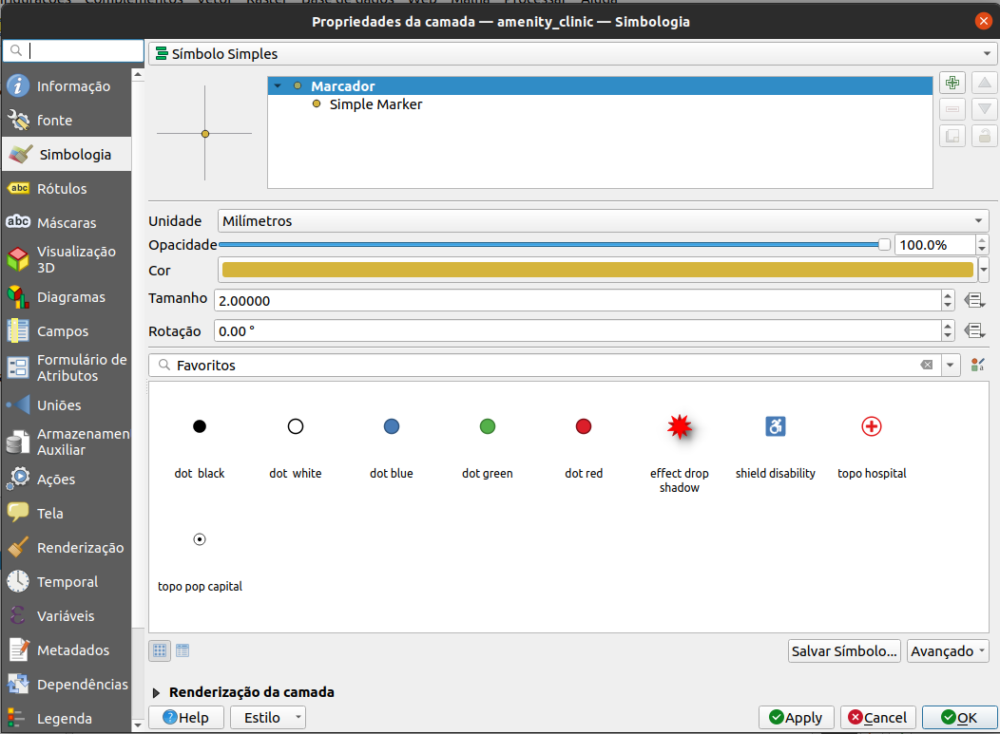
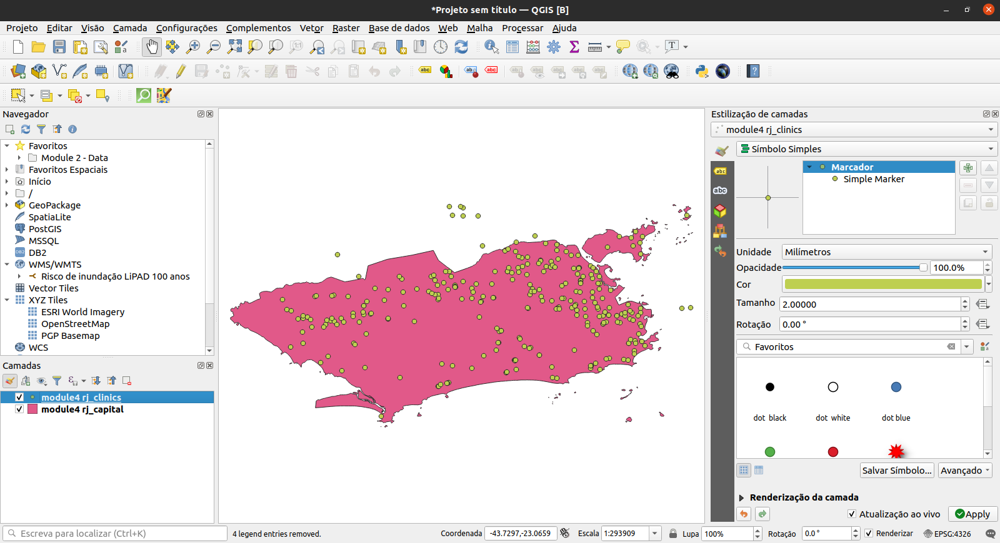
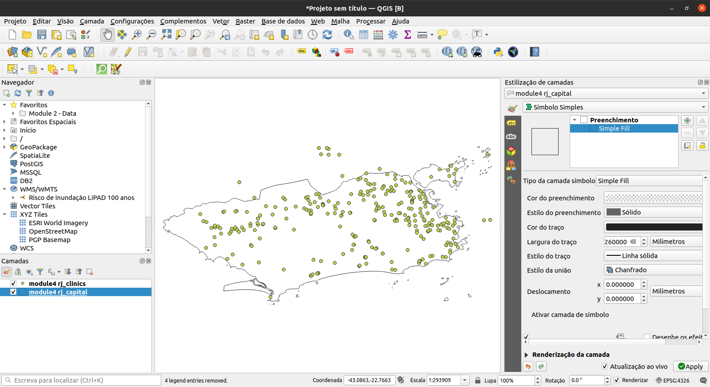
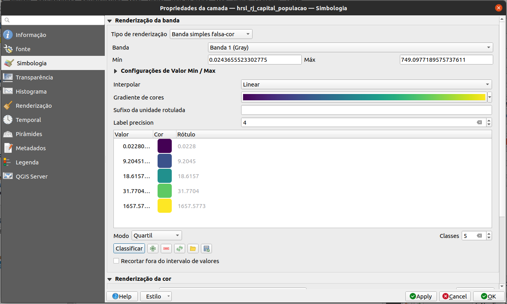
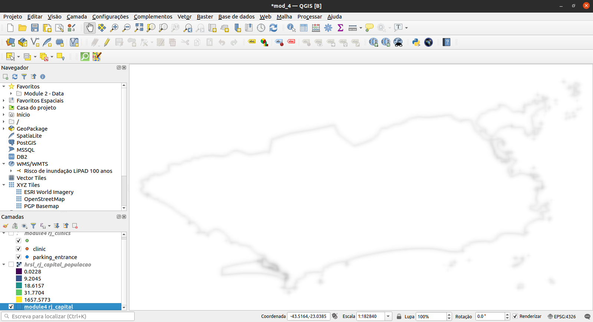
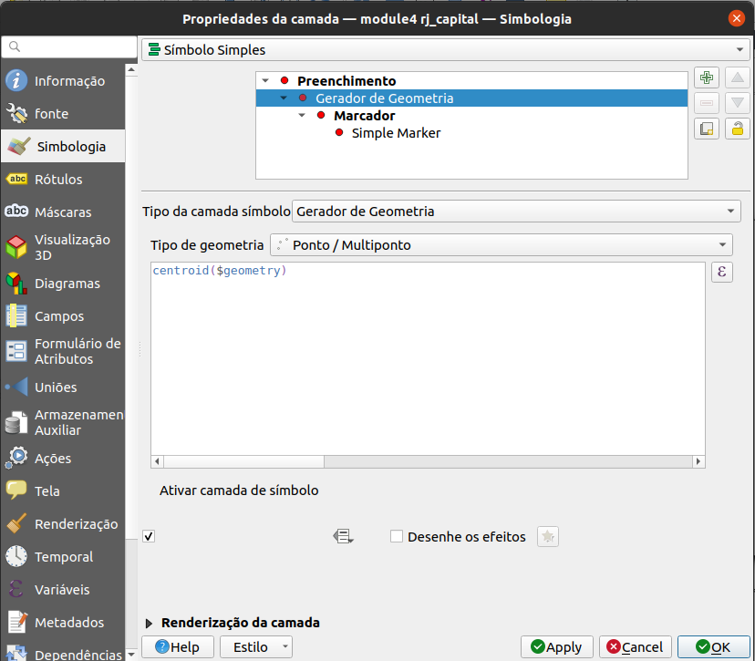
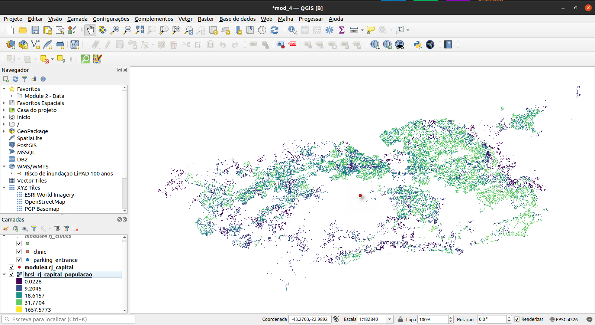

# Módulo 4 - Camadas de estilo

**Autor**: Ketty

## Introdução pedagógica

Este módulo foi desenvolvido para te ensinar como mudar a aparência visual de um mapa selecionando símbolos apropriados, cores de mapa e aplicando efeitos apropriados. Ao final do módulo, você deverá conhecer conceitos como simbologia e estilos de mapas. Além disso, você aprenderá as seguintes habilidades;

* camadas de estilo
* simbologia básica de raster e vetor e como aplicá-los a uma camada
* modos de mesclagem (blending) e efeitos de desenho
* usando expressões para executar uma operação espacial

## Ferramentas e recursos necessários

* Computador
* Conexão com a Internet
* QGIS 3.16 ou posterior
* Pampanga camada limite administrativa (dentro de [module4.gpkg](data/module4.gpkg))
* Clínicas Pampanga (dentro de [module4.gpkg](data/module4.gpkg))
* [Camada de assentamentos de alta resolução de Pampanga](data/HRSL_Pampanga_Population.tif )

## Pré-requisitos

* Conhecimento básico de operação de um computador
* Compreensão razoável de todos os módulos anteriores

## Recursos adicionais

* Simbologia QGIS - [https://docs.qgis.org/3.16/en/docs/training_manual/basic_map/symbology.html ] (https://docs.qgis.org/3.16/en/docs/training_manual/basic_map/symbology.html)
* Repositório de compartilhamento de estilo - [https://www.gislounge.com/qgis-style-sharing-repository/ ] (https://www.gislounge.com/qgis-style-sharing-repository/)
* Estilos - [https://plugins.qgis.org/styles/](https://plugins.qg is.org/styles/)
* Style Hub - [https://style-hub.github.io/](https://style-hub.github.io/)
* Hillshade no QGIS - [https://bnhr.xyz/2019/02/08/mapping-icebergs-in-qgis.html] (https://bnhr.xyz/2019/02/08/mapping-icebergs-in-qgis.html)
* Mapeando icebergs no QGIS - [https://bnhr.xyz/2019/02/08/mapping-icebergs-in-qgis.html](https://bnhr.xyz/2019/02/08/mapping-icebergs-in-qgis.html)

## Introdução temática

Vamos começar com um exemplo:

Vamos imaginar que você está em uma nova cidade, talvez como turista, a lazer ou a negócios. A cidade tem uma gama de locais que você precisa ver, incluindo museus, cafés, praias, monumentos, lojas culturais e mercados. Em seguida, você recebe um mapa de papel da cidade que mostra a localização dos pontos de todos os lugares imperdíveis da cidade. Os pontos turísticos estão todos marcados com pontos vermelhos. Em sua opinião, este mapa facilitaria seu passeio pela nova cidade? Eu imaginaria que não.

Por isso é sempre importante fazer um “Mapa com diferentes símbolos e cores”. O que você vê em seu mapa depois de aplicar conceitos de estilo é uma representação visual dinâmica dos dados com os quais você está trabalhando.

### Painéis, guias e tipos de renderização principais

#### **Painel de estilo da camada**

Este painel é um atalho para alguns dos recursos da caixa de diálogo de propriedades da camada. Na verdade, ele oferece uma maneira rápida e prática de definir a renderização e o comportamento de uma camada e de visualizar seus efeitos sem abrir a caixa de diálogo de propriedades da camada.

Além de evitar que você tenha que lidar com o janela das propriedades da camada, ele também evita que você congestione a tela com diálogos de recursos, visto que incorpora a maioria deles (seletor de cores, propriedades de efeitos, edição de regras, substituição de rótulos...): por exemplo, clicar nos botões de cores dentro do painel de estilo da camada faz com que a caixa de diálogo do seletor de cores seja aberta dentro do próprio painel de estilo da camada, e não como uma caixa de diálogo separada.

Em uma lista suspensa de camadas atuais no painel de camadas, selecione um item e:

* defina sua simbologia, transparência e histograma no caso de uma camada raster. Essas opções são as mesmas disponíveis na caixa de diálogo Propriedades do raster ([https://docs.qgis.org/3.16/en/docs/user_manual/working_with_raster/raster_properties.html#raster-properties-dialog](https://docs.qgis.org/3.16/en/docs/user_manual/working_with_raster/raster_properties.html#raster-properties-dialog)).
    * Acesse o Diálogo de Propriedades Raster clicando duas vezes em Camada Raster-> Geral
* defina sua simbologia e rótulos. Essas opções são as mesmas disponíveis na caixa de diálogo Propriedades do vetor ([https://docs.qgis.org/3.16/en/docs/user_manual/working_with_vector/vector_properties.html#vector-properties-dialog](https://docs. qgis.org/3.16/en/docs/user_manual/working_with_vector/vector_properties.html#vector-properties-dialog)).
    * Acesse a caixa de diálogo Propriedades do vetor clicando duas vezes em Camada do vetor-> Geral
* siga todo o histórico de alterações que você aplicou ao estilo da camada no projeto atual; você pode, portanto, cancelar ou restaurar qualquer estado selecionando-o na lista e clicando em Aplicar.

Outro recurso poderoso deste painel é a caixa de seleção Atualização ao vivo. Marque-o e suas alterações serão automaticamente renderizadas na tela do mapa conforme você avança. Assim, você não precisa mais clicar no botão Aplicar.

Para ativar o painel, clique em Exibir -> Painéis e, a seguir, marque Estilo de camada.

Figura 4.1: Painel de estilo da camada

#### **Guia Simbologia nas Propriedades das camadas**

Para acessar a guia Simbologia, clique duas vezes na camada para abrir as Propriedades de Camada -> Clique em Simbologia

Aqui, você pode especificar as configurações como o tipo de renderização, banda, valores mínimos e máximos, renderização de cores e reamostragem (resampling). Nas capturas de tela abaixo, você pode ver as guias de simbologia para conjuntos de dados vetoriais e raster, respectivamente;

Figura 4.2: Guia de simbologia para dados vetoriais e raster, respectivamente

#### **Renderização raster: renderização de banda**

QGIS oferece quatro tipos diferentes de renderização. A escolha do renderizador depende do tipo de dados. O tipo de renderização padrão é a cor cinza de banda única. Você terá que alterá-lo para o tipo apropriado com base no tipo de dados.

* Cores multibanda  ([https://docs.qgis.org/3.16/en/docs/user_manual/working_with_raster/raster_properties.html#multiband-color](https://docs.qgis.org/3.16/en/docs/user_manual/working_with_raster/raster_properties.html#multiband-color)) - se o arquivo vier com várias bandas (por exemplo, uma imagem de satélite com várias bandas).
* Valores paletados / únicos ([https://docs.qgis.org/3.16/en/docs/user_manual/working_with_raster/raster_properties.html#paletted]()) - para arquivos de banda única que vêm com uma paleta indexada (por exemplo, um mapa topográfico digital), ou para uso geral de paletas para renderizar camadas raster.
* Faixa única de cinzas ([https://docs.qgis.org/3.16/en/docs/user_manual/working_with_raster/raster_properties.html#singleband-gray](https://docs.qgis.org/3.16/en/docs/ user_manual / working_with_raster / raster_properties.html # singleband-grey)) - a imagem será renderizada como cinza (uma banda só dela). O QGIS escolherá este renderizador se o arquivo não for multibanda nem paletizado (por exemplo, um mapa de relevo sombreado).
* Pseudocor de banda única ([https://docs.qgis.org/3.16/en/docs/user_manual/working_with_raster/raster_properties.html#label-colormaptab](https://docs.qgis.org/3.16/en/docs/ user_manual / working_with_raster / raster_properties.html # label-colormaptab)) - este renderizador pode ser usado para arquivos com uma paleta contínua ou mapa de cores (por exemplo, um mapa de elevação).
* Hillshade ([(https://docs.qgis.org/3.16/en/docs/user_manual/working_with_raster/raster_properties.html#hillshade-renderer](https://docs.qgis.org/3.16/en/docs/ user_manual / working_with_raster / raster_properties.html # hillshade-renderer)) - Cria hillshade (sombras de colina) a partir de uma banda.

#### **Renderização de vetor**

Quando você carrega camadas de dados espaciais no QGIS Desktop, elas são estilizadas com uma renderização de símbolo único aleatória. Para alterar isso, clique em Camada-> Propriedades-> Estilo.

Existem várias opções de renderização disponíveis no menu no canto superior esquerdo:

* Símbolo único - esta é a renderização padrão em que um único símbolo é aplicado a todas feições em uma camada.
* Categorizado - permite que você escolha um campo de atributo categórico para estilizar a camada. Escolha o campo e clique em Classificar e o QGIS aplicará um símbolo diferente a cada valor único no campo. Você também pode usar o botão Definir expressão de coluna para aprimorar o estilo com uma expressão SQL.
* Graduado - permite que você classifique os dados por um atributo de campo numérico em categorias discretas. Você pode especificar os parâmetros da classificação (tipo de classificação e número de classes) e pode usar o botão Definir expressão de coluna para aprimorar o estilo com uma expressão SQL.
* Com base em regras - use para criar estilos baseados em regras personalizadas. As regras serão baseadas em expressões SQL.
* Deslocamento de pontos - se você tiver uma camada de pontos com pontos empilhados, esta opção pode ser usada para deslocar os pontos para que fiquem todos visíveis.
* Polígonos invertidos - este é um novo renderizador que permite que uma camada de polígonos seja convertida em uma máscara. Por exemplo, um polígono de limite de cidade usado com este renderizador se tornaria uma máscara ao redor da cidade. Também permite o uso de renderizadores categorizados, graduados e baseados em regras e expressões SQL.

## Conteúdo principal

### Fase 1: Raster básico e simbologia vetorial

A simbologia de dados vetoriais pode variar de acordo com a transparência, cor, rotação e tamanho.  

#### **Conteúdo**

* Propriedades da camada e menu de simbologia
* Tipos de renderização vetorial
* Tipos de renderização raster (renderização de banda)

#### **Exemplo 1: Renderização vetorial**

1. Para demonstrar este exemplo, nós usaremos dois conjuntos de dados de exemplo; 1. [Clínicas](https://drive.google.com/file/d/1iJQ1nP0ulA96OhyT9wakRheahYKnNmjc/view?usp=sharing) e 2. [Limite administrativo](https://drive.google.com/file/d/1GiFmr4As5e-yn-4lCqotAzUBHzXU1NS_/view?Usp=sharing) da província de Pampanga
2. Adicione as duas camadas vetoriais ao QGIS; Clique no botão Adicionar camada vetorial  ou use o painel do navegador.
3. É assim que eles são renderizados por padrão. Você notará que temos uma camada de polígono e uma camada de pontos. O próximo passo é mudar a simbologia de cada um deles. As cores de preenchimento podem não ser as mesmas do que as você está vendo aqui, mas isso não é um problema porque o QGIS seleciona cores aleatoriamente quando você adiciona uma camada.

Renderização padrão

Figura 4.3:

4. Clique duas vezes na camada vetorial de polígono, que também é a camada de limite administrativo da província de Pampanga nas Filipinas
5. Selecione a **Aba Simbologia** no menu que aparece
6. Altere a **Cor de preenchimento** para **Preenchimento transparente**. Dica: Clique na seta suspensa em Cor de preenchimento
7. O resultado deve ser o seguinte. Você pode notar que a opção sem preenchimento não tem cor

Figura 4.4: Polígono sem preenchimento

8. A próxima etapa é simbolizar a camada de ponto que também é a camada Clínicas
9. Clique duas vezes na **camada Clínicas** para abrir o diálogo **Propriedades da camada**. Altere o tipo de renderização de Símbolo Único para **Categorizado**, selecione **Valor** como `amenity`. O valor representa o campo de interesse. Especifique o símbolo e a escala de cor. Em seguida, clique em classificar.

Figura 4.5: Diálogo de Propriedades da Camada

10. O mapa resultante deve ser o seguinte

Figura 4.6: Renderização vetorial final

11. Lembre-se de organizar as camadas no **Painel de camadas** de forma que a camada poligonal fique abaixo da camada de pontos. Isso torna a camada de pontos visível.

#### **Exemplo 2: Renderização raster**

1. Clique duas vezes na camada raster, que também é a camada de densidade populacional. Isso também significa que ela é um conjunto de dados normalizado e, portanto, pode ser visualizado como um mapa coroplético.
2. Selecione a guia de simbologia no menu que aparece
3. Altere o modo de estilo para 'Pseudocor de banda única'

Figura 4.7: Menu de simbologia

4. Especifique a interpolação, escala de cor e modo. Clique em classificar. O resultado é um mapa coroplético mostrando a densidade populacional na província de Pampanga, nas Filipinas.

Figura 4.8: Densidade populacional da Província de Pampanga, Filipinas

5. Amplie para ver o novo mapa em maior detalhe

Figura 4.9: Mapa ampliado

6. Como alternativa, use o **painel Estilo de camada**.

#### **Perguntas do questionário**

1. O que é simbologia de camada?
2. Quais dos tipos de renderização abaixo são aplicáveis ​​para dados vetoriais?
3. Quais são os tipos de renderização raster?

#### **Respostas do questionário**

1. a. elemento gráfico representado como um marcador, traço ou preenchimento
   b. um ponteiro para os dados originais
   c. um repositório de diferentes esquemas de cores

2. a. renderizador de símbolo único
   b. renderizador sem símbolos
   c. renderizador categorizado
   d. renderizador graduado
   e. símbolo proporcional
   f. renderizador de cluster de ponto

3. a. pseudocolor de banda única
   b. cinza de banda única
   c. paletted

4. d. cor multibanda

### Fase 2: modos de mesclagem e efeitos de desenho

#### **Conteúdo**

* Alterando estruturas de símbolos
* Alterando efeitos de desenho e modos de mesclagem (blending)
* Visualização impactante de dados

#### **Tutorial**

1. Depois de carregar ambas as camadas no QGIS, a tela terá a aparência abaixo. Você notará que ambas as camadas têm um estilo simples. Este tutorial explicará como alterar efeitos de desenho e modos de mesclagem para uma melhor visualização.

Figura 4.10: A área de trabalho inicial esperada

2. Abra a janela Propriedades da camada e clique no item de menu Simbologia para a camada de limites administrativos. Dica: faça isso clicando duas vezes na camada ou use o painel de estilo da camada. Ative o painel de estilo da camada clicando em: Exibir -> Painéis -> Estilo da camada.

Na parte inferior do menu Symbology, há uma caixa de seleção para efeitos do Draw. Vamos habilitar isso e, em seguida, clicar no botão personalizar efeitos! [Alt_text] (media / customize-effects-button.png "image_tooltip") à sua direita:!

[Janela Propriedades da camada e menu de simbologia](media/draw-effects.png "Janela Propriedades da camada e menu Simbologia")

Figura 4.11: Janela Propriedades da camada e menu Simbologia

3. Uma nova caixa de diálogo Propriedades de efeitos é aberta

! [Caixa de diálogo Propriedades de efeitos](media/new-effects-dialog.png "caixa de diálogo Propriedades de efeitos")

Figura 4.12: Diálogo de propriedades de efeitos

4. Você pode ver que atualmente o único efeito listado é um efeito Fonte (Source). Os efeitos Fonte não são particularmente interessantes - tudo o que fazem é desenhar a camada original inalterada. Mude para um efeito de Desfoque **clicando na caixa de combinação Tipo de efeito e selecionando Desfoque**. Você pode então experimentar com os parâmetros de desfoque.

Figura 4.13: Selecione o tipo de efeito como desfoque

5. Aplique as configurações e você verá que a camada de polígono agora está desfocada. Agora estamos chegando a algum lugar!

Figura 4.14: Camada desfocada

6. Vamos usar a caixa de diálogo **Propriedades dos efeitos** novamente. Agora vamos tentar algo um pouco mais avançado. Em vez de apenas um único efeito, é possível encadear vários efeitos para criar resultados diferentes. Vamos fazer uma sombra projetada tradicional adicionando um efeito de **Sombra projetada** sob o efeito **Fonte**.

Figura 4.15: Diálogo de propriedades de efeitos

7. Os efeitos são desenhados de cima para baixo, então a sombra aparecerá abaixo dos polígonos de origem

Figura 4.16: Efeito de sombra projetada

8. Você pode empilhar quantos efeitos desejar. Por exemplo, um **brilho interno** sobre um **efeito fonte** com uma **sombra projetada** por baixo de tudo. Experimente!

Em geral, lembre-se de que os efeitos podem ser aplicados a uma camada inteira ou às camadas de símbolo individuais para feições dentro de uma camada. Basicamente, as possibilidades são quase infinitas! Os plug-ins Python também podem estender isso ainda mais implementando efeitos adicionais.

Para mais exemplos sobre o que você pode fazer com Modos de mescla e Efeitos de desenho no QGIS, você pode verificar:
* Hillshade no QGIS - [https://bnhr.xyz/2019/02/08/mapping-icebergs-in-qgis. html] (https://bnhr.xyz/2019/02/08/mapping-icebergs-in-qgis.html)
* Mapeando icebergs no QGIS - [https://bnhr.xyz/2019/02/08/mapping- icebergs-in-qgis.html] (https://bnhr.xyz/2019/02/08/mapping-icebergs-in-qgis.html)

### Fase 3: Substituições definidas por dados e geradores de geometria

#### **Conteúdo**

* Executar uma operação espacial dentro da simbologia da camada

#### **Tutorial**

Um gerador de geometria é um tipo de camada símbolo que permite usar código para criar novas geometrias a partir de feições existentes e usar as novas geometrias 'geradas' como símbolos que podem, por sua vez, ter estilos aplicados. Este é um recurso poderoso e é melhor explicado com um exemplo.

Você pode usar a simbologia do gerador de geometria com todos os tipos de camadas (pontos, linhas e polígonos). O símbolo resultante depende diretamente do tipo de camada.

Muito resumidamente, a simbologia do gerador de geometria permite que você execute algumas operações espaciais dentro da própria simbologia. Por exemplo, você pode executar uma operação espacial de centróide em uma camada de polígonos sem criar uma outras camada de pontos.

Além disso, você ainda tem todas as opções de estilo para alterar a aparência do símbolo resultante. Aqui está um tutorial de exemplo:

1. Clique duas vezes na camada de limite administrativo
2. Clique em Preenchimento simples e altere o tipo de camada de símbolo para Gerador de geometria. Antes de começar a escrever a consulta espacial, escolha o Tipo de geometria na saída. Neste exemplo, vamos criar centróides para cada recurso, então altere o Tipo de geometria para Ponto / Multiponto.

Figura 4.17: Operação centróide na camada limite administrativa

3. Ao clicar em OK, você verá que o limite da camada administrativa é renderizado como uma camada de ponto. Acabamos de executar uma operação espacial dentro da própria simbologia da camada.

Figura 4.18: Camada de pontos

4. Observe que uma maneira alternativa e mais fácil de escrever consultas espaciais é usando o 'diálogo Expressões'. Clique no  botão de expressões para abrir a caixa de diálogo de expressão. Aqui você terá acesso a uma extensa referência de funções. Você pode pesquisar uma função pelo nome. Por exemplo, digite "centróide" na barra de pesquisa.
5. Com a simbologia do gerador de geometria, você pode realmente ir além da simbologia normal.
6. Se você quiser ir mais longe, escreva uma consulta espacial para calcular um buffer em torno da camada de pontos, linhas ou polígonos.

#### ** Perguntas do questionário **

1.N / A

#### ** Respostas do questionário **

1.NA
