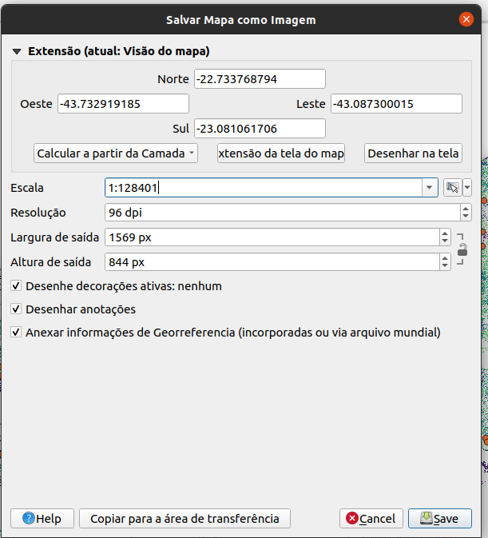
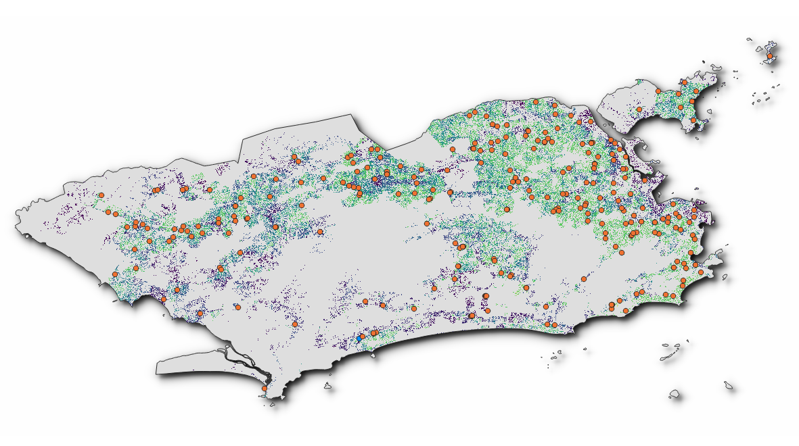
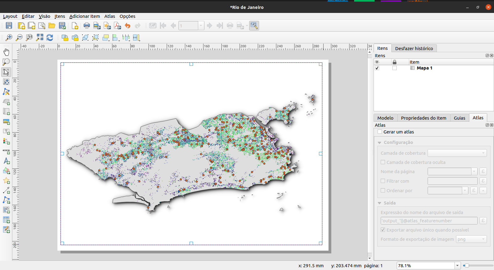
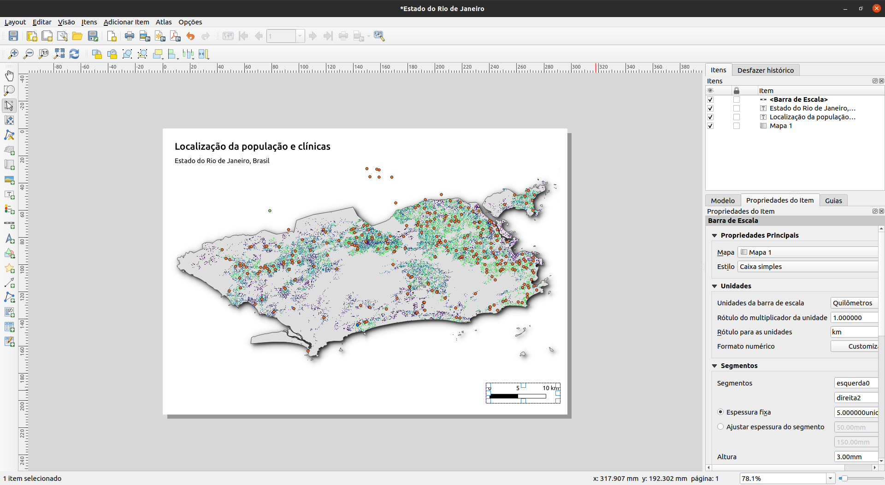
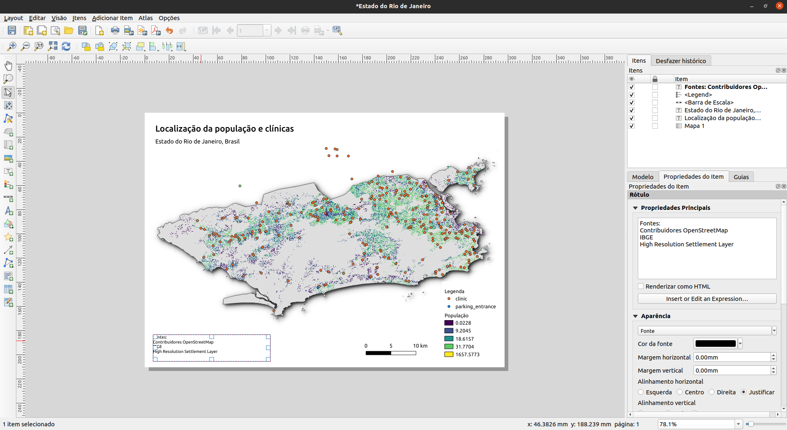
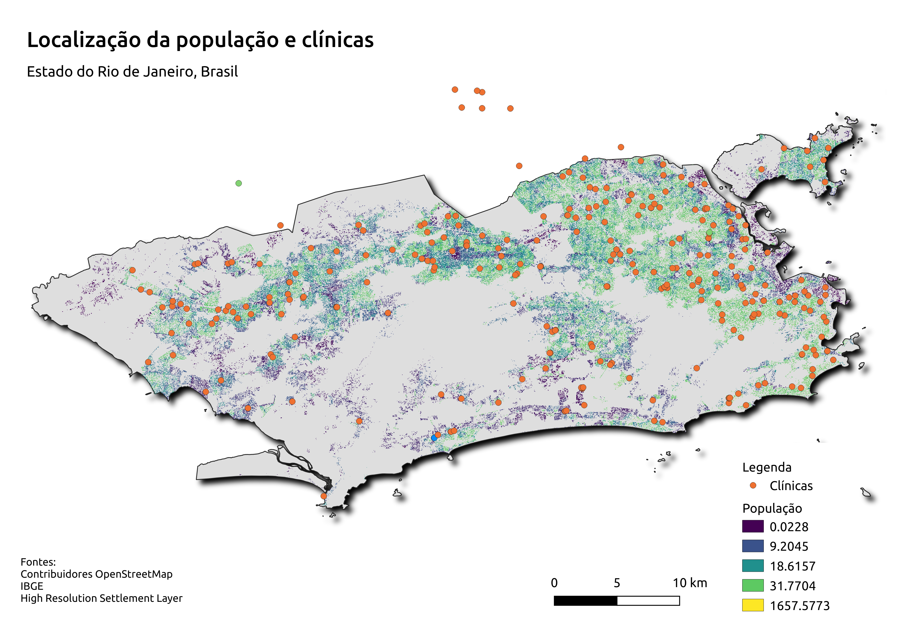
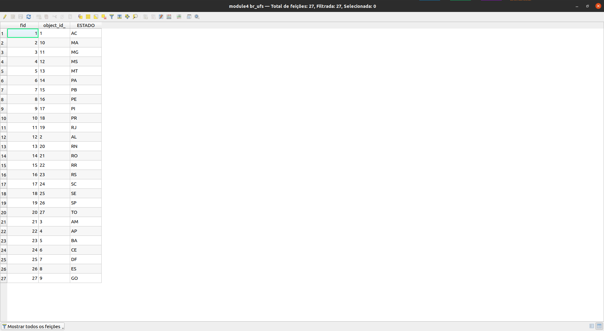
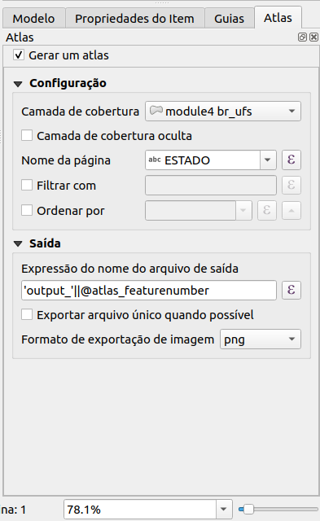

# Módulo 5 - Fazendo Mapas

**Autor**: Ketty

## Introdução Pedagógica

Este módulo irá fornecer a você uma visão geral das etapas frequentemente necessárias para elaborar um mapa no QGIS. No final do módulo, os participantes conhecerão os seguintes conceitos:

* Tela do mapa e camadas relacionadas
* O layout de impressão e o layout de impressão
* Elementos e propriedades do mapa

Além disso, você terá aprendido as seguintes habilidades;

* Usando o layout de impressão para fazer um mapa
* Adicionando elementos do mapa ao mapa
* Gerenciando layouts de impressão diferentes

## Ferramentas e recursos necessários

* Computador
* Acesso à Internet
* QGIS 3.16 ou posterior
* Camada de limite administrativo `rj_capital` (dentro de [module5.gpkg](data/module5.gpkg))
* `rj_clinics` (dentro de [module5.gpkg](data/module5.gpkg))
* Unidades Federativas do Brasil, `br_ufs` (dentro de [module5.gpkg](data/module5.gpkg))
* [RJ High Resolution Settlement Layer](data/hrsl_rj_capital_populacao.tif)

## Pré-requisitos

* Conhecimento básico de como operar um computador
* Uma compreensão de todos os módulos anteriores

## Recursos adicionais

* QGIS Map LayOut - [https://docs.qgis.org/3.16/en/ docs/training_manual/map_layout/map_layout.html](https://docs.qgis.org/3.16/en/docs/training_manual/map_layout/map_layout.html)
* Modelos de layout - [https://layout-hub.github.io/](https://layout-hub.github.io/)
* Gerenciador de estilos - [https://docs.qgis.org/3.16/en/docs/user_manual/style_library/style_manager.html](https://docs.qgis.org/3.16/en/docs/user_manual/style_library/style_manager.html)
* Biblioteca de estilos - [https://docs.qgis.org/3.16/en/docs/user_manual/style_library/index.html](https://docs.qgis.org/3.16/en/docs/user_manual/style_library/index.html)

## Introdução temática

Vamos começar com um exemplo:

Para fazer um mapa, você precisará de um tópico que gostaria de entender melhor, por exemplo 'Distribuição espacial de clínicas (equipamentos de saúde) no Rio de Janeiro'. Você notará que o tópico fornece um tema para explorar e a localização geográfica. Munido com essas informações e os dados relevantes que permitem que você explore mais a questão, você pode prosseguir para elaborar um mapa.

### Detalhamento dos conceitos

Este módulo enfocará os seguintes conceitos-chave de criação de mapas; tela do mapa e camadas relacionadas, o layout de impressão e elementos e propriedades do mapa. Primeiro, aqui estão as definições curtas de cada um:

* a **tela do mapa e camadas relacionadas**: é provavelmente o widget mais importante no QGIS porque mostra o mapa composto de camadas sobrepostas e permite a interação com o mapa e as camadas. Isso é abordado no Módulo 0: Introdução ao QGIS
* o **layout de impressão**: O layout de impressão fornece layout e recursos de impressão. Ele permite que você adicione elementos como o mapa, rótulos de texto, imagens, legendas, barras de escala, formas básicas, setas, tabelas de atributos e quadros HTML. Com o layout de impressão, você pode criar belos mapas e atlas que podem ser impressos ou salvos como um arquivo PDF, uma imagem ou um arquivo SVG. Esta é uma maneira poderosa de compartilhar informações geográficas produzidas com QGIS que podem ser incluídas em relatórios ou publicadas. Você pode salvar o layout como um modelo e carregá-lo novamente em outra sessão. Finalmente, a geração de vários mapas com base em um modelo pode ser feita por meio do gerador de atlas. A imagem abaixo mostra o layout de impressão e a interface do layout de impressão. Esta interface é aberta quando você abre um novo layout de impressão.

Figura 5.1: Layout de impressão

* **elementos e propriedades do mapa**: os mapas contêm muitas informações. A maioria dos mapas terá as cinco seguintes coisas: um título, uma legenda, uma grade, uma rosa dos ventos para indicar a direção e uma escala. O título informa o que está sendo representado no mapa.

## Conteúdo principal

### Título da fase 1: Exportando a tela do mapa

Neste tutorial, mostraremos duas maneiras de 'Exportar a tela do mapa' para o layout de impressão do QGIS. O primeiro método é direto, enquanto o segundo método explora os recursos mais avançados fornecidos pelo layout de impressão.

#### **Primeiro método: Exportar a tela do mapa sem o layout de impressão**

1. As camadas de dados já devem estar adicionadas à tela do QGIS. As camadas podem então ser estilizadas para comunicar informações em seus dados. Adicione as decorações do mapa clicando em **Exibir ‣ Decorações**. Selecione sua decoração de mapa preferida. Por exemplo, você pode adicionar o rótulo de título, barra de escala e rótulo de direitos autorais. Para cada decoração, você terá que especificar as configurações em uma caixa de diálogo.
2. A etapa final é exportar o mapa para o formato de imagem ou PDF. Para fazer isso, clique em **Projeto ‣ Importar/Exportar** e selecione o formato de exportação de sua preferência. A caixa de diálogo de exportação abaixo deve aparecer.

Figura 5.2: Exportando o mapa

3. Clique em **Salvar**. O mapa na tela do QGIS será salvo como um documento PDF ou imagem. Navegue até o local onde o arquivo foi salvo e agora você pode imprimir ou compartilhar o mapa.

Figura 5.3: Tela do mapa exportada como imagem

#### **Segundo método: Exportar a tela do mapa para a impressão layout**

1. Neste tutorial, faremos um mapa mostrando a 1.) localização dos centros de saúde e 2.) densidade populacional do Rio de Janeiro. As camadas de dados já devem ser adicionadas à tela do QGIS. As camadas podem então ser estilizadas para comunicar as informações dos seus dados.

Figura 5.4: Criando novo layout de impressão

2. A tela do mapa agora pode ser exportada para o layout de impressão. Clique no 'botão novo layout de impressão' . Isso pode ser acessado através da barra de ferramentas. Como alternative, acesse usando a barra de menu 'Projetos'. Uma caixa de diálogo de título será aberta, solicitando que você digite o título do Layout de impressão. Digite 'Rio de Janeiro' e clique em OK.

Figura 5.5: Nomeando o layout de impressão

3. O layout de impressão será aberto

Figura 5.6: A janela Layout de impressão

4. Você notará que a tela do layout de impressão está vazia. Para adicionar o mapa estilizado da tela QGIS, clique no botão 'Adicionar novo mapa ao layout', clique com o botão esquerdo do mouse e desenhe um retângulo no espaço em branco no centro do layout de impressão. O mapa será adicionado. Você acabou de adicionar um mapa para o layout de impressão. Agora é possível adicionar todos os outros elementos do mapa, como título, legenda, grades, etc.

Figura 5.7: Adicionar mapa a Layout de impressão

#### **Perguntas do questionário **

1. O que é a tela do mapa QGIS? (caixas de seleção)
2. Qual é a utilidade do layout de impressão? (caixas de seleção)
3. Qual dos seguintes não é um elemento do mapa? (botão de radio)

#### **Respostas do questionário **

1. a. mostra o mapa composto de camadas de mapa sobrepostas
   b. permite interação com o mapa e camadas
   c. um widget para fazer mapas

2. a. fornece layout crescente e recursos de impressão
   b. permite adicionar elementos do mapa
   c. lidar com a exportação e impressão de mapas

3. a. Título
   b. Escala
   c. Legenda
   d. Cores e designs

### Título da fase 2: Adicionando e editando elementos do mapa ao layout de impressão

#### **Conteúdo/Tutorial**

Agora que o mapa estilizado foi adicionado ao layout de impressão, é hora de adicionar elementos importantes como o título, escala, legenda, grade, metadados etc. para o layout de impressão. A maioria dos botões está localizada à esquerda do layout de impressão.

1. Clique no botão 'Adicionar rótulo' , mantenha pressionado o botão esquerdo do mouse e desenhe um retângulo onde deseja colocar o título do mapa. Digite o título no menu 'Propriedades principais' no lado direito do layout de impressão. As propriedades da fonte podem ser alteradas no item de menu 'Aparência'.

Figura 5.8: Adicione o título do mapa

2. Em seguida, adicionaremos a legenda e a escala. Uma declaração de atribuição de dados pode ser adicionada usando o botão 'Adicionar rótulo'. Clique no botão de Adicionar rótulo na barra da esquerda. Siga as mesmas etapas do item 1. acima para adicionar esse elemento ao layout de impressão. Você pode adicionar outros elementos do mapa, mas tome cuidado para que o mapa não fique muito confuso.

Figura 5.9: Adicionar barra de escala ao mapa

Figura 5.9: Adicionar legenda ao mapa

Figura 5.10: Adicionar atribuição ao mapa

3. Se o layout do mapa estiver satisfatório, você já pode exportar o mapa um PDF, PNG, JPEG ou SVG, pronto para impressão. Lembre-se também de salvar o layout. Todas as funções de salvamento podem ser acessadas através do menu 'layout'.

4. Salve o mapa como uma imagem usando **Layout ‣ Exportar como imagem** ou clicando no botão **Exportar como imagem** . O QGIS irá perguntar a você em qual arquivo salvar o mapa, bem como os parâmetros da imagem.

Figura 5.10: Adicionar atribuição ao mapa

Figura 5.11 : Mapa exportado como imagem

#### **Perguntas do questionário**

1. Em qual das seguintes guias você pode alterar as propriedades dos elementos do mapa? (botão de opção)
2. Qual é a diferença entre o layout do mapa e o layout de impressão?
3. Como você pode adicionar texto de atribuição ao layout do mapa?

#### **Respostas do questionário **

1. a. Composição
   b. Propriedades do item
   c. Geração de Atlas
2. O layout do mapa permite que você adicione mapas da tela do mapa, enquanto o layout de impressão permite que você componha seu mapa
3. Adicione uma caixa de título e digite o texto de atribuição. Observe que a caixa de título permite que você adicione todas as formas de texto ao seu mapa.

### Título da Fase 3: Automatizando a criação de mapas usando os recursos do Atlas

#### **Conteúdo/Tutorial**

Se sua organização publica mapas impressos ou on-line, geralmente você precisa criar muitos mapas com o mesmo modelo - geralmente um para cada unidade administrativa ou região de interesse. Criar esses mapas manualmente pode levar muito tempo e, se você quiser atualizá-los regularmente, isso pode se tornar uma tarefa árdua. O QGIS tem uma ferramenta chamada Atlas que pode ajudá-lo a criar um modelo de mapa e publicar facilmente um grande número de mapas para diferentes regiões geográficas. Vamos tomar as diferentes Unidades Federativas do Brasil como exemplo:

Figura 5.12: Camada de cobertura

Figura 5.13: Tabela de atributos

1. Esta camada servirá como camada de cobertura externa, o que significa que o Atlas QGIS irá cirar um mapa para cada uma das feições dessa camada de cobertura. Ao todo, serão gerados 27 mapas.

2. Abra ou crie um novo Layout de impressão e adicione um mapa.

Figura 5.14: Layout de impressão do Atlas

3. No painel direito do Layout de impressão, certifique-se de selecionar o menu **Atlas** e marque a caixa **Gerar um atlas**. Você também pode abrir as Configurações do Atlas usando o botão Configurações do Atlas  na barra de ferramentas do Atlas.

Figura 5.15: Geração Atlas

3. A próxima etapa é escolher a camada de cobertura; A camada de cobertura é a camada de índice usada para criar cada página. Um mapa/página para o Atlas será gerada para cada feição na camada de cobertura. No nosso caso, usar a camada de cobertura `br_ufs` criará um mapa para cada uma das 27 UFs. O QGIS Atlas altera dinamicamente a extensão da visualização para cada recurso na camada de cobertura. Você pode optar por tornar a camada de cobertura oculta nos mapas que você cria (ou seja, a camada de cobertura não será visível no Layout de Impressão) e selecionar como nomear cada página do Atlas. Você também pode realizar alguma filtragem e classificação da camada de cobertura, se necessário. Para a **Saída**, você pode optar por ter um único arquivo como saída marcando a caixa de seleção **Exportar arquivo único quando possível**. Se desmarcado, você gerará um arquivo diferente por mapa.

Figura 5.16: Selecionar camada de cobertura

4. Agora que definimos a camada de cobertura, devemos dizer ao Layout de impressão para usar o atlas para controlar a extensão dos mapas (área visível no mapa imprimível) que iremos gerar. Na guia **Propriedades do item**, marque a caixa para **Controlado pelo Atlas**

Figura 5.17: Certifique-se de que a extensão do mapa é controlado pelo Atlas

5. Para visualizar seu Atlas, clique no botão Visualizar Atlas  na barra de ferramentas Atlas. Isso mostrará os 27 mapas que você gerou. Use a barra de ferramentas do Atlas  para navegar pelos mapas do Atlas.

Figura 5.18: Atlas Preview

6. Você pode exportar os mapas do Atlas através do botão **Exportar Atlas**  como imagens ou PDFs. Selecione **Exportar Atlas como imagem**. Você deve gerar 27 mapas, e cada mapa mostrará a extensão de uma das UFs.

Figura 5.18: Resultado do Atlas

7. **DICA**: Para este exemplo, mapeamos apenas a camada de cobertura. O poder do Atlas é quando mapeamos várias camadas. Por exemplo, temos as clínicas, rede de estradas e dados de densidade populacional para todo o país carregados como camadas no QGIS. Em seguida, gostaríamos de criar um mapa para cada uma das UFs mostrando essas mesmas camadas. Usar o Atlas exigiria que criássemos apenas um modelo de layout e deixássemos o Atlas lidar com a geração dos outros mapas com base na camada de cobertura que usamos.

8. **DICA**: Você pode usar as expressões QGIS e substituições definidas por dados para definir os outros elementos do mapa em seu Atlas para que eles também mudem dinamicamente, dependendo da feição da camada de cobertura que está sendo mapeado. Por exemplo, você pode usar uma expressão QGIS chamando o valor do campo NAME_1 em seu rótulo para que ele mude dinamicamente para exibir o valor de NAME_1 para a feição atual que está sendo mapeada.

Para obter mais informações sobre o Atlas QGIS, consulte: [https://www.youtube.com/watch?v=tOnMJBUvEjY](https://www.youtube.com/watch?v=tOnMJBUvEjY).

#### **Perguntas do questionário**

n/a

#### **Respostas do questionário**

n/a
