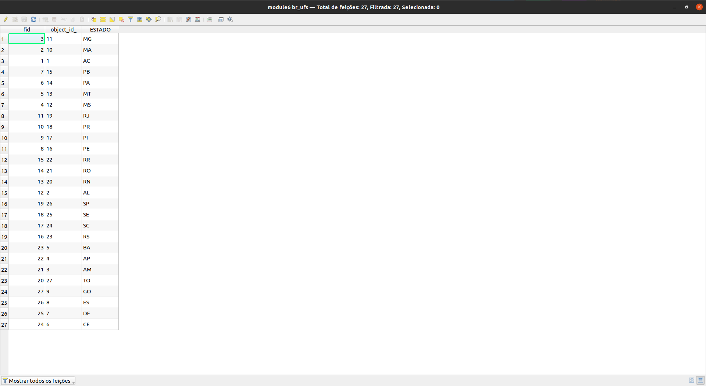
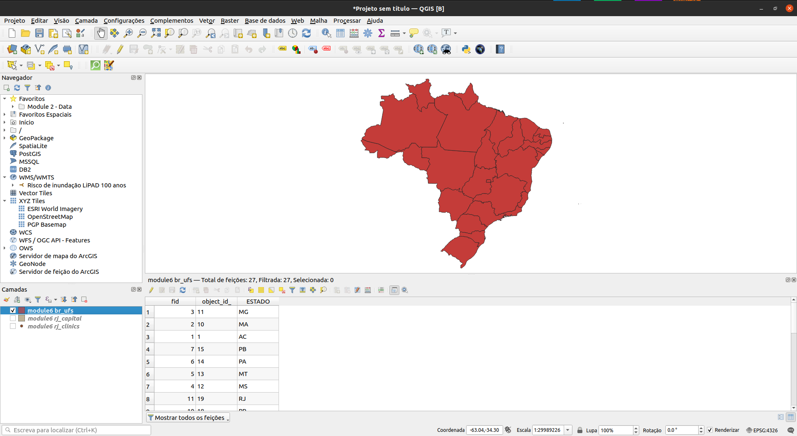
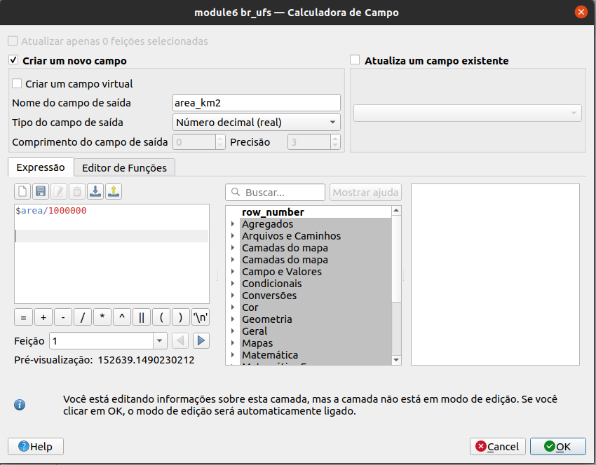
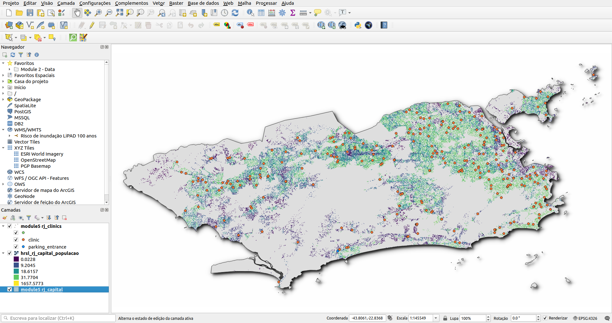
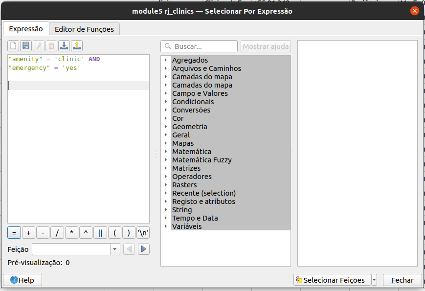
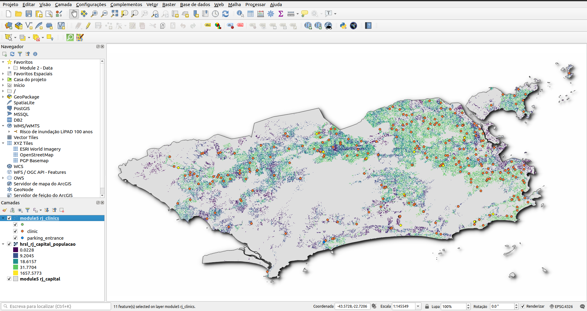

# Módulo 6 - Atributos da camada

**Autor**: Ketty

## Introdução pedagógica

Este módulo fornecerá uma visão geral das etapas comuns necessárias para trabalhar com a tabela de atributos e atributos da camada no QGIS. No final do módulo, você será capaz de entender os seguintes conceitos:

* Trabalhando com a tabela de atributos
* Usando a calculadora de campos
* Gerador de expressões QGIS
* Campos de refatoração

Além disso, você aprenderá as seguintes habilidades:

* Entendendo a interface da tabela de atributos
* Interagindo com recursos em uma tabela de atributos
* Salvando recursos selecionados como nova camada
* Editando campos de camada

Você usará a calculadora de campo e o gerador de expressão QGIS para executar operações matemáticas e funções no QGIS.


## Ferramentas e recursos necessários

* Computador
* Conexão com a Internet
* QGIS 3.16 e superior
* Camada limite administrativa Pampanga (dentro de [module6.gpkg](data/module6.gpkg))
* Clínicas Pampanga (dentro de [module6.gpkg](data/module6.gpkg))
* Províncias PHL (dentro de [module6.gpkg](data/module6.gpkg))
* [Pampanga High Resolution Settlement Layer](data/HRSL_Pampanga_Population.tif)


## Pré-requisitos

* Um conhecimento razoável de todos os módulos anteriores
* Conhecimento básico de como operar um computador


## Recursos adicionais

* Trabalhando com a Tabela de Atributos - [https://docs.qgis.org/3.16/en/docs/user_manual/working_with_vector/attribute_table.html?highlight=layer%20attributes](https : //docs.qgis.org/3.16/en/docs/user_manual/working_with_vector/attribute_table.html? destaque = camada% 20attributos)
* Expressões QGIS - [https://docs.qgis.org/3.16/en/docs/ pyqgis_developer_cookbook/expression.html](https://docs.qgis.org/3.16/en/docs/pyqgis_developer_cookbook/expressions.html)


## Introdução temática

Vamos começar com um exemplo:

Em alguns casos, por exemplo, para fins de planejamento de infraestrutura, você pode querer saber a área dos polígonos em uma camada. Se você tiver só um polígono, isso não será um problema. Mas e se você tiver muitos polígonos/áreas na camada? Calcular cada área uma a uma seria quase impossível. A camada de vetor de fronteira administrativa das Filipinas tem muitos polígonos, o que significa que seria um bom conjunto de dados para este tutorial. Vamos calcular a área de cada polígono de forma automatizada. No total, será calculada a área de 81 províncias.


## Detalhamento dos conceitos

Muito do trabalho que você faz ao elaborar um mapa envolve trabalhar com atributos de camada. Se estiver desenhando a camada, configurando um pop-up, realizando análises ou visualizando, você precisa de algum nível de conhecimento dos campos da camada e dos valores que eles contêm. Se for sua própria camada, você conhecerá e entenderá seus atributos. Mas se não for, como você adquire esse conhecimento? Provavelmente, você inspeciona os nomes dos campos e examina os valores dos campos em busca de algumas pistas. E se você tiver sorte, você encontrará alguma documentação que descreve os atributos da camada.

A tabela de atributos exibe informações sobre os recursos de uma camada selecionada. Cada linha da tabela representa uma feição (com ou sem geometria) e cada coluna contém uma informação específica sobre a feição. As feições da tabela podem ser pesquisadas, selecionadas, movidas ou mesmo editadas. Especificamente, existem duas novas propriedades de campo que descrevem os valores contidos em um campo:


* **Descrição do campo** - algumas palavras, uma frase ou um parágrafo de texto que descreve os valores no campo.
* **Tipo de valor do campo** - uma palavra-chave que categoriza o tipo de valores contidos no campo. A palavra-chave ajuda as pessoas a entender como usar os valores e permite que o QGIS e outros aplicativos façam sugestões mais inteligentes para trabalhar com eles, por exemplo, os tipos de valores no campo podem ser inteiros, strings, booleanos (verdadeiro ou falso), duplos ou ponto flutuante.

Aqui está um exemplo. Suponha que você tenha uma camada de parcela de terreno com estes campos:

* ID do lote - Número Inteiro
* Proprietário - String (Texto)
* Endereço da rua - String (Texto)
* Descrição da propriedade - String (Texto)
* Edifícios - Número Inteiro
* Área do terreno - Número Duplo (ou decimal)
* Valor avaliado - Número Duplo (ou decimal)
* Data de avaliação - Data

Se você fosse descrever esses valores de campo, poderia escrever algo assim:

* ID do lote - o identificador exclusivo do lote
* Proprietário - o nome do proprietário do imóvel
* Endereço - a localização do lote
* Descrição do imóvel - a descrição legal da propriedade
* Edifícios - o número de edifícios no lote
* Área do terreno - o tamanho da parcela em acres
* valor da avaliação - o valor da parcela e edifícios em dólares
* avaliação data - a data da última avaliação

Ao observar descrições, algumas palavras se destacam, como: identificador, nome, localização, descrição, número de, tamanho, valor e data. Estas são as _palavras-chave_ que descrevem quais são os valores do campo. As palavras-chave do tipo de valor do campo são construídas a partir desses tipos de palavras. Eles são:

* Nome ou Título
* Descrição
* Tipo ou Categoria
* Contagem ou Quantidade
* Porcentagem ou Proporção
* Medição
* Identificador Único
* Ordenado ou Classificado
* Binário
* Local ou Nome do Local
* Coordenada
* Data e Hora

No exemplo de camada de pacote acima, o campo ID da parcela é um campo inteiro. Se o tipo de valor do campo indica que os valores do campo representam um identificador único em vez de uma contagem, o QGIS não sugere o desenho deste atributo de campo usando cores graduadas ou símbolos.

Além disso, outros conceitos como a funcionalidade de calculadora de campo na tabela de atributos permitem realizar cálculos com base em valores de atributos existentes ou funções definidas, por exemplo, calcular comprimento, área ou densidade populacional. Observe que os cálculos possíveis são determinados pelos atributos ou compõem seus dados. Por exemplo, só é possível calcular a densidade populacional se houver um campo com contagens de população. Usando o gerador de expressão e a calculadora de campo, você poderia então construir uma expressão ou fórmula para calcular a densidade populacional. Nesse caso, a fórmula seria; população total como um número de pessoas dividida pela área de terra coberta por essa população. Você notará que é importante saber o que cada um dos campos na tabela de atributos da camada representa. Isso significa que você precisa conhecer e compreender seus dados completamente. Isso torna mais fácil aplicar funções e expressões e, portanto, gerar análises, visualizaçõe e produtos de mapa significativos.


### Título da fase 1: Editando atributos da camada

#### **Conteúdo/Tutorial**

A tabela de atributos exibe informações sobre os recursos de uma camada selecionada. Cada linha da tabela representa uma feição (com ou sem geometria) e cada coluna contém uma informação específica sobre a feição. As feições da tabela podem ser pesquisadas, selecionadas, movidas ou mesmo editadas.


1. Carregue a camada vetorial de províncias PHL (encontrada em [module6.gpkg](data/module6.gpkg)) no QGIS. Você pode descobrir quantas feições estão no recurso atual **clicando com o botão direito do mouse na camada no painel Camadas ‣ Mostrar contagem de feições**. Como você pode ver abaixo, a camada vetorial tem muitas feições. No total, são 81 feições correspondentes a 81 províncias.


Figura 6.1: Vários polígonos


2. O próximo passo é explorar a interface da tabela de atributos. Abra a tabela de atributos **clicando com o botão direito do mouse na camada no painel Layers ‣ Abrir tabela de atributos**. Você também pode clicar no **botão Abrir Tabela de Atributos**  na Barra de Ferramentas de Atributos. Esta é a aparência da tabela de atributos. A barra de ferramentas tem vários botões; passe o mouse sobre cada botão para ver sua funcionalidade.



Figura 6.2: Abrir tabela de atributos

Se você não quiser que a tabela de atributos seja uma janela flutuante, mas sim encaixá-la na interface QGIS, você pode clicar no **botão Tabela de atributos ancorada** . Quando ancoradas, as tabelas de atributos aparecerão como abas em vez de janelas individuais.



Figura 6.3: Tabela de atributos ancorada


3. Para cálculos de área, o Sistema de Referência de Coordenadas deve ser projetado. Isso permite calcular as distâncias corretamente. Lembre-se, nosso interesse é calcular automaticamente a área para cada uma das 81 províncias. Verifique o Sistema de Referência de Coordenadas da camada vetorial. Se for um sistema de referência de coordenadas geográficas, então reprojete a camada para um sistema de coordenadas projetadas. Verifique as diferentes projeções no site [EPSG](https://epsg.io/?q=Philippines%20kind%3APROJCRS). Estas são as Filipinas, usaremos [PRS92/Filipinas Zona 3](https://epsg.io/3123), EPSG: 3123. Dos módulos anteriores, onde as projeções de mapas são amplamente discutidas, você já deve saber que as projeções de mapas são aplicadas em relação a um local específico na Terra.

4. Verifique as configurações do projeto; Acesse: **Projeto ‣ Propriedades Propriedades ‣ Geral**.


Figura 6.4: Configurações gerais

5. Em seguida, clique no botão **Abrir calculadora de campo**  no botão da barra de ferramentas. A caixa de diálogo da calculadora de campo será aberta; preencha o nome do campo de saída, neste caso será 'AREA (SQ KM)'. Escolha o número decimal (duplo) no tipo de campo de saída. Altere a precisão para 2 casas decimais. Para calcular a área, use a seguinte expressão:

```
$area/1000000`
```

Você pode encontrar esta expressão em **Geometria**. Clique em OK e irá calcular automaticamente a área de cada polígono. Observe que o cálculo da área depende do sistema de referência de coordenadas usado, portanto, você pode ter resultados diferentes dependendo do CRS usado. Você também pode pesquisar e encontrar informações sobre expressões no lado direito da Calculadora de campo ou Construtor de expressões.



Figura 6.5: Diálogo da calculadora de campo

6. Abra a tabela de atributos para ver o resultado. Você acabou de editar o conteúdo da tabela de atributos, de forma automatizada, ao invés de digitar os valores em cada célula manualmente, um por um.


Figura 6.6: Nova tabela de atributos com novos campos e atributos


#### **Perguntas do questionário**

1. Uma tabela de atributos é um banco de dados ou arquivo tabular contendo informações sobre um conjunto de características geográficas

2. As características geográficas são geralmente organizadas de forma que cada linha represente uma característica e cada coluna represente um atributo de característica

3. É necessário reprojetar camadas antes da área cálculos quando a camada tem um sistema de referência de coordenadas geográficas


#### **Respostas do questionário**

1. Verdadeiro
2. Verdadeiro
3. Verdadeiro


### Fase 2: Entender e trabalhar com dados de atributos, consultas e análises

#### **Conteúdo/Tutorial**

Neste ponto, você pode notar que a tabela de atributos armazena dados espaciais e não espaciais. Neste tutorial, você descobrirá maneiras de trabalhar com dados da tabela de atributos. Por exemplo, usando expressões, você poderá selecionar Clínicas em Pampanga com uma unidade de emergência, usando os dados da tabela de atributos.

1. Adicione os seguintes conjuntos de dados das Filipinas à tela do mapa QGIS:

* Camada de fronteira administrativa de Pampanga (dentro de [module6.gpkg](data/module6.gpkg))
* Clínicas Pampanga (dentro de [module6.gpkg](data/module6.gpkg))
* Províncias PHL (dentro de [module6.gpkg](dados /module6.gpkg))
* [Camada de liquidação de alta resolução Pampanga](data/HRSL_Pampanga_Population.tif)



Figura 6.7: Adicionar camadas diferentes

2. O a seleção será aplicada à camada Clínicas, portanto, abra a tabela de atributos da camada Clínica. Clique no botão selecionar recursos usando a expressão! [Alt_text](media/select_features_button.png "image_tooltip") e digite a seguinte expressão no construtor de expressão;

```
"amenity" = 'clinic' AND "emergency" = 'yes'
```

Você notará que a expressão tem uma série de predicados como o sinal de comparação (=), o predicado lógico (AND) e uma string que é colocada entre aspas simples (''). Existem também dois nomes de atributos (amenity, emergency) e seus valores (clinic, yes).



Figura 6.8: Selecione pelo diálogo Construtor de Expressão

3. Uma Clínica é selecionada. Você pode ver a seleção destacada em amarelo. A clínica selecionada também é destacada na tabela de atributos. Agora sabemos que há apenas uma clínica com serviço de emergência na província de Pampanga.



Figura 6.9: Clínica/recurso selecionado está destacado (amarelo)


Figura 6.10: Clínica/o recurso está destacado (azul)


Também é possível fazer seleções clicando em uma feição na tela do mapa.

O desenvolvimento de uma expressão funcional começa com a compreensão de seus dados; por exemplo, os atributos e os valores que eles possuem. Em seguida, precisamos fazer as perguntas certas e, finalmente, desenvolver a expressão correta, levando em consideração todas as regras matemáticas que tornam uma expressão livre de erros.


#### **Perguntas do questionário**

1. Esses operadores são fornecidos pelo construtor de expressões. {+, -, *}
2. As aspas simples devem incluir uma string.
3. A tabela de atributos armazena apenas dados não espaciais.


#### ** Respostas do questionário **

1. Verdadeiro
2. Verdadeiro
3. Falso


### Título da Fase 3: Expressões de QGIS avançadas

A caixa de diálogo Construtor de expressões oferece acesso à:

* Aba Expressão ([https: //docs.qgis .org/2.18/en/docs/user_manual/working_with_vector/expression.html # functions-list](https://docs.qgis.org/2.18/en/docs/user_manual/working_with_vector/expression.html#functions-list) ) que, graças a uma lista de funções predefinidas, ajuda a escrever e verificar a expressão a usar;
* Aba Editor de funções ([https://docs.qgis.org/2.18/en/docs/user_manual/working_with_vector/expression.html#function-editor](https://docs.qgis.org/2.18/en/docs /user_manual/working_with_vector/expression.html#function-editor)) que ajuda a estender a lista de funções criando funções personalizadas.


#### **Conteúdo/Tutorial**

Existem muitos casos de uso para expressões, e aqui apresentaremos alguns exemplos. Observe como as expressões são desenvolvidas e quais operadores ou predicados são usados. Também é importante o fato de que todas essas expressões são desenvolvidas com base no conteúdo do conjunto de dados. Você pode adaptar isso ao conjunto de dados de sua escolha.

1. Na Calculadora de campo, calcule um campo “pop_density” usando os campos “total_pop” e “area_km2” existentes:

```
"total_pop" / "area_km2"
```

2. Atualize o campo “density_level” com categorias de acordo com os valores “pop_density”:

```
CASE WHEN "pop_density" < 50 THEN 'Low population density'
     WHEN "pop_density" >= 50 AND  "pop_density" < 150 THEN 'Medium population density'
     WHEN "pop_density" > 150 THEN 'High population density'
END
```

3. Aplique um estilo categorizado a todos as feições de acordo com se o preço médio de sua casa é menor ou superior a 10.000 pesos por metro quadrado:

```
"price_m2" > 10000
```

4. Usando a ferramenta “Selecionar por expressão ...”, Selecione todas as características que representam áreas de "alta densidade populacional" e cujo preço médio da casa seja superior a 10.000 pesos por metro quadrado:

```
"density level" = 'High population density' and "price_m2" > 10000
```

5. Da mesma forma, a expressão anterior também pode ser usada para definir quais características devem ser rotuladas ou mostradas no mapa.


#### **Perguntas do questionário**

1. Tanto a calculadora de campo quanto o diálogo Selecionar por expressão podem ser usados ​​para desenvolver expressões - ***Verdadeiro***
2. As expressões podem ser usadas para atualizar um novo campo - ***Verdadeiro***
3. As expressões podem ser usadas para aplicar um estilo - ***Verdadeiro***
