# ** Módulo 8 - Processamento e análise vetorial **

**Autor(a)**: Codrina

## Introdução pedagógica

Este módulo é focado em um tipo específico de modelo de dados geográficos: os geodados vetoriais.

Ao final deste módulo, os alunos terão a compreensão básica dos seguintes conceitos:

* modelo de dados vetoriais
* metadados
* processamento vetorial
* análise de dados espaciais
* geoestatística
* topologia
* geoprocessamento

E adquirirão as seguintes habilidades:

* Verificando a qualidade do conjunto de dados vetoriais geométricos usando algoritmos para checar a topologia de dados vetoriais e executar correções automáticas básicas;
* Trabalhando com algoritmos para identificar erros na tabela de atributos;
* Processando dados vetoriais - executando algoritmos de geoprocessamento simples para atender a perguntas em potencial, como por exemplo: quantos prédios públicos existem em uma região administrativa?
* Processamento de dados vetoriais - usando algoritmos de geoestatística para preencher os dados faltantes.


## Ferramentas e recursos necessários

* Este módulo foi preparado usando [QGIS versão 3.16.1 - Hannover](https://qgis.org/en/site/forusers/download.html)
* Os conjuntos de dados usados ​​para todos os exercícios detalhados em este módulo são apresentados na tabela abaixo:
* O sistema de referência de coordenadas utilizado é o PRS92/Filipinas zona 3, EPSG 3123. Por se tratar de um sistema de coordenadas projetado, ele permite cálculos geométricos.


## Pré-requisitos

* Conhecimento básico de como operar um computador
* Uma compreensão robusta dos módulos 0, 1 e 2 e 6 deste currículo. O Módulo 0 apresenta a noção de modelo de dados vetoriais que está no cerne desta seção atual. A compreensão prévia dos módulos 1, 2 e 6 permite que você se concentre estritamente nas novas noções e funcionalidades do QGIS introduzidas nesta nova seção, sem ter que se perguntar como você poderia carregar uma nova camada em seu projeto, ou como trabalhar com a tabela de atributos do seu conjunto de dados.  

Como parte deste módulo, você aprenderá como trabalhar de forma eficiente com conjuntos de dados geográficos vetoriais para que possa extrair novas informações. Isso inclui uma compreensão mais aprofundada do que são dados vetoriais, quais padrões de qualidade eles devem cumprir para que sejam realmente úteis, quais são as operações mais comuns feitas em dados vetoriais (geoprocessamento, geoestatística).


## Recursos adicionais:

* [https://docs.qgis.org/3.16/en/docs/user_manual/working_with_vector/functions_list.html](https://docs.qgis.org/3.16/en/docs/user_manual/ working_with_vector/functions_list.html)
* [http://www.geo.hunter.cuny.edu/~jochen/gtech361/lectures/lecture12/concepts/01%20What%20is%20geoprocessing.htm](http://www. geo.hunter.cuny.edu/~jochen/gtech361/lectures/lecture12/concepts/01%20What%20is%20geoprocessing.htm)
* [Enciclopédia de GIS, Edição 2017, Editores: Shashi Shekhar, Hui Xiong, Xun Zhou](https://link.springer.com/referencework/10.1007/978-3-319-17885-1)<span style="text-decoration: underline;"> </span>
* [Metadata And Catalog Services](https://www.geo-train.eu/modules/metadata/pdf/Metadata.pdf), autora Mariana Belgiu, UNIGIS Salzburg;
* [Noções básicas de metadados](https://www.fgdc.gov/resources/factsheets/documents/GeospatialMetadata-July2011.pdf) elaborado pelo Comitê Federal de Dados Geográficos;


## Introdução temática

Vamos começar com um exemplo: Você acaba de pousar na cidade em Angeles, Pampanga, Filipinas e precisa ir do aeroporto ao hotel. Você não tem conhecimento de onde está situado o aeroporto em relação à cidade, nem onde fica o hotel, então a primeira coisa que você faz é abrir um mapa para ajudá-lo a navegar por esta cidade nova e animada! Você pega o telefone, abre um aplicativo de mapa e seleciona o ponto de partida - o aeroporto - e o ponto de chegada - seu hotel - e, em seguida, pede a rota, a pé, de carro ou transporte público. Em questão de segundos, o aplicativo de roteamento oferece a melhor solução para você ir do ponto A ao ponto B e o destaca ao traçar uma linha distinta seguindo ruas e becos, conforme visível na figura 8.1.


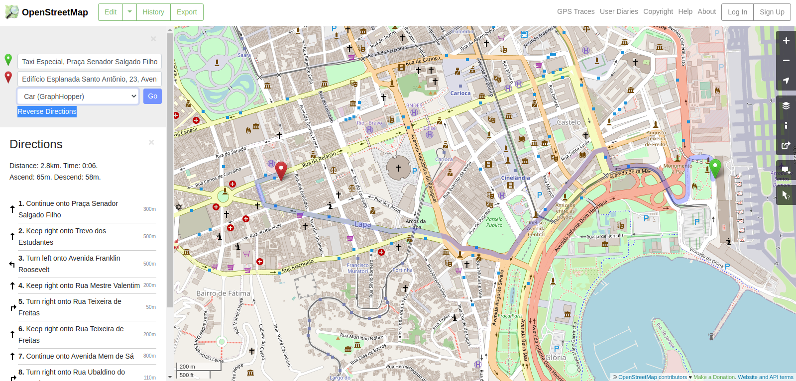

Figura 8.1 - Indo do ponto A ao B usando o Openstreetmap


## Detalhamento dos conceitos

Este é um exemplo clássico de uso de dados vetoriais e ele pode ser dividido em vários conceitos que definiremos a seguir.

Os dados usados ​​são espaciais - eles têm uma localização muito bem definida na Terra, e seus atributos também são bem identificados. Assim, um ponto com longitude e latitude e o nome do atributo = Aeroporto Internacional de Clark - representa o ponto de partida A e um ponto com outro par de longitude e latitude e o nome do atributo = Hotel Boss representa o ponto final B. As ruas são representadas por linhas compostas por segmentos e vértices (representados por pequenos círculos azuis na figura 8.2), com atributos como nome, direção, limitação de velocidade etc.

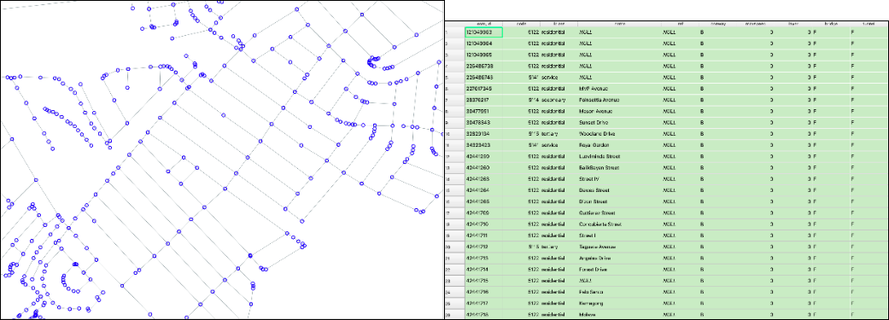

Figura 8.2 - Linhas de vetor representando ruas e a tabela de atributos associada

As ruas representam um modelo de rede que é basicamente uma coleção de pontos e linhas topologicamente interconectados. Os resultados do algoritmo que calcula a rota do ponto A ao ponto B - no nosso caso do aeroporto ao hotel - são altamente dependentes da qualidade dos vetores, tanto na geometria - as regras de topologia devem ser respeitadas - como nos atributos - se uma estrada é de mão única isso deve ser indicado para que a rota não te leve para o lado errado. 		

### O modelo de dados vetoriais

Conforme apresentado no módulo 0, existem 2 modelos de dados usados ​​em um sistema de informação geográfica - SIG: raster e vetor. Os dados geoespaciais sempre incluem um componente **espacial** indicando a localização ou a distribuição espacial do fenômeno em questão e um componente **de atributo** que descreve suas propriedades. A escolha entre usar o modelo de dados raster ou vetorial para uma situação particular depende da fonte dos dados, bem como de seu uso pretendido.

O modelo de dados vetoriais é usado para representar áreas, linhas e pontos (Figura 8.1).


Figura 8.1 - dados vetoriais com tabela de atributos


### Metadados

Metadados são mais simplesmente definidos como dados sobre dados. Um metadado caracteriza, em diferentes níveis de detalhamento, o conjunto de dados ao qual está associado, incluindo categorias como: quem é o provedor/proprietário do conjunto de dados; qual é a licença de uso; em que idioma estão os atributos; qual era o sistema de coordenadas usado; que área geográfica descreve e qual é o ano de referência; palavras-chave; quais são as limitações conhecidas; nível de precisão; qual era o escopo original do conjunto de dados e muito mais.

Os metadados são primordiais porque uma compreensão clara dos dados a serem usados ​​em uma análise específica pode fazer toda a diferença entre uma decisão correta ou tendenciosa. Se for necessário identificar onde colocar um novo hospital temporário, mas os dados da estrada forem antigos e não refletirem mais a realidade no local, qualquer decisão baseada neles será imprecisa.

Devido à importância dos metadados, suas categorias (suas definições, nome, que tipo de informação eles podem armazenar etc.) seguem estruturas bem definidas e padronizadas. Esses arquivos de metadados bem estruturados podem então ser integrados em catálogos dedicados, permitindo que um usuário pesquise e encontre dados geográficos apenas consultando as características de seu interesse, sem precisar baixar e analisar os dados por conta própria. Existem inúmeros catálogos de metadados que, quando padronizados, podem ser acessados ​​por meio de diferentes funcionalidades de um software GIS. Um exemplo disso será apresentado no Módulo 9, através de plugins do QGIS.

É importante dizer que os metadados não são uma especificidade dos recursos geoespaciais, mas se aplicam a qualquer tipo de dado.


### Racional do processamento vetorial

O poder do GIS reside em sua capacidade única de conectar propriedades geométricas que definem objetos e fenômenos reais em nosso mundo com seus atributos - sejam observados, medidos ou calculados - e permitindo por meio de software especializado realizar operações em seus geometrias, em seus atributos ou em ambos, a fim de derivar novas informações valiosas.

Embora na maioria das vezes o GIS esteja intimamente associado a mapas que simplesmente exibem informações geográficas, suas funcionalidades vão muito além da criação de representações cartográficas, sejam elas dinâmicas ou estáticas.

**Análise de dados espaciais** (sinônimos: análise espacial, análise geoespacial, análise geográfica, interação espacial) é um termo geral que se refere a qualquer técnica destinada a identificar padrões, detectar anomalias e testar teorias com base em dados espaciais. Uma análise é espacial se e somente se os resultados forem sensíveis à realocação dos objetos analisados ​​- ou simplificando, se a **localização for importante**. À medida que a tecnologia da informação evoluiu, cientistas começaram a aplicar várias técnicas de estatística, geometria, topologia e outras ciências à análise de dados geográficos, de modo a estudar padrões e fenômenos na superfície da Terra.

**Geoestatística** é um ramo da estatística que se aplica a dados espaciais. Os métodos mais comumente empregados estão relacionados à interpolação, que é um processo matemático que permite estimar valores desconhecidos com base nos conhecidos.

**Topologia** é um ramo da matemática que permite ao usuário GIS controlar as relações geométricas entre recursos e manter a integridade geométrica. A topologia é melhor entendida como um conjunto de regras que garantem a qualidade dos dados espaciais e que podem ser aplicados a uma camada vetorial ou mais. As regras são definidas de modo a respeitar as relações do mundo real que as camadas vetoriais representam. Por exemplo, não pode haver lacunas entre os polígonos que representam lotes em uma região. Ou, para uma camada vetorial que representa árvores, nenhum dos seus pontos pode estar contido em um polígono de uma camada vetorial que represente edifícios.

Os softwares GIS oferecem funcionalidades que permitem ao usuário definir regras relevantes de topologia, bem como algoritmos para verificá-las e para limpar a camada vetorial onde são identificadas inconsistências.

Geoprocessamento é um termo geral usado para definir qualquer operação ou processo aplicado a um conjunto de dados geográficos com o objetivo de derivar um novo conjunto de dados, gerando novos conhecimentos sobre os dados. As operações de geoprocessamento mais comuns são a sobreposição de feições geográficas, seleção e análise de recursos, processamento de topologia e conversão de dados. O geoprocessamento permite definir, gerenciar e analisar informações geográficas para apoiar a tomada de decisão.


Figura 8.4 - Elementos de uma operação de geoprocessamento


## Conteúdo principal:

### Fase 1: Entendendo seus dados.

Existem muitas operações de geoprocessamento que podem ser realizadas sobre dados vetoriais, as mais comuns sendo a sobreposição de feições geográficas, seleção e análise de recursos, processamento de topologia e conversão de dados. Nesta primeira fase, vamos nos familiarizar com alguns desses, entendendo como funcionam e quais os resultados que podemos esperar deles.


#### **Etapa 1. Prepare seu ambiente de trabalho.**

Abra o QGIS, configure o sistema de referência de coordenadas em que você trabalhará {localize}- EPSG 3123 - e adicione as seguintes camadas de dados:

* Polígonos - limites administrativos; edifícios; uso da terra;
* Linhas - estradas, rios;
* Pontos - locais religiosos, pontos de interesse (POI)

Neste ponto, a janela do seu mapa QGIS deve ser semelhante à figura 8.5, mas provavelmente apresentando outras cores.


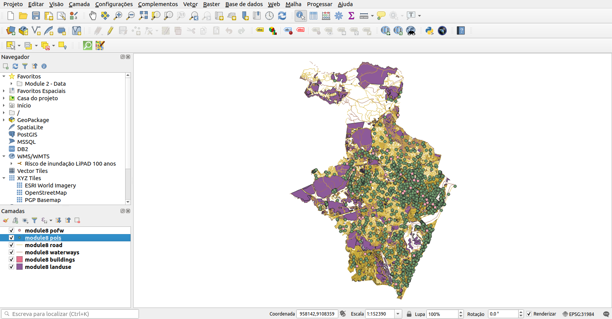

Figura 8.5 - Conjuntos de dados vetoriais carregados: pontos, linha e polígonos

**Verifique!** Todas as camadas estão no mesmo sistema de coordenadas {localize}(EPSG 3123) olhando no canto direito inferior. Se for assim, você está olhando para 7 camadas de dados vetoriais sobrepostas.

#### **Etapa 2. Entenda o que você está olhando.**

Neste ponto, temos 7 camadas vetoriais carregadas em nosso projeto QGIS. As próximas etapas nos ajudarão a entender nossos dados.

* Verifique quantos recursos temos em uma camada - existem várias maneiras de fazer isso:

```
Clique duas vezes na camada de interesse - Propriedades - Informações - Contagem de recursos

Abra a tabela de atributos da camada de interesse e olhe na parte superior lado central
```

Antes de executar qualquer estatística básica, vamos completar a tabela de atributos com alguns atributos geométricos (consulte o Módulo 6 para detalhes):

* Camada de estradas - calcule o comprimento de cada segmento de estrada e armazene-o na tabela de atributos: nome do campo de saída - `comprimento` `round ($length, 2)`
* Camada de edifícios - calcule a área para cada edifício e armazena-a na tabela de atributos; nome do campo de saída - `area` `round($area, 2)`

Agora os campos de atributo estão preenchidos. Se você não tiver certeza em qual unidade de medida o QGIS calculou o comprimento dos segmentos de estradas e áreas de edifícios, você pode verificar as informações do sistema de coordenadas que está usando.

Clique no canto inferior direito da janela do mapa QGIS, em {localize}EPSG 3123 e uma janela como a da figura 8.6 aparecerá.


Figura 8.6 - Especificações do sistema de referência de coordenadas usado no projeto QGIS

Descobrimos que a unidade de medida é o metro, portanto os comprimentos são medidos em metros e as áreas em metros quadrados.

* Execute estatísticas básicas nas camadas carregadas para obter uma melhor compreensão de seus dados (figura 8.7):

```
Menu de vetores ‣ Ferramentas de análise ‣ Estatísticas básicas para campos

Janela da caixa de ferramentas de processamento ‣ pesquisa por 'stats'`{localize}
```

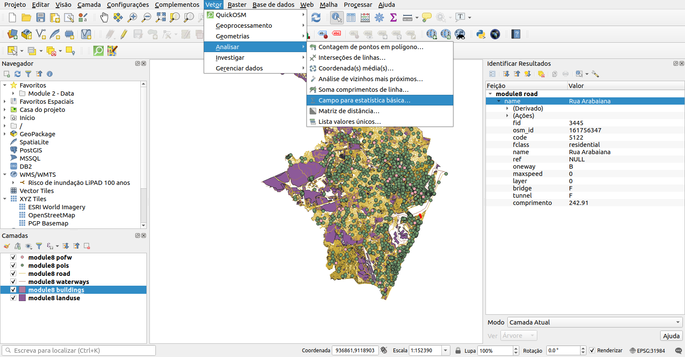

Figura 8.7 - Estatísticas básicas para campos

As estatísticas retornadas dependem do tipo de campo que escolhemos e são geradas como um arquivo HTML.

Vamos executá-lo em nossa camada de estradas e ver quais resultados obtemos. Complete a janela, como na figura 8.8.


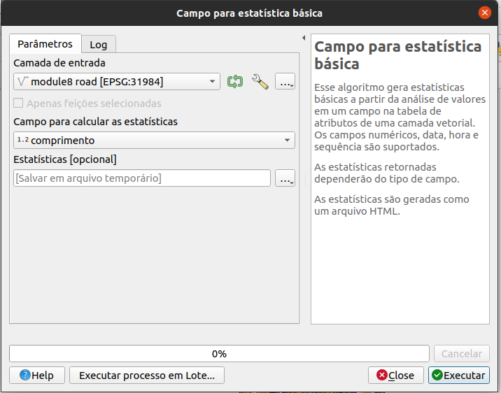

Figura 8.8 - Preparando para executar estatísticas básicas para camada de estradas

O arquivo de saída é um html que pode ser aberto com qualquer navegador (Firefox, Chrome, Safari etc.) que deve ser semelhante a abaixo:


```
{localize}
Campo analisado: comprimento
Contagem: 64473
Valores únicos: 33106
NULL (ausentes) valores: 0
Valor mínimo: 0,04
Valor máximo: 19690,45
Intervalo: 19690,41
Soma : 13.927.358,250000086
valor médio: 216,01846121632445
valor mediano: 111,18
desvio padrão: 372,48583667812585
Coeficiente de Variação: 1,724324090546652
minoria (mais raro valor ocorrendo): 0,04
maioria (valor mais frequente): 0,55
primeiro quartil: 51,03
terceiro quartil: 239,99
intervalo interquartil (IQR): 188,96
```


A partir dessas estatísticas básicas, descobrimos que existem {localize}64473 segmentos de estrada na camada carregada, onde o mais curto tem 0,04m e o mais longo 19690,45m - quase 20 km. Verificamos que a soma das estradas em Pampanga é de quase 14k km (13927.358 km). Dado que a média é maior do que a mediana, isso nos diz que a segunda metade do conjunto de dados contém segmentos de estrada mais longos e que supera os segmentos de estrada na primeira metade. No entanto, a mediana mostra que a maioria dos segmentos de estrada tem comprimento de cerca de 100 m.

Executando as estatísticas básicas na camada Edifícios para a categoria de tipo, obtemos o seguinte:


```
{localize}
Campo analisado: tipo
Contagem: 827657
Valores únicos: 74
NULL (ausentes) valores: 773210
Valor mínimo: Brgy. San Vicente
Valor máximo: sim; casa
Comprimento mínimo: 0
Comprimento máximo: 20
```

Comprimento médio: 0,3669563599413767

Os resultados não parecem iguais aos anteriores: não temos média, mediana ou desvio padrão. Isso ocorre porque o campo de atributo em que executamos o algoritmo é diferente, no qual não temos números, mas palavras - tipos de edifícios. {localize} Descobrimos que dos 827657 edifícios em Pampanga, para 773210 não sabemos o tipo de edifício. Também descobrimos que existem 74 categorias únicas.


#### **Etapa 3. Verificações básicas para encontrar erros rapidamente em seus dados.**

Conjuntos de dados perfeitos e sem falhas são equivalentes ao gás ideal em física. Não existe tal coisa, mas muitos podem chegar muito perto disso. Portanto, antes de fazer qualquer tipo de análise para extrair informações, pelo menos algumas verificações básicas são necessárias sobre como _limpos_ os dados que temos.

Existem muitos tipos de erros que podem afetar a qualidade de seus dados e, considerando o escopo de sua análise geoespacial, sua influência no resultado final pode ser mais ou menos importante. Por exemplo, se você usar dados geoespaciais para se rotear do ponto A ao ponto B de carro, ter uma camada de estradas completa com atributos em que as ruas são de mão única ou fechadas para o tráfego rodoviário é essencial para obter um bom resultado. No entanto, se a sua rota for a pé, essa informação não é crucial para o seu resultado.

Ao se referir a erros de dados geoespaciais, existem 2 termos principais que precisam ser bem compreendidos:

**Acurácia** é o grau em que as informações em um mapa correspondem aos valores do mundo real e se aplica tanto à geometria quanto aos atributos.

**Precisão** refere-se ao nível de medição e exatidão de descrição em um conjunto de dados geoespaciais.

**Um erro** abrange tanto a imprecisão dos dados quanto falta de acurácia. **Qualidade de dados** refere-se ao nível de precisão e acurácia dos conjuntos de dados e é frequentemente documentado em relatórios de qualidade de dados.

Analisar e _limpar_ um conjunto de dados geoespaciais pode ser uma tarefa muito demorada e complicada, no entanto - conforme mostrado no exemplo acima - é essencial. Nesta seção, apresentaremos algumas funcionalidades do GIS que permitem ao usuário realizar verificações rápidas em dados vetoriais e tirar um conjunto de conclusões preliminares sobre sua qualidade.

**Verificações de topologia.**

O QGIS oferece uma funcionalidade que permite ao usuário realizar uma série de verificações topológicas nos conjuntos de dados vetoriais carregados, chamada Topology Checker. Ela pode ser encontrado como um dos painéis (figura 8.9.a) e uma vez ativada, sua janela se parece com a figura 8.9.b.


Figura 8.9.a - Painel de verificação de topologia; b - Janela do verificador de topologia

Para definir as regras de topologia, clique no terceiro ícone, abrindo uma janela conforme figura 8.10.


Figura 8.10 - Janela de configurações de regras de topologia


Definiremos uma série de regras para as camadas que carregamos em nosso projeto QGIS, considerando os objetos do mundo real que elas retratam como estradas, edifícios e cursos de água no distrito de Pampanga {localize}.

A configuração da topologia é simples, pois as regras que podem ser aplicadas a partir da camada selecionada já estão embutidas nesta funcionalidade, conforme mostra a figura 8.11.


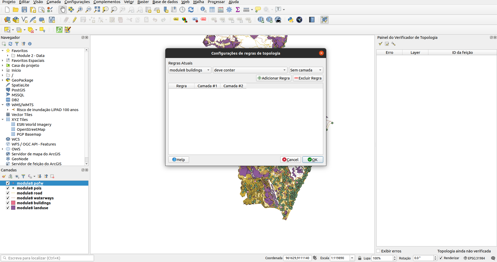

Figura 8.11 - Menu suspenso de regras de topologia com base na camada selecionada.

Escolha as regras de topologia conforme ilustrado na figura 8.12 e, em seguida, clique no primeiro ícone da janela para executar e aguardar os resultados.


Figura 8.12 - Regras de topologia a serem definidas

Após executar a verificação de topologia, suas janelas de mapa devem se parecer com a figura 8.13.


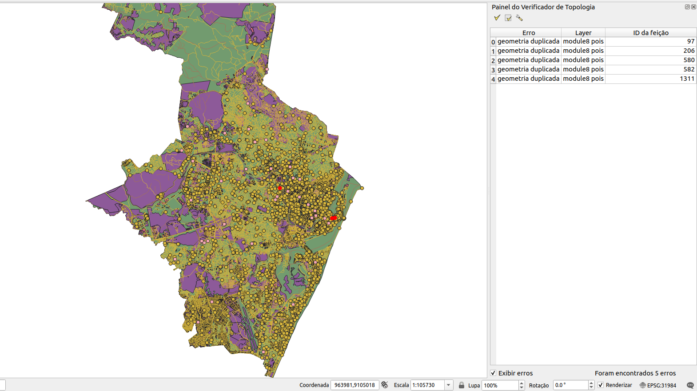

Figura 8.13 - Resultados da verificação de topologia

No canto inferior direito, a janela do verificador de topologia lista todos os erros identificados com base nas regras que definimos na fase anterior. Se a caixa de seleção "Mostrar erros" estiver marcada, os erros serão destacados em vermelho no mapa. Clicar duas vezes em um erro moverá o mapa para sua localização.

O processo de correção de erros em um conjunto de dados, seja ele relacionado à geometria (duplicatas, lacunas etc.) ou no atributo relacionado (valores ausentes, erros ortográficos etc.) é chamado de limpeza de um conjunto de dados e na maioria das vezes é tão complicado quanto necessário. Embora existam funcionalidades para dar suporte a um processo de limpeza semiautomático, o trabalho manual do usuário geralmente é necessário. Por exemplo, na figura 8.14, ampliamos um erro em nossa camada de pontos de interesse, um ponto duplicado. Como pode ser visto, há 2 pontos retratando um café {localize}. Na tabela de atributos podemos ver a diferença, onde um está listado como um café e o outro como um "faça você mesmo" - o que podemos assumir ser um nome popular para cafés onde você prepara seu próprio café.


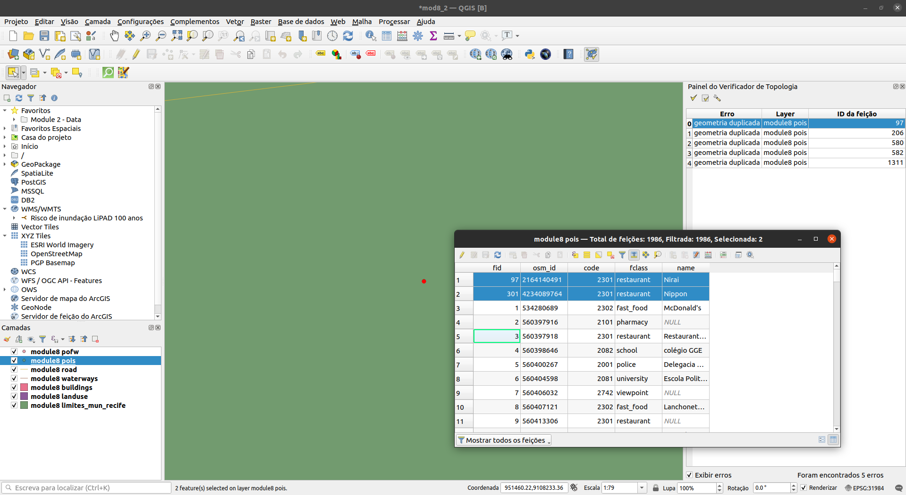

Figura 8.14 - Erro de ponto duplicado na camada do vetor de pontos de interesse

Neste caso particular, o usuário provavelmente removeria o ponto duplicado, pois isso pode inserir erros em análises espaciais posteriores. Por exemplo, se um oficial municipal deseja saber quantos restaurantes e cafés existem em um bairro específico, o ponto duplicado inserirá um erro nos resultados e isso pode levar a decisões enganosas.  

Portanto, procederemos com a remoção automática dos pontos duplicados. Para fazer isso, usaremos uma funcionalidade central do QGIS - Excluir geometrias duplicadas - encontrada na caixa de ferramentas de processamento. Seu QGIS deve ser semelhante à figura 8.15.


Figura 8.15 - Excluir geometrias duplicadas nos pontos de interesse da camada

Após executar o algoritmo, a janela de funcionalidade apresenta os resultados, identificando 6 pontos duplicados, assim como o verificador de topologia, e informa ao usuário que excluiu todos eles, deixando a camada de pontos de interesse com 2727 feições {localize}.


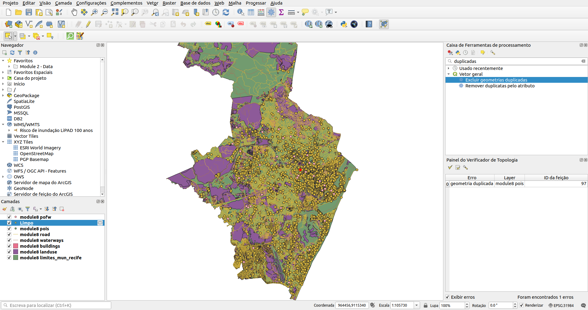

Figura 8.16 - Resultado da execução da exclusão de geometrias duplicadas

A nova execução do verificador de topologia mostrará que há 0 erros de pontos duplicados na camada.

**Atenção!** O algoritmo considera **apenas geometrias**, ignorando os atributos. Se, como é o nosso caso, houver alguma diferença no atributo das duplicatas, o usuário não tem controle sobre qual será mantida. Portanto, se houver necessidade de todas as informações serem mantidas, elas devem ser primeiro copiadas para todas as geometrias, de modo que quando um recurso duplicado for excluído, não haverá perda de informações.

Vamos executar outra verificação de topologia, desta vez em nossa camada de edifícios. Configure as seguintes regras:

* Sem duplicatas
* Sem geometrias inválidas

Execute o algoritmo.

O resultado deve ser semelhante à figura 8.17.


Figura 8.17 - Resultados da verificação de topologia na camada vetorial de edifícios

Limpe as feições duplicadas usando o processo indicado acima (figura 8.18)


Figura 8.18 - Resultados de Excluir geometrias duplicadas

Uma limpeza completa dos conjuntos de dados vetoriais usados está fora de escopo deste módulo, devido à complexidade de realizá-la.


#### **Etapa 4. Dê uma olhada mais de perto nas informações dos pontos, linhas e polígonos.**

Vamos executar mais um algoritmo para ter uma ideia de quais são os atributos de nossas camadas Pampanga {localize}. Depois de identificarmos quantas feições cada camada possui, vamos ver quantos e quais são os atributos exclusivos nos seguintes casos:

* camada buildings_a_3123_cleaned - tipo de atributo;
* camada Pois_3123_cleaned - atributo fclass;
* camada waterways_3123 - atributo fclass;
* camada pofw_3123 - atributo fclass;
* camada roads_3123 -attribute fclass;
* camada landuse_a_3123 - atributo fclass;

Para isso, vá para `Vetor ‣ Ferramentas de análise ‣ Listar valores únicos (figura 8.19)`


Figura 8.19 - Listar valores únicos em uma funcionalidade de camada vetorial

Na janela que é aberta, insira, um de cada vez, cada nome de camada e atributo de interesse conforme enumerado na lista acima e você deve ter os seguintes resultados:

{localize}
<table>
  <tr>
   <td><strong>Layer name</strong>
   </td>
   <td><strong>No. of unique values</strong>
   </td>
   <td><strong>Unique values</strong>
   </td>
  </tr>
  <tr>
   <td>buildings_a_3123_cleaned
   </td>
   <td>74
   </td>
   <td>'military;parking;gymnasium;mosque;yes;house;NULL;track;college;Idelfonso '
<p>
'Tuazon Str;terrace;with '
<p>
'roof;construction;veterinary;gazebo;hut;connector_bridge_sky;barn;roof;Yakult;kindergarten;hospital;pharmacy;laboratory;apartments;multipurpose;public;warehouse;farm;quarry;school;footway;Not_sure.;temple;service;garage;office;allotment_house;train_station;commercial;transportation;industrial;storage_tank;hotel;marketplace;farm_auxiliary;university;Unsure_-_please_chec;power_substation;clinic;hall;hangar;greenhouse;gawad '
<p>
'kaling phase 1;tennis;church;Brgy. San '
<p>
'Vicente;fire_station;toilets;civic;pumping_station;retail;residential;shed;chapel;supermarket;clubhouse;dormitory;Pineda '
<p>
'Residence;government;carport;manufacture;garages;motorway;house
   </td>
  </tr>
  <tr>
   <td>pois_3123_cleaned
   </td>
   <td>105
   </td>
   <td>alpine_hut;artwork;bicycle_shop;comms_tower;college;chalet;beverages;tourist_info;veterinary;hunting_stand;greengrocer;gift_shop;food_court;restaurant;ruins;pharmacy;bank;fountain;convenience;monument;clothes;caravan_site;cafe;camera_surveillance;recycling;atm;furniture_shop;sports_shop;post_office;hospital;viewpoint;guesthouse;kindergarten;cinema;biergarten;garden_centre;doityourself;florist;lighthouse;fast_food;butcher;mobile_phone_shop;sports_centre;nightclub;motel;department_store;graveyard;fire_station;bar;car_rental;shoe_shop;stationery;golf_course;picnic_site;post_box;pitch;theatre;recycling_metal;playground;school;shelter;stadium;computer_shop;toy_shop;doctors;beauty_shop;bakery;kiosk;hostel;recycling_glass;laundry;pub;bicycle_rental;water_well;archaeological;nursing_home;swimming_pool;camp_site;town_hall;supermarket;toilet;bookshop;water_tower;park;courthouse;telephone;attraction;memorial;library;optician;mall;hotel;travel_agent;car_dealership;observation_tower;video_shop;tower;water_works;dentist;police;community_centre;car_wash;bench;hairdresser;museum
   </td>
  </tr>
  <tr>
   <td>waterways_3123
   </td>
   <td>4
   </td>
   <td>'river;canal;drain;stream'
   </td>
  </tr>
  <tr>
   <td>pofw_3123
   </td>
   <td>5
   </td>
   <td>'christian_evangelical;christian_methodist;buddhist;christian_catholic;christian'
   </td>
  </tr>
  <tr>
   <td> roads_3123
   </td>
   <td>25
   </td>
   <td>'secondary;trunk;track;bridleway;primary;tertiary;path;track_grade2;steps;footway;cycleway;trunk_link;track_grade4;unclassified;service;primary_link;pedestrian;unknown;tertiary_link;secondary_link;living_street;track_grade5;residential;motorway_link;motorway'
   </td>
  </tr>
  <tr>
   <td>landuse_a_3123
   </td>
   <td>19
   </td>
   <td>'military;park;forest;cemetery;recreation_ground;nature_reserve;heath;farmland;quarry;commercial;vineyard;industrial;scrub;orchard;grass;farmyard;meadow;retail;residential'
   </td>
  </tr>
</table>


Tabela 8.1 - Tabela que identifica quantos e quais são os valores únicos para os atributos selecionados

Para uma análise mais aprofundada dos atributos de nossas camadas vetoriais, usaremos o plugin GroupStats. Ele foi desenvolvido para oferecer suporte ao cálculo de estatísticas para grupos de feições em uma camada vetorial, tornando-o muito útil para obter mais compreensão sobre seus dados, bem como para detectar possíveis erros nos atributos.

Para abrir a janela GroupStats, vá para `Vector ‣ GroupStats ‣ GroupStats`.

Uma nova janela como a da figura 8.20 deve ser aberta.


Figura 8.20 - Janela GroupStats

De acordo com a análise feita anteriormente, vimos que para as camadas de edifícios temos 74 {localize} tipos diferentes de edifícios. Mas quantos temos de cada tipo e qual a área construída total de cada categoria? Qual a área existente de escolas, mercados, casas? GroupStats pode nos ajudar a responder a essas perguntas. Do lado direito da janela, está o painel de controle, onde escolhemos o que queremos calcular, bem como a forma como os dados devem ser dispostos. Usando arrastar e soltar, siga as configurações da figura 8.21 e clique em calcular.


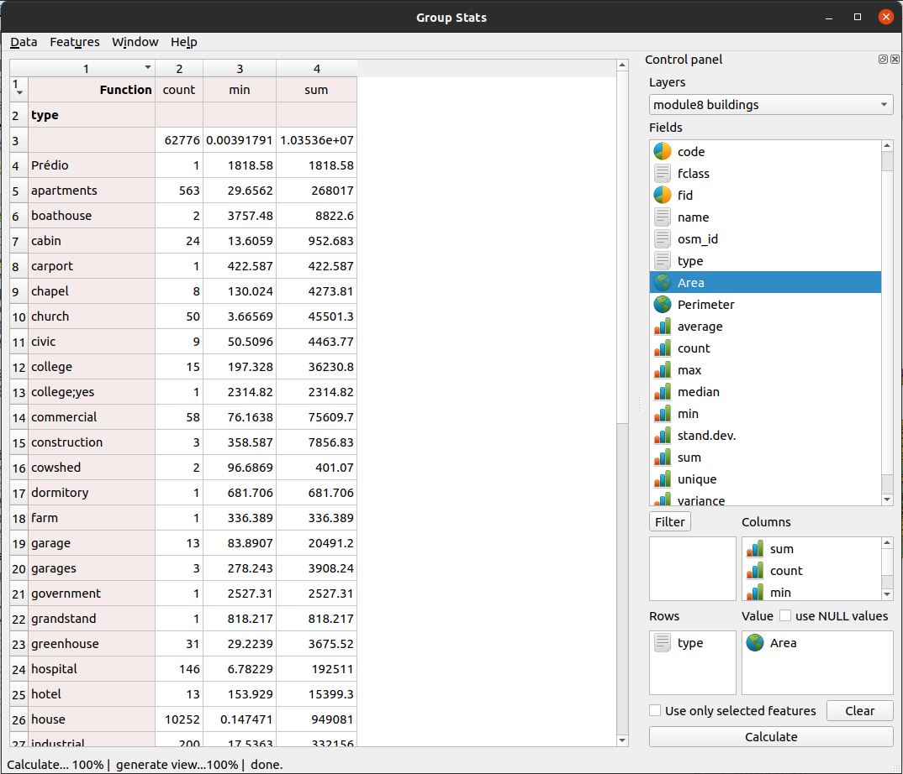

Figura 8.21 - Executando GroupStats na camada de construção.

Olhando para o resultado, podemos extrair informações importantes sobre nossos dados. Por exemplo, {localize} para fins residenciais na região da província de Pampanga, temos 3.270 edifícios com uma área total construída de 4.05937 metros quadrados, aprox. 40 hectares. Também descobrimos que o maior tem 1474 metros quadrados, enquanto o menor tem 10 metros quadrados. E pode-se continuar a análise para mais informações valiosas.

Outra análise interessante pode ser executada na camada vetorial de estradas. A Figura 8.22 mostra como calcular os comprimentos de estradas categorizadas por tipo de estrada (primária, residencial, rodovia etc.) e velocidade máxima permitida.


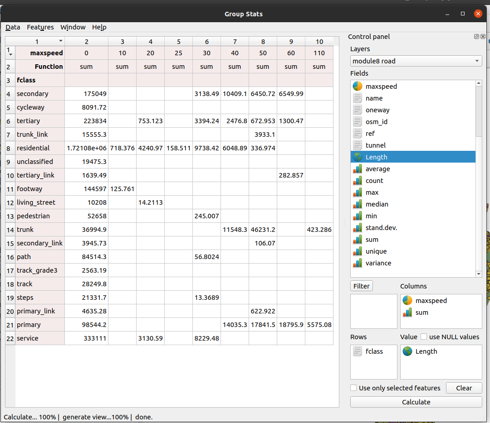

Figura 8.22 - Executando GroupStats na camada de estradas.


#### **Perguntas do questionário **

1. Os metadados são importantes?
* _<span style="text-decoration:underline;">Sim, porque fornece uma visão sobre os dados geográficos que de outra forma não seria possível obter.</span>_
* _Não, é só uma burocracia._
2. A topologia é relevante para a geometria ou para a tabela de atributos de uma camada vetorial?
* _Para a geometria da camada vetorial._
3. O que é mais importante, a geometria ou os dados do atributo?
* _Geometria._
* _Dados do atributo._
* _<span style="text-decoration:underline;">Ambos.</span>_


### **Fase 2: Introdução ao processamento vetorial** {continue}

A primeira fase deste módulo, sobre vetores, fez uma breve introdução sobre as etapas a serem feitas para se ter uma compreensão básica dos dados geoespaciais.

Esta segunda fase do módulo nos leva a um trabalho mais aprofundado para processar dados vetoriais a fim de extrair ideias valiosas para auxiliar na tomada de decisões. Seguindo os conceitos descritos no início deste módulo, o geoprocessamento representa qualquer processo aplicado a um conjunto de dados geográficos com o objetivo de derivar um novo conjunto de dados, gerando novos conhecimentos sobre os dados. E é isso que tentaremos fazer a seguir.

Existem muitas operações que podem ser realizadas em um ou mais conjuntos de dados geoespaciais e, durante esta primeira etapa, executaremos algumas das mais comuns para entender como funcionam.

**Buffer.** Imagine que você precise analisar uma nova legislação que exige que em uma área de 30 metros ao redor de locais religiosos não possa haver outra construção. Você gostaria de ver onde exatamente essas delimitações estão e talvez até quantos metros quadrados isso representa para o seu distrito. O primeiro passo é definir um buffer em torno dos locais de culto: `Vector ‣ ferramentas de geoprocessamento ‣ buffer.` Quando a janela do buffer abrir, defina os parâmetros como na figura 8.23:

{continue}
