# **Módulo 8 - Processamento e análise vetorial**

**Autores**: Codrina, Ben Hur

## Introdução pedagógica

Este módulo é focado em um tipo específico de modelo de dados geográficos: os geodados vetoriais.

Ao final deste módulo, os alunos terão a compreensão básica dos seguintes conceitos:

* modelo de dados vetoriais
* metadados
* processamento vetorial
* análise de dados espaciais
* geoestatística
* topologia
* geoprocessamento

E adquirirão as seguintes habilidades:

* Verificando a qualidade do conjunto de dados vetoriais geométricos usando algoritmos para checar a topologia de dados vetoriais e executar correções automáticas básicas;
* Trabalhando com algoritmos para identificar erros na tabela de atributos;
* Processando dados vetoriais - executando algoritmos de geoprocessamento simples para atender a perguntas em potencial, como por exemplo: quantos prédios públicos existem em uma região administrativa?
* Processamento de dados vetoriais - usando algoritmos de geoestatística para preencher os dados faltantes.


## Ferramentas e recursos necessários

* Este módulo foi preparado usando [QGIS versão 3.16.1 - Hannover](https://qgis.org/en/site/forusers/download.html)
* Os conjuntos de dados usados ​​para todos os exercícios detalhados em este módulo são apresentados na tabela abaixo:
* O sistema de referência de coordenadas utilizado é o SIRGAS 2000/UTM zona 24S, EPSG 31984. Por se tratar de um sistema de coordenadas projetado, ele permite cálculos geométricos.


## Pré-requisitos

* Conhecimento básico de como operar um computador
* Uma compreensão robusta dos módulos 0, 1 e 2 e 6 deste currículo. O Módulo 0 apresenta a noção de modelo de dados vetoriais que está no cerne desta seção atual. A compreensão prévia dos módulos 1, 2 e 6 permite que você se concentre estritamente nas novas noções e funcionalidades do QGIS introduzidas nesta nova seção, sem ter que se perguntar como você poderia carregar uma nova camada em seu projeto, ou como trabalhar com a tabela de atributos do seu conjunto de dados.  

Como parte deste módulo, você aprenderá como trabalhar de forma eficiente com conjuntos de dados geográficos vetoriais para que possa extrair novas informações. Isso inclui uma compreensão mais aprofundada do que são dados vetoriais, quais padrões de qualidade eles devem cumprir para que sejam realmente úteis, quais são as operações mais comuns feitas em dados vetoriais (geoprocessamento, geoestatística).


## Recursos adicionais:

* [https://docs.qgis.org/3.16/en/docs/user_manual/working_with_vector/functions_list.html](https://docs.qgis.org/3.16/en/docs/user_manual/ working_with_vector/functions_list.html)
* [http://www.geo.hunter.cuny.edu/~jochen/gtech361/lectures/lecture12/concepts/01%20What%20is%20geoprocessing.htm](http://www. geo.hunter.cuny.edu/~jochen/gtech361/lectures/lecture12/concepts/01%20What%20is%20geoprocessing.htm)
* [Enciclopédia de GIS, Edição 2017, Editores: Shashi Shekhar, Hui Xiong, Xun Zhou](https://link.springer.com/referencework/10.1007/978-3-319-17885-1)<span style="text-decoration: underline;"> </span>
* [Metadata And Catalog Services](https://www.geo-train.eu/modules/metadata/pdf/Metadata.pdf), autora Mariana Belgiu, UNIGIS Salzburg;
* [Noções básicas de metadados](https://www.fgdc.gov/resources/factsheets/documents/GeospatialMetadata-July2011.pdf) elaborado pelo Comitê Federal de Dados Geográficos;


## Introdução temática

Vamos começar com um exemplo: Você acaba de pousar na cidade do Rio de Janeiro e precisa ir do aeroporto ao hotel. Você não tem conhecimento de onde está situado o aeroporto em relação à cidade, nem onde fica o hotel, então a primeira coisa que você faz é abrir um mapa para ajudá-lo a navegar por esta cidade nova e animada! Você pega o telefone, abre um aplicativo de mapa e seleciona o ponto de partida - o aeroporto - e o ponto de chegada - seu hotel - e, em seguida, pede a rota, a pé, de carro ou transporte público. Em questão de segundos, o aplicativo de roteamento oferece a melhor solução para você ir do ponto A ao ponto B e o destaca ao traçar uma linha distinta seguindo ruas e becos, conforme visível na figura 8.1.


Figura 8.1 - Indo do ponto A ao B usando o Openstreetmap


## Detalhamento dos conceitos

Este é um exemplo clássico de uso de dados vetoriais e ele pode ser dividido em vários conceitos que definiremos a seguir.

Os dados usados ​​são espaciais - eles têm uma localização muito bem definida na Terra, e seus atributos também são bem identificados. Assim, um ponto com longitude e latitude e o nome do atributo = Aeroporto Internacional de Recife - representa o ponto de partida A e um ponto com outro par de longitude e latitude e o nome do atributo = Hotel representa o ponto final B. As ruas são representadas por linhas compostas por segmentos e vértices (representados por pequenos círculos azuis na figura 8.2), com atributos como nome, direção, limitação de velocidade etc.


Figura 8.2 - Linhas de vetor representando ruas e a tabela de atributos associada

As ruas representam um modelo de rede que é basicamente uma coleção de pontos e linhas topologicamente interconectados. Os resultados do algoritmo que calcula a rota do ponto A ao ponto B - no nosso caso do aeroporto ao hotel - são altamente dependentes da qualidade dos vetores, tanto na geometria - as regras de topologia devem ser respeitadas - como nos atributos - se uma estrada é de mão única isso deve ser indicado para que a rota não te leve para o lado errado. 		

### O modelo de dados vetoriais

Conforme apresentado no módulo 0, existem 2 modelos de dados usados ​​em um sistema de informação geográfica - SIG: raster e vetor. Os dados geoespaciais sempre incluem um componente **espacial** indicando a localização ou a distribuição espacial do fenômeno em questão e um componente **de atributo** que descreve suas propriedades. A escolha entre usar o modelo de dados raster ou vetorial para uma situação particular depende da fonte dos dados, bem como de seu uso pretendido.

O modelo de dados vetoriais é usado para representar áreas, linhas e pontos (Figura 8.1).


Figura 8.1 - dados vetoriais com tabela de atributos


### Metadados

Metadados são mais simplesmente definidos como dados sobre dados. Um metadado caracteriza, em diferentes níveis de detalhamento, o conjunto de dados ao qual está associado, incluindo categorias como: quem é o provedor/proprietário do conjunto de dados; qual é a licença de uso; em que idioma estão os atributos; qual era o sistema de coordenadas usado; que área geográfica descreve e qual é o ano de referência; palavras-chave; quais são as limitações conhecidas; nível de precisão; qual era o escopo original do conjunto de dados e muito mais.

Os metadados são primordiais porque uma compreensão clara dos dados a serem usados ​​em uma análise específica pode fazer toda a diferença entre uma decisão correta ou tendenciosa. Se for necessário identificar onde colocar um novo hospital temporário, mas os dados da estrada forem antigos e não refletirem mais a realidade no local, qualquer decisão baseada neles será imprecisa.

Devido à importância dos metadados, suas categorias (suas definições, nome, que tipo de informação eles podem armazenar etc.) seguem estruturas bem definidas e padronizadas. Esses arquivos de metadados bem estruturados podem então ser integrados em catálogos dedicados, permitindo que um usuário pesquise e encontre dados geográficos apenas consultando as características de seu interesse, sem precisar baixar e analisar os dados por conta própria. Existem inúmeros catálogos de metadados que, quando padronizados, podem ser acessados ​​por meio de diferentes funcionalidades de um software GIS. Um exemplo disso será apresentado no Módulo 9, através de plugins do QGIS.

É importante dizer que os metadados não são uma especificidade dos recursos geoespaciais, mas se aplicam a qualquer tipo de dado.


### Lógica do processamento vetorial

O poder do GIS reside em sua capacidade única de conectar propriedades geométricas que definem objetos e fenômenos reais em nosso mundo com seus atributos - sejam observados, medidos ou calculados - e permitindo por meio de software especializado realizar operações em seus geometrias, em seus atributos ou em ambos, a fim de derivar novas informações valiosas.

Embora na maioria das vezes o GIS esteja intimamente associado a mapas que simplesmente exibem informações geográficas, suas funcionalidades vão muito além da criação de representações cartográficas, sejam elas dinâmicas ou estáticas.

**Análise de dados espaciais** (sinônimos: análise espacial, análise geoespacial, análise geográfica, interação espacial) é um termo geral que se refere a qualquer técnica destinada a identificar padrões, detectar anomalias e testar teorias com base em dados espaciais. Uma análise é espacial se e somente se os resultados forem sensíveis à realocação dos objetos analisados ​​- ou simplificando, se a **localização for importante**. À medida que a tecnologia da informação evoluiu, cientistas começaram a aplicar várias técnicas de estatística, geometria, topologia e outras ciências à análise de dados geográficos, de modo a estudar padrões e fenômenos na superfície da Terra.

**Geoestatística** é um ramo da estatística que se aplica a dados espaciais. Os métodos mais comumente empregados estão relacionados à interpolação, que é um processo matemático que permite estimar valores desconhecidos com base nos conhecidos.

**Topologia** é um ramo da matemática que permite ao usuário GIS controlar as relações geométricas entre recursos e manter a integridade geométrica. A topologia é melhor entendida como um conjunto de regras que garantem a qualidade dos dados espaciais e que podem ser aplicados a uma camada vetorial ou mais. As regras são definidas de modo a respeitar as relações do mundo real que as camadas vetoriais representam. Por exemplo, não pode haver lacunas entre os polígonos que representam lotes em uma região. Ou, para uma camada vetorial que representa árvores, nenhum dos seus pontos pode estar contido em um polígono de uma camada vetorial que represente edifícios.

Os softwares GIS oferecem funcionalidades que permitem ao usuário definir regras relevantes de topologia, bem como algoritmos para verificá-las e para limpar a camada vetorial onde são identificadas inconsistências.

Geoprocessamento é um termo geral usado para definir qualquer operação ou processo aplicado a um conjunto de dados geográficos com o objetivo de derivar um novo conjunto de dados, gerando novos conhecimentos sobre os dados. As operações de geoprocessamento mais comuns são a sobreposição de feições geográficas, seleção e análise de recursos, processamento de topologia e conversão de dados. O geoprocessamento permite definir, gerenciar e analisar informações geográficas para apoiar a tomada de decisão.


Figura 8.4 - Elementos de uma operação de geoprocessamento


## Conteúdo principal:

### Fase 1: Entendendo seus dados.

Existem muitas operações de geoprocessamento que podem ser realizadas sobre dados vetoriais, as mais comuns sendo a sobreposição de feições geográficas, seleção e análise de recursos, processamento de topologia e conversão de dados. Nesta primeira fase, vamos nos familiarizar com alguns desses, entendendo como funcionam e quais os resultados que podemos esperar deles.


#### **Etapa 1. Prepare seu ambiente de trabalho.**

Abra o QGIS, configure o sistema de referência de coordenadas em que você trabalhará {localize}- EPSG 31984 - e adicione as seguintes camadas de dados:

* Polígonos - limites administrativos; edifícios; uso da terra;
* Linhas - estradas, rios;
* Pontos - locais religiosos, pontos de interesse (POI)

Neste ponto, a janela do seu mapa QGIS deve ser semelhante à figura 8.5, mas provavelmente apresentando outras cores.


Figura 8.5 - Conjuntos de dados vetoriais carregados: pontos, linha e polígonos

**Verifique!** Todas as camadas estão no mesmo sistema de coordenadas (EPSG 31984) olhando no canto direito inferior. Se for assim, você está olhando para 7 camadas de dados vetoriais sobrepostas.

#### **Etapa 2. Entenda o que você está olhando.**

Neste ponto, temos 7 camadas vetoriais carregadas em nosso projeto QGIS. As próximas etapas nos ajudarão a entender nossos dados.

* Verifique quantos recursos temos em uma camada - existem várias maneiras de fazer isso:

```
Clique duas vezes na camada de interesse - Propriedades - Informações - Contagem de recursos

Abra a tabela de atributos da camada de interesse e olhe na parte superior lado central
```

Antes de executar qualquer estatística básica, vamos completar a tabela de atributos com alguns atributos geométricos (consulte o Módulo 6 para detalhes):

* Camada de estradas - calcule o comprimento de cada segmento de estrada e armazene-o na tabela de atributos: nome do campo de saída - `comprimento` `round($length, 2)`
* Camada de edifícios - calcule a área para cada edifício e armazena-a na tabela de atributos; nome do campo de saída - `area` `round($area, 2)`

Agora os campos de atributo estão preenchidos. Se você não tiver certeza em qual unidade de medida o QGIS calculou o comprimento dos segmentos de estradas e áreas de edifícios, você pode verificar as informações do sistema de coordenadas que está usando.

Clique no canto inferior direito da janela do mapa QGIS, em EPSG 31984 e uma janela como a da figura 8.6 aparecerá.


Figura 8.6 - Especificações do sistema de referência de coordenadas usado no projeto QGIS

Descobrimos que a unidade de medida é o metro, portanto os comprimentos são medidos em metros e as áreas em metros quadrados.

* Execute estatísticas básicas nas camadas carregadas para obter uma melhor compreensão de seus dados (figura 8.7):

```
Menu de vetores ‣ Análise ‣ Campo para estatística básica

Janela da caixa de ferramentas de processamento ‣ pesquisa por 'stats'`
```


Figura 8.7 - Estatísticas básicas para campos

As estatísticas retornadas dependem do tipo de campo que escolhemos e são geradas como um arquivo HTML.

Vamos executá-lo em nossa camada de estradas e ver quais resultados obtemos. Complete a janela, como na figura 8.8.


Figura 8.8 - Preparando para executar estatísticas básicas para camada de estradas

O arquivo de saída é um html que pode ser aberto com qualquer navegador (Firefox, Chrome, Safari etc.) que deve ser semelhante a abaixo:


```
Campo analisado: comprimento
Contagem: 22401
Valores únicos: 15600
Valores NULL (perdidos): 0
Valor mínimo: 0.01
Valor máximo: 7927.8
Intervalo: 7927.79
Soma: 3167017.3500000173
Valor médio: 141.37839158966196
Valor da mediana: 91.39
Desvio padrão: 184.41028681969576
Coeficiente de Variação: 1.3043739198485862
Minoria (valor de ocorrência mais rara): 0.01
Maioria (valor mais frequente): 9.0
Primeiro quartil: 42.25
Terceiro quartil: 174.47
Intervalo interquartil (IQR): 132.22
```


A partir dessas estatísticas básicas, descobrimos que existem 22401 segmentos de estrada na camada carregada, onde o mais curto tem 0,01m e o mais longo 7927,8m - quase 8 km. Verificamos que a soma das estradas no Recife é de quase 3,2 mil km (3167.01km). Dado que a média é maior do que a mediana, isso nos diz que a segunda metade do conjunto de dados contém segmentos de estrada mais longos e que supera os segmentos de estrada na primeira metade.

Executando as estatísticas básicas na camada Edifícios (`buildings`) para a categoria de `type`, obtemos o seguinte:


```
Campo analisado: type
Contagem: 75511
Valores únicos: 47
Valores NULL (perdidos): 62776
Valor mínimo: Prédio
Valor máximo: warehouse
Comprimento mínimo: 0
Comprimento máximo: 18
Comprimento médio: 0.9626147183854008
```

Os resultados não parecem iguais aos anteriores: não temos média, mediana ou desvio padrão. Isso ocorre porque o campo de atributo em que executamos o algoritmo é diferente, no qual não temos números, mas palavras - tipos de edifícios. Descobrimos que dos 75511 edifícios no Recife, para 62776 não sabemos o tipo de edifício. Também descobrimos que existem 47 categorias únicas.


#### **Etapa 3. Verificações básicas para encontrar erros rapidamente em seus dados.**

Conjuntos de dados perfeitos e sem falhas são equivalentes ao gás ideal em física. Não existe tal coisa, mas muitos podem chegar muito perto disso. Portanto, antes de fazer qualquer tipo de análise para extrair informações, pelo menos algumas verificações básicas são necessárias sobre quão _limpos_ estão os dados que temos.

Existem muitos tipos de erros que podem afetar a qualidade de seus dados e, considerando o escopo de sua análise geoespacial, sua influência no resultado final pode ser mais ou menos importante. Por exemplo, se você usar dados geoespaciais para se rotear do ponto A ao ponto B de carro, ter uma camada de estradas completa com atributos em que as ruas são de mão única ou fechadas para o tráfego rodoviário é essencial para obter um bom resultado. No entanto, se a sua rota for a pé, essa informação não é crucial para o seu resultado.

Ao se referir a erros de dados geoespaciais, existem 2 termos principais que precisam ser bem compreendidos:

**Acurácia** é o grau em que as informações em um mapa correspondem aos valores do mundo real e se aplica tanto à geometria quanto aos atributos.

**Precisão** refere-se ao nível de medição e exatidão de descrição em um conjunto de dados geoespaciais.

**Um erro** abrange tanto a imprecisão dos dados quanto falta de acurácia. **Qualidade de dados** refere-se ao nível de precisão e acurácia dos conjuntos de dados e é frequentemente documentado em relatórios de qualidade de dados.

Analisar e _limpar_ um conjunto de dados geoespaciais pode ser uma tarefa muito demorada e complicada, no entanto - conforme mostrado no exemplo acima - é essencial. Nesta seção, apresentaremos algumas funcionalidades do GIS que permitem ao usuário realizar verificações rápidas em dados vetoriais e tirar um conjunto de conclusões preliminares sobre sua qualidade.

**Verificações de topologia.**

O QGIS oferece uma funcionalidade que permite ao usuário realizar uma série de verificações topológicas nos conjuntos de dados vetoriais carregados, chamada Verificador de Topologia. Ela pode ser encontrado como um dos painéis (figura 8.9.a) e uma vez ativada, sua janela se parece com a figura 8.9.b.


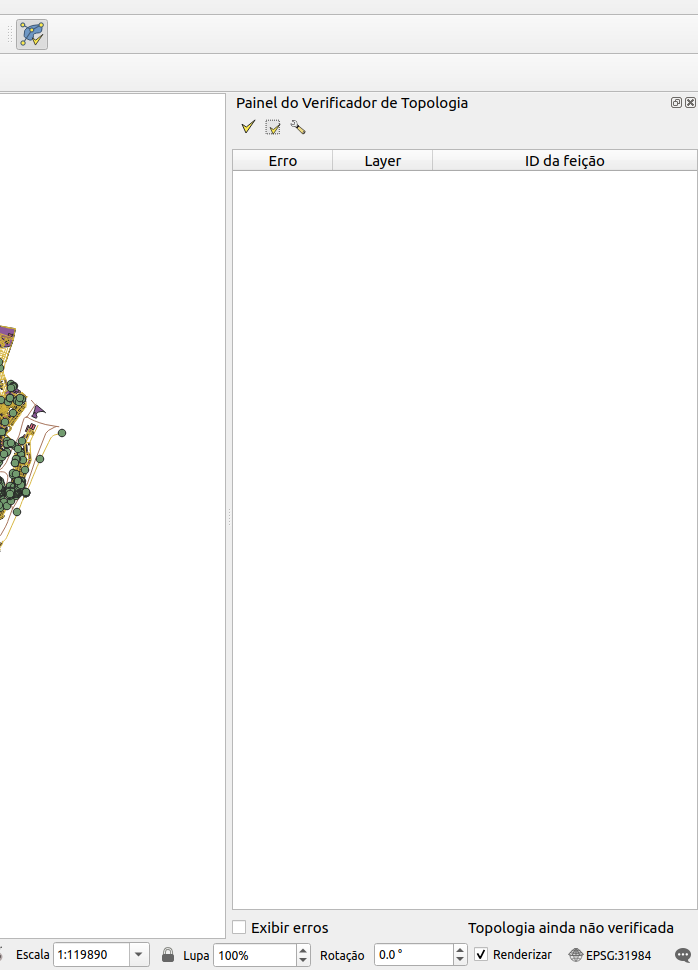


Figura 8.9.a - Painel de verificação de topologia; b - Janela do verificador de topologia

Para definir as regras de topologia, clique no ícone do Verificador de Topologia. Depois, no painel, clique no ícone de configurações (o terceiro da esquerda para direita), abrindo uma janela conforme figura 8.10.


Figura 8.10 - Janela de configurações de regras de topologia


Definiremos uma série de regras para as camadas que carregamos em nosso projeto QGIS, considerando os objetos do mundo real que elas retratam como estradas, edifícios e cursos de água no Recife.

A configuração da topologia é simples, pois as regras que podem ser aplicadas a partir da camada selecionada já estão embutidas nesta funcionalidade, conforme mostra a figura 8.11.


Figura 8.11 - Menu suspenso de regras de topologia com base na camada selecionada.

Escolha as regras de topologia conforme ilustrado na figura 8.12 e, em seguida, clique no primeiro ícone da janela para executar e aguardar os resultados.


Figura 8.12 - Regras de topologia a serem definidas

Após executar a verificação de topologia, suas janelas de mapa devem se parecer com a figura 8.13.


Figura 8.13 - Resultados da verificação de topologia

No canto inferior direito, a janela do verificador de topologia lista todos os erros identificados com base nas regras que definimos na fase anterior. Se a caixa de seleção "Mostrar erros" estiver marcada, os erros serão destacados em vermelho no mapa. Clicar duas vezes em um erro moverá o mapa para sua localização.

O processo de correção de erros em um conjunto de dados, seja ele relacionado à geometria (duplicatas, lacunas etc.) ou no atributo relacionado (valores ausentes, erros ortográficos etc.) é chamado de limpeza de um conjunto de dados e na maioria das vezes é tão complicado quanto necessário. Embora existam funcionalidades para dar suporte a um processo de limpeza semiautomático, o trabalho manual do usuário geralmente é necessário. Por exemplo, na figura 8.14, ampliamos um erro em nossa camada de pontos de interesse, um ponto duplicado. Como pode ser visto, há 2 pontos retratando um restaurante. Na tabela de atributos podemos que possuem nomes diferentes. Talvez o restaurante tenha mudado de nome e agora esteja duplicado?


Figura 8.14 - Erro de ponto duplicado na camada do vetor de pontos de interesse

Neste caso particular, o usuário provavelmente removeria o ponto duplicado, pois isso pode inserir erros em análises espaciais posteriores. Por exemplo, se um oficial municipal deseja saber quantos restaurantes existem em um bairro específico, o ponto duplicado inserirá um erro nos resultados e isso pode levar a decisões enganosas.  

Portanto, procederemos com a remoção automática dos pontos duplicados. Para fazer isso, usaremos uma funcionalidade central do QGIS - Excluir geometrias duplicadas - encontrada na caixa de ferramentas de processamento. Seu QGIS deve ser semelhante à figura 8.15.


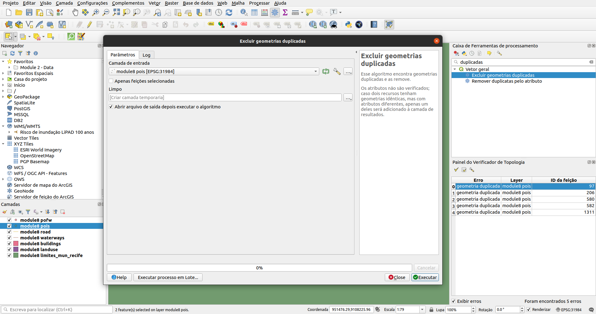

Figura 8.15 - Excluir geometrias duplicadas nos pontos de interesse da camada

Após executar o algoritmo, a janela de funcionalidade apresenta os resultados, identificando 6 pontos duplicados, assim como o verificador de topologia, e informa ao usuário que excluiu todos eles, deixando a camada de pontos de interesse com 1981 feições.


Figura 8.16 - Resultado da execução da exclusão de geometrias duplicadas

A nova execução do verificador de topologia mostrará que há 0 erros de pontos duplicados na camada.

**Atenção!** O algoritmo considera **apenas geometrias**, ignorando os atributos. Se, como é o nosso caso, houver alguma diferença no atributo das duplicatas, o usuário não tem controle sobre qual será mantida. Portanto, se houver necessidade de todas as informações serem mantidas, elas devem ser primeiro copiadas para todas as geometrias, de modo que quando um recurso duplicado for excluído, não haverá perda de informações.

Vamos executar outra verificação de topologia, desta vez em nossa camada de edifícios. Configure as seguintes regras:

* Sem duplicatas
* Sem geometrias inválidas

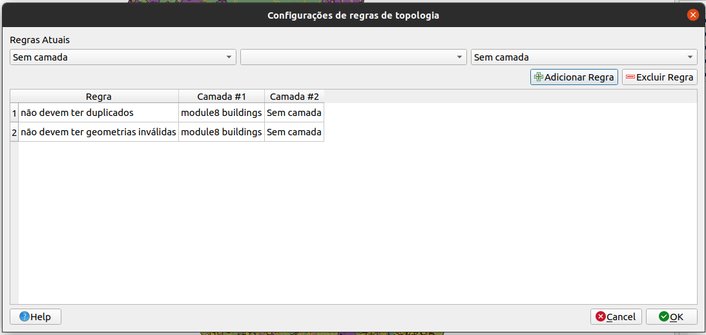

Figura 8.17a - Regras do verificador de topologia na camada vetorial de edifícios

Execute o algoritmo.

O resultado deve ser semelhante à figura 8.17b (sem erros).


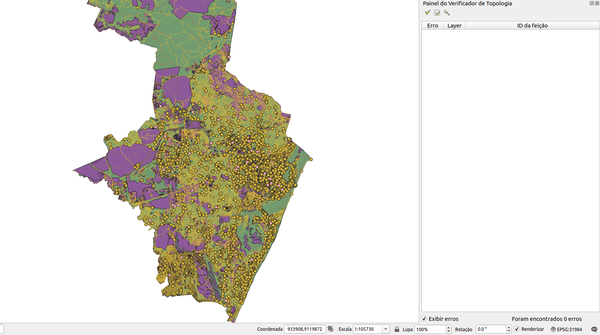

Figura 8.17b - Resultados da verificação da topologia na camada vetorial de edifícios

Se você tivesse geometrias duplicadas, poderia limpá-las fazendo os mesmos passos descritos acima para os pontos.

Uma limpeza completa dos conjuntos de dados vetoriais usados ​​para este módulo está fora do escopo. Sua complexidade o transforma em um módulo mais avançado em si mesmo.


#### **Etapa 4. Observe as informações anexadas aos pontos, linhas e polígonos.**

Vamos executar mais um algoritmo para ter uma ideia de quais são os atributos de nossas camadas do Recife. Depois de identificarmos quantos recursos cada camada possui, vamos ver quantos e quais são os atributos exclusivos nos seguintes casos:

* camada buildings - atributo type;
* camada pois_cleaned - atributo fclass;
* camada waterways - atributo fclass;
* camada pofw - atributo fclass;
* camada road - atributo fclass;
* camada landuse - atributo fclass;

Para isso, vá para **Vetor ‣ Analisar ‣ Listar valores únicos** (figura 8.19). Depois, clique em "Executar processo em Lote...", na parte inferior da janela.


Figura 8.19a - Lista valores únicos em uma funcionalidade de camada vetorial

Na janela que se abre, insira o nome de cada camada e o atributo de interesse conforme enumerado na lista acima e você deverá obter os seguintes resultados:


")

Figura 8.19b - Lista de valores únicos em uma funcionalidade de camada vetorial (Processamento em lote)
#### buildings
```
{
  'TOTAL_VALUES': 47,
  'UNIQUE_VALUES': 'parking;dormitory;stilt_house;NULL;pavilion;greenhouse;ruins;transportation;college;yes;chapel;boathouse;retail;supermarket;Prédio;college;industrial;farm;house;garages;garage;university;public;shed;roof;carport;church;temple;service;residential;hotel;warehouse;shop;cowshed;civic;kindergarten;stadium;apartments;semidetached_house;office;cabin;school;construction;commercial;terrace;grandstand;hospital;government'
}
```

#### pois_cleand
```
{
  'TOTAL_VALUES': 95,
  'UNIQUE_VALUES': 'recycling;artwork;tourist_info;shoe_shop;department_store;greengrocer;bicycle_rental;pharmacy;vending_any;hairdresser;post_box;car_wash;laundry;newsagent;drinking_water;outdoor_shop;community_centre;florist;fast_food;pitch;computer_shop;viewpoint;car_sharing;dog_park;guesthouse;theatre;travel_agent;library;convenience;waste_basket;bank;car_rental;supermarket;college;wayside_shrine;university;car_dealership;optician;hostel;telephone;toilet;pub;jeweller;bar;courthouse;embassy;monument;doctors;video_shop;camera_surveillance;hospital;bicycle_shop;fire_station;ruins;mall;playground;mobile_phone_shop;beverages;gift_shop;lighthouse;toy_shop;clothes;bench;dentist;bakery;water_tower;sports_shop;police;sports_centre;kiosk;cafe;shelter;cinema;attraction;museum;bookshop;motel;chalet;furniture_shop;post_office;atm;hotel;fountain;restaurant;doityourself;arts_centre;beauty_shop;comms_tower;tower;memorial;school;stationery;park;nightclub;camp_site'
}
```

#### waterways
```
{
  'TOTAL_VALUES': 4,
  'UNIQUE_VALUES': 'river;drain;stream;canal'
}
```

#### pofw
```
{
  'TOTAL_VALUES': 6,
  'UNIQUE_VALUES': 'buddhist;christian_evangelical;muslim;christian;christian_catholic;christian_methodist'
}
```


#### road
```
{
  'TOTAL_VALUES': 19,
  'UNIQUE_VALUES': 'secondary_link;primary_link;path;trunk_link;service;track;residential;track_grade3;primary;living_street;unclassified;trunk;pedestrian;tertiary_link;footway;tertiary;steps;secondary;cycleway'
}
```


#### landuse
```
{
  'TOTAL_VALUES': 17,
  'UNIQUE_VALUES': 'allotments;farmland;orchard;cemetery;grass;recreation_ground;park;farmyard;industrial;meadow;heath;commercial;forest;scrub;retail;military;residential'
}
```


Tabela 8.1 - Tabela que identifica quantos e quais são os valores únicos para os atributos selecionados

Para uma análise mais aprofundada dos atributos de nossas camadas vetoriais, usaremos o plugin Group Stats. Ele foi desenvolvido para oferecer suporte ao cálculo de estatísticas para grupos de recursos em uma camada vetorial, tornando-o muito útil para obter mais compreensão de seus dados, bem como para detectar possíveis erros nos atributos.

Primeiro, certifique-se de ter instalado e ativado o plugin Group Stats. Em seguida, para abrir a janela Group Stats, vá para **Vetor ‣ Group Stats ‣ Group Stats**.

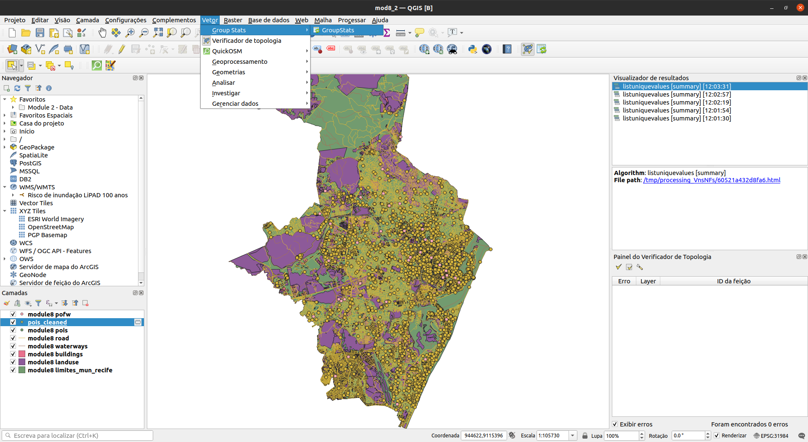

Figura 8.20a - Plug-in Group Stats

Uma nova janela como a da figura 8.20b deve abrir.


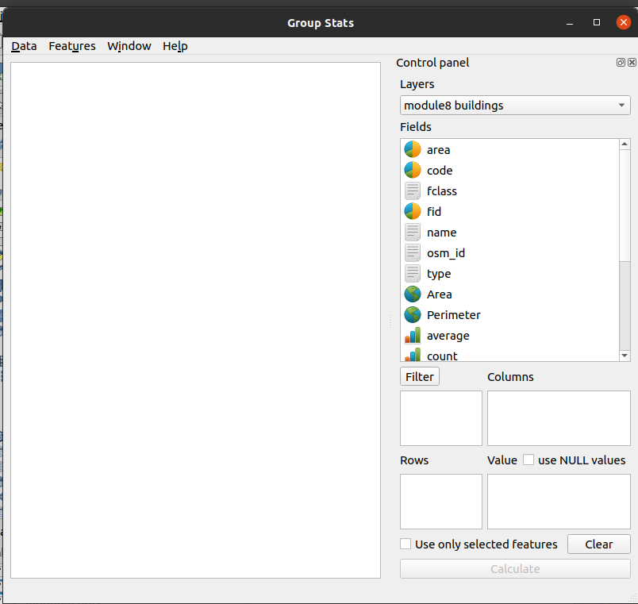

Figura 8.20b - Janela Group Stats

De acordo com a análise feita anteriormente, vimos que para os edifícios da camada temos 47 tipos diferentes de edifícios, mas quantos de cada e qual é a área construída total de cada categoria? Quanto espaço para escolas, mercados, casas? Group Stats pode nos ajudar a responder a essa pergunta. Do lado direito da janela, está o painel de controle, onde escolhemos o que queremos calcular, bem como a forma como os dados devem ser organizados. Usando arrastar e soltar, siga o arranjo na figura 8.21 e pressione calcular.


Figura 8.21 - Executando Group Stats na camada de construção.

Olhando para o resultado, podemos extrair informações importantes sobre nossos dados. Por exemplo, para estádios no Recife, temos 33 edifícios com uma área total construída de 31539 metros quadrados, aprox. 32 hectares. E pode-se continuar a análise para mais informações valiosas.

Outra análise interessante pode ser executada na camada vetorial de estradas. A Figura 8.22 mostra como calcular os comprimentos de estradas categorizados por tipo de estrada (primária, residencial, rodovia etc.) e velocidade máxima permitida.


Figura 8.22 - Executando Group Stats na camada de estradas.


#### **Perguntas do teste**

1. Os metadados são importantes?
* _ <span style = "text-decoration: underline;"> Sim, porque fornecem uma visão sobre os dados geográficos que de outra forma não seria possível obter. </span> _
* _Não, é apenas burocracia. _
2. A topologia é relevante para a geometria ou para a tabela de atributos de uma camada vetorial?
* _para a geometria da camada vetorial. _
3. O que é mais importante, a geometria ou os dados do atributo?
* _Geometria._
* _Dados de atributo._
* _ <span style = "text-decoration: underline;"> Ambos. </span> _


### Fase 2: Introdução ao processamento vetorial

A primeira fase do módulo vetorial fez uma breve introdução sobre as etapas que se devem realizar para se ter uma compreensão básica dos dados geoespaciais que temos em mãos.

Esta segunda fase do módulo leva a um trabalho mais aprofundado para processar dados vetoriais a fim de extrair percepções valiosas para auxiliar na tomada de decisões. Seguindo os conceitos descritos no início deste módulo, o geoprocessamento representa qualquer processo aplicado a um conjunto de dados geográficos, com o objetivo de obter um conjunto de dados derivado abrindo novos insights sobre os dados. E é isso que tentaremos fazer a seguir.

Existem muitas operações que podem ser realizadas em um ou mais conjuntos de dados geoespaciais e, durante esta primeira etapa, executaremos algumas das mais comuns para entender como funcionam.

**Buffer.** Imagine que você precise analisar uma nova legislação que exige que em uma área de 500 metros ao redor de locais de culto não possa haver outra construção. Você gostaria de ver onde exatamente essas delimitações estão e talvez até quantos metros quadrados isso representa para o seu distrito. O primeiro passo é definir um buffer em torno dos locais de culto: **Vector ‣ ferramentas de geoprocessamento ‣ Buffer (Amortecedor)**. Quando a janela do buffer abrir, defina os parâmetros como na figura 8.23:


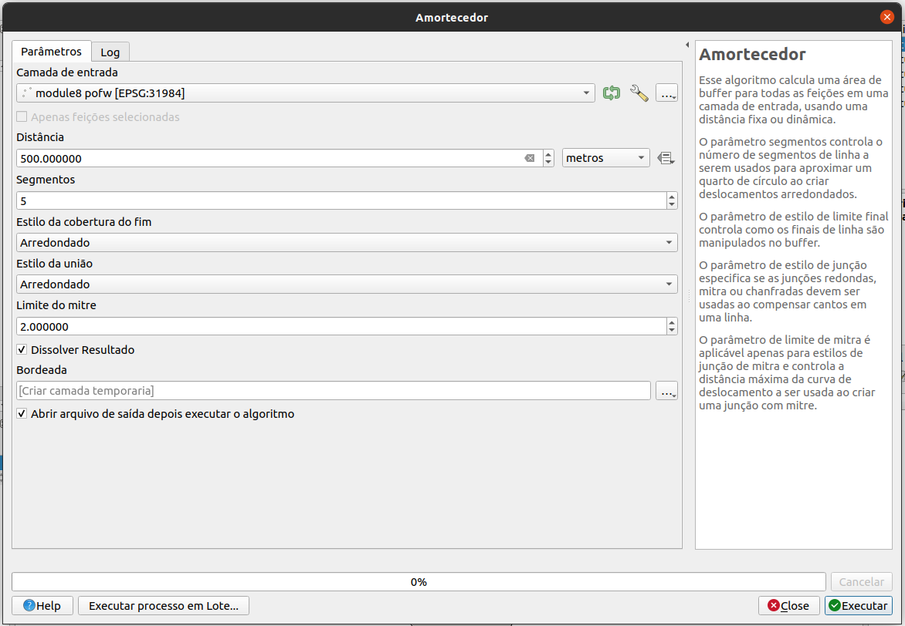

Figura 8.23 ​​- Definindo os parâmetros para um buffer de 500 m ao redor dos locais de culto

Um detalhe do resultado do geoprocessamento está representado na figura 8.24:


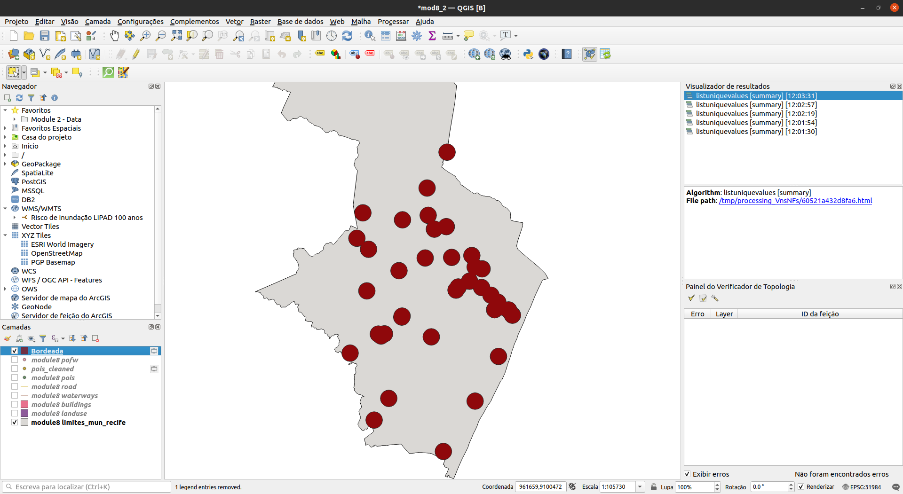

Figura 8.24 - Buffer em execução em uma camada vetorial de ponto

Para responder completamente à pergunta inicial, o próximo passo é calcular as áreas para todos os buffers e somá-los (ver Fase 1, passo 4) - figura 8.25.


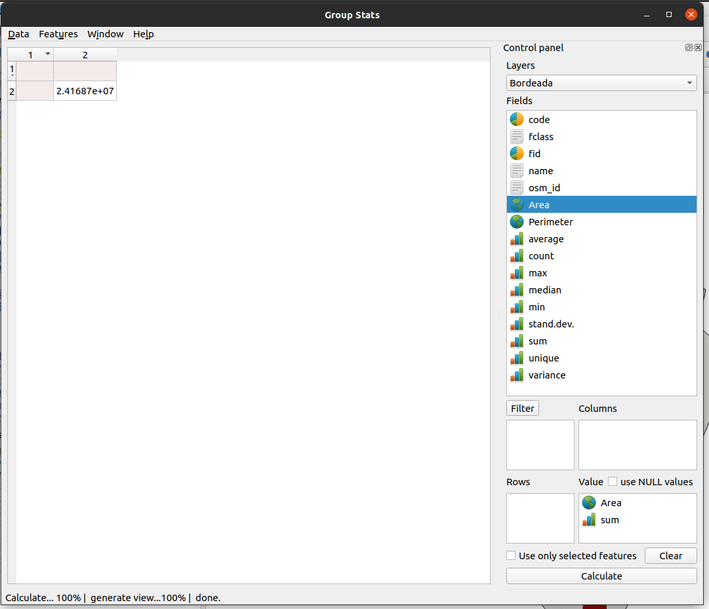

Figura 8.25 - Calcule a área para a camada recém-obtida e, em seguida, calcule usando Group Stats a soma total.

**Recortar** Imagine que você queira saber onde estão todas as áreas industriais delineadas em seu distrito e também quantos edifícios estão dentro desse perímetro. Ao inspecionar visualmente seus dados vetoriais, você percebe que há várias áreas industriais que contêm vários edifícios. Você deseja separar esses edifícios e usá-los posteriormente. O primeiro passo é selecionar todos os recursos da camada de uso do solo que tenham como atributo industrial (ver módulo 6 para saber como fazer isso). Em seguida, você vai para **Vetor ‣ Geoprocessamento ‣ Recortar** e escolhe como a camada a ser recortada buildings. Seus resultados devem ser semelhantes à figura 8.27b.


Figura 8.26a - Selecione landuse fclass = industrial.


Figura 8.26b - Seleção reduzida de alguns edifícios e uso do solo industrial, para que o cálculo possa terminar mais rápido.

Execute o algoritmo de Clip. Certifique-se de marcar a caixa ** Somente recursos selecionados ** para a camada de sobreposição (uso do solo). Isso garantirá que apenas os recursos atualmente selecionados serão usados ​​para recortar e acelerar os cálculos.


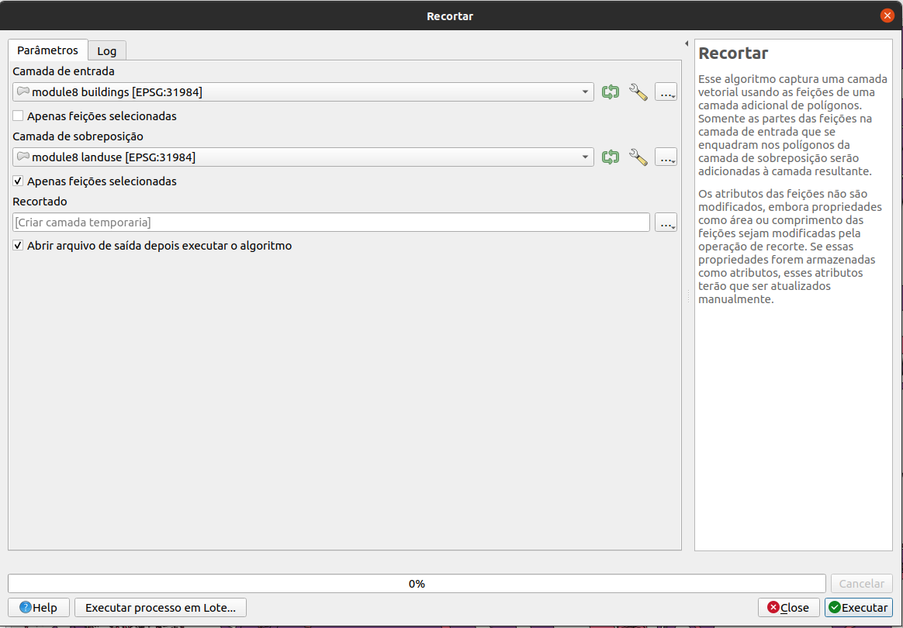

Figura 8.27a - Executando o algoritmo de Clip

Depois de executar o algoritmo, seus resultados devem ser semelhantes à figura 8.27b. Os edifícios recortados são coloridos em verde (pode ser diferente em seu machince). Quantos edifícios industriais você cortou e qual é sua área total?

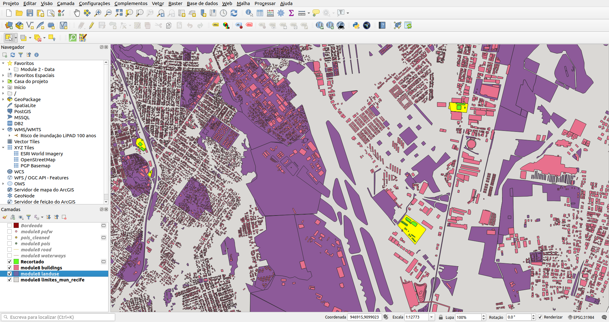

Figura 8.27b - Resultados da funcionalidade de clipe

**Polígonos de Thiessen (Voronoi).** Imagine que você tenha que tomar uma série de decisões administrativas em seu distrito com base no número de escolas existentes e em quais áreas específicas elas atendem. A análise geoespacial pode ser útil. Você pode começar calculando os polígonos de Thiessen. Com base em uma área contendo pelo menos dois pontos, um polígono de Thiessen é uma forma bidimensional cujos limites contêm todo o espaço que está mais próximo de um ponto dentro da área do que qualquer outro ponto sem a área. Um bom exemplo de uso é em meteorologia, onde estações meteorológicas são pontos discretos, mas as informações coletadas são consideradas medidas na superfície com base nos polígonos de Thiessen.

Para responder à pergunta acima, vamos executar o algoritmo apenas para pontos que têm o atributo escola no tipo. Portanto, faça a seleção conforme as instruções no módulo 6. Você deve ter 88 recursos selecionados na camada pois_cleaned. Vá para **Vetor ‣ Geometria ‣ Polígonos de Voronoi** Depois de definir os parâmetros - selecione a camada de pontos para a qual queremos os polígonos de Voronoi calculados e uma extensão de 30% para que toda a cidade do Recife esteja contida, você deve ver um resultado como na figura 8.28d.


Figura 8.28a - Filtrando a camada de poi para obter todas as escolas


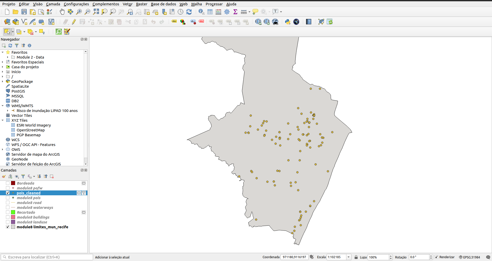

Figura 8.28b - Todas as escolas na camada de poi


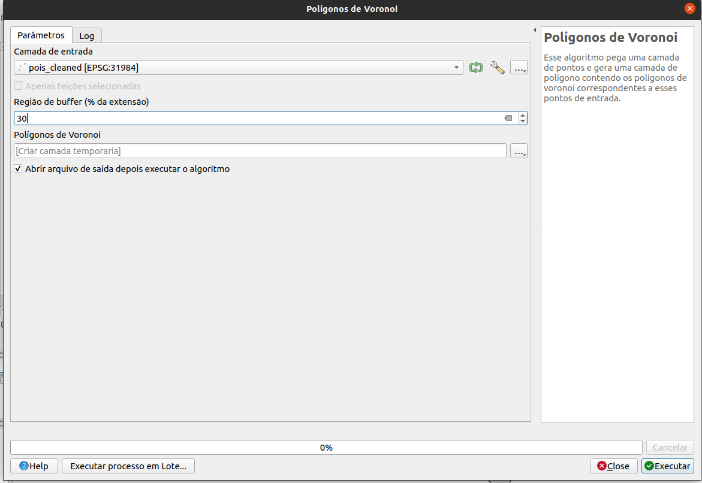

Figura 8.28c - Executando o algoritmo do polígono de Voronoi


 a uma camada de vetor de ponto")

Figura 8.28d - Resultados da aplicação do algoritmo de polígonos de Thiessen (Voronoi) a uma camada vetorial de ponto

Às vezes, as necessidades impõem a exigência de se ter informações em áreas menores, claramente definidas e iguais e não para toda uma grande região, como um país ou uma grande cidade. Portanto, os dados precisam ser analisados ​​e visualizados de forma fatiada e bem definida, permitindo a comparação que de outra forma poderia ser difícil sem uma referência comum de base.

Vamos supor que você tenha que apresentar um relatório que permitirá comparações feitas para unidades de 2X2 km sobre a unidade administrativa, incluindo:

1. densidade de espaços verdes (parques, florestas) no relatório to o espaço construído por unidade;
2. Comprimento total das ruas de cada unidade;
3. Comprimento total dos cursos d'água para cada unidade;
4. número total de edifícios públicos para cada unidade (escolas, jardins de infância, hospitais, prefeituras etc.).

Vimos que existem ferramentas que podem nos auxiliar no cálculo da superfície total ocupada por um determinado tipo de recurso, no entanto, o primeiro passo é criar nossas unidades 2X2 - grades de células. Para fazer isso, vá para: **Vetor ‣ Investigar ‣ Criar grade ..** Defina os parâmetros para:
- Tipo de grade - Retângulo (polígono)
- Extensão da grade - camada limites_mun_recife
- Espaçamento horizontal - 2 km
- Espaçamento vertical - 2 km


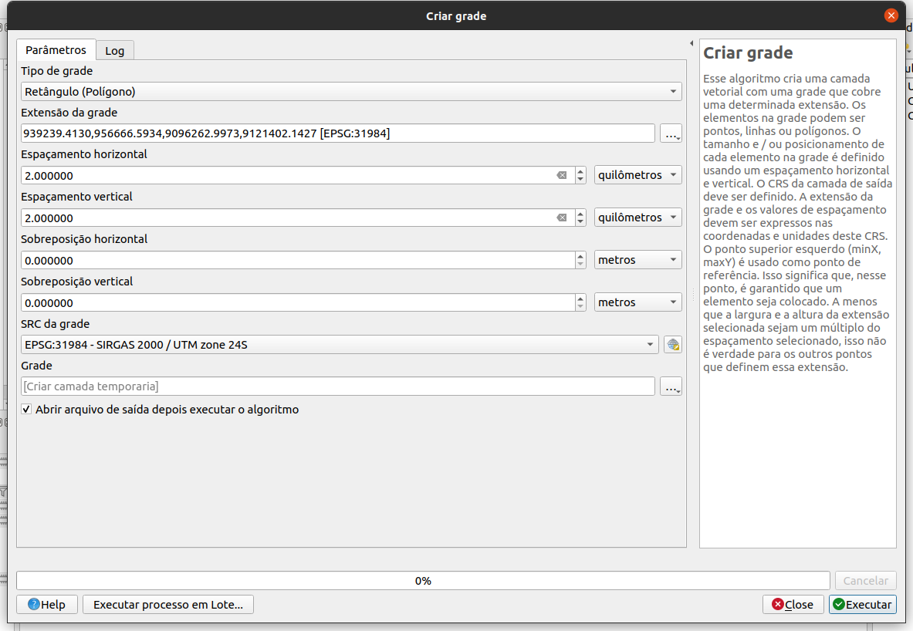

Figura 8.29a - Criar grade vetorial de 2x2 km para o Recife

Você deve obter um resultado como na figura 8.29b.


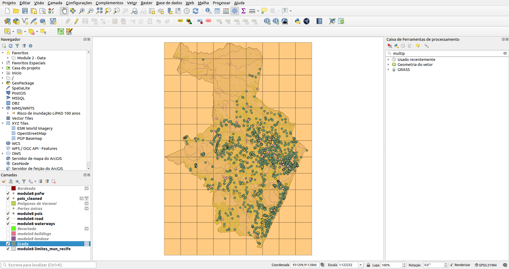

Figura 8.29b - Grade vetorial de 2x2 km para o Recife

Indo além na resposta às perguntas em nosso exercício, precisamos fazer o seguinte:

1. espaços verdes (parques, florestas), espaço construído por proporção de unidade da grade:

Espaços verdes e espaços construídos são dados contidos na camada vetorial de uso do solo, tipo polígono. Para saber exatamente quais são os "espaços verdes", precisamos ver quais são as categorias incluídas no conjunto de dados. Para isso, executamos o algoritmo **Listar valores únicos** no atributo `fclass` e descobrimos que temos as seguintes classes 'verdes': prado, grama, natureza_reserva, parque, floresta e o seguinte 'espaço construído' classes: varejo, comercial, industrial, residencial. A Figura 8.30b apresenta uma visualização de nossas seleções:

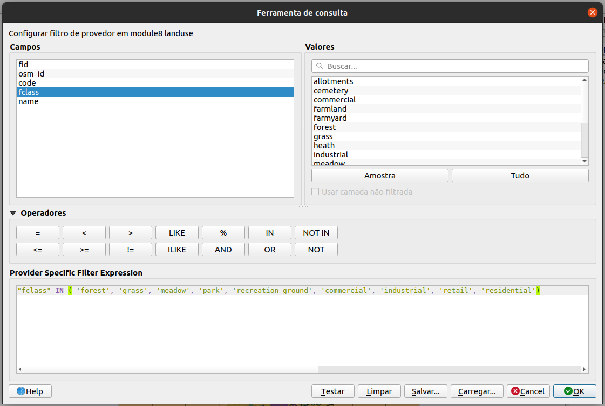

Figura 8.30a - Filtragem de áreas verdes e espaços construídos em Recife


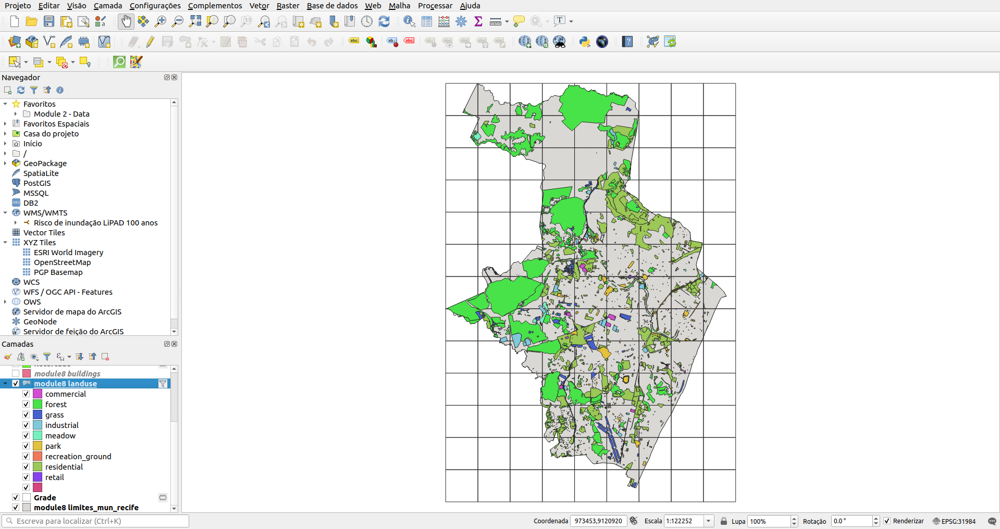

Figura 8.30b - Distribuição espacial das áreas verdes e áreas construídas em Recife

A segunda etapa para atender ao requisito é identificar quanto espaço verde e quanto espaço construído existe em cada 2X2 km. Para obter isso, iremos **interceptar** as 2 camadas vetoriais poligonais sobrepostas. O algoritmo extrai as porções sobrepostas de recursos na Entrada - a camada de uso do solo e a camada de Sobreposição - a camada de grade. Vá para **Vetor - Geoprocessamento - Interseção** ou procure **Interseção na Caixa de Ferramentas de Processamento ou na Barra Localizadora** Defina os parâmetros do algoritmo como na figura 8.31.


Figura 8.31 - Parâmetros para o algoritmo de interseção

O resultado deve ser semelhante ao da figura 8.32.

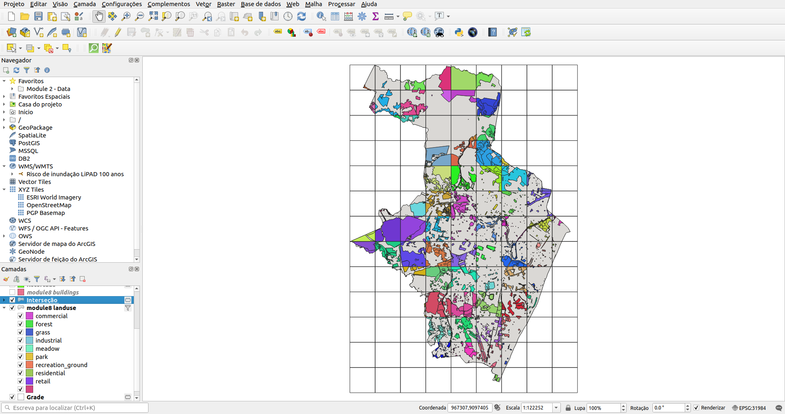

Figura 8.32 - Resultado da execução do algoritmo de interseção para prender os polígonos vetoriais de uso do solo à camada da grade.

Agora, para cada unidade de 2X2 km, temos os recursos de uso do solo com os quais podemos trabalhar. A tabela de atributos também armazena essas informações, pois cada célula da grade - unidade - possui um id único, ver figura 8.33.


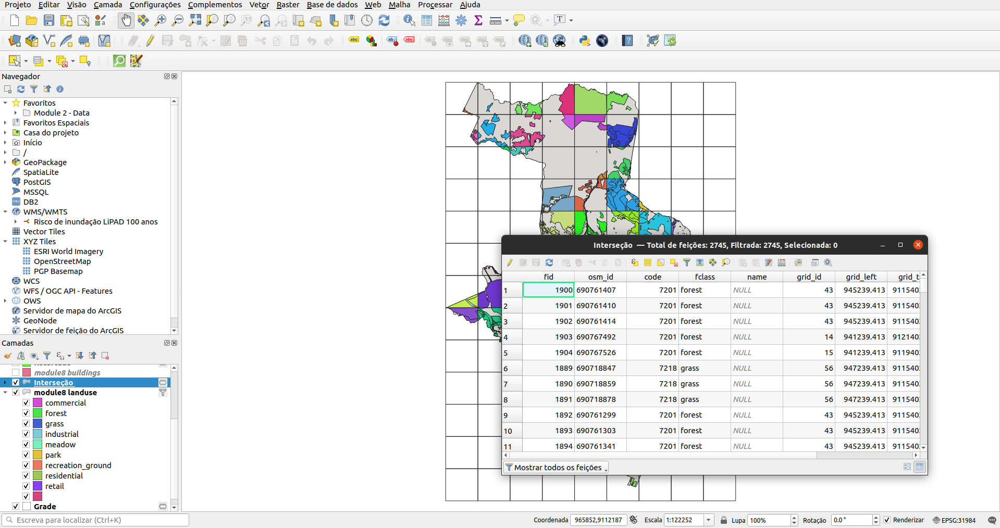

Figura 8.33 - Características Landuse cortadas por cada célula da grade e sua tabela de atributos associada.

Agora que temos todos os recursos de uso do solo por unidade de 2X2 km, continuaremos separando as geometrias das que compõem o espaço verde e o espaço construído conforme definido anteriormente - para cada célula da grade. Assim, para espaços verdes, selecionaremos todos os recursos que têm o valor de atributo para `"fclass" IN ( 'forest', 'grass', 'meadow', 'park', 'recreation_ground')`. Na tabela de atributos, no campo de expressão digite: `"fclass" IN ( 'forest', 'grass', 'meadow', 'park', 'recreation_ground')`. Exporte os recursos selecionados como espacos_verdes_grade (consulte o módulo 6 para obter mais detalhes). Não se esqueça de marcar **Salvar apenas os recursos selecionados**. A nova saída deve ter 2160 recursos. Faça o mesmo para o espaço construído. Selecione os recursos em uso do solo que têm o valor de atributo `"fclass" IN ('commercial', 'industrial', 'retail', 'residential')`, escrevendo a seguinte expressão na janela de filtro com base em Expressão: `"fclass" IN ('commercial', 'industrial', 'retail', 'residential')`. Selecione as geometrias filtradas e exporte como espacos_construidos_grade. Sua nova saída deve ter 585 recursos.

Como alternativa, você também pode usar um filtro em vez de uma seleção.


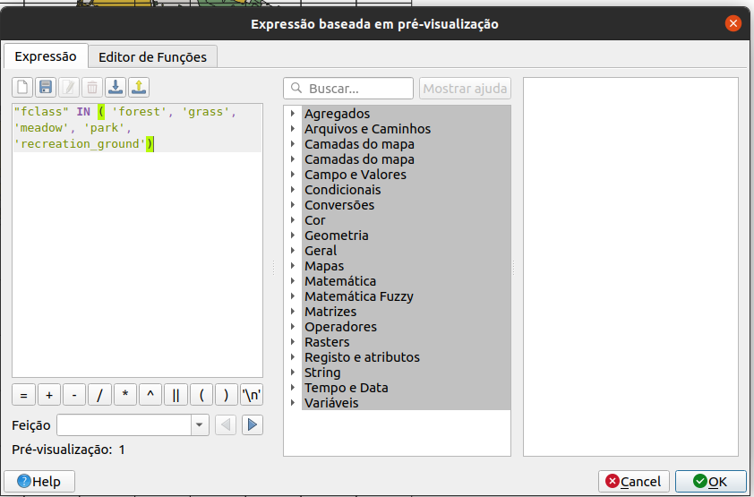

Figura 8.34a - Seleção dos espaços verdes.


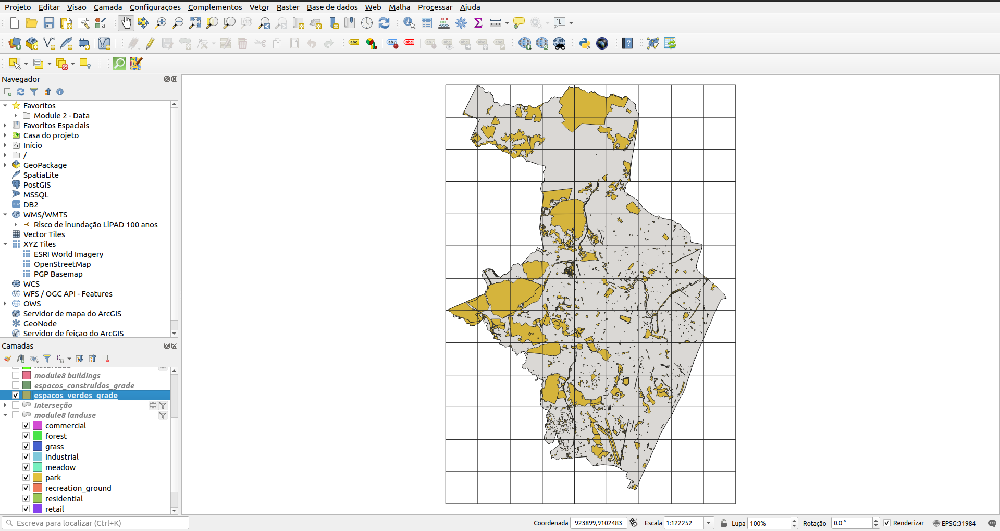

Figura 8.34b - Espaços verdes selecionados.


Figura 8.34c - Espaços verdes e edificados.

Em seguida, calcule a área ocupada por cada característica das 2 camadas. Vá para a tabela de atributos de cada camada e adicione a área da coluna geométrica inserindo a expressão `round ($ area, 2)` na calculadora de campo. (consulte o módulo 6 para obter detalhes, se necessário). No entanto, a grade de 2X2km do Recife tem um número conhecido de células da grade, que é 117. Portanto, precisamos resumir as áreas para todos os tipos de espaços verdes (florestas, parques etc.) e espaços construídos (comerciais , residencial, etc.) e junte-o de acordo com todas as 117 células da grade. Para fazer isso, usaremos o plugin **Group Stats** para somar para cada grid_id todas as categorias verdes, respectivamente todas as categorias construídas. Para a camada vetorial espacos_verdes_grade, defina os parâmetros como na figura 8.34e.


Figura 8.34d - Calculando a área de cada recurso.

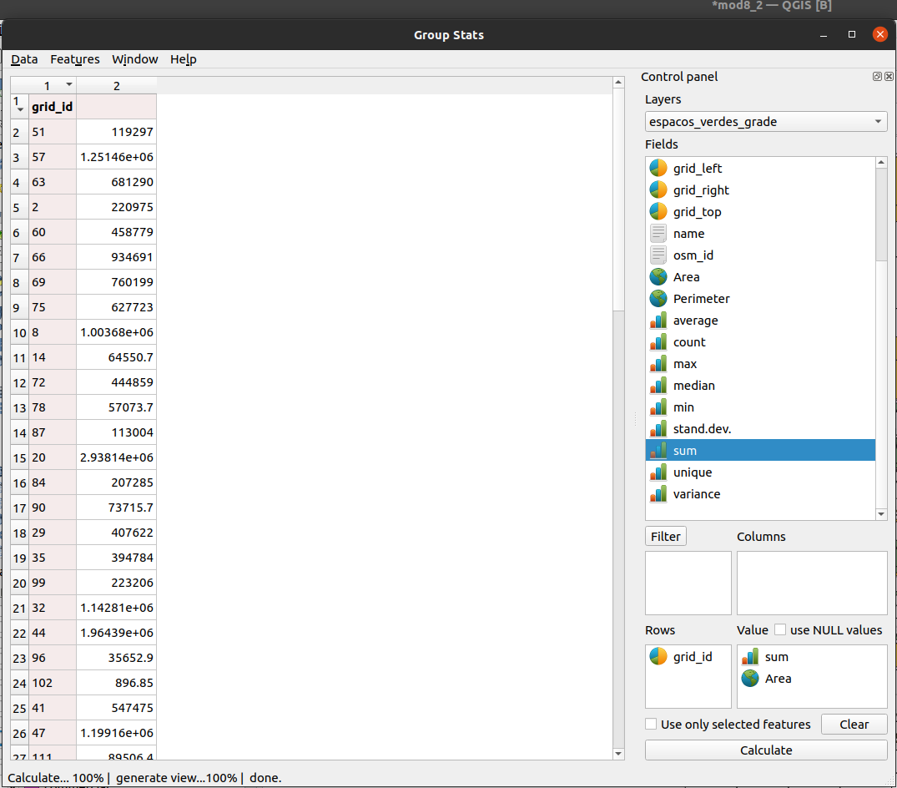

Figura 8.34e - Configuração dos parâmetros do GroupStat para somar as áreas verdes por cada célula de grade de 2X2km.

Em seguida, salve os resultados como um arquivo .csv denominado `espacos_verdes_grade`. Vá para **Data ‣ Save all to CSV file**

Execute Group Stats para o espaço construído da mesma maneira e salve-o como um arquivo csv denominado `espacos_construidos_grade`.

A seguir, vamos trazer os 2 arquivos csv calculados com GroupStat para o QGIS (**Camada ‣ Adicionar camada ‣ Adicionar camada de texto delimitado** - veja mais detalhes no módulo 2).


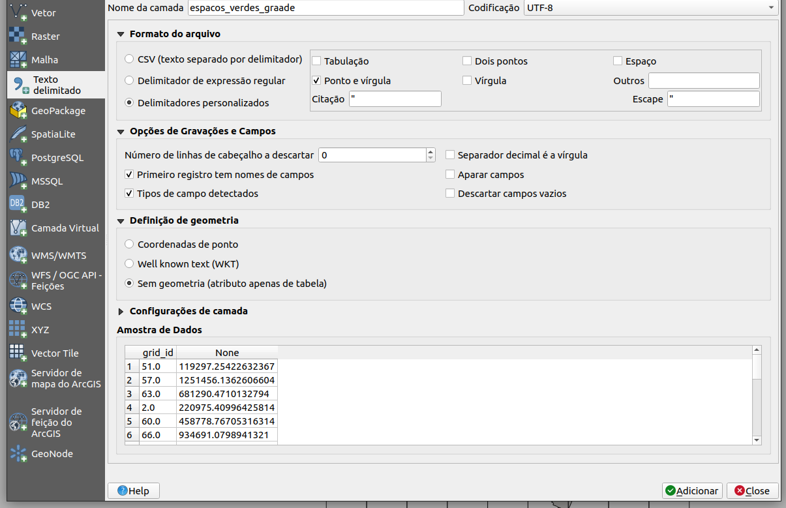

Figura 8.35a - Carregando o CSV espacos_verdes_grade


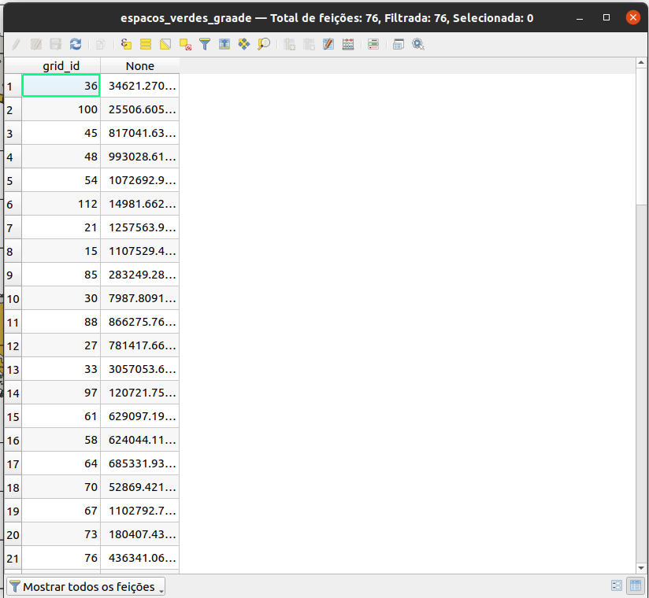

Figura 8.35b - A tabela de atributos de CSV espacos_verdes_grade

Seguindo em frente, precisamos juntar os espaços calculados - verdes e construídos - a cada grade de células de 2X2 km. Para isso, selecione a camada vetorial Grade, abra a janela de propriedades e vá em **Uniões**. Esta funcionalidade permite que você se junte por um campo de atributo comum, outros. No nosso caso, usando o valor comum grid_id vamos juntar, a soma das áreas construídas e espaços verdes dos 2 arquivos csv obtidos na etapa anterior.

Na janela **Uniões**, pressione o botão verde mais abaixo e defina os parâmetros como na figura 8.35, para espaços verdes.


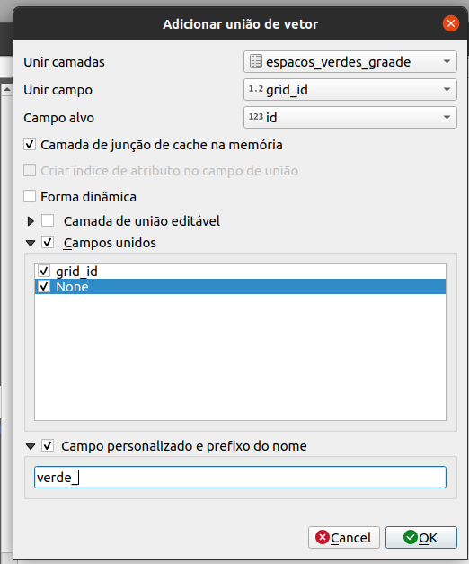

Figura 8.35c - Configurando os parâmetros para unir por campo comum grid_id/id as somas de espaços verdes e construídos para cada célula da grade - unidade de 2X2km.

Repita para espaços construídos.

Os resultados das duas junções são visíveis na tabela de atributos, como pode ser visto na figura 8.36_b. Mantivemos o grid_id em ambas as junções, para ter certeza de que nenhum erro ocorreu. Podemos verificar visualmente rapidamente para ter certeza de que os 3 campos de atributo: id, construido_grid_id e verde_grid_id são exatamente os mesmos.


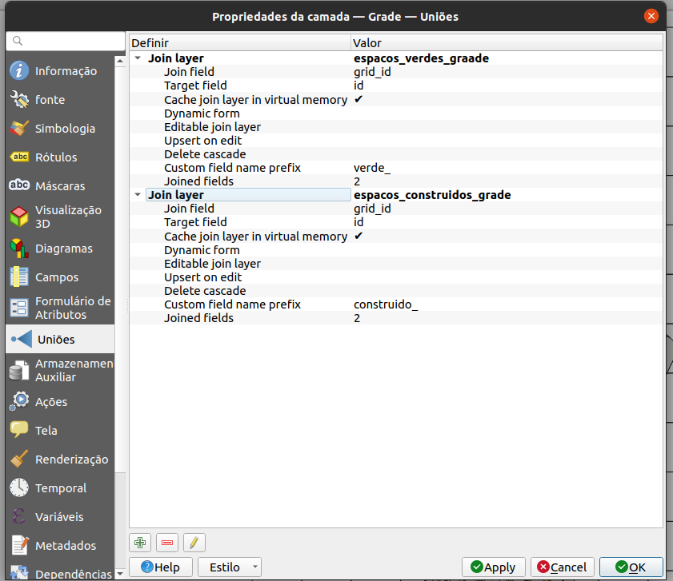

Figura 8.36a - CSV verde e construído unido à grade.


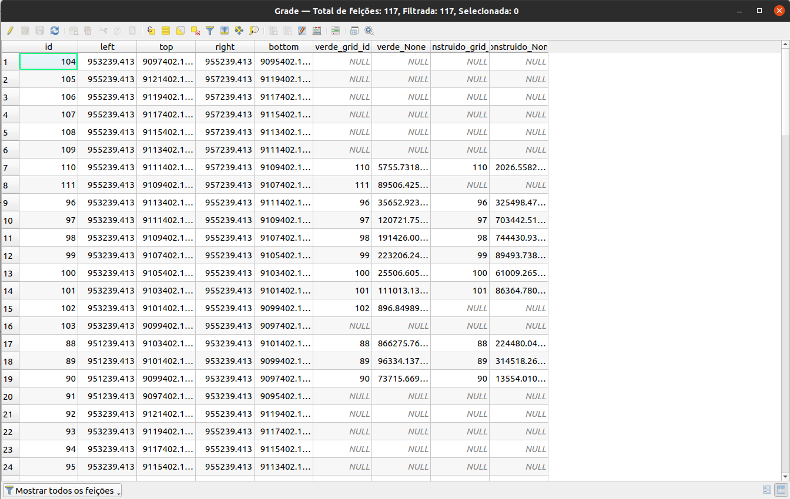

Figura 8.36b - Tabela de atributos da camada vetorial Grade contendo as áreas totais para espaços verdes e edificados.


Como reunimos todas as informações necessárias para espaços verdes e construídos na tabela de atributos da camada de grade, tudo o que precisamos fazer é calcular a porcentagem desses espaços dentro da célula de grade de 2X2 km. Iremos calculá-lo usando a calculadora de campo, usando a seguinte expressão: `round (100 * verde_None/(2000*2000), 5)` e `round (100 * construido_None/(2000*2000), 5)`. Em seguida, adicionamos um novo campo no qual calcular o relatório do verde_por/construido_por, e assim chegar à resposta ao nosso pedido: espaços verdes (parques, florestas) espaço construído por unidade de proporção: `round (" verde_por "/" construido_por ", 5)`. uma visão geral clara do nosso conjunto de dados, nos casos em que não há espaço acumulado na célula da grade- inserimos o valor 1000 na tabela de atributos, nos casos em que não há espaço verde, inseriremos o valor 999, enquanto no caso de ambos os valores serem NULL então inserimos 1001. Para isso podemos usar a expressão:

```
CASE
WHEN (verde_por IS NULL) AND (construido_por IS NOT NULL) THEN 999
WHEN (construido_por IS NULL) AND (verde_por IS NOT NULL) THEN 1000
WHEN (verde_por IS NULL) AND (construido_por IS NULL) THEN 1001
ELSE round(verde_por/construido_por, 5)
END
```

O resultado final seria semelhante ao da figura 8.37e.


Figura 8.37a - Porcentagem de área verde na grade de 2km X 2km


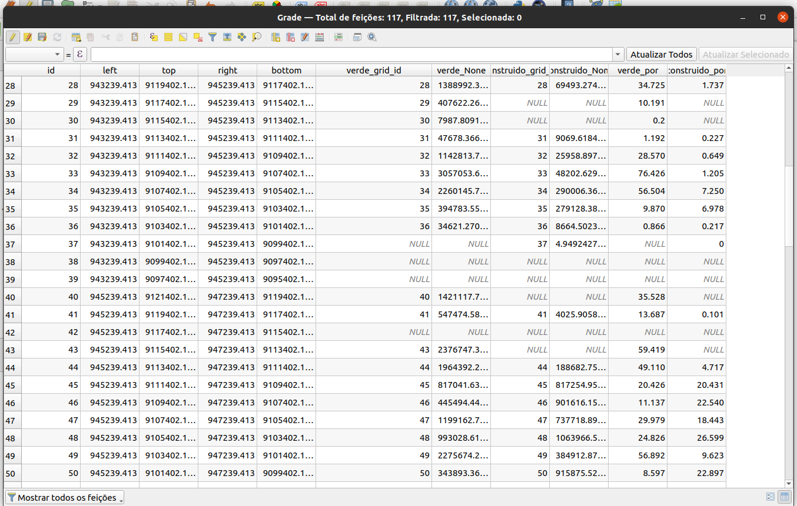

Figura 8.37b - Porcentagem calculada de área verde e construída


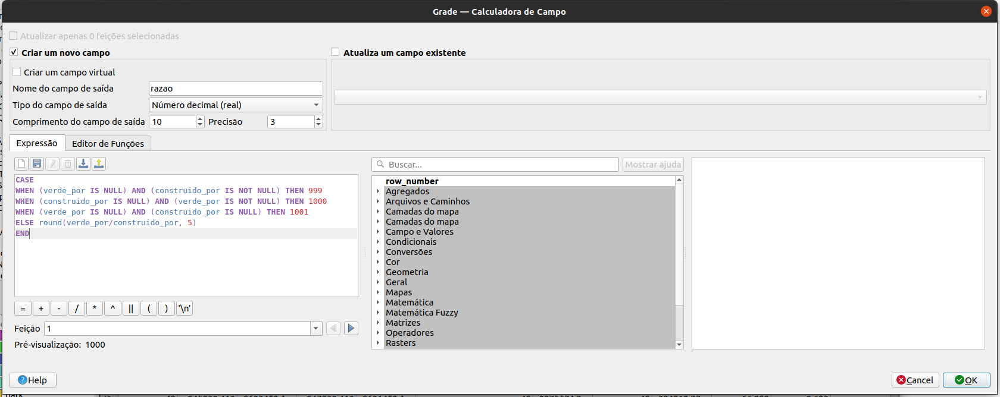

Figura 8.37c - Computação para a proporção de áreas verdes e áreas construídas


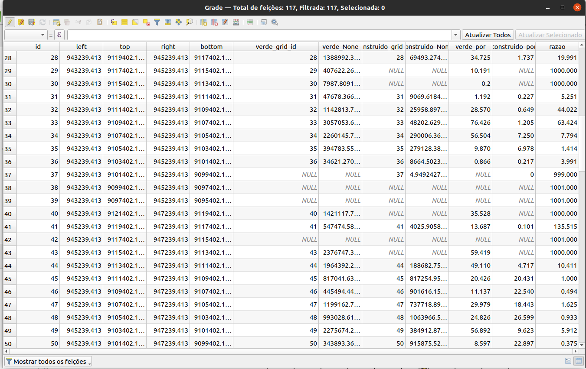

Figura 8.37d - Razão calculada de áreas verdes e construídas


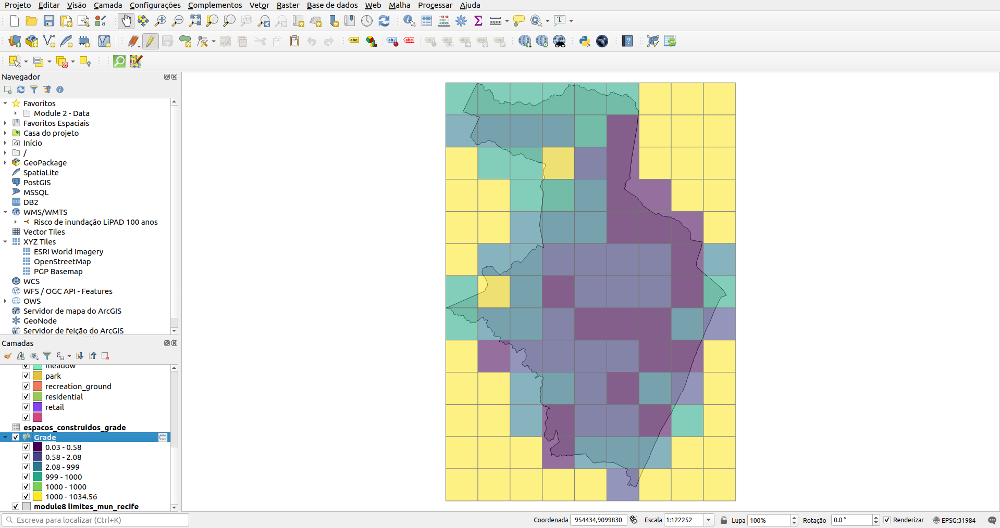

Figura 8.37e - Razão de áreas verdes e áreas construídas na grade de 2km X 2km


2. extensão total de ruas e vias navegáveis ​​de cada unidade;

Para realizar esta tarefa, o QGIS oferece um algoritmo que pega uma camada de polígono e uma camada de linha e mede o comprimento total das linhas e o número total delas que cruzam cada polígono. A camada resultante tem os mesmos recursos da camada de polígono de entrada, mas com dois atributos adicionais contendo o comprimento e a contagem das linhas em cada polígono. Vá para **Vetor > Análise > Soma de Comprimentos de Linha** e defina os parâmetros da seguinte forma:
- polígonos - Grade
- linhas - road
- nome do campo de comprimento de linhas - road_comp
- nome do campo de contagem de linhas - road_cont

Você pode criar uma camada temporária ou salvá-la como um arquivo em seu computador. Se, para representação, você usa quebras naturais, seu mapa deve se parecer com a figura 8.38c.


Figura 8.38a - Parâmetros de Somatórios de Comprimento de Linha


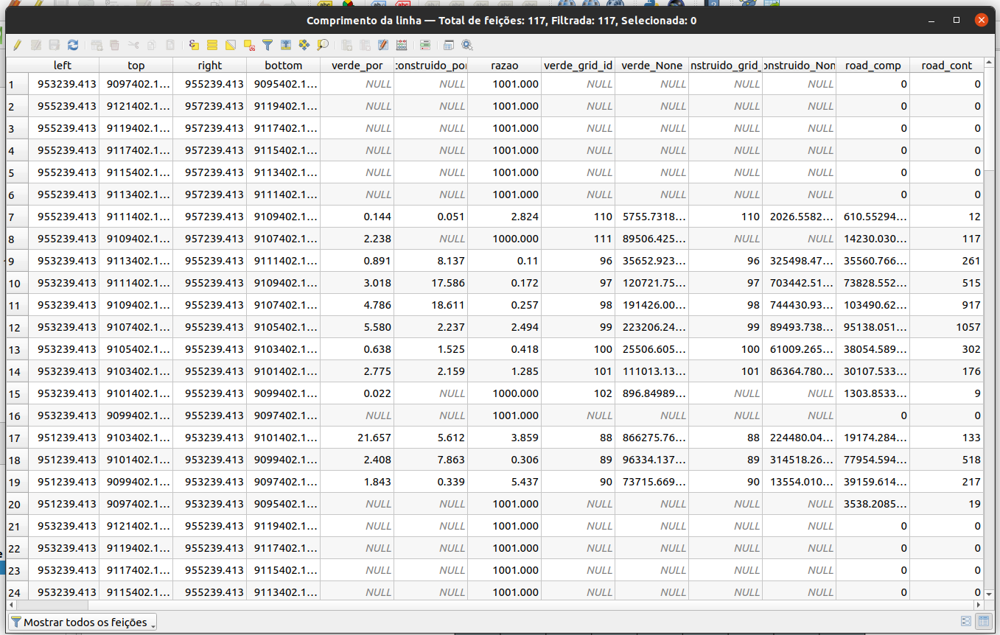

Figura 8.38b - Comprimentos de estradas e contagens por célula de grade


Figura 8.38c - Distribuição espacial de unidades de 2X2km com a maioria das estradas

Agora, repita o mesmo processamento para comprimentos de cursos d'água (waterways) ​​em cada célula da grade. Executar o processo no arquivo de grade obtido anteriormente o ajudará a ter todas as informações obtidas até agora anexadas à mesma geometria. Aconselhamos que você salve este arquivo em seu computador com comprimentos_linhas_grade. Se, para representação, você usar quebras naturais, seu mapa deve se parecer com a figura 8.39.


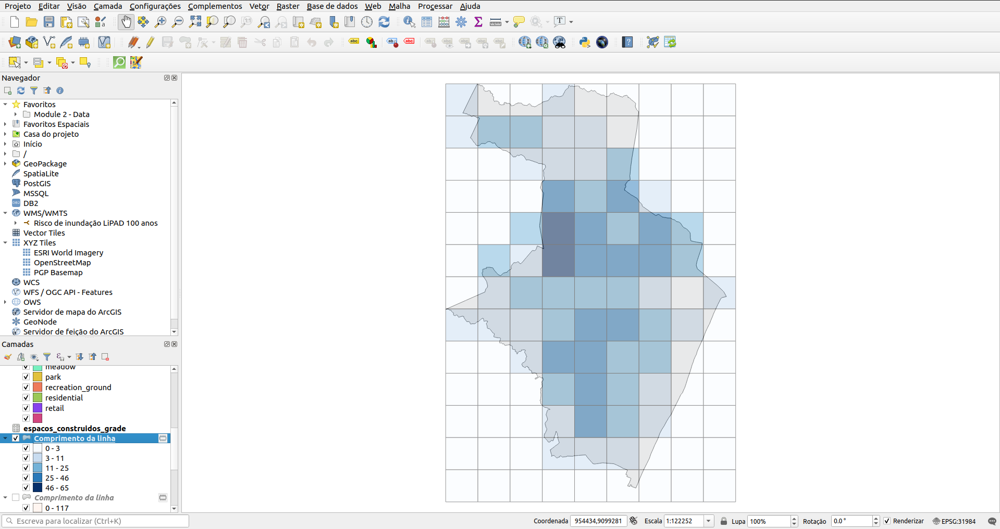

Figura 8.39 - Distribuição espacial de unidades de 2X2km com a maioria dos cursos d'água

3. número total de edifícios públicos (escolas, jardins de infância, hospitais, prefeituras etc.) para cada célula da grade

Para contar o número total de prédios públicos na unidade 2X2, usaremos o pois_cleaned. Primeiro, executamos **Vetor ‣ Analisar ‣ Lista de Valores Únicos** e decidimos qual edifício consideramos público. Selecionaremos em nossa camada de dados de pontos vetoriais (pois) os seguintes recursos: `"fclass" IN ('arts_centre', 'embassy', 'hospital', 'library', 'museum', 'school', 'university', 'monument')`. Sua seleção deve ter 324 recursos no total.


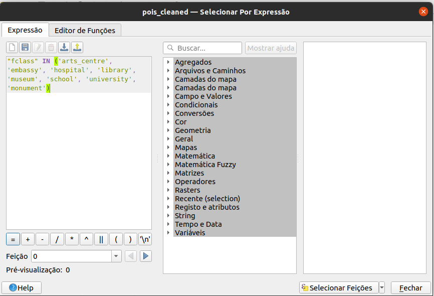

Figura 8.40a - Seleção de POIs públicos


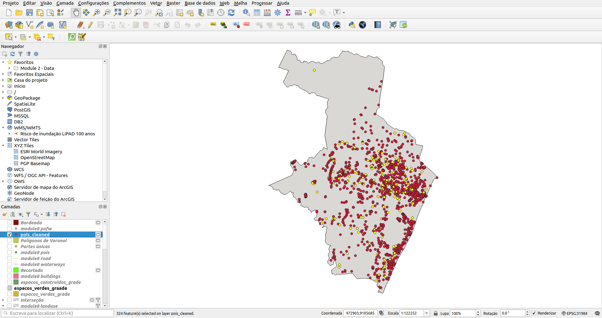

Figura 8.40b - POIS público selecionado

Para responder à nossa solicitação, usaremos o algoritmo **Vetor ‣ Analisar ‣ Contagem de pontos em polígono**. Este algoritmo pega uma camada de pontos e uma camada de polígono e conta o número de pontos da primeira em cada polígono da segunda. Uma nova camada de polígonos é gerada, com exatamente o mesmo conteúdo da camada de polígonos de entrada, mas contendo um campo adicional com a contagem de pontos correspondente a cada polígono. Defina a camada de ponto para pois_cleand e a camada de grade de polígono com as informações calculadas na rodada anterior. Para os pontos, marque os **Apenas feições selecionadas**, para que o algoritmo calcule apenas os pontos selecionados - os POIs públicos. Salve o arquivo de saída como pontos_publicos_grade.


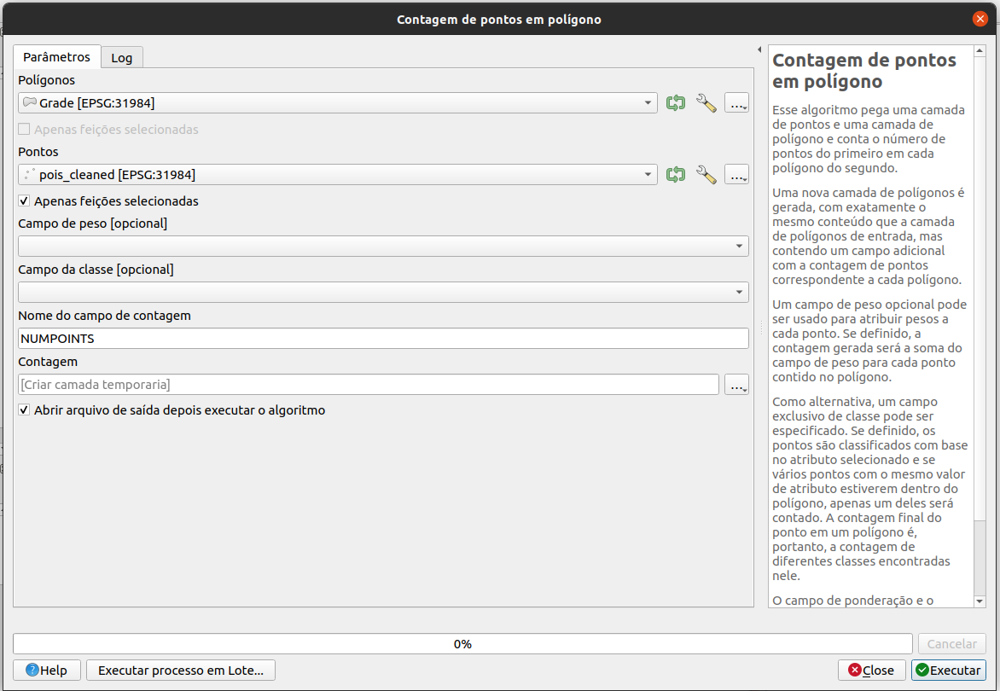

Figura 8.40c - Contagem de POIS públicos em cada grade de 2km X 2km


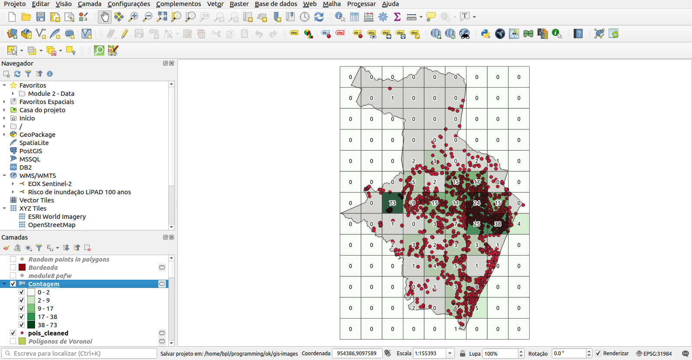


Figura 8.40d - Distribuição espacial da densidade de POIs públicos por unidade 2X2km


#### **Perguntas do teste**

P: Se eu tiver 2 camadas vetoriais - uma representa a extensão da cidade onde estou trabalhando e a segunda, as estradas construídas em todo o país - que ferramenta de processamento usaria para extrair apenas as estradas da minha cidade: buffer ou recortar (clip)?

R: Recortar.

P. A ferramenta de buffer é útil no seguinte caso: Eu tenho uma camada vetorial de polígono com monumentos históricos em minha região e quero desenhar uma área de proteção de 50m ao redor deles?

R: Sim

P: Qual das três ferramentas de geoprocessamento você usaria para mesclar duas camadas vetoriais semelhantes? Polígonos de Voronoi, dissolver, interseção?

R: Dissolver.

### Fase 3: Geoestatística. Interpolação - estimativa de dados faltantes

A última fase do módulo de dados vetoriais apresenta o conceito de estimativa de dados. Estamos acostumados a estimar quase diariamente em vários tópicos, por exemplo, quanto tempo levará para ir de casa para o trabalho em certas condições. Estamos acostumados a dar nosso melhor palpite, com base em experiências anteriores e palpites. No entanto, ao estimar dados faltantes, a estimativa é substituída por equações matemáticas muito bem definidas com limitações bem conhecidas.

O assunto requer conhecimentos significativos em estatística e os resultados devem ser sempre considerados à luz das suas limitações.

Dito isso, apresentaremos um pequeno exemplo de estimativa de dados que fará a transição para o próximo módulo - processamento de dados raster.

**Interpolação** é um processo matemático através do qual se pode estimar os valores que faltam com base em um número limitado de valores que existem. E essas situações são comuns - imagine informações meteorológicas. Os dados sobre as temperaturas da superfície e de quanta chuva caiu podem ser medidos apenas em pontos específicos em estações meteorológicas calibradas, e não em toda a superfície. No entanto, não temos "pontos cegos" de nenhuma temperatura nos mapas que vemos na seção de meteorologia dos jornais. Assim, o resto dos valores - para construir os fenômenos contínuos - são obtidos por interpolação.

A suposição na qual a interpolação se baseia é que objetos espacialmente distribuídos são espacialmente correlacionados; em outras palavras, coisas próximas tendem a ter características semelhantes.

Existem muitos métodos de interpolação implementados em pacotes de software GIS; decidir qual é o melhor em cada caso particular depende da especificidade dos dados, o que eles representam e do entendimento geoestatístico do usuário que faz a interpolação.

Para fazer uma verificação rápida sobre quais métodos de interpolação estão disponíveis no QGIS, vá para a Caixa de Ferramentas de Processamento e escreva na barra de pesquisa a palavra-chave interpolação. O resultado deve ser semelhante à figura 8.41.


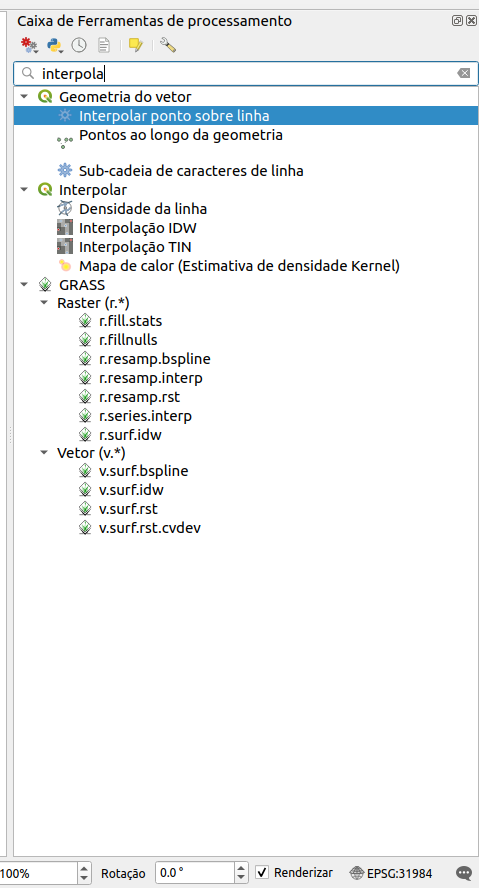

Figura 8.41 - Métodos de interpolação disponíveis no QGIS


Como pode ser observado, através do QGIS o usuário tem acesso a outros algoritmos, implementados no GRASS ou SAGA, como resultado da integração em QGIS destas (e outras) soluções de software muito poderosas.

Mergulhar na matemática por trás de cada algoritmo de interpolação está além do escopo deste módulo. No entanto, para fins de demonstração, simularemos a interpolação de dados de precipitação para obter um conjunto de dados uniforme sobre a quantidade de precipitações caídas em nossa área de interesse, a cidade do Recife.

Como o exercício é puramente para fins de demonstração, criaremos nosso próprio conjunto de dados de ponto - para representar as estações meteorológicas onde os valores de precipitação foram registrados no decorrer de uma semana.

Assim, o primeiro passo é criar uma nova camada vetorial - tipo de ponto - com pontos atribuídos aleatoriamente dentro da extensão do Recife. Existem várias maneiras de fazer isso, seja com o algoritmo de **Pontos aleatórios em polígonos ..** ou com o algoritmo **Pontos aleatórios em limites de camada ..**. Vá para **Vetor ‣ Analisar ‣ Pontos aleatórios em polígonos (Random points in polygons)…**. Você também pode pesquisar o algoritmo na caixa de ferramentas de processamento ou na barra do localizador. Escolha como parâmetros:
* 93 pontos
* mínimo 5 km.

O resultado deve ser semelhante à figura 8.42.


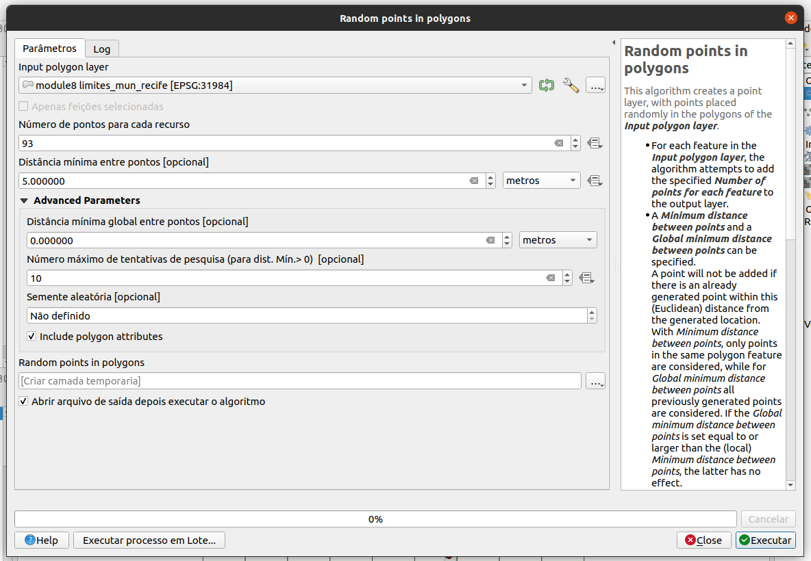

Figura 8.42 - Criação de pontos aleatórios dentro de uma camada poligonal


A camada de pontos resultante será semelhante à figura 8.43.


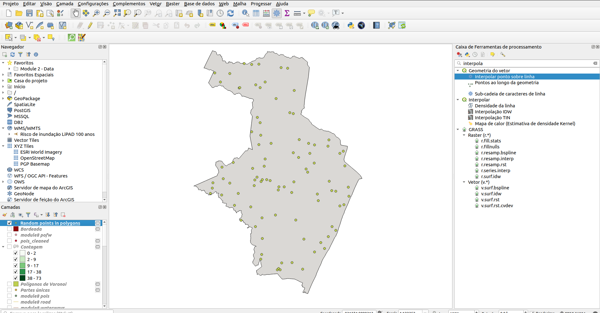

Figura 8.43 - Camada de dados de ponto - criada aleatoriamente dentro de polígonos especificados.

Agora que temos nossas estações meteorológicas imaginárias que medem as precipitações no Recife, continuaremos adicionando medições fictícias ao longo de 7 dias.

Para fazer isso, podemos usar a função aleatória fornecida pelo QGIS. Abra a tabela de atributos da camada de dados do ponto criada e abra a calculadora de campo. Em um campo recém-criado (número inteiro inteiro), insira a seguinte fórmula `rand(min, max)`, onde min e max serão substituídos pelo seguinte par de números para os 7 dias correspondentes (consulte a figura 8.44):

1. 0 - 59;
2. 2 - 35;
3. 10 - 45;
4. 0 - 21;
5. 5 - 63;
6. 0 - 10;
7. 0 - 21.


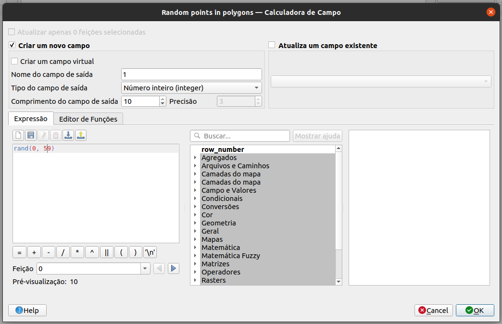

Figura 8.44 - Criação de valores aleatórios dentro dos limites especificados

Depois de adicionar todas as 7 colunas, sua tabela de atributos deve se parecer com a figura 8.45.


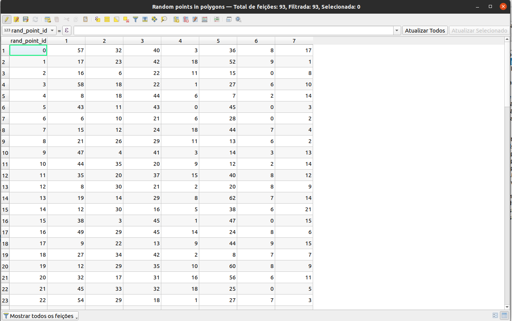

Figura 8.45 - Dados fictícios de precipitação para 93 meteorologia estações fictícias no Recife.

A seguir, iremos interpolar esses valores para cada um dos 7 dias para obter uma camada contínua que cobre todo o território da província. Visto que a operação é repetitiva, usaremos o processamento em lote. O método de interpolação selecionado - estritamente para fins de demonstração! - é IDW - ponderada pela distância inversa.

Defina os seguintes parâmetros:
* coeficiente de distância: 2
* extensão: limite_mun_recife
* tamanho do raster de saída: 50.

Seus parâmetros devem ser semelhantes à figura 8.46 a seguir.


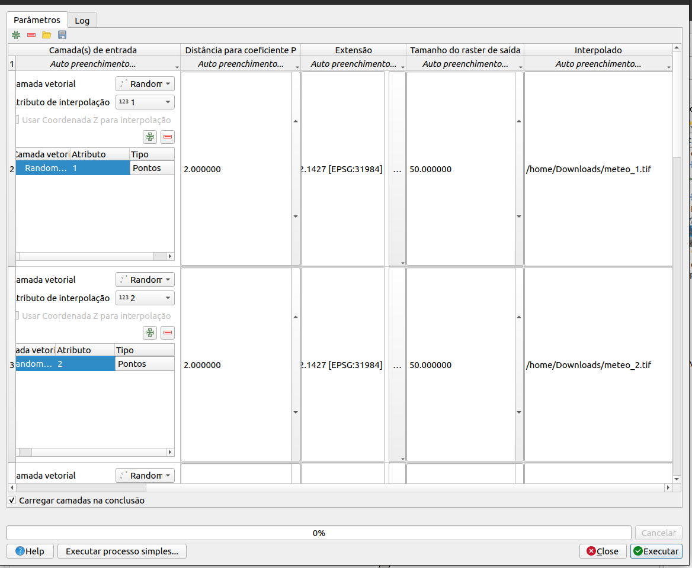

Figura 8.46 - Configurando a janela de processamento em lote para interpolar os valores de precipitação para todos os 7 dias

O resultado da interpolação será semelhante ao da figura 8.47.


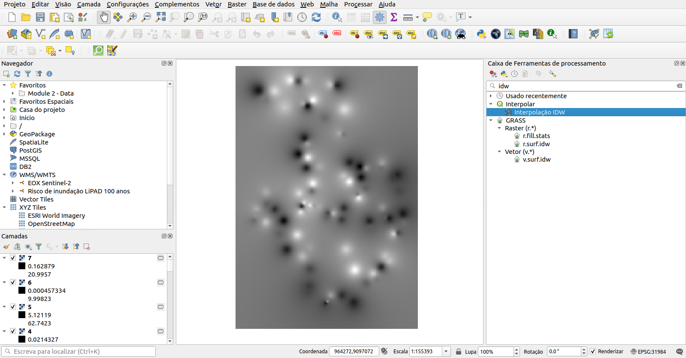

Figura 8.47 - Conjuntos de dados interpolados

As estações meteorológicas são visíveis na tela do mapa e nas camadas você pode ver todos os 7 conjuntos de dados raster recém-criados que representam os valores de precipitação para cada dia no Recife.

A seguir, vamos mudar a simbologia das 7 camadas para uma mais colorida (**Propriedades ‣ Simbologia ‣ Banda única falsa cor ‣ Magma**).

Olhando para os dados de ponto e os conjuntos de dados raster criados com base neles, podemos perceber que agora temos valores para toda a região e não apenas no local medido. Existem muitos algoritmos de processamento que podem ser aplicados a esses rasters para extrair informações, mas mais sobre isso no próximo módulo - processamento e visualização de dados raster.

No entanto, como temos valores interpolados para 7 dias, vamos preparar uma curta animação sobre como os valores de precipitação evoluíram para o Recife.

Para fazer isso, abra a caixa de diálogo **Propriedades de test_meteo_stations_1 raster ‣ clique na guia Temporal ‣ marque a opção Temporal ‣ selecione as datas de início e término**, como na figura 8.48. Faça o mesmo para todas as 7 camadas raster.


")


")


")

Figura 8.48 - Definição de informações temporais para o conjunto de dados raster (1, 2, 7).


Abra o Painel do Controlador Temporal (pode ser encontrado em ** Exibir ‣ Painéis ‣ Painel do Controlador Temporal **) e defina os parâmetros como na figura 8.49.


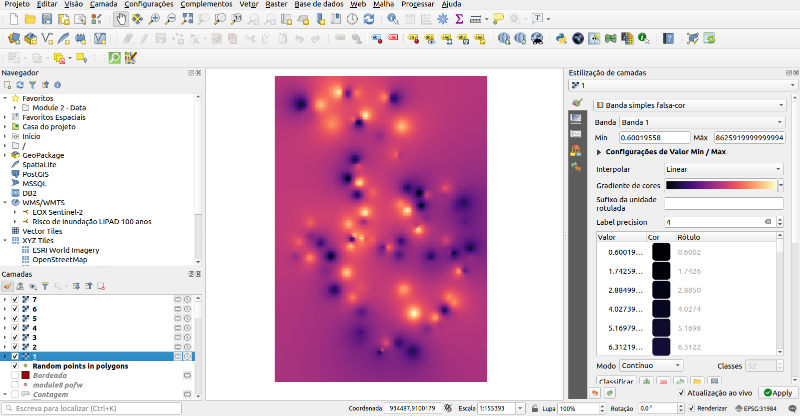

Figura 8.49 - Definir os parâmetros do painel do controlador de tempo.

Clique no botão Reproduzir e veja como os valores mudam. Você pode escolher quais outras camadas ficarão visíveis. Na figura 8.50, adicionamos a camada vetorial de edifícios.


Figura 8.50 - Selecionando outras camadas para serem visíveis na animação temporal.


Quiz questões

1. Existe um algoritmo para interpolar dados no QGIS ou mais?

*Existem mais de um algoritmos implementados.*

2. Para que serve a interpolação?

*A interpolação é útil para estimar dados com base em dados conhecidos.*
