# **Módulo 9 - Processamento e análise raster**

**Autor**: Codrina, Ben Hur

## Introdução pedagógica

Este módulo está focado em um tipo específico de modelo de dados geográficos: geodados raster.

Ao final deste módulo, os alunos terão a compreensão básica dos seguintes conceitos:

* modelo de dados raster
* ponto de grade vs célula de grade
* bandas de um conjunto de dados raster
* álgebra de mapa
* as quatro resoluções de um raster (espacial, temporal, espectral e radiométrico)
* Reamostragem
* Processamento em lote
* detecção de alteração


## Ferramentas e recursos necessários

* Este módulo foi preparado usando [QGIS versão 3.16 - Hannover](https://qgis.org/en/site/forusers/download.html)
* [module9.gpkg](data/module9.gpkg)
    * br_rj_capital
* [High Resolution Settlement Layer](data/hrsl_rj_capital_populacao.tif)
* [SRTM Digital Elevation Model](data/SRTM_DEM)
* [Global Land Cover Map 2015-2019 ](data/Global_Land_Cover_Map)
* O sistema de referência de coordenadas usado é o SIRGAS 2000 UTM 23 sul, EPSG 31983.

## Pré-requisitos:

* Conhecimento básico de como operar um computador
* Uma compreensão robusta dos módulos 0, 1, 2, 6 e 8 dos este currículo.


## Introdução temática

## Detalhamento dos conceitos

### O modelo de dados

raster Um raster é uma matriz regular de valores, como na figura 9.1.


Figura 9.1 - Uma matriz de valores

Os valores podem ser atribuídos a **pontos de grade**, principalmente aos centróides, e neste caso o raster pode ser referido como uma rede. A segunda opção é que os valores sejam atribuídos a toda a **célula da grade** - chamados pixels (ver figura 9.2). Para o primeiro caso, o raster geralmente representa um campo contínuo, como elevação, temperatura, precipitações, concentrações químicas etc. Para o segundo caso, quando os valores são atribuídos a toda a área do pixel, o raster geralmente representa uma imagem - uma imagem de satélite, um mapa digitalizado, mapas vetoriais convertidos (consulte a Fase 2). Deve-se notar que este modelo de dados não é particularmente eficiente para redes e outros tipos de dados fortemente dependentes de linhas, como limites de propriedades.


Figura 9.2 - No lado esquerdo, os valores são atribuídos aos centróides.

À direita, os valores são atribuídos à área da célula da grade - o pixel. 				


### Racional do processamento raster

Como no caso do processamento de dados vetoriais, a lógica por trás do processamento de dados raster é baseada na mesma capacidade dos sistemas de informação geográfica de armazenar, processar e representar informações dos fenômenos do mundo real; apenas isso a maneira como isso é feito difere. Em vez de ter pontos, linhas e polígonos distintos armazenados como coleções de coordenadas x e y, temos uma matriz de valores que cobre uma área específica como uma malha. Para ter uma imagem mais clara em mente, imagine os mapas de temperatura exibidos na TV. A temperatura é um campo contínuo, não há lugares na superfície da Terra sem temperatura, seja ela positiva, negativa ou 0.

Muitas operações podem ser realizadas em conjuntos de dados raster, e o conceito de geoprocessamento detalhado no módulo 8 também se aplica aqui. O termo usado para abranger as operações que podem ser realizadas em rasters é _algebra de mapa_.

**Álgebra de mapa** representa um conjunto de operações primitivas[^1] em um GIS que permite duas ou mais camadas raster de _dimensões semelhantes_ produzirem uma nova camada raster (mapa) usando várias operações, como adição, subtração, comparação etc.  

Existem quatro categorias de operações que podem ser executadas em rasters, como segue:

* Operações aritméticas: adição, subtração, multiplicação, divisão.
* Operações estatísticas: mínimo, máximo, média, mediana.
* As operações relacionais fornecem comparações entre células usando funções como maior que, menor que ou igual a.
* Operações trigonométricas: seno, cosseno, tangente, arco seno entre dois ou mais conjuntos de dados raster.
* As operações exponenciais e logarítmicas usam funções expoentes e logarítmicas.

Para cada uma dessas operações, existem algoritmos implementados na maioria dos ambientes GIS que permitem ao usuário aplicá-los em seus dados. A seguir, também implementaremos algumas das operações mais comuns para ter uma noção de como trabalhar e o que se deve esperar desse tipo de processamento de dados.

O conceito de _dimensões semelhantes_ refere-se às características dos conjuntos de dados raster. Ou seja, as operações detalhadas acima não podem ser realizadas com resultados significativos em 2 conjuntos de dados raster com diferentes resoluções espaciais, temporais ou espectrais. A seguir, apresentaremos em breve todas as quatro resoluções que são relevantes para imagens raster.

Lembrando quais são os 4 tipos de resolução de uma imagem de satélite (raster com valores atribuídos à área da célula - pixels):

1. **Resolução espacial** corresponde ao tamanho elementar da superfície do solo medida, é expressa em unidades de comprimento e representa o comprimento de um lado do pixel (consulte a figura 9.3). Por exemplo, como você viu no módulo 3, o High Resolution Settlement Layer Data tem uma resolução espacial de 30 metros, ou seja, cada pixel do conjunto de dados estima o número de pessoas que vivem em um raio de 30 metros.

2. **Resolução temporal** está associada a imagens aéreas (imagens adquiridas por satélites, aviões, helicópteros, drones) e corresponde ao período entre 2 imagens consecutivas do mesmo ponto na Terra, tiradas nas mesmas condições (como tanto quanto possível), como a mesma aeronave, mesma altitude etc. Por exemplo, Landsat 8 tem uma resolução temporal de 16 dias, ou seja, cada ponto na Terra é revisitado pelo satélite Landsat 8 a cada 16 dias[^2].

3. **Resolução espectral** - os sensores a bordo de satélites ou aviões capturam a radiação eletromagnética proveniente de todos os objetos na Terra - água, assentamentos, florestas, estradas, edifícios, terra nua etc. - e os sensores são especificamente construídos para capturá-la em uma determinada banda espectral conhecida (ou comprimento de onda). O olho humano pode ver uma parte muito pequena do espectro eletromagnético - a luz visível (vermelha, verde e azul), mas os sensores podem 'ver' muito mais! (ver figura 9.4)


)](media/fig94.png "Espectro eletromagnético (crédito da foto [NASA Science](https://science.nasa.gov/ems/01_intro)) ")

Figura 9.4 - Espectro eletromagnético (crédito da foto NASA Science - [https://science.nasa.gov/ems/01_intro](https://science.nasa.gov/ems/01_intro))

4. **A resolução radiométrica** é determinada pelo número de bits em que a radiação registrada é dividida. Em dados de 8 bits, os números digitais (DN) podem variar de 0 a 255 para cada pixel (28 ¼ 256 números totais possíveis). Claramente, mais bits significa que o sensor pode detectar mudanças mais sutis na energia que captura, o que leva a uma imagem 'mais clara', uma maior precisão radiométrica do sensor, mas também requer mais espaço para armazenar os dados.

**Bandas espectrais**

Um conjunto de dados raster contém uma ou mais camadas chamadas bandas. Cada banda armazena outro conjunto de informações sobre a área que o raster cobre. Cada banda tem exatamente a mesma extensão e coordenadas, mas não necessariamente a mesma resolução espacial. Além dos valores armazenados, existem outras propriedades-chave contidas, como: valores máximos, mínimos e médios das células e _histograma_ dos valores das células.

Um **histograma** é uma representação aproximada da distribuição de dados numéricos (veja a figura 9.5); em outras formas, é uma maneira pela qual se pode ter uma noção melhor dos dados em mãos.


Figura 9.5 - Exemplo de um histograma, onde x é uma camada raster

Por que é isso é importante em nosso contexto? Porque, como mencionado no início, um raster é uma matriz de valores numéricos contínuos (lembre-se do exemplo da temperatura) e um histograma ajuda o usuário a entender como os valores de seus rasters são distribuídos. Cada barra agrupa os valores das células que caem em um intervalo específico, quanto maior a barra, mais células têm valores nesse intervalo específico. Caso o raster tenha mais de uma banda, então o histograma será computado para cada uma. Não há lacunas entre os intervalos representados em um histograma, o histograma é usado apenas para dados contínuos.  


## Conteúdo principal

### Fase 1: Entendendo seus dados raster.

Nas últimas duas décadas, o número de satélites capturando dados da Terra cresceu exponencialmente. Além disso, uma política de acesso a dados abertos que foi adotada por diferentes agências espaciais, como a NASA para o [programa Landsat](https://www.usgs.gov/core-science-systems/nli/landsat/landsat-data-access?qt-science_support_page_related_con=0#qt-science_support_page_related_con) ou a Agência Espacial Europeia para o [programa Copernicus](https://www.copernicus.eu/en/access-data), abriu a porta para um fluxo avassalador de Dados de observação da Terra. Como consequência natural, o progresso científico de algoritmos, metodologias e o desenvolvimento de ferramentas mais poderosas para processar dados raster - especialmente imagens de satélite - tem sido impressionante e extenso em campos como agricultura, silvicultura, desenvolvimento urbano, atividades humanitárias, oceano e mar monitoramento de água, segurança e muito mais. Nas três fases a seguir, apresentaremos algumas das técnicas de processamento mais comuns e quais resultados esperar delas.


#### **Etapa 1. Prepare seu ambiente de trabalho.**

Vamos começar adicionando ao seu projeto QGIS todos os conjuntos de dados raster com os quais estaremos trabalhando, como segue:

* Dados de camada de assentamento de alta resolução (HRSL)
* Missão Topografia de radar de transporte (SRTM) Modelo de elevação digital (DEM)
* Cobertura do solo dinâmica moderada: as 5 épocas disponíveis 2015, 2016, 2017, 2018 e 2019.

Como os dados da camada de assentamento de alta resolução foram apresentados em um módulo anterior, também detalharemos informações sobre os outros 2 conjuntos de dados que usaremos neste módulo.

1. Modelo de elevação digital Shuttle Radar Topography Mission (SRTM-DEM) é um conjunto de dados de modelo digital de superfície global com uma resolução horizontal de aproximadamente 30 metros (grade de 1 arcsec). Um DSM inclui a superfície do solo, vegetação e objetos feitos pelo homem, como edifícios, pontes, etc., em oposição ao modelo digital de terreno (DTM) que considera estritamente o terreno.

2. O Mapa Dinâmico de Cobertura do Solo é um produto do Copernicus Global Land Service (CGLS) derivado da série temporal PROBA-V 100 m e vários outros conjuntos de dados de cobertura do solo. O produto fornece classes discretas de cobertura do solo primárias, bem como camadas de campo contínuas para todas as classes de cobertura do solo básicas que fornecem estimativas proporcionais para cobertura vegetal/solo para os tipos de cobertura do solo. O produto possui 3 bandas: discrete_classification, forest_type e urban_coverfraction. As 2 tabelas a seguir apresentam os valores para cada classe discreta:

Tabela 1 Tabela de valores da banda Discrete_classification

<table>
  <tr>
   <td> <strong> Valor </strong>
   </td>
   <td> <strong> Cor </strong>
   </td>
   <td> <strong> Descrição </strong>
   </td>
  </tr>
  <tr>
   <td> 0
   </td>
   <td> 282828
   </td>
   <td> Desconhecido. Não há ou não há dados de satélite suficientes disponíveis.
   </td>
  </tr>
  <tr>
   <td> 20
   </td>
   <td> FFBB22
   </td>
   <td> Arbustos. Plantas lenhosas perenes com caules persistentes e lenhosos e sem caule principal definido com menos de 5 m de altura. A folhagem do arbusto pode ser perene ou caducifólia.
   </td>
  </tr>
  <tr>
   <td> 30
   </td>
   <td> FFFF4C
   </td>
   <td> Vegetação herbácea. Plantas sem caule persistente ou brotos acima do solo e sem estrutura firme definida. A cobertura de árvores e arbustos é inferior a 10%.
   </td>
  </tr>
  <tr>
   <td> 40
   </td>
   <td> F096FF
   </td>
   <td> Vegetação/agricultura cultivada e manejada. Terras cobertas com culturas temporárias seguidas de colheita e um período de solo nu (por exemplo, sistemas de cultivo único e múltiplo). Observe que as culturas lenhosas perenes serão classificadas como o tipo apropriado de cobertura de terra de floresta ou arbusto.
   </td>
  </tr>
  <tr>
   <td> 50
   </td>
   <td> FA0000
   </td>
   <td> Urbano/edificado. Terreno coberto por edifícios e outras estruturas feitas pelo homem.
   </td>
  </tr>
  <tr>
   <td> 60
   </td>
   <td> B4B4B4
   </td>
   <td> Vegetação nua/esparsa. Terras com solo, areia ou rochas expostas e nunca apresentam mais de 10% de cobertura vegetal em qualquer época do ano.
   </td>
  </tr>
  <tr>
   <td> 70
   </td>
   <td> F0F0F0
   </td>
   <td> Neve e gelo. Terras cobertas de neve ou gelo ao longo do ano.
   </td>
  </tr>
  <tr>
   <td> 80
   </td>
   <td> 0032C8
   </td>
   <td> Corpos d'água permanentes. Lagos, reservatórios e rios. Podem ser corpos de água doce ou salgada.
   </td>
  </tr>
  <tr>
   <td> 90
   </td>
   <td> 0096A0Pantanal
   </td>
   <td>herbáceo. Terras com mistura permanente de água e vegetação herbácea ou lenhosa. A vegetação pode estar presente em água salgada, salobra ou doce.
   </td>
  </tr>
  <tr>
   <td> 100
   </td>
   <td> FAE6A0
   </td>
   <td> Musgo e líquen.
   </td>
  </tr>
  <tr>
   <td> 111
   </td>
   <td> 58481F
   </td>
   <td> Floresta fechada, folha de agulha perene. Copa das árvores> 70%, quase todas as árvores de folhas agulhas permanecem verdes o ano todo. O dossel nunca está sem folhagem verde.
   </td>
  </tr>
  <tr>
   <td> 112
   </td>
   <td> 9900
   </td>
   <td> Floresta fechada, folha larga perene. Copa das árvores> 70%, quase todas as árvores de folha larga permanecem verdes durante todo o ano. O dossel nunca está sem folhagem verde.
   </td>
  </tr>
  <tr>
   <td> 113
   </td>
   <td> 70663E
   </td>
   <td> Floresta fechada, folha de agulha decídua. O dossel das árvores> 70% consiste em comunidades sazonais de árvores de folhas agulhas com um ciclo anual de períodos de folhagem e folhagem.
   </td>
  </tr>
  <tr>
   <td> 114
   </td>
   <td> 00CC00
   </td>
   <td> Floresta fechada, folha larga decídua. O dossel das árvores> 70% consiste em comunidades sazonais de folhas largas com um ciclo anual de períodos de folhagem e folhagem.
   </td>
  </tr>
  <tr>
   <td> 115
   </td>
   <td> 4E751F
   </td>
   <td> Floresta fechada, mista.
   </td>
  </tr>
  <tr>
   <td> 116
   </td>
   <td> 7800
   </td>
   <td> Floresta fechada, não correspondendo a nenhuma das outras definições.
   </td>
  </tr>
  <tr>
   <td> 121
   </td>
   <td> 666000
   </td>
   <td> Floresta aberta, folha de agulha perene. Camada superior - árvores 15-70% e segunda camada - mistura de arbustos e pastagens, quase todas as árvores de folhas agulhas permanecem verdes durante todo o ano. O dossel nunca está sem folhagem verde.
   </td>
  </tr>
  <tr>
   <td> 122
   </td>
   <td> 8DB400
   </td>
   <td> Floresta aberta, folha larga perene. Camada superior - árvores 15-70% e segunda camada - mistura de arbustos e pastagens, quase todas as árvores de folha larga permanecem verdes durante todo o ano. O dossel nunca está sem folhagem verde.
   </td>
  </tr>
  <tr>
   <td> 123
   </td>
   <td> 8D7400
   </td>
   <td> Floresta aberta, folha de agulha decídua. Camada superior - árvores 15-70% e segunda camada - mistura de arbustos e pastagens, consiste em comunidades sazonais de árvores de folhas agulhas com um ciclo anual de períodos de folhagem e folhagem.
   </td>
  </tr>
  <tr>
   <td> 124
   </td>
   <td> A0DC00
   </td>
   <td> Floresta aberta, folha larga decídua. Camada superior - árvores 15-70% e segunda camada - mistura de arbustos e pastagens, consiste em comunidades de árvores de folha larga sazonais com um ciclo anual de períodos de folhagem e folhagem.
   </td>
  </tr>
  <tr>
   <td> 125
   </td>
   <td> 929900
   </td>
   <td> Floresta aberta, mista.
   </td>
  </tr>
  <tr>
   <td> 126
   </td>
   <td> 648C00
   </td>
   <td> Floresta aberta, não correspondendo a nenhuma das outras definições.
   </td>
  </tr>
  <tr>
   <td> 200
   </td>
   <td> 80
   </td>
   <td> Oceanos, mares. Podem ser corpos de água doce ou salgada.
   </td>
  </tr>
</table>


Tabela 2 valor da banda forest_type

<table>
  <tr>
   <td> Valor
   </td>
   <td> Cor
   </td>
   <td> Descrição
   </td>
  </ tr>
  <tr>
   <td> 0
   </td>
   <td> 282828
   </td>
   <td> Desconhecido
   </td>
  </tr>
  <tr>
   <td> 1
   </td>
   <td> 666000
   </ td>
   <td> Folha de agulha perene
   </td>
  </tr>
  <tr>
   <td> 2
   </td>
   <td> 9900
   </td>
   <td> Folha larga perene
   </td>
  </tr>
  <tr>
   <td> 3
   </td>
   <td> 70663E
   </td>
   <td> Folha decídua de agulha
   </td>
  </tr>
  <tr>
   <td> 4
   </td>
   <td> A0DC00
   </ td >
   <td> Folha larga decídua
   </td>
  </tr>
  <tr>
   <td> 5
   </td>
   <td> 929900
   </td>
   <td> Mistura de tipos de floresta
   </td>
  </tr>
</table>


Para organizar melhor suas camadas, agrupe-as por categoria, da seguinte maneira: para as 5 camadas raster de cobertura de terra, crie um grupo denominado Cobertura de Terra (Land Cover) (no Painel de Camadas, clique no botão Adicionar Grupo). Para o modelo de superfície digital, crie um grupo denominado SRTM DEM.

Não se esqueça de adicionar também o limite da área de trabalho, cidade do Rio de Janeiro, que é um conjunto de dados vetoriais.

A janela do seu mapa QGIS deve ser semelhante à figura 9.6, talvez em cores ligeiramente diferentes.


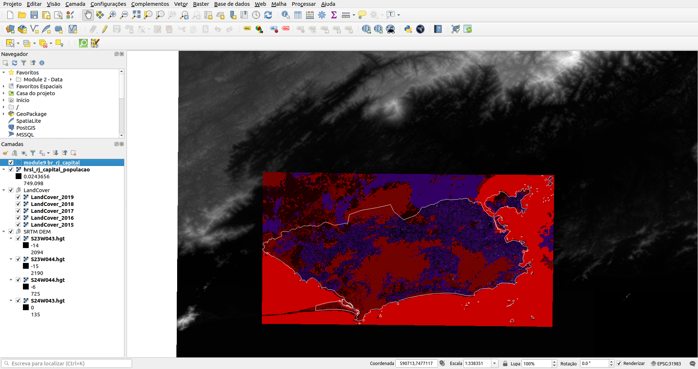

Figura 9.6 - Conjuntos de dados raster carregados


#### **Etapa 2. Entenda o que você está olhando.**

A seguir, usaremos uma série de ferramentas que nos permitirão ter uma noção melhor dos dados com os quais estamos trabalhando.

Depois de carregar todos os conjuntos de dados, vamos verificar o sistema de referência de coordenadas no qual todos os nossos conjuntos de dados estão. Como sabemos dos módulos anteriores, QGIS oferece a possibilidade de reprojetar todos os conjuntos de dados carregados no projeto em tempo real, no entanto, isso pode levar ao geoprocessamento questões ao longo do caminho. Assim, mesmo que todas as camadas estejam sobrepostas corretamente, como se pode dizer pela inspeção visual, procederemos à reprojeção de todas no sistema de coordenadas mais adequado para nossa região de interesse, a cidade do Rio de Janeiro - EPSG: 31983.

Existem várias formas de obter informações nas camadas carregadas no QGIS, algumas fornecendo ao usuário mais detalhes do que outras. Para obter uma visão geral rápida dos metadados de um conjunto de dados, **clique duas vezes na camada e abra Propriedades ‣ Informações**.

Para a camada hrsl_rj_capital_populacao, a janela de informações seria semelhante à Figura 9.7.


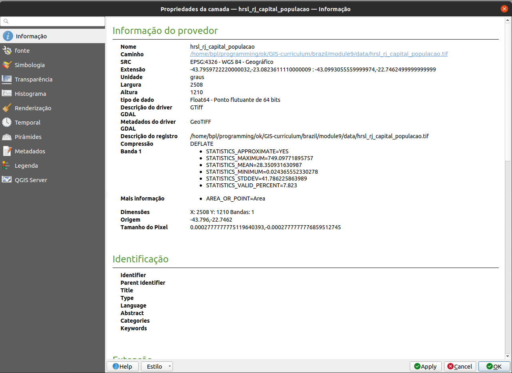

Figura 9.7 - Extraindo metadados básicos de uma camada raster

Com relação à nossa primeira pergunta sobre o que CRS está sendo usado para o conjuntos de dados que carregamos, podemos observar que mesmo que o HRSL seja sobreposto corretamente, a projeção do conjunto de dados nativo é EPSG 4326 - WGS 84, com unidades medidas em graus. Também identificamos que esta camada raster específica possui apenas uma banda, porém o tamanho do pixel é difícil de ler, pois a medição é em graus e não em metros, o que tornaria mais fácil de entender.

Assim, a primeira coisa a fazer é reprojetar todos os conjuntos de dados com os quais trabalharemos no mesmo sistema de coordenadas - EPSG 31983.

Começando com os conjuntos de dados HRSL, vamos para **Raster ‣ Projeções ‣ Reprojetar coordenadas** (ver figura 9.8)


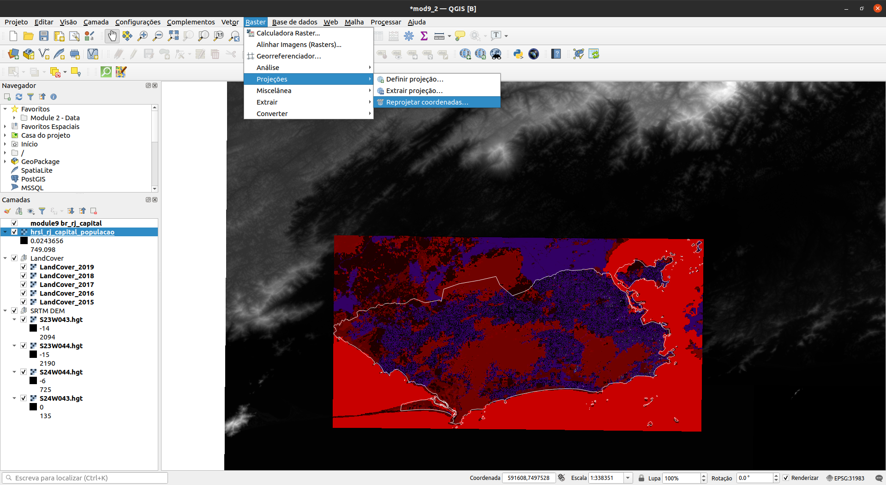

Figura 9.8 - Reprojetar funcionalidade no QGIS

Após selecionar a funcionalidade Warp, uma nova janela aparecerá permitindo ao usuário definir os parâmetros corretos (consulte a figura 9.9 uma).


 QGIS")

Figura 9.9a - Janela Warp (reprojetar) QGIS

Se você selecionou a saída como **[Salvar em arquivo temporário]** então haverá uma camada raster chamada `Reprojetado(a)` no painel de camadas. Esta é uma camada de memória e você pode renomear esta camada para Reprojected_hrsl_rj_capital_populacao e salvá-la para torná-la persistente.


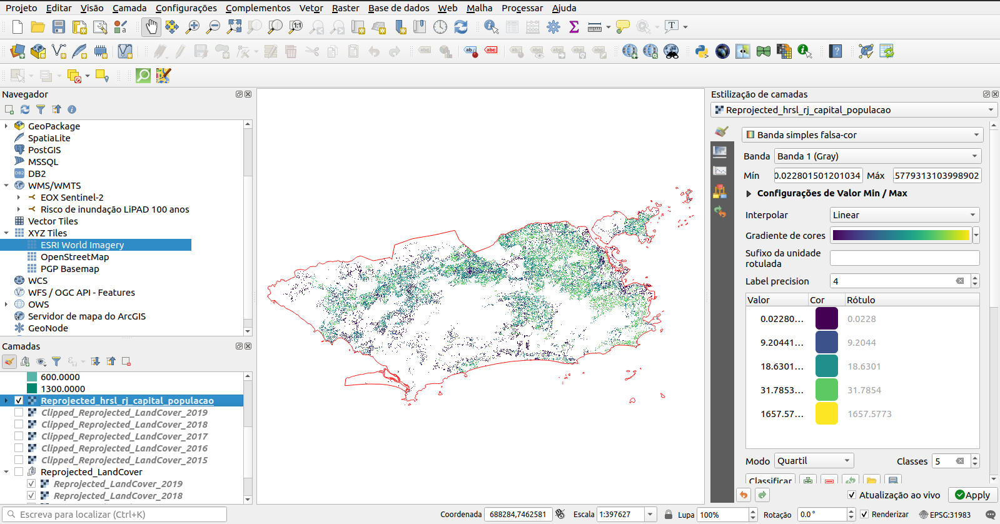

Figura 9.9b - HRSL reprojetado

Você notará que, ao contrário de quando você reprojetou conjuntos de dados vetoriais, há um novo parâmetro que pode ser definido como “Método de reamostragem a ser usado”.

**Reamostragem** representa a interpolação dos valores da célula para que ela transforme o raster conforme indicado pelo usuário. Existem vários métodos de reamostragem disponíveis na funcionalidade de reprojetar, cada um com seu próprio suporte matemático. No entanto, explicações detalhadas sobre cada um não é o escopo deste exercício. Leituras adicionais estão disponíveis em referências.

Neste caso particular, queremos reprojetar os dados da população - valores numéricos e com base no método de reamostragem selecionado (vizinho mais próximo), a coordenada de cada pixel de saída será usada para calcular um novo valor a partir dos valores de pixel próximos na camada de entrada (veja a figura 9.10).


Figura 9.10 - Método de reamostragem - vizinho mais próximo (crédito da foto: documentação ILWIS - [(http://spatial-analyst.net/ILWIS/htm/ilwisapp/resample_functionality.htm](http://spatial-analyst.net/ILWIS/htm/ilwisapp/resample_functionality.htm))

Os pixels de entrada são representados por linhas pretas tracejadas, coordenadas de pixels de entrada por pontos pretos; pixels de saída são representados por linhas sólidas vermelhas, coordenadas de pixels de saída por sinais de adição vermelhos. As setas cinza indicam como os valores de saída são determinados. Pode ser visto na figura 9.10 que alguns valores do mapa de entrada podem ser usados ​​duas vezes no mapa de saída, enquanto outros valores de entrada podem não ser usados. É por isso que, embora seja um dos métodos mais rápidos para reamostrar, não é apropriado em nosso caso, já que estamos trabalhando com dados numéricos - dados populacionais. Este método de reamostragem é adequado para dados categóricos - tais como valores de cobertura do solo.

Para reprojetar nosso conjunto de dados raster de população, usaremos o método de interpolação bilinear para reamostrar os valores dos pixels (veja a figura 9.11).


Figura 9.11 - Método de reamostragem - bilinear (crédito da foto: documentação ILWIS - [(http://spatial-analyst.net/ILWIS/htm/ ilwisapp/resample_functionality.htm](http://spatial-analyst.net/ILWIS/htm/ilwisapp/resample_functionality.htm))

O método bilinear determina o novo valor de uma célula com base em uma distância média ponderada das quatro células de entrada mais próximas centros. É útil para dados contínuos e causará alguma suavização dos dados.

Continuamos a verificar o CRS dos 5 conjuntos de dados de cobertura do solo (Land Cover) que carregamos em nosso projeto QGIS. Acessando **Propriedades da camada ‣ informações**, podemos veja que todas as 5 camadas de cobertura do solo são projetadas em EPSG: 3857 - WGS 84/Pseudo-Mercator. Uma solução seria usar a ferramenta Reproject e configurar para cada camada individualmente. No entanto, uma maneira mais rápida é usar a funcionalidade de reprojeto rodando como um **processo em lote**.

**Processamento em lote** é a capacidade de executar processos repetitivos sses de dados, com interação mínima do usuário. A maioria das funcionalidades do QGIS tem esta opção disponível e pode ser ativada na janela de processo clicando no botão **Executar processo em lote**  e alternando para a guia Executar processo em lote (consulte a figura 9.12).


Figura 9.12 - Guia de processamento em lote em uma janela de funcionalidade QGIS


Para as 5 camadas raster de cobertura terrestre, usaremos o processamento em lote e como método de reamostragem o vizinho mais próximo. Para adicionar uma nova camada, clique no pictograma +. Para preencher automaticamente os parâmetros do CRS e do método de reamostragem, clique no botão autopreencher na parte superior das colunas correspondentes e selecione `Preencher`. Renomeie os rasters reprojetados adicionando o código EPSG ao final do nome, por exemplo LandCover2015, que se tornará landCover2015_31983. Defina seus parâmetros como na figura 9.13: CRS de origem: EPSG: 3857, CRS de destino EPSG 31983, método de reamostragem a ser usado: vizinho mais próximo (explicamos no parágrafo acima o porquê), valor "Não definido" para bandas de saída: 255 (da janela de informações, vemos o tipo de dados - yte - inteiro sem sinal de 8 bits - o que significa que o valor máximo pode ser 255), resolução de saída: 100 m (como os rasters de cobertura do solo eram originalmente). Depois de definir todos os parâmetros, marque a caixa no canto esquerdo da janela - **Carregar camadas ao concluir** e clique em **Executar**.


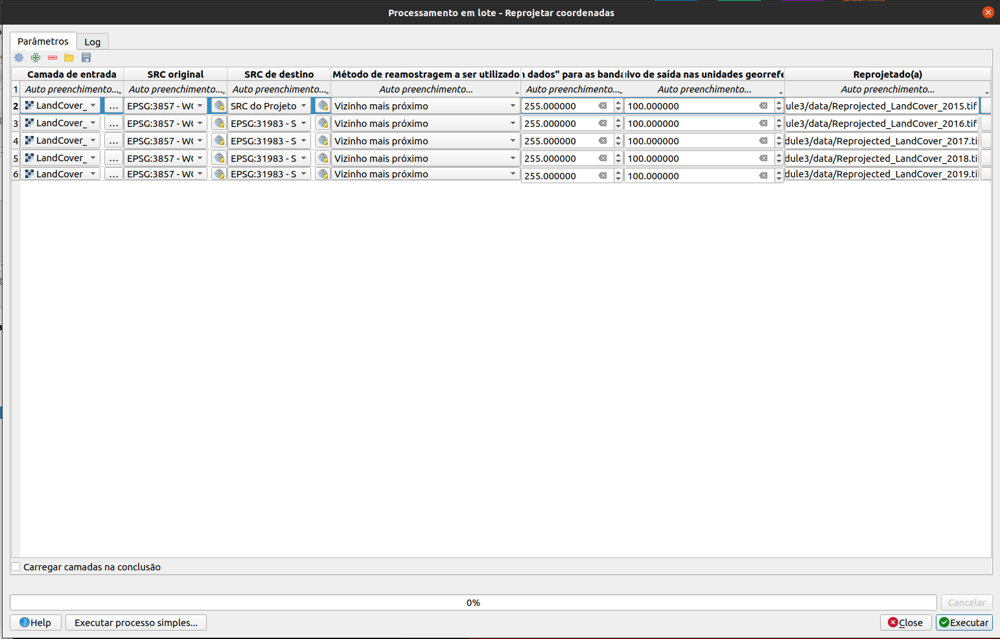

Figura 9.13a - Processamento em lote para reprojetar os rasters de cobertura do solo


Figura 9.13b - Nomes de saída de preenchimento automático


Figura 9.13c - Rasters de cobertura de terra reprojetada

Em seguida, vêm os rasters de modelo de superfície digital . Como se pode observar, para cobrir nossa região de interesse, precisávamos de vários _raster tiles_. Quando os arquivos raster se tornam muito grandes - imagine um único arquivo DSM a 30 m para a Europa, que tem mais de 10 milhões de quilômetros quadrados - eles são divididos em **tiles, ou blocos** porque, em áreas menores, são mais facilmente gerenciáveis.

Embora pudéssemos usar a ferramenta reprojetar em lote para reprojetar todos os arquivos raster DSM, em uma inspeção visual, também se pode notar que as delimitações entre cada tile são bastante visíveis, tornando-o, pelo menos, visualmente pouco atraente. O que seria útil é ter uma visão completa do terreno, como um fenômeno contínuo - como é, de fato - sem rupturas artificiais. Para isso, usaremos a ferramenta de mesclagem GDAL, disponível na barra de ferramentas de processamento, para mesclar todos os rasters DSM. Para abri-lo, vá para **Processar ‣ Caixa de ferramentas ** e na barra de pesquisa escreva **Mesclar (ou Merge)** (veja a figura 9.14). Como alternativa, você pode pesquisar por Mesclar na barra do localizador.


Figura 9.14 - Localizando a ferramenta de mesclagem GDAL na Caixa de Ferramentas de Processamento

Na janela de mesclagem que é aberta, selecione os arquivos raster DSM que queremos mosaico e clique em executar. O resultado deve ser semelhante à figura 9.15c.


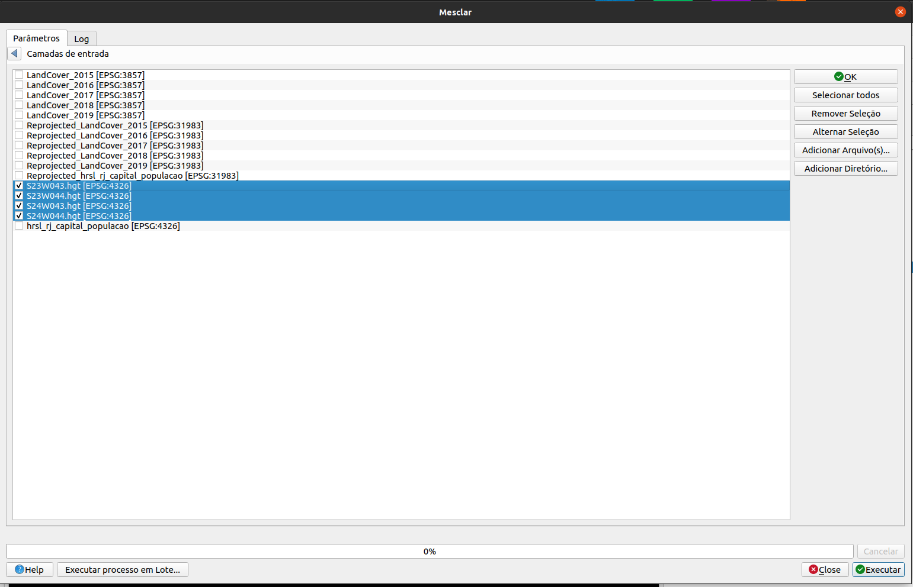

Figura 9.15a - Selecionando as camadas SRTM para mesclar


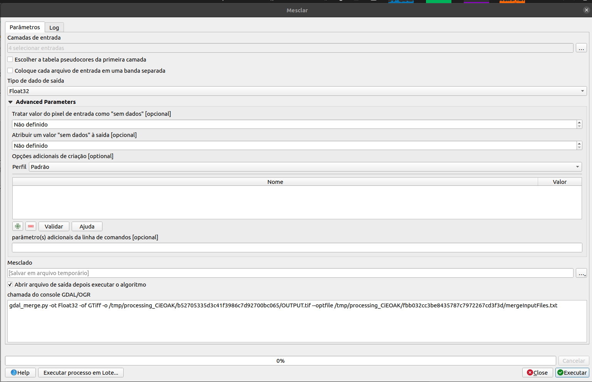

Figura 9.15b - Parâmetros do algoritmo de processamento de mesclagem


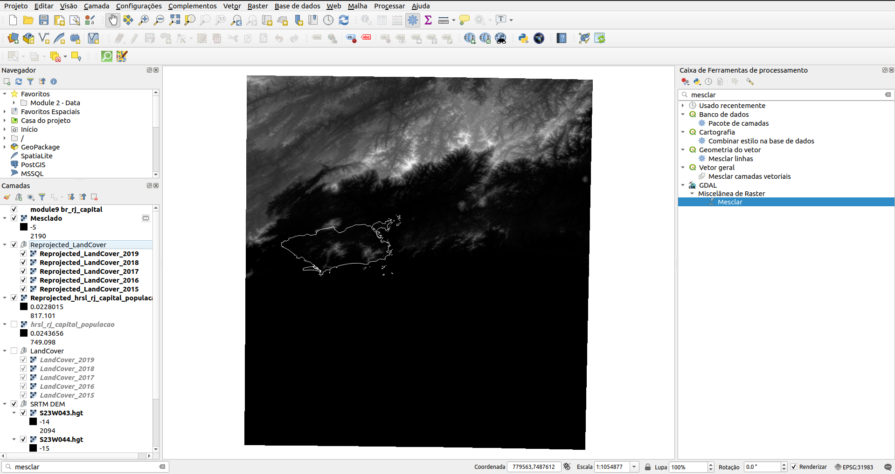

Figura 9.15c - Mosaico de todos os arquivos DSM correspondentes à nossa região de trabalho


Agora, podemos proceder à reprojeção do mosaico - um arquivo, em vez de 6 arquivos. Vá para **Raster ‣ Projeção ‣ Reprojetar cordenadas** e defina os parâmetros conhecidos:

   * SRC original: EPSG 4326
   * SRC de destino: EPSG: 31983
   * Método de reamostragem: Vizinho mais próximo
   * Resolução do arquivo de saída - 30 m.

Neste ponto, devemos ter todas as camadas no mesmo CRS - EPSG 31983.


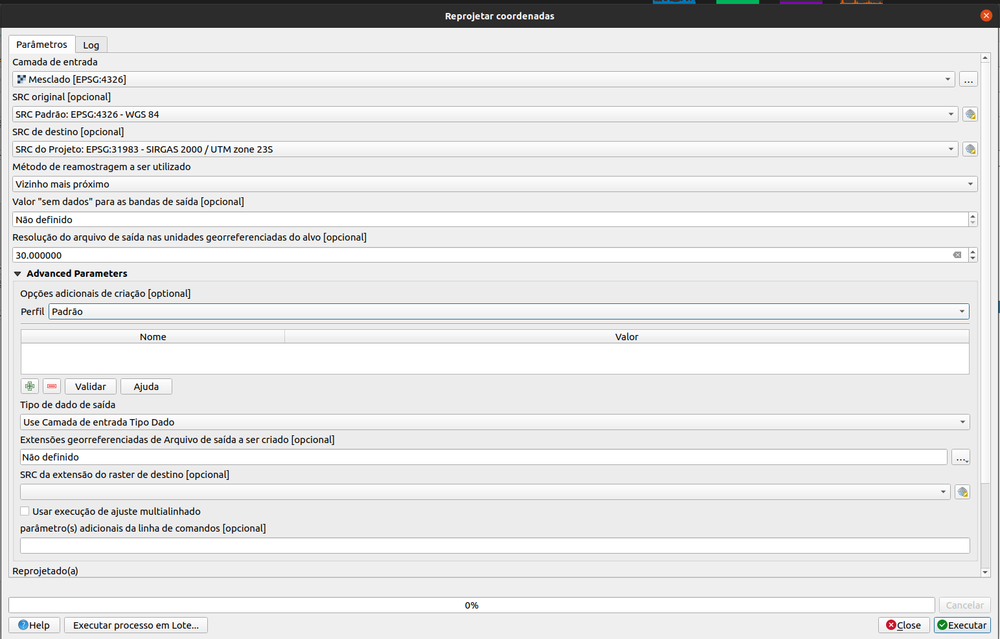

Figura 9.15d - Reprojetar raster mesclado


Podemos fazer outra verificação para ter certeza que todos os rasters com os quais estamos trabalhando são projetados, bem como obter qualquer informação adicional sobre os dados, executando um processo em lote de informações raster sobre todos. Para abrir a janela de funcionalidade, vá para **Raster ‣ Miscelânea ‣ Informações Raster**. Sua janela de informações raster de processamento em lote deve ser semelhante à figura 9.16.


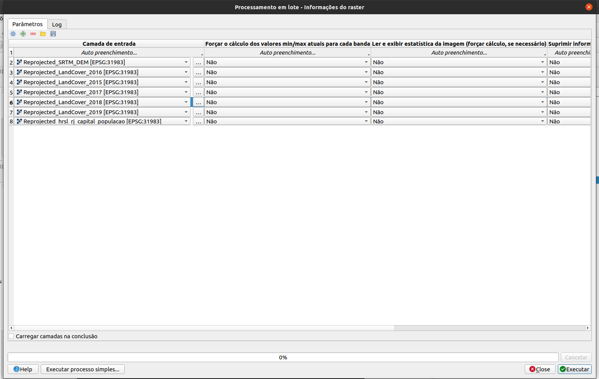

Figura 9.16 - Processo em lote para extrair informações em um arquivo HTML separado para várias camadas raster

Um arquivo HTML de informações raster deve ser gerado como abaixo. Um arquivo HTML pode ser aberto com qualquer editor de texto ou navegador de sua escolha.


```
    Coordinate System is:
    PROJCRS["SIRGAS 2000 / UTM zone 23S",
    BASEGEOGCRS["SIRGAS 2000",
    DATUM["Sistema de Referencia Geocentrico para las AmericaS 2000",
        ELLIPSOID["GRS 1980",6378137,298.257222101,
            LENGTHUNIT["metre",1]]],
    PRIMEM["Greenwich",0,
        ANGLEUNIT["degree",0.0174532925199433]],
    ID["EPSG",4674]],
    CONVERSION["UTM zone 23S",
    METHOD["Transverse Mercator",
        ID["EPSG",9807]],
    PARAMETER["Latitude of natural origin",0,
        ANGLEUNIT["degree",0.0174532925199433],
        ID["EPSG",8801]],
    PARAMETER["Longitude of natural origin",-45,
        ANGLEUNIT["degree",0.0174532925199433],
        ID["EPSG",8802]],
    PARAMETER["Scale factor at natural origin",0.9996,
        SCALEUNIT["unity",1],
        ID["EPSG",8805]],
    PARAMETER["False easting",500000,
        LENGTHUNIT["metre",1],
        ID["EPSG",8806]],
    PARAMETER["False northing",10000000,
        LENGTHUNIT["metre",1],
        ID["EPSG",8807]]],
    CS[Cartesian,2],
    AXIS["(E)",east,
        ORDER[1],
        LENGTHUNIT["metre",1]],
    AXIS["(N)",north,
        ORDER[2],
        LENGTHUNIT["metre",1]],
    USAGE[
    SCOPE["unknown"],
    AREA["Brazil - 48°W to 42°W"],
    BBOX[-33.5,-48,5.13,-42]],
    ID["EPSG",31983]]
    Data axis to CRS axis mapping: 1,2
    Origin = (623321.945999999996275,7484067.546099999919534)
    Pixel Size = (28.935326500201374,-28.935326524390469)
    Metadata:
    AREA_OR_POINT=Area
    Image Structure Metadata:
    INTERLEAVE=BAND
    Corner Coordinates:
    Upper Left  (  623321.946, 7484067.546) ( 43d47'56.18"W, 22d44'46.58"S)
    Lower Left  (  623321.946, 7446104.398) ( 43d47'45.28"W, 23d 5'20.90"S)
    Upper Right (  695168.362, 7484067.546) ( 43d 5'58.02"W, 22d44'22.13"S)
    Lower Right (  695168.362, 7446104.398) ( 43d 5'40.79"W, 23d 4'56.04"S)
    Center      (  659245.154, 7465085.972) ( 43d26'49.98"W, 22d54'52.81"S)
    Band 1 Block=2483x1 Type=Float64, ColorInterp=Gray
    NoData Value=nan
```


Depois de preparar as miras por reprojetar-los nos CRS somos trabalhando e lendo seus metadados para entender melhor os arquivos, é hora de mergulhar nos dados reais. Para isso, calcularemos e interpretaremos os histogramas (consulte a seção Divisão de conceitos para obter detalhes) de nossos rasters.

Para calcular um histograma, selecione a camada raster que você está interessado, abra clicando duas vezes na janela de diálogo `Propriedades` e vá para` Histograma` (veja a figura 9.17).


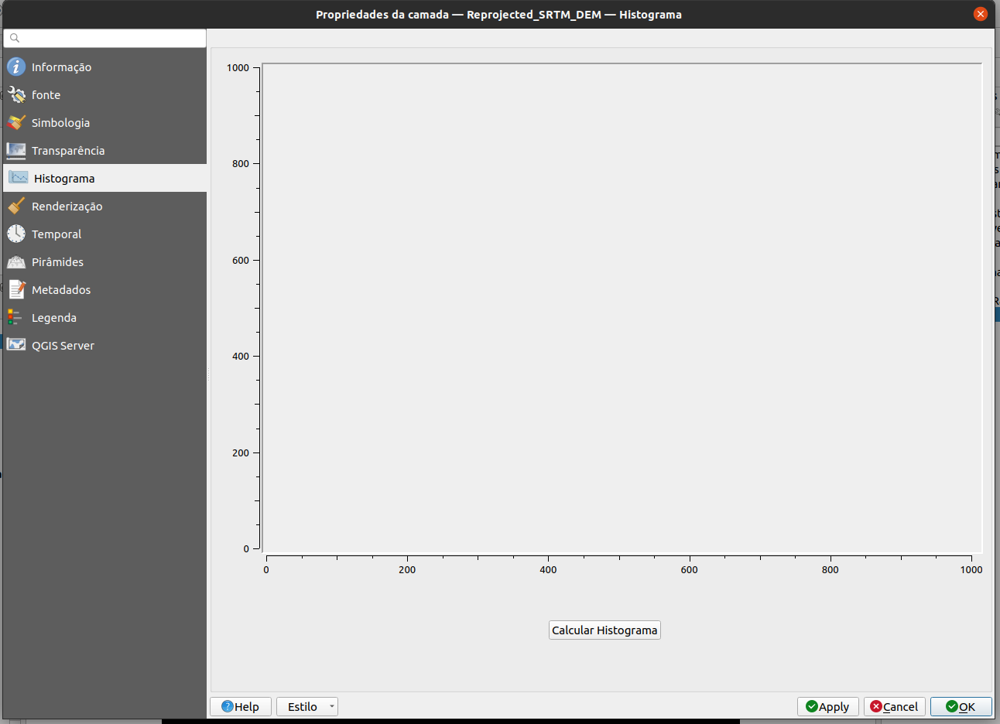

Figura 9.17 - Janela de histograma

Pressione o botão `Calcular histograma` e a pena QIS o computará automaticamente.

Depois de calcular o histograma, podemos ver que o mouse se transforma em uma lupa. É uma ferramenta que permite a inspeção do histograma, vendo como a frequência varia de diferentes valores. Ampliando e você pode ver algo como na figura 9.18.

Para voltar à visualização completa, clique à esquerda.


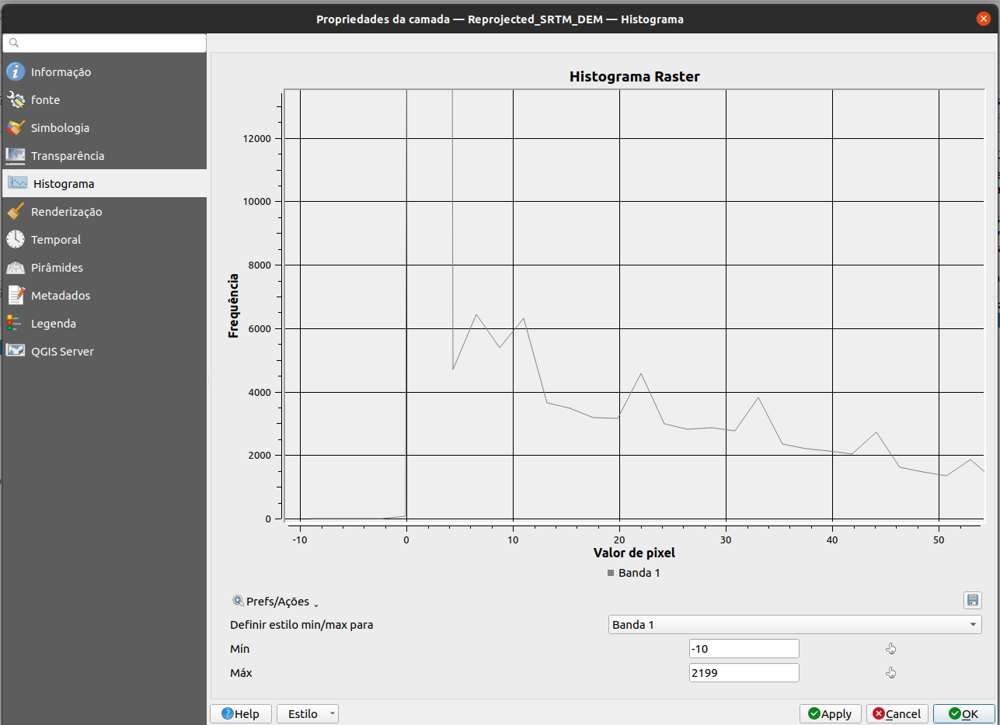

Figura 9.18 - Ampliando o histograma computado DSM_mosaic_31983

Mais do que apenas ver a distribuição dos valores numéricos dos pixels, o histograma permite ao usuário reclassificar os valores para visualização do raster. Para fazer isso, use as 2 ferramentas para apontar no histograma os novos valores mínimo e máximo (consulte a figura 9.19).


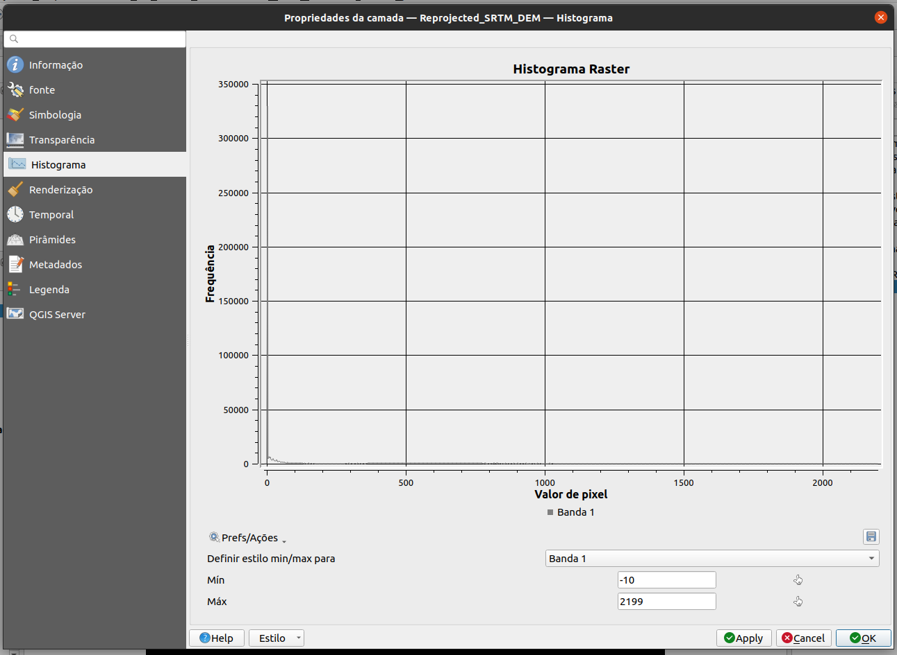

Figura 9.19 - Selecionando os valores mínimo e máximo para reclassificar o raster

Após pressionar aplicar, o raster será representado usando o novo intervalo mínimo-máximo selecionado. Esta funcionalidade permite ao usuário ignorar valores extremos que podem esticar ab-normalmente o raster.

Mesmo que a próxima ferramenta que usaremos seja um plugin (veja o módulo 1 para detalhes do plugin), nós o consideramos muito útil para começar a trabalhar com raster. Estamos nos referindo ao plug-in **Value Tool** que permite a identificação imediata dos valores das células passando o mouse sobre as camadas raster.

Vá para **Plug-in ‣ Gerenciar e instalar complementos**, procure o plug-in **Value Tool** e clique em instalar. Depois, clique com o botão direito na barra da janela principal do QGIS para abrir todos os Painéis e Barras de Ferramentas disponíveis em sua instalação do QGIS e selecione o **Value Tool Panel**. Verifique sua interface QGIS para ver onde foi aberta.


Figura 9.20 - O Value Tool Panel

A praticidade desta ferramenta reside na sua simplicidade de uso, com apenas alguns cliques, pode-se facilmente extrair células de valor nas áreas exatas de interesse. Além disso, permite isso para todas as camadas raster carregadas.

A Ferramenta de Valor possui 3 guias: Tabela, Gráfico, Opções (veja a figura 9.21).


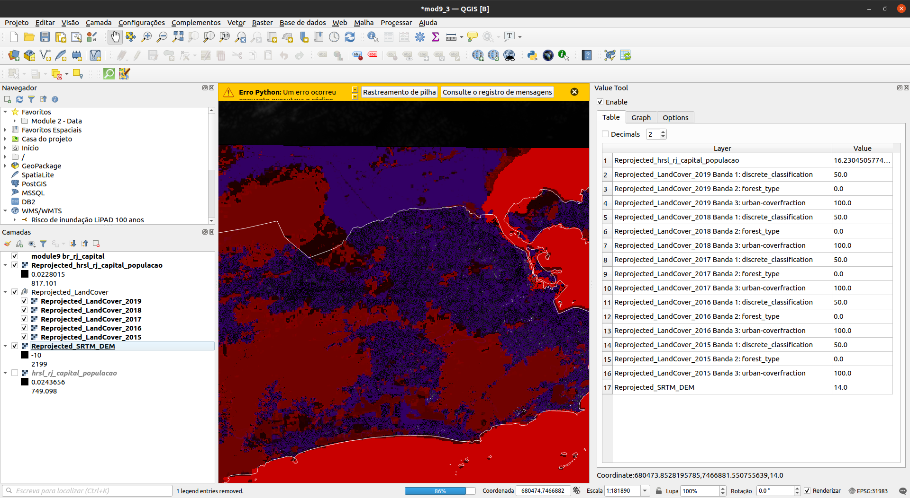

Figura 9.21 - Ferramenta de valor carregado - destaque na primeira guia - Tabela

A primeira guia - Tabela - apresenta uma lista de todas as camadas raster carregadas e os valores das células, conforme o usuário move o mouse. Também existe a possibilidade de selecionar com quantas casas decimais os valores devem ser exibidos. Se o mouse for passado fora de uma extensão da camada raster, ao invés de um valor, uma mensagem será exibida: “fora da extensão”.

A segunda guia - Gráfico - exibe em um gráfico unido todos os valores que lê na posição do mouse. Ele permite que o usuário insira valores para mínimo e máximo no eixo Y - que é o eixo dos valores da célula. O eixo X lista todas as bandas do raster que exibe na tabela, com os números de ordem correspondentes: a banda que tem o número 1 na primeira guia, também será a número 1 no gráfico.

A terceira aba permite ao usuário customizar o que a `Value Tool` exibe: quais camadas (todas, apenas as visíveis ou as selecionadas) e quais bandas mostrar.


#### **Perguntas do questionário**

1. As camadas raster podem ser reprojetadas em outros sistemas de coordenadas?
* <span style = "text-decoration: underline;"> Sim. </span>
* Não
2. Pode haver alguma lacuna entre os intervalos de valores de um histograma calculado para uma camada raster?
* Sim.
* <span style = "text-decoration: underline;"> Não. </span>
3. Bandas diferentes do mesmo conjunto de dados raster podem ter resoluções diferentes?
* _Sim._
* Não.


### Fase 2: Introdução ao trabalho com dados raster

Agora que aprendemos como extrair informações básicas nos conjuntos de dados raster carregados, continuaremos com um processamento de dados raster mais aprofundado em a fim de obter novos rasters derivados e, em conseqüência, mais informações.

Como você deve ter notado, devido à estrutura do modelo de dados raster, as camadas que carregamos estão se expandindo em nossa região de interesse - a cidade do Rio de Janeiro. Isso é indesejável por vários motivos, mas principalmente porque você acaba processando mais dados do que realmente precisa, o que se traduz em maiores necessidades de armazenamento e processamento do computador. É por isso que, antes de seguirmos para qualquer outra etapa, teremos certeza de que processaremos exatamente a quantidade de dados de que precisamos. **Esteja ciente** ao começar a trabalhar em seus próprios conjuntos de dados, que o tamanho dos arquivos é um fator importante quando se trata de tempos de processamento. Quanto maiores os arquivos, mais tempo será necessário. Por causa da estrutura de dados do modelo - raster vs vetor - os arquivos raster são geralmente muito maiores.

Como você notou agora, os conjuntos de dados que carregamos em um GIS - em nosso caso em QGIS - podem ser processados ​​juntos mesmo se forem de natureza diferente, como unir tabelas csv a camadas vetoriais para adicionar informações às geometrias. O mesmo se aplica a dados raster e vetoriais, como veremos.

Para trabalhar apenas com camadas raster que são relevantes para nossa área, usaremos a camada de extensão vetorial (br_rj_capital) para cortar/recortar todas as camadas raster relevantes. Vá para **Raster ‣ Extrair ‣ Recortar raster pela camada de máscada** (veja a figura 9.22). Da mesma forma, você pode pesquisar por Clipe na Barra de Ferramentas de Processamento ou na barra Localizador.


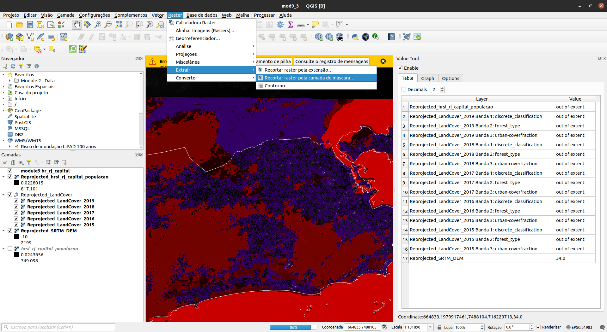

Figura 9.22 - Usando uma máscara vetorial para extrair os dados raster em uma região específica

Visto que trabalharemos com 7 camadas raster - as 5 camadas de cobertura do solo - o modelo de superfície digital e o HRSLl, usaremos o processamento em lote para cortar todas as camadas de uma vez. **Esteja ciente,** se você pulou a etapa de reprojeção, você tem camadas em diferentes projeções e o algoritmo não funcionará ou produzirá resultados inesperados.

A configuração da janela de processamento em lote deve ser semelhante à figura 9.23.


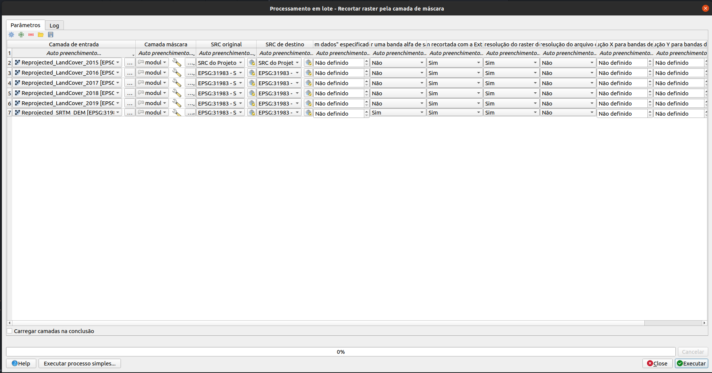

Figura 9.23 - Processo em lote recortando todas as camadas raster necessárias pela geometria da cidade do Rio de Janeiro

Os parâmetros as configurações são as seguintes:
* camada de máscara: br_rj_capital
* CRS de origem e destino é EPSG 31983
* selecione sim para: `Igualar a Extensão da imagem recortada com a Extensão da camada de máscara` e `Manter a resolução do raster de entrada`.
* Para o DSM também selecionaremos Sim para `criar uma banda alfa de saída`. Carregue as camadas na conclusão.

Se tudo correu bem, a janela principal do QGIS deve ser semelhante à figura 9.24.


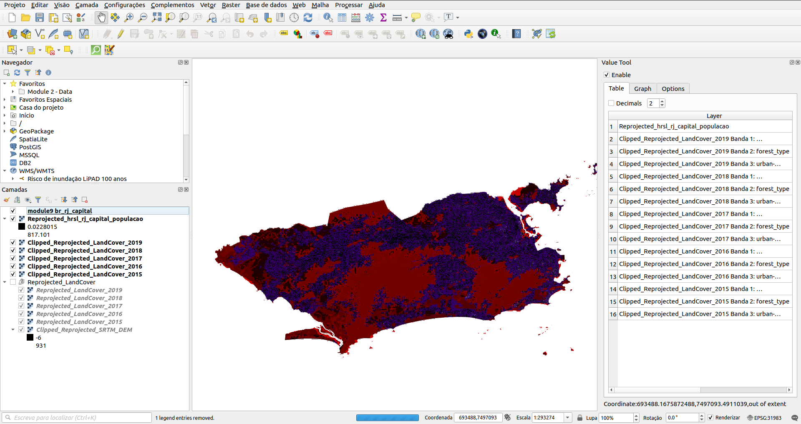

Figura 9.24 - Camadas raster cortadas pelo contorno da cidade do Rio de Janeiro.  

Agora, imagine que você tenha que apresentar um relatório sobre onde a maioria das pessoas está morando, mas levando em consideração a altitude[^4]. Você deve saber quantas pessoas vivem entre 0 e 200 m de altitude na cidade do Rio de Janeiro. Existem alguns elementos a serem considerados. Em primeiro lugar, quais são os dados que iremos utilizar e quais são as suas características. Para população, temos os dados da camada HRSL e, para relevo, temos o ALOS World 3D - 30m (AW3D30). Ambas as camadas raster possuem resolução espacial de 30m, o que nos permite prosseguir com outras considerações. O relevo é um fenômeno contínuo, a distribuição da população não, mas o relatório não faria sentido sendo feito pelo pixel de 30m. Precisamos identificar todos os pixels com valores de célula de 0 a 200. Considerando o histograma de DSM para nossa região de interesse, vimos que a maioria dos valores de célula está entre 0 e 200m. Podemos proceder à confecção de um mapa de relevo básico com base nas seguintes divisões:

1. 0 - 50m
2. 51 - 100m
3. 101 - 150m
4. 151 - 200m
5. 250 - 600m
6. 600 - 1300m

Utilizando os seus conhecimentos adquiridos em módulo 4, você pode definir o estilo da camada DSM (Clipped_Reprojected_SRTM_DEM) por meio dessas categorias. Seu mapa deve ser semelhante à figura 9.25.


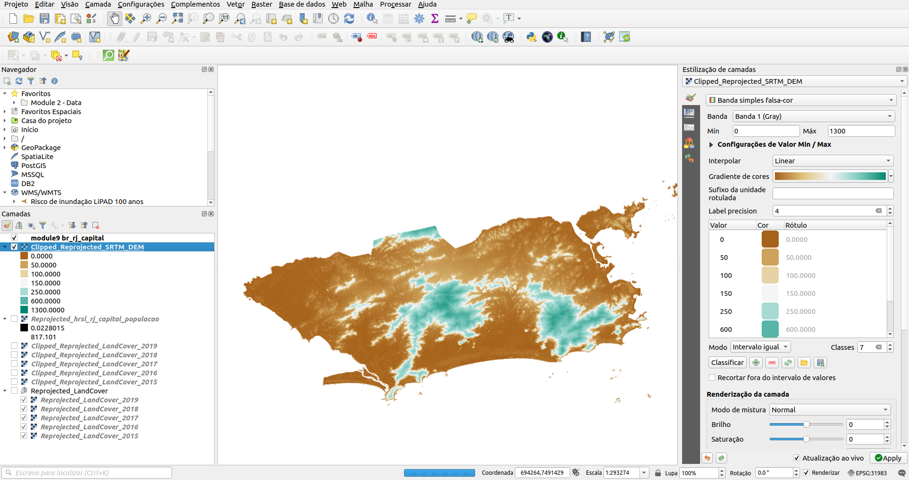

Figura 9.25 - Representação Clipped_Reprojected_SRTM_DEM

Para calcular o número de pessoas com base nos dados raster HRSL que vivem até 200 metros de altitude na cidade do Rio de Janeiro, devemos ver quais pixels se enquadram em cada uma dessas categorias. Para fazer isso, usaremos a **Calculadora Raster**. Esta é uma funcionalidade que permite ao usuário realizar cálculos com base nos valores de pixel raster existentes. Os resultados são gravados em uma nova camada raster em um formato compatível com GDAL[^5].

Existem várias maneiras de abrir o calclulator raster no QGIS. Você pode fazer isso na barra de menus **Raster ‣ Raster Calculadora** ou pesquisando na calculadora raster na caixa de ferramentas de processamento ou na barra localizadora. Se executarmos a Calculadora Raster sob análise Raster na Caixa de Ferramentas de Processamento, a janela da Figura 9.26b deve aparecer.


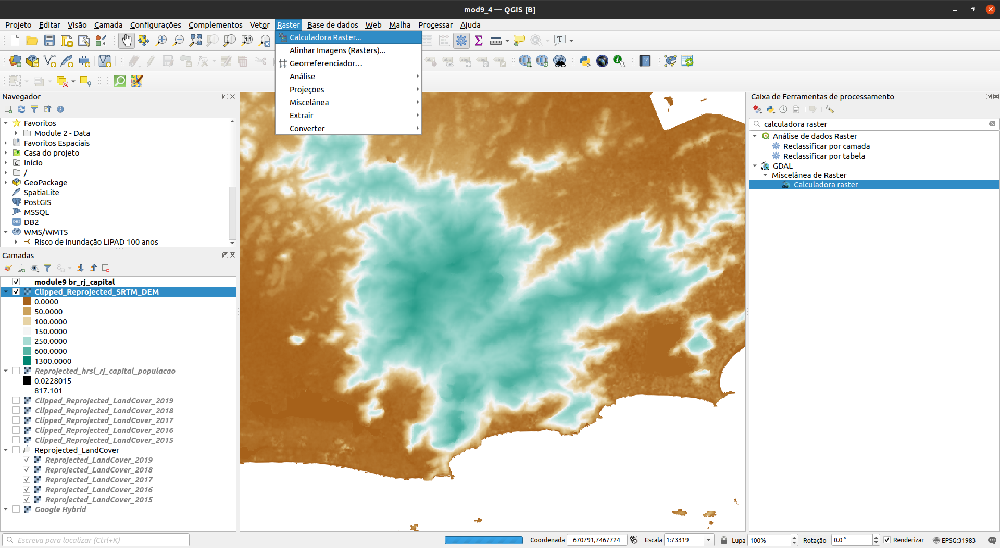

Figura 9.26a - Abrindo a calculadora raster


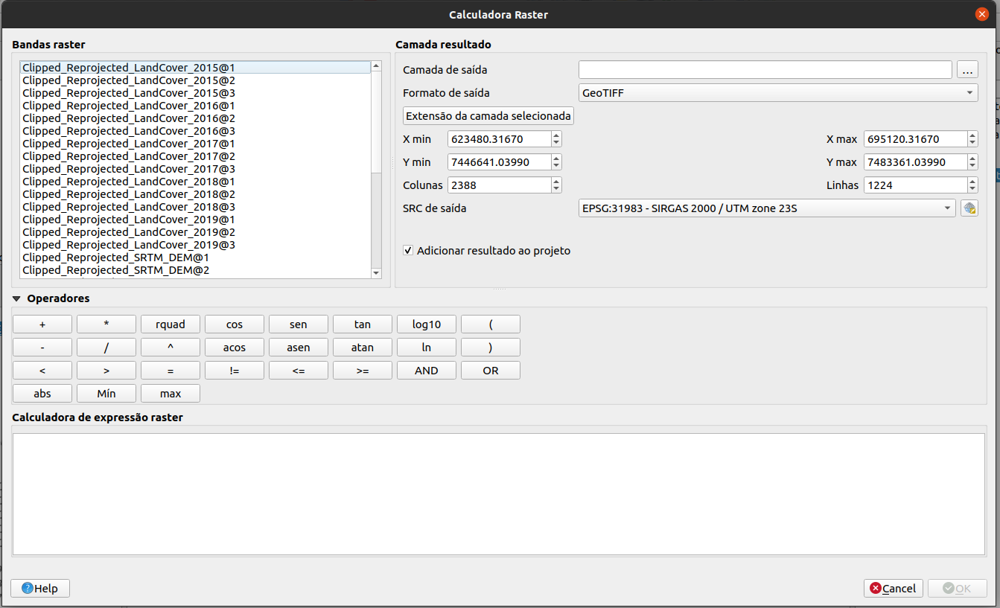

Figura 9.26b - Calculadora raster

Nesta janela, podemos reconhecer as operações detalhadas na seção Conceitos, subtrações, adições, comparações e todas as outras (ver página 3). **Clipped_Reprojected_SRTM_DEM @ 1** A convenção de nomenclatura para os rasters pode ser observada: o que vem antes do @ é o nome da camada raster, o que vem depois do @ é o número da banda.


A seguir, iremos 'fatiar' nossa camada raster Clipped_Reprojected_SRTM_DEM para extrair apenas os pixels com valores de até 200 metros. Sabemos que as células de valor do DSM-mosaic_clipped representam dados numéricos contínuos (não valores discretos, como LandCover). Portanto, a operação que precisamos empregar neste caso é uma comparação de valores de uma célula <= 200 metros. Para obter isso, escreveremos a seguinte calculadora raster:

```
"Clipped_Reprojected_SRTM_DEM@1" <= 200
```

Defina a **Camada de referência ** como ** Clipped_Reprojected_SRTM_DEM @ 1**. Sua calculadora raster deve ser semelhante à figura 9.27.

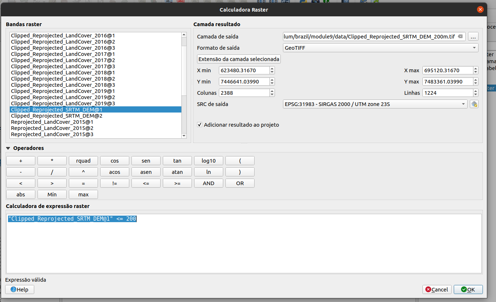

Figura 9.27 - Inserindo uma fórmula na Calculadora Raster.

Seu resultado deve ser semelhante à figura 9.28.


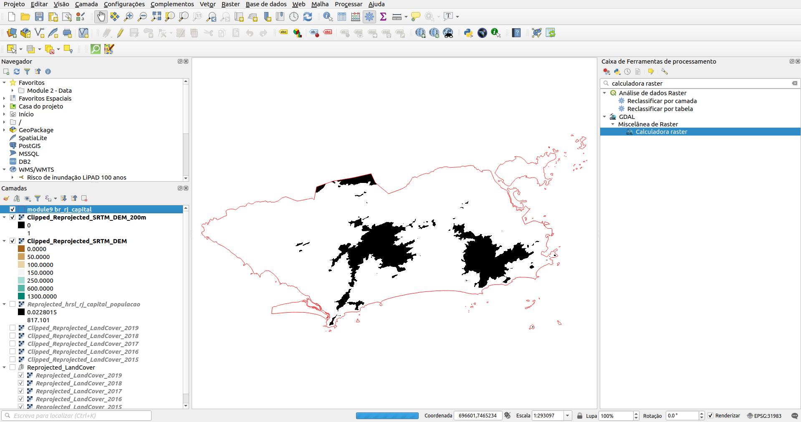

Figura 9.28 - Resultado de identificar todos os pixels valores abaixo de 200 metros usando a calculadora raster

O resultado será denominado `Output`. Você pode renomear isso para `<200`. Como podemos ver no painel de camadas, a camada raster que obtivemos tem apenas 2 valores 0 e 1. Isso porque usamos uma operação racional, uma comparação, portanto cada pixel que está abaixo de 200 metros recebeu valor = 1 e todos acima, valor = 0. Podemos testar isso usando a `Ferramenta de valor`. A Figura 9.29 apresenta apenas pixels de valor 1, ou seja, os pixels que nos interessam para o nosso exercício.


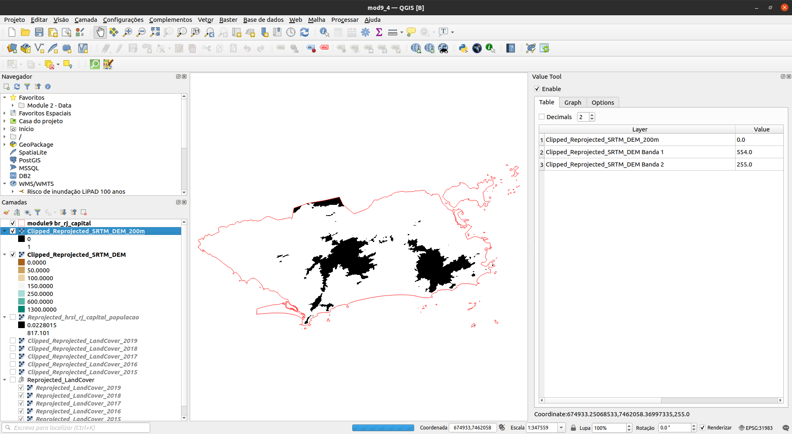

Figura 9.29 - Distribuição espacial de todos os pixels de valor 1, ou seja, com altitude inferior a 200 metros

Indo além, podemos mostrar a distribuição espacial da população na resolução espacial de 30 m apenas nesta região geográfica específica que selecionamos - cidade do Rio de Janeiro, abaixo de 200m. Para fazer isso, utilizamos novamente a Calculadora Raster.

A fórmula é bastante simples, dado que todos os valores de células DSM que estamos interessados ​​têm valor 1.

Abra a Calculadora e insira a seguinte fórmula:

```
"< 200 @ 1" * "Reprojected_hrsl_rj_capital_populacao@1"
```


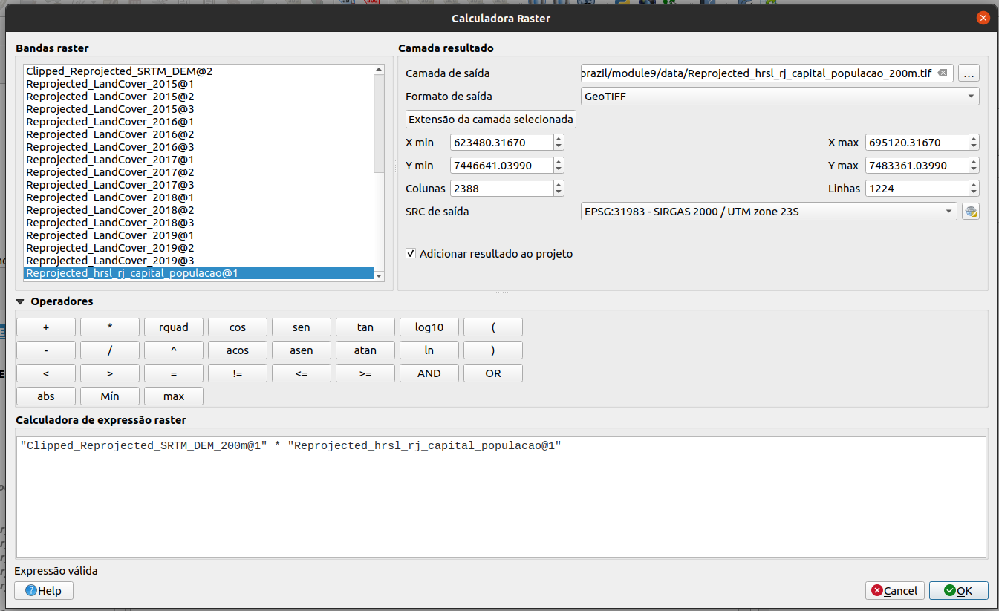

Figura 9.30 - Usando calculadora raster para identificar classes de distribuição populacional com base na altitude de até 200m.

Ao contrário do uso anterior da calculadora raster, usamos 2 conjuntos de dados raster diferentes para obter o resultado desejado, mas você observará que mesmo que haja pixels fora de Reprojected_hrsl_rj_capital_populacao_200m.tif no resultado, o valor é 0. Use a ferramenta Value para verificar (consulte a figura 9.31).


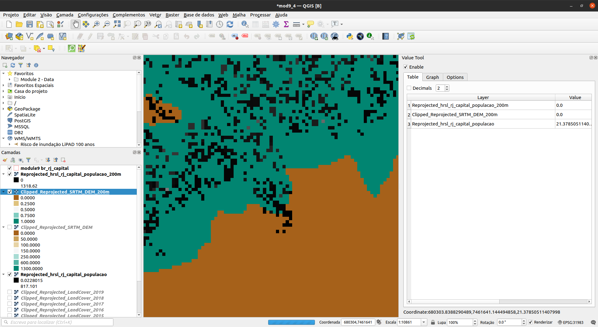

Figura 9.31 - Usando a Ferramenta de Valor para verificar os resultados da Calculadora de Raster

Você pode ver que mesmo se Reprojected_hrsl_rj_capital_populacao tiver valores nesta localização específica do mouse, o raster obtido com Raster Calculator HRSL_DSM tem valor 0.

A seguir, apresentamos a distribuição espacial da população que vive abaixo de 200m na ​​cidade do Rio de Janeiro. Para escolher uma classificação apropriada, calculamos o histograma. Podemos notar que a maioria dos valores está entre 0,1 e 100 pessoas por 30m. A classificação que escolhemos é visível na figura 9.32.


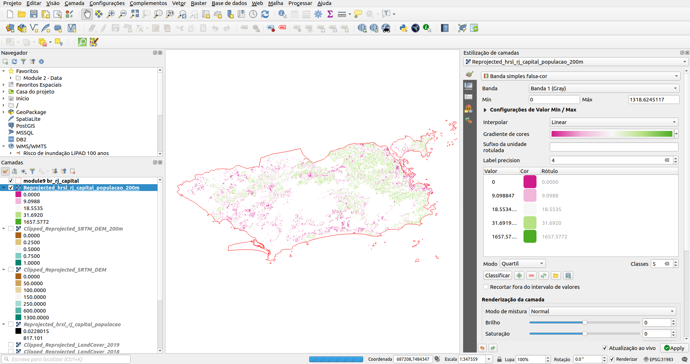

Figura 9.32 - Distribuição da população que vive abaixo de 200m na ​​cidade do Rio de Janeiro, representado com uma resolução de 30m.

Se estivermos interessados ​​no número total de pessoas que vivem abaixo de 200m na ​​cidade do Rio de Janeiro e não na distribuição geográfica por 30 m de resolução espacial, então precisamos somar todos os valores de pixel da camada raster HRSL_DSM. Uma forma de obter este número é transformar o Reprojected_hrsl_rj_capital_populacao_200m de raster para vetor.

Para fazer isso vá para **Raster ‣ Conversão ‣ Raster para vetor (poligonizar)** (ver figura 9.33).


Figura 9.33a - Conversão de varredura em vetor

Lembre-se de que esta camada raster tinha apenas 2 valores - 0 e 1, então escolha como parâmetro para construir o vetor o DN (número digital).


Figura 9.33b - Parâmetros de conversão de varredura em vetor

Seu resultado deve ser semelhante à figura 9.34.


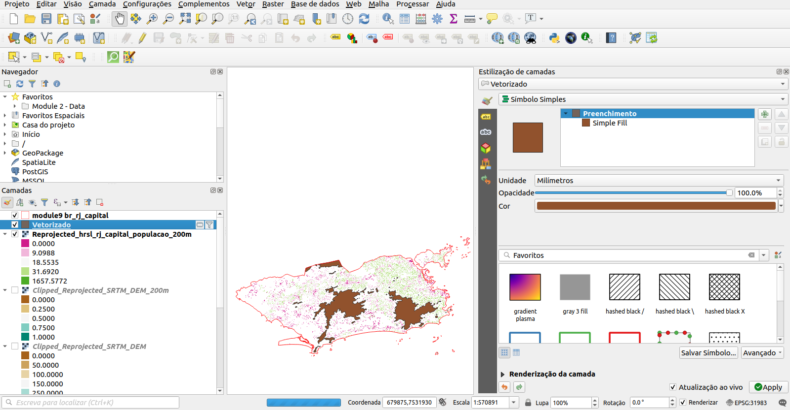

Figura 9.34 - Resultado da conversão de um conjunto de dados raster em um conjunto de dados vetorial.

Exclua a geometria do valor 0.

Para encontrar nossa resposta, usaremos **Estatísticas Zonais**. Para encontrar rapidamente esta funcionalidade, abra a Caixa de Ferramentas de Processamento e digite na caixa de pesquisa “zonal” (veja a figura 9.35).


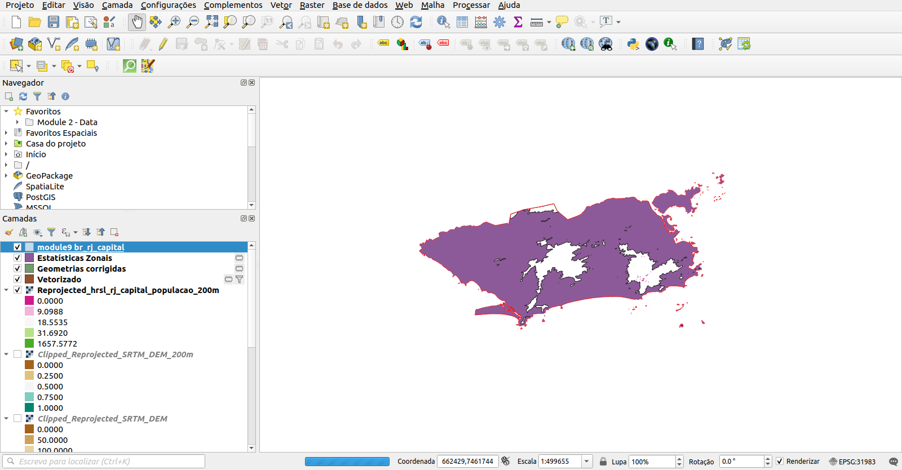

Figura 9.35 - Identificando Estatísticas Zonais na Caixa de Ferramentas de Processamento

Na janela que foi aberta, selecione os parâmetros como na figura 9.36 . Como estatísticas calculadas, selecione: contagem, soma, mínimo e máximo.


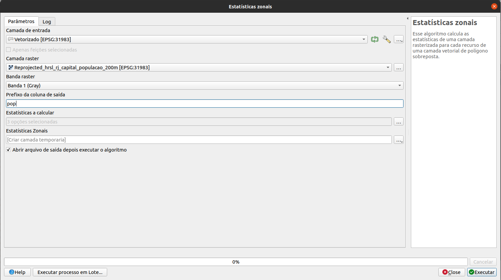

Figura 9.36 - Definindo os parâmetros para Estatísticas Zonais

A camada resultante é uma camada vetorial que tem como atributos as estatísticas que selecionamos (veja a figura 9.37).


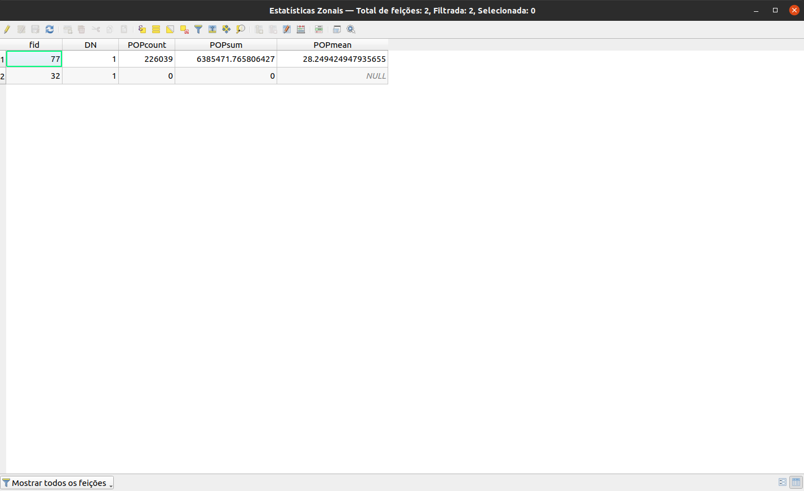

Figura 9.37 - Camada vetorial resultante das estatísticas zonais

E com esta etapa final, respondemos ao nosso exercício, quantas pessoas (e onde) vivem abaixo de 200 m na cidade do Rio de Janeiro.


#### **Perguntas do questionário**

1. Os dados rasterizados podem ser recortados?
* _ <span style = "text-decoration: underline;"> Sim </span> ._
* _Não._
2. Pode-se usar conjuntos de dados vetoriais carregados no projeto QGIS na Calculadora Raster?
* _Sim._
* _ <span style = "text-decoration: underline;"> Não. </span> _
3. Os conjuntos de dados raster podem ser convertidos em conjuntos de dados vetoriais?
* _ <span style = "text-decoration: underline;"> Sim </span> ._
* _No._


### **Fase 3: Trabalho com dados raster e vetoriais.**

Na fase anterior, temos visto como podemos processar 2 conjuntos de dados raster para derivar novas informações. Usamos o modelo de superfície digital e a Camada de Assentamento de Alta Resolução para descobrir quantas pessoas vivem abaixo de 200m na ​​cidade do Rio de Janeiro. Antes de fazer qualquer análise, verificamos se os conjuntos de dados estavam na mesma projeção e, além disso, se os rasters têm a mesma resolução espacial para que os resultados que obtivemos sejam viáveis. Ao se referir ao sistema de referência de coordenadas, o raciocínio é claro, mas por que a mesma resolução espacial?

Lembrando a resolução espacial, é o tamanho da superfície do solo medido em unidades de comprimento, ou seja, o tamanho do pixel medido no solo. Se um raster tem uma resolução de 30m, isso significa que o menor objeto linear que conseguimos detectar naquela imagem é de 30m, qualquer menor e não conseguimos detectá-lo. Continuando a analogia, podemos compará-la com a escala de um mapa. Se um mapa tem uma escala de 1: 25.000, significa que 1 unidade de comprimento no mapa representa 25.000 unidades no solo, ou seja, 1 cm é 25.000 cm, 1 cm no mapa equivale a 250 m no solo. Por exemplo, uma estrada de 2 km teria 8 cm no mapa.

Por que isso é importante ao trabalhar com conjuntos de dados raster? A Figura 9.38 pode oferecer uma explicação.


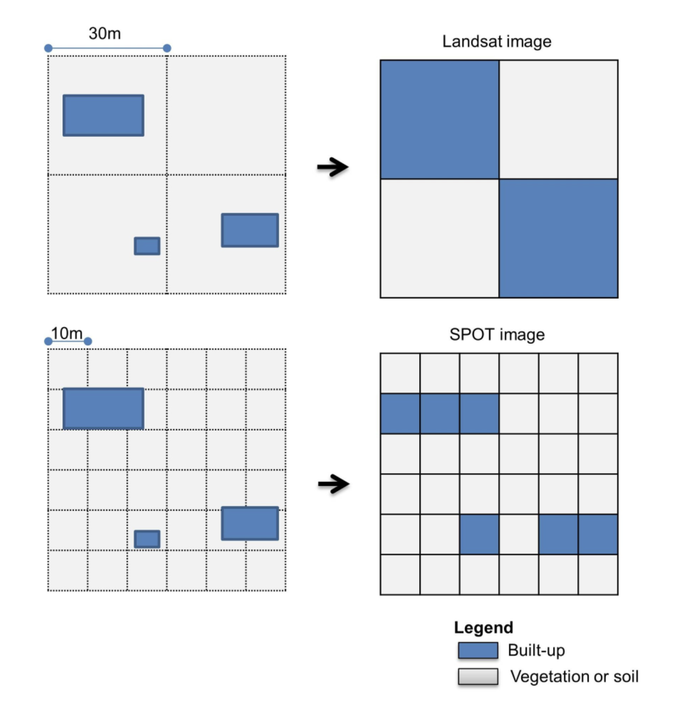

Figura 9.38 - Exemplo de diferentes resoluções específicas para diferentes imagens de satélite - Landsat e SPOT - para a mesma área

(Crédito da foto: Congedo, L. e Munafò, M, (2013) Avaliação da Mudança da Cobertura do Solo Usando Sensoriamento Remoto: Objetivos, Métodos e Resultados, Roma: Sapienza University. Disponível em: http://www.planning4adaptation.eu/)

A Figura 9.38 detalha a relação entre a resolução das imagens de satélite e informações de cobertura do solo extraídas dessas imagens capturadas. Lembre-se, conforme detalhamos no início, que o valor da célula de pixel é atribuído a toda a área que cobre, mas isso não significa que essa seja a realidade no terreno. Estas representam decisões tomadas pelos especialistas que derivam vários produtos com base em imagens de observação da Terra - todos documentados em artigos revisados ​​por pares e descrições de algoritmos. Outras explicações estão além do escopo deste módulo, mas é importante ter em mente a relação entre o que um sensor a bordo de um satélite captura e os produtos que usamos.

Voltando à nossa região de interesse - a cidade do Rio de Janeiro - podemos testar essas diferenças com os dados de que dispomos. Carregamos em nosso projeto QGIS as 5 camadas raster de LandCover por 5 anos: 2015, 2016, 2017, 2018 e 2019. Em seguida, carregaremos um mosaico de imagens do Sentinel-2[^6]. Vamos carregar a camada WMS EOX Sentinel-2 sem nuvem, disponível [aqui](https://s2maps.eu/). Lembrando do módulo 2, para adicionar uma camada WMS, vá para **Camada ‣ Adicionar camada ‣ Adicionar camada WM/WMTS ..**

Quando a janela adicionar abrir, use os seguintes parâmetros:
```
Nome: EOX Sentinel-2
URL : https://tiles.maps.eox.at/wms?service=wms&request=getcapabilities
```


Figura 9.39 - Adicionando uma camada WMS ao QGIS

Após conectar-se com recém-adicionada a camada WMS, carregaremos a camada chamada `Sentinel-2 cloudless layer for 2019 by EOX - 4326` no QGIS. Depois de ampliar para a extensão da região de interesse, a janela do seu mapa deve ser semelhante à figura 9.40.


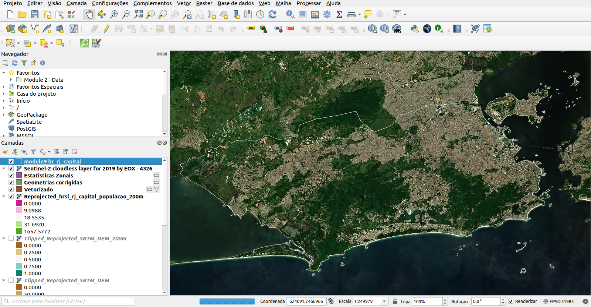

Figura 9.40 - Camada sem nuvens Sentinel-2 para 2019 por EOX - 4326 para a cidade do Rio de Janeiro

Embora os produtos LandCover tenham sido obtidos usando outros dados de satélite (Proba-V), vamos comparar as 2 camadas para que possamos ter uma noção do que significam as diferentes resoluções. Lembre-se de que o produto LandCover está a 100m e as imagens do Sentinel 2 estão a 10m. Para isso, abriremos o Clipped_Reprojected_LandCover 2019 e a camada WMS. Para fazer comparações entre 2 camadas, usaremos um novo plugin que você deve instalar. Portanto, vá para **Complementos ‣ gerenciar e instalar complementos** e escreva na caixa de pesquisa `MapSwipe Tool`. Depois de instalado, ele deve aparecer como um novo pictograma em sua barra de ferramentas ().


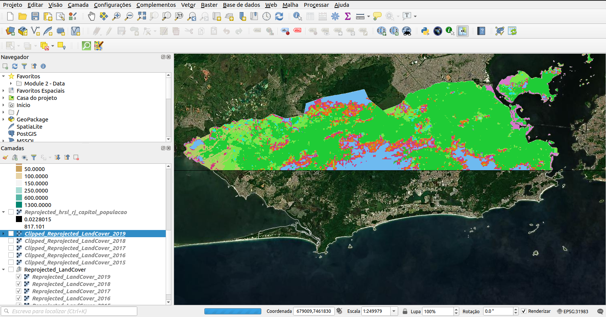

Figura 9.41 - Comparando 2 camadas raster usando o plugin da ferramenta MapSwipe

Para ativar a ferramenta MapSwipe, clique nela enquanto a camada raster que você deseja comparar é selecionada no painel Camadas. As diferenças de resolução são óbvias, assim como o fato de o produto de satélite (Land Cover) ter sido desenvolvido a partir de uma imagem de satélite (PROBA-V) de resolução mais grosseira. No entanto, as classes gerais maiores são bem identificadas, como pode ser visto na figura 9.42.


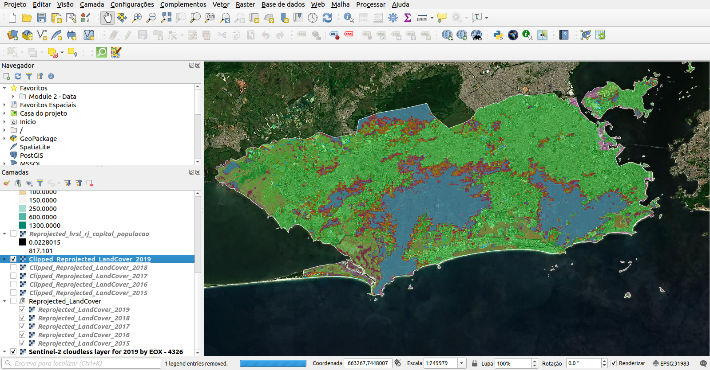

Figura 9.42 - LandCover2019 obtido do PROBA-V (100m) no topo do mosaico Sentinel 2 (30m)

Adicionando o HRSL ao mapa, mostrará uma boa correspondência entre HRSL e o LandCover. O espaço urbano está representado em vermelho e, como você pode ver na figura 9.43, está quase totalmente coberto pela camada HRSL.


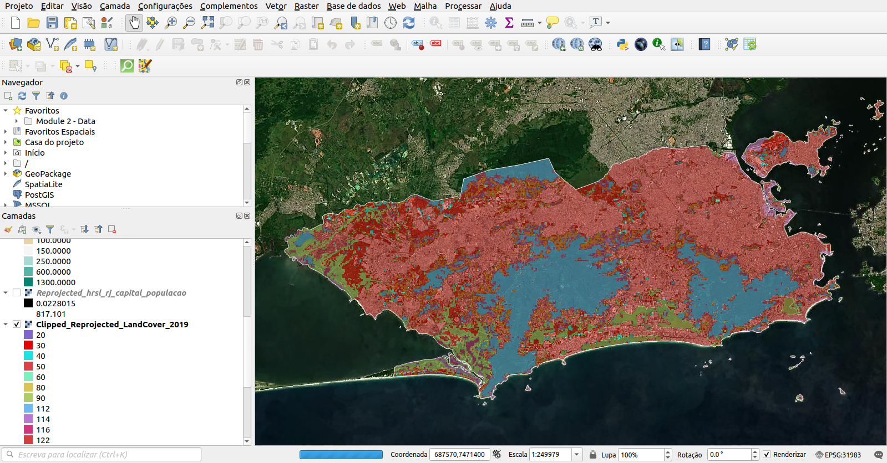

Figura 9.43 - HRSL adicionado no topo do Clipped_Reprojected_LandCover 2019.

No entanto, ampliando você pode ver a diferença na resolução entre os 2 produtos raster, como na figura 9.44.


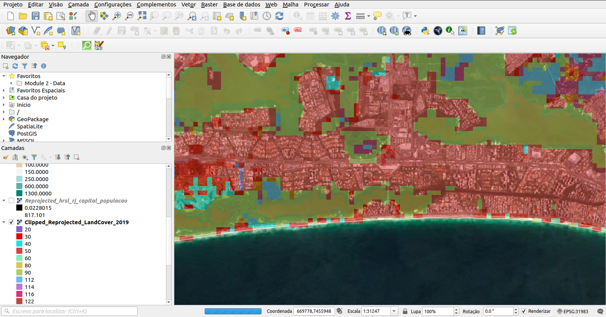

Figura 9.44 - Diferença na resolução espacial entre HRSL (30m - rosa) e Clipped_Reprojected_LandCover 2019 (100m - cores vermelho e magenta)

Agora, se alguma análise seria feita usando estes rasters, esses resultados não seriam viáveis, porque estaríamos comparando valores que se aplicam a diferentes resoluções. Como uma fase de pré-processamento, o usuário deve _resample_ um dos 2 para corresponder.

**Reamostragem** refere-se à alteração dos valores das células devido a mudanças na grade de células raster e há apenas 2 opções: (1) **aumento da resolução (upsampling)** refere-se aos casos em que estamos convertendo para uma resolução maior/células menores e (2) **redução da resolução (downsampling)** é reamostragem para resolução inferior/tamanhos de células maiores.

Vamos imaginar o seguinte exercício. Precisamos identificar os números da população para cada categoria de cobertura do solo que definimos na cidade do Rio de Janeiro. Como explicado acima, precisamos _processar_ os dados que temos para obter resultados viáveis ​​de nossa análise, ou seja, em nosso caso, precisamos trazer ambos os nossos conjuntos de dados raster para a mesma resolução espacial. Conforme detalhado acima, podemos aumentar ou diminuir as dimensões dos pixels. Deve-se destacar que a reamostragem, com aumento ou redução da escala, envolverá um processo de interpolação (ver página 12 para mais detalhes) - portanto, o resultado introduz um erro estatístico. A prática usual é reamostrar todos os rasters para corresponder ao raster com a resolução mais baixa, mas novamente esta decisão deve ser tomada levando em consideração todos os fatores envolvidos. Detalhar o processo de tomada de decisão para reamostrar camadas raster excede em muito o escopo deste currículo.

Uma diferença entre os 2 produtos deve ser destacada: o produto LandCover cobre a **área inteira** da extensão considerada, ao contrário do produto HSRL, onde a camada raster contém estritamente células onde existem valores acima de 0. Esta situação cria problemas quando os valores das células de interpolação são reamostrados, pois não importa o método de interpolação escolhido, que levaria em consideração os pixels circundantes, seguindo um algoritmo específico bem definido e nesta situação particular, os pixels da borda não estão na borda de região de estudo, mas dentro dela. Portanto, em nosso caso demonstrativo, consideraremos aumentar a resolução do produto Land Cover de 100m para 30m de resolução para corresponder à resolução do produto Land Cover. O método de reamostragem que escolhemos é crucial, pois os resultados podem variar significativamente. Para fins de demonstração, faremos uma nova amostra do produto LandCover usando 2 métodos diferentes - Vizinho mais próximo e Moda.

Para reamostrar, vá para **Raster ‣ Projeções ‣ Reprojetar coordenadas.** Na janela, defina os seguintes parâmetros:

* camada de entrada: Clipped_Reprojected_LandCover_2019,
* CRS de origem e CRS de destino: EPSG: 31983,
* Método de reamostragem: Vizinho mais próximo,
* Sem dados: 255, resolução do arquivo de saída: 30,
* Tipo de dados de saída: use o tipo de dados da camada de entrada,
* extensão georreferênciadas de arquivo de saída a ser criado: selecione a camada Clipped_Reprojected_LandCover_2019.

Salve a camada de saída como LC2019_NearestNeighbour.


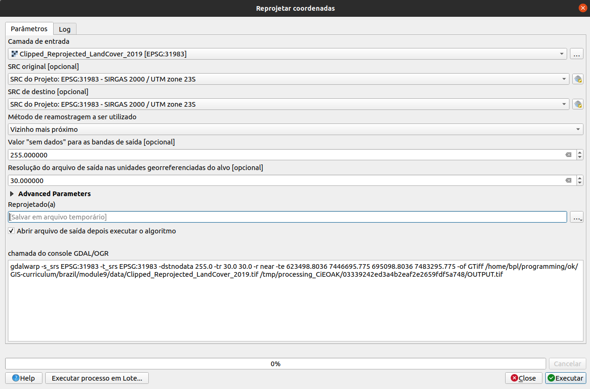

Figura 9.45 - Reamostrando a camada de cobertura do solo


Siga as etapas exatas, exceto que para o parâmetro do método de reamostragem escolha Moda. Salve a camada de saída como LC2019_Mode.  

Agora, vamos comparar os resultados - veja as figuras 9.45 e 9.46.


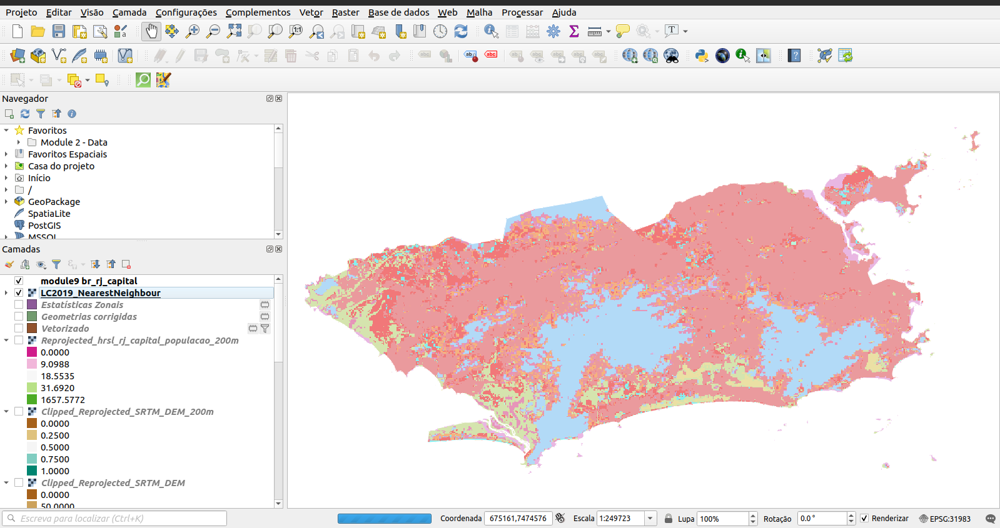

Figura 9.46a - Reamostragem do produto de cobertura do solo usando o método de reamostragem do Vizinho mais próximo


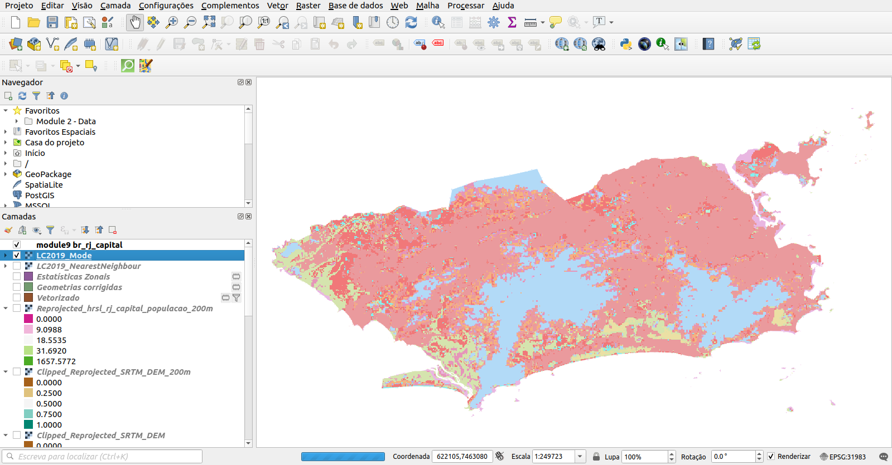

Figura 9.46b - Reamostragem do produto de cobertura do solo usando o método de reamostragem de modo

Ambos os rasters têm a mesma simbologia aplicada e podemos observar que na figura 9.45 existem valores que não se enquadram em nenhuma das categorias - os pixels não estão aparecendo. No entanto, sabemos que o produto Land Cover é uma camada contínua - não tem lacunas entre as mesmas categorias definidas. Vamos ir mais fundo e examinar os histogramas de todas as três camadas. Para isso vá para **Propriedades ‣ Histograma** e escolha Prefs/Ações para mostrar apenas a Banda 1. Salve o histograma clicando no ícone salvar no lado direito da janela (ver figura 9.47).


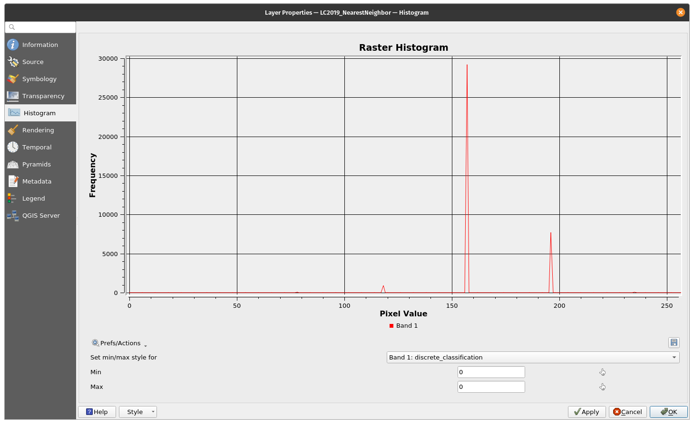

Figura 9.47 - Mostrar valores apenas para uma banda selecionada no histograma.

As Figuras 9.48 (a), (b) e (c) apresentam os 3 histogramas de interesse.


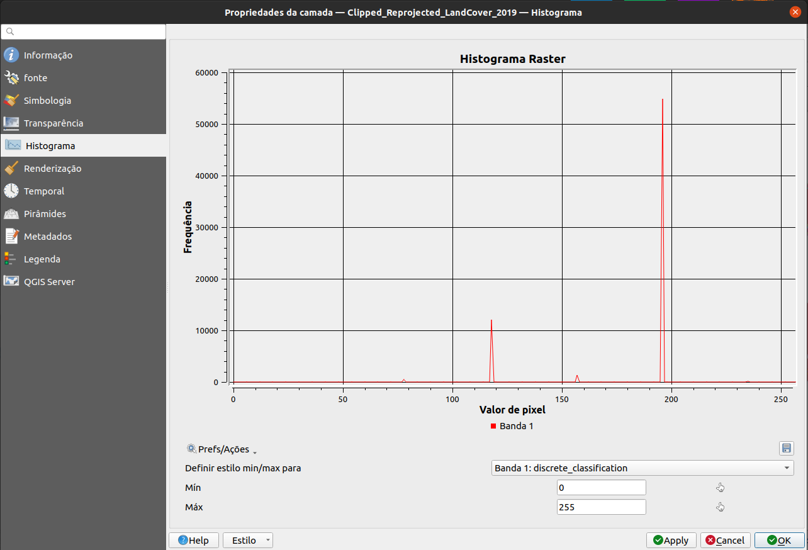

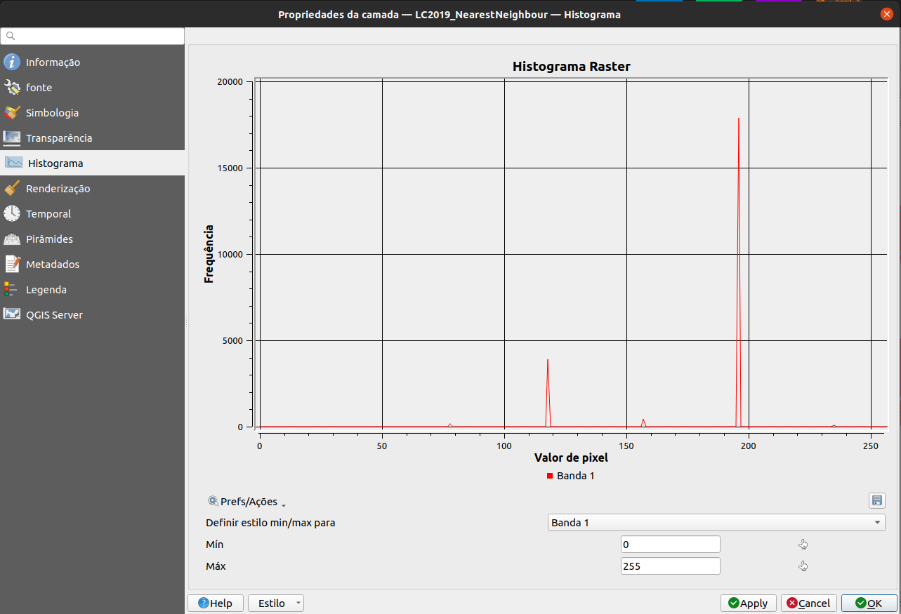

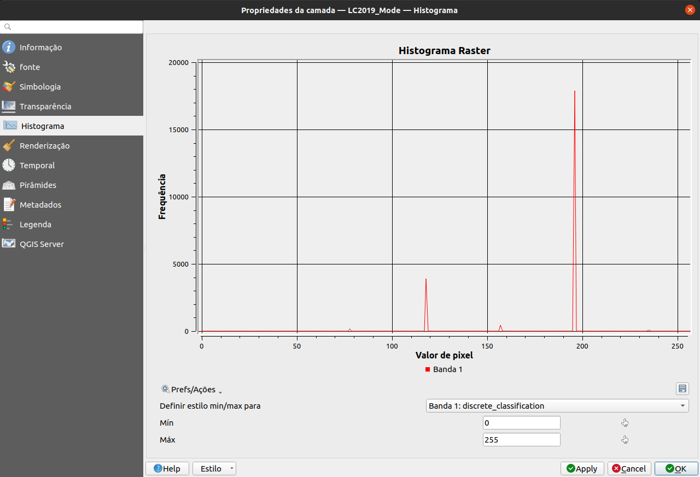

Figura 9.48 - Histogramas de (a) Clipped_Reprojected_LandCover 2019 (100m), (b) LC2019_NearestNeighbour e (c) LC2019_Mode

Podemos observar as diferenças na distribuição de valores para os 3 conjuntos de dados, ênfase em (b), onde usamos o método de reamostragem do vizinho mais próximo, resultando - como esperado - em valores de pixel calculados e, portanto, resultando em valores que não correspondem a nenhum valor no produto Land Cover (consulte a tabela 1, página 7). Conseqüentemente, os espaços em branco - pixels sem cor atribuída na figura 9.45. Conforme inferido, o método de reamostragem de modo - ou método de reamostragem majoritária - seleciona o valor que aparece com mais freqüência.

Neste ponto, suas janelas de mapa devem ser semelhantes à figura 9.49.


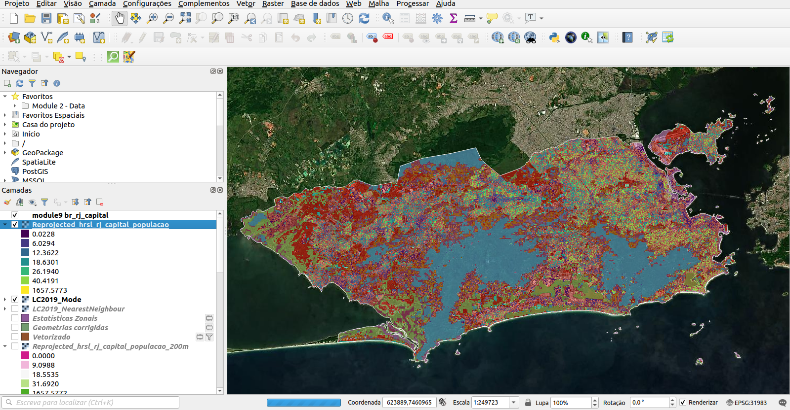

Figura 9.49 - Os 2 produtos raster: Land Cover 2019 e HRSL sobrepostos.

Voltando ao nosso exercício, os requisitos eram identificar os números da população para cada categoria de cobertura do solo que definimos na cidade do Rio de Janeiro. Neste ponto, pré-processamos nossos dados raster, de forma a tê-los no mesmo sistema de coordenadas, com a mesma resolução espacial. Continuaremos com um algoritmo de conversão, transformaremos o conjunto de dados raster Land Cover em um conjunto de dados vetoriais - tipo polígono. Isso nos permitirá identificar mais facilmente a contagem da população para cada categoria de cobertura do solo.

Para conversões, de raster para polígono, bem como de vetor para polígono, vá em **Raster ‣ Conversão** e aqui temos mais opções. Vamos escolher **Raster ‣ Conversão ‣ Raster para vetor (poligonizar)** Vamos converter para vector o último conjunto de dados raster que obtivemos: LC2019_Mode. Seu resultado deve ser semelhante à figura 9.50b.


Figura 9.50a - Poligonizando a camada raster LC2019_Mode (30m)


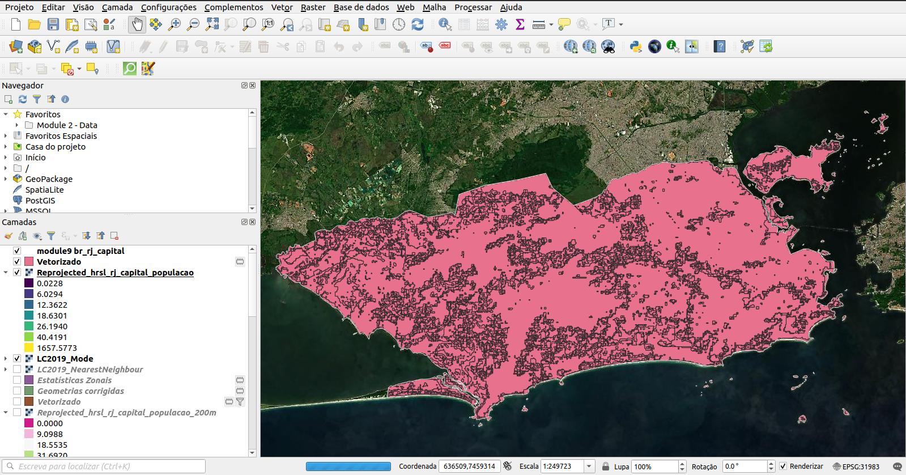

Figura 9.50b - Resultado da poligonização do LC2019_Mode ( 30m) camada raster

Como podemos observar, cada pixel - cada grupo de pixels adjacentes com o mesmo código de categoria (ver tabela 1, página 7) foi convertido em um polígono. No entanto, não estamos interessados ​​em cada região distinta, mas em toda a categoria. Assim, iremos dissolver a camada vetorial obtida usando a identificação de classe (campo `DN`) como atributo comum (**Vetor ‣ Geoprocessamento ‣ Dissolver** - para mais detalhes, verifique o módulo 8).

Anexando o mesmo estilo do raster e notaremos que as mesmas classes vetoriais correspondem às raster (ver figura 9.51).


Figura 9.51 - LC2019_Mode polygonez

Como podemos observar, os pixels do HRSL não estão, como esperado, perfeitamente contidos em um polígono do produto de cobertura do solo (ver figura 9.52).


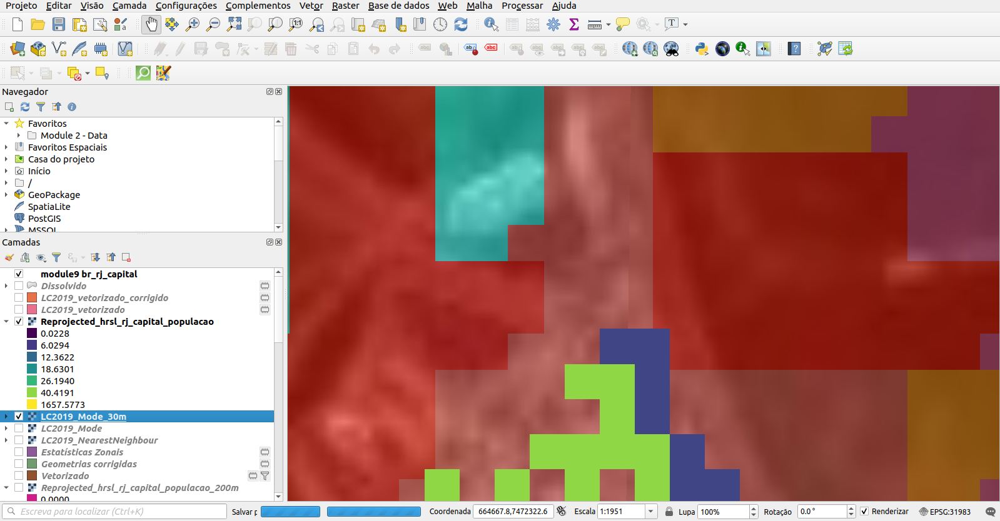

Figura 9.52 - Incompatibilidade de pixels HRSL e o conjunto de dados vetoriais de cobertura do solo  

Para eliminar este inconveniente, vamos vetorizar a camada HRSL também, só que desta vez iremos transferir o pixel valor da célula a um ponto - o centro geométrico de cada pixel.

Vá para **Processar ‣ Caixa de ferramentas**. Na barra de pesquisa, escreva as palavras-chave `raster ponto` e escolha o algoritmo `Pixels de raster para pontos` (veja a figura 9.53a). Salve a saída como HRSL_points.


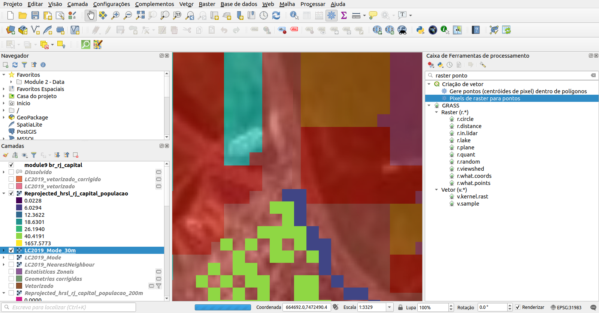

Figura 9.53a - Pixels raster para pontos


Figura 9.53b - Execução do algoritmo de pixels raster para pontos

Considerando a extensão de sua área de estudo, esta operação pode ser significativamente demorada. A Figura 9.54 mostra quantos pontos obtivemos para a cidade do Rio de Janeiro.


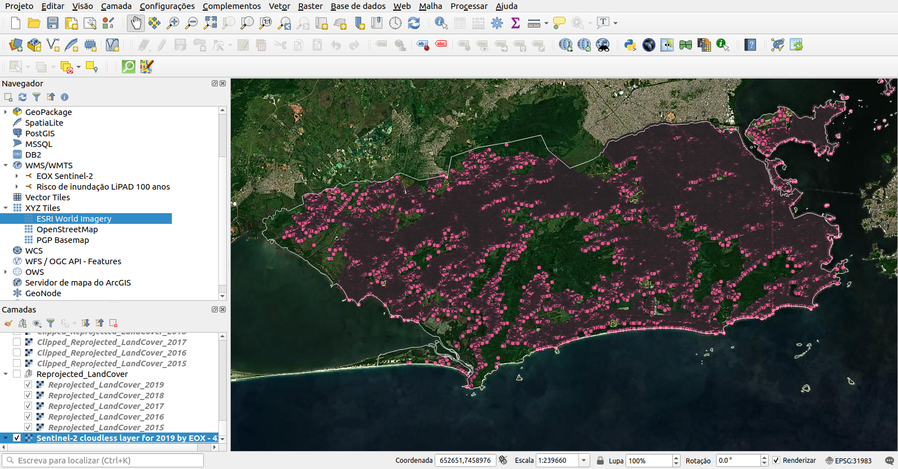

Figura 9.54 - Dados vetoriais do ponto de carregamento obtidos

O número de pontos é consideravelmente alto e sem importá-los para um banco de dados, qualquer tipo de processamento ou visualização exigiria muito tempo. Nesses tipos de situações, a solução razoável é dividir os conjuntos de dados que temos que processar em blocos gerenciáveis. Portanto, consideraremos o processamento dos cálculos necessários em áreas menores e bem definidas. Para dividir a camada HRSL, usaremos a opção de criar um VRT. Selecione a camada HRSL e escolha **Exportar como ..** Na nova janela, marque a opção **Criar VRT** e defina os seguintes parâmetros: navegue até uma pasta para onde o raster dividido será exportado, CRS: EPSG: 31983, blocos VRT: colunas máximas 1000, linhas máximas: 1000 (consulte a figura 9.55).


Figura 9.55 - Criando um arquivo VRT com tiles raster específicos

Depois de exportar, carregue todos os tiles raster em seu projeto QGIS. O resultado deve ser semelhante à figura 9.56.


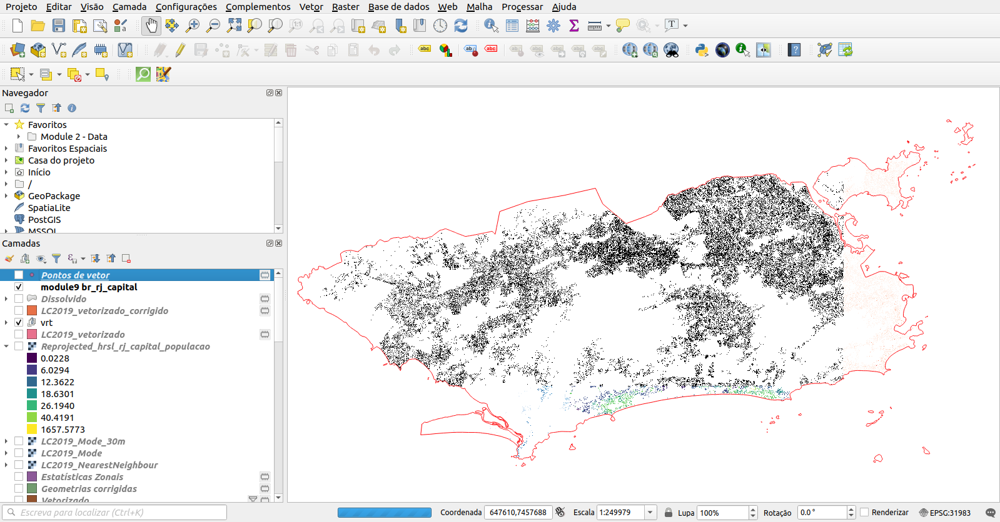

Figura 9.56 - Ladrilhos raster para o HRSL da cidade do Rio de Janeiro

A seguir, iremos executar novamente o algoritmo **Pixels de raster para pontos** para cada um dos tiles raster. Como temos vários tiles, usaremos a função de processamento em lote (consulte a figura 9.57).


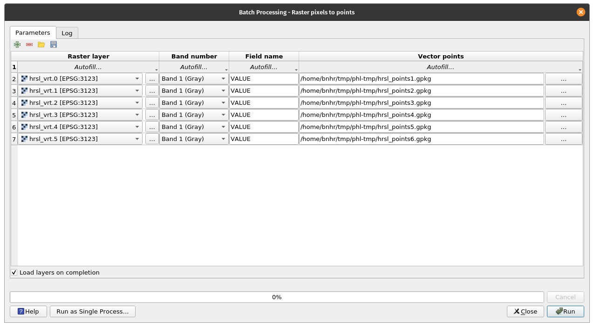

Figura 9.57 - Rodando raster para pontos para todos os tiles raster

Os pontos vetoriais resultantes devem se parecer com a figura 9.58.


Figura 9.58 - Conjunto de dados vetoriais de pontos para a camada HRSL com valores de pixel armazenados na coluna VALUE

Olhando mais de perto os resultados do algoritmo, podemos ver que os pontos vetoriais caiam exatamente no centro do pixel de onde extraem o valor (veja a figura 9.59.).


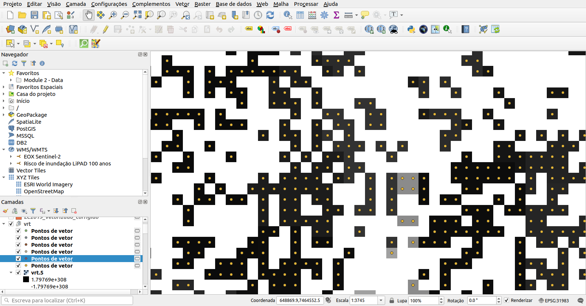

Figura 9.59 - Verificando os valores dos dados de vetor de ponto vs. valores de pixel raster

Para resolver o exercício, deve-se calcular a soma dos valores dos pontos extraídos do produto HRSL que se enquadram em cada polígono do produto de cobertura do solo. Para fazer isso, usaremos uma função que está disponível na Calculadora de campo - `aggregate()`. Esta função é bastante poderosa, pois faz junções espaciais instantaneamente, permitindo vários cálculos. No nosso caso, a função deve identificar os pontos que caem em cada polígono e, em seguida, somar os valores desses pontos. Para fazer isso, vá para a tabela de atributos do conjunto de dados vetoriais LC2019_Mode_vetorizado e abra a calculadora de campo. Criando um novo campo, introduza a seguinte expressão:


```
aggregate(
    layer:='hsrl_points_1',
    aggregate:='sum',
    expression:=VALUE,
    filter:=intersects($geometry, geometry (@parent))
)
```


Onde, `layer` é o nome do conjunto de dados do qual queremos extrair informações (em nosso caso, o conjunto de dados de ponto que contém os valores de pixel da camada raster HRSL), `aggregate` indica a ação a ser executada uma vez que a junção espacial é confirmada (soma, contagem, média, mediana, concatenar etc.), `expression` indica qual coluna queremos para extrair dados, `filter` a função de geometria (interseção, dentro, etc.) (consulte a figura 9.60).


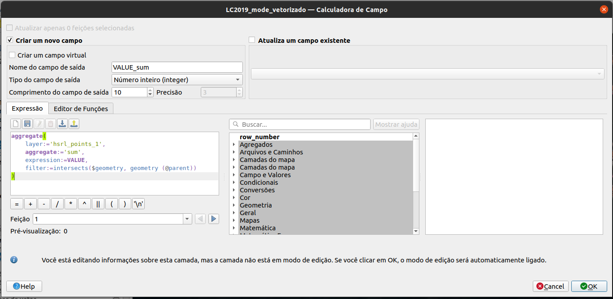

Figura 9.60 - Usando funções integradas com calculadora de campo

Os resultados são, como esperado, salvos na tabela de atributos do LC2019_Mode. E assim, o exercício foi concluído.

**Por favor, esteja ciente! Esta última etapa pode ser excessivamente longa dependendo do volume de seus dados! Teste para encontrar suas melhores dimensões de tile.**

Se o uso da Calculadora de campo e a função de agregação não funcionar, também podemos usar o algoritmo **Unir atributos por localização (resumo)** para calcular a soma dos valores dos pontos dentro dos recursos LC2019_Mode_vetorizado.


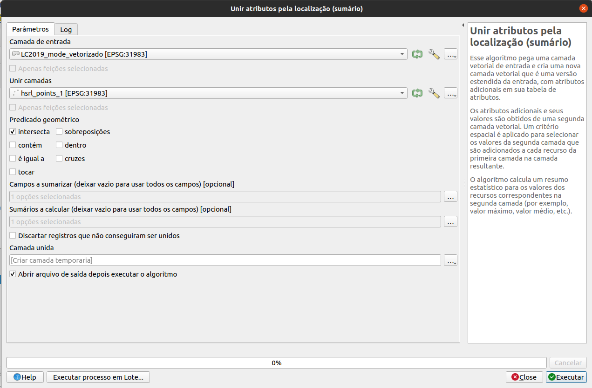

Figura 9.61 - Parâmetros do algoritmo de associação de atributos por localização (resumo)


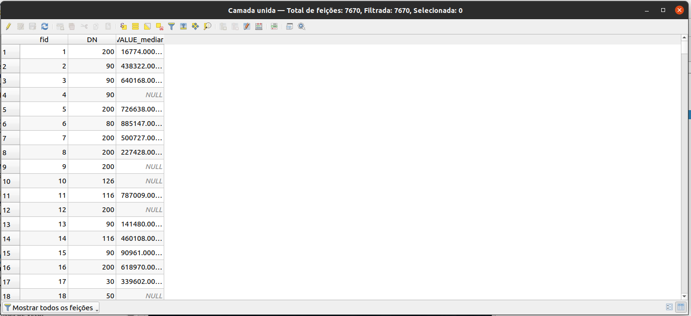

Figura 9.62 - Saída dos atributos de Join por algoritmo de localização (resumo)

Nesta terceira fase do nosso módulo 9, trabalhamos com dados raster e também com dados vetoriais. Vimos mais de perto o que significa reamostragem e quais são as implicações das características dos rasters, como sistema de referência de coordenadas, resolução espacial etc. Na maioria das vezes, deve-se trabalhar com conjuntos de dados raster e vetoriais e, portanto, é importante saber que é possível de várias maneiras. Também testamos várias conversões, de raster para vetor e vice-versa. No entanto, em nosso processamento não devemos perder de vista os fenômenos que estamos estudando, bem como a escala inicial em que os dados foram coletados, seja vetorial ou raster. Ao realizar conversões, é importante saber a correspondência entre a escala do mapa e a resolução do raster. Segundo o cartógrafo Waldo Tobler “a regra é dividir o denominador da escala do mapa por 1000 para obter o tamanho detectável em metros. A resolução é metade desse valor. ” Em outras palavras, a fórmula seria: `escala do mapa = resolução do raster (em m) X 2 X 1000.`

As soluções dadas aos nossos exercícios neste módulo, como também no módulo 8, são apenas uma forma de resolver os requisitos. À medida que se avança no estudo das ferramentas de código aberto para geoespacial, descobre-se que existem várias possibilidades para se chegar ao mesmo resultado - algumas melhores do que outras.


#### Perguntas do questionário

1. Qual é o nome do processo pelo qual a resolução de um conjunto de dados raster pode ser aumentada ou diminuída?
* _ <span style = "text-decoration: underline;"> Reamostragem. </span> _
2. O que um histograma nos mostra?
* <span style = "text-decoration: underline;"> A frequência dos valores dos pixels, organizados em intervalos de valores adjacentes. </span>
3. Um conjunto de dados raster pode ser convertido em um polígono? E o contrário?
* <span style = "text-decoration: underline;"> Sim e sim. </span>


## Referências:

Centro para Rede Internacional de Informação em Ciências da Terra - CIESIN - Universidade de Columbia. 2018. Gridded Population of the World, Versão 4 (GPWv4): Population Density, Revisão 11. Palisades, NY: NASA Socioeconomic Data and Applications Center (SEDAC). [https://doi.org/10.7927/H49C6VHW](https://doi.org/10.7927/H49C6VHW). Acessado em DAY MONTH YEAR.

Métodos de reamostragem: [https://gisgeography.com/raster-resampling/](https://gisgeography.com/raster-resampling/)


<! - Notas de rodapé na parte inferior. ->
## Notas

[^1]:
     Uma operação primitiva é um cálculo básico executado por um algoritmo.
[^2]:
     A resolução temporal depende da latitude.
[^3]:
     JAXA é a Agência Japonesa de Exploração Aeroespacial
[^4]:
     Para o propósito deste exercício, consideraremos o DSM como um modelo de elevação digital. Para obter mais detalhes sobre as diferenças, consulte a Divisão de conceitos seção
[^5]:
      A Geospatial Data Abstraction Library (GDAL) é uma biblioteca de software de computador para leitura e gravação de formatos de dados geoespaciais vetoriais e raster.
[^6]:
      O Sentinel-2 é uma missão de observação da Terra do Programa Copernicus que adquire sistematicamente imagens ópticas em alta resolução espacial (10 ma 60 m) em águas terrestres e costeiras. Para mais detalhes, acesse [aqui](https://sentinel.esa.int/web/sentinel/missions/sentinel-2).
