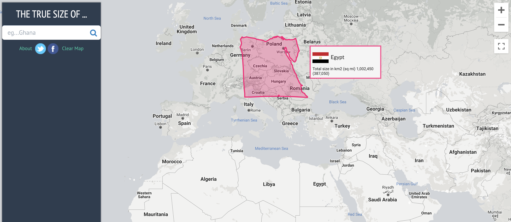
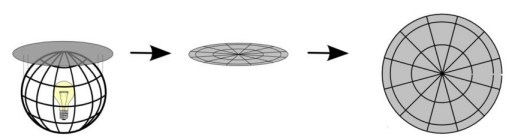
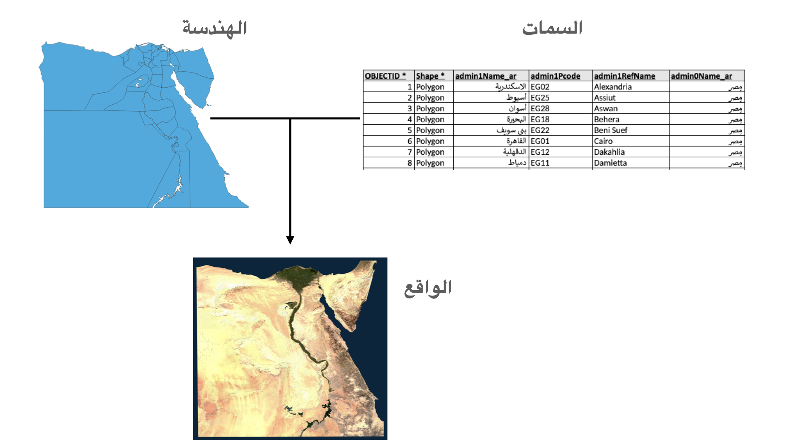

<h1>
الوحدة 2 - مقدمة بسيطة لمفاهيم نظم المعلومات الجغرافية
</h1>

المؤلف: بن هور- Ben Hur, Ali, Samah

<h2>
مقدمة تعليمية
</h2>

هذه الوحدة هي بمثابة مقدمة لطيفة للمفاهيم الجغرافية اللازمة للعمل مع نظم المعلومات الجغرافية (GIS). مع نهاية هذه الوحدة، يجب أن يكون المتعلم قد اكتسب المفاهيم التالية:

*    الإسقاط الخرائطي
*    النظم المرجعية للإحداثيات
*    أشكال البيانات المكانية (مثل المتجهات والنقطية )
*    أجزاء و مميزات نظم المعلومات الجغرافية
*    استخدامات نظم المعلومات الجغرافية
*   أمثلة على نظم المعلومات الجغرافية والتطبيقات الجغرافية المكانية الأخرى

بالإضافة إلى ذلك ، ستقدم هذه الوحدة أيضًا بعض المفاهيم الأساسية للبرامج المجانية والمفتوحة المصدر (FOSS) والبرامج المجانية والمفتوحة المصدر للتطبيقات الجغرافية المكانية (FOSS4G).

<h2>
الأدوات والموارد المطلوبة
</h2>

الأدوات والموارد المطلوبة لهذه الوحدة هي:

*    حاسوب
*   اتصال بالإنترنت

<h2>
المؤهلات المطلوبة
</h2>

*   المعرفة الأساسية لتشغيل حاسوب

<h2>
مصادر إضافية
</h2>

*   مقدمة بسيطة إلى نظم المعلومات الجغرافية
    * [https://docs.qgis.org/3.16/en/docs/gentle_gis_introduction/index.html](https://docs.qgis.org/3.16/en/docs/gentle_gis_introduction/index.html)

*   دليل مستخدم لبرنامج QGIS  
    * [https://docs.qgis.org/3.16/en/docs/user_manual/](https://docs.qgis.org/3.16/en/docs/user_manual/)

*   دليل تدريب على برنامج QGIS
    * [https://docs.qgis.org/3.16/en/docs/training_manual/index.html](https://docs.qgis.org/3.16/en/docs/training_manual/index.html)

*   موقع QGIS الإلكتروني
    * [https://qgis.org/en/site/](https://qgis.org/en/site/)

*   موقع OSGeo
    * [https://www.osgeo.org/](https://www.osgeo.org/)

*   موقع OSGeoLive الإلكتروني 
    * [https://live.osgeo.org/en/index.html](https://live.osgeo.org/en/index.html)

*   ما هي البرامج الحرّة؟ 
    * [https://www.gnu.org/philosophy/free-sw.en.html](https://www.gnu.org/philosophy/free-sw.en.html)

*   تعريف مفتوح المصدر
    * [https://opensource.org/osd](https://opensource.org/osd)

<h2>
مقدمة موضوعية
</h2>

لنبدأ بمثال:

من الممكن أن يكون أحدنا قد سمع عبارة "جميع الخرائط تكذب". أو رأى منشورًا على وسائل التواصل الاجتماعي يزعم أن "خريطة العالم التي عرفها طوال حياتك خاطئة!". في الحقيقة، ليس الأمر أن الخرائط هي التي تقدم لنا المعلومات الخاطئة أو المضللة، بل أن الخرائط لا يمكنها أبدًا أن تظهر لنا الحقيقة كاملة. أحد الأمثلة على ذلك هو الأحجام النسبية للبلدان.

"The True Size Of"  هو تطبيق رائع لرسم خرائط الويب. هذا التطبيق يكشف التشوّه الموجود في الأحجام النسبية للبلدان في واحدة من أكثر الخرائط استخداما وشيوعًا (تلك التي تستخدم إسقاط Mercator). يقوم هذا التطبيق أيضًا بعرض بعض الأمثلة على أنواع البيانات المكانية التي سنتعلم المزيد عنها في هذه الوحدة. حاول استخدام تطبيق الويب لمقارنة حجم بلدك مع الآخرين<a href="https://thetruesize.com">https://thetruesize.com</a>.

<h2>
تفصيل المفاهيم
</h2>

ولكن لماذا هذه الحالة؟ كما سنتعلم في هذه الوحدة، فإنّه من الصعب تمثيل الشكل الثلاثي الأبعاد للأرض على ورقة مسطحة. ولكن للقيام بتمثيل تقريبي لهذا الشكل يلجأ رسامو الخرائط إلى ما يسمى <strong>بإسقاط الخريطة</strong>. وهذا الأخير على الرّغم من أنّه يسمح بتمثيل النقاط الموجودة على سطح الأرض الثلاثي الأبعاد على سطح مستو إلاّ أنّه يضيف قليلا من ما يسمّى التشوّه أو التّحريف (distortion). هذا التشّوه قد يؤثر على شكل الأجسام، حجمها، اتجاهها، والمسافة منها وإليها عند تمثيلها على الخريطة. فعليّا، لا يوجد خريطة لا تحتوي على واحد على الأقل من هذه التشوهات المذكورة ولذلك لا يمكن لأي منها أبدًا أن تظهر الحقيقة الكاملة عن الأرض.

في تطبيق الويب الذي استخدمناه، تعدّ الخريطة الخلفية التي لا تغير الحجم (الرمادي) مثالاً على البيانات النقطية (raster data). البيانات النقطية تقوم بتمثيل العالم بطريقة مشابهة للصوّر الفوتوغرافية، فهي ترتكز على التمثيل القائم على البكسل (pixel-based representation). من جهة أخرى، فإن أشكال البلدان التي يمكن التنقل فيها هي أمثلة لبيانات المتجهات (vector data). وهذه الأخيرة على عكس البيانات النقطية، تقوم بتمثيل العالم باستخدام أجسام منفصلة مثل النقاط والخطوط والمضلعات.

<h2>
المحتوى الرّئيسى
</h2>

<h3>
عنوان المرحلة 1: الخرائط والإحداثيات
</h3>

بشكل عام عندما يفكر الناس في الأرض، فإنهم عادة ما يتخيلونها كتلة كروية من الأزرق والأخضر والأبيض والبني تطفو في الفضاء. لهذا السبب فإن الطريقة التقليدية المتعارف عليها لنمذجة الأرض هي من خلال استخدام الكرات.

<table>
  <tr>
   <td>     
   
   Figure 1. The Blue Marble-الرخام الأزرق (<a href="https://commons.wikimedia.org/wiki/Earth#/media/File:The_Blue_Marble.jpg">https://commons.wikimedia.org/wiki/Earth#/media/File:The_Blue_Marble.jpg</a>)
   </td>
   <td>  
   
   Figure 2.  de l'Isle globe (1765) (<a href="https://commons.wikimedia.org/wiki/Globe#/media/File:3quarter_globe.jpg">https://commons.wikimedia.org/wiki/Globe#/media/File:3quarter_globe.jpg</a>)
   </td>
  </tr>
</table>

وعلى الرغم من أن "الكرة الأرضية" قادرة على التقاط معظم خصائص الأرض، إلا أنها تعاني من مشكلتين رئيسيتين:

*   يصعب حمل و نقل الكرات الأرضية.
*    لا يمكن استخدام الكرات الأرضية إلا على نطاقات ضيقة (مثل البحث عن مواقع البلدان والمواقع النسبية للمدن وما إلى ذلك). يصبح هذا التمثيل الكروي شبه عديم الفائدة في الأنشطة التي نطاقات واسعة أو تفاصيل دقيقة (مثل التنقل في المدينة).

وهنا يأتي دور الخرائط كطريقة لمعالجة هذين العيبين للكرات الأرضية عن طريق تمثيل الأرض على سطح مستو. وهذا ما يجعل الخرائط قابلة للحمل والنقل ومناسبة للعديد من الاستخدامات الأخرى. و بالطبع لا تخلو الخرائط المسطحة من العيوب أيضا. فمن خلال عملية تحويل جسم ثلاثي الأبعاد (الكرة أرضية) إلى جسم ثنائي الأبعاد (الخريطة) ، يتم إدخال التشوهات كما ذكرنا سابقا بحيث يستحيل على الخريطة التقاط الخصائص المختلفة للأرض بشكل مثالي (مثل الأشكال والمساحات والاتجاهات).

<h4><strong>
الإسقاط الخرائطي<
</strong></h4>

يتم استخدام الإسقاط الخرائطي لتسوية الأرض (أو الكرة الأرضية) إلى مستوى (plane) من أجل إنشاء خريطة. خلال هذه العمليّة يتم إضافة بعض التحريف أو التشوّه على حقيقة الأرض.

يمكنك التفكير في الأرض على أنها برتقالة. إذا قمت بتقشير الجلد، يمكنك وضعه بشكل مسطح ولكن لا يمكنك أبدًا جعله مسطحًا تمامًا. ستواجه دائمًا إحدى المشكلات التالية:

*    القص - إطالة القشر (أو السطح) في اتجاه واحد أو أكثر
*    التمزق - انقسام أو تمزق القشر (أو السطح)
*    الضغط - تقصير أو تقلص القشر (أو السطح)

بسبب هذه المشاكل المذكورة، تحتوي كل خريطة على تشوّه أو تحريف في واحدة أو أكثر من الخصائص التالية:

*    الشكل
*   المساحة
*   المسافه
*   الإتّجاه

يستطيع الإسقاط الخرائطي أن يحافظ (بدون تشويه) على خاصية واحدة أو أكثر من هذه الخصائص ولكن ليس جميعها في نفس الوقت. كمحاولة لتعديل أو التقليل من التحريف على مختلف الخصائص يمكن العمل على إيجاد حل وسط حيث يتم موازنة التشوّهات وتقليلها بين الخصائص بشكل أن نحصل في النهاية على وضع مقبول لكلّ منها مع أخذ طبيعة كل خاصيّة بعين الإعتبار.

الخصائص الرئيسية مثل الشكل والمساحة هي خصائص متنافرة أو بمعنى آخر لا يمكن الحفاظ عليها في وقت واحد. لا يمكن أيضاً أن تكون الخصائص الثانوية مثل المسافة والاتجاه  صحيحة في كل مكان على الخريطة.

عند اختيار نوع الإسقاط الخرائطي إلى سيتمّ استخدامه، من المهمّ أن تضع في اعتبارك الغرض النّهائي من الخريطة. فمثلاً، إذا كنت ترغب في إجراء تحليلات متعلّقة بالمساحة، فمن الأفضل اختيار الإسقاط الخرائطي القادر على الحفاظ على هذه الخاصيّة تحديداً.

هناك العديد من التّصنيفات للإسقاطات الخرائطية. الأول يعتمد على الخصائص التي يحتفظون بها.

*   **"Conformal** or **Orthomorphic-** **إسقاطات الخرائط المطابقة أو المتعامدة الشكل"** هي تلك التي تحافظ على الشكل أو تطابق الزوايا. يستخدم هذا النّوع عادةً لأغراض الملاحة أو الأرصاد الجوية. يتم الحفاظ على الأشكال ولكن تتعرض المساحات للتشوّه. كلّما كبرت المساحة،كلّما زاد التشوّه.
*   **"Equal-area** or **Authalic-** **إسقاطات الخرائط ذات المساحة المتساوية"** هي تلك التي تحافظ على النسبة أو المساحات النسبية للأجسام على الخريطة. في هذا النوع من الإسقاط الخرائطي، كلّما كانت المساحة التي يتم رسمها أكبر، كلّما كانت أكثر دقة.
*   **"Equidistant- إسقاطات الخرائط المتساوية البعد"** هي تلك التي تحافظ على مسافة الخطوط الناشئة من نقطة أو نقطتين على الخريطة أو لها مقياس مناسب على طول خط واحد أو أكثر.
*    **"Azimuthal- إسقاطات الخرائط السمتيّة"** هي تلك التي تحافظ على الاتجاه من نقطة أو نقطتين على الخريطة. هذا النوع مفيد لرسم خرائط مسارات الطائرات و المراكب البحرية بين الموانئ.

يمكن لنوع واحد من هذه الإسقاطات أن يحافظ على أكثر من خاصية واحدة (على سبيل المثال ، إسقاط سمتي متساوي الأبعاد يحافظ على الاتجاه والمسافات من نقطة أو نقطتين على الخريطة) ولكن ليس جميعها كما سيتوضّح في الجدول أدناه.

<table>
  <tr>
   <td>
   </td>
   <td><strong>Conformal</strong>
   </td>
   <td><strong>Equal Area</strong>
   </td>
   <td><strong>Equidistant</strong>
   </td>
   <td><strong>Azimuthal</strong>
   </td>
  </tr>
  <tr>
   <td>
<strong>Conformal</strong>

   </td>
   <td>-
   </td>
   <td>N
   </td>
   <td>N
   </td>
   <td>Y
   </td>
  </tr>
  <tr>
   <td>
<strong>Equal Area</strong>

   </td>
   <td>N
   </td>
   <td>-
   </td>
   <td>N
   </td>
   <td>Y
   </td>
  </tr>
  <tr>
   <td>
<strong>Equidistant</strong>

   </td>
   <td>N
   </td>
   <td>N
   </td>
   <td>-
   </td>
   <td>Y
   </td>
  </tr>
  <tr>
   <td>
<strong>Azimuthal</strong>

   </td>
   <td>Y
   </td>
   <td>Y
   </td>
   <td>Y
   </td>
   <td>-
   </td>
  </tr>
</table>

Table: هل يمكن الحفاظ على أي خاصيتين عن طريق خريطة واحدة  في نفس الوقت ؟

يوجد تصنيف آخر للإسقاطات الخرائطية الذي لا يحافظ على أي من الخصائص المذكورة ولكنّه يعمل على تقليل جميع التشوهات في الخريطة معاً. يطلق على هذا النّوع اسم "<strong>Compromise</strong> or <strong>Minimum</strong> <strong>Error - </strong>الإسقاطات الخرائطية ذات التسوية أو الحد الأدنى من الخطأ "  (تسمى الخرائط التي لا تحافظ على الشكل ولا المساحة Aphylactic).

تتمثل إحدى طرق إظهار التشوّه ورؤيته في استخدام ما يُسمى Tissot’s indicatrix. يميز هذا المؤشر التشوهات المحلية باستخدام الدوائر ويظهر كيف يتم تحويل هذه الدوائر على الخريطة.

Figure 3.   Tissot’s indicatrix  إسقاط خرائطي مطابق باستخدام مؤشر   

 تظل الدوائر كما هي في جميع أنحاء الخريطة ولكن مساحتها تزداد كلما تحركت الدوائر من خط الاستواء باتجاه القطبين

Figure 4. Tissot’s indicatrix إسقاط خرائطي ذو مساحة متساوية مع مؤشر  

.تصبح الدوائر أشكال بيضاوية ولكن مساحتها تظل كما هي.

Figure 5. Tissot’s indicatrix إسقاط خرائطي متساوي البعد مع مؤشر. 

نلاحظ أن ارتفاعات الدوائر متساوية مما يعني الحفاظ على المقياس / المسافات على طول خطوط الطول.

Figure 6.Tissot’s indicatrix الإسقاط السمتي متساوي الأبعاد مع مؤشر 

نلاحظ أن جميع الدوائر تشير إلى مركز الخريطة وأن ارتفاعات الدوائر كلها متساوية

هناك طريقة أخرى لتصنيف الإسقاطات الخرائطية وهي عبر السطح القابل للتطوير "<strong>developable surface</strong>" الذي يتم استخدامه لإنشاء الخريطة. يصنّف السطح كسطح قابل للتطوير إذا أمكن تسويته دون إحداث أي تشوّهات. الأسطح الأكثر استخدامًا هي: الأسطوانات (Figure 7) ، والمخاريط  (Figure 8) ، والمستويات (Figure 9).

Figure 7. في الإسقاطات الأسطوانية تلتقي خطوط الطول والمتوازيات (خطوط العرض) بزوايا قائمة مع تساوي المسافات بين خطوط الطول.

Figure 8.الإسقاطات المخروطية فيها خطوط الطول مستقيمة و تتجه نحو نقطة واحدة في القطبين. المتوازيات تأخذ شكل أقواس.

Figure 9. الإسقاطات المستوية (شائعة الاستخدام في الإسقاطات السمتيّة) فيها خطوط الطول مستقيمة كما في للإسقاطات المخروطية لكن المتوازيات عبارة عن دوائر بدلاً من أقواس

هناك عدد لا يحصى من الأسطح القابلة للتطوير التي يمكن استخدامها لتحويل الكرة الأرضية إلى خريطة. قد تكون هذه الأسطح عبارة عن تباينًا في الأسطح الشائعة كما في حالة الإسقاطات الأسطوانية الزائفة والإسقاطات المخروطية الزائفة أو يمكن أن تكون أسطح فريدة ومختلفة تمامًا التي تستخدم <strong>عشروني الوجوه </strong>  “Dymaxion map” مثل   

(متعدد <strong>الأوجه </strong>مع 20 وجهًا) ، أو إسقاط Cahill-Keyes الذي يستخدم ثماني السطوح (متعدد <strong>الأوجه </strong>مع 8 <strong>أوجه</strong>).

يمكن أيضًا تصنيف الإسقاطات الخرائطية وفقًا لوضعيّة (its aspect - Figure 10) أو كيفية وضع السطح القابل للتطوير على الكرة الأرضية: قد يكون إما عادي أو عَرْضِيّ أو مائل (Normal, Transverse, or Oblique).

Figure 10. الإسقاط الخرائطي بحسب وضعيّة المسطّح القابل للتطوير 

<h3>
النظم المرجعية للإحداثيات 
</h3>

يستخدم النظام المرجعي الإحداثي (CRS-Coordinate Reference System) لتحديد موقع جسم ما على سطح الأرض من خلال استخدام الإحداثيات. ويمكن تصنيفه إلى قسمين:

*   **Geographic Coordinate Reference Systems - النّظم المرجعية للإحداثيات الجغرافية ** هي التي تستخدم درجات خطوط الطول والعرض كإحداثيات للإشارة إلى الموقع.
*   **Projected Coordinate Reference Systems - النّظم المرجعية للإحداثيات المسقطة **هي التي تستخدم وحدات خطية (مثل الأمتار والأقدام والكيلومترات) من الشرق والشمال كإحداثيات للإشارة إلى الموقع.

تعد معرفة الأنظمة المرجعية للإحداثيات أمرًا مهمًا لأنّه حتى عندما يكون لدينا خريطتان (أو طبقتان) تمثّلان نفس المنطقة، فأنّ إحداثيات المواقع فيهما ستكون مختلفة إذا كانت <strong>النّظم المرجعية للإحداثيات</strong> المستخدمة في كلّ منهما مختلفة.

مثال توضيحي:  لدينا خريطتان (أ) و (ب)  تظهران نفس المنطقة والمدى. الخريطة (أ) والخريطة (ب) هما في الأساس نفس الخريطة. الاختلاف الوحيد بينهما هو النظام المرجعي للإحداثيات المستخدم. تستخدم الخريطة (أ) النظام المرجعي X وتستخدم والخريطة (ب) النظام المرجعي Y. لنفترض أننا حصلنا على إحداثيات النقطة 1 ، وهي (10 ، 10) من الخريطة (أ). إذا نظرنا إلى الإحداثيات (10 ، 10) في الخريطة (ب)، فمن الممكن ألا تكون النقطة 1 موجودة في نفس هذه الإحداثيات لأن الخريطة (ب) تستخدم نظاماً مرجعياً مختلفًا للإحداثيات. وحتّى إذا قمنا بمطابقة الخرائط فوق بعضها البعض باستخدام مرجع مشترك، فلن تتطابق الميزات الموجودة في الخريطتين. هذه المعرفة بالنظم المرجعية للإحداثيات مهمة في أي نظام للمعلومات الجغرافية.

قبل QGIS 3.X ، كان لدى QGIS خيار لتفعيل ما يسمى "OTF" أو "On-The Fly Transformation". يسمح ذلك بإسقاط الطبقات ذات CRS المختلفة على لوحة الخريطة كما لو كانت تستخدم CRS موحّد. انطلاقاً من نسخة QGIS 3.X وما بعدها، أصبح هذا الخيار هو السلوك الافتراضي لـ QGIS. يقوم QGIS أيضًا بتنفيذ هذا الإجراء تلقائيًا لمهام المعالجة. هذا الأمر يعد في غاية الأهميّة لأنّه إذا لم تكن الطبقات قد استخدمت نفس ال-CRS ، فقد يتم التأثير سلباً على صحّة نتائج الاستعلامات المكانية والمعالجات مثل الوصلات المكانية والمقاطع وما إلى ذلك.

قد تلاحظ أن بعض الأنظمة المرجعية للإحداثيات يشار إليها برمز EPSG الخاص بها. يشير هذا الرمز إلى رمز CRS في مجموعة بيانات EPSG Geodetic Parameter Dataset ، وهي عبارة عن سجل للبيانات الجيوديسية والأنظمة <strong>ا</strong>لمرجعية المكانية والأشكال الإهليلجية للأرض وتحوّلات الإحداثيات ووحدات القياس ذات الصلة. تشير معظم نظم المعلومات الجغرافية، بما في ذلك QGIS ، إلى كود EPSG لتحديد الأنظمة المرجعية للإحداثيات، والإسقاطات، وإجراء التحوّلات بين هذه الأنظمة.

تتضمن أكواد EPSG الشائعة:

*   **EPSG: 4326** - WGS 84 ، نظام إحداثيات خطوط الطول / العرض الذي يعتمد على نظام تحديد المواقع العالمي (GPS) من بين آخرين.
*   **EPSG: 3857** - إسقاط Web Mercator المستخدم من قبل العديد من أدوات رسم الخرائط على شبكة الإنترنت مثل OpenStreetMap وخرائط Google
*   Universal Transverse Mercator (UTM) Zone WGS 84 - **EPSG 32653** . مناطق UTM منطقة 37N المستخدمة في مصر.
*   **EPSG:22992** - WGS 84 Egypt 1907 / Red Belt
*   **EPSG:4229** - النظام المرجعي المصري لعام ١٩٠٧ \

<h4><strong>
أسئلة الاختبار
</strong></h4>

1. ما هو نوع الإسقاط الخرائطي الأفضل في كلّ من الحالات التالية؟
    1. خريطة للأغراض العامة والتي يجب أن تبدو مرضية و سارّة
    2. خريطة توضّح تحليل لكل وحدة مساحة بين مواقع مختلفة
    3. خريطة تمثّل مقارنة منطقة عازلة بطول 10 كم من مواقع مختلفة
2. ما هو النوع الأفضل (الجغرافي أو المسقط) من النظم المرجعية للإحداثيات للاستخدام كلّ من الحالات التالية؟
    4. إظهار موقع النقاط باستخدام GPS
    5. حساب المسافة بين نقطتين
3. صواب أم خطأ - من الممكن الحفاظ على خصائص الخريطة التالية معًا في خريطة واحدة:
    6. المساحة والشكل
    7. المسافة والاتجاه

<h3>
عنوان المرحلة 2: أنواع البيانات المكانية
</h3>

المحتوى / البرنامج التعليمي

 يجب أن يكون نظام المعلومات الجغرافية (GIS) في جوهره قادرًا على نمذجة الأشياء والمعلومات والظواهر في العالم الحقيقي مثل حدود الأراضي والأنهار والطرق ودرجة الحرارة وما إلى ذلك. ويقوم بذلك من خلال نماذج البيانات المكانية.

تتكون نماذج البيانات المكانية من مكونين أساسيين بحيث يتم تشكيل نموذج عن الواقع عند الجمع بينهما. هذه المكونات هي:

*   الميزات المكانية أو الهندسة
*   السّمات

يوجد نموذجان رئيسيان للبيانات المكانية: النقطية والمتجه. على الرغم من أنه يمكن تمثيل أي جسم في العالم الحقيقي باستخدام أي نموذج من هذه النّماذج، إلا أن نموذج بيانات واحد منهما عادة ما يكون أفضل في تمثيل أجسام معيّنة في العالم الحقيقي مقارنةً بالآخر.

<h3>
البيانات النقطية
</h3>

ينصح بإستخدام البيانات النقطية عند الحاجة إلى تمثيل الظواهر المستمرة مثل الارتفاع أو درجة الحرارة. 

النقطية هي تمثيل قائم على الخلية أو البكسل لأجسام العالم الحقيقي المكونة من صفوف وأعمدة من الخلايا أو وحدات البكسل حيث تمثل كل خلية أو بكسل منطقة جغرافية (فكر في صورة فوتوغرافية أو رسم). تمثل قيمة كل خلية قيمة واحدة من السّمات في المنطقة الجغرافية المذكورة. يعتمد حجم المنطقة على الدقّة المكانية للخطوط النقطية.

تعتبر البيانات النقطية مفيدة جدًا لنمذجة ملاءمة الموقع حيث يمكنك الجمع بين البيانات النقطية عبر العمليات الحسابية (الجبر النقطي).

قد يحتوي البكسل النقطي على قيمة واحدة فقط في كل مرة. وبالتالي، فإن البيانات النقطية قادرة على نمذجة جسماّ أو ظاهرةً واحدةً فقط في كل مرة.

Figure 12.تتكون النقطيّة من وحدات بكسل متساوية الحجم في صفوف وأعمدة

<h3>
بيانات المتجه
</h3>

من الأفضل استخدام بيانات المتجه لتمثيل الكائنات المنفصلة.

تأتي بيانات المتجه في ثلاثة أشكال أساسية: النقطة والخط والمضلع. إنّه أكثر دقة من البيانات النقطية لأن النقاط والخطوط والمضلعات يتم تصميمها باستخدام إحداثيات محددة جيدًا مما يجعلها أفضل في تمثيل الأجسام المنفصلة مقارنةً بالنّقطيّة.

تستخدم بيانات المتجه بشكل شائع عند الحاجة إلى الأطوال والمساحات والمسافات الدقيقة. كما أنّها مفيدة أيضاً عند إجراء تحليل الشبكة (على سبيل المثال، العثور على أقصر طريق من نقطة إلى أخرى).

Figure 13.  تتكون بيانات المتجه من مجموعة ميزات وسماتها الخاصّة

على عكس وحدات البكسل النقطية، قد تحتوي ميزات المتّجه على أكثر من قيمة في المرة الواحدة. يتم تخزين هذه القيم كأعمدة في جدول البيانات. من ناحية أخرى، يتم تخزين كل ميزة على شكل صف.

<h4><strong>
أسئلة الاختبار
</strong></h4>

1. ما هو نوع البيانات التي يمكن أن تمثل الأشياء/الظواهر التالية بأفضل طريقة:
    1. الطرقات
    2. البيوت
    3. الكثافة السكانية
    4. أخطار الفيضانات

<h3>
عنوان المرحلة 3: نظام المعلومات الجغرافية (GIS)
</h3>

المحتوى / البرنامج التعليمي

جميع المستويات والقطاعات. اليوم أصبح لدينا أقمار صناعية وطائرات وحتى طائرات تجارية بدون طيار قادرة على التقاط كميات كبيرة من البيانات الخام على مساحات كبيرة وعلى مدى فترات طويلة من الزمن. هناك أيضًا مستشعرات تجمع معلومات الموقع مثل GPS والتطبيقات الأخرى على هواتفنا والإلكترونيات المحمولة.

في ظلّ كلّ هذه البيانات التي أصبحت متاحة بوفرة، فإنّ معرفة كيفية إدارتها وتحليلها وعرضها بشكل صحيح أصبح أمر ضروري جدّاً. وهنا تظهر أهمية أنظمة المعلومات الجغرافية المعروفة أكثر باسم GIS.

GIS هو أداة/إطار عمل/ نظام يسمح لنا بالعمل مع المعلومات الجغرافية (أو المكانية) والسّمات الخاصة بها (غير المكانية). ويجب أن يكون نظام المعلومات الجغرافية قادرًا على:

*   جمع البيانات المكانية أو تخزينها أو تحريرها أو معالجتها أو إدارتها بشكل عام.
*   تحليل البيانات باستخدام المكوّن المكاني (مكان وجود البيانات) أو السّمة (قيمة هذه البيانات).
*   تقديم البيانات والتحليلات على شكل معلومات ذات مغزى من خلال الخرائط والرسوم البيانية والمخططات ووسائل العرض الأخرى.

نظم المعلومات الجغرافية ليست مجرد أداة لرسم الخرائط. على الرغم من أن صنع الخرائط هو واحد من أهم وأشهر جوانب نظم المعلومات الجغرافية، إلا أنّه لا يزال مجرد جزء بسيط من أجزائه وميزاته. يمكننا أن ننظر إلى إطار GIS الحديث على أنه يتكون من:

*   البيانات - تشير إلى أجزاء المعلومات التي تستخدمها نظم المعلومات الجغرافية والتي قد تحتوي أو لا تحتوي على معلومات متعلقة بالموقع (مثل أسماء المتاجر ومواقع المتاجر).
*   التكنولوجيا - تشمل مكونات الأجهزة والبرامج الخاصة بنظم المعلومات الجغرافية - الآلات والأدوات وأجهزة الكمبيوتر المزودة بتطبيقات البرامج المستخدمة للقيام بأعمال جغرافية مكانية.
*   الأساليب والتحليل - تشير هذه إلى العلوم والرياضيات في نظم المعلومات الجغرافية التي تسمح لها بإجراء استعلامات وحسابات مكانية وغير مكانية.
*   التّصوّر - على الرغم من تشابهه مع الأساليب والتحليل، يمكن اعتبار التصوّر مكوّنًا منفصلاً عنه لأنّه يشير على وجه التحديد إلى الوسائل التي يستخدمها نظام المعلومات الجغرافية لتمثيل البيانات بيانياً. على الرغم من أنّ الخرائط هي الحالة الأكثر شيوعًا، إلّا أنّ هذا التمثيل البياني يشمل أيضًا الجداول والمخططات والرسوم البيانية ، إلخ.
*   الأشخاص - هؤلاء هم الأشخاص و/أو مجموعات الأشخاص الذين يشاركون في استخدام وتطوير وتدريس وصيانة نظم المعلومات الجغرافية.

جميع أجزاء إطار GIS الحديث - ابتداءاً من البيانات وصولاً إلى الأشخاص - جزء لا يتجزأ من ضمان نجاحه.

<h4><strong>
أسئلة الاختبار
</strong></h4>

1. صح أم خطأ:
    1. لا يمكن استخدام نظم المعلومات الجغرافية إلا مع البيانات الجغرافية المكانية.
    2. الخريطة هي دائمًا النتيجة عند استخدام GIS.
    3. تعلم نظم المعلومات الجغرافية صعب ومكلف.

<h4><strong>
عنوان المرحلة 4 (إضافي): برنامج مجاني ومفتوح المصدر للجغرافيا المكانية (FOSS4G)
</strong></h4>

المحتوى / البرنامج التعليمي

QGIS هو مثال على البرامج المجانية والمفتوحة المصدر لتطبيق (Geospatial FOSS4G). أمثلة أخرى على FOSS4G هي GRASS و PostGIS و GeoServer و GeoNode وما إلى ذلك. تعدّ تطبيقات FOSS4G أدوات رائعة للعمل ليس فقط لأنها موثوقة بل أيضًا لأنها مجانية ومفتوحة المصدر بالإضافة إلى كونها مرنة، قابلة للتخصيص حسب الحاجة، وتفرض عوائق أقل. يمكنك العثور على مجموعة متنوعة من التطبيقات الجغرافية المكانية المجانية والمفتوحة المصدر لكل حاجة ولكل جزء من المكدس الجغرافي المكاني.

 applications stack")

Figure 14.    عيّنة مكدّس جغرافي مكاني مفتوح المصدر أو FOSS4G من Simon Nitz ([https://twitter.com/si_nitz?lang=en](https://twitter.com/si_nitz?lang=en)))

<h4><strong>
البرمجيات الحرة
</strong></h4>

البرمجيات الحرة هي برمجيات تلتزم بالحريات الأساسية الأربع للبرمجيات الحرة ، وهي:

*   حرية تشغيل البرنامج كما يحلو لك ولأي غرض (الحرية 0).
*   حرية دراسة كيفية عمل البرنامج، وتغييره ليقوم بالحساب كما يحلو لك (الحرية 1). الوصول إلى الكُود المَصْدَرِيّ شرط مسبق لذلك.
*   حرية إعادة توزيع النسخ حتى تتمكن من مساعدة الآخرين (الحرية 2).
*   حرية توزيع نسخ من إصداراتك المعدلة للآخرين (الحرية 3). من خلال القيام بذلك، يمكنك منح المجتمع بأكمله فرصة للاستفادة من تعديلاتك. الوصول إلى الكُود المَصْدَرِيّ شرط مسبق لذلك.

<h4><strong>
المصدر المفتوح
</strong></h4>

البرامج مفتوحة المصدر هي تلك البرامج التي تؤمن تراخيص للإستخدام الخالي من حقوق الملكية وتسمح بإعادة استخدام البرنامج بالإضافة إلى الوصول إلى الكُود المَصْدَرِيّ. وفقًا للعرف، فإن تراخيص المصادر المفتوحة هي تلك التي تتوافق مع تعريف المصدر المفتوح كما هو منصوص عليه في مبادرة المصدر المفتوح. لا يضمن المصدر المفتوح الوصول المجاني إلى البرنامج وكود المصدر فحسب، بل يضمن أيضًا القدرة على إعادة توزيع البرنامج دون أي تكاليف إضافية.

نظرًا للطبيعة المفتوحة للبرامج مفتوحة المصدر، فهي أيضًا نموذجا رائعاً لتطوير البرامج حيث يتمتع الجميع بحرية التحديث والترقية والتعديل ومشاركة هذه التعديلات مع المجتمع.

<h4><strong>
OSGeo
</strong></h4>

هناك الكثير من التطبيقات الجغرافية المكانية مفتوحة المصدر، وأحيانًا يكون الجزء الأصعب هو معرفة كيفية البدء باستخدامها والاستفادة منها. لحسن الحظ ، فإن مؤسسة (Open Source Geospatial Foundation (OSGeo) (<a href="https://www.osgeo.org">https://www.osgeo.org</a>) موجودة للمساعدة في تعزيز التبني العالمي للتكنولوجيا الجغرافية المكانية المفتوحة ودعم تطوير هذه التقنيات.

<h4><strong>
إذا كنت تريد أن تعرف المزيد:
</strong></h4>

إذا كنت ترغب في محاولة استخدام تطبيقات FOSS4G بسرعة ، فيمكنك تجربة OSGeoLive <a href="https://live.osgeo.org/en/index.html">https://live.osgeo.org/en/index.html</a> وهو توزيع Linux (نظام تشغيل) يأتي مثبتًا مسبقًا مع QGIS و GRASS و وتطبيقات FOSS4G الأخرى.

