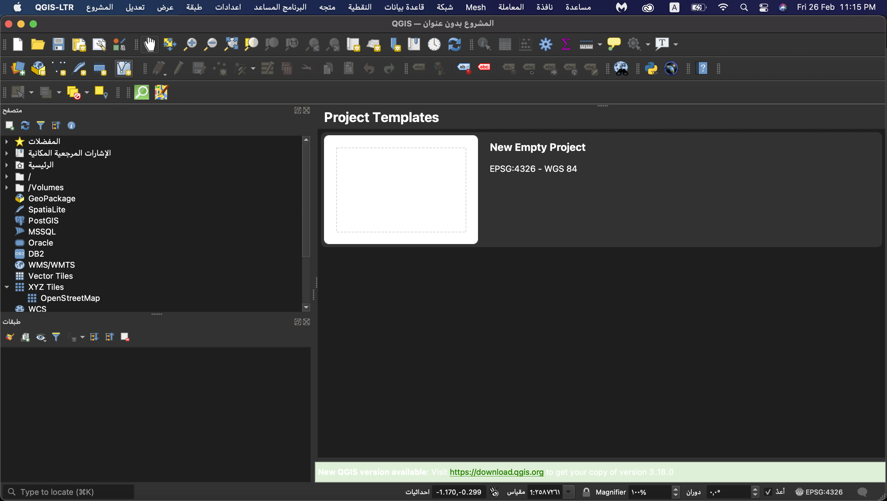
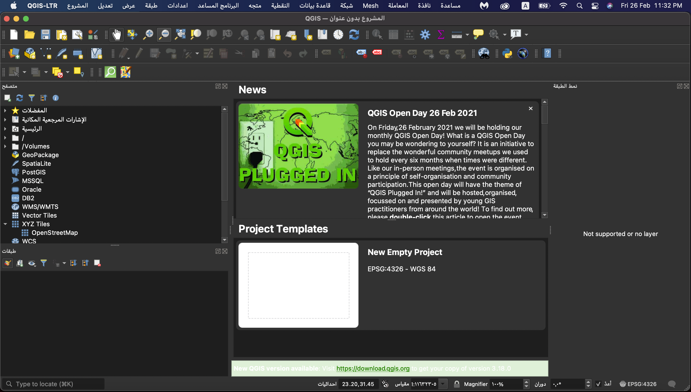
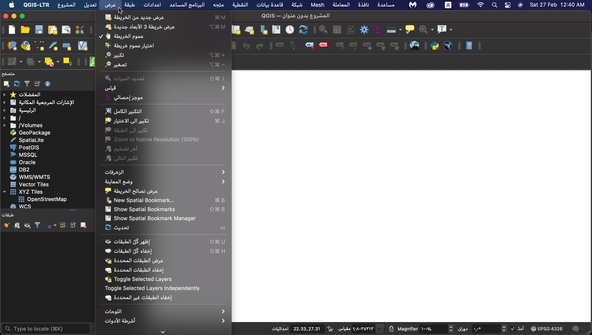
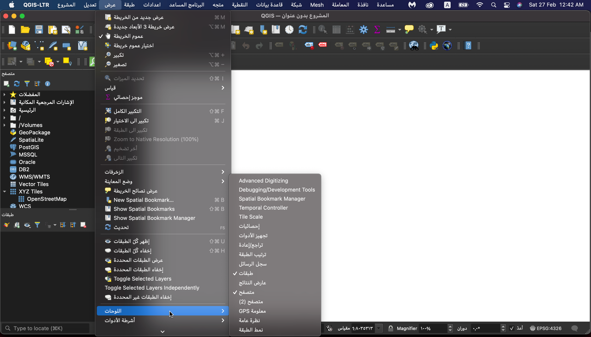
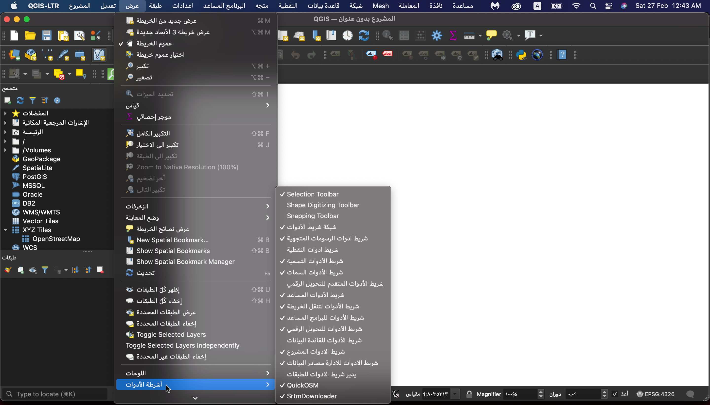
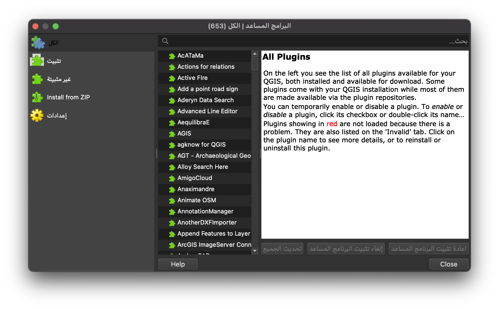
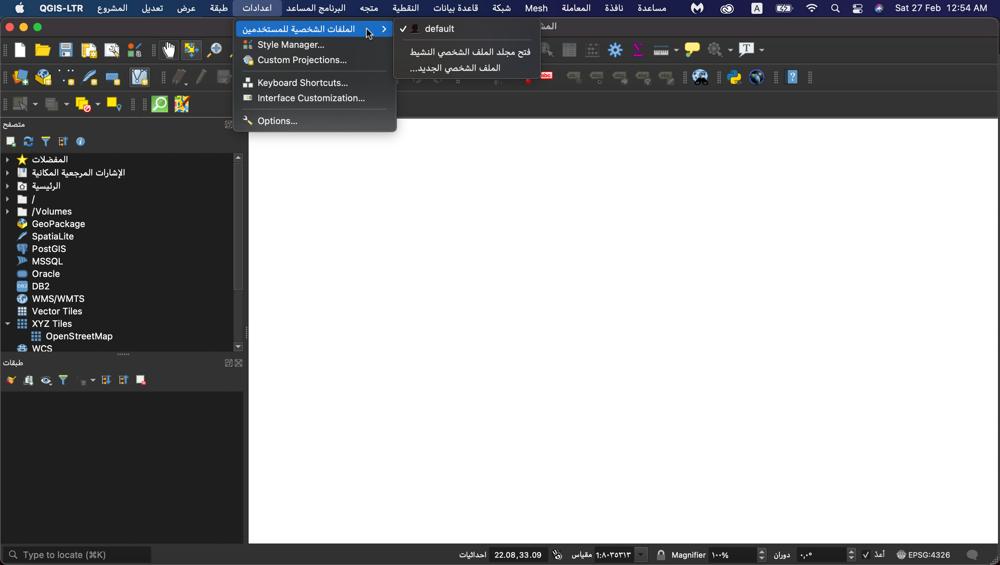
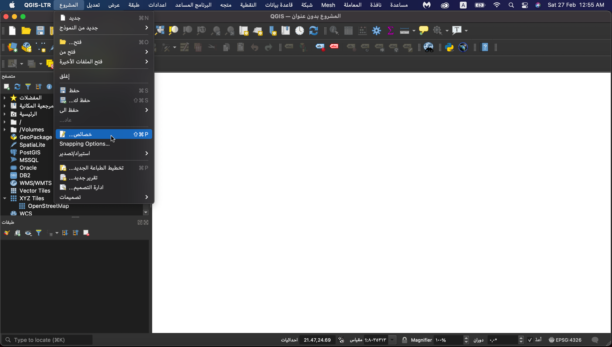
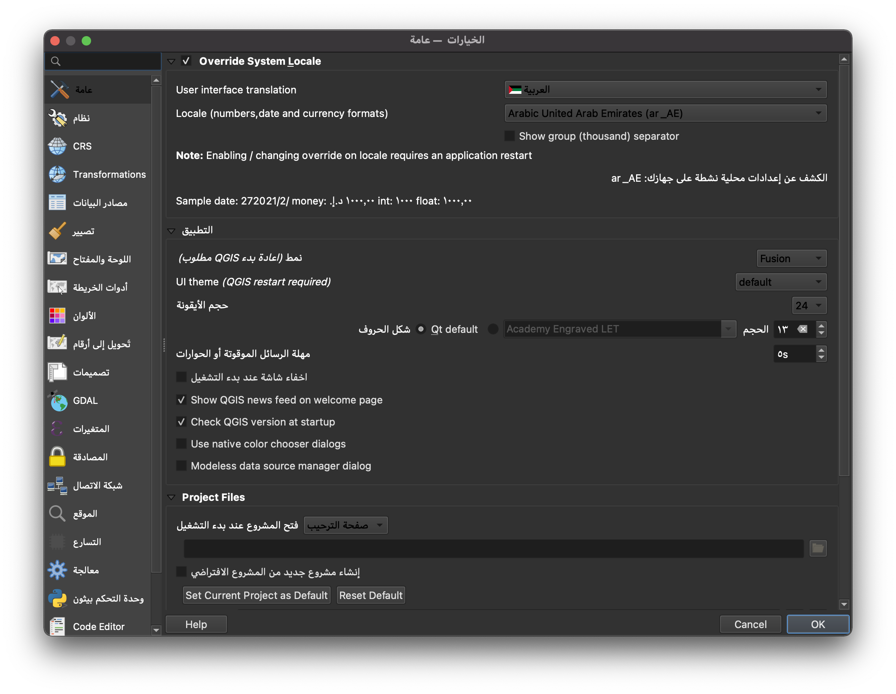
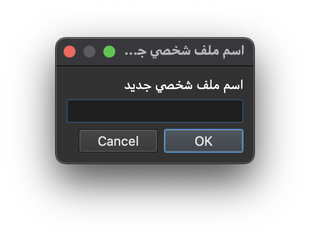

<h1>
الوحدة 1 - مقدمة بسيطة لمفاهيم نظم المعلومات الجغرافية
</h1>

المؤلف: بن هور- Ben Hur

<h2>
مقدمة إلى QGIS
</h2>

هذه الوحدة هي بمثابة مقدّمة لبرنامج QGIS. مع نهاية هذه الوحدة، يجب أن يكون المتعلم قد اكتسب المفاهيم التالية:

*   ما هو QGIS
*   واجهة تطبيق QGIS
*   إعدادات QGIS
*   ملحقات QGIS

يجب أيضاً أن يكون المتعلم قد اكتسب المفاهيم التالية:

*   كيفية تثبيت وفتح QGIS
*   الأجزاء والميزات المختلفة لواجهة تطبيق QGIS
*   كيفية تعديل تخطيط الواجهة والموضوع
*   إعدادات QGIS المختلفة وكيفية تغييرها وتأثير هذا التغيير على QGIS
*   ما هي ملفات تعريف المستخدمين وكيفية استخدامها
*   ما هي الملحقات وكيفية تثبيتها

تغطّي هذه الوحدة أيضًا بعض الفروق الدقيقة في QGIS وما يجعله فريداً أو مختلفاَ عن نظم المعلومات الجغرافية الأخرى مثل صيغة ملفات QGIS.

<h2>
الأدوات والموارد المطلوبة
</h2>

الأدوات والموارد المطلوبة لهذه الوحدة هي:

*    حاسوب
*   اتصال بالإنترنت
*   QGIS 3.16 مثبّت على الحاسوب ([https://qgis.org/en/site/forusers/download.html](https://qgis.org/en/site/forusers/download.html))

<h2>
المؤهلات المطلوبة
</h2>

*   المعرفة الأساسية لتشغيل حاسوب

<h2>
مصادر إضافية
</h2>

*   دليل مستخدم QGIS 
    * [https://docs.qgis.org/3.16/en/docs/user_manual](https://docs.qgis.org/3.16/en/docs/user_manual)

*   دليل تدريب QGIS 
    * [https://docs.qgis.org/3.16/en/docs/training_manual/index.html](https://docs.qgis.org/3.16/en/docs/training_manual/index.html)

<h2>
مقدمة موضوعية
</h2>

تُظهر الخريطة أدناه (<a href="https://flic.kr/p/2jFfGJP">https://flic.kr/p/2jFfGJP</a>) أجزاء من مدينة بوغوتا في كولومبيا تم صنعها على طراز "Starry Starry Night" لفنسنت فان جوخ بواسطة Andrés Felipe Lancheros Sánchez.

تُظهر هذه الخريطة التالية (<a href="https://flic.kr/p/2jAsphv">https://flic.kr/p/2jAsphv</a>) بيانات تتبع العاصفة من NOAA بين 1851 و 2020 بواسطة Fajr Alim.

وهذه الخريطة التالية (<a href="https://flic.kr/p/FA9TiR">https://flic.kr/p/FA9TiR</a>) هي خريطة لجزيرة Kerguelen بواسطة Heinrich Lingnau Schneider.

وهذه الأخيرة (<a href="https://flic.kr/p/2kqVzsg">https://flic.kr/p/2kqVzsg</a>) عبارة عن محاولات تسديد ميدانية ونقاط تم تسجيلها في كل محاولة خلال بطولة كرة السلة للرجال UAAP الموسم 81 في الفلبين بواسطة Ben Hur Pintor.

ما العامل المشترك بين كل هذه الخرائط؟ أولاً، تم رسم جميعها باستخدام تطبيق QGIS.

<h2>
تفصيل المفاهيم
</h2>

تم إنشاء جميع الخرائط الموضحة أعلاه باستخدام (QGIS (<a href="https://qgis.org/en/site">https://qgis.org/en/site</a>، وهو نظام معلومات جغرافية (GIS) مجّاني ومفتوح المصدر. يمكن استخدام QGIS مع جميع أنواع البيانات المكانية (مثل بيانات كرة السلة في المثال الأخير) وليس فقط مع البيانات الجغرافية المكانية المتعلقة بالأرض.

يسمح QGIS بإنشاء خرائط رائعة ومذهلة مثل الأمثلة المذكورة أعلاه لأنّه مجّاني ومفتوح المصدر ولديه إمكانات قوية في إدارة البيانات وتحليلها وعرضها.

<h2>
المحتوى الرّئيسى
</h2>

<h3>
عنوان المرحلة 1: مقدمة إلى QGIS وواجهة المستخدم الخاصّة به
</h3>

<h4><strong>
ما هو QGIS
</strong></h4>

**QGIS** ، المعروف باسم Quantum GIS قبل إصداره 2.X، هو نظام معلومات جغرافي مكاني (GIS) ناضج ومتعدد المنصّات ومجّاني ومفتوح المصدر.

إنّه نظام معلومات جغرافي جاهز للمؤسسات يحتوي على ميزات لجمع البيانات المكانية وغير المكانية وتخزينها وتحليلها وتقديمها وإدارتها. كما أنه يتكامل بشكل جيد مع التقنيات الجغرافية المكانية الأخرى الموجودة ويعمل كجزء لا يتجزأ من أي مكدس FOSS4G (برنامج مجاني ومفتوح المصدر للجغرافيا المكانية).

نظرًا لكونه متعدد المنصّات الأساسية (cross-platform)، يعمل QGIS على GNU / Linux و macOS و Windows وحتى Android.

<h4><strong>
دورة الإصدار والإصدارات المعدّلة
</strong></h4>

تتبع إصدارات QGIS وتطويراته جدولًا زمنيًا / خارطة طريق (<a href="https://www.qgis.org/en/site/getinvolved/development/roadmap.html">https://www.qgis.org/en/site/getinvolved/development/roadmap.html</a>).

يتم تحديد إصدار QGIS عبر ثلاثة أرقام (X.Y.Z). على سبيل المثال، QGIS 3.16.4.

*   يشير X إلى الإصدار الرئيسي. في هذه الحالة، QGIS 3.
*   يشير Y إلى نسخة الإصدار المعدّل. في هذه الحالة، الإصدار 16. نسخات الإصدار المعدّل تحدد دائمًا بأرقام زوجية حيث يتم حجز الأرقام الفردية لإصدارات التطوير.
*   يشير Z إلى إصدار ((Point Release (PR) لهذا الإصدار. بالنسبة إلى 3.16.4 ، هذا يعني أنه الإصدار الرابع من الإصدار 3.16.

هناك ثلاثة فروع رئيسية لـ QGIS يستطيع المستخدمين تثبيتها. هذه الفروع تشمل: الإصدار طويل الأجل (LTR) وفرع الإصدار الأخير (LR) وفرع التطوير.

*   يتم تسمية الإصدار طويل الأجل (LTR) بهذه الطريقة لأنه يتم صيانته وومتابعته  لإصلاح الأخطاء الواردة فيه حتى يتم إصدار LTR التالي. حاليًا، هذه المدة هي سنة واحدة (1). وفد بلغ LTR الحالي 3.16.4 اعتبارًا من فبراير 2021. ومن المقرر أن يتم استبداله بـ QGIS 3.22.4 في فبراير 2022.
*   أحدث إصدار (LR) يشير إلى إصدار QGIS الذي يحتوي على أجدد أو أحدث الميزات. يتم إصدار LR جديد كل أربعة (4) أشهر. على سبيل المثال، تم إصدار 3.18 LR جديدة في فبراير 2021. وسيتم إصدار LR التالي (3.20) بعد 4 أشهر من الآن في يونيو 2021. حاليًا، تصبح كل LR الثالثة هي LTR التالية. على سبيل المثال، LTR في فبراير 2021 هو الإصدار 3.16. LR الثالث من 3.16 هو 3.22 وبالتالي فإن LTR التالي سيعتمد على نسخة الإصدار 3.22.
*   يعتمد التطوير/ Nightly على أحدث إصدار من الكُود المَصْدَرِيّ ل QGIS ولكنه مفيد فقط إذا كنت ترغب في اختبار QGIS أو تصحيحه أو المساعدة في تطويره.

إذاً ما هو الإصدار الذي يجب أن نستخدمه؟ هذا يعتمد على حاجة كل شخص من البرنامج. إذا كنت بحاجة إلى إصدار يتم الاحتفاظ به لفترة أطول ولا تحتاج بالضرورة إلى ميزات جديدة عند إصدارها، فقد يكون إصدار LTR مناسبًا لك. إذا كنت تريد الحصول على أحدث الميزات ولا تمانع في إجراء ترقية كل بضعة أشهر، فقد يكون إصدار LR مناسبًا لك. أحيانًا يكون من الجيد أيضًا إلقاء نظرة على التطوير أو الإصدارات الليلية خاصّة إذا كنت مهتمًا أو متحمسًا بشأن الميزات القادمة في QGIS.

للمزيد من المعلومات قم بزيارة: <a href="https://bnhr.xyz/2020/10/26/about-qgis-versions-release-cycle-english.html">https://bnhr.xyz/2020/10/26/about-qgis-versions-release-cycle-english.html</a>

<h4><strong>
أمثلة على خرائط QGIS في الطّبيعة
</strong></h4>

Figure 1.QGIS عرض خرائط 

لمزيد من الخرائط التي تم إنشاؤها باستخدام QGIS ، يمكنك زيارة: <a href="https://www.flickr.com/groups/2244553@N22/pool/with/50355460063/">https://www.flickr.com/groups/2244553@N22/pool/with/50355460063</a>

<h4><strong>
تثبيت QGIS
</strong></h4>

QGIS هو نظام متعدد المنصّات ويعمل على Linux و Windows و macOS. نظرًا لكونه مفتوح المصدر، يمكننا إنشاء QGIS وتثبيته من الكود المصدري المتاح على <a href="https://github.com/qgis/QGIS">https://github.com/qgis/QGIS</a>.

تتوفر أيضًا إرشادات التثبيت والتثبيت على <a href="https://qgis.org/en/site/forusers/download.html">https://qgis.org/en/site/forusers/download.html</a> أو <a href="https://qgis.org/en/site/forusers/alldownloads.html">https://qgis.org/en/site/forusers/alldownloads.html</a>.

بالنسبة إلى<strong> Linux (أو GNU / Linux)</strong>، يتوفر QGIS عادةً من ال distribution’s package manager الخاص بك. لمستخدمي Debian / Ubuntu، لدى QGIS مستودعات لفروع LR و LTR و Development بالإضافة إلى إصدارات QGIS مع تبعيات من ubuntugis-unstable PPA. برنامج QGIS متاح أيضًا كحزمة Flatpak أو في Conda.

بالنسبة لنظام التشغيل <strong>Windows</strong>، يمكن للمستخدمين الاختيار بين مثبت الشبكة OSGeo4W أو المثبتات المستقلة. هناك أداة تثبيت مستقلة لإصدار LTR و LR.

أدوات التثبيت المستقلة هي الأسهل في التثبيت ويوصى بها للمبتدئين. يمكن تثبيت إصدارات متعددة من QGIS على جهاز الكمبيوتر الخاص بك في نفس الوقت. هذا يعني أنه يمكنك تثبيت إصدارات QGIS 3.16 و 3.18 معاً.

يعد برنامج OSGeo4W Network Installer أكثر تقدمًا وتعقيدًا من المثبتات المستقلة ولكنه يمنحك أيضًا القدرة على تحديث إصدار QGIS وترقيته في مكانه، مما يعني أنك لن تحتاج إلى إلغاء تثبيت إصدار قديم إذا كنت تريد تثبيت إصدار أحدث منه.

في بعض الحالات ، قد تحتاج إلى حقوق المسؤول (administrator rights) لتثبيت QGIS، لذا إذا كنت تقوم بتثبيته على جهاز كمبيوتر لا تتمتع فيه بحقوق المسؤول، فقد تحتاج إلى مطالبة مسؤول تكنولوجيا المعلومات أو مسؤول المكتب بتثبيت QGIS نيابة عنك.

التثبيت في Windows يأتي أيضًا مع QGIS مع GRASS (نظام GIS مجاني ومفتوح المصدر آخر).

لاحظ أن QGIS <a href="https://blog.qgis.org/2020/10/15/phasing-out-32-bit-support-in-qgis/">يزيل ببطء دعم 32 بت لنظام التشغيل Windows</a>، لذا فمن الأفضل تثبيت QGIS على جهاز كمبيوتر يعمل بنظام تشغيل 64 بت.

بالنسبة لنظام <strong>macOS</strong>، هناك أدوات تثبيت موقّعة ورسمية شاملة لنظام macOS High Sierra 10.13 والإصدارات الأحدث. لم يتم توثيق QGIS بعد وفقًا لما تتطلبه قواعد أمان macOS Catalina 10.15. عند التشغيل لأول مرة، يرجى النقر بزر الماوس الأيمن على أيقونة تطبيق QGIS، والضغط باستمرار على مفتاح الخيار، ثم اختيار فتح.

<h4><strong>
أجزاء واجهة المستخدم في QGIS
</strong></h4>

بعد تثبيت QGIS ، يمكنك تشغيله أو فتحه كما تفعل مع أي برنامج في جهاز الكمبيوتر الخاص بك. عند فتح QGIS ، سيتم استقبالك بواجهة المستخدم الافتراضية (UI) والتي ستبدو كما يلي:

Figure 2. عند تثبيت حديث QGIS واجهة

هناك ستة أجزاء رئيسية لواجهة مستخدم QGIS - شريط القائمة Menu Bar، ولوحة الخريطة Map Canvas، وأشرطة الأدوات Toolbars، واللوحات Panels، وشريط الحالة Status Bar، ومحدد الموقع Locator. 

في وسط واجهة المستخدم توجد لوحة خريطة حيث يمكن وضع اللوحات وأشرطة الأدوات حولها. يمكن أيضًا إرساء اللوحات معًا لإنشاء لوحة متعددة علامات التبويب multi-tab Panel. هناك أيضًا أجزاء أخرى من واجهة المستخدم مثل واجهة Python ونوافذ الملحقات الإضافية وما إلى ذلك.

<strong>شريط القائمة Menu Bar</strong> - شريط القوائم عبارة عن قائمة هرمية بسيطة توفر الوصول إلى وظائف وأوامر QGIS. عادة ما يكون موجودًا في الجزء العلوي من واجهة المستخدم.

<strong>لوحة الخريطة Map Canvas</strong> - لوحة الخريطة هي المكان الذي تظهر فيه الطبقات المحمّلة في QGIS. هذا هو المكان الذي تنعكس فيه عوامل التصفية والتحديد والترميز التي أنشأها المستخدم. يمكن أن توجد أكثر من لوحة خريطة واحدة في أي وقت. 

يمكن للمستخدم تكبير، تحريك، وحتى تدوير لوحة الخريطة. يمكن أن تعرض لوحة الخريطة أيضًا بيانات ثلاثية الأبعاد.

<strong>أشرطة الأدوات Toolbars</strong> - تعرض أشرطة الأدوات أزرار النقر والتشغيل. تتيح أشرطة الأدوات سهولة الوصول إلى أوامر QGIS والميزات والمكوّنات الإضافية وما إلى ذلك. يمكن نقلها و إرسائها حول لوحة الخريطة. يمكن العثور على قائمة أشرطة الأدوات وتنشيطها وإلغاء تنشيطها من شريط القائمة تحت عرض -> أشرطة الأدوات  <strong>View -> Toolbars</strong>. من أمثلة أشرطة الأدوات، شريط أدوات السمات Attributes Toolbar وشريط أدوات التحويل الرقمي Digitizing Toolbar.

<strong>اللوحات Panels</strong>- تشبه اللوحات أشرطة الأدوات ولكنها توفر واجهة لوظائف وميزات أكثر تعقيدًا بدلاً من الأزرار. تعد لوحة الطبقات Layer Panel ولوحة المتصفح Browser Panel أمثلة على ما تقدّمه اللوحات. وعلى غرار أشرطة الأدوات، يمكن نقل اللوحات وتثبيتها حول لوحة الخريطة. ويمكن العثور على قائمة اللوحات وتنشيطها وإلغاء تنشيطها من شريط القائمة تحت عرض -> اللوحات <strong>View -> Panels</strong>.

<strong>شريط الحالة Status Bar</strong> - يتواجد شريط الحالة عموماً في الجزء السفلي من واجهة المستخدم ويعرض المعلومات ذات الصلة مثل CRS والمقياس والإشعارات وما إلى ذلك.

<strong>شريط محدد المواقع Locator Bar</strong> - يوجد شريط محدد المواقع في الزاوية اليسرى السفلية من واجهة QGIS. يتيح للمستخدم الوصول بسهولة إلى الطبقات والحقول وخوارزميات المعالجة وأشياء أخرى في QGIS. وهو واحد من أقوى ميزات QGIS.

Figure 3.QGIS أجزاء من واجهة 

إحدى ميزات QGIS هي قابلية التخصيص التي يوفرها لمستخدميه. تبدأ قابلية التخصيص هذه من واجهة المستخدم. من خلال تعديل بعض الإعدادات ونقل بعض أجزاء الواجهة، يمكننا الحصول على QGIS يشبه الموجود أدناه:

Figure 4.  مع بعض التخصيصات QGIS واجهة    

<h4><strong>
البرنامج التعليمي / التمرين 1: تغيير شكل وتخطيط أو تصميم واجهة QGIS
</strong></h4>

1. افتح **QGIS**
2. انقر على قائمة العرض (**View** menu)

3. لاحظ قائمة اللوحات (**Panels** menu)

4. لاحظ قائمة أشرطة الأدوات (**Toolbars** menu)

5.  قم بإختيار أشرطة الأدوات واللوحات التي تريد إظهارها في واجهة المستخدم. تتضمن بعض اللوحات المفيدة: "Layer Styling and Processing Toolbox".
6. انقل أشرطة الأدوات واللوحات إلى الأماكن المناسبة بالنّسبة لك.

**إعادة ضبط واجهة QGIS إلى شكلها الأساسي/الإفتراضي**

لإعادة ضبط شكل وتخطيط أو تصميم واجهة QGIS إلى الإعدادات الإفتراضية، انتقل إلى: الإعدادات <strong>Settings </strong> -> الخيارات <strong>Options </strong>-> علامة تبويب النظام <strong>System Tab</strong>-> الإعدادات <strong>Settings </strong>-> زر إعادة التعيين <strong>Reset</strong> button وأعد تشغيل QGIS

<h4><strong>
أسئلة الاختبار
</strong></h4>

1. صح أم خطأ:
    1. يمكنك الحصول على لوحات خرائط متعددة multiple map canvases.
    2. يمكنك نقل شريط الحالة Status Bar إلى موقع مختلف.
    3. يمكنك فقط وضع اللوحات Panels على الجانب الأيسر أو الأيمن من لوحة الخريطة Map Canvas.

<h3>
عنوان المرحلة 2: ملحقات QGIS
</h3>

<h4><strong>
إدارة وتثبيت الملحقات
</strong></h4>

يتصل مربع حوار إدارة الملحقات وتثبيتها بمستودع البرنامج المساعد الرسمي QGIS  لجلب الملحقات المتاحة لإصدار QGIS الخاص بك (أو أي مستودع آخر تشير إليه في الإعدادات Settings Tab). يحتوي مربع حوار إدارة الملحقات وتثبيتها على خمس (5) علامات تبويب:

*   **علامة التبويب "الكل" All Tab** - تعرض كل الملحقات المتاحة لإصدار QGIS الخاص بك بما في ذلك تلك المثبّتة حاليّاً على جهازك
*   **علامة التبويب المثبّتة** **Installed Tab**- تظهر فقط الملحقات المثبّتة على جهازك حاليّاً
*   **علامة تبويب الغير مثبّتة** **Not installed Tab**- تُظهر الملحقات غير المثبتة على جهازك
*   **التثبيت من Install from ZIP - ZIP** - يسمح لك بتثبيت الملحقات من ملف ZIP
*   **علامة تبويب الإعدادات** **Settings Tab **- تعطيك القدرة على التحكّم في الفارق الزّمني بين عمليّات التحقّق من  وجود تحديثات للملحقات، والقدرة على الإختيار سواء كنت تريد تضمين الإضافات التجريبية والمستبدلة أم لا ، أو إضافة / تغيير المستودع الذي يتمّ جلب الملحقات منه.

إذا تمت الإشارة ألى الملحق الذي تبحث عنه على أنّه تجريبي أو مستبدل، فستحتاج إلى التحقق من الملحقات التجريبية <strong>Show experimental plugins</strong> والملحقات المستبدلة <strong>Show deprecated</strong> من علامة تبويب الإعدادات.

يَسمح لك شريط البحث بالبحث عن الملحقات الموجودة في مستودع أو مستودعات الملحقات التي سبق واتّصلت بها.

Figure 6. مربع حوار إدارة الملحقات وتثبيتها

<h4><strong>
البرنامج التعليمي / التمرين 2: تثبيت ملحقات QGIS
</strong></h4>

1. افتح "**Manage and Install Plugins dialog**" من الإضافات **Plugins-> إدارة وتثبيت الملحقات Manage and Install Plugins** من شريط القائمة Menu Bar. سيؤدي هذا إلى فتح مربع حوار إدارة وتثبيت الملحقات.

2. قم بتثبيت الملحقات التالية عبر البحث عنها في علامة التبويب "الكلّ" All Tab والنقر فوق "تثبيت الملحق **Install Plugin**" في الركن الأيمن السفلي من مربع الحوار "إدارة وتثبيت الملحقات".

    - حافظ طبقة الذاكرة - Memory Layer Saver

    - QuickOSM 

3. تحقق مما إذا تمّ تثبيت الملحقات بنجاح. يجب أن يكون الملحق Memory Layer Saver متاحًا في Plugins -> Memory Layer Saver في شريط القائمة بينما يجب أن يكون الملحق QuickOSM متاحًا من Vector -> QuickOSM في شريط القائمة.

<h4><strong>
أسئلة الاختبار
</strong></h4>

1. صح أم خطأ:
    1. يمكنك إزالة أو إلغاء تثبيت الملحقات الأساسية Core plugins .
    2. يمكنك إضافة ملحقات غير موجودة في مستودع البرنامج المساعد QGIS الرسمي.

<h3>
عنوان المرحلة 3: إعدادات QGIS
</h3>

<h4><strong>
إعدادات النظام والمشروع
</strong></h4>

تسمح لك إعدادات QGIS بتعديل وإدارة العديد من الأشياء المتعلّقة بالبرنامج مثل ملفات تعريف المستخدم و الأنماط والنظم المرجعية للإحداثيات واختصارات لوحة المفاتيح وواجهة المستخدم والألوان الافتراضية وما إلى ذلك. يمكن العثور على إعدادات النظام في قائمة الإعدادات وستكون الخيارات المستخدمة هي الإعدادات الافتراضية أو الأساسية في QGIS ما لم يتم تجاوزها أو التعديل عليها من خلال إعدادات المشروع. يمكن العثورعلى إعدادات المشروع في Project -> Properties وتتعلق هذه الإعدادات أو الخصائص بالمشروع الحالي و تتجاوز قيمها الإعدادات الافتراضية أو الأساسية للنظام.

Figure 7. إعدادات النظام

Figure 8. خصائص المشروع

<h4><strong>
تغيير موضوع QGIS
</strong></h4>

يمكنك تغيير شكل وأسلوب QGIS ضمن الإعدادات -> الخيارات -> علامة التبويب العامة (<strong>Settings -> Options -> General</strong> Tab). يمكنك الاختيار من بين ثلاثة سمات - افتراضي default، ومزج الرمادي Blend of Gray، ورسم خرائط ليلي Night Mapping. يمكنك أيضًا تغيير حجم الأيقونات والخط المستخدم بواسطة QGIS وغيرها من الإعدادات الافتراضية للنظام.

Figure 9.QGIS الإعدادات العامة لـ 

قد تحتاج بعض الإعدادات في QGIS إلى إعادة تشغيل التطبيق حتى يتم تفعيلها.

<h4><strong>
ملفات تعريف المستخدم
</strong></h4>

تقدم مفهوم ملفات تعريف مستخدمي QGIS  في QGIS 3.X.

ملف تعريف المستخدم هو مجموعة من الإعدادات الخاصة بالملحقات المثبّتة وأشرطة الأدوات المفعّلة وترتيب واجهة المستخدم والإعدادات الأخرى. يأتي QGIS مع ملف تعريف مستخدم افتراضي يسمى "افتراضي default". تسمح ملفات تعريف المستخدمين للمستخدم بإنشاء إعدادات مختلفة لتحليلات محددة (على سبيل المثال، ملف تعريف مستخدم خاص بإدارة الموارد المائية، أو رقمنة البيانات، أو رسم الخرائط، وما إلى ذلك) ، أو مشاريع معينة ، أو حتى العملاء.

يمكن إنشاء ملفات تعريف المستخدمين والوصول إليها من شريط القائمة ضمن: الإعدادات -> ملفات تعريف المستخدمين <strong>Settings -> User Profiles</strong>.

يَظهر ملف تعريف المستخدم النّشط مع [ملف تعريف المستخدم] في شريط العنوان.

Figure 10. الوصول إلى ملفات تعريف المستخدم

يتم حفظ ملفات تعريف المستخدمين في دليل على جهاز الكمبيوتر الخاص بك ويمكن الوصول إليه بالنّقر فوق الإعدادات -> ملفات تعريف المستخدمين -> فتح ملف تعريف المستخدم النشط <strong>Settings -> User Profiles -> Open Active Profile Folder</strong>.

<h4><strong>
البرنامج التعليمي / التمرين 3: إنشاء ملف تعريف مستخدم
</strong></h4>

1. اذهب إلى الإعدادات -> ملفات تعريف المستخدمين -> ملف تعريف جديد  **Settings -> User Profiles -> New Profile**.

2. أدخل اسم المستخدم الجديد الخاص بك.

3. يجب أن تفتح نافذة QGIS جديدة بملف تعريف المستخدم الجديد الخاص بك. لاحظ أن اسم ملف التعريف الخاص بك يظهر في شريط عنوان QGIS.

4. هل لاحظت أي اختلاف في ملف تعريف المستخدم الجديد؟ تحقق من واجهة المستخدم والملحقات وإعدادات الملف الشخصي القديم والملف الشخصي الجديد الذي أنشأته.

<h4><strong>
أسئلة الاختبار
</strong></h4>

1. صح أم خطأ:
    1. يمكنك الحصول على ملف تعريف مستخدم واحد فقط في QGIS.
    2. لا يمكنك تجاوز إعدادات وخصائص النظام.

<h3>
عنوان المرحلة 4: صيغ ملفات برنامج QGIS
</h3>

<h4><strong>
ملف مشروع QGIS (QGS/QGZ)
</strong></h4>

مشاريع QGIS بالنسبة لـ QGIS مثل ملفات .mxd بالنسبة لـ ArcMap. تأتي هذه الملفات إما كـ <strong>QGS </strong>*.qgs أو <strong>QGZ </strong>*.qgz. الاختلاف الرئيسي بين الأخيرين هو أن صيغة QGZ هي أرشيف مضغوط (zip) يحتوي على ملف QGS وملف QGD. أمّا صيغة QGS هي تنسيق XML لتخزين مشاريع QGIS. ملف QGD هو قاعدة بيانات sqlite المرتبطة بمشروع QGIS الذي يحتوي على بيانات مساعدة للمشروع. إذا لم تكن هناك بيانات مساعدة، فسيكون ملف QGD فارغًا.

يحتوي ملف مشروع QGIS على كل ما هو مطلوب لتخزين مشروع QGIS، بما في ذلك:

*   عنوان المشروع
*   مشروع CRS
*   شجرة الطّبقات
*   إعدادات التَصْوِير
*   علاقات
*   مدى لوحة الخريطة
*   نماذج المشروع
*   مفتاح الخريطة
*   أحواض mapview (ثنائية وثلاثية الأبعاد)
*   الطّبقات ذات الارتباطات بمجموعات البيانات الأساسية (مصادر البيانات) وخصائص الطبقة الأخرى بما في ذلك المدى و SRS والصلات والأنماط والعارض ووضع المزج والعتامة والمزيد.
*   خصائص المشروع

يمكن حفظ ملفات مشروع QGIS في GeoPackage أو قاعدة بيانات PostGIS. تصبح  عملية مشاركة مشروعات QGIS مع الآخرين أسهل عند حفظ ملف المشروع مع ملف النّمط والطّبقات المقابلة معاً في GeoPackage واحد.

<h4><strong>
تعريف طبقة QGIS
</strong></h4>

إنّ ملف تعريف طبقة QGIS المعروف بـ <strong>QLR</strong> هو ملف XML يحتوي على مؤشر لمصدر بيانات الطبقة بالإضافة إلى معلومات النمط لهذه الطّبقة. حاليًا، يتوافق ملف QLR مع طبقة واحدة فقط.

طريقة استخدام هذا الملف بسيطة: أن يكون لديك ملف واحد لفتح مصدر بيانات ما وإحضار جميع معلومات النمط ذات الصلة. تتيح لك ملفات QLR أيضًا إخفاء مصدر البيانات الأساسي في ملف يسهل فتحه.

مثال على استخدام QLR هو لفتح طبقة من قاعدة بيانات PostGIS. بدلاً من الاتصال بقاعدة البيانات والعثور على الطبقة وتطبيق عامل التصفية، يمكنك فقط فتح ملف .qlr يشير إلى طبقة PostGIS الصحيحة بنمطها وعامل التصفية الخاص بها.

<h4><strong>
ملف نمط QGIS 
</strong></h4>

ملف QML هو تنسيق XML لتخزين أنماط الطبقة. يحتوي ملف QML) .qml) على جميع المعلومات التي تخبر QGIS بكيفية عرض الأشكال الهندسية للسّمات والتي تتضمن تعريفات الرموز والأحجام والدورات ووضع العلامات والتعتيم ووضع المزج والمزيد.

يجب أن يحمل ملف .qml نفس اسم مصدر البيانات المرتبط به. وعندما يكون ملف النمط في نفس الدليل أو المجلد مع مصدر البيانات، سيؤدي تحميل مصدر البيانات إلى تحميل نمطه تلقائيًا كما هو محدد في ملف .qml.

على سبيل المثال، إذا كان لديك GeoJSON مسماة regions.geojson وملف QML مسمى regions.qml ، فإن تحميلregions.geojson في QGIS سيطبق الأنماط المحددة في regions.qml في الطبقة المحمّلة.

عند استخدام GeoPackages) .gpkg) ، غالبًا ما لا تكون هناك حاجة إلى ملف .qml نظرًا لأنه يمكنك حفظ نمط الطبقة مباشرة في الحزمة الجيولوجية.

<h3>
إذا كنت تريد أن تعرف المزيد:
</h3>

يمكنك محاولة إنشاء ملحق QGIS الإضافي الخاص بك. إذا لم يكن هناك ملحق إضافي يفعل ما تريد، فيمكنك دائمًا إنشاء ملحق بنفسك.

يعد **Plugin Builder** ملحقاً إضافيًا يقوم بإنشاء نموذج يمكن أن يكون بمثابة نقطة انطلاق لتطوير ملحق QGIS حتى لا تضطر إلى إنشاء واحد من البداية. يمكنك تثبيته من مربع حوار إدارة الملحقات وتثبيتها.

بالطبع، يمكنك دائمًا إنشاء ملحق من البداية. إذا كنت مهتمًا بإنشاء الملحق الخاص بك، فيمكنك التحقق من وثائق QGIS الرسمية.

([https://documentation.qgis.org/](https://documentation.qgis.org/))

بالنسبة لملحقات Python الإضافية، من الجيد الاطلاع على PyQGIS Developer Cookbook ([https://docs.qgis.org/3.16/en/docs/pyqgis_developer_cookbook/](https://docs.qgis.org/3.16/en/docs/pyqgis_developer_cookbook/)).

للمزيد من المعلومات ، راجع: [https://bnhr.xyz/2018/10/08/qgis-plugins-3.0.html](https://bnhr.xyz/2018/10/08/qgis-plugins-3.0.html)

<h3>
للتدرب على مهاراتك الجديدة ، جرّب الأشياء التالية:
</h3>

*   قم بتغيير مظهر وشكل واجهة مستخدم QGIS بما يتناسب مع تفضيلاتك.
*   قم بتثبيت ملحقات QGIS الأخرى.
*   قم بتغيير إعدادات QGIS الأخرى.
    *   قم بإنشاء نظام مرجعي مخصص للإحداثيات custom coordinate reference system 
    *   إضافة شاشة البداية المخصصة custom splash screen 
    
    ([https://bnhr.xyz/2020/09/05/custom-splash-screen-qgis.html](https://bnhr.xyz/2020/09/05/custom-splash-screen-qgis.html))

