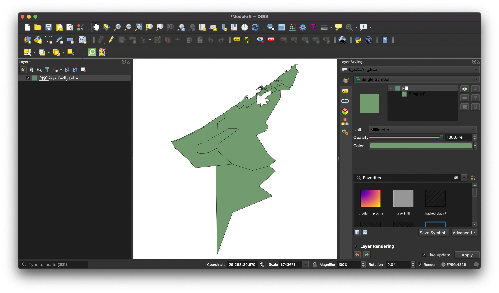
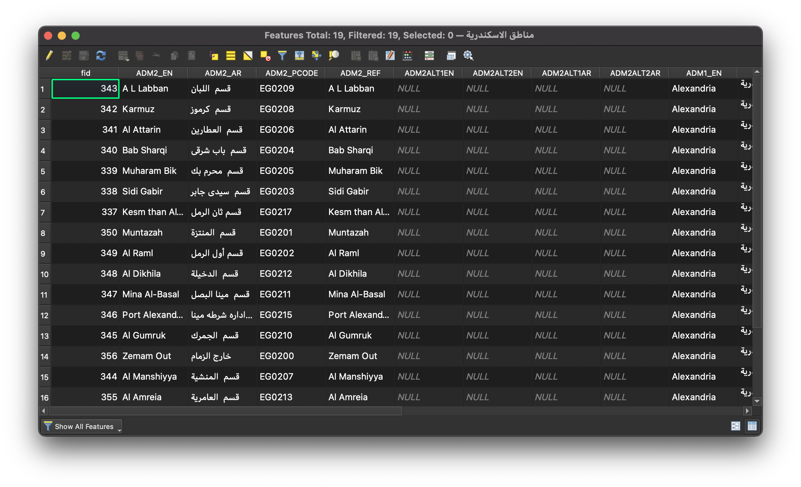
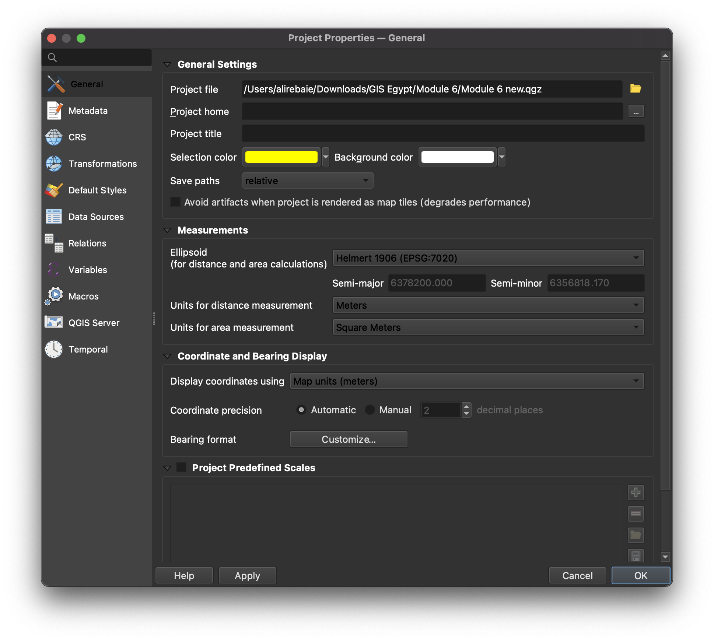
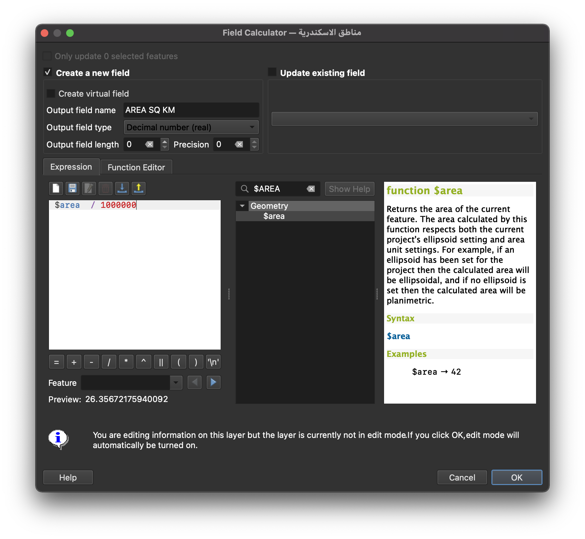
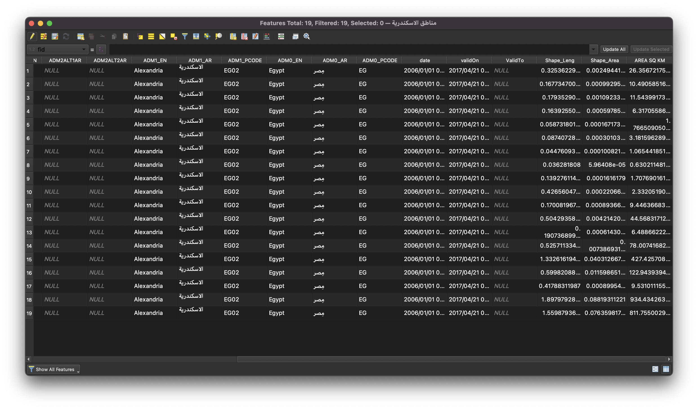
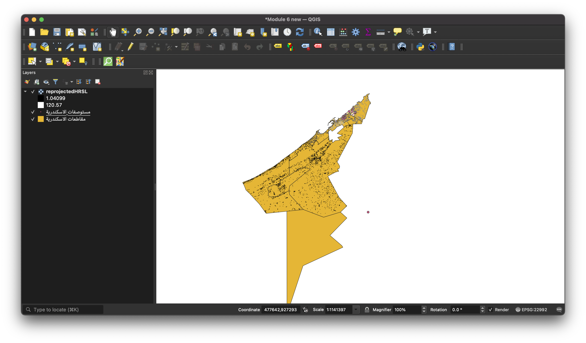
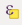
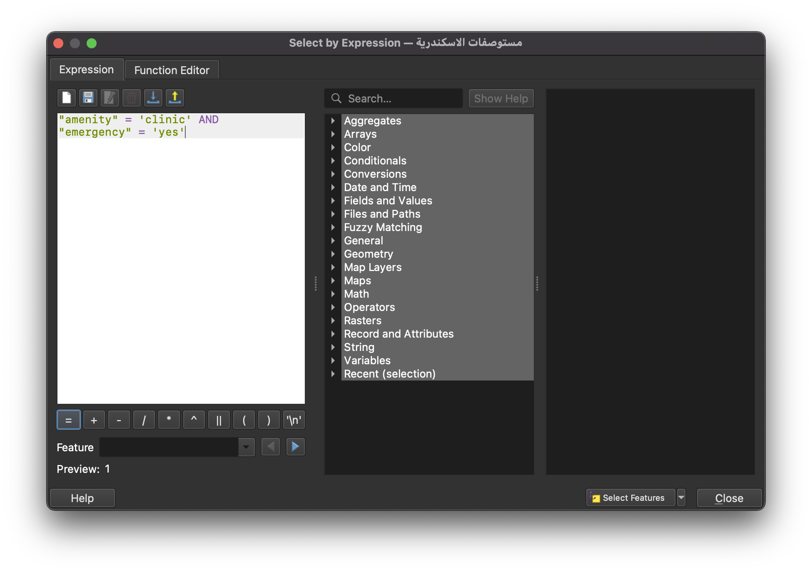
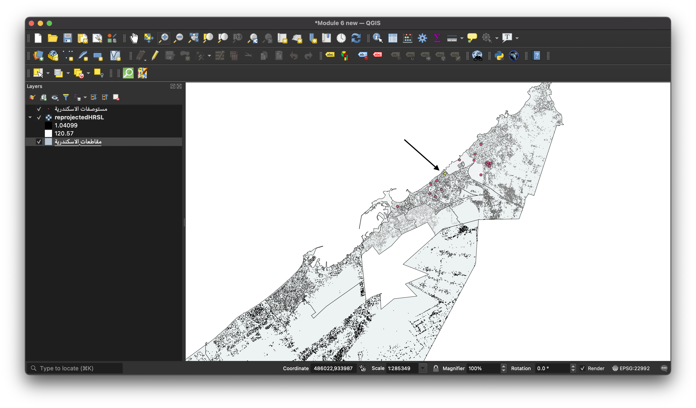
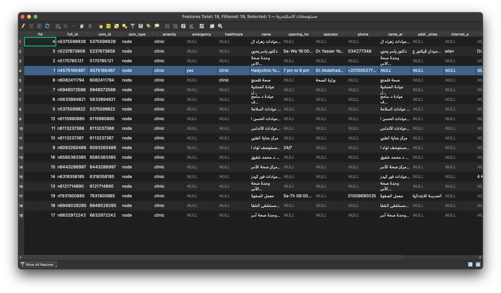

<div dir="rtl">
<h1>
الوحدة 6 - سمات الطبقة
</h1>

المؤلفة: Ketty, Ben Hur

<h2>
مقدمة تعليمية
</h2>

ستزودك هذه الوحدة بنظرة عامة على الخطوات الشائعة اللازمة للعمل مع جدول السمات وسمات الطبقة في QGIS. مع نهاية الوحدة، يجب أن يكون المشاركون قد اكتسبوا المفاهيم والمهارات التالية؛

*   العمل مع جدول السمات (attribute table)
*   استخدام حاسبة الحقول (field calculator)
*   محرك تعبير QGIS
*   عملية إعادة بناء الحقول (Refactoring fields)

بالإضافة إلى:

*   التعرّف على واجهة جدول السمات
*   التفاعل مع الميزات الموجودة في جدول السمات
*   حفظ الميزة التي تم اختيارها كطبقة جديدة
*   تحرير حقول الطبقة

ستستخدم حاسبة الحقل ومحرك تعبير QGIS لتشغيل العمليات والوظائف الحسابية في QGIS.


<h2>
الأدوات والموارد المطلوبة لهذه الوحدة هي:
</h2>

*    حاسوب
*   اتصال بالإنترنت
*   QGIS 3.16 مثبّت على الحاسوب
*   طبقة الحدود الإدارية للاسكندرية (داخل module6.gpkg
*   مستوصفات الاسكندرية (داخل module6
*   مناطق الاسكندرية (داخل module6.gpkg
*   طبقة تسوية الاسكندرية عالية الدقة HRSL


<h2>
المؤهلات المطلوبة
</h2>

*   المعرفة الأساسية لتشغيل حاسوب
*   فهم مقبول لجميع الوحدات السابقة


<h2>
مصادر إضافية
</h2>

*   العمل مع جدول السمات
    *   [https://docs.qgis.org/3.16/en/docs/user_manual/working_with_vector/attribute_table.html?highlight=layer%20attributes](https://docs.qgis.org/3.16/en/docs/user_manual/working_with_vector/attribute_table.html?highlight=layer%20attributes)
*   تعبيرات QGIS
    *   [https://docs.qgis.org/3.16/en/docs/pyqgis_developer_cookbook/expressions.html](https://docs.qgis.org/3.16/en/docs/pyqgis_developer_cookbook/expressions.html)


<h2>
مقدمة موضوعية
</h2>

لنبدأ بمثال:

في بعض الحالات، على سبيل المثال لأغراض تخطيط البنية التحتية، قد ترغب في معرفة مساحة المضلعات في الطبقة. إذا كان لديك مضلع واحد، فلن تكون هذه مشكلة. ولكن ماذا لو كان لديك العديد من المضلعات / المناطق في الطبقة؟ يكاد يكون من المستحيل حساب كل منطقة على حِدَة. تحتوي طبقة متجه الحدود الإدارية للفلبين على العديد من المضلعات مما يجعلها مجموعة بيانات مناسبة لهذا البرنامج التعليمي. سنقوم بحساب مساحة كل مضلع باستخدام طريقة آلية. في النّهاية، سيتم حساب مساحة 19 مقاطعة.


<h2>
تفصيل المفاهيم
</h2>

يتضمن القيام بإنشاء خريطة الكثير من العمل مع سمات الطبقة. سواء كنت تقوم برسم الطبقة، أو بضبط نافذة منبثقة (configuring a popup) ، أو بإجراء تحليل أو تصور، فأنت بحاجة إلى مستوى معين من المعرفة بحقول الطبقة والقيم التي تحتوي عليها. إذا كانت هذه هي طبقتك الخاصة، فأنت تعرف سماتها وتفهمها. لكن إذا لم يكن كذلك، فكيف تكتسب تلك المعرفة؟ على الأرجح، تقوم بفحص أسماء الحقول وفحص قيم الحقول لبعض الأدلة. وإذا كنت محظوظًا، فستجد بعض الوثائق التي تصف سمات الطبقة.

يعرض جدول البيانات معلومات عن ميزات الطبقة المحددة. يمثل كل صف في الجدول ميزةً (بهندسة أو بدونها)، ويحتوي كل عمود على جزء معين من المعلومات حول الميزة. يمكن البحث عن الميزات الموجودة في الجدول أو تحديدها أو نقلها أو حتى تحريرها. على وجه التحديد، هناك نوعان من خصائص الحقل الجديدة التي تصف القيم الموجودة في الحقل؛

*   وصف الحقل (Field description) - بضع كلمات أو جملة أو فقرة تصف القيم في الحقل.
*   نوع قيمة الحقل (Field value type) - كلمة مفتاح تصنف نوع القيم الموجودة في الحقل. تساعد الكلمة المفتاح الأشخاص على فهم كيفية استخدام القيم وتسمح لـ QGIS وتطبيقات العميل الأخرى بتقديم اقتراحات أكثر ذكاءً للعمل معهم، على سبيل المثال، قد تكون أنواع القيم في الحقل عددًا صحيحًا integer أو سلسلة string أو منطقية boolean أو مزدوجة double أو نقطة عائِمة floating point.

مثال: افترض أن لديك طبقة قطعة أرض بها هذه الحقول:

*   معرف الرّقعة Parcel ID - عدد صحيح
*   المالك Owner - سلسلة
*   عنوان الشارع  Street Address - سلسلة
*   وصف العقار Property Description - سلسلة
*   المباني Buildings - عدد صحيح
*   مساحة الأرض Land Area - مزدوجة
*   القيمة المقدرة Assessed Value - مزدوجة
*   تاريخ التقييم Assessment Date - تاريخ

إذا كنت ستصف قيم الحقول هذه  فقد تكتب شيئًا كالتالي:

*   معرف الرّقعة - المعرّف الفريد لرقعة الأرض
*   المالك - اسم مالك العقار
*   عنوان الشارع - موقع رقعة الأرض
*   وصف العقار - الوصف القانوني للعقار
*   المباني - عدد المباني على قطعة الأرض
*   مساحة الأرض - حجم القطعة بالفدان
*   القيمة المقدرة - قيمة قطعة الأرض والمباني بالدولار
*   تاريخ التقييم - تاريخ آخر تقييم

عند النظر إلى هذه الأوصاف، تبرز بعض الكلمات مثل: المعرّف والاسم والموقع والوصف والرقم والحجم والقيمة والتاريخ. هذه هي الكلمات الأساسية التي تصف قيم الحقل. يتم إنشاء الكلمات المفتاح لنوع قيمة الحقل من هذه الأنواع من الكلمات كالتالي:

*   الاسم أو العنوان
*   وصف
*   النوع أو الفئة
*   العدد أو الكمية
*   النسبة المئوية أو النسبة
*   قياس
*   معرف فريد
*   مرتبة أو مصنّف
*   الثنائية
*   الموقع أو اسم المكان
*   إحداثيات
*   التاريخ و الوقت

في مثال طبقة الرقعة أعلاه، حقل معرّف الحزمة هو حقل عدد صحيح. إذا كان نوع قيمة الحقل يشير إلى أن قيم الحقل تمثل معرفًا فريدًا وليس عددًا، فلن يقترح QGIS رسم سمة الحقل هذه باستخدام ألوان أو رموز متدرجة.

بالإضافة إلى ذلك، تسمح مفاهيم أخرى مثل وظيفة حاسبة الحقول field calculator في جدول البيانات بإجراء حسابات على أساس قيم السمات الحالية أو الوظائف المحددة، مثل حساب الطول أو المنطقة أو الكثافة السّكانية. لاحظ أن الحسابات المحتملة يتم تحديدها من خلال السمات أو مكوّنة البيانات الخاصة بك. على سبيل المثال، من الممكن فقط حساب الكثافة السكانية إذا كان هناك حقل بأعداد السكان. فيمكنك إنشاء تعبير أو صيغة لحساب الكثافة السكانية باستخدام محرك التعبير والحاسبة الميدانية. في هذه الحالة ستكون الصيغة؛ إجمالي عدد السكان كعدد من الأشخاص / مساحة الأرض التي يغطيها هؤلاء السكان. ستلاحظ أنه من المهم معرفة ما يمثله كل حقل من الحقول الموجودة في جدول سمات الطبقة. هذا يعني أنك بحاجة إلى معرفة وفهم بياناتك بدقة. مما يسهّل تطبيق الوظائف والتعبيرات وبالتالي الخروج بتحليلات ذات مغزى وتصورات / منتجات خرائط.


<h3>
عنوان المرحلة 1: تحرير سمات الطبقة
</h3>

<h4><strong>
المحتوى / البرنامج التعليمي
</strong></h4>

يعرض جدول البيانات معلومات عن ميزات الطبقة المحددة. يمثل كل صف في الجدول ميزةً (بهندسة أو بدونها)، ويحتوي كل عمود على جزء معين من المعلومات حول الميزة. يمكن البحث عن الميزات الموجودة في الجدول أو تحديدها أو نقلها أو حتى تحريرها.

1. قم بتحميل طبقة متجه مقاطعات الاسكندرية (الموجودة داخل module6.gpkg) على QGIS. يمكنك معرفة عدد الميزات الموجودة في الميزة الحالية بالنقر بزر الماوس الأيمن فوق الطبقة الموجودة في لوحة الطبقات ‣ إظهار عدد الميزات ( Layers Panel ‣ Show Feature Count). كما ترى أدناه، تحتوي طبقة المتجه على العديد من الميزات. في المجموع، هناك 19 ميزة تتوافق مع 19 مقاطعة.




Figure 6.1: عدة مضلعات

2. الخطوة التالية هي استكشاف واجهة جدول السمات. افتح جدول البيانات بالنقر بزر الماوس الأيمن فوق الطبقة الموجودة في لوحة الطبقات ‣ فتح جدول السمات (Layers Panel ‣ Open Attribute Table). يمكنك أيضًا النقر فوق الزر فتح جدول السمات Open Attribute Table button  من شريط أدوات السمات. هذا ما يبدو عليه جدول السمات. يحتوي شريط الأدوات على مجموعة من الأزرار، قم بالمرور فوق كل زر لرؤية الوظائف المضمنة.



Figure 6.2: افتح جدول السمات
    
إذا كنت لا تريد أن يكون جدول السمات عبارة عن نافذة عائمة ولكنك تريد تثبيته على واجهة QGIS، فيمكنك النقر فوق زر جدول سمات Dock  Dock attribute table. عند الإرساء، ستظهر جداول السمات كعلامات تبويب بدلاً من نوافذ فردية.


Figure 6.3: إرساء جدول السمات

3. بالنسبة لحسابات المنطقة، يجب أن يكون النظام المرجعي الإحداثي مسقطًا. هذا يسمح لك بحساب المسافات بشكل صحيح. تذكر أن اهتمامنا هو حساب المساحة تلقائيًا لكل مقاطعة من الـ19 مقاطعة. تحقق من النظام المرجعي للإحداثيات لطبقة المتجه. إذا كان نظامًا مرجعيًا للإحداثيات الجغرافية، فأعد إسقاط الطبقة إلى النظام الإحداثي المسقط. تحقق من الإسقاطات المختلفة على موقع EPSG. بالنسبة لمصر، سنستخدم EPSG:22992 WGS 84 Egypt 1907 / Red Belt. من الوحدات السابقة حيث تمّت مناقشة إسقاطات الخريطة على نطاق واسع، يمكنك أن تعرف أنه يتم تطبيق إسقاطات الخريطة بالنسبة إلى موقع معين على الأرض.

4. تحقق من إعدادات المشروع؛ اذهب إلى: مشروع ‣ خصائص ‣ عام (**Project ‣ Properties ‣ General**).



Figure 6.4: الاعدادات العامة

5. بعد ذلك، انقر على زر  فتح حاسبة الحقول (Open field calculator) على شريط أدوات السمات لفتح حاسبة الحقول. سيتم فتح مربع حوار الآلة الحاسبة؛ املأ اسم حقل الإخراج، في هذه الحالة سيكون (AREA (SQ KM. اختر الرقم العشري (مزدوج) في نوع حقل الإخراج. قم بتغيير الدقة إلى (precision) منزلتين عشريتين. لحساب المساحة، استخدم التعبير التالي:

```
$area / 1000000
```

يمكنك أن تجد هذا التعبير تحت الهندسة. انقر فوق "موافق" وسيقوم تلقائيًا بحساب مساحة كل مضلّع. لاحظ أن حساب المنطقة يعتمد على النظام المرجعي للإحداثيات المستخدم لذلك قد يكون لديك نتائج مختلفة اعتمادًا على نظام CRS الذي استخدمته. يمكنك أيضًا البحث والعثور على معلومات حول التعبيرات على الجانب الأيمن من Field Calculator أو Expression Builder.



Figure 6.5: حوار الآلة الحاسبة


6. افتح جدول السمات لرؤية النتيجة. لقد قمت للتو بتحرير محتويات جدول البيانات بطريقة آلية بدلاً من كتابة القيم في كل خلية واحدة تلو الأخرى.



Figure 6.6: جدول سمات جديد بحقل وسمات جديدة


<h4><strong>
أسئلة الاختبار
</strong></h4>

1. جدول السّمات هو قاعدة بيانات أو ملف جدولي يحتوي على معلومات حول مجموعة من الميزات الجغرافية
2. عادةً ما يتم ترتيب الميزات الجغرافية بحيث يمثل كل صف ميزةً ويمثل كل عمود سمة ميزة واحدة
3. من الضروري إعادة إسقاط الطبقات قبل حسابات المنطقة عندما تحتوي الطبقة على نظام مرجعي للإحداثيات الجغرافية

<h4><strong>
إجابات الاختبار
</strong></h4>

1. صحيح
2. صحيح
3. صحيح


<h3>
عنوان المرحلة 2: فهم والتعامل مع  بيانات السمات والإستعلامات والتحليل
</h3>

<h4><strong>
المحتوى / البرنامج التعليمي
</strong></h4>

في هذه المرحلة، قد تلاحظ أن جدول البيانات يخزّن كلاً من البيانات المكانية وغير المكانية. في هذا البرنامج التعليمي، ستكتشف طرقًا للتعامل مع بيانات جدول السمات. على سبيل المثال، باستخدام التعبيرات، حدد العيادات في الاسكندرية مع منشأة للطوارئ، وكلها تستخدم البيانات من جدول السمات.

1. أضف مجموعات البيانات التالية للاسكندرية إلى لوحة خريطة QGIS:

    * طبقة الحدود الإدارية للاسكندرية (داخل module6.gpkg)
    * عيادات الاسكندرية (داخل module6)
    * مناطق او مقاطعات الاسكندرية (داخل module6.gpkg)
    * طبقة تسوية الاسكندرية عالية الدقة HRSL



أضف طبقات مختلفة :Figure 6.7 

2. سيتم تطبيق التحديد على طبقة العيادات، لذلك افتح جدول البيانات لطبقة العيادة. انقر فوق ميزات التحديد باستخدام الزر  للتعبير واكتب التعبير التالي في منشئ التعبير؛

```
"amenity" = 'clinic' AND "emergency" = 'yes'
```

ستلاحظ أن التعبير يحتوي على عدد من المسندات مثل علامة المقارنة (=) والمسند المنطقي (AND) وسلسلة محاطة بعلامات اقتباس فردية (""). هناك أيضًا إسمان للسمات (الراحة والطوارئ) وقيمهما (العيادة ، نعم).



Figure 6.8: حدد من خلال حوار منشئ التعبير

3. تم اختيار عيادة واحدة. يمكنك رؤية التحديد مميزًا باللون الأصفر. يتم أيضًا تمييز العيادة المحددة في جدول السمات. الآن نعلم أن هناك عيادة واحدة فقط بها مرفق للطوارئ في الإسكندرية.



Figure 6.9: تم تمييز العيادة/الميزة المحددة باللون الأصفر



Figure 6.10: يتم تمييز العيادة / الميزة المحددة باللون الأزرق

من الممكن أيضًا إجراء تحديدات من خلال النقر على عنصر داخل لوحة الخريطة.

من أجل إنشاء "تعبير وظيف"  يجب أن تبدأ بفهم بياناتك جيّداً مثل السمات وقيمها. ثم تبدأ بطرح الأسئلة الصحيحة، وأخيراً تقوم بتطوير التعبير الصحيح، مع مراعاة جميع القواعد الرياضية التي تجعل التعبير خاليًا من الخطأ.


<h4><strong>
أسئلة الاختبار
</strong></h4>

1. يتم توفير هذه العوامل من خلال منشئ التعبير. {+، -، *}
2. يجب أن تتضمن علامات الاقتباس ("") المفردة سلسلة.
3. يخزن جدول السمات البيانات غير المكانية فقط.

<h4><strong>
إجابات الاختبار
</strong></h4>

1. صحيح
2. صحيح
3. خطأ


<h3>
عنوان المرحلة 3: تعبيرات QGIS المتقدمة
</h3>

يوفر مربع حوار Expression Builder الوصول إلى:

* علامة تبويب التعبيرExpression tab   ([https://docs.qgis.org/2.18/en/docs/user_manual/working_with_vector/expression.html#functions-list](https://docs.qgis.org/2.18/en/docs/user_manual/working_with_vector/expression.html#functions-list)) والتي، بفضل قائمة الوظائف المحددة مسبقًا، تساعد على الكتابة والتحقق من التعبير الذي سيتم استخدامه؛
* علامة التبويب محرر الوظائف Function Editor tab ([https://docs.qgis.org/2.18/en/docs/user_manual/working_with_vector/expression.html#function-editor](https://docs.qgis.org/2.18/en/docs/user_manual/working_with_vector/expression.html#function-editor)) والتي تساعد على توسيع قائمة الوظائف عن طريق إنشاء وظائف مخصصة.


<h4><strong>
المحتوى / البرنامج التعليمي
</strong></h4>

هناك العديد من حالات استخدام التعبيرات.أوّلاً لاحظ كيف يتم تطوير التعبيرات وما هي العوامل أو المسندات المستخدمة. من المهم أيضًا حقيقة أن كل هذه التعبيرات يتم تطويرها بناءً على محتوى مجموعة البيانات. ويمكنك تكييف هذا مع مجموعة البيانات التي تختارها.


1. من حاسبة الحقل، قم بحساب حقل "pop_density" باستخدام حقلي "total_pop" و "area_km2" الحاليين:

```
"total_pop" / "area_km2"
```

2. قم بتحديث الحقل "density_level "بالفئات وفقًا لقيم" pop_density ":

```
CASE WHEN "pop_density" < 50 THEN 'Low population density'
WHEN "pop_density" >= 50 AND  "pop_density" < 150 THEN 'Medium population density'
WHEN "pop_density" > 150 THEN 'High population density'
END
```

3. قم بتطبيق نمط مصنّف categorized style على جميع الميزات وفقًا لما إذا كان متوسط سعر المنزل أقل أو أعلى من 10000 shillings للمتر المربع:

```
"price_m2" > 10000
```

4. باستخدام أداة "Select By Expression ..." ، حدد جميع الميزات التي تمثل مناطق ذات "كثافة سكانية عالية" ومتوسط سعر منزلها أعلى من 10000 pesos لكل متر مربع:

```
"density level" = 'High population density' and "price_m2" > 10000
```

يمكن أيضًا استخدام التعبير السابق لتحديد الميزات التي يجب تسميتها أو إظهارها في الخريطة.


<h4><strong>
أسئلة الاختبار
</strong></h4>

1. يمكن استخدام كل من حاسبة الحقول وحوار Select by Expression لتطوير التعبيرات - صحيح
2. يمكن استخدام التعبيرات لتحديث حقل جديد - صحيح
3. يمكن استخدام التعبيرات لتطبيق نمط - صحيح

</div>