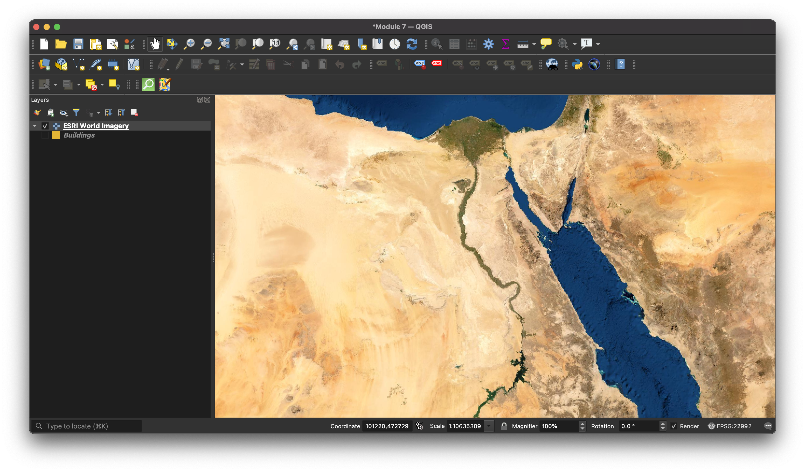
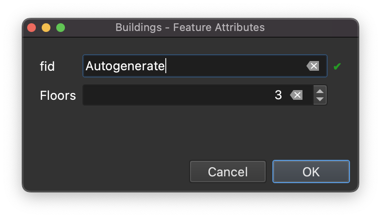
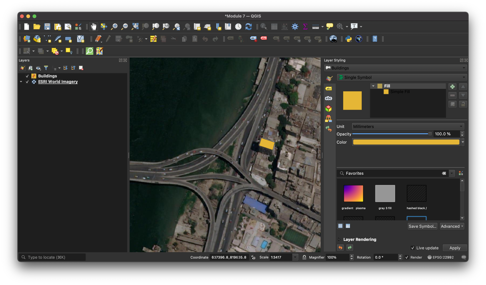
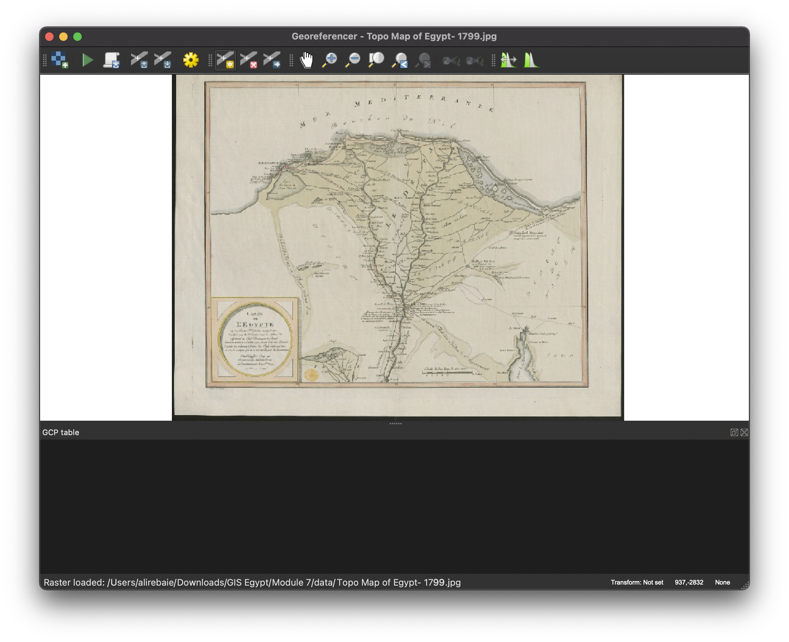
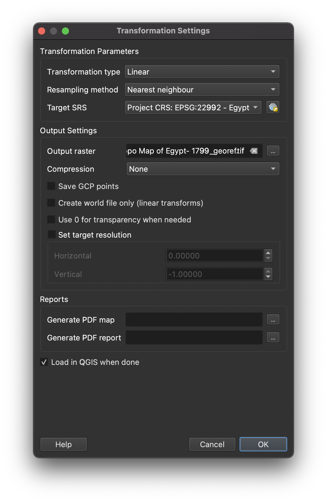
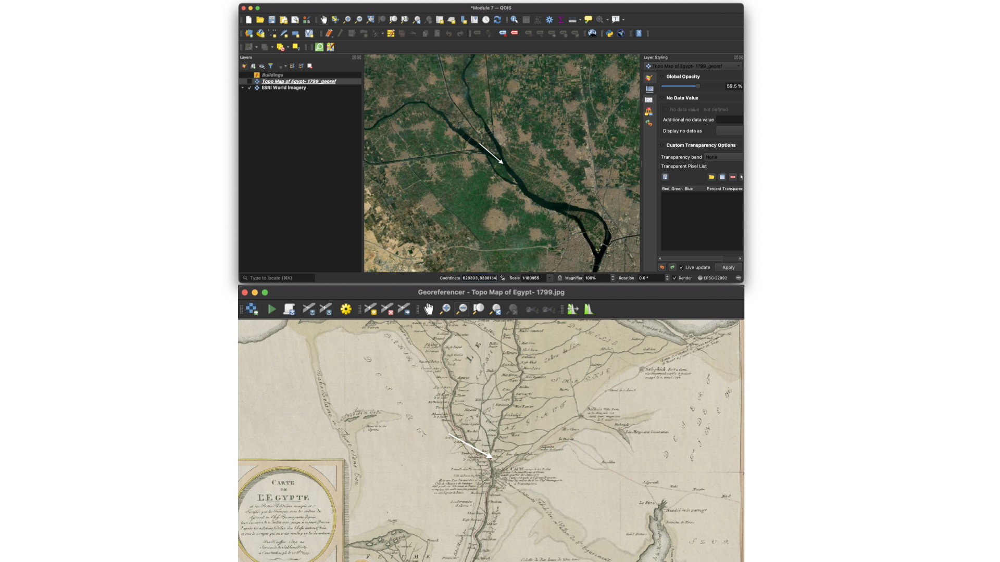
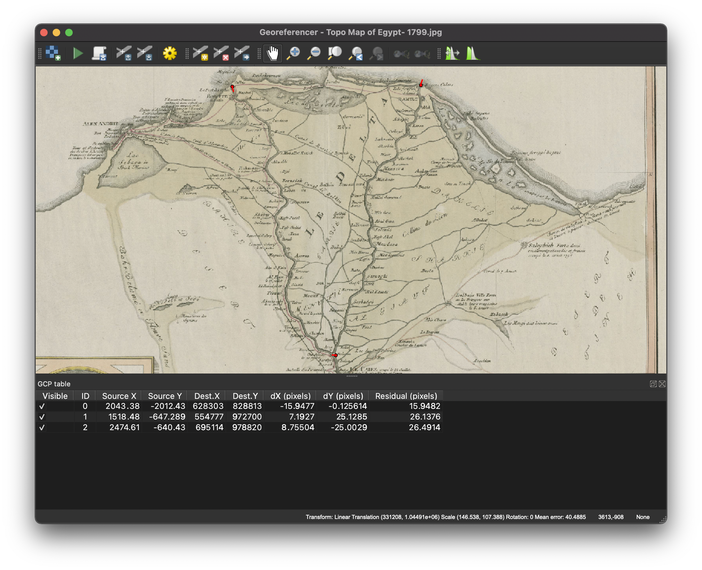

<h1>
الوحدة 7 - إنشاء الطبقات وتحريرها
</h1>

المؤلفة: Ketty, Ben Hur

<h2>
مقدمة تعليمية
</h2>

تم تصميم هذه الوحدة لتعليمك كيفية استخدام أدوات QGIS لإنشاء طبقة GIS جديدة. ستتعلم مفاهيم مثل الرقمنة (digitizing) والإسناد الجغرافي (georeferencing).

<h2>
الأدوات والموارد المطلوبة لهذه الوحدة هي:
</h2>

*    حاسوب
*   اتصال بالإنترنت
*   QGIS 3.16 مثبّت على الحاسوب
*   خريطة طوبوغرافية لمصر

<h2>
المؤهلات المطلوبة
</h2>

*   المعرفة الأساسية لتشغيل حاسوب
*   فهم مقبول لجميع الوحدات السابقة

<h2>
مصادر إضافية
</h2>

*   إنشاء الطبقات - [https://docs.qgis.org/3.16/en/docs/user_manual/managing_data_source/create_layers.html](https://docs.qgis.org/3.16/en/docs/user_manual/managing_data_source/create_layers.html)
*   رقمنة مواقف الغابات - [https://docs.qgis.org/3.16/en/docs/training_manual/forestry/stands_digitazing.html?highlight=digitizing](https://docs.qgis.org/3.16/en/docs/training_manual/forestry/stands_digitazing.html?highlight=digitizing)
*   اقرأ أيضًا: تحديد الإسناد الجغرافي للخريطة [https://docs.qgis.org/3.16/en/docs/training_manual/forestry/map_georeferencing.html?highlight=georeferencing](https://docs.qgis.org/3.16/en/docs/training_manual/forestry/map_georeferencing.html?highlight=georeferencing)

<h2>
مقدمة موضوعية
</h2>

لنبدأ بمثال:

لنتخيل أن القسم الذي تعمل فيه يخطط لبناء مستشفيات جديدة في المقاطعة. قد يرغبون في إجراء تقييم بيئي مسبق لمشروع البنية التحتية المخطط له. وقد يشمل التقييم إجراء بحث حول البيانات المتاحة. هناك قدر كبير من البيانات الجغرافية المتاحة بصيغ لا يمكن دمجها على الفور مع بيانات نظم المعلومات الجغرافية الأخرى. قد تكون بعض هذه البيانات في شكل خرائط قديمة أو صور أقمار صناعية عالية الدقة أو صور مستشعرة عن بعد والتي تُستخدم غالبًا لإنشاء خرائط رقمية مثل خرائط Google أو OpenStreetMap. تعد عمليات الإنشاء والتحرير مفيدة لتحديث التغييرات على الطبقات أو قاعدة البيانات الخاصة بك. إحدى الطرق التي يمكن من خلالها إنشاء بيانات جديدة في نظام المعلومات الجغرافية هي الرقمنة. تشمل الطرق الأخرى الإسناد الجغرافي والمسح الضوئي والتوجيه والقص والاختيار ثم الحفظ. من المهم أن تتذكر أن البيانات التي يتم إنشاؤها تعتمد على تفرّد المصدر الأصلي. على سبيل المثال ، توضح الصورة أدناه أن كل منتج مصور سينتج بدوره مجموعة بيانات فريدة.

Figure 7.1: صور الاستشعار عن بعد لسواحل مختلفة

1.  Interferometric Synthetic Aperture Radar (IFSAR) data (باستخدام الموجات الدقيقة لجمع البيانات لإنشاء صور تمثيلية)
2. topographic and bathymetric lidar data (بيانات الارتفاع والارتفاع ممثلة بالألوان)
3. hyperspectral imagery (إضافة اللون إلى الطاقة غير المرئية) 
4. digital photography (تمثيل الألوان المرئية للعين البشرية كما هي)

<h2>
تفصيل المفاهيم
</h2>

الرقمنة في نظم المعلومات الجغرافية هي عملية "تتبّع" المعلومات من وسائل الإعلام / الخرائط بطريقة صحيحة جغرافيا. تعتمد عملية الإسناد الجغرافي على تنسيق النقاط على الصورة الممسوحة ضوئيًا (البيانات المراد تحديد مرجعها الجغرافي) مع نقاط على البيانات المسندة جغرافيًا (البيانات التي سيتم الإشارة إليها جغرافيًا للصورة). من خلال "ربط" النقاط على الصورة بتلك المواقع نفسها في البيانات المسندة جغرافيًا، يمكنك إنشاء "تحويلًا" يغيير موقع الصورة بأكملها إلى الموقع الجغرافي الصحيح.

 on top of an aerial photo")

هنا، تم رقمنة (تتبع) المباني على صورة جوية :Figure 7.2  

الإسناد الجغرافي، من ناحية أخرى، هو عملية التقاط صورة رقمية ، يمكن أن تكون صورة جوية ، أو خريطة جيولوجية ممسوحة ضوئيًا، أو صورة لخريطة طبوغرافية، وإضافة معلومات جغرافية إلى الصورة بحيث يمكن لنظام المعلومات الجغرافية أو برنامج رسم الخرائط وضع الصورة في موقعها المناسب في العالم الحقيقي.

<h2>
المحتوى الرئيسي
</h2>

يتيح لك QGIS إنشاء طبقات جديدة بصيغ مختلفة. يوفر أدوات لإنشاء GeoPackage و Shapefile و SpatiaLite و GPX وطبقات Scratch المؤقتة (تعرف أيضًا باسم طبقات الذاكرة). ويتيح لك التحرير إضافة ميزات وحذفها وتعديلها في مجموعات بيانات المتجه. الخطوة الأولى هي وضع مجموعة البيانات في وضع التحرير. حدد الطبقة في لوحة Layers وانقر فوق Layer | Toggle Editing. يمكنك أيضاً النقر بزر الماوس الأيمن فوق طبقة في لوحة Layers واختيار Toggle Editing من قائمة السياق (context menu). يمكن تحرير طبقات متعددة في وقت واحد. الطبقة التي يتم تحريرها حاليًا هي الطبقة المحددة في لوحة Layers. بمجرد الوصول إلى وضع التحرير، يمكن استخدام شريط أدوات الرقمنة لإضافة الميزات وحذفها وتعديلها.

الرقمنة هي فن (أو علم) إنشاء بيانات متجه رقمية من مصدر آخر، مثل صورة نقطية. من أجل البدء في الرقمنة ، يجب علينا أولاً الدخول في وضع التحرير. تتطلب برامج GIS عادةً وضعًا منفصلاً للتحرير وذلك لمنع المستخدمين من تحرير البيانات المهمة أو حذفها عن طريق الخطأ. يتم تشغيل وضع التحرير أو إيقاف تشغيله بشكل فردي لكل طبقة.

<h3>
عنوان المرحلة 1: إنشاء طبقة GeoPackage جديدة أو Shapefile جديد
</h3>

<h4><strong>
إنشاء طبقة GeoPackage جديدة
</strong></h4>

1. لإنشاء طبقة GeoPackage جديدة، اضغط على زر New GeoPackage Layer  في قائمة طبقة ‣ إنشاء طبقة (Layer ‣ Create Layer) أو من شريط أدوات إدارة مصدر البيانات (Datasource Manager). سيتم عرض مربع حوار New GeoPackage Layer كما هو موضح في Figure 7.3.

Figure 7.3: حوار جديد حول طبقة GeoPackage

2. الخطوة الأولى هي الإشارة إلى موقع ملف قاعدة البيانات. يمكن القيام بذلك عن طريق الضغط على زر  على جانب حقل قاعدة البيانات وتحديد ملف GeoPackage الحالي أو إنشاء ملف جديد. سيضيف QGIS تلقائيًا الامتداد الصحيح للاسم الذي تقدمه.
3. اكتب اسمًا للطبقة / الجدول الجديد (اسم الجدول)
4. حدد نوع الهندسة. إذا لم تكن طبقة "غير هندسية"، يمكنك تحديد ما إذا كان يجب تضمين البعد Z و / أو تضمين قيم M.
5. حدد النظام المرجعي للإحداثيات باستخدام الزر 

6. لإضافة حقول إلى الطبقة التي تقوم بإنشائها:
    1. أدخل اسم الحقل
    2. حدد نوع البيانات. الأنواع المدعومة هي البيانات النصيّة، العدد الصحيح (عدد صحيح وعدد صحيح64) ، الرقم العشري، التاريخ والتاريخ والوقت، ثنائي (BLOB) ومنطقي.
    3. اعتمادًا على صيغة البيانات المحددة، أدخل الحد الأقصى لطول القيم.
    4. انقر فوق الزر "إضافة إلى قائمة الحقول"  (Add to Fields List)

7. أعد الخطوات أعلاه لكل حقل تريد إضافته
8. عندما تنتهي من السّمات، انقر فوق "حسناً". سيضيف QGIS الطّبقة الجديدة إلى مفتاح الخريطة التي يمكنك تحريرها لاحقاً.

<h4><strong>
إنشاء ملف Shapefile جديد
</strong></h4>

1. لإنشاء طبقة صيغة Shapefile ESRI جديدة، اضغط على الزر   New Shapefile Layer… في طبقة ‣ إنشاء طبقة ‣ قائمة (Layer ‣ Create Layer ‣ menu) أو من شريط أدوات إدارة قاعدة البيانات (Data (Source Manager. سيتم عرض مربع حوار New Shapefile Layer كما هو موضح في Figure 7.4.

Figure 7.4:الجديد shapefile  حوار طبقة

2. قم بتوفير مسار واسم ملف باستخدام الزر بجوار حقل اسم الملف (File name field). سيضيف QGIS تلقائيًا الامتداد الصحيح للاسم الذي تقدمه.
3. بعد ذلك، أشر إلى ملف ترميز البيانات (File encoding)
4. اختر نوع الهندسة Geometry للطبقة: No Geometry (ينتج عنه ملف بتنسيق .DBF) ، نقطة، متعددة النقاط، خط أو مضلع
5. حدد ما إذا كان يجب أن يكون للشكل الهندسي أبعاد إضافية: لا شيء ، أو Z (+ M values) or M values.
6. حدد النظام المرجعي للإحداثيات باستخدام الزر  ، يمكنك تحديد WGS 84 العالمي المناسب تمامًا لمشاريع رسم خرائط الويب لجميع أنحاء العالم.
7. لإضافة الحقول إلى الطبقة التي تقوم بإنشائها:
    1. أدخل اسم الحقل
    2. حدد نوع البيانات. يتم دعم سمات الرقم العشري والعدد الصحيح والبيانات النصية والتاريخ فقط.
    3. اعتمادًا على تنسيق البيانات المحدد، أدخل الطول والدقة.
    4. انقر فوق الزر "إضافة إلى قائمة الحقول"  

8. كرّر الخطوات أعلاه لكل حقل تريد إضافته
9. بمجرد أن تكون قد انتهيت من إضافة السمات، انقر فوق "حسناً". ستضيف QGIS الطبقة الجديدة إلى مفتاح الخريطة، ويمكنك تعديلها كما سيوضّح في المرحلة التالية "رقمنة طبقة موجودة" من هذه الوحدة.

<h3>
عنوان المرحلة 2: رقمنة طبقة موجودة (Digitizing an existing layer)
</h3>

<h4><strong>
المحتوى / البرنامج التعليمي
</strong></h4>

سيوضح هذا البرنامج التعليمي كيفية إنشاء shapefile  جديد باستخدام البيانات المساعدة (auxiliary data) مثل صور القمر الصناعي التي توفرها Google. من الناحية العملية، ستكون بيانات الحقيقة (ground truth) الدقيقة متاحة. ستكون هذه بيانات نوعية دقيقة حول الميزة الطوبولوجية. من المهم معرفة الميزة التي ترغب في إنشائها مسبقًا، على سبيل المثال، هل هي طبقة نقطية أم خطية أم مضلعة متجهية. فعندما نقوم بإنشاء الطبقة، يجب أن نحدد نوع البيانات التي ستحتوي عليها. الغرض من هذا البرنامج التعليمي هو إنشاء نوع من البيانات التي يمكن معالجتها وتحليلها وتخزينها بسهولة باستخدام نظام QGIS، ومن ثم الحاجة إلى إنشاء ملفات متجهة.سنقوم بإنشاء ميزات المضلع كمثال؛

1. قبل أن تتمكن من إضافة بيانات متجه جديدة، تحتاج إلى مجموعة بيانات متجه (طبقة) لإضافتها إليها. في حالتنا، سنبدأ بإنشاء طبقة بيانات جديدة، ثم نضيف الميزات إليها. أولاً، يجب علينا تحديد مجموعة البيانات الخاصة بنا.
2. أنشئ مشروعًا جديدًا في QGIS من خلال النقر على أيقونة مشروع جديد  .
3. انتقل إلى Layer ‣ Create Layer ‣ New GeoPackage Layer . سيظهر لك مربع الحوار التالي:

Figure 7.5: New GeoPackage حوار

في هذه المرحلة ، يجب أن نقرر نوع مجموعة البيانات التي نريد إنشاءها. تذكر أن طبقة البيانات يمكن أن تحتوي فقط على ميزات النقاط أو الخطوط أو المضلعات - لا يمكن أبدًا أن تحتوي على مزيج. عندما نقوم بإنشاء الطبقة، يجب أن نحدد نوع البيانات التي ستحتوي عليها.

نظرًا لأن المضلعات تتكون من نقاط وخطوط، فلنقم بإنشاء المضلعات. بمجرد أن تتقن هذا، يجب أن يكون إنشاء طبقة نقطة أو خط أمرًا سهلاً!

ضمن مربع الحوار، حدد اسم ملف للملف الجديد، وتشفير الملف، ونوع الشكل الهندسي، و CRS وأضف بيانات التحديد للحقل الجديد. أضف أسماء الحقول الأخرى. يتطلب هذا نموذج بيانات مُصمم مسبقًا يلتقط بشكل صحيح جميع المعلومات حول الميزة المذكورة.

4. الخطوة الثانية هي إضافة طبقة القمر الصناعي ESRI World Imagery إلى لوحة خريطة QGIS. أضفنا هذا في وحدة سابقة ويجب أن تكون متاحة للاستخدام في لوحة المستعرض ضمن XYZ Tiles.

Figure 7.6: لوحة QGIS بعد إضافة ESRI World Imagery layer 

5. قم بتكبير الصورة حتى تتمكن من رؤية الميزات مثل الأسطح والطرق والأشجار وما إلى ذلك. يمكن أن تعمل أسطح المنازل كوكيل ثنائي الأبعاد للمباني، وبالتالي سنقوم برقمنة طبقة المباني التي تم إنشاؤها حديثًا.

Figure 7.7: مكبّرة ESRI World طبقة صورة  

6. دعنا ندخل وضع التحرير لطبقة المباني
7. حدد المباني في لوحة Layers
8. انقر فوق الزر "تبديل التحرير" _Toggle Editing_ 
9. إذا لم تتمكن من العثور على هذا الزر، فتأكد من تمكين شريط أدوات التحويل الرقمي. يجب أن تكون هناك علامة اختيار بجوار "عرض ‣ أشرطة الأدوات ‣ قائمة التحويل الرقمي ( View ‣ Toolbars ‣ Digitizing menu)
10. بمجرد أن تكون في وضع التحرير، ستصبح أدوات الرقمنة نشطة

Figure 7.8: أدوات الرقمنة

من اليسار إلى اليمين في الصورة أعلاه، هي:

*   تبديل التحرير- Toggle Editing: ينشط/ يلغي تنشيط وضع التحرير.
*    حفظ تعديلات الطبقة - Save Layer Edits: يحفظ التغييرات التي تم إجراؤها على الطبقة.
*   إضافة ميزة - Add Feature: ابدأ في رقمنة ميزة جديدة.
*   تحريك الميزة أو الميزات - (Move Feature(s: نقل ميزة بأكملها.
*   أداة العقدة - Node Tool: نقل جزء واحد فقط من الميزة.
*   حذف المحدد - Delete Selected: حذف العنصر المحدد (يكون نشطًا فقط إذا تم تحديد الميزة).
*   قص الميزات - Cut Features: قص الميزة المحددة (نشطة فقط إذا تم تحديد الميزة).
*   نسخ الميزات - Copy Features: نسخ الميزة المحددة (نشطة فقط إذا تم تحديد الميزة).
*   لصق الميزات - Paste Features: الصق عنصرًا تم قصه أو نسخه مرة أخرى في الخريطة (نشط فقط إذا تم قص العنصر أو نسخه).

نريد إضافة ميزة جديدة.

11. انقر فوق الزر "إضافة ميزة"  لبدء الرقمنة. سنقوم برقمنة المباني
12. ابدأ بالنقر فوق نقطة في مكان ما على طول حافة المبنى
13. ضع المزيد من النقاط من خلال النقر أكثر على طول الحافة حتى يتم تغطية الشكل الذي ترسمه بالكامل. هذا مشابه جدًا لرسم المضلع. يجب أن تلمس قمة البداية ورأس النهاية، وإلا فسيظل خطًا.
14. لوضع النقطة الأخيرة، انقر بزر الماوس الأيمن في المكان الذي تريده. سيؤدي هذا إلى إنهاء الميزة وإظهار مربع حوار السمات.
15. املأ القيم كما هو موضح أدناه

Figure 7.8.1:رقمنة ميزة جديدة

Figure 7.8.2: إضافة السمات

16. انقر فوق موافق. لقد أنشأت ميزة جديدة!

Figure 7.8.3.: تم إنشاء ميزة جديدة

إذا ارتكبت خطأ ما أثناء رقمنة عنصر ما، فيمكنك دائمًا تعديله لاحقًا. ما عليك سوى إنهاء رقمنة الميزة ثم اتباع الخطوات التالية:

*   حدد الميزة باستخدام أداة Select Feature

*   ثم استخدم إحدى هذه الأدوات لتعديل الميزة

<table>
  <tr>
   <td>

   </td>
   <td>
أدوات نقل  الميزات - Move feature(s) tools

   </td>
   <td>
نقل الميزة (الميزات) بأكملها

   </td>
  </tr>
  <tr>
   <td>

   </td>
   <td>
أدوات العقدة

   </td>
   <td>
نقل نقطة واحدة فقط حيث قد تكون أخطأت

   </td>
  </tr>
  <tr>
   <td>

   </td>
   <td>
احذف المحدّد

   </td>
   <td>
تخلص من الميزة تمامًا حتى تتمكن من المحاولة مرة أخرى

   </td>
  </tr>
  <tr>
   <td>
انتقل إلى تحرير ‣ تراجع أو اضغط على Ctrl + Z على لوحة المفاتيح

   </td>
   <td>
تسمح بالتراجع عن الأخطاء

   </td>
   <td>
   </td>
  </tr>
</table>

17. جربها الآن بنفسك  وقم برقمنة جميع المباني في الصورة.

<h3>
عنوان المرحلة 3: تحديد الإسناد الجغرافي أو المرجعية الجغرافية لخريطة Topo
</h3>

<h4><strong>
المحتوى / البرنامج التعليمي
</strong></h4>

لإسناد الخريطة جغرافياً:

1. افتح أداة النقطية ‣ Georeferencer 
2. انقر فوق الزر إضافة نقطية   لإضافة ملف صورة الخريطة Topo Map of Egypt- 1799 كصورة للإسناد الجغرافي. ستتم إضافة الخريطة الطبوغرافية إلى لوحة المرجعية الجغرافية. يمكنك الآن التكبير لقراءة تفاصيل الخريطة. تتمثل إحدى طرق القيام بذلك في قراءة البيانات الوصفية ومعلومات ومفتاح الخريطة في الجزء السفلي ثم ربطها بالميزات الموجودة على الخريطة.

Figure 7.9: الخريطة على لوحة المرجعية الجغرافية

بعد ذلك، يجب عليك تحديد إعدادات التحويل للمرجعية الجغرافية للخريطة:

3. افتح الإعدادات ‣ إعدادات التحويل أو انقر فوق الزر إعدادات التحويل .
4. انقر فوق أيقونة   بجوار مربع Output raster، وانتقل إلى المجلد وأنشئ المجلد "data" وقم بتسمية الملف باسم /Topo Map of Egypt- 1799_georef.tif.
5. اضبط باقي الميزات كما هو موضّح أدناه

Figure 7.10: معايير التحويل

عند تحديد معايير التحويل، فإن الأشياء التي يجب مراعاتها هي:

*   تعقيد الخريطة وتشويهها (عادة ما تحتاج الخرائط ذات الشكل العادي فقط إلى استخدام معايير تحويل بسيطة)
*   عدد GCPs التي يمكنك الحصول عليه على الخريطة - كلما كان نوع التحويل أكثر تعقيدًا، زادت الحاجة إلى GCPs للحصول على نتائج جيدة.
*   توزيع GCPs على الخريطة - يؤدي توزيع GCP الضعيف إلى مزيد من التشويه خاصة في معادلات التحويل ذات الترتيب الأعلى.
*   المزيد (أو أكثر تعقيدًا) ليس دائمًا أفضل.

| Order of Transformation | Minimum GCPs Required |
|:-----------------------:|:---------------------:|
|            1            |           3           |
|            2            |           6           |
|            3            |           10          |
|            4            |           15          |
|            5            |           21          |
|            6            |           28          |
|            7            |           36          |

من الأفضل أن تضيف دائمًا واحد على الأقل أكثر من الحد الأدنى لإضافة التكرار.

6. انقر فوق موافق.
7. من آجل تحديد الإحداثيات في الخريطة، سوف نستخدم نقاط مصب نهر النيل كوسيلة امثل الإسناد الجغرافي إلى هذه الصورة. يمكنك استخدام أدوات التكبير/ التصغير والتحريك كما تفعل عادةً في QGIS لفحص الصورة.
8. قم بالتكبير إلى مصب نهر النيل وانسخ الإحداثيات التي ظهرت في أسفل لوحة الخريطة.
9. اذهب الآن إلى لوحة (Georeferencer) انقر فوق الزر   Add Point وانقر فوق تقاطع الخطوط المتقاطعة (قم بالتحريك والتكبير حسب الحاجة).
10. اكتب الإحداثيات التي حصلت عليها من خريطة (ESRI WORLD IMAGERY) في مربع حوار إدخال إحداثيات الخريطة.

Figure 7.11.1-2: أدخل إحداثيات الخريطة

11. انقر فوق "تشغيل".

الإحداثية الأولى للمرجعية الجغرافية أصبحت جاهزة. يوجد أدناه لقطة شاشة لما يمكن توقعه في هذه المرحلة

Figure 7.12: الإحداثية الأولى للمرجعية الجغرافية

12. قم بتصغير الصورة وانتقل إلى اليمين حتى تجد علامة تقاطع أخرى، وقدّر عدد الكيلومترات التي قطعتها. حاول أن تبعد نقاط التحكم الأرضية عن بعضها قدر الإمكان. قم برقمنة نقطي تحكم أخرى على الأقل بنفس الطريقة التي قمت بها بالنقطة الأولى. نصيحة: تأكد من أن النقاط موزّعة بالتساوي عبر الصورة مثلاً أو على مسافات متساوية مع بعضها البعض. هذا يؤثر على أداء خوارزمية التحويل. مما يؤدي بدوره إلى ارتفاع معدلات الخطأ. سنأخذ مصب نهر النيل نحو البحر الابيض المتوسط من الجهة اليمنى واليسرى أيضا.

13. من خلال ثلاث نقاط تحكم أرضية رقمية، ستتمكن من رؤية خطأ الإسناد الجغرافي كخط أحمر يخرج من النقاط. يمكن رؤية الخطأ بالبكسل أيضًا في جدول GCP في أعمدة dX [بكسل] و dY [بكسل]. يجب ألا تكون القيم المتبقية أعلى من الحد الذي قمت بتعيينه، إذا كان يجب عليك مراجعة النقاط التي قمت برقمنتها والإحداثيات التي أدخلتها للعثور على المشكلة. يمكنك استخدام الصورة أعلاه كدليل.

14. أضف المزيد من نقاط التحكم حتى تصبح راضيًا عن النتائج المتوقعة.
15. يمكنك حفظ ملف GCPs من خلال File ► Save GCP points as
16. أخيرًا، قم بإنشاء مرجع جغرافي لخريطتك باستخدام ملف ‣ بدء الإسناد الجغرافي (File ► Start georeferencing) أو زر تشغيل المرجعية الجغرافية  .

Figure 7.13: GCPs إضافة الـ

Figure 7.14: QGIS خريطة مرجعية جغرافية تم تحميلها في

ملاحظة: للتحقق من أن بياناتك قد تم إسنادها جغرافيًا بشكل صحيح، يمكنك فتح خريطة topo. يجب أن تتطابق خريطتك مع هذه الصورة جيدًا. اضبط شفافية الخريطة على 75٪ وقارنها بالصورة الجوية.

<h4><strong>
أسئلة الاختبار
</strong></h4>

1. ما هي الرقمنة في نظم المعلومات الجغرافية؟ (مربعات اختيار)
2. أي من مجموعات البيانات المساعدة التالية مدعومة في الرقمنة؟ (مربعات اختيار)
3. ما العوامل التي قد تؤثر على دقة البيانات أثناء الرقمنة؟ (زر اختيار)
4. ما الذي يمكن عمله لتحسين الدقة؟ (مربعات اختيار)
5. لماذا يعتبر نموذج البيانات مهمًا عند إنشاء بيانات جديدة؟ (زر الراديو)

<h4><strong>
إجابات الاختبار
</strong></h4>

1. 
    1. عملية تحويل البيانات الجغرافية إما من صورة ممسوحة ضوئيًا أو صورة رقمية إلى بيانات متجهة من خلال تتبع الميزات
    2. يصف التحويل النقي من التناظرية إلى الرقمية  (pure analog-to-digital conversion ) للبيانات والوثائق الموجودة
    3. عملية يتم من خلالها تحويل الإحداثيات من الخريطة أو الصورة أو مصادر البيانات الأخرى إلى صيغة رقمية في نظام المعلومات الجغرافية
    4. يشير إلى إنشاء تمثيل رقمي للأشياء المادية أو السمات
2. 
    1. نقاط بيانات GPS
    2. الخرائط الطبوغرافية
    3. صور الأقمار الصناعية
    4.  الرسوم البيانية والجداول
3. 
    1.  تحليل البيانات (المكانية والزمانية والإشعاعية)
    2.  الإضاءة
    3.  موقع الميزة
    4.  نوع الميزة
4.   
    1.  الحصول على مصادر بيانات دقيقة
    2.  وضع أهداف جودة البيانات
    3. مراجعة البيانات وإعادة تحريرها أو التراجع عنها
5.   
    1. يسمح بالتقاط معلومات شاملة حول الميزة
    2. بأتمتة العملية
    3.  يلتقط أخطاء الترقيم

