<div dir="rtl">
<h1>
الوحدة 8 - معالجة وتحليل المتجهات
</h1>

المؤلفين: Codrina, Ben Hur, Ali Rebaie, Samah Hijazi


<h2>
مقدمة تعليمية
</h2>

تركز هذه الوحدة على نوع معين من نماذج البيانات الجغرافية: البيانات الجغرافية المتجهة.

مع نهاية الوحدة، يجب أن يكون المشاركون قد اكتسبوا المفاهيم التالية؛

*   نموذج بيانات متجه
*   البيانات الوصفية
*   معالجة المتجه
*   تحليل البيانات المكانية
*   الإحصاء الجغرافي
*   طوبولوجيا
*   المعالجة الجغرافية

بالإضافة إلى المهارات التالية:

*   التحقق من جودة مجموعة بيانات المتجه الهندسية باستخدام الخوارزميات للتحقق من طبولوجيا بيانات المتجه وإجراء تصحيحات تلقائية أساسية؛
*   العمل مع الخوارزميات لتحديد الأخطاء في جدول السمات؛
*   معالجة بيانات المتجهات - تشغيل خوارزميات معالجة جغرافية بسيطة للإجابة على المتطلبات المحتملة، مثل كم عدد المباني العامة في منطقتي الإدارية؟
*   معالجة بيانات المتجه - باستخدام خوارزميات الإحصاء الجغرافي لملء البيانات المفقودة.


<h2>
الأدوات والموارد المطلوبة لهذه الوحدة هي:
</h2>

*   تم إعداد هذه الوحدة باستخدام [QGIS الإصدار 3.16 - هانوفر](https://qgis.org/en/site/forusers/download.html)
*   [module8.gpkg](https://drive.google.com/file/d/1we6K5vbIPHQRyrLZIZS4Eo8tklHFpFWq/view?usp=sharing) والتي تحتوي على الطبقات التالية:
    *   مراكز الإهتمام - pois (نقطة)
    *   أماكن العبادة- pofw (نقطة)
    *   طريق - road  (خط)
    *   مجاري مائية - waterways  (خط)
    *   المباني - buildings  (المضلع)
    *   استخدام الأرض - landuse (المضلع)
    *   admin_boundary - الحدود_الإدارية  (مضلع)
*   النظام المرجعي للإحداثيات المستخدم هو EPSG:22992 WGS 84 Egypt 1907 / Red Belt. نظرًا لأنه نظام إحداثي مُسقط، فإنه يسمح بالحسابات الهندسية.


<h2>
المؤهلات المطلوبة
</h2>

*   المعرفة الأساسية لتشغيل حاسوب
*   فهم جيّد للوحدات 0 و 1 و 2 و 6 من هذا المنهج. تقدم الوحدة 0 مفهوم نموذج بيانات المتجه الموجود في صميم هذا القسم الحالي. كما يسمح لك الفهم المسبق للوحدات 1 و 2 و 6 بالتركيز بشكل صارم على المفاهيم الجديدة ووظائف QGIS المقدمة في هذا القسم الجديد دون الحاجة إلى التساؤل عن كيفية تحميل طبقة جديدة في مشروعك، أو كيفية العمل مع جدول السمات من مجموعة البيانات الخاصة بك.
*   كجزء من هذه الوحدة، ستتعلم كيفية العمل بكفاءة مع مجموعات البيانات الجغرافية المتجهة حتى تتمكن من استخراج معلومات جديدة. يتضمن ذلك فهمًا أكثر عمقًا لبيانات المتجه، ومعايير الجودة التي يجب أن تمتثل لها حتى تكون مفيدة حقًا، وما هي العمليات الأكثر شيوعًا التي يتم إجراؤها على بيانات المتجه (المعالجة الجغرافية، و الإحصاء الجغرافي).


<h2>
مصادر إضافية
</h2>

*   [https://docs.qgis.org/3.16/en/docs/user_manual/working_with_vector/functions_list.html](https://docs.qgis.org/3.16/en/docs/user_manual/working_with_vector/functions_list.html)
*   [http://www.geo.hunter.cuny.edu/~jochen/gtech461/lectures/lecture12/concepts/01%20What%20is%20geoprocessing.htm](http://www.geo.hunter.cuny.edu/~jochen/gtech461/lectures/lecture12/concepts/01%20What%20is%20geoprocessing.htm)
*   [Encyclopedia of GIS, 2017 Edition, Editors: Shashi Shekhar, Hui Xiong, Xun Zhou](https://link.springer.com/referencework/10.1007/978-3-319-17885-1)
*   [Metadata And Catalogue Services](https://www.geo-train.eu/modules/metadata/pdf/Metadata.pdf), author Mariana Belgiu, UNIGIS Salzburg;
*   [Basics of Metadata](https://www.fgdc.gov/resources/factsheets/documents/GeospatialMetadata-July2011.pdf) by the Federal Geographic Data Committee;


<h2>
مقدمة موضوعية
</h2>

لنبدأ بمثال: لقد وصلت للتو لقضاء عطلة في مدينتك في القاهرة، مصر وتحتاج إلى الانتقال من المطار إلى الفندق. ليس لديك أي معرفة بمكان المطار فيما يتعلق بالمدينة، ولا مكان الفندق، لذا فإن أول شيء تفعله هو فتح خريطة لمساعدتك في التنقل عبر هذه المدينة الجديدة والمثيرة! أخرج هاتفك، وافتح تطبيق خرائط وحدد نقطة البداية - المطار - ونقطة النهاية - فندقك - ثم اسأل عن الطريق، سيرًا على الأقدام أو بالسيارة أو وسائل النقل العام. في غضون ثوانٍ، يقدم لك تطبيق التوجيه الحل الأفضل بالنسبة لك للانتقال من النقطة "أ" إلى النقطة "ب" ويبرزها من خلال رسم خط مميز يتبع الشوارع والأزقة، كما هو موضح في Figure 8.1.


Figure 8.1: Openstreetmap  الإنتقال من النقطة أ الى النقطة ب باستخدام 


<h2>
تفصيل المفاهيم
</h2>

هذا مثال كلاسيكي على استخدام بيانات المتجه وينقسم إلى عدة مفاهيم نحددها أدناه.

البيانات المستخدمة مكانية - لها موقع محدد جيدًا على الأرض، كما أن سماتها محددة جيدًا. وبالتالي، فإن النقطة ذات خط الطول وخط العرض واسم السمة = مطار القاهرة الدولي - تمثل نقطة البداية "أ" ونقطة مع زوج آخر من خطوط الطول والعرض واسم السمة = Ramses Hilton يمثل نقطة النهاية "ب". يتم تمثيل الشوارع بخطوط تتكون من مقاطع ورؤوس (ممثلة بدوائر زرقاء صغيرة في Figure 8.2) ، مع سمات مثل الاسم والاتجاه وحدود السرعة وما إلى ذلك.


Figure 8.2: خطوط المتجه التي تمثّل الشوارع وجدول البيانات المرتبط بها

تمثل الشوارع نموذجًا للشبكة وهي في الأساس مجموعة من الميزات النقطية والخطية المترابطة طوبولوجيًا. تعتمد نتائج الخوارزمية التي تحسب المسار من النقطة "أ" إلى النقطة "ب"، في حالتنا من المطار إلى الفندق، اعتمادًا كبيرًا على جودة المتجهات، سواء في الهندسة، حيث يتم احترام قواعد الهيكل، أو في السمات، إذا كانت الطريق أحادية الاتجاه ويجب الإشارة إليها حتى لا يقودك التوجيه إلى الطريق الخطأ.


<h3>
نموذج بيانات المتجه
</h3>

كما هو معروض في الوحدة 0، هناك نموذجان للبيانات يستخدمان في نظام المعلومات الجغرافية - GIS: النقطية والمتجه. تتضمن البيانات الجغرافية المكانية دائمًا مكونًا <strong>مكانيًا</strong> يشير إلى الموقع أو التوزيع المكاني للظاهرة المطروحة ومكون ا<strong>لسمة</strong> الذي يصف خصائصها. يعتمد الاختيار بين استخدام نموذج البيانات النقطية أو المتجه لحالة معينة على مصدر البيانات بالإضافة إلى الاستخدام المقصود لها.

يستخدم نموذج بيانات المتجه لتمثيل المناطق والخطوط والنقاط (Figure 8.3).


Figure 8.3:  بيانات المتجه مع جدول السمات


<h3>
البيانات الوصفية
</h3>

يتم تعريف البيانات الوصفية ببساطة على أنها بيانات حول البيانات. وتُميز البيانات الوصفيّة، على مستويات مختلفة من التفاصيل، مجموعة البيانات المرتبطة بها، بما في ذلك فئات مثل: من هو مقدم / مالك مجموعة البيانات، وما هو الترخيص، ولغة السمات المكتوبة، وما هو النظام الإحداثي المستخدم، والمنطقة الجغرافية التي تصفها وما هي السنة المرجعية ، والكلمات الرئيسية، وما هي القيود المعروفة، ومستوى الدقة، وما هو النطاق الأصلي لمجموعة البيانات وغيرها الكثير.

تعد البيانات الوصفية ذات أهمية قصوى لأن الفهم الواضح للبيانات التي سيتم استخدامها في تحليل معين يمكن أن يحدث فرقًا بين القرار الصحيح أو المتحيز. إذا كان لا بد من تحديد مكان وضع مستشفى مؤقت جديد، ولكن بيانات الطريق قديمة ولم تعد تعكس الواقع في الموقع، فإن أي قرار يعتمد عليها سيكون غير دقيق.

نظرًا لأهمية البيانات الوصفية، فإن فئاتها (تعريفاتها واسمها ونوع المعلومات التي يمكن تخزينها وما إلى ذلك) تتبع هياكل محددة جيدًا وموحدة. يمكن بعد ذلك دمج ملفات البيانات الوصفية المنظمة جيدًا في كتالوجات مخصصة، مما يسمح للمستخدم بالبحث والعثور على البيانات الجغرافية فقط من خلال الاستعلام عن الخصائص التي يهتم بها، دون تنزيل البيانات وتحليلها بنفسه. هناك العديد من كتالوجات البيانات الوصفية، وعند توحيدها، يمكن الوصول إليها من خلال وظائف مختلفة داخل برامج نظم المعلومات الجغرافية. سيتم تقديم مثال على ذلك في الوحدة 9 من ملحقات QGIS.

يجب القول أن البيانات الوصفية ليست حصرية للموارد الجغرافية المكانية، ولكنها تنطبق على أي نوع من البيانات.


<h3>
منطق معالجة المتجهات
</h3>

تكمن قوة نظم المعلومات الجغرافية في قدرتها الفريدة على ربط الخصائص الهندسية التي تحدد الأشياء والظواهر الحقيقية في عالمنا بالإضافة إلى سماتها - سواء تمت ملاحظتها أو قياسها أو حسابها - والسماح من خلال البرامج المتخصصة بإجراء عمليات على أشكالها الهندسية أو سماتها أو كليهما من أجل استخلاص معلومات قيمة جديدة.

على الرغم من أن نظم المعلومات الجغرافية في أغلب الأحيان مرتبطة ارتباطًا وثيقًا بالخرائط التي تعرض المعلومات الجغرافية، إلا أن وظائفها تتجاوز إنشاء تمثيلات الخرائط، سواء كانت ديناميكية أو ثابتة.

<strong>تحليل البيانات المكانية (Spatial data analysis)</strong> (المرادفات: التحليل المكاني، التحليل الجغرافي المكاني، التحليل الجغرافي، التفاعل المكاني) هو مصطلح عام يشير إلى أي تقنية مصممة لتحديد الأنماط (patterns)، لاكتشاف الحالات الشاذة واختبار النظريات بناءً على البيانات المكانية. يكون التحليل مكانيًا فقط إذا كانت النتائج حسّاسة بالنسبة لإعادة تحديد موقع الكائنات التي تم تحليلها -  أي ببساطة، فإن الموقع هو المهم. مع تطور تكنولوجيا المعلومات، بدأ العلماء في تطبيق تقنيات مختلفة من أدبيات الإحصاء والهندسة والطوبولوجيا والعلوم الأخرى إلى تحليل البيانات الجغرافية لدراسة الأنماط والظواهر على سطح الأرض.

<strong>الإحصاء الجيولوجي (Geostatistics)</strong> هو فرع من الإحصائيات ينطبق على البيانات المكانية. ترتبط الطرق المستخدمة الأكثر شيوعًا بالاستيفاء (interpolation)، وهي عملية رياضية تسمح بتقدير القيم غير المعروفة بناءً على القيم المعروفة.

<strong>الطوبولوجيا (Topology)</strong> هي فرع من فروع الرياضيات يسمح لمستخدمي نظم المعلومات الجغرافية بالتحكم في العلاقات الهندسية بين الميزات والحفاظ على التكامل الهندسي. من الأفضل فهم الهيكل على أنه مجموعة من القواعد التي تضمن جودة البيانات المكانية التي يمكن أن تنطبق على نفس طبقة المتجه أو أكثر. تم تصميم القواعد بحيث تحترم علاقات العالم الحقيقي التي تمثلها طبقات المتجه. على سبيل المثال، لا يمكن أن توجد فجوات بين المضلعات التي تمثل قطعًا مساحية في منطقة ما، أو لا يمكن احتواء أي نقطة تنتمي إلى طبقة المتجه التي تمثل الأشجار الفردية في أي مضلع لطبقة المتجه التي تمثل المباني داخل المنطقة.

يوفر برنامج QGIS وظائف تسمح للمستخدم بتحديد قواعد الطوبولوجيا ذات الصلة، بالإضافة إلى الخوارزميات للتحقق مما إذا كانت هذه القواعد قابلة للتطبيق ووظائف لتنظيف طبقة المتجه حيث يتم تحديد التناقضات.

<strong>المعالجة الجغرافية (Geoprocessing)</strong> هي مصطلح عام يُستخدم لتعريف أي عملية تُطبّق على مجموعة بيانات جغرافية، مع نطاق الحصول على مجموعة بيانات مشتقة تفتح رؤى جديدة حول البيانات. عمليات المعالجة الجغرافية الشائعة تشمل تراكب الميزات الجغرافية واختيار الميزات وتحليلها ومعالجة الهيكل وتحويل البيانات. تسمح المعالجة الجغرافية للفرد بتحديد وإدارة وتحليل المعلومات الجغرافية لدعم اتخاذ القرار.


Figure 8.4: عناصر عملية المعالجة الجيولوجية

تلميح: يمكنك الوصول إلى خوارزميات المعالجة (مثل تلك المستخدمة في هذه الوحدة) في مربع أدوات المعالجة أو شريط محدد المواقع (Processing Toolbox or Locator Bar).


<h2>
المحتوى الرّئيسي:
</h2>

<h3>
عنوان المرحلة 1: فهم البيانات
</h3>

هناك العديد من عمليات المعالجة الجغرافية التي يمكن إجراؤها على بيانات المتجه، بما في ذلك غالبًا تراكب الميزات الجغرافية واختيار الميزة وتحليلها ومعالجة الهيكل وتحويل البيانات. في هذه المرحلة الأولى، سوف نتعرف على بعضها، ونفهم كيفية عملها والنتائج التي يمكن أن نتوقعها.

<h4><strong>
الخطوة 1. جهز بيئة العمل الخاصة بك.
</strong></h4>

افتح QGIS، وقم بإعداد النظام المرجعي الإحداثي الذي ستعمل فيه - EPSG:22992 - وأضف طبقات البيانات التالية:

المضلعات - الحدود الإدارية ؛ البنايات؛ استخدام الأراضي؛

الخطوط - الطرق والأنهار.

النقاط - أماكن العبادة والأماكن ذات الأهمية

في هذه المرحلة، يجب أن تبدو نافذة خريطة QGIS كما في Figure 8.5، على الأرجح، بألوان أخرى.

نصيحة: استخدم المؤشرات المكانية لتسريع وقت المعالجة وتحسينه. يمكنك القيام بذلك باستخدام خوارزمية إنشاء فهرس مكاني (Create spatial index).

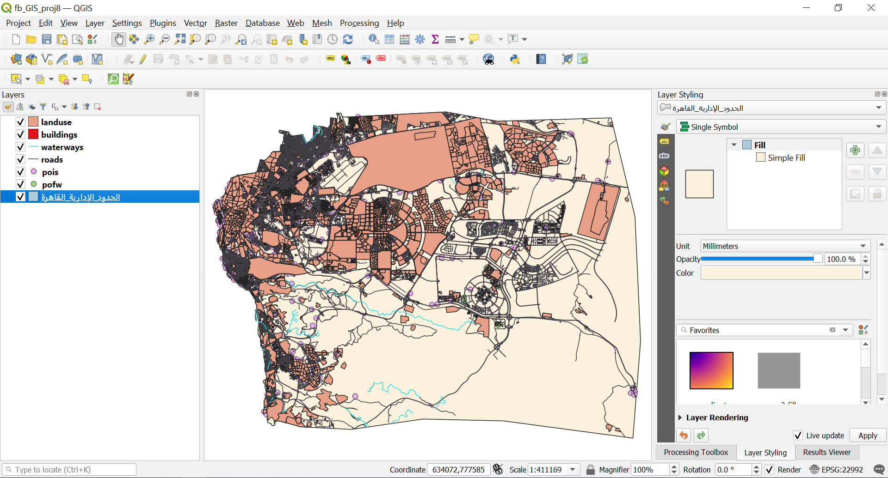

Figure 8.5 - مجموعات بيانات المتجه المحملة: النقاط والخطوط والمضلعات

تحقق من أنّ جميع الطبقات في نفس نظام الإحداثيات (EPSG:22992 ) من خلال النظر في الزاوية اليمنى في الأسفل. إذا كان الأمر كذلك، فأنت تنظر إلى 7 طبقات بيانات متجهة متراكبة.


<h4><strong>
الخطوة 2. فهم ما تنظر إليه.
</strong></h4>

في هذه المرحلة، لدينا 7 طبقات متجهة تم تحميلها في مشروع QGIS الخاص بنا. ستساعدنا الخطوات التالية في فهم بياناتنا.

*   تحقق من عدد الميزات الموجودة في الطبقة - هناك عدة طرق للقيام بذلك:
    *   انقر نقرًا مزدوجًا فوق طبقة الاهتمام خصائص معلومات عدد الميزات (Properties ‣ Information ‣ Feature count)
    *   افتح جدول البيانات لطبقة الاهتمام وانظر إلى الجانب المركزي العلوي


قبل تشغيل أي إحصائيات أساسية، دعنا نكمل جدول البيانات ببعض السمات الهندسية (انظر الى الوحدة 6 للحصول على التفاصيل):

*   طبقة الطرق- roads - احسب الطول لكل جزء من أجزاء الطريق وقم بتخزينه في جدول البيانات: اسم حقل الإخراج  `round($length, 2)`
*   طبقة المباني- buildings - احسب مساحة كل مبنى وقم بتخزينها في جدول البيانات؛ اسم حقل الإخراج  `round($area, 2)`

الآن ، يتم ملء حقول البيانات الجدولية، ولكن إذا لم تكن متأكدًا من وحدة القياس التي قام QGIS فيها بحساب طول أجزاء الطرق ومناطق المباني، سيساعدك التحقق من معلومات النظام الإحداثي.

انقر فوق الزاوية اليمنى السفلية لنافذة خريطة QGIS، على EPSG 4229 وستظهر نافذة مثل تلك الموجودة في figure 6.

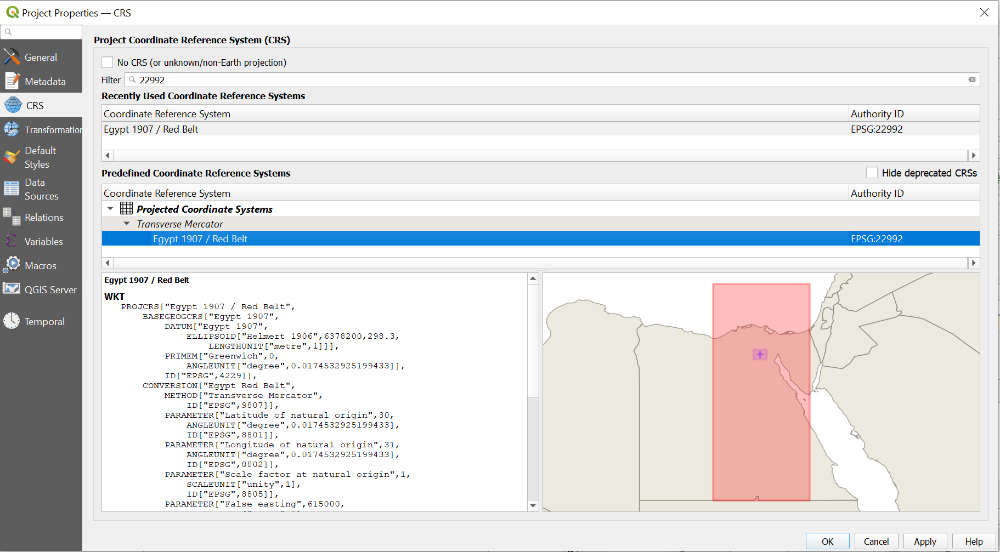

Figure 8.6: QGIS مواصفات النظام المرجعي للإحداثيات المستخدم في مشروع 

وهكذا نجد أن وحدة القياس هي المتر، وبالتالي تقاس الأطوال بالمتر والمساحات بالمتر المربع.

*   قم بتشغيل الإحصائيات الأساسية على الطبقات المحملة لفهم بياناتك بشكل أفضل (figure 7):
*   قائمة المتجه -> أدوات التحليل -> الإحصائيات الأساسية للحقول  - Vector menu ‣ Analysis Tools ‣ Basic statistics for fields
*   نافذة مربع أدوات المعالجة -> ابحث عن "الإحصائيات" - Processing toolbox window ‣ search for 'stats

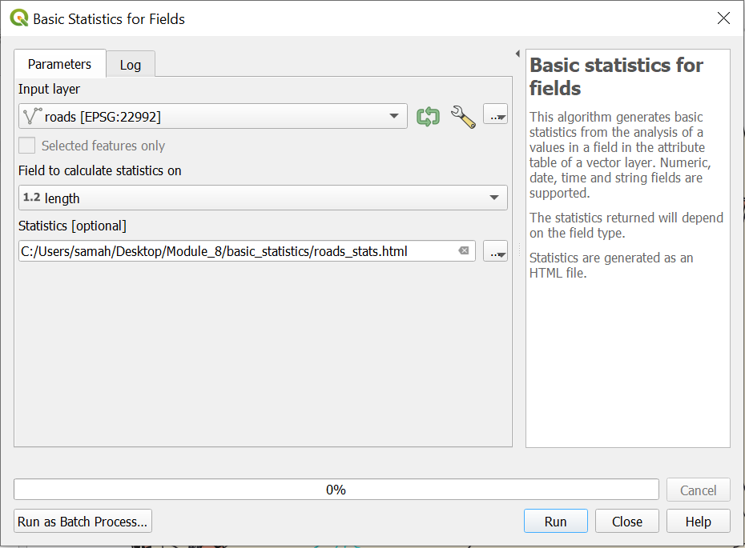

Figure 8.7: إحصائيات أساسيات للحقول

تعتمد الإحصائيات التي تم إرجاعها على نوع الحقل الذي نختاره ويتم إنشاؤها كملف HTML.

فلنقم بتشغيلها على طبقة الطرق الخاصة بنا ونرى النتائج التي نحصل عليها كما في Figure 8.8.


Figure 8.8: الإعداد لتشغيل الإحصائيات الأساسية لطبقة الطرق

ملف الإخراج عبارة عن html يمكن فتحه باستخدام أي متصفح (Firefox و Chrome و Safari وما إلى ذلك) يجب أن يبدو كما يلي:


```
Analyzed field: length
Count: 133733
Unique values: 39301
NULL (missing) values: 0
Minimum value: 0.13
Maximum value: 33192.73
Range: 33192.600000000006
Sum: 23033411.100000158
Mean value: 172.23431090306923
Median value: 68.44
Standard deviation: 507.0873667225947
Coefficient of Variation: 2.944171600094104
Minority (rarest occurring value): 0.13
Majority (most frequently occurring value): 13.78
First quartile: 31.55
Third quartile: 156.6
Interquartile Range (IQR): 125.05
```

من هذه الإحصائيات الأساسية، نجد أن هناك 133733 مقطع طريق في الطبقة المحملة، حيث يبلغ أقصرها 0.13 مترًا والأطول 33192.73 مترًا - حوالي 33 كيلومترًا. اكتشفنا أن مجموع الطرق في القاهرة يبلغ حوالي 23 ألف كم (23033.411 كم). نظرًا لأن المعدّل (mean) أكبر من المتوسط (median)، فإنه يخبرنا أن النصف الثاني من مجموعة البيانات يحتوي على أجزاء طريق أطول وأنه يفوق أجزاء الطريق في النصف الأول. ومع ذلك، يوضح المتوسط أن معظم أجزاء الطريق يبلغ طولها حوالي 1950 متر.

عند تشغيل الإحصائيات الأساسية على مباني الطبقة لفئة <strong><span style="text-decoration:underline;">النوع</span></strong>، نحصل على ما يلي:

```
Analyzed field: type
Count: 15700
Unique values: 32
NULL (missing) values: 12782
Minimum value: apartments
Maximum value: warehouse
Minimum length: 0
Maximum length: 14
Mean length: 1.8350318471337579
```

النتائج لا تبدو متشابهة، ليس لدينا معدّل، ولا متوسط أو انحراف معياري (standard deviation). ذلك لأن حقل السمة الذي قمنا بتشغيل الخوارزمية عليه مختلف، ليس لدينا أرقام ولكن كلمات - أنواع المباني. اكتشفنا أنه من بين 15700 مبنى في القاهرة، 12782 نوعه غير معروف. نكتشف أيضًا أن هناك 32 فئة فريدة.


<h4><strong>
الخطوة 3. تفقّدات أساسية للعثور على الأخطاء في بياناتك بشكل سريع.
</strong></h4>

مجموعات البيانات المثالية الخالية من العيوب تعادل الغاز المثالي في الفيزياء. لا يوجد شيء من هذا القبيل، ولكن يمكن للكثيرين الاقتراب منه. لذلك، قبل إجراء أي نوع من التحليل لاستخراج المعلومات، من الضروري على الأقل إجراء بعض الفحوصات الأساسية حول مدى نظافة البيانات الموجودة لدينا.

هناك العديد من أنواع الأخطاء التي يمكن أن تؤثر على جودة البيانات، وبالنظر إلى نطاق التحليل الجغرافي المكاني الخاص بك، يمكن أن يكون تأثيرها على النتيجة النهائية أكثر أو أقل أهمية. على سبيل المثال، إذا كنت تستخدم البيانات الجغرافية المكانية لتوجيه نفسك من النقطة "أ" إلى النقطة "ب" بالسيارة ، فإن وجود طبقة طرق كاملة مع سماتها توضّح إذا كانت الشوارع في اتجاه واحد أو مغلقة أمام حركة المرور أمر ضروري للحصول على نتيجة قابلة للتطبيق. ومع ذلك، إذا كان التوجيه مشياً على الأقدام، فلن تكون هذه المعلومات مهمة لنتائجك.

عند الإشارة إلى أخطاء البيانات الجغرافية المكانية، هناك مصطلحان رئيسيان يجب فهمهما جيدًا:

*   **الصحّة - Accuracy** هي الدرجة التي تتطابق بها المعلومات الموجودة على الخريطة مع قيم العالم الحقيقي وتنطبق على كل من الهندسة والسمات.

*   تشير **الدقّة Precision**  إلى مستوى القياس ودقة الوصف في مجموعة بيانات جغرافية مكانية.

يشمل <strong>الخطأ</strong> كلاً من عدم صحّة البيانات وعدم دقّتها. تشير ** جودة البيانات - Data quality ** إلى مستوى الصحّة والدقّة في مجموعات البيانات وغالبًا ما يتم توثيقها في تقارير جودة البيانات.

يمكن أن يكون تحليل مجموعة البيانات الجغرافية المكانية وتنظيفها مهمة مرهقة وتستغرق وقتًا طويلاً، ومع ذلك - كما هو موضح في المثال أعلاه - فهي تعد أمرًا ضروريًا. في هذا القسم ، نقدم عددًا قليلاً من وظائف QGIS التي تسمح للمستخدم بإجراء فحوصات سريعة على بيانات المتجه واستخلاص مجموعة من الاستنتاجات الأولية حول جودتها.


<h4><strong>
الفحوصات الطوبولوجية:
</strong></h4>

يقدم QGIS وظيفة أساسية تسمح للمستخدم بإجراء سلسلة من الفحوصات الطوبولوجية على مجموعات بيانات المتجه المحملة، المسماة Topology Checker. يعد Topology Checker برنامجاً مساعداً أساسيًا (Core plugin) ويمكن تنشيطه من مربع حوار إدارة البرامج المساعدة وتثبيتها (Manage and Install Plugins Dialog). افتح مربع حوار إدارة البرامج المساعدة وتثبيتها وتأكد من تنشيط المكون الإضافي Topology Checker (بعلامة الاختيار). يمكن العثور عليها ضمن علامة التبويب المثبتة (Installed tab).

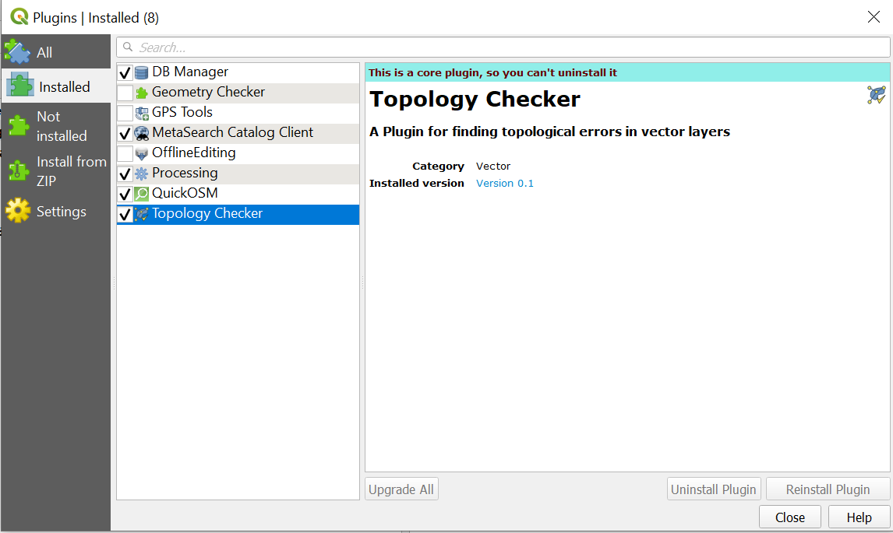

Figure 8.9.a - Topology checker البرنامج المساعد 

لإظهار مدقق الطبولوجيا، قم بتمكينه كلوحة ضمن عرض -> اللوحات -> فاحص الطبولوجيا View ‣ Panels ‣ Topology Checker ) Figure 8.9.b). إذا لم يظهر في قائمة اللوحات، فيمكنك تمكينه بالنقر فوق الزر فاحص الطبولوجيا    على شريط أدوات البرامج المساعدة Plugins toolbar. بمجرد تفعيلها، تبدو النافذة كما في الشكل Figure 8.9.c.


Figure 8.9.b - لوحة فاحص الطوبولوجيا


Figure 8.9.c: نافذة فاحص الطبولوجيا


لتحديد قواعد الطوبولوجيا، انقر فوق الزر الثالث لإعدادات فاحص الطبولوجيا   ، وافتح نافذة كما في Figure 8.10.

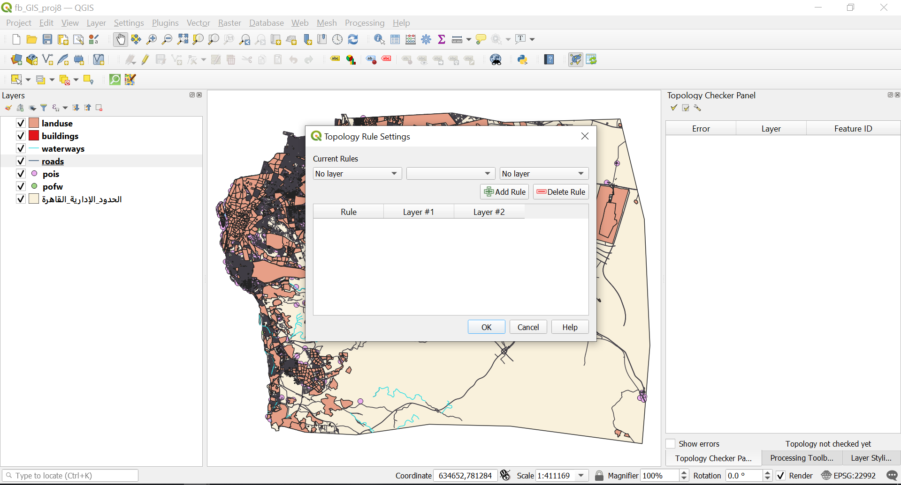

Figure 8.10 - نافذة إعدادات فاحص الطبولوجيا


سنضع عددًا من القواعد للطبقات التي قمنا بتحميلها في مشروع QGIS، مع مراعاة أجسام العالم الحقيقي التي تصورها أي الطرق والمباني والمجاري المائية في منطقة القاهرة.

تكوين الطوبولوجيا واضح ومباشر، حيث إن القواعد التي يمكن تطبيقها بناءً على الطبقة المحددة مضمنة بالفعل في هذه الوظيفة، كما يوضح Figure 8.11.

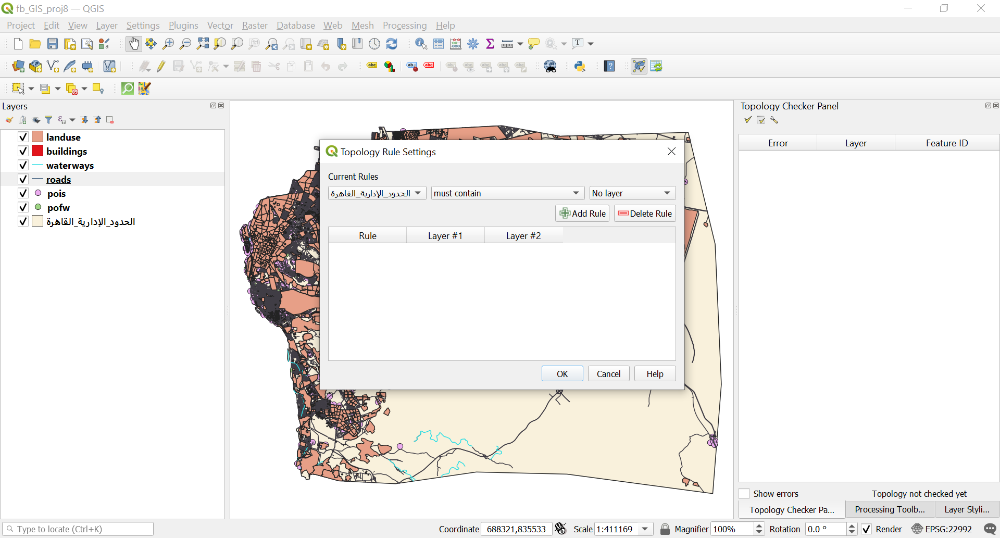

Figure 8.11 - القائمة المنسدلة لقواعد فاحص الطبولوجيا على الطبقة المحددة

اختر قواعد الطبولوجيا كما هو موضح في Figure 8.12.


Figure 8.12: تعيين قواعد الطوبولوجيا

انقر على الرمز الأول  في نافذة Topology Checker للتشغيل وانتظار النتائج. بعد إجراء فحص الطويبولوجيا، يجب أن تبدو نوافذ الخريطة كما في Figure 8.13.

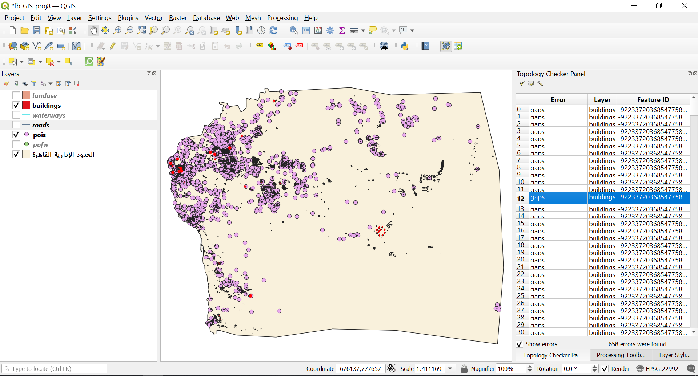

Figure 8.13 - نتائج فحص الطبولوجيا

في الزاوية اليمنى السفلية، تسرد نافذة  فاحص الطبولوجيا جميع الأخطاء التي تم تحديدها بناءً على القواعد التي حددناها في المرحلة السابقة. إذا تم تحديد خانة الاختيار إظهار الأخطاء، فسيتم تمييز الأخطاء على الخريطة باللون الأحمر. يؤدي النقر المزدوج على خطأ محدد إلى نقل الخريطة إلى موقعه.

تُسمى عملية تصحيح الأخطاء في مجموعة البيانات، سواء كانت متعلقة بالهندسة (التكرارات، الفجوات وما إلى ذلك) أو في السمة ذات الصلة (القيم المفقودة، الخطأ الإملائي وما إلى ذلك) تنظيف مجموعة البيانات وهي في معظم الأوقات مرهقة بقدر ما هو ضروري. على الرغم من وجود وظائف لدعم عملية التنظيف شبه التلقائي، غالبًا ما يكون إدخال المستخدم ضروريًا. على سبيل المثال ، في Figure 8.14، قمنا بتكبير خطأ في طبقة نقاط الاهتمام الخاصة بنا، وهي نقطة مكررة. كما يمكننا أن نرى، هناك نقطتان تصوران نفس المقهى (صبحي كابر)، والاختلاف في جدول السمات حيث يتم إدراج إحداها على أنها مطعم والأخرى على أنها منطقة جَذْب سِياحيّ- والذي يفترض أنه قد يكون اسمًا شائعًا.

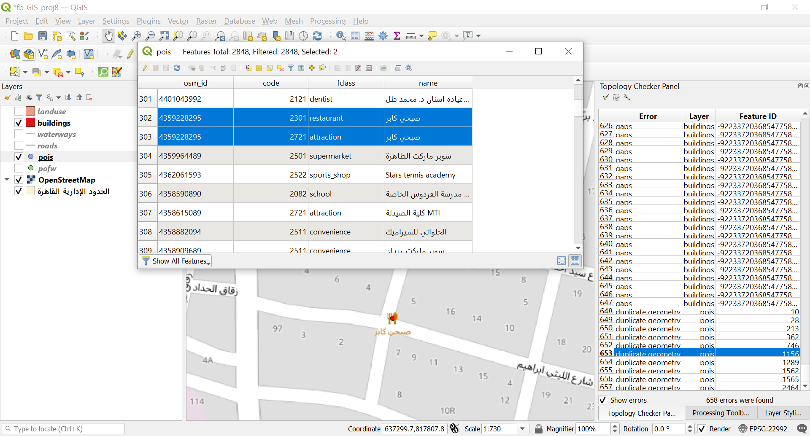

Figure 8.14 - خطأ نقطي مكرر في طبقة متجه نقاط الاهتمام

في هذه الحالة بالذات، من المرجح أن يكون قرار المستخدم هو إزالة النقطة المكررة، حيث يمكن أن يدخل خطأ في التحليل المكاني الإضافي. على سبيل المثال، إذا أراد مسؤول في البلدة معرفة عدد المطاعم والمقاهي في حي معين، فإن النقطة المكررة ستدرج خطأ في النتائج وقد يؤدي ذلك في النهاية إلى قرارات مضللة.

لذلك، سنشرع في الإزالة التلقائية للنقاط المكررة. للقيام بذلك، سوف نستخدم الوظيفة الأساسية لـ QGIS - حذف الأشكال الهندسية المكررة ( Delete duplicate geometries) - الموجودة في مربع أدوات المعالجة (processing toolbox). يجب أن يبدو QGIS الخاص بك كما في Figure 8.15.

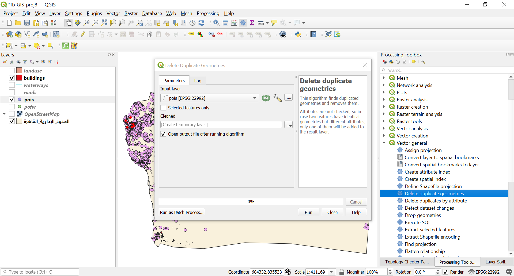

Figure 8.15 - حذف الأشكال الهندسية المكررة على طبقة نقاط الاهتمام

بعد تشغيل الخوارزمية، تعرض نافذة الوظائف النتائج، وقد حددت 10 نقاط مكررة، تمامًا مثل فاحص الطوبولوجيا، وتُعلم المستخدم أنه تم حذف جميع النقاط المكررة، تاركةً طبقة نقاط الاهتمام مع 2838 ميزةً. أعد تسمية هذه الطبقة إلى pois_cleaned. لاحظ أن المخرجات عبارة عن طبقة في الذاكرة، يمكنك جعلها دائمة عن طريق حفظها في ملف.


Figure 8.16 - نتيجة تشغيل حذف الأشكال الهندسية المكررة

ستؤدي إعادة تشغيل فاحص الطوبولوجيا إلى نتائج 0 أخطاء فيما يتعلق بقاعدة الطوبولوجيا لعدم وجود تكرارات هندسية لطبقة نقاط الاهتمام.

انتباه! تأخذ الخوارزمية في الاعتبار الأشكال الهندسية فقط، متجاهلة السمات. فإذا كانت هذه هي حالتنا، فهناك بعض الاختلافات في سمات النقاط المتكرّرة، فلا يستطيع المستخدم أن يتحكّم بأي واحدة منها سيتم الاحتفاظ. لذلك، إذا كانت هناك حاجة للاحتفاظ بجميع المعلومات، فيجب نسخها أولاً إلى جميع الأشكال الهندسية، مما يضمن أنّه عند حذف ميزة مكررة، لا يتم فقدان أي معلومات.

دعونا نجري فحص طبولوجيا آخر، هذه المرة على طبقة المبنى الخاصة بنا. قم بتكوين القواعد التالية:

*   لا يوجد تكرار
*   لا توجد أشكال هندسية غير صالحة


Figure 8.17.a - قواعد فاحص الطوبولوجيا على طبقة المباني

قم بتشغيل الخوارزمية.

يجب أن تبدو النتيجة Figure 8.17.b.

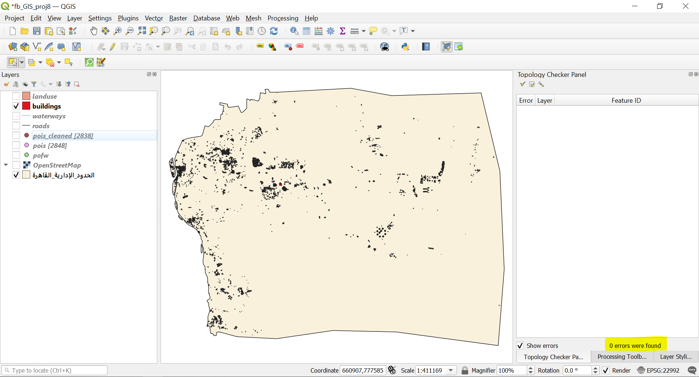

Figure 8.17.b - نتائج فحص الطوبولوجيا على طبقة المباني

لحسن الحظ لا يوجد أخطاء متعلّقة بالتكرار أو الأشكال الهندسية غير الصالحة في طبقة المباني. من جهة أُخرى فإنّ التنظيف الكامل لمجموعات بيانات المتجه المستخدمة لهذه الوحدة هي خارج نطاق عملنا حالياً. تعقيدها يحوّلها إلى وحدة أكثر تقدمًا في حد ذاتها.


<h4><strong>
الخطوة 4. دقق في المعلومات المرفقة بالنقاط والخطوط والمضلعات.
</strong></h4>

لنقم بتشغيل خوارزمية أخرى للتعرف على سمات طبقات القاهرة الخاصة بنا. بعد أن حددنا عدد الميزات التي تحتوي عليها كل طبقة، دعنا نرى السمات الفريدة وعددها في الحالات التالية:

*   طبقة pois_cleaned - سمة fclass ؛
*   طبقة المجاري المائية waterways - السمة fclass ؛
*   طبقة pofw - سمة fclass ؛
*   طبقة الطرق  roads - سمة fclass ؛
*   طبقة استخدام الأرض landuse - السمة fclass ؛


لذلك ، انتقل إلى متجه -> أدوات التحليل -> قائمة القيم الفريدة (Vector ‣ Analysis Tools ‣ List unique values figure 8.18)


Figure 8.18.a - قائمة القيم الفريدة في وظيفة طبقة المتجه


في النافذة التي سيتم فتحها، أدخل اسم كل طبقة وسمة كما تم تعدادها في القائمة أعلاه، ويجب أن تحصل على النتائج التالية:

")

Figure 8.18.b - (Batch Processing) قائمة القيم الفريدة في وظيفة طبقة المتجه


<table>
  <tr>
   <td>
اسم الطبقة 
   </td>
   <td>
عدد القيم الفريدة

   </td>
   <td>
القيم الفريدة

   </td>
  </tr>
  <tr>
   <td>Buildings المباني
   </td>
   <td>
32
   </td>
   <td>stadium;college;NULL;bunker;public;parking;house;warehouse;office;retail;grandstand;industrial;train_station;university;construction;hotel;residential;station;garage;roof;greenhouse;church;hospital;mosque;apartments;service;school;hangar;silo;transportation;ship;commercial
   </td>
  </tr>
  <tr>
   <td>
pois_cleaned - مراكز الإهتمام

   </td>
   <td>
106
   </td>
   <td>alpine_hut;post_box;cinema;stationery;chemist;post_office;hostel;greengrocer;toy_shop;nightclub;toilet;town_hall;doityourself;hospital;supermarket;graveyard;beverages;castle;atm;monument;doctors;swimming_pool;chalet;artwork;shelter;university;newsagent;hotel;outdoor_shop;kindergarten;fast_food;vending_any;cafe;mall;police;optician;public_building;nursing_home;jeweller;waste_basket;picnic_site;tower;pharmacy;wastewater_plant;guesthouse;camera_surveillance;camp_site;car_dealership;dentist;restaurant;bench;convenience;department_store;attraction;veterinary;drinking_water;beauty_shop;community_centre;sports_shop;tourist_info;furniture_shop;garden_centre;viewpoint;shoe_shop;comms_tower;butcher;embassy;memorial;fountain;clothes;arts_centre;museum;sports_centre;laundry;bicycle_shop;pitch;car_wash;library;fire_station;hairdresser;ruins;college;gift_shop;travel_agent;water_tower;bookshop;playground;florist;park;caravan_site;kiosk;computer_shop;telephone;food_court;courthouse;theatre;car_rental;recycling;observation_tower;pub;bank;car_sharing;school;bar;mobile_phone_shop;bakery
   </td>
  </tr>
  <tr>
   <td>
المجاري المائية waterways

   </td>
   <td>
4
   </td>
   <td>drain;river;stream;canal
   </td>
  </tr>
  <tr>
   <td>pofw - أماكن العبادة
   </td>
   <td>
7
   </td>
   <td>muslim_sunni;muslim;christian_catholic;christian_orthodox;jewish;christian_evangelical;christian
   </td>
  </tr>
  <tr>
   <td>
الطرق  roads

   </td>
   <td>
21
   </td>
   <td>living_street;tertiary_link;track;unclassified;trunk;footway;trunk_link;path;motorway;track_grade4;primary_link;secondary;residential;primary;secondary_link;pedestrian;steps;service;motorway_link;track_grade5;tertiary
   </td>
  </tr>
  <tr>
   <td>
استخدام الأرض landuse

   </td>
   <td>
14
   </td>
   <td>commercial;quarry;industrial;recreation_ground;cemetery;park;meadow;grass;orchard;forest;residential;scrub;farmland;military
   </td>
  </tr>
</table>


Table 8.1 - جدول يظهر عدد القيم الفريدة للسمات المحددة وقيمها الفريدة

لمزيد من التحليل المتعمق لسمات طبقات المتجهات الخاصة بنا، سنستخدم البرنامج المساعد GroupStats الذي تم تطويره لدعم حساب الإحصائيات لمجموعات الميزات في طبقة المتجه مما يجعله مفيدًا جدًا لاكتساب المزيد من الفهم لبياناتك، وكذلك لاكتشاف الأخطاء المحتملة في السمات.

أولاً، تأكد من تثبيت وتفعيل الملحق GroupStats. بعد ذلك، لفتح نافذة GroupStats ، انتقل إلى Vector ‣ GroupStats ‣ GroupStats.

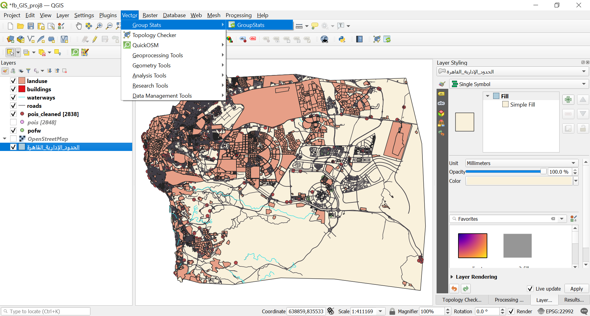

GroupStats ملحق  -  Figure 8.19.a

يجب فتح نافذة جديدة مثل تلك الموجودة في  Figure 8.19.b.


Figure 8.19.b - GroupStats نافذة

وفقًا للتحليل الذي تم إجراؤه مسبقًا، رأينا أنه بالنسبة لمباني الطبقات لدينا 32 نوعًا مختلفًا من المباني، ولكن كم عدد كل منها وما هو إجمالي المساحة البناء التي اتخذتها كل فئة؟ ما هي مساحة المدارس والأسواق والمنازل؟ يمكن أن تساعدنا GroupStats في الإجابة على هذه الأسئلة. على الجانب الأيمن من النافذة، توجد لوحة التحكم، حيث نختار ما نريد حسابه، وكذلك كيفية ترتيب البيانات. باستخدام drag&drop، اتبع الترتيب الموضح في Figure 8.20، ثم اضغط على "حساب".

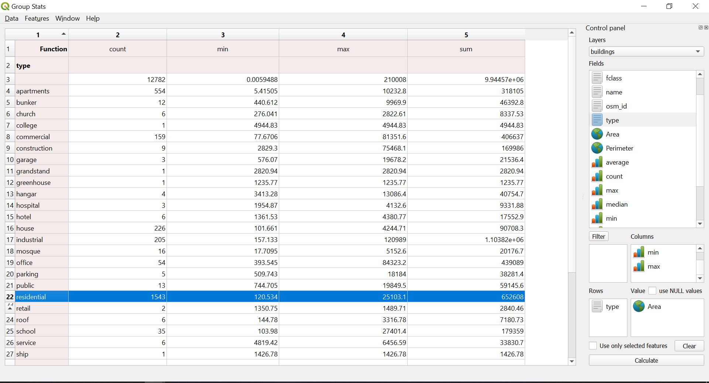

Figure 8.20 -على طبقة المبنى GroupStats تشغيل 

بالنظر إلى النتيجة، يمكننا استخراج رؤى مهمة بخصوص بياناتنا. على سبيل المثال، للأغراض السكنية في القاهرة، لدينا 1543 مبنى بمساحة إجمالية تبلغ 652608 مترًا مربعًا، تقريبًا. 65 هكتارا. نكتشف أيضًا أن أكبر مساحة لهذه المباني السكنية تبلغ 25103.1 مترًا مربعًا وأصغرها تبلغ 120.53 مترًا مربعًا. ويمكن للمرء أن يواصل التحليل للحصول على مزيد من المعلومات القيمة.

يمكن إجراء تحليل آخر مثير للاهتمام على طبقة الطرق. يوضح Figure 8.21 كيفية حساب أطوال الطرق المصنفة حسب نوع الطريق (رئيسي، سكني، طريق سريع وما إلى ذلك) والسرعة القصوى المسموح بها.

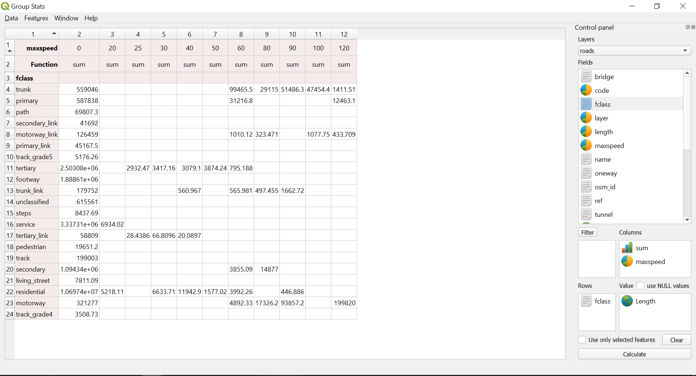

Figure 8.21 - على طبقة الطرق GroupStats تشغيل 


<h4><strong>
أسئلة الاختبار
</strong></h4>

1. هل البيانات الوصفية مهمة؟
*   نعم ، لأنه يعطي نظرة ثاقبة على البيانات الجغرافية التي لا يمكن للمرء الحصول عليها بخلاف ذلك.
*    لا ، إنها مجرد بيروقراطية. 
2. هل الطوبولوجيا ذات صلة بالهندسة أو بجدول البيانات لطبقة متجه؟
*   هندسة طبقة المتجه. 
*   جدول البيانات المتجه
3. ما هو الأهم، الهندسة أم بيانات السمة؟
*   الهندسة.
*   السمة البيانات.
*   كلاهما.


<h3>
المرحلة 2: مقدمة إلى معالجة المتجه
</h3>

قدمت المرحلة الأولى من وحدة المتجه مقدمة موجزة للخطوات التي يجب على المرء اتخاذها للحصول على فهم أساسي للبيانات الجغرافية المكانية المتوفرة لديهم.

تقودك هذه المرحلة إلى عمل أكثر تعمقًا لمعالجة بيانات المتجه. وهذا يساعد على استخلاص رؤى قيمة للمساعدة في اتخاذ القرار. من خلال اتباع المفاهيم الموضّحة في بداية هذه الوحدة، تمثل المعالجة الجغرافية أي عملية يتم تطبيقها على مجموعة بيانات جغرافية. ذلك في نطاق الحصول على مجموعة بيانات تفتح رؤى جديدة حول البيانات. وهذا ما سنحاول القيام به فيما يلي.

هناك العديد من العمليات التي يمكن إجراؤها على مجموعة بيانات جغرافية مكانية واحدة أو أكثر، وخلال هذه الخطوة الأولى، سنقوم بتشغيل بعض أكثر العمليات شيوعًا لفهم كيفية عملها.

الـ Buffer. تخيل أنك بحاجة إلى تحليل تشريع جديد يطلب عدم بناء أي مبنى آخر على مساحة 500 متر حول أماكن العبادة. قد ترغب في معرفة مكان هذه الحدود بالضبط وربما حتى عدد الأمتار المربعة الخاصة بمنطقتك. الخطوة الأولى هي تحديد منطقة عازلة حول أماكن العبادة: متّجه -> أدوات معالجة جغرافية -> مصد (Vector ‣ geoprocessing tools ‣ Buffer). عندما تفتح نافذة المصد، اضبط المعلمات كما في Figure 8.22:


Figure 8.22 -حول أماكن العبادة buffer تحديد معايير المساحة  إلى 500 م 

يوضح Figure 8.23 تفاصيل نتيجة المعالجة الجيولوجية:


Figure 8.23 - على طبقة متجه نقطية Buffer تشغيل 

للإجابة الكاملة على السؤال الأولي، فإن الخطوة التالية هي حساب المناطق لجميع المخازن المؤقتة وتلخيصها (انظرالى المرحلة 1، الخطوة 4) - Figure 8.24.


Figure 8.24 - GroupStats احسب مساحة الطبقة التي تم الحصول عليها حديثًا، ثم احسب المجموع الإجمالي باستخدام

<strong>قصّ أو clip.</strong> تخيل أنك تريد أن تعرف مكان كل المناطق الصناعية المحددة في منطقتك وأيضًا عدد المباني الموجودة داخل هذا المحيط. عند الفحص البصري لبيانات المتجه، تلاحظ أن لديك عددًا من المناطق الصناعية التي تحتوي على العديد من المباني. تريد فصل تلك المباني واستخدامها بشكل أكبر. تتمثل الخطوة الأولى في تحديد جميع الميزات في طبقة استخدام الأرض (landuse) التي لها سمة صناعية (انظر الوحدة 6 لمعرفة كيفية القيام بذلك). بعد ذلك، تذهب إلى  متّجه -> أدوات معالجة جغرافية -> قصّ (Vector ‣ Geoprocessing tools ‣ Clip) اختر الطبقة المراد قصها buildings. يجب أن تظهر نتائجك في Figure 8.26.b.


Figure 8.25.a - fclass = industrial حدد استخدام الأرض حيث


Figure 8.25.b - تم اختيار عدد قليل من المباني واستخدامات الأراضي الصناعية، بحيث يمكن إنهاء الحساب بشكل أسرع

قم بتشغيل خوارزمية القصّ. تأكد من تحديد مربع الميزات المحددة فقط لطبقة التراكب (استخدام الأرض). سيضمن هذا الأمر استخدام الميزات المحددة حاليًا فقط للقص وتسريع العمليات الحسابية.


Figure 8.26.a -Clip تشغيل خوارزمية 

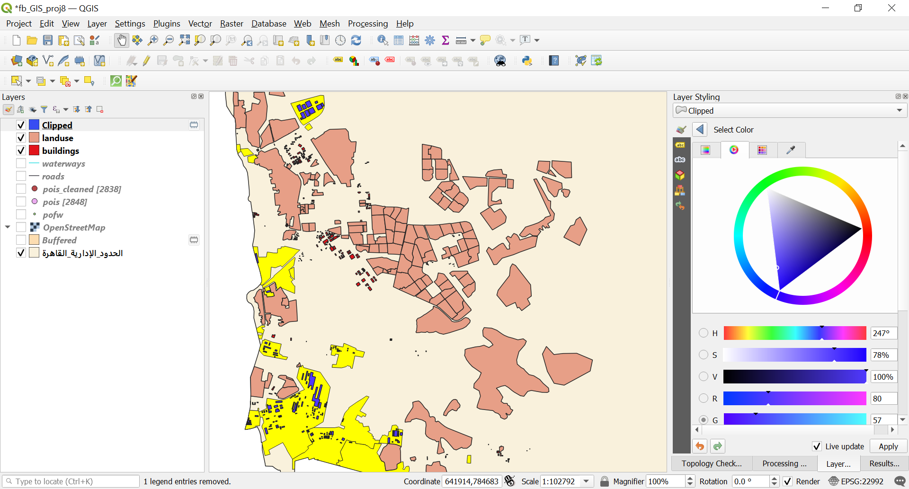

Figure 8.26.b - نتائج وظيفة القصّ

مضلعات Thiessen Voronoi . تخيل أنه يتعين عليك اتخاذ سلسلة من القرارات الإدارية في منطقتك بناءً على عدد المدارس الموجودة والمجالات المحددة التي تخدمها. يمكن أن يكون التحليل الجغرافي المكاني مفيدًا. يمكنك البدء بحساب مضلعات Thiessen. استنادًا إلى منطقة تحتوي على نقطتين على الأقل، يعد Thiessen Polygon شكلًا ثنائي الأبعاد حيث تحتوي حدوده على كل المساحة الأقرب إلى نقطة ما داخل المنطقة أكثر من أي نقطة أخرى خارج هذه المنطقة. ومن الأمثلة الجيدة على استخدامه هي في الأرصاد الجوية، حيث تكون محطات الأرصاد الجوية نقاطًا منفصلة، ومع ذلك فإن المعلومات التي تم جمعها تُقاس على السطح بناءً على مضلعات Thiessen.

للرد على السؤال أعلاه، سنقوم بتشغيل الخوارزمية فقط للنقاط التي لها سمة النوع = مدرسة. وبالتالي، قم بإجراء التحديد كما هو موضح في الوحدة 6. يجب أن يكون لديك 73 معلمًا محددًا في الطبقة pois_cleaned. انتقل إلى متجه -> الأدوات الهندسية -> Voronoi Polygons. بعد تعيين المعايير - حدد طبقة النقطة التي نريد حساب مضلعات Voronoi لها وامتداد 40٪ بحيث يتم احتواء القاهرة بالكامل، يجب أن ترى نتيجة كما في Figure 8.27.d.


تصفية طبقة pois للحصول على جميع المدارس - Figure 8.27.a 

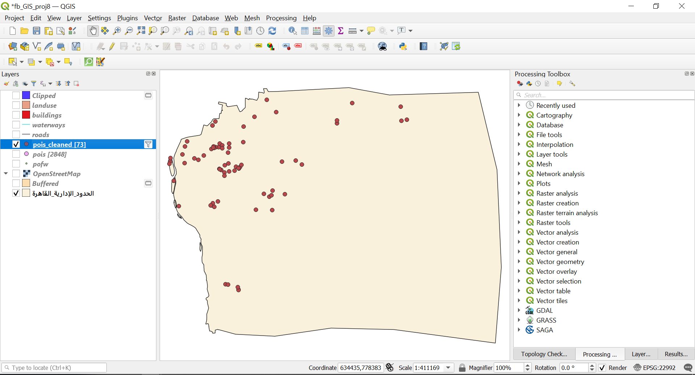

Figure 8.27.b -pois جميع المدارس في طبقة 


Figure 8.27.c -Voronoi polygons تشغيل خوارزمية

 polygons algorithm to a point vector layer")

Figure 8.27.d - على طبقة متجهية نقطية Thiessen Voronoi  نتائج تطبيق خوارزمية مضلعات 

في بعض الأحيان، تفرض الضرورات شرط الحصول على معلومات في مناطق أصغر ومحددة بوضوح ومتساوية وليس لمنطقة كبيرة بأكملها، مثل بلد أو مدينة كبيرة. لذلك، يجب تحليل البيانات وتصورها بطريقة مقسمة ومحددة جيدًا، مما يسمح بإجراء مقارنة قد تكون صعبة بدون مرجع أساسي مشترك.

لنفترض أنه يتعين عليك تقديم تقرير يسمح بإجراء مقارنات للوحدات التي تبلغ مساحتها 10 × 10 كم على الوحدة الإدارية، بما في ذلك:

1. كثافة المساحات الخضراء (الحدائق ، الغابات) في تقرير المساحة المبنية لكل وحدة؛
2. الطول الإجمالي للشوارع لكل وحدة؛
3. الطول الإجمالي للممرات المائية لكل وحدة؛
4. إجمالي عدد المباني العامة لكل وحدة (مدارس، رياض أطفال، مستشفيات، دور البلدية، إلخ).

لقد رأينا أن هناك أدوات يمكن أن تساعدنا في حساب المساحة الإجمالية التي يشغلها نوع معين من الميزات، ولكن الخطوة الأولى هي إنشاء وحدات 10x10 - شبكات الخلايا (cell grids). للقيام بذلك، انتقل إلى: المتجه -> أدوات البحث -> إنشاء الشبكة (Vector ‣ Research Tools ‣ Create grid). قم  بضبط المعايير على:

*   نوع الشبكة Grid type- مستطيل (مضلع)
*   مدى الشبكة Grid extent- طبقة الحدود_الادارية_القاهرة
*   تباعد أفقي - 10 كم
*   التباعد العامودي - 10 كم

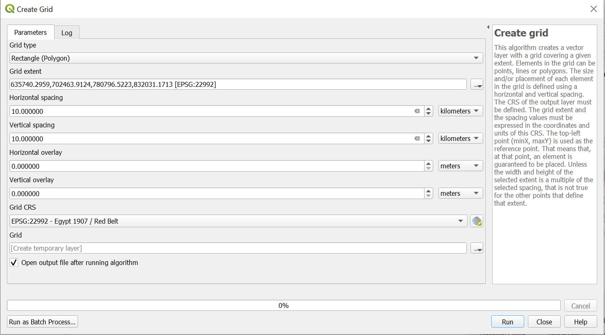

Figure 8.28.a -10كم  x إنشاء شبكة متجه لمدينة القاهرة 10كم 

يجب أن تحصل على نتيجة كما في Figure 8.28.b.

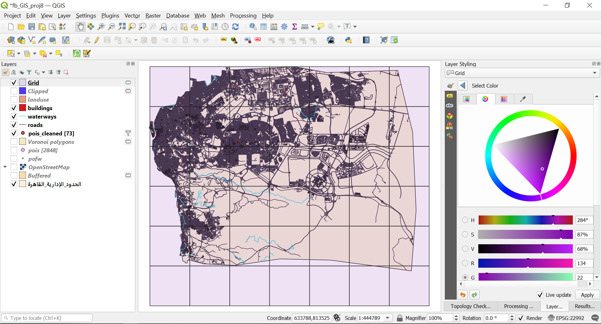

Figure 8.28.b - -10كم  x شبكة متجه لمدينة القاهرة 10كم

للمضي قدمًا في الإجابة عن الأسئلة في تمريننا، نحتاج إلى القيام بما يلي:

1. نسبة المساحات الخضراء (حدائق ، غابات) ومساحة البناء لكل وحدة:

تحتوي طبقة المتجه landuse على بيانات المساحات الخضراء والمساحات المبنية، وهي من نوع المضلع. لمعرفة ما هي "المساحات الخضراء" نحتاج إلى معرفة الفئات الموجودة في مجموعة البيانات. لذلك، نقوم بتشغيل خوارزمية List unique values على السمة fclass ونكتشف أن لدينا فئات "المساحات الخضراء" التالية:

*   `park; meadow; grass; orchard; forest`
 
 وفئات "المساحة المبنية" التالية:

*   `commercial;residential;industrial`

نحصل في النتيجة على Figure 8.29.b.

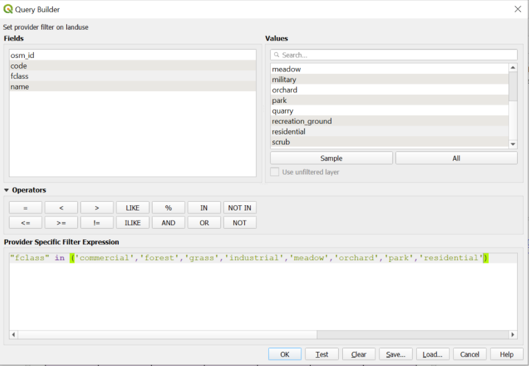

Figure 8.29.a - تصفية المساحات الخضراء والمساحات المبنية في القاهرة


Figure 8.29.b - التوزيع المكاني للمساحات الخضراء والمساحات المبنية في القاهرة


الخطوة الثانية للإجابة على هذا التمرين، هي تحديد مقدار المساحات الخضراء ومقدار المساحة المبنية في كل 10 × 10 كم. للحصول على ذلك سوف نطبق خوارزمية التقاطع (intersect) على الطبقتين المتجهتين المتراكبتين المضلعتين. تستخرج الخوارزمية الأجزاء المتداخلة من الميزات في المدخلات (طبقة استخدام الأرض وطبقة التراكب) و طبقة الشبكة. انتقل إلى متجه -> أدوات معالجة جغرافية -> التقاطع (Vector - Geoprocessing Tools - Intersection) أو ابحث عن التقاطع في مربع أدوات المعالجة أو شريط محدد المواقع (Intersection in the Processing Toolbox or Locator Bar) اضبط معايير الخوارزمية كما في Figure 8.30.

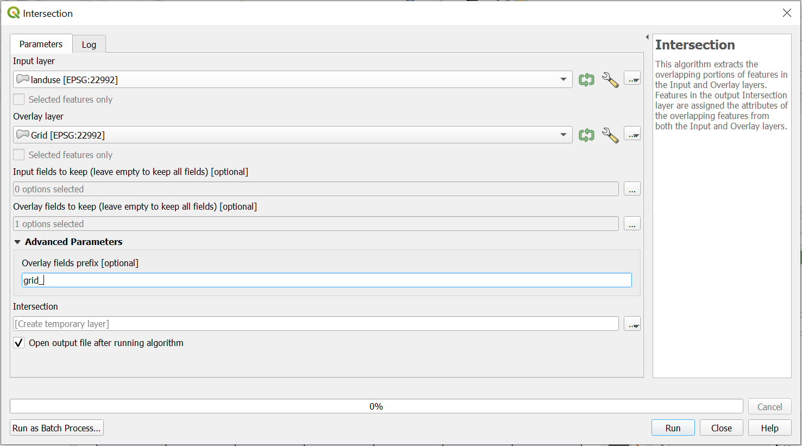

Figure 8.8.30 -(intersect) معايير خوارزمية التقاطع

يجب أن تبدو النتيجة كما في الشكل Figure 8.8.31. 

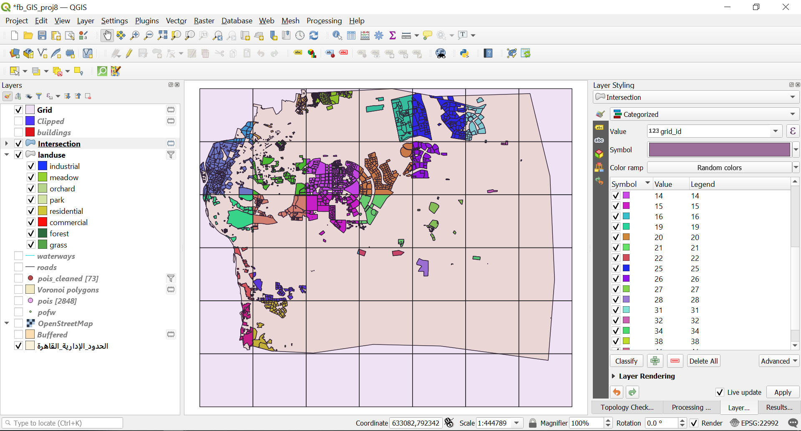

نتيجة تشغيل خوارزمية التقاطع لقص مضلعات استخدام الأرض المتجهية على طبقة الشبكة  - Figure 8.31

الآن لكل وحدة 10x10 كم ، لدينا ميزات استخدام الأرض التي يمكننا العمل بها. يخزّن جدول البيانات أيضًا هذه المعلومات، حيث أن كل خلية شبكة - وحدة - لها معرّف فريد، انظر إلى Figure 8.32.

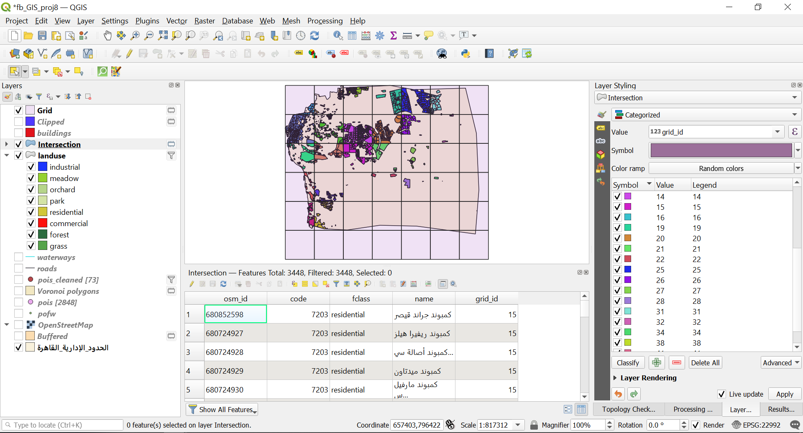

Figure 8.32 - ميزات طبقة استخدام الأراضي المتقاطعة مع كل خلية شبكة وجدول السمات المرتبط بها

الآن، بعد أن أصبح لدينا جميع ميزات استخدام الأراضي لكل وحدة 10x10 كم، سنستمر في فصل الأشكال الهندسية لتلك التي تشكل المساحة الخضراء والتي تشكل المساحة المبنية على النحو المحدد سابقًا لكل خلية شبكية. وبالتالي، بالنسبة للمساحات الخضراء ، سنختار جميع الميزات التي لها قيمة السمة مثل:

```
"fclass" = 'forest','grass','meadow','orchard','park'
```

الآن، في جدول السمات، اكتب في حقل التعبير:

```
"fclass" = 'forest' or "fclass" = 'grass' or "fclass" = 'meadow' or "fclass" = 'orchard' or "fclass" = 'park'
```

وكذلك، يمكنك ببساطة كتابة:

```
"fclass" IN ('forest','grass','meadow','orchard','park')
```

قم بتصدير الميزات المحددة كـ green_spaces_gridded (انظر الى الوحدة 6 لمزيد من التفاصيل). لا تنس التحقق من حفظ الميزات المحددة فقط (Save only selected features). يجب أن يحتوي الإخراج الجديد على 567 ميزة. كرر نفس الخطوات بالنسبة للمساحة المبنية.

حدد الميزات في استخدام الأراضي التي لها قيمة سمة الـ fclass على النحو التالي:

```
"fclass" = 'commercial', 'industrial', 'residential'
```
عن طريق كتابة التعبير التالي في نافذة عامل التصفية المستند إلى التعبير (Expression based filter window):

```
"fclass" = 'commercial' or "fclass" = 'industrial' or "fclass" = 'residential' 
```

حدد الأشكال الهندسية التي تمت تصفيتها وقم بتصديرها builtup_spaces_gridded. يجب أن يحتوي الإخراج الجديد الخاص بك على 2881 ميزة.

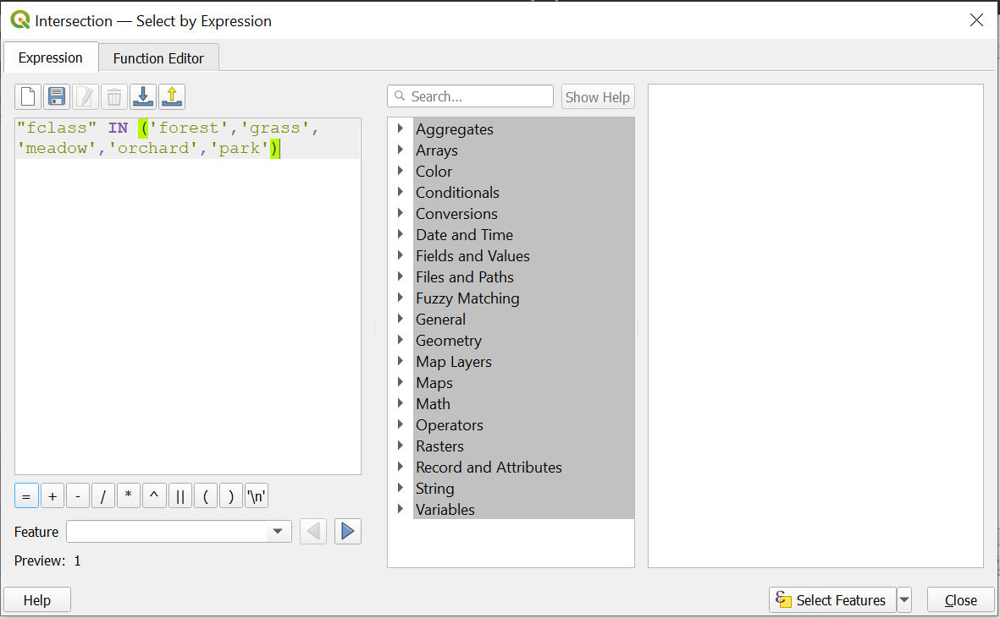

Figure 8.33.a - اختيار المساحات الخضراء

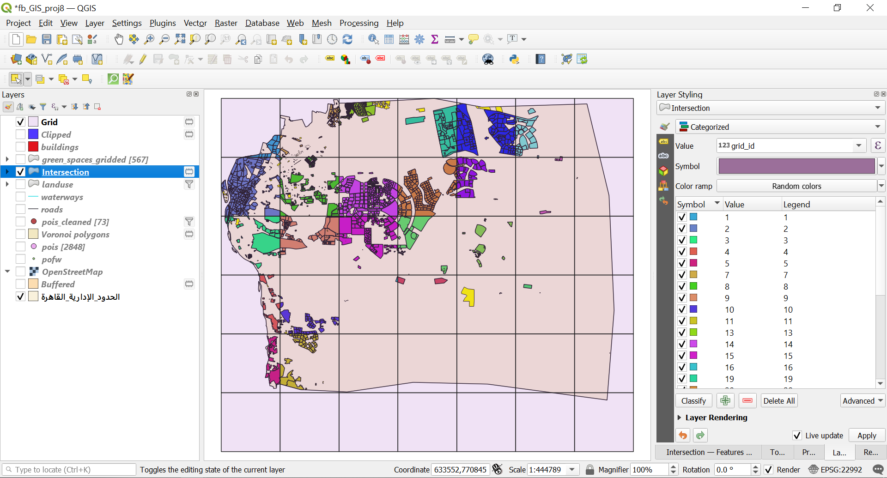

Figure 8.33.b - المساحات خضراء المختارة


Figure 8.33.c - المساحات الخضراء والمبنية

بعد ذلك، احسب المساحة التي تشغلها كل ميزة من الطبقتين. انتقل إلى جدول البيانات لكل طبقة ثم أضف العمود الهندسي "area" عن طريق إدراج التعبير التالي: (round($area,2 في آلة حاسبة الحقل. (انظر الوحدة 6 للحصول على التفاصيل ، إذا لزم الأمر). ومع ذلك، فإن شبكة 10x10 كم في مدينة القاهرة بها عدد معروف من الخلايا الشبكية، وهذا هو 42. لذلك، نحتاج إلى تلخيص المناطق لجميع أنواع المساحات الخضراء (غابات ، حدائق ، إلخ) مساحات مبنية (تجارية ، والسكنية ، وما إلى ذلك) ونطبق عليها عملية الضمّ "join" وفقًا لجميع الخلايا الشبكية البالغ عددها 42 خلية. للقيام بذلك، سنستخدم البرنامج الإضافي GroupStats لنجمع لكل grid_id جميع الفئات الخضراء والفئات المبنية. بالنسبة لطبقة المتجه green_spaced_gridded، اضبط المعايير كما في Figure 8.33.d.

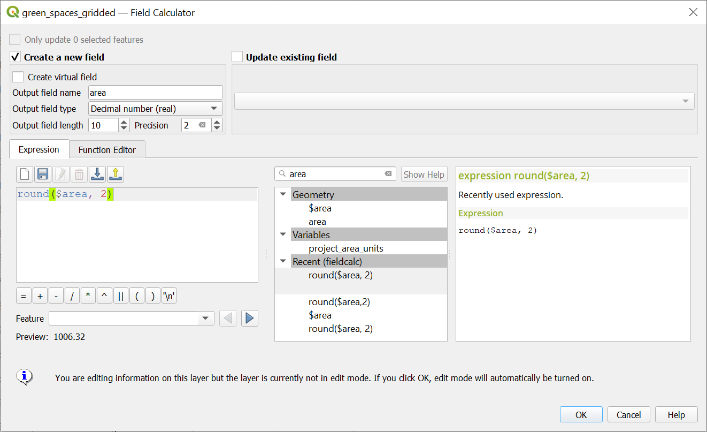

Figure 8.33.d - حساب مساحة كل ميزة

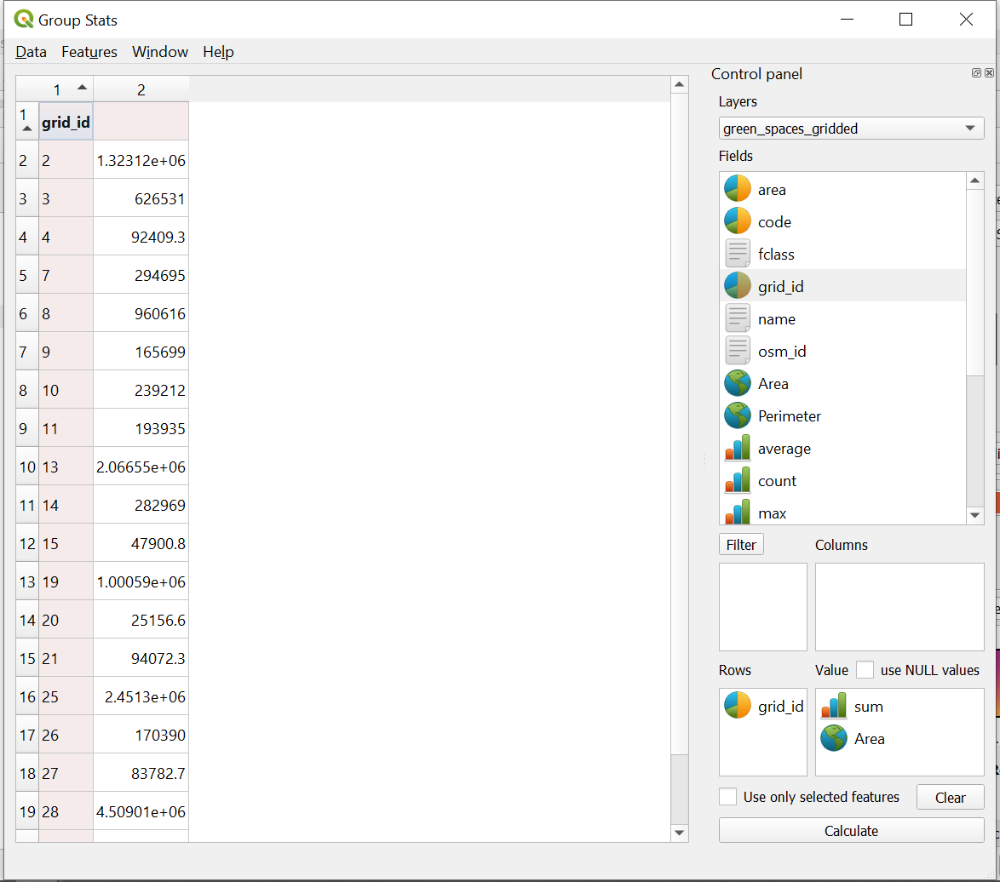

Figure 8.33.e - لجمع المساحات الخضراء في كل خلية  GroupStat إعداد معايير 

الآن، احفظ النتائج كملف csv. باسم <code>green_spaces_gridded</code>. انتقل إلى البيانات ‣ حفظ الكل في ملف  CSV.

(Data ‣ Save all to CSV file.)

قم بتشغيل GroupStats للمساحة المبنية بنفس الطريقة ثم احفظها كملف csv باسم <code>builtup_spaces_gridded</code>.

بعد ذلك، سنقوم بإحضار ملفي الـcsv المحسوبين باستخدام GroupStat إلى QGIS (طبقة -> إضافة طبقة -> Add delimited text layer - المزيد من التفاصيل في الوحدة 2).

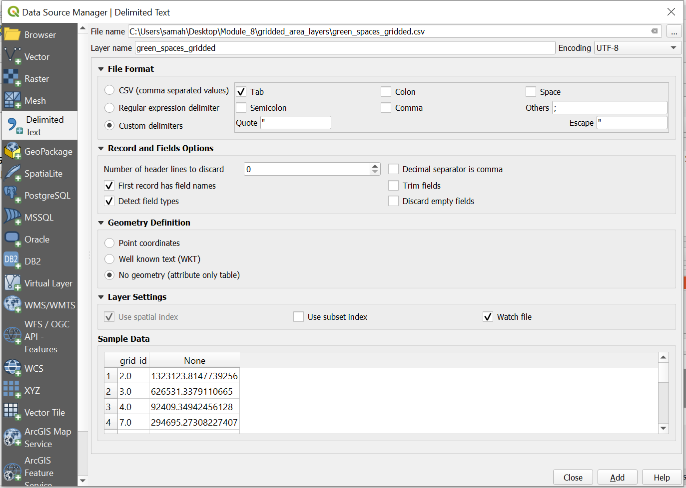

Figure 8.34.a - green_spaces_gridded CSVتحميل 

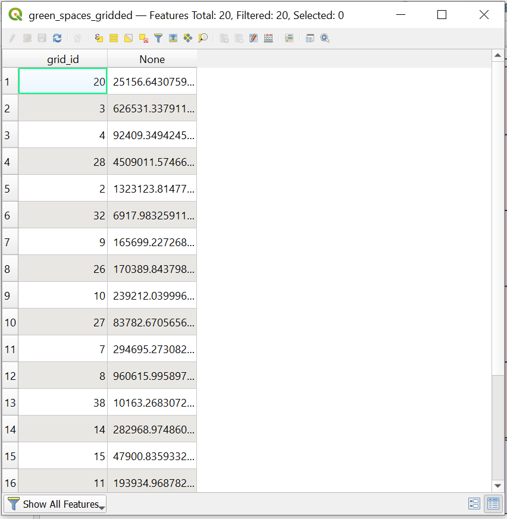

Figure 8.34.b - green_spaces_gridded CSV جدول السمات لملف

للمضي قدمًا، نحتاج إلى ضم "join" المساحات المحسوبة - الخضراء والمبنية - إلى كل شبكة خلايا 10x10 كم. لذلك، حدد طبقة متجه الشبكة 10 كيلومترات في جدول المحتويات، وافتح نافذة الخصائص وانتقل إلى الضمّ. تسمح هذه الوظيفة "بالانضمام" من خلال حقل سمة مشترك. في حالتنا، باستخدام قيمة Grid_id المشتركة لنقوم بضمّ مجموع المساحات المبنية والمساحات الخضراء من ملفي csv اللذين تم الحصول عليهما في الخطوة السابقة.

في نافذة الضمّ، اضغط على زر الإضافة الخضراء الموجود في الأسفل  طبقة وقم بتعيين المعلمات كما في Figure 8.35.c، للمساحات الخضراء.

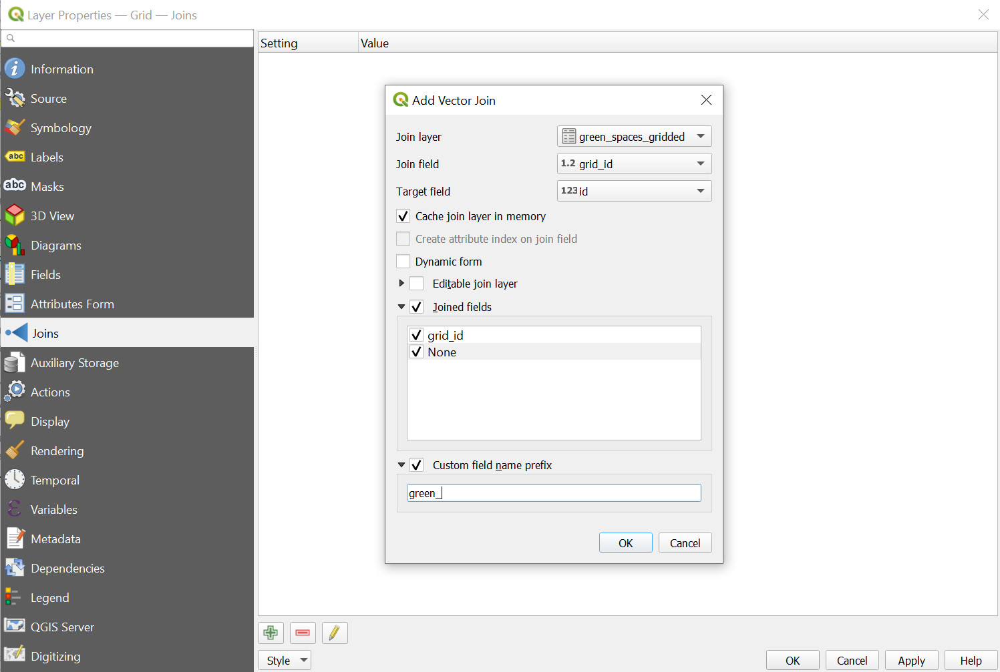

Figure 8.34.c - إعداد المعايير لـ "ضم" مجموع المساحات الخضراء والمبنية لكل خلية شبكية - 10x10km وحدة عن طريق الحقل المشترك grid_id / id 

كرر هذه الخطوة للمساحات المبنية.

تظهر نتائج الـ " joins" في جدول السمات، كما يتضح من Figure 8.35.b. لقد احتفظنا بـ Grid_id في كلا الـ " joins"، للتأكد من عدم حدوث أخطاء. يمكننا التحقق بشكل مرئي سريعًا للتأكد من أن حقول السمات الثلاثة: id ، و builtupgrid_id ، و greengrid_id هي نفسها تمامًا.

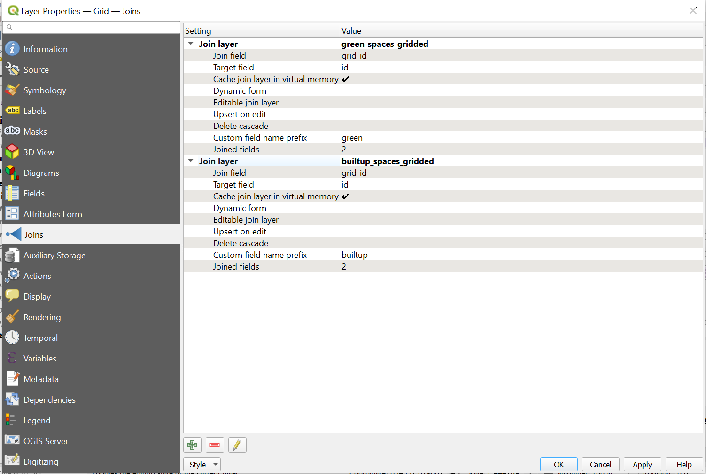

Figure 8.35.a - تمّ ضمّ الملفين الخاصيين بالمساحات الخضراء و المبنية في طبقة الشبكة

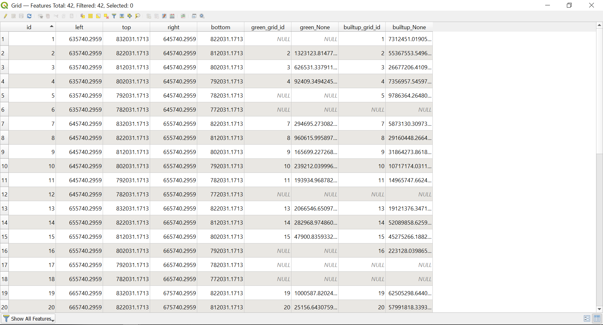

Figure 8.35.b - جدول السّمات الخاص بطقبة الشبكة والذي يتضمّن مجموع المساحات الخضراء و المينية

الآن وبعد أن جمعنا جميع المعلومات المطلوبة حول المساحات الخضراء والمبنية في جدول البيانات لطبقة الشبكة، فكل ما نحتاج إلى فعله هو حساب النسبة المئوية لهذه المساحات داخل خلايا الشبكة بطول 10 × 10 كيلومترات. سنقوم بحسابها باستخدام حاسبة المجال، عبر التعابير التالية: <code>(round(100*green_None/100000000, 5</code> تحت اسم greenPer و <code>round(100*builtup_None/100000000, 5).</code> تحت اسم builtupPer. بعد ذلك، نضيف حقلاً جديدًا نحسب فيه تقرير "greenPer / builtupPer"، وبالتالي نصل إلى الإجابة على طلبنا: نسبة المساحات الخضراء (حدائق ، غابات) والمساحة المبنية لكل وحدة:<code> ( round( "greenPer" / "builtupPer" , 5.</code>

للحصول على نظرة عامة وواضحة حول مجموعة البيانات الخاصة بنا، نقوم بإدخال القيمة 1000 على جدول السمات في الحالات التي لا توجد فيها مساحة مبنية في خلية الشبكة، كذلك نقوم بإدخال القيمة 999 في الحالات التي لا توجد فيها مساحة خضراء، وأخيراً نقوم بإدخال القيمة 1001 في حال كانت كلتا القيمتين فارغتين. لهذا يمكننا استخدام التعبير التالي:

```
CASE 
WHEN (greenPer is NULL) and (builtupPer is not NULL) then 999
WHEN (builtupPer is NULL) and (greenPer is not NULL) then 1000
WHEN (greenPer is NULL) and (builtupPer is NULL) then 1001
ELSE round(greenPer / builtupPer, 5)
END
```

ستبدو النتيجة النهائية كما في  Figure 8.36.e.  


Figure 8.8.36a - نسبة المساحات الخضراء في شبكة 10 كم × 10 كم 


Figure 8.36.b - النسبة المحسوبة للمساحات الخضراء والمبنية


Figure 8.36.c - حساب نسبة المساحات الخضراء بالنسبة للمبنية

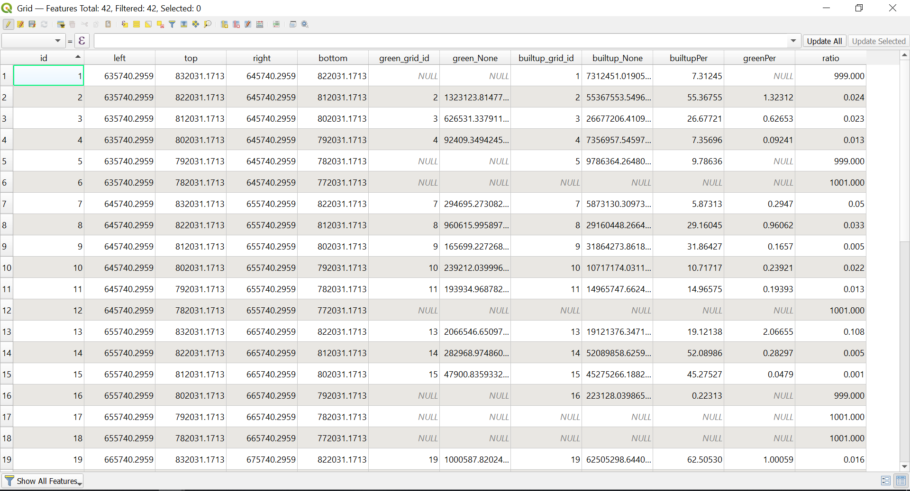

Figure 8.36.d - نسبة حساب نسبة المساحات الخضراء بالنسبة للمبنية

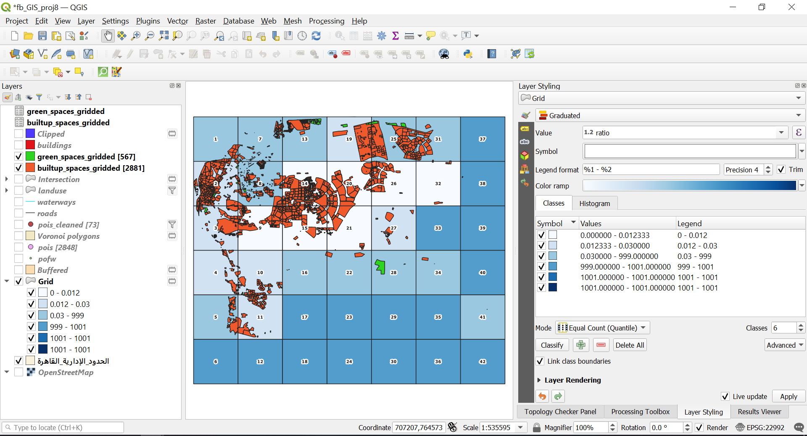

Figure 8.36.e - نسبة المساحات الخضراء والمباني في شبكة 10 كم × 10 كم

2. الطول الإجمالي للشوارع والمجاري المائية لكل وحدة:

لإنجاز هذه المهمة، يقدم QGIS خوارزمية تأخذ طبقة مضلع وطبقة خط وتقيس الطول الإجمالي للخطوط والعدد الإجمالي للخطوط التي تعبر كل مضلع. تحتوي الطبقة الناتجة على نفس الميزات مثل طبقة المضلع المدخلة، ولكن مع سمتين إضافيتين تحتويان على طول وعدد الخطوط عبر كل مضلع. قم بالبحث في "تجهيز الأدوات أو مربع أدوات المعالجة" (processing toolbox) عن "مجموع أطوال الخطوط" ( Sum Line Lengths) أو اذهب إلى تحليل المتجهات -> مجموع أطوال الخطوط (vector analysis → Sum Line Lengths) وقم بتعيين المعلمات على النحو التالي:


*   المضلعات - الشبكة
*   خطوط - الطرق
*   اسم حقل "طول الخطوط" - roadsL.
*    اسم حقل "عدد الخطوط" - roadsC.

يمكنك إنشاء طبقة مؤقتة أو حفظها كملف على جهاز الكمبيوتر الخاص بك. إذا كنت تستخدم تمثيل "Equal interval"، فيجب أن تبدو خريطتك كما في Figure 8.37.c.


Figure 8.37.a - Sum Line Lengths معايير

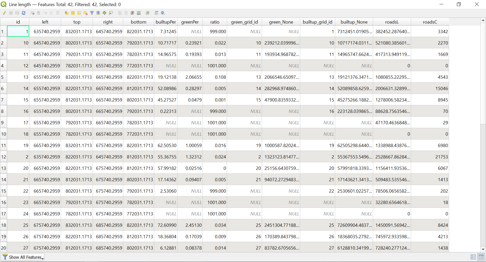

Figure 8.37.b - أطوال الطرق وعددها لكل خلية شبكة

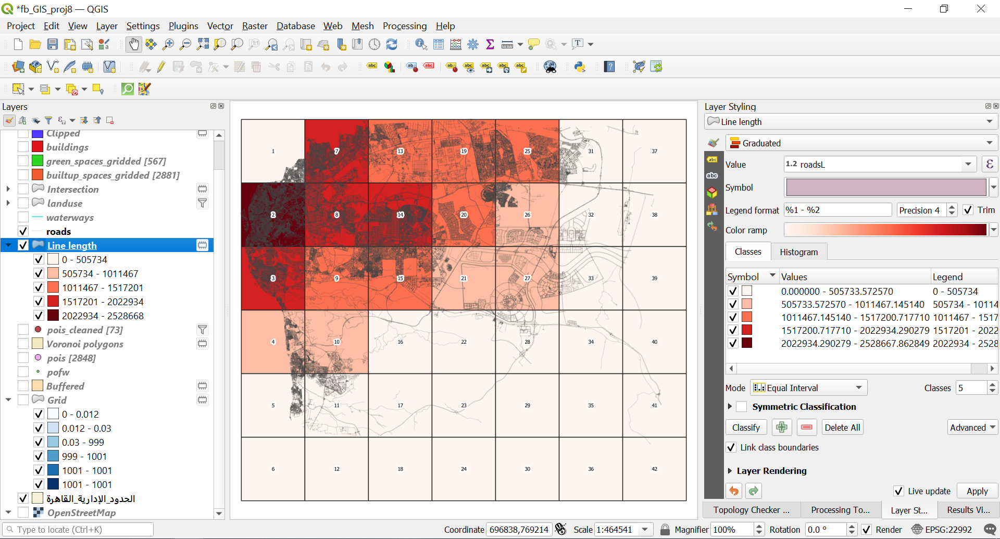

Figure 8.37.c - التوزيع المكاني لوحدات 10 × 10 كم التي تحتوي على معظم الطرق

الآن ، كرر نفس المعالجة لأطوال المجاري المائية في كل خلية شبكية. سيساعدك تشغيل العملية على ملف الشبكة الذي تم الحصول عليه مسبقًا في الحصول على جميع المعلومات المرتبطة بنفس الشكل الهندسي والتي تم الحصول عليها حتى الآن. ننصحك بحفظ هذا الملف على جهاز الكمبيوتر الخاص بك باستخدام line_lengths_gridded. إذا كنت تستخدم فواصل طبيعية للتمثيل "Natural Breaks"، فيجب أن تبدو خريطتك كما في Figure 8.38.

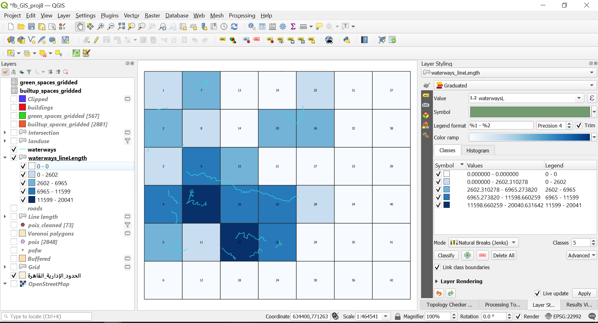

Figure 8.38 - التوزيع المكاني لوحدات 10 × 10 كم التي تحتوي على معظم المجاري المائية

3. إجمالي عدد المباني العامة (المدارس، ورياض الأطفال، والمستشفيات ، وقاعات المدينة ، إلخ) لكل خلية شبكية

لحساب العدد الإجمالي للمباني العامة في وحدة 10x10، سنستخدم طبقة pois_cleaned. أولاً، نقوم بالذهاب إلى متجه -> أدوات التحليل -> قائمة القيم الفريدة (Vector ‣ Analysis Tools ‣ List unique values). وسنقوم أيضاً بتحديد المبنى الذي نعتبره عامًا. سنختار من طبقة بيانات نقطة المتجه (pois) الميزات التالية: <code>"fclass" = 'town_hall' <strong>or</strong> "fclass" = 'kindergarten' <strong>or</strong> "fclass" = 'hospital' <strong>or</strong> "fclass" = 'doctors' <strong>or</strong> "fclass" = 'fire_station' <strong>or</strong> "fclass" = 'community_centre' <strong>or</strong> "fclass" = 'courthouse' <strong>or</strong> "fclass" = 'museum' <strong>or</strong> "fclass" = 'school' <strong>or</strong> "fclass" = 'theatre. </code> يمكن كتابتها طريقة أخرى كالتالي:<code> "fclass" <strong>in</strong> ('town_hall', 'kindegarten', 'hospital', 'doctors', 'fire_station', 'community_centre', 'courthouse', 'museum', 'school', 'theatre').</code> يجب أن يحتوي اختيارك على 211 ميزة في المجموع.

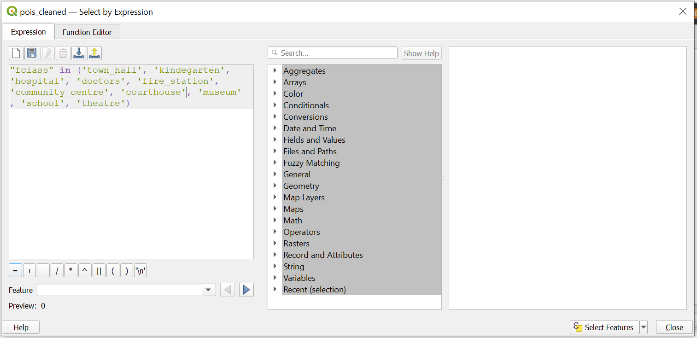

Figure 8.39.a - تحديد نقاط الاهتمام العامة

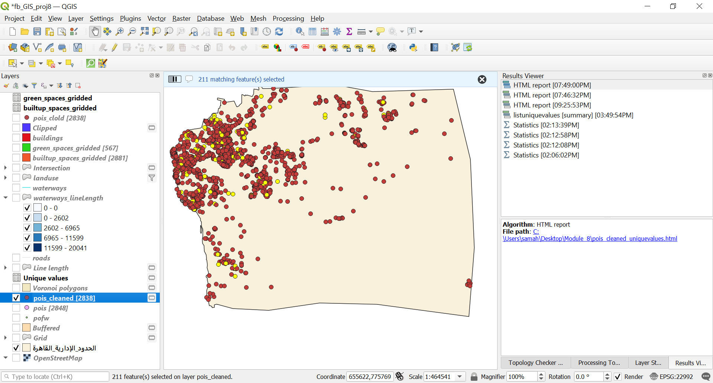

Figure 8.39.b -نقاط الاهتمام العامة المحددة 

للإجابة على طلبنا، سنستخدم خوارزمية متجه -> أدوات التحليل -> عدد النقاط في المضلّع ( Vector ‣ Analysis Tools ‣ Count points in polygon). تأخذ هذه الخوارزمية طبقة نقطية وطبقة مضلّع وتحسب عدد النقاط من الطبقة الأولى في كل مضلع من الطبقة الثانية. يتم إنشاء طبقة مضلعات جديدة، بنفس المحتوى تمامًا مثل طبقة المضلعات المدخلة، ولكنها تحتوي على حقل إضافي مع عدد النقاط المطابق لكل مضلع. اضبط الطبقة النقطية على pois_cleaned وطبقة polygon Grid layer مع معلوماتها المحسوبة في الجولة السابقة. بالنسبة للنقاط، حدد خانة اختيار Selected features only، بحيث تحسب الخوارزمية النقاط المحددة فقط( النقاط العامة المهمة). احفظ ملف الإخراج باسم grid_info.

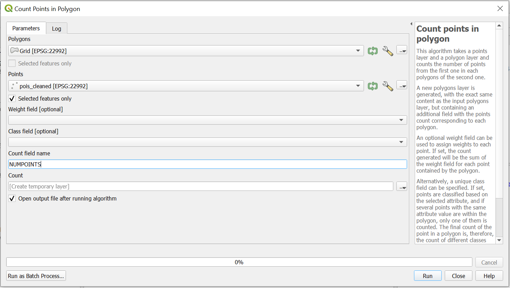

Figure 8.39.c - عدّ نقاط الإهتمام العامّة في كل شبكة 10 × 10 كم


Figure 8.39.d -  التوزيع المكاني لكثافة نقاط الاهتمام العامة لكل وحدة


<h4><strong>
أسئلة الاختبار
</strong></h4>

س: إذا كان لدي طبقتان متجهتان - إحداهما تمثل امتداد المدينة حيث أعمل والأخرى تمثل الطرق المبنية في البلد بأكمله - ما هي أداة المعالجة التي سأستخدمها لاستخراج الطرق في مدينتي فقط: قص أم مصد (buffer or clip) ؟

ج. القصّ أو clip

س. هل أداة التخزين المؤقت مفيدة في الحالة التالية: لديّ طبقة متجه مضلع بها آثار تاريخية في منطقتي وأريد رسم منطقة حماية تبلغ 50 مترًا حولها؟

ج: نعم

س: أي من أدوات المعالجة الجغرافية الثلاثة تستخدمها لدمج طبقتين متجهتين متشابهتين؟ مضلعات Voronoi polygons, dissolve, intersection؟

ج: Dissolve.


<h3>
المرحلة 3: الإحصاء الجغرافي. الإستيفاء - تقدير البيانات المفقودة
</h3>

تقدم المرحلة الأخيرة من وحدة بيانات المتجه مفهوم <strong>تقدير البيانات (estimating missing data)</strong>. لقد اعتدنا على التقدير حول مواضيع مختلفة تقريبًا بشكل يومي، على سبيل المثال مقدار الوقت الذي يستغرقه الانتقال من المنزل إلى العمل في ظروف معينة. نحن معتادون على تقديم أفضل تخمين لدينا، بناءً على الخبرة السابقة والحدس. ومع ذلك، عند تقدير البيانات المفقودة ، يتم استبدال أفضل تخمين بمعادلات رياضية محددة جيدًا وذات قيود معروفة جيدًا.

يتطلب الموضوع معرفة كبيرة في الإحصاء ويجب دائمًا مراعاة النتائج على ضوء قيوده.

سوف نقدم مثالًا قصيرًا لتقدير البيانات و منه ننتقل إلى الوحدة التالية - <strong>معالجة البيانات النقطية (raster data processing)</strong>.

<strong>الاستيفاء (Interpolation)</strong> هو عملية رياضية يمكن من خلالها تقدير القيم المفقودة بناءً على عدد محدود من القيم الموجودة. وهذه المواقف شائعة - تخيل معلومات الأرصاد الجوية. لا يمكن قياس البيانات المتعلقة بدرجات حرارة السطح وكمية الأمطار التي سقطت إلا في نقاط محددة في محطات الأرصاد الجوية المعايرة، وليس على السطح بأكمله. ومع ذلك، ليس لدينا "نقاط عمياء" دون درجات حرارة على الخرائط التي نراها في قسم الأرصاد الجوية. وبالتالي، يتم الحصول على باقي القيم عن طريق الاستيفاء. الافتراض الذي يستند إليه الاستيفاء هو أن الكائنات الموزعة مكانيًا مرتبطة مكانيًا؛ بعبارة أخرى، تميل الأشياء القريبة من بعضها إلى أن تتمتع بخصائص متشابهة.

هناك العديد من طرق الاستيفاء المطبقة في حزم برامج نظم المعلومات الجغرافية، ويعتمد تحديد الطريقة الأفضل في كل حالة على خصوصية البيانات، وما تمثله، ومدى فهم الإحصاء الجغرافي لدى المستخدم الذي يقوم بالاستيفاء.

لإجراء فحص سريع لطرق الاستيفاء المتوفرة في QGIS، انتقل إلى "مربع أدوات المعالجة" (Processing Toolbox) واكتب في شريط البحث "interpolation". يجب أن تبدو النتيجة كما في Figure 8.40.

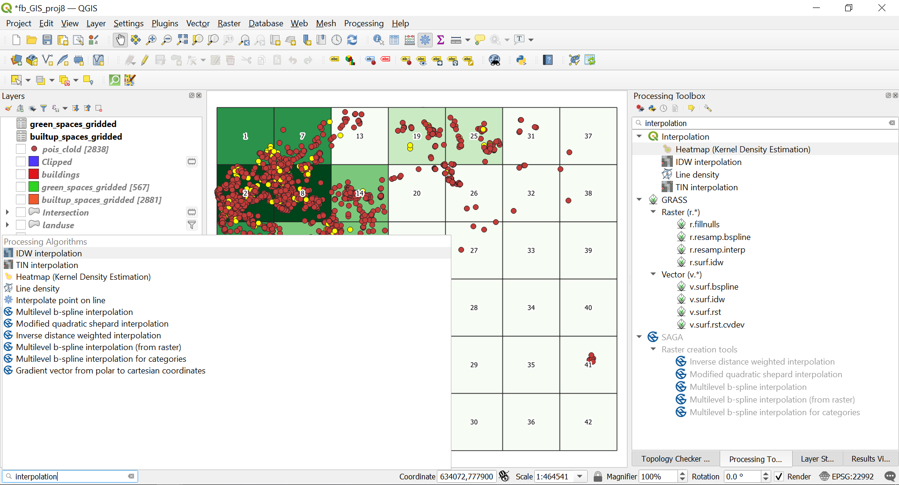

Figure 8.40 - QGIS طرق الاستيفاء المتاحة في 

يمكن للمستخدم الوصول إلى خوارزميات أخرى، يتم تنفيذها في GRASS أو SAGA، نتيجة التكامل في QGIS لهذه الحلول البرمجية القوية جدًا (وغيرها).

يعد الغوص في الرياضيات وراء كل خوارزمية استيفاء خارج نطاق هذه الوحدة. ومع ذلك، لأغراض العرض التوضيحي، سنقوم بمحاكاة استيفاء بيانات هطول الأمطار للحصول على مجموعة بيانات سلسة عن كمية الترسبات التي سقطت في منطقة اهتمامنا مدينة القاهرة.

نظرًا لأن التمرين مخصص فقط لأغراض العرض، سننشئ مجموعتنا الخاصة من بيانات النقاط - لتمثيل محطات الأرصاد الجوية حيث تم تسجيل قيم هطول الأمطار لمدة أسبوع واحد.

وبالتالي ، فإن الخطوة الأولى هي إنشاء طبقة متجهية جديدة - نوع النقطة - بنقاط يتم تعيينها عشوائيًا داخل نطاق القاهرة. هناك عدة طرق للقيام بذلك، إما باستخدام خوارزمية النقاط العشوائية في المضلعات (Random points in polygons) .. أو باستخدام خوارزمية النقاط العشوائية في حدود الطبقة (Random points in layer bounds) ... انتقل إلى المتجه -> أدوات البحث -> النقاط العشوائية في المضلعات (Vector ‣ Research Tools ‣ Random points in polygons). يمكنك أيضًا البحث عن الخوارزمية في مربع أدوات المعالجة أو شريط محدد المواقع. اختر المعايير التالية:

*   93 نقطة
*   الحد الأدنى 5 كم.

يجب أن تبدو النتيجة في Figure 8.41.

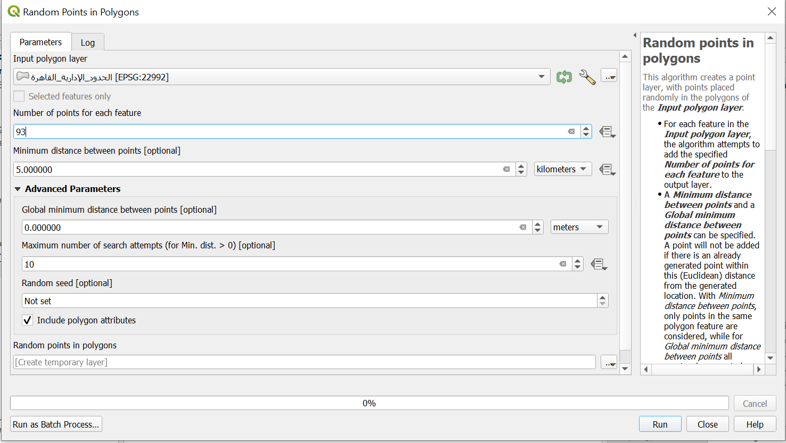

Figure 8.41 -تكوين نقاط عشوائية داخل طبقة المضلع 

ستبدو الطبقة النقطية الناتجة تقريبًا كما في Figure 8.42. 

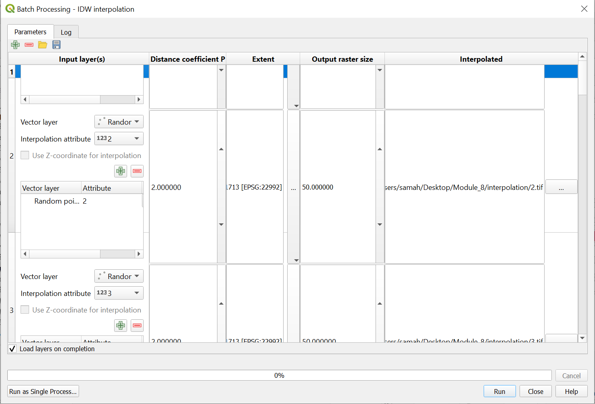

Figure 8.42 - طبقة بيانات النقطة - تم إنشاؤها عشوائيًا ضمن مضلعات محددة

الآن بعد أن أصبح لدينا محطات الأرصاد الجوية التخيلية التي تقيس الترسبات في مقاطعة القاهرة، سنواصل بإضافة قياسات وهمية على مدار 7 أيام.

للقيام بذلك، يمكننا استخدام الوظيفة العشوائية التي يوفرها QGIS. افتح جدول البيانات لطبقة بيانات النقطة التي تم إنشاؤها وافتح حاسبة الحقل. في الحقل الذي ستقوم بانشائه (عدد صحيح)، أدخل الصيغة التالية <code>(rand(min, max</code>، حيث سيتم استبدال min و max بأزواج الأرقام التالية للأيام السبعة المقابلة (انظر إلى Figure 8.43):

*   0 - 59
*   2 - 35
*   10 - 45
*   0 - 21
*   5 - 63
*   0 - 10
*   0 - 21

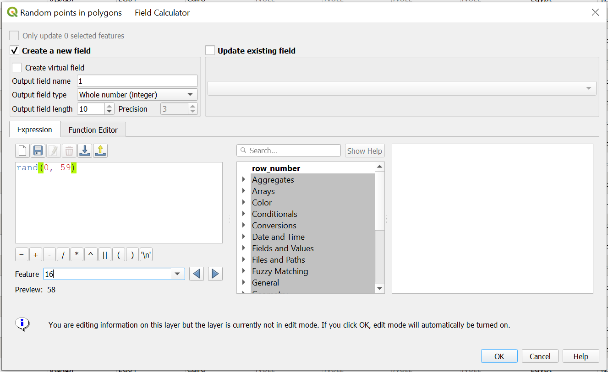

Figure 8.43 -خلق قيم عشوائية ضمن حدود معينة


Figure 8.44 -بيانات هطول الأمطار الوهمية لـ 93 محطة أرصاد جوية وهمية في مدينة القاهرة

بعد ذلك، سنقوم بإقحام هذه القيم لكل يوم من الأيام السبعة للحصول على طبقة سلسة تغطي كامل أراضي المدينة. نظرًا لأن العملية متكررة، سنستخدم المعالجة المجمعة (batch processing). تم اختيار طريقة الاستيفاء المحددة (لأغراض التوضيح فقط) هو ( IDW -inverse distance weighted).

قم بتعيين المعاير التالية:

*   distance coefficient: 2
*   extent: الحدود_الإدارية_القاهرة
*   output raster size: 50.

يجب أن تبدو المعلمات الخاصة بك كما في Figure 8.45.


Figure 8.45 - إعداد نافذة المعالجة المجمعة لاستكمال قيم هطول الأمطار لجميع الأيام السبعة

ستبدو نتيجة الاستيفاء كما في Figure 8.46  تقريبًا.

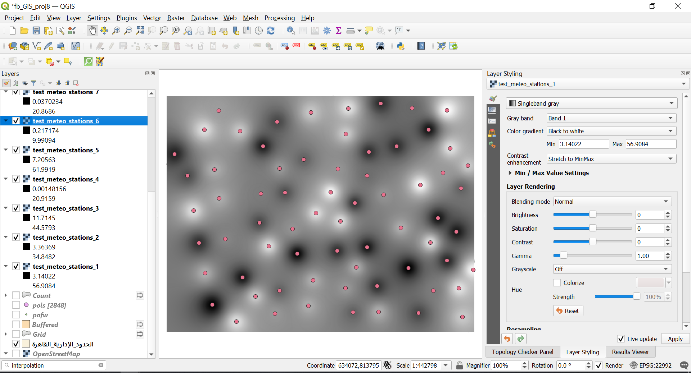

Figure 8.46 - نتيجة الاستيفاء

تظهر محطات meteo على لوحة الخريطة وفي جدول المحتويات يمكنك رؤية جميع مجموعات البيانات النقطية السبعة التي تم إنشاؤها حديثًا والتي تمثل قيم هطول الأمطار لكل يوم في مدينة القاهرة.

بعد ذلك، دعنا نغير ترميز الطبقات السبع إلى طبقة ملونة أكثر (Properties ‣ Symbology ‣ Singleband pseudocolour ‣ Magma).

بالنظر إلى بيانات النقطة ومجموعات البيانات النقطية التي تم إنشاؤها بناءً عليها، يمكننا أن نلاحظ أن لدينا الآن قيمًا للمنطقة بأكملها وليس فقط في الموقع الذي تم قياسه. هناك العديد من خوارزميات المعالجة التي يمكن تطبيقها على هذه البيانات النقطية من أجل استخراج المعلومات، ولكن هناك المزيد عن ذلك في الوحدة التالية - معالجة وتصور البيانات النقطية.

ومع ذلك، نظرًا لأننا قمنا بتحريف القيم لمدة 7 أيام، فلنعد رسمًا متحركًا قصيرًا حول كيفية تطور قيم هطول الأمطار في القاهرة.

للقيام بذلك، افتح Properties dialog of test_meteo_stations_1 raster -> click on the Temporal tab -> tick the Temporal option -> select start and end date ، كما في Figure 8.47. افعل الشيء نفسه مع جميع طبقات المسح السبع.

")

")

")

Figure 8.47 - ( ضبط المعلومات الزمنية لمجموعة البيانات النقطية (1, 2, 7

افتح لوحة التحكم المؤقتة (يمكن العثور عليها في View ‣ Panels ‣ Temporal Controller Panel) وقم بتعيين المعايير كما في Figure 8.48.

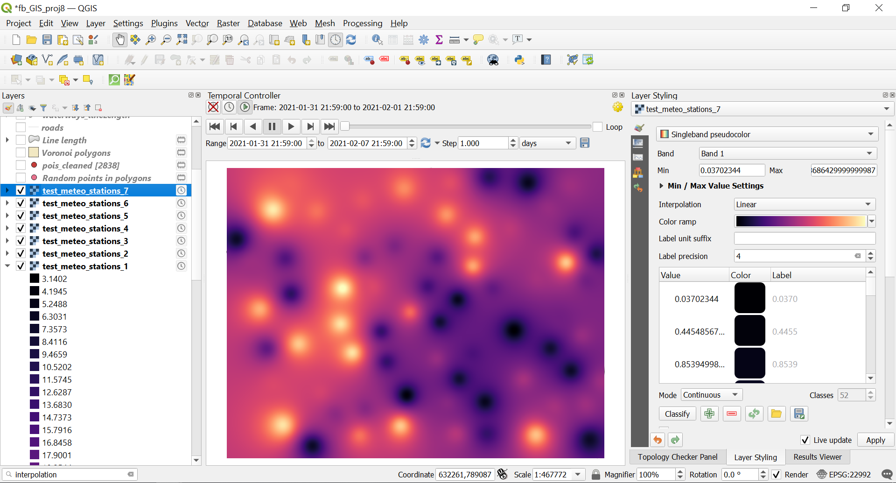

Figure 8.48 - اضبط معايير لوحة التحكم في الوقت

انقر على زر التشغيل   
 وشاهد كيف تتغير القيم. يمكنك اختيار الطبقات الأخرى التي تريد رؤيتها. في Figure 8.49 ، أضفنا طبقة المباني.


Figure 8.49 - تحديد طبقات أخرى لتكون مرئية في الرسوم المتحركة المؤقتة


<h4><strong>
أسئلة الاختبار
</strong></h4>

1. هل هناك خوارزمية واحدة لاستيفاء البيانات في QGIS أو أكثر؟

لا، لقد تم تنفيذ المزيد من الخوارزميات.

2. ما فائدة الاستيفاء؟

الاستيفاء مفيد لتقدير البيانات بناءً على البيانات المعروفة.

</div>
