<div dir="rtl">
<h1>
الوحدة 9 - معالجة وتحليل البيانات النقطية
</h1>

المؤلفين : Codrina, Ben Hur, Ali Rebaie, Samah Hijazi


<h2>
مقدمة تعليمية
</h2>

تركز هذه الوحدة على نوع معين من نموذج البيانات الجغرافية: البيانات الجغرافية النقطية.

مع نهاية الوحدة، يجب أن يكون المشاركون قد اكتسبوا المفاهيم التالية:

*   نموذج البيانات النقطية
*   نقطة الشبكة مقابل خلية الشبكة
*   نطاقات مجموعة البيانات النقطية
*   علم الجبر المتعلق بالخرائط
*   أنواع الدقة الأربعة لخطوط المسح (المكانية - spatial والزمانية - temporal والطيفية - spectral  والإشعاعية - radiometric)
*   إعادة إنشاء عيّنة (Resampling)
*   معالجة البيانات على دفعات Batch processing
*   عملية اكتشاف التغيرات


<h2>
الأدوات والموارد المطلوبة لهذه الوحدة هي:
</h2>

*   تم إعداد هذه الوحدة باستخدام [QGIS الإصدار 3.16 - هانوفر](https://qgis.org/en/site/forusers/download.html)
*   [module9.gpkg](https://drive.google.com/file/d/12eENT16CPizh_t1wXX7brlfiTL5XhYn2/view?usp=sharing) والتي تحتوي على الطبقات التالية:
    *   cairo_admin_boundary  (مضلع)
*   [High Resolution Settlement Layer](https://drive.google.com/file/d/1IYjS_IsJFdSOtF5HPAl2ARTcsKl6Kqj3/view?usp=sharing)
*   [SRTM Digital Elevation Model](https://drive.google.com/drive/folders/16i1wvOus01o9l2zg96TeJQM_WFUNgcl4?usp=sharing)
*   [Global Land Cover Map 2015-2019](https://drive.google.com/drive/folders/1UdBlxHHWisY5IeoA4NLYqz1qzjI5FD8k?usp=sharing)
*   النظام المرجعي للإحداثيات المستخدم هو EPSG:22992 WGS 84 Egypt 1907 / Red Belt.


<h2>
المؤهلات المطلوبة
</h2>

*   المعرفة الأساسية لتشغيل حاسوب
*   فهم جيّد للوحدات 0 و 1 و 2 و 6 و 8 من هذا المنهج. 


<h2>
مقدمة موضوعية
</h2>

<h2>
تفصيل المفاهيم
</h2>

<h3>
نموذج البيانات النقطية
</h3>


النقطية عبارة عن مصفوفة منتظمة من القيم كما في Figure 9.1.


مصفوفة منتظمة من القيم : Figure 9.1

يمكن تعيين القيم إما إلى <strong>نقاط الشبكة</strong>، في الغالب إلى النقط الوسطى (centroids)، وفي هذه الحالة يمكن الإشارة إلى البيانات النقطية على أنها شبكة. الخيار الثاني هو تعيين القيم على كامل <strong>خلية الشبكة</strong> - والتي تسمى البكسل (انظر إلى Figure 9.2). بالنسبة للحالة الأولى، عادةً ما تمثل البيانات النقطية حقلاً مستمرًا، مثل الارتفاع ودرجة الحرارة والأمطار والتركيزات الكيميائية وما إلى ذلك.  أما بالنسبة للحالة الثانية، حيث يتم تعيين القيم لمنطقة البكسل بأكملها، فهي عندما تمثّل الخطوط النقطية صورة ( صورة قمر صناعي، خريطة ممسوحة ضوئيًا، خرائط متجهية محولة (انظر المرحلة 2)). وتجدر الإشارة إلى أن نموذج البيانات هذا ليس فعالاً بشكل خاص للشبكات وأنواع البيانات الأخرى التي تعتمد بشكل كبير على الخطوط، مثل حدود الملكية.


على الجانب الأيسر، يتم تعيين القيم إلى <strong>النقط الوسطى</strong> : Figure 9.2

على الجانب الأيمن، يتم تعيين القيم لمنطقة <strong>خلية الشبكة</strong> - البكسل.	


<h3>
منطق معالجة البيانات النقطية
</h3>

كما في حالة معالجة بيانات المتجه، فإن الأساس المنطقي وراء معالجة البيانات النقطية يعتمد على قدرة أنظمة المعلومات الجغرافية على تخزين ومعالجة وتمثيل معلومات ظواهر العالم الحقيقي نفسها ولكن الإختلاف بينهما هو في الطريقة. فبدلاً من وجود نقاط وخطوط ومضلعات مميزة مخزنة كمجموعات من إحداثيات x و y، لدينا مصفوفة من القيم التي تغطي منطقة معينة مثل الشبكة. للحصول على صورة أوضح، تخيل خرائط درجة الحرارة المعروضة على التلفزيون. درجة الحرارة هي "حقل مستمر"، فلا توجد أماكن على سطح الأرض بدون درجة حرارة سواء كانت موجبة أو سالبة أو 0.

يمكن إجراء العديد من العمليات على مجموعات البيانات النقطية، وينطبق هنا أيضًا مفهوم المعالجة الجغرافية المفصل في الوحدة 8. المصطلح المستخدم لتضمين العمليات التي يمكن إجراؤها على البيانات النقطية هو علم الجبر المتعلق بالخرائط "map algebra".

يمثل <strong>علم الجبر المتعلق بالخرائط</strong> مجموعة من العمليات الأولية [^1] في نظام المعلومات الجغرافية وهو يسمح لطبقتين أو أكثر من الطبقات النقطية "ذات الأبعاد المتشابهة" بإنتاج طبقة نقطية جديدة (خريطة) باستخدام عمليات مختلفة مثل الجمع والطرح والمقارنة وما إلى ذلك.

هناك أربع فئات من العمليات التي يمكن إجراؤها على البيانات النقطية، على النحو التالي:

العمليات الحسابية - Arithmetic operations: الجمع والطرح والضرب والقسمة.

العمليات الإحصائية - Statistical operations: الحد الأدنى، الحد الأقصى،المعدّل، المتوسّط.

توفر العمليات العلائقية (Relational operations) مقارنات بين الخلايا باستخدام وظائف مثل أكبر من أو أصغر من أو يساوي.

العمليات المثلثية - Trigonometric operations: جيْب الزّاوية sine، وجيب التمام cosine، وظِلّ الزَّاوِيَة tangent، وجيب الزاوية القوسي (arcsine) بين مجموعتين أو أكثر من مجموعات البيانات النقطية.

تستخدم العمليات الأسية واللوغاريتمية وظائف الأس واللوغاريتم.

لكل من هذه العمليات، هناك خوارزميات مطبقة في معظم بيئات نظم المعلومات الجغرافية تسمح للمستخدم بتطبيقها على بياناته. في ما يلي، سنقوم بتنفيذ بعض العمليات الأكثر شيوعًا للتعرف على كيفية العمل وما الذي يجب أن يتوقعه المرء من هذا النوع من معالجة البيانات.

يشير مفهوم "الأبعاد المتشابهة" إلى خصائص مجموعات البيانات النقطية. أي أن العمليّات المفصّلة أعلاه لا يمكن تطبيقها على مجموعتي بيانات نقطية بدرجات دقة مكانية أو زمنية أو طيفية مختلفة وتوقع نتائج ذات مغزى. في ما يلي سنقدم جميع أنواع الدقة الأربعة ذات الصلة بالصور النقطية.

تذكير بالأنواع الأربعة لدقة <strong>صور القمر الصناعي</strong> (بيانات نقطية مع القيم المعيّنة لمنطقة الخلية - وحدات البكسل):

1. تُنسب **الاستبانة المكانية - Spatial resolution** إلى الحجم الأولي المقاس لسطح الأرض، ويتم التعبير عنه بوحدات الطول ويمثل طول جانب البكسل. على سبيل المثال، كما رأينا في الوحدة 3، تتمتع بيانات طبقة التسوية عالية الدقة بدقة مكانية تبلغ 30 مترًا، أي أن كل بكسل من مجموعة البيانات يقدر عدد الأشخاص الذين يعيشون في نطاق 30 مترًا.

2. ترتبط **الدقة الزمنية - Temporal resolution** بالصور العلوية (الصور التي تم الحصول عليها بواسطة الأقمار الصناعية والطائرات والمروحيات والطائرات بدون طيار) وهي ترتبط بالفترة بين صورتين متتاليتين لنفس النقطة بالضبط على الأرض حيث يكون قد تم التقاطهما في نفس الظروف (قدر الإمكان)، مثل الطائرة نفسها أو الارتفاع نفسه وما إلى ذلك. على سبيل المثال، يتمتع القمر الصناعي لاندسات 8 بدقة زمنية مدتها 16 يومًا، أي أن كل نقطة على الأرض تتم إعادة النظر فيها بواسطة القمر الصناعي لاندسات 8 كل 16 يومًا [^ 2].

3. **الدقة الطيفية - Spectral resolution:** تلتقط المستشعرات الموجودة على متن الأقمار الصناعية أو الطائرات الإشعاعات الكهرومغناطيسية القادمة من جميع الأجسام على الأرض مثل المياه والمستوطنات والغابات والطرق والمباني والأراضي العارية وما إلى ذلك. وقد تم تصميم المستشعرات خصيصًا لالتقاطها في نطاق طيفي معروف (أو الطول الموجي -  wavelength). يمكن للعين البشرية أن ترى جزءًا صغيرًا جدًا من الطيف الكهرومغناطيسي وهو الضوء المرئي (الأحمر والأخضر والأزرق)، لكن أجهزة الاستشعار يمكنها "رؤية" أكثر من ذلك بكثير! (انظر الشكل إلى Figure 9.4).

)](media/fig94.png "Electromagnetic spectrum (photo credit [NASA Science](https://science.nasa.gov/ems/01_intro))")

Figure 9.4 - (الطيف الكهرومغناطيسي (الصورة من وكالة ناسا للعلوم  [https://science.nasa.gov/ems/01_intro](https://science.nasa.gov/ems/01_intro)

4. يتم تحديد **دقة قياس الإشعاع - Radiometric resolution** بعدد البتات (bits) التي ينقسم إليها الإشعاع المسجل. في بيانات 8 بت، يمكن أن تتراوح الأرقام الرقمية (digital numbers - DN) من 0 إلى 255 لكل بكسل (28 ¼ 256 رقمًا محتملًا إجماليًا). من الواضح أن المزيد من البتات يعني أن المستشعر يمكنه اكتشاف المزيد من التغييرات الدقيقة في الطاقة التي يلتقطها، مما يؤدي إلى صورة "أوضح" ، ودقة أعلى في القياس الإشعاعي للمستشعر، ولكنه يتطلب أيضًا مساحة أكبر لتخزين البيانات.


<h4><strong>
النطاقات الطيفية
</strong></h4>

تحتوي مجموعة البيانات النقطية على طبقة واحدة أو أكثر تسمى النطاقات. يخزن كل نطاق مجموعة أخرى من المعلومات حول المنطقة التي تغطيها البيانات النقطية. يتمتع كل نطاق بالمدى والإحداثيات نفسها تماماً، ولكن ليس بالضرورة نفس الدقة المكانية. بصرف النظر عن القيم المخزنة، هناك أيضاً خصائص رئيسية أخرى متضمنة، مثل: قيم الخلية القصوى والحد الأدنى والمتوسط والمدرج التكراري لقيم الخلية.

الرسم البياني (<strong>histogram</strong>) هو تمثيل تقريبي لتوزيع البيانات الرقمية (انظر إلى Figure 9.5)حيث يمكن من خلاله فهم البيانات الموجودة.


Figure 9.5 - هي طبقة  نقطية  (X) مثال على الرسم البياني حيث

ما أهميّة الرسم البياني في سياقنا؟ كما ذكرنا في البداية، النقطية عبارة عن مصفوفة من القيم العددية المستمرة (نذكر بمثال درجة الحرارة) ويساعد الرسم البياني المستخدم على فهم كيفية توزيع قيم البيانات النقطية. يقوم كل شريط بتجميع قيم الخلية التي تقع في نطاق معين، وكلما زاد ارتفاع الشريط، يكون هناك عدد أكبر من الخلايا التي تحتوي على قيم في هذا النطاق المحدد. في حالة احتواء البيانات النقطية على أكثر من نطاق، فسيتم حساب الرسم البياني لكل منها. لا توجد فجوات بين النطاقات الموضحة في الرسم البياني وهو فقط للبيانات المستمرة.


<h2>
المحتوى الرّئيسي:
</h2>

<h3>
عنوان المرحلة 1: فهم البيانات النقطية الخاصة بك
</h3>

في العقدين الماضيين، زاد عدد الأقمار الصناعية التي تلتقط البيانات من الأرض بشكل كبير. علاوة على ذلك، سمحت سياسة الوصول إلى البيانات المفتوحة التي اعتمدتها وكالات الفضاء المختلفة، مثل وكالة ناسا <a href="https://www.usgs.gov/core-science-systems/nli/landsat/landsat-data-access?qt-science_support_page_related_con=0#qt-science_support_page_related_con">لبرنامج لاندسات </a>أو وكالة الفضاء الأوروبية <a href="https://www.copernicus.eu/en/access-data">لبرنامج كوبرنيكوس</a>، الباب أمام تدفق هائل من بيانات رصد الأرض. كنتيجة طبيعية، كان التقدم العلمي للخوارزميات والمنهجيات وتطوير أدوات أكثر قوة لمعالجة البيانات النقطية - وخاصة صور الأقمار الصناعية - أمراً مثيرًا للإعجاب وشاملًا في مجالات مثل الزراعة والغابات والتنمية الحضرية والأنشطة الإنسانية ومراقبة مياه المحيطات والبحار والأمن وغير ذلك الكثير. في المراحل الثلاث التالية، سوف نقدم بعض تقنيات المعالجة الأكثر شيوعًا والنتائج المتوقعة منها.


<h4><strong>
الخطوة 1. جهز بيئة العمل الخاصة بك.
</strong></h4>

سنقوم بإضافة جميع مجموعات البيانات النقطية التي سنعمل عليها إلى مشروع QGIS الخاص بنا، على النحو التالي:

*   بيانات طبقة التسوية عالية الدقة (HRSL - High Resolution Settlement Layer Data )
*    نموذج الارتفاع الرقمي (Digital Elevation Model - DEM)، البعثة الطبوغرافية للرادار المكوكي (SRTM - Shuttle Radar Topography Mission) 
*   غطاء أرضي ديناميكي معتدل (Moderate Dynamic Land Cover): الفترات الخمسة المتاحة 2015 و 2016 و 2017 و 2018 و 2019.

نظرًا لأنه تم تقديم بيانات طبقة التسوية عالية الدقة في وحدة سابقة، سنقوم بتفصيل المعلومات حول مجموعة البيانات الأخرى التي سنستخدمها في هذه الوحدة.

1.  نموذج الارتفاع الرقمي (DEM) للبعثة الطبوغرافية للرادار المكوكي (SRTM) هو مجموعة بيانات نموذج سطح رقمي عالمي (DSM - Digital Surface Model) بدقة أفقية تبلغ حوالي 30 مترًا (شبكة قوسية واحدة). يتضمن DSM سطح الأرض والنباتات والأشياء من صنع الإنسان، مثل المباني والجسور وما إلى ذلك على عكس نموذج التضاريس الرقمية (Digital Terrain Model - DTM) الذي يركّز على التضاريس بدقة.
2. Dynamic Land Cover Map  أو خريطة الغطاء الأرضي الديناميكي هي أحد منتجات خدمة الأراضي العالمية من كوبرنيكوس (CGLS Copernicus Global Land Service) المشتقة من السلاسل الزمنية PROBA-V 100 متر والعديد من مجموعات بيانات الغطاء الأرضي الأخرى. يوفر المنتج فئات منفصلة للغطاء الأرضي الأساسي، بالإضافة إلى طبقات الحقل المستمرة لجميع فئات الغطاء الأرضي الأساسية التي توفر تقديرات متناسبة للغطاء النباتي / الأرضي لأنواع غطاء اليابسة. يحتوي المنتج على 3 نطاقات: التصنيف_المنفصل (discrete_classification)، ونوع_الغابات (forest_type) والغلاف_الحضري (urban_coverfraction). يعرض الجدولان التاليان القيم لكل فئة منفصلة:

الجدول 1. جدول قيمة نطاق "التصنيف المنفصل"

<table>
  <tr>
   <td>
القيمة
   </td>
   <td>
لون 
   </td>
   <td>
وصف 
   </td>
  </tr>
  <tr>
   <td>
0
   </td>
   <td>
282828	
   </td>
   <td>
مجهول. لا تتوفر بيانات كافية من الأقمار الصناعية.
   </td>
  </tr>
  <tr>
   <td>
20
   </td>
   <td>FFBB22
   </td>
   <td>
الشجيرات. نباتات خشبية معمرة ذات سيقان ثابتة وخشبية وبدون ساق رئيسي محدد يقل ارتفاعها عن 5 أمتار. يمكن أن تكون أوراق الشجيرة إما دائمة الخضرة أو نفضية.
   </td>
  </tr>
  <tr>
   <td>
30
   </td>
   <td>
FFFF4C
   </td>
   <td>
نباتات عشبية. نباتات بدون ساق أو براعم ثابتة فوق الأرض وتفتقر إلى بنية ثابتة محددة. غطاء الأشجار والشجيرات أقل من 10٪.
   </td>
  </tr>
  <tr>
   <td>
40
   </td>
   <td>
F096FF	
   </td>
   <td>
النباتات / الزراعة المدارة. الأراضي المغطاة بالمحاصيل المؤقتة تليها فترة الحصاد وفترة التربة الجرداء (على سبيل المثال ، أنظمة المحاصيل الفردية والمتعددة). لاحظ أنه سيتم تصنيف المحاصيل الخشبية المعمرة على أنها نوع الغطاء الأرضي المناسب للغابات أو الشجيرة.
   </td>
  </tr>
  <tr>
   <td>
50
   </td>
   <td>
FA0000	
   </td>
   <td>
حضري / مبني. الأرض مغطاة بالمباني والمنشآت الأخرى من صنع الإنسان.
   </td>
  </tr>
  <tr>
   <td>
60
   </td>
   <td>
B4B4B4
   </td>
   <td>
الغطاء النباتي العاري / المتناثر. الأراضي ذات التربة المكشوفة أو الرمل أو الصخور ولا تحتوي على أكثر من 10٪ غطاء نباتي خلال أي وقت من السنة.
   </td>
  </tr>
  <tr>
   <td>
70
   </td>
   <td>
F0F0F0
   </td>
   <td>
الثلج والجليد. الأراضي تحت الجليد أو الغطاء الجليدي على مدار العام.
   </td>
  </tr>
  <tr>
   <td>
80
   </td>
   <td>
0032C8
   </td>
   <td>
المسطحات المائية الدائمة. البحيرات والخزانات والأنهار. يمكن أن تكون إما مسطحات مائية عذبة أو مالحة.
   </td>
  </tr>
  <tr>
   <td>
90
   </td>
   <td>
0096A0
   </td>
   <td>
الأراضي الرطبة العشبية. الأراضي التي تحتوي على خليط دائم من الماء والنباتات العشبية أو الخشبية. يمكن أن يتواجد الغطاء النباتي إما في المياه المالحة أو قليلة الملوحة أو العذبة.
   </td>
  </tr>
  <tr>
   <td>
100
   </td>
   <td>
FAE6A0
   </td>
   <td>
الطحلب والحزاز.
   </td>
  </tr>
  <tr>
   <td>
111
   </td>
   <td>
58481F
   </td>
   <td>
غابة مغلقة، أوراق إبرة دائمة الخضرة. مظلة الشجرة> 70٪ ، تظل جميع أشجار أوراق الإبر تقريبًا خضراء طوال العام. المظلة لا تخلو أبدًا من أوراق الشجر الخضراء.
   </td>
  </tr>
  <tr>
   <td>
112
   </td>
   <td>
9900
   </td>
   <td>
غابة مغلقة، دائمة الخضرة عريضة الأوراق. مظلة الشجرة> 70٪ ، وتبقى جميع الأشجار عريضة الأوراق تقريبًا خضراء على مدار السنة. المظلة لا تخلو أبدًا من أوراق الشجر الخضراء.
   </td>
  </tr>
  <tr>
   <td>
113
   </td>
   <td>
70663E
   </td>
   <td>
غابة مغلقة، ورقة إبرة نفضية. مظلة الشجرة> 70٪ ، تتكون من مجتمعات موسمية لشجر أوراق الشجر مع دورة سنوية من فترات الأوراق والقطع.
   </td>
  </tr>
  <tr>
   <td>
114
   </td>
   <td>
00CC00
   </td>
   <td>
غابة مغلقة، عريضة الأوراق. مظلة شجرة أكبر من 70٪ ، تتكون من مجتمعات موسمية من الأشجار عريضة الأوراق مع دورة سنوية من الأوراق وفترات الأوراق.
   </td>
  </tr>
  <tr>
   <td>
115
   </td>
   <td>
4E751F
   </td>
   <td>
غابة مغلقة، مختلطة.
   </td>
  </tr>
  <tr>
   <td>
116
   </td>
   <td>
7800
   </td>
   <td>
غابة مغلقة، لا تتطابق مع أي من التعريفات الأخرى.
   </td>
  </tr>
  <tr>
   <td>
121
   </td>
   <td>
666000
   </td>
   <td>
غابة مفتوحة، ورقة إبرة دائمة الخضرة. الطبقة العلوية - الأشجار 15-70٪ والطبقة الثانية - مختلطة من الشجيرات والأراضي العشبية ، وتبقى جميع أشجار أوراق الإبر تقريبًا خضراء طوال العام. المظلة لا تخلو أبدًا من أوراق الشجر الخضراء.
   </td>
  </tr>
  <tr>
   <td>
122
   </td>
   <td>
8DB400
   </td>
   <td>
غابة مفتوحة، أوراق عريضة دائمة الخضرة. الطبقة العليا - الأشجار 15-70٪ والطبقة الثانية - مختلطة من الشجيرات والأراضي العشبية ، وتبقى جميع الأشجار عريضة الأوراق تقريبًا خضراء على مدار السنة. المظلة لا تخلو أبدًا من أوراق الشجر الخضراء.
   </td>
  </tr>
  <tr>
   <td>
123
   </td>
   <td>
8D7400	
   </td>
   <td>
غابة مفتوحة ، ورقة إبرة نفضية. الطبقة العلوية- الأشجار 15-70٪ والطبقة الثانية- مختلطة من الشجيرات والأراضي العشبية ، وتتكون من مجتمعات شجر الإبرة الموسمية مع دورة سنوية من الأوراق وفترات الأوراق.
   </td>
  </tr>
  <tr>
   <td>
124
   </td>
   <td>
A0DC00
   </td>
   <td>
غابة مفتوحة ، أوراق عريضة نفضية. الطبقة العلوية- الأشجار 15-70٪ والطبقة الثانية- مختلطة من الشجيرات والأراضي العشبية ، وتتكون من مجتمعات موسمية من الأشجار عريضة الأوراق مع دورة سنوية من الأوراق وفترات الأوراق.
   </td>
  </tr>
  <tr>
   <td>
125
   </td>
   <td>
929900
   </td>
   <td>
غابة مفتوحة ، مختلطة.
   </td>
  </tr>
  <tr>
   <td>
126
   </td>
   <td>
648C00
   </td>
   <td>
غابة مفتوحة، لا تتطابق مع أي من التعريفات الأخرى.

   </td>
  </tr>
  <tr>
   <td>
200
   </td>
   <td>
80
   </td>
   <td>
المحيطات والبحار. يمكن أن تكون إما مسطحات مائية عذبة أو مالحة.
   </td>
  </tr>
</table>

الجدول 2.  جدول قيمة النطاق "نوع_الغابات"

<table>
  <tr>
   <td>
القيمة
   </td>
   <td>
لون 
   </td>
   <td>
وصف 
   </td>
  </tr>
  <tr>
   <td>
0
   </td>
   <td>
282828 
   </td>
   <td>
غير معروف
   </td>
  </tr>
  <tr>
   <td>
1
   </td>
   <td>
666000 
   </td>
   <td>
ورقة إبرة دائمة الخضرة
   </td>
  </tr>
  <tr>
   <td>
2
   </td>
   <td>
9900 
   </td>
   <td>
ورقة عريضة دائمة الخضرة
   </td>
  </tr>
  <tr>
   <td>
3
   </td>
   <td>
70663E 
   </td>
   <td>
ورقة إبرة متساقطة الأوراق
   </td>
  </tr>
  <tr>
   <td>
4
   </td>
   <td>
A0DC00 
   </td>
   <td>
أوراق عريضة متساقطة الأوراق
   </td>
  </tr>
  <tr>
   <td>
5
   </td>
   <td>
929900 
   </td>
   <td>
مزيج من أنواع الغابات
   </td>
  </tr>
</table>

لتنظيم طبقاتك بشكل أفضل، قم بتجميعها حسب الفئة، على النحو التالي: بالنسبة للطبقات النقطية 5 للغطاء الأرضي، قم بإنشاء مجموعة واحدة تسمى الغطاء الأرضي (Land Cover) (في لوحة الطبقات - Layers Panel، انقر فوق الزر إضافة مجموعة - Add Group button ). بالنسبة لنموذج السطح الرقمي ، اصنع مجموعة واحدة تسمى SRTM DEM.

لا تنس أيضًا إضافة حدود منطقة العمل، مدينة القاهرة، وهي مجموعة بيانات متجهية.

يجب أن تظهر نافذة خريطة البرنامج كما في Figure 9.6، ربما بألوان مختلفة قليلاً.

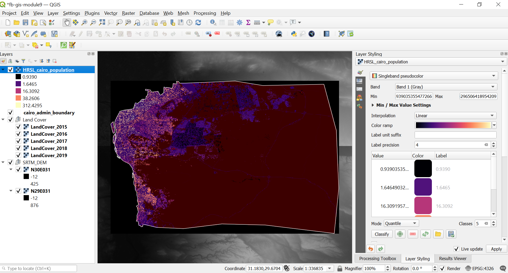

مجموعات البيانات النقطية المحملة - Figure 9.6 


<h4><strong>
الخطوة 2. فهم ما تنظر إليه.
</strong></h4>

بعد ذلك، سوف نستخدم سلسلة من الأدوات التي ستتيح لنا التعرف على البيانات التي نعمل بها.

بعد تحميل جميع مجموعات البيانات، سوف نتحقق من النظام المرجعي للإحداثيات الذي توجد فيه هذه البيانات. كما نعلم من الوحدات السابقة، يوفر QGIS إمكانية إعادة إسقاط جميع مجموعات البيانات المحملة في المشروع على الفور، ولكن قد يؤدي ذلك إلى مشاكل في المعالجة الجغرافية. وبالتالي، حتى إذا تم تراكب جميع الطبقات بشكل صحيح، كما يمكن للمرء أن يقول من خلال الفحص البصري، سنشرع في إعادة إسقاطها جميعًا في نظام الإحداثيات الرسمي لمنطقتنا: مدينة القاهرة - EPSG:22992.

هناك عدة طرق للحصول على معلومات حول الطبقات المحملة في QGIS، بعضها يزود المستخدم بتفاصيل أكثر من غيرها. للحصول على نظرة عامة سريعة على البيانات الوصفية لمجموعة البيانات، انقر نقرًا مزدوجًا فوق الطبقة وافتح الخصائص -> المعلومات (double-click the layer and open Properties ‣ Information).

بالنسبة لطبقة HRSL_cairo_population، ستبدو نافذة المعلومات كما في Figure 9.7.

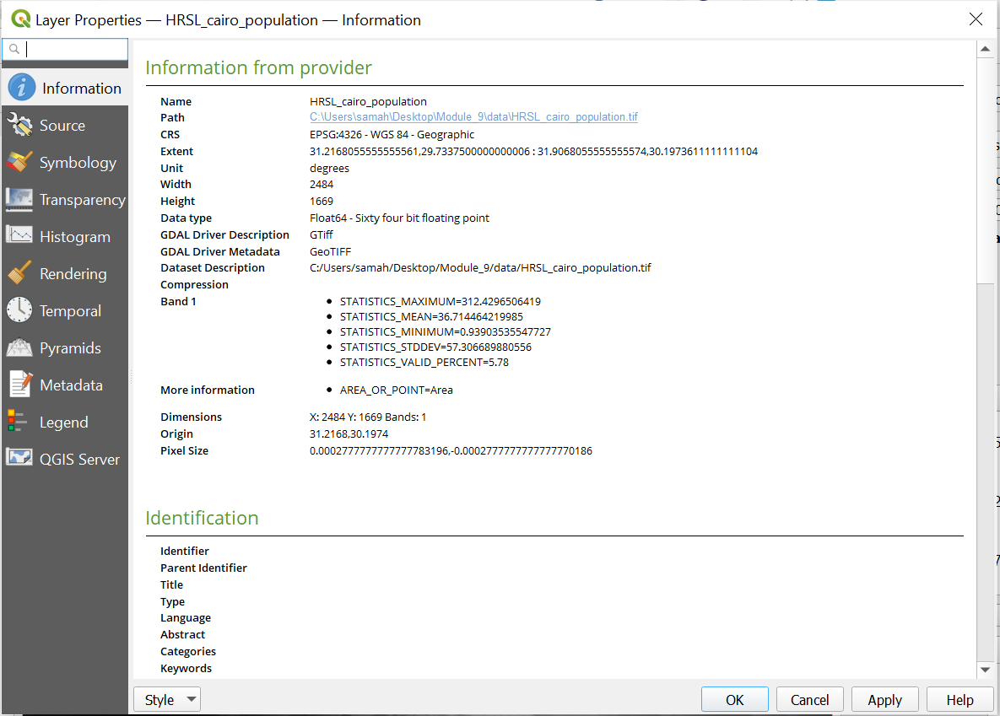

Figure 9.7 - استخراج البيانات الوصفية الأساسية من طبقة نقطية

فيما يتعلق بسؤالنا الأول حول ماهية CRS الذي يتم استخدامه لمجموعات البيانات التي قمنا بتحميلها، يمكننا أن نلاحظ أنه حتى إذا تم تراكب HRSL بشكل صحيح، فإن إسقاط مجموعة البيانات الأصلية هو EPSG 4326 - WGS 84 - جغرافي، مع قياس الوحدات بالدرجات. نحدد أيضًا أن هذه الطبقة النقطية المحددة لها نطاق واحد فقط، ومع ذلك يصعب قراءة حجم البكسل لأن القياس بالدرجات وليس بالأمتار، مما يسهل فهمه.

وبالتالي، فإن أول شيء يجب فعله هو إعادة إسقاط جميع مجموعات البيانات التي سنعمل بها في نفس نظام الإحداثيات - EPSG 22992.

بدءًا من مجموعات بيانات HRSL ، نذهب إلى ((Raster -> Projections -> Warp (Reproject) (انظر إلى Figure 9.8).

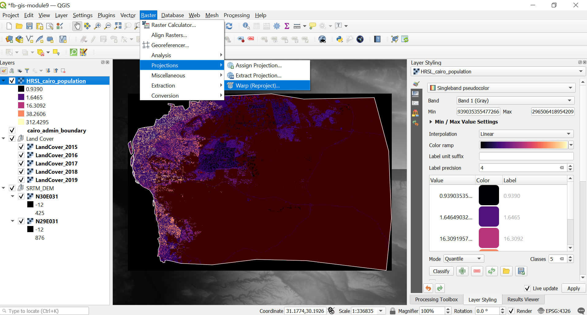
Figure 9.8 -  QGIS وظائف إعادة إسقاط المشروع في

بعد تحديد وظيفة Warp، ستظهر نافذة جديدة تسمح للمستخدم بتعيين المعايير الصحيحة (انظر إلى Figure 9.9.a).

 QGIS window")

Figure 9.9.a -(Warp) لإعادة الإسقاط QGIS نافذة 

إذا حددت الإخراج ليكون [حفظ في ملف مؤقت] ، فستكون هناك طبقة نقطية تسمى Reprojected في لوحة الطبقات. هذه طبقة ذاكرة ويمكنك إعادة تسمية هذه الطبقة إلى Reprojected_HRSL_cairo_population وحفظها لجعلها ثابتة.

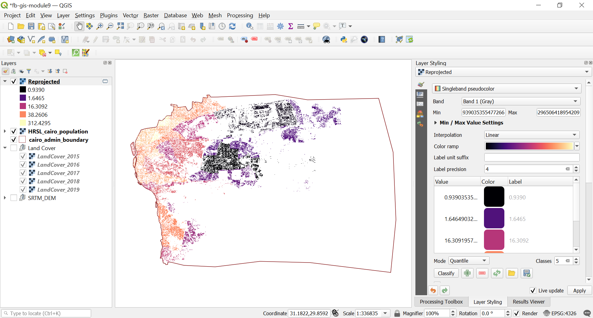

Figure 9.9.b -HRSL إعادة إسقاط 

ستلاحظ أنه على عكس ما حدث عند إعادة إسقاط مجموعات البيانات المتجهة، هناك معلمة جديدة يمكنك تعيين "طريقة إعادة إنشاء العيّنة المستخدمة" (Resampling method to use).

تمثل إعادة إنشاء العيّنة استيفاء قيم الخلية بحيث تقوم بتحويل البيانات النقطية كما هو موضح من قبل المستخدم. تتوفر طرق متعددة لإعادة إنشاء العيّنة ضمن وظيفة Warp، ولكل منها دعم رياضي خاص بها. ومع ذلك، فإن التفسيرات التفصيلية لكل منها هو خارج نطاق هذه الوحدة. يمكن قراءة المزيد من المراجع.

في حالتنا، نريد إعادة إسقاط بيانات السكان (القيم الرقمية واستنادًا إلى طريقة إعادة إنشاء العيّنة المحددة (أقرب جار- nearest neighbour)، سيتم استخدام إحداثيات كل بكسل إخراج لحساب قيمة جديدة من قيم البكسل القريبة في طبقة الإدخال (انظر إلى Figure 9.10)).


Figure 9.10 - (ILWIS -  طريقة إعادة إنشاء العينة - (الجار الأقرب) (الصورة الفوتوغرافية: من وثائق  

<a href="http://spatial-analyst.net/ILWIS/htm/ilwisapp/resample_functionality.htm">(http://spatial-analyst.net/ILWIS/htm/ilwisapp/resample_functionality.htm</a>)

يتم تمثيل وحدات البكسل المدخلة بخطوط سوداء متقطعة وإحداثياتها بنقاط سوداء؛ ويتم تمثيل وحدات البكسل الناتجة بخطوط صلبة حمراء وإحداثياتها بعلامات حمراء زائد. تشير الأسهم الرمادية إلى كيفية تحديد قيم المخرجات. يمكن رؤية ذلك في Figure 9.10، يمكن استخدام بعض قيم خريطة الإدخال مرتين في خريطة الإخراج، بينما قد لا يتم استخدام قيم الإدخال الأخرى على الإطلاق. لهذا السبب، على الرغم من أنها واحدة من أسرع الطرق لإعادة إنشاء العيّنة، إلا أنها ليست مناسبة في حالتنا، لأننا نعمل مع البيانات الرقمية - بيانات السكان. هذه الطريقة في إعادة إنشاء العيّنة مناسبة للبيانات الفئوية - مثل قيم الغطاء الأرضي.

لإعادة إسقاط مجموعة البيانات النقطية السكانية الخاصة بنا، سنستخدم طريقة الاستيفاء ثنائية الخطوط (bilinear interpolation) لإعادة إنشاء قيم البكسل (انظر إلى Figure 9.11).


Figure 9.11 - bilinear - طريقة إعادة إنشاء العينة 
الصورة الفوتوغرافية: من وثائق
 ILWIS 

<a href="http://spatial-analyst.net/ILWIS/htm/ilwisapp/resample_functionality.htm">(http://spatial-analyst.net/ILWIS/htm/ilwisapp/resample_functionality.htm</a>)

تحدد طريقة ثنائية الخطوط القيمة الجديدة للخلية بناءً على متوسط المسافة الموزونة لأقرب أربعة مراكز لخلايا الإدخال. هذه الطريقة مفيدة في حالة البيانات المستمرة وستؤدي إلى بعض التجانس بين البيانات.

نشرع في فحص CRS لمجموعات بيانات الغطاء الأرضي الخمس التي قمنا بتحميلها في مشروع QGIS الخاص بنا. للوصول إلى معلومات خصائص الطبقة، يمكننا أن نرى أن جميع طبقات الغطاء الأرضي الخمس مسقطة في EPSG: 3857 - WGS 84 / Pseudo-Mercator. يتمثل أحد الحلول في استخدام أداة إعادة الإسقاط (Reproject tool) وتكوين كل طبقة على حدة. ولكن الطريقة الأسرع هي استخدام وظيفة إعادة الإسقاط التي تعمل على معالجة البيانات على دفعات (batch process).

المعالجة على دفعات هي القدرة على تشغيل عمليات متكررة على البيانات مع الحد الأدنى من تفاعل المستخدم. يتوفر هذا الخيار في معظم وظائف QGIS ويمكن تنشيطه في نافذة العملية بالنقر فوق الزر "شغل كعملية الدفعة..."   والإنتقال إلى علامة تبويب "معالجة الدُفعة" (انظر إلى Figure 9.12).


Figure 9.12 - QGIS علامة تبويب “معالجة الدُفعة” في نافذة وظائف

بالنسبة للطبقات النقطية الخمس للغطاء الأرضي، سوف نستخدم معالجة الدُفعات. سنقوم أيضاً باستخدام "أقرب جار" كطريقة إعادة إنشاء العيّنة. لإضافة طبقة جديدة، انقر فوق  الرسم التخطيطي "+". لتعبئة معايير CRS وطريقة إعادة إنشاء العيّنة تلقائيًا، انقر فوق زر الملء التلقائي (autofill button) أعلى الأعمدة المختارة وحدد Fill down. أعد تسمية  البيانات النقطية المعاد إسقاطها عن طريق إضافة "Reprojected" في بداية الاسم، على سبيل المثال LandCover2015، سيصبح Reprojected_landCover2015ٌ. اضبط المعايير كما في Figure 9.13 : المصدر CRS: EPSG: 3857، الهدف CRS EPSG 22992، "طريقة إعادة إنشاء العيّنة المستخدمة" : "أقرب جار" (أوضحنا السبب في الفقرة أعلاه)، قيمة "nodata" لنطاقات الإخراج: 255 (من نافذة المعلومات، نرى نوع البيانات - yte - عدد صحيح بدون إشارة 8 بت - مما يعني أن القيمة القصوى يمكن أن تكون 255) ، دقة الإخراج: 100 متر (مثل البيانات النقطية الأولية للغطاء الأرضي). بعد تعيين جميع المعايير، حدد المربع الموجود في الزاوية اليسرى من النافذة -<strong> قم بتحميل الطبقات عند الانتهاء (Load layers on completion) </strong>وانقر فوق تشغيل.


Figure 9.13.a - معالجة الدُفعات لإعادة إسقاط البيانات النقطية للغطاء الأرضي

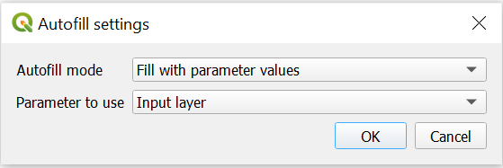

Figure 9.13.b - الملء التلقائي لأسماء الإخراج

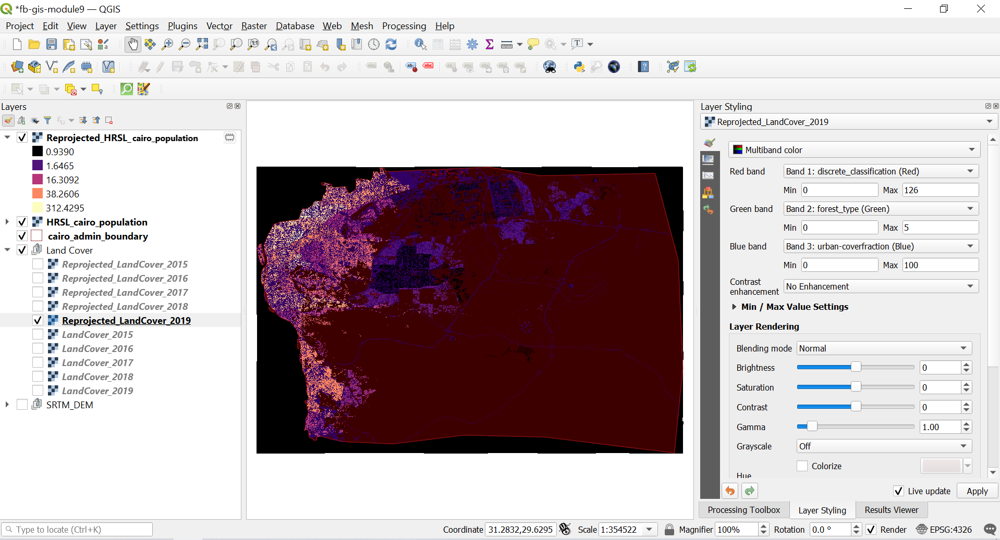

Figure 9.13.c -البيانات النقطية للغطاء الأرضي المُعاد إسقاطها 

بعد ذلك يأتي النموذج النقطي الرقمي للسطح. كما يمكن للمرء أن يلاحظ، لتغطية المنطقة التي تهمنا، كنا بحاجة إلى عدة بلاطات نقطية. عندما تصبح الملفات النقطية كبيرة جدًا ( تخيل ملف DSM واحدًا على مساحة 30 مترًا لأوروبا التي تبلغ مساحتها أكثر من 10 ملايين كيلومتر مربع ) يتم تقسيمها إلى ** بلاطات ** لأنه في المناطق الأصغر يمكن التحكم فيها بسهولة أكبر.

على الرغم من أنه يمكننا استخدام أداة warp في وضع الدُفعات لإعادة إسقاط جميع الملفات النقطية لـ DSM، إلا أنه في الفحص البصري، يمكن للمرء أيضًا ملاحظة أن "الحدود" بين اللوحات مرئية إلى حد ما، مما يجعلها، غير جذابة بصريًا. ما قد يكون مفيدًا هو الحصول على نظرة عامة كاملة على التضاريس، كظاهرة مستمرة  كما هي في الواقع  وبدون اضطرابات مصطنعة. للحصول على ذلك، سنستخدم أداة الدمج GDAL، المتوفرة في شريط أدوات المعالجة لدمج جميع البيانات النقطية لـ DSM معًا. لفتحه، انتقل إلى Processing -> Toolbox وفي شريط البحث اكتب Merge (انظر إلى figure 14). بدلاً من ذلك، يمكنك البحث عن دمج في شريط محدد المواقع.


Figure 9.14 -في مربع أدوات المعالج  GDAL العثور على أداة الدمج

في نافذة الدمج التي تفتح، حدد ملفات DSM النقطية التي نريد جعلها فسيفساء وانقر فوق تشغيل. يجب أن تبدو النتيجة كما في figure 15.c.


Figure 9.15.a - المراد دمجها SRTM تحديد طبقات


Figure 9.15.b - معايير خوارزمية معالجة الدمج

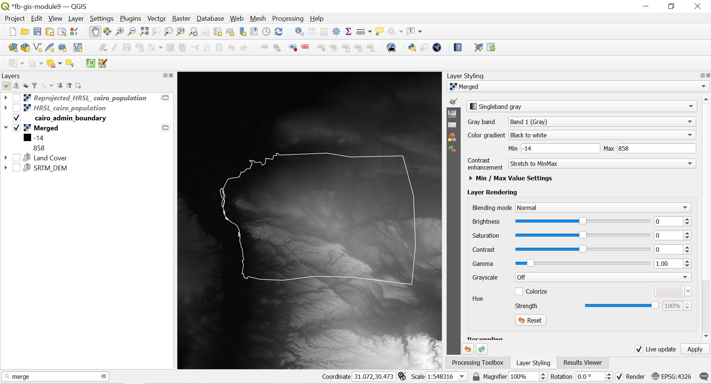

Figure 9.15.c -المطابقة لمنطقة عملنا DSM فسيفساء لجميع ملفات 

الآن، يمكننا المضي قدمًا في إعادة إسقاط الفسيفساء - ملفاً واحداً، بدلاً من 6 ملفات. انتقل إلى النقطية -> الإسقاط -> التفاف (إعادة الإسقاط) ((Raster ‣ projection ‣ Wrap (reproject) وقم بتعيين المعايير المعروفة:

*   المصدر CRS EPSG 4326
*   الهدف CRS EPSG 22992
*   طريقة إعادة إنشاء العينات: أقرب جار
*   دقة ملف الإخراج - 30 م.


في هذه المرحلة، يجب أن يكون لدينا جميع الطبقات في نفس CRS EPSG 22992.

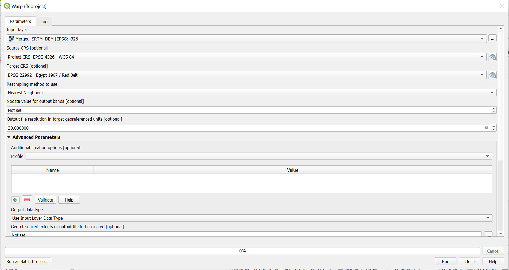

Figure 9.15.d - إعادة إسقاط النقطية المدمجة

يمكننا إجراء فحص آخر للتأكد من أن جميع البيانات النقطية التي نعمل معها مسقطة بالإضافة إلى الحصول على أي معلومات إضافية عن البيانات عن طريق تشغيل دفعة معالجة معلومات نقطية على كل البيانات. لفتح نافذة الوظائف، انتقل إلى البيانات النقطية -> متنوع -> معلومات النقطية ( Raster -> Miscellaneous -> Raster Information). يجب أن تبدو نافذة معلومات البيانات النقطية الخاصة بمعالجة الدُفعات كما في Figure 9.16.


Figure 9.16  -منفصل لعدّة طبقات نقطية HTML عملية الدفعة لاستخراج المعلومات في ملف 

يجب أن يظهر ملف HTML للمعلومات النقطية بالشكل التالي. يمكن فتح ملف HTML باستخدام أي محرر نصوص أو متصفح ويب من اختيارك.

```
Driver: GTiff/GeoTIFF
Files: C:/Users/samah/Desktop/Module_9/data/LandCover_Reprojected/Reprojected_LandCover_2019.tif
Size is 669, 518
Coordinate System is:
PROJCRS["Egypt 1907 / Red Belt",
    BASEGEOGCRS["Egypt 1907",
        DATUM["Egypt 1907",
            ELLIPSOID["Helmert 1906",6378200,298.3,
                LENGTHUNIT["metre",1]]],
        PRIMEM["Greenwich",0,
            ANGLEUNIT["degree",0.0174532925199433]],
        ID["EPSG",4229]],
    CONVERSION["Egypt Red Belt",
        METHOD["Transverse Mercator",
            ID["EPSG",9807]],
        PARAMETER["Latitude of natural origin",30,
            ANGLEUNIT["degree",0.0174532925199433],
            ID["EPSG",8801]],
        PARAMETER["Longitude of natural origin",31,
            ANGLEUNIT["degree",0.0174532925199433],
            ID["EPSG",8802]],
        PARAMETER["Scale factor at natural origin",1,
            SCALEUNIT["unity",1],
            ID["EPSG",8805]],
        PARAMETER["False easting",615000,
            LENGTHUNIT["metre",1],
            ID["EPSG",8806]],
        PARAMETER["False northing",810000,
            LENGTHUNIT["metre",1],
            ID["EPSG",8807]]],
    CS[Cartesian,2],
        AXIS["(E)",east,
            ORDER[1],
            LENGTHUNIT["metre",1]],
        AXIS["(N)",north,
            ORDER[2],
            LENGTHUNIT["metre",1]],
    USAGE[
        SCOPE["unknown"],
        AREA["Egypt - 29°E to 33°E"],
        BBOX[21.99,29,33.82,34.27]],
    ID["EPSG",22992]]
Data axis to CRS axis mapping: 1,2
Origin = (635691.475251835654490,832246.385472010006197)
Pixel Size = (100.000000000000000,-100.000000000000000)
Metadata:
  AREA_OR_POINT=Area
Image Structure Metadata:
  INTERLEAVE=PIXEL
Corner Coordinates:
Upper Left  (  635691.475,  832246.385) ( 31d12'53.57"E, 30d12' 1.81"N)
Lower Left  (  635691.475,  780446.385) ( 31d12'49.96"E, 29d43'59.60"N)
Upper Right (  702591.475,  832246.385) ( 31d54'34.53"E, 30d11'51.09"N)
Lower Right (  702591.475,  780446.385) ( 31d54'19.25"E, 29d43'49.07"N)
Center      (  669141.475,  806346.385) ( 31d33'39.35"E, 29d57'57.05"N)
Band 1 Block=669x4 Type=Byte, ColorInterp=Red
  Description = discrete_classification
    Computed Min/Max=0.000,126.000
  Minimum=0.000, Maximum=126.000, Mean=48.863, StdDev=21.695
  NoData Value=255
  Metadata:
    STATISTICS_MAXIMUM=126
    STATISTICS_MEAN=48.862858709186
    STATISTICS_MINIMUM=0
    STATISTICS_STDDEV=21.694991741058
    STATISTICS_VALID_PERCENT=98.96
Band 2 Block=669x4 Type=Byte, ColorInterp=Green
  Description = forest_type
    Computed Min/Max=0.000,5.000
  Minimum=0.000, Maximum=5.000, Mean=0.001, StdDev=0.068
  NoData Value=255
  Metadata:
    STATISTICS_MAXIMUM=5
    STATISTICS_MEAN=0.00091855212856231
    STATISTICS_MINIMUM=0
    STATISTICS_STDDEV=0.067763684262285
    STATISTICS_VALID_PERCENT=98.96
Band 3 Block=669x4 Type=Byte, ColorInterp=Blue
  Description = urban-coverfraction
    Computed Min/Max=0.000,100.000
  Minimum=0.000, Maximum=100.000, Mean=16.900, StdDev=35.034
  NoData Value=255
  Metadata:
    STATISTICS_MAXIMUM=100
    STATISTICS_MEAN=16.900370628494
    STATISTICS_MINIMUM=0
    STATISTICS_STDDEV=35.034327145742
    STATISTICS_VALID_PERCENT=98.96
```


بعد إعداد البيانات النقطية عن طريق إعادة إسقاطها في CRS الذي نعمل به وقراءة البيانات الوصفية الخاصة بها بهدف فهم الملفات بشكل أفضل، حان الوقت للتعمق في البيانات الفعلية. لتحقيق ذلك، سنقوم بحساب وتفسير الرسوم البيانية (انظر قسم 

تفصيل المفاهيم للحصول على التفاصيل) الخاصة بخطوط البيانات النقطية الخاصة بنا.

لحساب الرسم البياني، حدد طبقة البيانات النقطية، وافتحها بالنقر المزدوج على نافذة حوار الخصائص (Properties) وانتقل إلى المدرج التكراري (Histogram) (انظر إلى figure 17).

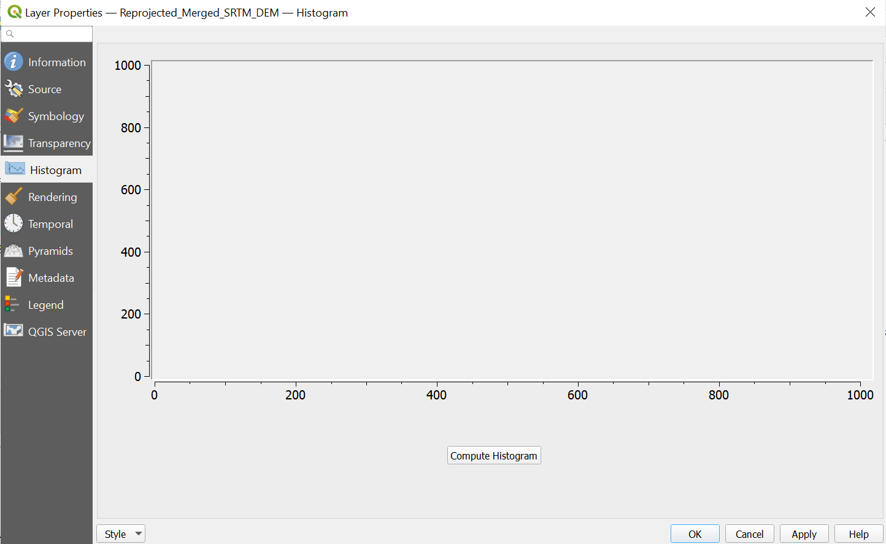

Figure 9.17 - نافذة الرّسم البياني

اضغط على زر حساب  الرسم البياني (Compute histogram) وسيحسبه QGIS تلقائيًا.

بعد حساب الرسم البياني، يمكننا أن نرى أن الماوس يتحول إلى العدسة المكبرة. إنها أداة تسمح بفحص الرسم البياني، ورؤية مدى تكرار نطاقات القيم المختلفة. عند التكبير يمكنك رؤية شيء مثل في Figure 9.18.

للرجوع إلى العرض الكامل، انقر على اليسار.


Figure 9.18 -  Reprojected_Merged_SRTM_DEM تكبير الرسم البياني المحسوب على طبقة

لا يسمح الرسم البياني للمستخدم برؤية توزيع القيم العددية للبكسل فقط، بل أيضا بإعادة تصنيف القيم لتقديم و تصوير البيانات النقطية. للقيام بذلك، استخدم الأداتين لتحديد القيم الدنيا والقصوى الجديدة على الرسم البياني (انظر إلى Figure 9.19).

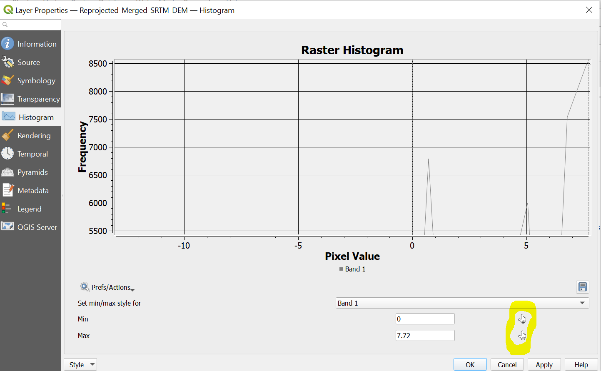

Figure 9.19 - تحديد الحد الأدنى والحد الأقصى للقيم لإعادة تصنيف البيانات النقطية

بعد الضغط على "طبق"، سيتم تمثيل البيانات النقطية باستخدام النطاق الأدنى-الأقصى المحدد الجديد. تسمح هذه الوظيفة للمستخدم بتجاهل القيم المتطرفة التي يمكن أن تمتد بشكل طبيعي إلى خطوط المسح.

على الرغم من أن الأداة التالية التي نستخدمها هي برنامج مساعد (انظر إلى الوحدة 1 للحصول على تفاصيل البرنامج المساعد)، فإننا نعتبرها مفيدة جدًا في بدء العمل باستخدام البيانات النقطية. نحن نشير إلى أداة "القيمة" التي تسمح بالتعرف الفوري على قيم الخلايا عن طريق المرور فوق طبقات البيانات النقطية.

انتقل إلى Plugin -> Manage and Install Plugins وابحث عن البرنامج المساعد <strong>Value Tool</strong> وانقر فوق تثبيت. بعد ذلك، انقر بزر الماوس الأيمن على شريط النافذة الرئيسية لـ QGIS لفتح جميع اللوحات وأشرطة الأدوات المتاحة في تثبيت QGIS الخاص بك وحدد لوحة أداة القيمة (Value Tool panel). تحقق من واجهة QGIS لمعرفة مكان فتحها.

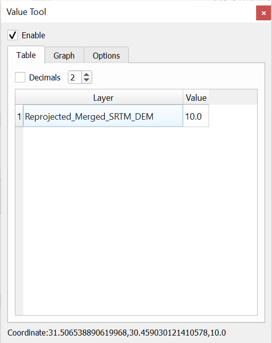

Figure 9.20 - لوحة أداة القيمة

تكمن عمليّة هذه الأداة في بساطة استخدامها حيث يمكن للمرء بسهولة و بنقرات قليلة فقط استخراج خلايا القيمة في المجالات المحددة ذات الأهمية. علاوة على ذلك، فإنها تسمح بذلك لجميع طبقات البيانات النقطية المحملة.

تحتوي أداة القيمة على 3 علامات تبويب: جدول، رسم بياني، خيارات (figure 21).

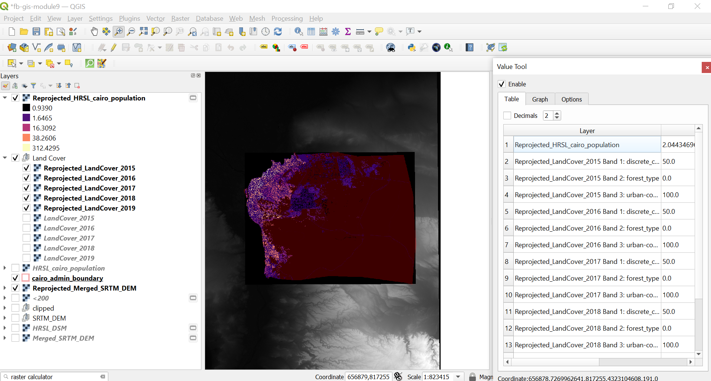

Figure 9.21 - أداة القيمة المحملة ( تسليط الضوء على علامة التبويب الأولى) الجدول

تعرض علامة التبويب الأولى "جدول" قائمة بجميع طبقات البيانات النقطية المحملة وقيم الخلايا أثناء قيام المستخدم بتحريك الماوس. هناك أيضًا إمكانية تحديد عدد الكسور العشرية التي يجب عرض القيم بها. إذا تم تحريك الماوس خارج نطاق الطبقة النقطية،  سيتم عرض رسالة: "خارج النطاق" بدلاً من عرض القيمة.

علامة التبويب الثانية - رسم بياني - تُعرض في رسم بياني موحد جميع القيم التي تقرأها عند موضع الماوس. تسمح للمستخدم بإدخال قيم الحد الأدنى والحد الأقصى على محور قيم الخلية أو Y axis. ويسرد المحور X جميع نطاقات البيانات النقطية التي يعرضها في الجدول، مع أرقام الطلبات المقابلة: الشريط الذي يحتوي على رقم 1 في علامة التبويب الأولى، سيكون أيضًا رقم 1 في الرسم البياني.

تسمح علامة التبويب الثالثة للمستخدم بتخصيص ما تعرضه أداة القيمة: ما هي الطبقات (الكل، فقط المرئية منها أو المحددة منها) والنطاقات التي سيتم عرضها.


<h4><strong>
أسئلة الاختبار
</strong></h4>

هل يمكن إعادة إسقاط الطبقات النقطية في أنظمة إحداثيات أخرى؟

*   نعم.
*   لا

هل يمكن أن يكون هناك أي فجوات بين نطاقات قيم الرسم البياني المحسوبة لطبقة البيانات النقطية؟

*   نعم.
*   لا.

هل يمكن أن يكون للنطاقات المختلفة لنفس مجموعة البيانات النقطية دقة مختلفة؟

*   نعم.
*   لا.


<h3>
المرحلة 2: مقدمة للعمل مع البيانات النقطية
</h3>

الآن وبعد أن تعلمنا كيفية استخراج المعلومات الأساسية حول مجموعات البيانات النقطية المحملة، سنواصل معالجة البيانات النقطية أكثر تعمقًا من أجل الحصول على بيانات نقطية مشتقة جديدة، وبالتالي الحصول على المزيد من المعلومات.

كما نلاحظ، نظرًا لهيكل نموذج البيانات النقطية، فإن الطبقات التي قمنا بتحميلها تتوسع في المنطقة التي تهمنا أي مدينة القاهرة. وهذا أمر غير مرغوب فيه لعدة أسباب، ولكن بشكل أساسي لأننا غالباً ما ننتهي بمعالجة بيانات أكثر مما نحتاجه بالفعل، مما يؤدي إلى الحاجة لمساحة تخزين أكبر واحتياجات معالجة الكمبيوتر أكثر. لهذا السبب، قبل المضي قدمًا في أي خطوات أخرى، سوف نتأكد من أننا نعالج فقط قدر البيانات الذي نحتاجه.  كن حذراً عندما تبدأ بالعمل على مجموعات البيانات الخاصة بك، فإن حجم ملفاتك يعد عاملاً مهمًا عندما يتعلق الأمر بأوقات المعالجة. كلما كبرت الملفات، ستحتاج إلى المزيد من الوقت. نظرًا لهيكل بيانات النموذج ( النقطية مقابل المتجه ) عادةً ما تكون الملفات النقطية أكبر بكثير.

يمكن معالجة مجموعات البيانات التي نقوم بتحميلها في نظم المعلومات الجغرافية (في حالتنا إلى QGIS) معا حتى لو كانت ذات طبيعة مختلفة، مثل ضم جداول csv إلى طبقات متجهة لإضافة معلومات إلى الأشكال الهندسية. الأمر نفسه ينطبق على البيانات النقطية والمتجهة، كما سنرى.

للعمل فقط مع طبقات البيانات النقطية ذات الصلة بمدينة القاهرة الخاصة بنا، سنستخدم طبقة مدى المتجه (cairo_admin_boundary) لقص جميع طبقات البيانات النقطية ذات الصلة. انتقل إلى النقطية -> إستخلاص -> قص النقطية بواسطة طبقة قناع ( Raster -> Extraction -> Clip Raster by Mask Layer ) ( Figure 9.22). كذلك، يمكنك البحث عن Clip في مربّع أدوات المعالجة (Processing Toolbar) أو شريط محدد المواقع (Locator bar).

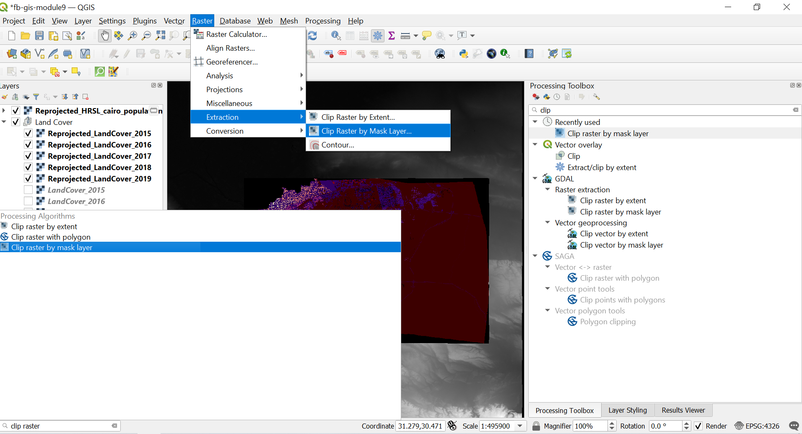

Figure 9.22 - استخدام قناع متجه لاستخراج البيانات النقطية في منطقة معينة

نظرًا لأننا سنعمل مع 7 طبقات نقطية خمسة منها هي طبقات الغطاء الأرضي و نموذج السطح الرقمي و طبقة HRSL، فسوف نستخدم المعالجة بالدفعة لقص جميع الطبقات مرة واحدة. إذا كنت قد تخطيت خطوة إعادة الإسقاط، فسيكون لديك طبقات في إسقاطات مختلفة ولن تعمل الخوارزمية بشكل صحيح وقد تحصل على نتائج غير متوقعة.

يجب أن يبدو إعداد نافذة معالجة الدُفعات كما في Figure 9.23.


Figure 9.23 - عملية الدفعة لقصّ جميع طبقات البيانات النقطية المطلوبة بواسطة هندسة مدينة القاهرة

إعداد المعايير كالتالي:

*   طبقة القناع: cairo_admin_boundary
*   كلا المصدر والهدف CRS هو EPSG 22992
*   حدد نعم لـ: "طابق حدود طبقة الرسومات النقطية المستقطعة مع حدود طبقة التغطية" (match the extent of the clipped raster to the mask layer) و "حافظ على دقة النقطية الإدخال" (keep resolution of input layer).
*   بالنسبة لـ Reprojected_Merged_SRTM_DEM، سنختار أيضًا "نعم" لـ "إنشاء وإخراج الحزمة الطيفية ألفا" (to create an output alpha band). طبقات التحميل عند الانتهاء.

يجب أن تبدو نافذة QGIS الرئيسية كما في Figure 9.24.

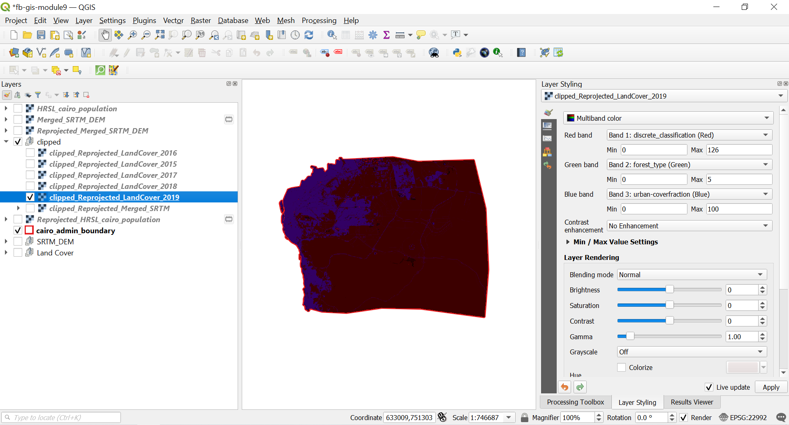

Figure 9.24 - طبقات نقطية مقصوصة بواسطة حدود القاهرة

الآن، تخيل أنه يتعين عليك تقديم تقرير حول المكان الذي يقيم فيه معظم الناس ولكن مع أخذ الارتفاع بعين الإعتبار [^4]. عليك أن تعرف عدد الأشخاص الذين يعيشون على ارتفاع يتراوح بين 0 و 200 متر في مدينة القاهرة وهناك بعض العناصر التي يجب مراعاتها. أولاً، ما هي البيانات التي سيتم استخدامها وما هي خصائصها. بالنسبة للسكان، لديك بيانات طبقة التسوية عالية الدقة و بالنسبة للإغاثة (High Resolution Settlement Layer Data and for relief) لدينا ALOS World 3D - 30m (AW3D30). تتمتع كلتا الطبقتين النقطيّتين بدقة مكانية تبلغ 30 مترًا، مما يسمح لنا بالانتقال إلى اعتبارات أخرى. الإغاثة هي ظاهرة مستمرة أمّا انتشار السكان فليس كذلك، ومع ذلك فلا معنى لأن يتم وضع التقرير بواسطة 30m بكسل. نحتاج إلى تحديد جميع وحدات البكسل بقيم الخلية من 0 إلى 200. وبالنظر إلى الرسم البياني لـ  SRTM للمنطقة التي تهمنا، فقد رأينا أن معظم قيم الخلايا تتراوح بين 0 و 200 متر. يمكننا المضي قدمًا في عمل خريطة إغاثة أساسية بناءً على التقسيمات التالية:

1. 0 - 50m
2. 51 - 100m
3. 101 - 150m
4. 151 - 200m
5. 250 - 600m
6. 600 - 1300m

باستخدام معرفتك المكتسبة في الوحدة 4، يمكنك تصميم طبقة DSM حسب هذه الفئات. يجب أن تبدو خريطتك كما في Figure 9.25.

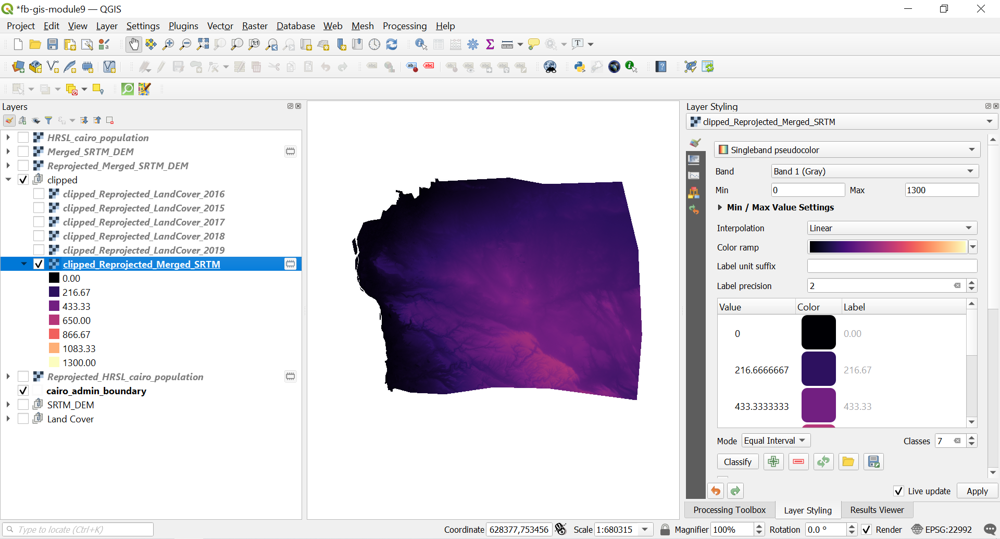

Figure 9.25 - clipped_Reprojected_Merged_SRTM تمثيل   

من أجل حساب عدد الأشخاص بناءً على البيانات النقطية HRSL التي تعيش حتى 200 متر في مدينة القاهرة، يجب أن نرى وحدات البكسل التي تقع في كل فئة من هذه الفئات. للقيام بذلك، سوف نستخدم حاسبة البيانات النقطية. تتيح هذه الوظيفة للمستخدم إجراء عمليات حسابية على أساس قيم البكسل النقطية الحالية. تتم كتابة النتائج في طبقة نقطية جديدة بصيغة مدعومة من [GDAL ^ 5].

توجد عدة طرق لفتح الآلة الحاسبة النقطية في QGIS. يمكنك القيام بذلك من شريط القائمة النقطية -> الحاسبة النقطية (Raster ‣ Raster Calculator ) أو بالبحث عن الآلة الحاسبة النقطية في مربع أدوات المعالجة أو شريط محدد المواقع. إذا قمنا بتشغيل حاسبة البيانات النقطية ضمن تحليل البيانات النقطية في مربع أدوات المعالجة، فيجب أن تظهر النافذة كما في Figure 9.26.b.


Figure 9.26.a - فتح حاسبة البيانات النقطية


Figure 9.26.b - آلة حاسبة النقطية

في هذه النافذة، يمكننا التعرف على العمليات المفصلة في قسم 

والبدائل والإضافات والمقارنات وجميع العمليات الأخرى. يمكن ملاحظة اصطلاح التسمية للخطوط النقطية (Clipped_Reprojected_Merged_SRTM@1): ما يأتي قبل @ هو اسم الطبقة النقطية، ما يأتي بعد @ هو رقم النطاق.

بعد ذلك، سنقوم "بتشريح" الطبقة النقطية Clipped_Reprojected_Merged_SRTM الخاصة بنا لاستخراج وحدات البكسل فقط بقيم تصل إلى 200 متر. نحن نعلم أن خلايا القيمة في Clipped_Reprojected_Merged_SRTM تمثل بيانات رقمية مستمرة (وليست قيمًا منفصلة مثل LandCover). لذلك، فإن العملية التي نحتاج إلى استخدامها في هذه الحالة هي مقارنة قيم خلية واحدة => 200 متر. للحصول على ذلك، سنقوم بكتابة التالي في حاسبة البيانات النقطية:

```
"Clipped_Reprojected_Merged_SRTM@1" <= 200
```

اضبط الطبقة المرجعية على أنها Clipped_Reprojected_Merged_SRTM@1. يجب أن تظهر حاسبة البيانات النقطية كما في Figure 9.27.

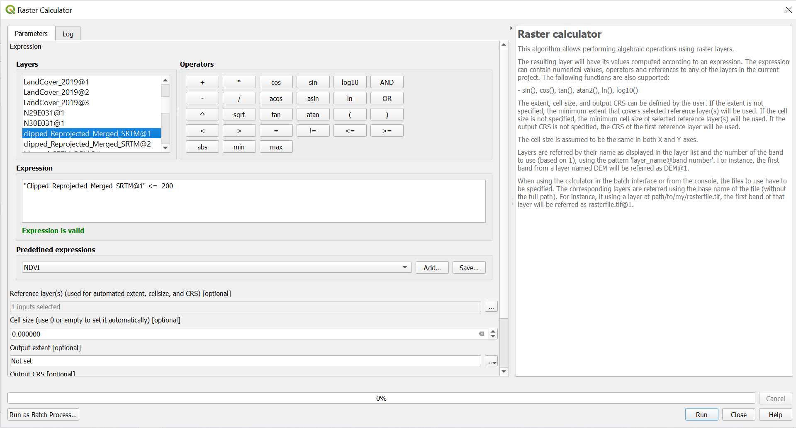

Figure 9.27 - إدخال صيغة في حاسبة البيانات النقطية

يجب أن تبدو النتيجة كما في Figure 9.28.


Figure 9.28 - نتيجة تحديد جميع قيم البكسل التي تقل عن 200 متر باستخدام حاسبة البيانات النقطية

سيتم تسمية النتيجة الإخراج "<strong><code>Output</code></strong>". يمكنك إعادة تسمية هذا إلى<code> >200</code>. كما نرى في لوحة الطبقات، تحتوي الطبقة النقطية التي حصلنا عليها على قيمتين 0 و 1. وذلك لأننا استخدمنا عملية منطقية، مقارنة، وبالتالي كل بكسل أقل من 200 متر تلقى القيمة = 1 وكل بكسل أكبر من ذلك تلقى القيمة = 0. يمكننا اختبار ذلك باستخدام "أداة القيمة" <strong><code>Value Tool</code></strong>. يعرض Figure 9.29 فقط وحدات البكسل ذات القيمة 1، وبعبارة أخرى ، البيكسلات التي تهمنا في هذا التمرين.


التوزيع المكاني لجميع وحدات البكسل ذات القيمة 1، بمعنى أن يكون الارتفاع أقل من 200 متر - Figure 9.29 

للمضي قدمًا، يمكننا إظهار التوزيع المكاني للسكان بدقة مكانية تساوي 30 مترًا فقط في هذه المنطقة الجغرافية المحددة، التي اخترناها (مدينة القاهرة)، أقل من 200 متر. للقيام بذلك، استخدم حاسبة البيانات النقطية مرة أخرى.

الصيغة بسيطة إلى حد ما، بالنظر إلى أن جميع قيم خلايا DSM التي نهتم بها لها قيمة 1.

افتح الحاسبة وأدخل الصيغة التالية:

```
"< 200@1"*"Reprojected_HRSL_cairo_population@1"
```


Figure 9.30 - استخدام الآلة الحاسبة النقطية لتحديد فئات توزيع السكان بناءً على ارتفاع يصل إلى 200 متر

على عكس استخدام الآلة الحاسبة النقطية السابقة، استخدمنا مجموعتين مختلفتين من البيانات النقطية للحصول على النتيجة المرجوة، ومع ذلك ستلاحظ أنه حتى لو كانت هناك وحدات بكسل تقع خارج الطبقة (200>) في النتيجة، فإن قيمتها تساوي 1. استخدم أداة القيمة للتحقق (Figure 9.31).


Figure 9.31 - استخدام أداة القيمة للتحقق من نتائج حاسبة البيانات النقطية

بعد ذلك، نقدم التوزيع المكاني للسكان الذين يعيشون على أقل من 200 متر في مدينة القاهرة. لاختيار التصنيف المناسب، نقوم بحساب المدرج التكراري أو الرسم البياني. يمكننا ملاحظة أن معظم القيم تتراوح بين 0.1 و 200 شخص لكل 30 مترًا. يمكن رؤية التصنيف الذي اخترناه Figure 9.32.


Figure 9.32 - توزيع السكان الذين يعيشون على أقل من 200 متر في القاهرة، ممثلة بدقة 30 متر

إذا كنا مهتمين بالعدد الإجمالي للأشخاص الذين يعيشون على ارتفاع أقل من 200 متر في القاهرة وليس التوزيع الجغرافي لكل 30 مترًا من الدقة المكانية، فإننا نحتاج إلى تلخيص جميع قيم البكسل لطبقة البيانات النقطية HRSL_DSM. تتمثل إحدى طرق الحصول على هذا الرقم في تحويل  طبقة "200>" من خطوط المسح إلى المتجهات [....]

للقيام بذلك، انتقل إلى النقطية -> التحويل -> المضلع (النقطية إلى المتجه) أو (Raster -> Conversion -> Polygonize (Raster to Vector.

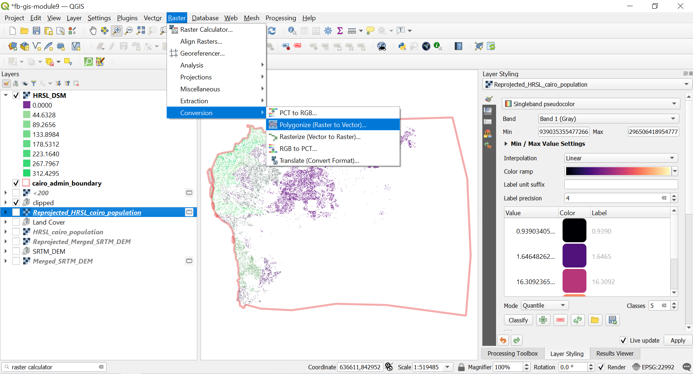

Figure 9.33.a - التحويل من النقطية إلى المتجه

تذكر أن هذه الطبقة النقطية تحتوي على قيمتين فقط - 0 و 1 ، لذا اختر المعايير التي سيتم من خلاله بناء المتجه DN (الرقم الرقمي).


Figure 9.33.b - معايير التحويل من النقطية إلى المتجه

يجب أن تبدو النتيجة كما في Figure 9.34.

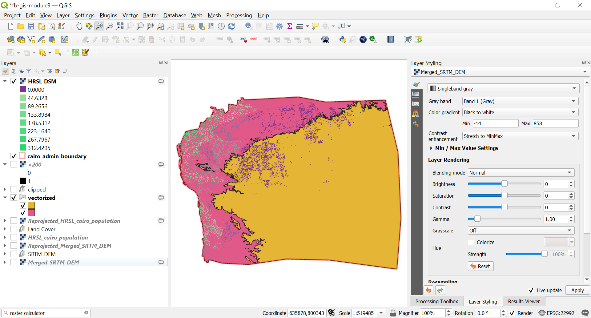

Figure 9.34 - نتيجة تحويل مجموعة بيانات نقطية إلى مجموعة بيانات متجه

احذف هندسة القيمة 0.

للعثور على إجابتنا، سنستخدم إحصائيات المنطقة "Zonal Statistics". للعثور بسرعة على هذه الوظيفة، افتح صندوق أدوات المعالجة واكتب في مربع البحث "zonal" (انظر إلى  figure 9.35).

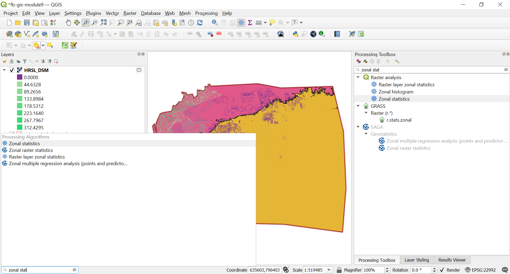

Figure 9.35 - تحديد إحصائيات المنطقة في مربع أدوات المعالجة

في النافذة التي تم فتحها، حدد المعايير كما في Figure 9.36. حسب الإحصائيات المحسوبة، حدد: العد ، المجموع ، الحد الأدنى والحد الأقصى.


Figure 9.36 - ضبط معايير إحصائيات المنطقة

الطبقة الناتجة عبارة عن طبقة متجهة تحتوي على الإحصائيات التي حددناها كسمات (انظر إلى الشكل Figure 9.37).


Figure 9.37 - الطبقة المتجهة الناتجة من إحصائيات المنطقة

وبهذه الخطوة الأخيرة نكون قد أجبنا على سؤال "كم عدد الأشخاص (وأين) يعيشون على ارتفاع أقل من 200 متر في مدينة القاهرة؟".


<h4><strong>
أسئلة الاختبار
</strong></h4>

1. هل يمكن قص البيانات النقطية؟
    1. نعم.
    2. لا.
2. هل يمكن استخدام مجموعات البيانات المتجهة التي تم تحميلها في مشروع QGIS في حاسبة البيانات النقطية؟
    3. نعم.
    4. لا.
3. هل يمكن تحويل مجموعات البيانات النقطية إلى مجموعات بيانات متجه؟
    5. نعم.
    6. لا.


<h3>
المرحلة 3: العمل مع البيانات النقطية والمتجه
</h3>

في المرحلة السابقة، رأينا كيف يمكننا معالجة مجموعتي بيانات نقطية من أجل اشتقاق معلومات جديدة. لقد استخدمنا نموذج السطح الرقمي وطبقة التسوية عالية الدقة لمعرفة عدد الأشخاص الذين يعيشون على ارتفاع أقل من 200 متر في القاهرة. قبل إجراء أي تحليل، تأكدنا من أن مجموعات البيانات كانت في نفس الإسقاط  وإذا ما كانت النقطيات لها نفس الدقة المكانية بحيث تكون النتائج التي حصلنا عليها قابلة للتطبيق. عند الإشارة إلى تطابق النظام الإحداثي المرجعي المستخم يكون المنطق واضحًا، ولكن لما الحاجة إلى نفس الدقة المكانية؟

الدقة المكانية هي حجم سطح الأرض المقاس بوحدات الطول، بمعنى آخر، هي حجم البكسل المقاس على الأرض. إذا كانت دقة المسح النقطية 30 مترًا، فهذا يعني أن أصغر جسم خطي يمكننا اكتشافه في تلك الصورة يبلغ 30 مترًا، أي جسم أصغر من ذلك لن نتمكن من اكتشافه. يمكننا مقارنة الدقة المكانية بمقياس الخريطة. إذا كانت الخريطة بمقياس 1: 25000، فهذا يعني أن وحدة طول واحدة على الخريطة تمثل 25000 وحدة على الأرض، أي 1 سم يساوي 25000 سم، 1 سم على الخريطة يساوي 250 مترًا على الأرض. على سبيل المثال، سيكون للطريق البالغ طوله 2 كم، 8 سم على الخريطة.

ما سبب أهمية ذلك عند العمل مع مجموعات البيانات النقطية؟ قد يقدم Figure 9.38 تفسيراً.


مثال على درجات دقة مختلفة خاصة بصور أقمار صناعية مختلفة - Landsat و SPOT - لنفس المنطقة  - Figure 9.38

_(مصدر الصورة : Congedo, L. and Munafò, M, (2013) Assessment of Land Cover Change Using Remote Sensing: Objectives, Methods and Results, Rome: Sapienza University. Available at: [http://www.planning4adaptation.eu/](http://www.planning4adaptation.eu/)_

يوضح Figure 9.38 العلاقة بين دقة صور القمر الصناعي ومعلومات الغطاء الأرضي المستخرجة من هذه الصور الملتقطة.  كما أوضحنا في البداية فإن قيمة خلية البكسل تُعزى إلى المنطقة التي تغطيها بالكامل، لكن هذا لا يعني أن هذا هو الواقع على الأرض. هذه القرارات يتخذها خبراء EO التي تستمد منتجات مختلفة بناءً على صور مراقبة الأرض (Earth Observation) - وكلها موثقة في أوراق تمت مراجعتها من قِبل النظراء وأوصاف خوارزمية. أي تفسيرات إضافية حول هذه الوثائق هي خارج نطاق هذه الوحدة، ولكن من المهم أن نأخذ العلاقة بين ما يلتقطه المستشعر الموجود على متن القمر الصناعي والمنتجات التي نستخدمها بعين الإعتبار.

بالعودة إلى القاهرة، يمكننا اختبار هذه الاختلافات بالبيانات المتوفرة لدينا. لقد حمّلنا في مشروع QGIS خمسة طبقات نقطية من LandCover لمدة 5 سنوات: 2015 و 2016 و 2017 و 2018 و 2019. بعد ذلك، سنقوم بتحميل فسيفساء من صور  <code>[Sentinel-2 [^ 6</code>. وسنقوم بتحميل طبقة WMS EOX Sentinel-2 بدون سحابة، المتاحة <a href="https://s2maps.eu/">هنا</a>. تذكر من الوحدة 2، لإضافة طبقة WMS، انتقل إلى Layer -> Add layer -> Add WM/WMTS Layer..

عند فتح نافذة الإضافة، استخدم المعايير التالية:

```
Name: EOX Sentinel-2
URL: https://tiles.maps.eox.at/wms?service=wms&request=getcapabilities
```

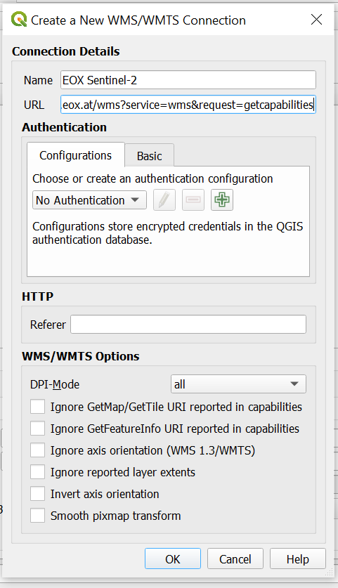

Figure 9.39 -QGIS إلى WMS  إضافة طبقة

بعد الاتصال بطبقة WMS المضافة حديثًا، سنقوم بتحميل الطبقة المسماة Sentinel-2 الطبقة غير السحابية لعام 2019 بواسطة EOX - 4326 في QGIS. بعد تكبير منطقة الاهتمام، يجب أن تبدو نافذة الخريطة كما في Figure 9.40.

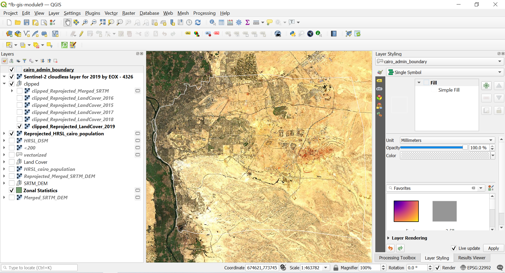

Figure 9.40 - القاهرة EOX - 4326 - لعام 2019 Sentinel-2 طبقة غير سحابية

على الرغم من الحصول على منتجات LandCover باستخدام بيانات الأقمار الصناعية الأخرى (Proba-V)، فلنقارن الطبقتين حتى نتمكن من فهم معنى الدقة المختلفة. تذكر أن منتج LandCover يبلغ ارتفاعه 100 متر وصور Sentinel-2 على ارتفاع 10 أمتار. لتحقيق ذلك، سنفتح Clipped_Reprojected_LandCover 2019 وطبقة WMS. لإجراء مقارنات بين طبقتين، سنستخدم برنامجاً مساعداً جديدًا يجب عليك تثبيته. لذلك، انتقل إلى Plugins -> manage and install plugins واكتب في مربع البحث <strong><code>MapSwipe Tool</code></strong>. بمجرد تثبيته، يجب أن يظهر رسم تخطيطي جديد خاص به في شريط الأدوات ().

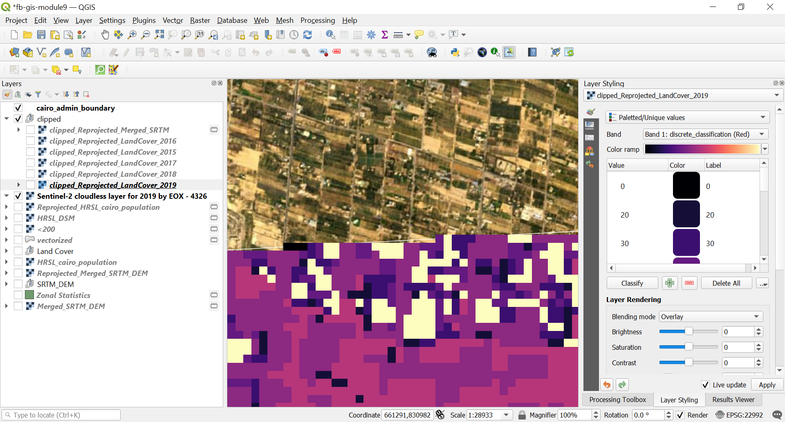

Figure 9.41 - MapSwipe Tool مقارنة طبقتين نقطيتين باستخدام البرنامج المساعد

لتنشيط أداة MapSwipe، انقر عليها أثناء تحديد الطبقة النقطية التي تريد ثنيها في لوحة الطبقات. الاختلافات في الدقة واضحة، بالإضافة إلى حقيقة أن منتج القمر الصناعي (الغطاء الأرضي) قد تم تطويره باستخدام صورة القمر الصناعي (PROBA-V) بدقة أعلى. ومع ذلك، فإن الفئات الأكبر العامة محددة جيدًا، كما يتضح من Figure 9.42.


Figure 9.42 - تم الحصول على LandCover2019 من (PROBA-V (100m)) فوق فسيفساء (Sentinel 2 mosaic (30m

ستظهر إضافة HRSL إلى الخريطة تطابقًا جيدًا بين HRSL و LandCover. تم تمثيل المساحة الحضرية باللون الأحمر، وكما نرى في Figure 9.43، فهي مغطاة بالكامل تقريبًا بطبقة HRSL.


Figure 9.43 - Clipped_Reprojected_LandCover 2019 فوق HRSL إضافة

ومع ذلك، عند التكبير، يمكنك رؤية الاختلاف في الدقة بين المنتجين النقطيين، كما في Figure 9.44.


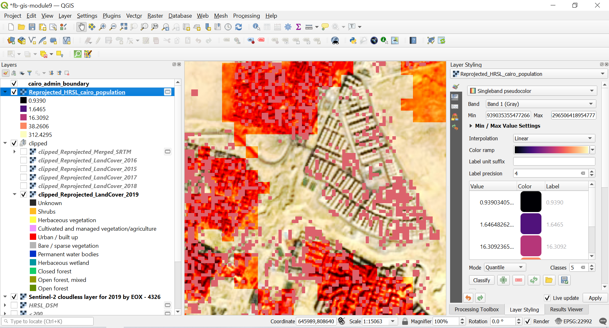

Figure 9.44 - (100m - red and magenta colours) Clipped_Reprojected_LandCover 2019  و (  pinkish-30m) HRSL  الفرق في الدقة المكانية بين

الآن، إذا تم إجراء أي تحليل باستخدام هذه البيانات النقطية، فلن تكون النتائج قابلة للتطبيق، لأننا نقارن القيم التي تنطبق على دقة مختلفة لكل من الطبقتين. لذلك يجب على المستخدم إعادة إنشاء العيّنة أو resample واحدة منهما كي يتم التطابق كمرحلة معالجة مسبقة.

تشير إعادة إنشاء العيّنة إلى تغيير قيم الخلية بسبب التغييرات في شبكة الخلايا النقطية وهناك خياران فقط: (1)  يشير  الاختزال (upsampling) إلى الحالات التي نقوم فيها بالتحويل إلى دقة أعلى / خلايا أصغر و (2) يتم إعادة إنشاء العيّنة إلى دقة أقل (downsampling) / أحجام خلايا أكبر.

دعونا نتخيل التمرين التالي. نحتاج إلى تحديد أعداد السكان لكل فئة من فئات الغطاء الأرضي التي حددناها في مدينة القاهرة. كما هو موضح أعلاه، كي نحصل على نتائج قابلة للتطبيق من تحليلنا، نحتاج إلى المعالجة المسبقة للبيانات التي لدينا، أي في حالتنا، نحتاج إلى إحضار مجموعتي البيانات النقطية إلى نفس الدقة المكانية. كما هو مفصل أعلاه، يمكننا إما زيادة أبعاد البكسل أو تقليلها. يجب تسليط الضوء على أن إعادة العينة، باستخدام مقياس أعلى أو أصغر، ستشمل عملية الاستيفاء لذا فإن النتيجة تقدم خطأ إحصائيًا. تتمثل الممارسة المعتادة في إعادة عينة جميع البيانات النقطية لتتوافق مع البيانات النقطية ذات الدقة الأقل، ولكن مرة أخرى يجب اتخاذ هذا القرار مع مراعاة جميع العوامل. تفصيل عملية صنع القرار لإعادة تشكيل طبقات البيانات النقطية يتجاوز نطاق هذا المنهج بكثير.

يجب إبراز الفرق بين المنتجين: يغطي منتج LandCover <strong>المنطقة بأكملها</strong> من النطاق المدروس، على عكس منتج HSRL، حيث تحتوي الطبقة النقطية بدقة على الخلايا حيث توجد القيم أعلى من 0. يثير هذا الموقف بعض المشاكل عند إعادة تشكيل قيم خلية الاستيفاء، لأنه بغض النظر عن طريقة الاستيفاء المختارة والتي من شأنها أن تأخذ بعين الاعتبار وحدات البكسل المحيطة بالإضافة إلى اتباع خوارزمية محددة جيدًا، لا تكون بكسلات الحافة على حافة منطقة الدراسة، ولكن داخلها. لذلك، في حالتنا التوضيحية، سنقوم باختزال منتج الغطاء الأرضي من دقة 100 م إلى 30 م لمطابقة دقة منتج HRSL. تعتبر طريقة إعادة التشكيل التي نختارها أمرًا بالغ الأهمية حيث يمكن أن تختلف النتائج بشكل كبير. لغرض العرض التوضيحي، سنقوم بإعادة تشكيل منتج LandCover باستخدام طريقتين مختلفتين - أقرب جار والوضع (Nearest Neighbour and Mode).

لإعادة العيّنة، انتقل إلى النقطية -> الإسقاط -> التفاف (إعادة الإسقاط) ((Raster ‣ projection ‣ Wrap (reproject. في نافذة الوظائف، قم بتعيين المعايير التالية:

*   طبقة الإدخال: Clipped_Reprojected_LandCover 2019 ،
*   المصدر CRS و CRS الهدف: EPSG:22992،
*   طريقة إعادة أخذ العينات: أقرب جار،
*   لا توجد بيانات: 255 ، دقة ملف الإخراج: 30،
*   نوع بيانات الإخراج: استخدام نوع بيانات طبقة الإدخال،
*   مدى المرجع الجغرافي: حدد طبقة Clipped_Reprojected_LandCover 2019.

احفظ طبقة الإخراج كـ LC2019_NearestNeighbour.

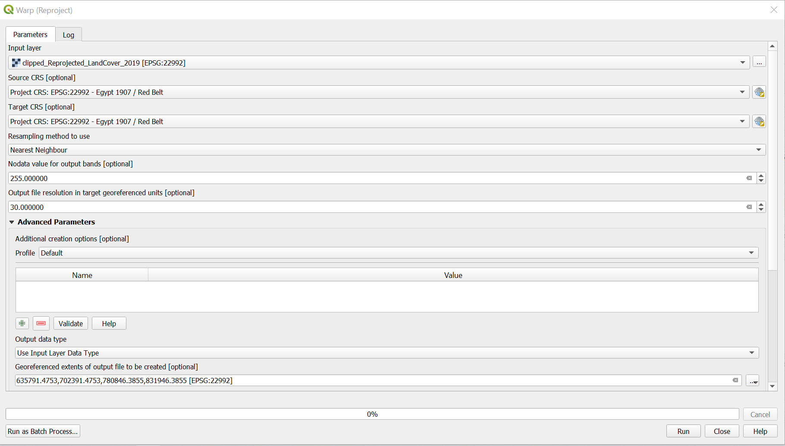

Figure 9.45 - إعادة إنشاء العيّنة لطبقة الغطاء الأرضي

الآن، اتبع الخطوات نفسها، باستثناء تلك الخاصة بمعيار طريقة إعادة التشكيل، اختر الوضع Mode. احفظ طبقة الإخراج كـ LC2019_Mode.

الآن، دعونا نقارن النتائج - انظر إلى Figure 9.45.b and 46.a.


Figure 9.46.a -إعادة إنشاء عينات من منتج الغطاء الأرضي باستخدام طريقة أقرب جار 

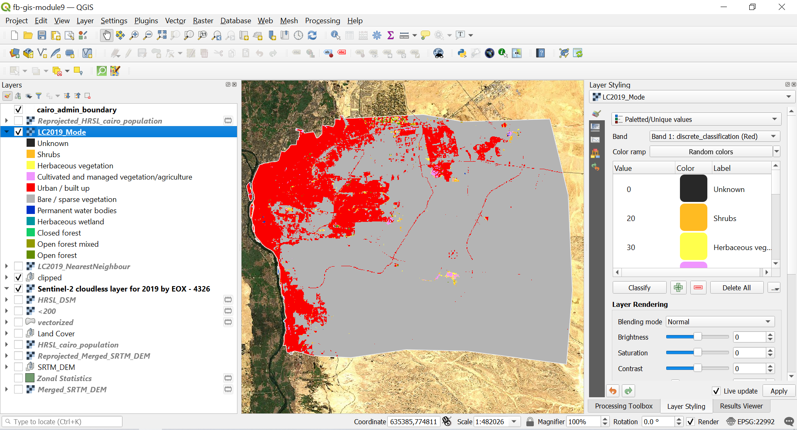

Figure 9.46.b - إعادة إنشاء عينات من منتج الغطاء الأرضي باستخدام طريقة الوضع

كلا النقطيّتين لهما نفس الرموز المطبّقة ويمكننا ملاحظة أن هناك قيم لا تقع في أي من الفئتين حيث لا تظهر وحدات البكسل  في Figure 9.46. ولكن نحن نعلم أن منتج الغطاء الأرضي عبارة عن طبقة سلسة - لا توجد بها فجوات بين نفس الفئات المحددة. دعونا نلقي نظرة على الرسوم البيانية لجميع الطبقات الثلاث. لذلك، اذهب إلى خصائص الطبقة -> الرسم البياني أو  Properties -> Histogram واختر من Prefs / Actions لإظهار Band 1. احفظ الرسم البياني عن طريق النقر على أيقونة الحفظ في الجانب الأيمن من النافذة (انظر إلى Figure 9.47 ).

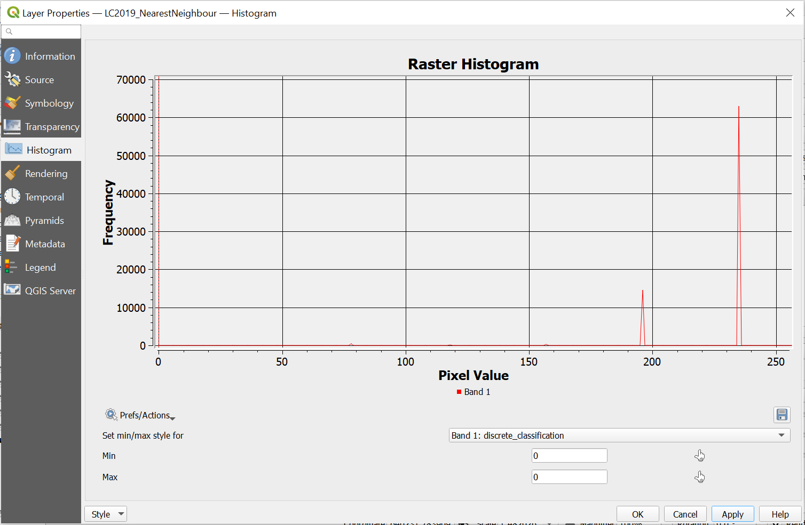

Figure 9.47 - إظهار القيم لنطاق واحد فقط محدد في الرسم البياني

Figure 9.48 يعرض الرسوم البيانية الثلاثة ذات الأهمية (a) و (b) و (c).

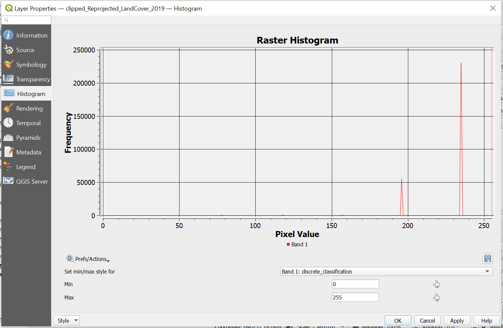

Figure 9.48.a - Clipped_Reprojected_LandCover 2019 (100m) الرسم البياني الخاص بـ


Figure 9.48.b - LC2019_NearestNeighbour الرسم البياني الخاص بـ

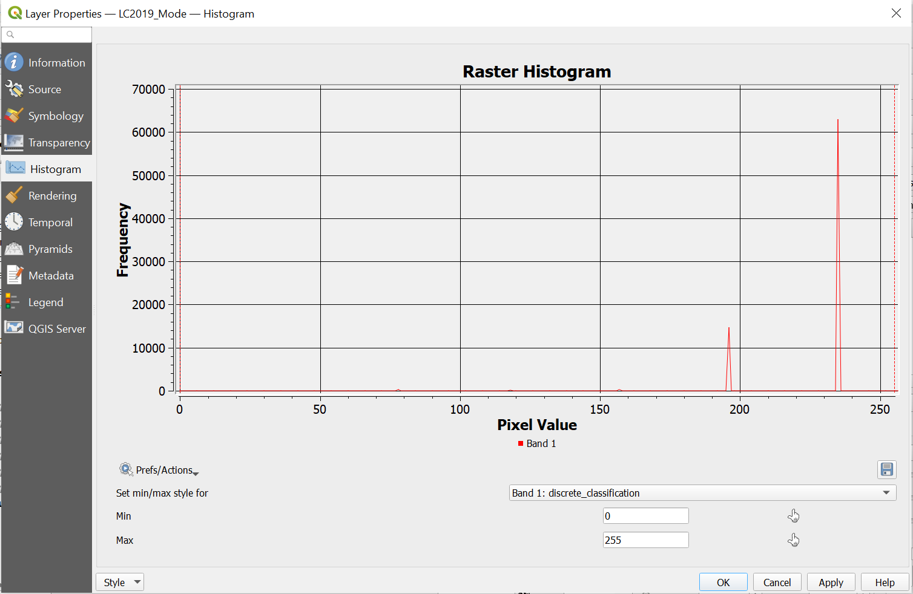

Figure 9.48.c -  LC2019 Mode الرسم البياني الخاص بـ 

يمكننا ملاحظة الاختلافات في توزيع القيم في مجموعات البيانات الثلاثة، وبالتركيز على (b)، حيث استخدمنا "أقرب جار" كطريقة لإعادة إنشاء العينة نجد أن ذلك أدّى، كما هو متوقع، إلى حصولنا على قيم بكسل محسوبة، وبالتالي إلى قيم لا تتوافق مع أي قيم في منتج الغطاء الأرضي (انظر إلى الجدول 1، الصفحة 6). وفي النتيجة نحصل على المسافات البيضاء أو وحدات البكسل التي لم يتم تعيين لون لها. كما تم استنتاجه، فإن طريقة إعادة إنشاء العينة، أو طريقة إعادة إنشاء العينة بالأغلبية، تقوم بتحديد القيمة التي تظهر في أغلب الأحيان.

في هذه المرحلة، يجب أن تبدو نوافذ الخريطة الخاصة بك كما في Figure 9.9.49.


Figure 9.49 - Land Cover 2019 and HRSL المنتجان النقطيّان المتراكبان

بالعودة إلى تمريننا، كانت المتطلبات تشمل تحديد أعداد السكان لكل فئة من فئات الغطاء الأرضي التي حددناها في مدينة القاهرة. في هذه المرحلة، قمنا بمعالجة البيانات النقطية الخاصة بنا مسبقًا، وذلك لجعلها في نفس نظام الإحداثيات ونفس الدقة المكانية. سنستمر في خوارزمية التحويل، وسنحول الغطاء الأرضي لمجموعة البيانات النقطية إلى مجموعة بيانات متجهية - نوع مضلع. سيتيح لنا ذلك تحديد عدد السكان بسهولة أكبر لكل فئة من فئات الغطاء الأرضي.

للتحويل، من النقطية إلى المضلع، وكذلك من المتجه إلى المضلع، انتقل إلى النقطية -> تحويل أو (Raster ‣ Conversion)، وهنا لدينا المزيد من الخيارات. سوف نختار Polygonize (النقطية إلى المتجه) .. وسنقوم بتحويل أحدث مجموعة بيانات نقطية حصلنا عليها: LC2019_Mode إلى متجه. يجب أن تبدو النتيجة كما في Figure 9.50.b.


Figure 9.50.a - إلى مضلّع  LC2019_Mode (30m)  تحويل الطبقة النقطيّة


Figure 9.50.b- إلى مضلّع  LC2019_Mode (30m) نتيجة تحويل الطبقة النقطيّة 

كما يمكننا أن نلاحظ، تم تحويل كل بكسل وكل مجموعة من وحدات البكسل المجاورة لبعضها والتي تحمل نفس رمز الفئة (انظر الجدول 1، الصفحة 6) إلى مضلع واحد. ومع ذلك، فنحن لسنا مهتمين بكل منطقة متميزة، ولكن بالفئة ككل. وبالتالي، سنقوم بتطبيق dissolve على طبقة المتجه التي حصلنا عليها باستخدام "تعريف الفئة" كسمة مشتركة. 

(Vector -> Geoprocessing tools -> Dissolve - لمزيد من التفاصيل، تحقق من الوحدة 8).

عند إرفاق نفس التصميم الخاص بالنقطية، سنلاحظ أن نفس فئات المتجهات تتوافق مع الفئات النقطية (انظر إلى Figure 9.51).

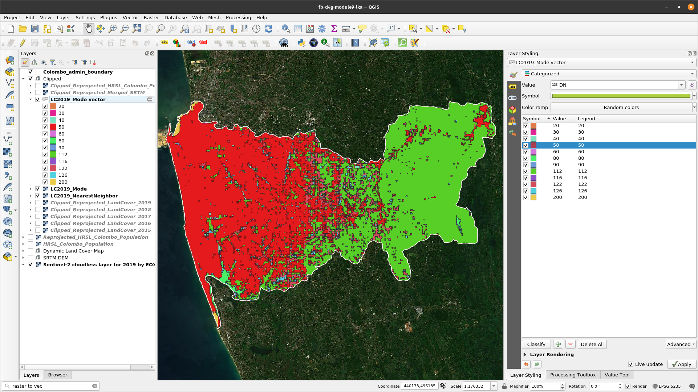

Figure 9.51 - LC2019_Mode مضلع

كما يمكننا أن نلاحظ، فإن وحدات البكسل في HRSL، كما هو متوقع، ليست مضمنة تمامًا في مضلع لمنتج الغطاء الأرضي (انظر إلى Figure 9. 52).

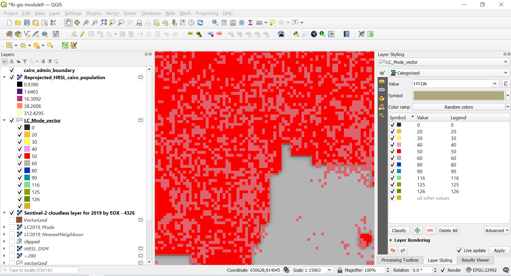

Figure 9.52 - عدم تطابق وحدات بكسل HRSL ومجموعة بيانات متجه الغطاء الأرضي

للتخلص من هذه المشكلة، سنقوم بتحويل طبقة HRSL إلى متّجه أيضًا، ولكن هذه المرة سننقل قيمة خلية البكسل إلى نقطة أي المركز الهندسي لكل بكسل.

انتقل إلى Processing ‣ Toolbox. في شريط البحث، اكتب <code>raster point</code> واختر خوارزمية <code>Raster pixels <strong>to</strong> points</code> (انظر إلى Figure 9.53.a). احفظ الإخراج كـ HRSL_points.

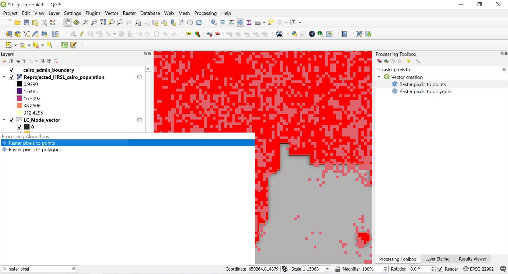

Figure 9.53.a - بكسل النقطية إلى نقاط

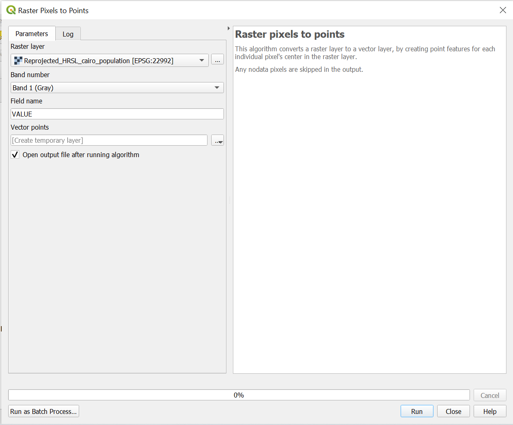

Figure 9.53.b - تشغيل خوارزمية  تحويل وحدات البكسل النقطية إلى النقاط

حسب مساحة منطقة الدراسة الخاصة بك، قد تستهلك هذه العمليّة وقتاً طويلاً. يوضح Figure 9.54 عدد النقاط التي حصلنا عليها لمدينة القاهرة.


Figure 9.54 - تحميل بيانات “نقط المتجه” التي تم الحصول عليها

عدد الميزات مرتفع إلى حد كبير وقد يتطلب أي نوع من المعالجة أو التصور وقتًا طويلاً في حال لم يتم استيرادها إلى قاعدة بيانات. في هذه الأنواع من المواقف، يكون الحل المعقول هو تقسيم مجموعات البيانات التي يتعين علينا معالجتها إلى أجزاء يمكن إدارتها. لذلك، سنقوم بإجراء الحسابات اللازمة على مناطق أصغر ومحددة جيدًا. لتقسيم طبقة HRSL، سنستخدم خيار إنشاء VRT. حدد طبقة HRSL واختر Export as.. في النافذة الجديدة، حدد خيار إنشاء VRT وقم بتعيين المعايير التالية:

*    اختر مجلدًا حيث سيتم تصدير البيانات النقطية المقسمة إليه  
*    CRS: EPSG: 22992
*    max columns 1000  :VRT tiles
*    الحد الأقصى للصفوف: 1000 (انظر إلى  figure 55).

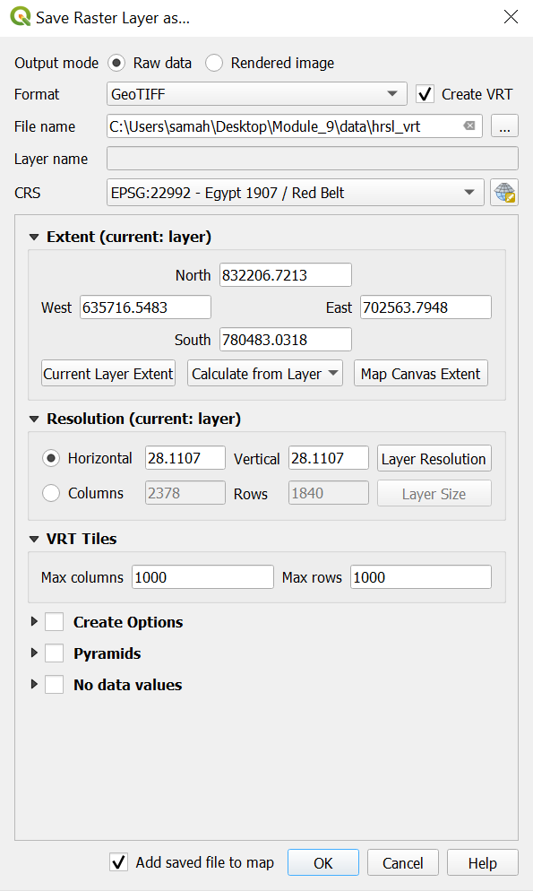

Figure 9.55 - باستخدام مربعات نقطية محددة  VRT إنشاء ملف

بعد التصدير، قم بتحميل كل المربعات النقطية في مشروع QGIS الخاص بك. يجب أن تبدو النتيجة في  Figure 9.56.

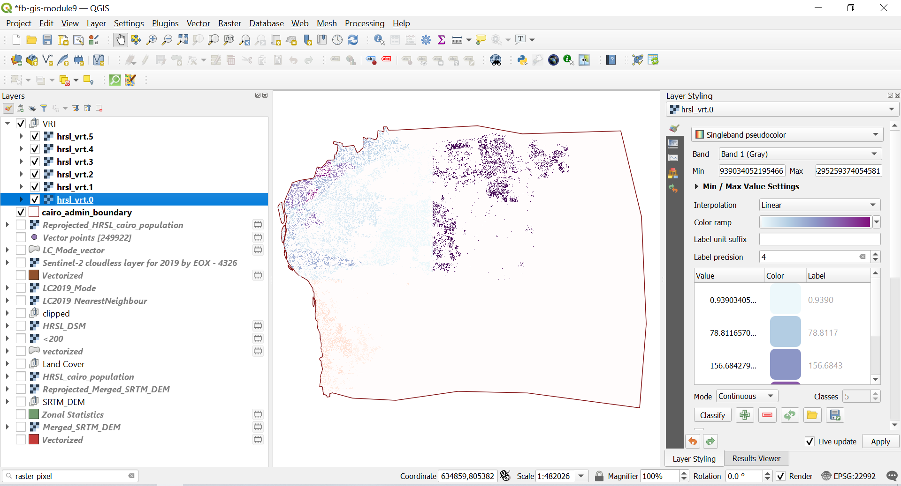

Figure 9.56 - منطقة القاهرة HRSL البلاط النقطي لـ 

بعد ذلك، سنقوم بإعادة تشغيل خوارزمية Raster pixels to points لكل من البلاطات النقطية. نظرًا لأن لدينا العديد من المربعات، سنستخدم وظيفة معالجة الدُفعات (انظر figure 57).

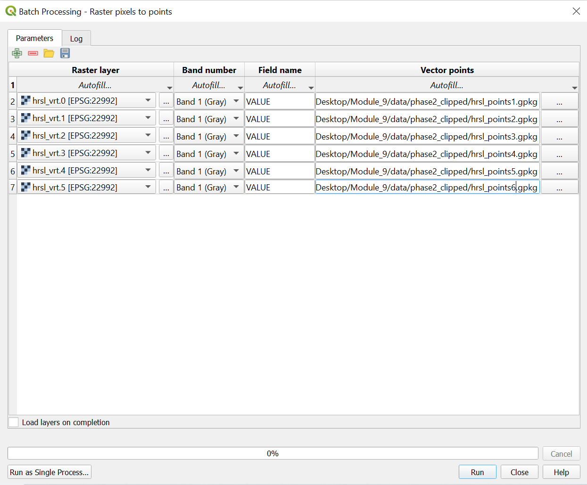

Figure 9.57 - لكل من البلاطات النقطية Raster pixels to points  تشغيل 

يجب أن تبدو نقاط المتجه الناتجة كما في Figure 9.58.


Figure 9.58 - مجموعة بيانات متجه نقطية لطبقة HRSL بقيم بكسل مخزنة في عمود VALUE

بإلقاء نظرة فاحصة على نتائج الخوارزمية، يمكننا أن نرى أن نقاط المتجه تقع بالضبط في مركز البكسل الذي تستخرج القيمة منه (انظر إلى figure 59).

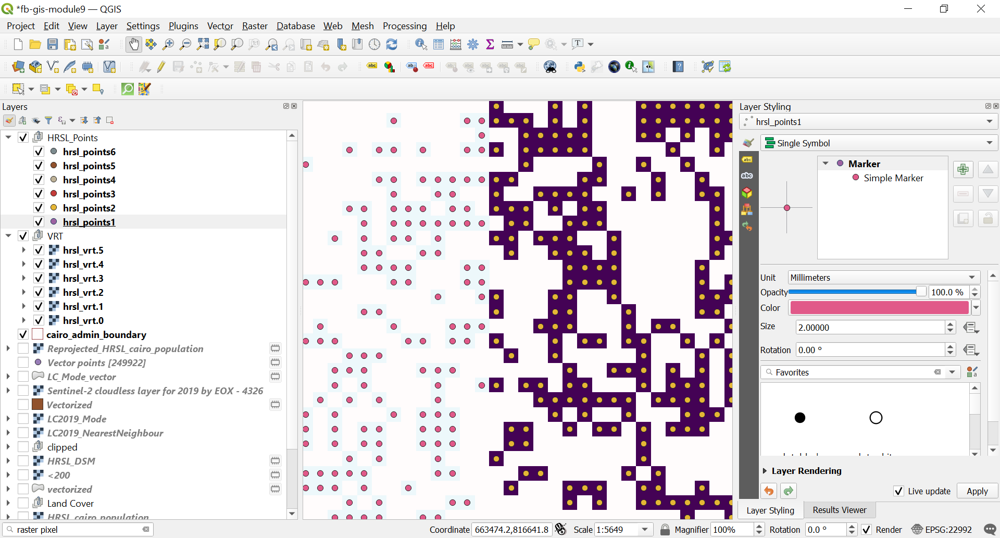

Figure 9.59 - التحقق من قيم بيانات نقطة المتجه مقابل قيم البكسل النقطية

لحل التمرين، يجب حساب مجموع قيم النقط المستخرجة من منتج HRSL التي تقع داخل كل مضلع لمنتج الغطاء الأرضي. للقيام بذلك، سنستخدم وظيفة متوفرة في Field Calculator - <strong><code>aggregation</code></strong>. هذه الوظيفة قوية جدًا لأنها تقوم بوصلات مكانية كجزء من عملها مما يسمح بإجراء عمليات حسابية مختلفة. في حالتنا، يجب أن تحدد الوظيفة النقاط التي تقع في كل مضلع ثم تلخص قيم تلك النقاط. للقيام بذلك، انتقل إلى جدول السمات الخاص بمجموعة بيانات LC2019_Mode_vector وافتح حاسبة الحقل. قم بإنشاء حقل جديد وأدخل التعبير التالي:

```
aggregate(
    layer:= 'hrsl_points4',
    aggregate:='sum',
    expression:=VALUE,
    filter:=intersects($geometry, geometry(@parent))
)
```

حيث <strong><code>layer </code></strong>هو اسم مجموعة البيانات التي نريد استخراج المعلومات منها (في حالتنا، مجموعة البيانات النقطية التي تحتوي على قيم البكسل لطبقة HRSL النقطية). والتجميع أو<strong><code>aggregate</code></strong>- يشير إلى الإجراء الذي يتعين تنفيذه بمجرد تأكيد الصلة المكانية (مجموع، عدد، معدّل، متوسط ، وصل وما إلى ذلك) ، تعبير أو <strong><code>expression</code></strong> - يشير إلى العمود الذي نريد إستخراج البيانات منه، <strong><code>filter </code></strong>- يشير إلى وظيفة الهندسة (تقاطع ، داخل إلخ) (انظر إلى figure 60).

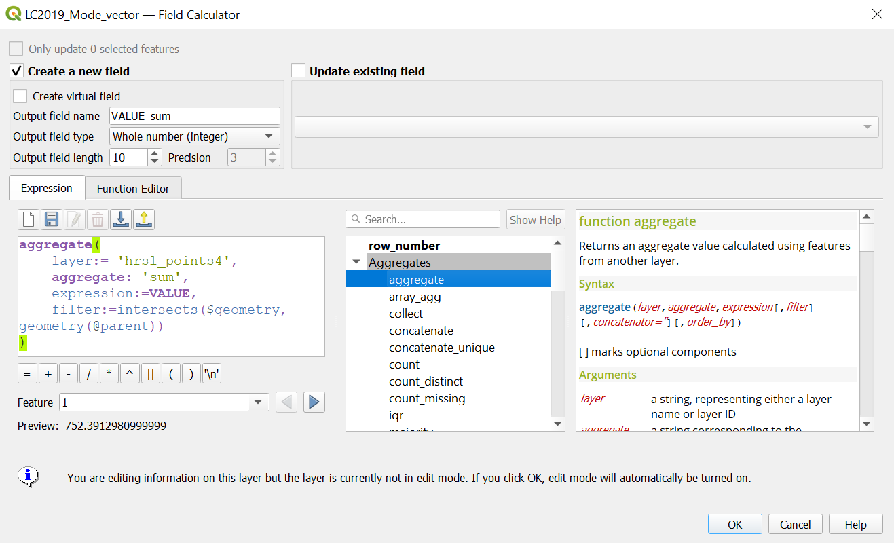

Figure 9.60 - استخدام وظائف مدمجة في حاسبة المجال

يتم حفظ النتائج في جدول السمات الخاص بـ LC2019_Mode_vector. وبالتالي، نكون قد أنهينا التمرين.

يرجى الملاحظة! يمكن أن تكون هذه الخطوة الأخيرة طويلة جدًا اعتمادًا على حجم بياناتك! قم ببعض الإختبارات للعثور على أفضل أبعاد التبليط الخاصة بك.

إذا كنت تستخدم Field Calculator وواجهت مشكلة في تشغيل الوظيفة "التجميعية" ، فيمكنك أيضًا استخدام خوارزمية <code>ضم السمات حسب الموقع - الملخص</code> أو <code>Join <strong>attributes</strong> by <strong>location</strong> <strong>- summary </strong></code> لحساب مجموع قيم النقاط داخل ميزات LC_Mode_vector.

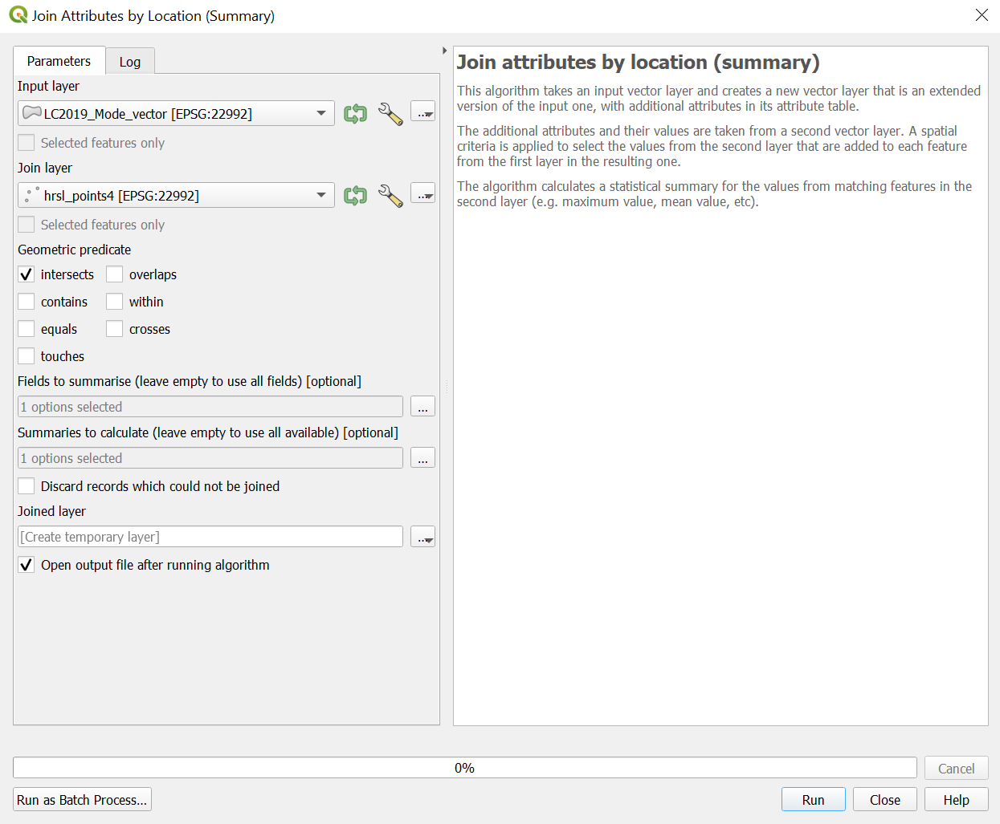

Figure 9.61 -  معايير ضم السمات حسب خوارزمية الموقع -الملخص

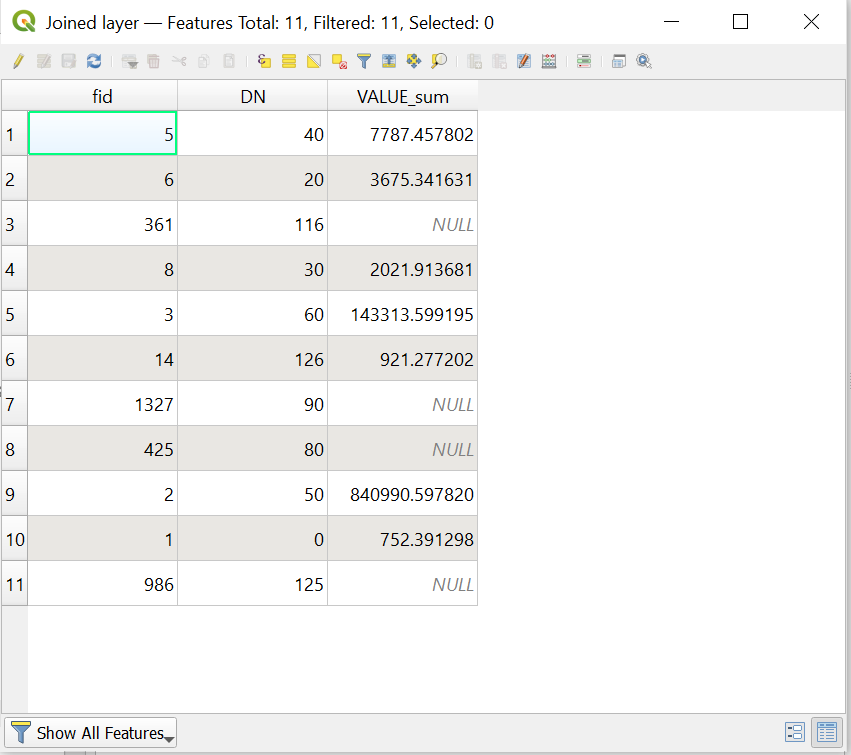

Figure 9.62 - الإخراج الناتج عن ضم السمات حسب خوارزمية الموقع - الملخص

في هذه المرحلة الثالثة من الوحدة 9، عملنا باستخدام البيانات النقطية وكذلك بيانات المتجه. لقد ألقينا نظرة فاحصة على ما تعنيه إعادة إنشاء العيّنة وما هي الآثار المترتبة على خصائص البيانات النقطية، مثل النظام المرجعي للإحداثيات، والدقة المكانية وما إلى ذلك. في أغلب الأحيان، يجب على المرء أن يعمل مع كل من مجموعات البيانات النقطية والمتجهة، وبالتالي، من المهم معرفة أن ذلك ممكناً بعدة طرق. لقد اختبرنا أيضًا عددًا من التحويلات، من خطوط المسح إلى المتجهات والعكس صحيح. ومع ذلك، فلا يجب أن نغفل في معالجتنا عن الظواهر التي ندرسها، وكذلك المقياس الأولي الذي تم جمع البيانات به، سواء كان متجهًا أو نقطيًا. عند إجراء التحويلات، من المهم معرفة التوافق بين مقياس الخريطة ودقة البيانات النقطية. وفقًا لرسام الخرائط Waldo Tobler، "فإن القاعدة هي قسمة مقام مقياس الخريطة على 1000 للحصول على الحجم القابل للاكتشاف بالأمتار. الدقّة هي نصف هذا الرقم ". بمعنى آخر، ستكون الصيغة : <code>map scale = raster resolution (<strong>in</strong> m) X 2 X 1000</code>.

الحلول المقدمة للتمارين في هذه الوحدة وفي الوحدة 8 تمثّل فقط بعض الطرق لحل المتطلبات. مع تقدم المرء في دراسة أدوات المصدر المفتوح للجغرافيا المكانية، يكتشف أن هناك عدة احتمالات للوصول إلى نفس النتيجة - بعضها أفضل من البعض الآخر.


<h4><strong>
أسئلة الاختبار
</strong></h4>

1. ما اسم العملية التي يمكن من خلالها زيادة دقة مجموعات البيانات النقطية أو خفضها؟
    *   Resampling أو إعادة إنشاء عيّنة.
2. ماذا يظهر لنا الرسم البياني؟
    *   تردد قيم البكسل، مرتبة في نطاقات القيم المجاورة.
3. هل يمكن تحويل مجموعة البيانات النقطية إلى مضلع؟ ماذا عن طريقة بديلة؟
    *   نعم و نعم.


<h3>
المصادر 
</h3>

Center for International Earth Science Information Network - CIESIN - Columbia University. 2018. Gridded Population of the World, Version 4 (GPWv4): Population Density, Revision 11. Palisades, NY: NASA Socioeconomic Data and Applications Center (SEDAC). <a href="https://doi.org/10.7927/H49C6VHW">https://doi.org/10.7927/H49C6VHW</a>. Accessed DAY MONTH YEAR.

Resampling methods: <a href="https://gisgeography.com/raster-resampling/">https://gisgeography.com/raster-resampling</a>


<h3>
ملاحظات
</h3>

[^ 1]: العملية الأولية هي عملية حسابية أساسية يتم إجراؤها بواسطة خوارزمية.

[^ 2]: الدقة الزمنية تعتمد على خط العرض.

[^ 3]: JAXA هي الوكالة اليابانية لاستكشاف الفضاء

[^ 4]: من أجل هذا التمرين، سنعتبر DSM نموذج ارتفاع رقمي. لمزيد من التفاصيل حول الاختلافات، يرجى الاطلاع على قسم 

[^ 5]: مكتبة تجريد البيانات الجغرافية المكانية (GDAL) هي مكتبة برامج كمبيوتر لقراءة وكتابة صيغ البيانات الجيومكانية والمتجهة.

[^ 6]: Sentinel-2 هي مهمة مراقبة الأرض من برنامج كوبرنيكوس - Copernicus Programme والتي تكتسب بشكل منهجي صورًا ضوئية بدقة مكانية عالية (10 م إلى 60 م) فوق المياه البرية والساحلية. للمزيد من التفاصيل، اذهب <a href="https://sentinel.esa.int/web/sentinel/missions/sentinel-2">هنا</a>.

<div>
