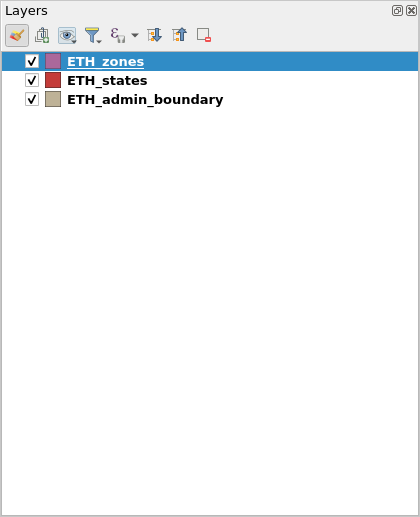
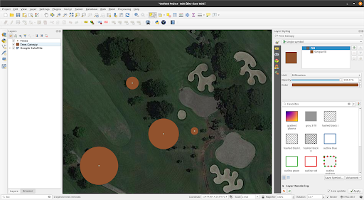

# ሞጁል 2 - በQGIS ውስጥ ንብርብሮች

**ፀሃፊ፦** ቤን ሁር

## ትምህርታዊ መግቢያ

ይህ ሞጁል በQGIS ውስጥ ያሉትን የንብርብሮች መሰረታዊ ፅንሰ-ሀሳቦች እና እንዴት እንደሚጫኑ ያስተምርዎታል። በዚህ ሞጁል መጨረሻ ላይ፣ ተማሪዎች በደንብ ሊያውቋቸው የሚገቡ ነገሮች፦

* በQGIS ውስጥ ሊጫኑ የሚችሉ የተለያዩ የውሂብ ምንጮች እና የ**ማህደር** ቅርጸቶች
* ውሂብ በQGIS ውስጥ ሊጫኑ የሚችሉባቸውን የተለያዩ መንገዶች
* አንዳንድ የተለመዱ የውሂብ ፋይል ቅርጸቶች

እንዲሁም የሚከተሉትን ማድረግ መቻል አለባቸው፦

* የአሳሽ ፓነልን እና የውሂብ ምንጭ አቀናባሪን በመጠቀም ንብርብሮችን (ሁለቱም ቬክተሮች እና ራስተሮች) መጫን
* QGISን ሩቅ ከሆኑ አገልግሎቶች ጋር ያገናኙ
* ጊዜያዊ እና ምናባዊ ንብርብሮች ጋር ይስሩ
* በQGIS ውስጥ ሌሎች የውሂብ ስብስቦችን የሚጭኑ አንዳንድ ማገናኛዎችን ይጫኑ
* እንደ ሜታውሂብ መረጃ ያሉ የንብርብር ባህሪያትን ያሳዩ
* ንብርብሮችን ያስቀምጡ እና ወደ ውጭ ይላኩ


## አስፈላጊ መሣሪያዎች እና ግብአቶች
ለዚህ ሞጁል አስፈላጊ መሣሪያዎች እና ግብአቶች፦

* የሚሰራ ኮምፒተር
* የበይነመረብ ግንኙነት
* በኮምፒተር ውስጥ የተጫነ QGIS 3.16 ([https://qgis.org/en/site/forusers/download.html](https://qgis.org/en/site/forusers/download.html))


## ቅድመ ሁኔታዎች

* የኮምፒተር አጠቃቀም መሠረታዊ እውቀት
* ከቦታ ውሂብ ቅርጸቶች እና ከ QGIS በይነገጽ ጋር መተዋወቅ (የሞጁል 0 እና 1 መጠናቀቅ)


## ተጨማሪ ግብአቶች

* የ QGIS የተጠቃሚ መመሪያ - [https://docs.qgis.org/3.16/en/docs/user_manual/ ](https://docs.qgis.org/3.16/en/docs/user_manual/)
* የ QGIS ሥልጠና መመሪያ - [https://docs.qgis.org/3.16/en/docs/training_manual/index.html](https://docs.qgis.org/3.16/en/docs/training_manual/index.html)
* ቤዝ ካርታዎች በQGIS -[https://bnhr.xyz/2018/10/07/basemaps-in-qgis.html](https://bnhr.xyz/2018/10/07/basemaps-in-qgis.html)
* QGISን ከሩቅ አገልግሎቶች ጋር ማገናኘት - [https://bnhr.xyz/2018/10/12/connecting-qgis-to-remote-services.html](https://bnhr.xyz/2018/10/12/connecting-qgis-to-remote-services.html)
* የስፕሪድ ገጽ ንብርብሮች ማገናኛ - [https://bnhr.xyz/2018/07/27/plugin-fridays-spreadsheet-layers-plugin.html](https://bnhr.xyz/2018/07/27/plugin-fridays-spreadsheet-layers-plugin.html)


## የጭብጥ መግቢያ


ምስል 2.1.:- የተለያዩ ንብርብሮችን እና የውሂብ ዓይነቶችን የያዘ የካርታ ሽፋን (https://saylordotorg.github.io/text_essentials-of-geographic-information-systems/s11-02-multiple-layer-analysis.html)

ከቀደሙት ሞጁሎች እንደ ቬክተር እና ራስተር ያሉ የቦታ ውሂብ ሞዴሎች የእውነተኛ ዓለም ነገሮች እና ክስተቶች ሞዴሎች እንደሆኑ የተማርን ሲሆን አንድ ነገርን (ለምሳሌ ከፍታ፣ ሙቀት፣ የቤተሰብ ስፍራዎች፣ ክለላ፣ ወዘተ…) የሚመስል የአንድ ንብርብር መኖር ምንም ችግር ባይኖርበትም፣ በተግባር ግን ጠቃሚ ትንታኔዎችን ማካሄድ ወይም የእውነተኛውን ዓለም በተሻለ የሚያንፀባርቅ ሞዴል መፍጠር ከፈለግን ብዙ ውሂቦችን እና ንብርብሮችን በአንድ ላይ መጠቀም ያስፈልገናል። በተመሳሳይ አካባቢ በርካታ ጭብጣዊ ገጽታ ያላቸው ካርታዎችን እርስ በእርሳቸው በማስቀመጥ መደርደር ጥንታዊ እና በጣም ከተለመዱ የጂኦግራፊያዊ ትንተና ዘዴዎች መካከል አንዱ ነው።


## የፅንሰ-ሀሳቦች ትንታኔ

ከላይ ያለው ስዕል ለዚህ ቀላል እና ተጨባጭ ምሳሌ ይሰጠናል። ለአዲስ የፍራንቻይዝ ምግብ ቤት (ለምሳሌ፡- ጆሊቢ ወይም ማክዶናልድስ) ምርጥ ቦታን ለማግኘት  የGIS አማካሪ ሆነው እንደቶሾሙ አድርገው ያስቡ። ይህንን ለማድረግ፣ እርስዎ እንዲወስኑ የሚረዳዎትን ተገቢውን መረጃ መሰብሰብ ያስፈልግዎታል። ይህ በከተማው ጎዳናዎች፣ በመሬት ንጣፎች፣ ደንበኞች ሊሆኑ የሚችሉ የሚገኙበት ቦታና ስርጭትን፣ የአከባቢው የመሬት አቀማመጥ፣ የመሬት አጠቃቀም፣ ወዘተ… መረጃዎችን ሊያካትት ይችላል።

እነዚህ የውሂብ ስብስቦች በተለያዩ ዓይነቶች እና ቅርፀቶች ሊመጡ ይችላሉ። አንዳንዶቹ የቬክተር ፋይሎች ሊሆኑ ይችላሉ ሌሎቹ ደግሞ ራስተር ሊሆኑ ይችላሉ። አንዳንዶቹ በአንድ ተመሳሳይ የመጋጠሚያ ማጣቀሻ ሥርዓት ውስጥ ሊሆኑ ይችላሉ ሌሎቹ ደግሞ በተለያዩ የመጋጠሚያ ማጣቀሻ ሥርዓቶች ውስጥ ሊሆኑ ይችላሉ። አንዳንዶቹ በኮምፒተርዎ ውስጥ የሚገኙ አካባቢያዊ ፋይሎች ሊሆኑ ይችላሉ ሌሎቹ ደግሞ በበይነመረብ በኩል ብቻ ሊጫኑ ይችላሉ። ለቦታዎ ትንተና ምን ዓይነት ውሂብ እንደሚያስፈልግዎት ብዙ ዕድሎች ስላሉ፣ ጥሩ የሆነ GIS የተለያዩ የውሂብ ምንጮችን ማስተናገድ እና ማስተዳደር መቻል አለበት።


## ዋና ይዘት

### ደረጃ 1 ርዕስ፦ የውሂብ አይነቶች፣ የማህደር ቅርጸቶች፣ የአሳሽ ፓነል እና የንብርብሮች ፓነል

#### የተለመዱ የውሂብ ዓይነቶች እና የየማህደር ቅርጸቶች

በመጀመሪያው ሞጁል ውስጥ ከተወያዩበት የቦታ ውሂብ ሞዴሎች (ራስተሮች እና ቬክተሮች) በተጨማሪ የጂኦስፓሻል **የማህደር** ቅርፀቶች እና የእነሱ ጥቅሞች እና ጉዳቶች መተዋወቅ የቦታ ትንተና ለሚያደርግ ሁሉ አስፈላጊ ነው።

ለ GIS አዲስ የሆኑ ብዙ ሰዎች ብዙውን ጊዜ በሼፕፋይልስ (shapefiles) አማካኝነት ከቦታ ውሂብ ጋር ይተዋወቃሉ። ብዙ ሰዎች ይህን አያሳድጉትም እና ሁሉንም የቬክተር ውሂብ ዓይነት እና ቅርጾችን ለማመልከት ሼፕፋይልን ይጠቀማሉ። ይህ እንደ ኮካ ኮላ ያለ አንድ የተወሰነ የምርት ስም ለለስላሳ መጠጦች አጠቃላይ ቃል መጠቀሙን ከጀመረው ጋር ተመሳሳይ ነው። ይህ የግድ ስህተት አይደለም ግን የሼፕፋይልስ ግን ከብዙ ዓይነቶች የቬክተር ውሂብ ቅርፀቶች አንዱ ስለሆነ የሚያሳዝን ነው። በእውነቱ፣ በአንዳንድ ሁኔታዎች፣ እንደ geopackage፣ geojson፣ topojson፣ እና flatgeobuf ያሉ ሌሎች የቬክተር ቅርፀቶች። የሼፕፋይልስ ቅርጸት፣ በሁሉም ቦታ የሚገኝ ቢሆንም፣ አንዳንድ ነገሮች ግን ይገድቡታል፣ ለምሳሌ፦

* እሱ 1 **የማህደር** ብቻ አይደለም። የሼፕፋይል በእውነቱ በርካታ ፋይሎችን ያካተተ ሲሆን፣ ከእነዚህ ውስጥ 3ቱ አስገዳጅ ናቸው፦.shp፣ .shx፣ .dbf. ሁሉም ሌሎች ማህደሮች ሳይድካር (sidecar) ማህደሮች ይባላሉ።
* ለእያንዳንዱ **ማህደር** 2 GB የመጠን ገደብ አለው።
* የመስክ ስሞች በ10 ፊደሎች ተወስነዋል።
* የባህሪ አምዶች በ 255 አምዶች የተገደቡ ናቸው።
* እንደ ጊዜ ላሉት አንዳንድ የውሂብ አይነቶች ድጋፍ የለም።
* ቶፖሎጂን በግልፅ አያስቀምጥም።

እንደ GeoPackage፣ GeoJSON፣ TopoJSON፣ እና flatgeobuff ያሉ ሌሎች የውሂብ ቅርፀቶች እነዚህን የሼፕፋይልስ ውስንነቶች ያስተካክላሉ። በእርግጥ፣ QGIS እና GRASS GIS ንብርብሮችን ሲያስገቡ ወይም ወደ ውጭ ሲያወጡ እንደ ነባሪው የቬክተር **የማህደር** ቅርጸት ወደ GeoPackage ቀይረዋል ምንም እንኳን GeoPackage አንዳንድ ውስንነቶች ቢኖሩትም ሙሉ በሙሉ ክፍት ቅርፀት መሆኑ ማህበረሰቡ የቅርፀቱን የወደፊት ቅርፅ ለመቅረፅ እንዲረዳ ያስችለዋል።

ስለዚህ፣ ሼፕፋይልስ ካልሆነ፣ ምን መጠቀም አለብዎት?

ሼፕፋይልስን መጠቀሙ በተለይ ከእርስዎ ጉዳይ ጋር የሚስማማ ከሆነ ምንም ስህተት የለውም። ከ 2 ጊባ በላይ የሚያልፍ የውሂብ ስብስብ የማይፈልጉ ከሆነ፣ ለመስክ ስሞችዎ የ 10 ፊደሎች ገደብ እንዲኖርዎት ከተስማሙ፣ ወይም በአከባቢዎ አነስተኛ ቁጥር ያላቸውን ፋይሎች እየሰሩ ከሆነ ሼፕፋይልስን መጠቀምዎ፣ ሙሉ በሙሉ ችግር የለውም።

ሆኖም የ QGIS ፕሮጀክትዎን ከሁሉም ንብርብሮች (ቬክተር፣ ራስተር)፣ ቅጥ እና ሞዴሎች ጋር በአንድ ላይ ለማሸግ ከፈለጉ፣ ወይም በአንድ ነጠላ **የማህደር** ውስጥ ብዙ የንብርብሮች እና የቦታ ውሂብ ዓይነቶችን ለማጋራት ይፈልጋሉ፣ GeoPackage መታየት የሚገባው ነው። እንዲሁም GeoPackage እና GeoJSON  ለድር ተስማሚ ናቸው እና እንደ Mapbox እና Leaflet በመሳሰሉ የድር ካርታ ቤተመፃህፍት በቀጥታ ሊጠቀሙባቸው ይችላሉ።

ከዚህ በታች ባለው ማስፈንጠርያ ውስጥ የበለጠ ማንበብ ይችላሉ፦ [https://bnhr.xyz/2018/12/12/i-choose-geopackage.html](https://bnhr.xyz/2018/12/12/i-choose-geopackage.html)

ይህ በእንዲህ እንዳለ፣ እንደ ፒክስል ወይም ህዋስ ፍርግርግ ሊወከል የሚችል ማንኛውም ቅርጸት በQGIS እንደ ራስተር ውሂብ ሊነበብ ይችላል። ይህ እንደ PNG (.png) እና JPEG (.jpg) ያሉ የምስል ቅርፀቶችን ያካትታል። ምንም እንኳን ሁሉም የምስል **የማህደር** ቅርፀቶች እንደ ራስተሮች ሊነበቡ ቢችሉም፣ ሁሉም በጂኦግራፊያዊነት የሚጠቀሱ አይደሉም ወይም በምድር ላይ በትክክል ለመፈለግ የሚያስችለንን የጂኦስፓሻል መረጃ የያዙ አይደሉም። እንደዚህ ላሉት አጋጣሚዎች፣ እኛ ወርልድ **ማህደር** ተብሎ የሚጠራውን ([https://am.wikipedia.org/wiki/World_file](https://en.wikipedia.org/wiki/World_file)) ልንጠቀምበት እንችላለን። አንድ ወርልድ **ማህደር** ስሙ ከሚመለከተው የራስተር ፋይል ጋር ተመሳሳይ የሆነ እና የ**ማህደር** ቅጥያው መጨረሻ ላይ w ፊደል የተጨመረበት የተለየ፣ የሚነበብ የውሂብ ፋይል ነው። ለምሳሌ፣ ለ **world.png** ያለው ወርልድ **ማህደር** ** world.pngw ** ወይም **world.pgw** ተብሎ ይጠራል።

አንዳንድ የምስል **ማህደር** ቅርፀቶች ግልፅ የሆነ የመሬት አቀማመጥ እና መረጃን ይይዛሉ እናም ወርልድ **የማህደር** አያስፈልጋቸውም። አንዳንድ ምሳሌዎች GeoTIFFs (.tif or tiff) እና ERDAS Imagine file format (.img) ናቸው።

ስለ**ማህደር** ቅርፀቶች የበለጠ መረጃ ለማግኘት የሚከተሉትን ማየትም ይችላሉ ፦ [https://saylordotorg.github.io/text_essentials-of-geographic-information-systems/s09-03-file-formats.html](https://saylordotorg.github.io/text_essentials-of-geographic-information-systems/s09-03-file-formats.html)

የጂኦስፓሻል ውሂብ እንዲሁ በጂኦግራፊያዊ የውሂብ ቋቶች መልክ ሊመጣ ይችላል። እነዚህ እንደ ነፃ እና ክፍት ምንጭ Postgres ከ PostGIS ቅጥያ ([https://postgis.net/](https://postgis.net/)) ጋር ወይም የ ESRI ንብረት የሆነው እንደ ArcSDE ያሉ በድርጅት ደረጃ ያሉ የውሂብ ቋቶች ሊሆኑ ይችላሉ። በውስጣቸው የተለያዩ የውሂብ አይነቶችን (ለምሳሌ ቬክተር እና ራስተር) ሊያከማቹ የሚችሉ የ**ማህደር** ጂዮዳታቤዞች አሉ። አንዳንድ ምሳሌዎች ነፃ እና ክፍት የ OGC GeoPackage (.gpkg) ([https://www.geopackage.org/](https://www.geopackage.org/)) እና የባለቤትነት ፋይል ጂኦዳታቤዝ ቅርጸት በ ESRI (.gdb) ናቸው።


#### የመረጃ ምንጭ ዓይነቶች

የ QGIS በጣም ጠቃሚ ከሆኑ ባህሪዎች አንዱ ከተለያዩ ምንጮች የተገኙ የተለያዩ የቦታ እና የቦታ ያልሆኑ ውሂቦችን የማገናኘት፣ የመጫን እና የመጠቀም ችሎታ ነው። QGIS ሊከፍት የሚችለው፦

* የአከባቢ ራስተር እና የቬክተር ፋይሎች
* አካባቢያዊ የውሂብ ቋቶች
* በይነመረብ ላይ ያሉ ፋይሎችን እና የውሂብ ቋቶች በራሳቸው uniform resource identifier (URI) ወይም uniform resource locator (URL)፣
* የድር አገልግሎቶች (OSGeo የድር አገልግሎቶች እና ArcGIS የድር አገልግሎቶች)፣ የሰድር አገልግሎቶች እና እንደ  GeoNode ያሉ የውሂብ መግቢያዎች
* እና ሌሎችም ...

በተጨማሪም QGIS እንደ NASA የ SRTM ውሂብ፣ የፕላኔት ምስሎችን፣ SentinelHub፣ Google Earth Engine እና OpenStreetMap ከመሳሰሉ አገልግሎቶች በሚሰኩ ኃይሎች አማካኝነት ውሂቦችን ማገናኘት እና መጫን ይችላል።

ይህ QGISን ለማንኛውም የቦታ መረጃ መሠረተ ልማት ወይም የስራ ፍሰት ወሳኝ አካል ያደርገዋል።


#### በQGIS ውስጥ ንብርብሮችን  መጫን

በQGIS ውስጥ ንብርብሮችን ለመጫን በርካታ መንገዶች አሉ። እነዚህም የሚከተሉትን ያካትታሉ፦

1. በQGIS ካርታ ሸራ ወይም ንብርብር ፓነል ውስጥ ንብርብሩን **ጎትት እና ጣል**። በQGIS ውስጥ አንድ ንብርብር ለመጫን ይህ ቀላሉ መንገድ ሊሆን ይችላል ግን እንደ CSVs ያሉ ቦታ-ነክ ያልሆኑ የሠንጠረዥ ውሂቦች ሲጫኑ gotchas ስላሉ እንደዚህ አይነት አካሄድ ሲጠቀሙ የሚመከር አካሄድ አይደለም።
2. **የአሳሽ ፓነልን** በመጠቀም።
3. **የውሂብ ምንጭ አቀናባሪውን** በመጠቀም።
4. **የውሂብ ምንጭ አቀናባሪ** የ**መሣሪያ አሞሌን **እና **የንብርብሮች የመሣሪያ አሞሌን **በመጠቀም ያቀናብሩ።

**ማስታወሻ፦ _ንብርብሮችን በሚጭኑበት ጊዜ የንብርብሮችዎ ነባር ቀለሞች በዚህ ሞጁል ውስጥ ከሚታዩት ነባር ቀለሞች የተለዩ ሊሆኑ ይችላሉ።_**


#### የአሳሽ ፓነል

**የአሳሽ ፓነል** የኮምፒተርዎን ፋይሎች እና ማህደሮች እንዲሁም ከውሂብ ቋቶች እና ከድር ሰርቨር ጋር ግንኙነቶችን የሚያሳይ የ**ማህደር** ዘንጎችን ያሳያል። በነባሪነት፣ ከ QGIS የተጠቃሚ በይነገጽ በግራ በኩል ከንብርብር ፓነል ጋር ተያይዘዋል።

የአሳሽ ፓነል ስለ ንብርብሮች መረጃን ለማገናኘት፣ ለመጫን እና ለማሳየት ብዙ አሰራሮችን ያሳያል። እንዲሁም በአሳሽ ፓነል ውስጥ ከሚወዷቸው ማውጫዎች እና የቦታ ዕልባቶች ጋር ግንኙነቶችን መፍጠር ይችላሉ።

ስለ አሳሽ ፓነል የበለጠ ለመረዳት ወደ፦ [https://docs.qgis.org/3.16/en/docs/user_manual/introduction/browser.html](https://docs.qgis.org/3.16/en/docs/user_manual/introduction/browser.html) ይሂዱ።


#### መልመጃ 01.1፦ የአሳሽ ፓነል

1. QGISን ይክፈቱ።
2. የአሳሽ ፓነልን ይፈትሹ (ምስል 2.2)። የአሳሽ ፓነልን ማግኘት ካልቻሉ በዝርዝሩ አሞሌ ውስጥ ባለው የእይታ **‣** **ፓነሎች** **‣** **የአሳሽ ፓነል** እይታ ስር እንዲታይ ማድረግ ይችላሉ።


ምስል 2.2. የአሳሽ ፓነል

3. በውስጣቸው ያሉትን ንዑስ ማህደሮች ለማሳየት ድራይቮች እና ማህደሮች እንዴት መስፋፋት እንደሚችሉ ያስተውሉ።
4. በፋይሉ ዛፍ ውስጥ **ሞጁል  2 -በQGIS ውስጥ ያሉ ንብርብሮች **የሚለውን** **ማህደር (ምስል 2.3) ያግኙ (ፋይሉን የት እንዳስቀመጡ ወይም እንዳወረዱ ያስተውሉ)። ለዚህ የሥራ መጽሐፍ አስፈላጊ ውሂቦችን ማየት መቻል አለብዎት። በቀኝ በኩል ባለው ምሳሌዬ፣ ከላይ የተጠቀሰውን አቃፊ እንደ የእኔ Favorites አርጌ አስቀመጥኩትና አገናኘሁት ስለዚህ ከአሳሽ ፓነል በቀላሉ ወደ እሱ መሄድ እችላለሁ። በ Favorites ላይ በቀኝ ጠቅ በማድረግ እና ማውጫውን በማከል በአሳሽ ፓነል ውስጥ የፌቨራይት ማውጫን ማከል ይችላሉ።
5.በማህደሩ ውስጥ ያሉትን ፋይሎች ይፈትሹ (ምስል 2.3)። በርካቶች አሉ። ከእራሱ የ**ማህደር** ዛፍ፣ በQGIS ውስጥ ልንጭናቸው የምንችላቸውን ፋይሎች እና ንብርብሮች ቀድሞውኑ ሀሳብ ማግኘት እንችላለን። ከስሞቹ በስተግራ ያሉት አዶዎች ውሂቡ ቬክተር 
፣ ራስተር  ፣ የውሂብ ቋት  ፣ ወይም ቀላል የሰንጠረዥ ውሂብ  መሆን አለመሆኑን ያመለክታሉ።. 


ምስል 2.3.፡- በአሳሽ ፓነል ውስጥ ያሉ የሞጁል ፋይሎች

6. There are 5 files under the data folder: 

    1. ቬክተር (ddis_Ababa_hospitals) እና የራስተር **ማህደር**ን (ETH_Addis_Ababa_SRTM_DEM) የያዘ GeoPackage (ETH_Addis_Ababa.gpkg)፤
    2. አንድ GeoJSON (ETH_states.geojson)፤
    3. አንድ flatgeobuf **ማህደር** (ETH_zones.fgb)፤
    4. አንድ shapefile (ETH_admin_boundary.shp)፤ እና
    5. በጭረት የተለዩ እሴት (comma-separated value፡CSV) **ማህደር** (Addis_Ababa_schools.csv)።

7. በ ETH_admin_boundary.shp በቀኝ በኩል ጠቅ ያድርጉ እና የንብርብር ባህርያት የሚለውን ጠቅ ያድርጉ (ምስል 2.4)። ይህ የንብርብር ባህርያት መስኮትን ይከፍታል (ምስል 2.5)። በመስኮቱ ውስጥ የቀረበውን መረጃ ልብ ይበሉ። የንብርብሩ ጂኦሜትሪ ምንድነው? ምን አይነት CRS ጥቅም ላይ ውሏል? በንብርብሩ ውስጥ ምን ያክል ባህሪዎች አሉ?


ምስል 2.4:- የንብርብር ባህርያትን መፈተሽ


ምስል 2.5.:- የንብርብሮች ባህርያት ከአሳሽ ፓነል


8. በንብርብሮች ላይ ሜታ ውሂብ ከመስጠት ባሻገር የንብርብሩንም ጂኦሜትሪ እና ባህርያት በንብርብሮች ባህሪዎች መስኮት ውስጥ አስቀድመው ማየት ይችላሉ።
9. ንብርብርን ከአሳሹ ፓነል እንዲጀምር ማረግ ይችላሉ በ፦

    1. **ንብርብርን ሁለቴ ጠቅ ማድረግ**
    2. **ንብርብሩን በቀኝ ጠቅ ማድረግ  ‣  ንብርብርን ወደ ፕሮጀክት ይጨምሩ**
    3. **ንብርብሩን ወደ ካርታው ሸራ መጎተት**

3. ከላይ ያሉትን ማናቸውም ዘዴዎች በመጠቀም **ETH_admin_boundary**፣ **ETH_states**እና **ETH_zones **ንብርብሮችን ለመጫን ይሞክሩ።


ምስል 2.6. በQGIS ውስጥ የተጫኑ የቬክተር ንብርብሮች


#### የንብርብሮች ፓነል

የንብርብሮች ፓነል በፕሮጀክቱ ውስጥ ያሉትን ሁሉንም ወቅታዊ ንብርብሮች ይዘረዝራል። የእነሱን እይታና ቅደም ተከተል ለማስተዳደር እና የንብርብር ባህርያትን ለማሳየት ሊያገለግል ይችላል። የንብርብሮች ፓነል **ከእይታ** **‣** **ፓነሎች** **‣ የንብርብሮች ፓነል** ወይም አቋራጭ **CTRL+1** ን በመጠቀም ሊሰራ ይችላል። የካርታ መፍቻ ተብሎም ይጠራል። ካለፈው መልመጃ ሁሉንም ቬክተር ከጫኑ፣ የንብርብሮች ፓነልዎ ከዚህ በታች እንደሚታየው መታየት አለበት፦




ምስል 2.7.: የንብርብሮች ፓነል

የንብርብር እይታን በንብርብሩ ስም በግራ በኩል ባለው ሳጥን ላይ ምልክት በማድረግ ወይም ባለማድረግ ቁጥጥር ማድረግ ይቻላል። በንብርብሮች ፓነል ውስጥ ያሉትን ንብርብሮች ወደ ላይ ወይም ወደ ታች በመጎተት፣ የ Z ቅደም ተከተል ሊቀየር ይችላል። እንደ GIMP ወይም Photoshop ካሉ ከምስል መቆጣጣሪያ ሶፍትዌሮች ጋር ተመሳሳይ ሲሆን ከላይ በአጠገብ የተዘረዘሩት ንብርብሮች ከታች ወደታች በተዘረዘሩት ንብርብሮች ይቀመጡ። ስለዚህ ሁለት ንብርብሮች አንድ ቦታ ካሳዩ፣ በንብርብሮች ፓነል ውስጥ ከፍ ያለ የሆነው ንጣፍ ከታችኛው ንብርብር ላይ ይሳባል እና በካርታው ሸራ ላይ ዝቅተኛውን ንብርብር እንዲታይ አያደርገውም። ይህ ልብ ሊባል የሚገባው ነው ምክንያቱም በእውነታው አንድ ሽፋን በላዩ ላይ በሚሸፈንበት ወይም በሚደበቅበት ጊዜ አንድ ንብርብር በQGIS ውስጥ አይታይም ብለን የምናስብባቸው አጋጣሚዎች ሊኖሩ ይችላሉ።

**ማስታወሻ፦** በንብርብሮች ፓነል ውስጥ ያሉ የንብርብሮች የ Z- ቅደም ተከተል **በንብርብር ቅደም ተከተል ፓነል** ሊሻር ይችላል።

የንብርብሮች ፓነል ተጠቃሚው ንብርብሮችን እንደገና እንዲሰይምና እንዲያስወግድ፣ የንብርብር እይታን ለማጣራት፣ የንብርብር ቡድኖችን እና የካርታ እይታዎችን እንዲፈጥሩ እና እንዲያስተዳድሩ ያስችላቸዋል።

የቬክተር ንብርብር የባህሪ ሰንጠረዥ በተጨማሪ በንብርብሮች **‣** **የባህሪ ሰንጠረዥ ክፈት ላይ በቀኝ ጠቅ በማድረግ ከንብርብሮች ፓነል **ሊከፈት ይችላል።

ስለ የንብርብሮች ፓነል የበለጠ ለመረዳት ወደ፦[https://docs.qgis.org/3.16/en/docs/user_manual/introduction/general_tools.html#layers-panel](https://docs.qgis.org/3.16/en/docs/user_manual/introduction/general_tools.html#layers-panel) ይሂዱ


#### የንብርብር ባህርያት

በንብርብሮች ፓነል ውስጥ ባለው ንብርብር ላይ በቀኝ ጠቅ ማድረግ እና የንብርብር ባህሪያትን በመምረጥ የንብርብር ባህሪያት መገናኛን ይከፍታል።


ምስል 2.8.:- የንብርብር ባህሪዎች መገናኛ

በንብርብር ባህሪዎች መገናኛው ውስጥ ተጠቃሚው መረጃን እንዲያይ እና ከንብርብሩ ጋር የሚዛመዱ ባህሪያትን እንኳን እንዲያሻሽል/እንዲያስተካክል የሚያስችሉት በርካታ ትሮች አሉ።

የመረጃ ትሩ አሁን ባለው ንብርብር ላይ የተጠቃለለ መረጃ እና ሜታውሂብ የንባብ-ብቻ ገለጻን ያሳያል፣ የሚከተሉትን ጨምሮ፦

* የመረጃ አቅራቢ
* የተሞላ ሜታውሂብ
* ጂኦሜትሪ ወይም የመስክ መረጃ

The Source tab shows general settings for a vector layer.

የምንጭ ትሩ ለቬክተር ንብርብር አጠቃላይ ቅንብሮችን ያሳያል።

እንደ Symbology, Labels, Masks, and 3D View(ሶስት ማእዘን እይታ) ያሉ ትሮች ተጠቃሚው የንብርብሩን ተምሳሌታዊነት እና ዘይቤን እንዲያስተካክል ያስችለዋል። \

ሌሎች ትሮች ተጠቃሚዎች ከንብርብሩ ጋር ተቀላቅለው እንዲሰሩ (ይቀላቀሉ)፣ ስለ ባህሪ መስኮች መረጃ እንዲያገኙ (መስኮች)፣ አዲስ ውሂብ ለማከል ብጁ ቅጾችን (የባህሪ ቅጾችን) እና ሌሎች ብዙዎችን እንዲያክሉ ያስችላቸዋል።

ሌላው ሊጠቀስ የሚገባው ትር ለተጠቃሚው በደረጃው ላይ የሜታውሂብ ሪፖርትን የመፍጠር እና የማስተካከል ችሎታ የሚሰጠው የሜታውሂብ ትር ነው። ይህ የሚከተሉት ላይ ያለ መረጃን ያካትታል፦

* የውሂብ መታወቂያ፦ የውሂብ ስብስብ መሠረታዊ ጥቅም (ወላጅ፣ መለያ፣ርዕስ፣ ረቂቅ፣ ቋንቋ…)፤
* እንደ ISO ምድቦች እና ብጁዎች ውሂቡን ይመድባል።
* ደረጃውን የጠበቀ የቃላት ዝርዝርን ተከትሎ ውሂቦችን እና ተጓዳኝ ፅንሰ ሀሳቦችን ለማምጣት የሚያስችሉ ቁልፍ ቃላት፤
* የውሂብ ስብስብ (ፈቃዶች፣ መብቶች፣ ክፍያዎች እና ገደቦች) መዳረሻ፤
* የውሂብ ስብስቡ ስፋት፣ ወይ የቦታ (CRS፣ የካርታ መጠን፣ ከፍታዎች) ወይም ጊዜያዊ፤
* የውሂብ ስብስቡ ባለቤት (ቶች) መገኛ፣
* የረዳት ሀብቶች እና ተዛማጅ መረጃዎች ሊንኮች፤ እና
* የውሂብ ስብስብ ታሪክ።

የተሞላው መረጃ ማጠቃለያ በማረጋገጫ ታብ ውስጥ የቀረበ ሲሆን ከሜታውሂብ ቅፅ ጋር የሚዛመዱ ጉዳዮችን ለመለየት ይረዳል ፡፡ በአሁኑ ጊዜ፣ ሜታውሂብ በፕሮጀክቱ **ማህደር** ውስጥ ይቀመጣል ነገር ግን በ**ማህደር** ላይ ከተመሠረቱ ንብርብሮች ጎን ለጎን ወይም ሩቅ ለሆኑ ንብርብሮች በአካባቢያዊ .sqlite የውሂብ ቋት ውስጥ በተለየ .qmd **ማህደር** ውስጥ ሊቀመጡ ይችላሉ።

ስለ ቬክተር ንጣፍ ባህሪዎች የበለጠ ለመረዳት ወደ፦ [https://docs.qgis.org/3.16/en/docs/user_manual/working_with_vector/vector_properties.html](https://docs.qgis.org/3.16/en/docs/user_manual/working_with_vector/vector_properties.html) ይሂዱ

ስለ ራስተር ንብርብር ባህሪዎች የበለጠ ለመረዳት ወደ፦ [https://docs.qgis.org/3.16/en/docs/user_manual/working_with_raster/raster_properties.html](https://docs.qgis.org/3.16/en/docs/user_manual/working_with_raster/raster_properties.html) ይሂዱ


#### ጂኦስፓሻል ሜታውሂብ

ሜታውሂብ በቀላሉ ስለ ውሂብ ውሂብ ነው። የውሂቡ ስብስብ ማን፣ ምን፣ መቼ እና እንዴት እና በሁሉም ቅርጾች እና መጠኖች እንደሚመጣ ይመልሳል። ለ GIS ዓላማዎች፣ ብዙውን ጊዜ እኛ የምንመለከተው በጂኦግራፊያዊ ሜታውሂብ ነው። ጂኦስፓሻል ሜታውሂብ U.S.  የፌዴራል የጂኦግራፊ ውሂብ ኮሚቴ (FGDC) እንደ፦

_“የመረጃ**ማህደር**፣ እንደ XML ሰነድ ሆኖ ይቀርባል፤ ይህም የውሂብ ወይም የመረጃ ሃብት መሰረታዊ ባህሪያትን ይይዛል። ሀብቱን ማን፣ ምን፣ መቼ፣ የት፣ ለምን እና እንዴት እንደሆነ ይወክላል። ጂኦስፓሻል ሜታውሂብ እንደ ጂኦግራፊያዊ የመረጃ ስርዓት (GIS) ፋይሎች፣ የጂኦግራፊያዊ የውሂብ ቋቶች እና የምድር ምስሎች ያሉ የጂኦግራፊያዊ ዲጂታል ውሂቦችን በመደበኛነት ይመዘግባል ነገር ግን የውሂብ ካታሎጎችን፣  የካርታ መተግበሪያዎችን፣ የውሂብ ሞዴሎችን እና ተዛማጅ ድረገጾችን ጨምሮ የጂኦስፓሻል ሀብቶችን ለመመዝገብ ሊያገለግል ይችላል። የሜታውሂብ መዝገቦች እንደ አርእስት፣ ረቂቅ እና የህትመት ውሂቦች ያሉ ዋና የቤተ-መጽሐፍት ካታሎግ አካላትን፣ እንደ ጂኦግራፊያዊ ስፋት እና የትወራ መረጃ ያሉ ጂኦግራፊያዊ አካላት፣ እንደ የመለያ ስያሜ ትርጓሜዎች እና የጎራ እሴቶችን አይነታ የመሳሰሉ የመረጃ ቋት አካላትን ያካትታሉ። ”_

የሜታውሂብ አስፈላጊነት ግልፅነትን ከማሳደግ ባሻገር ውሂቦችን እና መረጃዎችን መጋራትንም የሚያመቻች መሆኑ ነው። ለዚህም ነው ሁልጊዜ ሜታውሂብን ወደ የውሂብ ስብስቦቻችን ማከል አስፈላጊ የሆነው። ሜታውሂብ በሚታከልበት ጊዜ፣ ደረጃዎችን መከተል አስፈላጊ ነው -- በስፋት ተዋውቋል፣ ተቀባይነት አግኝቷል፣ እንዲሁም ህጎችን ይከተላል -- ስለዚህ እኛ የምንፈጥረው ሜታውሂብ እርስ በእርሱ የሚተባበሩ እንዲሆኑ ይጠቅማል። ከእንደዚህ ዓይነቶቹ መመዘኛዎች አንዱ ISO ነው 9115:2014 “Geographic Information -- Metadata”  “ጂኦግራፊያዊ መረጃ -- ሜታውሂብ” ከ ISO/TC 211 ([https://www.iso.org/obp/ui/#iso:std:iso:19115:-1:ed-1:v1:en](https://www.iso.org/obp/ui/#iso:std:iso:19115:-1:ed-1:v1:en))


#### መልመጃ 01.2፦ ሜታውሂብን ማከል

1. የ ETH_admin_boundary ንብርብር የንብርብር ባህርያትን ይክፈቱ።
2. በመረጃ ትሩ ላይ የሚታየውን መረጃ ይፈትሹ እና የታየውን መረጃ ይመልከቱ። ተጠናቅቋል? ተጨማሪ መረጃዎችን ማከል እንችላለን?


ምስል 2.9.:- የ ETH_admin_boundary ንብርብር የመረጃ ባህሪያት

3. ወደ ሜታውሂብ ትሩ ይሂዱ እና እንደ ስፋቱ፣ የውሂብ ምድብ፣ ፈቃድ፣ወዘተ የመሳሰሉ ስለ ንብርብሩ ተጨማሪ መረጃ ለማከል ይሞክሩ። ሲጨርሱ OK ን ጠቅ ያድርጉ።


ምስል 2.10.:- የተወሰነ ሜታውሂብን ማስተካከል

4. እንደገና ወደ መረጃ ትሩ ይሂዱ እና የሆነ ነገር እንደተለወጠ ይመልከቱ።


ምስል 2.11.:- የመረጃ ትሩ የተወሰኑ ሜታውሂቦችን ካስተካከለ በኋላ 


#### የፈተና ጥያቄዎች

1. እውነት ወይም ሐሰት፦

    1. ሁሉም የቬክተር ፋይሎች shapefiles ናቸው። -- **_ሐሰት (shapefile የቬክተር _ማህደር_ የ_ማህደር_ ቅርጸት ነው። ሌሎች የቬክተር የውሂብ ፋይል ቅርፀቶች geopackage፣ geojson፣ እና flatgeobuf ን ያካትታሉ)_**
    2. በካርታው ሸራ ላይ በሚሰጥበት ጊዜ፣ በንብርብሮች ፓነል ውስጥ ከፍ ያለ ንብርብር ሁልጊዜ በሚሸፈነው ፓነል ውስጥ ዝቅተኛ በሆነ ሽፋን ላይ ይሸፍናል ወይም ይታያል።-- **_ሐሰት (መስራት በሚጀምርበት ጊዜ፣ ንብርብር ቅደም ተከተል ፓነል ላይ ያለው ቅደም ተከተል በንብርብሮች ፓነል ውስጥ ያለውን ቅደም ተከተል ይሽራል)_**
    3. ስለ ንብርብር እና ስለ አሳሽ ፓነል ንብርብሮች የሜታውሂብ መረጃን ማረጋገጥ ይችላሉ። -- **_እውነት_ **


### ደረጃ 2 ርዕስ፦ የውሂብ ምንጭ ማኔጀር እና ከሩቅ አገልግሎቶች ጋር መገናኘት

#### የውሂብ ምንጭ ማኔጀር

ንብርብሮችን ለመጫን የአሳሽ ፓነልን መጠቀም የማይፈልጉ ከሆነ ሁልጊዜ **የውሂብ ምንጭ ማኔጀሩን** መጠቀም ይችላሉ።

**የውሂብ ምንጭ ማኔጀር** ከ QGIS 3 መለቀቅ ጋር አብሮ ተዋውቋል። በQGIS ውስጥ ካሉ የተለያዩ የውሂብ ምንጮች ንብርብሮችን ለመጨመር እና ለመጫን “ሁሉም-የሚገኝበት-ሱቅ” ነው። ከመግቢያው በፊት፣ የተለያዩ የውሂብ ምንጮችን (ማለትም አንድ ለራስተሮች፣ አንዱ ለቬክተሮች ወዘተ) ለመጫን የተለያዩ መስኮቶች ነበሩ። **በንብርብሮች** **‣** **የውሂብ ምንጭ ማኔጀር** አማካኝነት ወይም **CTRL + L **በኩል ሊደረስበት ይችላል።


ምስል 2.12.:- የውሂብ ምንጭ ማኔጀር


#### መልመጃ 02.1፦ የውሂብ ምንጭ ማኔጀር

1. **የውሂብ ምንጭ ማኔጀሩን** ይክፈቱ። እርስዎ ሊጭኗቸው ወይም ሊያገናኙዋቸው የሚፈልጓቸውን ዓይነት የውሂብ ምንጭ የሚመለከቱ ትሮች በቀኝ በኩል ይይዛል። ከአሳሹ ጋር በተመሳሳይ፣ ከውሂብ ምንጭ ማኔጀሩ ብዙ አይነት ውሂቦችን መጫን እና ማገናኘት ይችላሉ።
2. **ቬክተሮችን መጫን**

    1. ቬክተሮችን ለመጫን፣ ወደ ቬክተር ትሩ ይሂዱ። እንደ HTTP፣ cloud፣ ወዘተ ባለ ፕሮቶኮል በኩል ፋይሎች፣ በማውጫ፣ በውሂብ ቋት እና በሩቅ ፋይሎች ውስጥ ያሉ ፋይሎች ሊጫኑ ይችላሉ።
    2. በ ETH_Addis_Ababa geopackage ውስጥ የተገኘውን የቬክተር **ማህደር** (Addis_Ababa_hospitals) እንጫን። ይህ ንብርብር በ NCR ውስጥ የፈጣን ምግብ ቤት ጆሊቢ ሥፍራዎች አንድ የቦታ ንብርብር ነው።

        1. የምንጭ ዓይነት፦ **ማህደር**
        2. ምንጭ፦  አዝራሩን በመጠቀም የ ETH_Addis_Ababa geopackage ን ይምረጡ
        3. ይጨምሩ የሚለውን ጠቅ ያድርጉ
        4. በ geopackage ውስጥ ከ 1 በላይ የቬክተር **ማህደር** ካለ፣ QGIS የትኞቹ እንደሚጫኑ እንዲመርጡ ይጠይቃል።


ምስል 2.13.:- በ GeoPackage ውስጥ ያለን ቬክተር መጫን

3. **ራስተርን መጫን**

    1. ራስተር ለመጫን፣ ወደ ራስተር ትር ይሂዱ። እንደ HTTP፣ cloud፣ ወዘተ ባለ ፕሮቶኮል በኩል ፋይሎች እና የዋና ፋይሎች ሊጫኑ ይችላሉ። በ ETH_Addis_Ababa geopackage ውስጥ ራስተር (ETH_Addis_Ababa_SRTM_DEM) አለ። ይህ ራስተር የ NCR ክልል የዲጂታል ከፍታ ሞዴል ነው ፡፡ እሱን ለመጫን፦

        1. የምንጭ ዓይነት፦ **ማህደር**
        2. ምንጭ፦  አዝራሩን በመጠቀም የ ETH_Addis_Ababa geopackage ን ይምረጡ
        3. ይጨምሩ የሚለውን ጠቅ ያድርጉ
        4. በ geopackage ውስጥ ከ1 በላይ የራስተር **ማህደር** ካለ QGIS የትኞቹ እንደሚጫኑ እንዲመርጡ ይጠይቅዎታል


ምስል 2.14. በ geopackage ውስጥ ራስተርን መጫን

4. **CSV እና ሌሎች ውስን የሆኑ የጽሑፍ ፋይሎችን መጫን**

    1. ከቬክተሮች እና ራስተሮች በተጨማሪ፣ የGIS ሰዎች የሚጠቀሙበት ሌላ የተለመደ **ማህደር** CSVዎች እና ስፕሪድሺቶች ናቸው። እንደ እድል ሆኖ፣ እነዚህን ፋይሎች በQGIS ውስጥ ለመጫን በአንፃራዊነት ቀላል ነው።
    2. CSVዎች እና ሌሎች የተወሰኑ የጽሑፍ ፋይሎች በውሂብ ምንጭ አቀናባሪው ውስጥ ባለው የተወሰነ የጽሑፍ ትር በኩል ከአሳሹ ፓነል ውስጥ በማከል፣ እና እንዲያውም ወደ ካርታ ሸራ እየጎተቱ ሊጫኑ ይችላሉ። ሆኖም፣ ያልዎት CSV የጂኦሜትሪ መረጃን (ማለትም የነጥብ ሥፍራዎችን) የያዘ ከሆነ ጥቂት ነገሮች ከግምት ውስጥ መግባት አለባቸው። መመሪያው የሚከተለው ነው፦

        1. ጂኦሜትሪ መረጃዎችን ይኑሩ አይኑሩ CSV ዎችን ለመጫን የውሂብ ምንጭ አቀናባሪውን ይጠቀሙ።
        2. CSVዎች በአሳሽ ፓነል በኩል ወይም በመጎተት የሚጫኑ ከሆነ፣ የመስክ ውሂብ ዓይነቶችን ለማቆየት ተጓዳኝ የ CSVT **ማህደር** መኖሩን ያረጋግጡ።
        3. ለተወሰኑ ጽሑፎችዎ (በተለይም ለ CSVዎች) የውሂብ አይነቶችን ማስጠበቅ ላይ ችግሮች ካጋጠምዎት፣ የ CSVT **ማህደር** ተብሎ የሚጠራውን መጠቀም ይችላሉ። QGIS ውስጥ CSVዎችን ስለ መጫን በሚከተለው አገናኝ ላይ የበለጠ ማንበብ ይችላሉ፦ [https://bnhr.xyz/2018/08/07/specifying-csv-data-types-using-a-csvt-file.html](https://bnhr.xyz/2018/08/07/specifying-csv-data-types-using-a-csvt-file.html)

    3. CSVዎች እና ስፕሪድሺቶች በQGIS ውስጥ በቦታ ወይም በጂኦሜትሪ መረጃ ወይም ያለእነሱ ሊጫኑ ይችላሉ። በመገኛ ቦታ መረጃ ሲጫኑ፣ እንደ ቬክተር መረጃ ይቆጠራሉ። ያለ እነሱ ሲጫኑ፣ እንደ መደበኛ የሰንጠረዦች ውሂብ ይቆጠራሉ።
    4. በ NCR ውስጥ የማክዶናልድ ቅርንጫፎች የመገኛ ሥፍራዎችን የያዘ Addis_Ababa _schools.csv በተባለው የውሂብ ማህደር ውስጥ አንድ የ CSV **ማህደር** አለ። እሱን ለመጫን፦

        1. ወደ ተወሰነው የጽሑፍ ትር ይሂዱ
        2. የ**ማህደር** ስም፦  ቁልፉን በመጠቀም የ Addis_Ababa _Schools CSV ን ይምረጡ
        3. የ**ማህደር** ቅርጸት፦ CSV
        4. የመዝገብ እና የመስክ አማራጮች፦ ነባሪውን ያቆዩ
        5. የጂኦሜትሪ ትርጉም፦
            * የነጥብ መጋጠሚያዎች
            * የ X መስክ፦ ኬንትሮስ
            * የ Y መስክ፦ ኬክሮስ
            * ጂኦሜትሪ CRS፦ EPSG: 4326 - WGS 84

        6. የንብርብር ቅንብሮች፦ የመመልከቻ **ማህደሩ**ን ይፈትሹ እና የቦታ መረጃ ጠቋሚ ይጠቀሙ
            * የመመልከቻ **ማህደር** ሲፈተሽ፣ በአከባቢው CSV ላይ ያሉ አዲስ ነገሮች በQGIS ውስጥ በተጫነው ንብርብር ውስጥ በራስ-ሰር ይንፀባርቃሉ።
            * የቦታ ጠቋሚ ጭማሪዎችን  የቬክተር ማቀነባበሪያውን በፍጥነት እንዲጨምር በሚያደርገው በተጫነው ንብርብር ላይ እንደ የቦታ መረጃ ጠቋሚ ይጠቀሙ።


ምስል 2.15. የ CSV **ማህደሩን**ን መጫን

በቀደሙት መልመጃዎች ውስጥ ያሉት ሁሉም ንብርብሮች ከተጫኑ በኋላ፣ የንብርብሮች ፓነል ከዚህ በታች የሆነ ነገር መምሰል አለበት።


ምስል 2.16.:- የንብርብሮች ፓነል ከሁሉም ንብርብሮች ጋር ተጭኗል


የካርታው ሸራ ሊመስል የሚገባው፦


ምስል 2.17.:-  የQGIS በይነገጽ ከሁሉም ንብርብሮች ጋር ተጭኗል


በንብርብሮች ፓነል ውስጥ ያሉትን ንብርብሮች እንደገና ለማቀናበር ነፃነት ይሰማዎት።


#### QGISን ከሩቅ አገልግሎቶች ጋር ማገናኘት

ከቬክተር እና ከራስተር ፋይሎች በተጨማሪ፣ QGIS እንደ የሰድር አገልግሎት ሰጪዎች፣ OGC የድር አገልግሎቶች (WMS፣ WFS)፣ እና የ ESRI ArcGIS ድር አገልግሎቶች ካሉ የርቀት አገልግሎቶች ጋር ሳይቀር መገናኘት ይችላል። ይህ ግንኙነት ከአሳሽ ፓነል ወይም ከውሂብ ምንጭ ሥራ አስኪያጅ ጋር ሊፈጠር ይችላል።

#### መልመጃ 02.2 የ XYZ ሰድሮች ጋር መገናኘት

የ XYZ ሰድሮች ብዙውን ጊዜ እንደ ቤዝ ካርታዎች ያገለግላሉ እና በዴስክቶፕ መተግበሪያዎች ብቻ ሳይሆን፣ በጣም በብዛት፣ በድር መተግበሪያዎች ውስጥ ጥቅም ላይ ይውላሉ።

ከሰድር ሠርቨር ጋር ለመገናኘት፦

1. ወደ **የአሳሽ ፓነል** ይሂዱ
2. **የ XYZ ሰድሮችን በቀኝ ጠቅ ያድርጉ ‣ አዲስ ግንኙነት**
3. የሚከተሉትን ያክሉ፦

```
    ስም፦ ESRI የዓለም ምስል
    URL: https://server.arcgisonline.com/ArcGIS/rest/services/World_Imagery/MapServer/tile/{z}/{y}/{x}
```
4. OK ን ጠቅ ያድርጉ።


ምስል 2.18. በQGIS ውስጥ የ XYZ ግንኙነትን ማከል/መጨመር

5. ይህ በአሳሹ ፓነል ውስጥ በ XYZ ሰድሮች ስር የ ESRI የዓለም ምስል ንጥልን ማከል አለበት።


ምስል 2.19.:- የESRI የዓለም ምስሎች ሰድር ሰርቨር ወደ የአሳሽ ፓነል ታክሏል

6. ከአሳሹ ፓነል እንደማንኛውም ንብርብር የ XYZ ንብርብርን መጫን ይችላሉ።


ምስል 2.20. የESRI የዓለም ምስል ንብርብር በQGIS ውስጥ ተጭኗል


**ተጨማሪ፦** በአሳሽ ፓነል ውስጥ በ XYZ ትሮች ስር በርካታ ቤዝ ካርታዎችን ማከል ከፈለጉ በዚህ ልጥፍ ውስጥ ያሉትን መመሪያዎች መከተል ይችላሉ፦ [https://bnhr.xyz/2018/10/07/basemaps-in-qgis.html](https://bnhr.xyz/2018/10/07/basemaps-in-qgis.html)

**ተጨማሪ # 2፦** በአሳሹ ፓነል ውስጥ እንደ XYZ ሰድሮች በራሪ ወረቀት አቅራቢዎች ድረገጽ ([ https://leaflet-extras.github.io/leaflet-providers/preview/ ](https://leaflet-extras.github.io/leaflet-providers/preview/)) ውስጥ የሚገኙትን የሰድር ሰርቨሮች URLs ን ማከል ይችላሉ።


#### መልመጃ 02.3፦ ከ WMS/WMTS እና WFS ጋር መገናኘት

WMS ወይም የድር ካርታ አገልግሎት በይነመረብ ላይ ምስሎችን (የራስተር ሰድሮችን) ለማገልገል የክፍት የጂኦስፓሻል ኮንሶርቲየም (OGC) ([https://www.ogc.org/](https://www.ogc.org/)) የቅሬታ ድር አገልግሎት መስፈርት ነው። በ WMS በኩል ውሂብ በሚቀርብበት ጊዜ፣ ተጠቃሚው ከስር ያለውን መረጃ በቀጥታ ማረምም ሆነ ቅጥ ማድረግ አይችልም።

ይህ በእንዲህ እንዳለ፣ WFS ወይም የድር ባህሪ አገልግሎቶች በበይነመረብ ላይ ባህሪያትን (ቬክተሮችን) ለማገልገል ሌላ የ OGC- ቅሬታ የድር አገልግሎት ነው። መረጃ በWFS በኩል በሚቀርብበት ጊዜ፣ ተጠቃሚው መሰረታዊ ባህሪያቱን እና ጂኦሜትሪውን ማግኘት ስለሚችል ለቬክተር ትንተና ንብርብሩን ለመቅረጽ፣ ለማረም እና ለመጠቀም ያስችለዋል።

ከ WMS ጋር ለመገናኘት፦

1. ወደ **የአሳሽ ፓነል** ይሂዱ
2. **WMS/WMTS በቀኝ ጠቅ ያድርጉ ‣ አዲስ ግንኙነት**
3. የሚከተሉትን ያክሉ፦

```
ስም፦ EOX Sentinel-2
URL: https://tiles.maps.eox.at/wms
```
4. ይጨምሩ የሚለውን ጠቅ ያድርጉ


ምስል 2.21.:-   አዲስ የWMS/WMTS ግንኙነት መፍጠር

5. ይህ በአሳሽ ፓነል ውስጥ በ WMS/WMTS እና OWS ግንኙነቶች ስር የ “EOX Sentinel-2” ንጥልን ማከል አለበት።.


ምስል 2.22.:- የ EOX Sentinel-2 WMS በአሳሽ ፓነል ውስጥ ታክሏል

6. ከአሳሽ ፓነል ውስጥ እንደማንኛውም ንብርብር የ WMS ን ንብርብሮች መጫን ይችላሉ።


ምስል 2.23. QGIS ውስጥ ከተጫነው WMS የSentinel-2 cloud የሌለው ንብርብር ካርታ

7. ከ WFS ጋር መገናኘት ተመሳሳይ አሰራርን ይከተላል።


#### የፈተና ጥያቄዎች

1. እውነት ወይም ሐሰት፦
    1. አካባቢያዊ ፋይሎችን በQGIS ብቻ መጫን ይችላሉ-- **_ሐሰት (እንዲሁም ኦንላይን የተከማቹ ወይም በድር አገልግሎት የሚሰጡ የሩቅ ፋይሎችን መጫን ይችላሉ)_**


### ደረጃ 3 ርዕስ፦ ንብርብሮችን ወደ ውጭ ማውጣት፣ ማስታወሻ  ውስጥ ያሉ ንብርብሮች (ጊዜያዊ) እና ምናባዊ ንብርብሮች

#### ከ QGIS ንብርብሮችን ወደ ውጭ ማውጣት

ንብርብሮችን ወደ ውጭ ማውጣት (ወይም ንብርብሮችን በፋይሎች ማስቀመጥ) QGIS ውስጥ ቀጥተኛ ነው። ለንብርብሩ ወደ ውጪ የማውጫ አማራጮችን ለማየት በቀላሉ **የንብርብሩ ማስወጫ ላይ በቀኝ ጠቅ ‣** **ያድርጉ**።


ምስል 2.24. አንድ ንብርብር ከQGIS ወደ ውጭ ማውጣት

* **ባህሪያትን ያስቀምጡ…** የሚለው የራስተር ወይም የቬክተር ንብርብሮችን እንዲያስቀምጡ ያስችልዎታል።
    * በቬክተር ሽፋኑ ላይ **ማጣሪያው **በሚሠራበት ጊዜ፣ የተጣሩ ባህያት (በካርታው ሸራ ላይ የሚታዩት) ብቻ ወደ ውጭ ይወጣሉ።
* **የተመረጡትን ባህሪያትን ያስቀምጡ ...** የሚለው አሁን የተመረጡትን ባህሪያት ብቻ እንዲያስቀምጡ የሚያስችልዎ የቬክተር ንብርብሮች አማራጭ ነው።
* **የንብርብር ፍቺ ማህደሩን ያስቀምጡ…** የሚለው ለንብርብሩ የ QLR **ማህደሩ**ን ይፈጥራል (የሞጁል 1፣ የ QGIS **ማህደር** ቅርፀቶችን ይመልከቱ)
* **የ QGIS ንብርብር ቅጥ ማህደሩን ያስቀምጡ…** የሚለው የ QML **ማህደሩ**ን ያስቀምጣል (የሞጁል 1 ፣ የQGIS **ማህደር** ቅርፀቶችን ይመልከቱ)

አንድ ንብርብርን ሲያወጡ፣ QGIS የውጤት **ማህደር** ቅርጸት፣ የሚካተቱባቸው መስኮች (የቬክተር**ማህደር** ከሆነ)፣ የውጤት መጋጠሚያ የማጣቀሻ ስርዓትን እና ሌሎች አማራጮችን የመምረጥ አማራጭ ይሰጥዎታል። ይህ ማለት አንድ ንብርብርን ወደ ውጭ በማውጣት የመጋጠሚያ ትወራን ማከናወን ይችላሉ ማለት ነው።


ምስል 2.25. የቬክተር ንብርብር መገናኛን ያስቀምጡ

አንድ ንብርብር ከአንድ ነባር **ማህደር** እንዴት እንደሚያስቀምጡ ተጨማሪ መረጃ ለማግኘት፣ ወደ [https://docs.qgis.org/3.16/en/docs/user_manual/managing_data_source/create_layers.html#save-layer-from- an-existing-file](https://docs.qgis.org/3.16/en/docs/user_manual/managing_data_source/create_layers.html#save-layer-from-an-existing-file) ይሂዱ

#### ንብርብሮች በማስታወሻ ውስጥ

አንዳንድ ጊዜ፣ በኮምፒተሮቻችን ውስጥ በመተንተን የምንጠቀምባቸውን ንብርብሮች፣ በተለይም ጊዜያዊ ከሆኑ፣ በአካል ማስቀመጥ አንፈልግም።

QGIS ይህንን ተረድቶ ተጠቃሚዎች **ጊዜያዊ** / **የጭረት** ንብርብሮችን እንዲፈጥሩ ያስችላቸዋል። እነዚህ ንብርብሮች ከመደበኛ የቬክተር ንጣፎች ጋር ተመሳሳይ ሆነው ሊያገለግሉ ይችላሉ ነገር ግን QGIS በማስታወሻ ወይም በራም ውስጥ ስለሚያከማቸው በእኛ ማከማቻ ድራይቮች ውስጥ በቋሚነት ወደ **ማህደር** ውስጥ መጫን አያስፈልጋቸውም። ጊዚያዊ ንብርብሮች ከዚህ አዶ   ጋር በንብርብር ፓነል ውስጥ ይታያሉ።

የአሰራር ስልተ ቀመሮች ውጤቶች በነባሪነት እንደ ጊዜያዊ ንብርብሮች ይቀመጣሉ።

የጊዜያዊ ንብርብሮች መጥፎነት QGIS በሚዘጋበት ጊዜ እነዚህን **“ማስታወሻ ውስጥ ያሉ ንብርብሮች” “መርሳቱ”** ነው። ይህንን ለማስተካከል፣ ጊዜያዊ ንብርብሮቻችንን ዘላቂ እንዲሆኑ ለማስቻል **የማስታወሻ ንብርብር ማስቀመጫ ተሰኪን** መጠቀም እንችላለን። ጊዜያዊ ንብርብሮችን የሚጠቀም የ QGIS ፕሮጀክትን ሲያስቀምጡ፣ በመጀመሪያ የማስታወሻ ንብርብር ማስቀመጫ ተሰኪን ማስጀመር/ማሰራት ጥሩ ልምድ ነው። የማስታወሻ ንብርብር ማስቀመጫ ተሰኪን ለመጠቀም፣ የ QGIS ፕሮጀክትዎን ከመቆጠብ እና ከመዝጋትዎ በፊት በቀላሉ ወደ **ተሰኪዎች** **‣** **የማስታወሻ ንብርብር ማስቀመጫ** ይሂዱ። በሚቀጥለው ጊዜ የ QGIS ፕሮጀክትዎን ሲከፍቱ፣ ጊዜያዊ ንብርብሮች (ወይም በማስታወሻ ውስጥ ያሉ ንብርብሮች) አሁንም መኖር አለባቸው።

በእርግጥ እርስዎ በተጨማሪ ሽፋኑን ወደ **ማህደር** በመላክ ጊዚያዊውን ንብርብር ዘላቂ ማድረግ ይችላሉ።  አዶውን ጠቅ ማድረግ የማስወጫ ንብርብር መገናኛን በራስ-ሰር ይከፍታል።


#### ምናባዊ ንብርብሮች

ቨርቹዋል ንብርብር ከሌላው ንብርብር በሚገኝ ጥያቄ ወይም ውሂብ ምክንያት  “በራሪ ላይ” የተፈጠረ ልዩ ዓይነት የቬክተር ሽፋን ነው።

ለምሳ፣ በሌላ የባህሪ ንብርብር ዙሪያ ቋት የሚይዝ ምናባዊ ንብርብር መፍጠር እንችላለን። አዲስ ባህርይ የምንጭ ባህሪው ንብርብር ላይ በሚታከልበት ጊዜ ሁሉ፣ ምናባዊው ንብርብር በዚሁ መሠረት ይዘምናል።

በአሁኑ ጊዜ፣ ምናባዊ ንብርብሮች በማስታወሻ ውስጥ ካሉ የምንጭ ንብርብሮች ጋር የሚሰሩ አይመስሉም።

ምናባዊ ንብርብሮች ተለዋዋጭ ናቸው። ይህ ማለት የመሠረት/የምንጭ ንብርብሩ ሲዘምን፣ ምናባዊው ንብርብር እንዲሁ ዘምኗል ማለት ነው። ውስብስብ ጥያቄዎች ወይም ክዋኔዎች ምናባዊ ንብርብርን ለመለየት ጥቅም ላይ የሚውሉ ከሆነ የተወሰነ የአፈጻጸም ስራ ሊኖር የሚችል ቢሆንም በዲስክዎ ላይ ማንኛውንም ነገር ለማስቀመጥ ሳያስፈልግ ምናባዊ ንብርብር በቀላሉ ከመሠረቱ ንብርብር ላይ ውሂብ ስለሚያገኝ ይህ ቦታን መቆጠብ እና የውሂብ መባዛትን ሊቀንስ ይችላል።

እንደ SQL ያሉ ግንባታዎች ምናባዊውን ንብርብር ለመግለጽ ያገለግላሉ።

ምናባዊ ንብርብሮች በሌሎች ንብርብሮች ላይ ጥገኛ ስለሆኑ የመሠረቱ ንጣፎች እንዳይዛወሩ ወይም እንደገና እንዳይሰየሙ ማድረግ አስፈላጊ ነው።

የመሠረቱ ንብርብር ሲዘምን፣ ምናባዊውን የንብርብር አዲስ መረጃ ለማሳየት ካርታውን በመለየት ወይም በማጉላት የካርታ ማሳያውን ማደስ ያስፈልግዎታል።


#### የፈተና ጥያቄዎች

1. እውነት ወይም ሐሰት፦
    1. የቬክተር ንጣፍ ወደ ውጭ በሚያወጡበት ጊዜ፣ የሚያስቀምጡበትን ቅርጸት መምረጥ ይችላሉ። -- **_እውነት_**
    2. ጊዜያዊ (ወይም ጭረት) ንብርብሮች QGIS በሚዘጋበት ጊዜ ይረሳሉ።** **--**_ሐሰት (የማስታወሻ ንብርብር ማስቀመጫ ተሰኪን በመጠቀም ቀጣይነት እንዲኖራቸው ማድረግ ይቻላል)_**
    3. ለምናባዊ ንብርብር የመሠረት ንብርብር ሲዘመን፣ ምናባዊው ንብርብር የተጠቃሚ ግብዓት ሳያስፈልገው በካርታው ሸራ ላይ በራስ-ሰር ይዘመናል። -- **_ሐሰት (ምናባዊ የንብርብር አዲስ መረጃ በሸራው ላይ ከመታየቱ በፊት ተጠቃሚው የካርታውን ሸራ በመለየት ወይም በማጉላት ማዘመን አለበት)_**


### ከዚህ በላይ መሄድ ከፈለጉ፦


#### እንደ ውሂብ ምንጮች የሚያገለግሉ አንዳንድ ተሰኪዎችን ይጫኑ

አንዳንድ ተሰኪዎች መረጃን ወደ QGIS ለመጫን ተግባራዊነትን ይሰጣሉ። ይህ የቬክተር ውሂቦችን፣ የሳተላይት ምስሎችን፣ የራስተር ፋይሎችን፣ ቤዝ ካርታዎችን፣ ወዘተ ያካትታሉ። የሚከተሉትን ተሰኪዎች ለመጫን ይሞክሩ እና በQGIS ውስጥ ምን ዓይነት ውሂብ እንደሚጫኑ ለማወቅ ይሞክሩ፦

* QuickOSM ([https://plugins.qgis.org/plugins/QuickOSM/](https://plugins.qgis.org/plugins/QuickOSM/))
* SRTM-Downloader ([https://plugins.qgis.org/plugins/SRTM-Downloader/](https://plugins.qgis.org/plugins/SRTM-Downloader/))
* QuickMapServices ([https://plugins.qgis.org/plugins/quick_map_services/](https://plugins.qgis.org/plugins/quick_map_services/))

P.S. ከእነዚህ ተሰኪዎች ውስጥ አንዳንዶቹ ከመረጃ አቅራቢው ጋር ለመለያ እንዲመዘገቡ ይጠይቅዎታል።


#### የ GeoNode ሁኔታዎች ጋር ይገናኙ

GeoNode ([ https://geonode.org/](https://geonode.org/)) PostGIS፣GeoServer፣ MapStore፣ ወዘተ ያካተተ በበሰለ የ FOSS4G ስታክ የተገነባ የክፍት ምንጭ የጂኦስፓሻል ይዘት አስተዳደር ስርዓት ነው። GeoNode ን እንደ ጂኦግራፊያዊ የውሂብ ፖርታል ማሰብ ይችላሉ። QGISን በአሳሽ ፓነል ውስጥ ወይም በውሂብ ምንጭ ማኔጀር ውስጥ ባለው የ GeoNode አገናኝ በኩል በቀላሉ ከ GeoNode ምሳሌ ጋር ማገናኘት ይችላሉ።

1. ወደ **የአሳሽ ፓነል** ይሂዱ
2. **GeoNode** **‣** **አዲስ ግንኙነት **የሚለውን በቀኝ-ጠቅ ያድርጉ
3. የሚከተሉትን ያክሉ፦
```
Name: UNESCO IHP-WINS
URL: [http://ihp-wins.unesco.org/](http://ihp-wins.unesco.org/) 
```


QGISን ከሩቅ አገልግሎቶች ጋር ስለማገናኘት [https://bnhr.xyz/2018/10/12/connecting-qgis-to-remote-services.html](https://bnhr.xyz/2018/10/12/connecting-qgis-to-remote-services.html) የበለጠ ማወቅ ይችላሉ


#### የአካል ብቃት እንቅስቃሴ/ስልጠና በምናባዊ ንብርብሮች ላይ

1. QGISን ይክፈቱ።
2. በ XYZ ሰድሮች ወይም በፈጣን የካርታ አገልግሎቶች ተሰኪ በኩል የሳተላይት ምስልን ወይም የሳተላይት ቤዝ ካርታውን (ለምሳሌ ጉግል ሳተላይት) ይጫኑ።
3. በውሂብ ምንጭ ማኔጀር የመሳሪያ አሞሌ ውስጥ  አዲስ የ geopackage ንብርብር ይፍጠሩ። Trees ብለው ይሰይሙ፣ ራዲየስ (ኢንቲጀር) እና የዝርያዎች (ጽሑፍ) መስኮችን ይጨምሩ እና የተተወረ CRS ን ይጠቀሙ (ለምሳሌ EPSG: 3857)


ማህደሩ ቀድሞ እንዳለ ሲጠየቁ፣ Add New Layer (አዲስ ንብርብር አክል) የሚለውን ይምረጡ።


4. Trees ላይ በቀኝ ጠቅ በማድረግ እርማትዎን ይቀያይሩ ‣ \
 እርማትዎን ይቀያይሩ ወይም   በዲጂታይዚንግ የመሣሪያ አሞሌውን ጠቅ ያድርጉ።
5. ዛፎች ያሉት የሳተላይት ምስል ላይ አንድ አካባቢ ይምረጡ።
6. ከተቀየረ እርማት ጋር፣   (CTRL +)ን ጠቅ በማድረግ በዛፎች ንብርብር ላይ ነጥቦችን ማከል ያስችሉ።
7. የግለሰብ ዛፎችን በአካባቢያቸው ላይ ጠቅ በማድረግ እና የባህሪ መረጃዎችን በመጨመር ዲጂታላይዝ ያድርጉ። ይህንን ለ 4 ዛፎች ያድርጉ። ለዚህ መልመጃ፣ መረጃውን መገመት ይችላል።


8. ነጥቦቹን ከጨመሩ በኋላ፣ እርማቱን ከማጥፋትዎ በፊት ዲጂታል የሚያደርገውን የመሣሪያ አሞሌ   ጠቅ በማድረግ እርማቶችዎን ማስቀመጥዎን አይርሱ።

 added]")

9. በውሂብ ምንጭ ማኔጀር የመሳሪያ አሞሌን   ጠቅ በማድረግ ምናባዊ ንብርብር ያክሉ።
10. Tree Canopy ብለው የንብርብር ስም ያዘጋጁ። ዛፎችን ያስገቡ። የሚከተለውን ጥያቄ ያክሉ፦ 

```
select fid, buffer(geometry, radius), species from Trees
```




በምናባዊው ንብርብር ውስጥ ዝመናውን ለማየት አዲስ ነጥብ ያክሉ ከዚያም የካርታ ማሳያውን (የካርታውን ሸራ በማጉላት ወይም በማንኳኳት)ያድሱ። ምን አስተዋሉ?


### አዲሱን ችሎታዎን ለመለማመድ፣ የሚከተለውን ይሞክሩ

#### በይነመረብ ላይ የሚገኙ ራስተሮች እና ቬክተሮችን ይጫኑ

ከአከባቢው የሁለትዮሽ ፋይሎች (ቬክተሮች፣ ራስተሮች) በተጨማሪ፣ QGIS በይነመረብ ላይ የተገኙ ቬክተሮች እና ራስተሮችን መጫን ይችላል። ውሂቡን ከሚከተለው URL ለመጫን የውሂብ ምንጭ ማኔጀሩን ይጠቀሙ፦

https://raw.githubusercontent.com/benhur07b/stomp-covid19-data/master/spatial/stompcovidph_regions.geojson


#### የስፕሪድሺት ንብርብሮች ተሰኪን በመጠቀም ስፕሪድሺቶችን QGIS ውስጥ ይጫኑ

የስፕሪድሺት ንብርብሮች ተሰኪን ይጫኑ እና ስፕሪድሺቱን QGIS ውስጥ ለመጫን ይሞክሩ። ተሰኪው የክፍት ሰነድ መደበኛ ቅርጸቶችን (.ods) እና የማይክሮሶፍት ኤክሴል ፋይሎችን (.xls ፣ .xlsx) ይቀበላል።

እዚህ ያንብቡ፦[https://bnhr.xyz/2018/07/27/plugin-fridays-spreadsheet-layers-plugin.html](https://bnhr.xyz/2018/07/27/plugin-fridays-spreadsheet-layers-plugin.html)

### ጠቃሚ ምክሮች 

1. የዓለም ካርታ ንብርብር የሚፈልጉ ከሆነ፣ የሁኔታ አሞሌው የመግጠሚያ አሞሌ ውስጥ **world** ብለው ለመጻፍ ይሞክሩ። ምን ይሆናል? በመጋጠሚያ አሞሌ ውስጥ የተወሰኑ ቃላትን ሲጽፉ QGIS ውስጥ ከሚገኙት የምሥራቅ እንቁላሎች አንዱ ይህ ነው።
