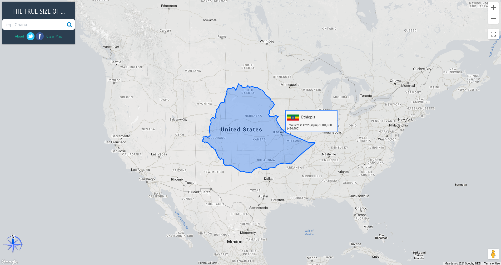
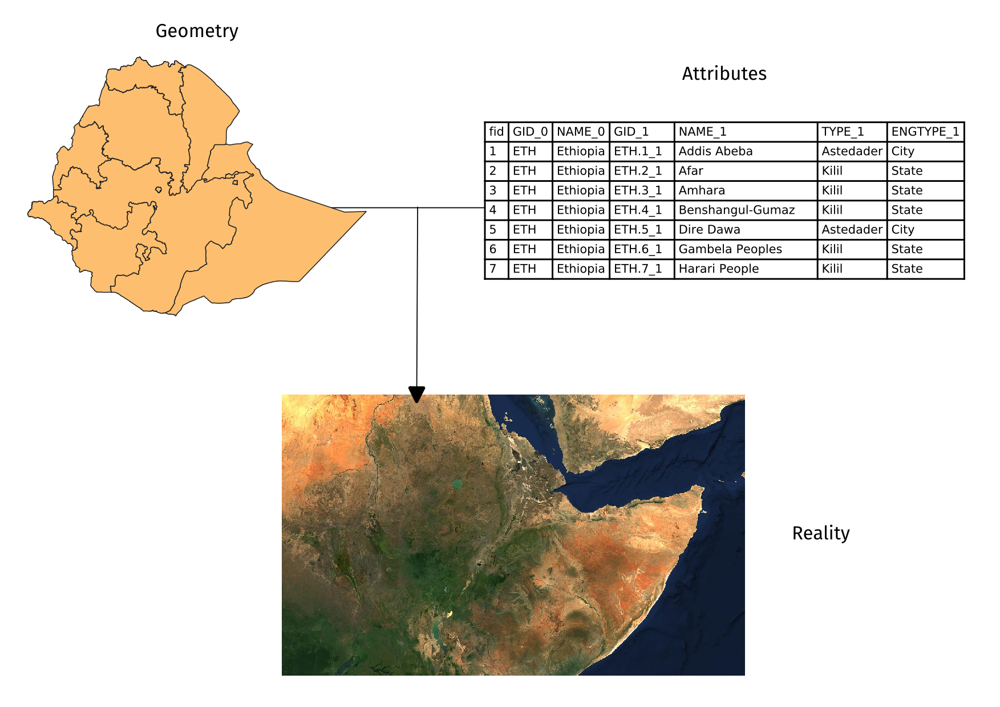

# ሞጁል 0 - ለ GIS ጽንሰ ሀሳቦች ቀላል መግቢያ

**ፀሐፊ**: ቤን ሁር

## ትምህርታዊ መግቢያ

ይህ ሞጁል ከጂኦግራፊያዊ የመረጃ ስርአቶች (GIS) ጋር ለመስራት አስፈላጊ ስለሆኑ ጂኦግራፊያዊ ጽንሰ ሀሳቦች ቀላል መግቢያ ሆኖ ያገለግላል። በዚህ ሞጁል መጨረሻ፣ አንባቢዎች የሚከተሉትን ጽንሰ ሀሳቦች መረዳት አለባቸው:

*   የካርታ ትወራዎች
*   የመጋጠሚያ ማጣቀሻ ስርአቶች
*   የቦታ አቀማመጥ ውሂብ ቅርጸቶች (ምሳሌ ቬክተሮች እና ራስተሮች)
*   የ GIS ክፍሎች እና ባህርያት
*   የ GIS ጥቅሞች
*   የ GIS ምሳሌዎች እና ሌሎች የጂኦስፓሻል መተግበሪያዎች

በተጨማሪም ይህ ሞጁል የFree and Open Source Software (FOSS) እና የFree and Open Source Software for Geospatial (FOSS4G) መተግበሪያዎችን ቁልፍ ጽንሰ ሀሳቦች ያስተዋውቃል።

## የሚያስፈልጉ መሳሪያዎች እና ገብአቶች

ለዚህ ሞጁል የሚያስፈልጉ መሳሪያዎች እና ግብአቶች:-

*   የሚሰራ ኮምፒተር
*   የበይነመረብ ግንኙነት

## ቅድመ ሁኔታዎች

*   የኮምፒተር አጠቃቀም መሰረታዊ እውቀት

## ተጨማሪ ግብአቶች

* የGIS ረጋ ያለ መግቢያ ፡- [https://docs.qgis.org/3.16/en/docs/gentle_gis_introduction/index.html](https://docs.qgis.org/3.16/en/docs/gentle_gis_introduction/index.html)
*  QGIS የተጠቃሚ መመሪያ ፡- [https://docs.qgis.org/3.16/en/docs/user_manual/](https://docs.qgis.org/3.16/en/docs/user_manual/)
* QGIS የስልጠና መመሪያ ፡- [https://docs.qgis.org/3.16/en/docs/training_manual/index.html](https://docs.qgis.org/3.16/en/docs/training_manual/index.html)
* QGIS ድረገጽ ፡- [https://qgis.org/en/site/](https://qgis.org/en/site/)
* OSGeo ድረገጽ ፡- [https://www.osgeo.org/](https://www.osgeo.org/)
* OSGeoLive ድረገጽ ፡- [https://live.osgeo.org/en/index.html](https://live.osgeo.org/en/index.html)
* ነጻ ሶፍትዌር ምንድን ነው? ፡- [https://www.gnu.org/philosophy/free-sw.en.html](https://www.gnu.org/philosophy/free-sw.en.html)
* የክፍት ምንጭ ትርጉም ፡- [https://opensource.org/osd](https://opensource.org/osd)

## የጭብጥ መግቢያ

እስኪ በምሳሌ እንጀምር:-

“ሁሉም ካርታዎች ይዋሻሉ።” የሚለውን ሀረግ ሰምተው ይሆናል ወይም “በህይወትዎ ሁሉ የሚያውቁት የነበረው የዓለም ካርታ ስህተት ነው!” የሚለውን የማህበራዊ ሚዲያ ልጥፍ አይተዋል። በእውነቱ ካርታዎች እርስዎን ለመዋሸት አውቀው መርጠው ሳይሆን ካርታዎች ሙሉ እውነታውን ማሳየት ስለማይችሉ ነው። አንዱ ምሳሌ የሀገራት አንጻራዊ መጠኖች ናቸው።

የ([https://thetruesize.com/](https://thetruesize.com/)) እውነተኛ መጠን ጥሩ የድረገጽ ቦታ ማሳያ መተግበሪያ ሲሆን ብዙ ጊዜ በምንጠቀምባቸው ካርታዎች በአንዱ (የMercator ትወራን የሚጠቀመው) የሀገራት አንጻራዊ መጠኖች እንዴት የተዛባ እንደሆነ ያሳያል። በዚህ ሞጁል ውስጥ በደንብ ስለምንማረው የቦታ አቀማመጥ ውሂብ አይነቶች የተወሰኑ ምሳሌዎችን ያሳያል። የእርስዎን ሀገር መጠን ከሌሎች ጋር ለማወዳደር የድረገጽ መተግበሪያውን ለመጠቀም ይሞክሩ።

## የጽንሰ ሀሳቦች ትንታኔ

ለምንድነው ይሄ ዋና ጉዳይ የሆነው? በዚህ ሞጁል ውስጥ እንደሚማሩት የመሬትን 3-ስፍረታዊ ቅርጽ በዝርግ ወረቀት ላይ ለመግለጽ ከባድ ነው። ይህን ለማድረግ በመሬት ሶስት-ስፍረታዊ ገጽ ላይ ያሉ ነጥቦችን ወደ ዝርግ ገጽ ለመተወር ካርቶግራፈሮች የካርታ ትወራ የሚባለውን ይጠቀማሉ። ነገር ግን ይህንን በማድረግ መዛባት ተፈጥሯል። ይህ መዛባት ካርታ ላይ ነገሮች ላይ በቅርጽ፣ መጠን፣ አቅጣጫ እና ርቀቶች ላይ ሊሆን ይችላል። ሁሉም ካርታዎች ቢያንስ ከእነዚህ መዛባቶች አንዱ ይኖራቸዋል። በዚህ መዛባት ምክንያት፣ ካርታዎች ስለመሬት ሙሉ እውነታን ማሳየት አይችሉም።

እኛ በምንጠቀመው የድረገጽ መተግበሪያ መጠኑን የማይለውጠው ከጀርባ ያለው ካርታ (ግራጫ የሆነው) የራስተር ውሂብ ምሳሌ ነው። የራስተር ውሂብ ከፎቶግራፎች ጋር በተመሳሳይ ፒክሰልን መሰረት ያደረጉ የዓለም ውክልናዎች ናቸው። ይህ በእንዲህ እንዳለ ማንቀሳቀስ የምንችላቸው የሀገራት ቅርጾች የቬክተር ውሂብ ምሳሌ ናቸው። የቬክተር ውሂብ ከራስተር በተቃራኒ ነጥቦች፣ መስመሮች እና ባለብዙ ጎን ቅርጾች የመሳሰሉ ልዩ ነገሮችን በመጠቀም ዓለምን ይወካላሉ።

## ዋና ይዘት

### የደረጃ 1 ርዕስ:- ካርታዎች እና መጋጠሚያዎች

ዛሬ ሰዎች መሬትን ሲያስቡ በህዋ ላይ የሚንሳፈፍ ሰማያዊ፣ አረንጓዴ፣ ነጭ እና ቡናማ ክብ ክምር አድርገው ያስላሉ። መሬትን ለመመሰል ባህላዊው መንገድ ሉል የሆነው በዚህ ምክንያት ነው።
<table>
  <tr>
   <td>
        
         ምስል 0.1.፡- ብሉ ማርብል (The Blue Marble)  (<a href="https://commons.wikimedia.org/wiki/Earth#/media/File:The_Blue_Marble.jpg">https://commons.wikimedia.org/wiki/Earth#/media/File:The_Blue_Marble.jpg</a>)
   </td>
   <td>
          
        ምስል 0.2.፡- de l'Isle ሉል (1765)  (<a href="https://commons.wikimedia.org/wiki/Globe#/media/File:3quarter_globe.jpg">https://commons.wikimedia.org/wiki/Globe#/media/File:3quarter_globe.jpg</a>)
   </td>
  </tr>
</table>

ነገር ግን ሉል የመሬትን አብዛኛው ባህርያት መያዝ ቢችልም ሁለት ችግሮች አሉት፦

*   ሉሎች የማይመቹ እና ይዞ ለመንቀሳቀስ የሚያስቸግሩ ናቸው።
*   ሉሎችን መጠቀም የሚቻለው በትንሽ ልኬቶች (ምሳሌ፦ የሀገራትን መገኛ፣ የከተማዎችን አንጻራዊ አቀማመጥ ለመፈለግ፣ ወዘተ…) ብቻ ነው። ትልቅ ልኬቶች እና ደቃቅ ዝርዝሮችን ለሚፈልጉ ተግባራት (ምሳሌ፦ የከተማ አሰሳ) ጥቅም የላቸውም።

እዚህ ጋር ካርታዎች ይመጣሉ። ካርታዎች እነዚህ የሉልን ሁለት ችግሮች መሬትን በዝርግ ገጽ በመወከል ያስተካክላሉ። ይህንን በማድረግ ካርታዎች ተንቀሳቃሽ እና ለብዙ ጥቅሞች ተስማሚ ሆነዋል። ይህንን ካልን፣ ካርታዎችም የራሳቸው ችግር አላቸው። ባላ ሶስት-ስፍረታዊ ነገርን (ሉል) ወደ ሁለት-ስፍረታዊ (ካርታ) በመቀየር ሂደት ውስጥ፣ አንድ ካርታ የመሬትን የተለያዩ ባህርያት (ምሳሌ፦ ቅርጾች፣ ስፋቶች፣ አቅጣጫዎች) አሟልቶ ለመያዝ የማይቻል ስለሆነ መዛባቶች ይኖራሉ።

#### የካርታ ትወራዎች

የካርታ ትወራ ካርታን ለመፍጠር የመሬትን (ወይም የሉል) ገጽ ወደ ጠፍጣፋ ለመቀየር ጥቅም ላይ ይውላል። ይህ የመለወጥ ሂደት መዛባትን ያመጣል።

መሬትን እንደ ቡርትካን ማሰብ ይችላሉ። ቆዳውን ከላጡት፣ ዘርግተው ማስቀመጥ ይችላሉ ነገር ግን ፍጹማዊ ጠፍጣፋ ማድረግ አይችሉም። ሁልጊዜ የሚከተሉት ጉዳዮች ያጋጥምዎታል:-

*   **መሸለት (Shearing)** - ቆዳውን (ወይም ገጹን) በአንድ ወይም በሌላ አቅጣጫ መለጠጥ
*   **መቅደድ (Tearing)** - ቆዳውን (ወይም ገጹን) መቅደድ ወይም መለያየት
*   **መጭመቅ (Compressing)** - ቆዳውን (ወይም ገጹን) ማሳጠር ወይም ማሳነስ

በእነዚህ ጉዳዮች ምክንያት፣ ሁሉም ካርታ በሚከተሉት አንድ ወይም ብዙ ባህርያት ውስጥ መዛባት ይኖረዋል:

*   **ቅርጽ**
*   **ስፋት**
*   **ርቀት**
*   **አቅጣጫ**

ጊዜ አይደለም። እንደ አማራጭ ለሁሉም ባህርያት መዛባቶች የሚመጣጠኑበት እና የሚቀነሱበትን ማመዛዘን ይችላሉ። ይህ በራሳቸው በባህርያቱ ተፈጥሮ ምክንያት ነው።

ቅርጽ እና ስፋት የመሳሰሉ ዋና ባህርያት ተናጠል ናቸው እና በአንድ ጊዜ ሁለቱንም መጠበቅ አይቻልም። ይህ በእንዲህ እንዳለ ርቅት እና አቅጣጫ የመሳሰሉ ጥቃቅን ባህርያት በካርታው ሁሉም ቦታ ላይ ትክክል ሊሆኑ አይችሉም።

የምንጠቀመውን የካርታ ትወራ ስንመርጥ የካርታውን አላማ ከግምት ውስጥ ማስገባት አስፈላጊ ነው። ለምሳሌ ስፋትን መሰረት ያደረገ ትንተና መስራት ከፈለጉ ስፋትን የሚጠብቅ የካርታ ትወራ መጠቀም የተሻለ ነው።

ብዙ አይነት የካርታ ትወራዎች ክፍፍል አሉ። የመጀመሪያው **የሚጠብቁትን ባህሪ/ያት** መሰረት በማድረግ ነው።

*   **ኮንፎርማል (Conformal)** ወይም **ኦርቶሞርፊክ (Orthomorphic)** የካርታ ትወራዎች ቅርጽን ወይም የማእዘን ተመሳሳይነትን የሚጠብቁ ናቸው። እነዚህ ብዙ ጊዜ ለአሰሳ ወይም ለአየር ሁኔታ ትንበያ አላማዎች ጥቅም ላይ የሚውሉ ናቸው። ቅርጾች ይጠበቃሉ ነገር ግን ስፋቶች ይዛባሉ። ስፋቱ ትልቅ ሲሆን፣ መዛባቱም ትልቅ ይሆናል።
*   **እኩል-ስፋት (Equal-area)** ወይም **ኦውታሊክ (Authalic)** የካርታ ትወራዎች ደግሞ ካርታ ላይ ያሉ ነገሮችን ክፋይ ወይም አንጻራዊ ስፋቶች የሚጠብቁ ናቸው። በዚህ የካርታ ትወራ አይነት በካርታ የሚቀመጠው ስፋት ትልቅ ሲሆን በጣም ትክክል ይሆናል።
*   **እኩል-ርቀት (Equidistant)** የካርታ ትወራዎች ካርታው ላይ ካሉ አንድ ወይም ሁለት ነጥቦች የሚነሱ መስመሮችን ርቀት ይጠብቃል ወይም በአንድ ወይም ሁለት መስመሮች ላይ ትክክለኛ ልኬት ያላቸው ናቸው።
*   **አዚሙታል (Azimuthal)** የካርታ ትወራዎች ካርታው ላይ ካሉ አንድ ወይም ሁለት ነጥቦች አቅጣጫ ይጠብቃል። እነዚህ በወደቦች መካከል የአውሮፕላን እና የመርከቦችን የጉዞ መስመር በካርታ ለማስቀመጥ ይጠቅማሉ።

አንድ የካርታ ትወራ ከአንድ በላይ ባህሪን መጠበቅ ይችላል (ምሳሌ፦ ካርታው ላይ ካሉ አንድ ወይም ሁለት ነጥቦች አቅጣጫ እና ርቀቶችን የሚጠብቁ አዚሙታል እኩል-ርቀት የሆኑ ትወራዎች) ነገር ግን ከታች ባለው ሰንጠረዥ እንደሚታየው ሁሉንም መጠበቅ አይቻልም።

<table>
  <tr>
   <td>
   </td>
   <td><strong>ኮንፎርማል</strong>
   </td>
   <td><strong>እኩል-ስፋት</strong>
   </td>
   <td><strong>እኩል-ርቀት</strong>
   </td>
   <td><strong>አዚሙታል</strong>
   </td>
  </tr>
  <tr>
   <td>

<strong>ኮንፎርማል</strong>

   </td>
   <td>-
   </td>
   <td>አይ
   </td>
   <td>አይ
   </td>
   <td>አዎ
   </td>
  </tr>
  <tr>
   <td>

<strong>እኩል-ስፋት</strong>

   </td>
   <td>አይ
   </td>
   <td>-
   </td>
   <td>አይ
   </td>
   <td>አዎ
   </td>
  </tr>
  <tr>
   <td>

<strong>እኩል-ርቀት</strong>

   </td>
   <td>አይ
   </td>
   <td>አይ
   </td>
   <td>-
   </td>
   <td>አዎ
   </td>
  </tr>
  <tr>
   <td>

<strong>አዚሙታል</strong>

   </td>
   <td>አዎ
   </td>
   <td>አዎ
   </td>
   <td>አዎ
   </td>
   <td>-
   </td>
  </tr>
</table>

ሰንጠረዥ:- ሁለት ባህርያት በአንድ ጊዜ በአንድ ካርታ መጠበቅ ይችላሉ?

የካርታን ባህርያት የማይጠብቅ ነገር ግን ካርታ ውስጥ ያሉ ሁሉንም መዛባቶች ለመቀነስ የሚሞክር ሌላ የካርታ ትወራዎች አለ። እነዚህ **ማመጣጠን (Compromise)** ወይም **አነስተኛ ስህተት (Minimum Error)** የካርታ ትወራዎች (ቅርጽ ወይም ስፋት የማይጠብቁ ካርታዎች አፊላክቲክ (Aphylactic)) ይባላሉ።

መዛባትን ለማሳየት እና ለመመልከት አንዱ መንገድ **ቲሶትስ ኢንዲካትሪክስ (Tissot’s indicatrix)** የሚባለውን በመጠቀም ነው። ይህ አመልካች አካባቢያዊ መዛባቶችን ክቦችን በመጠቀም እንዲሁም እነዚህ ክቦች ካርታው ላይ እንዴት እንደሚለወጡ በማሳየት ይገልጻል።

ምስል 0.3.፡- ኮንፎርማል የካርታ ትወራ ከራሱ ቲሶትስ ኢንዲካትሪክስ ጋር። ክቦች በካርታው ሁሉም ቦታ ላይ ክቦች ናቸው፡፡ ነገር ግን ክቦቹ ከምድር ወገብ ወደ ዋልታዎች ሲንቀሳቀሱ ስፋታቸው ይጨምራል።

ምስል 0.4.፡- እኩል-ስፋት የካርታ ትወራ ከቲሶትስ ኢንዲካትሪክስ ጋር። ክቦች የእንቁላል ቅርጽ ያላቸው ይሆናሉ፡፡ ነገር ግን ስፋታቸው ተመሳሳይ ነው።

ምስል 0.5.፡- እኩል-ርቀት የካርታ ትወራዎች ከቲሶትስ ኢንዲካትሪክስ ጋር። የክቦቹ ከፍታዎች እኩል እንደሆኑ ያስተውሉ ይህም ማለት በሚሪዲያኖች ላይ ያሉት ልኬቶች/ርቀቶች ይጠበቃሉ ማለት ነው።

ምስል 0.6.፡- አዚሙታል እኩል-ርቀት ትወራዎች ከቲሶትስ ኢንዲካትሪክስ ጋር። ሁሉም ክቦች ወደ ካርታው ማእከል እንደሚጠቁሙ እና የክቦቹ ከፍታ እኩል እንደሆነ ያስተውሉ።

Another way to classify map projections is by the **developable surface** used to create the map. A surface is developable if it can be flattened without introducing distortions. The most commonly used surfaces are: Cylinders (Figure 0.7), Cones (Figure 0.8), and Planes (Figure 0.9).

Figure 0.7. Cylindrical projections have meridians (longitude) and parallels (latitude) meeting at right angles with the distances between meridians being equal.

Figure 0.8. Conic projections have straight meridians going to one point at the poles. The parallels are arcs.

Figure 0.9. Planar projections (commonly used in azimuthal projections) have straight meridians similar to conic projections but their parallels are circles instead of arcs.

There are countless other developable surfaces that can be used to transform a globe into a map. They can be a variation of the common surfaces like in the case of pseudo-cylindrical and pseudo-conic projections or they can be unique and entirely different surfaces such as in the Dymaxion map which uses a icosahedron (polyhedron with 20 faces), or the Cahill-Keyes projection which uses an octahedron (polyhedron with 8 faces).

A map projection can also be classified according to its **aspect** (Figure 0.10) or how the developable surface is positioned on the globe: either Normal, Transverse, or Oblique.

Figure 0.10. Aspects of a map projection

#### **Coordinate Reference Systems**

A **Coordinate Reference System (CRS)** is used to specify the location of an object on the surface of the earth through the use of coordinates. They can be classified into two:

*   **Geographic Coordinate Reference Systems** use degrees of latitude and longitude as coordinates to refer to position.
*   **Projected Coordinate Reference Systems** use linear units (e.g. meters, feet, kilometers) of eastings and northings as coordinates.

Knowledge of coordinate reference systems is important because even if two maps (or layers) show the same area, the coordinates of the locations in those maps will be different if the CRS they use are different. 

**Take this example:** Map A and Map B show the same area and extent. They’re basically the same map. The only difference is the coordinate reference system they use. Map A uses CRS X and Map B uses CRS Y. Let’s say we get the coordinate of Point 1, which is (10, 10), from Map A. If we look at the coordinate (10,10) in Map B, it’s possible that Point 1 won’t be there since Map B uses a different CRS. Or if you overlay the maps over each other using a common reference, the features on the two maps won’t coincide. This knowledge of coordinate reference systems is important in any GIS.

Prior to QGIS 3.X, QGIS had an option to activate what’s called “OTF” or “On-The-Fly Transformation”. This allows layers with different CRS to be projected on the map canvas as if they were in the same CRS. With QGIS 3.X onward, this option is the default behavior of QGIS.  QGIS also performs this action automatically for processing tasks.  This is very important because if the layers aren’t in the same CRS, the results of spatial queries and processing like spatial joins, clips, etc. could be compromised. 

You may notice that some Coordinate Reference Systems are referred to by their EPSG Code. This code refers to the CRS’ code in the EPSG Geodetic Parameter Dataset which is a  registry of geodetic datums, spatial reference systems, Earth ellipsoids, coordinate transformations and related units of measurement. Most GIS, including QGIS, refer to the EPSG code to identify coordinate reference systems, projections, and perform transformations between these systems.

Common EPSG Codes include:

*   **EPSG:4326** - WGS 84, latitude/longitude coordinate system based used by the Global Positioning System (GPS) among others.
*   **EPSG:3857** - Web Mercator projection used for display by many web-based mapping tools such as OpenStreetMap and Google Maps
*   **EPSG:32636-32638** - WGS 84 / Universal Transverse Mercator (UTM) Zones 36N to 38N. UTM Zone used covering Ethiopia
*   **EPSG:4201** - Adindan

#### **Quiz questions**

1. What type of map projection is best for the following use-cases?
    1. a general purpose map that needs to look pleasing -- ***compromise***
    2. a map showing a per-unit area analysis between different locations -- ***equal-area or authalic***
    3. a map showing a comparison of a 10-km buffer zone from different locations -- ***equidistant***
2. What type (geographic or projected) of coordinate reference system is best to use for the following use cases?

    1. showing the location of points using GPS -- ***Geographic Coordinate Reference System***
    2. computing the distance between two points -- ***Projected Coordinate Reference Systme***
3. True or False -- It is possible to preserve the following map characteristics together in a single map:
    1. Area and Shape -- ***False***
    2. Distance and Direction -- ***True***

### Phase 2 title: Spatial Data Types

At its core, a Geographic Information System (GIS) must be able to model real-world objects, information, and phenomena such as lot boundaries, rivers, roads, temperature, etc. It does this through spatial data models. 

Spatial data models are composed of two primary components that, when combined, model reality. These components are:

*   **Spatial features (or geometry)**
*   **Attributes**

There are two main spatial data models: **raster** and **vector**. Although any real-world object can be represented by either data model, one data model is usually better at representing certain real-world objects than the other.

#### **Raster Data**

Raster data is best used to represent continuous phenomena such as elevation or temperature. 

A raster is a cell-based or pixel-based representation of real-world objects composed of rows and columns of cells or pixels where each cell or pixel represents a geographical area (think of a photograph or an image). The value of the cell represents the value of an attribute in the said geographic area. The size of the area is dependent on the spatial resolution of the raster. 

Rasters are quite useful for site suitability modelling since you can combine rasters via mathematical operations (raster algebra).

Figure 0.12. A raster consists of equal-sized pixels in rows and columns.

A raster pixel may only hold one value at a time. Thus, a raster may only model one object or phenomenon at a time.

#### **Vector Data**

Vector data is best used to represent discrete objects.

Vector data comes in three primary forms: point, line, and polygon. It is more precise than rasters because points, lines, and polygons are modelled using well-defined coordinates thus making them better at representing discrete objects than rasters. 

Vectors are commonly used when precise lengths, areas, and distances are needed. They are also useful when performing network analysis (e.g. finding the shortest path of road from one point to another).

Figure 0.13. A vector consists of features with their corresponding attributes.

Compared to raster pixels, a vector feature may hold more than one value at a time. These values are stored as columns in the attribute table. Each feature, on the other hand, is stored as a row.

#### **Quiz questions**

1. What data type can best represent the following objects/phenomenon:
    1. roads
    2. houses
    3. population density
    4. flood hazard

### Phase 3 title: Geographic Information System (GIS)

Geographic and location information have become ubiquitous in the 21st century at all levels of granularity. We have satellites, aircrafts, and even commercial drones that are able to capture large quantities of raw data over large areas over long periods of time. There are also sensors that collect and gather location information such as the GPS and other applications on our phones and gadgets.

With all of this data available to us, knowing how to properly manage, analyse, and present them is imperative. This is where Geographic Information Systems, or more commonly known as GIS, come in.

GIS is a tool/framework/system that allows us to work with geographic (or spatial) information and its corresponding attribute (non-spatial) information. In particular, a GIS should be able to:

*   **Collect**, **store**, **edit**, **manipulate**, or generally, **manage** spatial data.
*   **Analyse** the data using its spatial component (where the data is) or attribute (the value of the data).
*   **Present** the data and analyses as meaningful information through maps, charts, plots, and other visualizations.

_GIS is not just mapping_. Although map-making is one of the most important and commonly-known aspects of GIS, it is still just one of its many parts and features. We can view the modern GIS framework as being composed of:

*   **Data** - these refer to the pieces of information used by GIS which may or may not have location information (e.g. names of stores, locations of stores).
*   **Technology** - these include both the hardware and software components of a GIS — the machines, instruments, and computers with the software applications used to do geospatial work.
*   **Methods & Analysis** - these refer to the science and mathematics in GIS which allows it to perform both spatial and non-spatial (attribute) queries and computations.
*   **Visualization** - although similar to methods & analysis, visualization can be considered as a separate component as these refer specifically to the means by which a GIS represents data graphically. These include not just maps, although that’s the most common case, but also tables, charts, graphs, etc. 
*   **People** - these are the people and/or groups of people who are involved in the use, development, teaching, and maintenance of GIS. 

All parts of the modern GIS framework — from the data to the people — are integral in ensuring its success.

#### **Quiz questions**

1. True or False:
    1. GIS can only be used with geospatial data -- ***False***
    2. A map is always the output when using GIS -- ***False***
    3. Learning GIS is difficult and expensive -- ***False***

### Phase 4 title (additional): Free and Open Source Software for Geospatial (FOSS4G)

QGIS is just one example of Free and Open Source Software for Geospatial (FOSS4G) application. Other examples of FOSS4G are GRASS, PostGIS, GeoServer, GeoNode, etc. These FOSS4G applications are great tools to work with not only because they are reliable but also because, being free and open source, they have a lower barrier of entry and are highly customizable to any need. You can find a variety of free and open source geospatial applications for every need and for every part of the geospatial stack.

 applications stack")

Figure 0.14. A sample open source geospatial (or FOSS4G) stack (from Simon Nitz ([https://twitter.com/si_nitz?lang=en](https://twitter.com/si_nitz?lang=en)))

#### **Free Software**

_Free as in freedom not just free food._

Free software are software that adhere to the the Four Essential Freedoms of Free Software, which are:

1. The freedom to run the program as you wish, for any purpose (freedom 0).
2. The freedom to study how the program works, and change it so it does your computing as you wish (freedom 1). Access to the source code is a precondition for this.
3. The freedom to redistribute copies so you can help others (freedom 2).
4. The freedom to distribute copies of your modified versions to others (freedom 3). By doing this you can give the whole community a chance to benefit from your changes. Access to the source code is a precondition for this.

#### **Open source**

Open source software are those that have licenses which provide royalty-free use and reuse of the software together with open access to the source code. By convention, these open source licenses are those that comply with the Open Source Definition as provided for by the Open Source Initiative.  Open source not only guarantees free access to the software and source code but also the ability to redistribute the software with no additional costs.

Because of the open nature of open source software, it is also a great software development model where everyone is free to update, upgrade, modify, and share their modifications to the community.

#### **OSGeo**

There are a lot of open source geospatial applications out there and sometimes the most difficult part is knowing where and how to start working with these applications. Thankfully, the Open Source Geospatial Foundation (OSGeo) ([https://www.osgeo.org/](https://www.osgeo.org/)) is there to help foster global adoption of open geospatial technology and support the development of these technologies.

#### **Quiz questions**

N/A

### If you want to go further:  

If you want to quickly try using FOSS4G applications, you can try OSGeoLive ([https://live.osgeo.org/en/index.html](https://live.osgeo.org/en/index.html)) which is a Linux distribution (Operating System) that comes pre-installed with QGIS, GRASS, and other FOSS4G applications.

### To practice your new skills, try to…

N/A

### Tips 

N/A

