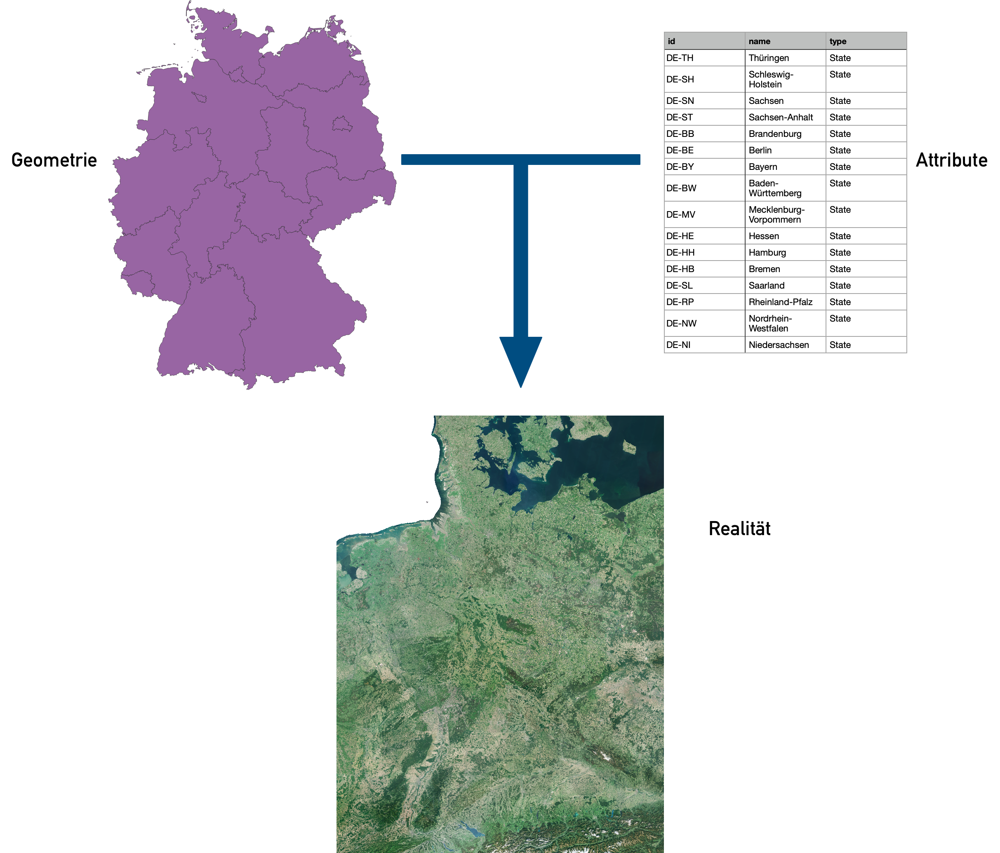
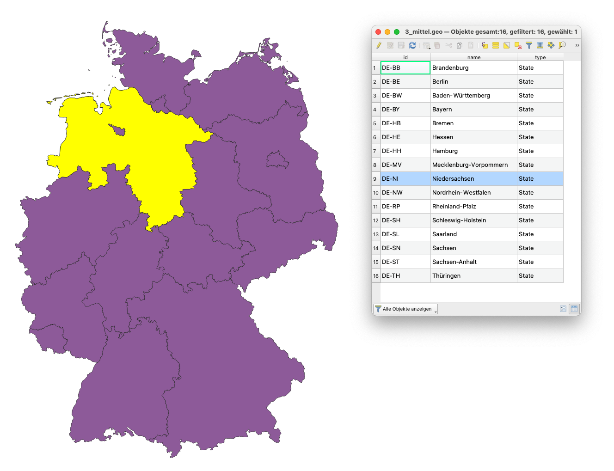

# Modul 0 - Sanfte Einführung in GIS-Konzepte

**Autor:in**: Ben Hur

## Pädagogische Einführung

Dieses Modul dient als sanfte Einführung in geographische Konzepte, die für die Arbeit mit geographischen Informationssystemen (GIS) notwendig sind. Am Ende dieses Moduls sollten die Lernenden die folgenden Konzepte verstehen:

* Kartenprojektionen
* Koordinatenreferenzsysteme
* Geodatenformate (z. B. Vektoren und Raster)
* Bestandteile und Funktionen eines GIS
* Anwendungen eines GIS
* Beispiele für GIS und andere raumbezogene Anwendungen

Darüber hinaus werden in diesem Modul auch einige Schlüsselkonzepte von freier und quelloffener Software - Free and Open Source Software (FOSS) - und freier und offener Software für Geodaten - Free and Open Source Software for Geospatial (FOSS4G) Anwendungen vorgestellt.

## Technische Voraussetzungen

Die erforderlichen Voraussetzungen und Ressourcen für dieses Modul sind:

* Computer
* Internetverbindung

## Voraussetzungen

* Grundkenntnisse in der Bedienung eines Computers

## Zusätzliche Ressourcen

* Eine sanfte Einführung in GIS - [https://docs.qgis.org/3.16/de/docs/gentle_gis_introduction/index.html](https://docs.qgis.org/3.16/de/docs/gentle_gis_introduction/index.html)
* QGIS Benutzerhandbuch - [https://docs.qgis.org/3.16/de/docs/user_manual/](https://docs.qgis.org/3.16/de/docs/user_manual/)
* QGIS Schulungshandbuch - [https://docs.qgis.org/3.16/de/docs/training_manual/index.html](https://docs.qgis.org/3.16/de/docs/training_manual/index.html)
* QGIS Website - [https://qgis.org/de/site/](https://qgis.org/de/site/)
* OSGeo-Website (englischsprachig)- [https://www.osgeo.org/](https://www.osgeo.org/)
* OSGeoLive-Website - [https://live.osgeo.org/de/index.html](https://live.osgeo.org/de/index.html)
* Freie Software. Was ist das? - [https://www.gnu.org/philosophy/free-sw.de.html](https://www.gnu.org/philosophy/free-sw.de.html)
* Definition von Open Source (englischsprachig) - [https://opensource.org/osd](https://opensource.org/osd)

## Thematische Einführung

Lassen Sie uns mit einem Beispiel beginnen:

Vielleicht haben Sie schon einmal den Satz "Alle Landkarten lügen." gehört oder einen Beitrag in den sozialen Medien gesehen, in dem behauptet wird: "Die Weltkarte, die Sie Ihr ganzes Leben lang gekannt haben, ist falsch!".  Nun, es ist nicht so, dass Landkarten sich aktiv dafür entscheiden, Sie anzulügen, es ist nur so, dass Landkarten Ihnen nie die ganze Wahrheit zeigen können. Ein solches Beispiel ist die relative Größe von Ländern.

The True Size Of ([https://thetruesize.com/](https://thetruesize.com/)) ist eine schöne Web-Mapping-Anwendung. Sie zeigt, wie die relativen Größen von Ländern in einer der gebräuchlichsten Karten, die wir verwenden (eine, die die Mercator-Projektion verwendet), verzerrt sind. Sie zeigt auch einige Beispiele für räumliche Datentypen, über die wir in diesem Modul mehr lernen werden. Benutzen Sie die Webanwendung, um die Größe Ihres Landes mit anderen zu vergleichen.

## Aufschlüsselung der Konzepte

Warum ist dies der Fall? Wie Sie in diesem Modul lernen werden, ist es schwierig, die 3-dimensionale Form der Erde auf einem flachen Blatt Papier darzustellen. Um dies zu schaffen, verwenden Kartograph:innen eine sogenannte **Kartenprojektion**, um die Punkte auf der dreidimensionalen Oberfläche der Erde auf eine ebene Fläche zu projizieren. Dabei kommt es jedoch zu einer **Verzerrung**. Diese Verzerrung kann sich auf die Form, die Größe, die Richtung und die Abstände der Objekte auf der Karte beziehen. Alle Karten weisen mindestens eine dieser Verzerrungen auf. Aufgrund dieser Verzerrung kann eine Karte nie die ganze Wahrheit über die Erde zeigen.

In der von uns verwendeten Web-App ist die Karte im Hintergrund, die sich nicht in der Größe ändert (die graue Karte), ein Beispiel für **Rasterdaten**. Rasterdaten sind pixelbasierte Darstellungen der Welt, ähnlich wie bei Fotos. Die Form der Länder, in denen wir uns bewegen können, sind hingegen Beispiele für **Vektordaten**. Vektordaten stellen im Gegensatz zu Rastern die Welt anhand diskreter Objekte wie Punkte, Linien und Polygone dar.

## Hauptinhalt

### Phase 1 Titel: Karten und Koordinaten

Wenn Menschen heute an die Erde denken, stellen sie sich meist eine kugelförmige Masse aus Blau, Grün, Weiß und Braun vor, die im Raum schwebt. Aus diesem Grund ist die traditionelle Art, die Erde zu modellieren, die Verwendung von Globen.

<table>
  <tr>
   <td>
        
        Abbildung 0.1. Die Blaue Kugel (<a href="https://commons.wikimedia.org/wiki/Earth#/media/File:The_Blue_Marble.jpg">https://commons.wikimedia.org/wiki/Earth#/media/File:The_Blue_Marble.jpg</a>)
   </td>
   <td>
          
        Figure 0.2.  de l'Isle globe (1765) (<a href="https://commons.wikimedia.org/wiki/Globe#/media/File:3quarter_globe.jpg">https://commons.wikimedia.org/wiki/Globe#/media/File:3quarter_globe.jpg</a>)
   </td>
  </tr>
</table>

Doch auch wenn der Globus die meisten Eigenschaften der Erde erfassen kann, leidet er unter zwei Hauptnachteilen:

* Globen sind unhandlich und lassen sich nur schwer mitnehmen.
* Globen sind nur in kleinen Maßstäben verwendbar (z. B. zum Auffinden von Standorten von Ländern, der relativen Position von Städten usw.). Für Aktivitäten, die große Maßstäbe oder feine Details erfordern (z. B. Stadtnavigation), sind sie nahezu unbrauchbar.

An dieser Stelle kommen Karten ins Spiel. Karten beheben diese beiden Nachteile von Globen, indem sie die Erde als ebene Fläche darstellen. Auf diese Weise werden Karten tragbar und für eine Vielzahl von Anwendungen nutzbar. Allerdings bringen Karten auch einen Nachteil mit sich. Durch den Prozess der Umwandlung eines dreidimensionalen Objekts (Globus) in ein zweidimensionales (Karte) entstehen Verzerrungen, so dass es für eine Karte unmöglich ist, die verschiedenen Eigenschaften der Erde (z. B. Formen, Flächen, Richtungen) perfekt zu erfassen.

#### **Kartenprojektionen**

Eine Kartenprojektion wird verwendet, um die Oberfläche der Erde (oder des Globus) in eine Ebene abzuflachen, um eine Karte zu erstellen. Dieser Transformationsprozess führt zu Verzerrungen.

Sie können sich die Erde wie eine Orange vorstellen. Wenn Sie die Schale schälen, können Sie sie flach hinlegen, aber Sie können sie nie perfekt flach machen. Sie werden immer auf eines der folgenden Probleme stoßen:

* **Scheren** - die Verlängerung der Haut (oder Oberfläche) in eine oder mehrere Richtungen
* **Einreißen** - das Aufspalten oder Auseinanderbrechen der Haut (oder der Oberfläche)
* **Komprimieren** - die Verkürzung oder Schrumpfung der Haut (oder der Oberfläche)

Aus diesen Gründen enthält jedes Karte Verzerrungen in einem oder mehreren der folgenden Merkmale:

* **Form**
* **Fläche**
* **Entfernung**
* **Richtung**

Kartenprojektionen können ein oder mehrere Merkmale erhalten (keine Verzerrung), aber nie alle gleichzeitig. Alternativ können sie einen Kompromiss aufweisen, bei dem die Verzerrungen für alle Merkmale ausgeglichen und minimiert sind. Dies liegt in der Natur der Merkmale selbst begründet.

Wichtige Merkmale wie **Form** und **Fläche** schließen sich **gegenseitig aus** und können nicht gleichzeitig erhalten werden. Die kleineren Merkmale, **Entfernung** und **Richtung**, können dagegen nicht überall auf der Karte korrekt sein.

Bei der Wahl der zu verwendenden Kartenprojektion ist es wichtig, dass Sie den Zweck der Karte berücksichtigen. Wenn Sie z. B. flächenbezogene Analysen durchführen möchten, ist es am besten, eine Kartenprojektion zu verwenden, bei der die Fläche erhalten bleibt.

Es gibt mehrere Klassifizierungen von Kartenprojektionen. Die erste basiert auf der **Eigenschaft/den Eigenschaften, die sie bewahren**.

* **Winkeltreue** oder **konforme** Kartenprojektionen sind solche, die Form- oder Winkelkonformität bewahren. Diese werden üblicherweise für Navigations- oder meteorologische Zwecke verwendet. Die Formen bleiben erhalten, aber die Flächen werden verzerrt. Je größer die Fläche ist, desto stärker ist die Verzerrung.
* **Flächentreue** oder **äquivalente** Kartenprojektionen sind solche, die das Verhältnis oder die relativen Flächen der Objekte in der Karte bewahren. Bei dieser Art der Kartenprojektion ist die Genauigkeit umso größer, je größer die Fläche ist, die abgebildet wird.
* **Längentreue** oder **äquidistante** Kartenprojektionen bewahren den Abstand von Linien, die von einem oder zwei Punkten auf der Karte ausgehen, oder haben den richtigen Maßstab entlang einer oder mehrerer Linien.
* **Azimutale** Kartenprojektionen bewahren die Richtung von einem oder zwei Punkten auf der Karte. Diese sind nützlich, um Routen von Flugzeugen und Seeschiffen zwischen Häfen abzubilden.

Eine einzelne Kartenprojektion kann mehr als eine Eigenschaft bewahren (z. B. eine azimutal-äquidistante Projektion, die die Richtung und die Entfernungen von einem oder zwei Punkten auf der Karte bewahrt), aber nicht alle, wie in der folgenden Tabelle gezeigt.

<table>
  <tr>
   <td>
   </td>
   <td><strong>Winkeltreu</strong>
   </td>
   <td><strong>Flächentreu</strong>
   </td>
   <td><strong>Längentreu</strong>
   </td>
   <td><strong>Azimutal</strong>
   </td>
  </tr>
  <tr>
   <td>

<strong>Winkeltreu</strong>

   </td>
   <td>-
   </td>
   <td>N
   </td>
   <td>N
   </td>
   <td>J
   </td>
  </tr>
  <tr>
   <td>

<strong>Flächentreu</strong>

   </td>
   <td>N
   </td>
   <td>-
   </td>
   <td>N
   </td>
   <td>J
   </td>
  </tr>
  <tr>
   <td>

<strong>Längentreu</strong>

   </td>
   <td>N
   </td>
   <td>N
   </td>
   <td>-
   </td>
   <td>J
   </td>
  </tr>
  <tr>
   <td>

<strong>Azimutal</strong>

   </td>
   <td>J
   </td>
   <td>J
   </td>
   <td>J
   </td>
   <td>-
   </td>
  </tr>
</table>

Tabelle: Kann eine Karte beide Eigenschaften gleichzeitig bewahren?

Es gibt eine weitere Klassifizierung von Kartenprojektionen, die keines der Merkmale der Karte bewahrt, sondern versucht, alle Verzerrungen in der Karte zu minimieren. Diese werden **Kompromiss-** oder **Minimalverzerrungskartenprojektionen** genannt (Karten, die weder Form noch Fläche bewahren, werden **vermittelnd** oder **aphylaktisch** genannt).

Eine Möglichkeit, Verzerrungen darzustellen und zu erkennen, ist die Verwendung der so genannten **Tissotischen Indikatrix**. Dieser Methode zeigt lokale Verzerrungen auf, indem sie Kreise verwendet und zeigt, wie diese Kreise über die Karte transformiert werden.

Abbildung 0.3. Winkeltreue Kartenprojektion mit ihrer Tissotischen Indikatrix. Die Kreise bleiben auf der gesamten Karte als Kreise erhalten, aber ihre Flächen nehmen zu, wenn sich die Kreise vom Äquator in Richtung der Pole bewegen.

Abbildung 0.4. Flächengleiche Kartenprojektion mit ihrer Tissotischen Indikatrix. Kreise werden zu Ellipsen, aber ihre Flächen bleiben gleich.

Abbildung 0.5. Äquidistante Kartenprojektion mit ihrer Tissotischen Indikatrix. Beachten Sie, dass die Höhen der Kreise gleich sind, was bedeutet, dass der Maßstab/Abstand entlang der Meridiane erhalten bleibt.

Abbildung 0.6. Azimutal-äquidistante Projektion mit ihrer Tissotischen Indikatrix. Beachten Sie, dass die Kreise alle auf den Kartenmittelpunkt zeigen und die Höhen der Kreise alle gleich sind.

Eine weitere Möglichkeit, Kartenprojektionen zu klassifizieren, ist die **entwickelbare Fläche**, die zur Erstellung der Karte verwendet wird. Eine Fläche ist entwicklungsfähig, wenn sie abgeflacht werden kann, ohne Verzerrungen zu verursachen. Die am häufigsten verwendeten Flächen sind: Zylinder (Abbildung 0.7), Kegel (Abbildung 0.8) und Ebenen (Abbildung 0.9).

Abbildung 0.7. Bei zylindrischen Projektionen treffen sich Meridiane (Längengrad) und Parallelen (Breitengrad) im rechten Winkel, wobei die Abstände zwischen den Meridianen gleich sind.

Abbildung 0.8. Konische Projektionen haben gerade Meridiane, die zu einem Punkt an den Polen führen. Die Parallelen sind Bögen.

Abbildung 0.9. Planare Projektionen (häufig in azimutalen Projektionen verwendet) haben gerade Meridiane, ähnlich wie konische Projektionen, aber ihre Parallelen sind Kreise anstelle von Bögen.

Es gibt unzählige andere entwickelbare Flächen, die verwendet werden können, um einen Globus in eine Karte zu verwandeln. Sie können eine Variation der üblichen Flächen sein, wie im Fall der pseudo-zylindrischen und pseudo-konischen Projektionen, oder sie können einzigartige und völlig andere Flächen sein, wie bei der Dymaxion-Karte, die ein Ikosaeder (Polyeder mit 20 Flächen) verwendet, oder die Cahill-Keyes-Projektion, die ein Oktaeder (Polyeder mit 8 Flächen) verwendet.

Eine Kartenprojektion kann auch nach ihrem **Aspekt** (Abbildung 0.10) klassifiziert werden oder danach, wie die entwickelbare Fläche auf dem Globus positioniert ist: entweder normal, transversal oder schräg.

Figure 0.10. Aspekte einer Kartenprojektion

#### **Koordinatenreferenzsysteme**

Ein **Koordinatenreferenzsystem** (im englischen Coordinate Reference System oder kurz **CRS**) wird verwendet, um die Position eines Objekts auf der Erdoberfläche durch die Verwendung von Koordinaten anzugeben. Koordinatenreferenzsysteme können in zwei Arten klassifiziert werden:

* **Geografische Koordinatenreferenzsysteme** verwenden Breiten- und Längengrade als Koordinaten, um die Position zu bestimmen.
* **Projektierte Koordinatenreferenzsysteme** verwenden lineare Einheiten (z. B. Meter, Fuß, Kilometer) von Ost- und Nordrichtungen als Koordinaten.

Die Kenntnis von Koordinatenreferenzsystemen ist wichtig, denn selbst wenn zwei Karten (oder Ebenen) das gleiche Gebiet zeigen, werden die Koordinaten der Orte in diesen Karten unterschiedlich sein, wenn die verwendeten CRS unterschiedlich sind.

**Betrachten Sie folgendes Beispiel:** Karte A und Karte B zeigen die gleiche Fläche und Ausdehnung. Sie sind im Grunde die gleiche Karte. Der einzige Unterschied ist das verwendete Koordinatenreferenzsystem. Karte A verwendet das CRS X und Karte B das CRS Y. Angenommen, wir erhalten die Koordinate von Punkt 1, die (10, 10) ist, aus Karte A. Wenn wir uns die Koordinate (10, 10) in Karte B ansehen, ist es möglich, dass Punkt 1 dort nicht vorkommt, da Karte B ein anderes CRS verwendet. Oder wenn Sie die Karten übereinanderlegen und eine gemeinsame Referenz verwenden, werden die Merkmale auf den beiden Karten nicht übereinstimmen. Dieses Wissen über Koordinatenreferenzsysteme ist in jedem GIS wichtig.

Vor QGIS 3.X gab es in QGIS eine Option, die sogenannte "OTF" oder "On-The-Fly Transformation" zu aktivieren. Dies ermöglicht es, Ebenen mit unterschiedlichen CRS auf die Kartenleinwand zu projizieren, als ob sie im gleichen CRS wären. Ab QGIS 3.X ist diese Option das Standardverhalten von QGIS.  QGIS führt diese Aktion auch automatisch für Verarbeitungsaufgaben durch.  Dies ist sehr wichtig, denn wenn sich die Ebenen nicht im selben CRS befinden, könnten die Ergebnisse von räumlichen Abfragen und Verarbeitungen wie räumlichen Schnitten, Differenzen usw. beeinträchtigt werden.

Sie werden feststellen, dass einige Koordinatenreferenzsysteme durch ihren EPSG-Code bezeichnet werden. Dieser Code bezieht sich auf die Nummer des CRS im EPSG Geodetic Parameter Dataset, einem Verzeichnis von geodätischen Datumsangaben, räumlichen Bezugssystemen, Erdellipsoiden, Koordinatentransformationen und zugehörigen Maßeinheiten. Die meisten GIS, einschließlich QGIS, beziehen sich auf den EPSG-Code, um Koordinatenreferenzsysteme und Projektionen zu identifizieren und Transformationen zwischen diesen Systemen durchzuführen.

Gängige EPSG-Codes sind:

* **EPSG:4326** - WGS 84, Breiten-/Längenkoordinatensystem, das unter anderem vom Global Positioning System (GPS) verwendet wird.
* **EPSG:3857** - Web-Mercator-Projektion, die von vielen webbasierten Kartentools wie OpenStreetMap und Google Maps für die Anzeige verwendet wird
* **EPSG:25833 und EPSG 5650** - ETRS 89 / Universal Transverse Mercator (UTM) Zone 33N. Übliche Referenzsystem für den Osten Deutschlands. Einmal mit und einmal ohne den 33. Prefix in den Koordinaten.
* **EPSG:3398 und EPSG:3399** - RD/83 / 3-degree Gauss-Krüger zone 4 - ehemals vielverwendete Bezugssystem in Deutschland

Da wir uns in diesem Curriculum primär mit der Region Mittelsachsen beschäftigen werden, empfiehlt sich ein Blick auf [dieses PDF mit üblichen EPSG-Codes vom Staatsbetrieb Geobasisinformation und Vermessung Sachsen](https://www.landesvermessung.sachsen.de/prod_fest_raum_fest/EPSG-Code-Tabelle.pdf).

#### **Quizfragen**

1. Welche Art von Kartenprojektion eignet sich am besten für die folgenden Anwendungsfälle?
    1. eine Karte für allgemeine Zwecke, die ansprechend aussehen soll -- ***Kompromiss***
    2. eine Karte, die eine Flächenanalyse zwischen verschiedenen Orten zeigt -- ***Flächentreu***
    3. eine Karte, die einen Vergleich einer 10-km-Pufferzone von verschiedenen Standorten zeigt -- ***Längentreu***

2. Welche Art von Koordinatenreferenzsystem (geografisch oder projiziert) ist für die folgenden Anwendungsfälle am besten geeignet?
    1. Darstellung der Lage von Punkten unter Verwendung von GPS -- ***Geografisches Koordinatenreferenzsystem***
    2. Berechnung der Entfernung zwischen zwei Punkten -- ***Projiziertes Koordinatenreferenzsystem***

3. Richtig oder falsch -- Es ist möglich, die folgenden Kartenmerkmale zusammen in einer Karte zu erhalten:
    1. Fläche und Form -- ***Falsch***
    2. Entfernung und Richtung -- ***Richtig***

### Phase 2: Räumliche Datentypen

Im Kern muss ein Geografisches Informationssystem (GIS) in der Lage sein, Objekte, Informationen und Phänomene der realen Welt zu modellieren. Zum Beispiel Grundstücksgrenzen, Flüsse, Straßen, Temperaturen usw. Es tut dies durch räumliche Datenmodelle.

Geodatenmodelle setzen sich aus zwei Hauptkomponenten zusammen, die in ihrer Kombination die Realität modellieren. Diese Komponenten sind:

* **Räumliche Merkmale (oder Geometrie)**
* **Attribute**

Es gibt zwei wesentliche Geodatenmodelle: **Raster** und **Vektor**. Obwohl jedes Objekt der realen Welt von beiden Datenmodellen dargestellt werden kann, ist ein Datenmodell in der Regel besser geeignet, bestimmte Objekte der realen Welt darzustellen als das andere.

#### **Rasterdaten**

Rasterdaten eignen sich am besten für die Darstellung kontinuierlicher Phänomene wie z. B. Höhe oder Temperatur.

Ein Raster ist eine zellen- oder pixelbasierte Darstellung von Objekten der realen Welt, die aus Zeilen und Spalten von Zellen oder Pixeln besteht. Dabei stellt jede Zelle oder jedes Pixel einen geografischen Bereich dar (denken Sie an ein Foto oder ein Bild). Der Wert der Zelle repräsentiert den Wert eines Attributs in dem besagten geografischen Bereich. Die Größe des Bereichs ist abhängig von der räumlichen Auflösung des Rasters.

Raster sind für die Modellierung der Standorteignung recht nützlich, da Sie Raster über mathematische Operationen (Rasteralgebra) kombinieren können.

Abbildung 0.12. Ein Raster besteht aus gleich großen Pixeln in Zeilen und Spalten.

Ein Rasterpixel kann immer nur einen Wert enthalten. Daher kann ein Raster immer nur ein Objekt oder Phänomen modellieren.

#### **Vektordaten**

Vektordaten werden am besten zur Darstellung diskreter Objekte verwendet.

Vektordaten gibt es in drei Hauptformen: Punkt, Linie und Polygon. Vektordaten sind präziser als Rasterdaten, da Punkte, Linien und Polygone mit wohldefinierten Koordinaten modelliert werden, wodurch sie diskrete Objekte besser darstellen können als Rasterdaten.

Vektoren werden üblicherweise verwendet, wenn genaue Längen, Flächen und Abstände benötigt werden. Sie sind auch nützlich bei der Durchführung von Netzwerkanalysen (z. B. bei der Suche nach dem kürzesten Weg einer Straße von einem Punkt zu einem anderen).

Abbildung 0.13. Ein Vektor besteht aus Merkmalen mit ihren entsprechenden Attributen.

Im Vergleich zu Rasterpixeln kann ein Vektorfeature mehr als einen Wert gleichzeitig enthalten. Diese Werte werden als Spalten in der Attributtabelle gespeichert. Jedes Feature hingegen wird als Zeile gespeichert.

#### **Quizfragen**

1. Welcher Datentyp kann die folgenden Objekte/Phänomene am besten darstellen:
    1. Straßen
    2. Häuser
    3. Bevölkerungsdichte
    4. Hochwassergefahr

### Phase 3: Geografisches Informationssystem (GIS)

Geografische und ortsbezogene Informationen sind im 21. Jahrhundert auf allen Ebenen der Granularität allgegenwärtig geworden. Wir haben Satelliten, Flugzeuge und sogar kommerzielle Drohnen, die in der Lage sind, große Mengen an Rohdaten über große Gebiete und über lange Zeiträume hinweg zu erfassen. Es gibt auch Sensoren, die Standortinformationen sammeln und erfassen, wie das GPS und andere Anwendungen auf unseren Telefonen und Geräten.

Bei all diesen Daten, die uns zur Verfügung stehen, ist es unerlässlich zu wissen, wie man sie richtig verwaltet, analysiert und präsentiert. Hier kommen die Geografischen Informationssysteme ins Spiel, die im Volksmund auch als GIS bezeichnet werden.

GIS sind ein Werkzeuge/Frameworks/Systeme, die es uns ermöglichen, mit geografischen (oder räumlichen) Informationen und den entsprechenden Attributen (nicht-räumlichen) Informationen zu arbeiten. Insbesondere sollte ein GIS folgende Punkte ermöglichen:

* **Sammeln**, **Speichern**, **Bearbeiten**, **Manipulieren**, oder allgemein **Verwalten** von räumlichen Daten.
* **Analysieren** der Daten anhand ihrer räumlichen Komponente (wo die Daten sind) oder Attribute (der Wert der Daten).
* Die Daten und Analysen als aussagekräftige Informationen in Karten, Diagrammen, Plots und anderen Visualisierungen darstellen.

_GIS ist nicht nur Kartenerstellung_. Obwohl das Erstellen von Karten einer der wichtigsten und bekanntesten Aspekte von GIS ist, ist es dennoch nur einer von vielen Teilen und Funktionen. Der moderne GIS-Framework besteht aus:

* **Daten** - diese beziehen sich auf die vom GIS verwendeten Informationen, die Standortinformationen enthalten können oder auch nicht (z. B. Namen von Geschäften, Standorte von Geschäften).
* **Technologie** - dazu gehören sowohl die Hardware- als auch die Software-Komponenten eines GIS - die Maschinen, Instrumente und Computer mit den Software-Anwendungen, die für die georäumliche Arbeit verwendet werden.
* **Methoden & Analyse** - diese beziehen sich auf die Wissenschaft und Mathematik im GIS, die es ermöglichen, sowohl räumliche als auch nicht-räumliche (Attribut-)Abfragen und Berechnungen durchzuführen.
* **Visualisierung** - obwohl ähnlich wie Methoden & Analyse, kann die Visualisierung als eine separate Komponente betrachtet werden, da sie sich speziell auf die Mittel bezieht, mit denen ein GIS Daten grafisch darstellt. Dazu gehören nicht nur Karten, obwohl das der häufigste Fall ist, sondern auch Tabellen, Diagramme, Graphen, etc.
* **Personen** - das sind die Personen und/oder Personengruppen, die an der Nutzung, Entwicklung, Lehre und Wartung von GIS beteiligt sind.

Alle Teile des modernen GIS-Frameworks - von den Daten bis zu den Menschen - sind wesentlich für den Erfolg des Systems.

#### **Quizfragen**

1. Richtig oder Falsch:
    1. GIS können nur mit raumbezogenen Daten verwendet werden -- ***Falsch***
    2. Eine Karte ist immer die Ausgabe bei der Verwendung von GIS -- ***Falsch***
    3. Das Erlernen von GIS ist schwierig und teuer -- ***Falsch***

### Phase 4 (Bonus): Freie und quelloffene Software für Geoinformationen (FOSS4G)

QGIS ist nur ein von vielen Open Source Anwendungen zur Arbeit mit Geoinformationen. Andere Beispiele für FOSS4G sind GRASS, PostGIS, GeoServer, GeoNode, etc. Diese FOSS4G-Anwendungen sind großartige Werkzeuge, mit denen man arbeiten kann, nicht nur, weil sie zuverlässig sind, sondern auch, weil sie, da sie frei und quelloffen sind, eine niedrigere Einstiegshürde haben und in hohem Maße an jeden Bedarf anpassbar sind. Sie können eine Vielzahl von freien und Open-Source-Geodatenanwendungen für jeden Bedarf und für jeden Teil des Geodaten-Stacks finden.

 applications stack")

Abbildung 0.14. Ein Beispiel für einen Open-Source-Geospatial- (oder FOSS4G-) Stack (von Simon Nitz ([https://twitter.com/si_nitz?lang=en](https://twitter.com/si_nitz?lang=en)))

#### **Freie Software**

**Frei im Sinne von Freiheit**.

Im Englischen wird in Bezug auf Freie Software oft von "_Free as in freedom not just free food_" gesprochen um aufzuzeigen, dass es sich nicht
um *kostenlose* sondern um *frei lizensierte* Software handelt.

Freie Software ist Software, die sich an die vier essentiellen Freiheiten der Freien Software hält, die da sind:

1. Die Freiheit, das Programm auszuführen wie man möchte, für jeden Zweck (Freiheit 0).
2. Die Freiheit, die Funktionsweise des Programms zu untersuchen und eigenen Datenverarbeitungbedürfnissen anzupassen (Freiheit 1). Der Zugang zum Quellcode ist dafür Voraussetzung.
3. Die Freiheit, das Programm zu redistribuieren und damit Mitmenschen zu helfen (Freiheit 2).
4. Die Freiheit, das Programm zu verbessern und diese Verbesserungen der Öffentlichkeit freizugeben, damit die gesamte Gesellschaft davon profitiert (Freiheit 3). Der Zugang zum Quellcode ist dafür Voraussetzung.

#### **Open Source**

Open-Source-Software sind solche, die Lizenzen haben, die eine lizenzfreie Nutzung und Wiederverwendung der Software zusammen mit einem offenen Zugang zum Quellcode ermöglichen. Normalerweise sind dies Open-Source-Lizenzen solche, die der Open-Source-Definition entsprechen, wie sie von der Open-Source-Initiative veröffentlicht wird.  Open Source garantiert nicht nur den freien Zugriff auf die Software und den Quellcode, sondern auch die Möglichkeit, die Software ohne zusätzliche Kosten weiterzuverbreiten.

Aufgrund des offenen Charakters von Open-Source-Software ist es auch ein großartiges Softwareentwicklungsmodell, bei dem es jedem freisteht, die Software zu aktualisieren, zu verbessern, zu modifizieren und seine Modifikationen mit der Community zu teilen.

#### **OSGeo**

Es gibt eine Vielzahl von Open-Source-Geospatial-Anwendungen, und manchmal ist es schwierig, einen Überblick über diese zu gewinnen. Zum Glück gibt es die Open Source Geospatial Foundation (OSGeo) ([https://www.osgeo.org/](https://www.osgeo.org/)), die dabei hilft, die weltweite Verbreitung offener Geospatial-Technologie zu fördern und die Entwicklung dieser Technologien zu unterstützen. In Deutschland wird OSGeo durch sein Local-Chapter - den FOSSGIS e.V. vertreten ([https://www.fossgis.de](https://www.fossgis.de)).

#### **Quizfragen**

N/A

### Wenn Sie Lust auf mehr haben:

Wenn Sie die Verwendung von FOSS4G-Anwendungen schnell ausprobieren wollen, können Sie OSGeoLive ([https://live.osgeo.org/en/index.html](https://live.osgeo.org/en/index.html)) ausprobieren, eine Linux-Distribution (Betriebssystem), die mit QGIS, GRASS und anderen FOSS4G-Anwendungen vorinstalliert ist.

### Um Ihre neuen Fähigkeiten zu üben, versuchen Sie,...

N/A

### Tipps

N/A
