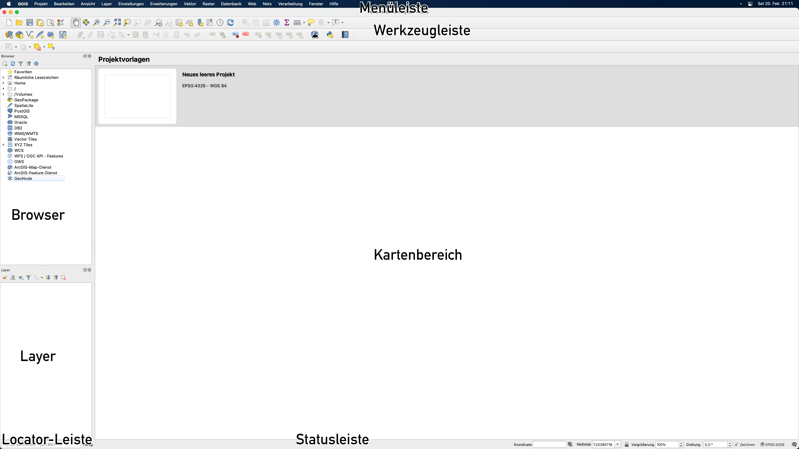
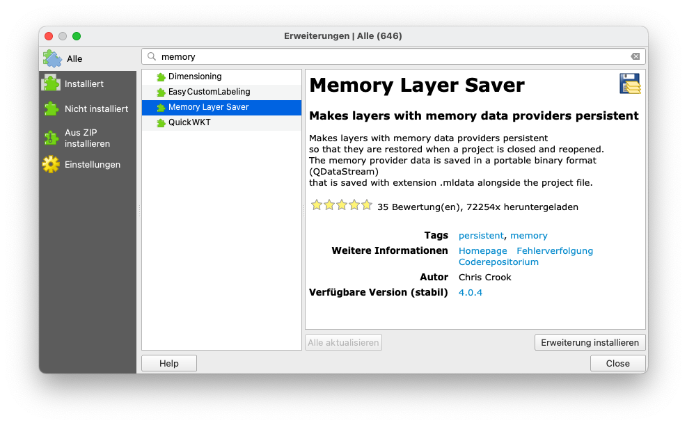
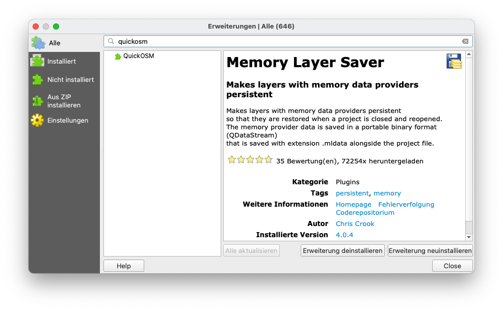
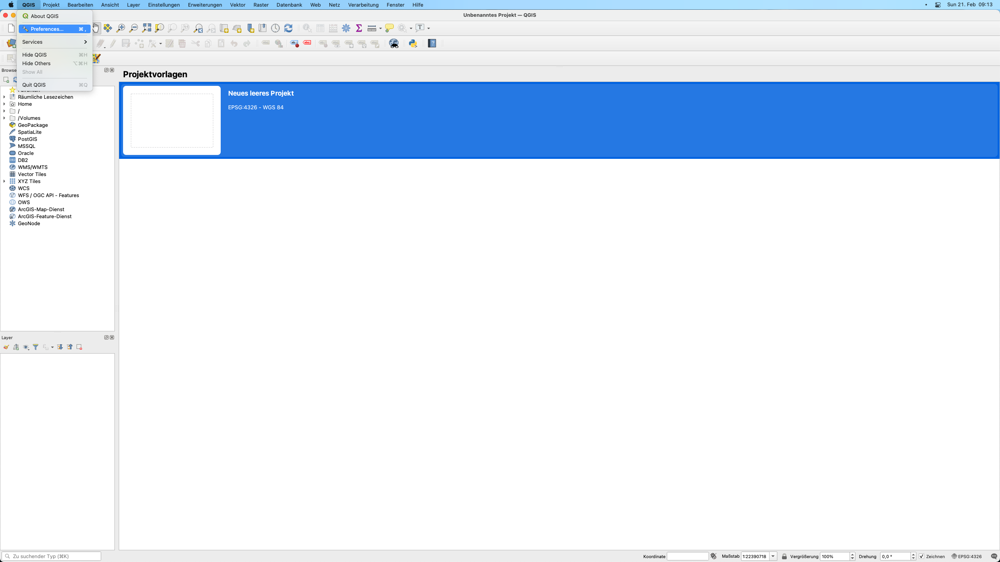
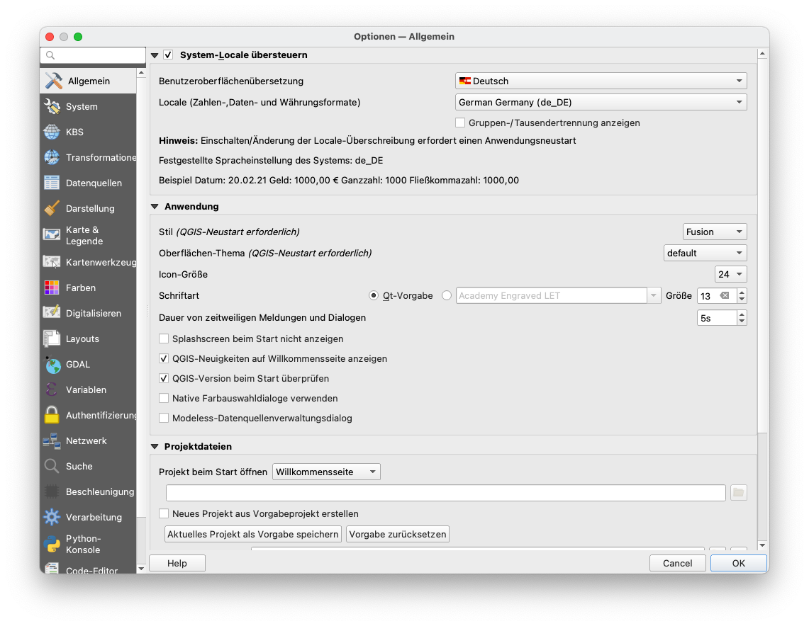

# Modul 1 - Einführung in QGIS

**Autor**: Ben Hur
**Übersetzung**: Knut Hühne

## Pädagogische Einführung

Dieses Modul dient als Einführung in QGIS. Am Ende dieses Moduls sollten die Lernenden vertraut sein mit:

* was QGIS ist
* QGIS-Schnittstelle
* QGIS-Einstellungen
* QGIS-Plugins

Sie sollten außerdem lernen:

* wie man QGIS installiert und öffnet
* die verschiedenen Teile und Funktionen der QGIS-Oberfläche
* wie man das Layout und das Erscheinungsbild der Oberfläche bearbeitet
* die verschiedenen QGIS-Einstellungen, wie man sie ändert und wie sie QGIS beeinflussen
* was Benutzerprofile sind und wie man sie benutzt
* was Plugins sind und wie man sie installiert

Das Modul wird auch einige Feinheiten von QGIS besprechen. Außerdem wird es darum gehen, was QGIS einzigartig macht oder von anderen GIS unterscheidet, wie z.B. QGIS-Dateiformate.

## Technische Voraussetzungen

Die erforderlichen Werkzeuge und Ressourcen für dieses Modul sind:

* Computer
* Internetverbindung
* QGIS 3.16 auf dem Computer installiert ([https://qgis.org/de/site/forusers/download.html](https://qgis.org/de/site/forusers/download.html))

## Voraussetzungen

* Grundkenntnisse in der Bedienung eines Computers

## Zusätzliche Ressourcen

* QGIS Benutzerhandbuch - [https://docs.qgis.org/3.16/de/docs/user_manual/](https://docs.qgis.org/3.16/de/docs/user_manual/)
* QGIS Schulungshandbuch - [https://docs.qgis.org/3.16/de/docs/training_manual/index.html](https://docs.qgis.org/3.16/de/docs/training_manual/index.html)

## Thematische Einführung

Die folgende Karte ([https://flic.kr/p/2jFfGJP](https://flic.kr/p/2jFfGJP)) zeigt Teile der Stadt Bogota in Kolumbien, die im Stil von Vincent van Goghs "Sternennacht" von Andrés Felipe Lancheros Sánchez gestaltet wurde.

Die nächste Karte ([https://flic.kr/p/2jAsphv](https://flic.kr/p/2jAsphv)) zeigt Sturmspurdaten der NOAA zwischen 1851 und 2020, erstellt von Fajr Alim.

Diese nächste ([https://flic.kr/p/FA9TiR](https://flic.kr/p/FA9TiR)) ist eine Karte der Insel Kerguelen von Heinrich Lingnau Schneider.

Diese letzte Karte ([https://flic.kr/p/2kqVzsg](https://flic.kr/p/v2kqVzsg)) zeigt Field-Goal-Versuche und erzielte Punkte pro Versuch während des UAAP Men's Basketball Tournament Season 81 auf den Philippinen von Ben Hur Pintor.

Was haben all diese Karten gemeinsam? Zum einen, dass sie alle mit QGIS erstellt wurden.

## Aufschlüsselung der Konzepte

Die oben gezeigten Karten wurden alle in QGIS ([https://qgis.org/de/site/](https://qgis.org/de/site/)) erstellt, einem freien und quelloffenen Geographischen Informationssystem (GIS). QGIS kann mit allen Arten von räumlichen Daten (wie z. B. den Basketballdaten im letzten Beispiel) verwendet werden, nicht nur mit erdbezogenen Geodaten.

Menschen sind in der Lage, wunderbare und erstaunliche Karten wie die obigen Beispiele zu erstellen, weil QGIS frei und quelloffen ist und über leistungsstarke Datenmanagement-, Analyse- und Präsentationsfunktionen verfügt.

## Hauptinhalt

### Phase 1: Einführung in QGIS und die QGIS-Oberfläche

#### **Was ist QGIS**

**QGIS**, vor der Version 2.X als Quantum GIS bekannt, ist ein ausgereiftes, plattformübergreifendes, freies und quelloffenes Geoinformationssystem (GIS).

Es ist ein unternehmensfähiges GIS, das über Funktionen zum Sammeln, Speichern, Analysieren, Präsentieren und Verwalten von räumlichen und nicht-räumlichen Daten verfügt. Es lässt sich auch gut in andere bestehende Geodaten-Technologien integrieren und dient als integraler Bestandteil eines jeden FOSS4G (Free and Open Source Software for Geospatial) Stacks.

Da QGIS plattformübergreifend ist, läuft es auf GNU/Linux, macOS, Windows und sogar Android.

#### **Release-Zyklus und Versionen**

QGIS-Releases und -Entwicklung folgen einem zeitbasierten Plan ([https://www.qgis.org/de/site/getinvolved/development/roadmap.html](https://www.qgis.org/de/site/getinvolved/development/roadmap.html)).

Eine QGIS-Version wird durch drei Zahlen (X.Y.Z) angegeben. Zum Beispiel: QGIS 3.16.4.

* X bezieht sich auf die Hauptversion. In diesem Fall ist QGIS 3.
* Y bezieht sich auf die Release-Version. In diesem Fall Releaseversion 16. Release-Versionen sind immer gerade Zahlen, da ungerade Zahlen für Entwicklungsversionen reserviert sind.
* Z bezieht sich auf das Point Release (PR) der jeweiligen Version. Für 3.16.4 bedeutet das, dass es das 4. Point Release der Version 3.16 ist.

Es gibt drei Hauptzweige von QGIS, die Benutzer:innen installieren können. Diese sind der **Long Term Release (LTR)**-Zweig, der **Latest Release (LR)**-Zweig und der **Entwicklungszweig (Nightly)**.

* Der **Long Term Release (LTR)**-Zweig heißt so, weil er gewartet wird und Fehlerbehebungen erhält, bis der nächste LTR-Zweig veröffentlicht wird. Das bedeutet derzeit ein  Jahr. Ab Februar 2021 ist das aktuelle LTR 3.16.4. Dieser wird voraussichtlich im Februar 2022 durch QGIS 3.22.4 ersetzt.
* **Latest Release (LR) **bezieht sich auf die Release-Version von QGIS, die die neuesten oder aktuellsten Funktionen enthält. Eine neue LR wird alle vier Monate veröffentlicht. Zum Beispiel wurde im Februar 2021 ein neues 3.18 LR veröffentlicht. Das nächste LR (3.20) wird in 4 Monaten, also im Juni 2021, erscheinen. Derzeit wird jedes 3. LR zum nächsten LTR. Zum Beispiel ist das LTR im Februar 2021 die Version 3.16. Das 3. LR von 3.16 ist 3.22, daher wird der nächste LTR auf der Version 3.22 basieren.
* Die **Entwicklungsversion** basiert auf der aktuellsten Version des QGIS-Quellcodes, ist aber nützlich, wenn Sie testen, debuggen oder bei der Entwicklung von QGIS helfen wollen.

Welche Version sollten Sie also verwenden? Das kommt darauf an. Wenn Sie eine Version benötigen, die über einen längeren Zeitraum gepflegt wird und Sie nicht unbedingt neue Funktionen benötigen, sobald diese veröffentlicht werden, dann könnte die LTR-Version für Sie geeignet sein. Wenn Sie die neuesten Funktionen benötigen und es Ihnen nichts ausmacht, alle paar Monate ein Upgrade durchzuführen, dann ist die LR-Version vielleicht genau das Richtige für Sie. Manchmal ist es auch gut, einen Blick auf die Entwicklungs- oder Nighlyversionen zu werfen, besonders wenn Sie neugierig oder gespannt auf die kommenden Funktionen in QGIS sind.

Für weitere Informationen besuchen Sie bitte: [https://bnhr.xyz/2020/10/26/about-qgis-versions-release-cycle-english.html](https://bnhr.xyz/2020/10/26/about-qgis-versions-release-cycle-english.html) (englischsprachig).

#### **Beispiele von QGIS-Karten in freier Wildbahn**

Abbildung 1.1. QGIS Map-Showcase

Weitere mit QGIS erstellte Karten finden Sie unter: [https://www.flickr.com/groups/2244553@N22/pool/with/50355460063/](https://www.flickr.com/groups/2244553@N22/pool/with/50355460063/)

#### **QGIS installieren**

QGIS ist plattformübergreifend und funktioniert unter Linux, Windows und macOS. Da QGIS quelloffen ist, können Sie es aus dem Quellcode erstellen und installieren, der unter [https://github.com/qgis/QGIS/](https://github.com/qgis/QGIS/) verfügbar ist.

Installationsprogramme und Installationsanweisungen sind auch unter [https://qgis.org/de/site/forusers/download.html](https://qgis.org/de/site/forusers/download.html) oder [https://qgis.org/de/site/forusers/alldownloads.html](https://qgis.org/de/site/forusers/alldownloads.html) verfügbar.

Für **Linux (oder GNU/Linux)** ist QGIS normalerweise über den Paketmanager Ihrer Distribution verfügbar. Für Debian/Ubuntu-Benutzer gibt es QGIS-Repositories für die LR-, LTR- und Entwicklungszweige sowie Versionen von QGIS mit Abhängigkeiten aus dem ubuntugis-unstable-PPA. QGIS ist auch als Flatpak-Paket oder in Conda verfügbar.

Für **Windows** können Benutzer zwischen dem OSGeo4W Network Installer oder den Standalone-Installern wählen. Es gibt jeweils einen Standalone-Installer für die LTR- und LR-Version.

Die Standalone-Installer sind am einfachsten zu installieren und werden für Einsteiger empfohlen. Es können mehrere Versionen von QGIS gleichzeitig auf Ihrem Computer installiert werden. Dies bedeutet, dass Sie sowohl die QGIS 3.16 als auch die 3.18 Version installiert haben können.

Der OSGeo4W Network Installer ist etwas fortgeschrittener und komplexer als die Standalone-Installer, aber er gibt Ihnen auch die Möglichkeit, Ihre QGIS-Version direkt zu aktualisieren und zu erweitern. Das bedeutet, dass Sie eine ältere Version nicht deinstallieren müssen, wenn Sie eine neuere installieren möchten.

In manchen Fällen benötigen Sie Administratorrechte, um QGIS zu installieren. Wenn Sie es also auf einem Computer installieren, auf dem Ihr Benutzer keine Administratorrechte hat, müssen Sie möglicherweise Ihre/n IT- oder Büroadministrator:in bitten, QGIS für Sie zu installieren.

Bei der Installation unter Windows wird QGIS auch mit GRASS (einem anderen Open Source GIS) geliefert.

Beachten Sie, dass QGIS [langsam die 32-Bit-Unterstützung für Windows entfernt](https://blog.qgis.org/2020/10/15/phasing-out-32-bit-support-in-qgis/), so dass es am besten ist, QGIS auf einem Computer zu installieren, auf dem ein 64-Bit-Betriebssystem läuft.

Für **macOS** gibt es offizielle, signierte All-in-One-Installationsprogramme für macOS High Sierra (10.13) und neuer. QGIS ist noch nicht notariell beglaubigt, wie es die Sicherheitsregeln von macOS Catalina (10.15) erfordern. Beim ersten Start klicken Sie bitte mit der rechten Maustaste auf das QGIS-App-Symbol, halten Sie die Optionstaste gedrückt und wählen Sie dann Öffnen.

#### **Teile der QGIS-Oberfläche**

Nachdem Sie QGIS installiert haben, können Sie es wie jedes andere Programm auf Ihrem Computer starten oder öffnen. Nach dem Öffnen von QGIS werden Sie mit der Standard-Benutzeroberfläche (UI) begrüßt, die etwa wie folgt aussieht.

Abbildung 1.2. Die QGIS-Oberfläche bei einer Neuinstallation

Es gibt sechs Hauptbestandteile der QGIS-Benutzeroberfläche - die Menüleiste, die Kartenansicht, die Werkzeugleisten, die Fenster, die Statusleiste und der Locator.

In der Mitte der Benutzeroberfläche befindet sich ein Kartenbildschirm. Panels und Toolbars können um diesen Canvas herum positioniert werden. Bedienfelder können auch aneinander angedockt werden, um ein Bedienfeld mit mehreren Registerkarten zu erstellen. Es gibt auch andere Teile der Benutzeroberfläche, wie die Python-Schnittstelle, Plugin-Fenster, usw.

**Menüleiste** - die Menüleiste ist ein einfaches hierarchisches Menü, das Zugriff auf die Funktionen und Befehle von QGIS bietet. Sie befindet sich normalerweise am oberen Rand der Benutzeroberfläche.

**Kartenansicht** - die Kartenansicht ist der Bereich, in dem die in QGIS geladenen Layer angezeigt werden. Hier werden auch die erstellten Filter, Auswahlen und Symbologien angezeigt. Es kann mehr als eine Kartenansicht zu jeder Zeit vorhanden sein. Ein:e Benutzer:in kann die Kartenansicht zoomen, verschieben und sogar drehen. Eine Kartenansicht kann auch 3D-Daten anzeigen.

**Werkzeugleisten** - Werkzeugleisten zeigen Schaltflächen zum Anklicken und Ausführen. Sie ermöglichen den einfachen Zugriff auf QGIS-Befehle, Funktionen, Plugins usw. Sie können auf die Kartenansicht verschoben und angedockt werden. Die Liste der Werkzeugleisten können Sie in der Menüleiste unter **Ansicht ‣ Werkzeugkästen** finden, aktivieren und deaktivieren. Beispiele für Werkzeugleisten sind die "Attributwerkzeugleise" und die Symbolleiste "Digitalisierungswerkzeugleiste".

**Bedienfelder** - Bedienfelder sind ähnlich wie Werkzeugleisten, aber anstelle von Schaltflächen bieten sie eine Schnittstelle zu komplexeren Funktionen und Features. Das Ebenen-Panel und das Browser-Panel sind Beispiele dafür. Ähnlich wie Werkzeugleisten können sie auf der Kartenansicht verschoben und angedockt werden. Die Liste der Bedienfelder können Sie in der Menüleiste unter **Ansicht ‣ Bedienfelder** finden, aktivieren und deaktivieren.

**Statusleiste** - die Statusleiste befindet sich in der Regel am unteren Rand der Benutzeroberfläche und zeigt relevante Informationen wie CRS, Maßstab, Benachrichtigungen usw. an.

**Locator-Leiste** - die Locator-Leiste befindet sich in der unteren linken Ecke der QGIS-Oberfläche. Sie ermöglicht dem/der Benutzer:in den einfachen Zugriff auf Layer, Felder, Verarbeitungsalgorithmen und andere Dinge in QGIS. Sie ist eine der mächtigsten Funktionen von QGIS.

Abbildung 1.3. Teile der QGIS-Oberfläche

Einer der Vorteile von QGIS ist die Anpassungsfähigkeit, die es seinen Benutzern bietet. Diese Anpassungsfähigkeit beginnt mit der Benutzeroberfläche. Indem man einige Einstellungen bearbeitet und einige Teile der Oberfläche verschiebt, kann man ein QGIS haben, das so aussieht:

Abbildung 1.4. Die QGIS-Oberfläche mit einigen Anpassungen

#### **Tutorial/Übung 1: Ändern des Aussehens und Layouts der QGIS-Oberfläche**

1. Öffnen Sie **QGIS**.
2. Klicken Sie auf das Menü **Ansicht**.

3. Werfen Sie einen Blick auf das Menü **Bedienfelder**

4. Werfen Sie einen Blick auf das Menü **Werkzeugkästen**

5. Wählen Sie die **Werkzeugkästen** und **Bedienfelder** aus, die in der Benutzeroberfläche angezeigt werden sollen. Einige der nützlichen Bedienfelder sind das **Layergestaltung** und die **Layer**.
6. Verschieben Sie die **Werkzeugkästen** und **Bedienfelder** an die Positionen, die für Sie am sinnvollsten sind

**Zurücksetzen der QGIS-Oberfläche**

Um die QGIS-Oberfläche zurückzusetzen, gehen Sie in die globalen QGIS-Einstellungen und wählen Sie dann **: System ‣ Einstellungen ‣ Benutzeroberfläche zurücksetzen**. Nach einem Neustart ist die Oberfläche wieder im Ausgangszustand.

#### **Quizfragen**

1. Richtig oder Falsch:
    1. Sie können mehrere Kartenansichten haben - ***Richtig***
    2. Sie können Bedienfelder und Werkzeugleisten ein- und ausblenden -- ***Richtig***
    3. Sie können Panels nur auf der linken oder rechten Seite des Map Canvas platzieren -- ***Falsch (Sie können Panels auch oberhalb oder unterhalb der Kartenansicht platzieren)***

### Phase 2 Titel: QGIS Erweiterungen

Die Möglichkeit, Funktionalitäten von QGIS über Erweiterungen hinzuzufügen, zu erstellen und zu erweitern, ist eines seiner mächtigsten Features.

Ab QGIS 3.16.3 gibt es mehr als 700 Erweiterungen, die der Benutzer:innen herunterladen und verbessern können. Diese Erweiterungen reichen in ihrer Funktion von komplex bis hin zu alltäglich.

QGIS-Erweiterungen können klassifiziert werden als:

* **Kern-Erweiterungen** - integriert in Ihre Version von QGIS, können nicht deinstalliert werden
* **Externe Erweiterungen** - manuell installiert durch Laden aus einem externen Verzeichnis (z.B. QGIS Official Plugin Repository) oder über den Quellcode.

Erweiterungen können auf drei Arten installiert werden:

1. Über den Dialog zum Verwalten und Installieren von Erweiterungen (**Erweiterungen ‣ Erweiterungen verwalten und installieren**)
2. Über die Installation aus einer ZIP-Datei, die im Dialog "Erweiterungen verwalten und installieren" unter der Registerkarte **Aus ZIP installieren** aufgerufen werden kann.
3. Manuelles Hinzufügen des Quellcodes in den Plugins-Ordner Ihres QGIS-Profils. Diesen Ordner finden Sie normalerweise unter:
    1. **Linux**: .local/share/QGIS/QGIS3/profiles/default/python/plugins
    2. **Mac OS X**: Bibliothek/Application Support/QGIS/QGIS3/profiles/default/python/plugins
    3. **Windows: **C:\\Benutzer<Benutzer>\AppData\Roaming\QGIS\QGIS3\profiles\default\python\plugins

Figure 1.5. Das "Erweiterungen verwalten und installieren" Menu

**Erweiterungen verwalten und installieren**

Der Dialog "Erweiterungen verwalten und installieren" verbindet sich mit dem offiziellen QGIS Plugin-Repository (oder einem anderen Repository, das Sie im Reiter "Einstellungen" angeben), um die für Ihre Version von QGIS verfügbaren Erweiterungen zu holen. Er hat fünf Registerkarten:
* **Alle **- zeigt ALLE für Ihre QGIS-Version verfügbaren Erweiterungen an, einschließlich derer, die bereits auf Ihrem Rechner installiert sind
* **Installiert **- zeigt nur die auf Ihrem Rechner installierten Erweiterungen
* **Nicht installiert**- zeigt die Erweiterungen an, die nicht auf Ihrem Rechner installiert sind
* **Aus ZIP installieren** - ermöglicht die Installation von Erweiterungen aus einer ZIP-Datei
* **Einstellungen** - gibt Ihnen Optionen, wann nach Plugin-Updates gesucht werden soll, ob experimentelle und veraltete Plugins einbezogen werden sollen oder nicht, oder ob das Repository, aus dem Erweiterungen geholt werden sollen, hinzugefügt/geändert werden soll

Wenn die gesuchte Erweiterung als experimentell oder veraltet gekennzeichnet ist, müssen Sie die Optionen **Auch experimentelle Erweiterungen anzeigen** und **Auch veraltete Erweiterungen anzeigen** auf der Registerkarte "Einstellungen" aktivieren.

Mit der **Suchleiste** können Sie nach Erweiterungen suchen, die sich in dem/den Plugin-Repository(s) befinden, mit denen Sie verbunden sind.

Abbildung 1.6. Der Dialog Erweiterungen verwalten und installieren

#### **Tutorial/Übung 2: Installieren eines QGIS-Plugins**

1. Öffnen Sie den Dialog **Erweiterungen verwalten und installieren** über **Erweiterungen ‣ Erweiterungen verwalten und installieren** in der Menüleiste. Dadurch wird der Dialog Erweiterungen verwalten und installieren geöffnet.

2. Installieren Sie die folgenden Erweiterungen, indem Sie sie auf der Registerkarte **Alle** suchen und unten rechts im Dialog "Erweiterungen verwalten und installieren" auf **Erweiterung installieren** klicken.
   - Memory Layer Saver

   - QuickOSM

3. Prüfen Sie, ob die Erweiterungen erfolgreich installiert wurden. Das Memory Layer Saver-Plugin sollte unter **Erweiterungen ‣ Memory Layer Saver** in der Menüleiste verfügbar sein, während das QuickOSM-Plugin unter **Vector ‣ QuickOSM** in der Menüleiste verfügbar sein sollte.

#### **Quizfragen**

1. Richtig oder Falsch
    1. Sie können Erweiterungen des QGIS-Kerns entfernen oder deinstallieren -- ***Falsch***
    2. Sie können Erweiterungen hinzufügen, die sich nicht im offiziellen QGIS Plugin Repository befinden -- ***Richtig***

### Phase 3: QGIS-Einstellungen

**System- und Projekteinstellungen**

Mit den QGIS Einstellungen können Sie verschiedene Dinge in QGIS bearbeiten und verwalten, wie z.B. Benutzerprofile, Stile, Koordinatenreferenzsysteme, Tastaturkürzel, die Benutzeroberfläche, Standardfarben, etc. Systemeinstellungen finden Sie im **Einstellungen** Menü. Hierbei handelt es sich um die von QGIS verwendeten Standardeinstellungen, sofern sie nicht durch Projekteinstellungen überschrieben werden. Projekteinstellungen finden Sie unter **Projekt ‣ Eigenschaften** und beziehen sich auf Einstellungen oder Eigenschaften für das aktuelle Projekt. Diese Werte überschreiben die Systemvorgaben.

Abbildung 1.7. Die Systemeinstellungen

Abb. 1.8. Die Projekteinstellungen

**Ändern des QGIS-Oberflächen-Themas**

Sie können das Aussehen von QGIS unter **Einstellungen ‣ Optionen ‣ Allgemein** ändern.

Sie können zwischen drei Themen wählen - Standard, Blend of Gray und Night Mapping. Sie können auch die Größe der Icons, die von QGIS verwendete Schriftart und andere Systemvorgaben ändern.

Abbildung 1.9. Allgemeine Einstellungen von QGIS

Für einige Einstellungen in QGIS müssen Sie möglicherweise die Anwendung neu starten, damit sie wirksam werden.

**Benutzerprofile**

Mit QGIS 3.X wurde das Konzept der QGIS-Benutzerprofile eingeführt.

Ein Benutzerprofil ist eine Sammlung von Einstellungen für installierte Erweiterungen, aktivierte Symbolleisten, Anordnung der Benutzeroberfläche und andere Einstellungen. QGIS wird mit einem Standard-Benutzerprofil namens default ausgeliefert. Benutzerprofile ermöglichen es dem Benutzer, unterschiedliche Einstellungen für bestimmte Analysen (z.B. ein Benutzerprofil speziell für Wasserwirtschaft, Digitalisierung von Daten, Kartographie usw.), bestimmte Projekte oder sogar Kunden zu erstellen.

Benutzerprofile können über die Menüleiste erstellt und aufgerufen werden unter: **Einstellungen ‣ Benutzerprofile**.

Das aktive Benutzerprofil wird mit [Benutzerprofil] in der Titelleiste angezeigt.

Abbildung 1.10. Zugriff auf Benutzerprofile

Benutzerprofile werden in einem Verzeichnis auf Ihrem Computer gespeichert, auf das Sie über **Einstellungen ‣ Benutzerprofile ‣ Aktuelles Profilverzeichnis öffnen** zugreifen können.

#### **Tutorial/Übung 03: Benutzerprofil erstellen**

1. Gehen Sie auf **Einstellungen ‣ Benutzerprofile ‣ Neues Profil...**.

2. Geben Sie Ihrem neuen Benutzerprofil einen Namen.

3. Es sollte sich ein neues QGIS-Fenster mit Ihrem neuen Benutzerprofil öffnen. Beachten Sie, dass Ihr Profilname in der QGIS-Titelleiste angezeigt wird.

4. Fällt Ihnen ein Unterschied im neuen Benutzerprofil auf? Überprüfen Sie die Benutzeroberfläche, Erweiterungen und Einstellungen des alten Profils und des neuen Profils, das Sie erstellt haben.

#### **Quizfragen**

1. Richtig oder Falsch
    1. Sie können nur ein Benutzerprofil in QGIS haben. -- ***Falsch (Sie können mehrere Benutzerprofile haben)***
    2. Sie können die Systemeinstellungen und -eigenschaften nicht überschreiben. -- ***Falsch***

### Phase 4 (Bonus): QGIS Dateiformate

#### **QGIS-Projektdatei (QGS/QGZ)**

QGIS-Projekte sind für QGIS das, was .mxd-Dateien für ArcMap sind. Diese Dateien liegen entweder als **QGS (*.qgs)** oder **QGZ (*.qgz)** vor. Der Hauptunterschied zwischen den beiden Formaten ist, dass das QGZ-Format ein komprimiertes (Zip-)Archiv ist, das eine QGS-Datei und eine QGD-Datei enthält. Das QGS-Format ist ein XML-Format zum Speichern von QGIS-Projekten. Die QGD-Datei ist die zugehörige sqlite-Datenbank des qgis-Projekts, die Hilfsdaten für das Projekt enthält. Wenn keine Hilfsdaten vorhanden sind, ist die QGD-Datei leer.

Eine QGIS-Projektdatei enthält alles, was zum Speichern eines QGIS-Projekts benötigt wird, einschließlich

* Projekttitel
* Projekt-CRS
* den Layer-Baum
* Snapping-Einstellungen
* Beziehungen
* die Ausdehnung des Kartenbereichs
* Projektmodelle 
* Legende
* Kartenansicht-Docks (2D und 3D)
* die Ebenen mit Verknüpfungen zu den zugrundeliegenden Datensätzen (Datenquellen) und anderen Ebeneneigenschaften wie Ausdehnung, SRS, Verknüpfungen, Stile, Renderer, Mischmodus, Deckkraft und mehr.
* Projekteigenschaften
                                                                                                                                                                             QGIS-Projektdateien können in einem GeoPackage oder einer PostGIS-Datenbank gespeichert werden. Das Speichern der Projektdatei zusammen mit der Stildatei und den zugehörigen Layern in einem einzigen GeoPackage erleichtert die gemeinsame Nutzung von QGIS-Projekten.

#### **QGIS-Layer-Definition (QLR)**

Eine QGIS Layer Definition Datei (**QLR**) ist eine XML-Datei, die neben den QGIS-Stilinformationen für den Layer auch einen Zeiger auf die Datenquelle des Layers enthält. Derzeit entspricht eine QLR-Datei nur einem einzelnen Layer.

Der Anwendungsfall für diese Datei ist einfach: Eine einzige Datei zu haben, um eine Datenquelle zu öffnen und alle zugehörigen Stilinformationen einzubringen. QLR-Dateien ermöglichen auch das Maskieren der zugrundeliegenden Datenquelle in einer einfach zu öffnenden Datei.

Ein Beispiel für die Verwendung von QLR ist das Öffnen eines Layers aus einer PostGIS-Datenbank. Anstatt sich mit der Datenbank zu verbinden, den Layer zu suchen und einen Filter anzuwenden, können Sie einfach eine .qlr-Datei öffnen, die auf den richtigen PostGIS-Layer mit dem entsprechenden Stil und Filter verweist.

#### **QGIS-Stil-Datei (QML)**

**QML** ist ein XML-Format zum Speichern von Layer-Styling. Eine QML-Datei (.qml) enthält alle Informationen, die QGIS mitteilen, wie Feature-Geometrien gerendert werden sollen, einschließlich Symboldefinitionen, Größen und Drehungen, Beschriftung, Deckkraft, Mischmodus und mehr.

Eine .qml-Datei sollte den gleichen Namen haben wie die Datenquelle, der sie entspricht. Wenn sie im gleichen Verzeichnis oder Ordner wie die Datenquelle gefunden wird, wird beim Laden der Datenquelle auch automatisch ihr Stil geladen, wie er in der .qml-Datei definiert ist.

Wenn Sie z.B. ein GeoJSON mit dem Namen regions.geojson und eine QML-Datei mit dem Namen regions.qml haben, wird das Laden von regions.geojson in QGIS die in regions.qml definierten Stile auf den geladenen Layer anwenden.

Bei der Verwendung von GeoPackages (.gpkg) wird eine .qml-Datei oft nicht benötigt, da Sie den Stil eines Layers direkt im Geopackage speichern können.

### Wenn Sie Lust auf mehr haben:

Sie können versuchen, ein eigenes QGIS-Plugin zu erstellen.  Wenn es kein Plugin gibt, das das tut, was Sie wollen, dann können Sie immer noch selbst eines erstellen.

Der **Plugin Builder** ist ein Plugin, das eine Vorlage erstellt, die als Startpunkt für die Entwicklung von QGIS-Plugins dienen kann, so dass Sie nicht von Grund auf eines erstellen müssen. Sie können es über den Dialog "Erweiterungen verwalten und installieren" installieren.

Natürlich können Sie jederzeit ein Plugin von Grund auf neu erstellen. Wenn Sie daran interessiert sind, ein eigenes Plugin zu erstellen, können Sie in der offiziellen QGIS-Dokumentation nachsehen ([https://documentation.qgis.org/](https://documentation.qgis.org/)). Für Python-Plugins ist es eine gute Idee, sich das PyQGIS Developer Cookbook ([https://docs.qgis.org/3.16/de/docs/pyqgis_developer_cookbook/](https://docs.qgis.org/3.16/de/docs/pyqgis_developer_cookbook/)) anzuschauen.

Weitere Informationen finden Sie auch auf [https://bnhr.xyz/2018/10/08/qgis-plugins-3.0.html](https://bnhr.xyz/2018/10/08/qgis-plugins-3.0.html) (englischsprachig).

### Um Ihre neuen Fähigkeiten zu testen, versuchen Sie,...

* Das Thema und das Aussehen der QGIS Benutzeroberfläche nach Ihren Wünschen zu ändern
* QGIS-Plugins zu installieren
* andere QGIS-Einstellungen zu ändern.
    * ein benutzerdefiniertes Koordinatenreferenzsystem zu erstellen
    * einen benutzerdefinierten Splash-Screen hinzufügen ([https://bnhr.xyz/2020/09/05/custom-splash-screen-qgis.html](https://bnhr.xyz/2020/09/05/custom-splash-screen-qgis.html)) (englischsprachig)

### Tipps

N/A
