# Modul 10 - QGIS-Erweiterungen / -Plugins

**Autor**: Codrina

## Pädagogische Einführung

In diesem Modul werden einige der interessantesten und hoffentlich nützlichen Erweiterungen vorgestellt, die von der internationalen QGIS-Gemeinschaft entwickelt und für jedermann zur Verfügung gestellt wurden. Wir werden dabei den Begriff Plugin und Erweiterung austauschbar benutzen - Die deutsche QGIS-Oberfläche nutzt hauptsächlich den Begriff Erweiterungen, da viele der Erweiterungen aber nicht lokalisiert sind, tauchen sie häufig auch unter dem internationalen Namen - Plugins - auf.
Am Ende des Moduls sollten Sie wissen:

* Wie man ein neues Plugin sucht und installiert
* Wie man zwischen den verschiedenen Plugin-Repositories wechselt 
* Wie man eine Plugin-Dokumentation liest und worauf man achten muss.

## Erforderliche Tools und Ressourcen

* Dieses Modul wurde mit [QGIS Version 3.16.1 - Hannover](https://qgis.org/en/site/forusers/download.html) erstellt.

## Voraussetzungen: 

* Grundkenntnisse in der Bedienung eines Computers
* Ein solides Verständnis aller Module, da die Plugins, die wir vorstellen werden, sich auf verschiedene Begriffe/Elemente beziehen, die Sie im Laufe dieses Curriculums kennengelernt haben, wie z.B. Vektoren, Raster, Attributtabellen und viele andere. 

## Hauptinhalt 

### Teil 1: Einführung in den Plugin-Gedanken

Einer der vielen Vorteile der Open-Source-Gemeinschaft - sowohl für Entwickler:innen als auch für Anwender:innen - ist die unglaubliche Geschwindigkeit, mit der Entwicklungen und Verbesserungen stattfinden, die Art und Weise, wie neue Ideen aufkommen und dann in die Praxis umgesetzt werden. 

Wie Sie in Modul 1 gesehen haben, ist QGIS mit einer "Plugin"-Architektur konzipiert, die es erlaubt, es durch Hinzufügen externer Plugins leicht an die eigenen Bedürfnisse anzupassen. In QGIS Unterscheidet man zwischen **Kern-** und **externen Plugins**. Die Kern-Plugins - wie der Name schon sagt - bilden die Hauptstruktur, sie werden vom QGIS-Entwicklungsteam gewartet und sind immer in der Installation enthalten. Beispiele sind die  wie z.B. das Processing-Kern-Plugin, die Zonale Statistik oder der Plugin-Manager. Im Laufe der Zeit sind verschiedene externe Plugins aufgrund ihrer Relevanz in Richtung des Kerns gewandert. 

Natürlich kann man angesichts der Open-Source-Prinzipien, gepaart mit den großartigen und sehr detaillierten Dokumentationen, die zur Verfügung stehen, und den vielen Kommunikationskanälen und speziellen Veranstaltungen lernen, wie man ein Plugin baut, das den eigenen Anforderungen entspricht. Und das ist ein **externes Plugin**. Auf der dedizierten [Webseite](https://plugins.qgis.org/) finden Sie die gesamte notwendige Dokumentation. Die meisten externen Plugins sind in Python geschrieben, aber sie können auch in C++ geschrieben werden. 

In dieser ersten Phase werden wir uns mit der Einrichtung von QGIS-Plugins beschäftigen - wie man nach einem Plugin sucht, um eine bestimmte Anforderung zu lösen, die man vielleicht hat, wie man dessen Dokumentation interpretiert und wie man dem Entwicklungsteam meldet, wenn man auf ein Problem gestoßen ist. 

### Die Erweiterungsverwaltung

QGIS bietet ein Kern-Plugin, mit dem externe Plugins verwaltet, installiert, aktualisiert und deinstalliert werden können. Die Funktionalität ist intuitiv und bietet vollen Zugriff auf das offizielle öffentliche Plugin-Repository. 

Es muss betont werden, dass die externen Plugins - seien sie offiziell oder experimentell - die Arbeit einzelner Entwickler:innen oder Organisationen sind und die QGIS-Organisation keine Verantwortung für sie übernimmt. Davon abgesehen gibt es einige Regeln, die Entwickler:innen, die ihre Arbeit über das offizielle Repository zur Verfügung stellen wollen, einhalten müssen, sowie eine Reihe von Empfehlungen für eine schnelle Akzeptanz. Zu den Anforderungen gehören Elemente wie eine kompatible Lizenz, minimale Dokumentation, klare Identifizierung von Abhängigkeiten und andere. Zu den Empfehlungen gehört die Überprüfung, ob das Plugin keine bestehende Funktionalität dupliziert, eine gute Struktur des Quellcode-Repositorys, Kompatibilität mit allen Plattformen (Windows, Linux, macOS) und viele andere.  

Experimentelle Plugins - die im Plugin-Manager als solche gekennzeichnet sind - sind Plugins, die sich in einem frühen Entwicklungsstadium befinden, also nicht für den operativen Einsatz geeignet sind. Sie gelten als "Proof of Concept"-Tests und es wird nicht empfohlen, sie zu installieren, es sei denn, man möchte sie zu Testzwecken verwenden. 

Um die experimentellen Plugins zu sehen, muss dies Funktionalität explizit eingeschaltet werden. Dies können Sie tun, indem Sie in den Einstellungen des Plugin-Managers die Option `Auch experimentelle Erweiterungen anzeigen` auswählen (Abbildung 10.2a). Es gibt auch die Möglichkeit, die veralteten Plugins aufzulisten. Diese werden nicht empfohlen, da sie nicht mehr gepflegt werden. 

Die beiden Typen werden im Plugin-Manager gut unterschieden (siehe Abbildungen 10.1 und 10.2b). 

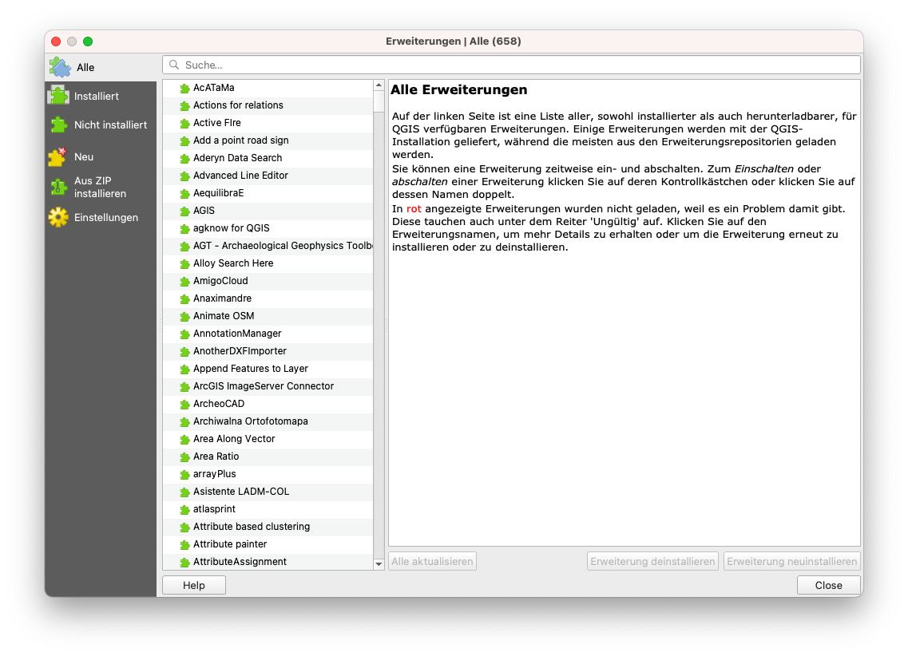

Abbildung 10.1 - Alle Erweiterungen

Abbildung 10.2a - Anzeige experimenteller Plugins

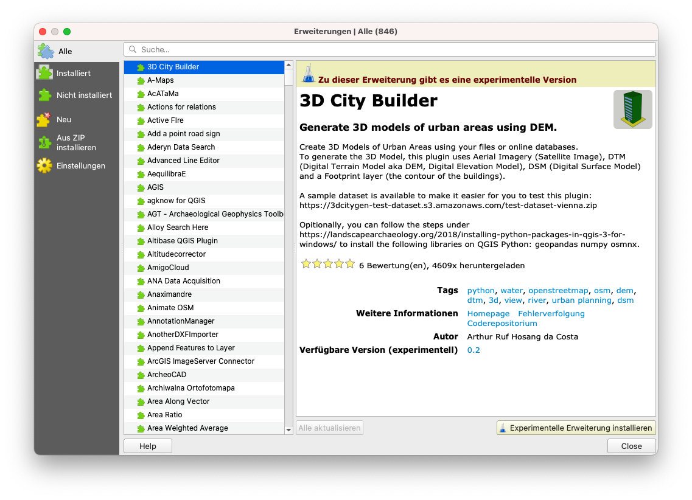

Abbildung 10.2b - Eine Erweiterung mit experimenteller Version

Ein weiterer erwähnenswerter Aspekt ist, dass die Erweiterungsverwaltung eine recht vielseitige Funktionalität hat, die es Entwickler:innen erlaubt, ihre privaten Repositories hinzuzufügen (siehe Abbildung 10.3). 

Abbildung 10.3 - Hinzufügen eines privaten Plugin-Repositorys zu QGIS

Das ist nützlich, wenn z.B. innerhalb Ihrer Organisation ein Bedarf an weiteren Erweiterungen besteht, die aber nicht den Anforderungen von QGIS für das öffentliche Hosting in ihrem offiziellen Repository entsprechen.  Eine nützliche Ressource, wie Sie Ihr eigenes Plugin-Repository einrichten können, finden Sie auf [GIS OPS (englischsprachig)](https://gis-ops.com/qgis-3-plugin-tutorial-set-up-a-plugin-repository-explained/). 

Die einfachere Methode besteht darin, ein Zip-Paket vorzubereiten, das eine Erweiterung enthält und das auf herkömmliche Weise weitergegeben werden kann. Diese Methode ist jedoch nicht zu empfehlen. 

Nachdem Sie entschieden haben, welche Arten von Erweiterungen in Ihrem Manager aufgelistet werden sollen, können Sie auf die Registerkarte `Alle` wechseln und genauer betrachten, wie eine Erweiterung im Plugin Manager erscheint. Suchen Sie zu Demonstrationszwecken das Plugin `Cartographic Line Generalization`.  

Abbildung 10.4 - Suche nach einer bestimmten Erweiterung im Plugin-Manager

Wie Sie sehen können, befindet sich auf der rechten Seite ein Fenster, das eine Reihe von Informationen anzeigt. Diese Informationen folgen für alle Erweiterungen dem gleichen Schema:

1. Name der Erweiterung und Untertitel
2. Abschnitt "Beschreibung" - je nach Erweiterung kann dieser Abschnitt mehr oder weniger detailliert sein
3. Die Anzahl der Downloads und wie viele Sterne die Erweiterung von der Community erhalten hat
4. Eine Reihe an Tags, die die Erweiterung kategorisieren
5. Eine Reihe von wichtigen Links: die Webseite der Erweiterung, der **Bug-Tracker** und das Coderepositorium
6. Der Name des/der Entwickler:in, sowie der angeschlossenen Organisation. Manchmal wird auch der Name des Projekts, in dem die Erweiterung entwickelt wurde, aufgeführt
7. Die Versionsnummer mit dem Hinweis _stabil_ oder _experimentell_, je nach Fall 
8. Das Logo der Erweiterung

Über den Button `Erweiterung installieren` können Sie die Erweiterung hinzufügen. Sie taucht dann meist als neuer Button in der QGIS-Oberfläche auf. 

Aus Platzgründen ist die Beschreibung im Plugin-Manager meist recht kurz. Mehr Details zur Funktionalität des Plugins findet man üblicherweise auf der verlinkten Homepage. In unserem Fall stellen wir fest, dass die Homepage mit dem Coderepositorium identisch ist - auf Github, aber das ist nicht immer der Fall (siehe Abbildung 10.6). 

Abbildung 10.6a - Homepage des ausgewählten Plugins

Abbildung 10.6b - Detaillierte Metadaten auf der Plugin-Homepage

Ein weiterer sehr wichtiger Aspekt, der bei der Dokumentation eines Plugins hervorzuheben ist, ist die Web-Anzeige des **Bug-Trackers** bzw der **Fehlerverfolgung**. Ein Bug-Tracker-System ist eine Software-Anwendung, die alle gemeldeten Software-Probleme (_Bugs_) aufzeichnet. In unserem Fall wird der Bug Tracker durch das dedizierte Coderepositorium Github unterstützt (siehe Abbildung 10.7).

Figure 10.7 - Bug tracking system in Github for a QGIS plugin

Es würde den Rahmen dieses Moduls sprengen, im Detail darauf einzugehen, wie man ein Software-Problem auf Github meldet, aber es ist wichtig, ein paar Aspekte hervorzuheben. Erstens funktioniert das Open-Source-Ökosystem - sei es für Geodaten oder nicht - am besten, wenn alle Beteiligten ihren Teil aktiv beitragen, d.h. Entwickler:innen programmieren und Benutzer:innen testen und melden identifizierte Probleme zurück. Wenn man einen Blick auf die  Bug-Tracker für [QGIS](https://github.com/qgis/QGIS/issues) oder [GRASS](https://github.com/OSGeo/grass/issues) oder andere Open-Source-Lösungen wirft, wird man intensive Aktivität feststellen. Und das ist gut so, zeigt es doch, dass die Community lebendig ist, dass die Interaktion zwischen Entwickler:innen und Anwender:innen normal funktioniert. Um den Entwicklungsteams Arbeit abzunehmen, gehört es zum guten Ton, dass Sie - bevor sie einen neuen Bug melden - erst die bestehenden Bugs durchsuchen, um Duplikate zu vermeiden.

#### **Quizfragen**

1. Benötigen Sie den vollständigen Namen der Erweiterung, um sie in der Erweiterungsverwaltung zu finden? 
    * _Nein, ein Stichwort reicht aus_
    * Ja
2. Sind sowohl die offiziellen als auch die experimentellen Erweiterungen im gleichen Repository verfügbar?
    * _Ja, sofern die Option 'Auch experimentelle Erweiterungen anzeigen' im Plugin-Manager ausgewählt ist._
    * Nein, für experimentelle gibt es andere Repositories. 
3. Nennen Sie 2 oder 3 Informationen, die in der Dokumentation einer Erweiterung zu finden sind: 
    * Titel & Beschreibung, Anzahl der Downloads, Homepage, Links zum Code-Repository, Name des/der Entwickler:in, eine Kurzbeschreibung

### Teil 2: Einige nützliche QGIS-Erweiterungen **

Erweiterungen können auf unterschiedliche Arten klassifiziert werden. Im Folgenden identifizieren wir zwei Möglichkeiten:

* Nach dem Stand der Entwicklung: 
    * Offiziell - die Erweiterung wird als stabil angesehen, ist gut dokumentiert und kann in einem professionellen Kontext verwendet werden
    * Experimentell - die Erweiterung befindet sich in einem frühen Entwicklungsstadium, sie wird nur zu Testzwecken empfohlen
    * Veraltet - die Erweiterung wird nicht mehr weiterentwickelt, d.h. sie wird nicht mehr auf neue Versionen aktualisiert, das Entwicklungsteam antwortet möglicherweise nicht mehr auf Fehlerberichte. Diese Erweiterungen sollten nur verwendet werden, wenn es keine andere Möglichkeit gibt, das Problem zu lösen.
* Nach Kategorie-Typ: 
    * Vektor
    * Raster
    * Web
    * Datenbank
    * Kartographie

Einige externe Erweiterungen erlauben den Zugriff durch QGIS auf externe Datenbanken, Cloudspeicher und Dienste. In diesem Fall kann es zu zusätzlichen Voraussetzungen kommen - z.B. ein bezahltes Konto für den externen Dienst oder den Cloudspeicher oder ein API-Schlüssel. Ein Beispiel zur Veranschaulichung ist die Erweiterung Planet Explorer von Planet Inc. (siehe Abbildung 10.8).

Abbildung 10.8 - Beispiel für eine Erweiterung, die ein externes Abonnement benötigt, damit sie in QGIS in vollem Umfang funktioniert

Obwohl in der Beschreibung kein Hinweis darauf zu finden ist, offenbart ein Blick auf die Homepage der Erweiterung die Voraussetzungen, damit sie funktioniert: "Planet subscription or trial for accessing and downloading Planet imagery. Don't have a subscription? Contact our [team](https://www.planet.com/contact/) to learn more"

In den folgenden Abschnitten werden wir einige Erweiterungen, die unserer Meinung nach nützlich sein könnten, identifizieren und mit kurzen Beispielen versehen. Dies ist natürlich nur eine kurze Liste aus dem umfangreichen Universum der Erweiterungen, zögern Sie nicht, darüber hinaus zu gehen. 

#### **Discoverz**

Abbildung 10.9a - Die Erweiterung "Discovery"

Discovery ist eine sehr nützliche Erweiterung, mit der Sie in den Attributen Ihrer Vektordaten nach Text suchen können. Die Erweiterung verbindet sich entweder mit einer PostgreSQL/PostGIS-Datenbank, MS SQL Server oder einem Geopackage und sucht nach Text in den angegebenen Spalten.

Um es zu testen, werden wir eine Geopackage-Datei verwenden, die vom Humanitarian Data Exchange vorbereitet wurde und zum [Download](https://data.humdata.org/dataset/hotosm_phl_north_populated_places) zur Verfügung steht. Es handelt sich um eine Vektordatei, die die besiedelten Orte von den Philippinen enthält, zusammen mit Namen und Anzahl der Menschen. Die Rohdaten wurden von OpenStreetMap heruntergeladen. 

Nachdem Sie die Erweiterungsverwaltung benutzt haben, um Discovery zu installieren, sollte eine neue Symbolleiste in Ihrem QGIS sichtbar sein. Lassen Sie uns die Parameter einrichten: Datenquellentyp: Geopackage, Name: Philippines, wählen Sie die Datei entsprechend aus und der Layer wird Populated Places sein, die Suchspalte: name. Wir werden auch zusätzliche Informationen anfordern, die in der Suchleiste angezeigt werden sollen: is_in und population. Dadurch werden wir in der Lage sein, mehrere Dörfer mit demselben Namen zu unterscheiden, wenn diese in unterschiedlichen Provinzen liegen Ihr Discovery-Setup sollte wie in Abbildung 10.9b aussehen. 

Abbildung 10.9b - Einstellen der Erweiterung "Discovery"

Klicken Sie auf OK und lassen Sie uns in der Suchleiste nach "San Roque" suchen (siehe Abbildung 10.9c). 

Abbildung 10.9c - Verwenden der Suche zum schnellen Durchsuchen der Attribute der Vektor-Layer.  

In unserem Beispiel können wir sehen, dass es viele Orte in San Roque auf den Philippinen gibt. Wählen Sie einen Eintrag in dieser Liste aus und QGIS zoomt ihn heran (siehe Abbildung 10.9d).

Abbildung 10.9d - Heranzoomen auf die Geometrie des ausgewählten Elements in der Suchleiste.  

Die Erweiterung bietet die Möglichkeit, Vektoren per Textsuche gekoppelt mit verschiedenen Filtern, wie z. B. einer Bounding Box, oder verschiedenen SQL-Abfragen zu finden. 

Eine ausführliche Beschreibung der Fähigkeiten des Plugins sowie ein umfassenderes Tutorial finden Sie auf der [offiziellen Website (englischsprachig)](https://www.lutraconsulting.co.uk/projects/discovery/). 

#### **Polygon Divider**

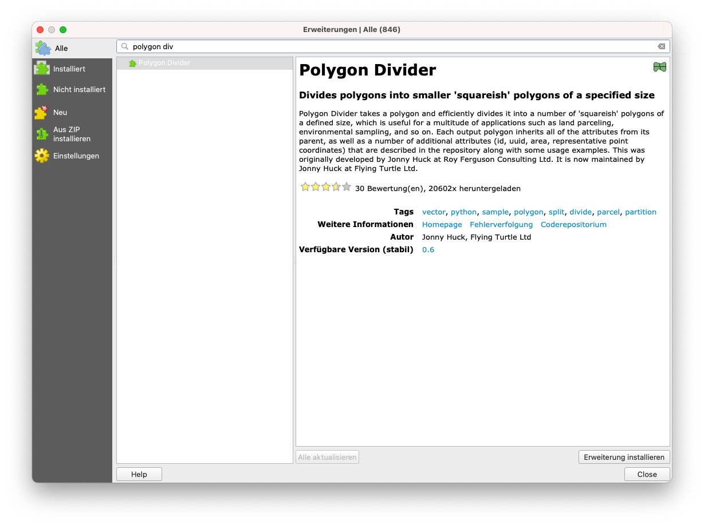

Abbildung 10.10a - Die Erweiterung Polygon Divider

Polygon Divider ist eine weitere nützliche Erweiterung von QGIS, die es ermöglicht, einen Vektor-Layer vom Typ Polygon effizient in eine Anzahl von "quadratischen" Polygonen einer definierten Größe zu unterteilen.  

Dieses Werkzeug kann für eine Vielzahl von Anwendungen nützlich sein, z.B. für die Parzellierung von Grundstücken, für Umweltproben und so weiter.

Lassen Sie uns dieses Werkzeug auf unsere Region Mittelsachsen anwenden und sehen, welche Ergebnisse wir erhalten. 

Installieren Sie mit der Erweiterungsverwaltung den Polygon Divider. Nach der Fertigstellung erscheint ein neues Piktogramm in Ihrer QGIS-Symbolleiste und ein neues Fenster öffnet sich (siehe Abbildung 10.10b). 

Abbildung 10.10b - Fenster der Erweiterung "Polygon Divider

Wählen Sie als Eingabe-Layer den Polygon-Layer Mittelsachsen, speichern Sie die Ausgabedatei als Mittelsachsen_polygone, wählen Sie 1000000 (d.h. alle Teilungen werden etwa 100 Hektar groß sein), wählen Sie als Schnittrichtung links nach rechts und die Toleranz 1. Das Ergebnis sollte wie in Abbildung 10.10c aussehen. 

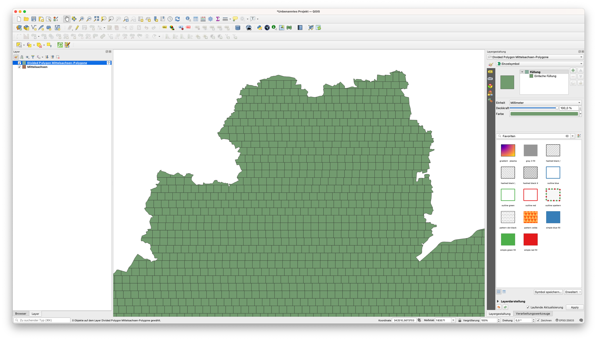

Abbildung 10.10c - Ergebnis der Ausführung der Erweiterung Polygon Divider auf dem Vektorlayer Mittelsachsen

Eine ausführliche Beschreibung der Fähigkeiten der Erweiterung sowie eine umfassendere Anleitung finden Sie auf der Polygon Divider [Website (englischsprachig)](https://github.com/jonnyhuck/RFCL-PolygonDivider). 

#### Load Them All

Abbildung 10.11a - Die Erweiterung "Load Them All"

Dies ist eine nützliche Erweiterung, wenn Sie mehrere Layer (Vektoren und Raster) haben, die Sie in QGIS laden müssen. Die Erweiterung erlaubt es Ihnen, automatisch alle auf einmal zu laden, aber der große Vorteil ist, dass es Ihnen eine Vielzahl von Filtern zur Verfügung stellt, wie z.B. alphanumerisch (nach Namen), Änderungsdatum, Bounding Box (von Hand eingefügte Koordinaten), Art der Geometrie usw. 

Um es zu testen, werden wir Dateien aus dem vorherigen Modul 8 laden. Unter den Vektordaten werden wir die Shapefiles auswählen, die vor einem ausgewählten Datum bearbeitet wurden, bei den Raterdaten werden wir einen alphanumerischen Filter wählen - der Name des geladenen Rasters sollte mit LandCover beginnen (siehe Abbildung 10.11_b). Die Screenshots beziehen sich hier auf die Version dieses Trainings, die für die Philippinen erstellt wurde - Sie können natürlich analog für die deutschen Daten vorgehen.

Bild 10.11b - Einstellen der Parameter für die Erweiterung Load Them All (Vektoren und Raster)

Die oben angegebenen Parameter stellen ein Beispiel auf der Grundlage der verfügbaren Struktur dar. Sie können sie nach eigenem Ermessen auf der Grundlage Ihrer Dateien auf Ihrem Computer ändern. 

Beachten Sie, dass nach Abschluss der 

Die Ergebnisse der Ausführung der Erweiterung Load Them All mit den oben genannten Parametern sind in Abbildung 10.11c (Vektoren) und 10.11d (Raster) dargestellt. 

Abbildung 10.11c - Verwendung der Erweiterung Load Them All zum Laden mehrerer Vektoren

Bild 10.11d - Erweiterung "Load Them All" zum Laden mehrerer Raster

Eine ausführliche Beschreibung der Funktionen der Erweiterungen sowie eine umfassendere Anleitung finden Sie auf der Seite Load the All [Website (englischsprachig)](https://github.com/gacarrillor/loadthemall). 

#### Raster Tracer

Bild 10.12a - Die Erweiterung Raster tracer

Der Raster Tracer kann eine sehr nützliche Erweiterung sein, wenn Sie Vektordaten aus einer nicht maschinenlesbaren Karte extrahieren wollen. Diese Tätigkeit wird in der Regel an gescannten älteren topographischen Karten durchgeführt, aus denen wir verschiedene Informationen extrahieren wollen, um sie in einem Informationssystem zu speichern, zu verarbeiten und zu visualisieren. Ein gutes Beispiel ist die Digitalisierung von topografischen Karten, um Höhenlinien zu extrahieren und in einem GIS ein 3D-Modell des Reliefs zu erstellen. 

Obwohl dies heute, mit dem Aufkommen digitaler Geländemodelle, die aus Satellitenbildern gewonnen werden, kein Thema mehr ist, wird die Digitalisierung immer noch ausgiebig genutzt. Die prominenteste Anwendung ist die Extraktion von Informationen aus alten Karten. Historische Karten bieten uns einen Einblick in die Zeit, bevor wir Satelliten hatten, um unsere Wälder und Landbedeckungsveränderungen zu überwachen. Da diese kartografischen Dokumente ursprünglich auf Papier waren, muss man, um die Informationen mit moderner Technologie nutzen zu können, digitalisieren.

Suchen Sie mit Hilfe der Erweiterungsverwaltung den Raster Tracer und installieren Sie ihn. Diese Erweiterung fügt QGIS eine halbautomatische Fähigkeit hinzu, Linienmerkmale der zugrundeliegenden Rasterkarte zu verfolgen, indem man auf ihre Wendepunkte auf der Rasterkarte klickt. Nach der Installation sollte ein neues Piktogramm in Ihrer Symbolleiste erscheinen. 

Um die Erweiterung verwenden zu können, benötigen wir mindestens 2 Layer - einen Raster-Layer und einen Vektor-Layer, der die Daten erfasst. Wir haben hier beispielhaft eine topographische Karte von den Philippinen, 1:50k auf der offiziellen Website der National Mapping and Resources Information Authority gefunden. Leider ist die [Karte](http://www.namria.gov.ph/3131-IIIAngelesCity.html) nicht georeferenziert. Zu Demonstrationszwecken machen wir weiter, ohne dieses Problem zu beheben, aber bitte beachten Sie: Vor der Digitalisierung von Vektoren aus einer Rasterkarte ist es entscheidend, dass diese korrekt georeferenziert ist. Andernfalls ist die - durchaus zeitaufwendige - Arbeit nutzlos. 

Bringen Sie also die topographische Karte von Angeles City ein (`Layer - Layer hinzufügen - Rasterlayer hinzufügen...`). 

Als nächstes erstellen wir einen MultiString-Vektor-Layer, in dem alle Linienobjekte, die wir aus der topographischen Karte extrahieren, gespeichert werden (Layer - Layer erstellen - Neuer GeoPackage Layer..). Erstellen Sie einen MultiLine-Vektor und speichern Sie ihn unter dem Namen tracer_lines. Wählen Sie die Projektion EPSG: 3123 - die offizielle Projektion der Region. Starten Sie den Bearbeitungsmodus darauf (`Rechtsklick - Bearbeitungsstatus umschalten`). 

Klicken Sie auf das Piktogramm RasterTracer und stellen Sie die Parameter ein, wie in Abbildung 10.12b. Wählen Sie die Farbe der Konturlinien mit Hilfe des Farbwählers, der sich beim Anklicken der Option Trace color öffnet. 

Abbildung 10.12b - Einstellen der RasterTracer-Parameter

Jetzt müssen Sie nur noch mit dem Digitalisieren beginnen. Nachdem Sie sich vergewissert haben, dass Ihr Vektorraster bearbeitbar ist und die Erweiterung durch erneutes Anklicken aktiviert ist, klicken Sie auf die Wendepunkte der Konturlinie, die wir extrahieren wollen (siehe Abbildung 10.112c). 

Abbildung 10.12c - Klicken auf die Wendepunkte zum Zeichnen der Linie mit RasterTracer

Abbildung 10.12d zeigt das Ergebnis. 

Abbildung 10.12d - Halbautomatisch gezeichnete Linie durch Folgen der angegebenen Farbe. 

#### Active Fire

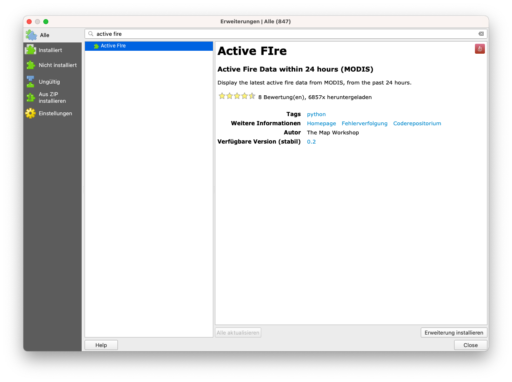

Abbildung 10.13a - Die Erweiterung "Active Fire"

Erweiterungen sind nicht nur dafür gedacht, mit Daten zu arbeiten, die Sie selbst haben, sondern auch, um Datensätze einzubinden, die von anderen Institutionen oder Personen produziert und über standardisierte Web-Mapping-Dienste zur Verfügung gestellt werden.

Ein gutes Beispiel ist die Erweiterung Active Fire. Dieses wurde entwickelt, um QGIS-Benutzer:innen die Möglichkeit zu geben, schnell, intuitiv und ohne jeglichen Aufwand Brände der letzten 24 Stunden in einer beliebigen Region von Interesse anzuzeigen. Die Feuerdaten werden von der NASA produziert und für jede:n frei verfügbar gemacht. Die Rohdaten stammen von 2 Satelliten: dem Moderate Resolution Imaging Spectroradiometer ([MODIS](https://modis.gsfc.nasa.gov/)) ([MCD14DL](https://earthdata.nasa.gov/earth-observation-data/near-real-time/firms/c6-mcd14dl)) und der Visible Infrared Imaging Radiometer Suite ([VIIRS](https://www.jpss.noaa.gov/viirs.html)) 375 m ([VNP14IMGTDL_NRT](https://earthdata.nasa.gov/earth-observation-data/near-real-time/firms/v1-vnp14imgt) und [VJ114IMGTDL_NRT](https://earthdata.nasa.gov/earth-observation-data/near-real-time/firms/vj114imgtdl-nrt)). 

Um sie zu finden, öffnen Sie die Erweiterungsverwaltung und schreiben Sie fire. Nach der Installation erscheint ein neues rotes Piktogramm in Ihrer QGIS-Symbolleiste. Wenn Sie darauf klicken, erscheint ein neues Fenster, in dem Sie auswählen können, von welchem Sensor Sie die Feuerpixel in den letzten 24 Stunden ermittelt haben wollen (siehe Abbildung 10.13b).

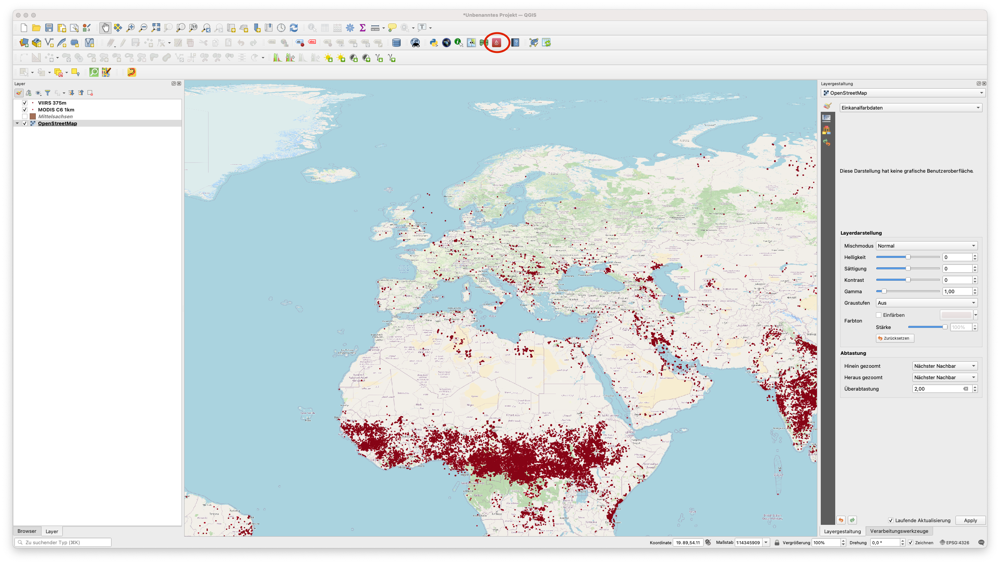

Abbildung 10.13b - Verwendung der Erweiterung Active Fire zum Laden von NASA-Feuerprodukten in QGIS 

Die Erweiterung berechnet auch die Anzahl der registrierten Feuerpixel. 

#### **[Qgis2web](https://github.com/tomchadwin/qgis2web)**

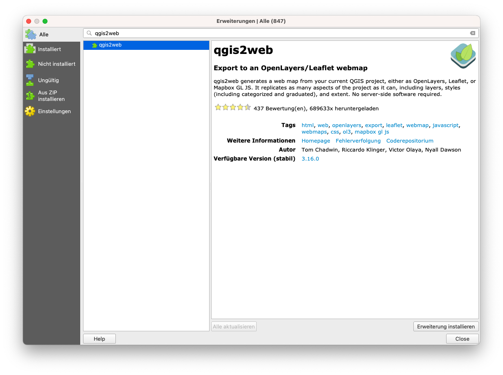

Figure 10.14a - The Active Fire plugin

This is a plugin that allows the user to quickly export her QGIS project to a** web map**. 

A web map is an interactive display of geographic information that can be opened in browsers, on devices, or in desktop map viewers. We daily interact with such representations, just think of OpenStreetMap, Google Maps, Waze, Pokemon Go. 

This plugin gives one the possibility to very fast prepare and export a map that could end up on the Internet, via the web-technologies of [OpenLayer3](https://openlayers.org/) or [Leaflet](https://leafletjs.com/). Qgis2web does its best to interpret a QGIS project and to export HTML, Javascript, and CSS to create a web map as close to the QGIS project as possible.

After the installation of the qgis2web plugin, a new icon appears to the QGIS toolbar, the same as depicted in the Plugin Manager. Clicking on it will open a window, such as the one in figure 10.14b.

Figure 10.14b - Choosing what your map will show in the browser. 

The interface is intuitive, but keep in mind the heavier the datasets, longer it will take to prepare and export. After choosing where to export, click on the export button to finalise (see figure 10.14c).

Figure 10.14c - QGIS2web preparing the necessary files and folders for the OpenLayer 3 web technology

The folder exported contains several files, depending on what web mapping technology was selected - Leaflet or Openlayers3. In case of OpenLayer3, the folder chosen for the export contains the following files and folders: `images, index.html, layers, resources, styles, webfonts. `Double click on the index.html file and your exported map will open in  your browser, where you can toggle what layers to be visible (see figure 10.14d). 

Figure 10.14d - Opening the index.html file in your browser 

As you noticed, the browser opens this map from your local folder (where you told qgis2web to export). 

This QGIS plugin is a great tool to help you prepare your maps for the web. 

For a detailed description of the plugin capabilities, together with a more comprehensive tutorial, check the qgis2web [webpage](https://github.com/tomchadwin/qgis2web). 

#### **DataPlotly**

Figure 10.14a - The DataPlotly plugin

The DataPlotly plugin was specifically developed to support interactive plot type visualizations of the loaded vector data in QGIS. The plugin is based on a Python library named Plotly, that is quite powerful providing the possibility to create multitude of interactive, publication-quality graphs: line plots, scatter plots, area charts, bar charts, error bars, box plots, histograms, heatmaps, subplots, multiple-axes, polar charts, and bubble charts. More information on this specific py library is available on the official [website](https://plotly.com/python/). 

Install the plugin using the Plugin Manager and load some vector layers to visualize: 

*   Waterways_3123 (line type);
*   Populated places (point type);

Let us prepare an interactive chart showing how many rivers vs. channels vs. streams vs. drains segments we have in our dataset.

By clicking on the specific pictogram a new window will open, see figure 10.24. 

Figure 10.15b - DataPlotly window/panel.

Next, set up the parameters, like in figure 10.15c. 

Figure 10.15c - Setting up the parameters for the pie chart representing types of water lines

Choose waterways_3123 as the vector layer from which to extract the data plotted, grouping field - fclass, Y field - length. If length needs to be calculated, go to the attribute table of the vector layer and write in the field calculator `round($length)`. For more details, see module 8.  Afterwards, select ‘single plot’ at the ploty type and click on the Create plot button, in the lower right-hand side. Your result should look like in figure 10.15d. 

Figure 10.15d - Waterways types by length pie chart.

When hovering with the mouse over each pie chart segment, a pop-up appears showing the name (taken from fclass column), lengths sum and percentage out of the total. 

One significant functionality of DataPlotly is the connection with the QGIS map canvas. To understand what that is, click on one of the sections of the pie chart. You should see that some features are **automatically** selected in your map canvas (see figure 10.15e). 

Figure 10.15e - DataPlotly and QGIS map canvas interactive connection testing

That also means that you can interactively update your plot, for example, to show only the selected features. To test, select only a part of the waterways in your map canvas, then go to the DataPlotly, first tab and at plot parameters, tick the ‘only selected features’ option (see figure 10.15f). 

Figure 10.15f - Interactively update the plot to show only selected features.   

Afterwards, click on the Update plot button at the bottom right-hand side of the DataPlotly window. Results should look approximately as in figure 10.29 (just approximately, because your selection mostly probably differs from the one shown in figure 10.15g). 

Figure 10.15g - Update the plot to show only the selected features on the map canvas. 

Furthermore, DataPlotly provides the user with an export function - either in a .pdf file or an .html file. The corresponding buttons are in the very low, right-hand side of the DataPlotly window, see figure 10.15h. 

Figure 10.15h - Export capabilities of DataPlotly

Exporting as HTML file allows the user to prepare a wide variety of data plots ready for web publication (see figure 10.15i).

Figure 10.15i - Using a browser to open the HTML file exported by DataPlotly.  

The plugin is also very well documented, for the users they provide a help menu for each plot type. You can access it by clicking on the fourth tab on the DataPlotly (see figure 10.15j).

Figure 10.15j - Help menu for each plot type accessible through the plugin window. 

Due to the direct, interactive link with the QGIS loaded datasets, expressions can also be used when preparing a plot. To test this capability,  we will create a plot base on the Populated places vector layer. Set the following parameters: type: bar plot, layer: populated places, X_field: is_in, Y_field - open the field calculator and insert  `"population" is not null `(see figure 10.15k and figure 10.15l). 

Figure 10.15k - Opening the field editor in DataPlotly based on attributes of the selected QGIS layer in order to apply an expression for filtering what the plot will display

Figure 10.15l - Inserting an expression in the field calculator 

The result should look like in figure 10.35. . 

Figure 10.15m - DataPlotly result of filtering by expression

If we are to interpret this plot, it shows us that among all the provinces where populated places have been registered, the population attribute is different from 0 în only 3 regions, Alaminos, Sual, Pangasian and Bagac. One can easily test this conclusion by looking in the attribute table.

DataPlotly also provides the user with the possibility of creating subplots, which means that multiple plots can be displayed in a single figure. 

To test this functionality, we will use the Population places vector layer. We have the following attributes of interest: `place` = type of place (city, town, village, etc.,` is_in `=  name of province to which it belongs (if known), `population` = (population numbers) and `name `= the name of the place (if known). We will integrate in the same figure, 2 data plots: one to show us how many of the populated places fall into each category of `place `and the second one, how is the population divided by the 4 types of` places. `

Figure 10.15n - Setting up the parameters for the first plot  - types of settlements by their numbers

Figure 10.15o - Setting up the parameters for the second plot - types of settlements by population  numbers.

Figure 10.15p - Subplots in a row

For a detailed description of the plugin capabilities, together with a more comprehensive tutorial, check the DataPlotly [webpage](https://github.com/ghtmtt/DataPlotly). 

#### **QuickMapServices / OpenLayers plugin**

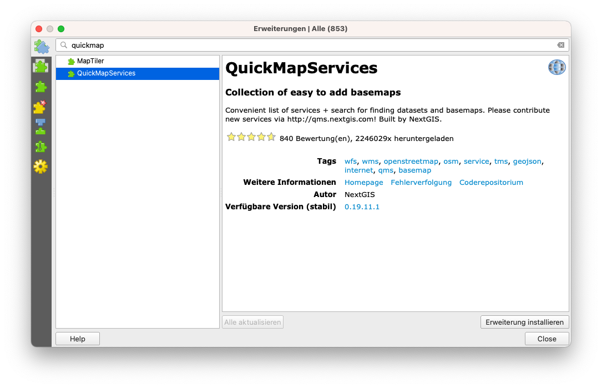

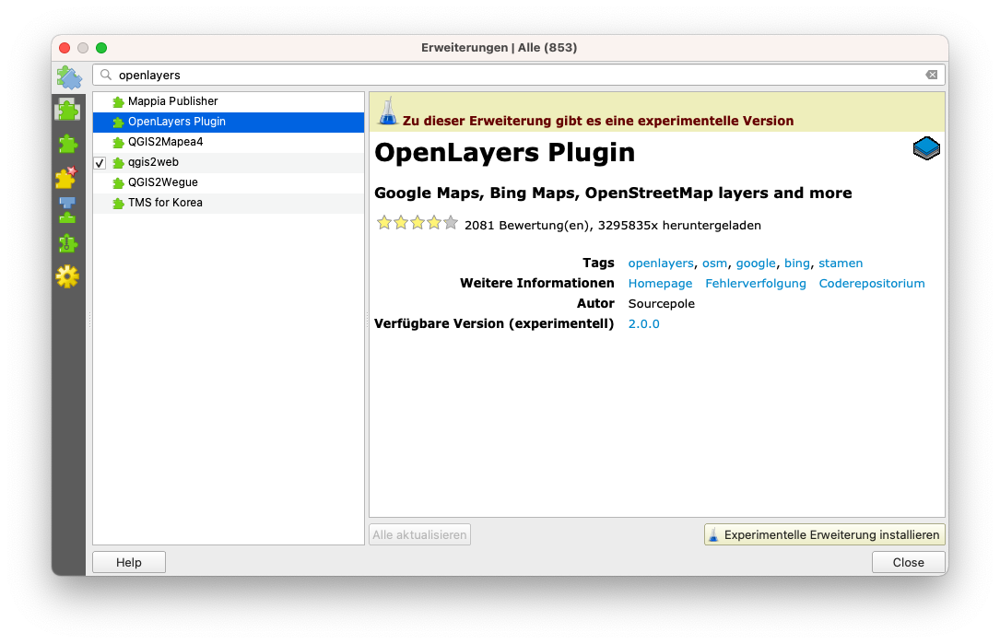

Figure 10.16a - QuickMapServices plugin; 10.16b - OpenLayers plugin

These 2 plugins are exceptionally useful when a user needs to add basemaps to her/his QGIS project. For example, one wants to see in context the positioning of a new vector layer received, or maybe just to prepare a more attractive cartographic representation for a report. Either the scope, QuickMapServices allows the use to load into their desktop client with only 2 clicks, basemap layers from different provides, such as OpenStreetMap, NASA, Bing or Google Maps. 

Install both plugins using Plugin Manager. In this case, you will notice that they will appear under the Web tab (see figure 10.16b). 

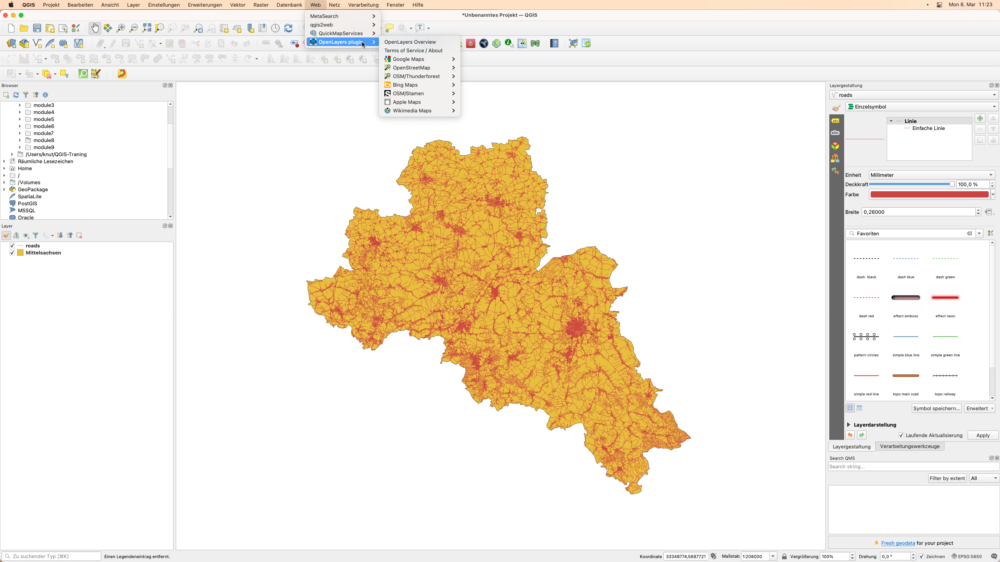

Figure 10.16b - Location of the QuickMapServices and OpenLayers plugins.

Using them is pretty straight forward, you just click on the layer you want to bring in your map canvas and the plugin will do all the work. Needless to say, that the use of this plugin requires good internet connection, as it uses data served by its providers through standardized web mapping services. 

Figure 10.16c presents the OSM Humanitarian Data Model brought as a basemap for the region of interest used in module 8 and 9, province Pampanga in Philippines. 

Figure 10.16c - Using OpenLayers plugin. 

Figure 10.16d illustrates the perfect alignment of the basemap loaded in the QGIS map canvas using the OpenLayers plugin. Even though the 2 layers are not in the same projection, QGIS allows projection on-the-fly, so overlay is possible. 

Figure 10.16d - Loaded vector data (roads) overlaid on to the OSM Humanitarian Data model 

For a detailed description of the plugins capabilities, together with a more comprehensive tutorial, check their webpage: [QuickMapServices](https://nextgis.com/blog/quickmapservices/) and [OpenLayer Plugin](https://github.com/sourcepole/qgis-openlayers-plugin). 

#### **Table2Style**

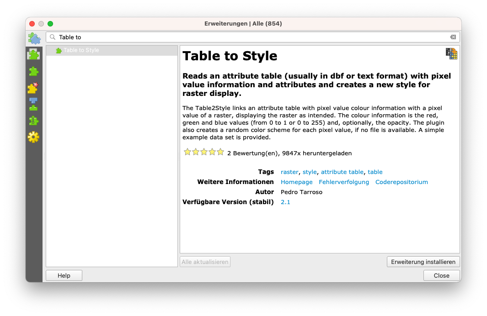

Figure 10.17a - The Table to Style plugin

This plugin is useful for situations where there are specific values for pixels within a raster layer that correspond perfectly to a specific color. In this curriculum, we have encountered  such an example, when working with the land cover data (see figure 10.17b). 

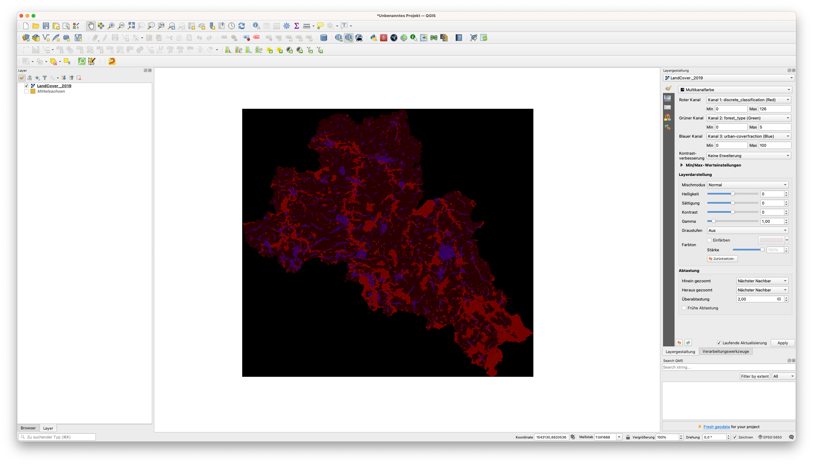

Figure 10.17b - Exemplifying situations where pixel values correspond to an exact colour 

From the provider of this product based on satellite imagery, the pixel values and the associated colours are also made available: 

<table>
  <tr>
   <td><strong>Value</strong>
   </td>
   <td><strong>Color</strong>
   </td>
   <td><strong>Description</strong>
   </td>
  </tr>
  <tr>
   <td>0
   </td>
   <td>#282828
   </td>
   <td>Unknown. No or not enough satellite data available.
   </td>
  </tr>
  <tr>
   <td>20
   </td>
   <td>#FFBB22
   </td>
   <td>Shrubs. Woody perennial plants with persistent and woody stems and without any defined main stem being less than 5 m tall. The shrub foliage can be either evergreen or deciduous.
   </td>
  </tr>
  <tr>
   <td>30
   </td>
   <td>#FFFF4C
   </td>
   <td>Herbaceous vegetation. Plants without persistent stem or shoots above ground and lacking definite firm structure. Tree and shrub cover is less than 10 %.
   </td>
  </tr>
  <tr>
   <td>40
   </td>
   <td>#F096FF
   </td>
   <td>Cultivated and managed vegetation / agriculture. Lands covered with temporary crops followed by harvest and a bare soil period (e.g., single and multiple cropping systems). Note that perennial woody crops will be classified as the appropriate forest or shrub land cover type.
   </td>
  </tr>
  <tr>
   <td>50
   </td>
   <td>#FA0000
   </td>
   <td>Urban / built up. Land covered by buildings and other man-made structures.
   </td>
  </tr>
  <tr>
   <td>60
   </td>
   <td>#B4B4B4
   </td>
   <td>Bare / sparse vegetation. Lands with exposed soil, sand, or rocks and never has more than 10 % vegetated cover during any time of the year.
   </td>
  </tr>
  <tr>
   <td>70
   </td>
   <td>#F0F0F0
   </td>
   <td>Snow and ice. Lands under snow or ice cover throughout the year.
   </td>
  </tr>
  <tr>
   <td>80
   </td>
   <td>#0032C8
   </td>
   <td>Permanent water bodies. Lakes, reservoirs, and rivers. Can be either fresh or salt-water bodies.
   </td>
  </tr>
  <tr>
   <td>90
   </td>
   <td>#0096A0
   </td>
   <td>Herbaceous wetland. Lands with a permanent mixture of water and herbaceous or woody vegetation. The vegetation can be present in either salt, brackish, or fresh water.
   </td>
  </tr>
  <tr>
   <td>100
   </td>
   <td>#FAE6A0
   </td>
   <td>Moss and lichen.
   </td>
  </tr>
  <tr>
   <td>111
   </td>
   <td>#58481F
   </td>
   <td>Closed forest, evergreen needle leaf. Tree canopy >70 %, almost all needle leaf trees remain green all year. Canopy is never without green foliage.
   </td>
  </tr>
  <tr>
   <td>112
   </td>
   <td>#009900
   </td>
   <td>Closed forest, evergreen broad leaf. Tree canopy >70 %, almost all broadleaf trees remain green year round. Canopy is never without green foliage.
   </td>
  </tr>
  <tr>
   <td>113
   </td>
   <td>#70663E
   </td>
   <td>Closed forest, deciduous needle leaf. Tree canopy >70 %, consists of seasonal needle leaf tree communities with an annual cycle of leaf-on and leaf-off periods.
   </td>
  </tr>
  <tr>
   <td>114
   </td>
   <td>#00CC00
   </td>
   <td>Closed forest, deciduous broad leaf. Tree canopy >70 %, consists of seasonal broadleaf tree communities with an annual cycle of leaf-on and leaf-off periods.
   </td>
  </tr>
  <tr>
   <td>115
   </td>
   <td>#4E751F
   </td>
   <td>Closed forest, mixed.
   </td>
  </tr>
  <tr>
   <td>116
   </td>
   <td>#007800
   </td>
   <td>Closed forest, not matching any of the other definitions.
   </td>
  </tr>
  <tr>
   <td>121
   </td>
   <td>#666000
   </td>
   <td>Open forest, evergreen needle leaf. Top layer- trees 15-70 % and second layer- mixed of shrubs and grassland, almost all needle leaf trees remain green all year. Canopy is never without green foliage.
   </td>
  </tr>
  <tr>
   <td>122
   </td>
   <td>#8DB400
   </td>
   <td>Open forest, evergreen broad leaf. Top layer- trees 15-70 % and second layer- mixed of shrubs and grassland, almost all broadleaf trees remain green year round. Canopy is never without green foliage.
   </td>
  </tr>
  <tr>
   <td>123
   </td>
   <td>#8D7400
   </td>
   <td>Open forest, deciduous needle leaf. Top layer- trees 15-70 % and second layer- mixed of shrubs and grassland, consists of seasonal needle leaf tree communities with an annual cycle of leaf-on and leaf-off periods.
   </td>
  </tr>
  <tr>
   <td>124
   </td>
   <td>#A0DC00
   </td>
   <td>Open forest, deciduous broadleaf. Top layer- trees 15-70 % and second layer- mixed of shrubs and grassland, consists of seasonal broadleaf tree communities with an annual cycle of leaf-on and leaf-off periods.
   </td>
  </tr>
  <tr>
   <td>125
   </td>
   <td>#929900
   </td>
   <td>Open forest, mixed.
   </td>
  </tr>
  <tr>
   <td>126
   </td>
   <td>#648C00
   </td>
   <td>Open forest, not matching any of the other definitions.
   </td>
  </tr>
  <tr>
   <td>200
   </td>
   <td>#000080
   </td>
   <td>Oceans, seas. Can be either fresh or salt-water bodies.
   </td>
  </tr>
</table>

When a new dataset - raster or vector - is loaded, QGIS is randomly assigning it a visual representation. It is the user that must define appropriate colours and schemas of the representations. For more information on layers styling, go to module 4. 

To test the table2style plugin, we will use the LandCover2019 raster dataset, used also in module nr.9. By loading the raster into QGIS you should have a restul similar with the one in figure 10.17c.

Figure 10.17c - QGIS randomly assigns colours to pixel values

As per the data provider, we know that for each pixel value there is a clearly assigned colour  and in the land cover domain, these colours already represent conventions, just as in classic cartography. Forests are represented with a specific kind of green, pastures with another, ocean is depicted with a different kind of blue than inland surface water and so forth. Worst case would be to manually assign all these colours to their respective values. However, the table2style plugin solves this issue automatically, in a matter of seconds. 

Go to Manager plugin and install the table2style plugin. A new icon will appear on your toolbar. Open it by double clicking it. A setting up window should appear, like in figure 10.17d. 

Figure 10.17d - Table2style window

The plugin requires 2 parameters - a raster layer and an attribute table with pixel values, description label and color codes in one of the three systems: RGB, HSV or Hex. As per our table above, we have Hex codes for the assigned colors. Thus, load the table into QGIS (`Layer - Add layer - Add delimited text layer… `). Of course, it has no geometry. The LandCover values table should look like in figure 10.17e. 

Figure 10.17e - Attribute table with pixel values, color codes and description for Land Cover

Now, let us take a look at the raster dataset. The table2style works only on a 1-band raster, as it is a one to one connection: pixel value - color code. If more bands are available, judging after the plugin setup window, it would not know which one to choose. However, checking the LandCover2019 layer properties, we notice that there are 3 bands (`Properties - Information - scroll down to Bands`). As we need only Band 1 - discrete classification, we will employ the raster calculator to extract it (`Raster - Raster calculator` and insert in the expression field only "LandCover2019_1band@1" - save the result). For more details on how to work with rasters, check module 9. 

Now, we have all we need to test the plugin. Set up the parameters as in figure 10.17f. 

Figure 10.17f - Setting up table2style plugin parameters for the Land Cover dataset

The result should look like in figure 10.17g. 

Figure 10.17g - Automatically styled raster dataset using table2style plugin

For a detailed description of the plugin capab[https://github.com/ptarroso/table2style](https://github.com/ptarroso/table2style)ilities, together with a more comprehensive tutorial, check the Table 2 Style plugin webpage. 

#### **ORS Tools**

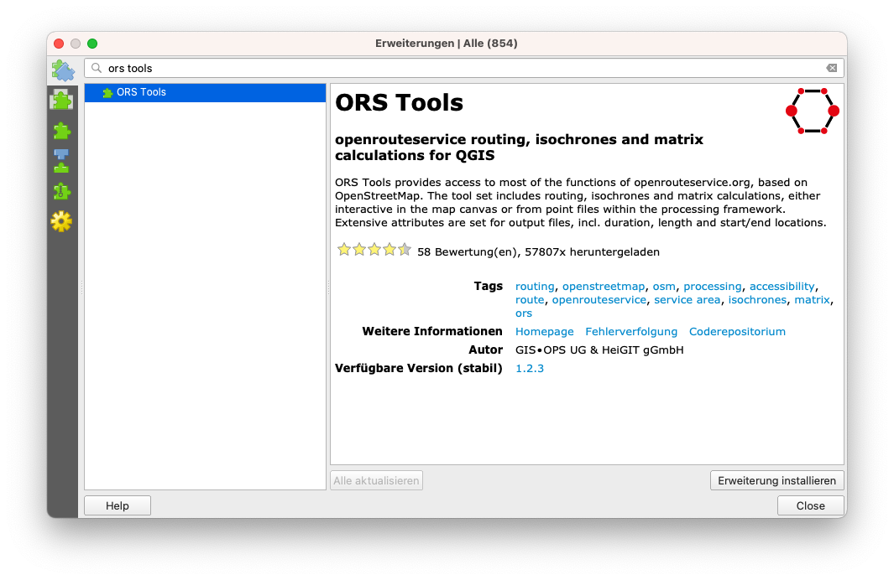

Figure 10.48a - The ORS Tools plugin

For our last presented plugin, we have prepared one to show you the amazing capabilities of the interconnected world of GIS data, tools and services. We have seen previously that there are plugins that can assist us in loading in our QGIS data from other providers without any hassle related to downloading, storing and knowing how to open it (OpenLayers plugin , Active Fire). Yet, the ORS Tools plugin is built to provide access to an outside routing service - the openrouteservice.org, based on OpenStreetMap. 

**Routing** is the process of selecting a path for traffic in a network or between or across multiple selected points. 

The tool set includes routing, isochrones and matrix calculations, either interactive in the map canvas or from point files within the processing framework. 

Using Plugin Manager, install the ORS Tools plugin. A new pictogram will appear on your toolbar. Double click to open (see figure 10.18b). 

Figure 10.18b - Open ORS Tools window. 

As mentioned, this plugin is using an external database - OpenStreetMap - and external algorithms that are packaged up in service - openrouteservice. In order to be able to connect to this external service, we will need to make an account on their web page and ask for an **API key. **

An API key is a unique identifier used to authenticate a user, developer, or calling program to an API. The API is like a gateway to the insides of a software, a programmatic access to its processes and algorithms. Thus, to use the openrouteservice through QGIS, we will ask for a _key_. 

Proceed with the following steps: 

1. Click on the Sign Up button on the ORS Tools window (figure 10.49). 

Figure 10.18c - Sign in button

2. Make a free account on the website on the openrouteservice website that opened. 

Figure 10.18d - Openrouteservice account page 

3. After making the account, you will receive an email informing you of what  you have just gained free access. 

Figure 10.18e - Email received from openrouteservice

4. Login to your newly made account and request a token. 

Figure 10.18f - Request openrouteservice token

5. After your token has been created, click on the long alphanumeric string below the name key. A message informing you that it has been copied will appear. 
6. Return to QGIS and insert the copied API key.

Figure 10.18g - Insert openrouteserviceAPI key into your QGIS

At this point, your QGIS should be ready to calculate routes using openrouteservice and OpenStreetMap. To test its basic capabilities, load into QGIS the Pampanga building layers. Make sure you are working in EPSG 3857 or EPSG:4326. After loading the layer, start inserting the routing points. Open the ORS Tools, and press the green + button (see figure 10.18h). 

Figure 10.18h - Inserting the routing points using ORS Tools. 

Choose Traveling Salesman routing algorithm and click on apply. After a few moments, a new vector layer has been created: Routes_ORS. 

Figure 10.18i - Result of running ORS Tools. 

Opening OpenStreetMap, we will notice that  ORS Tools has tried to build a route to touch all points given by clicking on the map. **Please take note! **QGIS has only one layer loaded and that was the building layer and yet now, a new layer has been calculated and automatically added to your map canvas! 

Figure 10.18j - The calculated route overlaid on top of OpenStreetMap.

The results of ORS Tools highly depend on the quality of the databases used, in this case - the OpenStreetMap. 

The plugin, as well as the openroutingservice, has more to offer but we leave you to discover that in your GIS journey. 

***Philippine-specific***

#### **Azimuth and Distance Plugin**

#### **SRTM Downloader Plugin**

#### **OpenHazardsPH Plugin**

#### **Quiz questions**

1. Can QGIS plugins be run outside the QGIS platform? 
*   _No. _
*   _Yes. _
2. In order to use a QGIS plugin one needs to learn how to code. 
*   _No._
*   _Yes. _
3. It is highly recommended that all plugins be installed through the Plugin Manager, even if they could be installed by downloading the zip file and putting it into the right QGIS folder. 
*   _No._
*   _Yes. _