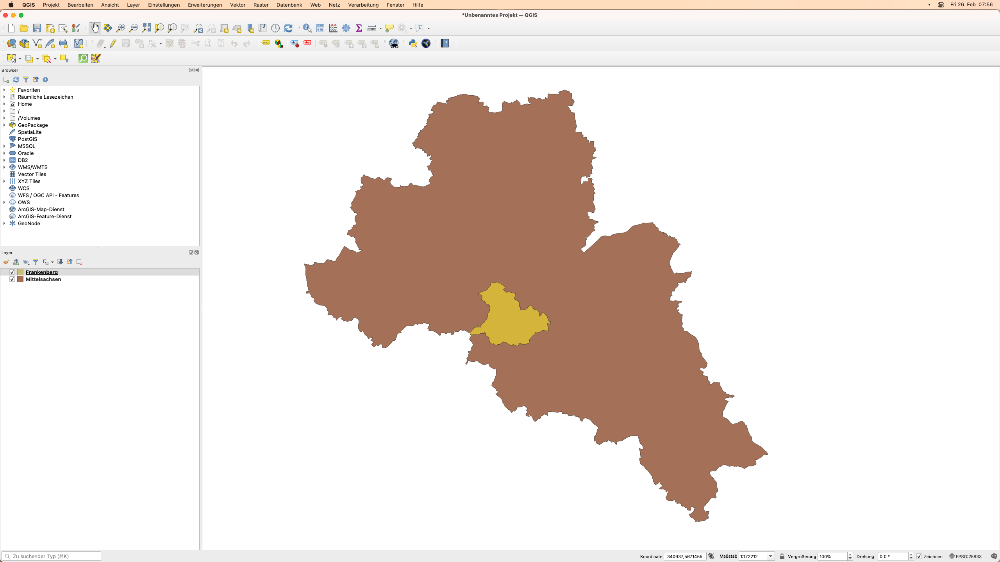
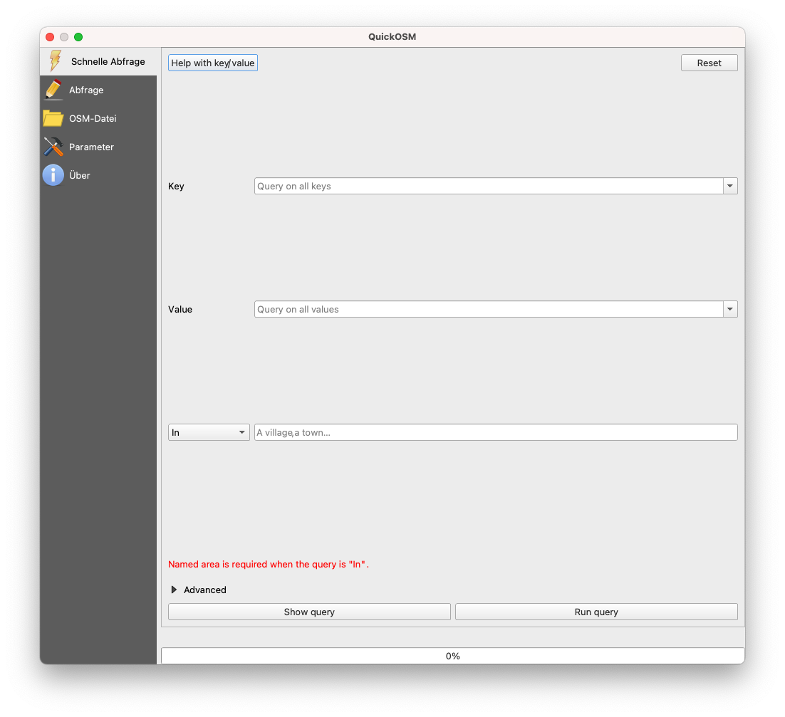
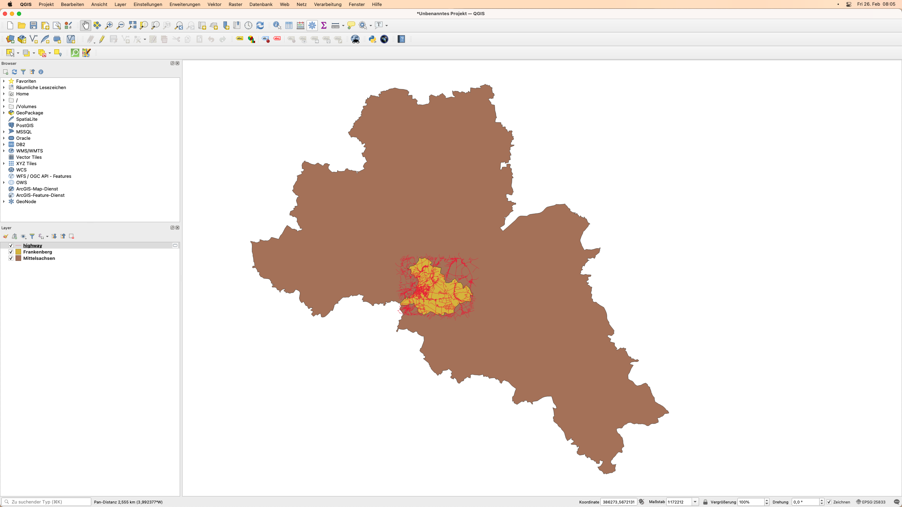
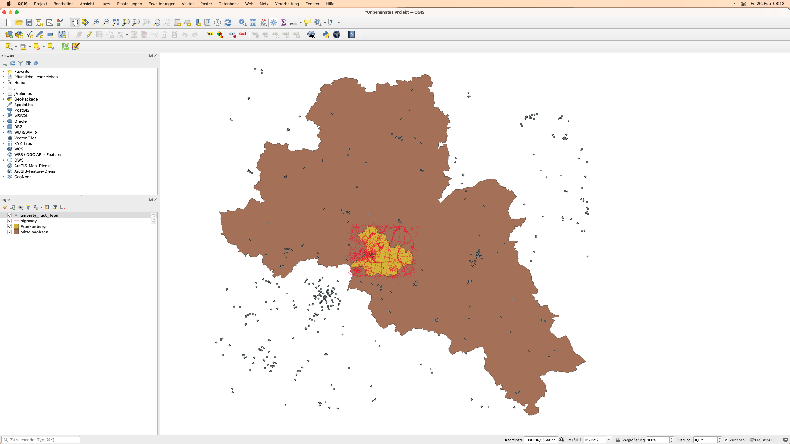
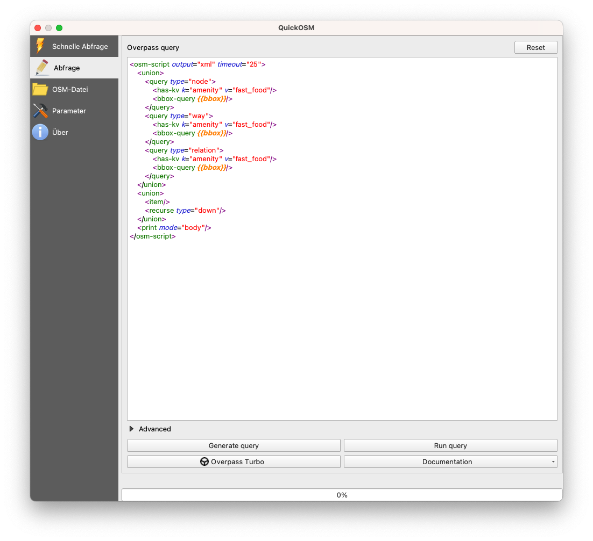
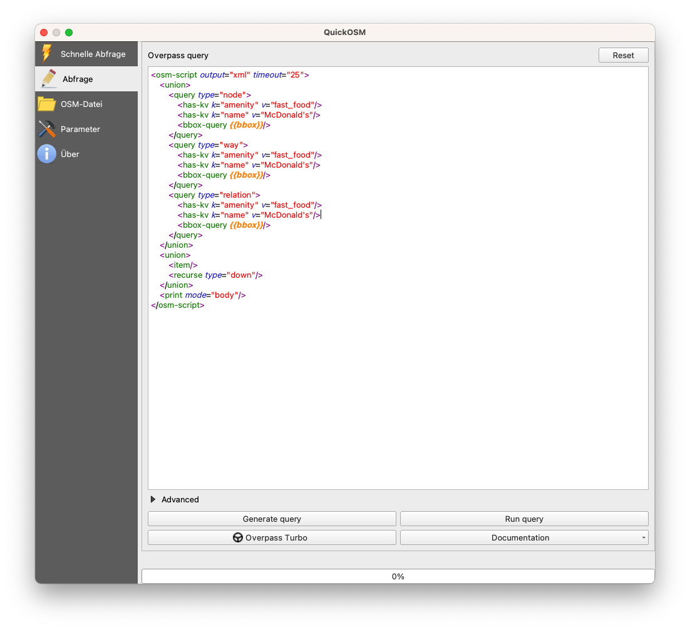

# Modul 3 - OpenStreetMap und der High Resolution Settlement Layer

**Autor**: Ben

## Pädagogische Einführung

Dieses Modul führt in OpenStreetMap (OSM) und den High Resolution Settlement Layer (HRSL) ein.  Am Ende dieses Moduls sollten die Lernenden vertraut sein mit:

* OpenStreetMap-Prinzipien
* OpenStreetMap-Daten und Anwendungsfällen
* High Resolution Settlement Layer Daten und Anwendungsfällen

Sie sollten außerdem in der Lage sein:

* OSM-Daten als Vektoren und Kacheln in QGIS zu laden
* das HRSL-Raster in QGIS zu laden

## Technische Voraussetzungen

Die benötigten Werkzeuge und Ressourcen für dieses Modul sind:

* Computer
* Internetverbindung
* QGIS 3.16 auf dem Computer installiert ([https://qgis.org/de/site/forusers/download.html](https://qgis.org/de/site/forusers/download.html))
[TODO]
* Pampanga_province und Pampanga_SanFernando Vektor Layer (in [module3.gpkg](module3.gpkg)).
[/TODO]

## Voraussetzungen

* Grundkenntnisse in der Bedienung eines Computers
* Vertrautheit mit räumlichen Datenformaten, der QGIS-Schnittstelle und dem Laden von Layern in QGIS (Abschluss der Module 0, 1 und 2)

## Zusätzliche Ressourcen

* OpenStreetMap - [https://www.openstreetmap.org/](https://www.openstreetmap.org/)
* OpenStreetMap Wiki - [https://wiki.openstreetmap.org/](https://wiki.openstreetmap.org/)
* Overpass API Benutzerhandbuch - [https://dev.overpass-api.de/overpass-doc/de/](https://dev.overpass-api.de/overpass-doc/de/)
* Facebook - High Resolution Settlement Layer - [https://research.fb.com/downloads/high-resolution-settlement-layer-hrsl/](https://research.fb.com/downloads/high-resolution-settlement-layer-hrsl/)
* CEISIN - High Resolution Settlement Layer - [https://ciesin.columbia.edu/data/hrsl/](https://ciesin.columbia.edu/data/hrsl/)
* HDX HRSL - [https://data.humdata.org/search?organization=facebook&q=%22High%20Resolution%20Population%20Density%20Maps%20%2B%20Demographic%20Estimates%22](https://data.humdata.org/search?organization=facebook&q=%22High%20Resolution%20Population%20Density%20Maps%20%2B%20Demographic%20Estimates%22)

## Thematische Einführung

Karten sind in unserem täglichen Leben allgegenwärtig geworden. Wir können einfach unser Telefon zücken und Anwendungen öffnen, die Karten und Standortdaten nutzen. Es gibt Apps, mit denen wir uns orientieren und lokalisieren können, mit denen wir navigieren und von einem Ort zum anderen gelangen. Karten werden angezeigt, wenn wir bei unserem Lieblingslieferdienst Essen bestellen, usw. Karten sind so sehr zu einem festen Bestandteil unserer täglichen Aktivitäten geworden, dass wir dazu neigen zu vergessen, dass es Orte auf der Welt gibt, die noch nicht kartiert sind oder nicht in den digitalen Karten, die wir verwenden, zu finden sind.

## Aufschlüsselung der Konzepte

Die Allgegenwart von Karten in unserem Leben ist ein Nebenprodukt der schieren Menge an Orts- und Raumdaten, die wir sammeln. Die Möglichkeiten und das Potenzial, aus den uns zur Verfügung stehenden Geodaten etwas Gutes zu schaffen, sind hervorragend, aber dies wird nur möglich sein, wenn diese Geodatensätze frei und offen sind.

## Hauptinhalt

### Phase 1: OpenStreetMap (OSM)-Daten

#### **Was ist OpenStreetMap (OSM)?**

OpenStreetMap (OSM) ([https://www.openstreetmap.org/](https://www.openstreetmap.org/)) ist eine freie, editierbare Karte der ganzen Welt, die von Freiwilligen aus der ganzen Welt erstellt und mit einer Open-Content-Lizenz veröffentlicht wird. Es ist ein Projekt, das freie geografische Daten für die Welt erstellt und verteilt - eine Karte der Welt von den Menschen und für die Menschen. Wenn etwas in OSM fehlt, können Sie es gerne hinzufügen. Wenn etwas in OSM falsch ist, steht es Ihnen frei, es zu korrigieren. OSM ist ein digitales Allgemeingut, das den Wert der Informationen, die ihm hinzugefügt werden, stark steigert.

Abbildung 3.1. OpenStreetMap

Weitere Informationen darüber, warum OpenStreetMap existiert und wie wichtig es ist, finden Sie unter: [https://wiki.openstreetmap.org/wiki/DE:FAQ#Warum_macht_Ihr_OpenStreetMap.3F](https://wiki.openstreetmap.org/wiki/DE:FAQ#Warum_macht_Ihr_OpenStreetMap.3F)) oder [https://wiki.openstreetmap.org/wiki/DE:Über_OSM](https://wiki.openstreetmap.org/wiki/DE:Über_OSM).

Laut OpenStreetMap handelt es sich um "offene Daten, die unter der Open Data Commons Open Database License (ODbL) ([https://opendatacommons.org/licenses/odbl/](https://opendatacommons.org/licenses/odbl/)) von der OpenStreetMap Foundation (OSMF) ([https://osmfoundation.org/](https://osmfoundation.org/)) lizenziert sind" und dass "Sie frei sind, unsere Daten zu kopieren, zu verteilen, zu übertragen und anzupassen, solange Sie OpenStreetMap und seine Mitwirkenden nennen. Wenn Sie unsere Daten verändern oder darauf aufbauen, dürfen Sie das Ergebnis nur unter der gleichen Lizenz weitergeben." Wenn Sie eine Karte erstellen, die OSM-Daten verwendet, ist es erforderlich, dass Sie "© OpenStreetMap contributors" nennen. Sie können mehr über das Copyright und die Lizenz von OpenStreetMap hier lesen: [https://www.openstreetmap.org/copyright](https://www.openstreetmap.org/copyright)

#### **Wo wird OpenStreetMap verwendet?**

Einer der Kernwerte von OpenStreetMap ist die Möglichkeit, Kartendaten zu sammeln, zu bearbeiten und zu teilen, die für viele verschiedene Zwecke verwendet werden können. Das ist die Freiheit, die die ObDL bietet. Da OpenStreetMap es den Nutzer:innen erlaubt, seine Daten mit sehr wenigen Einschränkungen zu verwenden, gibt es eine Vielzahl von Anwendungen, und Diensten, die auf OpenStreetMap aufgebaut sind, aufgebaut werden oder aufgebaut werden können. OpenStreetMap wird für die Erstellung von Karten, Routing-Dienste, Bildung und sogar für humanitäre und anwaltschaftliche Zwecke verwendet.

Außerdem gibt es mit HOT - dem Humanitarian OpenStreetMap Team - ([https://www.hotosm.org/](https://www.hotosm.org/)) ein internationales Team, das sich der humanitären Aktion und der Stärkung von Gemeinschaften durch Open Mapping widmet.

Die deutsche OpenStreetMap-Community ist eine der weltweit aktivsten. Je nach Region gibt es unterschiedliche Schwerpunktthmen. Die Berliner Community etwa setzt sich aktuell sehr aktiv mit dem Thema Verkehrswende auseinander. Gemeinsam erkunden die Mapper:innen, wie man die bestehenden Bestrebungen kartografieren und eine Datenbasis für kommende Entscheidungen schaffen kann. Mehr Informationen hierzu gibt es unter [https://wiki.openstreetmap.org/wiki/Talk:Berlin/Verkehrswende](https://wiki.openstreetmap.org/wiki/Talk:Berlin/Verkehrswende)

Eine Liste der OpenStreetMap-basierten Dienste finden Sie unter [https://wiki.openstreetmap.org/wiki/DE:List_of_OSM-based_services](https://wiki.openstreetmap.org/wiki/DE:List_of_OSM-based_services).

#### **Wie kann OpenStreetMap in QGIS verwendet werden?**

OSM-Daten können in QGIS auf mehrere Arten verwendet werden. Die erste ist die Verwendung von OSM-abgeleiteten Kachel-Layern als Basiskarten. Tatsächlich wird QGIS standardmäßig mit einer Verbindung zu einem OpenStreetMap Tile Layer ausgeliefert. Sie finden diesen Layer mit dem Namen "OpenStreetMap" unter der Liste der XYZ-Kacheln im Bedienfeld des Browsers.

Sie können andere von OSM abgeleitete Kacheln in QGIS hinzufügen, wie z.B. die in der Leaflet Providers Liste ([https://leaflet-extras.github.io/leaflet-providers/preview/](https://leaflet-extras.github.io/leaflet-providers/preview/)). Von OSM abgeleitete Kacheln bieten dem/der Benutzer:in freien und offenen Zugang zu einer aktualisierten Basiskarte, da diese Kacheln in der Regel regelmäßig aktualisiert werden, um dem aktuellen Stand von OSM zu entsprechen.

Sie können die Features aus OSM auch als Vektordaten in QGIS laden. Dies kann durch Herunterladen von OSM-Daten von Seiten wie GEOFABRIK ([https://www.geofabrik.de/data/download.html](https://www.geofabrik.de/data/download.html)) geschehen.

OSM-Feature-Daten können auch direkt in QGIS geladen werden, indem das QuickOSM-Plugin verwendet wird. Dieses Plugin nutzt die Overpass-API ([https://wiki.openstreetmap.org/wiki/DE:Overpass_API](https://wiki.openstreetmap.org/wiki/DE:Overpass_API)), die es ermöglicht, schnell eine Teilmenge der OSM-Daten durch Abfragen auszuwählen. Dies ist möglich, weil Features in OSM ([https://wiki.openstreetmap.org/wiki/DE:Mapfeatures](https://wiki.openstreetmap.org/wiki/DE:Mapfeatures)) mit einem freien Tagging-System ([https://wiki.openstreetmap.org/wiki/DE:Tags](https://wiki.openstreetmap.org/wiki/DE:Tags)) versehen werden, das es erlaubt, eine unbegrenzte Anzahl von Attributen in die Karte aufzunehmen, die jedes Feature beschreiben. Diese Tags können dann verwendet werden, um bestimmte Features auf der Grundlage ihrer Attribute/Tags abzufragen.

Normalerweise einigen sich die OSM-Community und lokale Communities auf bestimmte Schlüssel- und Wertekombinationen, die für die am häufigsten verwendeten Tags geeignet sind und als informeller Standard fungieren. Dadurch wird sichergestellt, dass die Datenbenutzer:innen Konsistenz bei der Kennzeichnung gemeinsamer Merkmale wie Straßen, Gebäude usw. erwarten können. Benutzer:innen können jedoch jederzeit neue Tags erstellen, um den Stil der Karte zu verbessern oder Analysen zu unterstützen, die sich auf zuvor nicht kartierte Attribute oder Tags der Merkmale stützen.

[TODO]
#### **Exercise 1: Loading OSM data in QGIS using the QuickOSM plugin**

or this exercise, we will load road network data and locations of fast food chains from OSM that can be found in the province of Pampanga using the QuickOSM plugin.

QuickOSM works by querying the tags (keys and values) of the features in OSM. For more information about how to use the key/value in QuickOSM, go to: [https://wiki.openstreetmap.org/wiki/Mapfeatures](https://wiki.openstreetmap.org/wiki/Mapfeatures.).

1. Load the Pampanga_province and Pampanga_SanFernando vector layers found inside the module3 geopackage.

Figure 3.2. Pampanga layers loaded in QGIS

2. Make sure that the QuickOSM plugin is installed and activated. It should appear under **Vector ‣ QuickOSM** in the Menu bar. If not, install and activate the plugin first using the Manage and Install Plugins dialog.
3. Open the QuickOSM plugin (**Vector ‣ QuickOSM ‣ QuickOSM**). A dialog should open with five tabs:

    1. Quick Query
        * Allows the user to create and run a simple query with one key-value combination to load a subset of OSM feature data that meets the requirements of the query.

    2. Query
        * Allows the user to run complex queries using the Overpass API.
        * Has a link to the Overpass Turbo web application. 

    3. OSM File:
        * Allows the user to load data from raw OSM files (e.g. .pbf).

    4. Parameters:
        * Allows the user to select the Overpass API to use.

    5. About:
        * Shows information about the plugin.

Figure 3.3. QuickOSM plugin

4. Load all highways inside the extent of the Pampanga_SanFernando layer.

    * Key: highway
    * Value: &lt;blank> (blank means ALL)
    * Layer Extent: Pampanga_SanFernando
    * Advanced:
        * Check Node, Way, Relation, Lines, Multilinestrings

Figure 3.4. Load all highways in the Pampanga_SanFernando layer extent

5. Click Run query. Basically what we’re telling QuickOSM is to get all line or multilinestring features tagged with a highway key and load it in QGIS. When the plugin is done loading the layer, your map should look like below:

Figure 3.5. Highway data loaded from OSM

6. Note that the layers loaded by QuickOSM are temporary layers. You should save them as files or make them persistent if you need to use them later.
7. If you want to see the Overpass query version of your Quick Query, click Show query and it will open the query in the Query tab. You can then edit your query to make it more complex.

Figure 3.6. The Overpass query version of the Quick query to load highways

8. Next, let’s load all fast food restaurant locations in the Pampanga_province layer extent. Open the QuickOSM plugin and put the following parameters in the Quick query tab:

    * Key: amenity
    * Value: fast_food
    * Layer Extent: Pampanga_province
    * Advanced:
        * Check Node, Way, Relation, Points

 tagged as fast_food in the Pampanga_province layer extent")

Figure 3.7: Load amenities (points) tagged as fast_food in the Pampanga_province layer extent

9. The output should look something like below:

Figure 3.8: Fast food locations loaded from OSM

10. Notice that even data outside the polygons are loaded. This is because we are using the layer extent as our bounding box. If we need just the features inside the polygon, we can select or clip these features. The process of how to do this will be discussed in future modules.

[/TODO]

#### **Quizfragen**

1. Richtig oder Falsch:

    1. Ein Feature in OpenStreetMap kann nur ein Tag oder Attribut haben. ***Falsch***
    2. Sie können in OpenStreetMap nur Punkte hinzufügen.  -- ***Falsch (Sie können auch andere Features wie Linien und Polygone hinzufügen)***
    3. OpenStreetMap kann nur als Online-Karte verwendet werden.  -- ***Falsch (Sie können auch die von OpenStreetMap erstellten Vektordaten herunterladen und verwenden, z. B. wenn Sie sie mit dem QuickOSM-Plugin verwenden)***

### Phase 2: Die Daten des High Resolution Settlement Layers (HRSL)

#### **Was ist der High Resolution Settlement Layer (HRSL)?**

Laut Facebook und dem Center for International Earth Science Information Network (CIESIN) an der Columbia University liefert der "High Resolution Settlement Layer (HRSL) Schätzungen der menschlichen Bevölkerungsverteilung mit einer Auflösung von 1 Bogensekunde (ca. 30m)".

Bevölkerungsraster wurden für 140 Länder entwickelt und können über den Humanitarian Data Exchange ([https://data.humdata.org/search?organization=facebook&q=%22High%20Resolution%20Population%20Density%20Maps%20%2B%20Demographic%20Estimates%22](https://data.humdata.org/search?organization=facebook&q=%22High%20Resolution%20Population%20Density%20Maps%20%2B%20Demographic%20Estimates%22)) abgerufen werden.

Die Bevölkerungsschätzungen beruhen auf Volkszählungsdaten und hochauflösenden (0,5) Satellitenbildern von DigitalGlobe. Siedlungen und von Menschen errichtete Strukturen werden in den Bildern durch Anwendung von Bilderkennungs-Techniken identifiziert. Diese Orte werden dann als Proxy für Orte verwendet, an denen Menschen leben. Anschließend verwendet CIESIN eine proportionale Zuordnung, um die Bevölkerungsdaten aus den Volkszählungsdaten auf die Siedlungsausdehnungen zu verteilen.

Für die aktuelle Iteration der HRSL sind sieben Karten/Datensätze für die Verteilung der verschiedenen Bevölkerungsgruppen verfügbar:

1. Gesamtbevölkerungsdichte
2. Frauen
3. Männer
4. Kinder (0-5 Jahre)
5. Jugendliche (15-24 Jahre)
6. Ältere Menschen (ab 60 Jahren)
7. Frauen im reproduktiven Alter (15-49 Jahre)

Abbildung 3.9: HRSL-Daten auf dem HDX

#### **Nutzungsfälle des HRSL**

Die Bevölkerungsraster liefern hochauflösende und genaue Informationen sowohl über die Abgrenzung von Siedlungen in städtischen und ländlichen Gebieten als auch über die Anzahl der dort lebenden Menschen. Diese Informationen sind für viele Forschungsbereiche wie Katastrophenschutz und humanitäre Hilfe, Planung und Entwicklung von Infrastruktur nützlich.

Mehr Informationen zum HRSL finden sie in den folgenden englischsprachigen Quellen:

How to work with Facebook population density data - [http://www.statsmapsnpix.com/2021/01/how-to-work-with-facebook-population.html](http://www.statsmapsnpix.com/2021/01/how-to-work-with-facebook-population.html)

Open population and open challenges - [https://engineering.fb.com/2016/11/15/core-data/open-population-datasets-and-open-challenges/](https://engineering.fb.com/2016/11/15/core-data/open-population-datasets-and-open-challenges/)

Connecting the world with better maps - [https://engineering.fb.com/2016/02/21/core-data/connecting-the-world-with-better-maps/](https://engineering.fb.com/2016/02/21/core-data/connecting-the-world-with-better-maps/)

Mapping the world population one building at a time - [https://arxiv.org/abs/1712.05839](https://arxiv.org/abs/1712.05839)

#### **Übung 2: Laden der HRSL-Daten in QGIS**

Die HRSL-Daten auf HDX liegen im GeoTIFF- (Raster) und CSV-Format (Vektor) vor. Die CSV sind Punktstandorte mit entsprechenden Bevölkerungswerten. Für diese Übung wurde bereits eine Teilmenge der Daten für Ihr Land vorbereitet, aber Sie können jederzeit den gesamten Datensatz oder auch andere Datensätze zum Ausprobieren herunterladen.

[TODO]
1. Laden Sie die Rasterdatei **HRSL_Pampanga_Bevölkerung** in QGIS.

Abbildung 3.10: Die HRSL für Pampanga, Philippinen

2. Prüfen Sie die Eigenschaften des Layers.
3. Sie können auch die Symbologie und den Stil des Rasters bearbeiten (wird in einem späteren Modul behandelt)
[/TODO]

#### **Quizfragen**

1. Welche Datensätze wurden verwendet, um die Lage der Siedlungen zu ermitteln und die Bevölkerung diesen Siedlungen zuzuordnen?
2. Wie hat die HRSL die Standorte der Siedlungen ermittelt?
3. Wie wurde die Bevölkerung in einem Gebiet den Siedlungen zugewiesen?

### Wenn Sie Lust auf mehr haben:

#### **Benutzen Sie die Overpass API, um eine Abfrage an OSM zu erstellen**

Die Overpass API ([https://wiki.openstreetmap.org/wiki/DE:Overpass_API](https://wiki.openstreetmap.org/wiki/DE:Overpass_API)), früher bekannt als OSM Server Side Scripting oder OSM3S vor 2011, ist eine schreibgeschützte API, die benutzerdefinierte ausgewählte Teile der OSM-Kartendaten bereitstellt. Im Gegensatz zur Haupt-API, die für die Bearbeitung optimiert ist, ist die Overpass-API für Datenkonsument:innen optimiert, um eine kleine Teilmenge der etwa 10 Millionen Elemente in OpenStreetMap abzufragen. Diese Teilmengen können nach Suchkriterien wie Standort, Art der Objekte, Tag-Eigenschaften, Nähe oder Kombinationen davon ausgewählt werden. Die Overpass-API dient als Backend für andere OSM-basierte Dienste wie das QuickOSM-Plugin.

[TODO]
Die Verwendung einer Overpass-Abfrage ermöglicht es Ihnen, eine komplexere Feature-Auswahl in QuickOSM zu erstellen. Lassen Sie uns zum Beispiel wieder alle Fast Foods innerhalb der Ausdehnung von Pampanga_province laden, aber dieses Mal nur die Filialen von Jollibee. Wenn Sie sich die Attributtabelle des Layers "Fast Food" ansehen, werden Sie feststellen, dass sie ein Feld **Name** hat. Die Felder in der Attributtabelle der von OSM geladenen Daten entsprechen den Tag-Schlüsseln. Wenn wir also nur alle Jollibee-Filialen auswählen wollen, müssen wir einen Filter hinzufügen, der ein Feature auswählt, wenn es einen **Schlüssel:Wert** von **Name: Jollibee** hat. Dieser Filter kann einfach in einer Overpass-API hinzugefügt werden.

1. Öffnen Sie das QuickOSM-Plugin und geben Sie die Parameter ein, die wir für die Abfrage aller Fast Foods verwendet haben.

Schnellabfrage zum Laden aller als Fast Food gekennzeichneten Einrichtungen

2. Klicken Sie auf Abfrage anzeigen.

Überbrückung, um alle Einrichtungen zu laden, die als Fast Food gekennzeichnet sind

3. Bearbeiten Sie die Abfrage und fügen Sie die Zeile **&lt;has-kv k="name" v="Jollibee"/>** nach jeder &lt;has-kv k="amenity" v="fast_food"/> Zeile ein.

Überbrückungsabfrage, um alle als Fast Food getaggten Einrichtungen zu laden, deren Name Jollibee ist

4. Klicken Sie auf Abfrage ausführen. Dies sollte nur die als fast_food gekennzeichneten Annehmlichkeiten mit dem Namen Jollibee laden. Der Layer-Name lautet OsmQuery.

Amenities tagged as fast food whose name is Jollibee loaded from OSM (Annehmlichkeiten, die als Fast Food gekennzeichnet sind und deren Name Jollibee ist)

5. Probieren Sie es mit anderen Fast-Food-Ketten.

Sie können auch Overpass-Abfragen in Overpass turbo ([https://wiki.openstreetmap.org/wiki/Overpass_turbo](https://wiki.openstreetmap.org/wiki/Overpass_turbo)), einem webbasierten Data-Mining-Tool für OpenStreetMap, testen und erstellen.

[/TODO]

### Um Ihre neuen Fähigkeiten auszuprobieren, versuchen Sie...

#### **Laden Sie weitere Funktionen aus OSM mit dem QuickOSM-Plugin**

1. Versuchen Sie, mit dem QuickOSM-Plugin weitere Features (Punkte, Linien, Polygone) wie Krankenhäuser, Schulen etc. zu laden.

### Tipps

Wenn Sie das gewünschte oder benötigte Feature nicht auf OpenStreetMap finden, können Sie jederzeit Features auf der Karte selbst hinzufügen oder bearbeiten. Melden Sie sich unter [https://www.openstreetmap.org/](https://www.openstreetmap.org/) an und fangen Sie an, etwas beizutragen!
