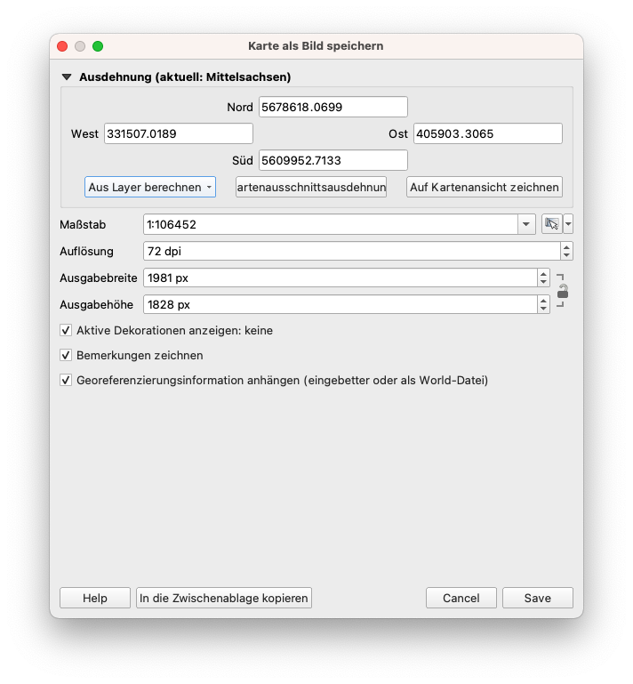
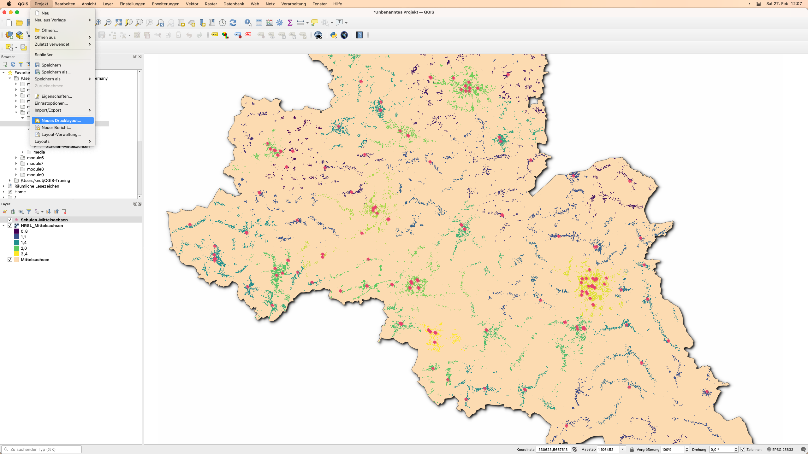
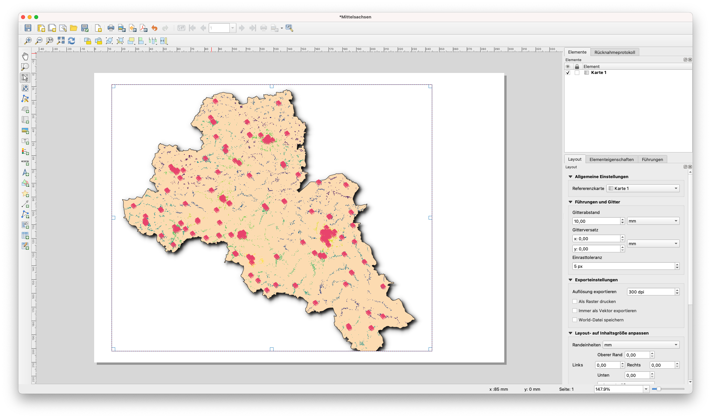
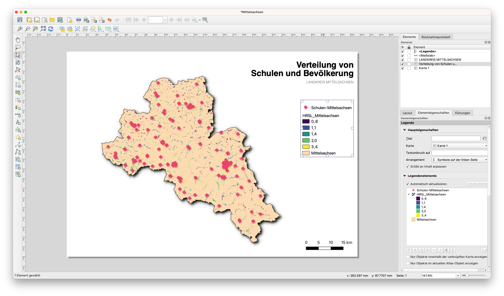
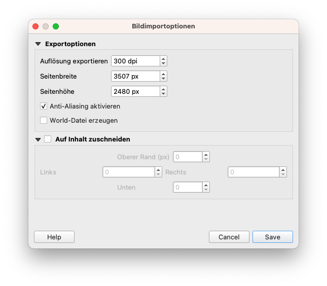
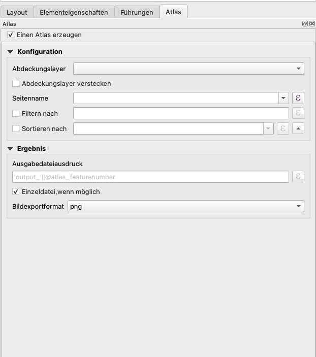
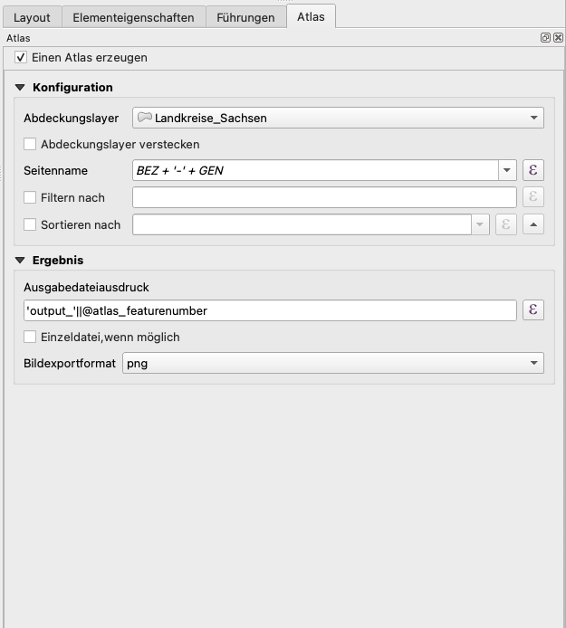
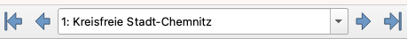
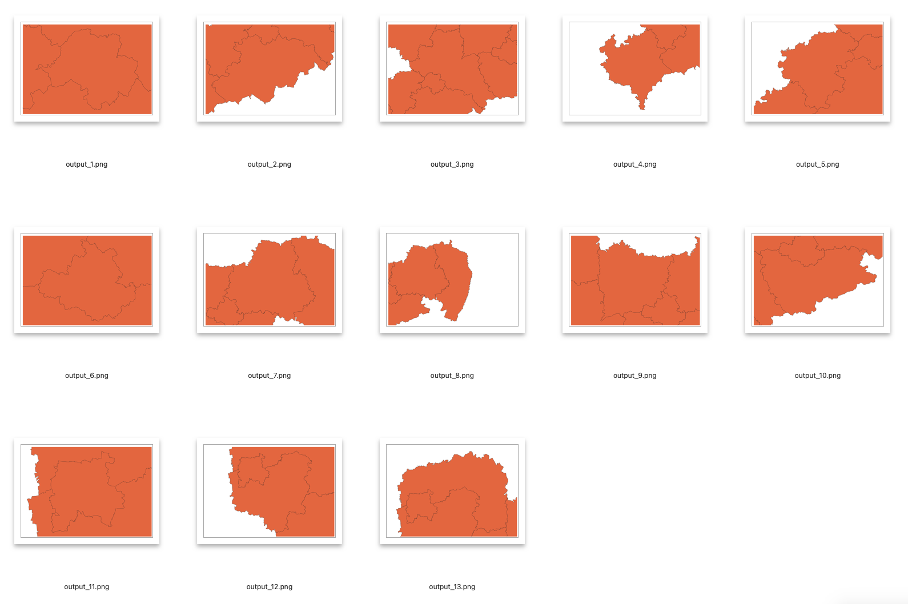

# Modul 5 - Karten erstellen

**Autor**: Ketty

## Pädagogische Einführung

In diesem Modul erhalten Sie einen Überblick über die üblichen Schritte, die zur Erstellung einer Karte in QGIS notwendig sind. Am Ende des Moduls werden die Teilnehmenden die folgenden Konzepte kennen;

* Kartenbereich und zugehörige Layer
* Das Drucklayout und die Druckvorlage
* Kartenelemente und Eigenschaften

Darüber hinaus werden Sie die folgenden Fähigkeiten erlernt haben:

* Verwenden des Drucklayouts zur Erstellung einer Karte
* Hinzufügen von Kartenelementen zur Karte
* Verwalten verschiedener Drucklayouts

## Technische Voraussetzungen

* Arbeitsfähiger Computer
* Internetzugang
* QGIS 3.16 oder neuer
* Mittelsachsen (innerhalb von [Modul-5.gpkg](data/Modul-5.gpkg))
* Schulen-Mittelsachsen (innerhalb von [Modul-5.gpkg](data/Modul-5.gpkg))
* Landkreise_Sachsen (innerhalb von [Modul-5.gpkg](data/Modul-5.gpkg))
* [Sachsen High Resolution Settlement Layer](data/HRSL_Mittelsachsen.tif)

## Voraussetzungen

* Grundkenntnisse in der Bedienung eines Computers
* Verständnis für alle vorherigen Module

## Zusätzliche Ressourcen

* QGIS Kartenlayout - [https://docs.qgis.org/3.16/de/docs/training_manual/map_composer/index.html](https://docs.qgis.org/3.16/de/docs/training_manual/map_composer/index.html)
* Layout-Hub - [https://layout-hub.github.io/](https://layout-hub.github.io/)
* Der Style Manager - [https://docs.qgis.org/3.16/de/docs/user_manual/style_library/style_manager.html](https://docs.qgis.org/3.16/de/docs/user_manual/style_library/style_manager.html)
* Die Stilbibliothek - [https://docs.qgis.org/3.16/de/docs/user_manual/style_library/index.html](https://docs.qgis.org/3.16/de/docs/user_manual/style_library/index.html)

## Thematische Einführung

Lassen Sie uns mit einem Beispiel beginnen:

Um eine Karte zu erstellen, benötigen Sie eine Frage, das Sie besser verstehen möchten, z. B. "Räumliche Verteilung von Schulen in Mittelsachsen". Sie werden feststellen, dass die Frage sowohl ein zu erforschendes Thema als auch die geografische Lage vorgibt. Mit diesen Informationen und den relevanten Daten, die es Ihnen erlauben, die Frage weiter zu erforschen, können Sie loslegen und eine Karte erstellen.

### Gliederung der Konzepte

Dieses Modul konzentriert sich auf die folgenden Schlüsselkonzepte der Kartenerstellung: die Kartenansicht und die zugehörigen Layer, das Drucklayout sowie die Kartenelemente und -eigenschaften. Zunächst werden die einzelnen Begriffe kurz definiert;

* Die **Kartenansicht und das Layer-Bedienfeld**: sind wahrscheinlich die wichtigste Widgets innerhalb von QGIS. Sie zeigen die aus überlagerten Kartenebenen zusammengesetzte Karte und erlaubt die Interaktion mit der Karte und den Ebenen. Beides wurde im Modul 0: Einführung in QGIS behandelt
* das **Drucklayout** : Das Drucklayout bietet Layout- und Druckfunktionen. Es erlaubt Ihnen, Elemente wie die QGIS-Kartenansicht, Textbeschriftungen, Bilder, Legenden, Maßstabsbalken, Grundformen, Pfeile, Attributtabellen und HTML-Rahmen hinzuzufügen. Mit dem Druck-Layout können Sie schöne Karten und Atlanten erstellen, die gedruckt oder als PDF-Datei, ein Bild oder eine SVG-Datei gespeichert werden können. Dies ist eine leistungsfähige Möglichkeit, mit QGIS erstellte geografische Informationen weiterzugeben, die in Berichte aufgenommen oder veröffentlicht werden können. Sie können das Layout als Vorlage speichern und in einer anderen Sitzung wieder laden. Schließlich können Sie mit dem Atlas-Generator mehrere Karten auf Basis einer Vorlage erzeugen. Die Abbildung unten zeigt die Schnittstelle für das Drucken von Layouts und Druckvorlagen. Diese Ansicht wird geöffnet, wenn Sie ein neues Drucklayout öffnen.

Bild 5.1: Drucklayout

* **Kartenelemente und Eigenschaften**: Karten enthalten eine Vielzahl von Informationen. Die meisten Karten haben die folgenden fünf Dinge: einen Titel, eine Legende, ein Raster, eine Kompassrose zur Richtungsangabe und einen Maßstab. 

## Hauptinhalt

### Teil 1: Exportieren der Kartenansicht

In diesem Tutorial zeigen wir zwei Möglichkeiten, die Kartenansicht in das QGIS Drucklayout zu exportieren. Die erste Methode ist einfach, während die zweite Methode die erweiterten Möglichkeiten des Drucklayouts erforscht.

#### **Erste Methode: Exportieren der Kartenansicht ohne das Drucklayout**

1. Sie sollten Ihre Daten bereits als Layer hinzugefügt und gestylt haben. Sie können Kartendekorationen hinzufügen, indem Sie auf **Ansicht ‣ Dekorationen** klicken. Wählen Sie Ihre bevorzugte Kartendekoration aus. Sie können z. B. die Titelbeschriftung, den Maßstabsbalken und die Urheberrechtshinweise hinzufügen. Für jede Dekoration müssen Sie in einem Dialogfeld Einstellungen festlegen.
2. Der letzte Schritt besteht darin, die Karte entweder in ein Bild- oder ein PDF-Format zu exportieren. Klicken Sie dazu auf **Projekt ‣ Import/Export** und wählen Sie dann das gewünschte Exportformat. Der folgende Exportdialog sollte erscheinen.

Bild 5.2: Exportieren der Karte

3. Klicken Sie auf **Speichern**. Die Karte in der wird als PDF- oder Bilddokument gespeichert.

Abbildung 5.3: Kartenansicht als Bild exportiert

#### **Zweite Methode: Exportieren der Kartenansicht in das Drucklayout**

1. In diesem Tutorial werden wir eine Karte erstellen, die 1.) die Lage von Schulen und 2.) die Bevölkerungsdichte in Mittelsachsen zeigt. Die Daten-Layer sollten bereits zum QGIS-Canvas hinzugefügt sein. Die Layer können dann gestylt werden, um die Informationen in Ihren Daten zu vermitteln.

Abbildung 5.4: Neues Drucklayout erstellen

2. Die Kartenansicht kann nun in das Drucklayout exportiert werden. Klicken Sie dazu auf die Schaltfläche "Neues Drucklayout" !(media/newprint_composer.png "Neues Drucklayout"). Diese kann über die Symbolleiste aufgerufen werden. Alternativ können Sie auch über die Menüleiste "Projekte" darauf zugreifen. Es öffnet sich ein Titeldialog, der Sie auffordert, den Titel des Drucklayouts einzugeben. Geben Sie "Mittelsachsen" ein und klicken Sie auf "OK".

Abbildung 5.5: Benennung des Drucklayouts

3. Das Drucklayout wird geöffnet

Bild 5.6: Das Drucklayoutfenster

4. Sie werden feststellen, dass die Drucklayout-Leinwand leer ist. Um die gestylte Karte aus der QGIS-Leinwand hinzuzufügen, klicken Sie auf die Schaltfläche "Karte hinzufügen" , klicken Sie mit der linken Maustaste und zeichnen Sie ein Rechteck in den weißen Bereich in der Mitte des Drucklayouts. Die Karte sollte nun hinzugefügt werden. Nun können Sie alle anderen Kartenelemente wie Titel, Legende, Raster usw. hinzufügen.

Abbildung 5.7: Karte zum Drucklayout hinzufügen

#### **Quizfragen**

1. Was ist die QGIS Kartenansicht? (mehrere auswählen)
2. Was ist der Nutzen des Drucklayouts? (mehrere auswählen)
3. Welches der folgenden Elemente ist kein Kartenelement? (eine Antwort)

#### **Quizantworten**

1. a. zeigt die Karte, die aus überlagerten Karten-Layern zusammengesetzt ist
   b. ermöglicht die Interaktion mit der Karte und den Layern
   c. ein Widget zur Erstellung von Karten

2. a. bietet Layout- und Druckfunktionen
   b. ermöglicht das Hinzufügen von Kartenelementen
   c. ermöglicht das Exportieren und Drucken von Karten

3. a. Titel
   b. Maßstab
   c. Legende
   d. Farben und Designs

### Teil 2: Kartenelemente mit dem Drucklayout hinzufügen und bearbeiten

#### **Inhalt/Tutorial**

Nachdem die gestylte Karte zum Drucklayout hinzugefügt wurde, ist es nun an der Zeit, die relevanten Kartenelemente wie Titel, Maßstab, Legende, Raster, Metadaten usw. zum Drucklayout hinzuzufügen. Die meisten Schaltflächen befinden sich auf der linken Seite des Drucklayouts.

1. Klicken Sie auf die Schaltfläche "Beschriftung hinzufügen" 
, halten Sie die linke Maustaste gedrückt und ziehen Sie ein Rechteck auf, in dem Sie den Titel der Karte platzieren möchten. Geben Sie den Titel unter dem Menü "Haupteigenschaften" auf der rechten Seite des Drucklayouts ein. Die Schrifteigenschaften können Sie im Bereich "Erscheinungsbild" ändern.

Bild 5.8: Kartentitel hinzufügen

2. Als nächstes fügen wir die Legende und den Maßstab hinzu. Mit der Schaltfläche "Beschriftung hinzufügen" können Sie außerdem auch eine Übersicht über die Datenquellen hinzufügen. Bewegen Sie den Mauszeiger über die Schaltfläche auf der linken Seite des Drucklayouts und klicken Sie auf die gewünschte Schaltfläche. Führen Sie die gleichen Schritte wie in oben aus, um das Kartenelement zum Drucklayout hinzuzufügen. Sie können weitere Kartenelemente hinzufügen, aber achten Sie darauf, dass die Karte nicht zu unübersichtlich wird.

Bild 5.9: Maßstab zur Karte hinzufügen

Bild 5.9: Legende zur Karte einfügen

Bild 5.10: Datenquellen zur Karte einfügen

3. Wenn das Kartenlayout zufriedenstellend ist, kann die Karte als pdf, png, jpeg oder svg exportiert werden. Alle Speicherfunktionen können über das Menü "Layout" aufgerufen werden.

4. Speichern Sie die Karte als Bild über **Layout ‣ Als Bild exportieren...** oder durch Klicken auf die Schaltfläche **Speichern als Rasterbild** . QGIS wird Sie fragen wo und mit welchen Optionen die Karte gespeichert werden soll.

Abbildung 5.10: Exportparameter

Bild 5.11: Exportierte Karte als Bild

#### **Quizfragen**

1. Unter welcher der folgenden Registerkarten können Sie die Eigenschaften von Kartenelementen ändern? (eine Antwort)
2. Wie können Sie dem Kartenlayout einen Quellenverweis hinzufügen

#### **Quizantworten**

1. a. Zusammenstellung
   b. Elementeigenschaften
   c. Atlas-Erzeugung
2. Fügen Sie eine neue Beschriftung hinzu und geben Sie dann den Quellenverweis ein.

### Teil 3: Automatisierte Kartenerstellung mit der Atlas-Funktion

#### **Inhalt/Tutorial**

Wenn Ihre Organisation gedruckte oder Online-Karten veröffentlicht, müssen Sie oft viele Karten mit der gleichen Vorlage erstellen - normalerweise eine für jede Verwaltungseinheit oder Region. Die manuelle Erstellung dieser Karten kann sehr viel Zeit in Anspruch nehmen und wenn Sie gerade bei regelmäßigen Aktualisierungen lästig werden. QGIS hat ein Werkzeug namens Atlas, das Ihnen helfen kann, eine Kartenvorlage zu erstellen und einfach eine große Anzahl von Karten für verschiedene geographische Regionen zu veröffentlichen. Nehmen wir die verschiedenen Landkreise Sachsens als Beispiel.

Bild 5.12: Abdeckungslayer

Bild 5.13: Attributtabelle

1. Dieser Layer dient als Abdeckungslayer, was bedeutet, dass der QGIS-Atlas für jedes der Features in diesem Layer eine Karte erstellt. Insgesamt werden also 13 Karten erzeugt.

2. Öffnen oder erstellen Sie ein neues Drucklayout und fügen Sie eine Karte hinzu.

Abbildung 5.14: Atlas-Drucklayout

3. Wählen Sie dann im rechten Bereich des Drucklayouts das Menü **Atlas** aus und aktivieren Sie das Kontrollkästchen **Einen Atlas generieren**. Sie können die Atlas-Einstellungen auch über die Schaltfläche  in der Atlas-Symbolleiste öffnen.

Bild 5.15: Atlas-Generierung

3. Der nächste Schritt ist die Auswahl des Abdeckungslayers; der Abdeckungslayer ist der Indexlayer, der zur Erstellung jeder Seite verwendet wird. Für jedes Merkmal im Abdeckungslayer wird eine Karte/Seite für den Atlas erzeugt. In unserem Fall wird bei Verwendung des Layers Landkreise_Sachsen eine Karte für jeden der 13 Landkreise erstellt. QGIS Atlas ändert dynamisch den Ansichtsausschnitt für jedes Feature im Abdeckungslayer. Sie können den Abdeckungslayer in den von Ihnen erstellten Karten ausblenden (d.h. der Abdeckungslayer wird im Drucklayout nicht sichtbar sein) und auswählen, wie die einzelnen Seiten Ihres Atlas benannt werden sollen. Sie können auch einige Filterungen und Sortierungen des Abdeckungslayers vornehmen, wenn Sie dies benötigen. Für das **Ergebnis** können Sie sich für eine einzelne Datei als Ausgabe entscheiden, indem Sie das Kontrollkästchen **Einzeldatei wenn möglich** aktivieren. Wenn das Häkchen nicht gesetzt ist, wird eine Datei pro Karte erzeugt.

Bild 5.16: Abdeckungslayer auswählen

4. Nachdem wir nun den Abdeckungslayer festgelegt haben, sollten wir dem Drucklayout mitteilen, dass es den Atlas verwenden soll, um den Umfang der Karten (auf der druckbaren Karte sichtbarer Bereich) zu steuern. Aktivieren Sie auf der Registerkarte **Elementeigenschaften** das Kontrollkästchen für **Gesteuert durch Atlas**.

Abbildung 5.17: Stellen Sie sicher, dass die Kartenausdehnung durch den Atlas gesteuert wird

5. Um eine Vorschau Ihres Atlas zu erhalten, klicken Sie auf die Schaltfläche Atlas-Vorschau anzeigen  in der Atlas-Symbolleiste. Dies zeigt Ihnen die 13 Karten, die Sie erstellt haben. Verwenden Sie die Atlas-Symbolleiste , um in den Atlas-Karten zu navigieren.

Abbildung 5.18: Atlas-Vorschau

6. Sie können die Atlas-Karten über die Schaltfläche **Atlas exportieren**  entweder als Bild oder als PDF exportieren. Wählen Sie **Atlas als Bild exportieren**. Sie sollten 13 Karten generiert haben, wobei jede Karte die Ausdehnung jedes Landkreises zeigt.

Abbildung 5.18: Atlas Dateien 

7. **Tipp**: Für dieses Beispiel haben wir nur den Abdeckungslayer abgebildet. Die Stärke des Atlas liegt darin, dass er mehrere Layer abbildet. In unserem Beispiel haben wir die Daten zu Kliniken, Straßennetz und Bevölkerungsdichte für das gesamte Land als Layer in QGIS geladen. Würden wir eine Karte für jede Provinz erstellen wollen, die dieselben Layer zeigt, könnten wir nun den Atlas verwenden. Dabei müssen wir nur eine Layout-Vorlage erstellen, und der Atlas übernimmt die Erstellung der anderen Karten auf der Grundlage des verwendeten Layers.

8. **Tipp**: Sie können QGIS Ausdrücke für die Einstellung der anderen Kartenelemente in Ihrem Atlas verwenden, so dass diese sich ebenfalls dynamisch in Abhängigkeit von dem abgebildeten Feature des Abdeckungslayers ändern. In unserem Beispiel können Sie zum Beispiel einen QGIS-Ausdruck verwenden um den aktuellen Landkreis in einem Beschriftungsfeld anzuzeigen. Wählen Sie dafür `[%BEZ + '-' + GEN%]` als Beschriftung. Diese wird sich in jeder der exportierten Karten an den entsprechenden Landkreis anpassen.

Weitere Informationen über den QGIS Atlas finden Sie unter: [https://www.youtube.com/watch?v=tOnMJBUvEjY](https://www.youtube.com/watch?v=tOnMJBUvEjY).

#### **Quizfragen**

k.A.

#### **Quiz-Antworten**

k.A.
