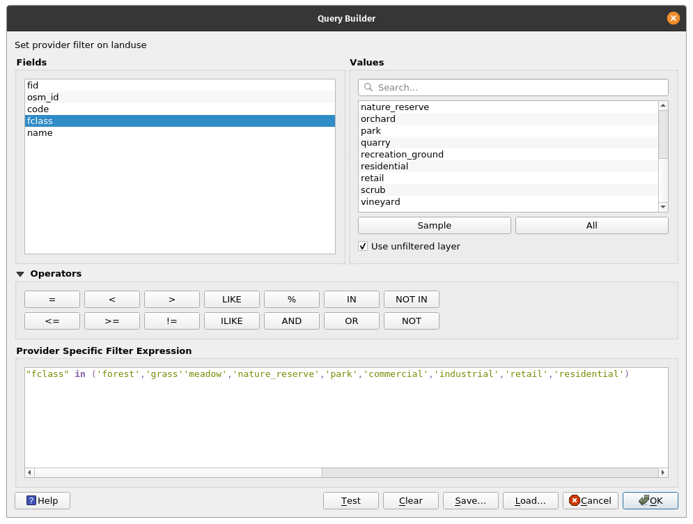
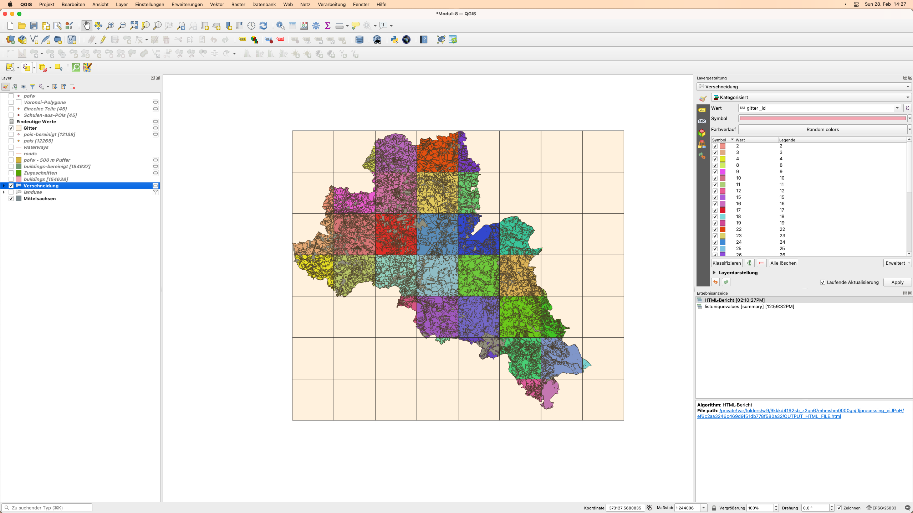
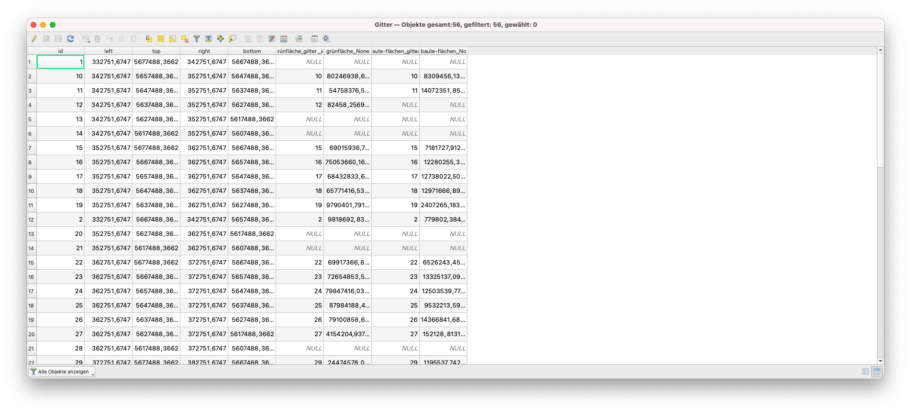

# **Modul 8 - Vektorverarbeitung und -analyse**

**Autor**: Codrina
**Übersetzung**: Knut Hühne

## Pädagogische Einführung

Dieses Modul konzentriert sich auf einen bestimmten Typ von geographischen Daten: Vektor-Geodaten.

Am Ende dieses Moduls sollten Sie ein grundlegendes Verständnis für die folgenden Konzepte haben:

* Vektordatenmodell
* Metadaten
* Vektorverarbeitung
* Geodatenanalyse
* Geostatistik
* Topologie
* Geoprocessing

Außerdem erwerben Sie die folgenden Fähigkeiten:

* Qualitätskontrolle von geometrischen Vektordatensätzen mit Algorithmen zur Überprüfung der Vektordatentopologie und Durchführung grundlegender automatischer Korrekturen
* Arbeiten mit Algorithmen zur Identifizierung von Fehlern in der Attributtabelle
* Vektordatenverarbeitung - Ausführen einfacher Geoprocessing-Algorithmen zur Beantwortung möglicher Anforderungen, z. B. wie viele öffentliche Gebäude gibt es in meiner Verwaltungsregion?
* Vektordatenverarbeitung - Verwendung von Geostatistik-Algorithmen zum Auffüllen fehlender Daten. 


## Erforderliche Werkzeuge und Ressourcen

* Dieses Modul wurde mit [QGIS Version 3.16.1 - Hannover](https://qgis.org/de/site/forusers/download.html) erstellt.
[TODO]
* Die Datensätze, die für alle in diesem Modul beschriebenen Übungen verwendet werden, sind in der folgenden Tabelle aufgeführt:
[/TODO]
* Das verwendete Koordinatenreferenzsystem ist das ETRS89/UTM Zone 33N, EPSG 25833. Da es sich um ein projiziertes Koordinatensystem handelt, ermöglicht es geometrische Berechnungen. 


## Voraussetzungen

* Grundkenntnisse in der Bedienung eines Computers
* Ein solides Verständnis der Module 0, 1 und 2 und 6. Modul 0 führt in den Begriff des Vektordatenmodells ein, das im Mittelpunkt dieses aktuellen Abschnitts steht. Ein vorheriges Verständnis der Module 1, 2 und 6 ermöglicht es Ihnen, sich ausschließlich auf die neuen Begriffe und QGIS-Funktionalitäten zu konzentrieren, die in diesem neuen Abschnitt eingeführt werden, ohne dass Sie sich fragen müssen, wie Sie einen neuen Layer in Ihr Projekt laden können oder wie Sie mit der Attributtabelle Ihres Datensatzes arbeiten.  

Im Rahmen dieses Moduls lernen Sie, wie Sie effizient mit vektorgeografischen Datensätzen arbeiten können, um neue Informationen zu extrahieren. Dazu gehört ein vertieftes Verständnis dafür, was Vektordaten sind, welche Qualitätsstandards sie erfüllen müssen, damit sie wirklich brauchbar sind, was die häufigsten Operationen sind, die mit Vektordaten durchgeführt werden (Geoprocessing, Geostatistik). 


## Zusätzliche Ressourcen: 

* QGIS: Arbeiten mit Vektordaten [https://docs.qgis.org/3.16/de/docs/user_manual/working_with_vector/functions_list.html](https://docs.qgis.org/3.16/de/docs/user_manual/working_with_vector/functions_list.html) 
* [What is geoprocessing?](http://www.geo.hunter.cuny.edu/~jochen/gtech361/lectures/lecture12/concepts/01%20What%20is%20geoprocessing.htm)
* [Encyclopedia of GIS, 2017 Edition, Editors: Shashi Shekhar, Hui Xiong, Xun Zhou](https://link.springer.com/referencework/10.1007/978-3-319-17885-1)
* [Metadata And Catalogue Services](https://www.geo-train.eu/modules/metadata/pdf/Metadata.pdf), Autorin Mariana Belgiu, UNIGIS Salzburg
* [Grundlagen der Metadaten (englischsprachig)](https://www.fgdc.gov/resources/factsheets/documents/GeospatialMetadata-July2011.pdf)


## Thematische Einführung

Lassen Sie uns mit einem Beispiel beginnen: Sie sind gerade mit der Bahn in Chemnitz angekommenund wollen sich jetzt mit dem Fahrrad weiter auf den Weg nach Frankenberg machen. Sie wissen weder, wo der Bahnhof in Bezug auf die Stadt liegt, noch, wo sich ihr Ziel befindet, also öffnen Sie als erstes einen Stadtplan, um sich in dieser neuen Stadt zu orientieren. Sie nehmen Ihr Telefon heraus, öffnen eine Karten-App und wählen den Startpunkt - den Bahnhof - und den Endpunkt - Frankenberg - und fragen dann nach der Route mit dem Fahrrad. In Sekundenschnelle bietet Ihnen die Routing-App die beste Lösung an, um von Punkt A zu Punkt B zu gelangen, und zeigt Ihnen diese an, wie in Abbildung 8.1 zu sehen.


Abbildung 8.1 - Mit Openstreetmap von Punkt A nach B


## Aufschlüsselung der Konzepte

Routing ist ein klassisches Beispiel für die Verwendung von Vektordaten und lässt sich in mehrere Konzepte aufschlüsseln, die wir im Folgenden definieren werden. 

Die verwendeten Daten sind räumlich - sie haben eine definierte Position auf der Erde, ihre Attribute sind ebenfalls gut identifiziert. So repräsentiert ein Punkt mit Längen- und Breitengrad und dem Attribut "name=Chemitz Hauptbahnhof" - den Startpunkt A und ein Punkt mit einem anderen Paar von Längen- und Breitengrad und dem Attribut "name=Frankenberg/Sachsen" den Punk B. Straßen werden durch Linien repräsentiert, die aus Knoten und Verbindungen bestehen (dargestellt durch blaue kleine Kreise in Abbildung 8.2), mit Attributen wie Name, Richtung, Geschwindigkeitsbegrenzung usw. 


Abbildung 8.2 - Vektorlinien, die Straßen darstellen, und die zugehörige Attributtabelle

Straßen stellen ein Netzwerkmodell dar, das im Grunde eine Sammlung von topologisch miteinander verbundenen Punkt- und Linienmerkmalen ist. Die Ergebnisse des Algorithmus, der die Route von Punkt A zu Punkt berechnet, hängen in hohem Maße von der Qualität der Vektoren ab. Sowohl in der Geometrie als auch in den Attributen - wenn eine Straße eine Einbahnstraße ist, muss das angegeben werden, damit das Routing Sie nicht in die falsche Richtung führt. 		

### Das Vektordatenmodell

Wie in Modul 0 vorgestellt, gibt es 2 Datenmodelle, die in einem Geographischen Informationssystem - GIS - verwendet werden: Raster und Vektor. Geodaten enthalten immer eine **Raumkomponente**, die den Ort oder die räumliche Verteilung des betreffenden Phänomens angibt, und eine **Sachkomponente**, die dessen Eigenschaften beschreibt. Die Entscheidung, ob für eine bestimmte Situation das Raster- oder das Vektordatenmodell verwendet wird, hängt von der Quelle der Daten sowie vom Verwendungszweck ab. 

Das Vektordatenmodell wird zur Darstellung von Flächen, Linien und Punkten verwendet (Abbildung 8.3). 


Bild 8.3 - Vektordaten mit Attributtabelle


### Metadaten

Metadaten sind Daten über Daten. Sie charakterisieren auf verschiedenen Detailebenen den Datensatz, mit dem sie verknüpft sind, einschließlich Kategorien wie: wer ist der Anbieter/Eigentümer des Datensatzes, was ist die Lizenz, in welcher Sprache sind die Attribute geschrieben, welches Koordinatensystem wurde verwendet, welches geografische Gebiet wird beschrieben und was ist das Bezugsjahr, Schlüsselwörter, was sind die bekannten Einschränkungen, Genauigkeitsgrad, was war der ursprüngliche Umfang des Datensatzes und vieles mehr.

Metadaten sind von entscheidender Bedeutung, da ein klares Verständnis der Daten, die in einer bestimmten Analyse verwendet werden sollen, den Unterschied zwischen einer richtigen oder einer voreingenommenen Entscheidung ausmachen kann. Wenn man ermitteln muss, wo ein neues temporäres Krankenhaus platziert werden soll, die Straßendaten aber alt sind und nicht mehr die Realität vor Ort widerspiegeln, dann wird jede darauf basierende Entscheidung ungenau sein. 

Aufgrund der Bedeutung von Metadaten folgen ihre Kategorien (ihre Definitionen, Namen, welche Art von Informationen sie speichern können usw.) wohldefinierten und standardisierten Strukturen. Diese gut strukturierten Metadaten können dann in spezielle Kataloge integriert werden, die es Benutzer:innen ermöglichen, geografische Daten anhand gegebener Kriterien zu suchen. Es gibt zahlreiche Metadatenkataloge; wenn diese standardisiert sind, kann innerhalb der GIS-Software auf sie zugegriffen werden. Ein Beispiel dafür wird in Modul 9 QGIS Erweiterungen vorgestellt. 

An dieser Stelle sei noch angemerkt, dass Metadaten natürlich keine Besonderheit von Geodaten sind, sondern dass sie für jede Art von Daten zu finden sind.


### Gründe für die Vektorverarbeitung

Die Stärke von GIS liegt in seiner einzigartigen Fähigkeit, geometrische Eigenschaften, die reale Objekte und Phänomene in unserer Welt definieren, und ihre Attribute - entweder beobachtet, gemessen oder berechnet - zu verbinden und durch spezialisierte Softwareoperationen auf ihren Geometrien, auf ihren Attributen oder beidem durchzuführen, um neue Informationen abzuleiten. 

Obwohl GIS meist eng mit Karten assoziiert wird, die einfach nur geografische Informationen darstellen, gehen seine Funktionalitäten weit über die Erstellung von kartografischen Darstellungen hinaus, seien sie nun dynamisch oder statisch. 

**Raumdatenanalyse** (Synonyme: räumliche Analyse, geospatiale Analyse, geografische Analyse, räumliche Interaktion) ist ein allgemeiner Begriff, der sich auf jede Technik bezieht, die darauf abzielt, Muster zu identifizieren, Anomalien zu erkennen und Theorien zu testen, die auf räumlichen Daten basieren. Eine Analyse ist dann und nur dann räumlich, wenn die Ergebnisse sinnvoll mit der Verortung der analysierten Objekte zusammenhängen - einfach ausgedrückt: **Ort spielt eine Rolle**. Mit der Entwicklung der Informationstechnologie begannen Wissenschaftler:innen, verschiedene Methoden aus der Statistik, Geometrie, Topologie und anderen Wissenschaften auf die Analyse geografischer Daten anzuwenden, um Muster und Phänomene auf der Erdoberfläche zu untersuchen. 

**Geostatistik** ist ein Zweig der Statistik, der sich auf räumliche Daten bezieht. Die am häufigsten verwendeten Methoden beziehen sich auf die Interpolation, ein mathematischer Prozess, der die Schätzung unbekannter Werte auf der Grundlage bekannter Werte ermöglicht. 

**Topologie** ist ein Zweig der Mathematik, der es der/dem GIS-Anwender:in ermöglicht, die geometrischen Beziehungen zwischen Features zu kontrollieren und die geometrische Integrität zu erhalten. Die Topologie ist am besten als ein Satz von Regeln zu verstehen, der die Qualität räumlicher Daten sicherstellt und auf einen oder mehrere Vektor-Layer angewendet werden kann. Die Regeln sind so gestaltet, dass sie die Beziehungen in der realen Welt respektieren, die die Vektor-Layer darstellen. Zum Beispiel darf es keine Lücken zwischen den Polygonen geben, die Landkreise in einer Region darstellen, oder kein Punkt, der zum Baumlayer gehört, darf in einem Polygon des Gebäudelayers enthalten sein.

GIS-Software bietet Funktionalitäten, die es erlauben, relevante Topologieregeln zu definieren, sowie Algorithmen, um zu prüfen, ob sie zutreffen, und um den Vektor-Layer zu bereinigen, wenn Inkonsistenzen festgestellt werden. 

Geoprocessing ist ein allgemeiner Begriff, der alle Operationen - Prozesse - definiert, die auf einen geografischen Datensatz angewendet werden, mit dem Ziel, einen abgeleiteten Datensatz zu erhalten, der neue Erkenntnisse über die Daten ermöglicht. Übliche Geoprocessing-Operationen sind die Überlagerung von geografischen Merkmalen, die Auswahl und Analyse von Merkmalen, die Topologieverarbeitung und die Datenkonvertierung. Geoprocessing ermöglicht es, geografische Informationen zu definieren, zu verwalten und zu analysieren, um die Entscheidungsfindung zu unterstützen. 


TODO


Abbildung 8.4 - Elemente einer Geoverarbeitungsoperation

**TIP**: Auf Verarbeitungsalgorithmen (wie sie in diesem Modul verwendet werden) können Sie über die **Verarbeitungs-Toolbox** oder die **Locatorleiste** zugreifen.
/TODO


## Hauptinhalt: 

### Phase 1: Verstehen Ihrer Daten.

Es gibt viele Geoverarbeitungsoperationen, die mit Vektordaten durchgeführt werden können. Zu den gängigsten gehören die Überlagerung von geografischen Merkmalen, die Auswahl und Analyse von Merkmalen, die Topologieverarbeitung und die Datenkonvertierung. In dieser ersten Phase werden wir uns mit einigen von ihnen vertraut machen und verstehen, wie sie funktionieren und welche Ergebnisse wir erwarten können. 


#### **Schritt 1. Bereiten Sie Ihre Arbeitsumgebung vor.**

Öffnen Sie QGIS, richten Sie das Koordinatenreferenzsystem ein, in dem Sie arbeiten werden - EPSG 25833 - und fügen Sie die folgenden Datenlayer hinzu:

* Polygone - Landkreisausdehnung; Gebäude; Landnutzung;
* Linien - Straßen, Flüsse;
* Punkte - Religiöse Orte, Orte von Interesse

An dieser Stelle sollte Ihr QGIS-Kartenfenster wie in Abbildung 8.5 aussehen, natürlich, höchstwahrscheinlich, in anderen Farben. 


**TIP**: Verwenden Sie räumliche Indizes, um die Verarbeitungszeit zu beschleunigen und zu verbessern. Dies können Sie mit dem Algorithmus **Raumindex erzeugen** tun.


Abbildung 8.5 - Geladene Vektordatensätze: Punkte, Linien und Polygone


#### **Schritt 2. Verstehen Sie, was Sie da sehen.** 

Zu diesem Zeitpunkt haben wir 7 Vektor Layer in unser QGIS Projekt geladen. Die nächsten Schritte werden uns helfen, unsere Daten zu verstehen. 

* Überprüfen Sie, wie viele Features wir in einem Layer haben - es gibt mehrere Möglichkeiten, das zu tun: 

    * **Doppelklick auf den Layer ‣ Informationen ‣ Objektanzahl**.
    * **Öffnen Sie die Attributtabelle des Layers und schauen Sie ganz oben nach** 


Bevor wir eine grundlegende Statistik durchführen, wollen wir die Attributtabelle mit einigen geometrischen Attributen vervollständigen (siehe Modul 6 für Details): 

* Straßenlayer - berechnen Sie die Länge für jedes Straßensegment und speichern Sie sie in der Attributtabelle: Ausgabefeldname - Länge `round($length, 2)`
* Gebäudelayer - berechnet die Fläche für jedes Gebäude und speichert sie in der Attributtabelle; Ausgabefeldname - Fläche `round($area, 2)`

Nun sind die Attributfelder gefüllt, doch wenn Sie sich nicht sicher sind, in welcher Maßeinheit QGIS die Länge von Straßenabschnitten und Flächen von Gebäuden berechnet hat, dann hilft Ihnen die Überprüfung der Koordinatensystem-Informationen. 

Klicken Sie in der rechten unteren Ecke des QGIS-Kartenfensters auf EPSG 25833 und es erscheint ein Fenster wie in Abbildung 8.6. 


Abbildung 8.6 - Angaben zum im QGIS-Projekt verwendeten Koordinatenreferenzsystem

So finden wir heraus, dass die Maßeinheit der Meter ist, daher werden die Längen in Metern und die Flächen in Quadratmetern gemessen. 

* Führen Sie grundlegende Statistiken über die geladenen Layer aus, um einen besseren Überblick über Ihre Daten zu erhalten (Abbildung 8.7 ):

    * **Vektor ‣ Analyse ‣ Grundstatistik für Felder**


Abbildung 8.7 - Grundstatistik für Felder

Die zurückgegebene Statistik hängt vom gewählten Feldtyp ab und wird als HTML-Datei generiert.

Führen wir sie auf unserem Straßen-Layer aus und sehen wir, welche Ergebnisse wir erhalten. Füllen Sie das Fenster aus, wie in Abbildung 8.8. 


 [Vorbereiten der Grundlagenstatistik für den Layer Straßen)

Abbildung 8.8 - Vorbereiten der Grundlagenstatistik für den Layer Straßen

Die Ausgabedatei ist eine HTML-Datei, die mit jedem Browser (Firefox, Chrome, Safari usw.) geöffnet werden kann und wie folgt aussehen sollte: 


```
Analysiertes Feld: Länge
Anzahl: 76112
Eindeutige Werte: 30563
Fehlende Leerwerte (NULL): 0
Minimalwert: 0.03
Maximalwert: 4546.81
Bereich: 4546.780000000001
Summe: 11795873.809999991
Mittelwert: 154.9804736441033
Median: 62.974999999999994
Standardabweichung: 257.6998560908621
Variationskoeffizient: 1.6627891890603153
Minderheit (am seltensten vorkommender Wert): 0.03
Mehrheit (am häufigsten auftauchender Wert): 6.95
Erstes Viertel: 23.61
Drittes Viertel: 167.46
Interquartilabstand (IQR): 143.85000000000002
```


Aus diesen grundlegenden Statistiken finden wir heraus, dass es 76112 Straßensegmente im geladenen Layer gibt, wobei das kürzeste 0,03 m und das längste 4546,81 m lang ist. Wir finden heraus, dass die Summe der Straßen in Mittelsachsen etwa 12.000 km entspricht. Da der Mittelwert größer als der Median ist, sagt uns das, dass die 2. Hälfte des Datensatzes längere Straßenabschnitte enthält und die Straßenabschnitte in der 1. Hälfte überwiegen. Der Median zeigt jedoch, dass die meisten Straßensegmente eine Länge von nur 62m haben. 

Wenn wir die Basisstatistiken für die Spalte "type" im Gebäudelayer ausführen, erhalten wir folgende Ergebnisse: 

```
Analysiertes Feld: type
Anzahl: 154638
Eindeutige Werte: 113
Fehlende Leerwerte (NULL): 125119
Minimalwert: 10
Maximalwert: yard
Minimallänge: 0
Maximallänge: 20
Mittlere Länge: 1.3095875528654017
```


Die Ergebnisse sehen nicht gleich aus, wir haben weder Mittelwert, noch Median oder Standardabweichung. Das liegt daran, dass das Attributfeld, auf dem wir den Algorithmus laufen ließen, anders ist, wir haben keine Zahlen, sondern Wörter - Gebäudetypen. Wir finden heraus, dass wir von 154638 Gebäuden in Mittelsachsen für 125119 den Gebäudetyp nicht kennen. Wir finden auch heraus, dass es 113 einzigartige Kategorien gibt. 


#### **Schritt 3. Grundlegende Prüfungen, um schnell Fehler in Ihren Daten zu finden.**

Perfekte, makellose Datensätze sind das Äquivalent zum idealen Gas in der Physik. So etwas gibt es nicht, aber viele können ihm sehr nahe kommen. Bevor Sie also irgendeine Art von Analyse durchführen, um Informationen zu extrahieren, sind zumindest einige grundlegende Prüfungen notwendig, wie _sauber_ die Daten sind, die wir haben. 

Es gibt viele Arten von Fehlern, die die Qualität Ihrer Daten beeinträchtigen können, und je nach Umfang Ihrer Geodatenanalyse kann deren Einfluss auf das Endergebnis mehr oder weniger wichtig sein. Wenn Sie z. B. Geodaten verwenden, um sich mit dem Auto von Punkt A nach Punkt B zu bewegen, dann ist ein Straßen-Layer mit den Attributen, welche Straßen eine Einbahnstraße sind oder für Autos gesperrt sind, unerlässlich, um ein brauchbares Ergebnis zu erhalten.  Wenn Sie jedoch zu Fuß unterwegs sind, sind diese Informationen für Ihr Ergebnis nicht entscheidend. 

Wenn von Fehlern in Geodaten die Rede ist, gibt es 2 Hauptbegriffe, die gut verstanden werden müssen: 

**Genauigkeit** ist der Grad, in dem die Informationen auf einer Karte mit den realen Werten übereinstimmen und bezieht sich sowohl auf die Geometrie als auch auf die Attribute.

**Präzision** bezieht sich auf den Grad der Messung und Genauigkeit der Beschreibung in einem Geodatensatz.

Der Begriff **Fehler** umfasst sowohl die Ungenauigkeit von Daten als auch deren Fehlerhaftigkeit. Die **Datenqualität** bezieht sich auf den Grad der Präzision und Genauigkeit der Datensätze und wird meist in Datenqualitätsberichten dokumentiert. 

Die Analyse und _Bereinigung_ eines Geodatensatzes kann eine sehr zeitaufwendige und mühsame Aufgabe sein, ist aber - wie im obigen Beispiel gezeigt - unerlässlich. In diesem Abschnitt stellen wir einige GIS-Funktionen vor, mit denen schnelle Prüfungen von Vektordaten durchgeführt und eine Reihe von vorläufigen Schlussfolgerungen über deren Qualität gezogen werden kann. 

**Topologie-Checks**.

QGIS bietet eine Kernfunktionalität, die es ermöglicht, eine Reihe von topologischen Prüfungen an den geladenen Vektordatensätzen durchzuführen, die sogennannte Topologie-Prüfung. Die Topologie-Prüfung ist eine Kernerweiterung und kann über den Dialog **Erweiterungen verwalten und installieren** aktiviert werden. Öffnen Sie den Dialog "Erweiterungen verwalten und installieren" und stellen Sie sicher, dass das Plugin "Topologie-Prüfung" aktiviert ist (mit einem Häkchen versehen). Sie finden es unter der Registerkarte **Installiert**.


Abbildung 8.9.a - Topologie-Prüfung-Plugin

Um die Topologie-Prüfung anzuzeigen, aktivieren Sie sie als Bedienfeld unter **Vektor ‣ Topologie-Prüfung** (Abbildung 8.9.b). Sobald sie aktiviert ist, sieht ihr Fenster wie in Abbildung 8.9.c aus.  


Bild 8.9.c - Topologie-Prüfungsfenster


Um die Topologieregeln zu definieren, klicken Sie auf das dritte Symbol , wodurch sich ein Fenster wie in Abbildung 8.10 öffnet. 


Bild 8.10 - Fenster "Topologieregeleinstellungen"


Wir werden eine Reihe von Regeln für die Layer setzen, die wir in unser QGIS-Projekt geladen haben, unter Berücksichtigung der Objekte der realen Welt, die sie darstellen - Straßen, Gebäude, Wasserwege. 

Die Konfiguration der Topologie ist einfach, da die Regeln, die auf Basis des ausgewählten Layers angewendet werden können, bereits in diese Funktionalität eingebettet sind, wie Abbildung 8.11 zeigt. 


Abbildung 8.11 - Dropdown-Menü "Topologieregeln" basierend auf dem ausgewählten Layer.

Wählen Sie die Topologieregeln wie in Abbildung 8.12 dargestellt. 


Bild 8.12 - Einzustellende Topologieregeln 

Klicken Sie auf das erste Symbol  im Fenster des Topologieprüfers, um die Prüfung auszuführen, und warten Sie auf die Ergebnisse. Nach dem Ausführen der Topologieprüfung sollte Ihr Kartenfenster wie in Abbildung 8.13 aussehen. 


Abbildung 8.13 - Ergebnisse der Topologieprüfung

Im Topologie-Prüfungsfensters werden alle Fehler aufgelistet, die auf der Grundlage der Regeln, die wir in der vorherigen Phase definiert haben, identifiziert wurden. Wenn das Kontrollkästchen Fehler anzeigen aktiviert ist, werden die Fehler in der Karte rot hervorgehoben. Durch einen Doppelklick auf einen markierten Fehler wird die Karte an die entsprechende Stelle verschoben. 

Der Prozess der Korrektur von Fehlern in einem Datensatz, sei es in Bezug auf die Geometrie (Duplikate, Lücken etc.) oder in Bezug auf die Attribute (fehlende Werte, Rechtschreibfehler etc.), wird als Bereinigung eines Datensatzes bezeichnet und ist meist ebenso mühsam wie notwendig. Obwohl es Funktionalitäten gibt, die einen halbautomatischen Bereinigungsprozess unterstützen, ist oft eine manuelle Korrektur notwendig. In Abbildung 8.14 haben wir zum Beispiel einen Fehler in unserem Points of Interests Layer eingezoomt, einen doppelten (sogar dreifachen) Punkt. Wie man sieht, gibt es drei Punkte, die ein Café darstellen, der Unterschied liegt in der Attributtabelle, in der einer als Café, einer als Bäckerei und einer als Gaststätte aufgeführt ist.


Abbildung 8.14 - Doppelter Punk im Points Of Interests Layer

In diesem speziellen Fall wäre die Entscheidung des Anwenders höchstwahrscheinlich, den doppelten Punkt zu entfernen, da er bei der weiteren räumlichen Analyse Fehler verursachen kann. Wenn z.B. ein Stadtbeamter wissen möchte, wie viele Restaurants und Cafés sich in einem bestimmten Viertel befinden, wird der doppelte Punkt einen Fehler in die Ergebnisse einfügen, was letztendlich zu falschen Entscheidungen führen könnte.  

Deshalb werden wir mit einer automatischen Entfernung der doppelten Punkte fortfahren. Dazu verwenden wir eine Kernfunktion von QGIS - **Doppelte Geometrien löschen** - zu finden in der Verarbeitungs-Toolbox. Ihr QGIS sollte wie in Abbildung 8.15 aussehen. 


Abbildung 8.15 - Doppelte Geometrien im Layer Points of Interest löschen

Nach der Ausführung des Algorithmus präsentiert das Funktionsfenster die Ergebnisse, es hat 127 doppelte Punkte identifiziert - genau wie der Topologie-Checker - und sie gelöscht, so dass der Layer pois mit **12138 Features** übrig bleibt. Benennen Sie diesen Layer in **pois-bereinigt** um. Beachten Sie, dass die Ausgabe ein Layer im Speicher ist, den Sie dauerhaft machen können, indem Sie ihn in einer Datei speichern.


Abbildung 8.16 - Nach dem Löschen der Duplikate

Eine erneute Ausführung der Topologieprüfung führt zu einem Ergebnis von 0 Fehlern in Bezug auf die Topologieregel, dass es keine geometrischen Duplikate für den Layer "Points of Interest" gibt. 

**Achtung!** Der Algorithmus berücksichtigt **nur Geometrien** und ignoriert das Attribut. Wenn es, wie in unserem Fall, einige Unterschiede im Attribut für die Duplikate gibt, haben Sie keine Kontrolle darüber, welches beibehalten wird. Wenn also alle Informationen beibehalten werden sollen, müssen sie zuerst in alle Geometrien kopiert werden, so dass beim Löschen eines doppelten Features kein Informationsverlust entsteht. 

Lassen Sie uns eine weitere Topologieprüfung durchführen, diesmal auf unserem Gebäude-Layer. Konfigurieren Sie die folgenden Regeln: 

* darf keine ungültigen Geometrien haben
* darf keine Duplikate enthalten


Abbildung 8.17a - Topologieprüfungsregeln auf dem Gebäude-Vektor-Layer

Führen Sie den Algorithmus aus. 

Das Ergebnis sollte wie in Abbildung 8.17b aussehen. 


Abbildung 8.17b - Ergebnisse der Topologieprüfung auf dem Gebäude-Vektor-Layer

Bereinigen Sie das Duplikat-Feature mit Hilfe des oben angegebenen Verfahrens (Abbildung 8.18a)


Abbildung 8.18a - Entfernen von doppelten Geometrien auf dem Gebäude-Vektor-Layer


Abbildung 8.18b - Ergebnisse des Entfernens doppelter Geometrien auf dem Gebäude-Vektor-Layer


Eine vollständige Bereinigung der für dieses Modul verwendeten Vektordatensätze würde den Rahmen sprengen. Seine Komplexität macht es zu einem eigenen, fortgeschritteneren Modul.


#### **Step 4. Take a closer look at the information attached to the points, lines and polygons.**

Let's run one more algorithm to get a sense of what the attributes for our Pampanga layers are. After we’ve identified how many features each layer has, let’s see how many and which are the unique attributes in the following cases: 

* layer buildings_cleaned - attribute type;
* layer pois_cleaned - attribute fclass;
* layer waterways - attribute fclass;
* layer pofw - attribute fclass;
* layer roads -attribute fclass;
* layer landuse - attribute fclass;

For that, go to **Vector ‣ Analysis Tools ‣ List unique values** (figure 8.19)


Figure 8.19a - List unique values in a vector layer functionality

In the window that opens, insert each layer's name and attribute of interest as enumerated in the list above and you should have the following results: 


")

Figure 8.19b - List unique values in a vector layer functionality (Batch Processing)

<table>
  <tr>
   <td><strong>Layer name</strong>
   </td>
   <td><strong>No. of unique values</strong>
   </td>
   <td><strong>Unique values</strong>
   </td>
  </tr>
  <tr>
   <td>buildings_cleaned
   </td>
   <td>74
   </td>
   <td>military;parking;gymnasium;mosque;yes;house;NULL;track;college;Idelfonso';'Tuazon Str;terrace;with roof;construction;veterinary;gazebo;hut;connector_bridge_sky;barn;roof;Yakult;kindergarten;hospital;pharmacy;laboratory;apartments;multipurpose;public;warehouse;farm;quarry;school;footway;Not_sure.;temple;service;garage;office;allotment_house;train_station;commercial;transportation;industrial;storage_tank;hotel;marketplace;farm_auxiliary;university;Unsure_-_please_chec;power_substation;clinic;hall;hangar;greenhouse;gawad kaling phase 1;tennis;church;Brgy. San Vicente;fire_station;toilets;civic;pumping_station;retail;residential;shed;chapel;supermarket;clubhouse;dormitory;Pineda Residence;government;carport;manufacture;garages;motorway;house
   </td>
  </tr>
  <tr>
   <td>pois_cleaned
   </td>
   <td>105
   </td>
   <td>alpine_hut;artwork;bicycle_shop;comms_tower;college;chalet;beverages;tourist_info;veterinary;hunting_stand;greengrocer;gift_shop;food_court;restaurant;ruins;pharmacy;bank;fountain;convenience;monument;clothes;caravan_site;cafe;camera_surveillance;recycling;atm;furniture_shop;sports_shop;post_office;hospital;viewpoint;guesthouse;kindergarten;cinema;biergarten;garden_centre;doityourself;florist;lighthouse;fast_food;butcher;mobile_phone_shop;sports_centre;nightclub;motel;department_store;graveyard;fire_station;bar;car_rental;shoe_shop;stationery;golf_course;picnic_site;post_box;pitch;theatre;recycling_metal;playground;school;shelter;stadium;computer_shop;toy_shop;doctors;beauty_shop;bakery;kiosk;hostel;recycling_glass;laundry;pub;bicycle_rental;water_well;archaeological;nursing_home;swimming_pool;camp_site;town_hall;supermarket;toilet;bookshop;water_tower;park;courthouse;telephone;attraction;memorial;library;optician;mall;hotel;travel_agent;car_dealership;observation_tower;video_shop;tower;water_works;dentist;police;community_centre;car_wash;bench;hairdresser;museum
   </td>
  </tr>
  <tr>
   <td>waterways
   </td>
   <td>4
   </td>
   <td>river;canal;drain;stream
   </td>
  </tr>
  <tr>
   <td>pofw
   </td>
   <td>5
   </td>
   <td>christian_evangelical;christian_methodist;buddhist;christian_catholic;christian
   </td>
  </tr>
  <tr>
   <td> roads 
   </td>
   <td>25
   </td>
   <td>secondary;trunk;track;bridleway;primary;tertiary;path;track_grade2;steps;footway;cycleway;trunk_link;track_grade4;unclassified;service;primary_link;pedestrian;unknown;tertiary_link;secondary_link;living_street;track_grade5;residential;motorway_link;motorway
   </td>
  </tr>
  <tr>
   <td>landuse
   </td>
   <td>19
   </td>
   <td>military;park;forest;cemetery;recreation_ground;nature_reserve;heath;farmland;quarry;commercial;vineyard;industrial;scrub;orchard;grass;farmyard;meadow;retail;residential
   </td>
  </tr>
</table>


Table 8.1 - Table identifying how many and what are the unique values for the selected attributes

For a more in depth analysis of the attributes of our vector layers, we will use the GroupStats plugin. It was developed to support statistics calculation for feature groups in a vector layer making it very useful to gain more understanding of your data, as well as to spot potential errors in the attributes. 

First, make sure that you have installed and activated the GroupStats plugin. Afterwards, to open the GroupStats window, go to   **Vector ‣ GroupStats ‣ GroupStats**.


Figure 8.20a - GroupStats plugin

A new window like the one in figure 8.20b should open. 


Figure 8.20b - GroupStats window

As per the analysis done earlier, we have seen that for the layer buildings we have 74 different types of buildings, but how many each and what is the total built area taken by each category? How much space for schools, for markets, houses? GroupStats can help us answer this question. On the right side of the window, there is the control panel, where we choose what we want to calculate, as well as how the data should be arranged. Using drag&drop, follow the arrangement in figure 8.21, then press calculate. 


Figure 8.21 - Running GroupStats on the building layer. 

Looking at the result, we can extract important insights regarding our data. For example, for residential purposes in the Pampanga province, we have 3270 buildings with a total surface area built of 405937 square meters, approx. 40 hectares. We also find out that the largest has 1474 square meters as the smallest has 10 square meters. And one can continue the analysis for further valuable information. 

Another interesting analysis can be run on the roads vector layer. Figure 8.22 shows how to calculate the lengths of roads categorised by type of road (primary, residential, motorway etc.) and maximum speed allowed. 


Figure 8.22 - Running GroupStats on the roads layer. 


#### **Quiz questions**

1. Is metadata important? 
* _<span style="text-decoration:underline;">Yes, because it gives insight into the geographical data that otherwise one could not gain. </span>_
* _No, it’s just bureaucracy. _
2. Topology is relevant to the geometry or to the attribute table of a vector layer?
* _to the geometry of the vector layer. _
3. What is more important, the geometry or the attribute data? 
* _Geometry._
* _Attribute data._
* _<span style="text-decoration:underline;">Both.</span>_


### Phase 2: Introduction into vector processing

First phase of the vector module made a brief introduction into the steps that one should make to have a basic understanding of the geospatial data they have at hand. 

This second phase of the module leads you into a more in depth work to process vector data in order to extract valuable insights to assist decision making. Following the concepts described at the beginning of this module, geoprocessing represents any process applied to a geographical dataset, with the scope of obtaining a derived dataset opening new insights on the data. And this is what we will attempt to do in the following. 

There are many operations that can be performed on one or more geospatial datasets and during this first step, we will run some of the most common ones to understand how they operate. 

**Buffer.** Imagine that you need to analyse a new piece of legislation that asks that on an area of 500 meters around places of worship there can be no other construction built. You would want to see where exactly those delinations are and maybe even how many square meters that is for your district. First step is to define a buffer around the places of worship: **Vector ‣ geoprocessing tools ‣ Buffer**. When the buffer window opens, set the parameters like in figure 8.23: 


Figure 8.23 - Setting the parameters for a 500 m buffer around the places of worship

A detail of the result of the geoprocessing is depicted in figure 8.24: 


Figure 8.24 - Running buffer on a point vector layer

To completely answer the initial question, the next step is to calculate the areas for all buffers and sum them up (see Phase 1, step 4) - figure 8.25. 


Figure 8.25 - Calculate area for the newly obtained layer, then calculate using GroupStats the total sum.

**Clip.** Imagine you want to know where all the industrial delineated areas are in your district and also how many buildings are within that perimeter. Visual inspecting your vector data, you notice that you have a number of industrial areas that contain several buildings. You want to separate those buildings and to use them further. First step is to select all features in the landuse layer that have as attribute industrial (see module 6 for how to do that). Afterwards, you go to **Vector ‣ Geoprocessing tools ‣ Clip** and choose as the layer to be clipped buildings_cleaned. Your results should look like in figure 8.27b. 


Figure 8.26a - Select landuse fclass = industrial. 


Figure 8.26b - Reduced selection of a few buildings and industrial landuse, so the computation can finish faster. 

Run the Clip algorithm. Make sure to check **Selected features only** box for the Overlay layer (landuse). This will ensure that only the currently selected features will be used for clipping and speed up the computations.


Figure 8.27a - Running the Clip algorithm

After running the algorithm, your results should look like in figure 8.27b. The clipped buildings are colored in green (might be different on your machince). How many industrial buildings have you clipped and what is their total area? 


Figure 8.27b - Results of the clip functionality

**Thiessen (Voronoi) polygons.** Imagine you have to make a series of administrative decisions in your district based on how many schools there are and what specific areas they serve. Geospatial analysis can be of assistance. You can start by calculating the Thiessen polygons. Based on an area containing at least two points, a Thiessen Polygon is a 2-dimensional shape which boundaries contain all space which is closer to a point within the area than any other point without the area. A good use example is in meteorology, where weather stations are discrete points, yet the information collected is considered to be measured out on the surface based on the thiessen polygons. 

To respond to the above question, we will run the algorithm only for points that have the attribute school at type. Thus, make the selection as instructed in module 6. You should have 88 features selected on layer pois_cleaned. Go to **Vector ‣ Geometry Tools ‣ Voronoi Polygons..** After setting the parameters - select the point layer for which we want the Voronoi polygons calculated and a 30% extension so that the entire Pampanga province is contained, you should see a result like in figure 8.28d. 


Figure 8.28a - Filtering the poi layer to get all schools


Figure 8.28b - All schools in the poi layer


Figure 8.28c - Running the Voronoi polygon algorithm


 polygons algorithm to a point vector layer")

Figure 8.28d - Results of applying Thiessen (Voronoi) polygons algorithm to a point vector layer

Sometimes, the necessities impose the requirement of having information in smaller, clearly defined and equal areas and not for an entire large region, such as a country or a big city. Therefore, the data needs to be analysed and visualised in a sliced, well-defined way, allowing comparison that otherwise could prove difficult without a ground common reference. 

Let us assume that you have to present a report that will allow comparisons done for units of 10X10 km over the administrative unit, including: 

1. density of green spaces (parks, forests) in report to the built-up space per unit;
2. total length of streets for each unit;
3. total length of waterways for each unit;
4. total number of public buildings for each unit (schools, kindergartens, hospitals , town halls etc.).

We’ve seen that there are tools that can assist us in calculating the total surface occupied by a certain type of feature, however the first step is to create our 10X10 units - cell grids. To do that, go to: **Vector ‣ Research Tools ‣ Create grid..** Set the parameters to: 
- Grid type - Rectangle (polygon)
- Grid extent - Pampanga_admin_boundary layer
- Horizontal spacing - 10 km
- Vertical spacing - 10 km 


Figure 8.29a - Create 10kmx10km vector grid for Pampanga province

You should get a result like in figure 8.29b. 


Figure 8.29b - 10X10km vector grid for the Pampanga province

Going further in answering the questions in our exercise, we need to do the following:

1. green spaces (parks, forests) built-up space per unit ratio:

Green spaces and built-up spaces is data contained by the landuse vector layer, polygon type. To know exactly what are the ‘green spaces’ we need to see what are the categories enclosed in the dataset. For that, we run **List unique values** algorithm on the `fclass` attribute and find out that we have the following ‘green’ classes: meadow, grass, nature_reserve, park, forest and the following ‘built-up space’ classes: retail, commercial, industrial,  residential.  Figure 8.30b presents a visualisation of our selections: 



Figure 8.30a - Filtering green areas and built-up space in Pampanga 


Figure 8.30b - Spatial distribution of the green areas and built-up space in Pampanga 

The second step to answer the requirement, is to identify how much green space and how much built-up space there is in each 10X10 km. To obtain that we will **intersect** the 2 overlaid polygon vector layers. The algorithm extracts the overlapping portions of features in the Input - the landuse layer and Overlay layer - the grid layer. Go to **Vector - Geoprocessing Tools - Intersection** or look for **Intersection in the Processing Toolbox or Locator Bar** Set the algorithm parameters as in figure 8.31.


Figure 8.31 - Parameters for the intersect algorithm

The result should look like in figure 8.32.



Figure 8.32 - Result of running the intersection algorithm to clip the landuse vector polygons to the grid layer. 

Now for each 10X10 km unit, we have the landuse features that we can work with. The attribute table also stores this information, as each grid cell - unit - has a unique id, see figure 8.33. 


Figure 8.33 - Landuse features clipped per each grid cell and it's associated attribute table. 

Now, that we have all landuse features per 10X10 km unit, we will continue with separating the geometries of the ones that make up the green space and built-up space as defined earlier - for each grid cell.  Thus, for green space, we will select all features that have the attribute value for `fclass: `meadow, grass, nature_reserve, park, forest. In attribute table, in the expression filed write down: ` "fclass" =  'meadow' or  "fclass" =  'grass' or  "fclass" =  'nature_reserve' or  "fclass" =  'park' or  "fclass"  =  'forest'`. Similarly, you can just type: `"fclass" in ('meadow', 'grass', 'nature_reserve', 'park', 'forest')`. Export the selected features as green_spaces_gridded  (see module 6 for more details). Don't forget to check **Save only selected features**. The new output should have 621 features. Do the same for the built-up space. Select the features in landuse that have the attribute value for `fclass` the following: retail, commercial, industrial,  residential, by writing the following expression in the Expression based filter window: `"fclass" =  'retail' or  "fclass" =  'commercial' or  "fclass" =  'industrial' or  "fclass" =  'residential'.` Select the filtered geometries and export as builtup_spaces_gridded. Your new output should have 3849 features. 

Alternatively, you can also use a filter instead of a selection.


Figure 8.34a - Selecting the green spaces.


Figure 8.34b - Selected green spaces.


Figure 8.34c - Green and Built-up spaces.

Next, calculate the area occupied by each feature of the 2 layers. Go to the attribute table of each layer and then add the geometric column area by inserting the expression `round($area,2) `in the field calculator.  (see module 6 for details, if needed). However, the 10X10km grid of the Pampanga province has a known number of grid cells, and that is 42. Therefore, we need to summarise the areas for all types of green spaces (forests, parks etc.) an built-up spaces (commercial, residential etc.) and join it accordingly to all of the 42 grid cells. To do this, we will use the **GroupStats** plugin to sum up for each grid_id all the green categories, respectively all the built-up categories. For the green_spaced_gridded vector layer, set the parameters as in figure 8.34e. 


Figure 8.34d - Computing the area of each feature.


Figure 8.34e - GroupStat parameters setup to sum up the green areas per each 10X10km grid cell.

Afterwards, save the results as a .csv file named `green_spaces_gridded`. Go to **Data ‣ Save all to CSV file.**

Run GroupStats for the built-up space in the same manner and then save it as a csv file named `builtup_spaces_gridded`.

Next, we will bring the 2 csv files calculated with GroupStat into QGIS  (**Layer ‣ Add layer ‣ Add delimited text layer** - see more details in module 2). 


Figure 8.35a - Loading green_spaces_gridded CSV


Figure 8.35b - The green_spaces_gridded CSV attribute table

Moving forward, we need to join the calculated spaces - green and built-up - to each 10X10 km cell grid. For that, select the grid10km vector layer in the TOC, open the properties window and go to **Joins**. This functionality allows you to join by a common attribute field, others. In our case, using the common grid_id value we will join, the sum of the built-up areas and green spaces fro the 2 csv files obtained in the previous stage.

In the **Join** window, push on the green plus button below  and set the parameters like in figure 8.35, for green spaces.


Figure 8.35c - Setting the parameters to join by common field grid_id/id the sums of green and built-up spaces for each grid cell - 10X10km unit.

Repeat for built-up spaces. 

The results of the two joins are visible in the attribute table, as can be seen in figure 8.36_b. We have kept the grid_id in both joins, to be sure no mistakes occurred. We can visually quickly check to make sure the 3 attribute fields: id, builtupgrid_id and greengrid_id are exactly the same. 


Figure 8.36a - Green and built-up CSV joined to Grid. 




Figure 8.36b - Attribute table of the grid10km vector layer containing the total areas for green and built-up spaces. 


As we have gathered all the needed information for green and built-up spaces in the attribute table of the grid layer, all we need to do is calculate the percentage of these spaces within the 10X10 km grid cell. We will calculate it using the field calculator, using the following expression: `round(100*green_None/100000000, 5)` and `round(100*builtup_None/100000000, 5).` Next, we add a new field in which we calculate the report of the GreenPre/BuilupPer, and thus reaching the answer to our request: green spaces (parks, forests) built-up space per unit ratio: `round( "greenPer" / "builtupPer" , 5).` To have a clear overview of our dataset, in cases where there is no built-up space in the grid cell - we insert the value 1000 in the attribute table, in cases where there is no green space, we will insert value 999, while in case both values are NULL then we insert 1001.  For this we can use the expression:

```
CASE 
WHEN (greenPer is NULL) and (builtupPer is not NULL) then 999
WHEN (builtupPer is NULL) and (greenPer is not NULL) then 1000
WHEN (greenPer is NULL) and (builtupPer is NULL) then 1001
ELSE round(greenPer / builtupPer, 5)
END
```

The final result would look like in figure 8.37e. 


Figure 8.37a - Percentage of green area in the 10km x 10km grid


Figure 8.37b - Computed percentage of green and built-up area


Figure 8.37c - Computing for the ratio of green and built-up areas


Figure 8.37d - Computed ratio of green and built-up areas


Figure 8.37e - Ratio of green and built-up areas in the 10km x 10km grid


2. total length of streets and waterways for each unit;

To accomplish this task, QGIS offers an algorithm that takes a polygon layer and a line layer and measures the total length of lines and the total number of them that cross each polygon. The resulting layer has the same features as the input polygon layer, but with two additional attributes containing the length and count of the lines across each polygon. Go to **Analysis Tools - Sum Line Lengths** and set the parameters as follows: 
- polygons - Grid
- lines - roads
- lines length field name - roadsL
- lines count field name - roadsC

You can create a temporary layer or save it as a file on your computer. If for representation, you use natural breaks, your map should look like in figure 8.38c. 


Figure 8.38a - Sum Line Lengths parameters


Figure 8.38b - Road lengths and counts per Grid cell


Figure 8.38c - Spatial distribution of 10X10km units with most roads

Now, repeat the same processing for waterways lengths in each grid cell. Running the process on the grid file obtained earlier will help you in having all information obtained so far attached to the same geometry. We advise you save this file on your computer with line_lengths_gridded.  If for representation, you use natural breaks, your map should look like în figure 8.39.


Figure 8.39 -  Spatial distribution of 10X10km units with most waterways 

3. total number of public buildings (schools, kindergartens, hospitals , town halls etc.) for each grid cell

To count the total number of public buildings in the 10X10 unit, we will use the pois_cleaned. First, we run **Vector ‣ Analysis Tools ‣ List unique values..** and decide which building we consider public. We will select from our vector point data layer (pois) the following features: `"fclass" = 'town_hall' or "fclass" = 'kindergarten' or "fclass" = 'hospital' or "fclass" = 'doctors' or "fclass" = 'fire_station' or "fclass" = 'community_centre' or "fclass" = 'stadium' or "fclass" = 'museum' or "fclass" = 'school' or "fclass" = 'theatre'.` Similarly, you can just type `"fclass" in ('town_hall', 'kindegarten', 'hospital', 'doctors', 'fire_station', 'community_centre', 'stadium', 'museum', 'school', 'theatre')`. Your selection should have 227 features in total. 


Figure 8.40a - Selecting public POIs


Figure 8.40b - Selected public POIS

To answer our request, we will use **Vector ‣ Analysis Tools ‣ Count points in polygon** algorithm. This algorithm takes a points layer and a polygon layer and counts the number of points from the first one in each polygons of the second one. A new polygons layer is generated, with the exact same content as the input polygons layer, but containing an additional field with the points count corresponding to each polygon. Set the point layer to pois_cleand and the polygon Grid layer with the calculated information in the previous round. For the points, check the **Selected features only** checkbox, so the algorithm calculates only the selected points - the public POIs. Save the output file as grid_info. 


Figure 8.40c - Count public POIS in each 10km x 10km grid


Figure 8.40d - Spatial distribution of public POIs density per unit 10X10km


#### **Quiz questions**

Q: If I have 2 vector layers - one represents the extent of the city where I am working and the second, the built roads in the entire country - what processing tool would I use to extract only the roads in my city: buffer or clip? 

A: Clip. 

Q. Is the buffer tool useful in the following case: I have a polygon vector layer with historic monuments in my region and I want to draw a 50m protection area around them? 

A: Yes

Q: Which one of the three geoprocessing tools would you use to merge two similar vector layers ? Voronoi polygons, dissolve, intersection? 

A: Dissolve. 


### Phase 3: Geostatistics. Interpolation - estimating missing data

