# **Modul 9 - Rasterverarbeitung und -analyse**

**Autor**: Codrina
**Übersetzung**: Knut Hühne

## Pädagogische Einführung

Dieses Modul konzentriert sich auf einen bestimmten Typ von geographischen Datenmodellen: Raster-Geodaten.

Am Ende dieses Moduls werden die Lernenden ein grundlegendes Verständnis für die folgenden Konzepte haben:

* Rasterdatenmodell
* Rasterpunkt vs. Rasterzelle
* Bänder eines Rasterdatensatzes
* Kartenalgebra 
* die vier Auflösungen eines Rasters (räumlich, zeitlich, spektral und radiometrisch)
* Resampling
* Stapelverarbeitung
* Änderungserkennung


## Erforderliche Werkzeuge und Ressourcen

* Dieses Modul wurde mit [QGIS Version 3.16 - Hannover](https://qgis.org/en/site/forusers/download.html) erstellt.
* [Modul-9.gpkg](data/Modul-9.gpkg)
    * Mittelsachsen
* [High Resolution Settlement Layer](data/HRSL_Mittelsachsen.tif)
* [SRTM Digital Elevation Model](data/SRTM_DEM)
* [Globale Landbedeckungskarte 2015-2019](data/Global_Land_Cover_Map)
* Das verwendete Koordinatenreferenzsystem ist das WGS84 / UTM33 EPSG 25833. 

## Voraussetzungen: 

* Grundkenntnisse in der Bedienung eines Computers
* Ein solides Verständnis der Module 0, 1, 2, 6 und 8 dieses Lehrplans. 


## Thematische Einführung

## Gliederung der Konzepte

### Das Rasterdatenmodell

Ein Raster ist eine regelmäßige Matrix von Werten, wie in Abbildung 9.1.


Abbildung 9.1 - Eine Matrix von Werten

Die Werte können **Rasterpunkten**, meist den Zentroiden, zugeordnet werden, in diesem Fall kann das Raster als Gitter bezeichnet werden. Die zweite Möglichkeit ist, dass die Werte der gesamten **Rasterzelle** - genannt Pixel - zugeordnet werden (siehe Abbildung 9.2). Für den ersten Fall stellt das Raster normalerweise ein kontinuierliches Feld dar, wie z. B. Höhe, Temperatur, Niederschläge, chemische Konzentrationen usw. Für den zweiten Fall, wenn die Werte dem gesamten Bereich des Pixels zugeordnet sind, repräsentiert das Raster normalerweise ein Bild - ein Satellitenbild, eine gescannte Karte, konvertierte Vektorkarten (siehe Teil 2). Es ist zu beachten, dass dieses Datenmodell für Netzwerke und andere stark linienabhängige Datentypen, wie z. B. Grundstücksgrenzen, nicht besonders effizient ist. 


Abbildung 9.2 - Auf der linken Seite werden die Werte Zentroiden zugewiesen. Auf der rechten Seite werden die Werte dem Bereich der Gitterzelle - dem Pixel - zugewiesen.			


### Funktionsweise der Rasterverarbeitung

Wie im Fall der Vektordatenverarbeitung basiert die Rasterdatenverarbeitung auf der gleichen Fähigkeit der geografischen Informationssysteme, Informationen der realen Weltphänomene zu speichern, zu verarbeiten und darzustellen, nur dass die Art und Weise, wie dies geschieht, unterschiedlich ist. Anstatt eindeutige Punkte, Linien und Polygone als Sammlungen von x- und y-Koordinaten zu speichern, haben wir eine Matrix von Werten, die sich wie ein Netz über ein bestimmtes Gebiet zieht. Um ein deutlicheres Bild vor Augen zu haben, stellen Sie sich die Temperaturkarten vor, die im Fernsehen gezeigt werden. Die Temperatur ist ein kontinuierliches Feld, es gibt keinen Ort auf der Erdoberfläche ohne Temperatur, sei sie positiv, negativ oder 0.

Auf Rasterdatensätzen können viele Operationen durchgeführt werden, das in Modul 8 erläuterte Konzept des Geoverarbeitung gilt auch hier. Der Begriff für die Operationen, die auf Rastern durchgeführt werden können, lautet _Kartenalgebra_. 

**Kartenalgebra** stellt eine Reihe von primitiven Operationen[^1] in einem GIS dar, die es ermöglichen, aus zwei oder mehr Raster-Layern mit _ähnlichen Abmessungen_ einen neuen Raster-Layer (Karte) zu erzeugen, indem verschiedene Operationen wie Addition, Subtraktion, Vergleich usw. durchgeführt werden.  

Es gibt vier Kategorien von Operationen, die auf Rastern durchgeführt werden können, wie folgt: 

* Arithmetische Operationen: Addition, Subtraktion, Multiplikation, Division.
* Statistische Operationen: Minimum, Maximum, Durchschnitt, Median.
* Relationale Operationen: Vergleiche zwischen Zellen mit Funktionen wie größer als, kleiner als oder gleich.
* Trigonometrische Operationen: Sinus, Kosinus, Tangens, Arcussinus zwischen zwei oder mehreren Rasterdatensätzen.
* Exponentielle und logarithmische Operationen verwenden Exponent- und Logarithmusfunktionen.

Für jede dieser Operationen gibt es Algorithmen, die in den meisten GIS-Umgebungen implementiert sind und auf Daten im GIS angewandt werden können. Im Folgenden werden wir einige der gebräuchlichsten Operationen nutzen, um ein Gefühl dafür zu bekommen, wie man damit arbeitet und was man von dieser Art der Datenverarbeitung erwarten sollte. 

Das Konzept der _ähnlichen Dimensionen_ bezieht sich auf die Eigenschaften der Rasterdatensätze. Das heißt, die oben beschriebenen Operationen können nicht mit sinnvollen Ergebnissen auf 2 Rasterdatensätzen mit unterschiedlicher räumlicher, zeitlicher oder spektraler Auflösung durchgeführt werden. Im Folgenden werden wir alle vier Auflösungen, die für Rasterbilder relevant sind, sehr kurz vorstellen.

Zur Erinnerung: Es gibt 4 Arten von Auflösungen eines Satellitenbildes (Raster mit Werten, die einer Zellfläche - Pixeln - zugeordnet sind): 

1. **Die räumliche Auflösung** entspricht der elementaren Größe der gemessenen Bodenoberfläche, sie wird in Längeneinheiten ausgedrückt und stellt die Länge einer Pixelseite dar (siehe Abbildung 9.3). Wie Sie zum Beispiel in Modul 3 gesehen haben, haben die High Resolution Settlement Layer Daten eine räumliche Auflösung von 30 Metern, d.h. jeder Pixel des Datensatzes schätzt die Anzahl der Menschen, die innerhalb eines 30x30-Meter-Bereichs leben. 

2. **Die zeitliche Auflösung** steht in Verbindung mit Ortophotos (Bilder, die von Satelliten, Flugzeugen, Hubschraubern oder Drohnen aufgenommen wurden) und entspricht dem Zeitraum zwischen zwei aufeinanderfolgenden Bildern des exakt gleichen Punktes auf der Erde, die unter den gleichen Bedingungen (so weit wie möglich) aufgenommen wurden, wie z. B. dem gleichen Flugzeug, der gleichen Höhe usw. Zum Beispiel hat Landsat 8 eine zeitliche Auflösung von 16 Tagen, d.h. jeder Punkt auf der Erde wird alle 16 Tage vom Landsat 8-Satelliten überflogen[^2]. 

3. **Die spektrale Auflösung** - die Sensoren an Bord von Satelliten oder Flugzeugen erfassen die elektromagnetische Strahlung, die von allen Objekten auf der Erde ausgeht - Wasser, Siedlungen, Wälder, Straßen, Gebäude, freies Land usw. Die Sensoren sind dabei speziell dafür gebaut, sie in einem bestimmten bekannten Spektralband (einer Wellenlänge) zu erfassen. Das menschliche Auge kann einen sehr kleinen Teil des elektromagnetischen Spektrums sehen - das sichtbare Licht (rot, grün und blau), aber Sensoren können viel mehr "sehen". (siehe Abbildung 9.4)


)](media/fig94.png)

Abbildung 9.4 - Elektromagnetisches Spektrum (Bildnachweis NASA Science - [https://science.nasa.gov/ems/01_intro](https://science.nasa.gov/ems/01_intro))

4. **Die radiometrische Auflösung** wird durch die Anzahl der Bits bestimmt, in die die aufgenommene Strahlung unterteilt wird. Bei 8-Bit-Daten können die digitalen Zahlen für jedes Pixel von 0 bis 255 reichen. Dabei bedeuten mehr Bits, dass der Sensor feinere Veränderungen in der erfassten Energie erkennen kann, was zu einem "klareren" Bild und einer höheren radiometrischen Genauigkeit des Sensors führt - aber auch mehr Platz zum Speichern der Daten benötigt. 

**Spektralbänder**

Ein Rasterdatensatz enthält einen oder mehrere Layer, die Bänder genannt werden. Jedes Band speichert einen anderen Satz von Informationen über den Bereich, den das Raster abdeckt. Jedes Band hat die exakt gleiche Ausdehnung und die gleichen Koordinaten, aber nicht unbedingt die gleiche räumliche Auflösung. Außerdem sind neben den gespeicherten Werten weitere Schlüsseleigenschaften enthalten, wie z. B.: maximale, minimale und mittlere Zellenwerte und _Histogramm_ der Zellenwerte. 

Ein **Histogramm** ist eine ungefähre Darstellung der Verteilung von numerischen Daten (siehe Abbildung 9.5), also eine Art und Weise, wie man sich ein Bild von den vorliegenden Daten machen kann.


Abbildung 9.5 - Beispiel für ein Histogramm, bei dem x ein Raster Layer ist

Warum ist dies in unserem Zusammenhang wichtig? Weil, wie eingangs erwähnt, ein Raster eine Matrix aus kontinuierlichen numerischen Werten ist (erinnern Sie sich an das Temperaturbeispiel) und ein Histogramm dem/der Anwender:in hilft zu verstehen, wie die Werte des Rasters verteilt sind. Jeder Balken gruppiert die Zellenwerte, die in einen bestimmten Bereich fallen, je höher der Balken, desto mehr Zellen haben Werte in diesem bestimmten Bereich. Falls das Raster mehr als einen Bereich hat, wird das Histogramm für jeden Bereich berechnet. Es gibt keine Lücken zwischen den in einem Histogramm dargestellten Bereichen, das Histogramm wird nur für kontinuierliche Daten verwendet.  


## Hauptinhalt 

### Teil 1: Verstehen Ihrer Rasterdaten.

In den letzten zwei Jahrzehnten ist die Anzahl der Satelliten, die Daten von der Erde erfassen, exponentiell gewachsen. Darüber hinaus hat die Politik des Offenen Daten, die von verschiedenen Weltraumbehörden wie der NASA für das [Landsat-Programm] (https://www.usgs.gov/core-science-systems/nli/landsat/landsat-data-access?qt-science_support_page_related_con=0#qt-science_support_page_related_con) oder der Europäischen Weltraumorganisation für das [Copernicus-Programm] (https://www.copernicus.eu/de/datenzugriff) eingeführt wurde, die Tür für einen überwältigenden Strom von Erdbeobachtungsdaten geöffnet. Davon motiviert ist der wissenschaftliche Fortschritt bei Algorithmen, Methoden und der Entwicklung leistungsfähigerer Werkzeuge zur Verarbeitung von Rasterdaten - insbesondere von Satellitenbildern - beeindruckend und weitreichend. Diese Fortschritte zeigen sich in Bereichen wie Land- und Forstwirtschaft, Stadtentwicklung, humanitäre Aktivitäten, Überwachung von Ozeanen und Meerwasser, Sicherheit und vielen weiteren. In den folgenden 3 Teilen stellen wir einige der gängigsten Verarbeitungstechniken vor und zeigen, welche Ergebnisse man von ihnen erwarten kann. 


#### **Schritt 1. Bereiten Sie Ihre Arbeitsumgebung vor.** 

Wir beginnen damit, dass wir alle Rasterdatensätze, mit denen wir arbeiten werden, zu Ihrem QGIS-Projekt hinzufügen, und zwar wie folgt: 

* High Resolution Settlement Layer Daten 
* Shuttle Radar Topography Mission (SRTM) Digitales Höhenmodell (DHM)
* Moderate Dynamic Land Cover: die 5 verfügbaren Epochen 2015, 2016, 2017, 2018 und 2019. 

Da die High Resolution Settlement Layer Daten in einem früheren Modul vorgestellt wurden, werden hier noch die Informationen für die zwei weiteren Datensätze ergänzen:

1. Shuttle Radar Topography Mission (SRTM) Digitales Höhenmodell (DHM) ist ein globales digitales Oberflächenmodell (DOM) mit einer horizontalen Auflösung von etwa 30 Metern (1 Bogensekunde). Ein DHM umfasst die Bodenoberfläche, die Vegetation und vom Menschen geschaffene Objekte wie Gebäude, Brücken usw. im Gegensatz zum digitalen Geländemodell (DGM), das ausschließlich das Gelände berücksichtigt. 

2. Dynamic Land Cover Map ist ein Copernicus Global Land Service (CGLS) Produkt, das aus der PROBA-V 100 m Zeitreihe und verschiedenen anderen Landbedeckungsdatensätzen abgeleitet wurde.  Das Produkt bietet primäre diskrete Landbedeckungsklassen sowie kontinuierliche Feld-Layer für alle grundlegenden Landbedeckungsklassen, die anteilige Schätzungen für die Vegetation/Bodenbedeckung für die Landbedeckungsarten liefern. Das Produkt hat 3 Bänder: discrete_classification, forest_type und urban_coverfraction. Die folgenden 2 Tabellen zeigen die Originalbeschreibungen der Werte für jede diskrete Klasse: 

Tabelle 1 Discrete_classification Wertetabelle

<table>
  <tr>
   <td><strong>Value</strong>
   </td>
   <td><strong>Color</strong>
   </td>
   <td><strong>Description</strong>
   </td>
  </tr>
  <tr>
   <td>0
   </td>
   <td>282828
   </td>
   <td>Unknown. No or not enough satellite data available.
   </td>
  </tr>
  <tr>
   <td>20
   </td>
   <td>FFBB22
   </td>
   <td>Shrubs. Woody perennial plants with persistent and woody stems and without any defined main stem being less than 5 m tall. The shrub foliage can be either evergreen or deciduous.
   </td>
  </tr>
  <tr>
   <td>30
   </td>
   <td>FFFF4C
   </td>
   <td>Herbaceous vegetation. Plants without persistent stem or shoots above ground and lacking definite firm structure. Tree and shrub cover is less than 10 %.
   </td>
  </tr>
  <tr>
   <td>40
   </td>
   <td>F096FF
   </td>
   <td>Cultivated and managed vegetation / agriculture. Lands covered with temporary crops followed by harvest and a bare soil period (e.g., single and multiple cropping systems). Note that perennial woody crops will be classified as the appropriate forest or shrub land cover type.
   </td>
  </tr>
  <tr>
   <td>50
   </td>
   <td>FA0000
   </td>
   <td>Urban / built up. Land covered by buildings and other man-made structures.
   </td>
  </tr>
  <tr>
   <td>60
   </td>
   <td>B4B4B4
   </td>
   <td>Bare / sparse vegetation. Lands with exposed soil, sand, or rocks and never has more than 10 % vegetated cover during any time of the year.
   </td>
  </tr>
  <tr>
   <td>70
   </td>
   <td>F0F0F0
   </td>
   <td>Snow and ice. Lands under snow or ice cover throughout the year.
   </td>
  </tr>
  <tr>
   <td>80
   </td>
   <td>0032C8
   </td>
   <td>Permanent water bodies. Lakes, reservoirs, and rivers. Can be either fresh or salt-water bodies.
   </td>
  </tr>
  <tr>
   <td>90
   </td>
   <td>0096A0
   </td>
   <td>Herbaceous wetland. Lands with a permanent mixture of water and herbaceous or woody vegetation. The vegetation can be present in either salt, brackish, or fresh water.
   </td>
  </tr>
  <tr>
   <td>100
   </td>
   <td>FAE6A0
   </td>
   <td>Moss and lichen.
   </td>
  </tr>
  <tr>
   <td>111
   </td>
   <td>58481F
   </td>
   <td>Closed forest, evergreen needle leaf. Tree canopy >70 %, almost all needle leaf trees remain green all year. Canopy is never without green foliage.
   </td>
  </tr>
  <tr>
   <td>112
   </td>
   <td>9900
   </td>
   <td>Closed forest, evergreen broad leaf. Tree canopy >70 %, almost all broadleaf trees remain green year round. Canopy is never without green foliage.
   </td>
  </tr>
  <tr>
   <td>113
   </td>
   <td>70663E
   </td>
   <td>Closed forest, deciduous needle leaf. Tree canopy >70 %, consists of seasonal needle leaf tree communities with an annual cycle of leaf-on and leaf-off periods.
   </td>
  </tr>
  <tr>
   <td>114
   </td>
   <td>00CC00
   </td>
   <td>Closed forest, deciduous broad leaf. Tree canopy >70 %, consists of seasonal broadleaf tree communities with an annual cycle of leaf-on and leaf-off periods.
   </td>
  </tr>
  <tr>
   <td>115
   </td>
   <td>4E751F
   </td>
   <td>Closed forest, mixed.
   </td>
  </tr>
  <tr>
   <td>116
   </td>
   <td>7800
   </td>
   <td>Closed forest, not matching any of the other definitions.
   </td>
  </tr>
  <tr>
   <td>121
   </td>
   <td>666000
   </td>
   <td>Open forest, evergreen needle leaf. Top layer- trees 15-70 % and second layer- mixed of shrubs and grassland, almost all needle leaf trees remain green all year. Canopy is never without green foliage.
   </td>
  </tr>
  <tr>
   <td>122
   </td>
   <td>8DB400
   </td>
   <td>Open forest, evergreen broad leaf. Top layer- trees 15-70 % and second layer- mixed of shrubs and grassland, almost all broadleaf trees remain green year round. Canopy is never without green foliage.
   </td>
  </tr>
  <tr>
   <td>123
   </td>
   <td>8D7400
   </td>
   <td>Open forest, deciduous needle leaf. Top layer- trees 15-70 % and second layer- mixed of shrubs and grassland, consists of seasonal needle leaf tree communities with an annual cycle of leaf-on and leaf-off periods.
   </td>
  </tr>
  <tr>
   <td>124
   </td>
   <td>A0DC00
   </td>
   <td>Open forest, deciduous broad leaf. Top layer- trees 15-70 % and second layer- mixed of shrubs and grassland, consists of seasonal broadleaf tree communities with an annual cycle of leaf-on and leaf-off periods.
   </td>
  </tr>
  <tr>
   <td>125
   </td>
   <td>929900
   </td>
   <td>Open forest, mixed.
   </td>
  </tr>
  <tr>
   <td>126
   </td>
   <td>648C00
   </td>
   <td>Open forest, not matching any of the other definitions.
   </td>
  </tr>
  <tr>
   <td>200
   </td>
   <td>80
   </td>
   <td>Oceans, seas. Can be either fresh or salt-water bodies.
   </td>
  </tr>
</table>


Tabelle 2: forest_type Wertetabelle

<table>
  <tr>
   <td>Value
   </td>
   <td>Color
   </td>
   <td>Description
   </td>
  </tr>
  <tr>
   <td>0
   </td>
   <td>282828
   </td>
   <td>Unknown
   </td>
  </tr>
  <tr>
   <td>1
   </td>
   <td>666000
   </td>
   <td>Evergreen needle leaf
   </td>
  </tr>
  <tr>
   <td>2
   </td>
   <td>9900
   </td>
   <td>Evergreen broad leaf
   </td>
  </tr>
  <tr>
   <td>3
   </td>
   <td>70663E
   </td>
   <td>Deciduous needle leaf
   </td>
  </tr>
  <tr>
   <td>4
   </td>
   <td>A0DC00
   </td>
   <td>Deciduous broad leaf
   </td>
  </tr>
  <tr>
   <td>5
   </td>
   <td>929900
   </td>
   <td>Mix of forest types
   </td>
  </tr>
</table>


Um Ihre Layer besser zu organisieren, gruppieren Sie sie nach Kategorien, wie folgt: für die 5 Raster-Layer der Landbedeckung bilden Sie eine Gruppe mit dem Namen Landbedeckung (klicken Sie im Bedienfeld Layers auf die Schaltfläche Gruppe hinzufügen 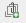). Für das digitale Oberflächenmodell erstellen Sie eine Gruppe mit dem Namen SRTM. 

Vergessen Sie nicht, auch die Grenze unseres Arbeitsbereichs, den Vektorlayer _Mittelsachsen_, hinzuzufügen.

Ihr QGIS-Kartenfenster sollte wie in Abbildung 9.6 aussehen. Die Farben können sich dabei wie immer unterscheiden. 


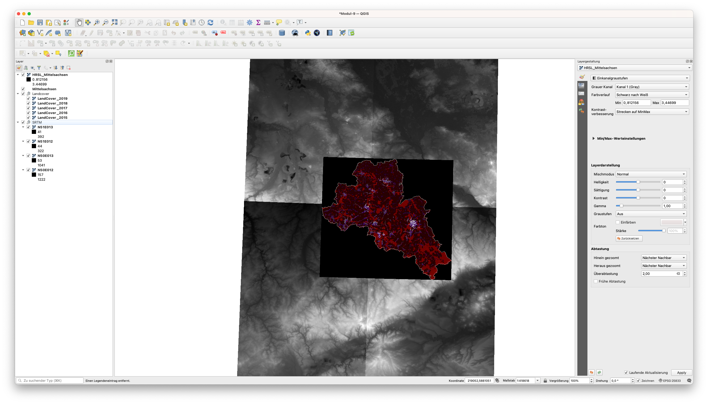

Abbildung 9.6 - Geladene Rasterdatensätze


#### **Schritt 2. Verstehen Sie, was Sie da sehen.** 

Als nächstes werden wir eine Reihe von Werkzeugen verwenden, die es uns ermöglichen, ein Gefühl für die Daten zu bekommen, mit denen wir arbeiten. 

Nachdem wir alle Datensätze geladen haben, werden wir das Koordinatenreferenzsystem überprüfen, in dem sich alle unsere Datensätze befinden.  Wie wir aus den vorangegangenen Modulen wissen, bietet QGIS die Möglichkeit, alle in das Projekt geladenen Datensätze "on the fly" umzuprojizieren, was jedoch zu Problemen bei der Geoverarbeitung führen kann. Selbst wenn also alle Layer korrekt überlagert sind, wie man durch visuelle Inspektion feststellen kann, werden wir damit fortfahren, sie alle in das Koordinatensystem unserer Interessenregion - EPSG: 25833 - zu reprojizieren. 

Es gibt mehrere Möglichkeiten, Informationen über die geladenen Layer in QGIS zu erhalten, wobei einige mehr Details bieten als andere. Für einen schnellen Überblick über die Metadaten eines Datensatzes, **doppelklicken Sie auf den Layer und öffnen Sie Eigenschaften ‣ Information**.

Für den Layer HRSL_Mittelsachsen würde das Informationsfenster wie in Abbildung 9.7 aussehen. 


Abbildung 9.7 - Grundlegende Metadaten eines Raster-Layers

Im Hinblick auf unsere erste Frage, welches KRS für die geladenen Datensätze verwendet wird, können wir feststellen, dass die Projektion des Datensatzes EPSG 4326 - WGS 84 - mit Einheiten in Grad ist, auch wenn die HRSL korrekt überlagert ist. Wir stellen auch fest, dass dieser spezielle Raster Layer nur ein Band hat, aber die Pixelgröße ist schwer zu lesen, da die Messung in Grad und nicht in Metern erfolgt, was es einfacher machen würde, sie zu verstehen. 

Als erstes müssen wir also alle Datensätze, mit denen wir arbeiten werden, in das gleiche Koordinatensystem - EPSG 3123 - umprojizieren.

Beginnend mit den HRSL-Datensätzen gehen wir auf **Raster ‣ Projektionen ‣ Transformieren (Reprojizieren)** (siehe Abbildung 9.8).


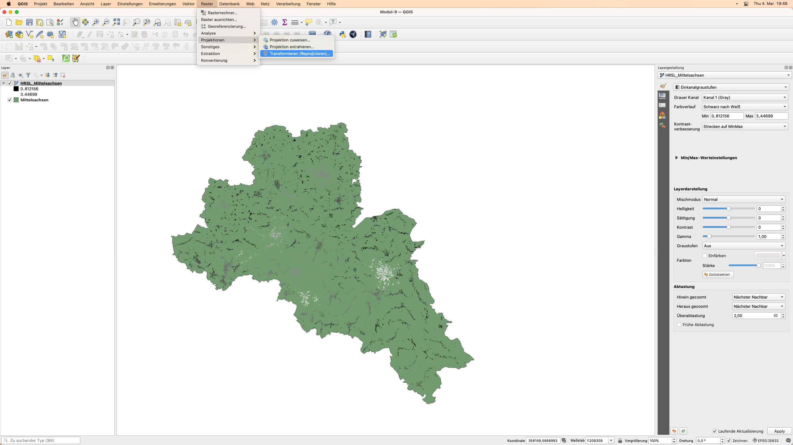

Abbildung 9.8 - Reprojizierungs-Funktionalität in QGIS

Nach Auswahl der Warp-Funktionalität erscheint ein neues Fenster, in dem der Benutzer die richtigen Parameter einstellen kann (siehe Abbildung 9.9a). 


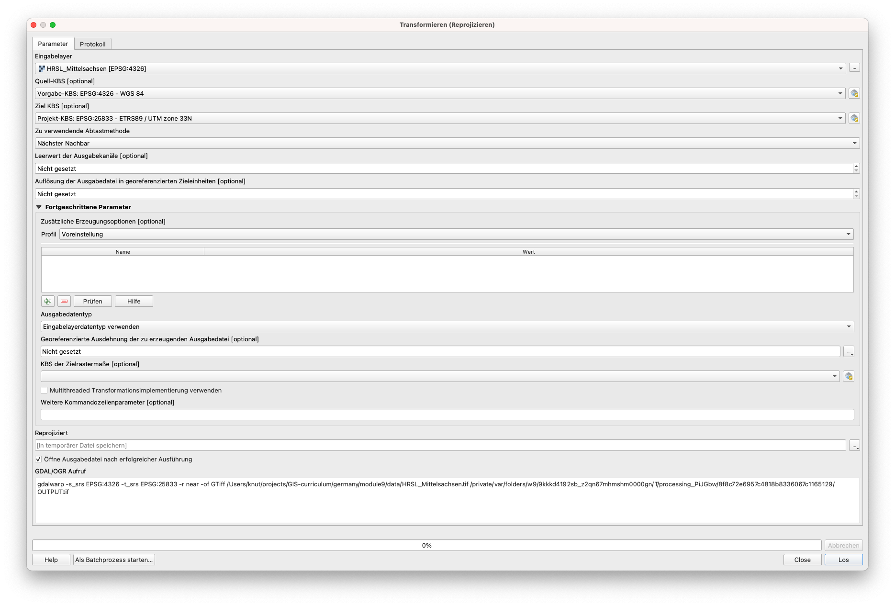

Abbildung 9.9a - Transformieren (Reprojizieren) Fenster

Wenn Sie als Ausgabe **[In temporärer Datei speichern]** gewählt haben, wird im Bedienfeld "Layer" ein Raster-Layer mit dem Namen "Reprojiziert" angezeigt. Dies ist ein Speicherlayer und Sie können diesen Layer in HRSL_Mittelschsen_reporojiziert umbenennen und speichern, um ihn persistent zu machen.


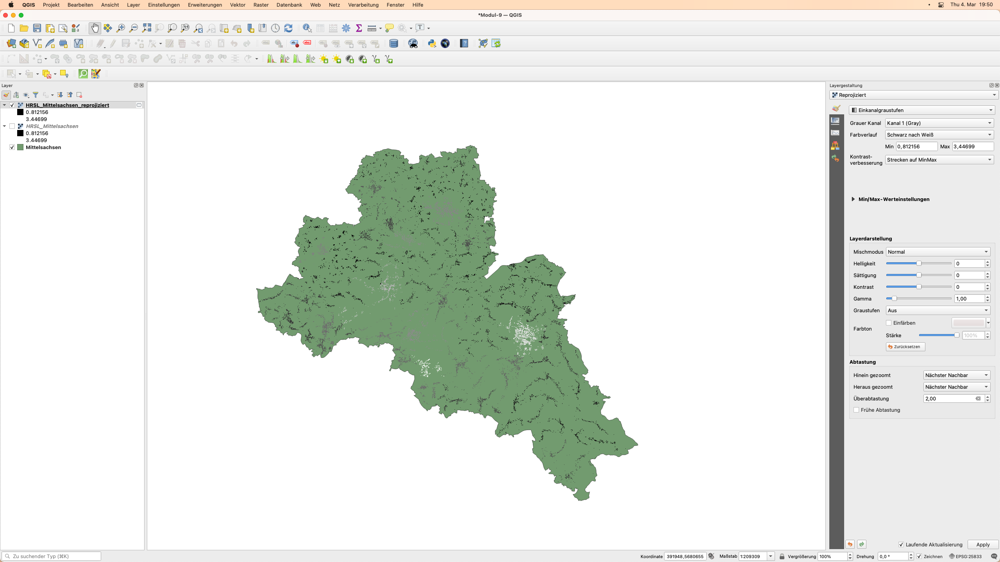

Abbildung 9.9b - Reprojizierter HRSL

Sie werden feststellen, dass es im Gegensatz zur Reprojektion von Vektordatensätzen einen neuen Parameter gibt, den Sie unter "Zu verwendende Abtastmethode" einstellen können. 

**Resampling** stellt die Interpolation der Zellwerte dar, so dass das Raster wie gewünscht transformiert wird. Es gibt mehrere Resampling-Methoden innerhalb der Transformieren-Funktionalität, die jeweils eine eigene mathematische Grundlage haben. Detaillierte Erklärungen zu jeder einzelnen Methode sind jedoch nicht Gegenstand dieser Übung. Weitere Lektüre finden Sie in den Referenzen. 

In diesem speziellen Fall wollen wir Bevölkerungsdaten - numerische Werte - neu projizieren und basierend auf der gewählten Resampling-Methode (nächster Nachbar) wird die Koordinate jedes Ausgabepixels verwendet, um einen neuen Wert aus nahegelegenen Pixelwerten im Eingabelayer zu berechnen (siehe Abbildung 9.10). 


Abbildung 9.10 - Resampling-Methode Nächster Nachbar (Bildnachweis: ILWIS-Dokumentation - [(http://spatial-analyst.net/ILWIS/htm/ilwisapp/resample_functionality.htm](http://spatial-analyst.net/ILWIS/htm/ilwisapp/resample_functionality.htm))

Eingangspixel werden durch gestrichelte schwarze Linien dargestellt, Koordinaten von Eingangspixeln durch schwarze Punkte; Ausgangspixel werden durch rote durchgezogene Linien dargestellt, Koordinaten von Ausgangspixeln durch rote Pluszeichen. Die grauen Pfeile zeigen an, wie die Ausgangswerte ermittelt werden. Wie in Abbildung 9.10 zu sehen ist, können einige Werte der Eingangskarte zweimal in der Ergenniskarte verwendet werden, während andere Eingangswerte überhaupt nicht verwendet werden. Das ist der Grund, warum diese Methode, obwohl sie eine der schnellsten Methoden zum Resampling ist, in unserem Fall nicht geeignet ist, da wir mit numerischen Daten - Bevölkerungsdaten - arbeiten. Diese Resampling-Methode eignet sich für kategoriale Daten - wie z. B. Landbedeckungswerte. 

Um unseren Bevölkerungsrasterdatensatz neu zu projizieren, werden wir die bilineare Interpolationsmethode verwenden, um die Pixelwerte neu abzutasten (siehe Abbildung 9.11).


Abbildung 9.11 - Resampling-Methode - bilinear (Bildnachweis: ILWIS-Dokumentation - [(http://spatial-analyst.net/ILWIS/htm/ilwisapp/resample_functionality.htm](http://spatial-analyst.net/ILWIS/htm/ilwisapp/resample_functionality.htm))

Die bilineare Methode bestimmt den neuen Wert einer Zelle basierend auf einem gewichteten Abstandsmittel der vier nächstgelegenen Eingabezellenzentren. Sie ist nützlich für kontinuierliche Daten und bewirkt eine gewisse Glättung der Daten. 

Wir fahren fort mit der Überprüfung des CRS der 5 Landbedeckungsdatensätze, die wir in unser QGIS-Projekt geladen haben. Unter **Layereigenschaften ‣ Informationen** können wir sehen, dass alle 5 Landbedeckungslayer in EPSG:3857 - WGS 84 / Pseudo-Mercator projiziert sind. Eine Lösung wäre, das Werkzeug Transformieren zu verwenden und für jeden Layer einzeln zu konfigurieren. Ein schnellerer Weg ist jedoch die Verwendung der Transformieren-Funktionalität, die als **Stapelverarbeitung** läuft.

**Stapelverarbeitung** ist die Fähigkeit, mit minimaler Benutzer:inenninteraktion wiederholende Prozesse auf Daten auszuführen. Die meisten QGIS-Funktionalitäten verfügen über diese Option und sie kann im Prozessfenster aktiviert werden, indem man auf die Schaltfläche **Als Batchprozess starten**  klickt und zum Reiter "Stapelverarbeitung" wechselt (siehe Abbildung 9.12). 


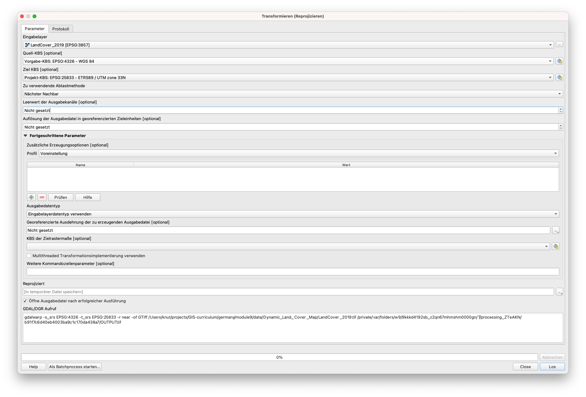

Figure 9.12 - Stapelverarbeitung in einem QGIS-Fenster


Abbildung 9.12 - Stapelverarbeitung in einem QGIS-Fenster


Für die 5 Landbedeckungsraster-Layer werden wir die Stapelverarbeitung und als Resample-Methode den nächsten Nachbarn verwenden. Um einen neuen Layer hinzuzufügen, klicken Sie auf das Piktogramm +. Um die KRS- und Resampling-Methoden-Parameter automatisch auszufüllen, klicken Sie auf die Schaltfläche "Autofüllung" oberhalb der entsprechenden Spalten und wählen Sie "Nach unten füllen". Benennen Sie die neu projizierten Raster um, indem Sie den EPSG-Code am Ende des Namens hinzufügen, (LandCover2015 wird zB. zu LandCover2015_25833). Stellen Sie die Parameter wie in Abbildung 9.13 ein: Quell-CRS: EPSG: 3857, Ziel-CRS EPSG 25833, zu verwendende Abtastmethode: Nächster Nachbar, Leerwert für Ausgabekanäle: 255 (im Informationsfenster sehen wir den Datentyp - byte - 8bit unsigned integer - was bedeutet, dass der maximale Wert 255 sein kann), Auflösung der Ausgabedatei in georeferenzierten Zieleinheiten: 100 m (wie die ursprünglichen Landbedeckungsraster). Nachdem Sie alle Parameter eingestellt haben, aktivieren Sie das Kästchen in der linken Ecke des Fensters - **Layer bei Abschluß laden** und klicken Sie auf **Los**. 


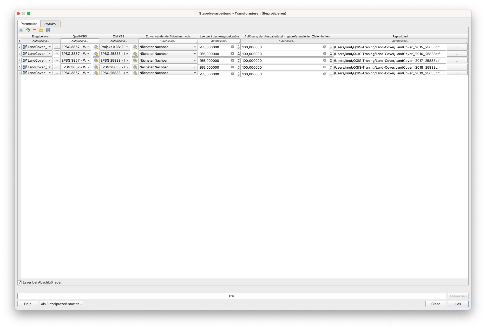

Abbildung 9.13a - Stapelverarbeitung zum Repojizieren der Landbedeckungslayers


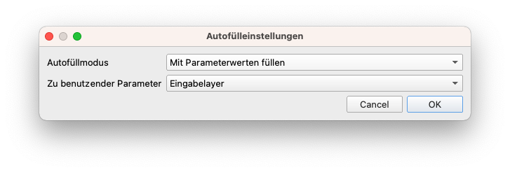

Abbildung 9.13b - Autofülleinstellungen


Abbildung 9.13c - Reprojizierte Landbedeckungsraster

Als nächstes kommen die digitalen Oberflächenmodell-Raster. Wie man sehen kann, brauchten wir mehrere _Rasterkacheln_, um unser Interessengebiet abzudecken. Wenn Rasterdateien zu groß werden - stellen Sie sich eine einzige DSM-Datei mit 30 m für Europa vor, das über 10 Millionen Quadratkilometer umfasst - werden sie in **Kacheln** aufgeteilt, weil sie in kleineren Gebieten leichter zu handhaben sind. 

Obwohl wir das Transformieren-Tool im Stapelmodus verwenden könnten, um alle DSM-Rasterdateien neu zu projizieren, kann man bei einer visuellen Inspektion auch feststellen, dass die Abgrenzungen zwischen den einzelnen Kacheln ziemlich sichtbar sind, was es zumindest visuell unattraktiv macht. Was nützlich wäre, ist ein kompletter Überblick über das Gelände, als ein kontinuierliches Phänomen - wie es in der Tat ist - ohne künstliche Unterbrechungen. Um das zu erreichen, werden wir das GDAL-Merge-Tool verwenden, das in der Symbolleiste Verarbeitungswerkzeuge verfügbar ist, um alle DSM-Raster zusammenzufügen. Um es zu öffnen, öffene Sie die Vearebeitungswerkzeuge und Suchen sie nach **Verschmelzen** (siehe Abbildung 9.14). Alternativ können Sie auch in der globalen Suchleiste nach "Verschmelzen" suchen.


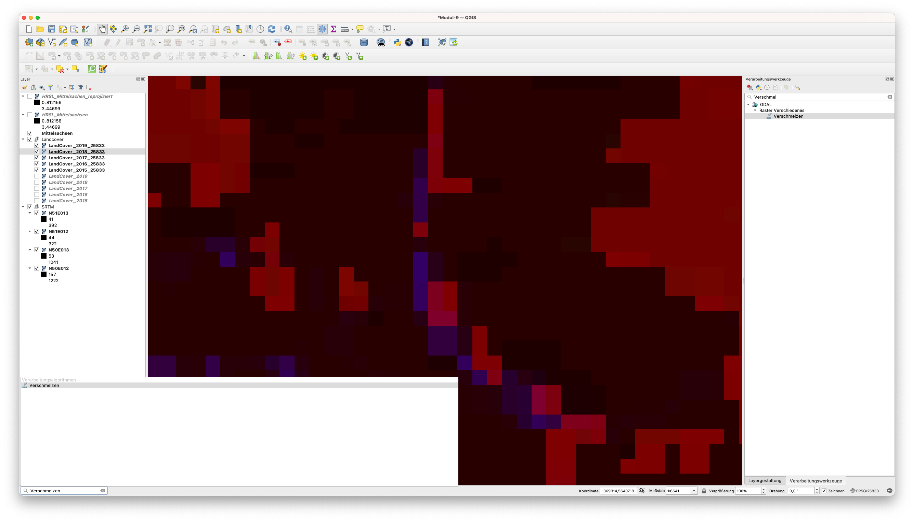

Abbildung 9.14 - Finden des GDAL-Verschmelz-Werkzeugs in den Verarbeitungswerkzeugen 

Wählen Sie im sich öffnenden Merge-Fenster die DSM-Rasterdateien aus, die wir mosaizieren wollen, und klicken Sie auf "Run". Das Ergebnis sollte wie in Abbildung 9.15c aussehen. 


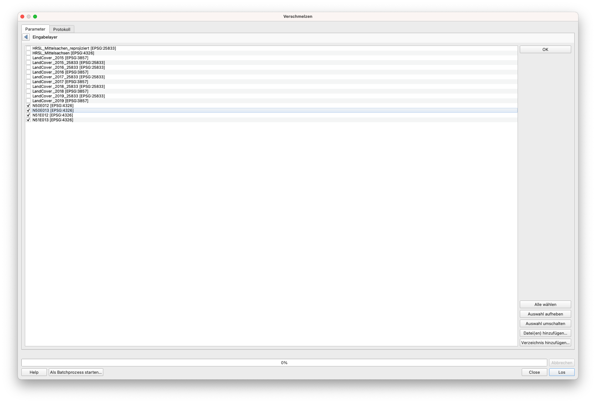

Abbildung 9.15a - Auswahl der zusammenzuführenden SRTM-Layer


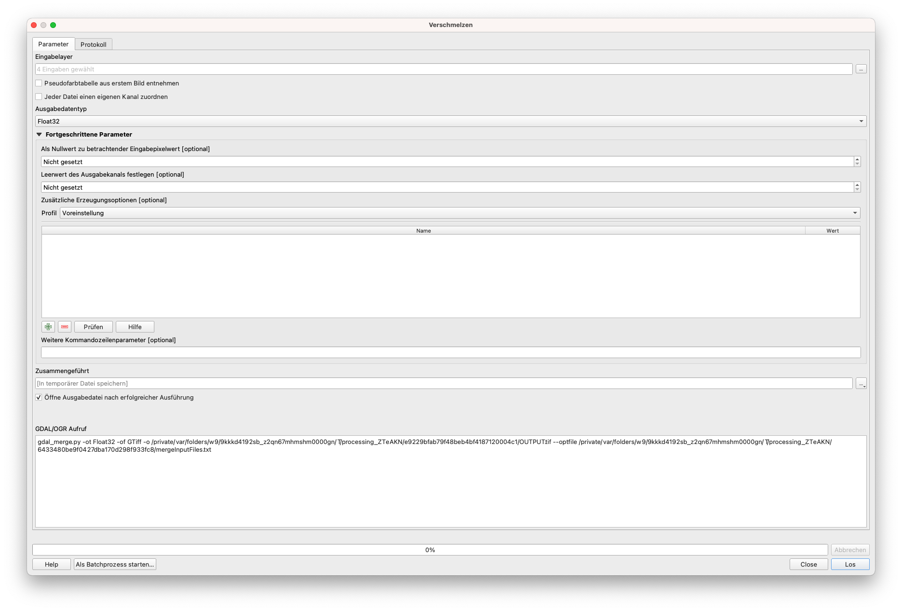

Bild 9.15b - Parameter des Merge-Verarbeitungsalgorithmus


Abbildung 9.15c - Zusammengeführte DSM-Daten


Nun können wir mit der Reprojektion des Layers fortfahren. Gehen Sie zu **Raster ‣ Projektion ‣ Transformieren (reporjizieren))** und stellen Sie die bekannten Parameter ein: 

   * Quell-CRS: EPSG:4326
   * Ziel-CRS: EPSG:25833 
   * Abtast-Methode: Nächster Nachbar
   * Auflösung der Ausgabedatei - 30 m. 

An diesem Punkt sollten wir alle Ebenen im gleichen CRS haben - EPSG 25833. 


Figure 9.15d - Transformieren-Parameter


Wir können eine weitere Prüfung durchführen, um sicherzustellen, dass alle Raster, mit denen wir arbeiten, projiziert werden, und um zusätzliche Informationen zu den Daten zu erhalten, indem wir einen Stapelprozess von Rasterinformationen für alle ausführen. Um das Funktionsfenster zu öffnen, gehen Sie zu **Raster ‣ Sonstiges ‣ Rasterinformationen**. Ihr Fenster für die Stapelverarbeitung von Rasterinformationen sollte wie in Abbildung 9.16 aussehen. 


Abbildung 9.16 - Stapelverarbeitung zum Extrahieren von Informationen in eine separate HTML-Datei für mehrere Raster-Layer

Eine HTML-Datei mit Rasterinformationen sollte wie unten dargestellt aussehen. Eine HTML-Datei kann mit einem beliebigen Texteditor oder Webbrowser Ihrer Wahl geöffnet werden. 


```
Driver: GTiff/GeoTIFF
Files: /Users/knut/QGIS-Traning/Land-Cover/LandCover_2019_25833.tif
Size is 744, 687
Coordinate System is:
PROJCRS["ETRS89 / UTM zone 33N",
    BASEGEOGCRS["ETRS89",
        DATUM["European Terrestrial Reference System 1989",
            ELLIPSOID["GRS 1980",6378137,298.257222101,
                LENGTHUNIT["metre",1]]],
        PRIMEM["Greenwich",0,
            ANGLEUNIT["degree",0.0174532925199433]],
        ID["EPSG",4258]],
    CONVERSION["UTM zone 33N",
        METHOD["Transverse Mercator",
            ID["EPSG",9807]],
        PARAMETER["Latitude of natural origin",0,
            ANGLEUNIT["degree",0.0174532925199433],
            ID["EPSG",8801]],
        PARAMETER["Longitude of natural origin",15,
            ANGLEUNIT["degree",0.0174532925199433],
            ID["EPSG",8802]],
        PARAMETER["Scale factor at natural origin",0.9996,
            SCALEUNIT["unity",1],
            ID["EPSG",8805]],
        PARAMETER["False easting",500000,
            LENGTHUNIT["metre",1],
            ID["EPSG",8806]],
        PARAMETER["False northing",0,
            LENGTHUNIT["metre",1],
            ID["EPSG",8807]]],
    CS[Cartesian,2],
        AXIS["(E)",east,
            ORDER[1],
            LENGTHUNIT["metre",1]],
        AXIS["(N)",north,
            ORDER[2],
            LENGTHUNIT["metre",1]],
    USAGE[
        SCOPE["unknown"],
        AREA["Europe - 12°E to 18°E and ETRS89 by country"],
        BBOX[46.4,12,84.01,18.01]],
    ID["EPSG",25833]]
Data axis to CRS axis mapping: 1,2
Origin = (331489.476338801323436,5678619.779446345753968)
Pixel Size = (100.000000000000000,-100.000000000000000)
Metadata:
  AREA_OR_POINT=Area
Image Structure Metadata:
  INTERLEAVE=PIXEL
Corner Coordinates:
Upper Left  (  331489.476, 5678619.779) ( 12d35'10.35"E, 51d14' 2.54"N)
Lower Left  (  331489.476, 5609919.779) ( 12d37' 4.65"E, 50d37' 0.44"N)
Upper Right (  405889.476, 5678619.779) ( 13d39' 5.38"E, 51d15' 4.19"N)
Lower Right (  405889.476, 5609919.779) ( 13d40' 9.28"E, 50d38' 0.75"N)
Center      (  368689.476, 5644269.779) ( 13d 7'52.35"E, 50d56' 6.33"N)
Band 1 Block=744x3 Type=Byte, ColorInterp=Red
  Description = discrete_classification
    Computed Min/Max=0.000,126.000
  Minimum=0.000, Maximum=126.000, Mean=25.108, StdDev=35.539
  NoData Value=255
  Metadata:
    STATISTICS_MAXIMUM=126
    STATISTICS_MEAN=25.107998305844
    STATISTICS_MINIMUM=0
    STATISTICS_STDDEV=35.538513461505
    STATISTICS_VALID_PERCENT=95.16
Band 2 Block=744x3 Type=Byte, ColorInterp=Green
  Description = forest_type
    Computed Min/Max=0.000,5.000
  Minimum=0.000, Maximum=5.000, Mean=0.178, StdDev=0.830
  NoData Value=255
  Metadata:
    STATISTICS_MAXIMUM=5
    STATISTICS_MEAN=0.17849080344917
    STATISTICS_MINIMUM=0
    STATISTICS_STDDEV=0.82977789003485
    STATISTICS_VALID_PERCENT=95.16
Band 3 Block=744x3 Type=Byte, ColorInterp=Blue
  Description = urban-coverfraction
    Computed Min/Max=0.000,100.000
  Minimum=0.000, Maximum=100.000, Mean=4.146, StdDev=16.816
  NoData Value=255
  Metadata:
    STATISTICS_MAXIMUM=100
    STATISTICS_MEAN=4.1456192508707
    STATISTICS_MINIMUM=0
    STATISTICS_STDDEV=16.816497877006
    STATISTICS_VALID_PERCENT=95.16
```


Nachdem wir die Raster vorbereitet haben, indem wir sie in das KRS, mit dem wir arbeiten, reprojiziert und ihre Metadaten gelesen haben, um die Dateien besser zu verstehen, ist es an der Zeit, sich mit den eigentlichen Daten zu beschäftigen. Um das zu erreichen, werden wir die Histogramme (siehe Abschnitt _Gliederung der Konzepte_ für Details) unserer Raster berechnen und interpretieren. 

Um ein Histogramm zu berechnen, wählen Sie den gewünschten Raster-Layer aus, öffnen mit einem Doppelklick das Dialogfenster `Eigenschaften` und gehen auf `Histogramm` (siehe Abbildung 9.17). 


Bild 9.17 - Histogramm-Fenster

Klicken Sie auf die Schaltfläche `Histogramm berechnen` und QQGIS berechnet es automatisch. 

Nach der Berechnung des Histogramms können wir sehen, dass sich die Maus in eine Lupe verwandelt. Zoomen Sie hinein indem Sie einen Kasten mit der Maus aufziehen und Sie sehen etwas wie in Abbildung 9.18. 

Um zur Vollansicht zurückzukehren, klicken Sie mit der rechten Maustaste. 

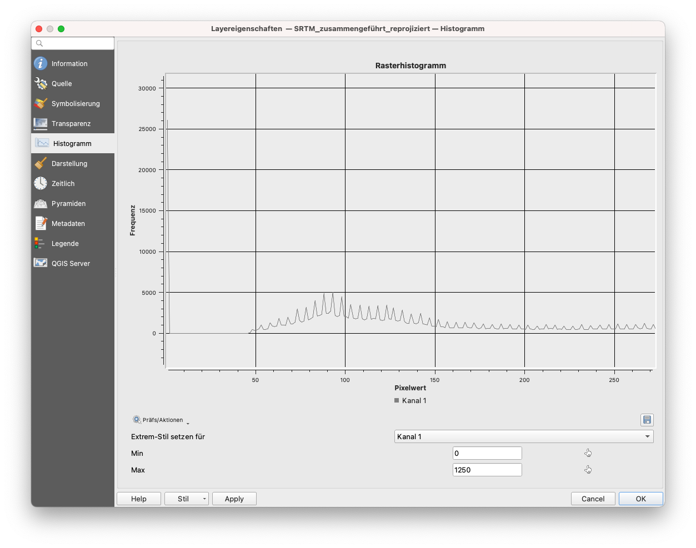

Abbildung 9.18 - Ausschnitt des Histograms für den SRTM-Layer

Das Histogramm zeigt nicht nur die Verteilung der numerischen Werte der Pixel an, sondern ermöglicht es auch, die Werte zur Visualisierung des Rasterlayers neu zu setzen. Verwenden Sie dazu die beiden Werkzeuge, um im Histogramm die neuen Min- und Max-Werte zu markieren (siehe Abbildung 9.19). 


Abbildung 9.19 - Auswahl der Min- und Max-Werte für die Neuklassifizierung des Rasters

Nach dem Klicken auf Apply wird das Raster mit dem neu gewählten Min-Max-Bereich dargestellt. Diese Funktionalität ermöglicht es Ihnen, Extremwerte zu ignorieren, die das Raster unnormal dehnen können. 

Auch wenn das nächste Werkzeug, das wir verwenden, eine Erweiterung ist (siehe Modul 1 für Details zu den Erweiterungen), halten wir es für sehr nützlich, um mit der Arbeit mit Rastern zu beginnen. Wir beziehen uns auf das **Value Tool**, das die sofortige Identifizierung von Zellwerten durch Überfahren von Raster-Layern ermöglicht. 

Gehen Sie zu **Erweiterungen ‣ Erweiterungen verwalten und installieren** und suchen Sie nach dem **Value Tool**-Plugin und klicken Sie auf installieren. Öffenen Sie anschließend das neue **Value Tool Bedienfeld**. Überprüfen Sie Ihre QGIS-Oberfläche, um zu sehen, wo es geöffnet wurde.

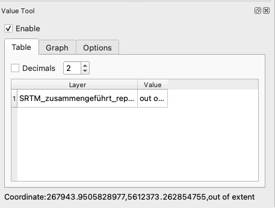

Abbildung 9.20 - Das Value-Tool Bedienfeld

Der Nutzen dieses Werkzeugs liegt in seiner einfachen Handhabung, mit wenigen Klicks kann man sehr leicht Wertezellen in genau den Bereichen extrahieren, die von Interesse sind. Außerdem ermöglicht es dies für alle geladenen Raster-Layer. 

Das Value Tool hat 3 Registerkarten: Table, Graph, Options (siehe Abbildung 9.21).

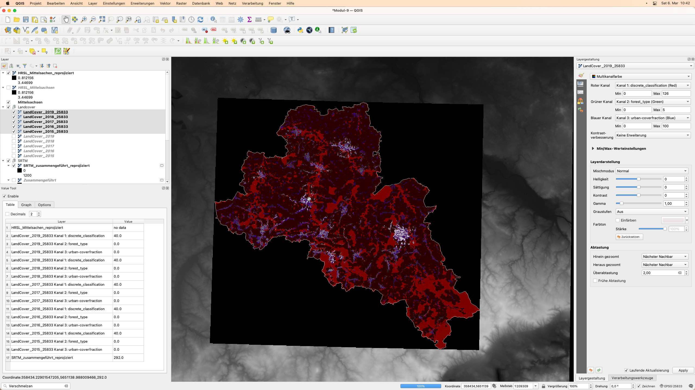

Bild 9.21 - Aktiviertes Value Tool - Hervorhebung im ersten Reiter - Tabelle

Die erste Registerkarte - Tabelle - zeigt eine Liste aller geladenen Raster-Layer und die Werte der Zellen, über denne sich der Mauszeiger befindet. Es besteht auch die Möglichkeit zu wählen, mit wie vielen Nachkommastellen die Werte angezeigt werden sollen. Wenn der Mauszeiger außerhalb des Bereichs eines Raster-Layers bewegt wird, wird anstelle eines Wertes eine Meldung angezeigt: "out of extent". 

Die zweite Registerkarte - Graph - zeigt in einem vereinigten Graphen alle Werte an, die er an der Position der Maus liest. Sie ermöglicht es, Werte für min und max auf der Y-Achse - das ist die Achse der Zellenwerte - einzufügen. Die X-Achse listet alle Bänder des Rasters auf, die es in der Tabelle anzeigt, mit den entsprechenden Ordnungsnummern: das Band, das die Nummer 1 in der ersten Registerkarte hat, wird auch die Nummer 1 in der Grafik sein. 

Auf der dritten Registerkarte können Sie einstellen, was das "Value Tool" anzeigt: welche Layer (alle, nur die sichtbaren oder nur die ausgewählten) und welche Bänder angezeigt werden sollen. 


#### **Quizfragen**

1. Können Raster-Layer in andere Koordinatensysteme umprojiziert werden?
* _Ja_
* Nein
2. Können zwischen den Wertebereichen eines für einen Raster-Layer berechneten Histogramms Lücken entstehen?
* Ja. 
* _Nein_
3. Können verschiedene Bänder desselben Rasterdatensatzes unterschiedliche Auflösungen haben? 
* _Ja_
* Nein. 


### Teil 2: Einführung in die Arbeit mit Rasterdaten

Nachdem wir nun gelernt haben, wie man grundlegende Informationen aus den geladenen Rasterdatensätzen extrahiert, werden wir mit einer tiefer gehenden Rasterdatenverarbeitung fortfahren, um neue abgeleitete Raster und damit mehr Informationen zu erhalten.

Wie Sie vielleicht bemerkt haben, dehnen sich die geladenen Layer aufgrund der Struktur des Rasterdatenmodells über die Region aus, die uns interessiert - den Landkreis Mittelsachsen. Das ist aus mehreren Gründen unerwünscht, aber hauptsächlich deshalb, weil man am Ende mehr Daten verarbeitet, als man eigentlich braucht, was sich in einem größeren Speicher- und Computerbedarf niederschlägt. Aus diesem Grund werden wir, bevor wir zu weiteren Schritten übergehen, sicherstellen, dass wir genau so viele Daten verarbeiten, wie wir benötigen. Wenn Sie mit der Arbeit an Ihren eigenen Datensätzen beginnen, sollten Sie sich bewusst sein, dass die Größe der Dateien ein wichtiger Faktor ist, wenn es um die Verarbeitungszeiten geht. Je größer die Dateien sind, desto mehr Zeit wird benötigt. Aufgrund der Struktur der Modelldaten - Raster vs. Vektor - sind Rasterdateien in der Regel wesentlich größer. 

Wie Sie inzwischen bemerkt haben, können die Datensätze, die wir in ein GIS - in unserem Fall in QGIS - laden, zusammen verarbeitet werden, auch wenn sie unterschiedlicher Natur sind, wie z. B. das Verbinden von CSV-Tabellen mit Vektor-Layern, um Informationen zu Geometrien hinzuzufügen. Das Gleiche gilt für Raster- und Vektordaten, wie wir noch sehen werden. 

Um nur mit Raster-Layern zu arbeiten, die für Mittelsachsen relevant sind, werden wir den Vektor-Layer Mittelsachsen verwenden, um alle relevanten Raster-Layer darauf zuzuschneiden. Gehen Sie dazu auf **Raster ‣ Extraktion ‣ Raster auf Layermaske zuschneiden** (siehe Abbildung 9.22). Auf ähnliche Weise können Sie in den Verarbeitungswerkzeugen oder in der Suchleiste nach "zuschneiden" suchen.


Abbildung 9.22 - Verwenden einer Vektormaske, um die Rasterdaten einer bestimmten Region zu extrahieren

Da wir mit 7 Raster-Layern arbeiten - den 5 Landbedeckungs-Layern, dem digitalen Oberflächenmodell und der HRSL - werden wir die Stapelverarbeitung verwenden, um alle Layer auf einmal zu beschneiden. Wenn Sie den Schritt der Reprojektion übersprungen haben, haben Sie Layer in unterschiedlichen Projektionen und der Algorithmus wird entweder nicht funktionieren oder unerwartete Ergebnisse liefern. 

Der Aufbau des Stapelverarbeitungsfensters sollte wie in Abbildung 9.23 aussehen. 

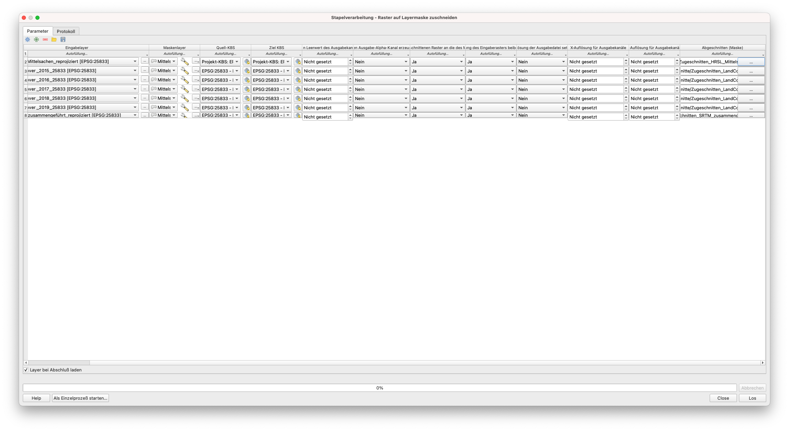

Abbildung 9.23 - Stapelverarbeitung zum Ausschneiden aller benötigten Raster-Layer auf Basis des Vektorlayers

Die eingestellten Parameter sind die folgenden:
* Maskenlayer: Mittelsachsen
* sowohl Quell- als auch Ziel-KRS ist EPSG 25833
* Wählen Sie "Ja" für: `Ausdeghnung des zugeschnittenen Raster an die des Maskenlayers anpassen` und `Auflösung des Eingeberasters beibehalten`. 
* Laden Sie die Layer nach Fertigstellung. 

Wenn alles reibungslos geklappt hat, sollte Ihr QGIS-Hauptfenster wie in Abbildung 9.24 aussehen. 


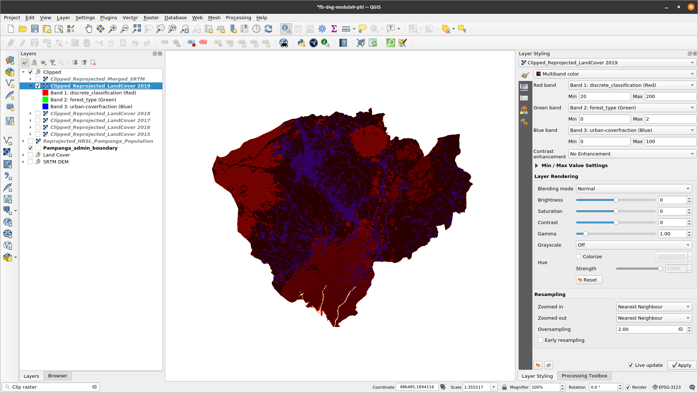

Abbildung 9.24 - Zugeschnittene Rasterlayer  

Stellen Sie sich nun vor, dass Sie einen Bericht darüber erstellen müssen, wo die meisten Menschen leben, aber unter Berücksichtigung der Höhenlage[^4]. Sie müssen wissen, wie viele Menschen in Mittelsachsen zwischen 0 und 200 m Höhe leben. Es gibt ein paar Elemente zu berücksichtigen. Erstens, welche Daten wir verwenden werden und welche Eigenschaften sie haben. Für die Bevölkerung haben wir die High Resolution Settlement Layer Daten und für das Relief haben wir die ALOS World 3D - 30m (AW3D30). Beide Raster Layer haben eine räumliche Auflösung von 30m, was uns erlaubt, zu weiteren Überlegungen überzugehen. Das Relief ist ein kontinuierliches Phänomen, die Ausbreitung der Bevölkerung ist es nicht, dennoch würde es keinen Sinn machen, den Bericht über die 30m-Pixel zu erstellen. Wir müssen alle Pixel mit Zellwerten von 0 bis 200 identifizieren. Wenn wir das Histogramm des SRTM für unsere interessierende Region betrachten, haben wir gesehen, dass die meisten Zellwerte zwischen 200 und 350m liegen. Wir können damit fortfahren, eine grundlegende Reliefkarte zu erstellen, die auf 7 "Gleiches Interavall"-Klassen basieren. Da wir keine Werte haben, die bei 0m liegen, können wir diesen Wert als Transparenzwert hinzufügen. Gehen Sie dafür in die Layereigentschaften und fügen Sie unter "Transaprenz" den zusätzlicher Leerwert 0 hinzu.

Mit dem in Modul 4 erworbenen Wissen können Sie den SRTM-Layer nach diesen Kategorien gestalten. Ihre Karte sollte wie in Abbildung 9.25 aussehen.

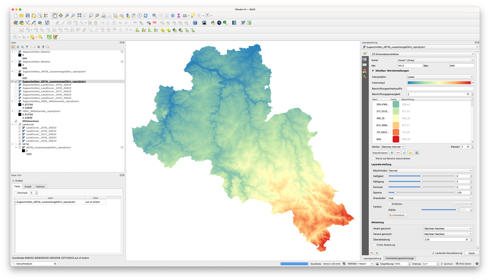

Abbildung 9.25 - SRTM Daten stylisiert als Einkanalpseudofarbe)

Um die Anzahl der Menschen auf Basis der Rasterdaten HRSL zu berechnen, die in der Provinz Pampanga in einer Höhe von bis zu 200 Metern leben, müssen wir sehen, welche Pixel in jede dieser Kategorien fallen. Dazu werden wir den **Rasterrechner** verwenden. Dabei handelt es sich um eine Funktionalität, die es ermöglicht, Berechnungen auf der Grundlage vorhandener Rasterpixelwerte durchzuführen. Die Ergebnisse werden in einen neuen Raster Layer in einem GDAL[^5]-unterstützten Format geschrieben.

Es gibt mehrere Möglichkeiten, den Rasterkalklulator in QGIS zu öffnen. Sie können dies über die Menüleiste **Raster ‣ Rasterrechner** tun oder indem Sie in den Verarbeitungswerkzeugen nach "Calculator" suchen. Wenn Sie den Rechner über die Verarbeitsungswerkzuge geöffent, haben, dann sollten Sie folgendes Fesnter sehen:


Bild 9.26 - Der Rasterrechner

In diesem Fenster können wir die im Abschnitt _Konzepte_ beschriebenen Operationen, Subtraktionen, Additionen, Vergleiche und alle anderen wiederfinden. Die Namenskonvention für die Raster ist dabei wie folgt: was vor dem @ kommt, ist der Name des Raster-Layers, was nach dem @ kommt, ist die Nummer des Kanals.


Als nächstes werden wir unseren SRTM Raster Layer "zerschneiden", um nur die Pixel mit Werten bis zu 200 Metern zu extrahieren. Wir wissen, dass die Wertezellen des SRTM Layers eine kontinuierliche numerische Information darstellen (nicht diskrete Werte, wie z. B. LandCover). Daher ist die Operation, die wir in diesem Fall anwenden müssen, eine Vergleichsoperation - Zellenwerte <= 200 Meter. Um dies zu erreichen, werden wir folgendes in den Raster Calculator schreiben: 

```
"Zugeschnitten_SRTM_zusammengeführt_reprojiziert@1" <= 200
``` 

Setzen Sie den **Reference Layer** als **Zugeschnitten_SRTM_zusammengeführt_reprojiziert@1**. Ihr Raster Calculator sollte wie in Abbildung 9.27 aussehen.

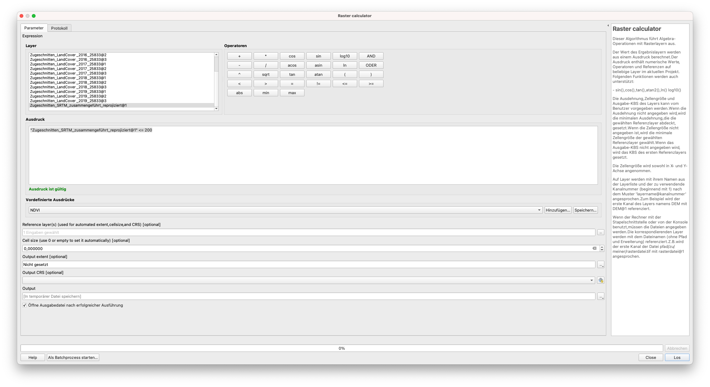

Abbildung 9.27 - Einfügen einer Formel in den Raster Calculator

Ihr Ergebnis sollte wie in Abbildung 9.28 aussehen. 


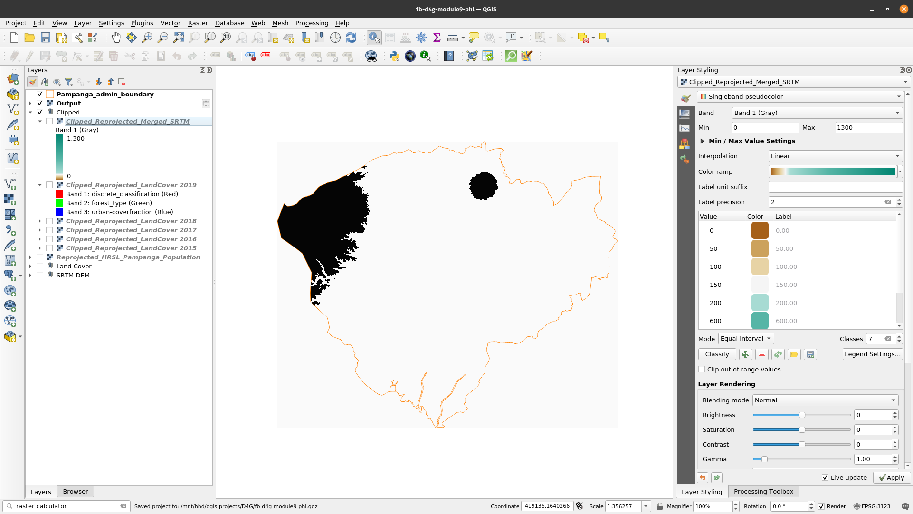

Abbildung 9.28 - Neuer Layer mit allen Pixeln unter 200 Metern, erstellt mit dem Raster Calculator

Das Ergebnis wird als `Output` bezeichnet. Sie können es in `<=200m` umbenennen. Wie wir im Bedienfeld "Layer" sehen können, hat der von uns erhaltene Raster-Layer nur 2 Werte: 0 und 1. Das liegt daran, dass wir eine binäre Operation, einen Vergleich, verwendet haben, daher erhielt jedes Pixel, das unter 200 Metern liegt, den Wert = 1 und alle darüber, den Wert = 0. Wir können dies mit dem `Value Tool` testen. Abbildung 9.29 zeigt nur Pixel mit dem Wert 1, also die Pixel, die uns für unsere Übung interessieren. 


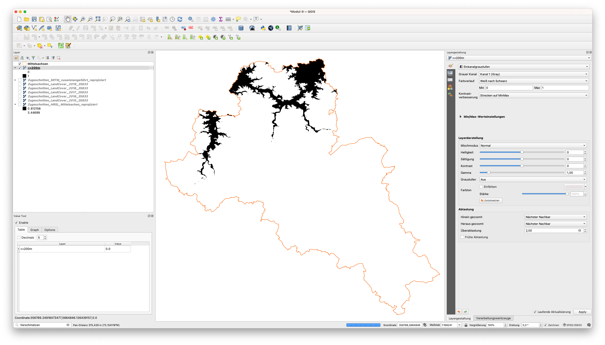

Abbildung 9.29 - Räumliche Verteilung aller Pixel mit dem Wert 1, d. h. mit einer Höhe von weniger als 200 Metern 

Als nächstes können wir die räumliche Verteilung der Bevölkerung bei der räumlichen Auflösung von 30 m unterhalb von 200 m betrachten. Dazu verwenden wir wieder den Raster Calculator. 

Die Formel ist recht einfach, da alle SRTM-Zellenwerte, an denen wir interessiert sind, den Wert 1 haben. 

Öffnen Sie den Rechner und fügen Sie die folgende Formel ein: 

```
"<=200m@1"*"Zugeschnitten_HRSL_Mittelsachen_reprojiziert@1"
```


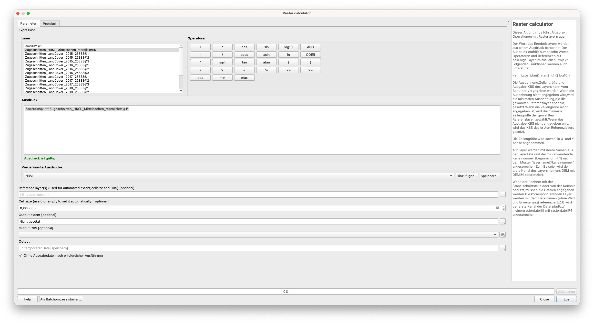

Abbildung 9.30 - Verwendung des Raster Calculators zur Ermittlung von Bevölkerungsverteilungsklassen auf der Basis von Höhenlagen bis 200 m

Im Gegensatz zur vorherigen Verwendung des Rasterrechners haben wir 2 verschiedene Rasterdatensätze verwendet, um das gewünschte Ergebnis zu erhalten. Verwenden Sie das Value Tool, um sich die Werte im neuen Layer genauer anzuschauen (siehe Abbildung 9.31). 


Abbildung 9.31 - Verwenden des Value Tools zur Überprüfung der Ergebnisse der Rasterberechnung

Sie können sehen, dass der neue Layer "HRSL <= 200m" an einigen Stellen den Wert 0 hat, obwohl Zugeschnitten_HRSL_Mittelsachen_reprojiziert Werte an dieser spezifischen Mausposition hat. 

Als nächstes stellen wir die räumliche Verteilung der Bevölkerung dar, die unterhalb von 200 m lebt. Um eine geeignete Klassifizierung zu wählen, berechnen wir das Histogramm. Wir können feststellen, dass die meisten Werte zwischen 0,8 und 2,2 Personen pro 30m liegen. Die von uns gewählte Klassifizierung ist in Abbildung 9.32 zu sehen. 


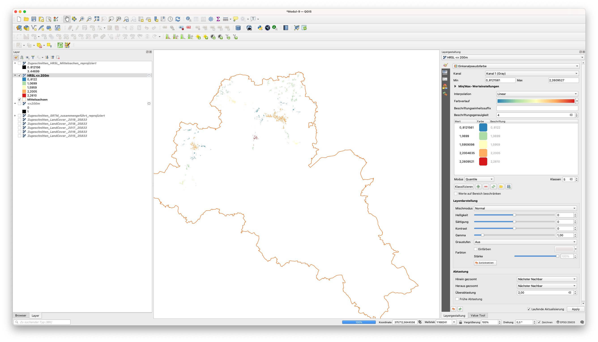

Abbildung 9.32 - Bevölkerungsverteilung unter 200m, in einem 30m Raster 

Wenn wir uns für die Gesamtzahl der Menschen interessieren, die in Mittelsachsen unterhalb von 200 m leben, und nicht für die geografische Verteilung pro 30 m räumlicher Auflösung, dann müssen wir alle Pixelwerte des Raster Layers "<=200m" aufsummieren. Eine Möglichkeit, diese Zahl zu erhalten, besteht darin, den Layer "<=200m" von Raster in Vektor zu transformieren.

Gehen Sie dazu auf **Raster ‣ Konvertierung ‣ Vektorisieren (Raster nach Vektor)** (siehe Abbildung 9.33). 


Abbildung 9.33a - Raster-zu-Vektor-Konvertierung
 
Erinnern Sie sich daran, dass dieser Raster Layer nur 2 Werte hatte - 0 und 1. Wählen Sie die Parameter, wie im folgenden Bild zu sehen: 


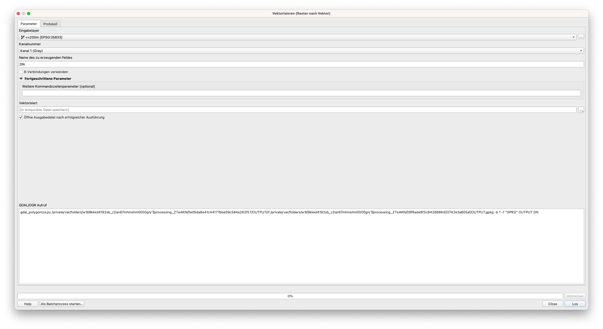

Abbildung 9.33a - Parameter für die Umwandlung von Raster in Vektorter

Ihr Ergebnis sollte wie in Abbildung 9.34 aussehen. 


Abbildung 9.34 - Ergebnis der Konvertierung eines Rasterdatensatzes in einen Vektordatensatz. 

An dieser Stelle können Sie in der Attributtabelle alle Zeilen mit dem Wert 0 für die Spalte DN löschen, da diese für uns nicht weiter wichtig sind.

Um unsere Antwort zu finden, werden wir die **Zonenstatistik** verwenden. Um diese Funktionalität schnell zu finden, öffnen Sie die Verarbeitunsgwerkzeugen und geben im Suchfeld "Zonen" ein (siehe Abbildung 9.35).


Abbildung 9.35 - Zonenstatistik in den Verarbeitunsgwerkzeugen

Wählen Sie im geöffneten Fenster die Parameter wie in Abbildung 9.36. Wählen Sie als berechnete Statistiken: Anzahl, Summe, Minimum, Maximum. 


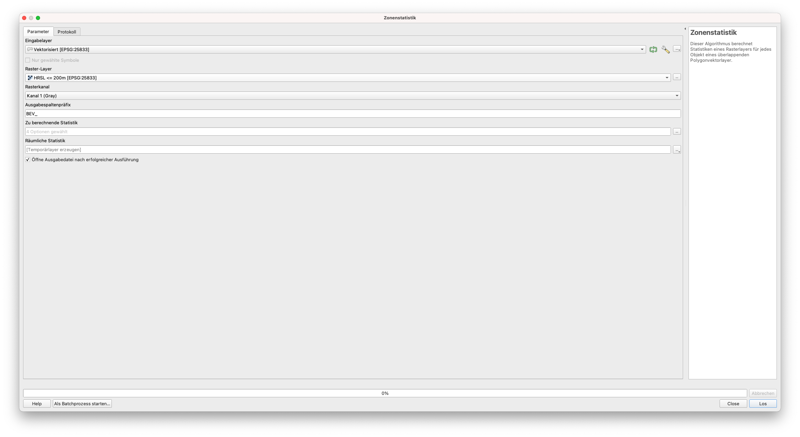

Abbildung 9.36 - Einstellen der Parameter für die zonale Statistik

Der resultierende Layer ist ein Vektor-Layer, der als Attribute die von uns gewählten Statistiken hat (siehe Abbildung 9.37). Sollten Sie dabei die Fehlermeldung bekommen, dass eine Geometrie nicht gültig ist, kann der Ratschlag in [diesem Stackoverflow-Post (englischsprachig)] Abhilfe schaffen: Erstellen sie einen minimalen Puffer um Ihren Vektorisierten Layer und benutzen Sie dann den gepufferten Layer als Eingabelayer.


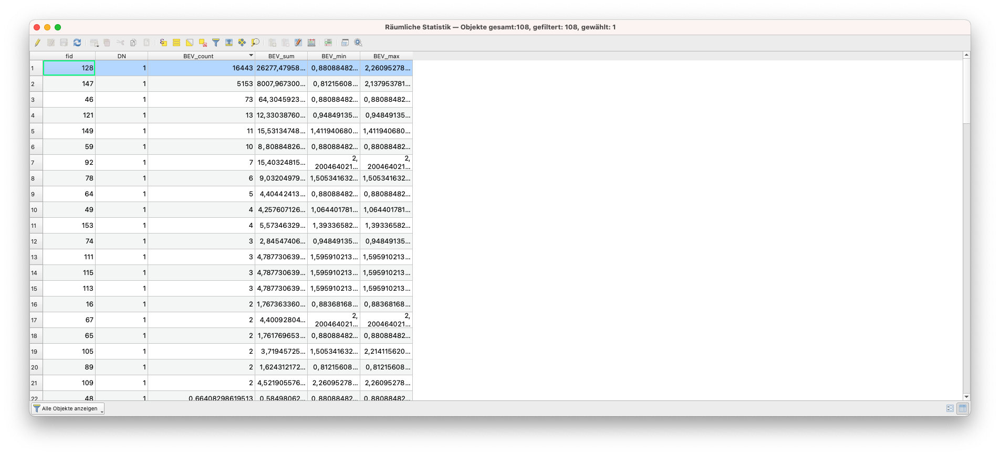

Abbildung 9.37 - Resultierender Vektor-Layer der Zonenstatistik

Und mit diesem letzten Schritt haben wir unsere Übungsaufgabe beantwortet, wie viele Menschen (und wo) unterhalb von 200m in Mittelsachsen leben. 


#### **Quizfragen**

1. Können Rasterdaten beschnitten werden? 
* _Ja_
* Nein
2. Kann man Vektordatensätze, die im QGIS-Projekt geladen sind, im Raster Calculator verwenden?
* Ja
* _Nein_
3. Können Rasterdatensätze in Vektordatensätze umgewandelt werden?
* _Ja_
* Nein


### Teil 3: Arbeiten mit Raster- und Vektordaten

Im vorhergehende Teil haben wir gesehen, wie wir 2 Rasterdatensätze verarbeiten können, um neue Informationen abzuleiten. Vor der Analyse haben wir uns vergewissert, dass die Datensätze in der gleichen Projektion vorliegen und dass die Raster die gleiche räumliche Auflösung haben, so dass die Ergebnisse, die wir erhalten haben, tragfähig sind. Wenn man sich auf das Koordinatenreferenzsystem bezieht, ist die Argumentation klar, aber warum die gleiche räumliche Auflösung? 

Zur Erinnerung: Die räumliche Auflösung ist die Größe der Bodenoberfläche, gemessen in Längeneinheiten, mit anderen Worten, die Größe des Pixels, gemessen am Boden. Wenn ein Raster eine Auflösung von 30 m hat, bedeutet das, dass das kleinste lineare Objekt, das wir auf diesem Bild erkennen könnten, 30 m groß ist. Um die Analogie fortzusetzen, können wir es mit dem Maßstab einer Karte vergleichen. Wenn eine Karte einen Maßstab von 1:25000 hat, bedeutet das, dass 1 Längeneinheit auf der Karte 25000 Einheiten auf dem Boden darstellt, d.h. 1 cm ist 25000cm, 1 cm auf der Karte entspricht 250m auf dem Boden. Zum Beispiel würde eine 2km lange Straße 8 cm auf der Karte haben.

Warum ist das bei der Arbeit mit Rasterdatensätzen wichtig? Abbildung 9.38 könnte eine Erklärung bieten.


Abbildung 9.38 - Beispiel für unterschiedliche Auflösungen bei verschiedenen Satellitenbildern - Landsat und SPOT - für dasselbe Gebiet 

_(Bildnachweis: Congedo, L. und Munafò, M, (2013) Assessment of Land Cover Change Using Remote Sensing:  Objectives, Methods and Results, Rom:  Universität Sapienza.  Verfügbar unter:
http://www.planning4adaptation.eu/)_

Abbildung 9.38 zeigt die Beziehung zwischen der Auflösung der Satellitenbilder und den aus diesen Bildern extrahierten Landbedeckungsinformationen. Erinnern Sie sich, wie wir zu Beginn beschrieben haben, dass der Wert der Pixelzelle der gesamten Fläche, die sie abdeckt, zugeschrieben wird, was jedoch nicht bedeutet, dass dies die Realität vor Ort ist. Dies sind Entscheidungen, die von den Erdebeobachtungs-Expert:innen getroffen wurden, um verschiedene Produkte auf der Grundlage von Erdbeobachtungsbildern abzuleiten. Alle Entscheidungen sind dabei in Fachzeitschriften und Algorithmusbeschreibungen dokumentiert. Weitere Erklärungen würden den Rahmen dieses Moduls sprengen, aber es ist wichtig, sich die Beziehung zwischen dem, was ein Sensor an Bord eines Satelliten erfasst, und den Produkten, die wir verwenden, vor Augen zu halten. 

Um auf die Region zurückzukommen, die uns interessiert - Mittelsachsen - können wir diese Unterschiede mit den uns zur Verfügung stehenden Daten testen. Wir haben in unser QGIS-Projekt die 5 Raster Layer von LandCover für 5 Jahre geladen: 2015, 2016, 2017, 2018 und 2019. Als nächstes laden wir Bilddaten von Sentinel-2[^6]. Wir werden den WMS Layer EOX Sentinel-2 cloudless  laden, der [hier] verfügbar ist (https://s2maps.eu/). Erinnern Sie sich an Modul 2: Um einen WMS Layer hinzuzufügen, gehen Sie zu **Layer ‣ Layer hinzufügen ‣ WMS/WMTS Layer hinzufügen..**.

Wenn sich das Hinzufügen-Fenster öffnet, verwenden Sie die folgenden Parameter:
```
Name: EOX Sentinel-2
URL: https://tiles.maps.eox.at/wms?service=wms&request=getcapabilities
```


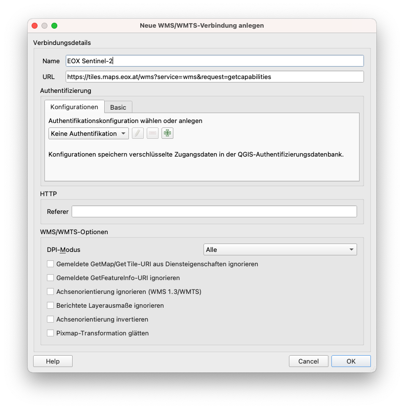

Abbildung 9.39 - Hinzufügen eines WMS Layers zu QGIS 

Nachdem wir uns mit dem neu hinzugefügten WMS-Layer verbunden haben, laden wir den Layer mit dem Namen Sentinel-2 cloudless layer for 2019 by EOX - 4326 in QGIS. Nach dem Zoomen auf die Ausdehnung der Region von Interesse, sollte Ihr Kartenfenster wie in Abbildung 9.40 aussehen. 


Abbildung 9.40 - Sentinel-2 cloudless layer for 2019 by EOX - 4326 für Mittelsachsen

Obwohl die LandCover-Produkte mit anderen Satellitendaten (Proba-V) gewonnen wurden, lassen Sie uns die beiden Layer vergleichen, damit wir ein Gefühl dafür bekommen, was unterschiedliche Auflösungen bedeuten. Denken Sie daran, dass das LandCover-Produkt eine Auflösung von 100 m und die Sentinel-2-Bilder eine Auflösung von 10 m haben. Zu diesem Zweck öffnen wir den Zugeschnitten_LandCover_2019_25833 und den WMS Layer. Um Vergleiche zwischen 2 Layern durchzuführen, werden wir eine neue Erweiterung verwenden, die Sie installieren müssen. Gehen Sie dazu auf **Erweiterungen ‣ Erweiterungen verwalten und installieren** und suchen Sie nach `MapSwipe Tool`. Sobald Sie es installiert haben, sollte es als neues Piktogramm in Ihrer Symbolleiste erscheinen (). 


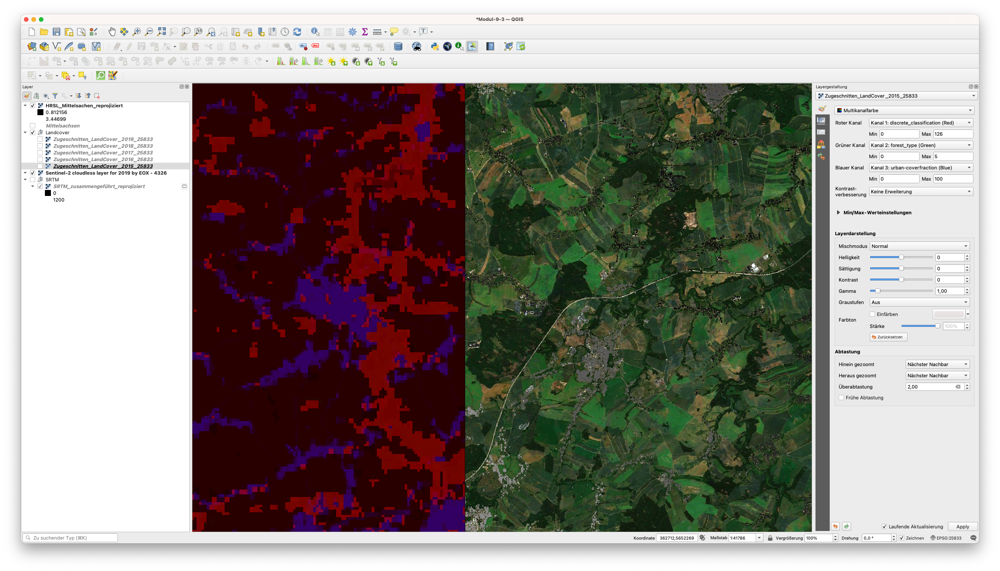

Bild 9.41 - Vergleich von 2 Raster-Layern mit dem MapSwipe Tool-Plugin 

Um das MapSwipe-Werkzeug zu aktivieren, klicken Sie es an, während der zu überlagernde Raster-Layer im Bedienfeld "Layer" ausgewählt ist. Die Auflösungsunterschiede sind offensichtlich, ebenso wie die Tatsache, dass das Satellitenprodukt (Land Cover) aus einem Satellitenbild (PROBA-V) mit einer gröberen Auflösung entwickelt wurde. Die allgemeinen größeren Klassen sind jedoch gut erkennbar (die Beschreibungen der Klassen wurden hier aus der Tabelle vom Anfang dieses Moduls manuell übernommen), wie in Abbildung 9.42 zu sehen ist. 


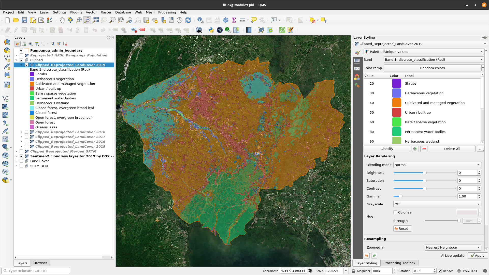

Abbildung 9.42 - LandCover2015 aus PROBA-V(100m) über Sentinel 2-Mosaik (30m)

Das Hinzufügen der HRSL zur Karte zeigt eine gute Übereinstimmung zwischen der HRSL und dem LandCover. Der urbane Raum wird in rot dargestellt und ist, wie in Abbildung 9.43 zu sehen ist, fast vollständig vom HRSL Layer abgedeckt. 


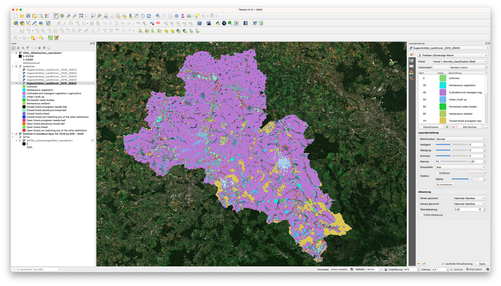

Abbildung 9.43 - HRSL, das über der Ebene Zugeschnitten_LandCover_2015_25833 hinzugefügt wurde.

Wenn Sie jedoch hineinzoomen und die globale Deckkraft des LandCover Layers etwas verringern, können Sie den Unterschied in der Auflösung zwischen den 2 Rasterprodukten sehen: 

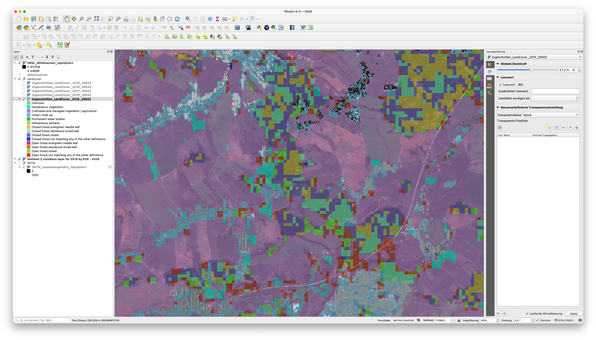

Abbildung 9.44 - Unterschied in der räumlichen Auflösung zwischen HRSL (30m - rosafarben) und dem Clipped_Reprojected_LandCover 2019 (100m - rot und magentafarben)

Wenn nun eine Analyse mit diesen Rastern durchgeführt würde, wären diese Ergebnisse nicht brauchbar, da wir Werte vergleichen würden, die für unterschiedliche Auflösungen gelten. Als Vorverarbeitungsphase muss einer der beiden Raster _resampeled_ werden. 

**Resampling/Neuabtastung** bezieht sich auf die Änderung der Zellenwerte aufgrund von Änderungen im Rasterzellenraster und es gibt nur 2 Möglichkeiten: (1) **Upsampling** bezieht sich auf Fälle, in denen wir in eine höhere Auflösung/kleinere Zellen konvertieren, und (2) **Downsampling** ist das Resampling in eine niedrigere Auflösung/größere Zellengröße. 

Stellen wir uns die folgende Übung vor. Wir müssen die Bevölkerungszahlen für jede Kategorie der Landbedeckung ermitteln, die wir in Mittelsachsen definiert haben. Wie oben erklärt, müssen wir die Daten, die wir haben, _vorverarbeiten_, um brauchbare Ergebnisse aus unserer Analyse zu erhalten, d. h. in unserem Fall müssen wir unsere beiden Rasterdatensätze auf die gleiche räumliche Auflösung bringen. Wie oben beschrieben, können wir die Dimensionen der Pixel entweder erhöhen oder verringern. Es muss hervorgehoben werden, dass die Neuabtastung, mit Hoch- oder Herunterskalierung, einen Interpolationsprozess beinhaltet - daher führt das Ergebnis einen statistischen Fehler ein. Die übliche Praxis ist, alle Raster neu abzutasten, um dem Raster mit der geringeren Auflösung zu entsprechen, aber auch diese Entscheidung muss unter Berücksichtigung aller Faktoren getroffen werden. Eine detaillierte Beschreibung des Entscheidungsprozesses für ein Resampling von Raster-Layern würde den Rahmen dieses Lehrplans bei weitem sprengen. 

Ein Unterschied zwischen den beiden Layern muss hervorgehoben werden: Das Produkt LandCover deckt die **gesamte Fläche** des betrachteten Ausmaßes ab, im Gegensatz zum Produkt HSRL, bei dem der Raster Layer nur die Zelle enthält, in der Werte über 0 existieren. Diese Situation wirft Probleme bei der Interpolation der Zellenwerte für das Resampling auf, da unabhängig von der gewählten Interpolationsmethode die umgebenden Pixel berücksichtigt werden müssen, und zwar nach einem bestimmten, genau definierten Algorithmus, und in dieser speziellen Situation befinden sich die Randpixel nicht am Rand der Untersuchungsregion, sondern innerhalb derselben. Daher werden wir in unserem demonstrativen Fall ein Upsampling des Land Cover-Produkts von 100 m auf 30 m Auflösung in Betracht ziehen, um die Auflösung des HRSL-Produkts zu erreichen. Die von uns gewählte Resampling-Methode ist von entscheidender Bedeutung, da die Ergebnisse erheblich variieren können. Zur Veranschaulichung werden wir das LandCover-Produkt mit 2 verschiedenen Methoden neu abtasten - Nächster Nachbar und Modus. 

Um das Resampling durchzuführen, gehen Sie zu **Raster ‣ Projektionen ‣ Transformieren (Reprojizieren).** Im Funktionsfenster stellen Sie folgende Parameter ein: 
* Input Layer: Zugeschnitten_LandCover_2019_25833, 
* Quell-CRS und Ziel-CRS: EPSG: 25833, 
* Resampling-Methode: Nächster Nachbar, 
* Keine Daten: 255, * Auflösung der Ausgabedatei: 30, 
* Ausgabedatentyp: Verwenden Sie den Datentyp des Eingabe-Layers, 
* Georeferenzausdehnung: wählen Sie den Layer Zugeschnitten_LandCover_2019_25833. 

Speichern Sie den Output Layer als LC2019_Nächster_Nachbar. 


Abbildung 9.45 - Resampling des Land Cover Layers


Führen Sie genau die gleichen Schritte aus, außer dass Sie für den Parameter Resample-Methode den Modus wählen. Speichern Sie den ausgegebenen Layer als LC2019_Mode.  

Lassen Sie uns nun die Ergebnisse vergleichen - siehe Abbildung 9.45 und 9.46. 


Abbildung 9.46a - Resampling des Land Cover Layers mit der Methode Nächster Nachbar


Abbildung 9.46b - Resampling des Land Cover Layers mit der Methode Modus

Auf beide Raster wurde die gleiche Symbologie angewandt und wir können beobachten, dass es in Abbildung 9.45 Werte gibt, die in keine der beiden Kategorien fallen - die Pixel werden nicht angezeigt. Wir wissen jedoch, dass das Produkt Land Cover ein nahtloser Layer ist - es hat keine Lücken zwischen den gleichen Kategorien definiert. Lassen Sie uns tiefer graben und die Histogramme für alle drei Layer betrachten. Gehen Sie dazu auf **Eigenschaften ‣ Histogramm** und wählen Sie unter Voreinstellungen/Aktionen, dass nur Band 1 angezeigt werden soll. Speichern Sie das Histogramm, indem Sie auf das Speichersymbol auf der rechten Seite des Fensters klicken 

Abbildung 9.48 (a), (b) und (c) zeigen die 3 Histogramme von Interesse. 


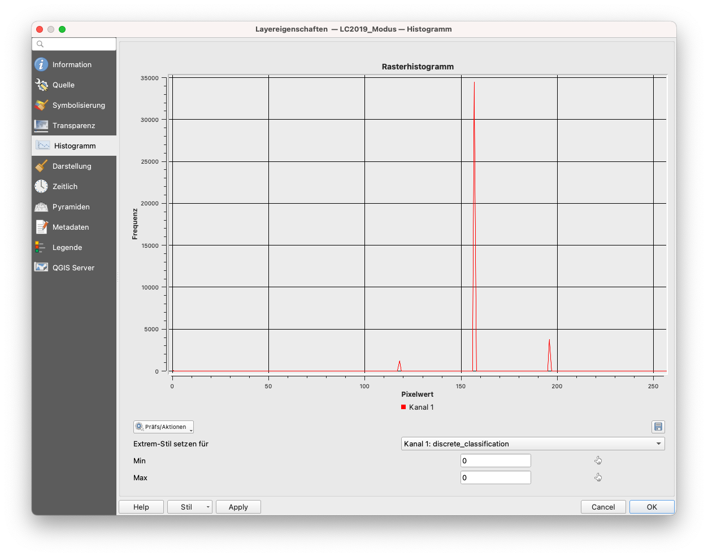

Abbildung 9.48 - Histogramme von (a) Zugeschnitten_LandCover_2019_25833 (100m), (b) LC2019_Nächster_Nachbar und (c) LC2019_Modus

Wir können die Unterschiede in der Verteilung der Werte für die 3 Datensätze beobachten, wobei die Betonung auf (b) liegt, wo wir die Nächster-Nachbar-Resampling-Methode verwendet haben, was - wie zu erwarten - zu einem berechneten Pixelwert führt und damit zu Werten, die mit keinem Wert im Produkt Land Cover übereinstimmen (siehe Tabelle 1 vom Anfang des Moduls). Daher die weißen Flächen - Pixel ohne Farbzuordnung in Abbildung 9.45. Wie vermutet, wählt das Modus-Resampling-Verfahren - oder Majoritäts-Resampling-Verfahren - den Wert aus, der am häufigsten vorkommt.

An diesem Punkt sollten Ihre Kartenfenster wie in Abbildung 9.49 aussehen. 


Abbildung 9.49 - Die 2 Rasterprodukte: Land Cover 2019 und HRSL überlagert. 

Um auf unsere Übung zurückzukommen, bestand die Anforderung darin, die Bevölkerungszahlen für jede von uns definierte Kategorie der Landbedeckung  zu ermitteln. An diesem Punkt haben wir unsere Rasterdaten vorverarbeitet, so dass sie im gleichen Koordinatensystem und mit der gleichen räumlichen Auflösung vorliegen. Wir werden mit einem Konvertierungsalgorithmus fortfahren, wir werden den Rasterdatensatz Land Cover in einen Vektordatensatz - Typ Polygon - umwandeln. Dies wird es uns ermöglichen, die Bevölkerungszahl für jede Landbedeckungskategorie leichter zu identifizieren. 

Für Konvertierungen, sowohl von Raster zu Polygon, als auch von Vektor zu Polygon, gehen Sie zu **Raster ‣ Konvertierung** und hier haben wir mehr Optionen. Wir wählen **Vektorisieren (Raster nach Vektor)..** Wir konvertieren den letzten Rasterdatensatz, den wir erhalten haben, in einen Vektor: LC2019_Mous. Ihr Ergebnis sollte wie in Abbildung 9.50b aussehen. 


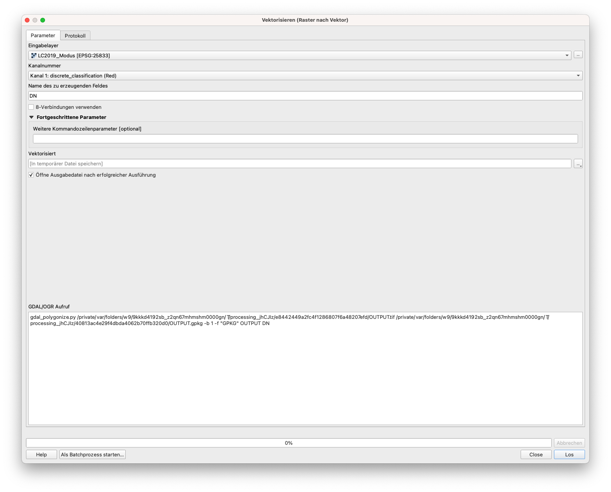

Abbildung 9.50a - Polygonisierung des LC2019_Mode (30m) Raster Layers


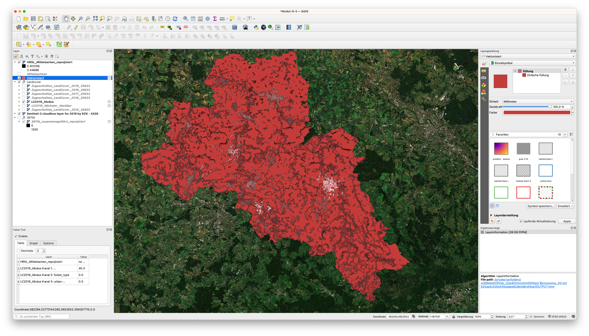

Abbildung 9.50b - Ergebnis der Polygonisierung des LC2019_Modus (30m) Raster Layers

Wie wir sehen können, wurde jedes Pixel - jede Gruppe von benachbarten Pixeln mit demselben Kategoriecode (siehe Tabelle 1, Seite 7) in ein Polygon umgewandelt. Wir sind jedoch nicht an jeder einzelnen Region interessiert, sondern an der gesamten Kategorie. Daher werden wir den erhaltenen Vektor-Layer auflösen, indem wir die Klassenidentifikation als gemeinsames Attribut verwenden (**Vektor ‣ Geoverarbeitungswerkzeuge ‣ Auflösen** - für weitere Details siehe Modul 8). Auch hier müssen Sie unter Umständen wieder den Puffer-Trick von weiter oben anwenden.

Wenn Sie das gleiche Styling wie für das Raster anbringen, werden Sie feststellen, dass die gleichen Vektorklassen auch den Rasterklassen entsprechen (siehe Abbildung 9.51).


Abbildung 9.51 - LC2019_Modus Vektorlayer 

Wie wir beobachten können, sind die Pixel der HRSL erwartungsgemäß nicht perfekt in einem Polygon des Landbedeckungsprodukts enthalten (siehe Bild 9.52).


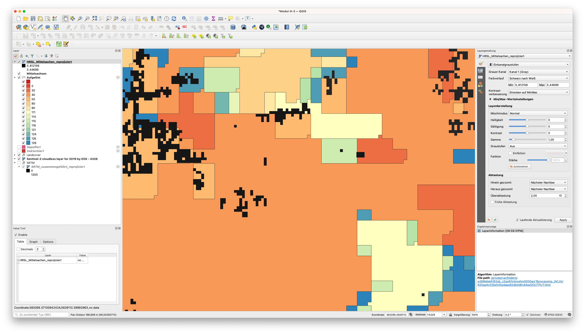

Abbildung 9.52 - Fehlende Übereinstimmung von HRSL-Pixeln und dem Landbedeckungs-Vektordatensatz  

Um diese Unannehmlichkeit zu beseitigen, werden wir auch den HRSL-Layer vektorisieren, nur dass wir dieses Mal den Wert der Pixelzellen auf einen Punkt übertragen - den geometrischen Mittelpunkt jedes Pixels.

Öffnen Sie die  **Verarbeitungswerkzeuge** und geben Sie in der Suchleiste `Rasterpixel` ein und wählen Sie den Algorithmus `Rasterpixel zu Punkten` (siehe Abbildung 9.53a). Speichern Sie die Ausgabe als HRSL_Punkte. 


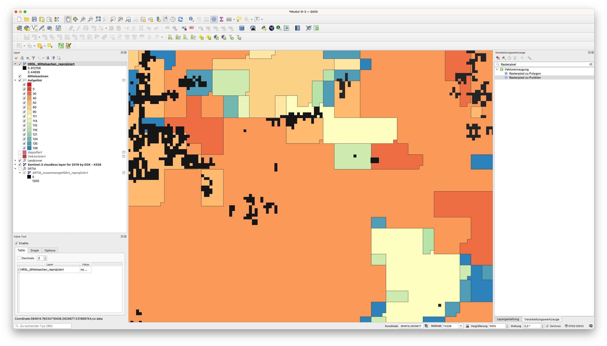

Abbildung 9.53a - Rasterpixel in Punkte


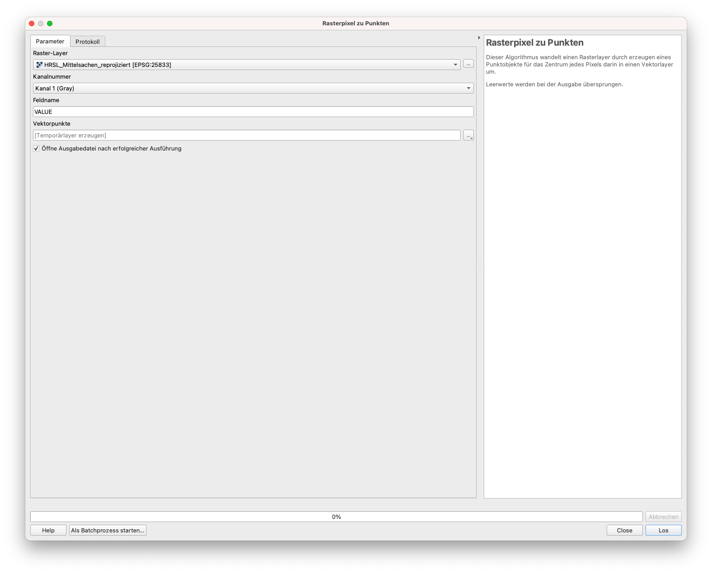

Abbildung 9.53b - Ausführen des Algorithmus Rasterpixel in Punkte

In Anbetracht der Ausdehnung Ihres Untersuchungsgebiets kann dieser Vorgang sehr viel Zeit in Anspruch nehmen. Abbildung 9.54 zeigt, wie viele Punkte wir für die Provinz Pampanga erhalten haben.


Abbildung 9.54 - Laden der erhaltenen Punktvektordaten

Die Anzahl der Merkmale ist beträchtlich hoch und ohne den Import in eine Datenbank würde jede Art von Verarbeitung oder Visualisierung zu viel Zeit in Anspruch nehmen. In solchen Situationen ist es sinnvoll, die zu verarbeitenden Datensätze in überschaubare Teile aufzuteilen. Daher werden wir in Erwägung ziehen, die notwendigen Berechnungen auf kleineren, klar definierten Bereichen durchzuführen. Um den HRSL-Layer aufzuteilen, verwenden wir die Option zum Erstellen eines VRTs. Markieren Sie den Layer HRSL_Mittelsachsen_reprojiziert und wählen Sie **Speichern als...** Im neuen Fenster kreuzen Sie die Option **VRT erstellen** an und stellen folgende Parameter ein: Durchsuchen Sie einen Ordner, in den das aufgeteilte Raster exportiert werden soll, KBS: EPSG:25833, VRT-Kacheln: Maximale Spalten/Zeilten: 1000 (siehe Abbildung 9.55).


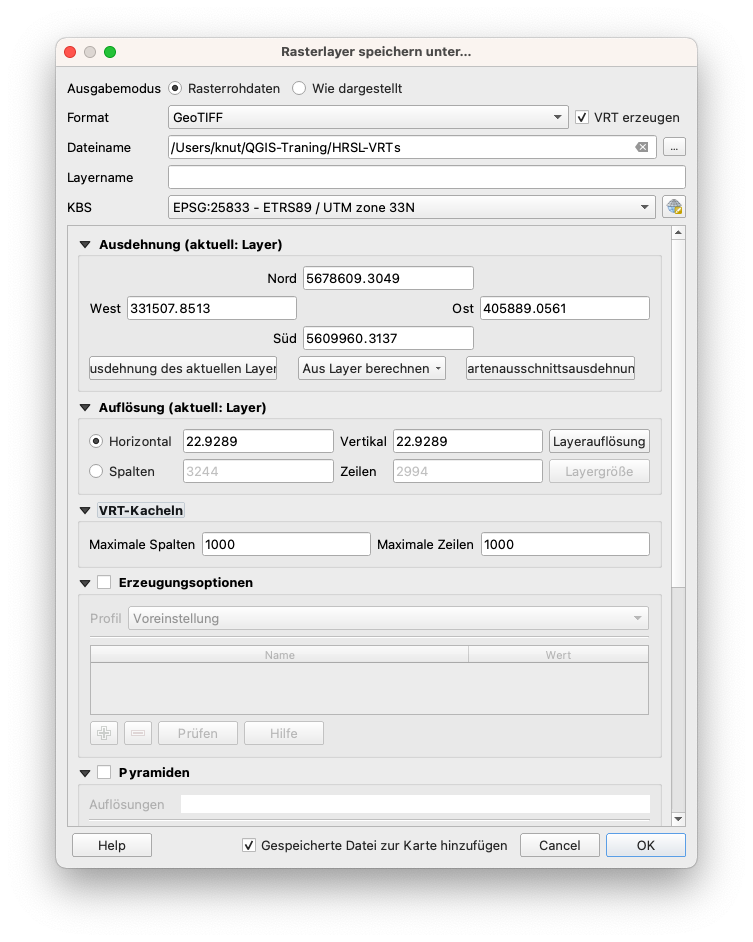

Bild 9.55 - Erstellen einer VRT-Datei mit bestimmten Rasterkacheln

Nach dem Exportieren laden Sie alle Rasterkacheln in Ihr QGIS-Projekt. Das Ergebnis sollte wie in Abbildung 9.56 aussehen. 


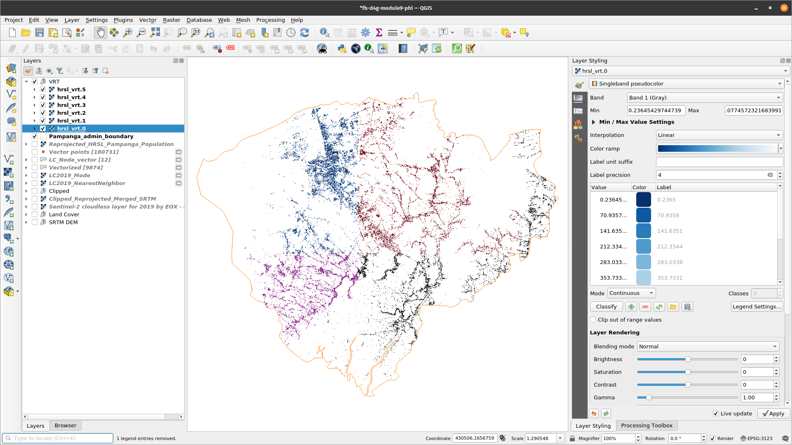

Abbildung 9.56 - Rasterkacheln für den HRSL in Mittelsachsen 

Als nächstes führen wir den Algorithmus **Rasterpixel zu Punkten** für jede der Rasterkacheln erneut aus. Da wir mehrere Kacheln haben, verwenden wir die Stapelverarbeitungsfunktion (siehe Abbildung 9.57).


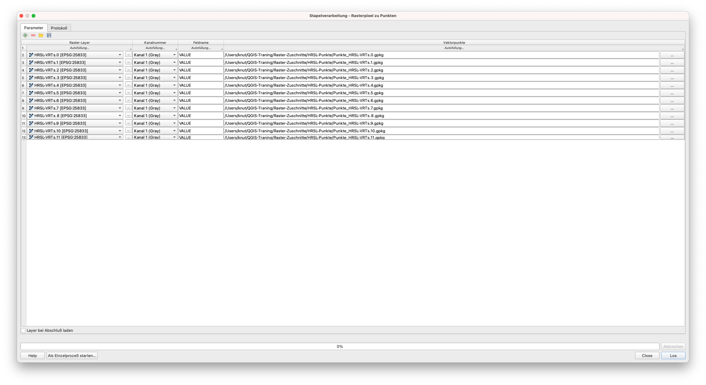

Abbildung 9.57 - Raster zu Punkten für alle Raster-Kacheln 

Die resultierenden Vektorpunkte sollten wie in Abbildung 9.58 aussehen. 


Abbildung 9.58 - Punkt-Vektor-Datensatz für den Layer HRSL mit den in der Spalte VALUE gespeicherten Pixelwerten

Wenn man sich die Ergebnisse des Algorithmus genauer ansieht, kann man erkennen, dass die Vektorpunkte genau in die Mitte des Pixels fallen, aus dem sie den Wert extrahieren (siehe Abbildung 9.59).


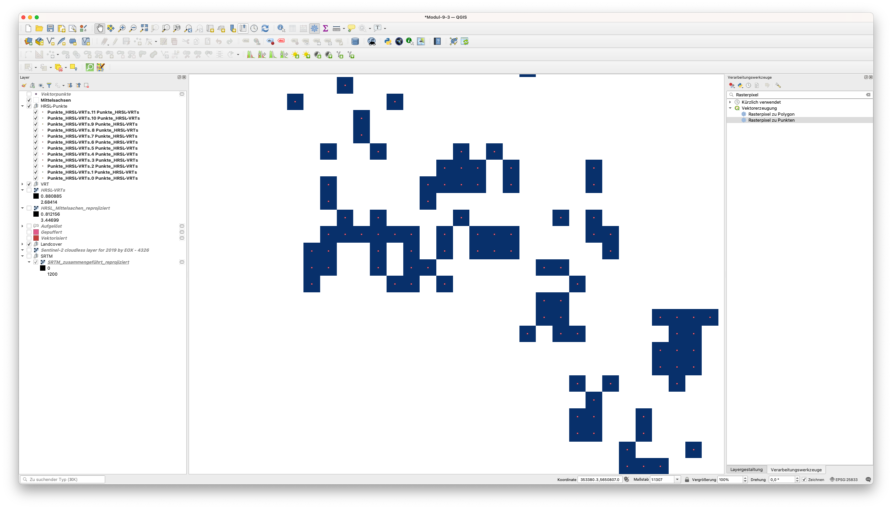

Abbildung 9.59 - Überprüfen der Werte der Punktvektordaten vs. Rasterpixelwerte

Um die Aufgabe zu lösen, muss die Summe der Werte der aus dem HRSL-Produkt extrahierten Punkte berechnet werden, die in jedes Polygon des Landbedeckungsprodukts fallen. Dazu verwenden wir eine Funktion, die im Feldrechner verfügbar ist - `aggregate()`. Diese Funktion ist recht leistungsfähig, da sie räumliche Verknüpfungen im laufenden Betrieb vornimmt und verschiedene Berechnungen ermöglicht. In unserem Fall muss die Funktion die Punkte identifizieren, die in jedes Polygon fallen, und dann die Werte dieser Punkte aufsummieren. Gehen Sie dazu in die Attributtabelle des LC2019_Modus-Vektordatensatzes und öffnen Sie den Feldrechner. Erstellen Sie ein neues Feld und geben Sie den folgenden Ausdruck ein:


```
aggregate(
    layer:= 'Punkte_HRSL-VRTs.0 Punkte_HRSL-VRTs',
    aggregate:='sum',
    expression:=VALUE,
    filter:=intersects($geometry, geometry(@parent))
)
```


Dabei ist <code>layer</code> der Name des Datensatzes, aus dem wir Informationen extrahieren wollen (in unserem Fall der Punktdatensatz, der die Pixelwerte des HRSL-Raster-Layers enthält), <code>aggregate</code> - gibt die Aktion an, die ausgeführt werden soll, sobald die räumliche Verknüpfung bestätigt ist (Summe, Anzahl, Mittelwert, Median, usw. ), <code>expression</code> gibt an, aus welcher Spalte wir Daten extrahieren wollen, <code>filter</code>gib die Geometriefunktion an (intersects, within etc.) (siehe Abbildung 9.60).


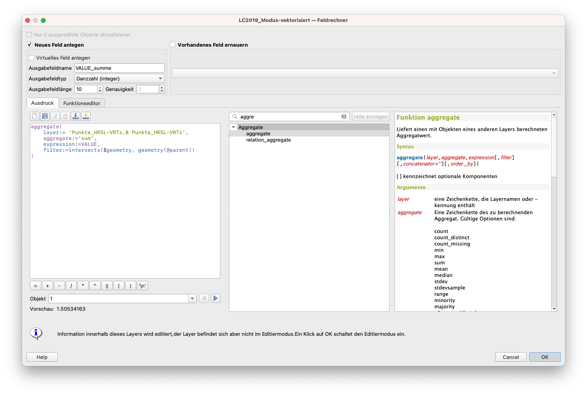

Abbildung 9.60 - Verwendung eingebauter Funktionen mit Feldrechner

Die Ergebnisse werden, wie erwartet, in der Attributtabelle des LC2019_Modus gespeichert. Und damit ist die Übung - zumindest für einen kleinen Teilbereich unserer Daten - abgeschlossen. 

**Bitte beachten Sie! Dieser letzte Schritt kann je nach Umfang Ihrer Daten sehr langwierig sein! Testen Sie, um Ihre besten Kachelmaße zu finden.**

Wenn die Verwendung des Feldrechners und der Aggregierungsfunktion nicht funktioniert, können wir auch den Algorithmus **Attribute nach Position verknüpfen (Zusammenfassung)** verwenden, um die Summe der Werte der Punkte innerhalb der LC2019_Modus Vektorlayers zu berechnen. Wählen Sie dafür unter "Zusammenzufassende Felder" das "VALUE" Feld aus und unter "Zu berechnende Zusammenfassungen" ausschließlich die Summe.


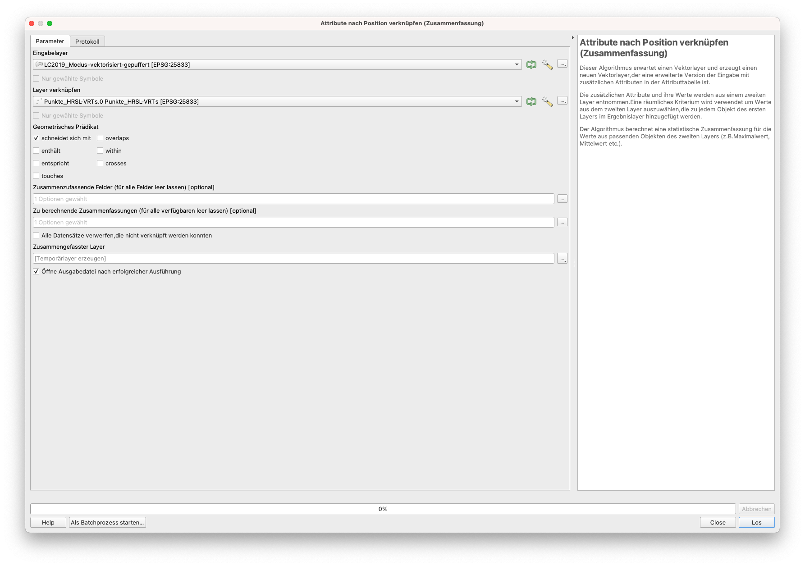

Abbildung 9.61 - Parameter des Algorithmus Attribute nach Position verknüpfen (Zusammenfassung)


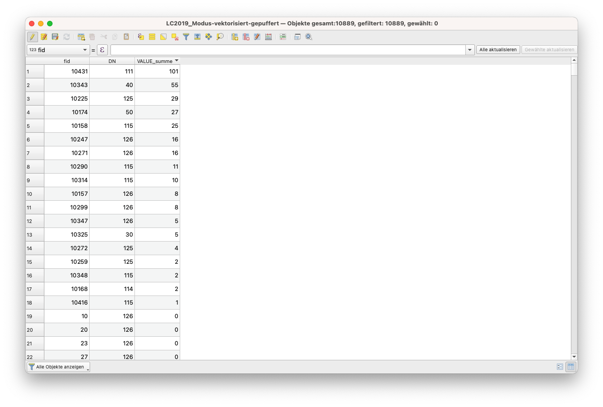

Abbildung 9.62 - Bevökerungsverteilung nach Landklassifizierung für einen kleinen Teil unseres Beobachtungsgebiets

In diesem dritten Teil unseres Moduls 9 haben wir sowohl mit Raster- als auch mit Vektordaten gearbeitet. Wir haben uns genauer angesehen, was Resampling bedeutet und welche Auswirkungen die Eigenschaften des Rasters haben, wie z. B. das Koordinatenreferenzsystem, die räumliche Auflösung usw. Meistens muss man sowohl mit Raster- als auch mit Vektordatensätzen arbeiten und daher ist es wichtig zu wissen, dass dies auf verschiedene Weise möglich ist. Wir haben auch eine Reihe von Konvertierungen getestet, von Raster zu Vektor und andersherum. Bei der Verarbeitung dürfen wir jedoch nicht die Phänomene aus den Augen verlieren, die wir untersuchen, und auch nicht den ursprünglichen Maßstab, in dem die Daten gesammelt wurden, sei es Vektor oder Raster. Bei der Durchführung von Konvertierungen ist es wichtig, die Beziehung zwischen einem Kartenmaßstab und einer Rasterauflösung zu kennen. Laut dem Kartographen Waldo Tobler "gilt die Regel, dass der Nenner des Kartenmaßstabs durch 1000 geteilt wird, um die erkennbare Größe in Metern zu erhalten. Die Auflösung ist die Hälfte dieses Betrags." Mit anderen Worten würde die Formel lauten:  `Kartenmaßstab = Rasterauflösung (in m) X 2 X 1000. `

Die Lösungen zu unseren Aufgaben in diesem Modul, wie auch in Modul 8, sind nur eine Möglichkeit, die Anforderungen zu lösen. Wenn man das Studium der Open-Source-Tools für Geodaten vorantreibt, stellt man fest, dass es mehrere Möglichkeiten gibt, um zum gleichen Ergebnis zu kommen - einige besser als andere. 


#### Quizfragen 

1. Wie nennt man den Prozess, durch den die Auflösung eines Rasterdatensatzes höher oder niedriger gemacht werden kann?
* _Resampling_ 
2. Was zeigt uns ein Histogramm? 
* _Die Häufigkeit von Pixelwerten, angeordnet in benachbarten Wertebereichen_
3. Kann ein Rasterdatensatz in ein Polygon umgewandelt werden? Und andersherum?
* _Ja und ja_


## Referenzen:

Center for International Earth Science Information Network - CIESIN - Columbia University. 2018. Gridded Population of the World, Version 4 (GPWv4): Population Density, Revision 11. Palisades, NY: NASA Socioeconomic Data and Applications Center (SEDAC). [https://doi.org/10.7927/H49C6VHW](https://doi.org/10.7927/H49C6VHW).

Resampling-Methoden: [https://gisgeography.com/raster-resampling/](https://gisgeography.com/raster-resampling/)


## Anmerkungen

[^1]:
     Eine primitive Operation ist eine grundlegende Berechnung, die von einem Algorithmus ausgeführt wird.  
[^2]:
     Die zeitliche Auflösung dieser Daten ist abhängig vom Breitengrad. 
[^3]:
     JAXA ist die Japan Aerospace Exploration Agency 
[^4]:
     Für die Zwecke dieser Übung betrachten wir das DHM als digitales Höhenmodell. Weitere Details zu den Unterschieden finden Sie im Abschnitt Begriffsgliederung
[^5]:
     Die Geospatial Data Abstraction Library (GDAL) ist eine Computersoftware-Bibliothek zum Lesen und Schreiben von Raster- und Vektordatenformaten für Geodaten. 
[^6]:
     Sentinel-2 ist eine Erdbeobachtungsmission des Copernicus-Programms, die systematisch optische Bilder mit hoher räumlicher Auflösung (10 m bis 60 m) über Land und Küstengewässern aufnimmt. Weitere Einzelheiten finden Sie [hier (englischsprachig)](https://sentinel.esa.int/web/sentinel/missions/sentinel-2). 