# **Module 8 - Vector processing and analysis**

**Author**: Codrina Ilie

## Pedagogical Introduction

This module is focused on a specific type of geographical data model: vector geodata.

By the end of this module, learners will have the basic understanding of the following concepts:

* vector data model
* metadata
* vector processing
* spatial data analysis
* geostatistics
* topology
* geoprocessing

and acquire the following skills:

* Checking geometric vector dataset quality using algorithms to check vector data topology and perform basic automatic corrections;
* Working with algorithms to identify errors in the attribute table;
* Vector data processing - running simple geoprocessing algorithms to answer potential requirements, such as how many public buildings are in my administrative region?
* Vector data processing - using geostatistics algorithms to fill in missing data. 


## Required tools and resources

* This module has been prepared using [QGIS version 3.16 - Hannover](https://qgis.org/en/site/forusers/download.html)
* [module8.gpkg](https://drive.google.com/file/d/1y8Vl-qxFwY4vSpqm8pFAVdnIlkAGcFv9/view?usp=sharing) which contains the following layers:
   * pois (point)
   * pofw (point)
   * road (line)
   * waterways (line)
   * buildings (polygon)
   * landuse (polygon)
   * admin_boundary (polygon)
* The coordinate reference system used is the Accra / Ghana National Grid, EPSG 2136. As it is a projected coordinate system, it allows geometric calculations. 


## Prerequisites

* Basic knowledge of operating a computer
* A robust understanding of modules 0, 1 and 2 and 6 of this curriculum. Module 0 introduces the notion of vector data model that is at the core of this current section. Prior understanding of modules 1, 2 and 6 allows you to focus strictly on the new notions and QGIS functionalities introduced in this new section, without having to wonder how you could load a new layer into your project, or how to work with the attribute table of your dataset.  

As part of this module, you will learn how to efficiently work with vector geographical datasets so that you can extract new information. This includes a more in depth understanding of what vector data is, what quality standards it must comply so that it is truly useful, what are the most common operations done on vector data (geoprocessing, geostatistics). 


## Additional resources: 

* [https://docs.qgis.org/3.16/en/docs/user_manual/working_with_vector/functions_list.html](https://docs.qgis.org/3.16/en/docs/user_manual/working_with_vector/functions_list.html) 
* [http://www.geo.hunter.cuny.edu/~jochen/gtech361/lectures/lecture12/concepts/01%20What%20is%20geoprocessing.htm](http://www.geo.hunter.cuny.edu/~jochen/gtech361/lectures/lecture12/concepts/01%20What%20is%20geoprocessing.htm)
* [Encyclopedia of GIS, 2017 Edition, Editors: Shashi Shekhar, Hui Xiong, Xun Zhou](https://link.springer.com/referencework/10.1007/978-3-319-17885-1)<span style="text-decoration:underline;"></span>
* [Metadata And Catalogue Services](https://www.geo-train.eu/modules/metadata/pdf/Metadata.pdf), author Mariana Belgiu, UNIGIS Salzburg;
* [Basics of Metadata](https://www.fgdc.gov/resources/factsheets/documents/GeospatialMetadata-July2011.pdf) by the Federal Geographic Data Committee;


## Thematic introduction

Let’s start with an example: You have just landed for your city break in Kumasi, Ghana and you need to get from the airport to your hotel. You have no knowledge of where the airport is situated with respect to the city, nor where the hotel is, so the first thing you do is open a map to help you navigate through this new and excited city! You take your phone out, open a map app and you select the start point - the airport - and the end point - your hotel - then ask for the route, by foot, car or public transport. In a matter of seconds, the routing app offers you the best solution for you to get from point A to point B and it highlights it by drawing a distinct line following streets and alleys, as visible in figure 8.1.


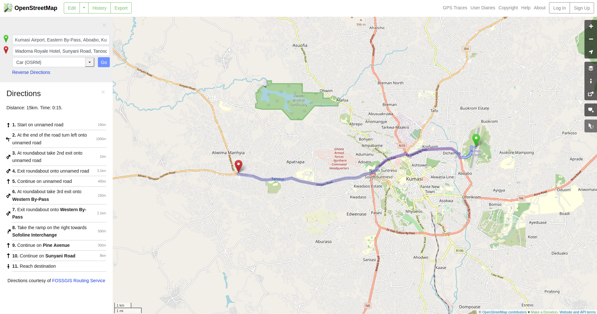

Figure 8.1 - Getting from point A to B using Openstreetmap


## Breakdown of the concepts

This is a classic example of vector data use and it breaks down into several concepts that we will define below. 

The data used is spatial - it has a very well defined location on Earth, its attributes are also well identified. Thus, a point with longitude and latitude and the attribute name= Clark International Airport - represents the starting point A and a point with another pair of longitude and latitude and the attribute name= Hotel Boss represents the end point B. Streets are represented by lines composed of segments and vertices (represented by blue small circles in figure 8.2), with attributes such as name, direction, speed limitation etc. 


Figure 8.2 - Vector lines representing streets and the associated attribute table

Streets represent a network model that is basically a collection of topologically interconnected point and line features. The results of the algorithm that calculates the route from point A to point B - in our case from the airport to the hotel - are highly dependent on the quality of the vectors, both in geometry - topology rules are respected - and in attributes - if a road is unidirectional that must be indicated so the routing doesn’t lead you the wrong way. 		

### The vector data model

As presented in module 0, there are 2 data models used in a geographical information system - GIS: raster and vector. Geospatial data always includes a **spatial** component indicating the location or the spatial distribution of the phenomenon at hand and an **attribute** component that describes its properties. The choice between using the raster or the vector data model for a particular situation depends on the source of the data as well as its intended use. 

The vector data model is used to represent areas, lines and points (Figure 8.1). 


Figure 8.1 - vector data with attribute table


### Metadata

Metadata is most simply defined as data about data. It characterises, at different levels of detail, the dataset that it is associated to, including categories such as: who is the provider/owner of the dataset, what is the license, in what language are the attributes written, what was the coordinate system used, which geographical area it describes and what is the reference year, keywords, what are the known limitations, accuracy level, what was the original scope of the dataset and many more.

Metadata is paramount because a clear understanding of the data to be used in a specific analysis can make the difference between a correct or a biased decision. If one must identify where to place a new temporary hospital, but the road data is old and no longer reflects the reality on site, then any decision based on it will be inaccurate. 

Because of the importance of metadata, its categories (their definitions, name, what kind of information they can store etc.) follow well-defined and standardized structures. These metadata well-structured files can then be integrated in dedicated catalogues, allowing a user to search and find geographical data only by querying the characteristics she is interested in, without downloading and analysing the data herself. There are numerous metadata catalogues and, when standardised, they can be accessed through different functionalities within GIS software. An example of that will be presented in Module 9 QGIS Plugins. 

It must be said that metadata is not a specificity of geospatial resources, but it applies to any kind of data.


### Rational of vector processing

The power of GIS lies in its unique capacity of connecting geometric properties that define real objects and phenomena in our world and their attributes - either observed, measured or calculated - and allowing through specialised software to perform operations on their geometries, on their attributes or both in order to derive new valuable information. 

Although most oftenly, GIS is closely associated with maps that simply display geographical information, its functionalities go far beyond the creation of cartographic representations, be they dynamic or static. 

**Spatial data analysis** (synonyms: spatial analysis, geospatial analysis, geographical analysis, spatial interaction) is a general term referring to any technique designed to identify patterns, to detect anomalies and to test theories based on spatial data. An analysis is spatial if and only if the results are sensible to relocation of the objects analysed - simply put, **location matters**. As information technology evolved, scientists started applying various techniques from the literature of statistics, geometry, topology and other sciences to the analysis of geographic data to study patterns and phenomena on the Earth’s surface. 

**Geostatistics** is a branch of statistics that applies to spatial data. The most common employed methods are related to interpolation, which is a mathematical process that allows  estimation of unknown values based on the known ones. 

**Topology** is a branch of mathematics that allows the GIS user to control the geometric relationships between features and maintain geometric integrity. Topology is best understood as a set of rules that ensures spatial data quality that can apply to the same vector layer or more. The rules are designed as to respect the real world relationships that the vector layers represent. For example there can be no gaps between the polygons that represent cadastral parcels in a region, or no point belonging to the vector layer that represents individual trees can not be contained in any polygon of the vector layer that represents buildings within a region. 

GIS software offers functionalities allowing the user to define relevant topology rules, as well as algorithms to check if they apply and to clean the vector layer where inconsistencies are identified. 

Geoprocessing is a general term used to define any operation - process - applied to a geographical dataset, with the scope of obtaining a derived dataset opening new insights on the data. Common geoprocessing operations are geographic feature overlay, feature selection and analysis, topology processing and data conversion. Geoprocessing allows one to define, manage, and analyze geographic information to support decision making. 


Figure 8.4 - elements of a geoprocessing operation

**TIP**: You can access Processing Algorithms (such as those used in this module) on the **Processing Toolbox** or **Locator Bar**.


## Main content: 

### Phase 1: Understanding your data.

There are many geoprocessing operations that can be performed on vector data, most commonly including geographic feature overlay, feature selection and analysis, topology processing and data conversion. In this first phase, we will become familiar with some of them, understanding how they work and what results we can expect. 


#### **Step 1. Prepare your working environment.**

Open QGIS, set up the coordinate reference system you will work in - EPSG 2136 -  and add the following data layers:

* Polygons - administrative boundaries; buildings; land use;
* Lines - roads, rivers;
* Points - places of worship, places of interest

At this point, your QGIS map window should look like in figure 8.5, of course, most probably, in other colours. 


**TIP**: Use spatial indices to speed up and improve processing time. You can do this using the **Create spatial index** algorithm.

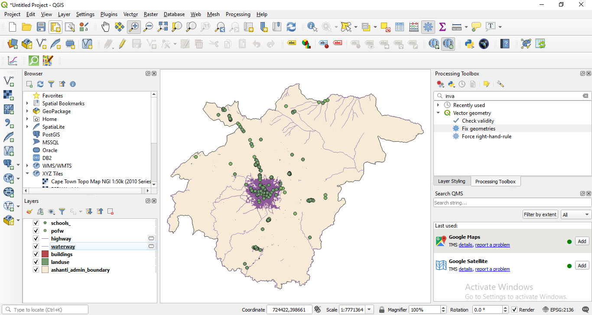

Figure 8.5 - Loaded vector data sets: points, line and polygons

**Check!** All layers are in the same coordinate system (EPSG 2136) by looking in the right down side corner. If it is so, then you are looking at 7 vector data layers overlaid. 

#### **Step 2. Understand what you are looking at.** 

At this point, we have 7 vector layers loaded into our QGIS project. The next steps will help us understand our data. 

* Check how many features we have in a layer - there are several ways to do that: 

    * **Double click on the layer of interest ‣ Properties ‣ Information ‣ Feature count**
    * **Open the attribute table of the layer of interest and look at the upper central side** 


Before running any basic statistics, let us complete the attribute table with some geometric attributes (see Module 6 for details): 

* Roads layer - calculate length for each road segment and store it in the attribute table: output field name - length `round($length, 2)`
* Buildings layer - calculate the area for each building and store it in the attribute table; output field name - area `round($area, 2)`

Now, the attribute fields are filled, yet if you are not certain in which measurement unit QGIS has calculated the length of roads segments and areas of buildings, then checking the coordinate system information will help you. 

Click on the down right corner of the QGIS map window, on EPSG 2136 and a window as the one in figure 8.6 will appear. 


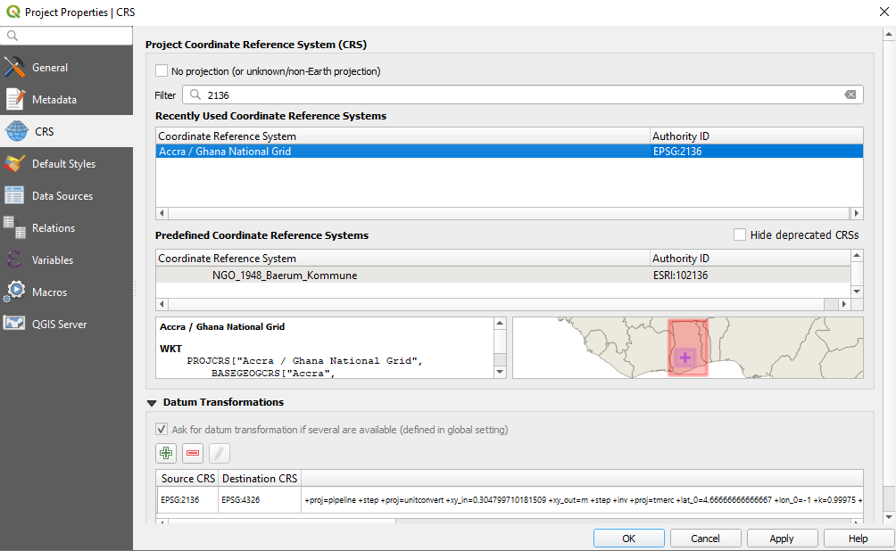

Figure 8.6 - Specifications of the coordinate reference system used in the QGIS project

Thus, we find out that the measurement unit is the meter, therefore the lengths are measured in meters and the areas in square meters. 

* Run basic statistics on the loaded layers to get a better grip on your data (figure 8.7 ):

    * **Vector menu ‣ Analysis Tools ‣ Basic statistics for fields**
    * **Processing toolbox window ‣ search for 'stats'**


Figure 8.7 - Basics statistics for fields

The statistics returned depend on the field type we choose and are generated as an HTML file.

Let’s run it on our roads layer and see what results we get. Complete the window, like in figure 8.8. 


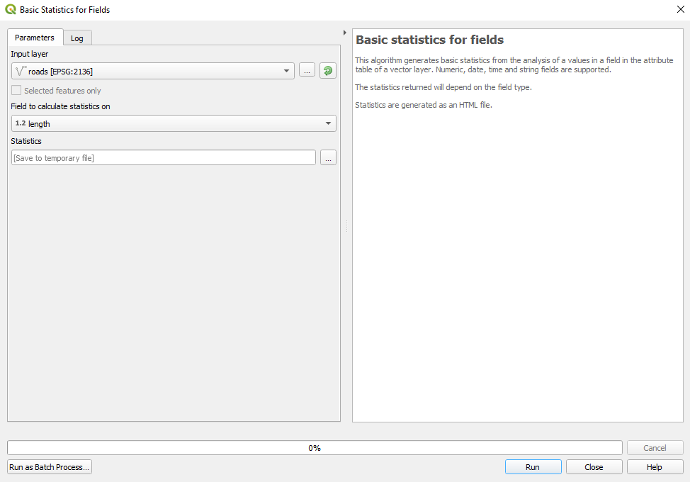

Figure 8.8 - Preparing to run basics statistics for roads layer

The output file is an html which can be opened with any browser (Firefox, Chrome, Safari etc. ) that should look like below: 


```
Analyzed field: length
Count: 64473
Unique values: 33106
NULL (missing) values: 0
Minimum value: 0.04
Maximum value: 19690.45
Range: 19690.41
Sum: 13927358.250000086
Mean value: 216.01846121632445
Median value: 111.18
Standard deviation: 372.48583667812585
Coefficient of Variation: 1.724324090546652
Minority (rarest occurring value): 0.04
Majority (most frequently occurring value): 0.55
First quartile: 51.03
Third quartile: 239.99
Interquartile Range (IQR): 188.96
```


From these basic statistics, we find out that there are 64473 road segments in the loaded layer, where the shortest has 0.04m and the longest 19690.45m - almost 20 km. We find out that the sum of roads in Ashanti is almost 14k km (13927.358 km). Given that the mean is greater than the median, it tells us that the 2nd half of the dataset contains longer road segments and that it outweighs the road segments in the 1st half. However, the median shows that most road segments have length around 500 m. 

Running the basic statistics on the layer Buildings for the type category, we obtain the followings: 


```
Analyzed field: type
Count: 827657
Unique values: 74
NULL (missing) values: 773210
Minimum value: Brgy. San Vicente
Maximum value: yes;house
Minimum length: 0
Maximum length: 20
Mean length: 0.3669563599413767
```


The results don’t look the same, we don’t have mean, nor median or standard deviation. That is because the attribute field we ran the algorithm on is different, we don’t have numbers but words - types of buildings. We find out that out of 827657 buildings in Ashanti, for 773210 we don’t know the type of the building. We also find out that there are 74 unique categories. 


#### **Step 3. Basic checks to quickly find errors in your data.**

Perfect, flawless datasets are the equivalent of the ideal gas in physics. There is no such thing, but many can come very close to it. Therefore, before doing any kind of analysis to extract information, at least some basic checks are necessary on how _clean_ the data we have are. 

There are many types of errors that can affect the quality of your data and, given the scope of your geospatial analysis, their influence on the final result can be more or less important. For example, if you use geospatial data to route yourself from point A to point B by car, then having a roads layer complete with attributes on which streets are one way or  closed to road traffic, is essential to get a viable result.  However, if your routing is by foot, then that information is not crucial for your result. 

When referring to geospatial data errors, there are 2 main terms that need to be well understood: 

**Accuracy** is the degree to which information on a map matches real-world values and it applies both to the geometry and to attributes.

**Precision** refers to the level of measurement and exactness of description in a geospatial dataset.

**An error** encompasses both the imprecision of data and its inaccuracies. **Data quality **refers to the level of precision and accuracy of the datasets and it is most often documented in data quality reports. 

Analysing and _cleaning _a geospatial dataset can be a very time consuming and cumbersome task, however - as shown in the example above - it is essential. In this section, we present a few GIS functionalities that allow a user to perform fast checks on vector data and draw a set of preliminary conclusions on its quality. 

**Topology checks.**

QGIS offers a core functionality that allows the user to perform a series of topological checks on the loaded vector datasets, named Topology Checker. The Topology Checker is a Core plugin and can be activated from the **Manage and Install Plugins Dialog**. Open the Manage and Install Plugins Dialog and make sure that the Topology Checker plugin is activated (with check sign). It can be found under the **Installed** tab.


Figure 8.9.a - Topology checker plugin

To show the Topology Checker, enable it as a panel under **View ‣ Panels ‣ Topology Checker** (figure 8.9.b). If it does not appear in the Panels menu, you can enable it by clicking the Topology Checker button  on the Plugins toolbar. Once activated it’s window looks like in figure 8.9.c.  


Figure 8.9.b - Topology checker panel


Figure 8.9.c - Topology checker window


To define the topology rules, click on the third icon , opening a window as in figure 8.10. 


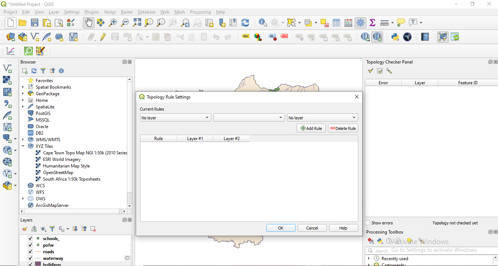

Figure 8.10 - Topology rule settings window


We will set a number of rules for the layers we have loaded in our QGIS project, considering the real world objects they depict- roads, buildings, waterways in the district of Ashanti. 

The configuration of the topology is straightforward, as the rules that can be applied based on the selected layer are already embedded in this functionality, as figure 8.11 depicts. 


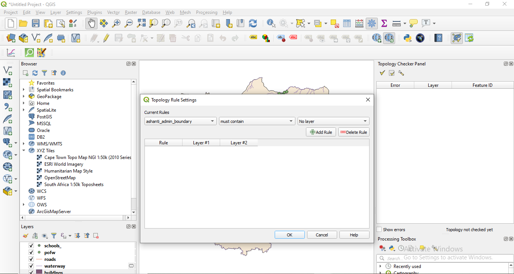

Figure 8.11 - Topology rules dropdown menu based on the selected layer.

Choose the topology rules as depicted in figure 8.12. 


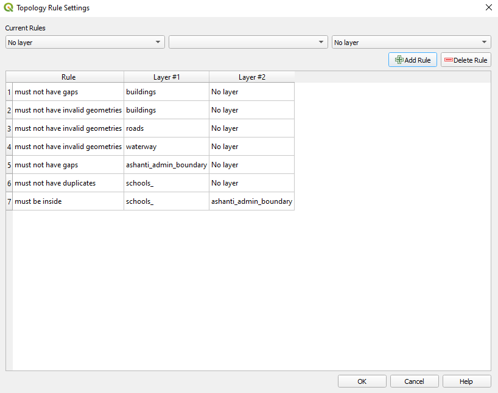

Figure 8.12 - Topology rules to be set 

Click on the first icon  on the Topology Checker window to run and wait for the results. After running the topology check, your map windows should look like in figure 8.13. 


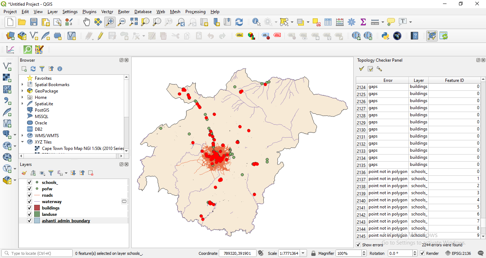

Figure 8.13 - Topology check results

In the down right side corner, the topology checker window lists all errors identified based on the rules we have defined in the earlier phase. If the Show errors checkbox is ticked, then the errors will be highlighted on the map with red. Double clicking on a selected error, will move the map to its location. 

The process of correcting the errors in a dataset, be it geometry related (duplicates, gaps etc.) or in the attribute related  (missing values, misspelled etc.) is called cleaning a dataset and it is most times as cumbersome as it is necessary. Although there are functionalities to support a semi-automatically cleaning process, the user’s input is often necessary. For example, in figure 8.14, we have zoomed in an error in our points of interest layer, a duplicated point. As it can be seen, there are 2 point depicting one cafe, the difference being in the attribute table where one is listed as a cafe and one as a “doityourself” - which one can assume might be a popular name for cafes where you prepare your own coffee. 


Figure 8.14 - Duplicate point error in points of interest vector layer

In this particular case, the decision of the user would most probably be to remove the duplicate point, as it can insert error in further spatial analysis. For example, if a town official wants to know how many restaurants and cafes are in a specific neighbourhood, the duplicate point will insert an error in the results and that could eventually lead to mislead decisions.  

Therefore, we will proceed with an automatic removal of the duplicate points. To do it, we will use a core functionality of QGIS - **Delete duplicate geometries** - found in the processing toolbox. Your QGIS should look as in figure 8.15. 


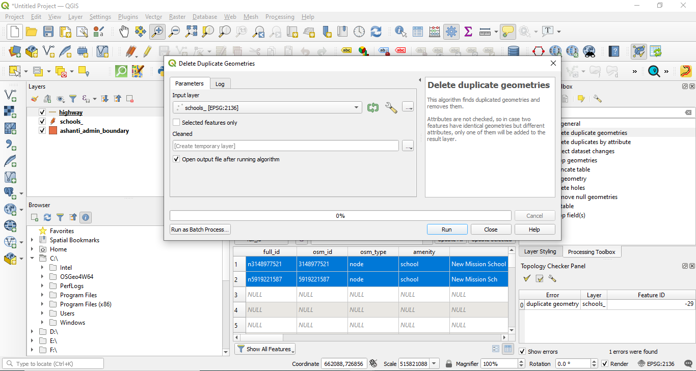

Figure 8.15 - Delete duplicate geometries on layer points of interest

After running the algorithm, the functionality window presents the results, it has identified 1 duplicate point, just as the topology checker, and it informs the user that it has deleted them all, leaving the points of interest layer with **112 features**. Rename this layer to **schools_cleaned**. Note that the output is a layer in memory, you can make it permanent by saving it to a file.


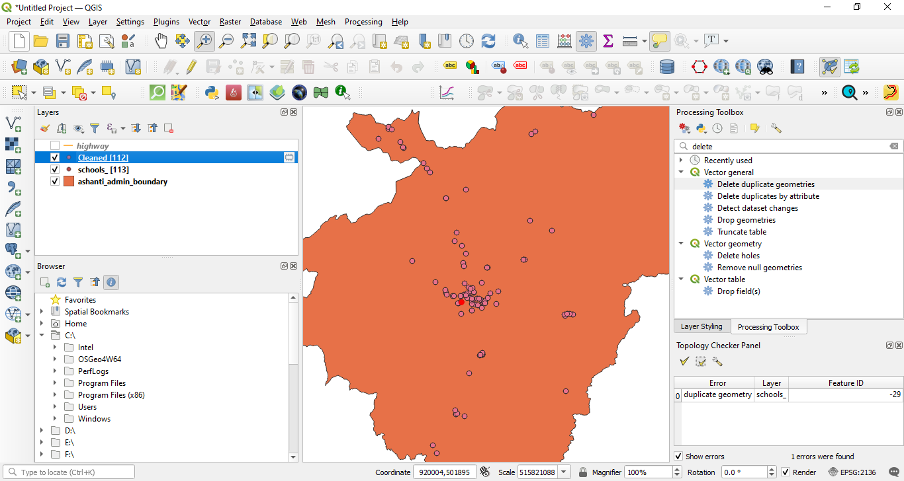

Figure 8.16 - Result of running delete duplicate geometries

Re-running the topology checker will lead to a 0 errors results with respect to the topology rule of no geometric duplicates for the points of interest layer. 

**Attention!** The algorithm considers **only geometries**, ignoring the attribute. If, such is our case, there are some differences in the attribute for the duplicates, the user has no control over which one will be kept. Therefore, if there is a need for all information to be kept, it must be first copied to all geometries, so when a duplicate feature is deleted there is no info loss. 

Let us run another topology check, this time on our building layer. Configure the following rules: 

* No duplicate
* No invalid geometries

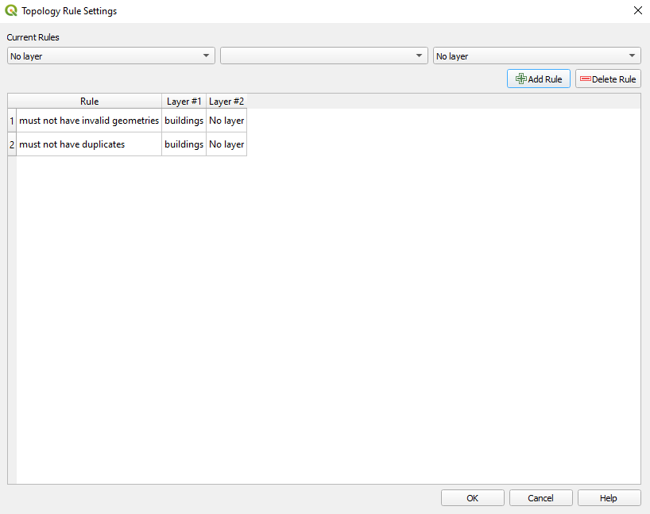

Figure 8.17a - Topology checker rules on the buildings vector layer

Run the algorithm. 

The result should look like figure 8.17b. 


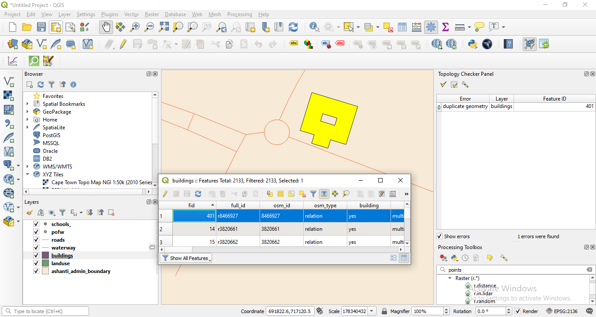

Figure 8.17b - Results of topology check on the buildings vector layer

Clean the duplicate feature by using the process indicated above (figure 8.18a)


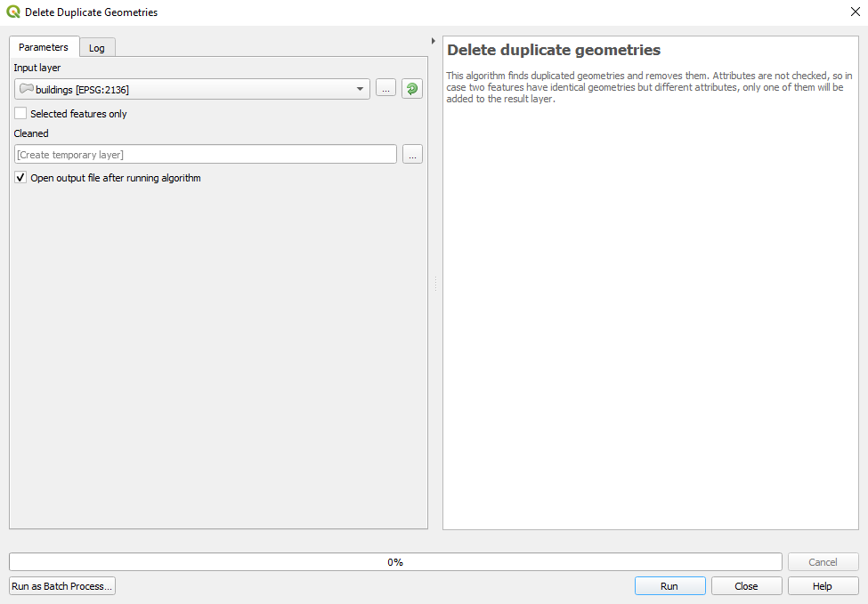

Figure 8.18a - Remove duplicate geometries on the buildings vector layer


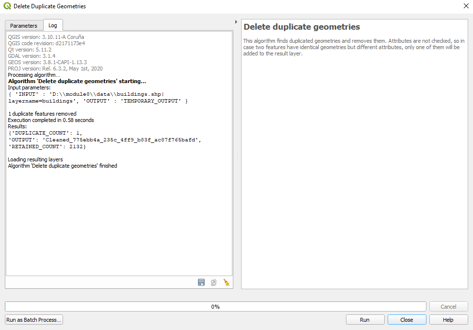

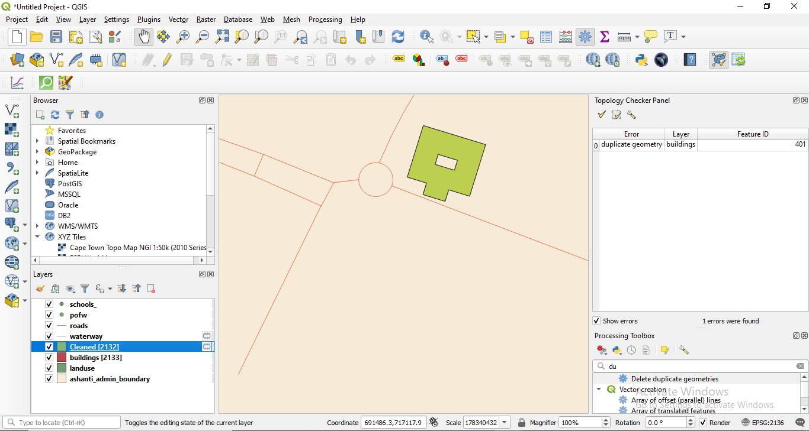

Figure 8.18b - Results of removing duplicate geometries on the buildings vector layer


A complete cleaning of the vector datasets used for this module is out of scope. Its complexity transforms it in a more advanced module in itself.


#### **Step 4. Take a closer look at the information attached to the points, lines and polygons.**

Let's run one more algorithm to get a sense of what the attributes for our Ashanti layers are. After we’ve identified how many features each layer has, let’s see how many and which are the unique attributes in the following cases: 

* layer buildings_cleaned - attribute type;
* layer pois_cleaned - attribute fclass;
* layer waterways - attribute fclass;
* layer pofw - attribute fclass;
* layer roads -attribute fclass;
* layer landuse - attribute fclass;

For that, go to **Vector ‣ Analysis Tools ‣ List unique values** (figure 8.19)


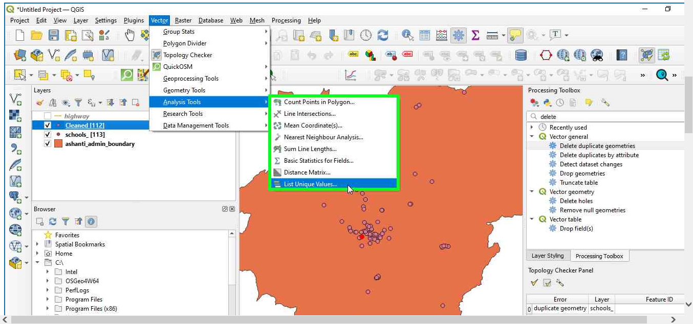

Figure 8.19a - List unique values in a vector layer functionality

In the window that opens, insert each layer's name and attribute of interest as enumerated in the list above and you should have the following results: 


")

Figure 8.19b - List unique values in a vector layer functionality (Batch Processing)

<table>
  <tr>
   <td><strong>Layer name</strong>
   </td>
   <td><strong>No. of unique values</strong>
   </td>
   <td><strong>Unique values</strong>
   </td>
  </tr>
  <tr>
   <td>buildings_cleaned
   </td>
   <td>74
   </td>
   <td>military;parking;gymnasium;mosque;yes;house;NULL;track;college;Idelfonso';'Tuazon Str;terrace;with roof;construction;veterinary;gazebo;hut;connector_bridge_sky;barn;roof;Yakult;kindergarten;hospital;pharmacy;laboratory;apartments;multipurpose;public;warehouse;farm;quarry;school;footway;Not_sure.;temple;service;garage;office;allotment_house;train_station;commercial;transportation;industrial;storage_tank;hotel;marketplace;farm_auxiliary;university;Unsure_-_please_chec;power_substation;clinic;hall;hangar;greenhouse;gawad kaling phase 1;tennis;church;Brgy. San Vicente;fire_station;toilets;civic;pumping_station;retail;residential;shed;chapel;supermarket;clubhouse;dormitory;Pineda Residence;government;carport;manufacture;garages;motorway;house
   </td>
  </tr>
  <tr>
   <td>pois_cleaned
   </td>
   <td>105
   </td>
   <td>alpine_hut;artwork;bicycle_shop;comms_tower;college;chalet;beverages;tourist_info;veterinary;hunting_stand;greengrocer;gift_shop;food_court;restaurant;ruins;pharmacy;bank;fountain;convenience;monument;clothes;caravan_site;cafe;camera_surveillance;recycling;atm;furniture_shop;sports_shop;post_office;hospital;viewpoint;guesthouse;kindergarten;cinema;biergarten;garden_centre;doityourself;florist;lighthouse;fast_food;butcher;mobile_phone_shop;sports_centre;nightclub;motel;department_store;graveyard;fire_station;bar;car_rental;shoe_shop;stationery;golf_course;picnic_site;post_box;pitch;theatre;recycling_metal;playground;school;shelter;stadium;computer_shop;toy_shop;doctors;beauty_shop;bakery;kiosk;hostel;recycling_glass;laundry;pub;bicycle_rental;water_well;archaeological;nursing_home;swimming_pool;camp_site;town_hall;supermarket;toilet;bookshop;water_tower;park;courthouse;telephone;attraction;memorial;library;optician;mall;hotel;travel_agent;car_dealership;observation_tower;video_shop;tower;water_works;dentist;police;community_centre;car_wash;bench;hairdresser;museum
   </td>
  </tr>
  <tr>
   <td>waterways
   </td>
   <td>4
   </td>
   <td>river;canal;drain;stream
   </td>
  </tr>
  <tr>
   <td>pofw
   </td>
   <td>5
   </td>
   <td>christian_evangelical;christian_methodist;buddhist;christian_catholic;christian
   </td>
  </tr>
  <tr>
   <td> roads 
   </td>
   <td>25
   </td>
   <td>secondary;trunk;track;bridleway;primary;tertiary;path;track_grade2;steps;footway;cycleway;trunk_link;track_grade4;unclassified;service;primary_link;pedestrian;unknown;tertiary_link;secondary_link;living_street;track_grade5;residential;motorway_link;motorway
   </td>
  </tr>
  <tr>
   <td>landuse
   </td>
   <td>19
   </td>
   <td>military;park;forest;cemetery;recreation_ground;nature_reserve;heath;farmland;quarry;commercial;vineyard;industrial;scrub;orchard;grass;farmyard;meadow;retail;residential
   </td>
  </tr>
</table>


Table 8.1 - Table identifying how many and what are the unique values for the selected attributes

For a more in depth analysis of the attributes of our vector layers, we will use the GroupStats plugin. It was developed to support statistics calculation for feature groups in a vector layer making it very useful to gain more understanding of your data, as well as to spot potential errors in the attributes. 

First, make sure that you have installed and activated the GroupStats plugin. Afterwards, to open the GroupStats window, go to   **Vector ‣ GroupStats ‣ GroupStats**.

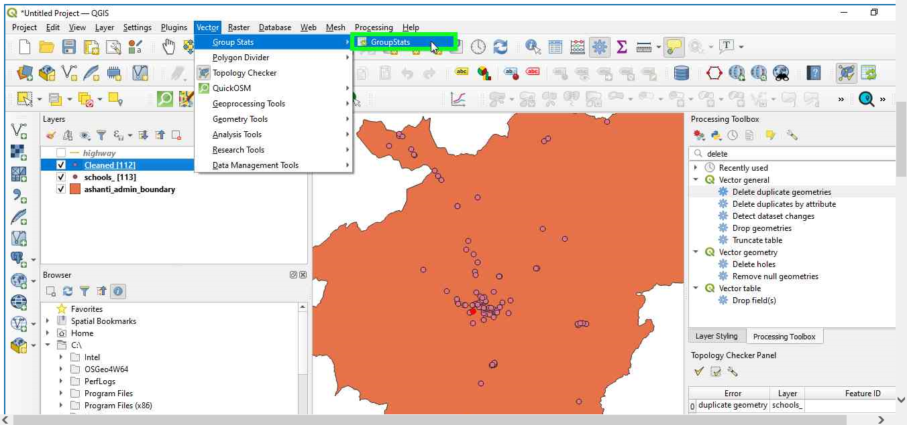

Figure 8.20a - GroupStats plugin

A new window like the one in figure 8.20b should open. 


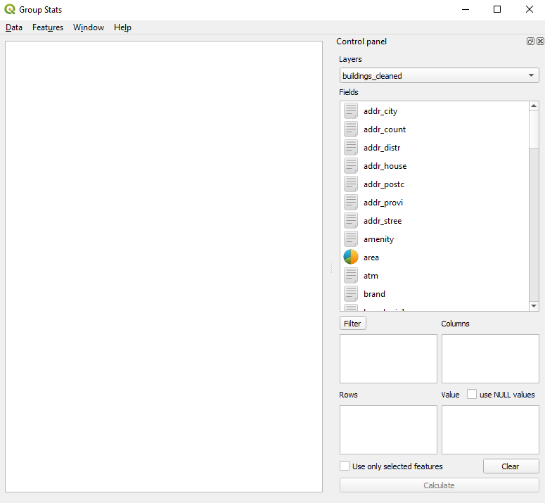

Figure 8.20b - GroupStats window

As per the analysis done earlier, we have seen that for the layer buildings we have 74 different types of buildings, but how many each and what is the total built area taken by each category? How much space for schools, for markets, houses? GroupStats can help us answer this question. On the right side of the window, there is the control panel, where we choose what we want to calculate, as well as how the data should be arranged. Using drag&drop, follow the arrangement in figure 8.21, then press calculate. 


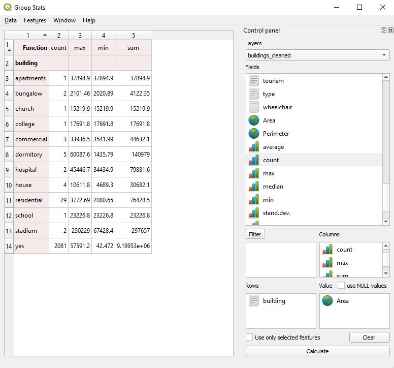

Figure 8.21 - Running GroupStats on the building layer. 

Looking at the result, we can extract important insights regarding our data. For example, for residential purposes in the Ashanti region, we have 3270 buildings with a total surface area built of 405937 square meters, approx. 40 hectares. We also find out that the largest has 1474 square meters as the smallest has 10 square meters. And one can continue the analysis for further valuable information. 

Another interesting analysis can be run on the roads vector layer. Figure 8.22 shows how to calculate the lengths of roads categorised by type of road (primary, residential, motorway etc.) and maximum speed allowed. 


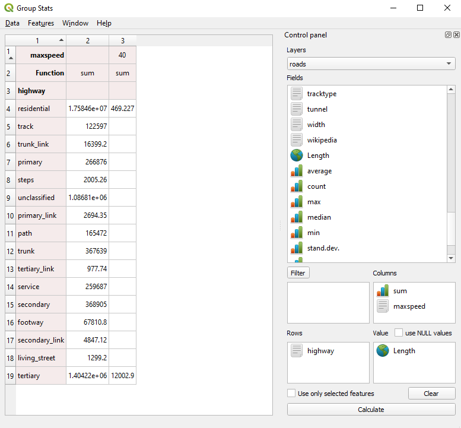

Figure 8.22 - Running GroupStats on the roads layer. 


#### **Quiz questions**

1. Is metadata important? 
* _<span style="text-decoration:underline;">Yes, because it gives insight into the geographical data that otherwise one could not gain. </span>_
* _No, it’s just bureaucracy. _
2. Topology is relevant to the geometry or to the attribute table of a vector layer?
* _to the geometry of the vector layer. _
3. What is more important, the geometry or the attribute data? 
* _Geometry._
* _Attribute data._
* _<span style="text-decoration:underline;">Both.</span>_


### Phase 2: Introduction into vector processing

First phase of the vector module made a brief introduction into the steps that one should make to have a basic understanding of the geospatial data they have at hand. 

This second phase of the module leads you into a more in depth work to process vector data in order to extract valuable insights to assist decision making. Following the concepts described at the beginning of this module, geoprocessing represents any process applied to a geographical dataset, with the scope of obtaining a derived dataset opening new insights on the data. And this is what we will attempt to do in the following. 

There are many operations that can be performed on one or more geospatial datasets and during this first step, we will run some of the most common ones to understand how they operate. 

**Buffer.** Imagine that you need to analyse a new piece of legislation that asks that on an area of 500 meters around places of worship there can be no other construction built. You would want to see where exactly those delinations are and maybe even how many square meters that is for your district. First step is to define a buffer around the places of worship: **Vector ‣ geoprocessing tools ‣ Buffer**. When the buffer window opens, set the parameters like in figure 8.23: 


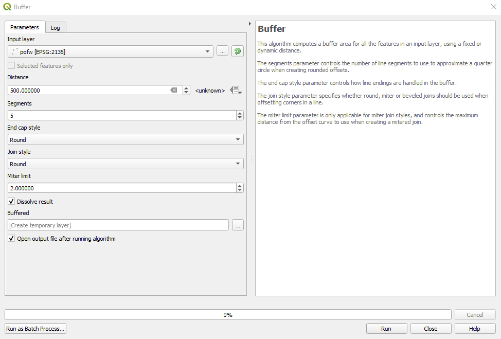

Figure 8.23 - Setting the parameters for a 500 m buffer around the places of worship

A detail of the result of the geoprocessing is depicted in figure 8.24: 


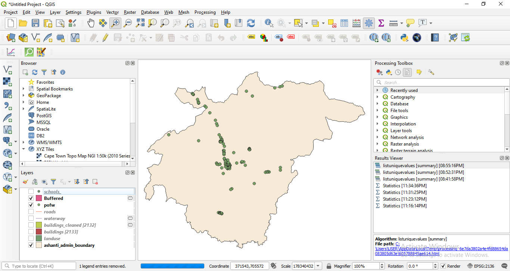

Figure 8.24 - Running buffer on a point vector layer

To completely answer the initial question, the next step is to calculate the areas for all buffers and sum them up (see Phase 1, step 4) - figure 8.25. 


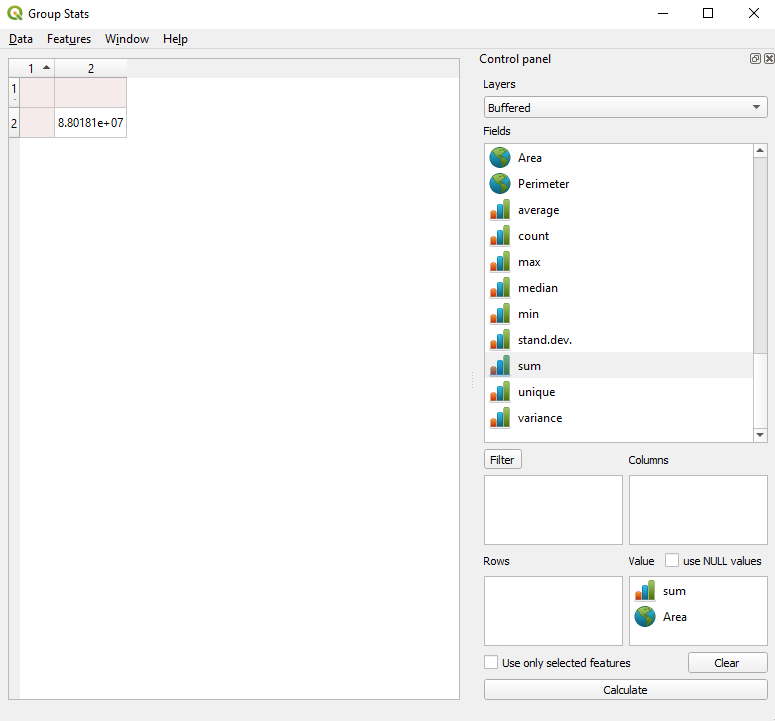

Figure 8.25 - Calculate area for the newly obtained layer, then calculate using GroupStats the total sum.

**Clip.** Imagine you want to know where all the industrial delineated areas are in your district and also how many buildings are within that perimeter. Visual inspecting your vector data, you notice that you have a number of industrial areas that contain several buildings. You want to separate those buildings and to use them further. First step is to select all features in the landuse layer that have as attribute industrial (see module 6 for how to do that). Afterwards, you go to **Vector ‣ Geoprocessing tools ‣ Clip** and choose as the layer to be clipped buildings_cleaned. Your results should look like in figure 8.27b. 


Figure 8.26a - Select landuse fclass = industrial. 


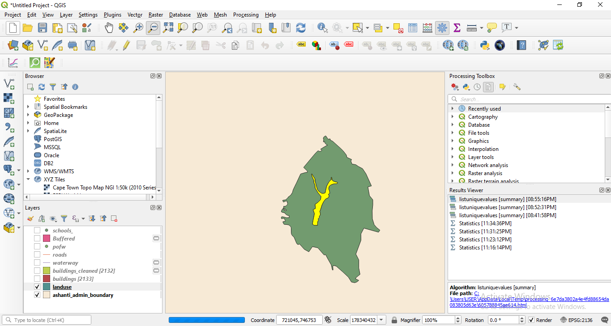

Figure 8.26b - Reduced selection of a few buildings and industrial landuse, so the computation can finish faster. 

Run the Clip algorithm. Make sure to check **Selected features only** box for the Overlay layer (landuse). This will ensure that only the currently selected features will be used for clipping and speed up the computations.


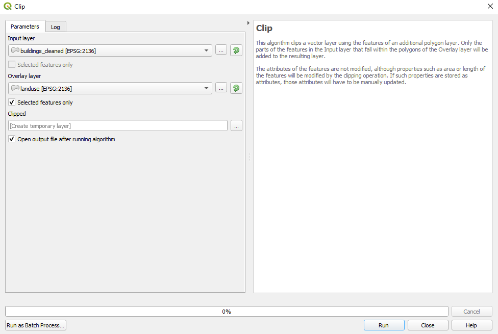

Figure 8.27a - Running the Clip algorithm

After running the algorithm, your results should look like in figure 8.27b. The clipped buildings are colored in green (might be different on your machince). How many industrial buildings have you clipped and what is their total area? 

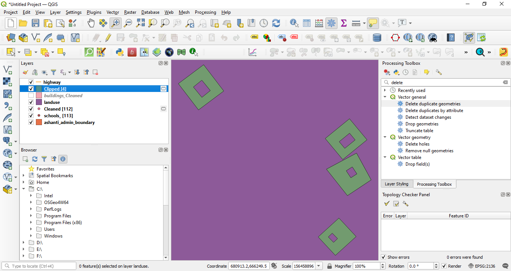

Figure 8.27b - Results of the clip functionality

**Thiessen (Voronoi) polygons.** Imagine you have to make a series of administrative decisions in your district based on how many schools there are and what specific areas they serve. Geospatial analysis can be of assistance. You can start by calculating the Thiessen polygons. Based on an area containing at least two points, a Thiessen Polygon is a 2-dimensional shape which boundaries contain all space which is closer to a point within the area than any other point without the area. A good use example is in meteorology, where weather stations are discrete points, yet the information collected is considered to be measured out on the surface based on the thiessen polygons. 

To respond to the above question, we will run the algorithm only for points that have the attribute private at operator. Thus, make the selection as instructed in module 6. You should have 5 features selected on layer schools_cleaned. Go to **Vector ‣ Geometry Tools ‣ Voronoi Polygons..** After setting the parameters - select the point layer for which we want the Voronoi polygons calculated and a 30% extension so that the entire Ashanti region is contained, you should see a result like in figure 8.28d. 


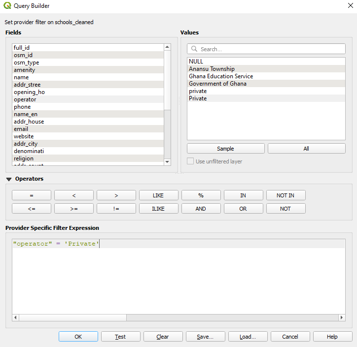

Figure 8.28a - Filtering the schools_cleaned layer to get all private schools


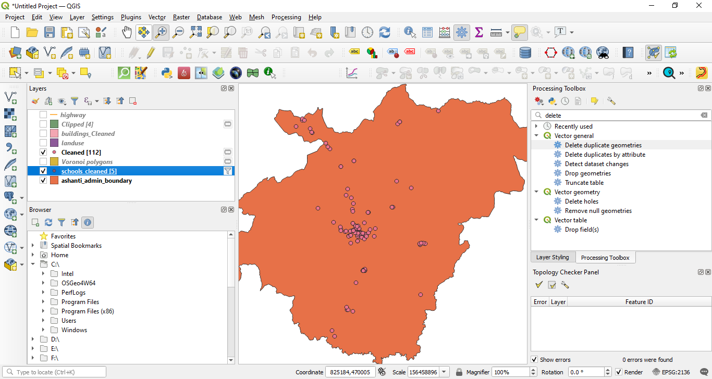

Figure 8.28b - All private schools in the schools_cleaned layer


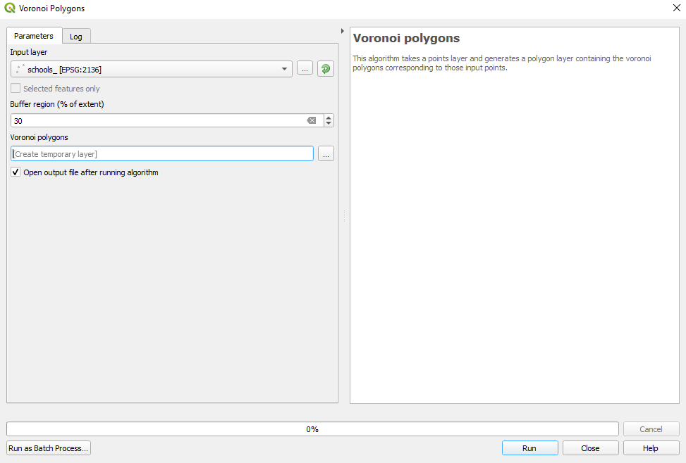

Figure 8.28c - Running the Voronoi polygon algorithm


 polygons algorithm to a point vector layer")

Figure 8.28d - Results of applying Thiessen (Voronoi) polygons algorithm to a point vector layer

Sometimes, the necessities impose the requirement of having information in smaller, clearly defined and equal areas and not for an entire large region, such as a country or a big city. Therefore, the data needs to be analysed and visualised in a sliced, well-defined way, allowing comparison that otherwise could prove difficult without a ground common reference. 

Let us assume that you have to present a report that will allow comparisons done for units of 10X10 km over the administrative unit, including: 

1. density of green spaces (parks, forests) in report to the built-up space per unit;
2. total length of streets for each unit;
3. total length of waterways for each unit;
4. total number of public buildings for each unit (schools, kindergartens, hospitals , town halls etc.).

We’ve seen that there are tools that can assist us in calculating the total surface occupied by a certain type of feature, however the first step is to create our 10X10 units - cell grids. To do that, go to: **Vector ‣ Research Tools ‣ Create grid..** Set the parameters to: 
- Grid type - Rectangle (polygon)
- Grid extent - Ashanti_admin_boundary layer
- Horizontal spacing - 10 km
- Vertical spacing - 10 km 


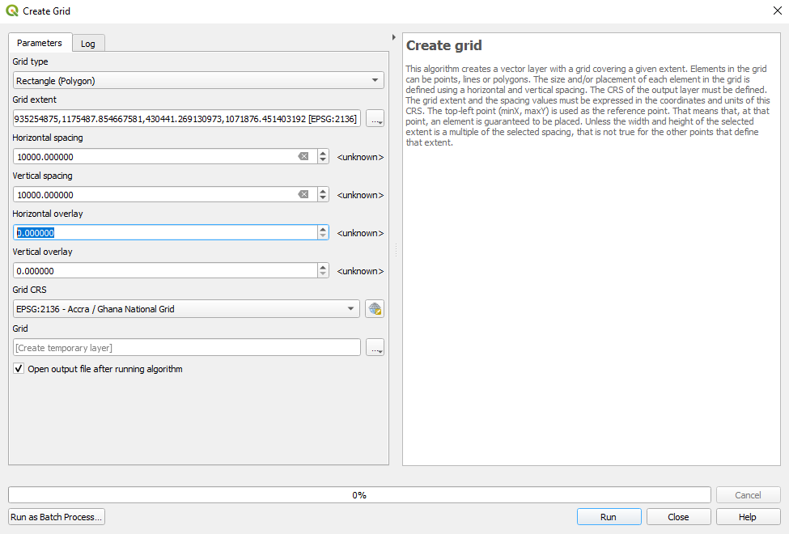

Figure 8.29a - Create 10kmx10km vector grid for Ashanti province

You should get a result like in figure 8.29b. 


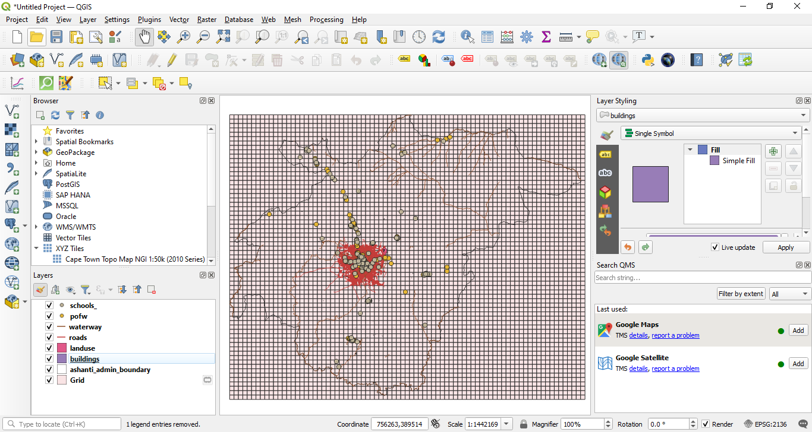

Figure 8.29b - 10X10km vector grid for the Ashanti region

Going further in answering the questions in our exercise, we need to do the following:

1. green spaces (parks, forests) built-up space per unit ratio:

Green spaces and built-up spaces is data contained by the landuse vector layer, polygon type. To know exactly what are the ‘green spaces’ we need to see what are the categories enclosed in the dataset. For that, we run **List unique values** algorithm on the `fclass` attribute and find out that we have the following ‘green’ classes: meadow, grass, nature_reserve, park, forest and the following ‘built-up space’ classes: retail, commercial, industrial,  residential.  Figure 8.30b presents a visualisation of our selections: 

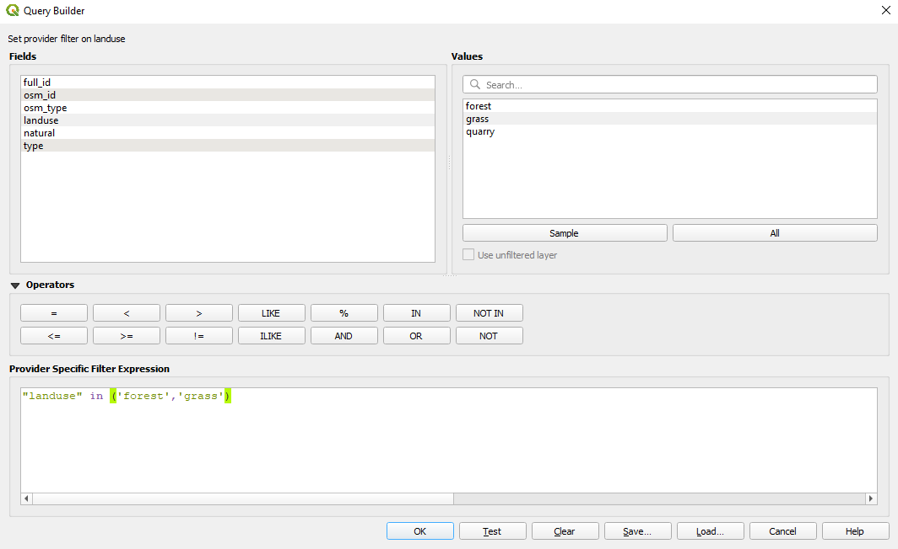

Figure 8.30a - Filtering green areas and built-up space in Ashanti


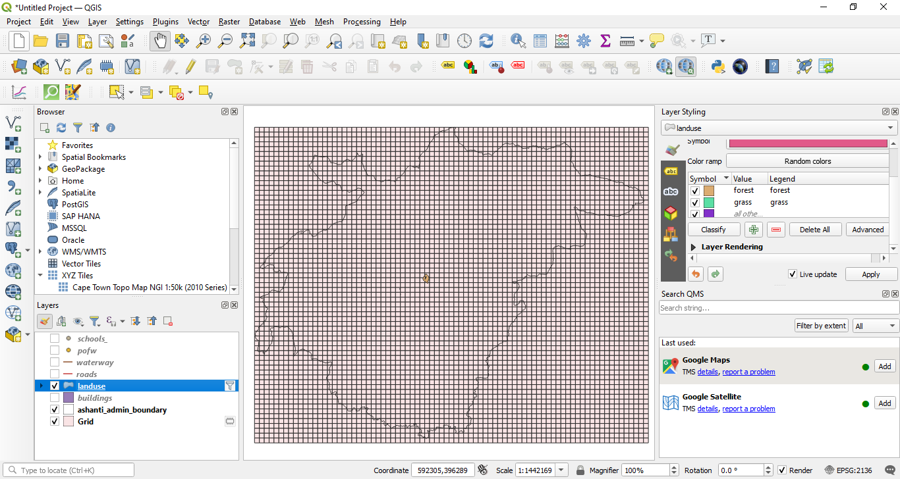

Figure 8.30b - Spatial distribution of the green areas and built-up space in Ashanti

The second step to answer the requirement, is to identify how much green space and how much built-up space there is in each 10X10 km. To obtain that we will **intersect** the 2 overlaid polygon vector layers. The algorithm extracts the overlapping portions of features in the Input - the landuse layer and Overlay layer - the grid layer. Go to **Vector - Geoprocessing Tools - Intersection** or look for **Intersection in the Processing Toolbox or Locator Bar** Set the algorithm parameters as in figure 8.31.


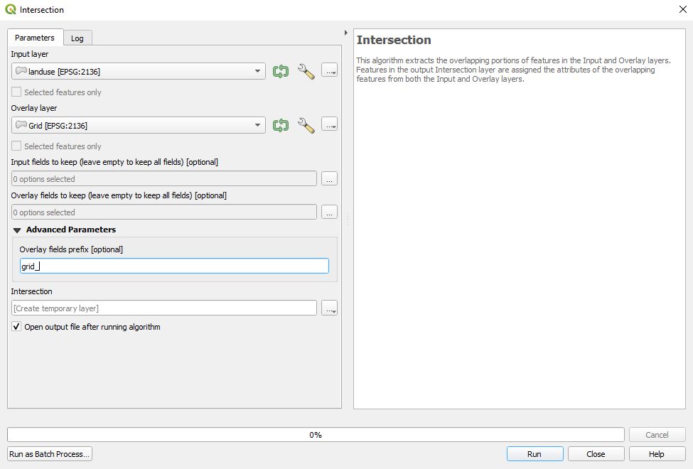

Figure 8.31 - Parameters for the intersect algorithm

The result should look like in figure 8.32.

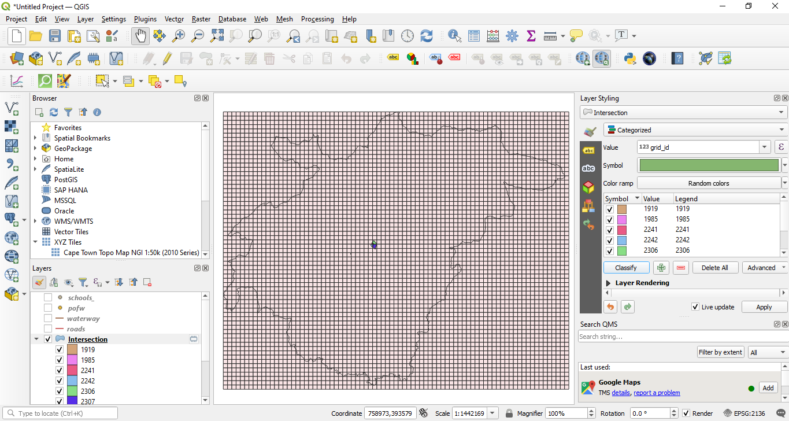

Figure 8.32 - Result of running the intersection algorithm to clip the landuse vector polygons to the grid layer. 

Now for each 10X10 km unit, we have the landuse features that we can work with. The attribute table also stores this information, as each grid cell - unit - has a unique id, see figure 8.33. 


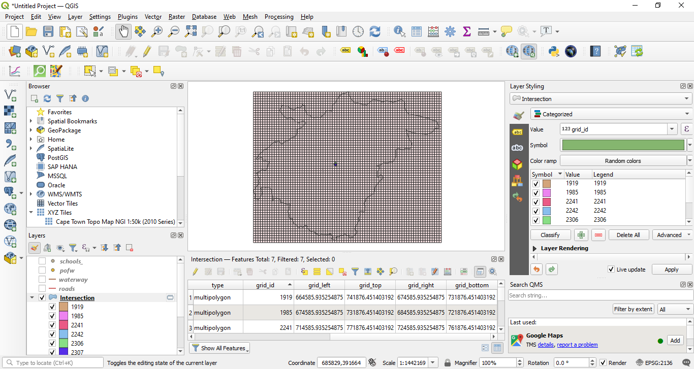

Figure 8.33 - Landuse features clipped per each grid cell and it's associated attribute table. 

Now, that we have all landuse features per 10X10 km unit, we will continue with separating the geometries of the ones that make up the green space and built-up space as defined earlier - for each grid cell.  Thus, for green space, we will select all features that have the attribute value for `fclass: `meadow, grass, nature_reserve, park, forest. In attribute table, in the expression filed write down: ` "fclass" =  'meadow' or  "fclass" =  'grass' or  "fclass" =  'nature_reserve' or  "fclass" =  'park' or  "fclass"  =  'forest'`. Similarly, you can just type: `"fclass" in ('meadow', 'grass', 'nature_reserve', 'park', 'forest')`. Export the selected features as green_spaces_gridded  (see module 6 for more details). Don't forget to check **Save only selected features**. The new output should have 7 features. Do the same for the built-up space. Select the features in landuse that have the attribute value for `fclass` the following: retail, commercial, industrial,  residential, by writing the following expression in the Expression based filter window: `"fclass" =  'retail' or  "fclass" =  'commercial' or  "fclass" =  'industrial' or  "fclass" =  'residential'.` Select the filtered geometries and export as builtup_spaces_gridded. Your new output should have 20 features. 

Alternatively, you can also use a filter instead of a selection.


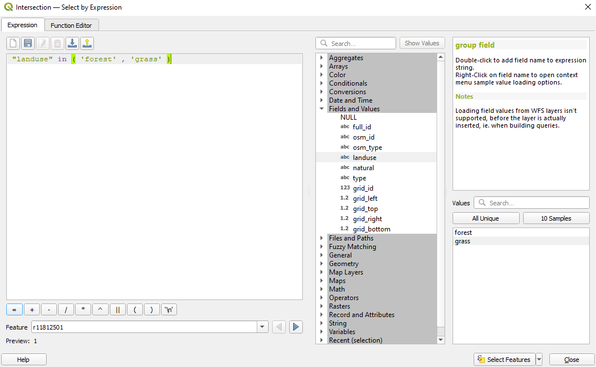

Figure 8.34a - Selecting the green spaces.


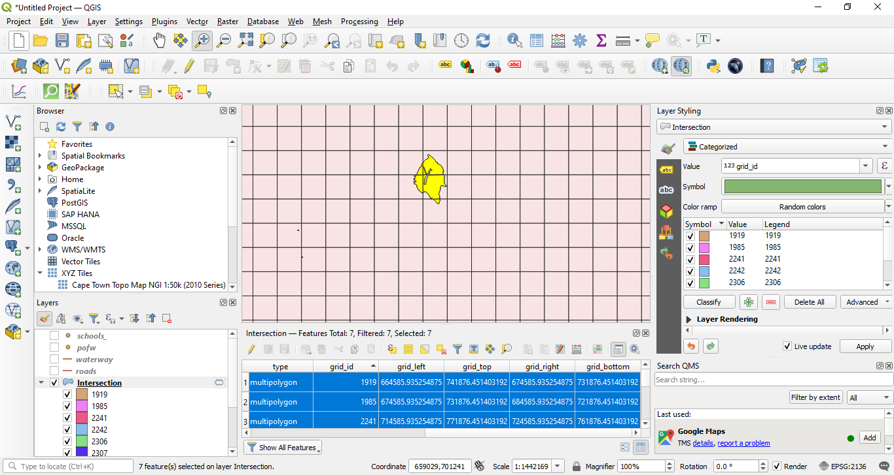

Figure 8.34b - Selected green spaces.


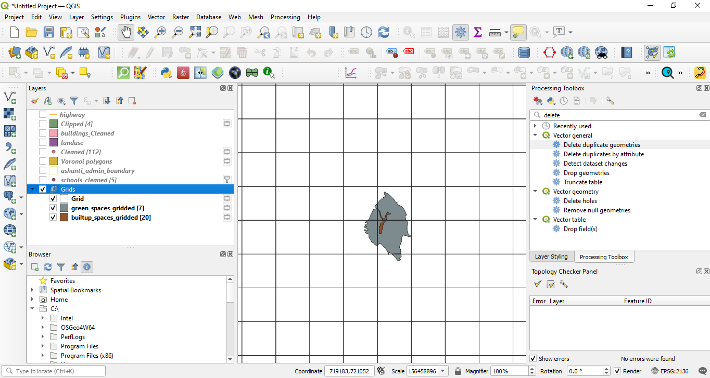

Figure 8.34c - Green and Built-up spaces.

Next, calculate the area occupied by each feature of the 2 layers. Go to the attribute table of each layer and then add the geometric column area by inserting the expression `round($area,2) `in the field calculator.  (see module 6 for details, if needed). However, the 10X10km grid of the Ashanti region has a known number of grid cells, and that is 42. Therefore, we need to summarise the areas for all types of green spaces (forests, parks etc.) an built-up spaces (commercial, residential etc.) and join it accordingly to all of the 42 grid cells. To do this, we will use the **GroupStats** plugin to sum up for each grid_id all the green categories, respectively all the built-up categories. For the green_spaced_gridded vector layer, set the parameters as in figure 8.34e. 


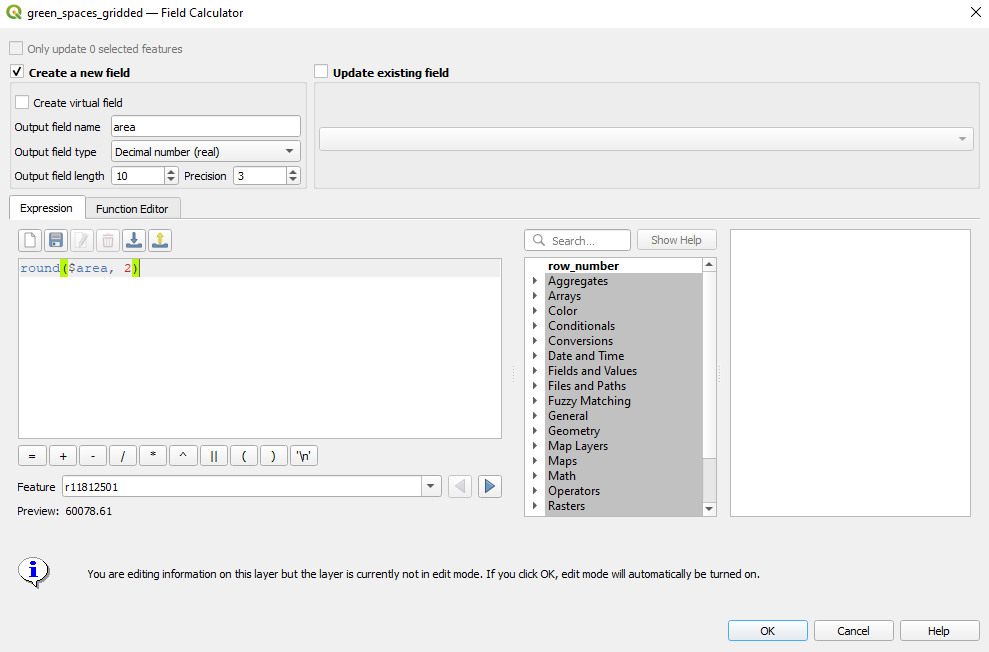

Figure 8.34d - Computing the area of each feature.

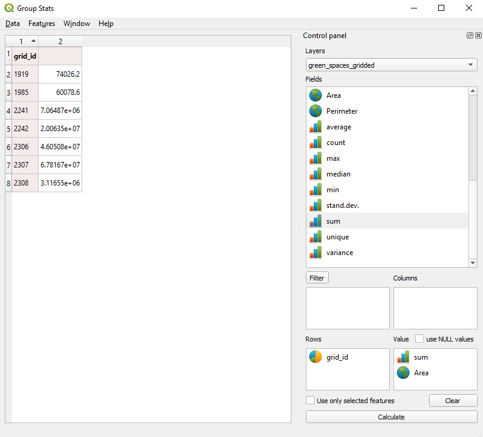

Figure 8.34e - GroupStat parameters setup to sum up the green areas per each 10X10km grid cell.

Afterwards, save the results as a .csv file named `green_spaces_gridded`. Go to **Data ‣ Save all to CSV file.**

Run GroupStats for the built-up space in the same manner and then save it as a csv file named `builtup_spaces_gridded`.

Next, we will bring the 2 csv files calculated with GroupStat into QGIS  (**Layer ‣ Add layer ‣ Add delimited text layer** - see more details in module 2). 


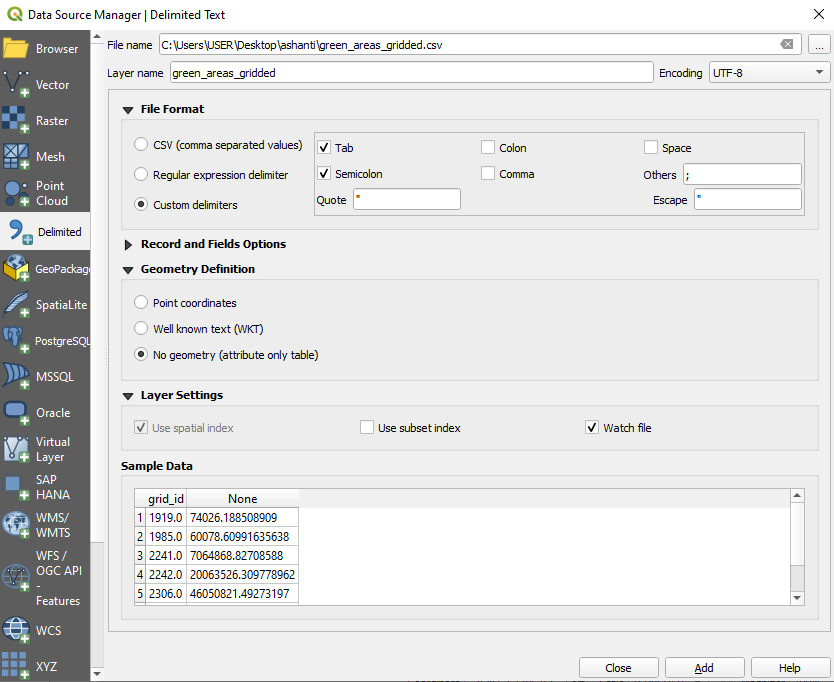

Figure 8.35a - Loading green_spaces_gridded CSV


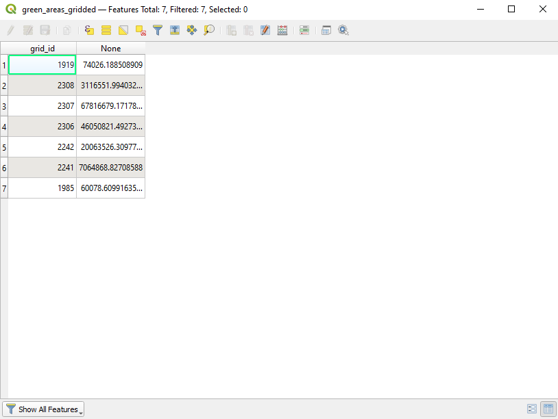

Figure 8.35b - The green_spaces_gridded CSV attribute table

Moving forward, we need to join the calculated spaces - green and built-up - to each 10X10 km cell grid. For that, select the grid10km vector layer in the TOC, open the properties window and go to **Joins**. This functionality allows you to join by a common attribute field, others. In our case, using the common grid_id value we will join, the sum of the built-up areas and green spaces fro the 2 csv files obtained in the previous stage.

In the **Join** window, push on the green plus button below  and set the parameters like in figure 8.35, for green spaces.


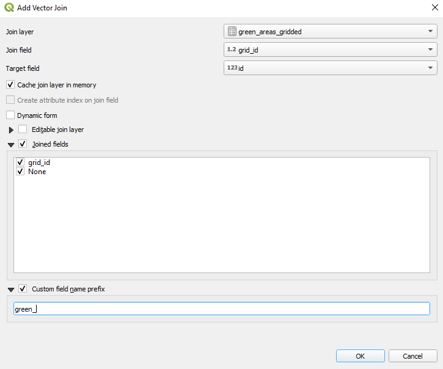

Figure 8.35c - Setting the parameters to join by common field grid_id/id the sums of green and built-up spaces for each grid cell - 10X10km unit.

Repeat for built-up spaces. 

The results of the two joins are visible in the attribute table, as can be seen in figure 8.36_b. We have kept the grid_id in both joins, to be sure no mistakes occurred. We can visually quickly check to make sure the 3 attribute fields: id, builtupgrid_id and greengrid_id are exactly the same. 


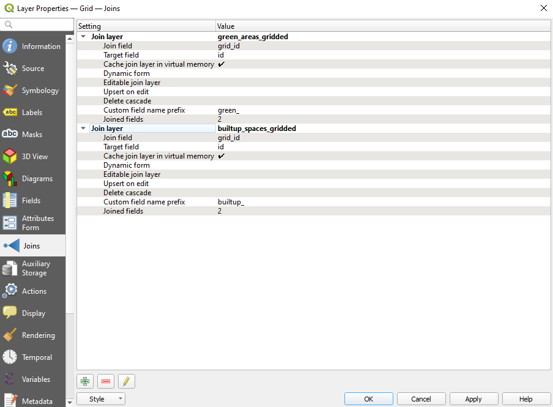

Figure 8.36a - Green and built-up CSV joined to Grid. 


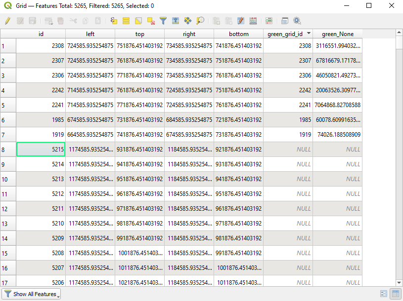

Figure 8.36b - Attribute table of the grid10km vector layer containing the total areas for green and built-up spaces. 


As we have gathered all the needed information for green and built-up spaces in the attribute table of the grid layer, all we need to do is calculate the percentage of these spaces within the 10X10 km grid cell. We will calculate it using the field calculator, using the following expression: `round(100*green_None/100000000, 5)` and `round(100*builtup_None/100000000, 5).` Next, we add a new field in which we calculate the report of the GreenPre/BuilupPer, and thus reaching the answer to our request: green spaces (parks, forests) built-up space per unit ratio: `round( "greenPer" / "builtupPer" , 5).` To have a clear overview of our dataset, in cases where there is no built-up space in the grid cell - we insert the value 1000 in the attribute table, in cases where there is no green space, we will insert value 999, while in case both values are NULL then we insert 1001.  For this we can use the expression:

```
CASE 
WHEN (greenPer is NULL) and (builtupPer is not NULL) then 999
WHEN (builtupPer is NULL) and (greenPer is not NULL) then 1000
WHEN (greenPer is NULL) and (builtupPer is NULL) then 1001
ELSE round(greenPer / builtupPer, 5)
END
```

The final result would look like in figure 8.37e. 


Figure 8.37a - Percentage of green area in the 10km x 10km grid


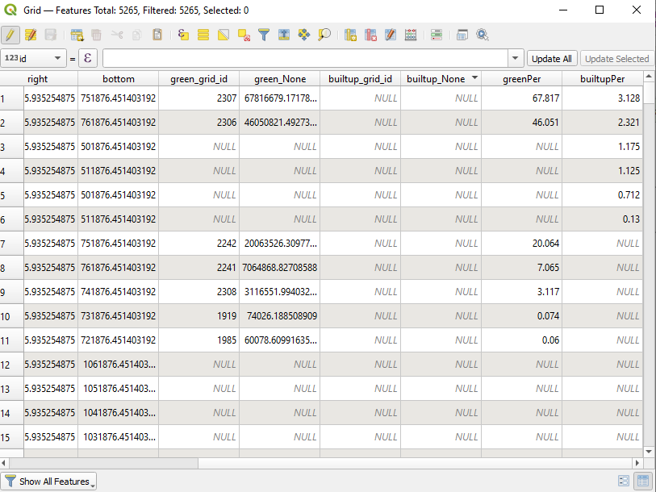

Figure 8.37b - Computed percentage of green and built-up area


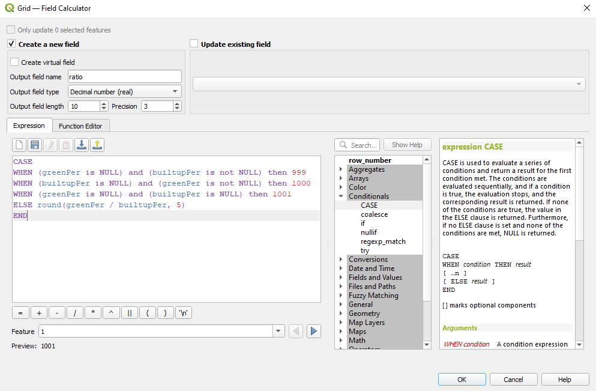

Figure 8.37c - Computing for the ratio of green and built-up areas


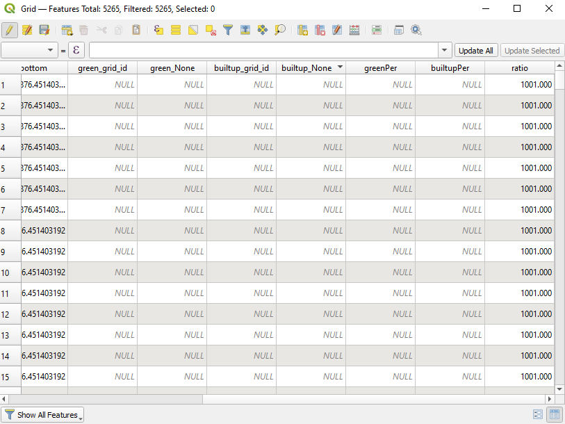

Figure 8.37d - Computed ratio of green and built-up areas


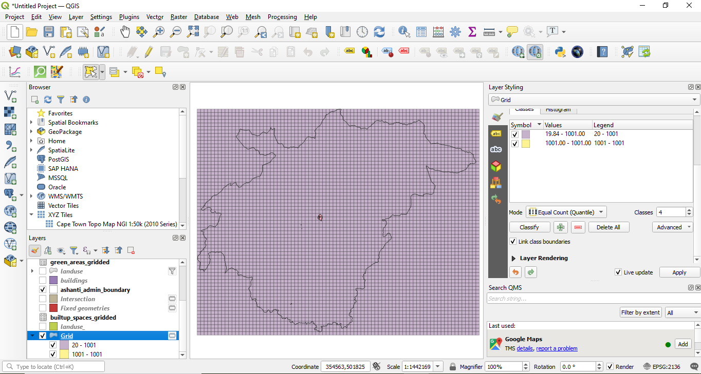

Figure 8.37e - Ratio of green and built-up areas in the 10km x 10km grid


2. total length of streets and waterways for each unit;

To accomplish this task, QGIS offers an algorithm that takes a polygon layer and a line layer and measures the total length of lines and the total number of them that cross each polygon. The resulting layer has the same features as the input polygon layer, but with two additional attributes containing the length and count of the lines across each polygon. Go to **Analysis Tools - Sum Line Lengths** and set the parameters as follows: 
- polygons - Grid
- lines - roads
- lines length field name - roadsL
- lines count field name - roadsC

You can create a temporary layer or save it as a file on your computer. If for representation, you use natural breaks, your map should look like in figure 8.38c. 


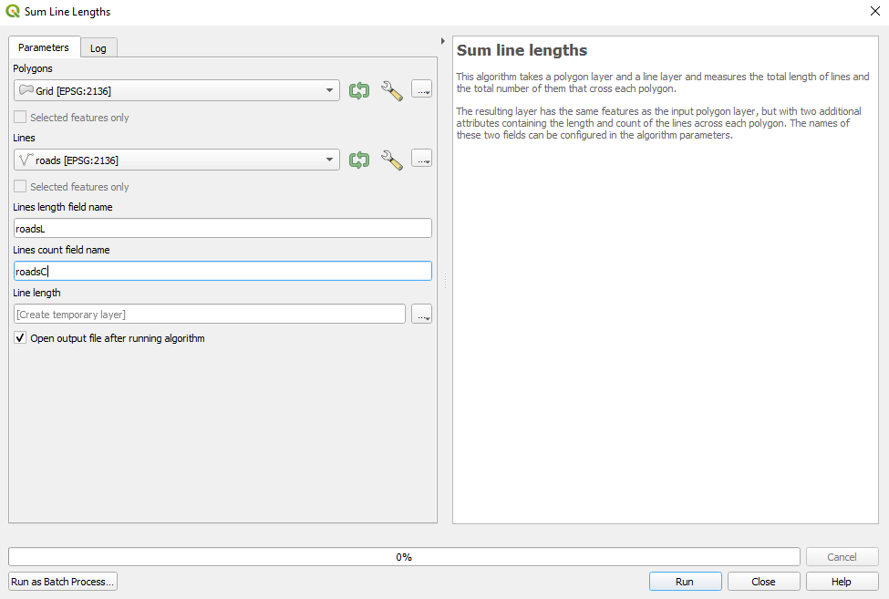

Figure 8.38a - Sum Line Lengths parameters


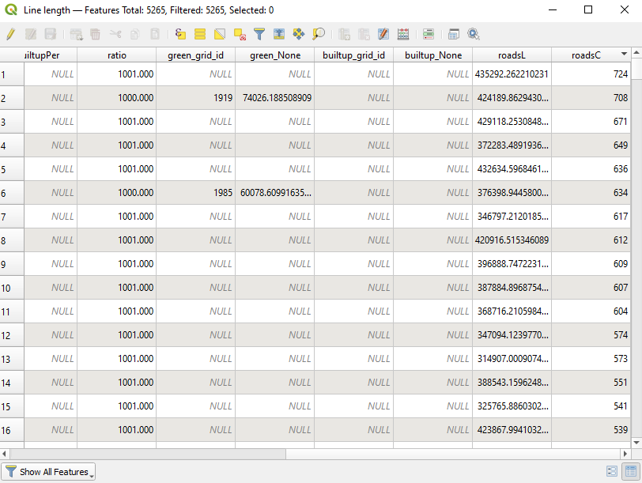

Figure 8.38b - Road lengths and counts per Grid cell


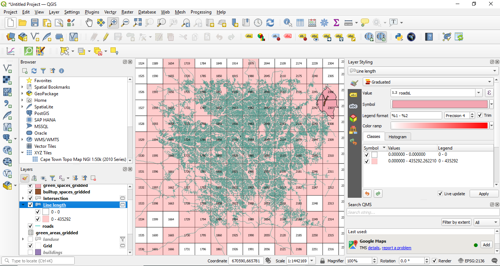

Figure 8.38c - Spatial distribution of 10X10km units with most roads

Now, repeat the same processing for waterways lengths in each grid cell. Running the process on the grid file obtained earlier will help you in having all information obtained so far attached to the same geometry. We advise you save this file on your computer with line_lengths_gridded.  If for representation, you use natural breaks, your map should look like în figure 8.39.


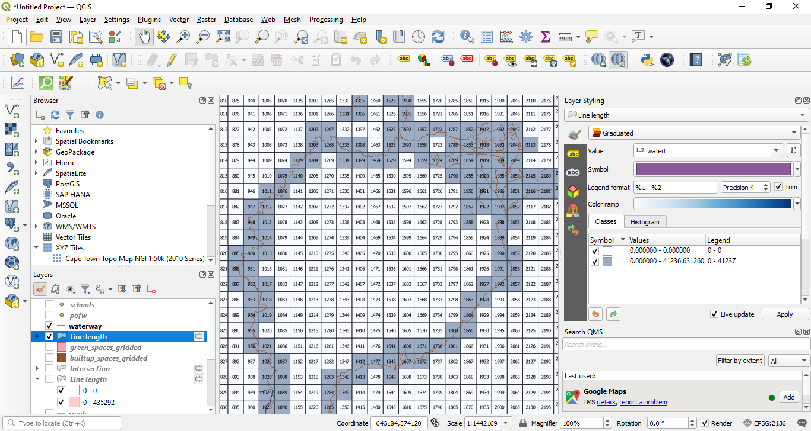

Figure 8.39 -  Spatial distribution of 10X10km units with most waterways 

3. total number of schools with a defined operator (Private, Government of Ghana,  , town halls etc.) for each grid cell

To count the total number of schools with a defined operator in the 10X10 unit, we will use the schools_cleaned. First, we run **Vector ‣ Analysis Tools ‣ List unique values..** and decide which building we consider public. We will select from our vector point data layer (schools) the following features: ` "operator"  =  'Anansu Township' or  "operator" = 'Ghana Education Service' or  "operator" =  'Government of Ghana' or  "operator" =  'Private' .` Similarly, you can just type `"operator" in ('Anansu Township', 'Ghana Education Service', 'Government of Ghana', 'Private')`. Your selection should have 9 features in total. 


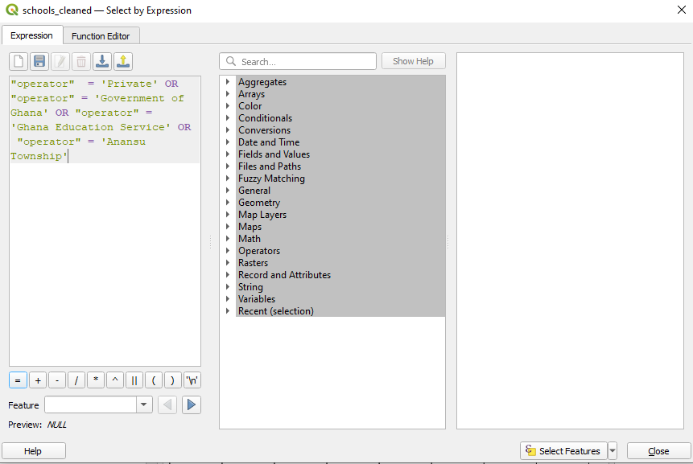

Figure 8.40a - Selecting schools with a defined operator


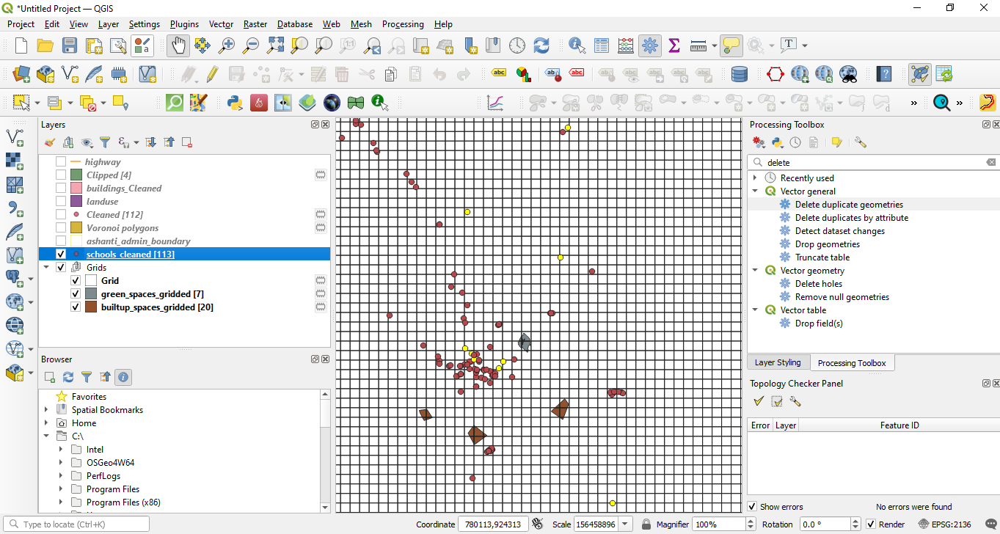

Figure 8.40b - Selected schools with a defined operator
To answer our request, we will use **Vector ‣ Analysis Tools ‣ Count points in polygon** algorithm. This algorithm takes a points layer and a polygon layer and counts the number of points from the first one in each polygons of the second one. A new polygons layer is generated, with the exact same content as the input polygons layer, but containing an additional field with the points count corresponding to each polygon. Set the point layer to pois_cleand and the polygon Grid layer with the calculated information in the previous round. For the points, check the **Selected features only** checkbox, so the algorithm calculates only the selected points - the public POIs. Save the output file as grid_info. 


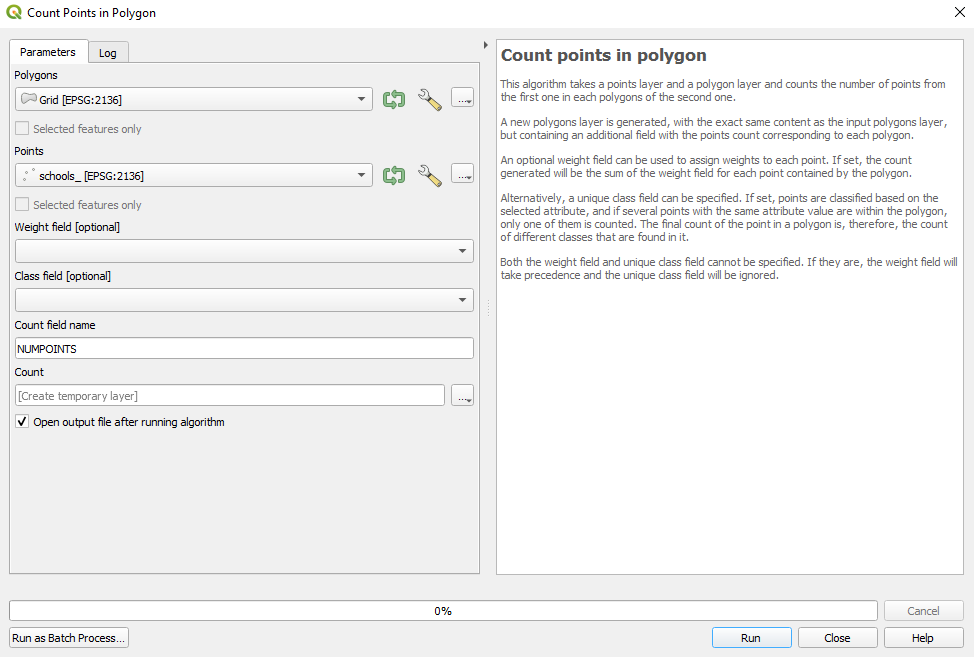

Figure 8.40c - Count public POIS in each 10km x 10km grid


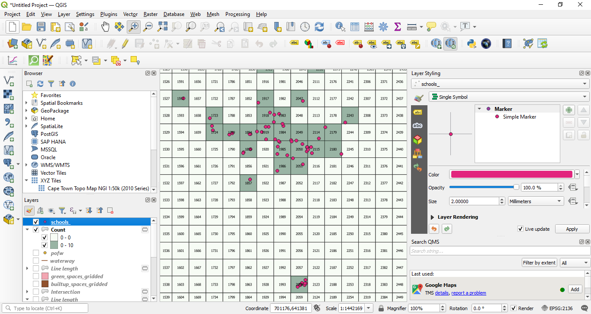


Figure 8.40d - Spatial distribution of public POIs density per unit 10X10km


#### **Quiz questions**

Q: If I have 2 vector layers - one represents the extent of the city where I am working and the second, the built roads in the entire country - what processing tool would I use to extract only the roads in my city: buffer or clip? 

A: Clip. 

Q. Is the buffer tool useful in the following case: I have a polygon vector layer with historic monuments in my region and I want to draw a 50m protection area around them? 

A: Yes

Q: Which one of the three geoprocessing tools would you use to merge two similar vector layers ? Voronoi polygons, dissolve, intersection? 

A: Dissolve. 


### Phase 3: Geostatistics. Interpolation - estimating missing data

The last phase of the vector data module introduces the concept of data estimation. We are used to estimating almost daily on various topics, for example how much time it will take to get from home to work in certain conditions. We are used to giving our best guess,  based on previous experience and hunches. However, in estimating missing data the best guess is replaced by very well defined mathematical equations with well known limitations. 

The subject requires significant knowledge in statistics and results should always be regarding through the light of their limitations. 

That being said, we will introduce a short example of data estimation that will make the transition to the next module - raster data processing. 

**Interpolation** is a mathematical process through which one can estimate the values that are missing based on a limited number of values that do exist. And those situations are common - imagine meteorological information. Data on surface temperatures and of how much rain has fallen can be measured only in specific points at calibrated meteo stations, and not on the entirety of a surface. However, we don’t have “blind spots'' of no temperatures on the maps we see in the meteo section. Thus, the rest of the values - as to construct the seamless phenomena - are obtained by interpolation. 
The assumption on which interpolation is based is that spatially distributed objects are spatially correlated; in other words, things that are close together tend to have similar characteristics. 

There are many interpolation methods implemented in GIS software packages, deciding which one is the best in each particular case depends on the specificity of the data, what it represents and the geostatistics understanding of the user doing the interpolation. 

To make a quick check on what interpolation methods are available in QGIS, go to the Processing Toolbox and write in the search bar the keyword interpolation. The result should look like in figure 8.41. 


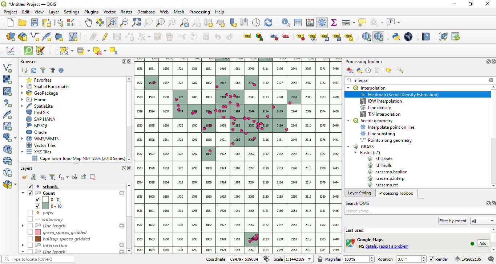

Figure 8.41 - Interpolation methods available in QGIS

As can be observed, through QGIS the user has access to other algorithms, implemented in GRASS or SAGA, as a result of the integration into QGIS of these (and other) very powerful software solutions. 

Diving into the math behind each interpolation algorithm is beyond the scope of this module. However, for demonstration purposes, we will simulate precipitation data interpolation to obtain a seamless dataset on the quantity of precipitations fallen in our area of interest, Ashanti region. 

As the exercise is purely for showing purposes, we will create our own set of point data - to represent the meteo stations where precipitation values have been registered for the course of one week. 

Thus, the first step is creating a new vector layer - point type - with points randomly assigned inside the extent of the Ashanti region. There are several ways to do that, either with the algorithm of **Random points in polygons..** or with the algorithm **Random points in layer bounds..**. Go to **Vector ‣ Research Tools ‣ Random points in polygons…**. You may also search for the algorithm in the Processing Toolbox or Locator bar. Choose as parameters: 
* 93 points
* minimum 5 km.

The result should look like in figure 8.42. 


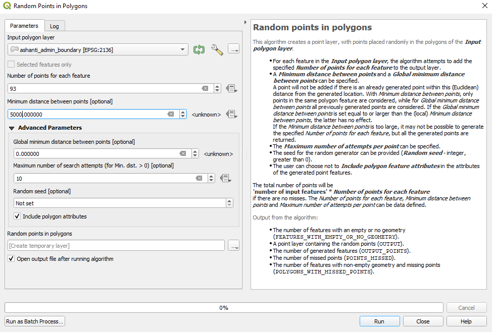

Figure 8.42 - Creating random points inside a polygon layer


The resulting point layer will look approximately like in figure 8.43.


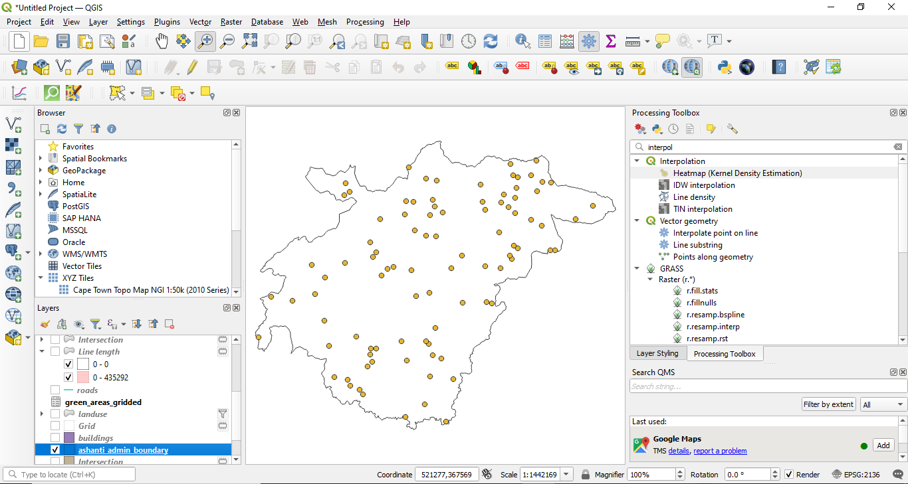

Figure 8.43 - Point data layer - randomly created within specified polygons.

Now that we have our imaginary meteo stations that measure precipitations in Ashanti region, we will continue by adding fictitious measurements on the course of 7 days. 

To do that, we can use the random function provided by QGIS. Open the attribute table of the point data layer created and open field calculator. In a newly created field (Whole number integer), insert the following formula rand(min, max), where min and max will be replaced by the following pair of numbers for the corresponding 7 days (see figure 8.44):

1. 0 - 59;
2. 2 - 35;
3. 10 - 45;
4. 0 - 21;
5. 5 - 63;
6. 0 - 10;
7. 0 - 21. 


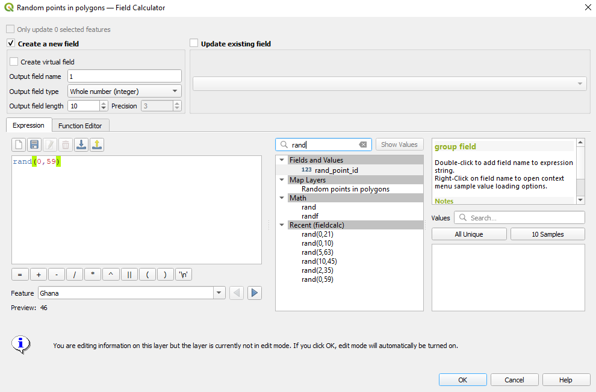

Figure 8.44 - Creating random values within specified limits

After adding all 7 columns, your attribute table should look like in figure 8.45. 


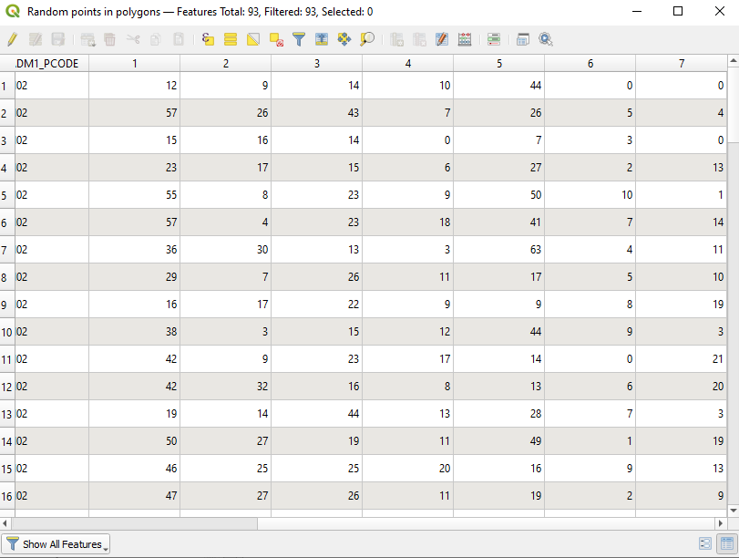

Figure 8.45 - Fictitious precipitation data for the 93 fictitious meteo stations in Ashanti region.

Next, we will interpolate these values for each of the 7 days  to obtain a seamless layer that covers the entire territory of the province. Given that the operation is repetitive, we will use batch processing. The selected interpolation method selected - strictly for demonstration purposes! - is IDW - inverse distance weighted. 

Set the following parameters: 
* distance coefficient: 2
* extent: Ashanti_admin_boundary
* output raster size: 50. 

Your parameters should look like in the following figure 8.46.


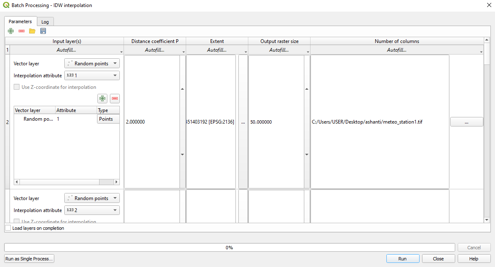

Figure 8.46 - Setting up the batch processing window to interpolate the precipitation values for all 7 days

The interpolation result will look approximately like in figure 8.47. 


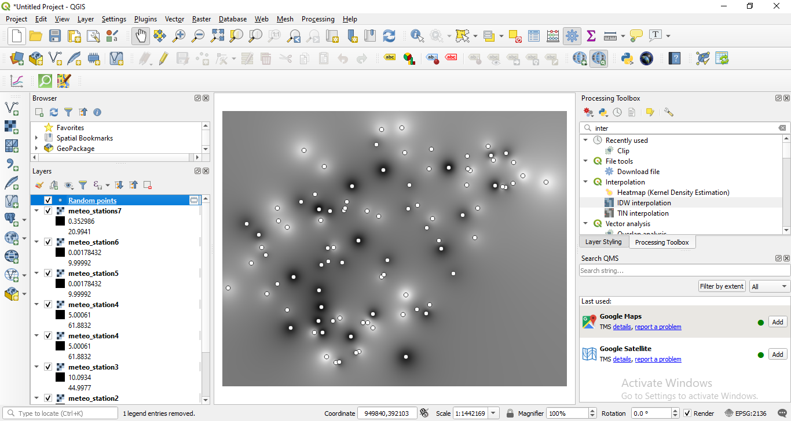

Figure 8.47 - Interpolated datasets

The meteo stations are visible on the map canvas and in the TOC you can see all the 7 newly created raster datasets that represent precipitation values for each day in the Ashanti region. 

Next, let’s change the symbology of the 7 layers to a more colourful one (**Properties ‣ Symbology ‣ Singleband pseudocolour ‣ Magma**). 

Looking at the point data and the raster datasets created based on them, we can notice that now we have values for the entire region and not only in the measured location. There are many processing algorithms that can be applied to these rasters in order to extract information, but more on that in the next module - processing and visualisation of raster data.  

However, as we have interpolated values for 7 days, let us prepare a short animation on how precipitation values have evolved for the Ashanti region. 

To do that, open the **Properties dialog of test_meteo_stations_1 raster ‣ click on the Temporal tab ‣ tick the Temporal option ‣ select start and end date**, like in figure 8.48. Do the same for all 7 raster layers. 


")


")


")

Figure 8.48 - Setting temporal information to the raster dataset (1, 2, 7).


Open Temporal Controller Panel (can be found in **View ‣ Panels ‣ Temporal Controller Panel**) and set the parameters as in figure 8.49. 


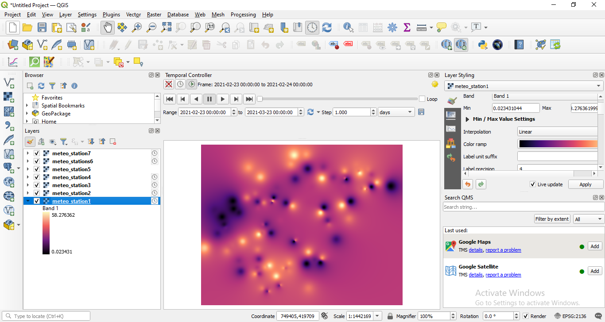

Figure 8.49 - Set the parameters of the Time Controller Panel. 

Click on the play button  and see how the values change. You can choose what other layers to be visible. In figure 8.50, we added the buildings vector layer. 


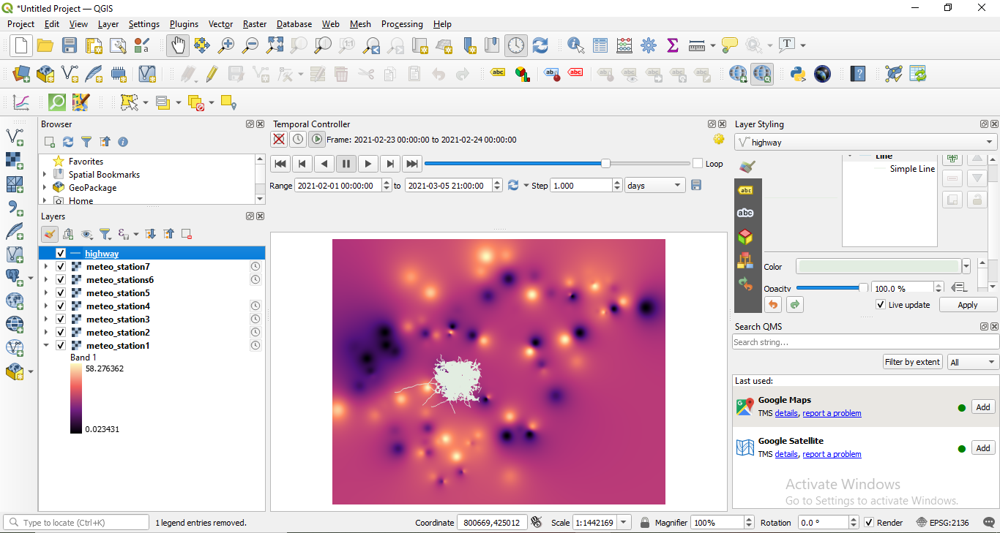

Figure 8.50 - Selecting other layers to be visible in the temporal animation.


Quiz questions

1. Is there one algorithm to interpolate data in QGIS or more?

*There are more algorithms implemented.*

2. What is interpolation useful for?

*Interpolation is useful to estimate data based on known data.*
