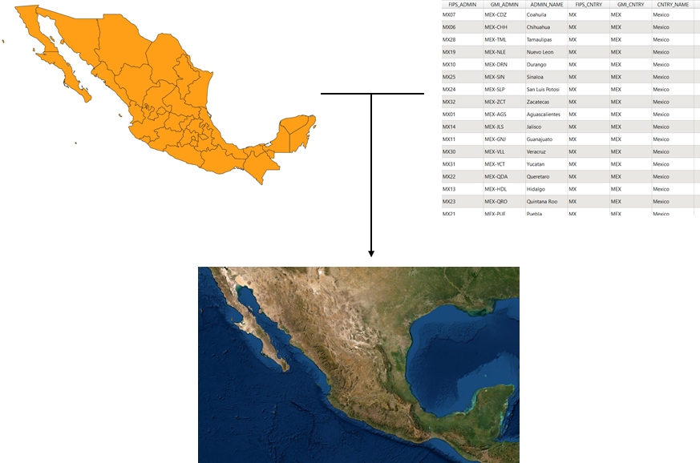
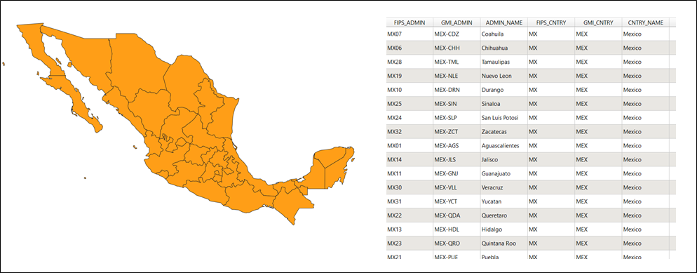

# Módulo 0: Introducción suave a los conceptos de SIG (Sistema de Información Geográfica)

**Autor**: Ben Hur

## Introducción Pedagógica

Este módulo sirve como una introducción suave a los conceptos geográficos necesarios para trabajar con sistemas de información geográfica (SIG). Al final de este módulo, los estudiantes deberán comprender los siguientes conceptos:

*   proyecciones cartográficas
*   sistemas de referencia de coordenadas
*   formatos de datos espaciales (por ejemplo, vectores y rásteres)
*   partes y características de un SIG
*   usos de un SIG
*   ejemplos de SIG y otras aplicaciones geoespaciales

Además, este módulo también presentará algunos conceptos clave de software libre y de código abierto (FOSS) y software libre y de código abierto para aplicaciones geoespaciales (FOSS4G).

## Herramientas y recursos necesarios

Las herramientas y los recursos necesarios para este módulo son:

*   computadora de trabajo
*   conexión a Internet

## Prerrequisitos

*   Conocimientos básicos sobre cómo operar una computadora 

## Recursos adicionales

* Una introducción suave a los conceptos de SIG - [https://docs.qgis.org/3.16/en/docs/gentle_gis_introduction/index.html](https://docs.qgis.org/3.16/en/docs/gentle_gis_introduction/index.html)
* Guía del Usuario de QGIS- [https://docs.qgis.org/3.16/en/docs/user_manual/](https://docs.qgis.org/3.16/en/docs/user_manual/)
* QGIS - [https://docs.qgis.org/3.16/en/docs/training_manual/index.html](https://docs.qgis.org/3.16/en/docs/training_manual/index.html)
* Sitio web de QGIS - [https://qgis.org/en/site/](https://qgis.org/en/site/)
* Sitio web de OSGeo - [https://www.osgeo.org/](https://www.osgeo.org/)
* Sitio web de OSGeoLive - [https://live.osgeo.org/en/index.html](https://live.osgeo.org/en/index.html)
* ¿Qué es el software libre? - [https://www.gnu.org/philosophy/free-sw.en.html](https://www.gnu.org/philosophy/free-sw.en.html)

Definición de código abierto - [https://opensource.org/osd](https://opensource.org/osd)

## Introducción temática

Comencemos con un ejemplo: 

Es posible que hayas escuchado la frase "todos los mapas mienten". O que hayas visto una publicación en las redes sociales diciendo: "¡El mapa del mundo que ha conocido toda su vida está equivocado!". Bueno, no es que los mapas elijan activamente mentirte, es solo que los mapas nunca pueden mostrarte toda la verdad. Un ejemplo de ello son los tamaños relativos de los países.

“The True Size Of” ([https://thetruesize.com/](https://thetruesize.com/)) (El Verdadero Tamaño De) es una aplicación web de mapas genial que muestra cómo los tamaños relativos de los países están distorsionados en uno de los mapas más comunes que usamos (uno que usa la proyección Mercator). También muestra algunos ejemplos de tipos de datos espaciales sobre los que aprenderemos más en este módulo. Intenta utilizar la aplicación web para comparar el tamaño de tu país con el de otros.

### Desglose de los conceptos

Entonces, ¿por qué es esto así? Como aprenderás en este módulo, es difícil representar la forma tridimensional de la tierra en una hoja de papel plana. Para hacerlo, los cartógrafos usan lo que se llama una **proyección cartográfica ** para proyectar los puntos en la superficie tridimensional de la tierra en una superficie plana. Sin embargo, al hacerlo, se produce una **distorsión**.

Esta distorsión puede estar en la forma, tamaño, dirección y distancias de los objetos en el mapa. Todos los mapas tienen al menos una de estas distorsiones. Debido a esta distorsión, un mapa nunca puede mostrar toda la verdad sobre la Tierra.

En la aplicación web que usamos, el mapa de fondo que no cambia de tamaño (el grisáceo) es un ejemplo de **datos ráster**. Los datos ráster son representaciones del mundo basadas en píxeles similares a las fotografías, mientras que la forma de los países por los que podemos movernos son ejemplos de **datos vectoriales**. Los datos vectoriales, a diferencia de los rásteres, representan el mundo utilizando objetos discretos como puntos, líneas y polígonos.

## Contenido Principal

### Título de la Fase 1: Mapas y Coordenadas

Cuando la gente piensa en la Tierra hoy en día, generalmente se imagina una masa esférica de azul, verde, blanco y marrón flotando en el espacio. Es por eso que la forma tradicional de modelar la tierra es mediante el uso de globos terráqueos.

<table>
  <tr>
   <td>     
   
   Figura 1. La Canica Azul (<a href="https://commons.wikimedia.org/wiki/Earth#/media/File:The_Blue_Marble.jpg">https://commons.wikimedia.org/wiki/Earth#/media/File:The_Blue_Marble.jpg</a>)
   </td>
   <td>
     
   Figura 2.  Globo terráqueo de l'Isle (1765) (<a href="https://commons.wikimedia.org/wiki/Globe#/media/File:3quarter_globe.jpg">https://commons.wikimedia.org/wiki/Globe#/media/File:3quarter_globe.jpg</a>)
   </td>
  </tr>
</table>

Sin embargo, aunque el globo terráqueo es capaz de capturar la mayoría de las características de la Tierra, tiene dos inconvenientes principales:

*   Los globos terráqueos son incómodos y difíciles de llevar.
*   Los globos terráqueos solo se pueden utilizar a pequeña escala (por ejemplo, para encontrar ubicaciones de países, las posiciones relativas de ciudades, etc.). Son casi inútiles para actividades que requieren grandes escalas o detalles finos (por ejemplo, navegación por la ciudad).

Aquí es donde entran en juego los mapas. Los mapas solucionan estos dos inconvenientes de los globos terráqueos al representar la tierra como una superficie plana. Al hacerlo, los mapas se vuelven portátiles y adecuados para una multitud de usos. Dicho esto, los mapas también presentan sus propios inconvenientes. A través del proceso de convertir un objeto tridimensional (globo) en uno bidimensional (mapa), se introducen distorsiones de tal manera que es imposible que un mapa capture perfectamente las diferentes características de la Tierra (es decir, formas, áreas, direcciones).

#### **Proyecciones cartográficas**

Se utiliza una proyección cartográfica para aplanar la superficie de la tierra (o del globo) en un plano con el fin de crear un mapa. Este proceso de transformación genera distorsión.

Puedes pensar en la Tierra como una naranja. Si la pelas, puedes colocar su cáscara de forma plana, pero nunca la podrás alisar perfectamente. Siempre encontrarás uno de los siguientes problemas:

*   **Estiramiento: el alargamiento de la piel (o superficie) en una o más direcciones.**
*   **Desgarro: la división o ruptura de la piel (o superficie)**
*   **Compresión: acortamiento o encogimiento de la piel (o superficie)**

Es por esto que cada mapa contiene distorsiones en una o más de las siguientes características:

*   **Forma**
*   **Área**
*   **Distancia**
*   **Dirección**

Las proyecciones cartográficas pueden preservar (sin distorsión) una o más características, pero nunca todas al mismo tiempo. Alternativamente, pueden llegar a un arreglo donde las distorsiones se equilibran y minimizan para todas las características. Esto se debe a la naturaleza de las características mismas.

Las características principales, como la** Forma** y el **Área**, se excluyen mutuamente y no se pueden conservar simultáneamente. Mientras tanto, las características menores, la **Distancia** y la **Dirección no pueden ser correctas en todas las partes del mapa.**

Al elegir qué proyección cartográfica usar, es importante que tenga en cuenta el propósito del mapa. Por ejemplo, si desea realizar análisis basados en áreas, es mejor utilizar una proyección que preserve el área.

Hay varias clasificaciones de proyecciones cartográficas. La primera se basa en **la(s) característica(s) que preserva.**

*   **Proyecciones Conformes** u **Ortomórficas:** son aquellas que conservan la forma o la conformidad angular. Se utilizan comúnmente con fines de navegación o meteorológicos. Las formas se conservan pero las áreas se distorsionan. Cuanto mayor sea el área, mayor será la distorsión.
*   **Proyecciones de Áreas Iguales o Autálicas: **son aquellas que conservan la proporción o áreas relativas de los objetos en el mapa. En este tipo de proyección de mapa, cuanto mayor sea el área que se está mapeando, más precisa es.
*   **Proyecciones Equidistantes:** preservan la distancia de las líneas que se originan en uno o dos puntos del mapa o tienen la escala adecuada a lo largo de una o más líneas. 
*   **Proyecciones Acimutales o Cenitales:** preservan la dirección desde uno o dos puntos en el mapa.  Son útiles para mapear rutas de aeronaves y embarcaciones marítimas entre puertos.

Una sola proyección cartográfica puede conservar más de una característica, por ejemplo, una proyección Equidistante Acimutal que conserva la dirección y las distancias desde uno o dos puntos en el mapa pero no todos como se muestra en la tabla siguiente.

<table>
  <tr>
   <td>
   </td>
   <td><strong>Conforme</strong>
   </td>
   <td><strong>Autálica</strong>
   </td>
   <td><strong>Equidistante</strong>
   </td>
   <td><strong>Acimutal</strong>
   </td>
  </tr>
  <tr>
   <td><strong>Conforme</strong>
   </td>
   <td>-
   </td>
   <td>No
   </td>
   <td>No
   </td>
   <td>Sí
   </td>
  </tr>
  <tr>
   <td><strong>Autálica</strong>
   </td>
   <td>No
   </td>
   <td>-
   </td>
   <td>No
   </td>
   <td>Sí
   </td>
  </tr>
  <tr>
   <td>

<strong>Equidistante</strong>

   </td>
   <td>No
   </td>
   <td>No
   </td>
   <td>-
   </td>
   <td>Sí
   </td>
  </tr>
  <tr>
   <td><strong>Acimutal</strong>
   </td>
   <td>Sí
   </td>
   <td>Sí
   </td>
   <td>Sí
   </td>
   <td>-
   </td>
  </tr>
</table>

_Tabla: ¿Pueden ambas características ser conservadas por un mapa al mismo tiempo?_

Existe otra clasificación de proyecciones cartográficas que no conserva ninguna de las características del mapa, pero trata de minimizar todas las distorsiones en el mapa. Estas se denominan proyecciones cartográficas de** Compromiso** o **Error Mínimo** (las proyecciones que no conservan la forma ni el área se denominan **Afilácticas**).

Una forma de mostrar y ver la distorsión es utilizando lo que se llama la **indicatriz de Tissot**. Este indicador caracteriza las distorsiones locales mediante el uso de círculos y mostrando cómo estos círculos se transforman en el mapa.

Figura 3. Proyección cartográfica conforme con su indicatriz de Tissot. Los círculos permanecen como círculos en todo el mapa, pero sus áreas aumentan a medida que los círculos se mueven desde el ecuador hacia los polos. 

Figura 4. Proyección de mapa de áreas iguales con su indicatriz de Tissot. Los círculos se convierten en elipses pero sus áreas siguen siendo las mismas.

Figura 5. Proyección de mapa equidistante con su indicatriz de Tissot. Se puede notar que las alturas de los círculos son iguales, lo que significa que se conservan la escala / distancias a lo largo de los meridianos.

Figura 6. Proyección equidistante acimutal con su indicatriz de Tissot. Puedes observar que todos los círculos apuntan hacia el centro del mapa y que las alturas de los círculos son todas iguales.

Otra forma de clasificar las proyecciones cartográficas es por la **superficie desarrollable** utilizada para crear el mapa. Una superficie se puede desarrollar si se puede aplanar sin producir distorsiones. Las superficies más utilizadas son: cilindros (figura 7), conos (figura 8) y planos (figura 9).

Figura 7. Las proyecciones cilíndricas tienen meridianos (longitud) y paralelos (latitud) que se encuentran en ángulos rectos, siendo iguales las distancias entre los meridianos.

Figura 8. Las proyecciones cónicas tienen meridianos rectos que van a un punto en los polos. Los paralelos son arcos.

Figura 9. Las proyecciones planas (comúnmente utilizadas en proyecciones acimutales) tienen meridianos rectos similares a las proyecciones cónicas, pero sus paralelos son círculos en lugar de arcos.

Existen innumerables superficies desarrollables que se pueden utilizar para transformar un globo terráqueo en un mapa. Pueden ser una variación de las superficies comunes como en el caso de proyecciones pseudocilíndricas y pseudocónicas o pueden ser superficies únicas y completamente diferentes como en el mapa Dymaxion, que usa un icosaedro (poliedro con 20 caras), o la Proyección de Cahill-Keyes que utiliza un octaedro (poliedro con 8 caras).

Una proyección cartográfica también se puede clasificar según su **aspecto** (figura 10) o cómo se coloca la superficie desarrollable en el globo: Normal, Transversal u Oblicua.

Figura 10. Aspectos de una proyección cartográfica

**Sistema de Referencia de Coordenadas**

Se utiliza un **Sistema de Referencia de Coordenadas (SRC)** para especificar la ubicación de un objeto en la superficie de la Tierra mediante el uso de coordenadas. Hay dos tipos:

*   **Sistema de Referencia de Coordenadas Geográficas: **utiliza grados de latitud y longitud como coordenadas para referirse a la posición.** **
*   **Sistema de Referencia de Coordenadas Proyectadas: **usa unidades lineales (por ejemplo, metros, pies, kilómetros) de este y norte como coordenadas

El conocimiento de los sistemas de referencia de coordenadas es importante porque incluso si dos mapas (o capas) muestran la misma área, las coordenadas de las ubicaciones en estos mapas serán diferentes si el SRC que utilizan es diferente.

Por ejemplo: el mapa A y el mapa B muestran la misma área y extensión. Básicamente son el mismo mapa. La única diferencia es el sistema de referencia de coordenadas que utilizan. El mapa A usa SRC X y el mapa B usa SRC Y. Digamos que obtenemos la coordenada del Punto 1, que es (10, 10), del Mapa A. Si miramos la coordenada (10,10) en el Mapa B, es posible que el Punto 1 no esté allí ya que el Mapa B usa un SRC diferente. Por otro lado, si superpones los mapas entre sí utilizando una referencia común, las características de los dos mapas no coincidirán. Este conocimiento de los sistemas de referencia de coordenadas es importante en cualquier SIG.

Antes de QGIS 3.X, QGIS tenía una opción para activar lo que se llama "OTF" o _“On-The-Fly Transformation”_ (Transformación Sobre la Marcha). Esto permite proyectar capas con diferentes SRC en el lienzo del mapa como si estuvieran en el mismo SRC. Con QGIS 3.X en adelante, esta opción es el comportamiento predeterminado de QGIS. QGIS también realiza esta acción automáticamente para procesar tareas. Esto es muy importante porque si las capas no están en el mismo SRC, los resultados de las consultas espaciales y el procesamiento como combinaciones espaciales, clips, etc. podrían verse comprometidos.

Puedes notar que algunos sistemas de referencia de coordenadas se denominan por su código EPSG. Este código se refiere al código de SRC en el conjunto de datos de parámetros geodésicos EPSG, que es un registro de datos geodésicos, sistemas de referencia espacial, elipsoides terrestres, transformaciones de coordenadas y unidades de medida relacionadas. La mayoría de los SIG, incluido QGIS, se refieren al código EPSG para identificar sistemas de referencia de coordenadas, proyecciones y realizar transformaciones entre estos sistemas.

Los códigos EPSG más comunes son:

*   **EPSG: 4326 -** WGS 84, sistema de coordenadas de latitud / longitud basado en el Sistema de Posicionamiento Global (GPS) entre otros.
*   **EPSG: 3857 -** Proyección Mercator de Web utilizada para la visualización por muchas herramientas de mapeo basadas en web como OpenStreetMap y Google Maps
*   **EPSG: 32611 a EPSG 32616 -** Sistema Universal Transversal de Mercator (UTM) Zona 11N a 16N. Zonas UTM utilizadas en México.
*   **EPSG: 6651 -** Sistema de referencia de México de 1992.

#### **Preguntas de evaluación**

1. ¿Qué tipo de proyección de mapa es mejor para los siguientes casos de uso?
    1. Un mapa de propósito general que debe verse agradable.
    2. Un mapa que muestra un análisis de área por unidad entre diferentes ubicaciones.
    3. Un mapa que muestra una comparación de una zona de amortiguamiento de 10 km desde diferentes ubicaciones.

2. ¿Qué tipo (geográfico o proyectado) de sistema de referencia de coordenadas es mejor utilizar para los siguientes casos de uso?
    1. Mostrar la ubicación de puntos usando GPS
    2. calcular la distancia entre dos puntos

3. Verdadero o falso: es posible conservar las siguientes características del mapa juntas en un solo mapa:
    1. Área y forma
    2. Distancia y dirección

### Título de la fase 2: Tipos de datos espaciales

En esencia, un Sistema de Información Geográfica (SIG) debe ser capaz de modelar objetos, información y fenómenos del mundo real como límites de lotes, ríos, carreteras, temperatura, etc. Lo hace a través de modelos de datos espaciales.

Los modelos de datos espaciales tienen dos componentes principales que, cuando se combinan, modelan la realidad. Estos son:

*   **Características espaciales (o geometría)**
*   **Atributos**

EJEMPLO

Hay dos modelos principales de datos espaciales: **ráster **y** vectorial**. Aunque los objetos del mundo real se pueden representar con cualquiera de los modelos de datos, suele haber uno mejor que el otro para representar ciertos objetos del mundo real.

#### **Datos Ráster**

Los datos ráster son los mejores para representar fenómenos continuos como la elevación o la temperatura.

Un ráster es una representación basada en celdas o píxeles de objetos del mundo real compuestos por filas y columnas de celdas o píxeles donde cada celda o píxel representa un área geográfica (piensa en una fotografía o una imagen). El valor de la celda representa el valor de un atributo en dicha área geográfica. El tamaño del área depende de la resolución espacial del ráster.

Los rásteres son bastante útiles para el modelado de idoneidad del sitio, ya que puedes combinar rásteres mediante operaciones matemáticas (álgebra de ráster).

Figura 12. Un ráster consta de píxeles del mismo tamaño en filas y columnas.

Un píxel sólo puede contener un valor a la vez. Por lo tanto, un ráster sólo puede modelar un objeto o fenómeno a la vez.

#### **Datos Vectoriales**

Los datos vectoriales son los mejores para representar objetos discretos.

Los datos vectoriales se presentan en tres formas principales: punto, línea y polígono. Son más precisos que los rásteres porque los puntos, líneas y polígonos se modelan utilizando coordenadas bien definidas, lo que los hace mejores para representar objetos discretos que los rásteres.

Los vectores se utilizan comúnmente cuando se necesitan longitudes, áreas y distancias precisas. También son útiles al realizar análisis de red (por ejemplo, encontrar el camino más corto de la carretera de un punto a otro).

Figura 13. Un vector consta de características con sus atributos correspondientes.

En comparación con los píxeles ráster, una característica vectorial puede contener más de un valor a la vez. Estos valores se almacenan como columnas en la tabla de atributos. Cada característica, por otro lado, se almacena como una fila.

#### **Preguntas de evaluación**

1. Qué tipo de datos puede representar mejor los siguientes objetos / fenómenos:
    1. carreteras
    2. casas
    3. densidad poblacional
    4. peligro de inundación

### Título de la fase 3: Sistema de información geográfica (SIG)

La información geográfica y de ubicación se ha vuelto omnipresente en el siglo XXI en todos los niveles de granularidad. Tenemos satélites, aviones e incluso drones comerciales que pueden capturar grandes cantidades de datos sin procesar en grandes áreas durante largos períodos de tiempo. También hay sensores que recopilan información de ubicación, como el GPS y otras aplicaciones en nuestros teléfonos y dispositivos.

Con todos estos datos a nuestra disposición, es imprescindible saber gestionarlos, analizarlos y presentarlos correctamente. Aquí es donde entran en juego los Sistemas de Información Geográfica, o más comúnmente conocidos como SIG.

GIS es una herramienta / marco / sistema que nos permite trabajar con información geográfica (o espacial) y su correspondiente atributo (no espacial). En particular, un SIG debería poder:

*   **Recopilar, almacenar, editar, manipular** o, en general, **administrar** datos espaciales.
*   **Analizar** los datos usando su componente espacial (donde están los datos) o su atributo (el valor de los datos).
*   **Presentar** los datos y análisis como información significativa a través de mapas, gráficos, diagramas y otras visualizaciones.

SIG_ no es solo mapeo._ Aunque la elaboración de mapas es uno de los aspectos más importantes y comúnmente conocidos de los SIG, sigue siendo solo una de sus muchas partes y características. Podemos ver el marco SIG moderno como compuesto por:

*   **Datos:** se refieren a las piezas de información utilizadas por SIG que pueden tener o no información de ubicación (por ejemplo, nombres de tiendas, ubicaciones de tiendas).
*   **Tecnología:** estos incluyen los componentes de hardware y software de un SIG, las máquinas, instrumentos y computadoras con las aplicaciones de software que se utilizan para realizar el trabajo geoespacial.
*   **Métodos y análisis:** se refieren a la ciencia y las matemáticas en SIG, lo que le permite realizar consultas y cálculos tanto espaciales como no espaciales (atributos).
*   **Visualización:** aunque similar a los métodos y análisis, la visualización se puede considerar como un componente separado, ya que se refiere específicamente a los medios por los cuales un SIG representa los datos gráficamente. Esto incluye no sólo mapas, aunque ese es el caso más común, sino también tablas, cuadros, gráficos, etc.
*   **Personas:** son las personas y / o grupos de personas que participan en el uso, desarrollo, enseñanza y mantenimiento de SIG.

Todas las partes del marco SIG moderno, desde los datos hasta las personas, son fundamentales para garantizar su éxito.

#### **Preguntas de evaluación**

1. Verdadero o falso:
    1. SIG sólo puede utilizarse con datos geoespaciales 
    2. Cuando se utiliza SIG, el resultado es siempre un mapa
    3. Aprender SIG es difícil y costoso.

### Título de la fase 4 (adicional): Software libre y de código abierto para aplicaciones geoespaciales (FOSS4G)

QGIS es solo un ejemplo de Software Libre y de Código Abierto para Aplicaciones Geoespaciales (FOSS4G). Otros ejemplos de FOSS4G son GRASS, PostGIS, GeoServer, GeoNode, etc. Estas aplicaciones FOSS4G son excelentes herramientas para trabajar no solo porque son confiables sino también porque, al ser libres y de código abierto, tienen una barrera de entrada más baja y son altamente adaptables a cualquier necesidad. Puedes encontrar una variedad de aplicaciones geoespaciales libres y de código abierto para cada necesidad y para cada parte de la pila geoespacial.

 applications stack")

Figura 14. Un ejemplo de pila geoespacial de código abierto (o FOSS4G) (de Simon Nitz ([https://twitter.com/si_nitz?lang=en](https://twitter.com/si_nitz?lang=en)))

#### **Software Libre**

_“Free as in freedom not just free food”_[^1]

El Software Libre es Software que se adhiere a las cuatro libertades esenciales del Software Libre, que son:

1. La libertad de ejecutar el programa como desees, para cualquier propósito. (libertad 0).
2. La libertad de estudiar cómo funciona el programa y cambiarlo para que puedas utilizarlo como desees (libertad 1). El acceso al código fuente es una condición previa para ello.
3. La libertad de redistribuir copias para poder ayudar a otros (libertad 2).
4. La libertad de distribuir copias de sus versiones modificadas a otros (libertad 3). Al hacer esto, puedes darle a toda la comunidad la oportunidad de beneficiarse de tus cambios. El acceso al código fuente es una condición previa para ello.

#### **Código abierto**

Los software de código abierto son aquellos que tienen licencias que permiten el uso y la reutilización libres de regalías del software junto con el acceso abierto al código fuente. Por convención, estas licencias de código abierto son aquellas que cumplen con la Definición de Código Abierto según lo dispuesto por la Iniciativa de Código Abierto. El código abierto no solo garantiza el acceso gratuito al software y al código fuente, sino también la capacidad de redistribuir el software sin costos adicionales.

Debido a la naturaleza abierta del software de código abierto, también es un gran modelo de desarrollo de software en el que todos pueden actualizarlo y mejorarlo modificar y compartir sus modificaciones con la comunidad.

#### **OSGeo**

Hay muchas aplicaciones geoespaciales de código abierto y, a veces, la parte más difícil es saber dónde y cómo empezar a trabajar con estas aplicaciones. Afortunadamente, la Fundación de Código Abierto Geoespacial _-Open Source Geospatial Foundation-_ (OSGeo) ([https://www.osgeo.org](https://www.osgeo.org)/) está ahí para ayudar a fomentar la adopción global de la tecnología geoespacial abierta y apoyar el desarrollo de estas tecnologías.

#### **Preguntas de Evaluación**

N/A

### Si quieres ir más lejos 

Si deseas probar rápidamente el uso de aplicaciones FOSS4G, puedes probar OSGeoLive ([https://live.osgeo.org/en/index.html](https://live.osgeo.org/en/index.html)), que es una distribución de Linux (sistema operativo) que viene preinstalado con QGIS, GRASS, y otras aplicaciones de FOSS4G.

### Para practicar tus nuevas habilidades, intenta...

N/A

### Consejos

N/A

<!-- Footnotes themselves at the bottom. -->
### Notes

[^1]:
     N de T: en Inglés, “free” puede significar “libre” o “gratuito”. Esta frase quiere decir _“Libre como la libertad, no comida gratis”_.
