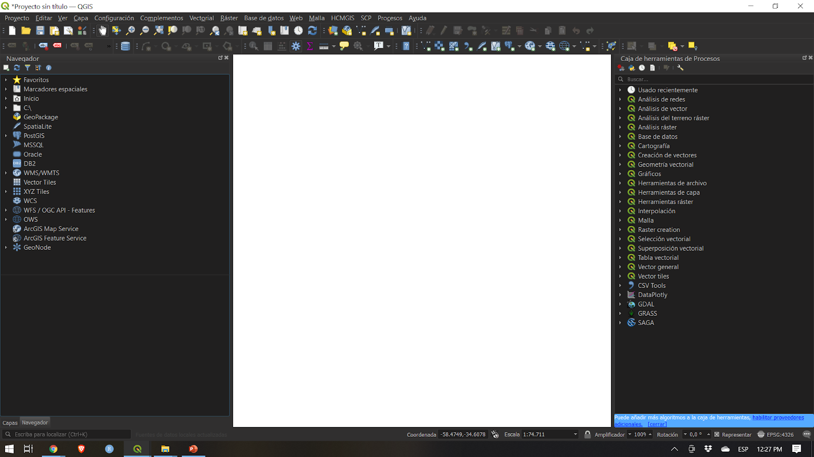
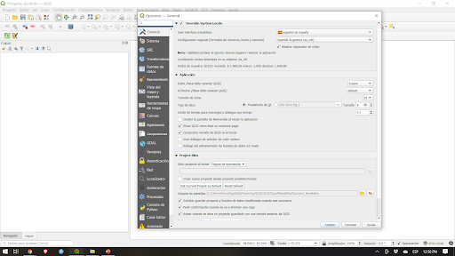
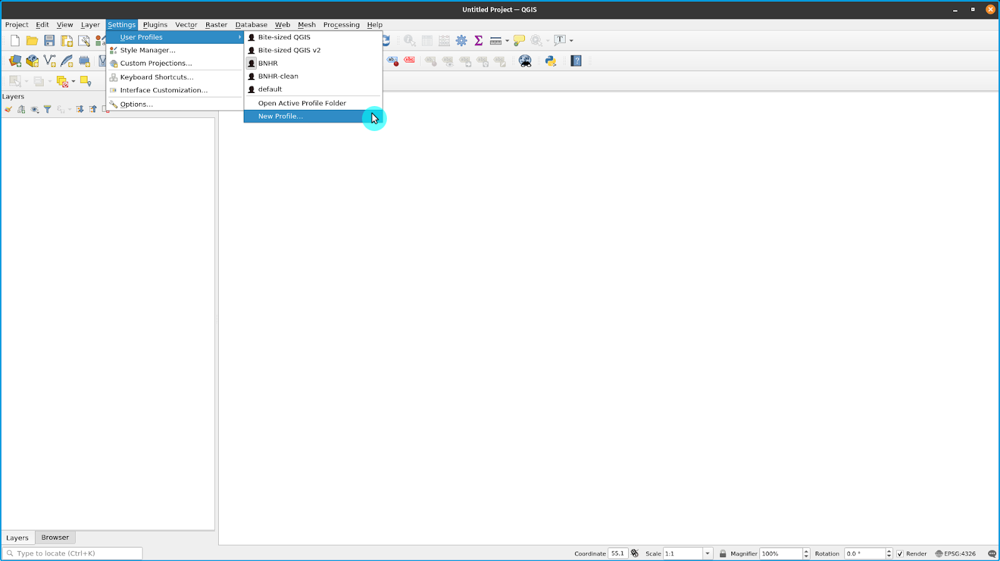

# Módulo 1 - Introducción to QGIS

**Autor**: Ben Hur

## Introducción Pedagógica

Este módulo sirve como una introducción a QGIS. Al final de este módulo, deberían sentirse familiares con:

*   Qué es QGIS
*   La interfaz QGIS
*   Las configuraciones de QGIS
*   Los complementos de QGIS 

También deberían aprender:

*   cómo instalar y abrir QGIS
*   las diferentes partes y características de la interfaz QGIS
*   cómo editar el diseño y el tema de la interfaz
*   las diferentes configuraciones de QGIS, cómo cambiarlas y cómo afectan a QGIS
*   qué son los perfiles de usuario y cómo utilizarlos
*   qué son los complementos y cómo instalarlos

El módulo también discutirá algunos matices de QGIS y qué lo hace único o diferente a otros SIG, como los formatos de archivo QGIS.

## Herramientas y recursos necesarios

Las herramientas y los recursos necesarios para este módulo son:

*   computadora de trabajo
*   conexión a Internet
*   QGIS 3.16 instalado en la computadora ([https://qgis.org/en/site/forusers/download.html](https://qgis.org/en/site/forusers/download.html))

## Prerrequisitos

*   Conocimientos básicos sobre cómo operar una computadora 

## Recursos Adicionales

Manual del Usuario QGIS - [https://docs.qgis.org/3.16/en/docs/user_manual/](https://docs.qgis.org/3.16/en/docs/user_manual/)

Manual de Entrenamiento QGIS - [https://docs.qgis.org/3.16/en/docs/training_manual/index.html](https://docs.qgis.org/3.16/en/docs/training_manual/index.html)

## Introducción Temática

El mapa que se encuentra debajo ([https://flic.kr/p/2jFfGJP](https://flic.kr/p/2jFfGJP)) muestra partes de Bogotá, ciudad capital de Colombia, en el estilo de la obra “Noche Estrellada” de Vincent van Gogh. Fue hecho por Andrés Felipe Lancheros Sánchez.

Este otro mapa ([https://flic.kr/p/2jAsphv](https://flic.kr/p/2jAsphv)) muestra datos de seguimiento de tormentas de NOAA entre 1851 y 2020 realizados por Fajr Alim.

El siguiente ([https://flic.kr/p/FA9TiR](https://flic.kr/p/FA9TiR)) es un mapa de la isla Kerguelen de Heinrich Lingnau Schneider.

Este último ([https://flic.kr/p/2kqVzsg)](https://flic.kr/p/2kqVzsg)) es de intentos de gol de campo y puntos anotados por intento durante la temporada 81 del torneo de baloncesto masculino UAAP en Filipinas por Ben Hur Pintor.

¿Qué tienen todos estos mapas en común? Todos fueron hechos usando QGIS.

### Desglose de conceptos

Los mapas que se muestran arriba fueron creados en QGIS ([https://qgis.org/en/site/](https://qgis.org/en/site/)), un Sistema de Información Geográfica (SIG) gratuito y de código abierto. QGIS se puede utilizar con todo tipo de datos espaciales (como datos de baloncesto en el último ejemplo) y no solo con datos geoespaciales relacionados a la Tierra.

Puedes crear mapas maravillosos y sorprendentes, como los ejemplos anteriores, porque QGIS es gratuito, de código abierto y tiene potentes capacidades de gestión, análisis y presentación de datos.

## Contenido Principal

### Título de la fase 1: Introducción a QGIS y la interfaz QGIS

#### **Qué es QGIS**

**QGIS,** conocido como Quantum GIS antes de su lanzamiento 2.X, es un Sistema de Información Geoespacial (SIG) maduro, multiplataforma, gratuito y de código abierto.

Es un SIG listo para la empresa que tiene funciones para recopilar, almacenar, analizar, presentar y administrar datos espaciales y no espaciales. También se integra bien con otras tecnologías geoespaciales existentes y sirve como una parte integral de cualquier stack FOSS4G (Software libre y de código abierto para aplicaciones geoespaciales).

Al ser multiplataforma, QGIS se ejecuta en GNU / Linux, macOS, Windows e incluso Android.

#### **Ciclo de lanzamiento y versiones**

Los lanzamientos y el desarrollo de QGIS siguen un calendario / hoja de ruta basados en el tiempo ([https://www.qgis.org/en/site/getinvolved/development/roadmap.html](https://www.qgis.org/en/site/getinvolved/development/roadmap.html)).

*   Una versión de QGIS se especifica con tres números (X.Y.Z). Por ejemplo, QGIS 3.16.4.
*   X se refiere a la versión principal. En este caso, QGIS 3.
*   Y se refiere a la versión de lanzamiento. En este caso, la versión de lanzamiento 16. Las versiones de lanzamiento son siempre números pares, ya que los números impares están reservados para las versiones de desarrollo.
*   Z se refiere al Lanzamiento Con Cambios Menores (PR) de esa versión. Para 3.16.4, eso significa que es el cuarto lanzamiento de la versión 3.16.

Hay tres ramas principales de QGIS que los usuarios pueden instalar. Estas son la rama **Versión a largo plazo (LTR)**, la rama **Versión más reciente (LR)** y la rama **Desarrollo (nocturno)**.

*   **Versión a largo plazo (LTR)** se llama así porque se mantiene y recibe correcciones de errores hasta que se publique el siguiente LTR. Actualmente, eso significa un (1) año. A febrero de 2021, el LTR actual es 3.16.4. Está programado que sea reemplazado por QGIS 3.22.4 en febrero de 2022.
*   **Versión más reciente (LR) **se refiere a la versión de lanzamiento de QGIS que contiene las funciones más recientes. Se publica un nuevo LR cada cuatro (4) meses. Por ejemplo, un nuevo 3.18 LR se lanzó en febrero de 2021. El próximo LR (3.20) se lanzará dentro de 4 meses, es decir, en junio de 2021. Actualmente, cada tercer LR se convierte en el próximo LTR. Por ejemplo, el LTR de febrero de 2021 es la versión 3.16. El tercer LR de 3.16 es 3.22, por lo que el próximo LTR se basará en la versión de lanzamiento 3.22.
*   **Desarrollo/Nocturna **se basa en la versión más reciente del código fuente de QGIS, pero es útil si desea probar, depurar o ayudar en el desarrollo de QGIS.

Entonces, ¿qué versión deberías usar? Depende. Si necesitas una versión que se mantenga durante más tiempo y no necesitas nuevas funciones a medida que se lanzan, entonces la versión LTR puede ser la mejor opción. Si necesitas tener las funciones más recientes y no te importa hacer una actualización cada pocos meses, puedes utilizar la versión LR. A veces también es bueno echar un vistazo a las versiones de desarrollo o nocturnas, especialmente si tienes curiosidad o estás entusiasmado con las próximas funciones de QGIS.

Para más información, visita:	 [https://bnhr.xyz/2020/10/26/about-qgis-versions-release-cycle-english.html](https://bnhr.xyz/2020/10/26/about-qgis-versions-release-cycle-english.html)

#### **Ejemplos de mapas QGIS maps en la naturaleza**

Figura 1. Presentación de mapas de QGIS

Para más mapas creados con QGIS, visita:	 [https://www.flickr.com/groups/2244553@N22/pool/with/50355460063/](https://www.flickr.com/groups/2244553@N22/pool/with/50355460063/)

#### **Instalar QGIS**

QGIS es multiplataforma y funciona en Linux, Windows y macOS. Al ser de código abierto, puedes construir e instalar QGIS desde su código fuente disponible en [https://github.com/qgis/QGIS/](https://github.com/qgis/QGIS/).

Los instaladores y las instrucciones de instalación también están disponibles en [https://qgis.org/en/site/forusers/download.html](https://qgis.org/en/site/forusers/download.html) o [https://qgis.org/en/site/forusers/alldownloads.html](https://qgis.org/en/site/forusers/alldownloads.html).

Para** Linux (o GNU / Linux)**, QGIS generalmente está disponible en el sistema de gestión de paquetes de su distribución. Para los usuarios de Debian / Ubuntu, QGIS tiene repositorios para las ramas LR, LTR y Desarrollo, así como versiones de QGIS con dependencias del PPA ubuntugis-inestable. QGIS también está disponible como paquete Flatpak o en Conda.

Para** Windows**, los usuarios pueden elegir entre el instalador de red OSGeo4W o los instaladores independientes. Hay un instalador independiente para la versión LTR y para la LR.

Los instaladores independientes son los más fáciles de instalar y se recomiendan para principiantes. Se pueden instalar múltiples versiones de QGIS en su computadora a la vez. Esto significa que puede tener instaladas las versiones 3.16 y 3.18 de QGIS.

El instalador de red OSGeo4W es un poco más avanzado y complejo que los instaladores independientes, pero también brinda la posibilidad de actualizar su versión de QGIS en el lugar, lo que significa que no necesitará desinstalar una versión anterior si desea instalar uno más nuevo.

En algunos casos podrías necesitar derechos de administrador para instalar QGIS, por lo que si lo estás instalando en una computadora donde tu usuario no tiene derechos de administrador, es posible que debas pedirle a tu administrador de IT o de oficina que instale QGIS.

La instalación en Windows también viene con QGIS con GRASS (otro SIG gratuito y de código abierto).

Ten en cuenta que QGIS está [eliminando lentamente el soporte de 32 bits para Windows](https://blog.qgis.org/2020/10/15/phasing-out-32-bit-support-in-qgis/), por lo que es mejor instalar QGIS en una computadora que ejecute un sistema operativo de 64 bits.

Para** macOS**, existen instaladores oficiales Todo-en-uno para macOS High Sierra (10.13) y versiones posteriores. QGIS aún no está certificado como lo requieren las reglas de seguridad de macOS Catalina (10.15). En el primer inicio, haga clic con el botón derecho en el icono de la aplicación QGIS, mantenga presionada la tecla Opción y luego elija Abrir.

#### **Partes de la Interfaz QGIS**

Después de instalar QGIS, puede ejecutarlo o abrirlo como lo haría con cualquier programa en su computadora. Al abrir QGIS, verás la interfaz de usuario (UI) predeterminada, algo similar a esto:

Figura 2. La interfaz QGIS en una instalación nueva

Hay seis partes principales de la interfaz de usuario de QGIS: 

1. Barra de Menú (menú)
2. Lienzo del mapa (Map Canvas)
3. Barras de herramientas (Toolbars)
4. Paneles (Panels)
5. Barra de estado (Status Bar) 
6. Localizador (Locator)

En el centro de la interfaz de usuario (UI) hay un Lienzo del mapa. Los paneles y las Barras de Herramientas se pueden colocar alrededor del Canvas. Los paneles también se pueden acoplar para crear un panel de varias pestañas. También hay otras partes de la interfaz de usuario, como la interfaz de Python, las ventanas de complementos, etc.

**Barra de Menú:** es un menú jerárquico simple que brinda acceso a las funciones y comandos de QGIS. Por lo general, se encuentra en la parte superior de la interfaz de usuario.

**Lienzo del mapa:** es donde se muestran las capas cargadas en QGIS. Aquí también es donde se reflejan los filtros, selecciones y simbologías creadas por el usuario. Puede haber más de uno en cualquier momento. Un usuario puede ampliar, desplazar e incluso rotar el Canvas. También puede mostrar datos 3D.

**Barras de Herramientas:** muestran botones “click-and-run” (hacer clic y ejecutar). Permiten un fácil acceso a los comandos, funciones, complementos, etc. de QGIS. Se pueden mover y acoplar alrededor del lienzo del mapa. La lista de barras de herramientas se puede encontrar, activar y desactivar desde la barra de menú en **Ver ‣ Barras de herramientas.** Ejemplos de Barras de Herramientas son la Attributes Toolbar (de atributos) y la Digitizing Toolbar (de herramientas de digitalización).

**Paneles:** son similares a las Barras de Herramientas, pero en lugar de botones, proporcionan una interfaz para funciones y características más complejas. El panel de capas y el panel del navegador son ejemplos. Al igual que las Barras de Herramientas, se pueden mover y acoplar alrededor del Lienzo del mapa. La lista de paneles se puede encontrar, activar y desactivar desde la barra de menú en **Ver ‣ Paneles.**

**Barra de Estado:** se encuentra comúnmente en la parte inferior de la interfaz de usuario y muestra información relevante como el CRS, la escala, las notificaciones, etc.

**Localizador: **se encuentra en la esquina inferior izquierda de la interfaz de QGIS. Permite al usuario acceder fácilmente a capas, campos, algoritmos de procesamiento y otras cosas en QGIS. Esta es una de las características más poderosas de QGIS.

Figura 3. Partes de la interfaz QGIS

Una de las bellezas de QGIS es la personalización que ofrece a sus usuarios. Esta personalización comienza con la interfaz de usuario. Al editar algunas configuraciones y mover algunas partes de la interfaz, puede tener un QGIS que se parece al siguiente:

Figura 4. La interfaz QGIS con algunas personalizaciones

#### **Tutorial / Ejercicio 1: Cambiar el aspecto y el diseño de la interfaz QGIS**

1. Abre **QGIS**
2. Haz clic en el botón **Ver**

3. Observa el menú **Paneles**

4. Observa el menú **Barras de Herramientas**

5. Selecciona las** Barras de Herramientas** y los **paneles** que deseas mostrar en la interfaz de usuario. Algunos de los paneles útiles incluyen las **Cajas  de herramientas (Toolbox) ** de **Estilo de capas (Layer Styling) y Procesamiento (processing)**.
6. Mueve las** Barras de Herramientas** y los **paneles** a las posiciones que tengan más sentido para tí. 

**Restablecimiento de la interfaz QGIS (Resetting)**

Para restablecer su pantalla a la configuración predeterminada, vaya a: **Ajustes ‣ Opciones ‣ Pestaña Sistema ‣ Ajustes ‣ Reiniciar** y reinicie QGIS.

#### **Preguntas de evaluación**

1. Verdadero o Falso:
    1. Puedes tener varios Lienzos del mapa.
    2. Puedes mover la Barra de Estado a una ubicación diferente.
    3. Solo puede colocar paneles en el lado izquierdo o derecho del lienzo del mapa.

### Título de la fase 2: Complementos de QGIS

#### **Contenido/Tutorial**

La capacidad de agregar, crear y extender la funcionalidad de QGIS a través de complementos es una de sus características más poderosas.

A partir de QGIS 3.16.3, hay más de 700 complementos disponibles para que el usuario los descargue y mejore. Estos complementos varían en función desde lo complejo hasta lo mundano.

Los complementos de QGIS se pueden clasificar como:

*   **Complementos principales:** integrados en su versión de QGIS, no se pueden desinstalar
*   **Complementos externos: **se instalan manualmente y se obtienen de un repositorio externo (es decir, el repositorio oficial de complementos de QGIS) o mediante el código fuente.

Pueden ser instalados de tres (3) formas:

1. A través del cuadro de diálogo “Administrar e Instalar Complementos” (administrar e instalar complementos) (**Complementos ‣ Administrar e Instalar Complementos**)
2. Instalar desde el ZIP, al que se puede acceder en la pestaña “**Instalar desde ZIP”** en el cuadro de diálogo “**Administrar e Instalar Complementos**”.
3. Agregar manualmente el código fuente en la carpeta de complementos de su perfil de QGIS. Esta carpeta generalmente se encuentra en: 
    1. **Linux**: .local/share/QGIS/QGIS3/profiles/default/python/complementos
    2. **Mac OS X**:	 Library/Application/Support/QGIS/QGIS3/profiles/default/python/complementos
    3. **Windows: **C:\\Users<User>\AppData\Roaming\QGIS\QGIS3\profiles\default\python\complementos

Figura 5. Acceder al “Administrar e Instalar Complementos dialog”

#### **Cuadro de Diálogo “Administrar e Instalar Complementos”**

El Cuadro de Diálogo “Administrar e Instalar Complementos” se conecta al Repositorio Oficial de Complementos de QGIS (o cualquier otro repositorio que hayas indicado en la Pestaña de Configuraciones) para obtener los complementos disponibles para tu versión de QGIS. Tiene (5) tabs (pestaña):

*   **Pestaña Todos **– muestra TODOS los complementos disponibles para tu versión de QGIS, incluidos los que ya están instalados en su máquina.
*   **Pestaña Instalados **– muestra solo los complementos instalados en tu computadora.
*   **Pestaña No Instalados** – muestra los complementos que NO están instalados en tu computadora.
*   **Instalar desde ZIP **– te permite instalar complementos desde un archivo ZIP.
*   **Pestaña Ajustes **– te ofrece opciones sobre cuándo buscar actualizaciones de  complementos, si incluir o no  complementos experimentales y obsoletos, o agregar / cambiar el repositorio para obtener complementos.

Si el complemento que buscas está etiquetado como experimental u obsoleto, deberías revisar “**Mostrar complementos experimentales”** y “**Mostrar complementos obsoletos”** en la pestaña de configuraciones.

La Barra de Búsqueda te permite buscar complementos que se encuentren en el repositorio al que estás conectado.

Figura 6. El cuadro de diálogo “Administrar e Instalar Complementos”

#### **Tutorial/Ejercicio 2: Instalar un Complemento QGIS**

1. Abre el cuadro de diálogo **Administrar e Instalar Complementos **desde **Complementos ‣ Administrar e Instalar Complementos **en el Menú.

2. Instala los siguientes complementos buscándolos en la **Pestaña Todos** haciendo clic en **Instalar Complemento** en la esquina inferior derecha del cuadro de diálogo “Administrar e Instalar complementos”
 
   - Memory Layer Saver

   - QuickOSM

3. Fíjate si los complementos fueron instalados correctamente. El complemento Memory Layer Saver debería estar disponible en **Complementos ‣ Memory Layer Saver **en el menú mientras que el complemento QuickOSM debería estar disponible en **Vector ‣ QuickOSM** en el menú.

#### **Preguntas de evaluación**

1. Verdadero o Falso
    1. Puedes eliminar o desinstalar los complementos principales
    2. Puede agregar complementos que no se encuentran en el repositorio oficial de complementos de QGIS

### Título de la fase 3: Configuraciones de QGIS

#### **Configuración del Sistema y del Proyecto**

La configuración de QGIS te permite editar y administrar diferentes cosas sobre QGIS, como perfiles de usuario, estilos, sistemas de referencia de coordenadas, atajos de teclado, la interfaz de usuario, colores predeterminados, etc. La configuración del sistema se puede encontrar en el menú **Configuración** y es la configuración predeterminada utilizada por QGIS a menos que sean anulados por la configuración de un Proyecto. La configuración del proyecto se puede encontrar en **Proyecto ‣ Propiedades **y pertenece a la configuración o propiedades del proyecto actual. Estos valores anulan los valores predeterminados del sistema.

Figura 6. La configuración del sistema

Figura 7. Configuración del proyecto

#### **Cambiando el tema de QGIS**

Puedes cambiar la apariencia de QGIS en la pestaña **Ajustes ‣ Opciones ‣ General**.

Puedes elegir entre tres temas: predeterminado, Mezcla de grises y Mapeo nocturno. También puedes cambiar el tamaño de los iconos, la fuente utilizada por QGIS y otros valores predeterminados del sistema.

Figura 8. Configuración general de QGIS

Para algunas configuraciones en QGIS, es posible que debas reiniciar la aplicación para que surtan efecto.

**Perfiles de Usuario**

QGIS 3.X introdujo el concepto de perfiles de usuario de QGIS.

Un perfil de usuario es una colección de configuraciones para complementos instalados, barras de herramientas habilitadas, disposición de la interfaz de usuario y otras configuraciones. QGIS viene con un perfil de usuario predeterminado llamado defecto. Los perfiles de usuario permiten al usuario crear diferentes configuraciones para análisis específicos (por ejemplo, un perfil de usuario específico para la gestión de recursos hídricos, digitalización de datos, cartografía, etc.), proyectos particulares o incluso clientes.

Se pueden crear perfiles de usuario y acceder a ellos desde la barra de menú en: **Ajustes ‣ Perfiles de Usuario**.

El perfil de usuario activo se muestra con [Perfil de usuario] en la barra de título.

Figure 9. Acceder a los perfiles de usuario

Los perfiles de usuario se guardan en un directorio de su computadora al que se puede acceder haciendo clic en **Ajustes ‣ Perfiles de Usuario ‣ Abrir Carpeta de Perfil Activo**.

#### **Tutorial/Ejercicio 03: Creando un Perfil de Usuario 

1. Ve a **Ajustes ‣ Perfiles de Usuario ‣ Perfil Nuevo...**

2. Dale un nombre a tu nuevo perfil de usuario.

3. Debería abrirse una nueva ventana de QGIS con su nuevo perfil de usuario. Observa que tu nombre de perfil se muestra en la barra de título de QGIS.

4. ¿Nota alguna diferencia en el nuevo perfil de usuario? Verifique la interfaz de usuario, los complementos y la configuración del perfil anterior y el nuevo perfil que creó.

#### **Preguntas de evaluación**

1. Verdadero o Falso
    1. Solo puedes tener un perfil de usuario en QGIS.
    2. No puedes anular la configuración y las propiedades del sistema.

### Título de la fase 4 (adicional): Formatos de archivo QGIS

#### **Archivo de proyecto QGIS (QGS / QGZ)**

Los proyectos de QGIS son para QGIS como los archivos .mxd son para ArcMap. Estos archivos vienen como **QGS (*.qgs)** o **QGZ (*.qgz)**. La principal diferencia entre los dos es que el formato QGZ es un archivo comprimido (zip) que contiene un archivo QGS y un archivo QGD. El formato QGS es un formato XML para almacenar proyectos QGIS. El archivo QGD es la base de datos sqlite asociada del proyecto qgis que contiene datos auxiliares para el proyecto. Si no hay datos auxiliares, el archivo QGD estará vacío.

Un archivo de proyecto QGIS contiene todo lo que se necesita para almacenar un proyecto QGIS, que incluye:

*   título del proyecto
*   proyecto CRS
*   el árbol de capas
*   ajustes de autoensamblado 
*   relaciones
*   la extensión del Lienzo del mapa
*   modelos de proyecto
*   leyenda
*   Docks mapview (2D y 3D)
*   las capas con vínculos a los conjuntos de datos subyacentes (fuentes de datos) y otras propiedades de capa, incluida la extensión, SRS, uniones, estilos, renderizador, modo de fusión, opacidad y más.
*   propiedades del proyecto

Los archivos del proyecto QGIS se pueden guardar en un GeoPackage o en una base de datos PostGIS. Guardar el archivo del proyecto junto con el archivo de estilo y las capas correspondientes en un solo GeoPackage facilita compartir proyectos QGIS.

#### **Definición de capa QGIS (QLR)**  

Un archivo de QGIS definición de capa es un archivo XML que contiene un puntero a la fuente de datos de la capa además de la información de estilo QGIS para la capa. Actualmente, un archivo QLR corresponde a una sola capa.

El caso de uso de este archivo es simple: tener un solo archivo para abrir una fuente de datos y traer toda la información de estilo relacionada. Los archivos QLR también le permiten enmascarar la fuente de datos subyacente en un archivo fácil de abrir.

Un ejemplo de uso de QLR es para abrir una capa desde una base de datos PostGIS. En lugar de conectarse a la base de datos, buscar la capa y aplicar un filtro, puede abrir un archivo .qlr que apunte a la capa PostGIS correcta con su estilo y filtro correspondientes.

#### **Archivo de estilo QGIS (QML)**

**QML **es un formato XML para almacenar estilos de capa. Un archivo QML (.qml) contiene toda la información que le dice a QGIS cómo renderizar geometrías de entidades, lo que incluye definiciones de símbolos, tamaños y rotaciones, etiquetado, opacidad, modo de fusión y más.

Un archivo .qml debe tener el mismo nombre que la fuente de datos a la que corresponde. Cuando se encuentra en el mismo directorio o carpeta que la fuente de datos, la carga de la fuente de datos también carga automáticamente su estilo tal como se define en el archivo .qml.

Por ejemplo, si tiene un GeoJSON llamado Regions.geojson y un archivo QML llamado Regions.qml, la carga de Regions.geojson en QGIS aplicará los estilos definidos en Regions.qml en la capa cargada.

Cuando utilizas GeoPackages (.gpkg), a menudo no se necesita un archivo .qml ya que puedes guardar el estilo de una capa directamente en el GeoPackage.

### Si quieres ir más lejos:  

Puedes intentar crear tu propio complemento QGIS.  Si no hay ninguno que haga lo que quieres, siempre puedes hacerlo tú mismo.

El **Generador de Complementos (Plugin Builder)** es un complemento que crea una plantilla que puede servir como punto de partida para el desarrollo de complementos de QGIS para que no tengas que crear uno desde cero. Puedes instalarlo desde el cuadro de diálogo Administrar e instalar complementos.

Obviamente, siempre puedes crear un complemento desde cero. Si te interesa hacerlo, puedes revisar la documentación oficial de QGIS ([https://documentation.qgis.org/](https://documentation.qgis.org/)). Para los complementos de Python, es una buena idea revisar el  libro de recetas del PyQGIS Developer	 ([https://docs.qgis.org/3.16/en/docs/pyqgis_developer_cookbook/](https://docs.qgis.org/3.16/en/docs/pyqgis_developer_cookbook/)).

Para más información, mira: [https://bnhr.xyz/2018/10/08/qgis-complementos-3.0.html](https://bnhr.xyz/2018/10/08/qgis-plugins-3.0.html)

Para practicar tus nuevas habilidades, intenta:

*   Cambiar el tema y el aspecto de la interfaz de usuario de QGIS para adaptarlo a sus preferencias.
*   Instalar otros complementos de QGIS.
*   Cambiar otras configuraciones de QGIS.
    *   crear un sistema de referencia de coordenadas personalizado
    *   agregar una pantalla de bienvenida personalizada ([https://bnhr.xyz/2020/09/05/custom-splash-screen-qgis.html](https://bnhr.xyz/2020/09/05/custom-splash-screen-qgis.html))

### Consejos 

N/A

