# Módulo 2: Capas (capas) en QGIS

**Autor**: Ben Hur

## Introducción Pedagógica

En este módulo veremos los conceptos básicos de capas (layers) en QGIS y cómo cargarlas. Al final de este módulo, deberían estar familiarizados con:

*   las diferentes fuentes de datos y formatos de archivo que se pueden cargar en QGIS
*   las diferentes formas en que se pueden cargar datos en QGIS
*   algunos formatos de archivo de datos comunes

También deberían poder:

*   cargar capas (tanto vectorial como raster) usando el Navegador (Browser Panel)  y el Administrador de fuentes de datos (Data Source Manager)
*   conectar QGIS a servicios remotos
*   trabajar con capas temporales y virtuales
*   instalar algunos complementos que cargarán otros conjuntos de datos en QGIS
*   mostrar propiedades de la capa, como información de metadatos
*   guardar y exportar capas


## Herramientas y recursos necesarios

Las herramientas y los recursos necesarios para este módulo son:

*   computadora de trabajo
*   conexión a Internet
*   QGIS 3.16 instalado en la computadora 	([https://qgis.org/es/site/forusers/download.html](https://qgis.org/es/site/forusers/download.html))


## Prerrequisitos

*   Conocimientos básicos sobre cómo operar una computadora 
*   Familiaridad con los formatos de datos espaciales y la interfaz de QGIS (haber completado los Módulos 0 y 1)


## Recursos adicionales

Guía del usuario de QGIS - [https://docs.qgis.org/3.16/en/docs/user_manual/](https://docs.qgis.org/3.16/en/docs/user_manual/)

Manual de entrenamiento en QGIS - [https://docs.qgis.org/3.16/en/docs/training_manual/index.html](https://docs.qgis.org/3.16/en/docs/training_manual/index.html)


## Introducción Temática

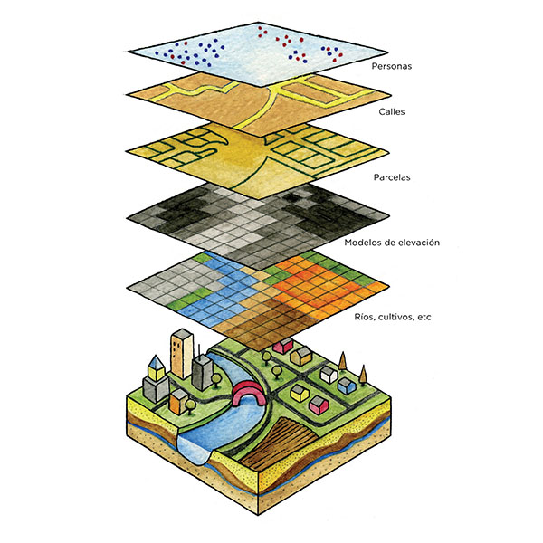

Figura 1. Una superposición de mapa que contiene diferentes capas y tipos de datos (https://www.lexgeo.com/arquitecturaenterreno/)

Aprendimos de los módulos anteriores que los modelos de datos espaciales como vectores y raster son modelos de objetos y fenómenos del mundo real y, aunque está perfectamente bien tener un solo capa que modele una cosa (por ejemplo, elevación, temperatura, ubicaciones de hogares, zonificación, etc.), en la práctica, si queremos realizar análisis útiles o crear un modelo que refleje mejor el mundo real, necesitaríamos utilizar varios datos y capas juntos. La superposición de varios mapas temáticos de la misma área colocándolos uno encima del otro es una de las técnicas de análisis geográfico más antiguas y comunes.


### Desglose de conceptos

La imagen de arriba nos da un ejemplo simple y concreto de esto. Imagínate ser un consultor de SIG encargado de encontrar la mejor ubicación para un nuevo restaurante de franquicia (por ejemplo, Starbucks o McDonalds). Para hacer esto, necesitas recopilar la información relevante que te ayudará a decidir. Esto puede incluir información sobre las calles de la ciudad, parcelas de terreno, ubicación y distribución de posibles clientes, la topografía de la zona, uso del suelo, etc.

Estos conjuntos de datos pueden venir en diferentes tipos y formatos. Algunos pueden ser archivos vectoriales, mientras que otros pueden ser raster. Algunos pueden estar en el mismo sistema de referencia de coordenadas, mientras que otros pueden estar en diferentes sistemas de referencia de coordenadas. Algunos pueden ser archivos locales que se encuentran en su computadora, mientras que otros solo se pueden cargar a través de Internet. Debido a las muchas posibilidades sobre qué tipo de datos necesitaría para su análisis espacial, un buen SIG debería poder manejar y administrar una variedad de fuentes de datos.


## Contenido Principal

### Título de la fase 1: Tipos de datos, formatos de archivo, el Navegador y el Panel de Capas

#### **Tipos comunes de datos y formatos de archivo**

Aparte de los modelos de datos espaciales (raster y vectores) discutidos en el primer módulo, la familiaridad con los formatos de archivos geoespaciales y sus pros y contras también es importante para cualquiera que realice análisis espacial.

La mayoría de las personas que comienzan a trabajar con SIG suelen conocer los datos espaciales a través de archivos shapefiles. La mayoría de las personas nunca superan esto y usan shapefile para referirse a todos los tipos y formas de datos vectoriales. Esto es similar a cómo una marca específica como Coca Cola comienza a usarse como término general para todas las bebidas Cola. Esto no es necesariamente incorrecto, pero es bastante desafortunado ya que los shapefiles son solo uno de los muchos tipos de formato de datos vectoriales. Otros tipos son: geopackage, geojson, topojson y flatgeobuf. El formato de shapefile, aunque omnipresente, tiene algunas limitaciones importantes como:


*   No es solo un archivo. Un shapefile en realidad consta de varios archivos, cuatro de los cuales son obligatorios: .prj, .shp, .shx, .dbf. Todos los demás archivos se denominan archivos complementarios.
*   Tiene un límite de tamaño de 2 GB para cada archivo individual.
*   Están limitados a 10 caracteres para nombrar los campos.
*   Las columnas de atributos están limitadas a 255 columnas.
*   No hay soporte para algunos tipos de datos como el tiempo.
*   No almacena explícitamente la topología.

Otros formatos de datos como GeoPackage, GeoJSON, TopoJSON y flatgeobuff solucionan estas limitaciones de los shapefiles. De hecho, QGIS y GRASS GIS han cambiado a GeoPackage como el formato de archivo vectorial predeterminado al importar o exportar capas y, aunque GeoPackage también tiene algunas limitaciones, ser un formato completamente abierto permite a la comunidad ayudar a dar forma al futuro del formato.

Entonces, si no son shapefiles, ¿qué deberías usar?

No hay nada de malo en usar shapefiles, especialmente si se ajusta a tu caso de uso. Si no necesitas un conjunto de datos que supere los 2 GB; si estás de acuerdo con tener un límite de 10 caracteres para nombrar los campos; o si estás trabajando con una pequeña cantidad de archivos localmente, un shapefile está completamente bien.

Sin embargo, si deseas empaquetar tu proyecto QGIS junto con todos las capas (vectores, raster), estilos y modelos; o deseas compartir varios tipos de capas y datos espaciales en un solo archivo, vale la pena echarle un vistazo a un GeoPackage. GeoPackage y GeoJSON también son compatibles con la web y pueden ser utilizados directamente por bibliotecas de mapas web como Mapbox y Leaflet.

Puedes leer más en este link: 	[https://mappinggis.com/2017/06/geopackage-para-novatos-uso-en-arcgis-qgis-publicacion-en-geoserver/](https://mappinggis.com/2017/06/geopackage-para-novatos-uso-en-arcgis-qgis-publicacion-en-geoserver/) 

Mientras tanto, QGIS puede leer cualquier formato que pueda representarse como una cuadrícula de píxeles o celdas como datos ráster. Esto incluye formatos de imagen como PNG (.png) y JPEG (.jpg). Vale la pena señalar que aunque todos los formatos de archivo de imagen se pueden leer como raster, no todos están georreferenciados o contienen información geoespacial que nos permita ubicarlos correctamente en la Tierra. Para casos como este, podemos usar lo que se conoce como “World File” (archivo mundial) ([http://www.gisandbeers.com/exportar-imagenes-georreferenciadas-world-files/](http://www.gisandbeers.com/exportar-imagenes-georreferenciadas-world-files/)). Un World File es un archivo de datos de texto plano separado cuyo nombre es el mismo que el archivo ráster al que pertenece y cuya extensión de archivo tiene la letra w agregada al final. Por ejemplo, el World File para **world.png** se llamará **world.pngw** o **world.pgw**.

Algunos formatos de archivo de imagen contienen información y georreferenciación explícita y no necesitan un archivo mundial. Algunos ejemplos son GeoTIFFs (.tif o tiff) y el formato de archivo ERDAS Imagine (.img).

Para obtener más información sobre los formatos de archivo, también puedes consultar: [https://saylordotorg.github.io/text_essentials-of-geographic-information-systems/s09-03-file-formats.html](https://saylordotorg.github.io/text_essentials-of-geographic-information-systems/s09-03-file-formats.html)

Los datos geoespaciales también pueden venir en forma de bases de datos geoespaciales. Estas pueden ser bases de datos de nivel empresarial como Postgres de código abierto y gratuito con extensión PostGIS ([https://postgis.net](https://postgis.net)/) o ArcSDE propiedad de ESRI. También hay bases que pueden almacenar diferentes tipos de datos (por ejemplo, vectores y raster) dentro de ellas. Algunos ejemplos son el GeoPackage OGC abierto y gratuito (.gpkg) ([https://www.geopackage.org/](https://www.geopackage.org/)) y el formato patentado File Geodatabase de ESRI (.gdb).


#### **Tipos de fuentes de datos**

Una de las características más poderosas de QGIS es su capacidad para conectar, cargar y usar diferentes datos espaciales y no espaciales de una variedad de fuentes. QGIS puede abrir:

*   archivos locales ráster y vectoriales
*   bases de datos locales
*   archivos y bases de datos en Internet a través de su identificador uniforme de recursos (URL) o localizador uniforme de recursos (URL),
*   servicios web (servicios web OSGeo y servicios web ArcGIS), servicios de teselas y portales de datos como GeoNode
*   y muchos más...

QGIS también puede conectar y cargar datos de servicios como los datos SRTM de la NASA, imágenes del planeta, Sentinel Hub, Google Earth Engine y OpenStreetMap a través del poder de los complementos.

Esto convierte a QGIS en un componente integral para cualquier flujo de trabajo o infraestructura de datos espaciales.


#### **Cargando capas en QGIS**

Hay muchas formas de cargar capas en QGIS. Estas incluyen:

1. **Arrastra y Suelta (Drag-and-drop)**: Arrastra y suelta la capa en el lienzo del mapa de QGIS o en el Panel de capas. Esta podría ser la forma más fácil de cargar una capa en QGIS, pero no es el enfoque recomendado, ya que existen trampas al usar este enfoque, como cuando se cargan datos tabulares no espaciales como CSV.
2. Usar el **Navegador**.
3. Usar el **Administrador de Fuentes de Datos**.
4. Usar las **Barras de Herramientas Administrador de Fuentes de Datos **y **Administrar Capas**

**NOTA: _Al cargar capas, los colores predeterminados de sus capas pueden ser diferentes a los colores predeterminados que se muestran en este módulo._**


#### **El Navegador**

El **Navegador** muestra un árbol de archivos que muestra los archivos y carpetas de su computadora, así como las conexiones a bases de datos y servidores web. De forma predeterminada, está acoplado en el lado izquierdo de la interfaz de usuario de QGIS junto con el Panel de Capas.

El Navegador expone una gran cantidad de funcionalidades para conectar, cargar y mostrar información sobre capas. También puede crear conexiones a directorios favoritos y marcadores espaciales en el Navegador.

Para aprender más, mira:	 [https://docs.qgis.org/3.16/es/docs/user_manual/introduction/browser.html](https://docs.qgis.org/3.16/es/docs/user_manual/introduction/browser.html) 


#### **Ejercicio 1.1: El Navegador**

1. Abre QGIS.
2. Mira el Navegador (Figura 2). Si no lo encuentras, puedes hacerlo visible yendo a **Ver ‣ Paneles ‣ Navegador** en el Menú.


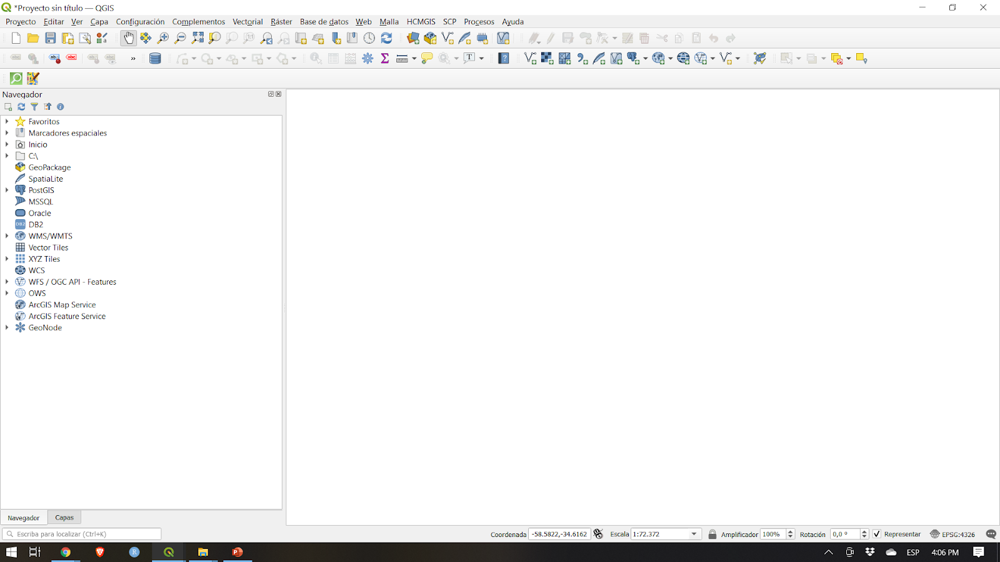

Figura 2. El Navegador

3. Observa cómo las unidades y carpetas se pueden expandir para mostrar las subcarpetas dentro de ellas.
4. Ubica el **Módulo 2 - Capas **en la carpeta QGIS (Figura 3) en el árbol de archivos (observa dónde guardaste o descargaste el archivo). Deberías poder ver los datos necesarios para este manual. En mi ejemplo de la derecha, vinculé la carpeta mencionada anteriormente como uno de mis favoritos para poder acceder fácilmente a ella desde el Panel del navegador. Puedes agregar un directorio favorito al Navegador haciendo clic con el botón derecho en Favoritos y agregando el directorio.
5. Verifica los archivos dentro de la carpeta (Figura 3). Hay muchos de ellos. Desde el árbol de archivos en sí, ya podemos hacernos una idea de los archivos y capas que podemos cargar en QGIS. Los iconos a la izquierda de los nombres indican si los datos son un vector , un ráster , una base de datos , o datos tabulares simples . 


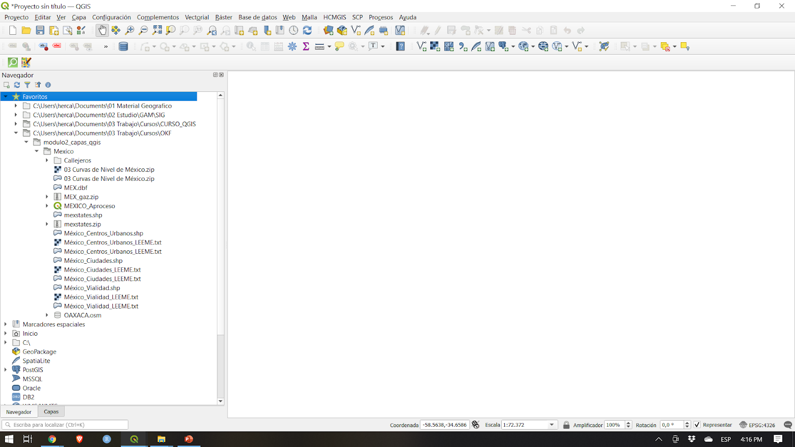

Figura 3. Los archivos del módulo en el Navegador

6. Hay 5 archivos en la carpeta de datos:

    1. un GeoPackage (mendoza_modulo2.gpkg) que contiene un vector (sushi_osm_mendoza) y un archivo ráster (srtm_mendoza);
    2. un GeoJSON (departamentos_mendoza.geojson);
    3. un archivo flatgeobuf (NCR_municities.fgb);
    4. un archivo shapefile (limite_provincial_mendoza.shp); y
    5. un archivo de valores separados por comas (CSV) (parrillas_osm_mendoza.csv).
    
7. Haga clic derecho en limite_provincial_mendoza.shp y haga clic en Propiedades de la Capa (Layer Properties) (Figura 4). Esto abre la ventana Propiedades de la Capa (Figura 5). Nota la información provista en la ventana. ¿Cuál es la geometría de la capa? ¿Qué CRS se utiliza? ¿Cuántas características hay en la capa?


Figura 4. Observando Propiedades de la Capa


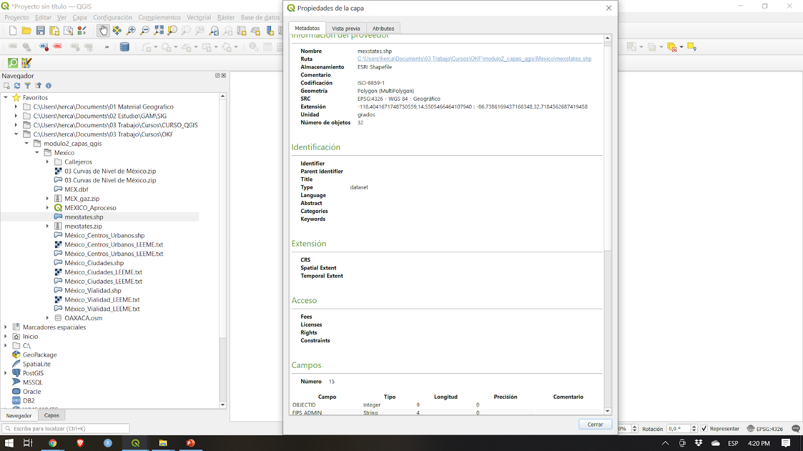

Figura 5. Propiedades de la Capa en el Navegador


8. Además de proporcionar metadatos en los capas, también puedes obtener una vista previa de la geometría y los atributos en la ventana de Propiedades de la Capa
9. Puedes cargar una capa en el Navegador así:
    6. **dando doble clic a la capa**
    7. **clic derecho a la capa ‣ Agregar al Proyecto**
    8. **arrastrando la capa al lienzo del mapa** 
10.  Intenta cargar las capas **limite_provincial_mendoza** y **departamentos_mendoza **usando cualquiera de estos métodos.


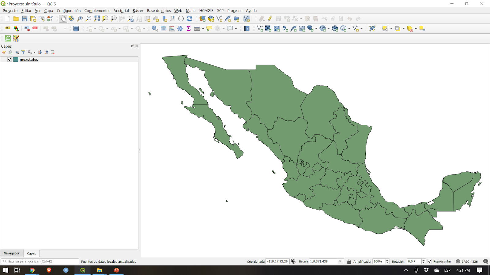


Figura 6. Los capas de vector cargados en QGIS


#### **El Panel de Capas**

En el Panel de Capas podrás ver todos los laters actualmente en el proyecto. Ayuda a administrar su visibilidad, orden y puede ser utilizado para mostrar sus propiedades. Puede activarse desde **Ver ‣ Paneles ‣ Panel de Capas **o usando el atajo **CTRL+1**. También se llama Leyenda del Mapa. Si cargaste todos los vectores del ejercicio anterior, el Panel de Capas debería aparecerte así: 


Figura 7. Panel de Capas

La visibilidad de una capa se puede controlar marcando o desmarcando la casilla a la izquierda de su nombre. Al arrastrar las capas hacia arriba o hacia abajo en el Panel, se puede cambiar su orden en Z. De manera similar al software de manipulación de imágenes como GIMP o Photoshop, las capas enumeradas cerca de la parte superior se dibujan sobre las capas enumeradas más abajo. Por lo tanto, si dos capas muestran la misma área, el que está más arriba en el Panel se dibuja encima del inferior y es posible que la capa inferior no sea visible en el lienzo del mapa. Vale la pena señalar esto porque puede haber casos en los que pensamos que una capa no aparece en QGIS cuando en realidad está siendo cubierto u oculto por una capa encima.

**NOTA: **El orden en Z de las capas en el Panel de Capas puede ser anulado por el **Panel de Orden de Capas**.

El Panel de Capas también permite al usuario renombrar y remover capas, filtrar la visibilidad de las capas, crear y administrar grupos de capas y mapas. 

La tabla de atributos de una capa vectorial también puede abrirse desde el Panel de Capas haciendo **clic derecho en la capa ‣ Abrir tabla de atributos**.

Para aprender más, visita: [https://docs.qgis.org/3.16/en/docs/user_manual/introduction/general_tools.html#capas-panel](https://docs.qgis.org/3.16/en/docs/user_manual/introduction/general_tools.html#layers-panel)


#### **Propiedades de la Capa**

Haciendo clic derecho en una capa en Panel de Capas y seleccionando Propiedades de la Capa abrirás el cuadro de diálogo Propiedades de la Capa.


Figura 9. El diálogo Propiedades de la Capa 

Hay varias pestañas en el cuadro de diálogo Propiedades de la Capa que permiten al usuario ver información e incluso editar / modificar propiedades relacionadas con la capa.

La pestaña Información muestra una representación de solo lectura de información resumida y metadatos en la capa actual, que incluye:

*   proveedor de datos
*   metadatos llenos
*   geometría o información del campo

La pestaña Fuente (Source) muestra la configuración general para un vector capa.

Pestañas como Simbología (Symbology), Etiquetas (Labels), Máscaras (Masks) y Vista 3D (3d View) permiten al usuario modificar la simbología y el estilo de la capa.

Otras pestañas permiten a los usuarios hacer uniones con la Capa (Unir), obtener información sobre los campos de atributos (Campos), agregar formularios personalizados para agregar nuevos datos (Formularios de Atributos) y hay muchas más.

Otra pestaña que vale la pena mencionar es Metadatos, que permite crear y editar un reporte de metadatos en la capa. Esto incluye información sobre:

*   Identificación de datos: atribución básica del conjunto de datos: parent, identificador, título, resumen, idioma…
*   Categorías a las que pertenecen los datos, como categorías ISO y personalizadas;
*   Palabras clave (Keywords) para recuperar los datos y los conceptos asociados siguiendo un vocabulario estándar;
*   Acceso al conjunto de datos (dataset): licencias, derechos, fees y restricciones
*   Extensión del conjunto de datos, ya sea espacial (CRS, extensión del mapa, altitudes) o temporal
*   Contacto del propietario (s) del conjunto de datos
*   Enlaces a recursos auxiliares e información relacionada
*   Historia del conjunto de datos.

Se proporciona un resumen de la información completa en la pestaña Validación y ayuda a identificar problemas potenciales relacionados con el formulario de metadatos. Actualmente, los metadatos se guardan en el archivo del proyecto, pero también se pueden guardar en un archivo .qmd separado junto con las capas basadas en archivos o en una base de datos .sqlite local para capas remotos.

Para saber más sobre propiedades de capas vectoriales, visita: [https://docs.qgis.org/3.16/es/docs/user_manual/working_with_vector/vector_properties.html](https://docs.qgis.org/3.16/es/docs/user_manual/working_with_vector/vector_properties.html) 

Para saber más sobre propiedades de capas ráster, visita: : [https://docs.qgis.org/3.16/es/docs/user_manual/working_with_raster/raster_properties.html](https://docs.qgis.org/3.16/es/docs/user_manual/working_with_raster/raster_properties.html) 

#### **Metadatos Geoespaciales**

Los metadatos son simplemente datos sobre los datos. Responden al quién, qué, cuándo, dónde y cómo del conjunto de datos y viene en todas las formas y tamaños. Para propósitos de SIG, generalmente nos interesan los metadatos geoespaciales. Los metadatos geoespaciales se describen en el Comité Federal de Datos Geográficos de EE. UU. (FGDC) como

_“un archivo de información, generalmente presentado como un documento XML, que captura las características básicas de un recurso de datos o información. Representa el quién, qué, cuándo, dónde, por qué y cómo del recurso. Los metadatos geoespaciales comúnmente documentan datos digitales geográficos como archivos del Sistema de Información Geográfica (GIS), bases de datos geoespaciales e imágenes de la tierra, pero también pueden usarse para documentar recursos geoespaciales, incluidos catálogos de datos, aplicaciones de mapeo, modelos de datos y sitios web relacionados. Los registros de metadatos incluyen elementos básicos del catálogo de la biblioteca, como título, resumen y datos de publicación; elementos geográficos como la extensión geográfica y la información de proyección; y elementos de base de datos como definiciones de etiquetas de atributos y valores de dominio de atributos"._ \


La importancia de los metadatos es que no solo promueven la transparencia, sino que también facilitan el intercambio de datos e información. Por eso es importante agregar siempre metadatos a nuestros conjuntos de datos. Al agregar metadatos, es igualmente importante seguir estándares (reglas y prácticas ampliamente promovidas, aceptadas y seguidas) para que los metadatos que creamos sean interoperables. Uno de estos estándares es el ISO 19115: 2014 “Información geográfica - Metadatos” de ISO / TC 211([https://www.iso.org/obp/ui/#iso:std:iso:19115:-1:ed-1:v1:en](https://www.iso.org/obp/ui/#iso:std:iso:19115:-1:ed-1:v1:en))


#### **Ejercicio 01.2: Agregando Metadatos**


1. Abre Propiedades de la Capa de la capa departamentos_mendoza.
2. Revisa la información que aparece en la pestaña Information. ¿Está completa? ¿Podemos agregar más?

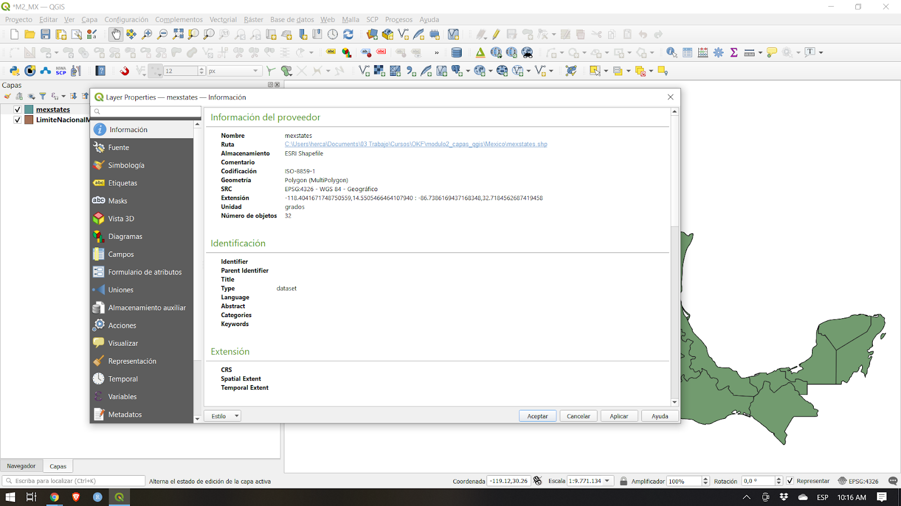


Figura 9. Propiedades de información de la capa departamentos_mendoza.

3. Ve a la pestaña Metadatos e intenta agregar más información sobre la capa, como la extensión, categoría del dato, licencia, etc. Haz clic en OK cuando hayas terminado.


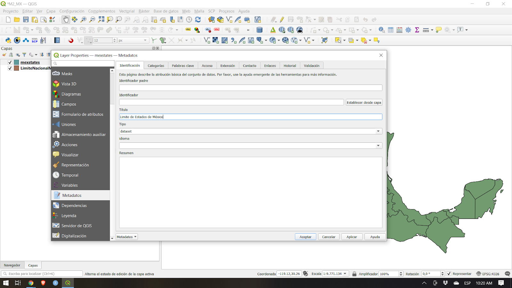

Figura 10. Editando algunos metadatos.

4. Ve a la pestaña Information de nuevo y fíjate si ha cambiado algo.


Figura 11. La pestaña Information después de editar algunos metadatos.


#### **Preguntas de Evaluación**

1. Verdadero o Falso:

    1. Todos los archivos de vector son shapefiles.
    2. Cuando se renderiza en el lienzo del mapa, una capa que está más alta en el Panel de Capas siempre cubrirá o aparecerá por arriba de una capa que esté más abajo en el Panel de Capas.
    3. Podés revisar la información de metadatos de una capa en el Panel de Capas y el Navegador.


### Título de la fase 2: Administrador de Fuentes de Datos (Data Source Manager) y conexión a servicios remotos

#### **Administrador de Fuentes de Datos**

Si no quieres usar el Navegador para cargar capas, siempre puedes usar el **Administrador de Fuentes de Datos**.

El **Administrador de Fuentes de Datos** se introdujo con el lanzamiento de QGIS 3. Es una "ventanilla única" para agregar y cargar capas de diferentes fuentes de datos en QGIS. Antes de su introducción, había ventanas separadas para cargar diferentes fuentes de datos (es decir, una para rásteres, otra para vectores, etc.). Se puede acceder a través de** Capa ‣ Administrador de fuentes de datos** o **CTRL + L**.


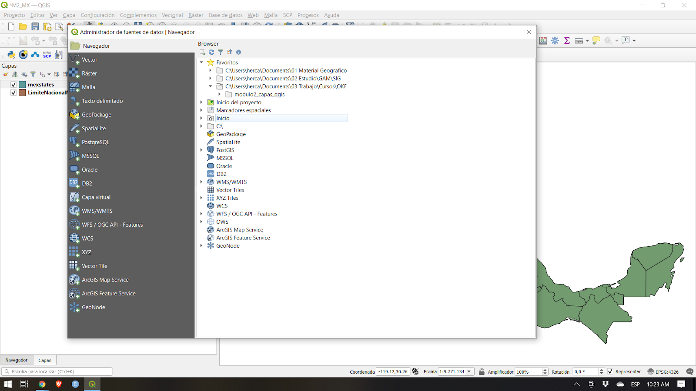

Figura 12. Administrador de Fuentes de Datos


#### **Ejercicio 02.1: El Administrador de Fuentes de Datos**

1. Abre el **Administrador de fuentes de datos **(Figura 6). Contiene pestañas en el lado derecho que pertenecen al tipo de fuente de datos que desea cargar o conectarse. Al igual que en el Navegador, puede cargar y conectar varios tipos de datos desde el Administrador de fuentes de datos.

2. **Cargando Vectores**

    1. Para cargarlos, ve a la pestaña Vector. Archivos, archivos en un directorio, una base de datos, e incluso archivos remotos  vía un protocolo como HTTP, cloud, etc. pueden ser cargados.
    2. Carguemos el archivo vector (sushi_osm_mendoza) que está dentro del geopackage mendoza_modulo2.gpkg. Esta es una capa de puntos de las ubicaciones del restaurantes de Sushi en Mendoza, Argentina.

        1. Tipo de fuente: archivo
        2. Fuente: Selecciona el geopackage mendoza_modulo2 usando el botón 
        3. Haz clic en Añadir 
        4. Si hay más de 1 archivo vector dentro del geopackage, QGIS te pedirá que elijas cuáles cargar


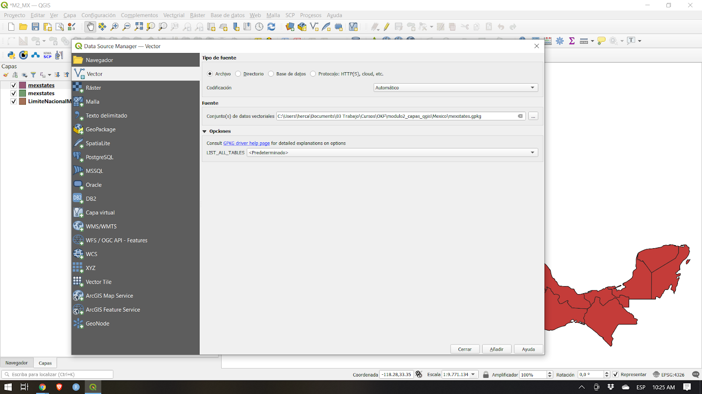

Figura 13. Cargando un vector dentro de un GeoPackage

3. **Cargando ráster** 

    1. Para cargar un ráster, ve a la pestaña Raster. Se pueden cargar archivos y archivos remotos a través de un protocolo como HTTP, cloud, etc. Hay un ráster (srtm_mendoza) dentro del geopackage mendoza_modulo2. Este ráster es un modelo de elevación digital de la provincia de Mendoza, Argentina. Para cargarlo:

        1. Tipo de fuente: archivo
        2. Fuente: Selecciona el geopackage mendoza_modulo2 usando el botón  
        3. Haz clic en Agregar
        4. Si hay más de 1 archivo vector dentro del geopackage, QGIS te pedirá que elijas cuáles cargar


Figura 14. Cargando un ráster dentro de un GeoPackage

4. **Carga de archivos CSV y otros archivos de texto delimitados**  

    1. Aparte de los vectores y raster, otro archivo común utilizado en SIG son los CSV y las hojas de cálculo. Afortunadamente, es relativamente fácil cargar estos archivos en QGIS.
    2. Los archivos CSV y otros archivos de texto delimitados se pueden cargar a través de la pestaña Texto delimitado en el Administrador de fuentes de datos, agregarlos desde el Panel del navegador e incluso simplemente arrastrarlos al Lienzo del mapa. Sin embargo, se deben considerar algunas cosas si el CSV que tiene contiene información de geometría (es decir, ubicaciones de puntos). La regla de oro es:

        1. Usar el Administrador de Fuentes de Datos para cargar CSVs tengan o no información de la geometría.
        2. Si los CSV se cargarán a través del Navegador o arrastrándolos, asegúrate de que haya un archivo CSVT correspondiente para conservar los tipos de datos de campo.
        3. Si tienes problemas para conservar los tipos de datos para sus textos delimitados (específicamente CSV), puedes usar lo que se llama un archivo CSVT. Puedes leer más sobre la carga de CSV en QGIS en el siguiente enlace: [https://docs.qgis.org/3.16/es/docs/user_manual/managing_data_source/supported_data.html#using-csvt-file-to-control-field-formatting](https://docs.qgis.org/3.16/es/docs/user_manual/managing_data_source/supported_data.html#using-csvt-file-to-control-field-formatting) 

    3. Los CSV y las hojas de cálculo se pueden cargar en QGIS con o sin información espacial o geométrica. Cuando se cargan con información espacial, se tratan como datos vectoriales. Cuando se cargan sin, se tratan como datos tabulares normales.
    4. Hay un archivo CSV en la carpeta de datos llamado parrillas_osm_mendoza.csv que contiene ubicaciones de puntos de los restaurantes que venden Barbacoa en la provincia de Mendoza, Argentina. Para cargarlo:

        1. Ve a la pestaña Texto Delimitado 
        2. Nombre de archivo: Selecciona parrillas_osm_mendoza CSV usando el botón 
        3. Formato de archivo: CSV
        4. Opciones de registros y campos: mantener el valor predeterminado
        5. Definición de la geometría: 

            1. Coordenadas de puntos
            2. Campo X: longitud
            3. Campo Y: latitud
            4. Geometría CRS: EPSG: 4326 - WGS 84

        6. Configuraciones de Capa: Selecciona "Vigilar archivo" y "usar índice espacial"
        7. Cuando haces clic en "Vigilar archivo", las actualizaciones del CSV local se reflejan automáticamente en la capa cargada en QGIS.

            1. “Usar índice espacial” agrega un índice espacial a la capa cargado que hace que el procesamiento de los vectores sea más rápido.


Figura 15. Cargando un archivo CSV

Una vez que todos los capas de los ejercicios anteriores estén cargados, el Panel de Capas debería verse así:


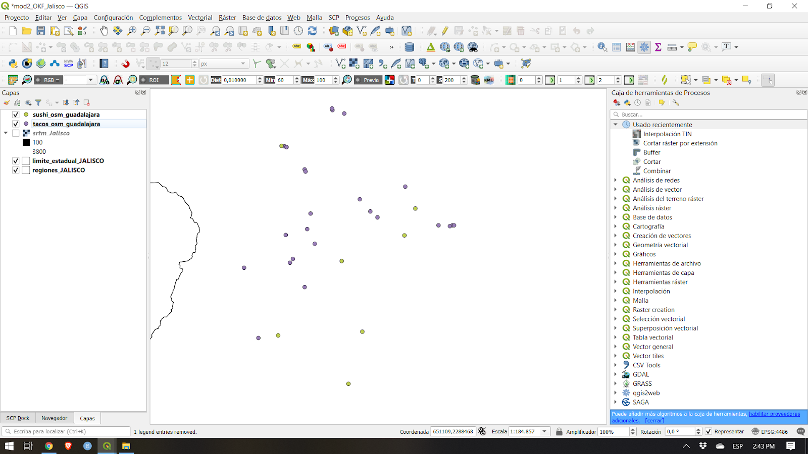

Figura 16. Panel de Capas con todas las capas cargadas

El lienzo del mapa debería verse así:


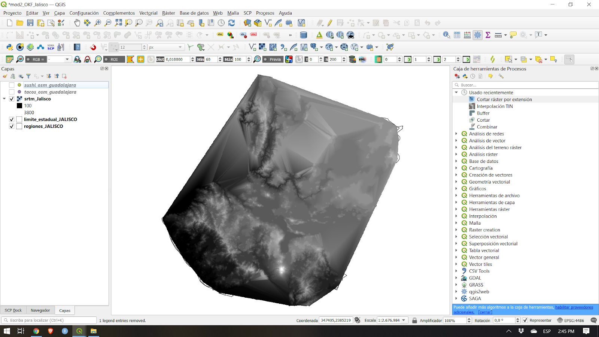

Figura 17. Interfaz QGIS con todas las capas cargadas

Puedes reacomodar las capas como quieras en el Panel de Capas.


#### **Conectando QGIS a Servicios Remotos**

Además de los archivos vector y ráster, QGIS también puede conectarse a servicios remotos como servicios tile, servicios web OGC (WMS, WFS) e incluso servicios web ESRI ArcGIS. Esta conexión se puede crear desde el Navegador o el Administrador de Fuentes de Datos.


#### **Ejercicio 02.2: Conectando a XYZ tiles**

XYZ tiles se utilizan generalmente como mapas base y no solo en aplicaciones de escritorio, sino más comúnmente en aplicaciones web.

Para conectarte a un servidor tile:

1. Ve al **Navegador**
2. **Clic derecho en XYZ Tiles ‣ Conexión nueva** 
3. Agrega lo siguiente:

```
    Nombre: Capa Base Argenmap
    URL: http://wms.ign.gob.ar/geoserver/gwc/service/tms/1.0.0/capabaseargenmap@EPSG%3A3857@png/%7Bz%7D/%7Bx%7D/%7B-y%7D.png
```
4. Click Aceptar.


Figura 18. Agregando una conexión XYZ en QGIS

5. Esto debería agregar el ítem Capa Base Argenmap debajo de XYZ Tiles en el Navegador.


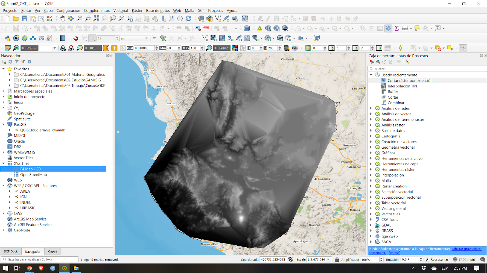

Figura 19. Capa Base Argenmap agregado al Navegador

6. Puedes cargar la capa XYZ tile como lo harías con cualquier otra capa del Navegador.


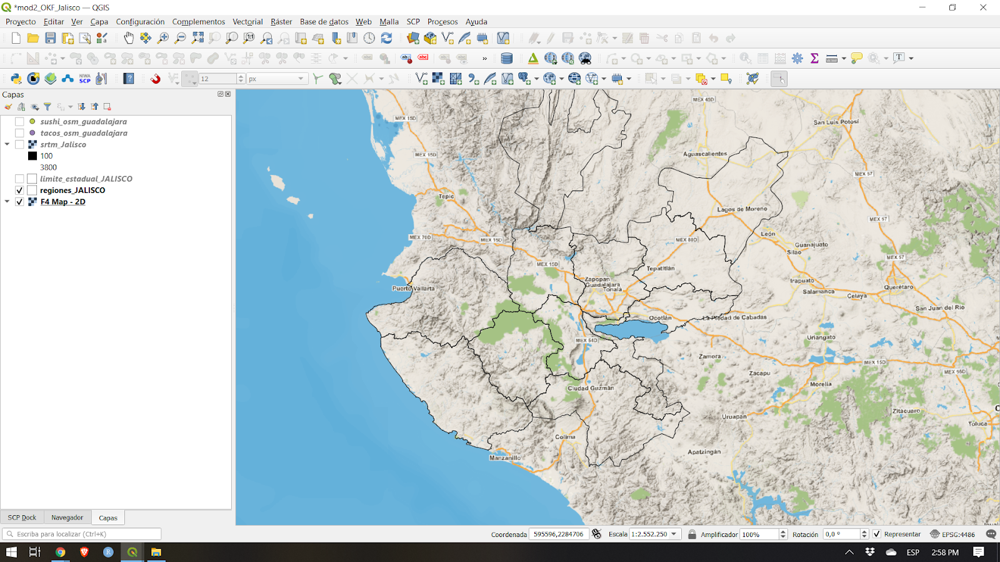

Figura 20. Capa Base Argenmap cargado en QGIS

**BONUS: **Si quieres agregar varios mapas base bajo XYZ Tiles en el Navegador, puedes seguir las instruccones en esta publicación: [https://mappinggis.com/2018/03/como-anadir-mapas-base-en-qgis-3-0-openstreetmap-google-carto-stamen/](https://mappinggis.com/2018/03/como-anadir-mapas-base-en-qgis-3-0-openstreetmap-google-carto-stamen/) 

**BONUS #2:**

Puedes agregar las URLs de los servidores tile que se encuentran en el sitio Leaflet Providers ([https://leaflet-extras.github.io/leaflet-providers/preview/](https://leaflet-extras.github.io/leaflet-providers/preview/)) como XYZ Tiles en el Navegador. 


#### **Ejercicio 02.3: Conectando a WMS/WMTS y WFS**

WMS o Web Map Service es un estándar de servicio web del Consorcio Geoespacial Abierto (OGC) ([https://www.ogc.org/](https://www.ogc.org/)) para el servicio de imágenes (mosaicos ráster) a través de Internet. Cuando los datos se sirven a través de WMS, el usuario no puede editar directamente la información que se encuentra debajo ni cambiar su estilo.

Mientras tanto, WFS o Web Feature Services es otro servicio web compatible con OGC para ofrecer características (vectores) a través de Internet. Cuando los datos se entregan a través de WFS, el usuario tiene acceso a los atributos y la geometría subyacentes, lo que le permite diseñar, editar y usar la capa para el análisis vectorial.

Para conectarse a un WMS:

1. Ve al **Navegador**
2. **Clic derecho en WMS/WMTS ‣ Conexión Nueva** 
3. Agrega lo siguiente:

```
    Nombre: Estatus Hídrico Percentil del API semanal
    URL: https://geoservicios2.conae.gov.ar/geoserver/EstatusHidrico/wms
```
3. Haz clic en Añadir


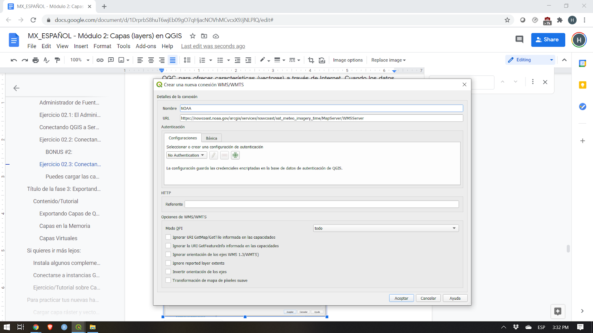

Figura 21. Creando una nueva conexión WMS/WMTS 

4. Esto debería agregar el ítem Estatus Hídrico debajo de las conexiones WMS/WMTS y OWS en el Navegador.


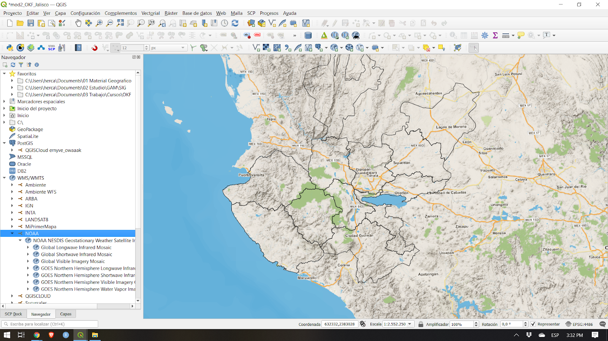

Figura 22. El WMS Estatus Hídrico agregado al Navegador

5. Puedes cargar las capas WMS como lo harías con cualquier otra desde el Navegador.


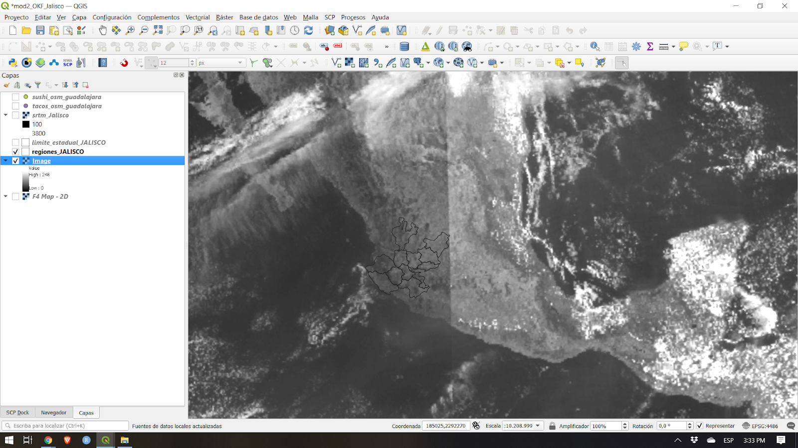

Figura 23. Mapa de Estatus Hídrico de WMS cargado en QGIS

6. Para conectar a WFS, sigue el mismo procedimiento


#### **Preguntas de evaluación**

1. Verdadero o falso:

    1. Solo puedes cargar archivos locales en QGIS


### Título de la fase 3: Exportando Capas, Capas en la Memoria (Temporales), Capas Virtuales

#### **Exportando Capas de QGIS**

Exportar capas (o guardar capas como archivos) es bastante sencillo en QGIS.** Simplemente haz clic derecho en la capa ‣ Exportar** para ver las opciones de exportación.


Figura 24. Exportando una capa de QGIS

*   **Guardar objetos como…** te permite guardar la capa ráster o vectorial.

    *   Cuando un **filtro** está activo en la capa vectorial, sólo las características filtradas (aquellas que aparecen en el lienzo del mapa) son exportadas.
    
*   **Guardar objetos seleccionados como...** es una opción para guardar sólo las características seleccionadas en las capas vectoriales.
*   **Guardar como archivo de definición de capa… **crea un archivo QLR (ver Módulo 1, Formatos de Archivos QGIS) para la capa
*   **Guardar como archivo de estilo de capa de QGIS… **guarda un archivo QML (ver Módulo 1, Formatos de Archivos QGIS) para la capa

Al exportar una capa, QGIS te da la opción de seleccionar el formato de archivo de salida, los campos a incluir (si es un archivo vectorial), el sistema de referencia de coordenadas de salida y otras opciones. Esto significa que puedes realizar una proyección de coordenadas exportando una capa.


Figura 25. Cuadro de diálogo guardar la capa vectorial

Para obtener más información sobre cómo guardar una capa de un archivo existente, visita: [https://docs.qgis.org/3.16/en/docs/user_manual/managing_data_source/create_capas.html#save-capa-from-an-existing-file](https://docs.qgis.org/3.16/en/docs/user_manual/managing_data_source/create_layers.html#save-layer-from-an-existing-file)


#### **Capas en la Memoria**

A veces, no necesitamos ni queremos guardar físicamente las capas que usamos en nuestro análisis en nuestras computadoras, especialmente si son solo temporales.

QGIS comprende esto y permite a los usuarios crear **capas temporales**. Estos se pueden usar de manera similar a los capas vectoriales normales, pero no es necesario guardarlos permanentemente en un archivo en nuestras unidades de almacenamiento porque QGIS las almacena en la memoria o RAM. Los capas temporales se muestran en el Panel de Capas con este ícono .

Los outputs (salidas) de los algoritmos de procesamiento se almacenan como capas temporales de forma predeterminada.

La desventaja es que QGIS "olvida" estas "capas in memory" cuando se cierra. Para remediar esto, podemos usar el complemento Memory Layer Saver para permitir que nuestras capas temporales sean persistentes. Al guardar un proyecto QGIS que usa capas temporales, es una buena práctica ejecutar / activar primero el complemento Memory Layer Saver. Para usar el complemento Memory Layer Saver, simplemente vaya a Complementos ‣ Memory Layer Saver antes de guardar y cerrar tu proyecto QGIS. La próxima vez que abras tu proyecto QGIS, las capas temporales (o capas en la memoria) aún deberían estar presentes.

Por supuesto, también puedes hacer que la capa temporal sea permanente exportando la capa a un archivo. Haciendo clic en el ícono  automáticamente abrirás un cuadro de diálogo de exportación.


#### **Capas Virtuales**

Una capa virtual es un tipo especial de capa vectorial que se crea "sobre la marcha" como resultado de una consulta o datos de otra capa.

Por ejemplo, podemos crear una capa virtual que crea un búfer alrededor de otra capa de entidades. Siempre que se agregue una nueva entidad a la capa de entidades de origen, la capa virtual se actualizará en consecuencia.

Actualmente, las capas virtuales no parecen funcionar con las capas de origen en la memoria.

Las capas virtuales son dinámicas. Esto significa que cuando se actualiza la capa base, el virtual también se actualiza. Esto puede ahorrar espacio y reducir la duplicación de datos, ya que los datos del virtual simplemente obtendrán datos de la capa base sin necesidad de guardar nada en su disco, aunque puede haber una sobrecarga de rendimiento si se utilizan consultas u operaciones complejas para definir el virtual.

Se utilizan construcciones similares a SQL para definirlo.

Las capas virtuales dependen de otras capas, por lo que es importante que las capas base no se muevan ni se les cambie el nombre.

Cuando se actualiza la capa base, debe actualizar la visualización del mapa haciendo un barrido o haciendo zoom en el mapa para mostrar la actualización de la capa virtual.

#### **Preguntas de evaluación**

1. Verdadero o Falso:

    1. Cuando se exporta una capa vectorial, se puede seleccionar en qué formato de archivo guardarlo.
    2. Las capas temporarias siempre son olvidadas por QGIS cuando se cierra.
    3. Cuando la capa base para una capa virtual se actualiza, la capa virtual se actualiza automáticamente en el lienzo del mapa sin necesidad de que hagas nada.


### Si quieres ir más lejos:  

#### **Instala algunos complementos que sirven como fuentes de datos (data sources)**

Algunos complementos proporcionan la funcionalidad para cargar datos en QGIS. Estos incluyen datos vectoriales, imágenes de satélite, archivos ráster, mapas base, etc. Intenta instalar los siguientes y descubre qué tipo de datos cargan en QGIS:

*   QuickOSM ([https://complementos.qgis.org/complementos/QuickOSM/](https://plugins.qgis.org/plugins/QuickOSM/))
*   SRTM-Downloader ([https://complementos.qgis.org/complementos/SRTM-Downloader/](https://plugins.qgis.org/plugins/SRTM-Downloader/))
*   QuickMapServices ([https://complementos.qgis.org/complementos/quick_map_services/](https://plugins.qgis.org/plugins/quick_map_services/))

P.D. Algunos de estos complementos requieren que te hagas una cuenta en el proveedor de datos. 


#### **Conectarse a instancias GeoNode**

GeoNode ([https://geonode.org/](https://geonode.org/)) es un sistema de gestión de contenido geoespacial de código abierto construido con un stack maduro de FOSS4G que incluye PostGIS, GeoServer, MapStore, etc. Puedes pensar en GeoNode como un portal de datos geoespaciales. Puedes conectar fácilmente QGIS a una instancia de GeoNode a través del conector GeoNode en el Navegador o en el Administrador de Fuentes de Datos.

1. Ve al **Navegador**
2. Clic derecho en **GeoNode ‣ Conexión Nueva**
3. Agrega lo siguiente:

``` 
    Name: IDE del Conurbano - UNGS
    URL: [http://ideconurbano.ungs.edu.ar/](http://ideconurbano.ungs.edu.ar/) 
```


Puedes aprender más sobre conectar QGIS a servicios remotos en: [https://mappinggis.com/2015/09/como-conectar-con-servicios-wms-y-wfs-con-arcgis-qgis-y-gvsig/](https://mappinggis.com/2015/09/como-conectar-con-servicios-wms-y-wfs-con-arcgis-qgis-y-gvsig/) 


#### **Ejercicio/Tutorial sobre Capas Virtuales**

1. Abre QGIS.
2. Carga una imagen o un mapa base de satélite a través de XYZ tiles o el complemento QuickMap Services (por ejemplo, Google Satellite).
3. Crea un nuevo capa geopackage con  en la Barra de Herramientas Administrador de Fuentes de Datos. Nómbrala arboles, agrega el radio (número entero) y campos de especie (texto), y usa un CRS proyectado (e.g. EPSG:3857)


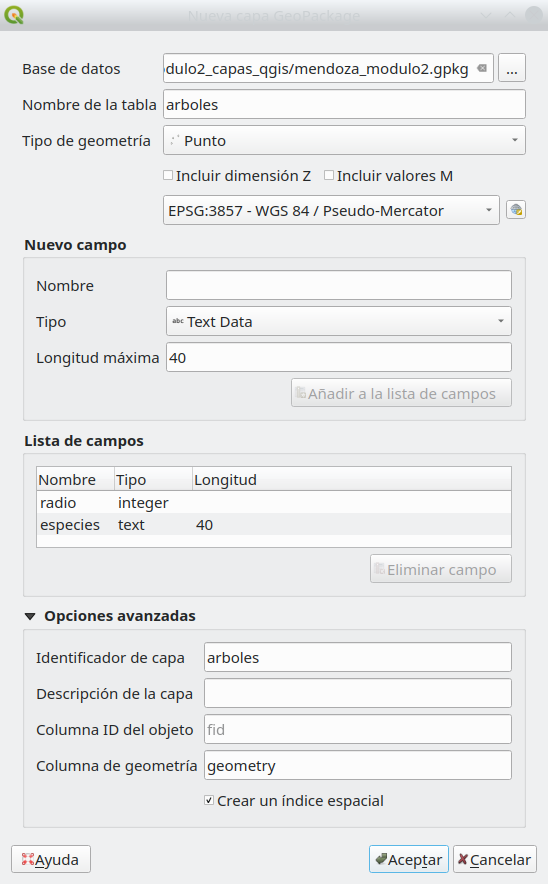

Cuando aparezca un cuadro de diálogo diciendo que el archivo ya existe, seleccione Agregar nueva capa.

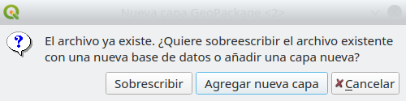

4. Alterna la edición en el archivo haciendo clic derecho sobre él  ‣ Alternar Edición o haciendo clic en  en la Barra de Herramientas de Digitalización.
5. Selecciona un área en la imagen de satélite que tenga árboles.
6. Con Edición, habilita agregar puntos a la capa haciendo clic en  (CTRL + .).
7. Digitaliza árboles individuales haciendo clic en su ubicación y agregando la información del atributo. Haga esto para 4 árboles. Para este ejercicio, puedes adivinar la información.


8. Después de agregar los puntos, no olvides guardar tus ediciones haciendo clic en  en la Barra de Herramientas de Digitalización antes de apagar la función Edición.

 added]")

9. Agrega una capa virtual haciendo clic en   en la Barra de Herramientas Administrador de Fuentes de Datos.
10. Cambia el nombre de la Capa a capa_arboles. Importa arboles. Agrega la siguiente consulta: 

```
select fid, buffer(geometry, radio), especies from arboles
```


Agrega un nuevo punto y luego actualiza la visualización del mapa (haciendo zoom o desplazando el lienzo del mapa) para ver la actualización en la capa virtual. ¿Qué notaste?


### Para practicar tus nuevas habilidades, intenta…

#### **Cargar capa ráster y vectorial que hayas encontrado en internet**

Además de los archivos binarios locales (vectores, raster), QGIS también puede cargar vectores y raster que se encuentran en Internet. Usa el Administrador de Fuentes de Datos para cargar los datos desde la siguiente URL:

[https://raw.githubusercontent.com/benhur07b/stomp-covid19-data/master/spatial/stompcovidph_regions.geojson](https://raw.githubusercontent.com/benhur07b/stomp-covid19-data/master/spatial/stompcovidph_regions.geojson)


#### **Cargar una Hoja de cálculo en QGIS usando el complemento Hoja de cálculo de Capas **

Instala el complemento Hoja de cálculo de Capas e intenta cargar una hoja de cálculo en QGIS. El complemento acepta archivos con el formato Open Document Standard (.ods) y Microsoft Excel (.xls, .xlsx).

Lee aquí: [https://bnhr.xyz/2018/07/27/plugin-fridays-spreadsheet-layers-plugin.html](https://bnhr.xyz/2018/07/27/plugin-fridays-spreadsheet-layers-plugin.html)


### Tips 

1. Si en algún momento necesitas una capa de un mapamundi, intenta escribir **“world” **(mundo) en la Barra de Coordenadas de la Barra de Estado. ¿Qué sucede? Este es solo uno de los easter eggs (sorpresas) que se encuentran en QGIS cuando escribe ciertas palabras en la barra de coordenadas.
