# Módulo 5: Creación de mapas

**Autor:** Ketty, Ben Hur

**Traductora**: Malena

## Introducción Pedagógica

Este módulo le proporcionará una descripción general de los pasos comunes necesarios para completar un mapa en QGIS. Al final del módulo, los participantes conocerán los siguientes conceptos;

*   Lienzo del mapa y capas relacionadas
*   El diseño de impresión y el diseño de impresión
*   Elementos y propiedades del mapa

Además, habrá aprendido las siguientes habilidades;

*   Usar el diseño de impresión para hacer un mapa
*   Agregar elementos del mapa al mapa
*   Administrar diferentes diseños de impresión

## Herramientas y recursos necesarios

*   Computadora de trabajo
*   Acceso a Internet
*   QGIS 3.16 o posterior
*   Capa límite administrativa de Santa Fe, Argentina (dentro del modulo5.gpkg)
*   Clínicas de Santa Fe, Argentina (dentro del modulo5.gpkg)
*   Provincias de Argentina (dentro del modulo5.gpkg)
*   Capa de asentamiento de alta resolución de Santa Fe, Argentina

## Prerrequisitos

*   Conocimientos básicos de operación de una computadora
*   Comprensión de todos los módulos anteriores

## Recursos adicionales

*   QGIS Map LayOut - [https://docs.qgis.org/3.16/en/docs/training_manual/map_layout/ map_layout.html](https://docs.qgis.org/3.16/en/docs/training_manual/map_layout/map_layout.html)
*   Plantillas de diseño - [https://layout-hub.github.io/](https://layout-hub.github.io/)
*   Administrador de estilos - [https://docs.qgis.org/3.16/en/docs/user_manual/style_library/style_manager.html](https://docs.qgis.org/3.16/en/docs/user_manual/style_library/style_manager.html)
*   Biblioteca de estilos - [https: / /docs.qgis.org/3.16/en/docs/user_manual/style_library/index.html](https://docs.qgis.org/3.16/en/docs/user_manual/style_library/index.html)

## Introducción temática

Comencemos con un ejemplo:

Para hacer un mapa, necesitará un tema que tal vez desee comprender mejor, por ejemplo, 'Distribución espacial de hospitales en la provincia de Santa Fe, Argentina. Notará que el tema proporciona tanto un tema para explorar como la ubicación geográfica. Armado con esta información y los datos relevantes que le permiten explorar más la pregunta, puede proceder a hacer un mapa.

### Desglose de los conceptos

Este módulo se centrará en los siguientes conceptos clave para la elaboración de mapas; el lienzo del mapa y las capas relacionadas, el diseño de impresión y los elementos y propiedades del mapa. Primero, aquí hay breves definiciones de cada uno;

*   **el lienzo del mapa y las capas relacionadas**: es probablemente el widget más importante dentro de QGIS porque muestra el mapa compuesto por capas de mapa superpuestas y permite la interacción con el mapa y las capas. Esto se trata en el Módulo 0: Introducción a QGIS
*   **el diseño de impresión**: proporciona un diseño creciente y capacidades de impresión. Le permite agregar elementos como el lienzo del mapa QGIS, etiquetas de texto, imágenes, leyendas, barras de escala, formas básicas, flechas, tablas de atributos y marcos HTML. Con el diseño de impresión puede crear mapas y atlas agradables que se pueden imprimir o guardar como archivo PDF, una imagen o un archivo SVG. Esta es una forma poderosa de compartir información geográfica producida con QGIS que se puede incluir en informes o publicar. Puede guardar el diseño como plantilla y volver a cargarlo en otra sesión. Finalmente, la generación de varios mapas basados ​​en una plantilla se puede hacer a través del generador de atlas. La siguiente imagen muestra el diseño de impresión y la interfaz de diseño de impresión. Esta interfaz se abre cuando abre un nuevo diseño de impresión.

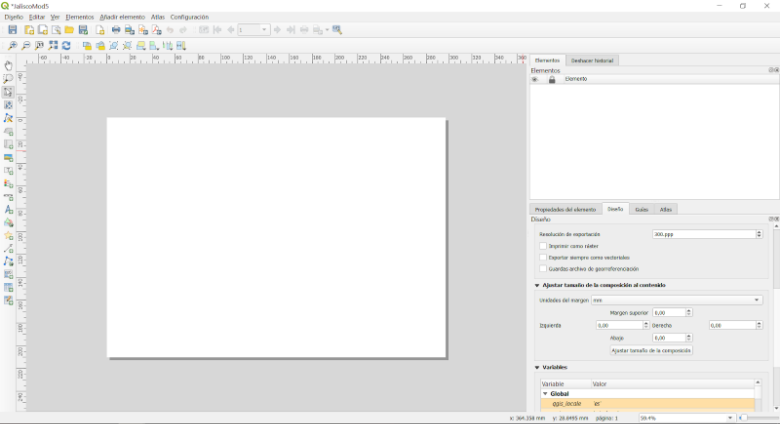

Figura 5.1:diseño de impresión

*   **Elementos y propiedades**: Los mapas contienen mucha información. La mayoría de los mapas tendrán las siguientes cinco cosas: un título, una leyenda, una cuadrícula, una rosa de los vientos para indicar la dirección y una escala. El título le dice lo que se representa en el mapa

## Contenido principal

### Título de la fase 1: Exportar el lienzo del mapa

En este tutorial, mostraremos dos formas de 'Exportar el lienzo del mapa' al diseño de impresión de QGIS. El primer método es sencillo, mientras que el segundo explora las capacidades más avanzadas proporcionadas por el diseño de impresión.

#### **Primer método: Exportar el lienzo del mapa sin el diseño de impresión.**

1. Las capas de datos ya deberían estar agregadas al lienzo de QGIS. A continuación, se pueden aplicar estilos a las capas para comunicar información en sus datos. Agregue decoraciones de mapa haciendo clic en Ver ‣ Decoraciones. Seleccione su decoración de mapa preferida. Por ejemplo, puede agregar la etiqueta de título, la barra de escala y la etiqueta de copyright. Para cada decoración, deberá especificar la configuración en un cuadro de diálogo.
2. El último paso es exportar el mapa a formato de imagen o pdf. Para hacer esto, haga clic en Proyecto ‣ Importar / Exportar y luego seleccione su formato de exportación preferido. Debería aparecer el siguiente diálogo de exportación.

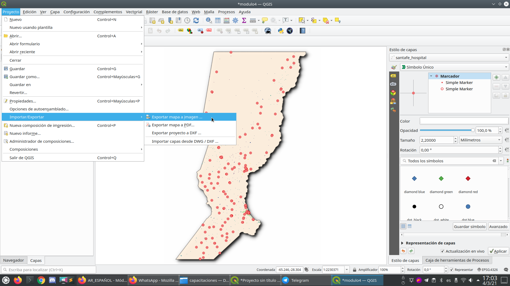

Figura 5.2: Exportación del mapa

3. Haga clic en Guardar. El mapa en el lienzo de QGIS se guardará como un documento PDF o de imagen. Busque la ubicación donde se guarda el archivo y ahora puede imprimir o compartir el mapa.

Figura 5.3: Lienzo del mapa exportado como imagen

#### **Segundo método: Exportar el lienzo del mapa al diseño de impresión**

1. En este tutorial, crearemos un mapa que muestre 1.) la ubicación de los centros de salud y 2.) la densidad de población de la provincia de Santa Fe, Argentina. Las capas de datos ya deberían estar agregadas al lienzo de QGIS. A continuación, se pueden aplicar estilos a las capas para comunicar información en sus datos.

Figura 5.4: Creación de un nuevo diseño de impresión

2. El lienzo del mapa ahora se puede exportar al diseño de impresión. Haga clic en el "botón de nuevo diseño de diseño de impresión" . Se puede acceder a esto a través de la barra de herramientas. Alternativamente, acceda usando la barra de menú 'Proyectos'. Se abrirá un cuadro de diálogo de título que le pedirá que escriba el título del Diseño de impresión. Escriba 'Santa Fe' y haga clic en Aceptar.

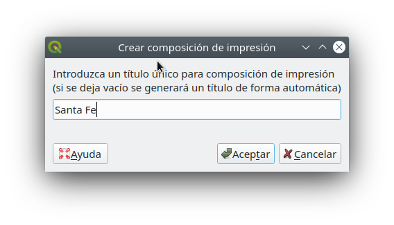

Figura 5.5: Nombrar el diseño de impresión 

3. Se abrirá el diseño de impresión.

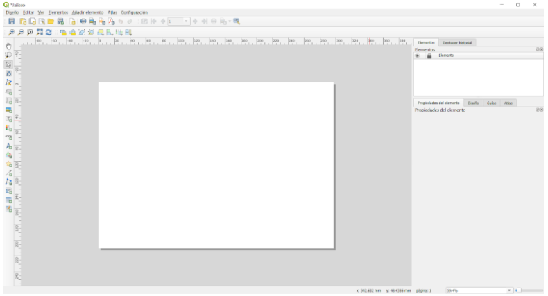

Figura 5.6: La ventana Diseño de impresión

4. Notará que el lienzo de diseño de impresión está vacío. Para agregar el mapa con estilo del lienzo de QGIS, haga clic en el botón 'Agregar nuevo mapa al diseño' , haga clic con el botón izquierdo del mouse y dibuje un rectángulo en el espacio en blanco en el centro del diseño de impresión. Debe agregarse el mapa. Acaba de exportar un mapa al diseño de impresión. Ahora es posible agregar todos los demás elementos del mapa como el título, la leyenda, las cuadrículas, etc.

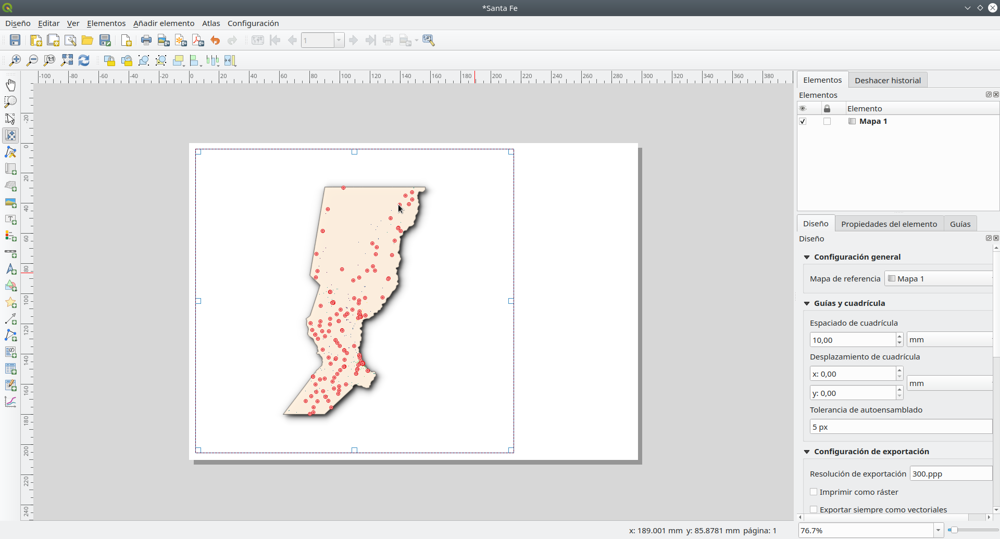

Figura 5.7: Agregar mapa al diseño de impresión

#### **Preguntas de evaluación**

1. ¿Qué es el lienzo del mapa QGIS? (casillas de verificación)
2. ¿Cuál es el uso del diseño de impresión? (casillas de verificación)
3. ¿Cuál de los siguientes no es un elemento de mapa? (botón de radio)

#### **Respuestas**

1. a. muestra el mapa compuesto por capas de mapas superpuestas 

   b. permite la interacción con el mapa y las capas 

   c. un widget para hacer mapas

2.  a. proporciona capacidades crecientes de diseño e impresión 

    b. le permite agregar elementos de mapa 

    c. manejar tanto la exportación como la impresión de mapas

3.  a. Título 

    b. Escala 

    c. Leyenda 

    d. Colores y diseños

### Título de la fase 2: Adición y edición de elementos del mapa al diseño de impresión

#### **Contenido / Tutorial**

Ahora que el mapa con estilo se ha agregado al diseño de impresión, es el momento de agregar los elementos del mapa relevantes como el título, escala, leyenda, cuadrícula, metadatos, etc. al diseño de impresión. La mayoría de los botones se encuentran a la izquierda del diseño de impresión.

1. Haga clic en el botón 'Agregar etiqueta' , mantenga presionado el botón izquierdo del mouse y dibuje un rectángulo donde le gustaría colocar el título del mapa. Escriba el título en el menú 'Propiedades principales' en el lado derecho del diseño de impresión. Las propiedades de la fuente se pueden cambiar en el elemento de menú "Apariencia".

Figura 5.8: Agregar título del mapa

2. A continuación, agregaremos la leyenda y la escala. Se puede agregar una declaración de atribución de datos usando el botón 'Agregar etiqueta' Desplácese sobre el botón a la izquierda del diseño de impresión y haga clic en el botón preferido. Siga los mismos pasos que en 1. Arriba para agregar el elemento de mapa al diseño de impresión. Puede agregar otros elementos del mapa, pero tenga cuidado de que el mapa no se abarrote demasiado.

Figura 5.9a: Agregar barra de escala al mapa

Figura 5.9b: Agregar leyenda al mapa

Figura 5.9c: Agregar atribución al mapa

3. Si el diseño del mapa es satisfactorio, el mapa se puede exportar como pdf, png, jpeg o svg, listo para imprimir de lo contrario, guarde el diseño. Se puede acceder a todas las funciones de guardado a través del menú "Diseño".

4. Guarde el mapa como una imagen usando a través de Diseño ‣ Exportar como imagen ... o haciendo clic en el botón Exportar como imagen 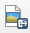. QGIS le preguntará en qué archivo guardar el mapa, así como los parámetros de la imagen.

Figura 5.10: Agregar atribución al mapa

Figura 5.11: Mapa exportado como imagen

#### **Preguntas de evaluación**

1. ¿Bajo cuál de las siguientes pestañas puede cambiar las propiedades de los elementos del mapa? (botón de radio)
2. ¿Cuál es la diferencia entre el diseño de impresión y el diseño de impresión?
3. ¿Cómo puede agregar texto de atribución al diseño del mapa?

#### **Respuestas**

1.  a. Composición 

    b. Propiedades del artículo 
    
    c. Generación de Atlas

2. El diseño de impresión le permite agregar mapas desde el lienzo del mapa, mientras que el diseño de impresión le permite componer su mapa.
3. Agregue un cuadro de título y luego escriba el texto de atribución. Tenga en cuenta que el cuadro de título le permite agregar todas las formas de texto a su mapa.

### Título de la fase 3: Automatización de la creación de mapas con las capacidades de Atlas

#### **Contenido / Tutorial**

Si su organización publica mapas impresos o en línea, a menudo necesitará crear muchos mapas con la misma plantilla, generalmente uno para cada unidad administrativa o región de interés. La creación manual de estos mapas puede llevar mucho tiempo y si desea actualizarlos de forma regular, puede convertirse en una tarea ardua. QGIS tiene una herramienta llamada Atlas que puede ayudarle a crear una plantilla de mapa y publicar fácilmente una gran cantidad de mapas para diferentes regiones geográficas. Tomaremos las diferentes provincias de Argentina como ejemplo, aquí están los límites administrativos para las 24 provincias;

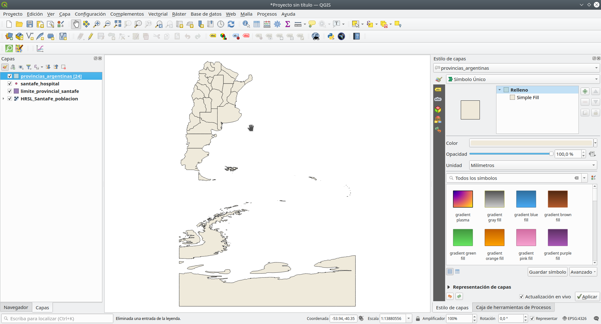

Figura 5.12: Capa de cobertura

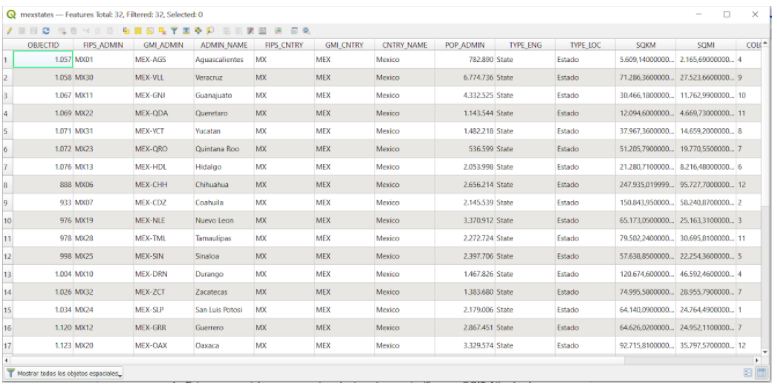

Figura 5.13: Tabla de atributos

1. Esta capa servirá como capa de cobertura, lo que significa que QGIS Atlas hará 1 mapa para cada una de las características en esta capa de cobertura. En total, se generarán 24 mapas.

2. Abra o cree un nuevo diseño de impresión y agregue un mapa.

Figura 5.14: Diseño de impresión Atlas

3. En el panel derecho del Diseño de impresión, asegúrese de seleccionar el menú Atlas y marcar la casilla Generar un atlas. También puede abrir la Configuración de Atlas usando el botón Configuración de Atlas  en la barra de herramientas de Atlas.

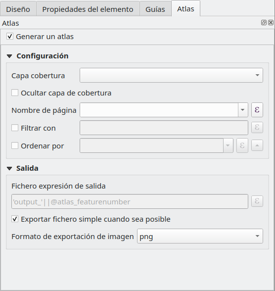

Figura 5.15: Generación de Atlas

4. El siguiente paso es elegir la capa de cobertura; La capa de cobertura es la capa de índice utilizada para crear cada página. Se generará un mapa / página para el Atlas para cada característica en la capa de cobertura. En nuestro caso, el uso de la capa de cobertura provincias_argentinas creará un mapa para cada una de las 81 provincias. QGIS Atlas cambia dinámicamente la extensión de la vista de cada característica en la capa de cobertura. Puede optar por ocultar la capa de cobertura en los mapas que cree (es decir, la capa de cobertura no será visible en el Diseño de impresión) y seleccionar el nombre de cada página de su Atlas. También puede realizar algún filtrado y clasificación de la capa de cobertura si es necesario. Para la Salida, puede optar por tener un solo archivo como salida marcando la casilla de verificación Exportar archivo Singe cuando sea posible. Si no está marcado, generará 1 archivo por mapa.

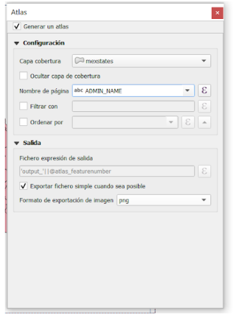

Figura 5.16: Seleccione la capa de cobertura

5. Ahora que hemos configurado la capa de cobertura, debemos decirle al Diseño de impresión que use el atlas para controlar la extensión de los mapas (área visible en el mapa imprimible) que generaremos. En la pestaña Propiedades del elemento, marque la casilla Controlado por Atlas

Figura 5.17: Asegúrese de que la extensión del mapa esté controlada por el Atla

6. Para obtener una vista previa de su Atlas, haga clic en el botón Vista previa del Atlas  en la barra de herramientas Atlas. Esto le mostrará los 81 mapas que generó. Utilice la barra de herramientas de Atlas 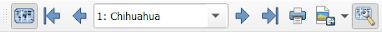 para navegar por los mapas de Atlas.

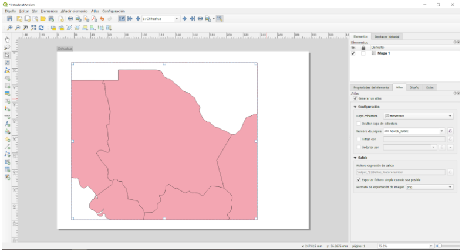

Figura 5.18: Vista previa de Atlas

7. Puede exportar los mapas de Atlas mediante el botón Exportar Atlas,  ya sea como imágenes o PDF. Seleccione Exportar Atlas como imagen. Debería tener 24 mapas generados donde cada mapa muestra la extensión de la provincia.

Figura 5.18: Resultados de Atlas

8. **SUGERENCIA**: Para este ejemplo, solo mapeamos la capa de cobertura. El poder del Atlas es cuando mapeamos varias capas. Por ejemplo, tenemos las clínicas, la red de carreteras y los datos de densidad de población de todo el país cargados como capas en QGIS. Luego, querríamos crear un mapa para cada una de las provincias que muestre estas mismas capas. El uso del Atlas nos obligaría a crear solo una plantilla de diseño y dejar que Atlas maneje la generación de los otros mapas en función de la capa de cobertura que utilicemos.

9. **SUGERENCIA**: Puede usar las expresiones QGIS y las anulaciones definidas por datos para configurar los otros elementos del mapa en su Atlas para que también cambien dinámicamente según la característica de la capa de cobertura que se está mapeando. Por ejemplo, puede usar una expresión QGIS que llame al valor del campo nam en su etiqueta para que cambie dinámicamente al valor de nam para la característica actual que se está mapeando.

Para obtener más información sobre QGIS Atlas, consulte: [https://www.youtube.com/watch?v=tOnMJBUvEjY](https://www.youtube.com/watch?v=tOnMJBUvEjY).

#### **Preguntas de evaluación**

n / a

#### **Respuestas**

n / a

