# Módulo 8 - Procesamiento y análisis de vectores

Autor: Codrina

## Introducción pedagógica

Este módulo se centra en un tipo específico de modelo de datos geográficos: geodatos vectoriales.

Al final de este módulo, los alumnos tendrán la comprensión básica de los siguientes conceptos:

*   modelo de datos vectoriales
*   metadatos
*   procesamiento de vectores
*   análisis de datos espaciales
*   geoestadística
*   topología
*   geoprocesamiento

También adquirirán las siguientes habilidades:

*   Verificación de la calidad del conjunto de datos vectoriales geométricos usando algoritmos para verificar la topología de datos vectoriales y realizar correcciones automáticas básicas;
*   Trabajar con algoritmos para identificar errores en la tabla de atributos;
*   Procesamiento de datos vectoriales: ¿ejecutar algoritmos de geoprocesamiento simples para responder a los requisitos potenciales, como cuántos edificios públicos hay en mi región administrativa?
*   Procesamiento de datos vectoriales: uso de algoritmos geoestadísticos para completar los datos faltantes.


## Herramientas y recursos necesarios

*   Este módulo se ha preparado utilizando [QGIS versión 3.16 - Hannover](https://qgis.org/en/site/forusers/download.html)
*   module8.gpkg which contains the following layers:
    *   pois (point)
    *   pofw (point)
    *   road (line)
    *   waterways (line)
    *   buildings (polygon)
    *   landuse (polygon)
    *   admin_boundary (polygon)
*   El sistema de referencia de coordenadas utilizado es el PRS92 / Filipinas zona 3, EPSG 3123. Al ser un sistema de coordenadas proyectadas, permite cálculos geométricos.


## Requisitos previos

*   Conocimientos básicos de funcionamiento de una computadora
*   Una sólida comprensión de los módulos 0, 1 y 2 y 6 de este plan de estudios. El módulo 0 introduce la noción de modelo de datos vectoriales que es el núcleo de esta sección actual. La comprensión previa de los módulos 1, 2 y 6 le permite concentrarse estrictamente en las nuevas nociones y funcionalidades de QGIS introducidas en esta nueva sección, sin tener que preguntarse cómo podría cargar una nueva capa en su proyecto o cómo trabajar con la tabla de atributos de su conjunto de datos.

Como parte de este módulo, aprenderá a trabajar de manera eficiente con conjuntos de datos geográficos vectoriales para poder extraer nueva información. Esto incluye una comprensión más profunda de qué son los datos vectoriales, qué estándares de calidad deben cumplir para que sean realmente útiles, cuáles son las operaciones más comunes que se realizan con datos vectoriales (geoprocesamiento, geoestadística).


## Recursos adicionales:

*   [https://docs.qgis.org/3.16/en/docs/user_manual/working_with_vector/functions_list.html](https://docs.qgis.org/3.16/en/docs/user_manual/working_with_vector/functions_list.html)
*   [http://www.geo.hunter.cuny.edu/~jochen/gtech361/lectures/lecture12/concepts /01%20What%20is%20geoprocessing.htm](http://www.geo.hunter.cuny.edu/~jochen/gtech361/lectures/lecture12/concepts/01%20What%20is%20geoprocessing.htm)
*   [Enciclopedia de SIG, Edición 2017, Editores: Shashi Shekhar, Hui Xiong, Xun Zhou](https://link.springer.com/referencework/10.1007/978-3-319-17885-1)
*   [Metadata And Catalog Services](https://www.geo-train.eu/modules/metadata/pdf/Metadata.pdf), autora Mariana Belgiu, UNIGIS Salzburg;
*   [Conceptos básicos de metadatos](https://www.fgdc.gov/resources/factsheets/documents/GeospatialMetadata-July2011.pdf) del Comité Federal de Datos Geográficos;


## Introducción temática

Comencemos con un ejemplo: acabas de aterrizar para tu escapada urbana a Guadalajara, México y necesitas ir del aeropuerto a su hotel. No tienes conocimiento de dónde se encuentra el aeropuerto con respecto a la ciudad, ni dónde está el hotel, por lo que lo primero que debes hacer es abrir un mapa que te ayude a navegar por esta nueva y excitante ciudad. Sacas tu teléfono, abres una aplicación de mapas y seleccionas el punto de inicio - el aeropuerto - y el punto final - tu hotel - luego preguntas por la ruta, a pie, en coche o en transporte público. En cuestión de segundos, la aplicación de enrutamiento te ofrece la mejor solución para que puedas ir del punto A al punto B y lo resalta trazando una línea distinta siguiendo las calles y callejones, como se ve en la figura 8.1.

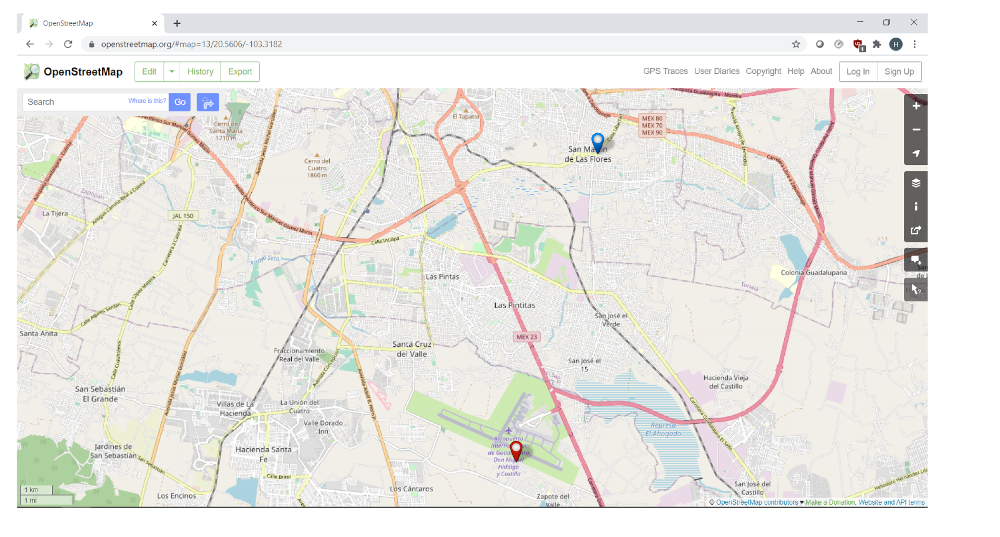

Figura 8.1 - Ir del punto A al B usando Openstreetmap


## Desglose de los conceptos

Este es un ejemplo clásico del uso de datos vectoriales y se divide en varios conceptos que definiremos a continuación.

Los datos utilizados son espaciales: tiene una ubicación muy bien definida en la Tierra, sus atributos también están bien identificados. Por lo tanto, un punto con longitud y latitud y el nombre de atributo = Aeropuerto Internacional de Clark - representa el punto de inicio A y un punto con otro par de longitud y latitud y el nombre de atributo = Hotel Boss representa el punto final B. Las calles están representadas por líneas compuesto por segmentos y vértices (representados por pequeños círculos azules en la figura 8.2), con atributos como nombre, dirección, limitación de velocidad, etc.


Figura 8.2 - Líneas vectoriales que representan calles y la tabla de atributos asociada. Las calles representan un modelo de red que es básicamente una colección de entidades puntuales y lineales topológicamente interconectadas. Los resultados del algoritmo que calcula la ruta del punto A al punto B - en nuestro caso del aeropuerto al hotel - dependen en gran medida de la calidad de los vectores, tanto en geometría - se respetan las reglas de topología - como en atributos - si una carretera es unidireccional y debe indicarse para que la ruta no lo lleve por el camino equivocado.


### El modelo de datos vectoriales

Como se presentó en el módulo 0, hay 2 modelos de datos utilizados en un sistema de información geográfica: SIG: raster y vectorial. Los datos geoespaciales siempre incluyen un componente espacial que indica la ubicación o la distribución espacial del fenómeno en cuestión y un componente de atributo que describe sus propiedades. La elección entre utilizar el modelo de datos ráster o vectorial para una situación particular depende de la fuente de los datos, así como de su uso previsto.

El modelo de datos vectoriales se utiliza para representar áreas, líneas y puntos (Figura 8.3).


Figura 8.3 - Datos vectoriales con tabla de atributos


### Metadatos 

Los metadatos se definen más simplemente como datos sobre datos. Caracterizan, en diferentes niveles de detalle, el conjunto de datos al que están asociados, incluyendo categorías como: quién es el proveedor / propietario del conjunto de datos, cuál es la licencia, en qué idioma están escritos los atributos, cuál era el sistema de coordenadas utilizado, qué área geográfica describe y cuál es el año de referencia, palabras clave, cuáles son las limitaciones conocidas, nivel de precisión, cuál era el alcance original del conjunto de datos y muchos más.

Los metadatos son primordiales porque una comprensión clara de los datos que se utilizarán en un análisis específico puede marcar la diferencia entre una decisión correcta o sesgada. Si uno debe identificar dónde colocar un nuevo hospital temporal, pero los datos de la carretera son antiguos y ya no reflejan la realidad en el sitio, entonces cualquier decisión basada en ellos será inexacta.

Debido a la importancia de los metadatos, sus categorías (sus definiciones, nombre, qué tipo de información pueden almacenar, etc.) siguen estructuras bien definidas y estandarizadas. Estos archivos de metadatos bien estructurados pueden luego integrarse en catálogos dedicados, lo que permite a un usuario buscar y encontrar datos geográficos solo consultando las características que le interesan, sin descargar y analizar los datos por sí misma. Existen numerosos catálogos de metadatos y, cuando están estandarizados, se puede acceder a ellos a través de diferentes funcionalidades dentro del software SIG. Un ejemplo de eso se presentará en el Módulo 9 Complementos de QGIS.

Hay que decir que los metadatos no son una especificidad de los recursos geoespaciales, pero se aplican a cualquier tipo de datos.


### Racionalidad del procesamiento vectorial

El poder de los SIG radica en su capacidad única de conectar propiedades geométricas que definen objetos y fenómenos reales en nuestro mundo y sus atributos - ya sean observados, medidos o calculados - y permitiendo a través de software especializado realizar operaciones en sus geometrías, en sus atributos o ambos para obtener nueva información valiosa.

Aunque en la mayoría de los casos, los SIG están estrechamente asociados con mapas que simplemente muestran información geográfica, sus funcionalidades van mucho más allá de la creación de representaciones cartográficas, ya sean dinámicas o estáticas.

El análisis de datos espaciales (sinónimos: análisis espacial, análisis geoespacial, análisis geográfico, interacción espacial) es un término general que se refiere a cualquier técnica diseñada para identificar patrones, detectar anomalías y probar teorías basadas en datos espaciales. Un análisis es espacial si y solo si los resultados son sensibles a la reubicación de los objetos analizados; en pocas palabras, la ubicación importa. A medida que evolucionó la tecnología de la información, los científicos comenzaron a aplicar diversas técnicas, desde la literatura de estadística, geometría, topología y otras ciencias al análisis de datos geográficos para estudiar patrones y fenómenos en la superficie de la Tierra.

**Geoestadística** es una rama de las estadísticas que se aplica a los datos espaciales. Los métodos empleados más comunes están relacionados con la interpolación, que es un proceso matemático que permite la estimación de valores desconocidos en base a los conocidos.

La topología es una rama de las matemáticas que permite al usuario de SIG controlar las relaciones geométricas entre características y mantener la intecuadrículaad geométrica. La topología se entiende mejor como un conjunto de reglas que aseguran la calidad de los datos espaciales que se pueden aplicar a la misma capa vectorial o más. Las reglas están diseñadas para respetar las relaciones del mundo real que representan las capas vectoriales. Por ejemplo, no puede haber espacios entre los polígonos que representan parcelas catastrales en una región, o ningún punto perteneciente a la capa vectorial que representa árboles individuales no puede estar contenido en ningún polígono de la capa vectorial que representa edificios dentro de una región.

El software SIG ofrece funcionalidades que permiten al usuario definir reglas de topología relevantes, así como algoritmos para verificar si se aplican y limpiar la capa vectorial donde se identifican inconsistencias.

El geoprocesamiento es un término general que se utiliza para definir cualquier operación (proceso) que se aplica a un conjunto de datos geográficos, con el alcance de obtener un conjunto de datos derivado que abre nuevas perspectivas sobre los datos. Las operaciones comunes de geoprocesamiento son la superposición de características geográficas, la selección y análisis de características, el procesamiento de topología y la conversión de datos. El geoprocesamiento permite definir, administrar y analizar información geográfica para respaldar la toma de decisiones.

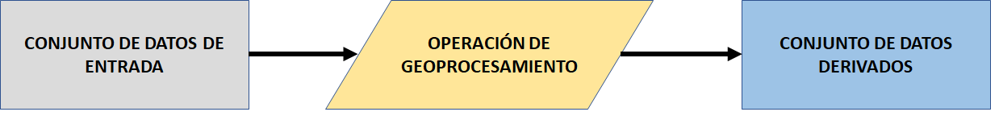

Figura 8.4: elementos de una operación de geoprocesamiento


## Contenido principal:

### Fase 1: Comprensión de sus datos.

Hay muchas operaciones de geoprocesamiento que se pueden realizar en datos vectoriales, entre las que se incluyen la superposición de características geográficas, la selección y análisis de características, el procesamiento de topología y la conversión de datos. En esta primera fase, nos familiarizaremos con algunos de ellos, entendiendo cómo funcionan y qué resultados podemos esperar.


#### Paso 1. Prepare su entorno de trabajo.

Abra QGIS, configure el sistema de referencia de coordenadas en el que trabajará - EPSG 4486 - y agregue las siguientes capas de datos:

*   Polígonos - límites administrativos; edificios; uso del suelo;
*   Líneas: carreteras, ríos;
*   Puntos: lugares de culto, lugares de interés

En este punto, la ventana de su mapa QGIS debería verse como en la figura 8.5, por supuesto, lo más probable es que en otros colores.


Figura 8.5 - Conjuntos de datos vectoriales cargados: puntos, líneas y polígonos

¡Compruebe! Todas las capas están en el mismo sistema de coordenadas (EPSG 4486) mirando en la esquina derecha inferior. Si es así, entonces está viendo 7 capas de datos vectoriales superpuestas.


#### Paso 2. Comprenda lo que está mirando.

En este punto, tenemos 7 capas vectoriales cargadas en nuestro proyecto QGIS. Los próximos pasos nos ayudarán a comprender nuestros datos.

*   Compruebe cuántas características tenemos en una capa; hay varias formas de hacerlo:

    * Haga doble clic en la capa de interés - Propiedades - Información - Recuento de características
    * Abra la tabla de atributos de la capa de interés y observe el lado superior central 

Antes de ejecutar cualquier estadística básica, completemos la tabla de atributos con algunos atributos geométricos (consulte el Módulo 6 para obtener más detalles):

*   Capa de carreteras: calcule la longitud de cada segmento de carretera y almacénela en la tabla de atributos
    *   nombre del campo de salida: longitud
    *   tipo: número decimal
    *   expresión: `round($length, 2)`
*   Capa de edificios: calcula el área de cada edificio y guárdalo en la tabla de atributos
    *   nombre del campo de salida: area
    *   tipo: número decimal
    *   expresión: `round($area, 2)`

Ahora, los campos de atributo están llenos, pero si no está seguro de en qué unidad de medida QGIS ha calculado la longitud de los segmentos de carreteras y las áreas de los edificios, la verificación de la información del sistema de coordenadas podría ayudarte.

Haga clic en la esquina inferior derecha de la ventana del mapa QGIS, en EPSG 3123 y aparecerá una ventana como la de la figura 8.6.

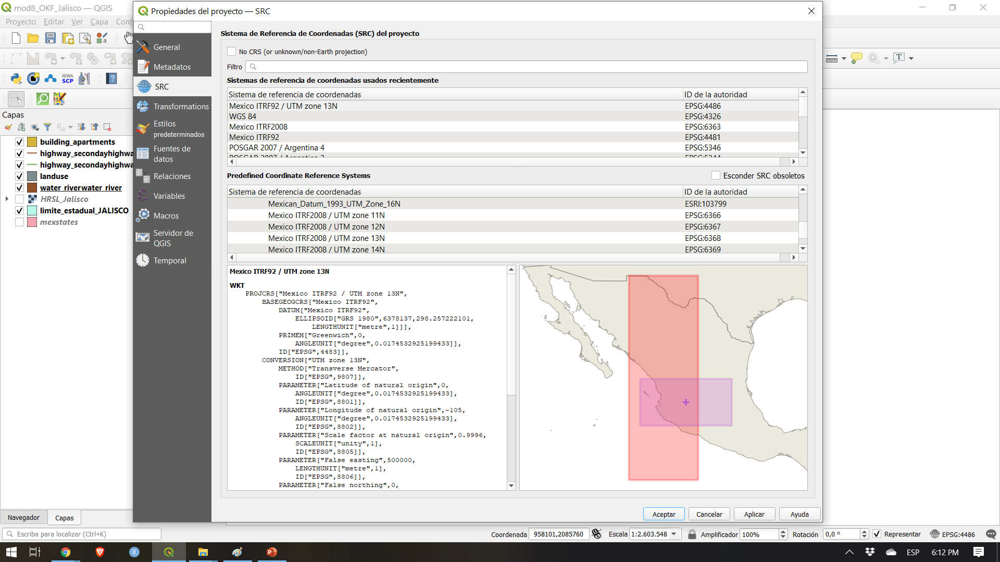

Figura 8.6 - Especificaciones del sistema de referencia de coordenadas utilizado en el proyecto QGIS

Así, encontramos que la unidad de medida es el metro, por lo tanto las longitudes se miden en metros y las áreas en metros cuadrados.

*   Ejecute estadísticas básicas en las capas cargadas para controlar mejor sus datos (figura 8.7):

    * Menú Vector ‣ Menú Herramientas de análisis ‣ Estadísticas básicas para campos
    * Ventana de caja de herramientas de procesamiento ‣ buscar 'estadísticas'

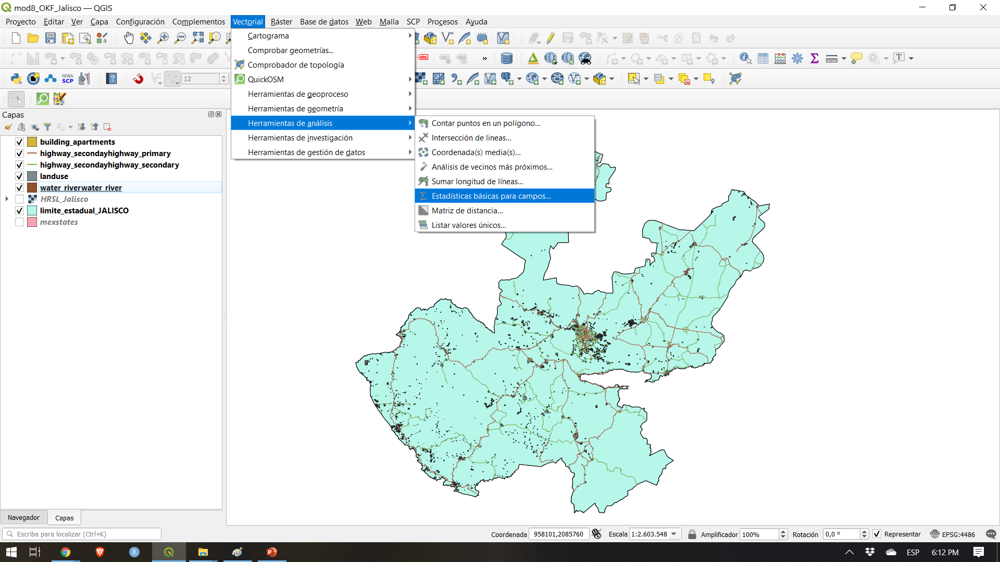

Figura 8.7 - Estadísticas básicas para campos

Las estadísticas devueltas dependen del tipo de campo que elegimos y se generan como un archivo HTML.

Ejecútelo en nuestra capa de carreteras y veamos qué resultados obtenemos. Complete la ventana, como en la figura 8.8.


Figura 8.8 - Preparación para ejecutar estadísticas básicas para la capa de carreteras

El archivo de salida es un html que se puede abrir con cualquier navegador (Firefox, Chrome, Safari, etc.) que debería verse a continuación:


```
Campo analizado: length
Recuento: 2172
Valores únicos: 1850
Valores NULOS (faltan): 0
Valor mínimo: 1.8
Valor máximo: 48165.9
Intervalo: 48164.1
Suma: 3119792.799999998
Valor medio: 1436.3686924493545
Mediana: 205.05
Desviación estándar: 3820.7603167851253
Coeficiente de variación: 2.660013641949971
Minoría (valor más raro presente): 2.0
Mayoría (valor presente con más frecuencia): 16.9
Primer cuartil: 58.85
Tercer cuartil: 844.85
Intervalo intercuartil (IQR): 786.0
```


A partir de estas estadísticas básicas, encontramos que hay 64473 tramos de carretera en la capa cargada, donde el más corto tiene 0.04 my el más largo 19690.45 m - casi 20 km. Descubrimos que la suma de carreteras en Jalisco es de casi 3120 km (3119,792 km). Dado que la media es mayor que la mediana, nos dice que la segunda mitad del conjunto de datos contiene segmentos de carretera más largos y que supera los segmentos de carretera en la primera mitad. Sin embargo, la mediana muestra que la mayoría de los tramos de carretera tienen una longitud de alrededor de 100 m.

Ejecutando las estadísticas básicas en la capa Edificios para la categoría de tipo, obtenemos lo siguiente:

```
Campo analizado: name
Recuento: 224
Valores únicos: 30
Valores NULOS (faltan): 141
Valor mínimo: Attala Tower Living
Valor máximo: Vista Vento Cumbres
Longitud mínima: 0
Longitud máxima: 70
Longitud media: 15.616071428571429
Longitud media: 0.3669563599413767
```

Los resultados no parecen iguales, no tenemos media, ni mediana ni desviación estándar. Esto se debe a que el campo de atributo en el que ejecutamos el algoritmo es diferente, no tenemos números, sino palabras, tipos de edificios. Descubrimos que de 224 edificios en Jalisco, para 141 no sabemos el tipo de edificio. También descubrimos que hay 30 categorías únicas.


#### Paso 3. Comprobaciones básicas para encontrar rápidamente errores en sus datos.

Los conjuntos de datos perfectos e impecables son el equivalente al gas ideal en física. No existe tal cosa, pero muchos pueden acercarse bastante. Por tanto, antes de hacer cualquier tipo de análisis para extraer información, al menos son necesarias algunas comprobaciones básicas sobre qué tan limpios están los datos que tenemos.

Existen muchos tipos de errores que pueden afectar la calidad de tus datos y, dado el alcance de tu análisis geoespacial, su influencia en el resultado final puede ser más o menos importante. Por ejemplo, si utiliza datos geoespaciales para enrutar desde el punto A al punto B en automóvil, entonces tener una capa de carreteras completa con atributos en los que las calles son de una sola vía o cerradas al tráfico rodado, es esencial para obtener un resultado viable. Sin embargo, si su ruta es a pie, entonces esa información no es crucial para su resultado.

Cuando se hace referencia a errores de datos geoespaciales, hay 2 términos principales que deben entenderse bien: 

La exactitud es el grado en que la información de un mapa coincide con los valores del mundo real y se aplica tanto a la geometría como a los atributos.

La precisión se refiere al nivel de medición y exactitud de la descripción en un conjunto de datos geoespaciales.

Un error abarca tanto la imprecisión de los datos como sus inexactitudes. ** La calidad de los datos ** se refiere al nivel de precisión y exactitud de los conjuntos de datos y, con mayor frecuencia, se documenta en los informes de calidad de los datos.

Analizar y _limpiar_ un conjunto de datos geoespaciales puede ser una tarea engorrosa y que consume mucho tiempo, sin embargo, como se muestra en el ejemplo anterior, es esencial. En esta sección, presentamos algunas funcionalidades de SIG que permiten al usuario realizar verificaciones rápidas de datos vectoriales y sacar un conjunto de conclusiones preliminares sobre su calidad.

**Comprobaciones de topología.**

QGIS ofrece una funcionalidad central que permite al usuario realizar una serie de comprobaciones topológicas en los conjuntos de datos vectoriales cargados, denominada Topology Checker. Se puede encontrar como uno de los paneles (figura 8.9.a) y una vez activada su ventana se ve como en la figura 8.9.b.


Figure 8.9.a - Topology checker plugin

To show the Topology Checker, enable it as a panel under **View ‣ Panels ‣ Topology Checker** (figure 8.9.b). If it does not appear in the Panels menu, you can enable it by clicking the Topology Checker button  on the Plugins toolbar. Once activated it’s window looks like in figure 8.9.c. 

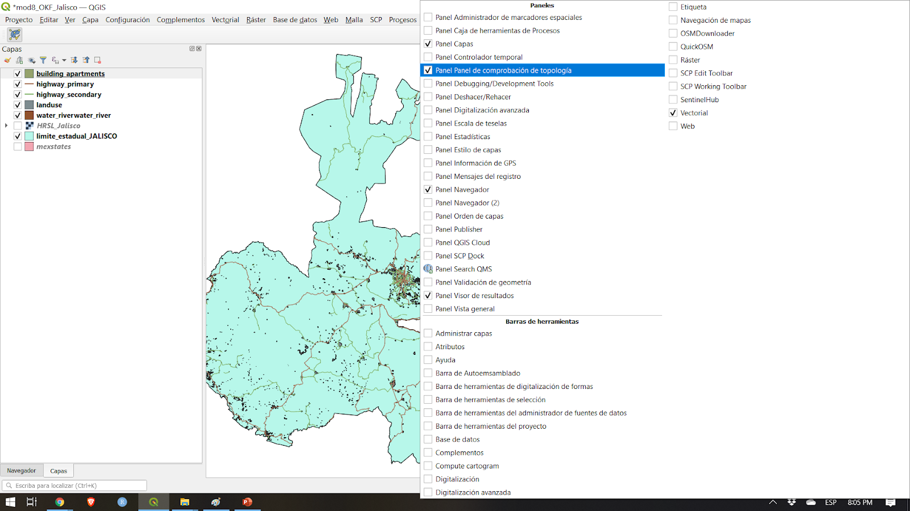

Figura 8.9.b - Panel de verificación de topología; 

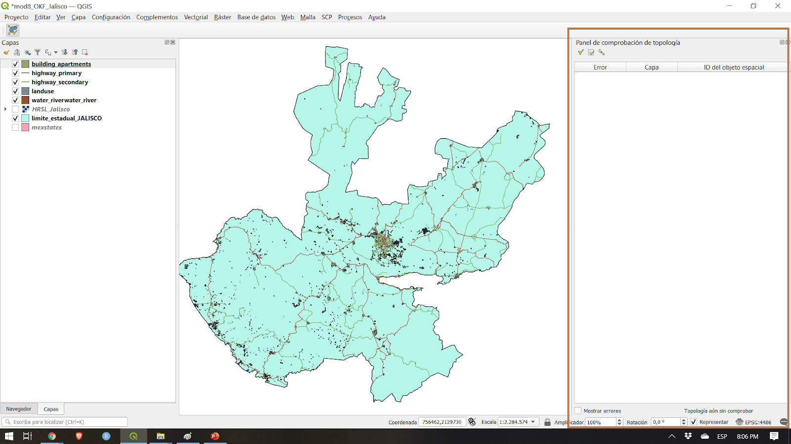

Figura 8.9.c - Ventana del verificador de topología

To define the topology rules, click on the third icon , opening a window as in figure 8.10. 

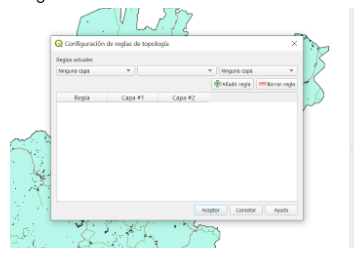

Figura 8.10 - Ventana de configuración de reglas de topología

Estableceremos una serie de reglas para las capas que hemos cargado en nuestro proyecto QGIS, considerando los objetos del mundo real que representan: carreteras, edificios, vías fluviales en el distrito de Jalisco.

La configuración de la topología es sencilla, ya que las reglas que se pueden aplicar en función de la capa seleccionada ya están integradas en esta funcionalidad, como se muestra en la figura 8.11.

[Topology rules dropdown menu based on the selected layer](media/fig811.png "Topology rules dropdown menu based on the selected layer")

Figura 8.11 - Menú desplegable de reglas de topología según la capa seleccionada.

Elija las reglas de topología como se muestra en la figura 8.12, luego haga clic en el primer icono de la ventana para ejecutar y espere los resultados.

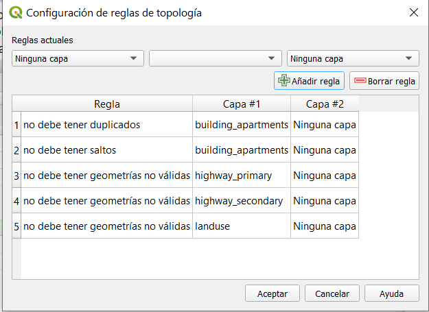

Figura 8.12 - Reglas de topología que se establecerán

Click on the first icon  on the Topology Checker window to run and wait for the results. After running the topology check, your map windows should look like in figure 8.13. 


Figura 8.13 - Resultados de la comprobación de topología

En la esquina inferior derecha, la ventana del comprobador de topología enumera todos los errores identificados según las reglas que hemos definido en la fase anterior. Si la casilla de verificación Mostrar errores está marcada, los errores se resaltarán en rojo en el mapa. Al hacer doble clic en un error seleccionado, se moverá el mapa a su ubicación.

El proceso de corregir los errores en un conjunto de datos, ya sea relacionado con la geometría (duplicados, huecos, etc.) o en el atributo relacionado (valores faltantes, mal escrito, etc.) se denomina limpieza de un conjunto de datos y la mayoría de las veces es tan engorroso como necesario. Aunque existen funcionalidades para respaldar un proceso de limpieza semiautomático, a menudo es necesaria la entrada del usuario. Por ejemplo, en la figura 8.14, hemos ampliado un error en nuestra capa de puntos de interés, un punto duplicado. Como se puede ver, hay 2 puntos que representan un café, la diferencia está en la tabla de atributos donde uno aparece como café y el otro como "hazlo tú mismo", lo que se puede suponer que podría ser un nombre popular para los cafés donde preparas tu propio café.

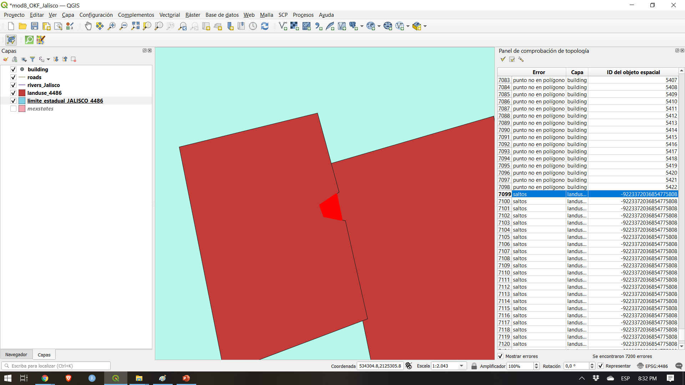

Figura 8.14 - Error de salto en la capa landuse.

En este caso particular, la decisión del usuario probablemente sería eliminar el punto duplicado, ya que puede insertar un error en un análisis espacial posterior. Por ejemplo, si un funcionario de la ciudad quiere saber cuántos restaurantes y cafés hay en un vecindario específico, el punto duplicado insertará un error en los resultados y eso eventualmente podría llevar a decisiones engañosas.

Por tanto, procederemos a la eliminación automática de los puntos duplicados. Para hacerlo, usaremos una funcionalidad central de QGIS - Eliminar geometrías duplicadas - que se encuentra en la caja de herramientas de procesamiento. Su QGIS debería verse como en la figura 8.15.

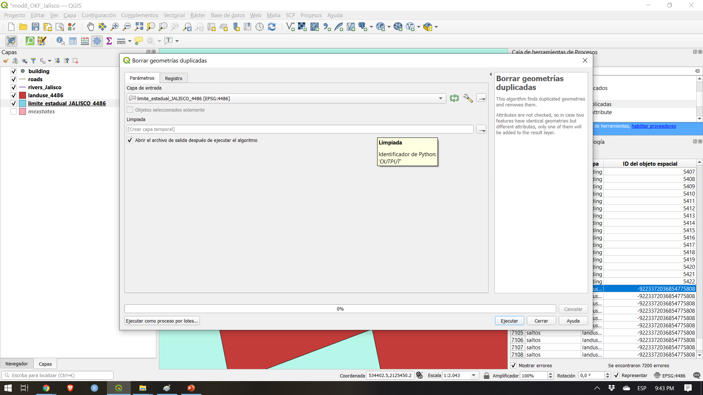

Figura 8.15 - Eliminar geometrías duplicadas en puntos de interés de capa

Después de ejecutar el algoritmo, la ventana de funcionalidad presenta los resultados, ha identificado 6 puntos duplicados, al igual que el verificador de topología, e informa al usuario que los ha eliminado todos, dejando el Capa de puntos de interés con 2727 entidades.


Figura 8.16 - Resultado de ejecutar eliminar geometrías duplicadas

Volver a ejecutar el verificador de topología dará como resultado un resultado de 0 errores con respecto a la regla de topología de no duplicados geométricos para la capa de puntos de interés.

¡Atención! El algoritmo considera solo geometrías, ignorando el atributo. Si, tal es nuestro caso, existen algunas diferencias en el atributo de los duplicados, el usuario no tiene control sobre cuál se mantendrá. Por lo tanto, si es necesario conservar toda la información, primero debe copiarse en todas las geometrías, de modo que cuando se elimine una entidad duplicada no se pierda información.

Ejecutemos otra verificación de topología, esta vez en nuestra capa de construcción. Configure las siguientes reglas:

*   Sin duplicados
*   Sin geometrías no válidas


Figure 8.17a - Topology checker rules on the buildings vector layer

Ejecute el algoritmo.

El resultado debería parecerse a la figura 8.17b.

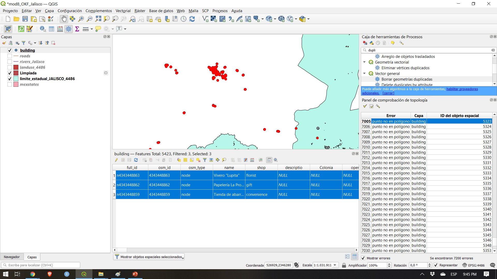

Figura 8.17b - Resultados de la verificación de topología en la capa vectorial de edificios

Limpie la entidad duplicada mediante el proceso indicado anteriormente (figura 8.18b)


Figure 8.18a - Remove duplicate geometries on the buildings vector layer

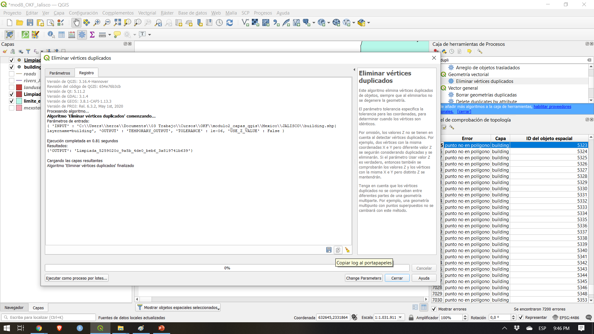


Figura 8.18b - Resultados de Eliminar geometrías duplicadas

Una limpieza completa de los conjuntos de datos vectoriales utilizados para este módulo está fuera de alcance. Su complejidad lo transforma en un módulo más avanzado en sí mismo.


#### Paso 4. Observe más de cerca la información adjunta a los puntos, líneas y polígonos.

Ejecutemos un algoritmo más para tener una idea de cuáles son los atributos de nuestras capas de Jalisco. Una vez que hayamos identificado cuántas características tiene cada capa, veamos cuántas y cuáles son los atributos únicos en los siguientes casos:

*   capa osm_buildings - atributo type;
*   capa osm_pois_limpia - atributo fclass;
*   capa osm_waterways - atributo fclass;
*   capa osm_pofw - atributo fclass;
*   capa osm_roads -attribute fclass;
*   capa osm_landuse_limpia - atributo fclass;

Para eso, vaya a Vector ‣ Herramientas de análisis ‣ Lista de valores únicos (figura 8.19)

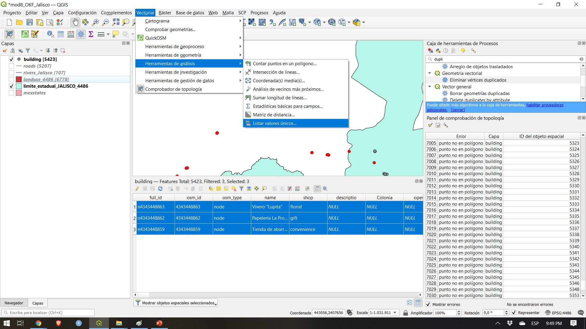

Figura 8.19a - Lista de valores únicos en una funcionalidad de capa vectorial

En la ventana que se abre, inserte, uno a la vez, cada nombre de capa y atributo de interés como enumerados en la lista anterior y debería tener los siguientes resultados:

")

Figure 8.19b - List unique values in a vector layer functionality (Batch Processing)

<table>
  <tr>
   <td>Nombre de capa
   </td>
   <td>Cantidad de valores únicos
   </td>
   <td>Valores únicos
   </td>
  </tr>
  <tr>
   <td>osm_buildings
   </td>
   <td>70
   </td>
   <td>desused; NULL; shed; stable; religious; toilets; church; hotel; silo; stilt_house; cabin; temple; college; abandoned; ruins; chapel; roof; transportation; storage_tank; boathouse; hospital; manufacture; utility; stadium; theatre; grandstand; garages; parking; house; disused; service; kiosk; farm; civic; hangar; garage; school; construction; gasometer; bungalow; greenhouse; industrial; hut; apartments; barn; university; public; office; residential; sports_centre; boat_storage; pavilion; detached; commercial; cathedral; no; farm_auxiliary; station; retail; warehouse; kindergarten; apartment; carport; collapsed; government; transformer_tower; terrace; shrine; supermarket; train_station
   </td>
  </tr>
  <tr>
   <td>osm_pois_limpia
   </td>
   <td>123
   </td>
   <td>archaeological; police; hairdresser; shelter; town_hall; chemist; sports_shop; track; park; observation_tower; swimming_pool; guesthouse; hospital; camera_surveillance; dentist; beverages; kiosk; veterinary; wayside_cross; school; vending_parking; fountain; car_dealership; vending_any; garden_centre; telephone; fast_food; attraction; bicycle_shop; bookshop; water_works; golf_course; nightclub; pub; biergarten; water_tower; bank; monument; courthouse; atm; library; tower; travel_agent; stadium; post_office; restaurant; outdoor_shop; artwork; embassy; memorial; motel; car_wash; drinking_water; battlefield; kindergarten; greengrocer; post_box; wastewater_plant; computer_shop; mall; supermarket; toilet; cafe; theme_park; prison; recycling_glass; hostel; recycling_clothes; comms_tower; optician; hotel; chalet; laundry; doityourself; stationery; tourist_info; college; ruins; convenience; arts_centre; windmill; wayside_shrine; water_well; vending_machine; viewpoint; dog_park; bar; camp_site; beauty_shop; playground; alpine_hut; university; mobile_phone_shop; butcher; sports_centre; pharmacy; jeweller; bakery; clothes; car_rental; recycling; shoe_shop; waste_basket; bicycle_rental; pitch; bench; food_court; gift_shop; department_store; cinema; caravan_site; fire_station; toy_shop; theatre; furniture_shop; picnic_site; recycling_paper; doctors; newsagent; community_centre; nursing_home; florist; museum
   </td>
  </tr>
  <tr>
   <td>osm_waterways
   </td>
   <td>4
   </td>
   <td>stream; canal; drain; river
   </td>
  </tr>
  <tr>
   <td>osm_pofw
   </td>
   <td>6
   </td>
   <td>christian_orthodox; christian; christian_protestant; christian_evangelical; christian_catholic; jewish
   </td>
  </tr>
  <tr>
   <td>osm_roads
   </td>
   <td>27
   </td>
   <td>track_grade3; path; primary; track_grade2; secondary; track; bridleway; pedestrian; living_street; tertiary_link; tertiary; trunk; trunk_link; track_grade5; service; track_grade4; primary_link; unknown; footway; motorway_link; steps; residential; unclassified; motorway; cycleway; track_grade1; secondary_link
   </td>
  </tr>
  <tr>
   <td>osm_landuse_limpia
   </td>
   <td>20
   </td>
   <td>allotments; forest; quarry; park; meadow; farmland; orchard; recreation_ground; military; farmyard; industrial; nature_reserve; grass; residential; scrub; commercial; retail; vineyard; heath; cemetery
   </td>
  </tr>
</table>


Tabla 8.1 - Tabla que identifica cuántos y cuáles son los valores únicos para los atributos seleccionados

Para un análisis más profundo de los atributos de nuestras capas vectoriales, usaremos el complemento GroupStats. Fue desarrollado para admitir el cálculo de estadísticas para grupos de características en una capa vectorial, lo que lo hace muy útil para comprender mejor sus datos, así como para detectar posibles errores en los atributos.

Para abrir la ventana GroupStats, vaya a Vector ‣ GroupStats ‣ GroupStats.


Figure 8.20a - GroupStats plugin

Debería abrirse una nueva ventana como la de la figura 8.20b.

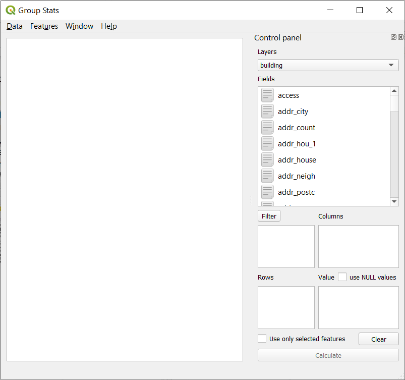

Figura 8.20b - Ventana Group Stats

Según el análisis realizado anteriormente, hemos visto que para los edificios de capa tenemos 74 tipos diferentes de edificios, pero ¿cuántos de cada uno y cuál es el área construida total tomada por cada categoría? ¿Cuánto espacio para escuelas, mercados, casas? GroupStats puede ayudarnos a responder esta pregunta. En el lado derecho de la ventana, está el panel de control, donde elegimos lo que queremos calcular, así como cómo se deben ordenar los datos. Usando arrastrar y soltar, siga la disposición en la figura 8.21, luego presione calcular.


Figura 8.21 - Ejecución de GroupStats en la capa de edificios.

Al observar el resultado, podemos extraer información importante sobre nuestros datos. Por ejemplo, para fines residenciales en la región Estado de Jalisco, contamos con 3270 edificios con una superficie total construida de 405937 metros cuadrados, aprox. 40 hectáreas. También averiguamos que el más grande tiene 1474 metros cuadrados mientras que el más pequeño tiene 10 metros cuadrados. Y se puede continuar el análisis para obtener más información valiosa.

Otro análisis interesante se puede ejecutar en la capa vectorial de carreteras. La figura 8.22 muestra cómo calcular las longitudes de las carreteras clasificadas por tipo de carretera (primaria, residencial, autopista, etc.) y la velocidad máxima permitida.

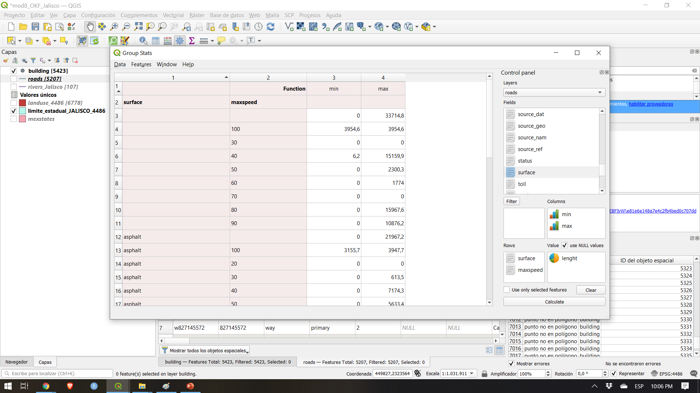

Figura 8.22 - Ejecución de GroupStats en la capa de carreteras.


#### Preguntas del cuestionario

1. ¿Son importantes los metadatos?
*   Sí, porque da una idea de los datos geográficos que de otro modo no se podrían obtener.
*   _No, es solo burocracia _

2. ¿La topología es relevante para la geometría o para la tabla de atributos de una capa vectorial?
*   _ Lo es para la geometría de la capa vectorial._
3. ¿Qué es más importante, la geometría o los datos de los atributos?
*   Geometría.
*   Datos de atributos.
*   Ambos.


### Fase 2: Introducción al procesamiento de vectores

La primera fase del módulo de vectores hizo una breve introducción a los pasos que se deben realizar para tener una comprensión básica de los datos geoespaciales que se tienen a mano.

Esta segunda fase del módulo lo lleva a un trabajo más profundo para procesar datos vectoriales con el fin de extraer información valiosa para ayudar a la toma de decisiones. Siguiendo los conceptos descritos al comienzo de este módulo, el geoprocesamiento representa cualquier proceso aplicado a un conjunto de datos geográficos, con el alcance de obtener un conjunto de datos derivado que abre nuevos conocimientos sobre los datos. Y esto es lo que intentaremos hacer a continuación.

Hay muchas operaciones que se pueden realizar en uno o más conjuntos de datos geoespaciales y durante este primer paso, ejecutaremos algunas de las más comunes para comprender cómo funcionan.

Área de Influencia: Imagina que necesitas analizar una nueva legislación que pide que en un área de 30 metros alrededor de los lugares de culto no se pueda construir nada. Querrá ver dónde están exactamente esas delimitaciones y tal vez incluso cuántos metros cuadrados hay para su distrito. El primer paso es definir una zona de influencia alrededor de los lugares de culto: Vector, herramientas de geoprocesamiento, zona de influencia. Cuando se abra la ventana del búfer, configure los parámetros como en la figura 8.23:


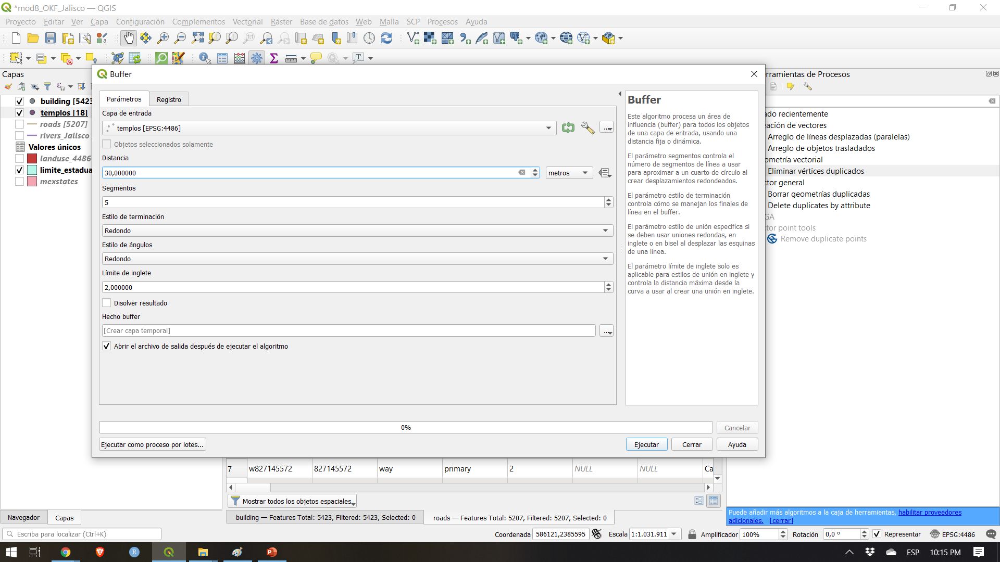

Figura 8.23 ​​- Configuración de los parámetros para un búfer de 30 m alrededor de los lugares de culto

Un detalle del resultado del geoprocesamiento se muestra en la figura 8.24:

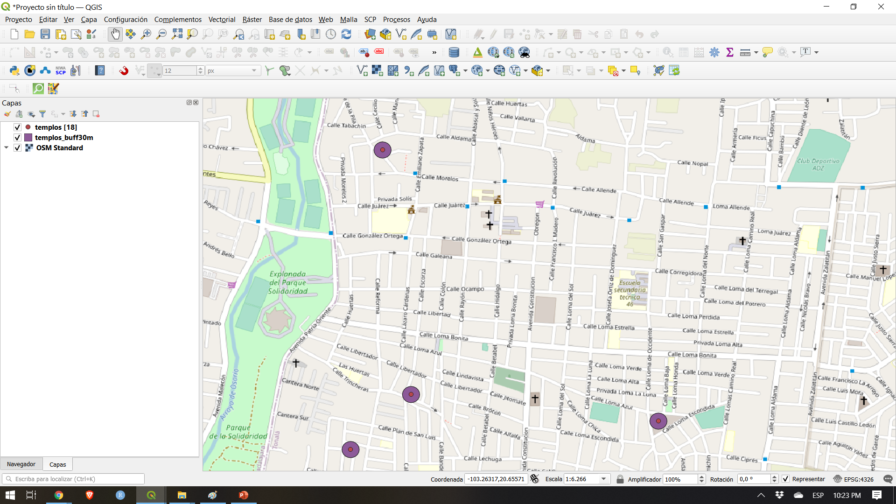

Figura 8.24 - Búfer en ejecución en una capa vectorial de puntos

Para responder completamente a la pregunta inicial, el siguiente paso es calcular las áreas para todas las zonas de influencia y resumirlas (ver Fase 1, paso 4) - figura 8.25.

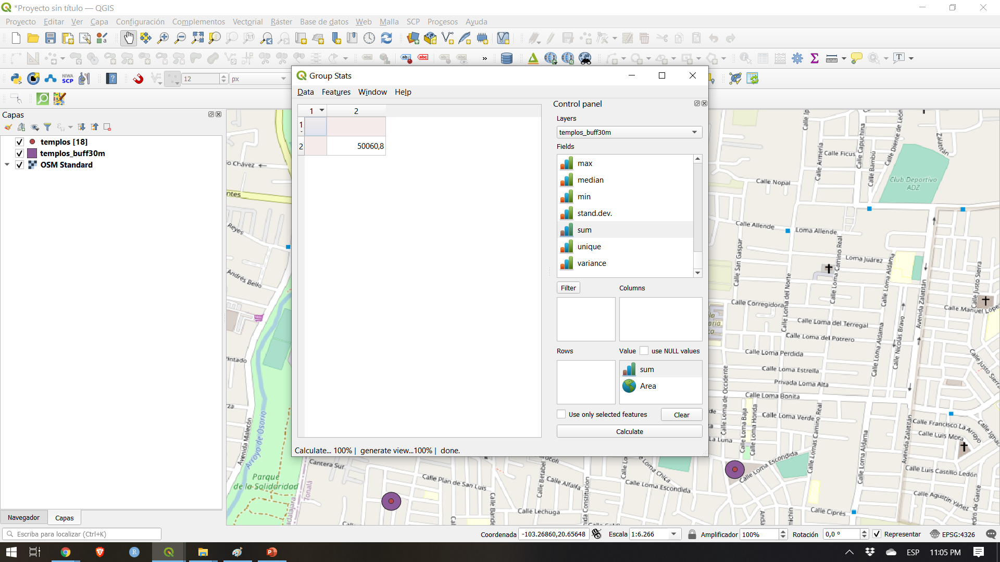

Figura 8.25 - Calcule el área para la capa recién obtenida, luego calcule usando GroupStats la suma total.

**Acortar.** Imagine que desea saber dónde están todas las áreas industriales delimitadas en su distrito y también cuántos edificios hay dentro de ese perímetro. Al inspeccionar visualmente sus datos vectoriales, observe que tiene varias áreas industriales que contienen varios edificios. Desea separar esos edificios y usarlos más. El primer paso es seleccionar todas las características en la capa landuse que tienen como atributo industrial (consulte el módulo 6 para saber cómo hacerlo). Luego, vaya a Vector ‣ Herramientas de geoprocesamiento ‣ Cortar y elija como capa para recortar buildings. Sus resultados deberían verse como en la figura 8.26.


Figure 8.26a - Select landuse fclass = industrial. 


Figura 8.26b - Selección reducida de algunos edificios y uso de suelo industrial, por lo que el cálculo puede terminar más rápido.

Run the Clip algorithm. Make sure to check **Selected features only** box for the Overlay layer (landuse). This will ensure that only the currently selected features will be used for clipping and speed up the computations.

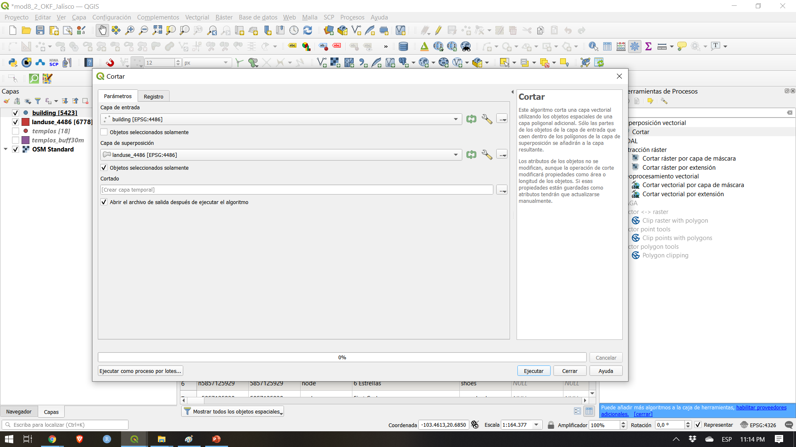

Figure 8.27a - Running the Clip algorithm

Después de ejecutar el algoritmo, sus resultados deberían verse como en la figura 8.27. Los edificios recortados están coloreados de rosa. En el perímetro que hemos elegido hay 298 edificios que ocupan una superficie de casi 30 hectáreas. ¿Cuántos edificios industriales ha recortado?

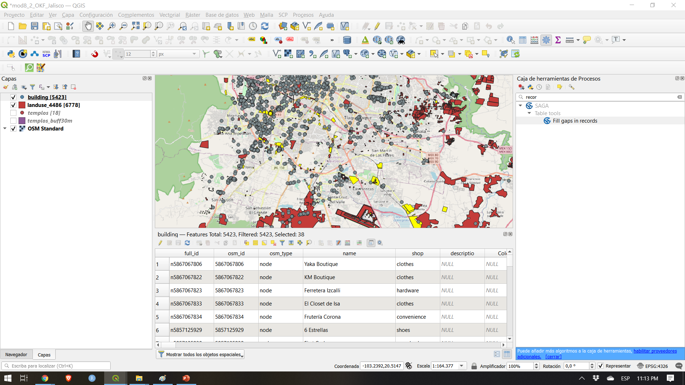

Figura 8.27b - Resultados de la funcionalidad de clip

**Polígonos de Thiessen (Voronoi).** Imagine que tiene que tomar una serie de decisiones administrativas en su distrito en función de la cantidad de escuelas que hay y las áreas específicas a las que sirven. El análisis geoespacial puede ser de ayuda. Puede comenzar calculando los polígonos de Thiessen. Basado en un área que contiene al menos dos puntos, un polígono Thiessen es una forma bidimensional cuyos límites contienen todo el espacio que está más cerca de un punto dentro del área que cualquier otro punto sin el área. Un buen ejemplo de uso es la meteorología, donde las estaciones meteorológicas son puntos discretos, pero se considera que la información recopilada se mide en la superficie en función de los polígonos de thiessen.

Para responder a la pregunta anterior, ejecutaremos el algoritmo solo para los puntos que tengan el atributo school at type. Por lo tanto, haga la selección como se indica en el módulo 6. Debería tener 20 entidades seleccionadas en la capa building de 5423 objetos. Vaya a Vector ‣ Herramientas de geometría ‣ Polígonos de Voronoi .. Después de configurar los parámetros, seleccione la capa de puntos para la que queremos que se calculen los polígonos de Voronoi y una extensión del 30% para que todo el estado de Jalisco esté contenida, debería ver un resultado como en la figura 8.28d.


Figure 8.28a - Filtering the poi layer to get all schools


Figure 8.28b - All schools in the poi layer


Figure 8.28c - Running the Voronoi polygon algorithm

 polygons algorithm to a point vector layer")

Figura 8.28d - Resultados de la aplicación del algoritmo de polígonos de Thiessen (Voronoi) a una capa vectorial de puntos

A veces, las necesidades imponen el requisito de tener información en áreas más pequeñas, claramente definidas e iguales y no para toda una gran región, como un país o una gran ciudad. Por lo tanto, los datos deben analizarse y visualizarse de manera dividida y bien definida, lo que permite una comparación que, de otro modo, podría resultar difícil sin una referencia común.

Supongamos que tiene que presentar un informe que permitirá realizar comparaciones para unidades de 10X10 km sobre la unidad administrativa, incluyendo:

1. densidad de espacios verdes (parques, bosques) en informe al espacio edificado por unidad;
2. longitud total de calles para cada unidad;
3. longitud total de vías fluviales para cada unidad;
4. número total de edificios públicos para cada unidad (escuelas, jardines de infancia, hospitales, ayuntamientos, etc.).

Hemos visto que existen herramientas que pueden ayudarnos a calcular la superficie total ocupada por un cierto tipo de característica, sin embargo, el primer paso es crear nuestras unidades 10X10: cuadrículas de celdas. Para hacerlo, vaya a: Vector ‣ Herramientas de investigación ‣ Crear cuadrícula. Establezca los parámetros en: tipo de cuadrícula - Rectángulo (polígono), Espaciado horizontal - 10 km, Espaciado vertical - 10 km y debería obtener un resultado como en la figura 8.29.

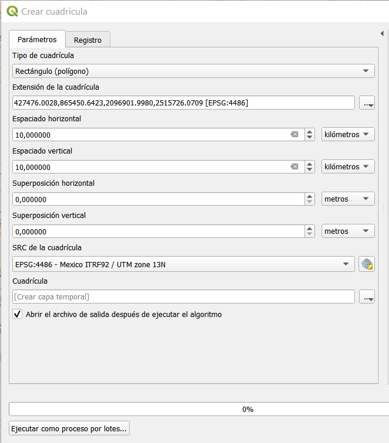

Figura 8.29 - Creación de una cuadrícula vectorial de 10X10km para la estado de Jalisco

You should get a result like in figure 8.29b. 

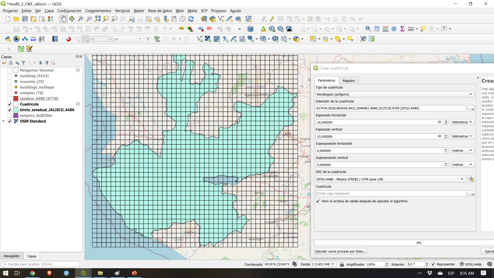

Figure 8.29b - 10X10km vector grid for Jalisco

Para avanzar más en la respuesta a las preguntas de nuestro ejercicio, debemos hacer lo siguiente:

1. espacios verdes (parques, bosques) espacio construido por relación unitaria:

Los espacios verdes y los espacios construidos son datos contenidos por la capa vectorial usodelatierra_a_3121, tipo polígono. Para saber exactamente cuáles son los 'espacios verdes', necesitamos ver cuáles son las categorías incluidas en el conjunto de datos. Para eso, ejecutamos el algoritmo de lista de valores únicos en el atributo fclass y descubrimos que tenemos las siguientes clases 'verdes': prado, césped, reserva_natural, parque, bosque y las siguientes clases de 'espacio construido': minorista, comercial, industrial, residencial. La figura 8.30 presenta una visualización de nuestras selecciones:


Figure 8.30a - Filtering green areas and built-up space in Jalisco 

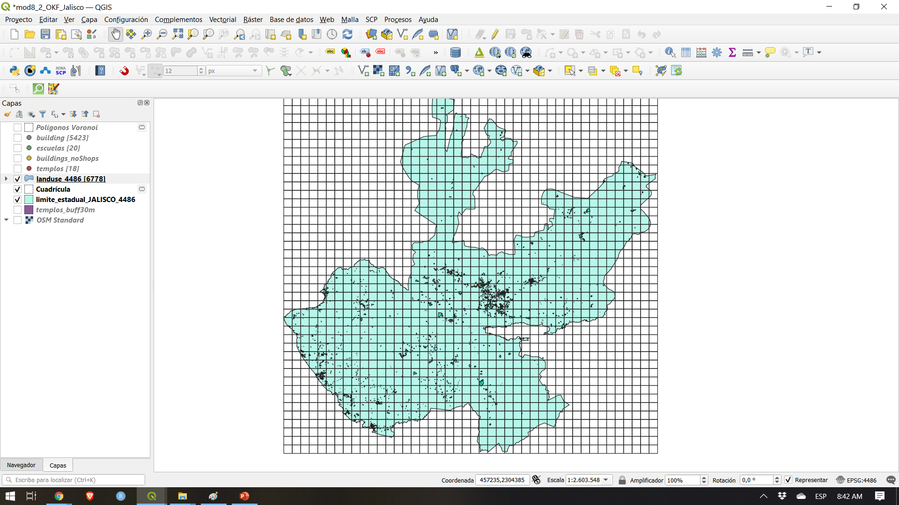

Figura 8.30b - Distribución espacial de las áreas verdes y el espacio edificado en Jalisco

El segundo paso para responder al requisito es identificar cuánto espacio verde y cuánto espacio construido hay en cada 10 x 10 km. Para obtenerlo, debemos intersecar las 2 capas vectoriales de polígonos superpuestas. El algoritmo extrae las porciones superpuestas de entidades en la entrada, la capa de uso del suelo y la capa de superposición, la capa de cuadrícula. Vaya a Vector - Herramientas de geoprocesamiento - Intersecar. Establezca los parámetros del algoritmo como en la figura 8.31.

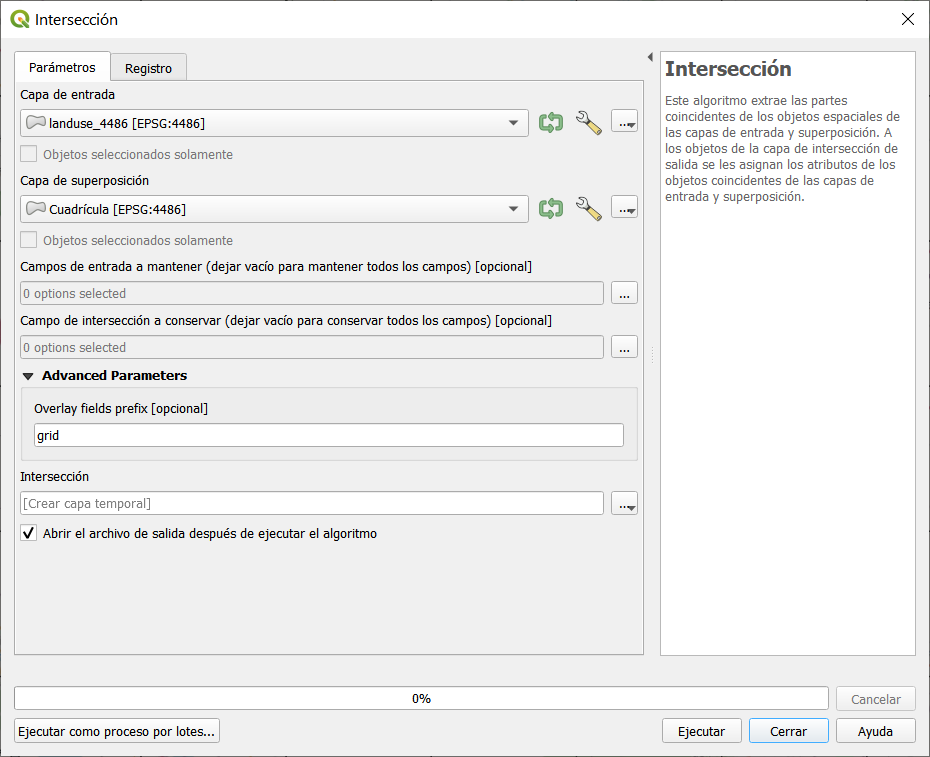

Figura 8.31 - Parámetros para el algoritmo de intersección

El resultado debería verse como en la figura 8.32. Tenga en cuenta que el algoritmo de intersección se aplicó a toda la capa usodelatierra_a_3123, que contiene más características que las que seleccionamos para nuestro ejercicio.

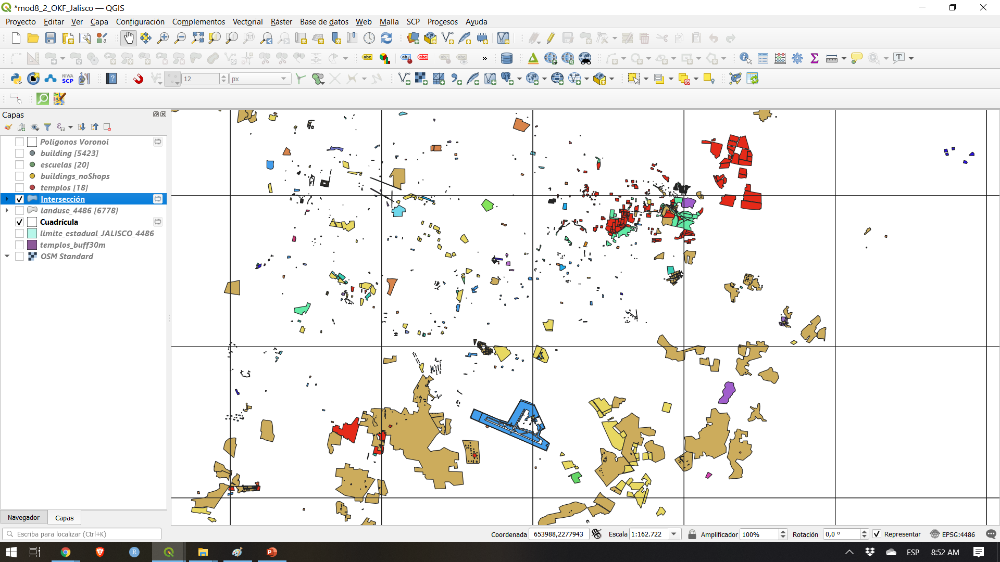

Figura 8.32 - Resultado de ejecutar el algoritmo de intersección para recortar los polígonos vectoriales de uso del suelo a la capa de la cuadrícula.(Detalle)

Ahora, para cada unidad de 10 x 10 km, tenemos las características de uso del suelo con las que podemos trabajar. La tabla de atributos también almacena esta información, ya que cada celda de la cuadrícula (unidad) tiene una identificación única, consulte la figura 8.33.

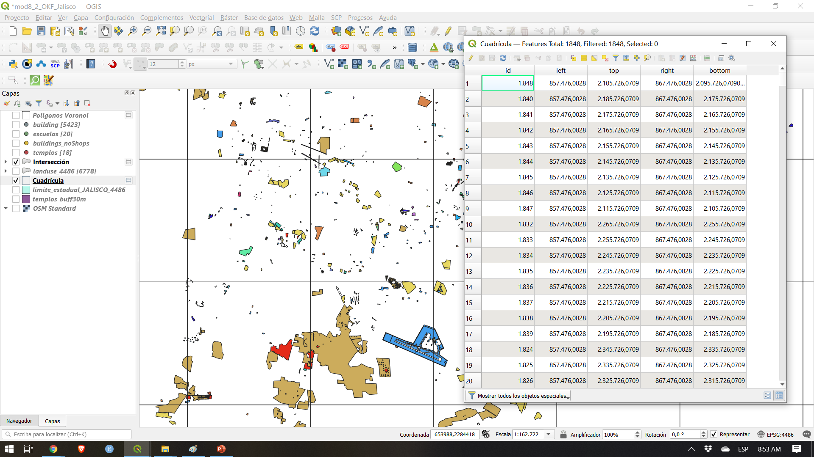

Figura 8.33 - Características del uso del suelo recortadas por cada celda de la cuadrícula y su tabla de atributos asociada.

Ahora que tenemos todas las características de uso del suelo por unidad de 10 x 10 km, continuaremos separando las geometrías de las que componen el espacio verde y el espacio edificado como se definió anteriormente, para cada celda de la cuadrícula. Por lo tanto, para el espacio verde, seleccionaremos todas las características que tengan el valor de atributo para fclass: prado, césped, reserva natural, parque, bosque. En la tabla de atributos, en la expresión archivada, escriba: "landuse" = 'grass' o "landuse" = ‘orchad’ o "landuse" 'conservation' o "landuse" = 'forest' o "landuse" = 'flowerbed' y exportar las características seleccionadas como espacios_verdes_cuadriculados (consulte el módulo 6 para obtener más detalles). Su nueva salida debería tener 820 funciones. Haga lo mismo con el espacio construido. Seleccione las características en landuse_a_3123 que tienen el valor de atributo para fclass lo siguiente: minorista, comercial, industrial, residencial, escribiendo la siguiente expresión en la ventana de filtro basado en Expresión:  "landuse" = 'industrial' OR "landuse" = 'residential' OR "landuse" = 'construction' OR "landuse" = 'military' OR "landuse" = 'cemetery' OR "landuse" = 'enclosure' Seleccione las geometrías filtradas y expórtelas como espacios_cuadriculados_construidos. Su nueva salida debería tener 3849 funciones. 

Alternatively, you can also use a filter instead of a selection.


Figure 8.34a - Selecting the green spaces.


Figure 8.34b - Selected green spaces.


Figure 8.34c - Green and Built-up spaces.

A continuación, calcule el área ocupada por cada característica de las 2 capas. Vaya a la tabla de atributos de cada capa y luego agregue el área de la columna geométrica insertando la expresión redondear ($ area, 2) en la calculadora de campo. (consulte el módulo 6 para obtener más detalles, si es necesario). Sin embargo, la cuadrícula de 10X10km de el Estado de Jalisco tiene un número conocido de celdas de cuadrícula, y eso es 42. Por lo tanto, necesitamos resumir las áreas para todo tipo de espacios verdes (bosques, parques, etc.) y espacios urbanizados (comerciales , residencial, etc.) y únala en consecuencia a las 42 celdas de la cuadrícula. Para hacer esto, usaremos el complemento GroupStats para resumir para cada id_cuadrícula todas las categorías verdes, respectivamente todas las categorías construidas. Para la capa vectorial espacios_verdes_cuadriculados , configure los parámetros como en la figura 8.34e.


Figure 8.34d - Computing the area of each feature.

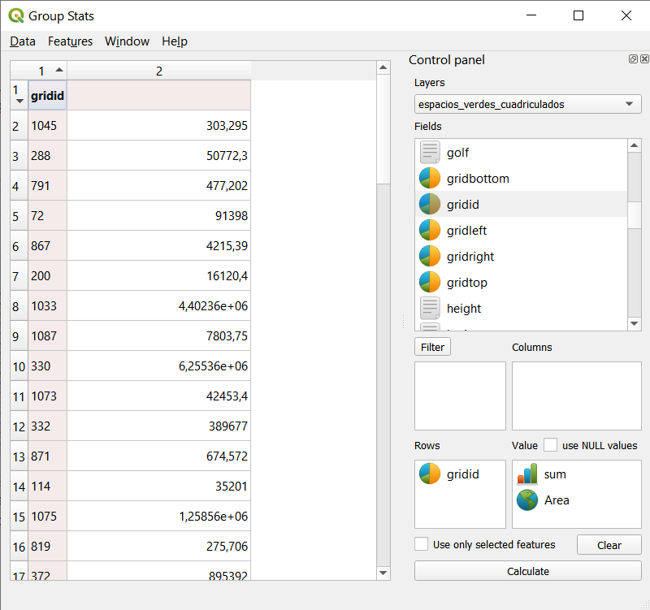

Figura 8.34e - Configuración de los parámetros de Group Stat para resumir las áreas verdes por cada celda de cuadrícula de 10X10km.

Luego, guarde los resultados como un archivo .csv llamado espacios_verdes_cuadriculados. Vaya a Datos: guarde todo en un archivo CSV.

Ejecute GroupStats para el espacio construido de la misma manera y luego guárdelo como un archivo csv llamado espacios_cuadriculados_construidos.

A continuación, traeremos los 2 archivos csv calculados con GroupStat a QGIS (Capa - Agregar capa - Agregar capa de texto delimitado - vea más detalles en el módulo 2). 


Figure 8.35a - Loading green_spaces_gridded CSV


Figure 8.35b - The green_spaces_gridded CSV attribute table

En el futuro, debemos unir los espacios calculados (verdes y urbanizados) a cada cuadrícula de celdas de 10x10 km. Para eso, seleccione la capa vectorial cuadrícula10km en el TOC, abra la ventana de propiedades y vaya a Uniones. Esta funcionalidad le permite unirse por un campo de atributo común, otros. En nuestro caso, utilizando el valor común de cuadrícula_id uniremos, la suma de las áreas edificadas y los espacios verdes de los 2 archivos csv obtenidos en la etapa anterior.

En la ventana Unir, presione el botón verde más abajo y configure los parámetros como en la figura 8.35, para espacios verdes. Luego repita para espacios construidos.

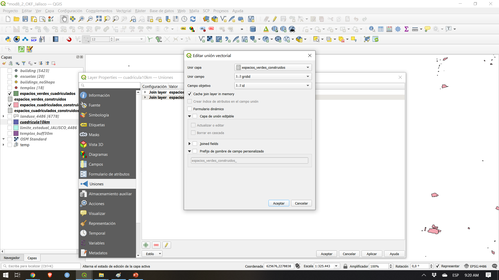

Figura 8.35c - Configuración de los parámetros para unir por campo común id_cuadrícula / id las sumas de espacios verdes y construidos para cada celda de la cuadrícula - unidad de 10X10km.

Repeat for built-up spaces.

Los resultados de las dos combinaciones son visibles en la tabla de atributos, como se puede ver en la figura 8.36. Hemos mantenido el id_cuadrícula en ambas combinaciones, para asegurarnos de que no se produzcan errores. Podemos verificar visualmente rápidamente para asegurarnos de que los 3 campos de atributos: id, id_cuadrículaconstruida y id_cuadrículaverde sean exactamente iguales.


Figure 8.36a - Green and built-up CSV joined to Grid. 

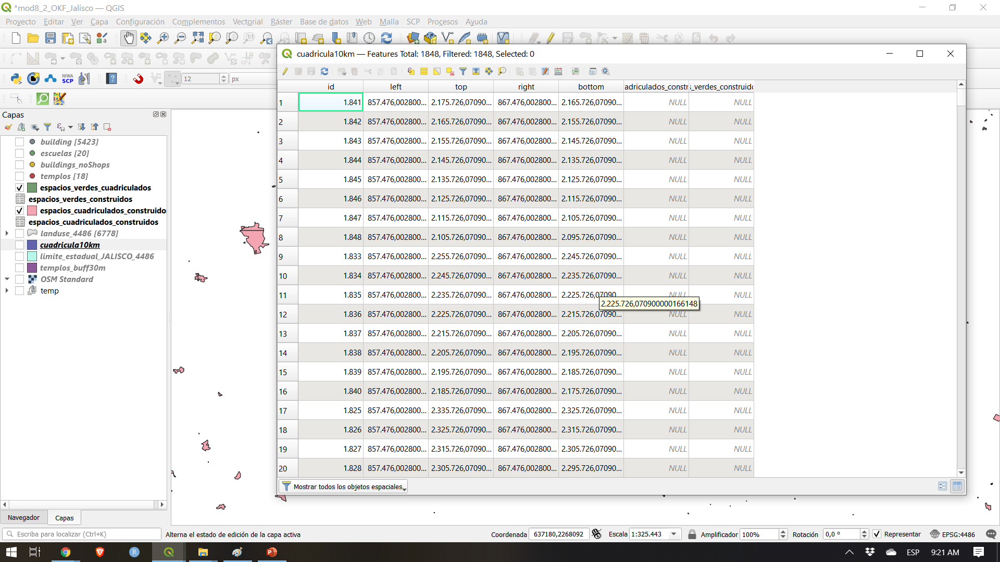

Figura 8.36b - Tabla de atributos de la capa vectorial cuadrícula10km que contiene las áreas totales para espacios verdes y construidos.

Como hemos reunido toda la información necesaria para los espacios verdes y construidos en la tabla de atributos de la capa de la cuadrícula, todo lo que tenemos que hacer es calcular el porcentaje de estos espacios dentro de la celda de la cuadrícula de 10X10 km. Lo calcularemos usando la calculadora de campo, usando la siguiente expresión: ` ("verdes_None" * 100/$area)` y ` ( "construidos_None"  * 100/$area)`. A continuación, añadimos un nuevo campo en el que calculamos el informe del  "verdes_por"  /  "constr_por" , y así llegar a la respuesta a nuestra solicitud: ratio espacios verdes (parques, bosques) espacio edificado por unidad: ` "verdes_por"  /  "constr_por" `.  To have a clear overview of our dataset, in cases where there is no built-up space in the grid cell - we insert the value 1000 in the attribute table, in cases where there is no green space, we will insert value 999, while in case both values are NULL then we insert 1001. For this we can use the expression:

```
CASE 
WHEN (greenPer is NULL) and (builtupPer is not NULL) then 999
WHEN (builtupPer is NULL) and (greenPer is not NULL) then 1000
WHEN (greenPer is NULL) and (builtupPer is NULL) then 1001
ELSE round(greenPer / builtupPer, 5)
END
```

El resultado final se vería como en la figura 8.37e.


Figure 8.37a - Percentage of green area in the 10km x 10km grid


Figure 8.37b - Computed percentage of green and built-up area


Figure 8.37c - Computing for the ratio of green and built-up areas


Figure 8.37d - Computed ratio of green and built-up areas


Figura 8.37e - Distribución espacial de la ración de espacios verdes vs urbanizados por 10X10 km en Jalisco.


2. longitud total de calles y vías fluviales para cada unidad;

Para lograr esta tarea, QGIS ofrece un algoritmo que toma una capa de polígono y una capa de línea y mide la longitud total de líneas y el número total de ellas que cruzan cada polígono. La capa resultante tiene las mismas características que la capa de polígono de entrada, pero con dos atributos adicionales que contienen la longitud y el recuento de las líneas en cada polígono. Vaya a Herramientas de análisis - Sumar longitudes de línea y configure los parámetros de la siguiente manera: polígonos - cuadrícula10km, líneas - roads, longitud de líneas nombre de campo - caminosL, recuento de líneas nombre de campo - caminosC. 

Puede crear una capa temporal o guardarla como un archivo en su computadora. Si para la representación utiliza rupturas naturales, su mapa debería verse como en la figura 8.38.


Figure 8.38a - Sum Line Lengths parameters


Figure 8.38b - Road lengths and counts per Grid cell

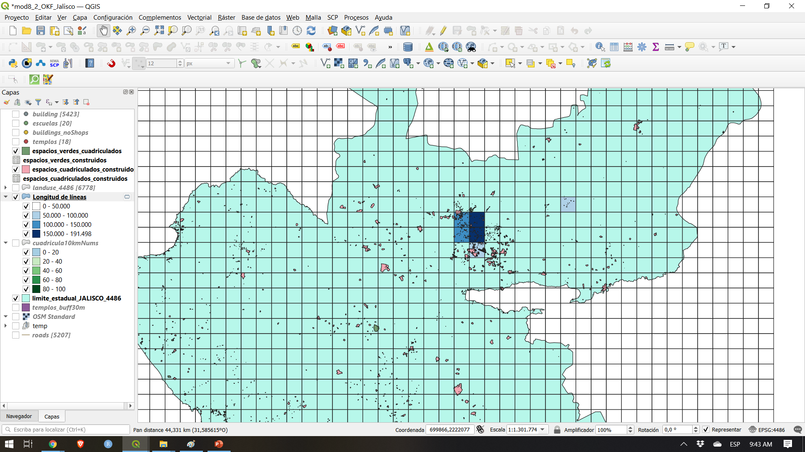

Figura 8.38c - Distribución espacial de unidades de 10 X 10 km con la mayoría de las carreteras

Ahora, repita el mismo procedimiento para las longitudes de las vías fluviales en cada celda de cuadrícula. Ejecutar el proceso en el archivo de cuadrícula obtenido anteriormente le ayudará a tener toda la información obtenida hasta ahora adjunta a la misma geometría. Le recomendamos que guarde este archivo en su computadora con longitudes_de_linea_cuadriculadas. Si para la representación utiliza rupturas naturales, su mapa debería verse como en la figura 8.39.

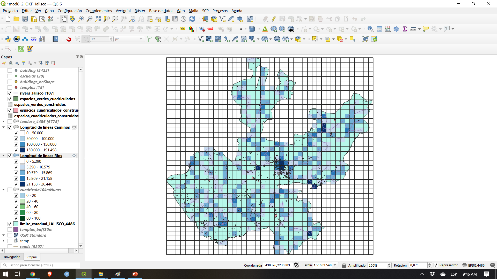

Figura 8.39 - Distribución espacial de unidades de 10 x 10 km con la mayoría de las vías fluviales

3. número total de edificios públicos para cada unidad (escuelas, jardines de infancia, hospitales, ayuntamientos, etc.).

Para contar el número total de edificios públicos en la unidad 10X10, usaremos pois_3123_limpia. Primero, ejecutamos Listar valores únicos ... (Herramientas de análisis) y decidimos qué edificio consideramos público. Seleccionaremos de nuestra capa de datos de puntos vectoriales las siguientes características: "landuse" = 'ayuntamiento' o "landuse" = 'jardín' o "landuse" = 'hospital' o "landuse" = 'doctores' o "landuse" = ' estación_bomberos 'o "landuse" =' centro_comunitario 'o "landuse" =' estadio 'o "landuse" =' museo 'o "landuse" =' escuela 'o "landuse" =' teatro '. Su selección debe tener 246 funciones en total. 


Figure 8.40a - Selecting towns and cities POI


Figure 8.40b - Selected towns and cities POIs

Para responder a nuestra solicitud, usaremos el punto de recuento en el algoritmo de polígono, disponible en Herramientas de análisis. Este algoritmo toma una capa de puntos y una capa de polígono y cuenta el número de puntos del primero en cada uno de los polígonos del segundo. Se genera una nueva capa de polígonos, con exactamente el mismo contenido que la capa de polígonos de entrada, pero que contiene un campo adicional con el recuento de puntos correspondiente a cada polígono. Establece la capa de puntos en pois_3123_limpia y la capa de polígono la capa de cuadrícula con la información calculada en la ronda anterior. Para los puntos, marque la casilla de verificación Solo características seleccionadas, por lo que el algoritmo calcula solo los puntos seleccionados: los edificios públicos. Guarde el archivo de salida como info_cuadrícula.


Figure 8.40c - Count towns and cities POIs in each 10km x 10km grid

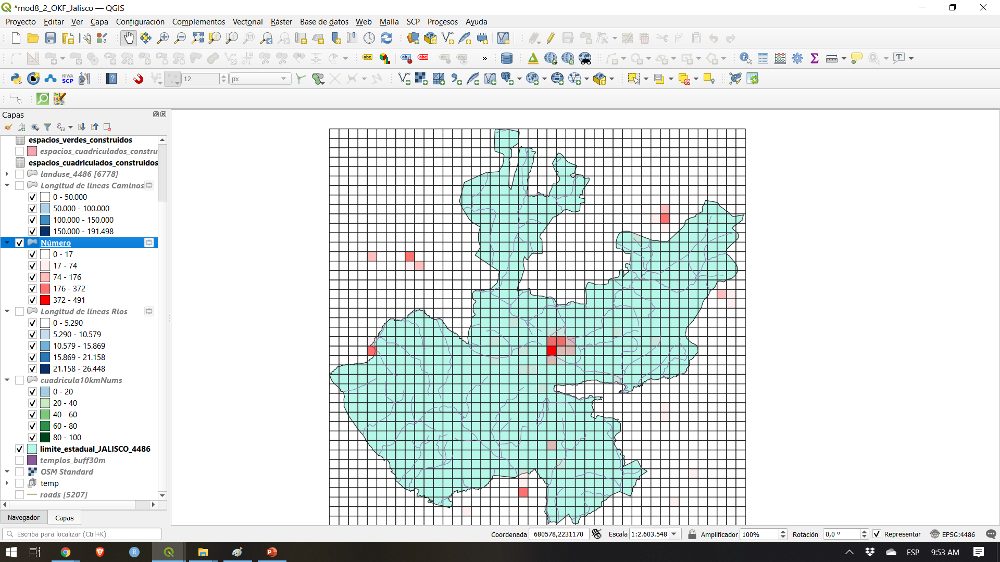

Figura 8.40d - Distribución espacial de la densidad de edificios públicos por unidad 10X10km


### Preguntas de evaluación


P: Si tengo 2 capas vectoriales, una representa la extensión de la ciudad en la que estoy trabajando y la segunda, las carreteras construidas en todo el país, ¿qué herramienta de procesamiento usaría para extraer solo las carreteras de mi ciudad: búfer o clip?

A: Clip.

P. ¿Es útil la herramienta de zona de influencia en el siguiente caso: tengo una capa vectorial poligonal con monumentos históricos en mi región y quiero dibujar un área de protección de 50 m alrededor de ellos?

A: Sí

P: ¿Cuál de las tres herramientas de geoprocesamiento usaría para fusionar dos capas vectoriales similares? ¿Polígonos de Voronoi, disolución, intersección?

A: Disolver.


### **Fase 3: Geoestadística. Interpolación: estimación de datos faltantes**

La última fase del módulo de datos vectoriales introduce el concepto de estimación de datos. Estamos acostumbrados a estimar casi a diario sobre diversos temas, por ejemplo, cuánto tiempo se tarda en llegar de casa al trabajo en determinadas condiciones. Estamos acostumbrados a dar lo mejor de nosotros, basándonos en experiencias y corazonadas previas. Sin embargo, al estimar los datos faltantes, la mejor suposición se reemplaza por ecuaciones matemáticas muy bien definidas con limitaciones bien conocidas.

El tema requiere un conocimiento significativo en estadística y los resultados siempre deben ser considerados a la luz de sus limitaciones.

Dicho esto, presentaremos un breve ejemplo de estimación de datos que hará la transición al siguiente módulo: procesamiento de datos ráster.

La interpolación es un proceso matemático mediante el cual se pueden estimar los valores que faltan basándose en un número limitado de valores que existen. Y esas situaciones son comunes, imagine información meteorológica. Los datos sobre las temperaturas de la superficie y la cantidad de lluvia que ha caído se pueden medir solo en puntos específicos en estaciones meteorológicas calibradas, y no en la totalidad de la superficie. Sin embargo, no tenemos "puntos ciegos" sin temperaturas en los mapas que vemos en la sección meteorológica. Así, el resto de valores - como para construir los fenómenos sin fisuras - se obtienen por interpolación. El supuesto en el que se basa la interpolación es que los objetos distribuidos espacialmente están correlacionados espacialmente; en otras palabras, las cosas que están juntas tienden a tener características similares.

Hay muchos métodos de interpolación implementados en los paquetes de software GIS, decidir cuál es el mejor en cada caso particular depende de la especificidad de los datos, lo que representan y la comprensión geoestadística del usuario que realiza la interpolación.

Para comprobar rápidamente qué métodos de interpolación están disponibles en QGIS, vaya a la Caja de herramientas de procesamiento y escriba en la barra de búsqueda la interpolación de palabras clave. El resultado debería verse como en la figura 8.41.

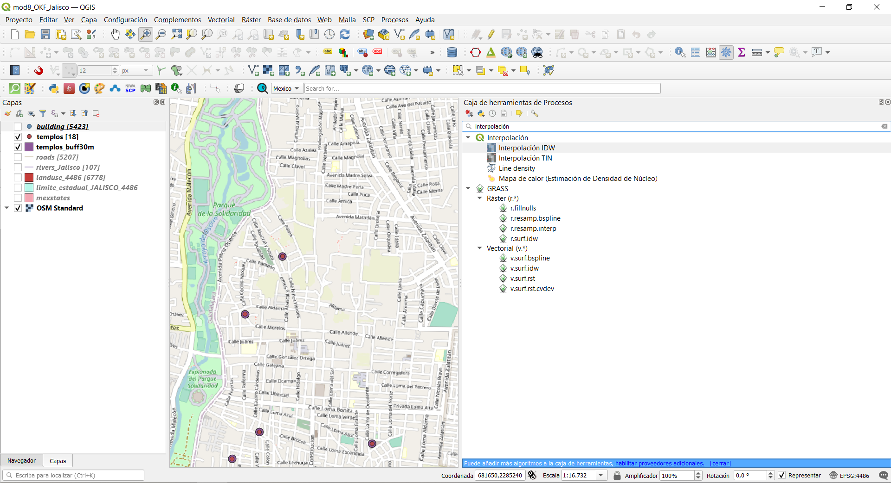

Figura 8.41 - Métodos de interpolación disponibles en QGIS

Como se puede observar, a través de QGIS el usuario tiene acceso a otros algoritmos, implementados en GRASS o SAGA, como resultado de la integración en QGIS de estas (y otras) soluciones de software muy potentes.

Profundizar en las matemáticas detrás de cada algoritmo de interpolación está más allá del alcance de este módulo. Sin embargo, con fines de demostración, simularemos la interpolación de datos de precipitación para obtener un conjunto de datos transparente sobre la cantidad de precipitaciones caídas en nuestra área de interés, el Estado de Jalisco.

Como el ejercicio es puramente para mostrar, crearemos nuestro propio conjunto de datos de puntos, para representar las estaciones meteorológicas donde se han registrado los valores de precipitación durante el transcurso de una semana.

Por lo tanto, el primer paso es crear una nueva capa vectorial - tipo de punto - con puntos asignados aleatoriamente dentro de la extensión del Estado de Jalisco. Hay varias formas de hacerlo, ya sea con el algoritmo de Puntos aleatorios en polígonos ... o con el algoritmo Puntos aleatorios en límites de capa ... Ir a Vector ‣ Herramientas de investigación ‣ Puntos aleatorios en polígonos…. También puede buscar el algoritmo en la caja de herramientas de procesamiento o en la barra de localización. Elegir como parámetros:

*   93 puntos
*   mínimo 5 km.

El resultado debería verse como en la figura 8.43.

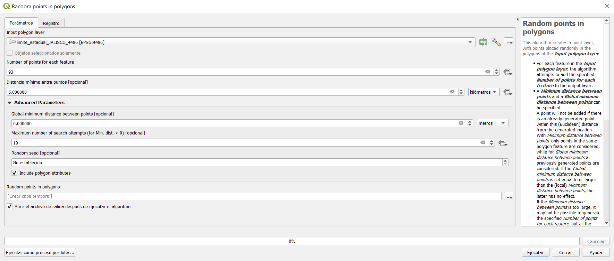

Figura 8.42 - Creación de puntos aleatorios dentro de una capa de polígono

La capa de puntos resultante se verá aproximadamente como en la figura 8.43.

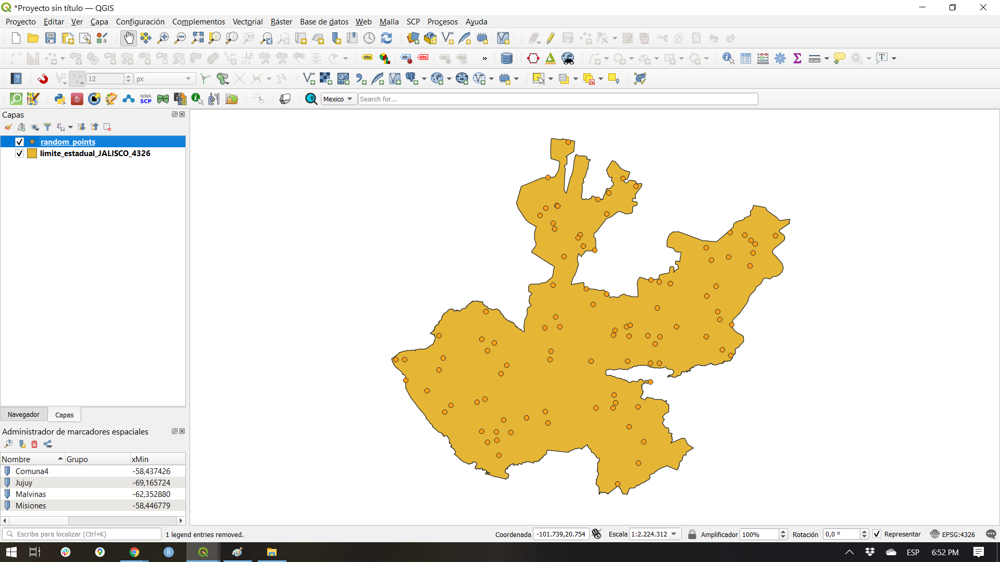

Figura 8.43 - Capa de datos de puntos: creada aleatoriamente dentro de polígonos especificados.

Ahora que tenemos nuestras estaciones meteorológicas imaginarias que miden las precipitaciones en el Estado de Jalisco, continuaremos agregando medidas ficticias en el transcurso de 7 días.

Para hacer eso, podemos usar la función aleatoria proporcionada por QGIS. Abra la tabla de atributos de la capa de datos de puntos creada y la calculadora de campo abierto. En un campo recién creado (entero entero), inserte la siguiente fórmula rand (min, max), donde min y max serán reemplazados por el siguiente par de números para los 7 días correspondientes (ver figura 8.44):

1. 0 - 59;
2. 2 - 35;
3. 10 - 45;
4. 0 - 21;
5. 5 - 63;
6. 0 - 10;
7. 0 - 21.

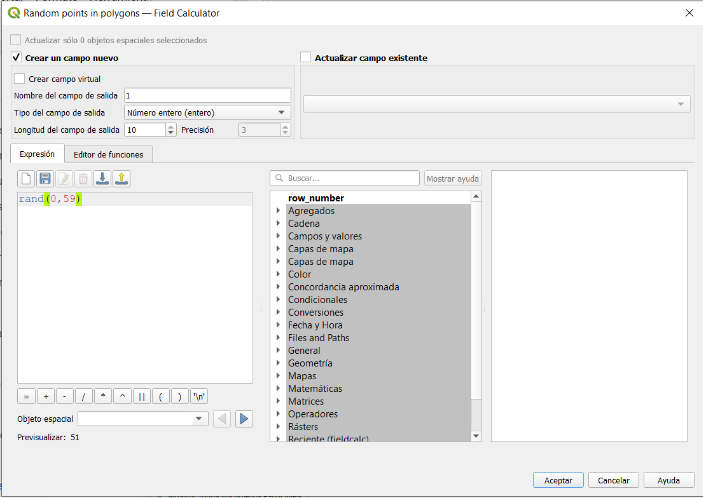

Figura 8.44 - Creación de valores aleatorios dentro de los límites especificados

Después de agregar las 7 columnas, su tabla de atributos debería verse como en la figura 8.45.

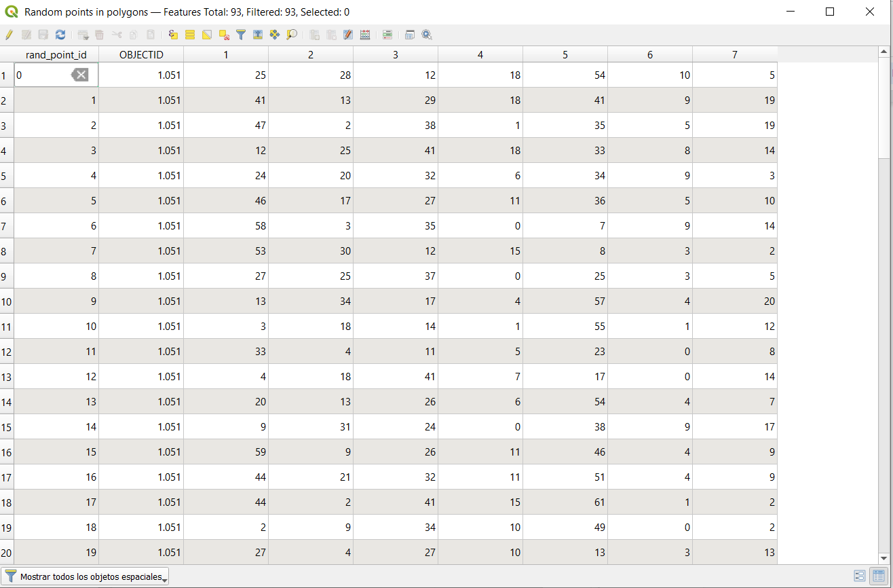

Figura 8.45 - Datos de precipitación ficticios para las 93 estaciones meteorológicas ficticias en el Estado de Jalisco.

A continuación, interpolamos estos valores para cada uno de los 7 días para obtener una capa perfecta que cubra todo el territorio de la provincia. Dado que la operación es repetitiva, usaremos procesamiento por lotes. El método de interpolación seleccionado, ¡estrictamente para fines de demostración! - es IDW - ponderado por distancia inversa.

Establezca los siguientes parámetros:

*   coeficiente de distancia: 2
*   extensión: limite_estadual_JALISCO_4486
*   tamaño del ráster de salida: 50.

Sus parámetros deben verse como en la siguiente figura 8.46.

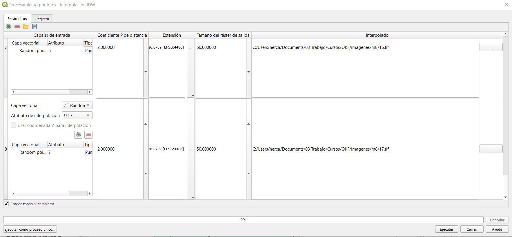

Figura 8.46 - Configuración de la ventana de procesamiento por lotes para interpolar los valores de precipitación para los 7 días.

El resultado de la interpolación se verá aproximadamente como en la figura 8.47.

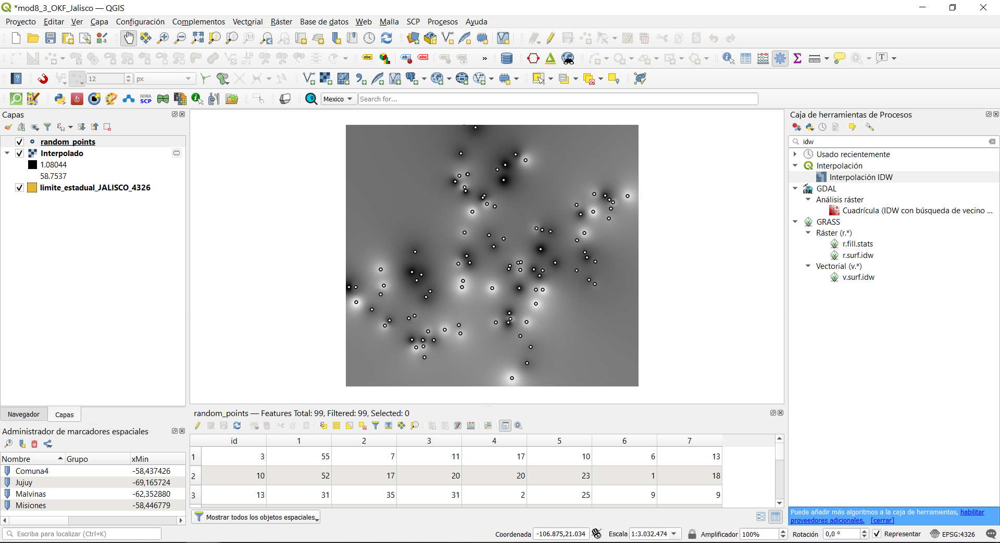

Figura 8.47 - Conjuntos de datos interpolados

Las estaciones meteorológicas son visibles en el lienzo del mapa y en el TOC puede ver los 7 conjuntos de datos ráster recién creados que representan los valores de precipitación para cada día en el Estado de Jalisco.

A continuación, cambiemos la simbología de las 7 capas a una más colorida (Propiedades ‣ Simbología ‣ Pseudocolor de banda única ‣ Magma).

Al observar los datos de puntos y los conjunto de datos ráster creados a partir de ellos, podemos notar que ahora tenemos valores para toda la región y no solo en la ubicación medida. Hay muchos algoritmos de procesamiento que se pueden aplicar a estos rásteres para extraer información, pero más sobre eso en el siguiente módulo: procesamiento y visualización de datos ráster.

Sin embargo, como hemos interpolado valores para 7 días, preparemos una breve animación sobre cómo han evolucionado los valores de precipitación para el Estado de Jalisco.

Para hacer eso, abra el diálogo Propiedades de test_meteo_stations_1 ráster ‣ haga clic en la pestaña Temporal ‣ marque la opción Temporal ‣ seleccione la fecha de inicio y finalización, como en la figura 8.48. Haga lo mismo con las 7 capas ráster.

")

")

")

Figura 8.48 - Configuración de información temporal para el dataset ráster (1, 2, 7).

Abra el Panel del controlador temporal (se puede encontrar en Ver ‣ Paneles ‣ Panel del controlador temporal) y configure los parámetros como en la figura 8.49.

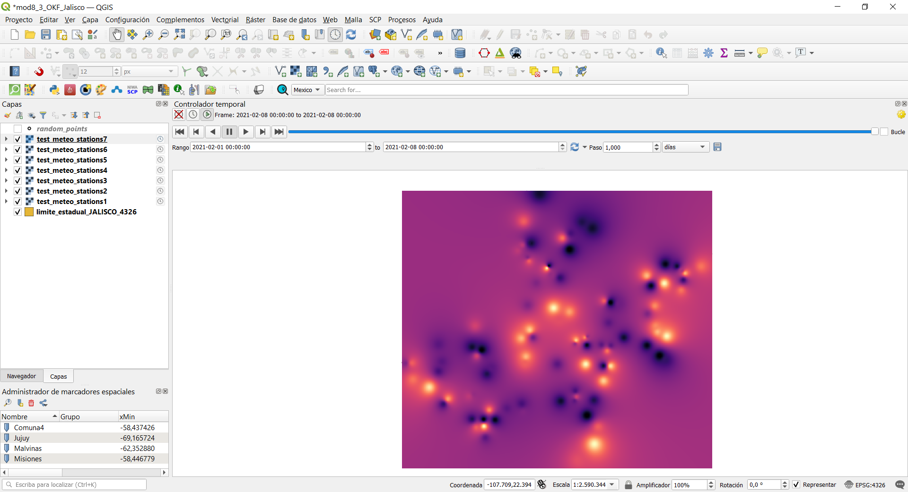

Figura 8.49 - Configure los parámetros del Panel de controlador de tiempo.

Haga clic en el botón de reproducción  y vea cómo cambian los valores. Puede elegir qué otras capas serán visibles. En la figura 8.50, agregamos la capa vectorial de edificios.


Figura 8.50 - Selección de otras capas para que sean visibles en la animación temporal.

**Preguntas del cuestionario**

1. ¿Existe un algoritmo para interpolar datos en QGIS o más?

Hay más algoritmos implementados.

1. ¿Para qué es útil la interpolación?

La interpolación es útil para estimar datos basados ​​en datos conocidos.
