# Módulo 9 - Procesamiento y análisis de ráster

Autor: Codrina Ilie


## Introducción pedagógica

Este módulo se centra en un tipo específico de modelo de datos geográficos: geodatos ráster.

Al final de este módulo, los alumnos tendrán la comprensión básica de los siguientes conceptos:

*   modelo de datos ráster
*   punto de la cuadrícula **vs** celda de la cuadrícula
*   bandas de un conjunto de datos ráster
*   álgebra de mapas
*   las cuatro resoluciones de un ráster (espacial, temporal, espectral y radiométrica)
*   remuestreo
*   procesamiento por lotes
*   detección de cambios


## Herramientas y recursos necesarios

*   Este módulo se ha preparado utilizando [QGIS versión 3.16.1 - Hannover](https://qgis.org/en/site/forusers/download.html)
*   module9.gpkg
*   High Resolution Settlement Layer
*   SRTM Digital Elevation Model
*   Global Land Cover Map 2015-2019
*   El sistema de referencia de coordenadas utilizado es el ITRF92 / México zona 13N, EPSG 4486.


## Requisitos previos

*   Conocimientos básicos de funcionamiento de una computadora
*   Una sólida comprensión de los módulos 0, 1, 2, 6 y 8 de este plan de estudios.


## Introducción temática

## Desglose de los conceptos

### El modelo de datos ráster

Un ráster es una matriz regular de valores, como en la figura 9.1.


Figura 9.1 - Una matriz de valores

Los valores se pueden asignar a **puntos de la cuadrícula**, principalmente a los centroides, y en este caso, el ráster puede denominarse enrejado o grilla. La segunda opción es que los valores se asignen a la totalidad de la **celda de la cuadrícula**, denominada píxeles (ver figura 9.2). Para el primer caso, el ráster generalmente representa un campo continuo, como elevación, temperatura, precipitaciones, concentraciones químicas, etc. Para el segundo caso, cuando los valores se asignan a toda el área del píxel, el ráster generalmente representa una imagen: una imagen de satélite, un mapa escaneado, mapas vectoriales convertidos (ver Fase 2). Cabe señalar que este modelo de datos no es particularmente eficiente para redes y otros tipos de datos que dependen en gran medida de las líneas, como los límites de las propiedades.


Figura 9.2 - En el lado izquierdo, los valores se asignan a centroides.

A la derecha, los valores se asignan al área de la celda de la cuadrícula: el píxel.


### Racionalidad del procesamiento ráster

Como en el caso del procesamiento de datos vectoriales, la razón fundamental detrás del procesamiento de datos ráster se basa en la misma capacidad de los sistemas de información geográfica para almacenar, procesar y representar información de los fenómenos del mundo real, solo que la forma en que esto se logra difiere. En lugar de tener distintos puntos, líneas y polígonos almacenados como colecciones de coordenadas x e y, tenemos una matriz de valores que cubre un área específica como una malla. Para tener una imagen más clara en mente, imagine los mapas de temperatura que se muestran en la televisión. La temperatura es un campo continuo, no hay lugares en la superficie de la Tierra sin temperatura, ya sea positiva, negativa o 0.

Se pueden realizar muchas operaciones en conjuntos de datos ráster, el concepto de geoprocesamiento detallado en el módulo 8 también se aplica aquí. El término utilizado para englobar las operaciones que se pueden realizar en rásteres es _álgebra de mapas_.

El álgebra de mapas representa un conjunto de operaciones primitivas [^ 1] en un SIG que permite que dos o más capas ráster de _dimensiones similares_ produzcan una nueva capa ráster (mapa) usando varias operaciones como suma, resta, comparación, etc.

Hay cuatro categorías de operaciones que se pueden realizar en rásteres, como sigue:

*   Operaciones aritméticas: suma, resta, multiplicación, división.
*   Operaciones estadísticas: mínimo, máximo, promedio, mediana.
*   Las operaciones relacionales proporcionan comparaciones entre celdas que utilizan funciones como mayor que, menor que o igual a.
*   Operaciones trigonométricas: seno, coseno, tangente, arcoseno entre dos o más conjuntos de datos ráster.
*   Las operaciones exponenciales y logarítmicas usan funciones de exponentes y logaritmos.

Para cada una de estas operaciones, existen algoritmos implementados en la mayoría de los entornos SIG que permiten al usuario aplicarlos en sus datos. A continuación, también implementaremos algunas de las operaciones más comunes para tener una idea de cómo trabajar y qué se debe esperar de este tipo de procesamiento de datos.

El concepto de _dimensiones similares se_ refiere a las características de los conjuntos de datos ráster. Es decir, las operaciones detalladas anteriormente no se pueden realizar con resultados significativos en 2 conjuntos de datos ráster con diferentes resoluciones espaciales, temporales o espectrales. A continuación, presentaremos muy brevemente las cuatro resoluciones que son relevantes para las imágenes rasterizadas.

Recordando cuáles son los 4 tipos de resoluciones de una imagen satelital (raster con valores asignados al área de celda - píxeles):

1. La **resolución espacial** corresponde al tamaño elemental de la superficie del suelo medida, se expresa en unidades de longitud y representa la longitud de un lado del píxel (ver figura 9.3). Por ejemplo, como ha visto en el módulo 3, los datos de la capa de asentamiento de alta resolución tienen una resolución espacial de 30 metros, es decir, cada píxel del conjunto de datos estima el número de personas que viven dentro de un metro de 30.

2. La **resolución temporal** está asociada con imágenes aéreas (imágenes adquiridas por satélites, aviones, helicópteros, drones) y corresponde al período entre 2 imágenes consecutivas del mismo punto exacto de la Tierra, tomadas en las mismas condiciones (tanto como sea posible), como como el mismo avión, la misma altitud, etc. Por ejemplo, Landsat 8 tiene una resolución temporal de 16 días, es decir, cada punto de la Tierra es revisado por el satélite Landsat 8 cada 16 días [^ 2].

3. **Resolución espectral**: los sensores a bordo de satélites o aviones capturan la radiación electromagnética proveniente de todos los objetos de la Tierra (agua, asentamientos, bosques, carreteras, edificios, tierra desnuda, etc.) y los sensores están diseñados específicamente para capturarla en una banda espectral conocida determinada. (o longitud de onda). El ojo humano puede ver una parte muy pequeña del espectro electromagnético: la luz visible (roja, verde y azul), ¡pero los sensores pueden 'ver' mucho más! (ver figura 9.4)

)](media/fig94.png "Electromagnetic spectrum (photo credit [NASA Science](https://science.nasa.gov/ems/01_intro))")

Figura 9.4 - Espectro electromagnético (crédito de la foto NASA Science - [https://science.nasa.gov/ems/01_intro](https://science.nasa.gov/ems/01_intro))

4. La **resolución radiométrica** está determinada por el número de bits en los que se divide la radiación registrada. En datos de 8 bits, los números digitales (DN) pueden oscilar entre 0 y 255 para cada píxel (28 ¼ 256 números posibles en total). Claramente, más bits significa que el sensor puede detectar cambios más sutiles en la energía que captura, lo que conduce a una imagen 'más clara', una mayor precisión radiométrica del sensor, pero también requiere más espacio para almacenar los datos.

**Bandas espectrales**

Un conjunto de datos ráster contiene una o más capas llamadas bandas. Cada banda almacena otro conjunto de información sobre el área que cubre el ráster. Cada banda tiene exactamente la misma extensión y coordenadas, pero no necesariamente la misma resolución espacial. Además, además de los valores almacenados, hay otras propiedades clave contenidas, como: valores de celda máximo, mínimo y medio e _histograma_ de valores de celda.

Un **histograma** es una representación aproximada de la distribución de datos numéricos (ver figura 9.5); de otras formas, es una forma en la que uno puede tener una idea de los datos disponibles.


Figura 9.5 - Ejemplo de un histograma, donde x es una capa ráster

¿Por qué es esto importante en nuestro contexto? Porque, como se mencionó al principio, un ráster es una matriz de valores numéricos continuos (recuerde el ejemplo de temperatura) y un histograma ayuda al usuario a comprender cómo se distribuyen los valores de sus rásteres. Cada barra agrupa los valores de celda que se encuentran en un rango específico, mientras más alta sea la barra, más celdas tienen valores en ese rango específico. En caso de que el ráster tenga más de una banda, se calculará el histograma para cada una. No hay espacios entre los rangos representados en un histograma, el histograma se usa solo para datos continuos.


## Contenido principal

### Fase 1: Comprensión de sus datos ráster.

En las últimas dos décadas, la cantidad de satélites que captan datos de la Tierra ha crecido exponencialmente. Además, una política de acceso a datos abiertos que ha sido adoptada por diferentes agencias espaciales, como la NASA para el [programa Landsat](https://www.usgs.gov/core-science-systems/nli/landsat/landsat-data-access?qt-science_support_page_related_con=0#qt-science_support_page_related_con) o la Agencia Espacial Europea para el [programa Copernicus](https://www.copernicus.eu/en/access-data), lo cual ha abierto la puerta a un flujo abrumador de datos de observación de la Tierra. Como consecuencia natural, el progreso científico de los algoritmos, las metodologías y el desarrollo de herramientas más poderosas para procesar datos ráster, especialmente imágenes satelitales, ha sido impresionante y extenso en campos como la agricultura, la silvicultura, el desarrollo urbano, las actividades humanitarias, el océano y el mar. monitoreo de agua, seguridad y muchos más. En las siguientes 3 fases, presentaremos algunas de las técnicas de procesamiento más comunes y qué resultados esperar de ellas.


#### Paso 1. Prepare su entorno de trabajo.

Comenzaremos agregando a su proyecto QGIS todos los conjuntos de datos ráster con los que trabajaremos, de la siguiente manera:

*   Datos de capa de asentamiento de alta resolución
*   Modelo de superficie digital global ALOS "ALOS World 3D - 30m (AW3D30)"
*   Cobertura terrestre dinámica moderada: las 5 épocas disponibles 2015, 2016, 2017, 2018 y 2019.

Como los datos de la capa de asentamiento de alta resolución se presentaron en un módulo anterior, también detallaremos información sobre los otros 2 conjuntos de datos que emplearemos en este módulo.

1. El modelo de superficie digital global de ALOS (AW3D30) es un conjunto de datos de modelo de superficie digital global (DSM) con una resolución horizontal de aproximadamente 30 metros (malla de 1 segundo de arco). Un DSM incluye la superficie del suelo, la vegetación y los objetos artificiales, como edificios, puentes, etc., a diferencia del modelo de elevación digital que considera estrictamente el terreno.

2. Dynamic Land Cover Map (Mapa dinámico de cobertura terrestre) es un producto de Copernicus Global Land Service (CGLS) derivado de la serie de tiempo PROBA-V 100 my varios otros conjuntos de datos de cobertura terrestre. El producto proporciona clases discretas de cobertura terrestre primaria, así como capas de campo continuas para todas las clases de cobertura terrestre básica que proporcionan estimaciones proporcionales de vegetación / cobertura terrestre para los tipos de cobertura terrestre. El producto tiene 3 bandas: discrete_classification, (clasificación discreta), forest_type (tipo de bosque) y urban_coverfraction (fraccion de cobertura urbana). Las 2 tablas siguientes presentan los valores para cada clase discreta:


Tabla 1 Tabla de valores de la banda discrete_classification (clasificación discreta)

<table>
  <tr>
   <td>Valor
   </td>
   <td>Color
   </td>
   <td>Descripción
   </td>
  </tr>
  <tr>
   <td>0
   </td>
   <td>282828
   </td>
   <td>Desconocido. No hay suficientes datos satelitales disponibles o no hay datos.
   </td>
  </tr>
  <tr>
   <td>20
   </td>
   <td>FFBB22
   </td>
   <td>Arbustos. Plantas leñosas perennes con tallos persistentes y leñosos y sin tallo principal definido que mida menos de 5 m de altura. El follaje de los arbustos puede ser perenne o caducifolio.
   </td>
  </tr>
  <tr>
   <td>30
   </td>
   <td>FFFF4C
   </td>
   <td>Vegetación herbácea. Plantas sin tallo persistente o brotes por encima del suelo y sin estructura firme definida. La cobertura de árboles y arbustos es inferior al 10%.
   </td>
  </tr>
  <tr>
   <td>40
   </td>
   <td>F096FF
   </td>
   <td>Vegetación / agricultura cultivada y gestionada. Tierras cubiertas con cultivos temporales seguidos de cosecha y un período de suelo desnudo (por ejemplo, sistemas de cultivo único y múltiple). Tenga en cuenta que los cultivos leñosos perennes se clasificarán como el tipo apropiado de cobertura forestal o arbustiva.
   </td>
  </tr>
  <tr>
   <td>50
   </td>
   <td>FA0000
   </td>
   <td>Urbano / edificado. Terreno cubierto por edificios y otras estructuras artificiales.
   </td>
  </tr>
  <tr>
   <td>60
   </td>
   <td>B4B4B4 
   </td>
   <td>Descubierto / escasa vegetación. Tierras con suelo, arena o rocas expuestas y nunca tienen más del 10% de cobertura vegetal durante cualquier época del año.
   </td>
  </tr>
  <tr>
   <td>70
   </td>
   <td>F0F0F0
   </td>
   <td>Hielo y nieve. Aterriza bajo cubierta de nieve o hielo durante todo el año.
   </td>
  </tr>
  <tr>
   <td>80
   </td>
   <td>0032C8
   </td>
   <td>Cuerpos de agua permanentes. Lagos, embalses y ríos. Pueden ser masas de agua dulce o salada.
   </td>
  </tr>
  <tr>
   <td>90
   </td>
   <td>0096A0
   </td>
   <td>Humedal herbáceo. Tierras con una mezcla permanente de agua y vegetación herbácea o leñosa. La vegetación puede estar presente en agua salada, salobre o dulce.
   </td>
  </tr>
  <tr>
   <td>100
   </td>
   <td>FAE6A0 
   </td>
   <td>Musgos y líquenes.
   </td>
  </tr>
  <tr>
   <td>111
   </td>
   <td>58481F
   </td>
   <td>Bosque cerrado, hoja de aguja siempre verde. Copas de los árboles> 70%, casi todos los árboles con hojas de aguja permanecen verdes todo el año. El dosel nunca está exento de follaje verde.
   </td>
  </tr>
  <tr>
   <td>112
   </td>
   <td>9900
   </td>
   <td>Bosque cerrado, hoja ancha siempre verde. Copas de los árboles> 70%, casi todos los árboles de hoja ancha permanecen verdes durante todo el año. El dosel nunca está exento de follaje verde.
   </td>
  </tr>
  <tr>
   <td>113
   </td>
   <td>70663E
   </td>
   <td>Bosque cerrado, hoja de aguja decidua. La copa de los árboles> 70%, consiste en comunidades de árboles de hojas de aguja estacionales con un ciclo anual de períodos de hojas abiertas y sin hojas.
   </td>
  </tr>
  <tr>
   <td>114
   </td>
   <td>00CC00
   </td>
   <td>Bosque cerrado, hoja ancha caducifolia. La copa de los árboles> 70%, consiste en comunidades de árboles de hoja ancha estacionales con un ciclo anual de periodos de hojas abiertas y sin hojas.
   </td>
  </tr>
  <tr>
   <td>115
   </td>
   <td>4E751F
   </td>
   <td>Bosque cerrado, mixto.
   </td>
  </tr>
  <tr>
   <td>116
   </td>
   <td>7800
   </td>
   <td>Bosque cerrado, que no coincide con ninguna de las otras definiciones.
   </td>
  </tr>
  <tr>
   <td>121
   </td>
   <td>666000
   </td>
   <td>Bosque abierto, hoja de aguja siempre verde. La capa superior - árboles 15-70% y la segunda capa - mezcla de arbustos y pastizales, casi todos los árboles de hojas de aguja permanecen verdes todo el año. El dosel nunca está exento de follaje verde.
   </td>
  </tr>
  <tr>
   <td>122
   </td>
   <td>8DB400
   </td>
   <td>Bosque abierto, hoja ancha siempre verde. La capa superior - árboles 15-70% y la segunda capa - mezcla de arbustos y pastizales, casi todos los árboles de hoja ancha permanecen verdes durante todo el año. El dosel nunca está exento de follaje verde.
   </td>
  </tr>
  <tr>
   <td>123
   </td>
   <td>8D7400
   </td>
   <td>Bosque abierto, hoja de aguja caducifolia. La capa superior - árboles 15-70% y la segunda capa - mezcla de arbustos y pastizales, consiste en comunidades de árboles de hojas de aguja estacionales con un ciclo anual de períodos de hojas abiertas y sin hojas.
   </td>
  </tr>
  <tr>
   <td>124
   </td>
   <td>A0DC00
   </td>
   <td>Bosque abierto, hoja ancha caducifolia. La capa superior - árboles 15-70% y la segunda capa - mezcla de arbustos y pastizales, consiste en comunidades de árboles latifoliados estacionales con un ciclo anual de periodos con y sin hojas.
   </td>
  </tr>
  <tr>
   <td>125
   </td>
   <td>929900
   </td>
   <td>Bosque abierto, mixto.
   </td>
  </tr>
  <tr>
   <td>126
   </td>
   <td>648C00
   </td>
   <td>Bosque abierto, no coincide con ninguna de las otras definiciones.
   </td>
  </tr>
  <tr>
   <td>200
   </td>
   <td>80
   </td>
   <td>Océanos, mares. Pueden ser masas de agua dulce o salada.
   </td>
  </tr>
</table>


Tabla 2: tabla de valores de la banda forest_type (tipo de bosque)

<table>
  <tr>
   <td>Valor
   </td>
   <td>Color
   </td>
   <td>Descripción
   </td>
  </tr>
  <tr>
   <td>0
   </td>
   <td>282828
   </td>
   <td>Desconocido
   </td>
  </tr>
  <tr>
   <td>1
   </td>
   <td>666000
   </td>
   <td>Hoja de aguja perenne
   </td>
  </tr>
  <tr>
   <td>2
   </td>
   <td>9900
   </td>
   <td>Hoja ancha de hoja perenne
   </td>
  </tr>
  <tr>
   <td>3
   </td>
   <td>70663E
   </td>
   <td>Hoja de aguja caducifolio
   </td>
  </tr>
  <tr>
   <td>4
   </td>
   <td>A0DC00
   </td>
   <td>Hoja ancha caducifolia
   </td>
  </tr>
  <tr>
   <td>5
   </td>
   <td>929900
   </td>
   <td>Mezcla de tipos de bosque
   </td>
  </tr>
</table>


Para organizar mejor sus capas, agrúpelas por categoría, de la siguiente manera: para las 5 capas ráster de cobertura terrestre, cree un grupo denominado Cobertura terrestre (en la tabla de contenidos, haga clic en el pictograma Agregar grupo). Para el modelo de superficie digital, cree un grupo llamado JAXA [^ 3] DSM.

No olvide agregar también el límite del área de trabajo, Estado de Jalisco, que es un conjunto de datos vectoriales.

Su ventana de mapa QGIS debería verse como en la figura 9.6, tal vez en colores ligeramente diferentes.

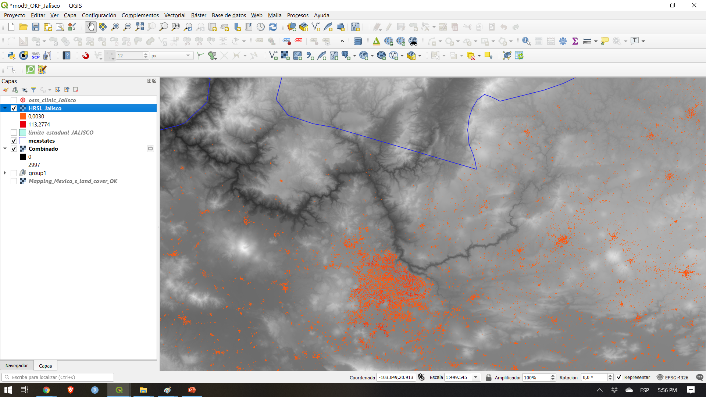

Figura 9.6 - conjuntos de datos ráster cargados


#### Paso 2. Comprenda lo que está viendo.

A continuación, utilizaremos una serie de herramientas que nos permitirán tener una idea de los datos con los que estamos trabajando.

Después de cargar todos los conjuntos de datos, verificaremos el sistema de referencia de coordenadas en el que se encuentran todos nuestros conjuntos de datos. Como sabemos por módulos anteriores, QGIS ofrece la posibilidad de reproyectar todos los conjuntos de datos cargados en el proyecto sobre la marcha, sin embargo, eso podría conducir a un geoprocesamiento. problemas en el camino. Así, aunque todas las capas estén correctamente superpuestas, como se puede decir por inspección visual, procederemos a reproyectarlas todas en el sistema de coordenadas oficial de nuestra región de interés, Estado de Jalisco - EPSG: 3123.

Hay varias formas de obtener información. en las capas cargadas en QGIS, algunas proporcionan al usuario más detalles que otras. Para obtener una descripción general rápida de los metadatos de un conjunto de datos, se debe seleccionar la capa, hacer doble clic y abrir `Propiedades ‣ Información.`

Para la capa hrsl_phl_pop, la ventana de información se vería como en la figura 9.7.

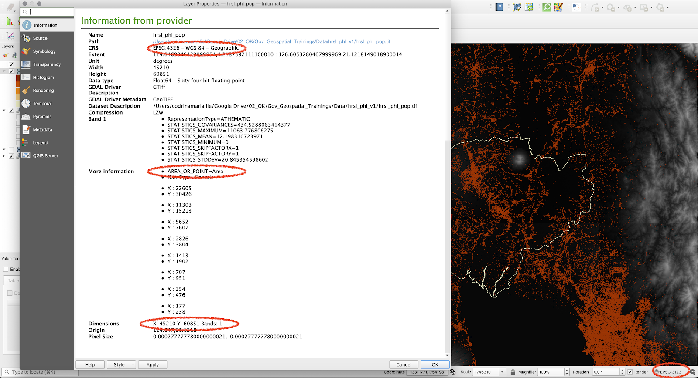

Figura 9.7 - Extracción de metadatos básicos de una capa ráster

Con respecto a nuestra primera pregunta sobre qué CRS se está utilizando para los conjuntos de datos que hemos cargado, podemos observar que incluso si el HRSL está correctamente superpuesto, la proyección del conjunto de datos nativo es EPSG 4326 - WGS 84 - Geográfico, con unidades medidas en grados. También identificamos que esta capa ráster específica tiene solo una banda, sin embargo, el tamaño de píxel es difícil de leer ya que la medición está en grados y no en metros, lo que la haría más fácil de entender.

Por lo tanto, lo primero que debe hacer es reproyectar todos los conjuntos de datos con los que trabajaremos en el mismo sistema de coordenadas - EPSG 3123.

Comenzando con los conjuntos de datos HRSL, vamos a `Ráster ‣ Proyecciones ‣ Deformar (Reproyectar) `(ver figura 9.8).


Figura 9.8 - Funcionalidad de reproyección en QGIS

Después de seleccionar la funcionalidad Deformación, aparecerá una nueva ventana que le permitirá al usuario configurar los parámetros correctos (ver figura 9.9).

 QGIS window")

Figura 9.9a - Ventana de deformación (reproyectar) QGIS

If you selected the output to be **[Save to temporary file]** then there will be a raster layer named `Reprojected` in the Layers Panel. This is a memory layer and you can rename this layer to Reprojected_HRSL_Jalisco_Population and save it to make it persistent.


Figure 9.9b - Reprojected HRSL

Notará que, a diferencia de cuando reproyectó conjuntos de datos vectoriales, hay un nuevo parámetro que puede configurar como "Método de remuestreo para usar".

**Remuestreo** representa la interpolación de los valores de la celda para que transforme el ráster como lo indica el usuario. Hay varios métodos de remuestreo disponibles dentro de la funcionalidad Deformación, cada uno con su propio soporte matemático. Sin embargo, las explicaciones detalladas sobre cada uno no son el alcance de este ejercicio. La lectura adicional está disponible en las referencias.

En este caso particular, queremos reproyectar datos de población - valores numéricos. Y según el método de remuestreo seleccionado (vecino más cercano), la coordenada de cada píxel de salida se utilizará para calcular un nuevo valor a partir de los valores de píxel cercanos en la capa de entrada (ver figura 9.10).


Figura 9.10 - Método de remuestreo - vecino más cercano (crédito de la foto: documentación de ILWIS - [(http://spatial-analyst.net/ILWIS/htm/ilwisapp/resample_functionality.htm](http://spatial-analyst.net/ILWIS/htm/ilwisapp/resample_functionality.htm))

Los píxeles de entrada están representados por líneas negras discontinuas, las coordenadas de los píxeles de entrada por puntos negros; los píxeles de salida están representados por líneas sólidas rojas, las coordenadas de los píxeles de salida por signos más rojos. Las flechas grises indican cómo se determinan los valores de salida. Se puede ver en la figura 9.10, algunos valores del mapa de entrada se pueden usar dos veces en el mapa de salida, mientras que otros valores de entrada pueden no usarse en absoluto. Por eso, aunque es uno de los métodos más rápidos para volver a muestrear, no es apropiado en nuestro caso, ya que estamos trabajando con datos numéricos: datos de población. Este método de remuestreo es adecuado para datos categóricos, como valores de cobertura terrestre.

Para reproyectar nuestro conjunto de datos ráster de población, utilizaremos el método de interpolación bilineal para volver a muestrear los valores de píxeles (ver figura 9.11). 


Figura 9.11 Método de remuestreo - bilineal (crédito de la foto: ILWIS documentación - [(http://spatial-analyst.net/ILWIS/htm/ilwisapp/resample_functionality.htm](http://spatial-analyst.net/ILWIS/htm/ilwisapp/resample_functionality.htm))

El método bilineal determina el nuevo valor de una celda basado en un promedio de distancia ponderado de los cuatro centros de celda de entrada más cercanos. Es útil para datos continuos y suavizará los datos.

Procedemos a verificar el CRS de los 5 conjuntos de datos de cobertura terrestre que hemos cargado en nuestro proyecto QGIS. Al acceder a la `información de Propiedades de capa ‣`, podemos ver que las 5 capas de cobertura terrestre se proyectan en EPSG: 3857 - WGS 84 / Pseudo-Mercator. Una solución sería utilizar la herramienta Reproyectar y configurar para cada capa individualmente. Sin embargo, una forma más rápida es utilizar la función de reproyección que se ejecuta como un _procesamiento por lotes_.

El procesamiento por lotes es la capacidad de ejecutar procesos repetitivos en datos, con una mínima interacción del usuario. La mayoría de las funcionalidades de QGIS tienen esta opción disponible y se puede activar en la ventana del proceso cambiando a la pestaña Ejecutar procesamiento por lotes (ver figura 9.12).

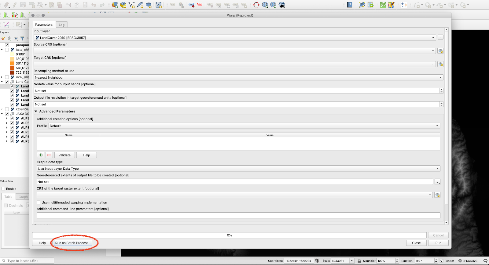

Figura 9.12 - Pestaña de procesamiento por lotes en una ventana de funcionalidad QGIS

Para las 5 capas ráster de cobertura terrestre, usaremos el procesamiento por lotes y como método de remuestreo del vecino más cercano. Para agregar una nueva capa, haga clic en el pictograma +. Para llenar automáticamente el CRS y los parámetros del método de remuestreo, haga clic en el botón de autocompletar en la parte superior de las columnas correspondientes y seleccione `Rellenar`. Cambie el nombre de los rásteres reproyectados agregando el código EPSG al final del nombre, por ejemplo, LandCover2015, se convertirá en landCover2015_4486. Configure sus parámetros como en la figura 9.13: CRS de origen: EPSG: 4486, CRS de destino EPSG 4486, método de remuestreo a utilizar: vecino más cercano (explicamos en el párrafo anterior por qué), valor de nodata para las bandas de salida: 255 (de la ventana de información, vemos el tipo de datos - yte - entero sin signo de 8 bits - lo que significa que el valor máximo puede ser 255), resolución de salida: 100 m (como los rásteres de cobertura terrestre iniciales). Después de configurar todos los parámetros, marque la casilla en la esquina izquierda de la ventana -` Cargar capas al finalizar.` Pulsa `Ejecutar`.


Figura 9.13a - Procesamiento por lotes para reproyectar los rásteres de cobertura terrestre


Figure 9.13b - Autofill output names


Figure 9.13c - Reprojected land cover rasters

Luego vienen los rásteres del modelo de superficie digital. Como se puede observar, para cubrir nuestra región de interés, necesitábamos varios _mosaicos ráster_. Cuando los archivos ráster se vuelven demasiado grandes, imagine un solo archivo DSM a 30m para Europa, que tiene más de 10 millones de kilómetros cuadrados, se dividen en **mosaicos** porque, en áreas más pequeñas, son más fáciles de administrar.

Aunque podríamos usar la herramienta de ajuste en modo por lotes para reproyectar todos los archivos ráster DSM, en una inspección visual, también se puede notar que las delimitaciones entre cada mosaico son bastante visibles, lo que lo hace, al menos, visualmente poco atractivo. Lo que sería útil es tener una visión completa del terreno, como un fenómeno continuo, como es, de hecho, sin interrupciones artificiales. Para obtenerlo, usaremos la herramienta de fusión GDAL, disponible en la barra de herramientas de Procesamiento para fusionar todos los rásteres DSM. Para abrirlo, vaya a `Procesamiento ‣ Caja de herramientas `y en la barra de búsqueda escriba fusionar (ver figura 9.14)`.`

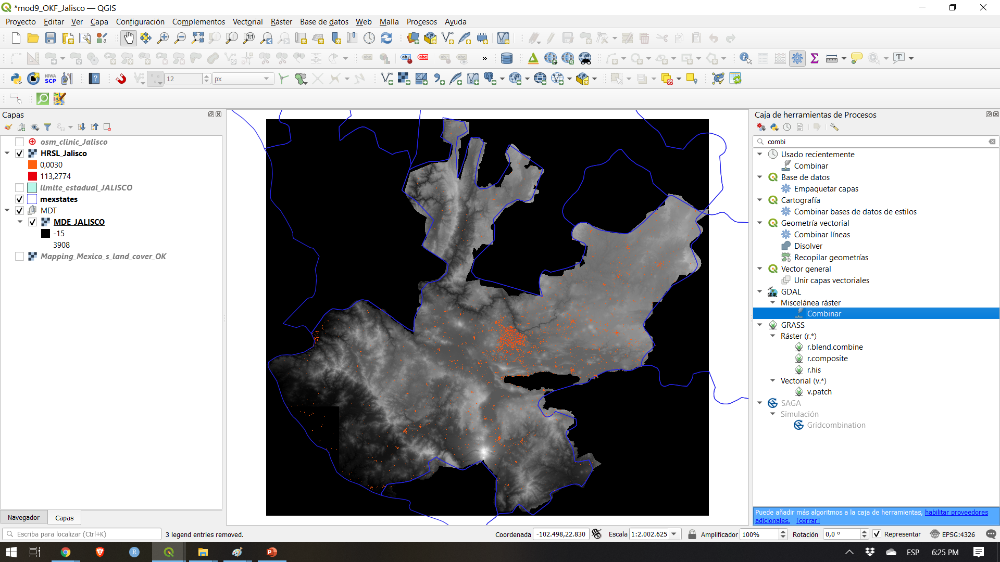

Figura 9.14 - Encontrar la herramienta de combinación GDAL en la caja de herramientas de procesamiento

En la ventana de combinación que se abre, seleccione los archivos ráster DSM que queremos volver mosaico y haga clic en ejecutar. Guarde el resultado como DSM_mosaico. El resultado debería verse como en la figura 9.15.


Figure 9.15a - Selecting the ASTER layers to merge


Figure 9.15b - Parameters of the Merge processing algorithm

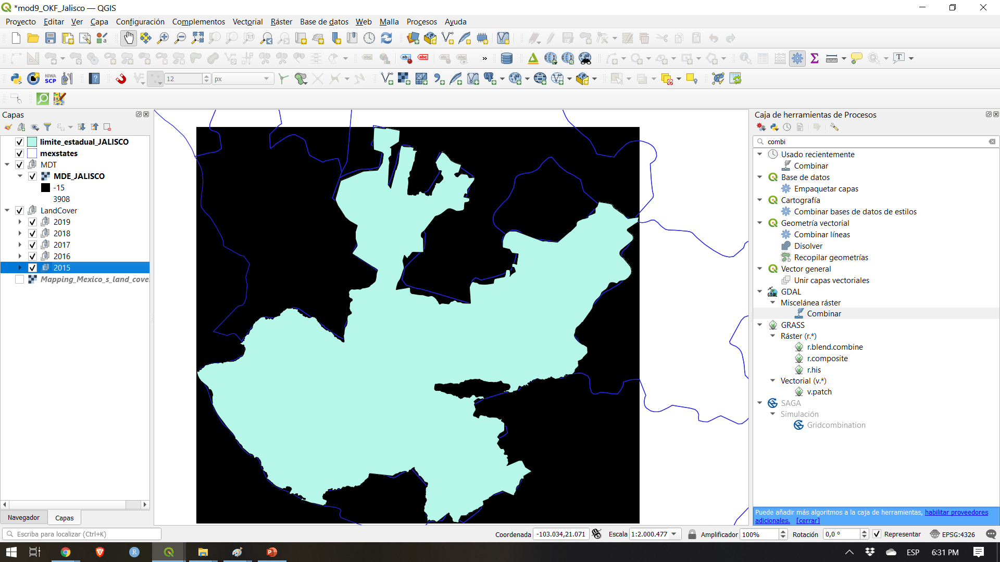

Figura 9.15c - Mosaico de todos los archivos DSM correspondientes a nuestra región de trabajo

Ahora, podemos proceder a reproyectar el mosaico - un archivo, en lugar de 6 archivos. Vaya a `Ráster ‣ proyección ‣ Envoltura (reproyectar)` y configure los parámetros conocidos: 

* Fuente CRS EPSG 4326, 
* Objetivo CRS: EPSG: 3123, 
* Método de remuestreo: Vecino más cercano, 
* resolución de archivo de salida - 30 m. 
* Guarde el resultado como DSM_mosaico_4486.

En este punto, deberíamos tener todas las capas en el mismo CRS - EPSG 4486.


Figure 9.15d - Reproject Merged raster

Podemos hacer otra verificación para asegurarnos de que todos los rásteres con los que estamos trabajando estén proyectados y obtener información adicional sobre los datos ejecutando un proceso por lotes de Información de trama sobre todos. Para abrir la ventana de funciones, vaya a `Ráster ‣ Varios ‣ Información de ráster`. La ventana de información ráster de procesamiento por lotes debe verse como en la figura 9.16.

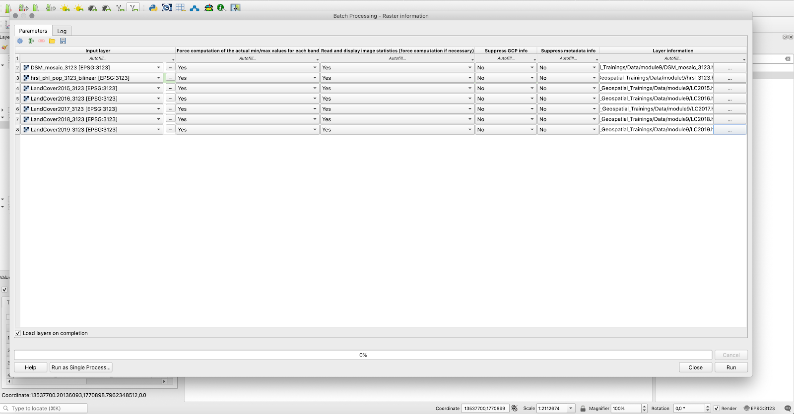

Figura 9.16 - Proceso por lotes para extraer información en un archivo HTML separado para múltiples capas ráster. 

Un archivo HTML de información ráster debería verse como a continuación. Un archivo HTML se puede abrir con cualquier editor de texto o navegador web de su elección.


```
Driver: GTiff/GeoTIFF
Files: C:\\Users\\herca\\Documents\\03 Trabajo\\Cursos\\OKF\\modulo2_capas_qgis\\Mexico\\MDE_JALISCO_4486.tif
Size is 15566, 13656
Coordinate System is:
PROJCRS["Mexico ITRF92 / UTM zone 13N",
BASEGEOGCRS["Mexico ITRF92",
DATUM["Mexico ITRF92",
ELLIPSOID["GRS 1980",6378137,298.257222101,
LENGTHUNIT["metre",1]]],
PRIMEM["Greenwich",0,
ANGLEUNIT["degree",0.0174532925199433]],
ID["EPSG",4483]],
CONVERSION["UTM zone 13N",
METHOD["Transverse Mercator",
ID["EPSG",9807]],
PARAMETER["Latitude of natural origin",0,
ANGLEUNIT["degree",0.0174532925199433],
ID["EPSG",8801]],
PARAMETER["Longitude of natural origin",-105,
ANGLEUNIT["degree",0.0174532925199433],
ID["EPSG",8802]],
PARAMETER["Scale factor at natural origin",0.9996,
SCALEUNIT["unity",1],
ID["EPSG",8805]],
PARAMETER["False easting",500000,
LENGTHUNIT["metre",1],
ID["EPSG",8806]],
PARAMETER["False northing",0,
LENGTHUNIT["metre",1],
ID["EPSG",8807]]],
CS[Cartesian,2],
AXIS["(E)",east,
ORDER[1],
LENGTHUNIT["metre",1]],
AXIS["(N)",north,
ORDER[2],
LENGTHUNIT["metre",1]],
USAGE[
SCOPE["unknown"],
AREA["Mexico - 108°W to 102°W"],
BBOX[14.05,-108,31.79,-102]],
ID["EPSG",4486]]
Data axis to CRS axis mapping: 1,2
Origin = (426831.833299999998417,2519690.029300000052899)
Pixel Size = (28.626103674675573,-31.007709973637965)
Metadata:
AREA_OR_POINT=Area
Image Structure Metadata:
INTERLEAVE=BAND
Corner Coordinates:
Upper Left ( 426831.833, 2519690.029) (105d42'46.14"W, 22d46'59.30"N)
Lower Left ( 426831.833, 2096248.742) (105d41'41.98"W, 18d57'26.34"N)
Upper Right ( 872425.763, 2519690.029) (101d22'28.01"W, 22d44'36.75"N)
Lower Right ( 872425.763, 2096248.742) (101d27'53.56"W, 18d55'29.68"N)
Center ( 649628.798, 2307969.386) (103d33'42.02"W, 20d51'57.04"N)
Band 1 Block=15566x1 Type=Float32, ColorInterp=Gray
```


Después de preparar los ráster reproyectándolos en los CRS que estamos trabajando y leyendo sus metadatos para comprender mejor los archivos, es hora de profundizar en los datos reales. Para lograrlo, calcularemos e interpretaremos los histogramas (consulte la sección Desglose de conceptos para obtener más detalles) de nuestros rásteres.

Para calcular un histograma, seleccione la capa ráster que le interese, ábrala haciendo doble clic en la ventana de diálogo `Propiedades` y vaya a `Histograma` (ver figura 9.17).


Figura 9.17 - Ventana de Histograma 

Toca el botón `Computar histograma` y QIS lo computará automáticamente.

Después de computar el histograma, podemos ver que el mouse se convierte en una lupa. Es una herramienta que permite la inspección del histograma, viendo como varía la frecuencia de diferentes valores. Acercándose puede ver algo como en la figura 9.18.

Para volver a la vista completa, haga clic en la izquierda.


Figura 9.18 - Ampliación del histograma calculado DSM_mosaico_4486

Más que simplemente ver la distribución de los valores numéricos de los píxeles, el histograma permite al usuario reclasificar los valores para la visualización del ráster. Para ello, utilice las 2 herramientas para señalar en el histograma los nuevos valores mínimo y máximo (consulte la figura 9.19).

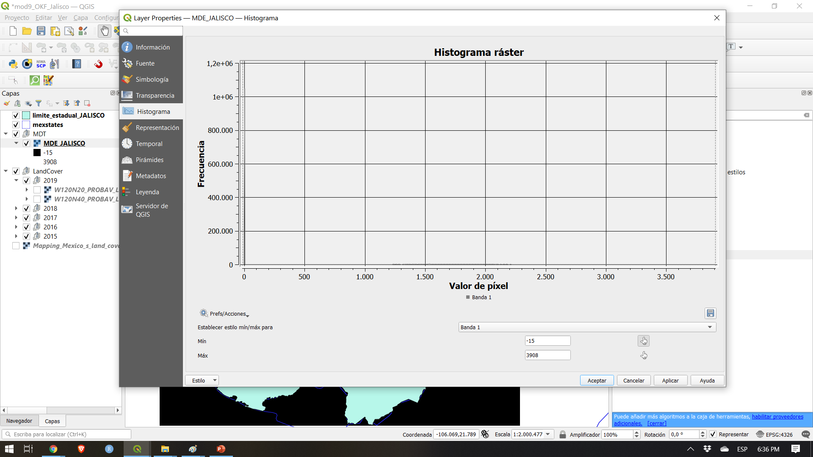

Figura 9.19 - Selección de valores mínimos y máximos para reclasificar el ráster

Después de presionar Aplicar, el ráster se representará utilizando el nuevo rango mínimo-máximo seleccionado. Esta funcionalidad permite al usuario ignorar valores extremos que pueden estirar de forma anormal el ráster.

Aunque la siguiente herramienta que usamos es un complemento (consulte el módulo 1 para obtener detalles del complemento), lo consideramos muy útil para comenzar a trabajar con ráster. Nos referimos a la `Value Tool (Herramienta de Valores)` que permite la identificación inmediata de los valores de las celdas al pasar el cursor sobre capas ráster.

Vaya a` Complemento ‣ Administrar e instalar complementos,` busque el complemento `Value Tool` y haga clic en instalar. Luego, haga clic derecho en la barra de la ventana principal de QGIS para abrir todos los Paneles y Barras de Herramientas disponibles en su instalación de QGIS (ver figura 9.20).

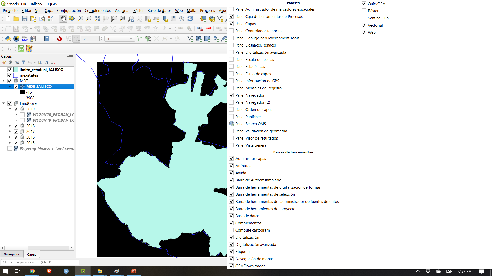

Figura 9.20 - Disponibilidad de paneles y barras de herramientas en QGIS

La practicidad de esta herramienta reside en su simplicidad de uso, con solo unos pocos clics, uno puede extraer muy fácilmente celdas de valor en las áreas exactas de interés. Además, permite esto para todas las capas ráster cargadas.

Value Tool tiene 3 pestañas: Tabla, Gráfico, Opciones (consulte la figura 9.21).

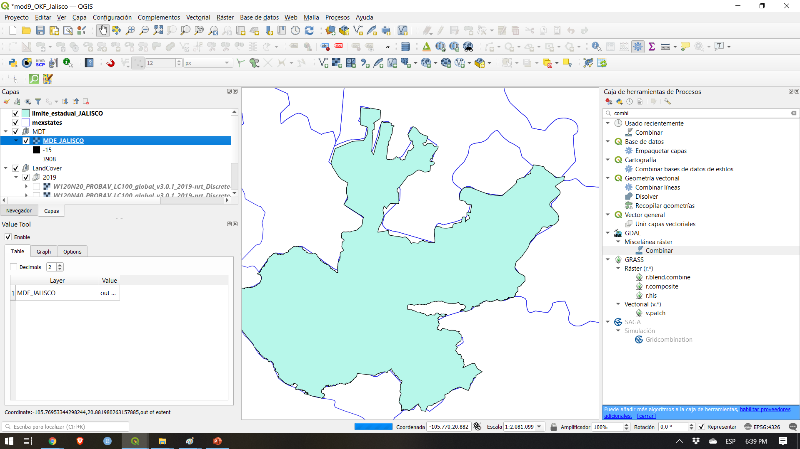

Figura 9.21 - Value Tool cargado - resaltar en la primera pestaña - Tabla

La primera pestaña - Tabla - presenta una lista de todas las capas ráster cargadas y los valores de las celdas, a medida que el usuario mueve el mouse. También existe la posibilidad de seleccionar con cuántos decimales se deben mostrar los valores. Si el mouse se desplaza fuera de la extensión de una capa ráster, en lugar de un valor, se mostrará un mensaje: "fuera de extensión".

La segunda pestaña, Gráfico, muestra en un gráfico unido todos los valores que lee en la posición del mouse. Permite al usuario insertar valores para mínimo y máximo en el eje Y, que es el eje de los valores de celda. El eje X enumera todas las bandas del ráster que muestra en la tabla, con los números de orden correspondientes: la banda que tiene el número 1 en la primera pestaña, también será la número 1 en el gráfico.

La tercera pestaña permite al usuario personalizar lo que `Value Tool` muestra: qué capas (todas, solo las visibles o las seleccionadas) y qué bandas mostrar.


#### Preguntas de evaluación

1. ¿Se pueden reproyectar capas ráster en otros sistemas de coordenadas?
*   Sí.
*   No
1. ¿Puede haber espacios entre los rangos de valores de un histograma calculado para una capa ráster?
*   Sí.
*   No.
1. ¿Pueden diferentes bandas del mismo conjunto de datos ráster tener diferentes resoluciones?
*   _Sí._
*   No.


### Fase 2: Introducción al trabajo con datos ráster

Ahora que hemos aprendido cómo extraer información básica en los conjuntos de datos ráster cargados, continuaremos con un procesamiento de datos ráster más detallado para obtener nuevos rásteres derivados y, en consecuencia, más información.

Como habrá notado, debido a la estructura del modelo de datos ráster, las capas que hemos cargado se están expandiendo sobre nuestra región de interés: la Estado de Jalisco. Eso no es deseable debido a varias razones, pero principalmente porque termina procesando más datos de los que realmente necesita, lo que se traduce en mayores necesidades de almacenamiento y procesamiento informático. Por eso, antes de seguir adelante con cualquier otro paso, nos aseguraremos de procesar exactamente la cantidad de datos que necesitamos. **Tenga en cuenta**, dado que comenzará a trabajar en sus propios conjuntos de datos, que el tamaño de sus archivos es un factor importante cuando se trata de tiempos de procesamiento. Cuanto más grandes sean los archivos, se requerirá más tiempo. Debido a la estructura de datos del modelo (ráster frente a vector), los archivos ráster suelen ser mucho más grandes.

Como ya habrá notado, los conjuntos de datos que cargamos en un SIG, en nuestro caso en QGIS, se pueden procesar juntos incluso si son de diferente naturaleza, como unir tablas csv a capas vectoriales para agregar información a las geometrías. Lo mismo se aplica a los datos ráster y vectoriales, como veremos.

Para trabajar solo con capas ráster que son relevantes para nuestro Estado de Jalisco, usaremos la capa de extensión vectorial (Jalisco4486) para cortar / recortar todas las capas ráster relevantes. Vaya a` Ráster ‣ Extracción ‣ Recortar ráster por capa de máscara` (consulte la figura 9.22)`.`

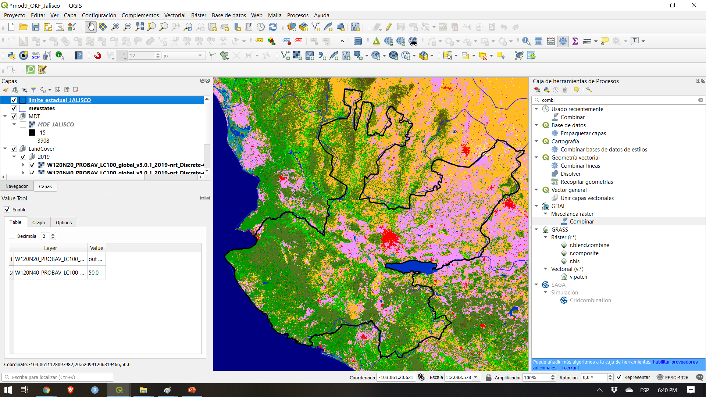

Figura 9.22 - Usando una máscara vectorial para extraer los datos ráster en una región específica

Dado que trabajaremos con 7 capas ráster - las 5 capas de Cobertura Terrestre - el modelo de superficie digital y el HRSLl, usaremos el procesamiento por lotes para recortar todas las capas en una vez. Tenga en cuenta que si ha omitido el paso de reproyección, tiene capas en diferentes proyecciones y el algoritmo no funcionará o producirá resultados inesperados.

La configuración de la ventana de procesamiento por lotes debería verse como en la figura 9.23.

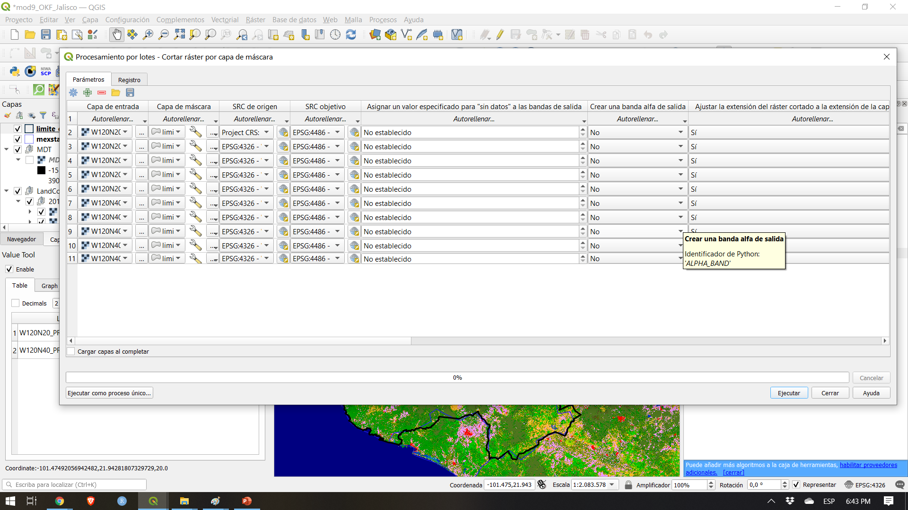

Figura 9.23 - Procesamiento por lotes recortando todas las capas ráster requeridas por geometría del Estado de Jalisco

La configuración de los parámetros es la siguiente: 
* capa de máscara: Jalisco, 
* tanto el CRS de origen como el de destino es EPSG 4486, 
* seleccione sí para: `hacer coincidir la extensión del ráster recortado con la capa de máscara` y `mantener la resolución de la capa de entrada`. 
* Tenga en cuenta que para DSM_mosaico también seleccionaremos sí` para crear una banda alfa de salida`. Cargue las capas al finalizar.

Si todo salió bien, su ventana principal de QGIS debería verse como en la figura 9.24.

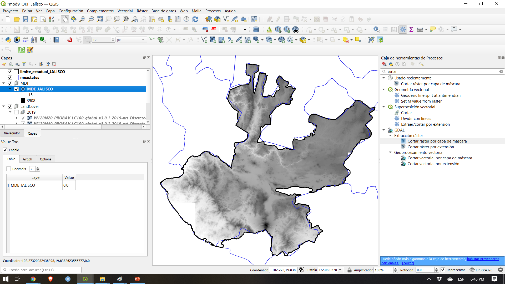

Figura 9.24 - Capas ráster recortadas por el contorno del Estado de Jalisco.

Ahora, imagine que tiene que presentar un informe sobre dónde vive la mayoría de las personas, pero teniendo en cuenta la altitud [^ 4]. Debes saber cuántas personas viven entre 0 y 200 m de altitud en el Estado de Jalisco. Hay algunos elementos a considerar. En primer lugar, cuáles son los datos que utilizaremos y cuáles son sus características. Para la población, tenemos los datos de la capa de asentamiento de alta resolución y para el alivio, tenemos el ALOS World 3D - 30m (AW3D30). Ambas capas ráster tienen una resolución espacial de 30 m, lo que nos permite pasar a otras consideraciones. El alivio es un fenómeno continuo, la expansión de la población no lo es, sin embargo, el informe no tendría sentido que lo hiciera el píxel de 30 metros. Necesitamos identificar todos los píxeles con valores de celda de 0 a 200. Considerando el histograma de DSM_mosaico para nuestra región de interés, hemos visto que la mayoría de los valores de celda están entre 0 y 200 m. Podemos proceder a realizar un mapa de relieve básico en base a las siguientes divisiones:

1. 0 - 200m
2. 51 - 100m
3. 101 - 1200m
4. 151 - 200m
5. 250 - 600m
6. 600 - 1300m

Usando sus conocimientos adquiridos en el módulo 4, puede diseñar la capa DSM por estas categorías. Su mapa debería verse como en la figura 9.25.


Figura 9.25 - Representación DSM_mosaico_recortado

Para calcular el número de personas en base a los datos raster HRSL que viven hasta 200 metros en la Estado de Jalisco, debemos ver qué píxeles caen en cada una de esas categorías. Para hacer eso, usaremos Raster Calculator. Esta es una funcionalidad que permite al usuario realizar cálculos sobre la base de los valores de píxeles de la trama existentes. Los resultados se escriben en una nueva capa ráster en un formato compatible con GDAL [^ 5].

There are several ways to open the raster calclulator in QGIS. You can do so from the Menu bar **Raster ‣ Raster Calculator** or by searching raster calculator on the Processing Toolbox or Locator bar. If we run the Raster Calculator under Raster analysis in the Processing Toolbox, the window in Figure 9.26b should appear. 


Figure 9.26a - Opening the Raster calculator


Figura 9.26b - Calculadora ráster

En esta ventana podemos reconocer las operaciones detalladas en la sección Conceptos, sustracciones, adiciones, comparaciones y todas las demás (ver página 3). A continuación, 'cortaremos' nuestra capa ráster DSM_mosaico_recortado para extraer solo los píxeles con valores de hasta 200 metros. Sabemos que las celdas de valor de DSM_mosaico_recortado representan datos numéricos continuos (no valores discretos, como LandCover). Por lo tanto, la operación que debemos emplear en este caso es una comparación de valores de una celda &lt;200 metros. Para obtenerlo, escribiremos lo siguiente en la Calculadora: 

```
"DSM_mosaico_recortado @ 1" <= 200.
```

Se puede observar la convención de nomenclatura para los rásteres: lo que viene antes de @ es el nombre de la capa ráster, lo que viene después de @ es el número de la banda. Guarde el resultado de la calculadora como DSM_recortado500.tiff. Su calculadora de ráster debería verse como en la figura 9.27.

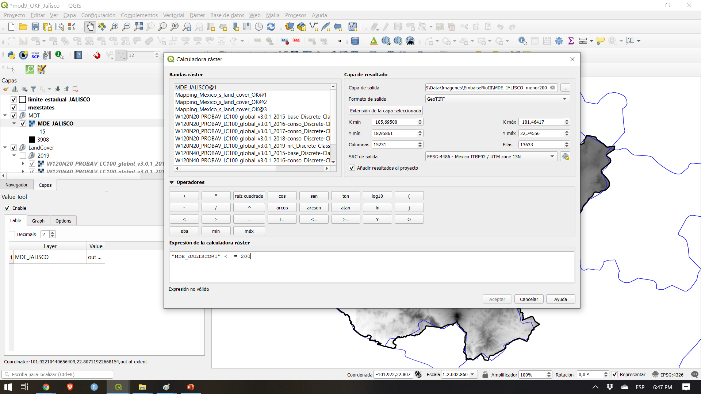

Figura 9.27 - Insertar una fórmula en la Calculadora ráster.

Su resultado debería verse como en la figura 9.28.

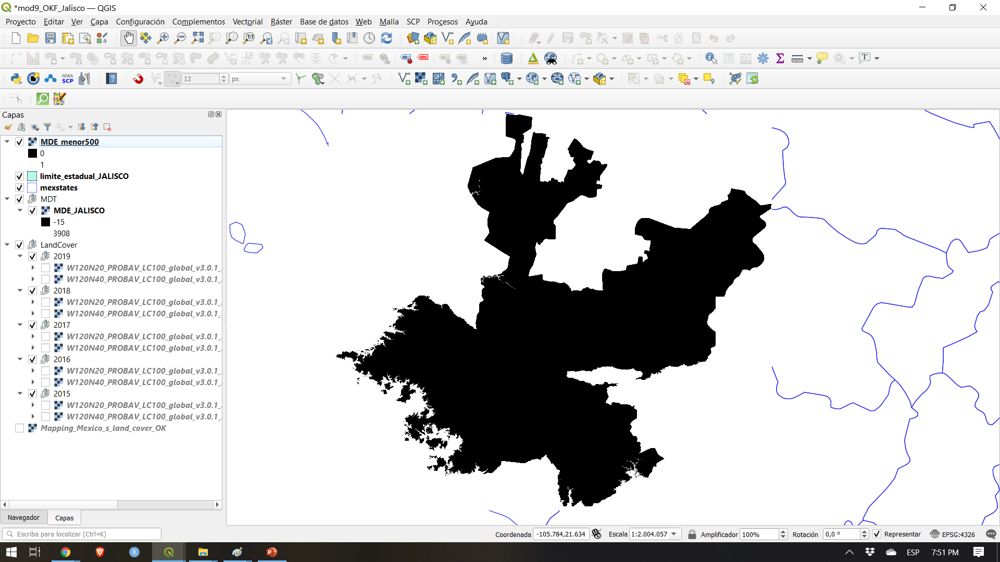

Figura 9.28 - Resultado de identificar todos los valores de píxeles que están por debajo de 500 metros usando la Calculadora Ráster.

Como podemos ver en la Tabla de Contenidos, la capa ráster que hemos obtenido tiene solo 2 valores: 0 y 1. Eso es porque hemos usado una operación racional, una comparación, por lo tanto, cada píxel que está por debajo de 200 metros recibió un valor = 1 y todos los anteriores, un valor = 0. Podemos probar esto usando `Value Tool`. La figura 9.29 presenta solo píxeles de valor 1, en otras palabras, los píxeles que nos interesan para nuestro ejercicio.


Figura 9.29 - Distribución espacial de todos los píxeles de valor 1, es decir, con una altitud inferior a 200 metros

Yendo más allá, podemos mostrar la distribución espacial de la población a la resolución espacial de 30 m solo en esta región geográfica específica que hemos seleccionado - Estado de Jalisco , por debajo de 200 m. Para hacer eso, volvemos a emplear la Calculadora ráster.

La fórmula es bastante simple, dado que todos los valores de celda DSM que nos interesan tienen el valor 1.

Abra la Calculadora e inserte la siguiente fórmula: 

```
"DSM_recortado200 @ 1" * "hsrl_recortado @ 1"
```

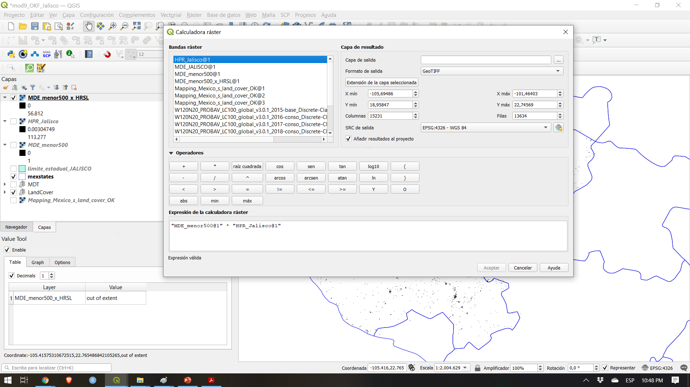

Figura 9.30 - Uso de la calculadora ráster para identificar la distribución de la población clases basadas en una altitud de hasta 500 m

A diferencia del uso anterior de la calculadora ráster, hemos utilizado 2 conjuntos de datos ráster diferentes para obtener el resultado deseado, sin embargo, observará que incluso si hay píxeles que caen fuera de MDE_menor500.tif en el resultado, su valor es 0. Utilice Value Tool para comprobar (consulte la figura 9.31).

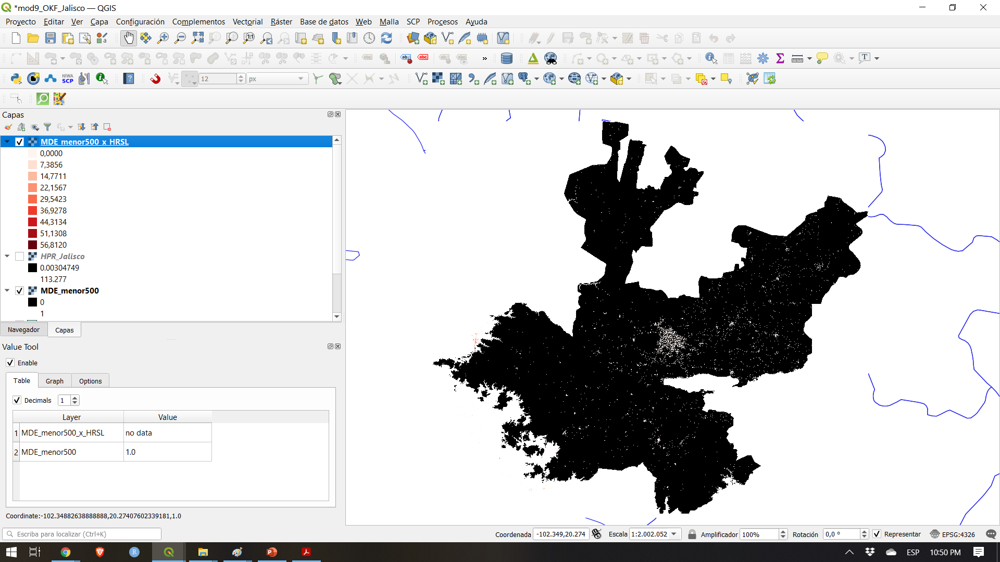

Figura 9.31 - Usando Value Tool para verificar los resultados de la Calculadora ráster

Puede ver que incluso si hrsl_recortado tiene valores en esta ubicación específica del mouse, el ráster obtenido con la Calculadora ráster hrsl_dsm_recortado tiene el valor 0.

A continuación, presentamos la distribución espacial de la población que vive por debajo de 500 m en el Estado de Jalisco. Para elegir una clasificación adecuada, calculamos el histograma. Podemos notar que la mayoría de los valores se encuentran entre 0,1 y 200 personas por 30 m. La clasificación que hemos elegido es visible en la figura 9.32.

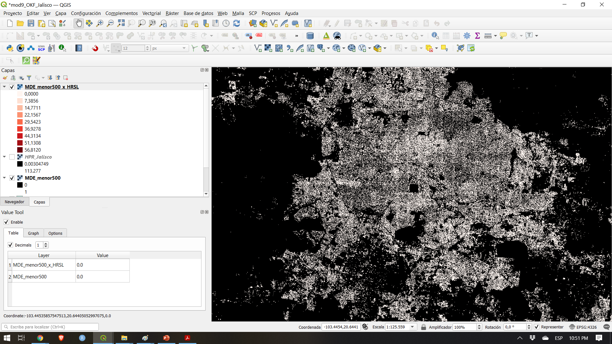

Figura 9.32 - Distribución de la población que vive por debajo de los 200 m en el Estado de Jalisco, representada con una resolución de 30 m.

Si estamos interesados ​​en el número total de personas que viven por debajo de 200 m en la Estado de Jalisco y no en la distribución geográfica por 30 m de resolución espacial, entonces necesitamos sumar todos los valores de píxeles de la capa ráster hrsl_dsm_recortado. Una forma de obtener este número es transformar el MDE_menor500 de ráster a vector. 

Para hacer eso, vaya a `Ráster ‣ Conversión Poligonizar (Ráster a Vector) `(ver figura 9.33).

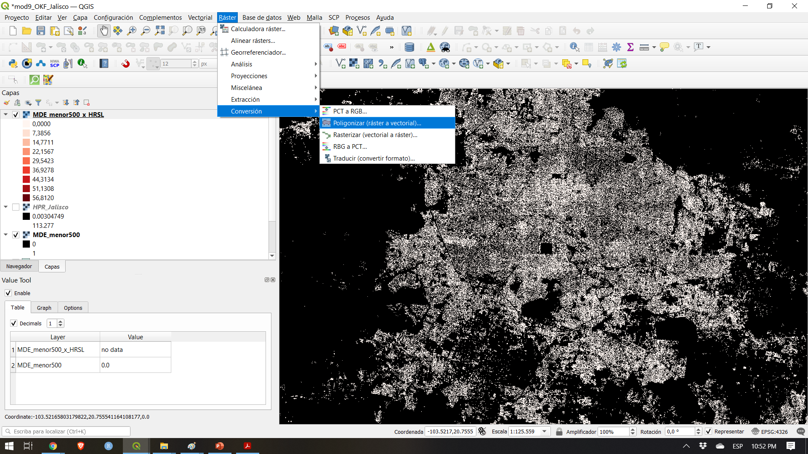

Figura 9.33a - Conversión de ráster a vector

Recuerde que esta capa ráster tenía solo 2 valores - 0 y 1, así que elija como parámetro por el cual construir el vector el DN (número digital). 


Figure 9.33b - Raster to vector conversion parameters

Note that it's possible that you will have multiple features in the vectorized layer instead of just 2. In order to just have 2 features, you can run the **Dissolve** algorithm and choose **DN** as the Dissolve Field. This will result in having just 2 features in the layer. Also, don't forget to fix invalide geometries using the **Fix invalid geometries** algorithm if you encounter some geometry issues. Your result should look like in figure 9.34. 

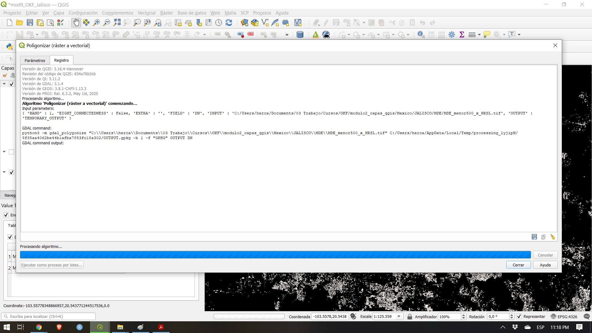

Figura 9.34 - Resultado de convertir un conjunto de datos ráster en uno vectorial.

Elimina la geometría de valor 0.

Para encontrar nuestra respuesta usaremos `Estadísticas zonales`. Para encontrar rápidamente esta funcionalidad, abra la Caja de herramientas de procesamiento y escriba en el cuadro de búsqueda "zonal" (consulte la figura 9.35).

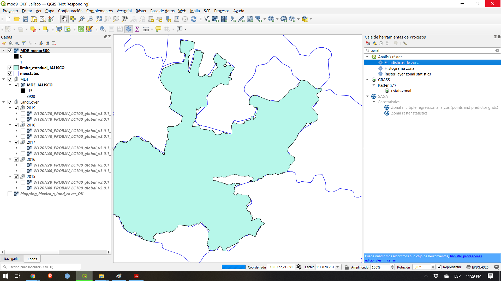

Figura 9.35 - Identificación de estadísticas zonales en la caja de herramientas de procesamiento

En la ventana que se ha abierto, seleccione los parámetros como en la figura 9.36. A medida que se calculan las estadísticas, seleccione: recuento, suma, mínimo y máximo.

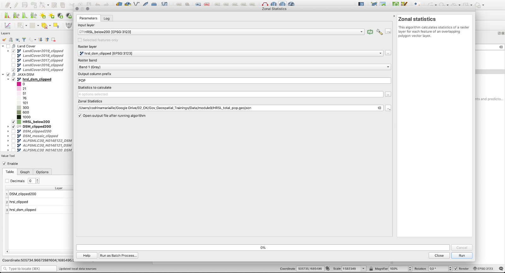

Figura 9.36 - Configuración de los parámetros para Estadísticas zonales

La capa resultante es una capa vectorial que tiene como atributos las estadísticas que hemos seleccionado (ver figura 9.37).


Figura 9.37 - Capa vectorial resultante de Estadísticas zonales

Y con este paso final, respondimos a nuestro ejercicio, cuántas personas (y dónde) viven por debajo de los 200 m en la Estado de Jalisco.


#### **Preguntas de evaluación**

1. ¿Se pueden recortar los datos ráster?
*   _Sí._
*   _No._
1. ¿Se pueden usar conjuntos de datos vectoriales cargados en el proyecto QGIS en Raster Calculator?
*   _Sí._
*   _No._
1. ¿Se pueden convertir conjuntos de datos ráster en vectoriales?
*   _Sí._
*   _No._


### Fase 3: Trabajo con datos raster y vectoriales.

En la fase anterior, hemos visto cómo podemos procesar 2 conjuntos de datos ráster para derivar nueva información. Hemos utilizado el modelo de superficie digital y la capa de asentamiento de alta resolución para averiguar cuántas personas viven por debajo de los 200m en la provincia de Pampanga. Antes de hacer cualquier análisis, nos aseguramos de que los conjuntos de datos estuvieran en la misma proyección y, además, si los rásteres tienen la misma resolución espacial para que los resultados que obtuvimos sean viables. Al referirse al sistema de referencia de coordenadas, el razonamiento es claro, pero ¿por qué la misma resolución espacial?

Recordando la resolución espacial, es el tamaño de la superficie del suelo medido en unidades de longitud, en otras palabras, el tamaño del píxel medido en el suelo. Si un ráster tiene una resolución de 30 m, eso significa que el objeto lineal más pequeño que pudimos detectar en esa imagen es de 30 m, más pequeño y no pudimos detectarlo. Continuando con la analogía, podemos compararla con la escala de un mapa. Si un mapa tiene una escala de 1: 25000, eso significa que 1 unidad de longitud en el mapa representa 25000 unidades en el suelo, es decir, 1 cm son 25000 cm, 1 cm en el mapa equivale a 250 m en el suelo. Por ejemplo, una carretera de 2 km tendría 8 cm en el mapa.

¿Por qué es tan importante cuando se trabaja con conjuntos de datos ráster? La figura 9.38 podría ofrecer una explicación.


Figura 9.38 - Ejemplo de diferentes resoluciones específicas para diferentes imágenes satelitales - Landsat y SPOT - para la misma área

(Crédito de la foto: Congedo, L. y Munafò, M, (2013) Evaluación del cambio de cobertura terrestre mediante sensores remotos: objetivos, métodos y Resultados, Roma: Universidad Sapienza. Disponible en: [http://www.planning4adaptation.eu/ La](http://www.planning4adaptation.eu/)

Figura 9.38 detalla la relación entre la resolución de las imágenes satelitales y la información de cobertura terrestre extraída de estas imágenes capturadas. Recuerde como detallamos al principio que el valor de la celda de píxel se atribuye a toda el área que cubre, pero eso no significa que esa sea la realidad en el terreno. Estas representan decisiones tomadas por los expertos de EO que derivan varios productos basados ​​en imágenes de observación de la Tierra, todos documentados en artículos revisados ​​por pares y descripciones de algoritmos. Más explicaciones están más allá del alcance de este módulo, pero es importante tener en cuenta la relación entre lo que un sensor a bordo de un satélite captura y los productos que utilizamos.

Volviendo a nuestra región de interés, el Estado de Jalisco, podemos probar estas diferencias con los datos que tenemos a mano. Hemos cargado en nuestro proyecto QGIS las 5 capas ráster de LandCover durante 5 años: 2015, 2016, 2017, 2018 y 2019. A continuación, cargaremos un mosaico de imágenes Sentinel-2 [^ 6]. Cargaremos la capa WMS EOX Sentinel-2 sin nubes, disponible [aquí](https://s2maps.eu/). Recordando el módulo 2, para agregar una capa WMS, vaya a Capa ‣ Agregar capa ‣ Agregar capa WMS / WMTS.

Cuando se abra la ventana de agregar, use los siguientes parámetros:

```
Name: EOX Sentinel-2
URL: https://tiles.maps.eox.at/wms?service=wms&request=getcapabilities
```

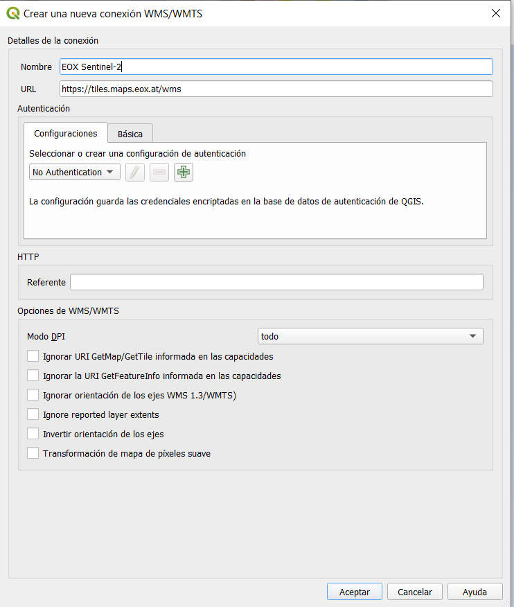

Figura 9.39 - Adición de una capa WMS a QGIS

Después de conectarnos a la capa WMS recién agregada, cargaremos la capa llamada Sentinel-2 cloudless layer para 2019 por EOX - 4326 en QGIS. Después de hacer zoom a la extensión de la región de interés, la ventana de su mapa debería verse como en la figura 9.40.

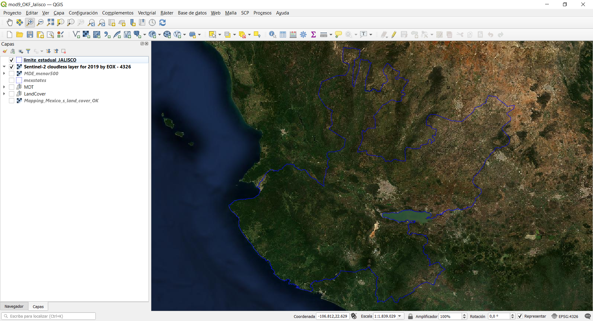

Figura 9.40 - Capa sin nubes Sentinel-2 para 2019 por EOX - 4326 para el Estado de Jalisco

Aunque los productos LandCover se han obtenido utilizando otros datos satelitales (Proba-V), compararemos las 2 capas para que podamos tener una idea de las diferentes resoluciones significar. Recuerde que el producto LandCover está a 100 m y las imágenes de Sentinel 2 a 10m. Para lograrlo, abriremos cortado_LandCover2019_5347 y la capa WMS. Para hacer comparaciones entre 2 capas, usaremos un nuevo plugin que deberás instalar. Por lo tanto, vaya a Complementos ‣ administrar e instalar complementos y escriba en el cuadro de búsqueda MapSwipe Tool. Una vez que lo instale, debería aparecer como un nuevo pictograma en su barra de herramientas (()).

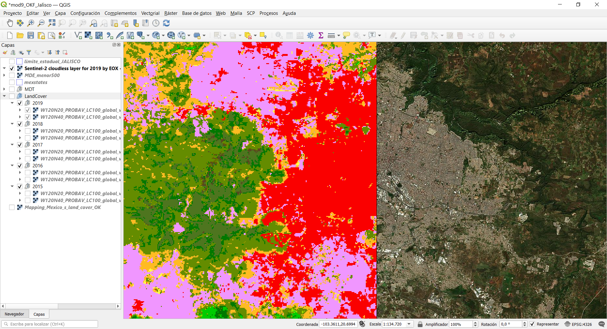

Figura 9.41 - Comparación de 2 capas ráster usando el complemento de la herramienta MapSwipe

Para activar la herramienta MapSwipe, haga clic en ella mientras la capa ráster que desea cubrir está seleccionada en el Panel de capas. Las diferencias de resolución son obvias, así como el hecho de que el producto de satélite (Land Cover) se ha desarrollado utilizando una imagen de satélite (PROBA-V) de una resolución más gruesa. Sin embargo, las clases generales más grandes están bien identificadas, como se puede ver en la figura 9.42.

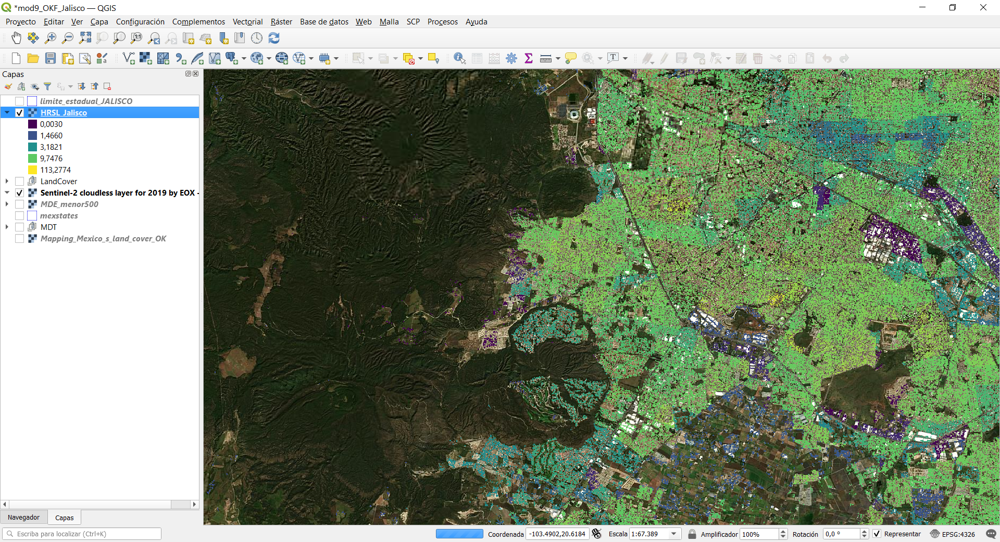

Figura 9.42 - LandCover2019 obtenido de PROBA-V (100 m) y Sentinel 2 (30 m).

Al agregar el HRSL al mapa, se mostrará una buena coincidencia entre HRSL y LandCover. El espacio urbano está representado en rojo y, como se puede ver en la figura 9.43, está cubierto casi por completo por la capa HRSL.

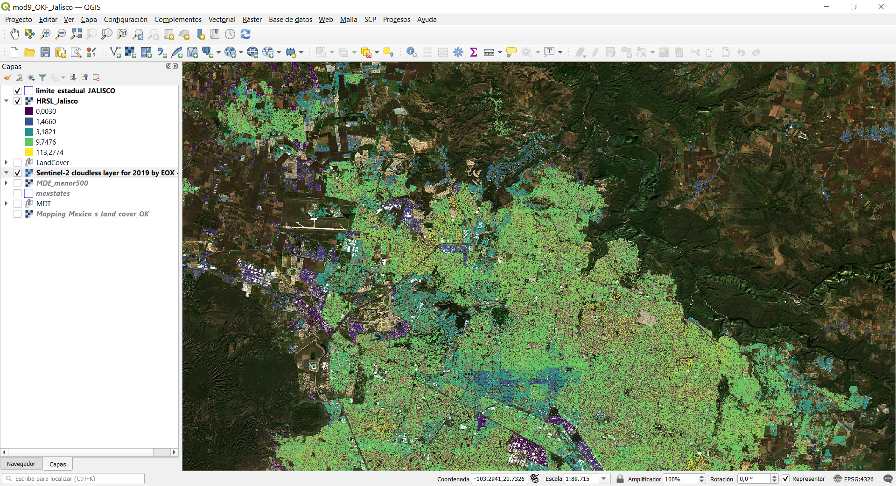

Figura 9.43 - HRSL agregado en la parte superior de cortado_LandCover2019_5347.

Sin embargo, al hacer zoom, puede ver la diferencia en la resolución entre los 2 productos ráster, como en la figura 9.44.

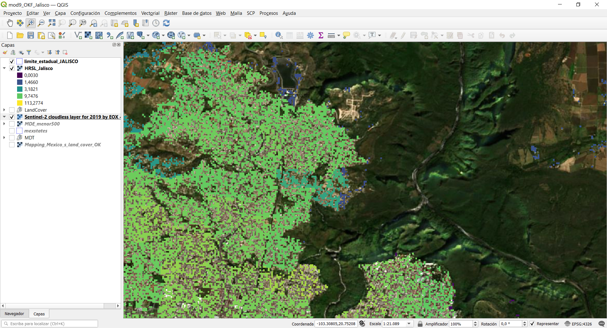

Figura 9.44 - Diferencia en la resolución espacial entre HRSL (30m - blanco) y cortado_LandCover2019 (100m - colores verde, naranja y violeta)

Ahora, si se hiciera algún análisis usando estos rásteres, estos resultados no serían viables, porque estaríamos comparando valores que se aplican a diferentes resoluciones. Como fase de preprocesamiento, el usuario debe volver a muestrear uno de los 2 para que coincida.

El remuestreo se refiere a cambiar los valores de celda debido a cambios en la cuadrícula de celdas ráster y solo hay 2 opciones: (1) el muestreo superior se refiere a los casos en los que estamos convirtiendo a celdas más pequeñas / de mayor resolución y (2) el muestreo reducido es un remuestreo a una resolución más baja / tamaños de celda más grandes.

Imaginemos el siguiente ejercicio. Necesitamos identificar los números de población para cada categoría de cobertura terrestre que hemos definido en la provincia de Pampanga. Como se explicó anteriormente, necesitamos preprocesar los datos que tenemos para obtener resultados viables de nuestro análisis, es decir, en nuestro caso, necesitamos llevar nuestros dos conjuntos de datos ráster a la misma resolución espacial. Como se detalla anteriormente, podemos aumentar o disminuir las dimensiones de los píxeles. Debe destacarse que volver a muestrear, con escala ascendente o descendente, implicará un proceso de interpolación (consulte la página 12 para obtener más detalles), por lo que el resultado introduce un error estadístico. La práctica habitual es volver a muestrear todos los rásteres para que se correspondan con el ráster con la resolución más baja, pero nuevamente esta decisión debe tomarse teniendo en cuenta todos los factores. Detallar el proceso de toma de decisiones para remuestrear capas ráster excede con mucho el alcance de este plan de estudios.

Debe destacarse una diferencia entre los 2 productos: el producto LandCover cubre toda el área de la extensión considerada, a diferencia del producto HSRL, donde la capa ráster contiene estrictamente la celda donde existen valores superiores a 0. Esta situación plantea problemas cuando se vuelven a muestrear los valores de las celdas de interpolación, porque sin importar el método de interpolación elegido, eso tomaría en consideración los píxeles circundantes, siguiendo un algoritmo específico bien definido y, en esta situación particular, los píxeles de borde no están en el borde de la región de estudio, pero dentro de ella. Por lo tanto, en nuestro caso de demostración, consideraremos aumentar el muestreo del producto Land Cover de una resolución de 100m a 30 m para que coincida con la resolución del producto LandCover. El método de remuestreo que elegimos es crucial, ya que los resultados pueden variar significativamente. Para fines de demostración, volveremos a muestrear el producto LandCover utilizando 2 métodos diferentes: Vecino más cercano y Modo.

Para volver a muestrear, vaya a Ráster ‣ Proyecciones ‣ Ajustar (reproyectar). En la ventana de funcionalidad, configure los siguientes parámetros:

*   capa de entrada: cortado_LandCover2019
*   CRS de origen y CRS de destino: EPSG:4486,
*   Método de remuestreo: Vecino más próximo,
*   Sin datos: 255, resolución de archivo de salida: 30,
*   Tipo de datos de salida: usar datos de capa de entrada tipo,
*   extensión de georeferencia: seleccione la capa cortado_LandCover2019_4486.

Guarde la capa de salida como LC2019_NearestNeighbour.

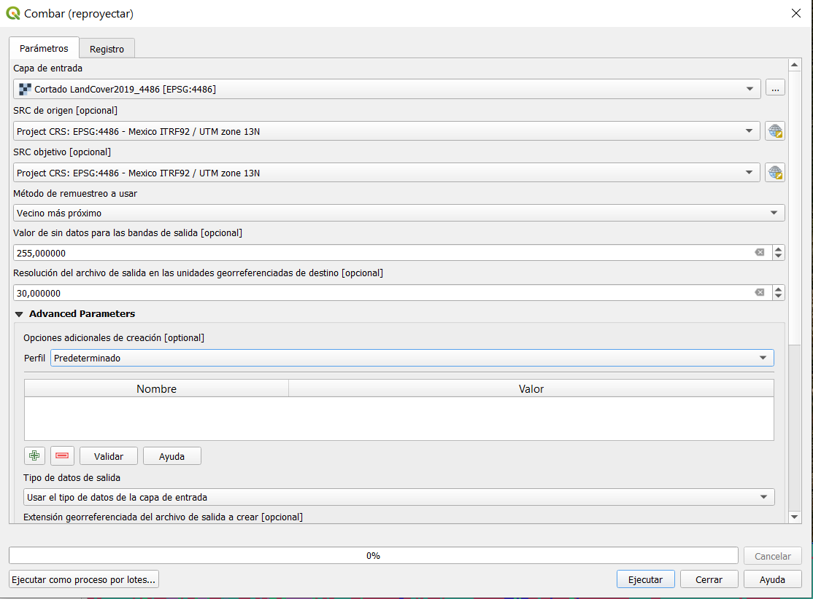

Figura 9.45 - Remuestreo de la capa de Cobertura Terrestre

Siga los pasos exactos, excepto que para el parámetro del método de remuestreo elija Modo. Guarde la capa de salida como LC2019_Mode.

Ahora, comparemos los resultados: consulte las figuras 9.45 y 9.46.

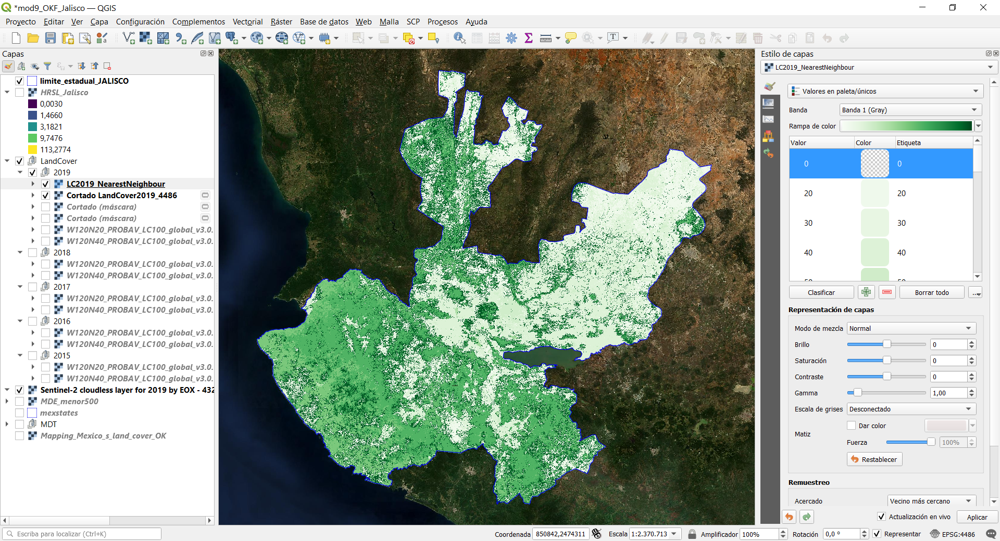

Figura 9.46a - Producto de remuestreo de cobertura terrestre usando el método de remuestreo del vecino más cercano

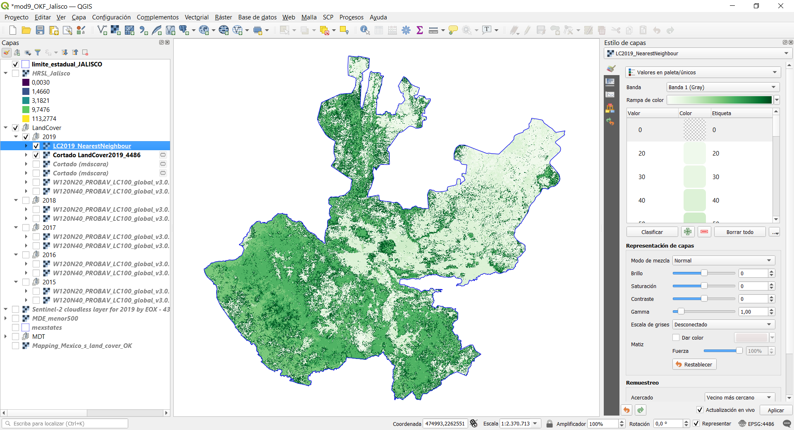

Figura 9.46b - Producto de remuestreo de cobertura terrestre usando el método de remuestreo de modo

Ambos rásteres tienen aplicada la misma simbología y podemos observar que en la figura 9.45 hay valores que no caen en ninguna categoría, los píxeles no se muestran. Sin embargo, sabemos que el producto Land Cover es una capa uniforme: no tiene espacios entre las mismas categorías definidas. Profundicemos y observemos los histogramas de las tres capas. Para eso, vaya a Propiedades ‣ Histograma y elija Prefs / Acciones para mostrar solo la Banda seleccionada. Guarde el histograma haciendo clic en el icono de guardar en el lado derecho de la ventana (consulte la figura 9.47).


Figura 9.47 - Mostrar valores solo para una banda seleccionada en el histograma.

La figura 9.48 (a), (b) y (c) presenta los 3 histogramas de interés.


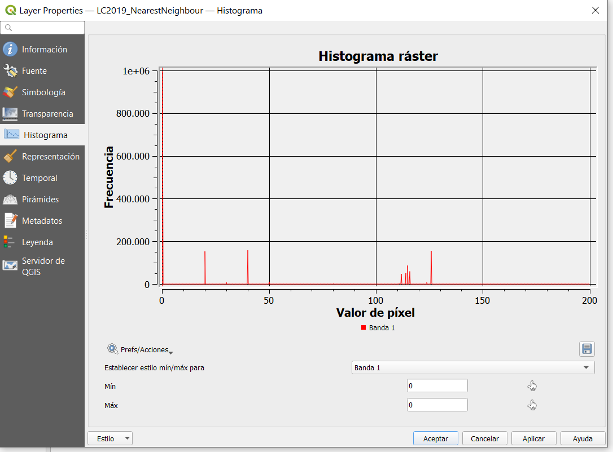

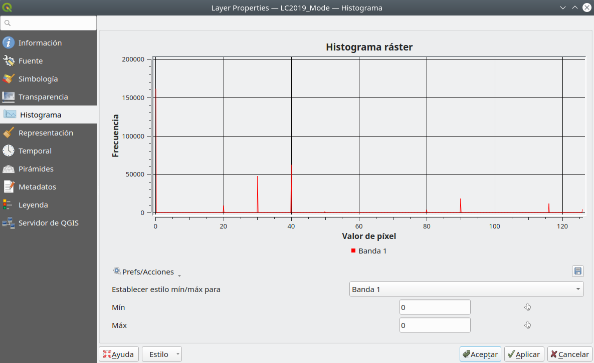

Figura 9.48 - Histogramas de (a) cortado_LandCover2019_5347 (100m), (b) LC2019_NearestNeighbour y (c) LC2019_Mode

Podemos observar las diferencias en la distribución de valores para los 3 conjuntos de datos, énfasis en (b), donde usamos el vecino más cercano método de remuestreo, que resulta, como era de esperar, en valores de píxeles calculados y, por lo tanto, da como resultado valores que no se corresponden con ningún valor en el producto Land Cover (ver tabla 1, página 7). De ahí los espacios en blanco: píxeles sin color asignado en la figura 9.45. Como se infiere, el método de remuestreo de modo, o método de remuestreo mayoritario, selecciona el valor que aparece con más frecuencia.

En este punto, las ventanas de su mapa deberían verse como en la figura 9.49.

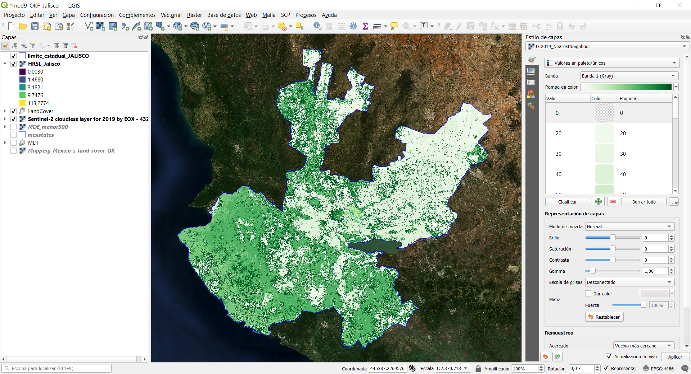

Figura 9.49 - Los 2 productos ráster: Land Cover 2019 y HRSL superpuestos.

Volviendo a nuestro ejercicio, los requisitos eran identificar los números de población para cada categoría de cobertura terrestre que hemos definido en la provincia de Pampanga. En este punto, hemos preprocesado nuestros datos ráster, para tenerlos en el mismo sistema de coordenadas, con la misma resolución espacial. Continuaremos con un algoritmo de conversión, transformaremos el dataset ráster Land Cover en un dataset vectorial - tipo polígono. Esto nos permitirá identificar más fácilmente el recuento de población para cada categoría de cobertura terrestre.

Para conversiones, de ráster a polígono, así como de vector a polígono, vaya a Ráster ‣ Conversión y aquí tenemos más opciones. Elegiremos Polygonize (Raster to vector). Convertiremos a vector el último dataset ráster que hayamos obtenido: LC2019_Mode. Su resultado debería verse como en la figura 9.50b.

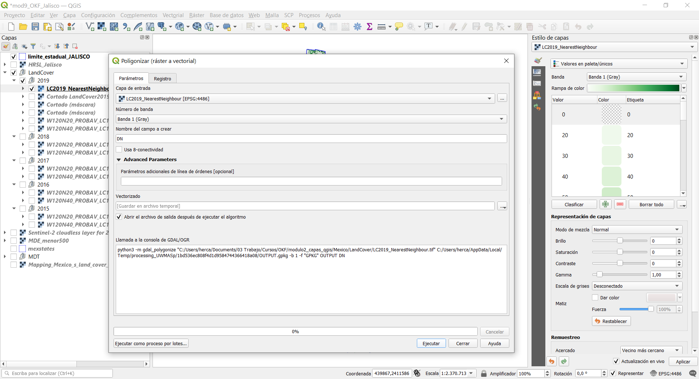

Figura 9.50a - Poligonización de la capa ráster LC2019_Mode (30m)

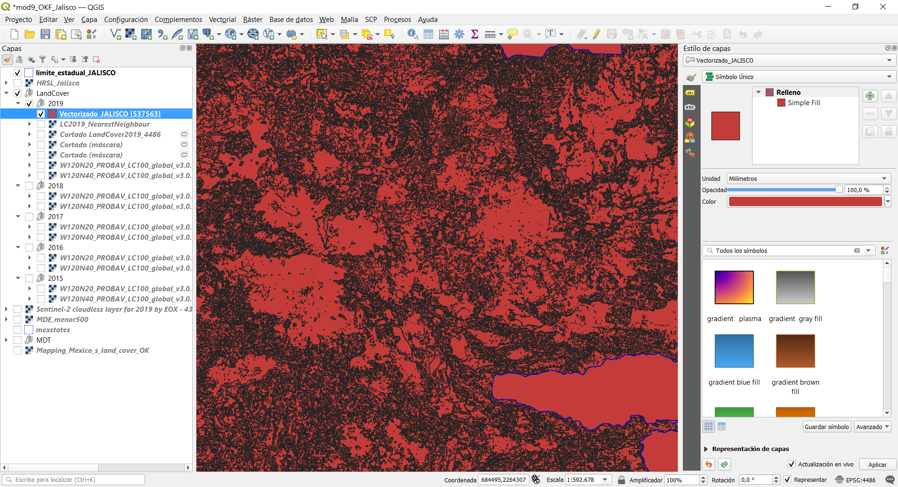

Figura 9.50b - Resultado de poligonizar la capa ráster LC2019_Mode (30m)

Como podemos observar, cada píxel - cada grupo de píxeles adyacentes con el mismo código de categoría (ver tabla 1, página 7) se convirtió en un polígono. Sin embargo, no estamos interesados ​​en cada región distinta, sino en toda la categoría. Así, disolveremos la capa vectorial que hemos obtenido usando la identificación de clase como atributo común (Vector ‣ Herramientas de geoprocesamiento ‣ Disolver - para más detalles, ver el módulo 8).

Adjuntando el mismo estilo que para el ráster, notaremos que las mismas clases vectoriales corresponden a las del ráster (ver figura 9.51).

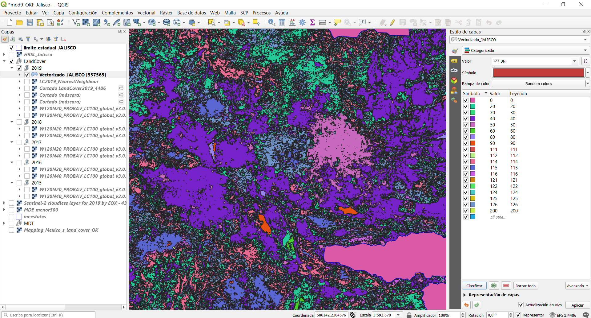

Figura 9.51 - LC2019_Mode poligonos

Como podemos observar, los píxeles de la HRSL, como se esperaba, no están perfectamente contenidos en un polígono del producto de cobertura terrestre (ver imagen 9.52).

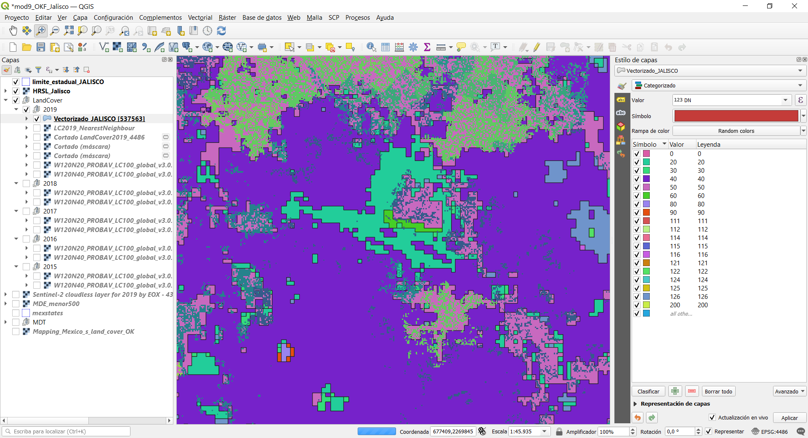

Figura 9.52 - Discordancia de píxeles HRSl y el conjunto de datos vectoriales de cobertura terrestre

Para eliminar este inconveniente, también vectorizamos la capa HRSL, solo que esta vez transferiremos el valor de la celda del píxel a un punto: el centro geométrico de cada píxel.

Vaya a Procesamiento ‣ Caja de herramientas. En la barra de búsqueda, escriba las palabras clave punto ráster y elija el Píxeles ráster a puntos algoritmo (consulte la figura 9.53a). Guarde la salida como HRSL_puntos.


Figura 9.53a - Píxeles ráster a puntos

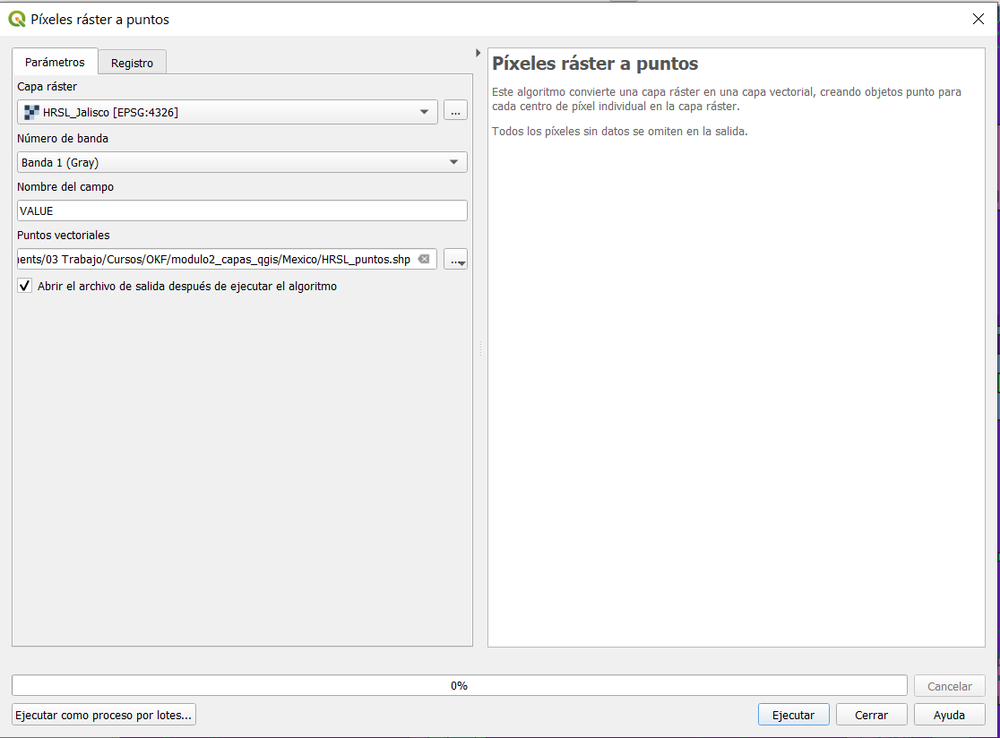

Figura 9.53b - Ejecución del algoritmo Píxeles ráster a puntos

Teniendo en cuenta la extensión de su área de estudio, esta operación puede prolongarse significativamente en el tiempo. La Figura 9.54 muestra cuántos puntos hemos obtenido para la Estado de Jalisco.

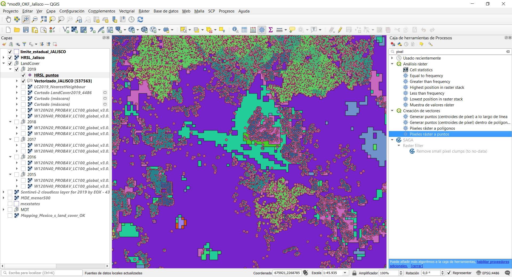

Figura 9.54 - Carga de datos vectoriales puntuales obtenidos

El número de características es considerablemente alto y sin importarlo a una base de datos, cualquier tipo de procesamiento o visualización requeriría demasiado tiempo. En este tipo de situaciones, la solución razonable es dividir los conjuntos de datos que tenemos que procesar en fragmentos manejables. Por lo tanto, consideraremos procesar los cálculos necesarios en áreas más pequeñas y bien definidas. Para dividir la capa HRSL usaremos la opción para crear un VRT. Seleccione la capa HRSL y elija Exportar como .. En la nueva ventana, marque la opción Crear VRT y configure los siguientes parámetros: busque una carpeta donde se exportará el ráster dividido, CRS: EPSG: 5347, mosaicos VRT: máx. columnas 1000, filas máximas: 1000 (consulte la figura 9.55).


Figura 9.55 - Creación de un archivo VRT con mosaicos ráster específicos

Después de exportar, cargue todos los mosaicos ráster en su proyecto QGIS. El resultado debería verse como en la figura 9.56.


Figura 9.56 - Mosaicos ráster para la HRSL del departamento de Rosario 

A continuación, volveremos a ejecutar el algoritmo de píxeles ráster a puntos para cada uno de los mosaicos ráster. Debido a que tenemos varios mosaicos, usaremos la función de procesamiento por lotes (ver figura 9.57).[^1] 

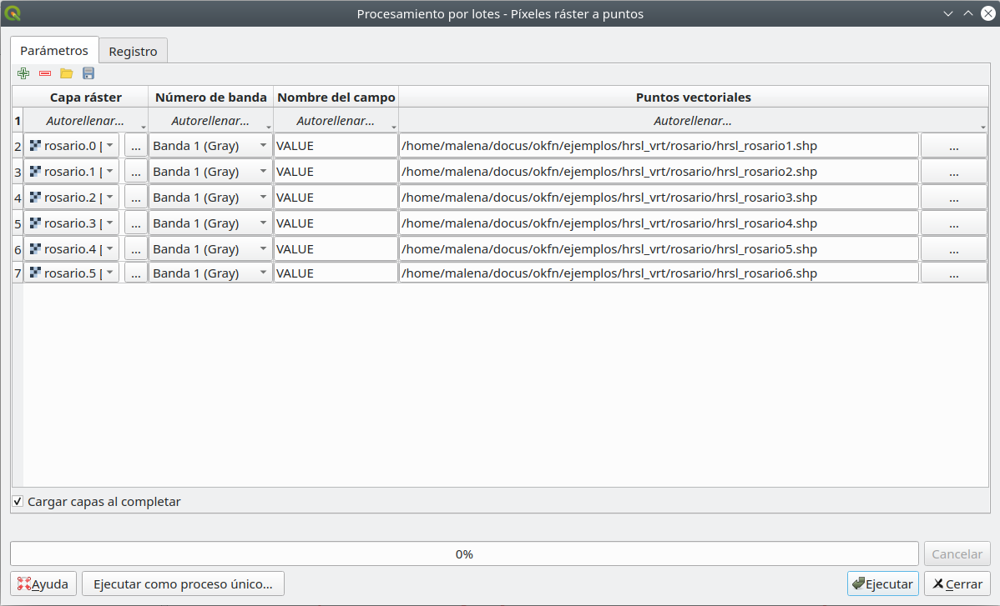

Figura 9.57 - Ejecución de ráster a puntos para todos los mosaicos ráster

Los puntos vectoriales resultantes deben verse como en la figura 9.58.

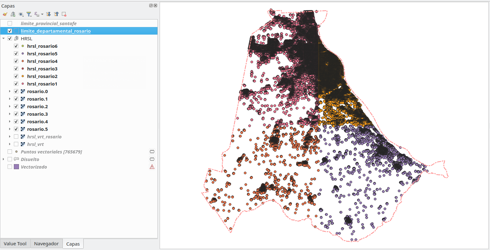

Figura 9.58 - Conjunto de datos de vectores de puntos para la capa HRSL con valores de píxeles almacenados en la columna VALOR

Al observar más de cerca los resultados del algoritmo, podemos ver que los puntos vectoriales caen exactamente en el centro del píxel del que extraen el valor ( ver figura 9.59.).


Figura 9.59 - Verificación de los valores de los datos vectoriales de puntos frente a los valores de los píxeles de la trama

Para resolver el ejercicio, se debe calcular la suma de los valores de los puntos extraídos del producto HRSL que se encuentran dentro de cada polígono del producto de cobertura terrestre. Para hacer eso, usaremos una función que está disponible en la Calculadora de campo: aggregate(). Esta función es bastante poderosa ya que hace uniones espaciales sobre la marcha permitiendo varios cálculos. En nuestro caso, la función debe identificar los puntos que caen en cada polígono y luego sumar los valores de esos puntos. Para hacer eso, vaya a la tabla de atributos del conjunto de datos vectoriales LC2019_Mode[^2] y abra la calculadora de campo. Creando un nuevo campo, introduzca la siguiente expresión:

aggregate(
    layer:= 'hrsl_rosario1',
    aggregate:='sum',
    expression:=VALUE,
    filter:=intersects($geometry, geometry(@parent))

)

Donde capa es el nombre del conjunto de datos del que queremos extraer información (en nuestro caso, el conjunto de datos puntuales que contiene los valores de píxeles de la capa ráster HRSL), agregado: indica la acción que se realizará una vez que se confirme la unión espacial (suma, recuento, media, mediana, concatenar, etc.), expresión: indica de qué columna queremos extraer datos, filtro: indica la función de geometría (intersección, dentro, etc.) (ver figura 9.60).

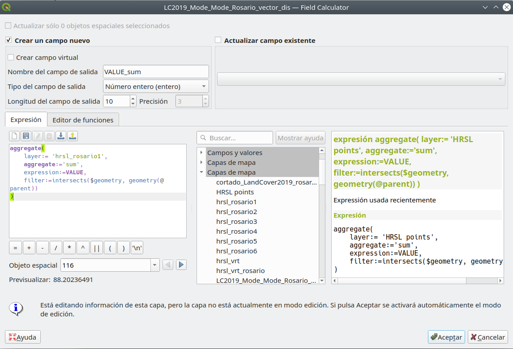

Figura 9.60 - Uso de funciones integradas con calculadora de campo

Los resultados, como se esperaba, se guardan en la tabla de atributos del LC2019_Mode. Y así, se ha completado el ejercicio.

¡Por favor, tenga cuidado! ¡Este último paso puede ser excesivamente largo dependiendo del volumen de sus datos! Pruebe para encontrar sus mejores dimensiones de mosaico.

Si usa la Calculadora de campo y la función agregada no funciona, también podemos usar el algoritmo Unir atributos por ubicación (resumen) para calcular la suma de los valores de los puntos dentro de las características LC_Mode_vector.

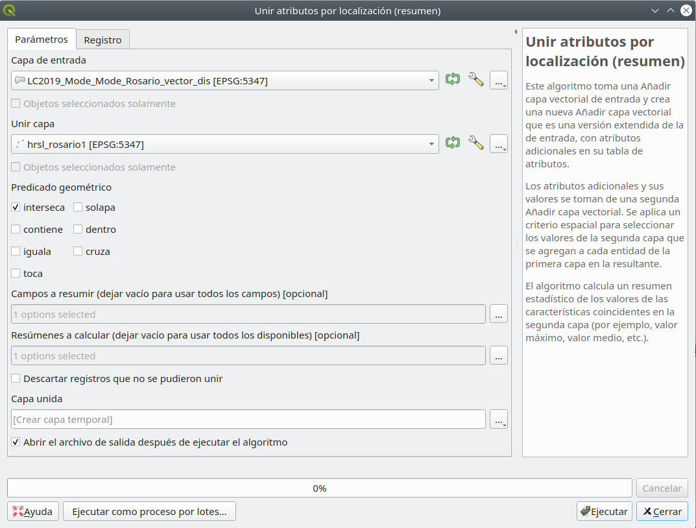

Figura 9.61 - Parámetros del algoritmo Unir atributos por ubicación (resumen)

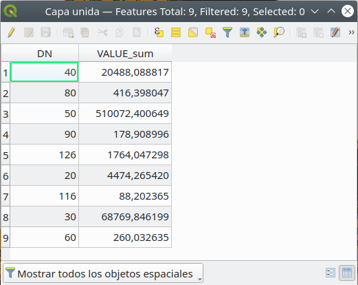

Figura 9.62 - Salida del algoritmo Unir atributos por ubicación (resumen)

En esta tercera fase de nuestro módulo 9, hemos trabajado con raster, así como con datos vectoriales. Hemos analizado más de cerca lo que significa el remuestreo y cuáles son las implicaciones de las características de los rásteres, como el sistema de referencia de coordenadas, la resolución espacial, etc. La mayoría de las veces, se debe trabajar con conjunto de datos ráster y vectoriales y, por lo tanto, es importante saber que es posible de varias formas. También probamos varias conversiones, de ráster a vector y viceversa. Sin embargo, en nuestro procesamiento no debemos perder de vista los fenómenos que estamos estudiando, así como la escala inicial a la que se han recolectado los datos, ya sea vectorial o raster. Al realizar conversiones, es importante conocer la correspondencia entre la escala de un mapa y la resolución de la trama. Según el cartógrafo Waldo Tobler “la regla es dividir el denominador de la escala del mapa por 1000 para obtener el tamaño detectable en metros. La resolución es la mitad de esta cantidad ". En otras palabras, la fórmula sería: escala del mapa = resolución de la trama (en m) X 2 X 1000.

Las soluciones dadas a nuestros ejercicios en este módulo, como también en el módulo 8, son solo una forma de resolver los requisitos. A medida que se avanza en el estudio de las herramientas de código abierto para geoespacial, se descubre que hay varias posibilidades de llegar al mismo resultado, algunas mejores que otras.


#### Preguntas de evaluación

1. ¿Cuál es el nombre del proceso mediante el cual la resolución de un dataset ráster se puede aumentar o disminuir?
*   Remuestreo.
1. ¿Qué nos muestra un histograma?
*   La frecuencia de los valores de los píxeles, organizados en rangos de valores adyacentes.
1. ¿Se puede convertir un dataset ráster en un polígono? ¿Qué acerca del otro camino alrededor?
*   Sí y sí.


## Referencias:

Centro para la Red Internacional de Información sobre Ciencias de la Tierra - CIESIN - Universidad de Columbia. 2018. Gridded Population of the World, Versión 4 (GPWv4): Densidad de población, Revisión 11. Palisades, NY: Centro de Aplicaciones y Datos Socioeconómicos de la NASA (SEDAC). [https://doi.org/10.7927/H49C6VHW](https://doi.org/10.7927/H49C6VHW).

Métodos de remuestreo: [https://gisgeography.com/raster-resampling/](https://gisgeography.com/raster-resampling/)


## Notas

[^ 1]: Una operación primitiva es un cálculo básico realizado por un algoritmo.

[^ 2]: la resolución temporal depende de la latitud. 

[^ 3]: JAXA es la Agencia de Exploración Aeroespacial de Japón 

[^ 4]: Por el bien de este ejercicio, consideraremos el DSM como un modelo de elevación digital. Para obtener más detalles sobre las diferencias, consulte la sección Desglose de conceptos 

[^ 5]: La Biblioteca de abstracción de datos geoespaciales (GDAL) es una biblioteca de software de computadora para leer y escribir formatos de datos geoespaciales raster y vectoriales. 

[^ 6]: Sentinel-2 es una misión de observación de la Tierra del Programa Copernicus que adquiere sistemáticamente imágenes ópticas a alta resolución espacial (10 ma 60 m) sobre tierra y aguas costeras. Para más detalles, vaya [aquí](https://sentinel.esa.int/web/sentinel/missions/sentinel-2).


<!-- Footnotes themselves at the bottom. -->
## Notes

[^1]:
     Se recomienda hacer el proceso por lotes en sólo una porción del territorio de la provincia para evitar procesar demasiadas capas (Departamento de Rosario)

[^2]:
     Se puede usar un recorte por departamento al igual que los píxel a raster
