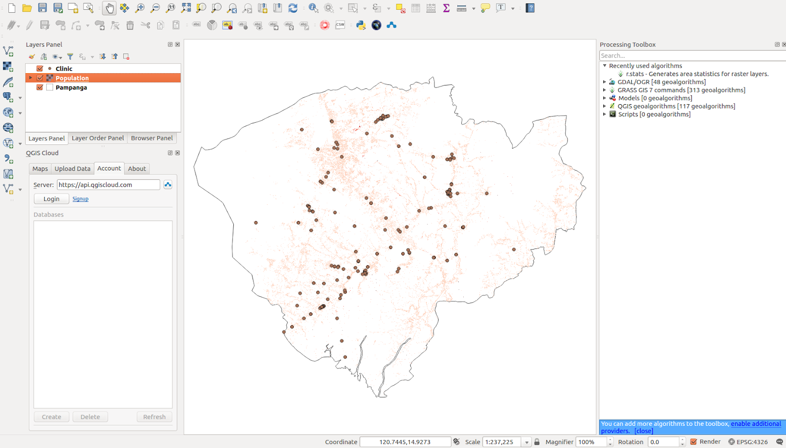

# Module 5 - Making Maps

**Author**: Ketty 

## Pedagogical Introduction

This module will provide you with an overview of the common steps needed to complete a map in QGIS. At the end of the module, participants will know the following concepts;

*   Map canvas and related layers 
*   The print layout and print layout 
*   Map elements and properties

In addition you’ll have learned the following skills;

*   Using the print layout to make a map
*   Adding map elements to the map
*   Managing different print layouts

## Prerequisites

*   Basic knowledge of operating a computer
*   An understanding of all previous modules

## Resources

*   QGIS Map LayOut - [https://docs.qgis.org/3.16/en/docs/training_manual/map_layout/map_layout.html](https://docs.qgis.org/3.16/en/docs/training_manual/map_layout/map_layout.html )
*   Layout Templates - [https://layout-hub.github.io/](https://layout-hub.github.io/)
*   Style Manager - [https://docs.qgis.org/3.16/en/docs/user_manual/style_library/style_manager.html](https://docs.qgis.org/3.16/en/docs/user_manual/style_library/style_manager.html)
*   Style Library - [https://docs.qgis.org/3.16/en/docs/user_manual/style_library/index.html](https://docs.qgis.org/3.16/en/docs/user_manual/style_library/index.html)

## Required tools and resources

*   Working computer
*   Internet access
*   QGIS 3.16 or later
*   Access the example Datasets
    *   [Clinics](https://drive.google.com/file/d/1iJQ1nP0ulA96OhyT9wakRheahYKnNmjc/view?usp=sharing)
    *   [High Resolution Population Density Layer](https://drive.google.com/file/d/1cIL2MRzBVje4zxK2-T82T-22BoT5QiYA/view?usp=sharing)

## Thematic introduction

Let’s start with an example: 

To make a map, you’ll need a topic you may want to understand better, for example ‘Spatial distribution of clinics across Pampanga province’ in the Philippines. You'll notice the topic provides both a theme to explore and the geographic location. Armed with this information and the relevant data that allows you explore the question further, you may proceed to make a map.

Breakdown of the concepts

This module will focus on the following key map making concepts; map canvas and related layers, the print layout and map elements and properties. First, here are short definitions on each; 

*   the **map canvas and related layers**: is probably the most important widget within QGIS because it shows the map composed from overlaid map layers and allows interaction with the map and layers. This is covered in the Module 0: Introduction to QGIS
*   the **print layout and print layout** : The print layout provides growing layout and printing capabilities. It allows you to add elements such as the QGIS map canvas, text labels, images, legends, scale bars, basic shapes, arrows, attribute tables and HTML frames. With the Print layout you can create nice maps and atlases that can be printed or saved as PDF-file, an image or an SVG-file. This is a powerful way to share geographical information produced with QGIS that can be included in reports or published. You can save the layout as a template and load it again in another session. Finally, generating several maps based on a template can be done through the atlas generator. The image below shows the print layout and print layout interface. This interface opens when you open a new print layout.

Figure 14: Print layout

*   **map elements and properties**: Maps contain lots of information. Most maps will have the five following things: a Title, a Legend, a Grid, a Compass Rose to indicate direction, and a Scale. The Title tells you what is being represented on the map

### Main content

#### Phase 1 title: Exporting the map canvas

##### Content/Tutorial

In this tutorial, we’ll show two ways to ‘Export the map canvas’ to the QGIS print layout. The first method is straightforward while the second method explores the more advanced capabilities provided by the print layout.

###### First method: Export the map canvas without the print layout

1. The data layers should already be added to the QGIS canvas. The layers can then be styled to communicate information in your data. Add map decorations by clicking **View->Decorations**. Select your preferred map decoration. For example you may add the Title label, Scale bar and Copyright Label. For each decoration you’ll have to specify settings in a dialogue box.
2. The final step is to export the map to either image or pdf format. To do this, Click **Project-> Import/Export** and then select your prefered export format. The export dialogue below should appear.

Figure 15: Exporting the map

3. Click **Save**. The map in the qgis canvas will be saved as a pdf or image document. Browse to the location where the file is saved and you’re now able to print or share the map.

###### Second method: Export the map canvas to the print layout

1. In this tutorial, we’ll make a map showing the 1.) location of health centres and 2.) population density of Pampanga Province in the Philippines. The data layers should already be added to the QGIS canvas. The layers can then be styled to communicate information in your data.

Figure 16: Styled layer, ready for export from map canvas to print Layout

2. The map canvas can now be exported to the print Layout. Click the ‘new print layout layout button’ . This can be accessed via the tool bar. Alternatively, access using the ‘Projects’ menu bar. A title dialogue will open, prompting you to type the title of the Print Layout. Type ‘Pampanga’ and Click OK.

Figure 17: Title dialogue

3. The print layout will open

Figure 18: New Print layout

4. You’ll notice the print layout canvas is empty. To add the styled map from the QGIS canvas, Click the ‘Add new map to layout button’ , left click your mouse and draw a rectangle in the white space at the center of the print layout. The map should be added. You’ve just exported a map to the print layout. It’s now possible to add all other map elements like the title, legend, grids etc. 

Figure 19: Exported map from qgis map canvas to print layout view

##### Quiz questions

1. What is the qgis map canvas? (check boxes)
2. What is the use of the print layout? (check boxes)
3. Which of the following is not a map element? (radio button)
    
##### Quiz answers

1. a. shows the map composed from overlaid map layers
   b. allows interaction with the map and layers
   c. a widget for making maps

2. a. provides growing layout and printing capabilities
   b. allows you to add map elements
   c. handle both exporting and printing of maps

3. a. Title
   b. Scale
   c. Legend
   d. Colors and designs

#### Phase 2 title: Adding and editing map elements to the print layout 

##### Content/Tutorial

Now that the styled map has been added to print layout, it’s now time to add the relevant map elements like the title, scale, legend, grid, metadata etc to the print layout. Most of the buttons are located to the left of the print layout.

1. Click the ‘Add label’ 
button, hold down the left mouse button and draw a rectangle where you’d like to place the title of the map. Type the title under the ‘Main properties’ menu on the right side of the print layout. The font properties can be changed under the ‘Appearance’ menu item.

Figure 20: Add title of the map

2. Next, we’ll add the legend and scale. A data attribution statement can be added using the ‘Add label’ button Hover over the button on the left of the print layout and click the preferred button. Follow the same steps as in 1. Above to add the map element to the print layout. You can add other map elements but be careful that the map doesn’t get too cluttered. 

Figure 21: Legend, scale and data attribution added to print layout

3. If the map layout is satisfactory, the map can be exported as a pdf, png, jpeg or svg, ready for printing otherwise save the layout. All saving functionality can be accessed via the ‘layout’ menu.

##### Quiz questions

1.  Under which of the following tabs can you change the properties of map elements? (radio button)
2. What’s the difference between the print layout and print layout
3. How can you add attribution text to the map layout

##### Quiz answers

1. a. Composition
   b. Item properties
   c. Atlas generation
2. Print layout allows you to add maps from the map canvas while the print layout allows you to compose your map
3. Add a title box, then type the attribution text. Note that the title box allows you to add all forms of text to your map.

#### Phase 3 title : Automating map creation using Atlas capabilities

##### Content/Tutorial

If your organization publishes printed or online maps, you often would need to create many maps with the same template - usually one for each administrative unit or a region of interest. Creating these maps manually can take a long time and if you want to update these on a regular basis, it can turn into a chore. QGIS has a tool called Atlas that can help you create a map template and easily publish a large number of maps for different geographic regions. We’ll take the different provinces of the Philippines as an example, here’s Administrative Boundaries for the 81 provinces;

1. This means QGIS Atlas will generate 81 pages because there are 81 provinces. 

Figure 22: Attribute table

2. In the right pane of the print layout, make sure to select the ‘Atlas’ menu and check the ‘Generate an atlas’ box

Figure 23: Atlas Generation

3. The next step is to choose the coverage layer; The coverage layer is the index layer used to create each page. QGIS Atlas dynamically changes the view-extent to each feature in the coverage layer. The number of records in the coverage determines how many pages will be in your map book.

Figure 24: Select Coverage Layer

4. In the “Item Properties” tab, check the box for “Controlled By Atlas”

Figure 25: Controlled by Atlas

5. Click the  ‘Atlas’ menu, then select ‘Export Atlas as PDF’. You should have 81 maps generated. Each map will represent a province.
 

##### Quiz questions

n/a

##### Quiz answers

n/a