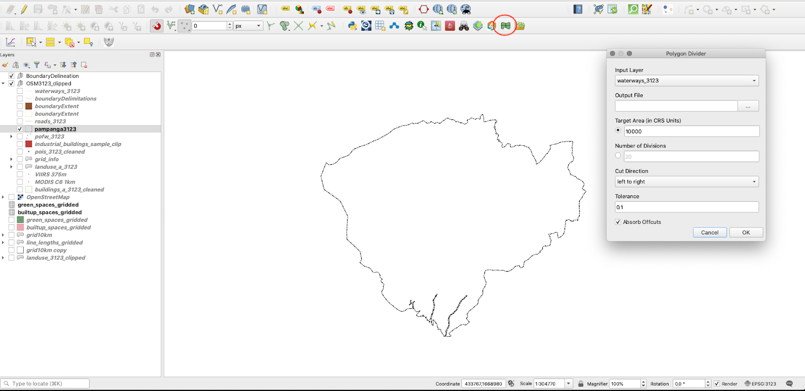
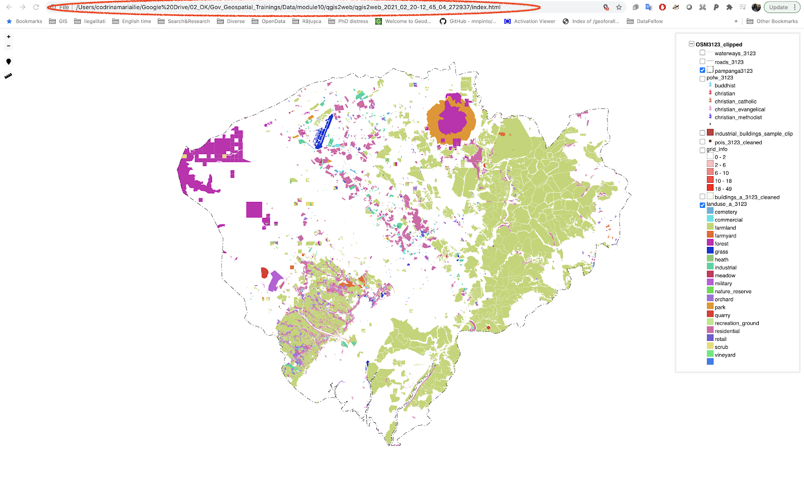
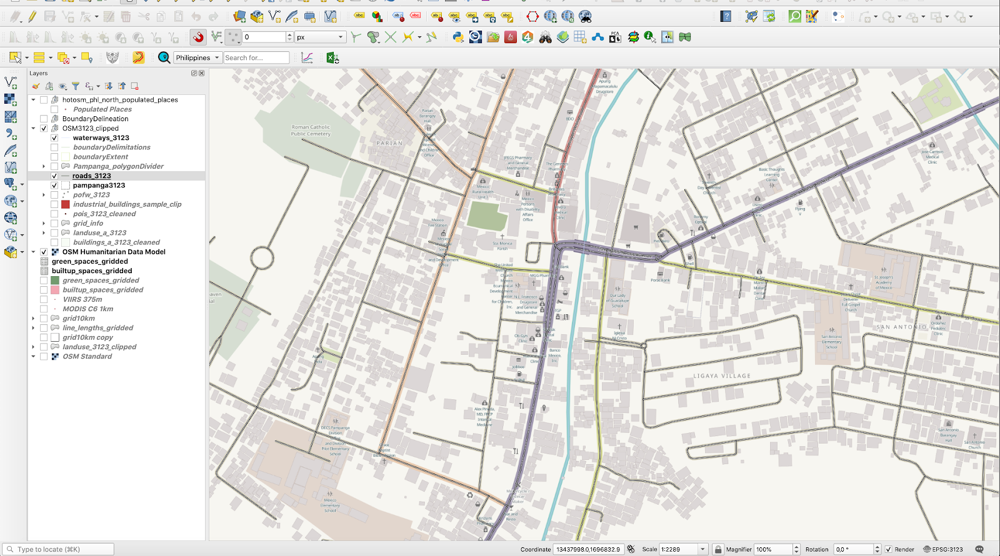
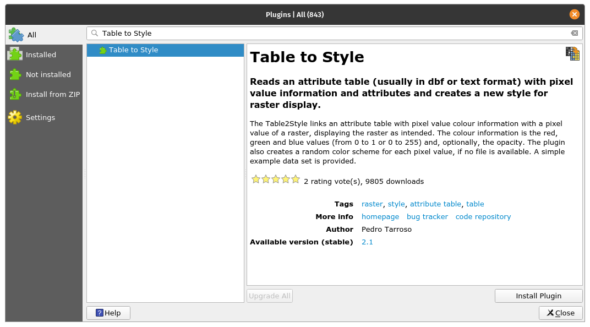

# Module 10 - QGIS plugins

**Author**: Codrina

## Pedagogical Introduction

This module will highlight some of the most interesting and, hopefully useful, plugins that the QGIS international community has developed and made available for everyone to use. Given the topic of the module, 

## and acquire the following skills:**

*   How to search and install a new plugin
*   How to switch between the different plugins repositories 
*   How to read a plugin documentation and what to look for.
*   Details on some of the most popular(?) plugins functionalities.

## Required Tools and Resources**

*   This module has been prepared using [QGIS version 3.16.1 - Hannover](https://qgis.org/en/site/forusers/download.html)

## Prerequisites: 

*   Basic knowledge of operating a computer
*   A robust understanding of all modules, as the plugins we will present apply to various notions/elements that you’ve learned about as going through this curriculum, such as vectors, rasters, attribute tables, cartographic rules and many others. 

## Main content 

### Phase 1: Introduction to plugin mentality**

One of the many advantages of the open source community - developers and users alike - is the incredible speed with which developments and improvements happen, the way in which new ideas spark and then get put into practice. 

As you have seen in module 1, QGIS is designed with a ‘plugin’ architecture, allowing it to be easily customized for the user’ needs by adding external plugins. In fact, QGIS is the combination of the **core** and the **external plugins**. The core plugins - as the name suggests - form the main structure, they are maintained by the QGIS Development Team and they are always included in the installation, such as the Processing core plugin, the Zonal Statistics or the Plugin Manager. Over time, given their relevance, different external plugins migrated towards the core. 

Of course, given the open source principles, coupled with the great and very detailed documentations available and the many communication channels and dedicated events, one can learn how to build a plugin that answers one’s requirements. And that is an **external plugin**. On the dedicated [web page](https://plugins.qgis.org/), you can find all the necessary documentation. Most external plugins are written in Python, but they can also be written in C++. 

In this first phase, we will explore the QGIS plugin setup - how to search for a plugin to solve a specific requirement one might have, how to interpret its documentation and how to report to the developer if you’ve encountered a problem. 

### The Plugin manager**

QGIS offers a core plugin to allow users to manage, install, update and uninstall external plugins. The functionality is intuitive, providing full access to the official public plugin repository. 

It must be highlighted that the external plugins - be they official or experimental - are the work of individual developers or organizations and the QGIS organization does not take any responsibility for them. That being said, there are some rules that the developers that want to share their work via the official repository, must comply with, as well as a series of recommendations for fast acceptance. Requirements include elements such as a compatible license, minimal documentation, clear identification of dependencies and others. The recommendations include checking if the plugin does not duplicate existing functionality, good shape of the source repository, compatible with all platforms (Windows, Linux, macOS) and many others.  

Experimental plugins - that are labelled as such in the plugin manager - are plugins that are in early stages of development, that are not suitable for operational use. They are regarded as “proof of concept” testing and users are not advised to install them unless they intend to use them for testing purposes. 

Of course, in order to see the experimental plugins, the user must allow it, Thus in the Plugin manager settings, tick the option `Show also experimental plugins` (Figure 10.2a). There is also the possibility to list the deprecated plugins. These are not recommended because they are not maintained anymore. 

The two types are well differentiated in Plugin Manager (see figures 10.1 and 10.2b). 

Figure 10.1 - Manager plugin official plugin

Figure 10.2a - Display experimental plugins

Figure 10.2b - Manager plugin experimental plugin

Another aspect worth mentioning is that the Manager plugin is quite a versatile functionality that allows developers to add they’re private repositories (see figure 10.3). 

Figure 10.3 - Add private plugin repository to your QGIS

That is useful, if for example, inside your organization there is a need for more plugins, but which do not comply with QGIS requirements for public hosting in their official repository.  A useful resource on how to set up your own plugin repository is available from [GIS OPS](https://gis-ops.com/qgis-3-plugin-tutorial-set-up-a-plugin-repository-explained/). 

The simpler method is to prepare a zip package containing a plugin and that can be shared via traditional ways. However, this method is not encouraged. 

Apart from Settings, one might have noticed that there are several other tabs on the left-hand side, with names that are self-explanatory: `All, Installed, Not installed, New, Invalid, Install from ZIP` and, as mentioned, `Settings`. 

After deciding which types of plugins to list in your manager, one can switch to the `All` tab and let’s investigate how a plugin appears in the Plugin Manager. For demonstration purposes, search the `Cartographic Line Generalization` plugin.  

As you have noticed, the Plugin Manager has a search bar available - here is where one can type one or more keywords suitable for a specific requirement. In our case, the keyword is ‘cartographic/cartography’. 

Figure 10.4 - Searching for a specific plugin in the Plugin Manager

As can be noticed, on the right-hand side there is a window presenting a set of documentation elements. You will notice that these are standardised and each plugin should have the same information made available, in the same way. 

The metadata display for each plugin is as follows: 

1. Name of plugin and subtitle depicting its capabilities;
2. Description section - depending on the developer, this section can be more or less detailed;
3. The number of downloads and how many stars has the plugin received from the community;
4. The tag words chosen by the developer;
5. A series of very important links: the webpage of the plugin, the **bug tracker **and the code repository
6. The name of the developer(s), as well as the affiliated organization. Sometimes, the name of the project in which the plugin had been developed is also listed;
7. The number of the version, with the mention _stable_ or _experimental_, depending on the case; 
8. The pictogram of the plugin.

In figure 10.5, all mentioned metadata elements are identified. 

Figure 10.5 - Documentation of a plugin

On the lower left side, the` Install plugin` button is available. By activating it, the chosen plugin will be installed on your QGIS and a new pictogram or menu will be added to your QGIS interface. 

It is important to mention that usually, due to space limitations, the description available in Plugin Manager is not extensive. So, to best understand if the chosen plugin answers the requirements, one must go to the home page. In our case, we observe that the home page is identical with the code repository - on Gitlab, but this is not always the case (see figure 10.6). 

Figure 10.6a - Homepage of selected plugin

Figure 10.6b - Detailed metadata on the plugin homepage

Another very important aspect to highlight regarding a plugin documentation is the web indication of the **bug tracker**. A bug tracker system is a software application that keeps track of all reported software issues (aka bugs). In our case the bug tracker is supported by the dedicated code repository Github (see figure 10.7).

Figure 10.7 - Bug tracking system in Github for a QGIS plugin

Detailing on how to report a software issue on Github exceeds the scope of this module, however it is important to highlight a few aspects. Firstly, the open source ecosystem - be it for geospatial or not - best functions when all involved parties are active in their part, i.e. developers code and users test and report back on issues identified. If one does a quick search on the different bug trackers for [QGIS](https://github.com/qgis/QGIS/issues) or [GRASS](https://github.com/OSGeo/grass/issues) or other open source solution, will notice intense activity. And this is a good thing, it shows that the community is alive, that the interaction between developers and users functions normally. Secondly, before opening a bug report via the many different channels, make sure you have thoroughly searched online for a solution to your problem. Otherwise, you risk being scorned for not taking the time to do your homework.  

#### **Quiz questions**

1. Do you need the complete name of the plugin in order to find it in the Plugin Manager? 
*   No, a keyword is sufficient. 
*   Yes. 
2. Are official as well as the experimental plugins available in the same repository?
*   Yes, as long as the ‘Show the experimental plugins’ option in the Manager Plugin is selected. 
*   No, for experimental there are other repositories. 
3. Name 2 or 3 pieces of information one a user can find in the documentation of a plugin: 
*   Title & description, number of downloads, homepage, code repository links, name of the developer, a summary description.

### Phase 2:  Some QGIS cool plugins **

Plugins can be classified in multiple categories, depending on what one is considering to be of importance. In the following, we identify the 2:

*   By the level of development: 
    *   Official - the plugin is considered stable, well documented and can be used in production;
    *   Experimental - the plugin is in early development stage, it is recommended only for testing purposes;
    *   Deprecated - the plugin is no longer maintained, i.e it will not be updated to newer versions, the developer might not answer to bug reporting, to be used only if there is no other way to solve the issue at hand.
*   By category type: 
    *   Vector; 
    *   Raster;
    *   Web;
    *   Database;
    *   Cartography. 

It must be noted that some external plugins act like bridges allowing access through QGIS to external databases, clouds,  services in which case, additional elements can be required - such as a paid account to the external service, cloud, or an API key. An example to illustrate this is the Planet Explorer plugin from Planet Inc. (see figure 10.8).

Figure 10.8 - Example of a plugin that requires external subscription in order for it to function in QGIS to its full capacity

Although in the description there is no mentioning about it, going to the homepage of the plugin reveals the requirements for it to function: “Planet subscription or trial for accessing and downloading Planet imagery. Don't have a subscription? Contact our [team](https://www.planet.com/contact/) to learn more.”

In the following pages, we will identify and provide short examples for a few plugins that we consider could be useful. Please keep in mind that this is a short list of the extensive plugin universe, so feel free to explore beyond. 

#### **Discovery**

Figure 10.9a - The Discovery plugin

Discovery is a very useful plugin that allows you to search text stored in the attributes of your vectors. The plugin connects to either a PostgreSQL/PostGIS database, MS SQL Server or a geopackage file and searches for text in the columns indicated. It allows auto-complete and it also supports flexible expression-based support for scales. 

To test it, we will use a geopackage file prepared by The Humanitarian Data Exchange and available for [download](https://data.humdata.org/dataset/hotosm_phl_north_populated_places). It is a vector file containing the populated places from Philippines, together with names, number of people. The raw data has been downloaded from OpenStreetMap. 

After using Plugin Manager, to install Discovery, a new toolbar should be visible on your QGIS. Let us set up the parameters: Data source type: Geopackage, name: Philippines, choose the file accordingly and the layer will be Populated Places, the search column: name. We’ll also request for additional information to be displayed in the search bar: is_in and population. In our situation, if there are more villages with the same name but in different provinces, we will be able to differentiate between them. Your Discovery setup should look like in figure 10.9b. 

Figure 10.9b - Setting the Discovery plugin

Click OK and let us search for “San Roque” in the search bar (see figure 10.9c). 

Figure 10.9c - Using Discovery to search fast through the attributes of the vector layers.  

In our example, we can see that there are many San Roque populated places in the Philippines, choosing one entry in this list and QGIS will zoom in on it (see figure 10.9d).

Figure 10.9d - Zooming in to the geometry of the selected element in the search bar.  

The plugin offers the possibility to find vectors by text search coupled with various filters, such as a bounding box, or various SQL queries. 

For a detailed description of the plugin capabilities, together with a more comprehensive tutorial, check the Discovery plugin [webpage](https://www.lutraconsulting.co.uk/projects/discovery/). 

#### **Polygon Divider**

Figure 10.10a - The Polygon Divider plugin

Polygon Divider is another useful QGIS plugin that assists the user with efficiently dividing it into a number of 'squareish' polygons of a defined size a vector layer of polygon type.  

This tool can be useful for a multitude of applications such as land parceling, environmental sampling, and so on.

Let us use this tool on the Pampanga province dataset and see what results we get. 

Using Plugin Manager, instal the Polygon Divider. After completion, a new pictogram will appear on your QGIS toolbar and a new window will open (see figure 10.10b). 

Figure 10.10b - Polygon Divider plugin window

Choose as input layer the Pampanga province polygon layer, save the output file as Pampanga_polygonDivider, choose 1000000 (meaning all divisions will have about 100 hectare), choose left to right as the cut direction and tolerance 1. The result should look like in figure 10.10c. 

Figure 10.10c - Result of running the Polygon Divider plugin on the Pampanga province vector layer

For a detailed description of the plugin capabilities, together with a more comprehensive tutorial, check the Polygon Divider [webpage](https://github.com/jonnyhuck/RFCL-PolygonDivider). 

#### **Load Them All**

Figure 10.11a - The Load Them All plugin

This is a useful plugin when you have multiple layers (vectors and rasters) that you need to load into QGIS. The plugin allows you to automatically load all, at once, but the big advantage is that it provides you with a multitude of filters, such as alphanumeric (by name), data modified, bounding box (coordinates inserted by hand), type of geometry and others. 

To test it, we will load files from previous module 8. For vector, we will choose the shapefiles that have been processed before a selected date, for raster we will choose an alphanumeric filter - the name of the raster loaded should start with LandCover (see figure 10.11_b). 

Figure 10.11b - Setting up the parameters for the Load them All plugin (vectors and rasters)

The parameters identified above represent an example based on the structure available. You can change it however you see fit based on your files on your computer. 

Note that after completing the 

The results of running Load them All plugin with the above parameters are presented in figure 10.11c (vectors) and 10.11d (rasters). 

Figure 10.11c - Using Load them All plugin to load multiple vectors

Figure 10.11d - Using Load them All plugin to load multiple rasters

For a detailed description of the plugin capabilities, together with a more comprehensive tutorial, check the Load the All [webpage](https://github.com/gacarrillor/loadthemall). 

#### **Raster tracer**

Figure 10.12a - The Raster tracer plugin

The Raster Tracer can be a very useful plugin when one once to digitise over a map, in other words to extract data in form of vectors. This activity is usually done on scanned older topographic maps from which we want to extract various information to store, process and visualize it in an informational system. A good example is the digitisation done over topographic maps in order to extract contour lines to build in a GIS a 3D model of the relief. 

Although today, with the emergence of digital terrain models obtained from satellite imagery, this might not be an issue anymore, digitisation is still extensively employed. The most prominent use is for extracting information from old maps. Historic maps offer us a window to the past, before we had satellites to monitor our forests and land cover changes. As these cartographic documents were originally on paper, to be able to use the information with modern technology, one must digitise.

Using Plugins Manager, search and then install Raster Tracer. This plugin adds to QGIS a semi-automatic capability of tracing linear features of the underlying raster map, by clicking on its inflection points on the raster map. Once installed, a new pictogram should appear on your toolbar. 

In order to use it, we need at least 2 layers - one is the raster layer and one is the vector layer that will capture data. We have identified for the Pampanga province a topographic map, 1:50k on the official website of the National Mapping and Resources Information Authority. Unfortunately, although they did provide access to the [map](http://www.namria.gov.ph/3131-IIIAngelesCity.html), it is not georeferenced. For demonstration purposes, we will carry on without correcting this issue, however, please note! Before digitasing vectors from a raster map, it is crucial that the latter is correctly georeferenced. Otherwise, the work - which is quite time-consuming - will be useless. 

That being said, bring in the Angeles City topographic map (`Layer - Add layer - Add raster layer..`). 

Next, we will create a MultiString vector layer where all the linear objects we extract from the topographic map will be stored (Layer - Create Layer - New GeoPackage layer..). Create a MultiLine vector and save it under the name tracer_lines. Choose the EPSG: 3123 projection - the region’s official projection. Start the editing mode on it (`Right click - Toggle editing`). 

Click on the RasterTracer pictogram and set up the parameters, like in figure 10.12b. Choose the colour of the contour lines by using the color picker that will open when clicking on the Trace color option. 

Figure 10.12b - Setting up the RasterTracer parameters

Now, all it is left to do is start digitising. After making sure your vector raster is editable and that the plugin is activated by clicking once more on it, click on the inflection points of the contour line we will extract (see figure 10.112c). 

Figure 10.12c -  Clicking on the inflection points to draw the line using RasterTracer

Figure 10.12d presents the result. 

Figure 10.12d - Semi-automatically drawn line by following the indicated colour. 

#### **Active Fire**

Figure 10.13a - The Active Fire plugin

However plugins are not only designed to work with data that you have, but are built to also bring in our QGIS datasets that are produced by other institutions, agencies, organization or anyone that shares them through web mapping standardised services. 

One good example is the Active Fire plugin. This has been developed to allow QGIS users to quickly, intuitively and without any effort to display fires in the last 24h on any region of interest. The fire products are produced by NASA and made freely available for anyone. The raw data comes from 2 satellites: the Moderate Resolution Imaging Spectroradiometer ([MODIS](https://modis.gsfc.nasa.gov/)) ([MCD14DL](https://earthdata.nasa.gov/earth-observation-data/near-real-time/firms/c6-mcd14dl)) and Visible Infrared Imaging Radiometer Suite ([VIIRS](https://www.jpss.noaa.gov/viirs.html)) 375 m ([VNP14IMGTDL_NRT](https://earthdata.nasa.gov/earth-observation-data/near-real-time/firms/v1-vnp14imgt) and [VJ114IMGTDL_NRT](https://earthdata.nasa.gov/earth-observation-data/near-real-time/firms/vj114imgtdl-nrt)) for the last 24. 

To find it, open Plugin Manager and write fire. After installation a new red pictogram will appear in your QGIS toolbar. When clicking on it, a new window appears where it lets you select from which sensor you want the fire pixels identified in the last 24 hours (see figure 10.13b).

Figure 10.13b - Using Active Fire plugin to load NASA fire products in QGIS 

The plugin also calculates the number of fire pixels registered. 

#### **[Qgis2web](https://github.com/tomchadwin/qgis2web)**

Figure 10.14a - The Active Fire plugin

This is a plugin that allows the user to quickly export her QGIS project to a** web map**. 

A web map is an interactive display of geographic information that can be opened in browsers, on devices, or in desktop map viewers. We daily interact with such representations, just think of OpenStreetMap, Google Maps, Waze, Pokemon Go. 

This plugin gives one the possibility to very fast prepare and export a map that could end up on the Internet, via the web-technologies of [OpenLayer3](https://openlayers.org/) or [Leaflet](https://leafletjs.com/). Qgis2web does its best to interpret a QGIS project and to export HTML, Javascript, and CSS to create a web map as close to the QGIS project as possible.

After the installation of the qgis2web plugin, a new icon appears to the QGIS toolbar, the same as depicted in the Plugin Manager. Clicking on it will open a window, such as the one in figure 10.14b.

Figure 10.14b - Choosing what your map will show in the browser. 

The interface is intuitive, but keep in mind the heavier the datasets, longer it will take to prepare and export. After choosing where to export, click on the export button to finalise (see figure 10.14c).

Figure 10.14c - QGIS2web preparing the necessary files and folders for the OpenLayer 3 web technology

The folder exported contains several files, depending on what web mapping technology was selected - Leaflet or Openlayers3. In case of OpenLayer3, the folder chosen for the export contains the following files and folders: `images, index.html, layers, resources, styles, webfonts. `Double click on the index.html file and your exported map will open in  your browser, where you can toggle what layers to be visible (see figure 10.14d). 

Figure 10.14d - Opening the index.html file in your browser 

As you noticed, the browser opens this map from your local folder (where you told qgis2web to export). 

This QGIS plugin is a great tool to help you prepare your maps for the web. 

For a detailed description of the plugin capabilities, together with a more comprehensive tutorial, check the qgis2web [webpage](https://github.com/tomchadwin/qgis2web). 

#### **DataPlotly**

Figure 10.14a - The DataPlotly plugin

The DataPlotly plugin was specifically developed to support interactive plot type visualizations of the loaded vector data in QGIS. The plugin is based on a Python library named Plotly, that is quite powerful providing the possibility to create multitude of interactive, publication-quality graphs: line plots, scatter plots, area charts, bar charts, error bars, box plots, histograms, heatmaps, subplots, multiple-axes, polar charts, and bubble charts. More information on this specific py library is available on the official [website](https://plotly.com/python/). 

Install the plugin using the Plugin Manager and load some vector layers to visualize: 

*   Waterways_3123 (line type);
*   Populated places (point type);

Let us prepare an interactive chart showing how many rivers vs. channels vs. streams vs. drains segments we have in our dataset.

By clicking on the specific pictogram a new window will open, see figure 10.24. 

Figure 10.15b - DataPlotly window/panel.

Next, set up the parameters, like in figure 10.15c. 

Figure 10.15c - Setting up the parameters for the pie chart representing types of water lines

Choose waterways_3123 as the vector layer from which to extract the data plotted, grouping field - fclass, Y field - length. If length needs to be calculated, go to the attribute table of the vector layer and write in the field calculator `round($length)`. For more details, see module 8.  Afterwards, select ‘single plot’ at the ploty type and click on the Create plot button, in the lower right-hand side. Your result should look like in figure 10.15d. 

Figure 10.15d - Waterways types by length pie chart.

When hovering with the mouse over each pie chart segment, a pop-up appears showing the name (taken from fclass column), lengths sum and percentage out of the total. 

One significant functionality of DataPlotly is the connection with the QGIS map canvas. To understand what that is, click on one of the sections of the pie chart. You should see that some features are **automatically** selected in your map canvas (see figure 10.15e). 

Figure 10.15e - DataPlotly and QGIS map canvas interactive connection testing

That also means that you can interactively update your plot, for example, to show only the selected features. To test, select only a part of the waterways in your map canvas, then go to the DataPlotly, first tab and at plot parameters, tick the ‘only selected features’ option (see figure 10.15f). 

Figure 10.15f - Interactively update the plot to show only selected features.   

Afterwards, click on the Update plot button at the bottom right-hand side of the DataPlotly window. Results should look approximately as in figure 10.29 (just approximately, because your selection mostly probably differs from the one shown in figure 10.15g). 

Figure 10.15g - Update the plot to show only the selected features on the map canvas. 

Furthermore, DataPlotly provides the user with an export function - either in a .pdf file or an .html file. The corresponding buttons are in the very low, right-hand side of the DataPlotly window, see figure 10.15h. 

Figure 10.15h - Export capabilities of DataPlotly

Exporting as HTML file allows the user to prepare a wide variety of data plots ready for web publication (see figure 10.15i).

Figure 10.15i - Using a browser to open the HTML file exported by DataPlotly.  

The plugin is also very well documented, for the users they provide a help menu for each plot type. You can access it by clicking on the fourth tab on the DataPlotly (see figure 10.15j).

Figure 10.15j - Help menu for each plot type accessible through the plugin window. 

Due to the direct, interactive link with the QGIS loaded datasets, expressions can also be used when preparing a plot. To test this capability,  we will create a plot base on the Populated places vector layer. Set the following parameters: type: bar plot, layer: populated places, X_field: is_in, Y_field - open the field calculator and insert  `"population" is not null `(see figure 10.15k and figure 10.15l). 

Figure 10.15k - Opening the field editor in DataPlotly based on attributes of the selected QGIS layer in order to apply an expression for filtering what the plot will display

Figure 10.15l - Inserting an expression in the field calculator 

The result should look like in figure 10.35. . 

Figure 10.15m - DataPlotly result of filtering by expression

If we are to interpret this plot, it shows us that among all the provinces where populated places have been registered, the population attribute is different from 0 în only 3 regions, Alaminos, Sual, Pangasian and Bagac. One can easily test this conclusion by looking in the attribute table.

DataPlotly also provides the user with the possibility of creating subplots, which means that multiple plots can be displayed in a single figure. 

To test this functionality, we will use the Population places vector layer. We have the following attributes of interest: `place` = type of place (city, town, village, etc.,` is_in `=  name of province to which it belongs (if known), `population` = (population numbers) and `name `= the name of the place (if known). We will integrate in the same figure, 2 data plots: one to show us how many of the populated places fall into each category of `place `and the second one, how is the population divided by the 4 types of` places. `

Figure 10.15n - Setting up the parameters for the first plot  - types of settlements by their numbers

Figure 10.15o - Setting up the parameters for the second plot - types of settlements by population  numbers.

Figure 10.15p - Subplots in a row

For a detailed description of the plugin capabilities, together with a more comprehensive tutorial, check the DataPlotly [webpage](https://github.com/ghtmtt/DataPlotly). 

#### **QuickMapServices / OpenLayers plugin**

Figure 10.16a - QuickMapServices plugin; 10.16b - OpenLayers plugin

These 2 plugins are exceptionally useful when a user needs to add basemaps to her/his QGIS project. For example, one wants to see in context the positioning of a new vector layer received, or maybe just to prepare a more attractive cartographic representation for a report. Either the scope, QuickMapServices allows the use to load into their desktop client with only 2 clicks, basemap layers from different provides, such as OpenStreetMap, NASA, Bing or Google Maps. 

Install both plugins using Plugin Manager. In this case, you will notice that they will appear under the Web tab (see figure 10.16b). 

Figure 10.16b - Location of the QuickMapServices and OpenLayers plugins.

Using them is pretty straight forward, you just click on the layer you want to bring in your map canvas and the plugin will do all the work. Needless to say, that the use of this plugin requires good internet connection, as it uses data served by its providers through standardized web mapping services. 

Figure 10.16c presents the OSM Humanitarian Data Model brought as a basemap for the region of interest used in module 8 and 9, province Pampanga in Philippines. 

Figure 10.16c - Using OpenLayers plugin. 

Figure 10.16d illustrates the perfect alignment of the basemap loaded in the QGIS map canvas using the OpenLayers plugin. Even though the 2 layers are not in the same projection, QGIS allows projection on-the-fly, so overlay is possible. 

Figure 10.16d - Loaded vector data (roads) overlaid on to the OSM Humanitarian Data model 

For a detailed description of the plugins capabilities, together with a more comprehensive tutorial, check their webpage: [QuickMapServices](https://nextgis.com/blog/quickmapservices/) and [OpenLayer Plugin](https://github.com/sourcepole/qgis-openlayers-plugin). 

#### **Table2Style**

Figure 10.17a - The Table to Style plugin

This plugin is useful for situations where there are specific values for pixels within a raster layer that correspond perfectly to a specific color. In this curriculum, we have encountered  such an example, when working with the land cover data (see figure 10.17b). 

Figure 10.17b - Exemplifying situations where pixel values correspond to an exact colour 

From the provider of this product based on satellite imagery, the pixel values and the associated colours are also made available: 

<table>
  <tr>
   <td><strong>Value</strong>
   </td>
   <td><strong>Color</strong>
   </td>
   <td><strong>Description</strong>
   </td>
  </tr>
  <tr>
   <td>0
   </td>
   <td>#282828
   </td>
   <td>Unknown. No or not enough satellite data available.
   </td>
  </tr>
  <tr>
   <td>20
   </td>
   <td>#FFBB22
   </td>
   <td>Shrubs. Woody perennial plants with persistent and woody stems and without any defined main stem being less than 5 m tall. The shrub foliage can be either evergreen or deciduous.
   </td>
  </tr>
  <tr>
   <td>30
   </td>
   <td>#FFFF4C
   </td>
   <td>Herbaceous vegetation. Plants without persistent stem or shoots above ground and lacking definite firm structure. Tree and shrub cover is less than 10 %.
   </td>
  </tr>
  <tr>
   <td>40
   </td>
   <td>#F096FF
   </td>
   <td>Cultivated and managed vegetation / agriculture. Lands covered with temporary crops followed by harvest and a bare soil period (e.g., single and multiple cropping systems). Note that perennial woody crops will be classified as the appropriate forest or shrub land cover type.
   </td>
  </tr>
  <tr>
   <td>50
   </td>
   <td>#FA0000
   </td>
   <td>Urban / built up. Land covered by buildings and other man-made structures.
   </td>
  </tr>
  <tr>
   <td>60
   </td>
   <td>#B4B4B4
   </td>
   <td>Bare / sparse vegetation. Lands with exposed soil, sand, or rocks and never has more than 10 % vegetated cover during any time of the year.
   </td>
  </tr>
  <tr>
   <td>70
   </td>
   <td>#F0F0F0
   </td>
   <td>Snow and ice. Lands under snow or ice cover throughout the year.
   </td>
  </tr>
  <tr>
   <td>80
   </td>
   <td>#0032C8
   </td>
   <td>Permanent water bodies. Lakes, reservoirs, and rivers. Can be either fresh or salt-water bodies.
   </td>
  </tr>
  <tr>
   <td>90
   </td>
   <td>#0096A0
   </td>
   <td>Herbaceous wetland. Lands with a permanent mixture of water and herbaceous or woody vegetation. The vegetation can be present in either salt, brackish, or fresh water.
   </td>
  </tr>
  <tr>
   <td>100
   </td>
   <td>#FAE6A0
   </td>
   <td>Moss and lichen.
   </td>
  </tr>
  <tr>
   <td>111
   </td>
   <td>#58481F
   </td>
   <td>Closed forest, evergreen needle leaf. Tree canopy >70 %, almost all needle leaf trees remain green all year. Canopy is never without green foliage.
   </td>
  </tr>
  <tr>
   <td>112
   </td>
   <td>#009900
   </td>
   <td>Closed forest, evergreen broad leaf. Tree canopy >70 %, almost all broadleaf trees remain green year round. Canopy is never without green foliage.
   </td>
  </tr>
  <tr>
   <td>113
   </td>
   <td>#70663E
   </td>
   <td>Closed forest, deciduous needle leaf. Tree canopy >70 %, consists of seasonal needle leaf tree communities with an annual cycle of leaf-on and leaf-off periods.
   </td>
  </tr>
  <tr>
   <td>114
   </td>
   <td>#00CC00
   </td>
   <td>Closed forest, deciduous broad leaf. Tree canopy >70 %, consists of seasonal broadleaf tree communities with an annual cycle of leaf-on and leaf-off periods.
   </td>
  </tr>
  <tr>
   <td>115
   </td>
   <td>#4E751F
   </td>
   <td>Closed forest, mixed.
   </td>
  </tr>
  <tr>
   <td>116
   </td>
   <td>#007800
   </td>
   <td>Closed forest, not matching any of the other definitions.
   </td>
  </tr>
  <tr>
   <td>121
   </td>
   <td>#666000
   </td>
   <td>Open forest, evergreen needle leaf. Top layer- trees 15-70 % and second layer- mixed of shrubs and grassland, almost all needle leaf trees remain green all year. Canopy is never without green foliage.
   </td>
  </tr>
  <tr>
   <td>122
   </td>
   <td>#8DB400
   </td>
   <td>Open forest, evergreen broad leaf. Top layer- trees 15-70 % and second layer- mixed of shrubs and grassland, almost all broadleaf trees remain green year round. Canopy is never without green foliage.
   </td>
  </tr>
  <tr>
   <td>123
   </td>
   <td>#8D7400
   </td>
   <td>Open forest, deciduous needle leaf. Top layer- trees 15-70 % and second layer- mixed of shrubs and grassland, consists of seasonal needle leaf tree communities with an annual cycle of leaf-on and leaf-off periods.
   </td>
  </tr>
  <tr>
   <td>124
   </td>
   <td>#A0DC00
   </td>
   <td>Open forest, deciduous broadleaf. Top layer- trees 15-70 % and second layer- mixed of shrubs and grassland, consists of seasonal broadleaf tree communities with an annual cycle of leaf-on and leaf-off periods.
   </td>
  </tr>
  <tr>
   <td>125
   </td>
   <td>#929900
   </td>
   <td>Open forest, mixed.
   </td>
  </tr>
  <tr>
   <td>126
   </td>
   <td>#648C00
   </td>
   <td>Open forest, not matching any of the other definitions.
   </td>
  </tr>
  <tr>
   <td>200
   </td>
   <td>#000080
   </td>
   <td>Oceans, seas. Can be either fresh or salt-water bodies.
   </td>
  </tr>
</table>

When a new dataset - raster or vector - is loaded, QGIS is randomly assigning it a visual representation. It is the user that must define appropriate colours and schemas of the representations. For more information on layers styling, go to module 4. 

To test the table2style plugin, we will use the LandCover2019 raster dataset, used also in module nr.9. By loading the raster into QGIS you should have a restul similar with the one in figure 10.17c.

Figure 10.17c - QGIS randomly assigns colours to pixel values

As per the data provider, we know that for each pixel value there is a clearly assigned colour  and in the land cover domain, these colours already represent conventions, just as in classic cartography. Forests are represented with a specific kind of green, pastures with another, ocean is depicted with a different kind of blue than inland surface water and so forth. Worst case would be to manually assign all these colours to their respective values. However, the table2style plugin solves this issue automatically, in a matter of seconds. 

Go to Manager plugin and install the table2style plugin. A new icon will appear on your toolbar. Open it by double clicking it. A setting up window should appear, like in figure 10.17d. 

Figure 10.17d - Table2style window

The plugin requires 2 parameters - a raster layer and an attribute table with pixel values, description label and color codes in one of the three systems: RGB, HSV or Hex. As per our table above, we have Hex codes for the assigned colors. Thus, load the table into QGIS (`Layer - Add layer - Add delimited text layer… `). Of course, it has no geometry. The LandCover values table should look like in figure 10.17e. 

Figure 10.17e - Attribute table with pixel values, color codes and description for Land Cover

Now, let us take a look at the raster dataset. The table2style works only on a 1-band raster, as it is a one to one connection: pixel value - color code. If more bands are available, judging after the plugin setup window, it would not know which one to choose. However, checking the LandCover2019 layer properties, we notice that there are 3 bands (`Properties - Information - scroll down to Bands`). As we need only Band 1 - discrete classification, we will employ the raster calculator to extract it (`Raster - Raster calculator` and insert in the expression field only "LandCover2019_1band@1" - save the result). For more details on how to work with rasters, check module 9. 

Now, we have all we need to test the plugin. Set up the parameters as in figure 10.17f. 

Figure 10.17f - Setting up table2style plugin parameters for the Land Cover dataset

The result should look like in figure 10.17g. 

Figure 10.17g - Automatically styled raster dataset using table2style plugin

For a detailed description of the plugin capab[https://github.com/ptarroso/table2style](https://github.com/ptarroso/table2style)ilities, together with a more comprehensive tutorial, check the Table 2 Style plugin webpage. 

#### **ORS Tools**

Figure 10.48a - The ORS Tools plugin

For our last presented plugin, we have prepared one to show you the amazing capabilities of the interconnected world of GIS data, tools and services. We have seen previously that there are plugins that can assist us in loading in our QGIS data from other providers without any hassle related to downloading, storing and knowing how to open it (OpenLayers plugin , Active Fire). Yet, the ORS Tools plugin is built to provide access to an outside routing service - the openrouteservice.org, based on OpenStreetMap. 

**Routing** is the process of selecting a path for traffic in a network or between or across multiple selected points. 

The tool set includes routing, isochrones and matrix calculations, either interactive in the map canvas or from point files within the processing framework. 

Using Plugin Manager, install the ORS Tools plugin. A new pictogram will appear on your toolbar. Double click to open (see figure 10.18b). 

Figure 10.18b - Open ORS Tools window. 

As mentioned, this plugin is using an external database - OpenStreetMap - and external algorithms that are packaged up in service - openrouteservice. In order to be able to connect to this external service, we will need to make an account on their web page and ask for an **API key. **

An API key is a unique identifier used to authenticate a user, developer, or calling program to an API. The API is like a gateway to the insides of a software, a programmatic access to its processes and algorithms. Thus, to use the openrouteservice through QGIS, we will ask for a _key_. 

Proceed with the following steps: 

1. Click on the Sign Up button on the ORS Tools window (figure 10.49). 

Figure 10.18c - Sign in button

2. Make a free account on the website on the openrouteservice website that opened. 

Figure 10.18d - Openrouteservice account page 

3. After making the account, you will receive an email informing you of what  you have just gained free access. 

Figure 10.18e - Email received from openrouteservice

4. Login to your newly made account and request a token. 

Figure 10.18f - Request openrouteservice token

5. After your token has been created, click on the long alphanumeric string below the name key. A message informing you that it has been copied will appear. 
6. Return to QGIS and insert the copied API key.

Figure 10.18g - Insert openrouteserviceAPI key into your QGIS

At this point, your QGIS should be ready to calculate routes using openrouteservice and OpenStreetMap. To test its basic capabilities, load into QGIS the Pampanga building layers. Make sure you are working in EPSG 3857 or EPSG:4326. After loading the layer, start inserting the routing points. Open the ORS Tools, and press the green + button (see figure 10.18h). 

Figure 10.18h - Inserting the routing points using ORS Tools. 

Choose Traveling Salesman routing algorithm and click on apply. After a few moments, a new vector layer has been created: Routes_ORS. 

Figure 10.18i - Result of running ORS Tools. 

Opening OpenStreetMap, we will notice that  ORS Tools has tried to build a route to touch all points given by clicking on the map. **Please take note! **QGIS has only one layer loaded and that was the building layer and yet now, a new layer has been calculated and automatically added to your map canvas! 

Figure 10.18j - The calculated route overlaid on top of OpenStreetMap.

The results of ORS Tools highly depend on the quality of the databases used, in this case - the OpenStreetMap. 

The plugin, as well as the openroutingservice, has more to offer but we leave you to discover that in your GIS journey. 

***Philippine-specific***

#### **Azimuth and Distance Plugin**

#### **SRTM Downloader Plugin**

#### **OpenHazardsPH Plugin**

#### **Quiz questions**

1. Can QGIS plugins be run outside the QGIS platform? 
*   _No. _
*   _Yes. _
2. In order to use a QGIS plugin one needs to learn how to code. 
*   _No._
*   _Yes. _
3. It is highly recommended that all plugins be installed through the Plugin Manager, even if they could be installed by downloading the zip file and putting it into the right QGIS folder. 
*   _No._
*   _Yes. _