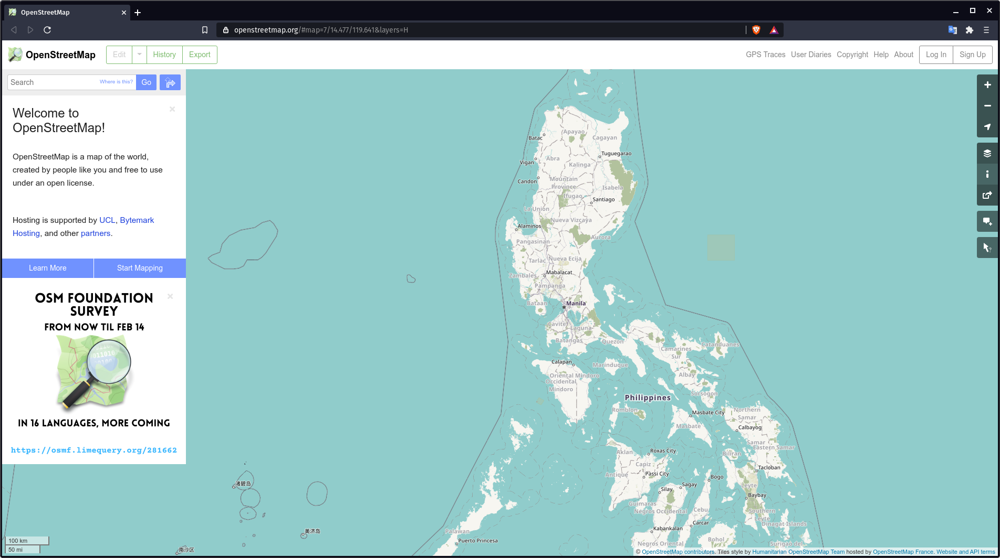
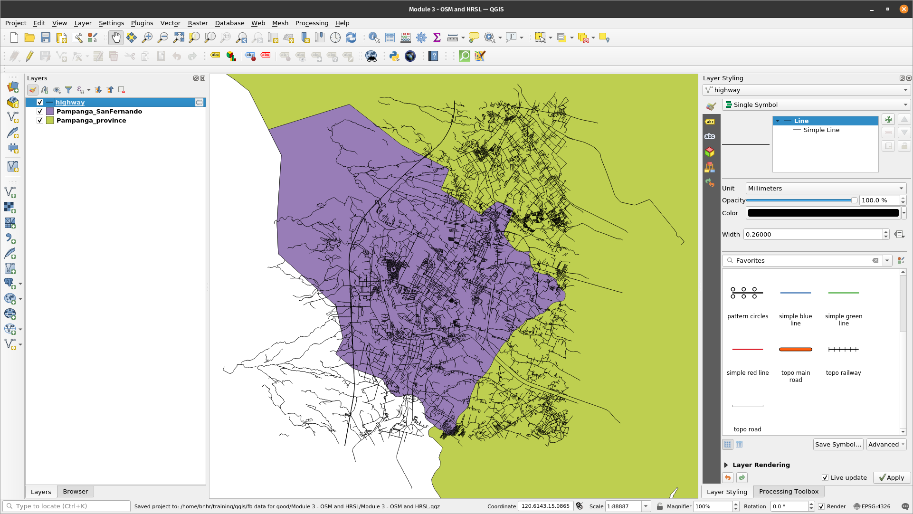
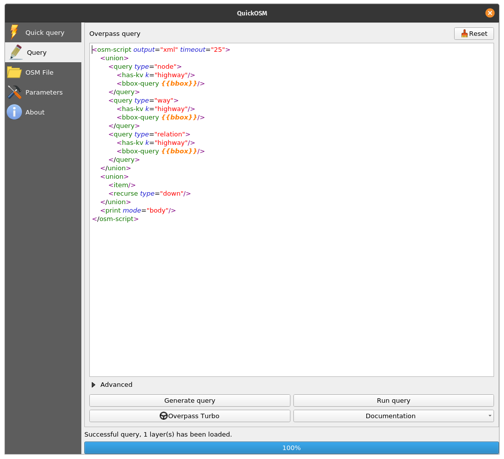
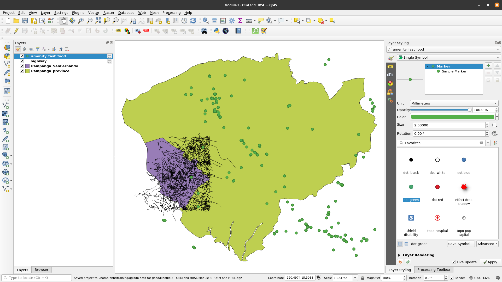
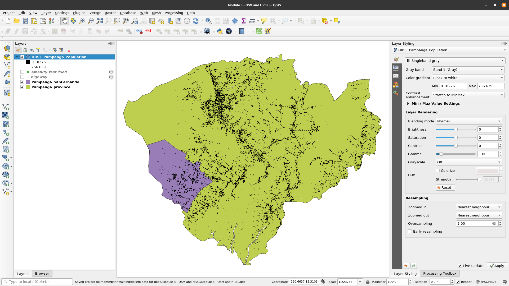
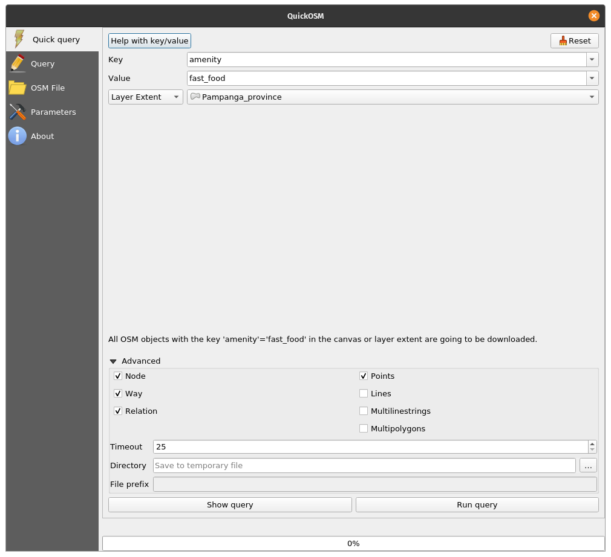
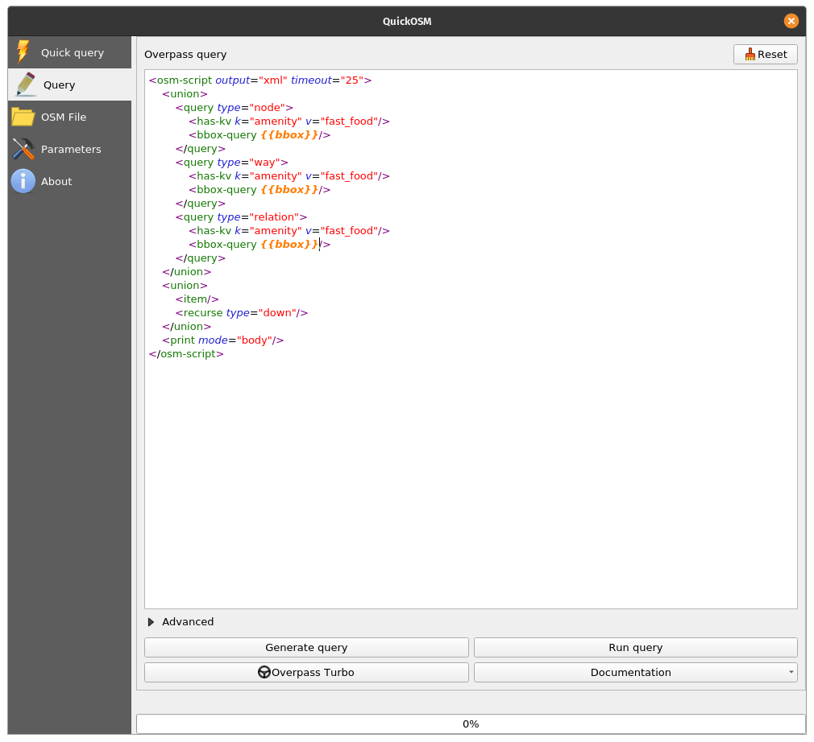
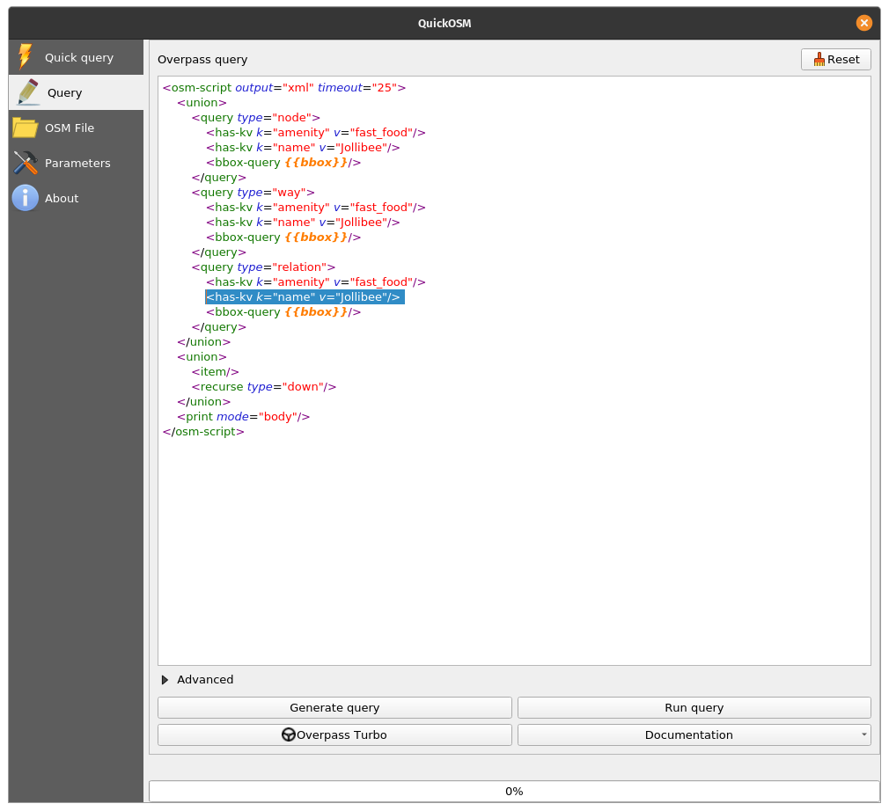

# Module 3 - OpenStreetMap and the High Resolution Settlement Layer

**Author**: Ben

## Pedagogical Introduction

This module will introduce OpenStreetMap (OSM) and the High Resolution Settlement Layer (HRSL).  At the end of this module, learners would be familiar with:

*   OpenStreetMap principles
*   OpenStreetMap data and use-cases
*   High Resolution Settlement Layer data and use-cases

They should also be able to:

*   load OSM data as vectors and tiles in QGIS
*   load the HRSL raster in QGIS

## Required tools and resources

The required tools and resources for this module are:

*   working computer
*   internet connection
*   QGIS 3.16 installed in the computer ([https://qgis.org/en/site/forusers/download.html](https://qgis.org/en/site/forusers/download.html))
*   Pampanga_province and Pampanga_SanFernando vector layers (inside [module3.gpkg](module3.gpkg)).

## Prerequisites

*   basic knowledge of operating a computer
*   familiarity with spatial data formats, the QGIS interface, and how to load layers in QGIS (completion of Modules 0, 1, and 2)

## Additional resources

* OpenStreetMap - [https://www.openstreetmap.org/](https://www.openstreetmap.org/)
* OpenStreetMap Wiki - [https://wiki.openstreetmap.org/](https://wiki.openstreetmap.org/)
* Overpass API User Manual - [https://dev.overpass-api.de/overpass-doc/en/](https://dev.overpass-api.de/overpass-doc/en/)
* Facebook - High Resolution Settlement Layer - [https://research.fb.com/downloads/high-resolution-settlement-layer-hrsl/](https://research.fb.com/downloads/high-resolution-settlement-layer-hrsl/)
* CEISIN - High Resolution Settlement Layer - [https://ciesin.columbia.edu/data/hrsl/](https://ciesin.columbia.edu/data/hrsl/)
* HDX HRSL - [https://data.humdata.org/search?organization=facebook&q=%22High%20Resolution%20Population%20Density%20Maps%20%2B%20Demographic%20Estimates%22](https://data.humdata.org/search?organization=facebook&q=%22High%20Resolution%20Population%20Density%20Maps%20%2B%20Demographic%20Estimates%22)

## Thematic introduction

Maps have become ubiquitous in our daily lives. We can just pull up our phones and open applications that utilize maps and location data. There are apps that we use for orienting and locating ourselves, for navigating and getting from one place to another, maps are shown when we order food from our favorite delivery service, etc. Maps have become so integral to our day to day activities that we tend to forget that there are places in the world that are still unmapped or not found in the digital maps that we use.

## Breakdown of the concepts

The ubiquity of maps in our lives is a byproduct of the sheer amount of location and spatial data that we are collecting. The opportunities and potential for creating something good from the geospatial data available to us is outstanding but this will only be possible if these geospatial datasets are free and open.

## Main content

### Phase 1 title: OpenStreetMap (OSM) data

#### **What is OpenStreetMap (OSM)?**

OpenStreetMap (OSM) ([https://www.openstreetmap.org/](https://www.openstreetmap.org/)) is a free, editable map of the whole world that is built by volunteers from across the globe and released with an open-content license. It is a project that creates and distributes free geographic data for the world -- a map of the world by the people and for the people. If something is missing on OSM, you are free to add it. If something is wrong in OSM, you are free to correct it. OSM is a digital common good that greatly amplifies the value of the information added to it.

Figure 3.1. OpenStreetMap

For more information about why OpenStreetMap exists and its importance, check out: [https://wiki.openstreetmap.org/wiki/FAQ#Why_OpenStreetMap.3F](https://wiki.openstreetmap.org/wiki/FAQ#Why_OpenStreetMap.3F)

You can also read: [https://wiki.openstreetmap.org/wiki/About_OpenStreetMap](https://wiki.openstreetmap.org/wiki/About_OpenStreetMap)

According to OpenStreetMap, it “is open data, licensed under the Open Data Commons Open Database License (ODbL) ([https://opendatacommons.org/licenses/odbl/](https://opendatacommons.org/licenses/odbl/)) by the OpenStreetMap Foundation (OSMF) ([https://osmfoundation.org/](https://osmfoundation.org/))” and that “you are free to copy, distribute, transmit and adapt our data, as long as you credit OpenStreetMap and its contributors. If you alter or build upon our data, you may distribute the result only under the same licence.” When creating a map that uses OSM data, it is required that you credit  “© OpenStreetMap contributors”. You can read more about OpenStreetMap’s Copyright and License here: [https://www.openstreetmap.org/copyright](https://www.openstreetmap.org/copyright)

#### **Where is OpenStreetMap used?**

One of the core values of OpenStreetMap is the ability to collect, edit, and share map data which can be used for many different purposes. Such is the freedom provided by the ObDL. Because OpenStreetMap allows users to utilize its data with very few restrictions, there is a wide variety of applications, services, and use-cases that are built, being built, or can be built with OpenStreetMap. OpenStreetMap is used for creating maps, routing services, education, and even humanitarian and advocacy purposes. 

In fact, there exists HOT or the Humanitarian OpenStreetMap Team ([https://www.hotosm.org/](https://www.hotosm.org/)) which is an international team dedicated to humanitarian action and community development through open mapping. 

OpenStreetMap is also a crucial part of some advocacy mapping communities such as MapBeks ([https://wiki.openstreetmap.org/wiki/MapBeks](https://wiki.openstreetmap.org/wiki/MapBeks)) -- an online LGBT mapping community, based in the Philippines, that advocates for diversity inclusion and representation focused specifically for Lesbians, Gays, Bisexuals, Transgender, Queer, Intersex, etc. (LGBTQI+) on OpenStreetMap; and Mental Health AWHEREness ([https://mentalhealthawhereness.com/](https://mentalhealthawhereness.com/)) -- a volunteer-organized online platform and map that shows the locations of mental health facilities and services that offer help to people on their mental health within the Philippines.

A list of OpenStreetMap-based services can be found at [https://wiki.openstreetmap.org/wiki/List_of_OSM-based_services](https://wiki.openstreetmap.org/wiki/List_of_OSM-based_services).

#### **How can OpenStreetMap be used in QGIS?**

OSM data can be used in QGIS in several ways. The first one is by using OSM-derived tile layers as basemaps. In fact QGIS comes with a connection to an OpenStreetMap tile layer by default. You can find this layer named “OpenStreetMap” under the XYZ Tiles list in the Browser Panel. 

You can add other OSM-derived tiles in QGIS such as those found in the Leaflet Providers list ([https://leaflet-extras.github.io/leaflet-providers/preview/](https://leaflet-extras.github.io/leaflet-providers/preview/)). OSM-derived tiles provide users free and open access to an updated basemap since these tiles are usually regularly updated to match the current state (e.g. features) of OSM.

You can also load the features from OSM as vector data in QGIS. This can be done by downloading OSM data from sites such as GEOFABRIK ([https://www.geofabrik.de/data/download.html](https://www.geofabrik.de/data/download.html)). 

OSM feature data can also be directly loaded in QGIS using the QuickOSM plugin. This plugin takes advantage of the Overpass API ([https://wiki.openstreetmap.org/wiki/Overpass_API](https://wiki.openstreetmap.org/wiki/Overpass_API)) that allows users to quickly select a subset of OSM data using queries. This is made possible because features in OSM ([https://wiki.openstreetmap.org/wiki/Mapfeatures](https://wiki.openstreetmap.org/wiki/Mapfeatures)) are tagged using a free tagging system ([https://wiki.openstreetmap.org/wiki/Tags](https://wiki.openstreetmap.org/wiki/Tags)) that allows the map to include an unlimited number of attributes describing each feature. These tags can then be used to query certain features based on their attributes/tags.

Usually, the OSM community and local communities agree on certain key and value combinations suitable for the most commonly used tags which ten act as an informal standard. This ensures that data users can expect consistency in tagging common features such as roads, buildings, etc. However. users can always create new tags to improve the style of the map or support analyses that rely on previously unmapped attributes or tags of the features.

#### **Exercise 1: Loading OSM data in QGIS using the QuickOSM plugin**

or this exercise, we will load road network data and locations of fast food chains from OSM that can be found in the province of Pampanga using the QuickOSM plugin.

QuickOSM works by querying the tags (keys and values) of the features in OSM. For more information about how to use the key/value in QuickOSM, go to: [https://wiki.openstreetmap.org/wiki/Mapfeatures](https://wiki.openstreetmap.org/wiki/Mapfeatures.).

1. Load the Pampanga_province and Pampanga_SanFernando vector layers found inside the module3 geopackage.

Figure 3.2. Pampanga layers loaded in QGIS

2. Make sure that the QuickOSM plugin is installed and activated. It should appear under **Vector ‣ QuickOSM** in the Menu bar. If not, install and activate the plugin first using the Manage and Install Plugins dialog.
3. Open the QuickOSM plugin (**Vector ‣ QuickOSM ‣ QuickOSM**). A dialog should open with five tabs:

    1. Quick Query
        * Allows the user to create and run a simple query with one key-value combination to load a subset of OSM feature data that meets the requirements of the query.

    2. Query
        * Allows the user to run complex queries using the Overpass API.
        * Has a link to the Overpass Turbo web application. 

    3. OSM File:
        * Allows the user to load data from raw OSM files (e.g. .pbf).

    4. Parameters:
        * Allows the user to select the Overpass API to use.

    5. About:
        * Shows information about the plugin.

Figure 3.3. QuickOSM plugin

4. Load all highways inside the extent of the Pampanga_SanFernando layer.

    * Key: highway
    * Value: &lt;blank> (blank means ALL)
    * Layer Extent: Pampanga_SanFernando
    * Advanced:
        * Check Node, Way, Relation, Lines, Multilinestrings

Figure 3.4. Load all highways in the Pampanga_SanFernando layer extent

5. Click Run query. Basically what we’re telling QuickOSM is to get all line or multilinestring features tagged with a highway key and load it in QGIS. When the plugin is done loading the layer, your map should look like below:

Figure 3.5. Highway data loaded from OSM

6. Note that the layers loaded by QuickOSM are temporary layers. You should save them as files or make them persistent if you need to use them later.
7. If you want to see the Overpass query version of your Quick Query, click Show query and it will open the query in the Query tab. You can then edit your query to make it more complex.

Figure 3.6. The Overpass query version of the Quick query to load highways

8. Next, let’s load all fast food restaurant locations in the Pampanga_province layer extent. Open the QuickOSM plugin and put the following parameters in the Quick query tab:

    * Key: amenity
    * Value: fast_food
    * Layer Extent: Pampanga_province
    * Advanced:
        * Check Node, Way, Relation, Points

 tagged as fast_food in the Pampanga_province layer extent")

Figure 3.7: Load amenities (points) tagged as fast_food in the Pampanga_province layer extent

9. The output should look something like below:

Figure 3.8: Fast food locations loaded from OSM

10. Notice that even data outside the polygons are loaded. This is because we are using the layer extent as our bounding box. If we need just the features inside the polygon, we can select or clip these features. The process of how to do this will be discussed in future modules.

#### **Quiz questions**

1. True or False:

    1. A feature in OpenStreetMap can only have one tag or attribute. -- ***False***
    2. You can only add points in OpenStreetMap.  -- ***False (you can also other features such as lines and polygons)***
    3. OpenStreetMap can only be used as an online map.  -- ***False (you can also download and use the vector data created by OpenStreetMap such as when using them with the QuickOSM plugin)***

### Phase 2 title: The High Resolution Settlement Layer (HRSL) data

#### **What is the High Resolution Settlement Layer (HRSL)?**

According to Facebook and the Center for International Earth Science Information Network (CIESIN) at Columbia University, the “High Resolution Settlement Layer (HRSL) provides estimates of human population distribution at a resolution of 1 arc-second (approximately 30m)”.

Population grids have been developed for 140 countries and can be accessed from the Humanitarian Data Exchange ([https://data.humdata.org/search?organization=facebook&q=%22High%20Resolution%20Population%20Density%20Maps%20%2B%20Demographic%20Estimates%22](https://data.humdata.org/search?organization=facebook&q=%22High%20Resolution%20Population%20Density%20Maps%20%2B%20Demographic%20Estimates%22)). 

The population estimates are based on census data and high-resolution (0.5) satellite imagery from DigitalGlobe. Settlements and human-built structures are identified in the imagery by applying computer vision techniques. These locations are then used as a proxy for places where people live. Afterwards, CIESIN used proportional allocation to distribute population data from the census data to the settlement extents.

For the current iteration of the HRSL, seven maps/datasets for the distribution of various populations are available: 

1. Overall population density 
2. Women 
3. Men 
4. Children (ages 0-5) 
5. Youth (ages 15-24) 
6. Elderly (ages 60+) 
7. Women of reproductive age (ages 15-49)

Figure 3.9: HRSL data on HDX

#### **Use-cases of the HRSL**

The population grids provide high-resolution and accurate information on both the delineation of settlements in urban and rural areas as well as the number of people living in these. This information is useful for many research areas such as disaster and humanitarian response, planning, and development of infrastructure.

To read more about the HSRL, you can go to:

How to work with Facebook population density data - [http://www.statsmapsnpix.com/2021/01/how-to-work-with-facebook-population.html](http://www.statsmapsnpix.com/2021/01/how-to-work-with-facebook-population.html)

Open population and open challenges - [https://engineering.fb.com/2016/11/15/core-data/open-population-datasets-and-open-challenges/](https://engineering.fb.com/2016/11/15/core-data/open-population-datasets-and-open-challenges/)

Connecting the world with better maps - [https://engineering.fb.com/2016/02/21/core-data/connecting-the-world-with-better-maps/](https://engineering.fb.com/2016/02/21/core-data/connecting-the-world-with-better-maps/)

Mapping the world population one building at a time - [https://arxiv.org/abs/1712.05839](https://arxiv.org/abs/1712.05839)

#### **Exercise 2: Loading the HRSL data in QGIS**

The HRSL data found on HDX comes in GeoTIFF (raster) and CSV (vector) format. The CSV are point locations with corresponding population values. For this exercise, a subset of the data for your country has already been prepared but you can always download the whole dataset or even other datasets to try.

1. Load the **HRSL_Pampanga_Population** raster file in QGIS.

Figure 3.10: The HRSL for Pampanga, Philippines

2. Check the Properties of the layer.
3. You can also edit the Symbology and Style of the raster (will be discussed in a future module)

#### **Quiz questions**

1. What datasets were used to get the location of settlements and allocate the population to these settlements?
2. How did the HRSL get the locations of settlements?
3. How was the population in an area allocated to settlements?

### If you want to go further:  

#### **Use Overpass API to create a Query in OSM**

The Overpass API ([https://wiki.openstreetmap.org/wiki/Overpass_API](https://wiki.openstreetmap.org/wiki/Overpass_API)), formerly known as OSM Server Side Scripting, or OSM3S before 2011, is a read-only API that serves up custom selected parts of the OSM map data. Unlike the main API, which is optimized for editing, Overpass API is optimized for data consumers to get a small subset of the roughly 10 million elements in OpenStreetMap. These subsets can be selected by search criteria such as location, type of objects, tag properties, proximity, or combinations of them. The Overpass API serves as the backend for other OSM-based services like the QuickOSM plugin.

Using an Overpass query allows you to create more complex feature selection in QuickOSM. For example, let’s load all fast foods again inside the extent of Pampanga_province but this time let’s just get the branches of Jollibee. If you look at the attribute table of fast food layer, you will notice that it has a **name **field. The fields in the attribute table of data loaded from OSM correspond to the tag keys so if we want to just select all Jollibee fast food branches, we need to add a filter that selects a feature if it has a **key:value** of **name: Jollibee**. This filter can easily be added in an Overpass API.

1. Open the QuickOSM plugin and input the parameters we used for querying all fast foods.

Quick query to load all amenities tagged as fast food

2. Click Show query.

Overpass to load all amenities tagged as fast food

3. Edit the query and add the line **&lt;has-kv k="name" v="Jollibee"/>** after each &lt;has-kv k="amenity" v="fast_food"/> line.

Overpass query to load all amenities tagged as fast food whose name is Jollibee

4. Click Run query. This should load just the amenities tagged as fast_food with the name Jollibee. The layer name will be OsmQuery.

Amenities tagged as fast food whose name is Jollibee loaded from OSM

5. Try it with other fast food chains.

You can also test and create Overpass queries in Overpass turbo ([https://wiki.openstreetmap.org/wiki/Overpass_turbo](https://wiki.openstreetmap.org/wiki/Overpass_turbo)) which is a web based data mining tool for OpenStreetMap.

### To practice your new skills, try to…

#### **Load more features from OSM using the QuickOSM plugin**

1. Try to load other features (points, lines, polygons) like hospitals, schools, etc. using the QuickOSM plugin.

### Tips 

If you can’t find the feature you want or need on OpenStreetMap, you can always add or edit features on the map itself. Sign up at [https://www.openstreetmap.org/](https://www.openstreetmap.org/) and start contributing!
