# Module 2 - Layers in QGIS

**Author**: Ben Hur

## Pedagogical Introduction

This module will teach you the basic concepts of layers in QGIS and how to load them. At the end of this module, learners should be familiar with:

*   the different data sources and file formats that can be loaded in QGIS
*  the different ways that data can be loaded in QGIS
*   some common data file formats

They should also be able to:

*   load layers (both vectors and rasters) using the Browser Panel and the Data Source Manager
*   connect QGIS to remote services
*   work with temporary and virtual layers
*   install some plugins that will load other datasets in QGIS
*   show layer properties such as metadata information
*   save and export layers


## Required tools and resources

The required tools and resources for this module are:

*   working computer
*   internet connection
*   QGIS 3.16 installed in the computer ([https://qgis.org/en/site/forusers/download.html](https://qgis.org/en/site/forusers/download.html))


## Prerequisites

*   basic knowledge of operating a computer
*   familiarity with spatial data formats and the QGIS interface (completion of Modules 0 and 1)


## Additional resources

* QGIS User Guide - [https://docs.qgis.org/3.16/en/docs/user_manual/](https://docs.qgis.org/3.16/en/docs/user_manual/)
* QGIS Training Manual - [https://docs.qgis.org/3.16/en/docs/training_manual/index.html](https://docs.qgis.org/3.16/en/docs/training_manual/index.html)
* Basemaps in QGIS  -  [https://bnhr.xyz/2018/10/07/basemaps-in-qgis.html](https://bnhr.xyz/2018/10/07/basemaps-in-qgis.html)
* Connecting QGIS to Remote Services -[https://bnhr.xyz/2018/10/12/connecting-qgis-to-remote-services.html](https://bnhr.xyz/2018/10/12/connecting-qgis-to-remote-services.html)
* Spreadsheet Layers Plugin -  [https://bnhr.xyz/2018/07/27/plugin-fridays-spreadsheet-layers-plugin.html](https://bnhr.xyz/2018/07/27/plugin-fridays-spreadsheet-layers-plugin.html)


## Thematic introduction


Figure 2.1. A map overlay containing different layers and data types ([https://saylordotorg.github.io/text_essentials-of-geographic-information-systems/s11-02-multiple-layer-analysis.html](https://saylordotorg.github.io/text_essentials-of-geographic-information-systems/s11-02-multiple-layer-analysis.html))

We learned from the previous modules that spatial data models such as vectors and rasters are models of real-world objects and phenomena and while it is perfectly okay to have a single layer that models one thing (e.g. elevation, temperature, household locations, zoning, etc.), in practice if we want to perform useful analysis or create a model that reflects the real-world better then we would need to use several data and layers together. Overlaying multiple thematic maps of the same area by putting them on top of each other is one of the oldest and most common geographic analysis techniques.


## Breakdown of the concepts

The picture above gives us a simple and concrete example of this. Imagine being a GIS consultant tasked with finding the best location for a new franchise restaurant (e.g. Jollibee or McDonalds). In order to do this, you would need to gather the relevant information that would help you decide. This can include information on the city streets, parcels of land, location and distribution of possible customers, the topography of the area, land use, etc. 

These datasets can come in different types and formats. Some could be vector files while others can be rasters. Some can be in the same coordinate reference system while others can be in different coordinate reference systems. Some can be local files found in your computer while others can only be loaded via the internet. Because of the many possibilities as to what kind of data you would need for your spatial analysis, a good GIS should be able to handle and manage a variety of data sources. 


## Main content

### Phase 1 title: Data Types, File Formats, the Browser Panel, and the Layers Panel

#### **Common Data Types and File Formats**

Aside from the spatial data models (rasters and vectors) discussed in the first module, familiarity with geospatial file formats and their pros and cons is also important for anyone doing spatial analysis.

Most people who are new to GIS usually get introduced to spatial data via shapefiles. Most people never outgrow this and use shapefile to mean all types and forms of vector data. This is similar to how a specific brand like Coca Cola starts to get used as the general term for soft drinks. This isn’t necessarily wrong but is rather unfortunate since shapefiles are but one of the many kinds of vector data format. In fact, in some cases, other vector formats like geopackage, geojson, topojson, and flatgeobuf. The shapefile format, while ubiquitous, has some significant limitations such as: 

*   It is not just 1 file. A shapefile actually consists of several files, 3 of which are mandatory: .shp, .shx, .dbf. All other files are called sidecar files.
*   It has a 2GB size limit for each individual file.
*   Field names are limited to 10 characters.
*   Attribute columns are limited to 255 columns.
*   There is no support for some data types such as time.
*   It does not explicitly store topology.

Other data formats such as GeoPackage, GeoJSON, TopoJSON, and flatgeobuff remedy these limitations of shapefiles. In fact, QGIS and GRASS GIS have switched to GeoPackage as the default vector file format when importing or exporting layers and although GeoPackage also has some limitations, being a completely open format allows the community to help shape the future of the format.

So, if not shapefiles, what should you use?

There’s nothing wrong with using shapefiles especially if it fits your use-case. If you don’t need a dataset that goes beyond 2GB; if you’re okay with having a limit of 10 characters to your field names; or if you’re working with a small number of files locally, a shapefile is completely fine. 

However, if you want to package your QGIS project together with all the layers (vectors, rasters), styling, and models; or you want to share multiple types of layers and spatial data in a single file, a GeoPackage is worth a look. GeoPackages and GeoJSONs are also web-friendly and can be used directly by web mapping libraries such as Mapbox and Leaflet. 

You can read more in the link below: [https://bnhr.xyz/2018/12/12/i-choose-geopackage.html](https://bnhr.xyz/2018/12/12/i-choose-geopackage.html)

Meanwhile, any format that can be represented as a grid of pixels or cells can be read by QGIS as raster data. This includes image formats such as PNG (.png) and JPEG (.jpg). It’s worth noting that although all image file formats can be read as rasters, not all of them are georeferenced or contain geospatial information that allows us to locate them properly on the earth. For instances like this, we can use what’s known as a world file ([https://en.wikipedia.org/wiki/World_file](https://en.wikipedia.org/wiki/World_file)). . A world file is a separate, plaintext data file whose name is the same as the raster file it pertains to and whose file extension has the letter w added to the end. For example, the world file for **world.png** will be named **world.pngw **or **world.pgw**.

Some image file formats contain explicit georeferencing and information and do not need a world file. Some examples are GeoTIFFs (.tif or tiff) and ERDAS Imagine file format (.img).

For more information about file formats you can also check out: [https://saylordotorg.github.io/text_essentials-of-geographic-information-systems/s09-03-file-formats.html](https://saylordotorg.github.io/text_essentials-of-geographic-information-systems/s09-03-file-formats.html)

Geospatial data can also come in the form of geospatial databases. These can be enterprise-level databases like the free and open source Postgres with PostGIS extension ([https://postgis.net/](https://postgis.net/)) or ESRI’s proprietary ArcSDE. There are also file geodatabases that can store different types of data (e.g. vectors and rasters) inside them. Some examples are the free and open OGC GeoPackage (.gpkg) ([https://www.geopackage.org/](https://www.geopackage.org/)) and the proprietary File Geodatabase format by ESRI (.gdb).


#### **Types of Data Sources**

One of the most powerful features of QGIS is its ability to connect, load, and use different spatial and non-spatial data from a variety of sources. QGIS can open:

*   local raster and vector files
*   local databases
*   files and databases on the internet via their uniform resource identifier (URI) or uniform resource locator (URL), 
*   web services (OSGeo web services and ArcGIS web services), tile services, and data portals such as GeoNode
*   and many more...

QGIS can also connect and load data from services such as NASA’s SRTM data, Planet imagery,  SentinelHub, Google Earth Engine, and OpenStreetMap through the power of plugins. 

This makes QGIS an integral component for any spatial data infrastructure or workflow.


#### **Loading Layers in QGIS**

There are several ways to load layers in QGIS. These include:

1. **Drag-and-drop** the layer in the QGIS Map Canvas or Layer Panel. This might be the easiest way to load a layer in QGIS but is not the recommended approach as there are gotchas when using this approach like when loading non-spatial tabular data like CSVs.
2. Using the **Browser Panel**.
3. Using the **Data Source Manager**.
4. Using the **Data Source Manager toolbar** and the **Manage Layers toolbar**.

**NOTE:** _When loading layers, the default colors of your layers may be different than the default colors shown in this module._


#### **The Browser Panel**

The** Browser Panel **displays a file tree that shows your computer's files and folders as well as connections to databases and web servers. By default, it is docked on the left side of the QGIS user interface together with the Layers Panel.

The Browser Panel exposes a lot of functionalities to connect, load, and show information about layers. You can also create connections to Favorite directories and Spatial Bookmarks in the Browser Panel.

To learn more about the Browser Panel, go to: [https://docs.qgis.org/3.16/en/docs/user_manual/introduction/browser.html](https://docs.qgis.org/3.16/en/docs/user_manual/introduction/browser.html)


#### **Exercise 01.1: The Browser Panel**

1. Open QGIS.
2. Check the Browser Pane (Figure 2.2). If you can’t find the Browser Panel, you can make it visible under **View ‣ Panels ‣ Browser Panel** in the Menu bar.


Figure 2.2. The Browser Panel

3. Notice how the drives and folders can be expanded to show the subfolders inside them.
4. Locate the **Module 2 - Layers in QGIS** folder (Figure 2.3) in the file tree (note where you saved or downloaded the file). You should be able to see the necessary data for this workbook. In my example on the right, I linked the aforementioned folder as one of my Favorites so I can easily go to it from the Browser Panel. You can add a favorite directory to the Browser Panel by right-clicking on Favorites and adding the directory.
5. Check the files inside the folder (Figure 2.3). There are several of them. From the file tree itself, we can already get an idea of the files and layers that we can load in QGIS. The icons on the left of the names indicate whether the data is a vector 
, a raster , a database , or simple tabular data . 


Figure 2.3. The Module files in the Browser Panel

6. There are 5 files under the data folder: 

    1. a GeoPackage (LKA_Colombo.gpkg) which contains a vector (Colomobo_hospitals) and raster file (LKA_Colombo_SRTM_DEM); 
    2. a GeoJSON (LKA_districts.geojson); 
    3. a flatgeobuf file (LKA_divisions.fgb);
    4. a shapefile (LKA_admin_boundary.shp); and
    5. a comma-separated value (CSV) file (LKA_schools.csv).

7. Right click on LKA_admin_boundary.shp and click Layer Properties (Figure 2.4). This opens the layer properties window (Figure 2.5). Notice the information provided in the window. What is the geometry of the layer? What CRS is used? How many features are in the layer?


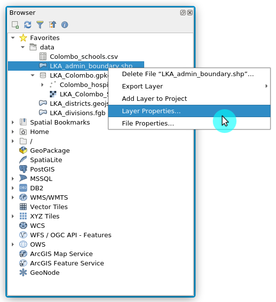

Figure 2.4.Checking Layer Properties

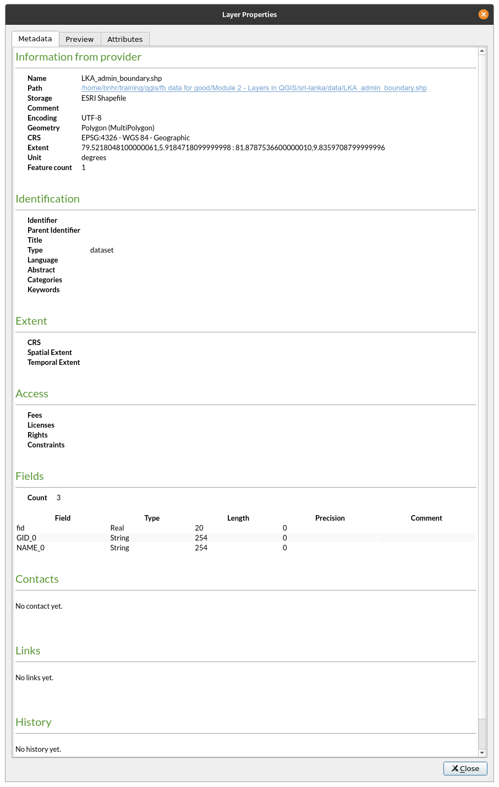

Figure 2.5. Layer Properties from Browser Panel


8. Aside from providing metadata on the layers, you can also preview the geometry and attributes of the layer in the layer properties window.
9. You can load a layer from the Browser Panel by:

    1. **double-clicking the layer**
    2. **right-clicking the layer ‣ Add Layer to Project**
    3. **dragging the layer to the Map Canvas** 

10. Try to load the **LKA_admin_boundary**, **LKA_districts**, and **LKA_divisions** layers using any of the methods above.

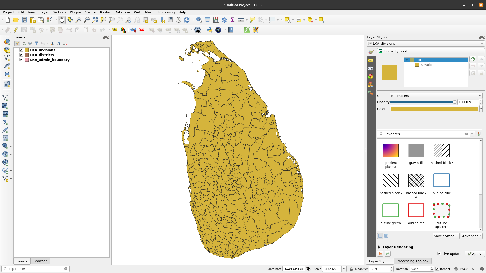

Figure 2.6. The vector layers loaded in QGIS


#### **The Layers Panel**

The Layers Panel lists all the current layers in the project. It helps manage their visibility, order, and can be used to show Layer Properties. The Layers Panel can be activated from **View ‣ Panels ‣ Layers Panel** or using the shortcut **CTRL+1**. It is also called the Map Legend. If you’ve loaded all the vectors from the previous exercise, your Layers Panel should appear like below:


Figure 2.7. The Layers Panel

The visibility of a layer can be controlled by checking or unchecking the box on the left of the Layer Name. By dragging the layers up or down in the Layers Panel, their Z-ordering can be changed. Similar to image manipulation software like GIMP or Photoshop, the layers listed near the top are drawn over layers listed lower down. So if two layers show the same area, the layer that is higher in the Layers Panel will be drawn on top of the lower layer and may not make the lower layer visible in the Map Canvas. This is worth noting because there can be instances where we think a layer does not appear in QGIS when in reality it is being covered or hidden by a layer on top of it. 

**NOTE:** The Z-ordering of layers in the Layers Panel can be overridden by the **Layer Order Panel**.

The Layers Panel also allows the user to rename and remove layers, filter layer visibility, create and manage layer groups and map views.

The attribute table of a vector layer can also be opened from the Layers Panel by **right-clicking on the layer ‣ Open attribute table**.

To learn more about the Layers Panel, go to: [https://docs.qgis.org/3.16/en/docs/user_manual/introduction/general_tools.html#layers-panel](https://docs.qgis.org/3.16/en/docs/user_manual/introduction/general_tools.html#layers-panel)


#### **Layer Properties**

Right-clicking on a layer in the Layers Panel and selecting Layer Properties will open the Layer Properties dialog.

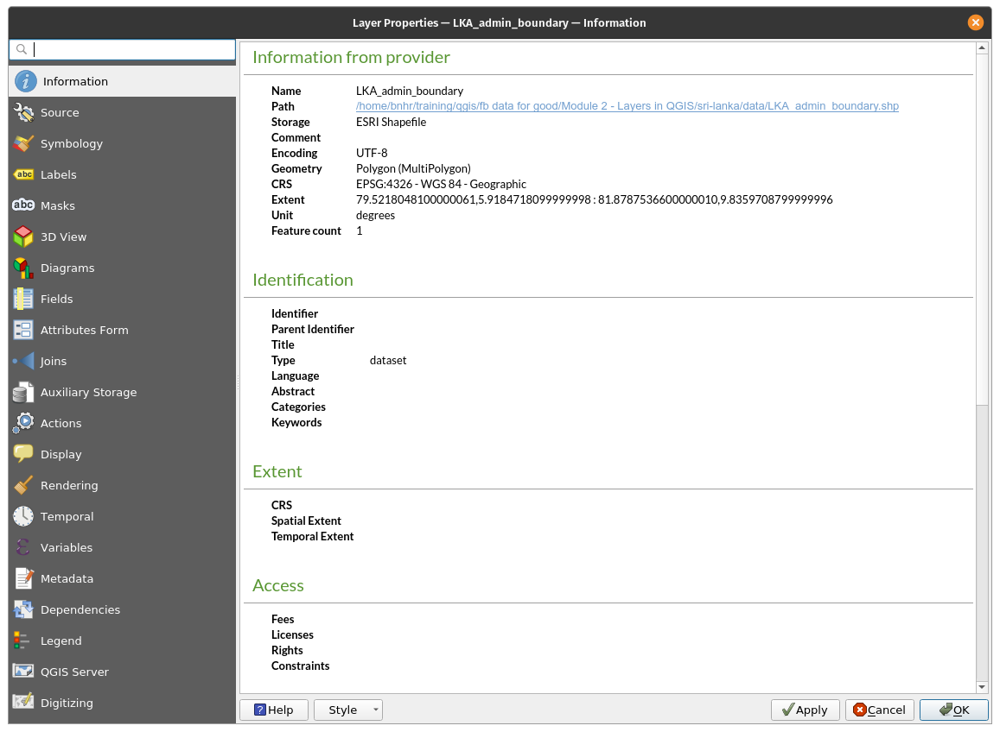

Figure 2.8. The Layer Properties dialog

There are several tabs in the Layer Properties dialog that allows the user to see information and even edit/modify properties related to the layer. 

The Information tab shows a read-only representation of summarized information and metadata on the current layer, including:

*   data provider
*   filled metadata
*   geometry or field information

The Source tab shows general settings for a vector layer.

Tabs such as Symbology, Labels, Masks, and 3D View allows the user to modify the symbology and style of the layer.

Other tabs allow users to perform joins with the Layer (Join), get information about the attribute fields (Fields), add custom Forms for adding new data (Attribute Forms), and many more.

Another tab worth mentioning is the Metadata tab that provides the user with the ability to create and edit a metadata report on the layer. This includes information on:

*   Data identification: basic attribution of the dataset (parent, identifier, title, abstract, language…);
*   Categories the data belongs to such as ISO categories and custom ones;
*   Keywords to retrieve the data and associated concepts following a standard based vocabulary;
*   Access to the dataset (licenses, rights, fees, and constraints);
*   Extent of the dataset, either spatial one (CRS, map extent, altitudes) or temporal;
*   Contact of the owner(s) of the dataset;
*   Links to ancillary resources and related information; and
*   History of the dataset.

A summary of the filled information is provided in the Validation tab and helps identify potential issues related to the metadata form. Currently, metadata is saved in the project file but they can also be saved in a separate .qmd file alongside the file based layers or in a local .sqlite database for remote layers.

To learn more about vector layer properties, go to: [https://docs.qgis.org/3.16/en/docs/user_manual/working_with_vector/vector_properties.html](https://docs.qgis.org/3.16/en/docs/user_manual/working_with_vector/vector_properties.html)

To learn more about raster layer properties, go to: [https://docs.qgis.org/3.16/en/docs/user_manual/working_with_raster/raster_properties.html](https://docs.qgis.org/3.16/en/docs/user_manual/working_with_raster/raster_properties.html)


#### **Geospatial Metadata**

Metadata is simply data about the data. It answers the who, what, when, where and how of the dataset and comes in all shapes and sizes. For GIS purposes, we are usually concerned with geospatial metadata. Geospatial metadata is described the the U.S. Federal Geographic Data Committee (FGDC) as:

_“a file of information, usually presented as an XML document, which captures the basic characteristics of a data or information resource. It represents the who, what, when, where, why and how of the resource. Geospatial metadata commonly document geographic digital data such as Geographic Information System (GIS) files, geospatial databases, and earth imagery but can also be used to document geospatial resources including data catalogs, mapping applications, data models and related websites. Metadata records include core library catalog elements such as Title, Abstract, and Publication Data; geographic elements such as Geographic Extent and Projection Information; and database elements such as Attribute Label Definitions and Attribute Domain Values.”_

The importance of metadata is that it not only promotes transparency but also facilitates data and information sharing. This is why it is important to always add metadata to our datasets. When adding metadata, it is equally important to follow standards -- widely promoted, accepted, and followed rules and practices -- so that the metadata we create are interoperable. One such standard is the ISO 19115:2014 “Geographic Information -- Metadata” from ISO/TC 211 ([https://www.iso.org/obp/ui/#iso:std:iso:19115:-1:ed-1:v1:en](https://www.iso.org/obp/ui/#iso:std:iso:19115:-1:ed-1:v1:en))


#### **Exercise 01.2: Adding Metadata**

1. Open the Layer Properties of the LKA_admin_boundary layer.
2. Check the information shown in the Information tab and look at the information shown. Is it complete? Can we add more information?


Figure 2.9. Information properties of the LKA_admin_boundary layer

3. Go to the Metadata tab and try adding more information about the layer such as the extent, data category, license, etc. Click OK when done.


Figure 2.10. Editing some metadata

4. Go to the Information tab again and see if anything changed.

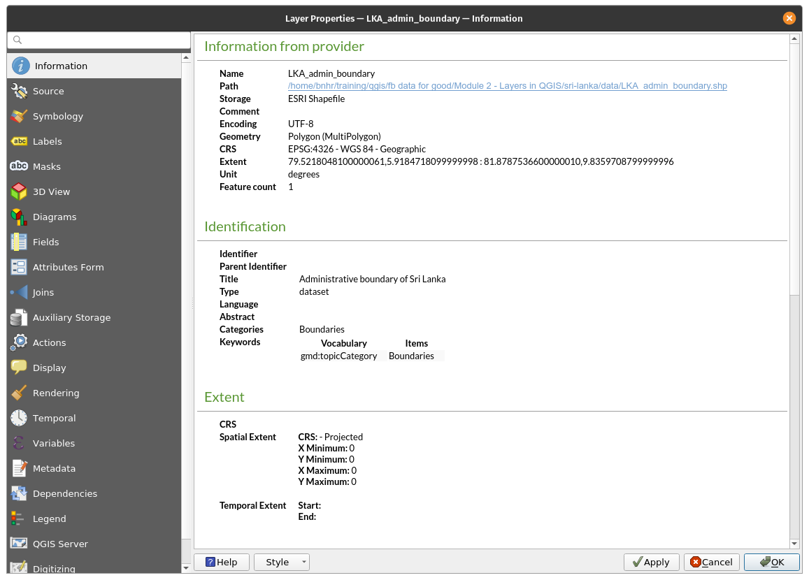

Figure 2.11. The Information tab after editing some metadata


#### Quiz questions

1. True or False:

    1. All vector files are shapefiles. -- ***False (a shapefile is a file format of a vector file. other vector data file formats include geopackage, geojson, and flatgeobuf)***
    2. When rendered on the Map Canvas, a layer that is higher in the Layers Panel will always cover or appear on top of a layer that is lower in the Layers Panel. -- ***False (when activated, the ordering on the Layer Order Panel will override the ordering in the Layers Panel)***
    3. You can check metadata information about a layer from the Layers Panel and the Browser Panel. -- ***True***


### Phase 2 title: The Data Source Manager and Connecting to Remote Services

#### **The Data Source Manager**

If you don’t want to use the Browser Panel to load layers, you can always use the **Data Source Manager**.

The **Data Source Manager** was introduced with the release of QGIS 3. It is a “one-stop-shop” for adding and loading layers from different data sources in QGIS. Prior to its introduction, there were separate windows for loading different data sources (i.e. one for rasters, one for vectors, etc.). It can be accessed via** Layers ‣ Data Source Manager** or **CTRL + L**.


Figure 2.12. The Data Source Manager


#### **Exercise 02.1: The Data Source Manager**

1. Open the **Data Source Manager**. It contains tabs on the right side that pertains to the kind of data source you want to load or connect to. Similar to the Browser, you can load and connect several kinds of data from the Data Source Manager.
2. **Loading Vectors**

    1. To load vectors, go to the Vector tab. Files, files within a Directory, a Database, and even remote files via a Protocol like HTTP, cloud, etc can be loaded.
    2. Let’s load the vector file (Colombo_hospitals) found inside the LKA_Colombo geopackage. This layer is a point layer of the locations of fast food restaurant Jollibee in NCR.

        1. Source Type: File
        2. Source: Select the LKA_Colombo geopackage using the  button
        3. Click Add
        4. If there are more than 1 vector file inside the geopackage, QGIS will ask you to select which ones to load.


Figure 2.13. Loading a vector inside a GeoPackage

3. **Loading Rasters**

    1. To load a raster, go to the Raster tab. Files and remote files via a Protocol like HTTP, cloud, etc can be loaded. There is a raster (LKA_Colombo_SRTM_DEM) inside the LKA_Colombo geopackage. This raster is a digital elevation model of the NCR region. To load it:

        1. Source Type: File
        2. Source: Select the LKA_Colombo geopackage using the  button
        3. Click Add
        4. If there are more than 1 raster file inside the geopackage, QGIS will ask you to select which ones to load

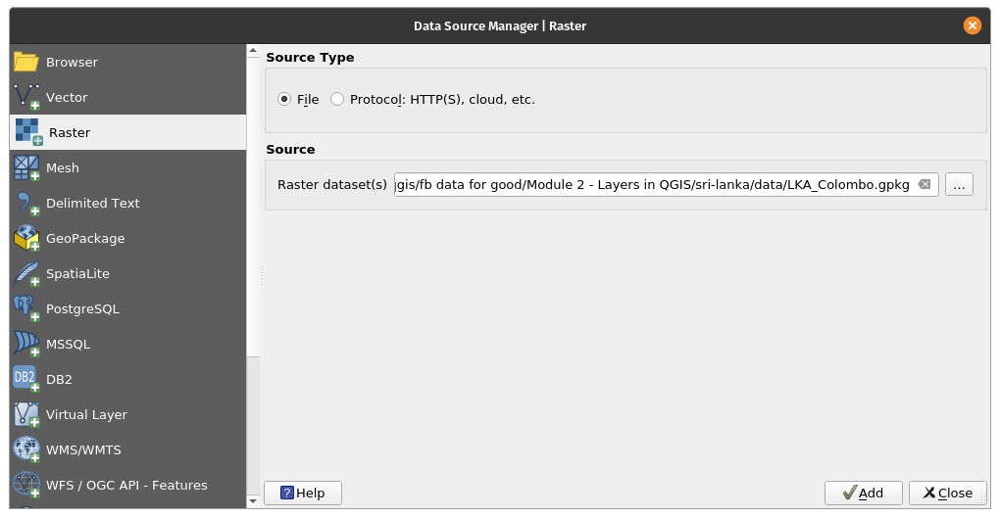

Figure 2.14. Loading a raster inside a GeoPackage

4. **Loading CSV and other Delimited Text Files**  

    1. Aside from vectors and rasters, another common file used by GIS people are CSVs and spreadsheets. Luckily, it’s relatively easy to load these files in QGIS.
    2. CSVs and other delimited text files can be loaded via the Delimited Text tab in the Data Source Manager, adding them from the Browser Panel, and even just dragging them into the Map Canvas. However, a few things should be considered if the CSV you have contains geometry information (i.e. point locations). The rule of thumb is:

        1. Use the Data Source Manager for loading CSVs whether or not they contain geometry information.
        2. If CSVs will be loaded via the Browser Panel or by dragging, make sure that there is a corresponding CSVT file to preserve the field data types.
        3. If you encounter problems with preserving data types for your delimited texts (specifically CSVs), you can use what’s called a CSVT file.  You can read more about loading CSVs in QGIS at the following link:  [https://bnhr.xyz/2018/08/07/specifying-csv-data-types-using-a-csvt-file.html ](https://bnhr.xyz/2018/08/07/specifying-csv-data-types-using-a-csvt-file.html)

    3. CSVs and spreadsheets can be loaded in QGIS with or without spatial or geometry information. When they are loaded with spatial information, they are treated as vector data. When they are loaded without, they are treated as normal tabular data.
    4. There is a CSV file in the data folder named Colombo_schools.csv which contains point locations of McDonald’s branches in NCR. To load it:

        1. Go to the Delimited Text tab
        2. File name: Select the Colombo_schools CSV using the  button
        3. File Format: CSV
        4. Record and Fields Options: keep default
        5. Geometry definition: 

            * Point coordinates
            * X field: longitude
            * Y field: latitude
            * Geometry CRS: EPSG: 4326 - WGS 84

        6. Layer settings: Check Watch file and Use spatial index

            * When Watch file is checked, updates to the local CSV are automatically reflected in the layer loaded in QGIS.
            * Use spatial index adds as spatial index to the loaded layer which makes vector processing faster.


Figure 2.15. Loading a CSV file

Once all the layers in the previous exercises are loaded, the Layers Panel should look something like below:

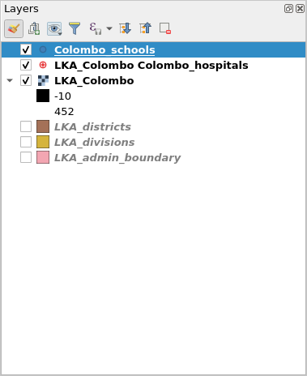

Figure 2.16. Layers Panel with all layers loaded


The Map Canvas should look something like:

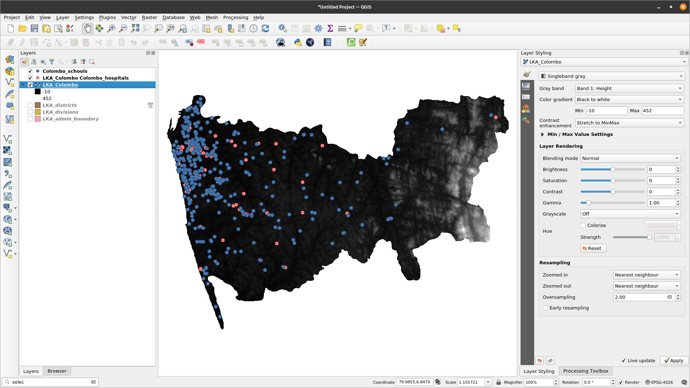

Figure 2.17. QGIS Interface with all layers loaded


Feel free to rearrange the layers in the Layer Panel.


#### **Connecting QGIS to Remote Services**

Aside from vector and raster files, QGIS can also connect to remote services such as tile servicers, OGC Web Services (WMS, WFS), and even ESRI ArcGIS Web Services. This connection can be created from the Browser Panel or the Data Source Manager.


#### **Exercise 02.2: Connecting to XYZ tiles**

XYZ tiles are usually used as basemaps and are utilized not just in desktop applications, but more commonly, in web applications. 

To connect to a tile server:

1. Go to the **Browser Panel**
2. **Right-click XYZ Tiles ‣ New Connection** 
3. Add the following:

```
    Name: Google Satellite
    URL: https://mt1.google.com/vt/lyrs=s&x=%7Bx%7D&y=%7By%7D&z=%7Bz%7D
```
4. Click OK.

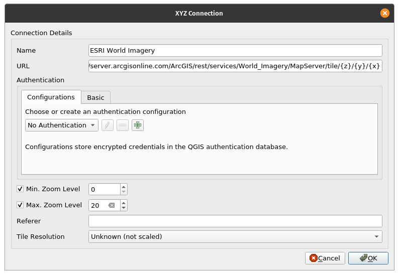

Figure 2.18. Adding and XYZ connection in QGIS

5. This should add a PGP Basemap item under XYZ Tiles in the Browser Panel.


Figure 2.19. PGP Basemap Tile server added to the Browser Panel

6. You can load the XYZ tile layer as you would any other layer from the Browser Panel.

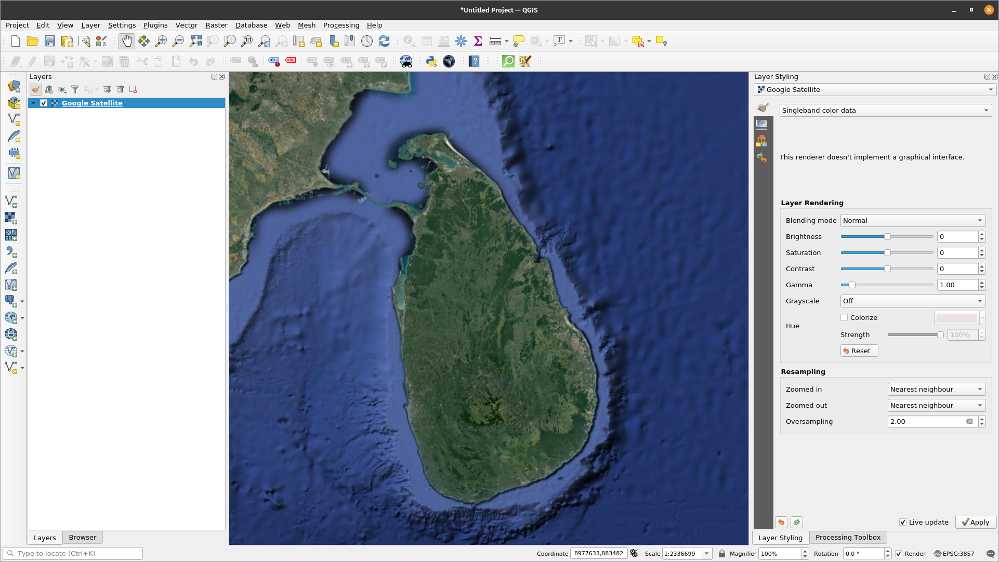

Figure 2.20. PGP Basemap layer loaded in QGIS


**BONUS:**  If you want to add several basemaps under XYZ Tiles in the Browser Panel, you can follow the instructions in this post: [https://bnhr.xyz/2018/10/07/basemaps-in-qgis.html](https://bnhr.xyz/2018/10/07/basemaps-in-qgis.html)

**BONUS #2:** You can add the URLs of the tileservers found in the Leaflet Providers website ([https://leaflet-extras.github.io/leaflet-providers/preview/](https://leaflet-extras.github.io/leaflet-providers/preview/)) as XYZ Tiles in the Browser Panel. 


#### **Exercise 02.3: Connecting to WMS/WMTS and WFS**

WMS or Web Map Service is an Open Geospatial Consortium (OGC) ([https://www.ogc.org/](https://www.ogc.org/)) complaint web service standard for serving images (raster tiles) over the internet. When data is served  via WMS, the user cannot directly edit the information underneath it nor style it.

Meanwhile, WFS or Web Feature Services is another OGC-compliant web service for serving features (vectors) over the internet. When data is served via WFS, the user has access to the underlying attributes and geometry thus allowing him to style, edit, and use the layer for vector analysis.

To connect to a WMS:

1. Go to the **Browser Panel**
2. **Right-click WMS/WMTS ‣ New Connection** 
3. Add the following:
```
Name: GeoServer Demo
URL: https://demo.geo-solutions.it/geoserver/geosolutions/wms
```
4. Click Add


Figure 2.21. Creating a new WMS/WMTS Connection

5. This should add a GeoServer Demo item under the WMS/WMTS and OWS connections in the Browser Panel.

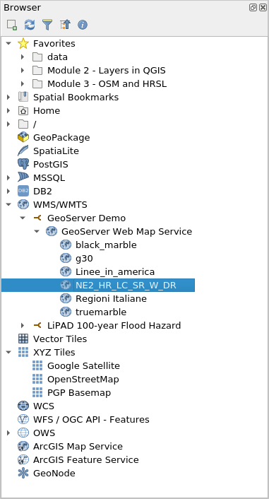

Figure 2.22. The GeoServer Demo WMS added in the Browser Panel

6. You can load the WMS layers as you would any other layer from the Browser Panel.


Figure 2.23. Natural Earth Land Cover map from WMS loaded in QGIS

7. Connecting to WFS follows the same procedure.


#### **Quiz questions**

1. True or False:

    1. You can only load local files in QGIS -- ***False (you can also load remote files such as those stored online or served by web services)***


### Phase 3 title: Exporting Layers, Layers in Memory (Temporary), and Virtual Layers

#### **Exporting Layers from QGIS**

Exporting layers (or saving layers to files) is straightforward in QGIS. Simply **Right-click on the layer ‣ Export** to view the export options for the layer.


Figure 2.24. Exporting a layer from QGIS

*   **Save Features As…** allows you to save the raster or vector layer.

    *   When a **filter** is active on the vector layer, only the filtered features (those appearing on the map canvas) are exported.

*   **Save Selected Features As...** is an option for vector layers that allows you to save only the features currently selected.
*   **Save as Layer Definition File…** creates a QLR file (see Module 1, QGIS File Formats) for the layer
*   **Save as QGIS Layer Style File…** saves a QML file (see Module 1, QGIS File Formats) for the layer

When exporting a layer, QGIS gives you the option to select the output file format, the fields to include (if a vector file), the output coordinate reference system, and other options. This means that you can perform coordinate projection by exporting a layer.


Figure 2.25. Save Vector Layer dialog

For more information on how to save a layer from an existing file, go to: [https://docs.qgis.org/3.16/en/docs/user_manual/managing_data_source/create_layers.html#save-layer-from-an-existing-file](https://docs.qgis.org/3.16/en/docs/user_manual/managing_data_source/create_layers.html#save-layer-from-an-existing-file)


#### **Layers in Memory**

Sometimes, we don’t need or want to physically save the layers we use in our analysis in our computers, especially if they are just temporary.

QGIS understands this and allows users to create **temporary / scratch** layers. These layers can be used similar to regular vector layers but do not need to be permanently saved into a file in our storage drives because QGIS stores them in memory or RAM. Temporary layers are shown in the Layer Panel with this icon .

The outputs of processing algorithms are stored as temporary layers by default.

The downside of temporary layers is that QGIS “**forgets**” these “**layers in memory**” when it is closed. To remedy this, we can use the **Memory Layer Saver plugin** to allow our temporary layers to be persistent. When saving a QGIS project that uses temporary layers, it is good practice to run/activate the Memory Layer Saver plugin first. To use the Memory Layer Saver plugin, simply go to **Plugins ‣ Memory Layer Saver** before saving and closing your QGIS project. The next time you open your QGIS project, the temporary layers (or layers in memory) should still be present.

Of course you can also just make the temporary layer permanent by exporting the layer to a file. Clicking the  icon will automatically open an export layer dialog.


#### **Virtual Layers**

A virtual layer is a special type of vector layer that is created “on the fly” as a result of a query or data from another layer.

For example, we can create a virtual layer that creates a buffer around another feature layer. Whenever a new feature is added to the source feature layer, the virtual layer will be updated accordingly. 

Currently, virtual layers don’t seem to work with source layers in memory.

Virtual layers are dynamic. This means that when the base/source layer is updated, the virtual layer is updated as well. This can save space and reduce data duplication since the virtual layer data will simply get data from the base layer without needing to save anything to your disk although there can be some performance overhead if complex queries or operations are used to define the virtual layer.

SQL-like constructs are used to define the virtual layer. 

Virtual layers are dependent on other layers so it is important that the base layers are not moved or renamed.

When the base layer is updated, you need to refresh the map display by panning or zooming the map to show the virtual layer update.


#### **Quiz questions**

1. True or False:
    
    1. When exporting a vector layer, you can select the format to save it to. -- ***True***
    2. Temporary (or scratch) layers are always forgotten by QGIS when it is closed. -- ***False (they can be made persistent by using the Memroy Layer Saver plugin)***
    3. When the base layer for a virtual layer is updated, the virtual layer is automatically updated on the map canvas without need for user input. -- ***False (the user needs to update the  map canvas either by panning or zooming before the virtual layer update is reflected on the canvas)***


### If you want to go further:  


#### **Install some plugins that serve as data sources**

Some plugins provide the functionality to load data into QGIS. These include vector data, satellite imagery, raster files, basemaps, etc. Try to install the following plugins and find out what kind of data they load in QGIS:

*   QuickOSM ([https://plugins.qgis.org/plugins/QuickOSM/](https://plugins.qgis.org/plugins/QuickOSM/))
*   SRTM-Downloader ([https://plugins.qgis.org/plugins/SRTM-Downloader/](https://plugins.qgis.org/plugins/SRTM-Downloader/))
*   QuickMapServices ([https://plugins.qgis.org/plugins/quick_map_services/](https://plugins.qgis.org/plugins/quick_map_services/))

P.S. Some of these plugins require you to sign up for an account with the data provider.


#### **Connect to GeoNode instances**

GeoNode ([https://geonode.org/](https://geonode.org/)) is an open-source Geospatial Content Management System built with a mature FOSS4G stack that includes PostGIS, GeoServer, MapStore, etc. You can think of GeoNode as a geospatial data portal. You can easily connect QGIS to a GeoNode instance via the GeoNode connector in the Browser Panel or the Data Source Manager.

1. Go to the **Browser Panel**
2. Right-click **GeoNode ‣ New Connection**
3. Add the following:
```
Name: UNESCO IHP-WINS
URL: [http://ihp-wins.unesco.org/](http://ihp-wins.unesco.org/) 
```

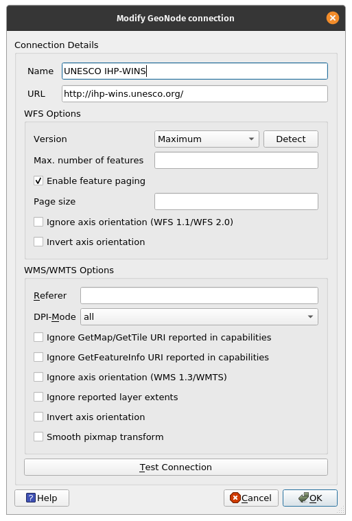

You can learn more about connecting QGIS to remote services at: [https://bnhr.xyz/2018/10/12/connecting-qgis-to-remote-services.html](https://bnhr.xyz/2018/10/12/connecting-qgis-to-remote-services.html)


#### **Exercise/Tutorial on Virtual Layers**

1. Open QGIS.
2. Load a satellite image or satellite basemap via XYZ tiles or QuickMapServices plugin (e.g. Google Satellite).
3. Create a new geopackage layer with  in the Data Source Manager toolbar. Name it Trees, add a radius (integer) and species (text) fields, and use a projected CRS (e.g. EPSG:3857)

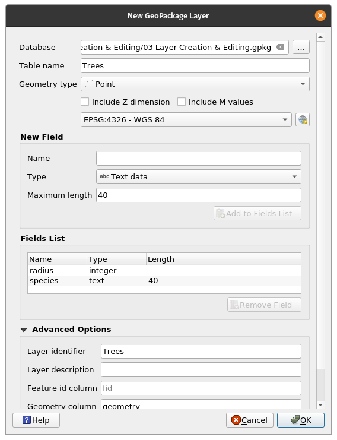

When you are prompted that the file already exists, select Add New Layer.


4. Toggle editing on Trees by right-clicking on it ‣ Toggle editing or clicking  in the Digitizing Toolbar.
5. Select an area on the satellite image that has trees.
6. With Editing toggled on, enable adding points to the Trees layer by clicking  (CTRL + .).
7. Digitize individual trees by clicking on their location and adding the attribute information. Do this for 4 trees. For this exercise, can just guess the information.


8. After adding the points, don’t forget to save your edits by clicking  in the Digitizing toolbar before toggling the Editing off.

 added]")

9. Add a virtual layer by clicking 
 in the Data Source Manager toolbar.
10. Set Layer name to Tree Canopy. Import Trees. Add the following query: 
```
select fid, buffer(geometry, radius), species from Trees
```


Add a new point then refresh the map display (by zooming or panning the map canvas) to see the update in the virtual layer. What did you notice?


### To practice your new skills, try to…

#### **Load rasters and vectors found on the internet**

Aside from local binary files (vectors, rasters), QGIS can also load vectors and rasters found on the internet. Use the Data Source Manager to load the data from the following URL:

https://raw.githubusercontent.com/benhur07b/stomp-covid19-data/master/spatial/stompcovidph_regions.geojson


#### **Load a Spreadsheets in QGIS using the Spreadsheet Layers plugin**

Install the Spreadsheet Layers plugin and try to load a spreadsheet in QGIS. The plugin accepts Open Document Standard formats (.ods) and Microsoft Excel files (.xls, .xlsx).

Read here: [https://bnhr.xyz/2018/07/27/plugin-fridays-spreadsheet-layers-plugin.html](https://bnhr.xyz/2018/07/27/plugin-fridays-spreadsheet-layers-plugin.html)


### Tips 

1. If you ever need a world map layer, try typing **world** in the Coordinate bar of the Status bar. What happens? This is just one of the easter eggs found in QGIS when you type certain words in the Coordinate bar.
