

<h2>
الوحدة 4 - طبقات التصميم - Styling Layers
</h2>

المؤلفة: Ketty, Ben Hur, Ali, Samah, Mohammad Ali

<h2>
مقدمة تعليمية
</h2>

تم تصميم هذه الوحدة لتعليمك كيفية تغيير المظهر المرئي للخريطة عن طريق تحديد الرموز المناسبة وألوان الخريطة وتطبيق التأثيرات المناسبة. مع نهاية هذه الوحدة، يجب أن تكون قد اكتسبت مفاهيم مثل رموز الخريطة وأنماط الخرائط. بالإضافة إلى ذلك، ستتعلم المهارات التالية؛

*   طبقات التصميم
*   الرموز النقطية والمتجهات الأساسية وكيفية تطبيقها على طبقة ما
*   أوضاع المزج وتأثيرات الرسم 
*   استخدام التعبيرات لتشغيل عملية مكانية

<h2>
الأدوات والموارد المطلوبة لهذه الوحدة هي:
</h2>

*    حاسوب
*   اتصال بالإنترنت
*   QGIS 3.16 مثبّت على الحاسوب ([https://qgis.org/en/site/forusers/download.html](https://qgis.org/en/site/forusers/download.html))
*   طبقة Dubia_Boundary داخل  Dubia_Boundary.gpkg. يجدر الاشارة ان ملف Dubia_Boundary يضم الحدود الادارية.
*   الوحدة النمطية amenity_clinic.gpkg
*   High Resolution Settlement Layer clipped_population.tif

<h2>
المؤهلات المطلوبة
</h2>

*   المعرفة الأساسية لتشغيل حاسوب
*   فهم مقبول جميع الوحدات السابقة

<h2>
مصادر إضافية
</h2>

*   رموز QGIS -  https://docs.qgis.org/3.16/en/docs/training_manual/basic_map/symbology.html
*   مستودع مشاركة النمط - [https://www.gislounge.com/qgis-style-sharing-repository](https://www.gislounge.com/qgis-style-sharing-repository)
*   الأنماط - [https://plugins.qgis.org/styles](https://plugins.qgis.org/styles/)
*   مركز الأنماط - [https://style-hub.github.io](https://style-hub.github.io/)  Style Hub 
*   Hillshade in QGIS - [https://bnhr.xyz/2019/02/08/mapping-icebergs-in-qgis.html](https://bnhr.xyz/2019/02/08/mapping-icebergs-in-qgis.html)
*   Mapping Icebergs in QGIS [https://bnhr.xyz/2019/02/08/mapping-icebergs-in-qgis.html](https://bnhr.xyz/2019/02/08/mapping-icebergs-in-qgis.html) 

<h2>
مقدمة موضوعية
</h2>

لنفترض أنك تقوم بزيارة مدينة جديدة كسائح أو للترفيه أو للعمل. يوجد في المدينة مجموعة من الأماكن التي يجب زيارتها مثل المتاحف والمقاهي والشواطىء والمعالم الأثرية والمتاجر والأسواق الثقافية. يتم تسليمك بعد ذلك خريطة مدينة ورقيّة توضح لك مواقع النقاط لجميع الأماكن التي يجب رؤيتها في المدينة. وقد تم تمييز جميع النقاط السياحية كنقاط حمراء. من وجهة نظرك، هل ستسهل هذه الخريطة جولتك في المدينة الجديدة؟ لا أتوقع ذلك.

فمن المهم دائمًا إنشاء "خريطة تعرض رموزًا وألوانًا مختلفة". ما ستراه في خريطتك بعد تطبيق مفاهيم الأنماط هو تمثيل مرئي ديناميكي للبيانات التي تعمل عليها.

<h3>
اللوحات وعلامات التبويب وأنواع العرض المهمة 
</h3>

<h4><strong>
لوحة تصميم الطبقة - Layer Styling Panel
</strong></h4>

هذه اللوحة هي اختصار لبعض ميزات مربع حوار خصائص الطبقة. إنها توفر لك طريقة سريعة وسهلة لتحديد طريقة عرض وسلوك الطبقة، وتصور آثارها دون فتح مربع حوار خصائص الطبقة.

إنّ هذه اللوحة لا تسمح فقط بتجنب التعامل مع مربع حوار الوسائط modal والمنع blocking لخصائص الطبقة، بل أيضاً بتجنب ازدحام الشاشة بمربعات حوار الميزات نظرًا لأن معظمها تضمن (مُحدِّد اللون، وخصائص التأثيرات، وتحرير القاعدة، واستبدال التسمية ...): على سبيل المثال، يؤدي النقر فوق أزرار اللون داخل لوحة تصميم الطبقة إلى فتح مربع حوار مُحدِّد اللون داخل لوحة تصميم الطبقة نفسها بدلاً من فتحه كمربع حوار منفصل.

من القائمة المنسدلة drop-down list للطبقات الحالية في لوحة الطبقة، قم بتحديد أحد العناصر ثم:

*   قم بتعيين الترميزsymbology والشفافية transparency والمدرّج الإحصائي histogram في حالة الطبقة النقطية. هذه الخيارات نفسها متوفرة في مربع حوار خصائص البيانات النقطية.([https://docs.qgis.org/3.16/en/docs/user_manual/working_with_raster/raster_properties.html#raster-properties-dialog](https://docs.qgis.org/3.16/en/docs/user_manual/working_with_raster/raster_properties..html#raster-properties-dialog)).
    *   يمكنك الوصول إلى مربع حوار خصائص البيانات النقطية بالنقر المزدوج فوق الطبقة النقطية ‣ عام (Raster Layer ‣ General)
*   قم بتعيين رموزها وتسمياتها. هذه الخيارات نفسها متوفرة في مربع حوار خصائص المتجه ([https://docs.qgis.org/3.16/en/docs/user_manual/working_with_vector/vector_properties.html#vector-properties-dialog](https://docs.qgis.org/3.16/en/docs/user_manual/working_with_vector/vector_properties.html#vector-properties-dialog).)
    *   يمكنك الوصول إلى مربع حوار خصائص المتّجه بالنّقرالمزدوج فوق طبقة المتجه ‣ عام (Vector Layer ‣ General)
*   اتّبع السّجل الكامل للتغييرات التي سبق وطبقتها على نمط الطبقة في المشروع الحالي؛ يمكنك إلغاء أو استعادة أي حالة سابقة عن طريق تحديدها في القائمة والنقر فوق تطبيق (Click Apply).

ميزة أخرى قوية لهذه اللوحة هي مربع اختيار التحديث المباشر(Live update checkbox). ضع علامة عليه وسيتم عرض التغييرات تلقائيًا في لوحة الخريطة أثناء تقدمك. لم تعد بحاجة إلى النقر فوق الزر "تطبيق".

لتنشيط اللوحة، انقر فوق عرض ‣ اللوحات (Click View ‣ Panels) ، ثم حدد تصميم الطبقة.

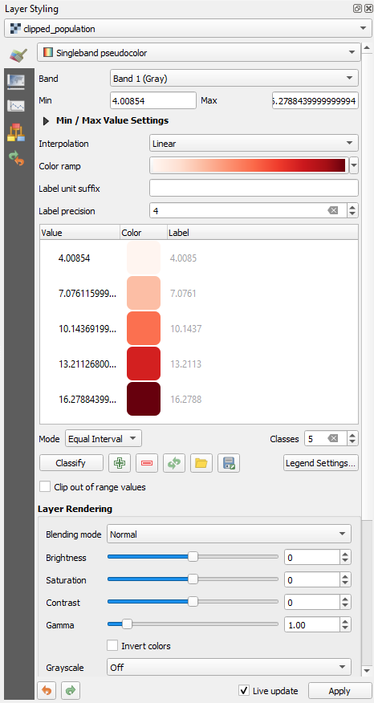

Figure 1. لوحة تصميم الطبقة

<h4><strong>
علامة تبويب الترميز في خصائص الطبقات
</strong></h4>

للوصول إلى علامة التبويب Symbology ، انقر نقرًا مزدوجًا فوق الطبقة لفتح خصائص الطبقة ‣ انقر فوق Symbology

هنا، يمكنك تحديد إعدادات نطاق العرض  مثل، نوع العرض (render type)، والنطاق (band)، وقيم الحد الأدنى/ الحد الأقصى (mix/max values)، وعرض اللون (color rendering)، وإعادة التشكيل (resampling). في لقطات الشاشة أدناه، يمكنك رؤية علامات تبويب الرموز لمجموعة البيانات المتجهة والنقطية (مستوصفات Dubai_Boundary وسكان Dubai_Boundary)، على التوالي؛

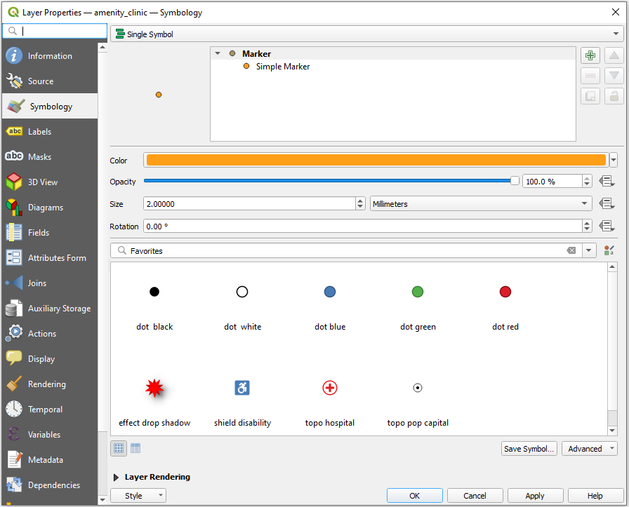

علامة تبويب الرموز لبيانات المتجه والبيانات النقطية، على التوالي .Figure 2

<h4><strong>
عرض نقطي: عرض النطاق - Raster rendering: Band rendering
</strong></h4>

يقدم QGIS أربعة أنواع مختلفة من العرض (Render types). يعتمد اختيار العارض على نوع البيانات. نوع العرض الافتراضي هو لون رمادي أحادي النطاق. سيتعين عليك تغييره إلى النوع المناسب بناءً على نوع البيانات.

*   يستخدم اللون متعدد النطاق Multiband color ([https://docs.qgis.org/3.16/en/docs/user_manual/working_with_raster/raster_properties.html#multiband-color](https://docs.qgis.org/3.16/en/docs/user_manual/working_with_raster/raster_properties.html#multiband-color)) - إذا كان الملف يأتي مع عدة نطاقات (على سبيل المثال، صورة من القمر الصناعي مع عدة نطاقات).
*   Paletted / القيم الفريدة ([https://docs.qgis.org/3.16/en/docs/user_manual/working_with_raster/raster_properties.html#paletted](https://docs.qgis.org/3.16/en/docs/user_manual/working_with_raster/raster_properties.html#paletted)) - تستخدم لملفات النطاق الفردي التي تأتي مع لوحة مفهرسة (مثل الخريطة الطبوغرافية الرقمية) أوبشكل عام للـ palettes من أجل عرض الطبقات النقطية.
*   رمادي أحادي النطاق Singleband gray ([https://docs.qgis.org/3.16/en/docs/user_manual/working_with_raster/raster_properties.html#singleband-gray](https://docs.qgis.org/3.16/en/docs/user_manual/working_with_raster/raster_properties.html#singleband-gray)) - (نطاق واحد) حيث سيتم عرض الصورة باللون الرمادي. يختار QGIS هذا العارض إذا لم يكن الملف متعدد النطاقات multiband أو مرقطًا paletted  (مثل خريطة إغاثة مظللة).
*   أحادي النطاق pseudocolor ([https://docs.qgis.org/3.16/en/docs/user_manual/working_with_raster/raster_properties.html#label-colormaptab](https://docs.qgis.org/3.16/en/docs/user_manual/working_with_raster/raster_properties.html#label-colormaptab)) - يمكن استخدام هذا العارض للملفات ذات لوحة الألوان المستمرة أو خريطة الألوان (مثل الارتفاع خريطة).
*   Hillshade (([https://docs.qgis.org/3.16/en/docs/user_manual/working_with_raster/raster_properties.html#hillshade-renderer](https://docs.qgis.org/3.16/en/docs/user_manual/working_with_raster/raster_properties.html#hillshade-renderer)) - يُنشئ ظل تلال من نطاقٍ ما.

<h4><strong>
عرض المتجهات - Vector rendering
</strong></h4>

عند تحميل طبقات البيانات المكانية في QGIS Desktop، يتم تصميمها باستخدام عرض عشوائي للرمز الفردي (random Single Symbol rendering). لتغيير هذا انقر فوق طبقة ‣ خصائص ‣ نمط (Layer‣Properties‣Style).

هناك العديد من خيارات العرض المتاحة في القائمة في الزاوية اليسرى العليا:

*   رمز واحد - Single Symbol - هذا هو العرض الافتراضي حيث يتم تطبيق "رمز واحد" على كل الميزات في الطبقة.
*   مصنّف Categorized - يسمح لك باختيار حقل البيانات الجدولية الفئوية لتصميم الطبقة باستخدامه. اختر الحقل، وانقر فوق تصنيف وسيقوم QGIS بتطبيق رمز مختلف على كل قيمة فريدة في الحقل. يمكنك أيضًا استخدام الزر "تعيين تعبير العمود" (Set column expression) لتحسين النّمط باستخدام تعبير SQL.
*   متدرج Graduated - يسمح لك بتصنيف البيانات حسب سمة حقل رقمية إلى فئات منفصلة. يمكنك تحديد معايير التصنيف (نوع التصنيف وعدد الفئات) ويمكنك استخدام زر "Set column expression" لتحسين التصميم باستخدام تعبير SQL.
*   مستند إلى قواعد Rule-based- يُستخدم هذا لإنشاء تصميم مستند إلى قاعدة مخصصة. سوف تستند القواعد على تعبيرات SQL.
*   إزاحة النقطة Point displacement- إذا كانت لديك طبقة نقطية بنقاط مكدسة، فيمكن استخدام هذا الخيار لإزاحة النقاط بحيث تكون جميعها مرئية.
*   المضلعات المعكوسة Inverted polygons- هذا عارض جديد يسمح بتحويل مضلع الميزة إلى قناع. على سبيل المثال، سيصبح مضلّع حدود المدينة المستخدم مع هذا العارض قناعًا حول المدينة. كما يسمح باستخدام خيارات العرض: المصنّف والمتدرّج والقائم على القواعد وتعبيرات SQL.

<h2>
المحتوى الرئيسي
</h2>

<h3>
المرحلة 1: الرموز الأساسية للنّقطية والمتّجهات 
</h3>

قد يختلف ترميز بيانات المتجه حسب الشفافية واللون والتدوير والحجم.

<h4><strong>
محتوى
</strong></h4>

*   خصائص الطبقة وقائمة الترميز
*   أنواع عرض المتجهات
*   أنواع عرض البيانات النقطية (عرض النطاق)

<h4><strong>
مثال 1: عرض المتجه
</strong></h4>

1. لتوضيح هذا المثال، سنستخدم مجموعتين من البيانات؛ 1. المستوصفات و 2. الحدود الإدارية لمقاطعة Dubai_Boundary
2. أضف الطبقتين المتجهتين إلى QGIS؛ انقر فوق الزر "إضافة طبقة متجه" (Add vector layer)   أو استخدم لوحة المتصفّح.
3. هذه هي الطريقة التي يقدّمها QGIS بشكل افتراضي. ستلاحظ أنّه أصبح لدينا طبقة مضلع وطبقة نقط. الخطوة التالية هي تغيير الرموز لكل منهما. قد لا تكون ألوان التعبئة هي نفسها، ولكن هذه ليست مشكلة لأن QGIS يختار الألوان عشوائيًا لمثيلات مختلفة من التطبيق.

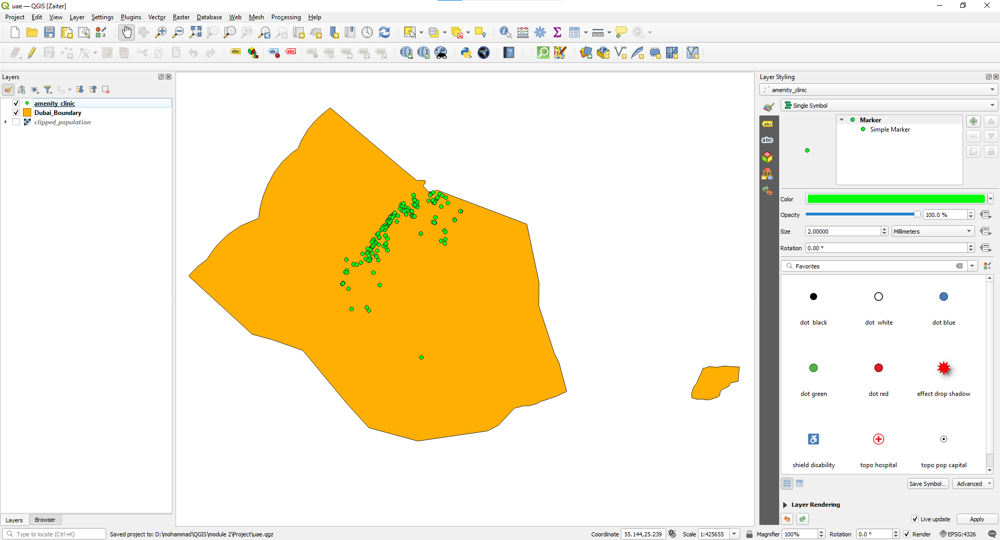

Figure 3: العرض الإفتراضي

4. انقر نقرًا مزدوجًا فوق طبقة متجه المضلع ، وهي أيضًا طبقة الحدود الإدارية لمقاطعة Dubai_Boundary
5. حدد علامة التبويب Symbology في القائمة التي تظهر
6. قم بتغيير لون التعبئة إلى تعبئة شفافة. تلميح: انقر فوق سهم القائمة المنسدلة أسفل لون التعبئة
7. يجب أن تكون النتيجة على النحو التالي. قد تلاحظ أن خيار عدم التعبئة ليس له لون

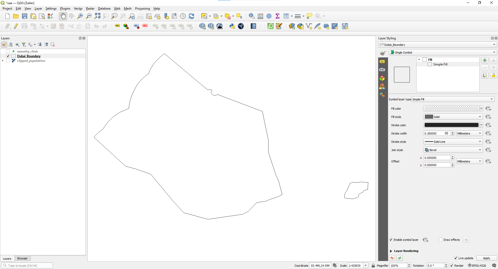

Figure 4: للمضلع no fill عرض تعبئة  

8. الخطوة التالية هي ترميز طبقة النقطة وهي أيضًا طبقة المستوصفات
9. انقر نقرًا مزدوجًا فوق طبقة المستوصفات لفتح مربع حوار Layer Properties. قم بتغيير نوع العرض من Single Symbol إلى Categorized، حدد القيمة على أنها وسيلة راحة (amenity). تمثل القيمة مجال الاهتمام. حدد منحدر الرمز واللون (Symbol and Color  ramp). ثم انقر فوق تصنيف (classify).

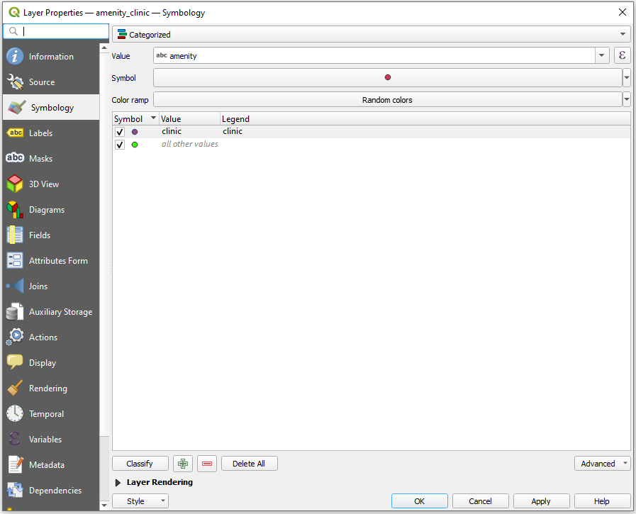

Figure 5: حوار خصائص الطبقة

10. يجب أن تبدو الخريطة الناتجة على النحو التالي

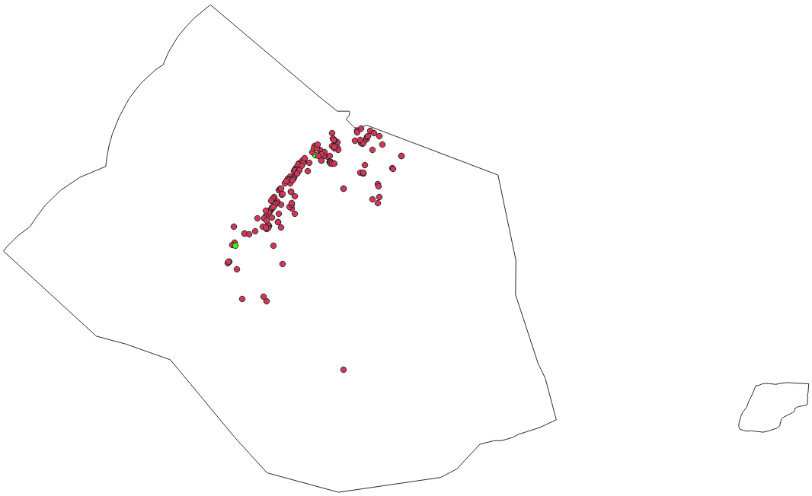

Figure 6: عرض المتجه النهائي

11. تذكر أن تقوم بترتيب الطبقات في لوحة الطبقة بحيث تكون طبقة المضلع أسفل طبقة النقطة. هذا يجعل طبقة النقطة مرئية.

<h4><strong>
مثال 2: عرض نقطي
</strong></h4>

1. انقر نقرًا مزدوجًا فوق الطبقة النقطية وهي أيضًا طبقة كثافة السكان. وهذا يعني أيضًا أنها مجموعة بيانات تمت تسويتها (normalized dataset)، وبالتالي يمكن تصورها كخريطة choropleth.
2. حدد علامة تبويب الرموز في القائمة التي تظهر
3. تغيير وضع التصميم إلى "مفردة النطاق الكاذب" (Singleband pseudocolor)

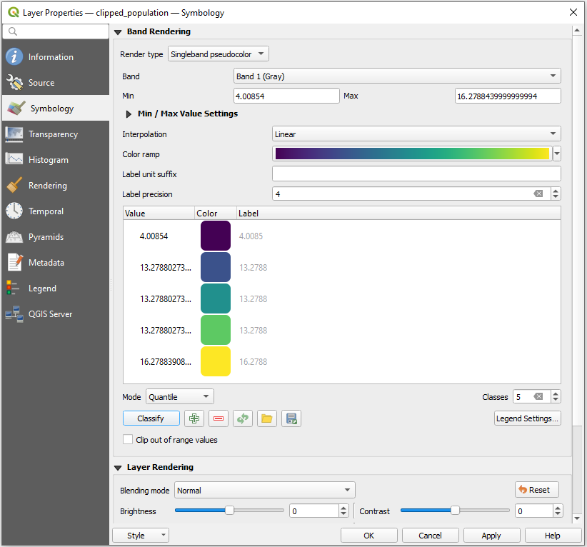

Figure 7: قائمة الترميز

4. حدد الاستيفاء (interpolation) وتدرج اللون والوضع. انقر فوق تصنيف. والنتيجة هي خريطة choropleth توضح الكثافة السكانية عبر مقاطعة Dubai_Boundary.

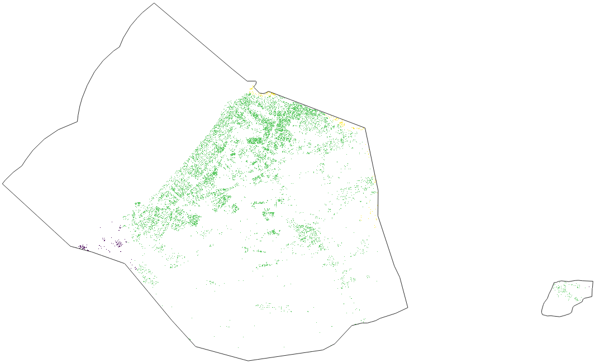

الكثافة السكانية في مقاطعة Dubai_Boundary :Figure 8

5. قم بتكبير الصورة لرؤية الخريطة الجديدة بتفاصيل أدق.

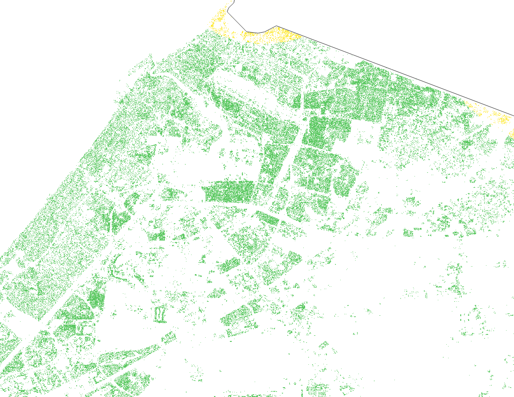

خريطة مكبرة: Figure 9

6. بدلاً من هذه الطريقة يمكنك استخدام لوحة Layer Styling.

<h4><strong>
أسئلة الاختبار
</strong></h4>

1. ما هو ترميز الطبقة؟
2. أي من أنواع العرض أدناه تنطبق على بيانات المتجه؟
3. ما هي أنواع عرض البيانات النقطية؟

<h4><strong>
إجابات الاختبار
</strong></h4>

1.  
    1. عنصر رسومي يتم تمثيله كعلامة أو حد أو تعبئة. 
    2. مؤشر إلى البيانات الأصلية .
    3.  مستودع لأنظمة الألوان المختلفة.
2. 
    4. عارض رمز واحد single symbol.
    5.  العارض "لا توجد رموز"  no symbols. 
    6. العارض المصنف categorized.
    7.  العارض graduated.
    8.  الرمز النسبي.
    9.  الرمز النسبي.
    10.  نقطة العارض العنقودية point cluster renderer
3. 
    11. أحادية النطاق الزائف singleband pseudocolor
    12. واحد رمادي singleband gray
    13. شاحب paletted
    14. متعدد الألوان multiband color

<h3>
المرحلة 2: أوضاع المزج وتأثيرات الرسم - Blending modes and draw effects
</h3>

<h4><strong>
محتوى
</strong></h4>

*   تعديل هياكل الرموز
*   تعديل تأثيرات الرسم وأوضاع المزج
*   تقديم البيانات بشكل

<h4><strong>
الدورة التعليمية
</strong></h4>

1. بعد تحميل الطبقتين في QGIS، ستبدو اللوحة على النحو التالي. ستلاحظ أن كلا الطبقتين لهما تصميم بسيط. سيشرح هذا البرنامج التعليمي كيفية تغيير تأثيرات الرسم وأوضاع المزج لتحسين التقديم أو العرض.

مساحة العمل الأولية المتوقعة: Figure 10

2. افتح نافذة Layer Properties ، ثم انقر فوق عنصر قائمة Symbology لطبقة الحدود الإدارية.    نصيحة: قم بذلك عن طريق النقر المزدوج فوق الطبقة أو استخدام لوحة تصميم الطبقة. قم بتمكين لوحة تصميم الطبقة بالنقر فوق:   View ‣ Panels ‣ Layer Styling. في الجزء السفلي من قائمة الترميز، يوجد مربع اختيار لتأثيرات الرسم. دعنا نقوم بتمكين ذلك، ثم انقر على زر تخصيص التأثيرات    إلى اليمين:

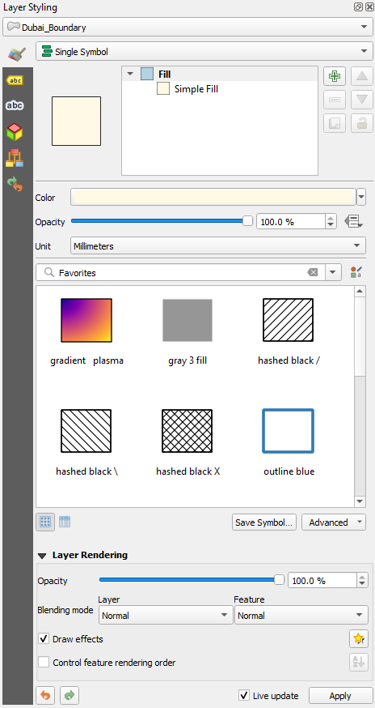

Figure 11: Layer Properties ونافذة  Symbology قائمة

3. سيفتح مربع حوار خصائص التأثيرات الجديد

Figure 12: حوار خصائص التأثيرات

4. يمكنك أن ترى أن التأثير الوحيد المدرج حاليًا هو تأثير المصدر. تأثيرات المصدر ليست مثيرة بشكل خاص - كل ما تفعله هو رسم الطبقة الأصلية دون تغيير. قم بتغيير هذا إلى تأثير Blur بالنقر فوق combo box نوع التأثير وتحديد Blur. يمكنك بعد ذلك التلاعب بمعايير التمويه.

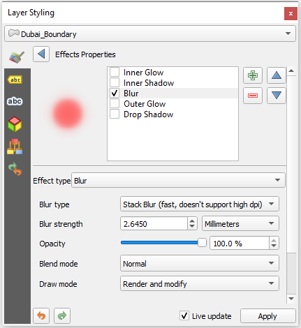

حدد نوع التأثير على أنه تمويه: Figure 12

5. قم بتطبيق الإعدادات الآن، سترى أن طبقة المضلع أصبحت الآن ضبابية.

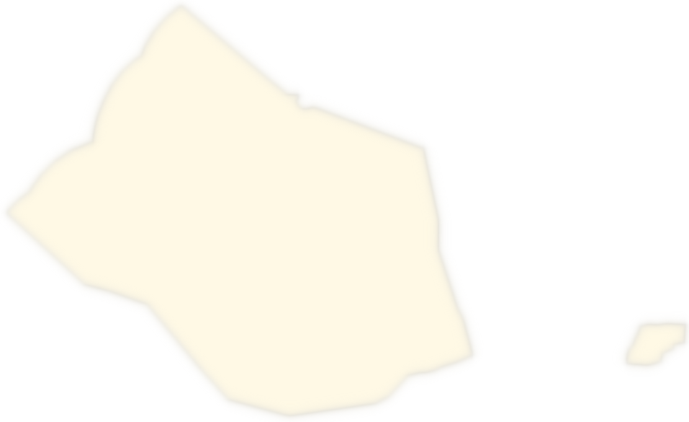

Figure 14: طبقة ضبابية

6. استخدام مربع حوار خصائص التأثيرات مرة أخرى. دعونا نجرب شيئًا أكثر تقدمًا. بدلاً من مجرد تأثير واحد، من الممكن تجميع تأثيرات متعددة معًا لإنشاء نتائج مختلفة. لنقم بإنشاء ظل تقليدي مُسقط عن طريق إضافة تأثير الظل المسقط Drop shadow تحت تأثير المصدر Source.

Figure 15: حوار خصائص التأثيرات

7. يتم رسم التأثيرات من أعلى لأسفل، لذا سيظهر الظل المسقط أسفل مضلعات المصدر

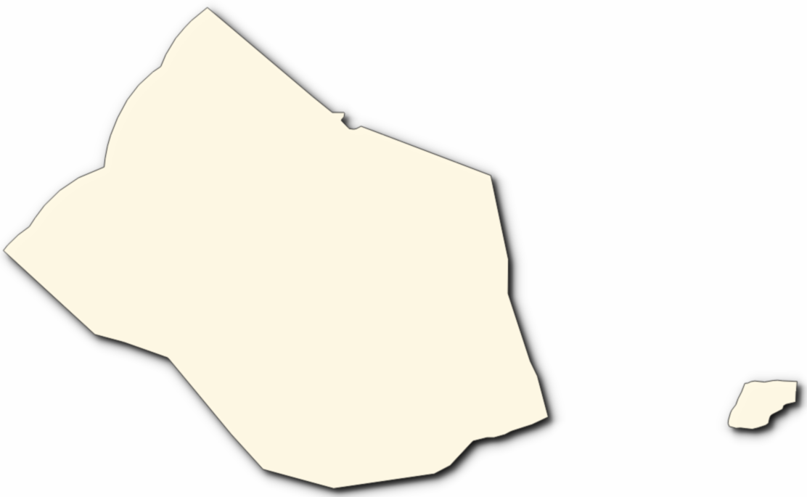

Figure 16:إسقاط تأثير الظل 

8. يمكنك تكديس العديد من التأثيرات كما تريد. على سبيل المثال توهج داخلي inner glow فوق تأثير المصدر، مع ظل مسقط dropshadow أسفل كل شيء.

بشكل عام، تذكر أنه يمكن إما تطبيق التأثيرات على طبقة بأكملها، أو على طبقات الرموز الفردية للمعالم داخل الطبقة. في الأساس، الاحتمالات لا حصر لها تقريبا! يمكن لبرامج Python المساعدة أيضًا توسيع ذلك من خلال تنفيذ تأثيرات إضافية.

لمزيد من الأمثلة حول ما يمكنك فعله باستخدام أوضاع المزج وتأثيرات الرسم في QGIS، يمكنك التحقق من:

*   Hillshade in QGIS - [https://bnhr.xyz/2019/02/08/mapping-icebergs-in-qgis.html](https://bnhr.xyz/2019/02/08/mapping-icebergs-in-qgis.html)
*   Mapping Icebergs in QGIS - [https://bnhr.xyz/2019/02/08/mapping-icebergs-in-qgis.html](https://bnhr.xyz/2019/02/08/mapping-icebergs-in-qgis.html)

<h3>
المرحلة 3: التجاوزات المحددة للبيانات ومولدات الهندسة
</h3>

<h4><strong>
محتوى
</strong></h4>

*   قم بتشغيل عملية مكانية داخل طبقة الترميز

<h4><strong>
الدورة التعليمية
</strong></h4>

مولد الهندسة geometry generator هو طبقة من نوع "رمز" يتيح لك استخدام التعليمات البرمجية لإنشاء أشكال هندسية جديدة من الميزات الموجودة واستخدام هذه الأشكال الهندسية الجديدة "المُنشأة" كرموز يمكن أن يكون لها أنماطها الخاصّة. 

يمكنك استخدام ترميز مولّد الهندسة مع جميع أنواع الطبقات (النقاط والخطوط والمضلعات). يعتمد الرمز الناتج مباشرة على نوع الطبقة.

باختصار شديد، يسمح لك ترميز مولد الهندسة بإجراء بعض العمليات المكانية ضمن الرموز نفسها. على سبيل المثال، يمكنك تشغيل عملية مكانية حقيقية للنقطة الوسطى على طبقة مضلع بدون إنشاء طبقة نقطية.

علاوة على ذلك، لديك كل خيارات التصميم لتغيير مظهر الرمز الناتج.

مثال تعليمي:

1. انقر نقرًا مزدوجًا فوق طبقة الحدود الإدارية (Dubai_Boundary)
2. انقر فوق Simple fill وتغيير نوع طبقة الرمز إلى Geometry generator. قبل أن تبدأ في كتابة الاستعلام المكاني، اختر نوع الهندسة في الإخراج. في هذا المثال، سنقوم بإنشاء نقطة الوسطى (centroids) لكل ميزة، لذلك قم بتغيير Geometry Type إلى Point / Multipoint.

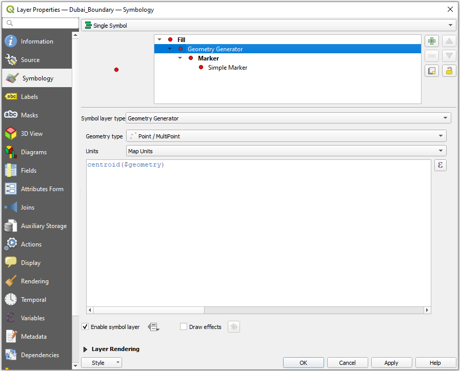

Figure 17:  على طبقة الحدود الإدارية Centroid  عملية    

3. عند النقر فوق "موافق" ، سترى أن حدود الطبقة الإدارية يتم تقديمها كطبقة نقطية. لقد قمنا للتو بإجراء عملية مكانية داخل رموز الطبقة نفسها.

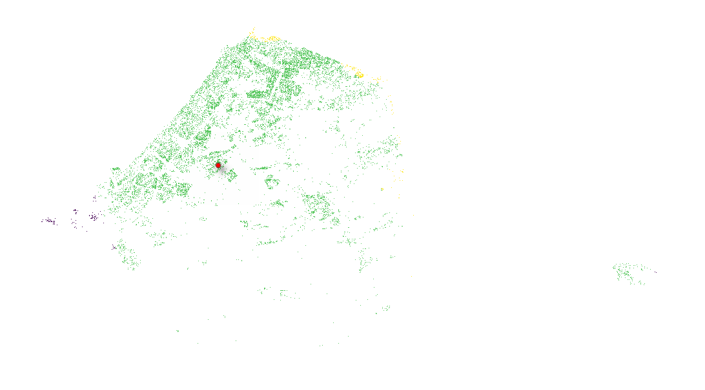

Figure 18: طبقة النقطة

4. لاحظ أن الطريقة البديلة والأسهل لكتابة الاستعلامات المكانية هي استخدام "حوار التعبيرات" (Expressions dialogue). انقر فوق الزر  expressions لفتح مربع الحوار "Expression string Builder". هنا سيكون لديك حق الوصول إلى مرجع وظيفي شامل. يمكنك البحث عن وظيفة بالاسم. على سبيل المثال، اكتب centroid في شريط البحث.
5. باستخدام رمز مولد الهندسة، يمكنك حقًا تجاوز حافة الترميز الطبيعي.
6. إذا كنت تريد الذهاب أبعد من ذلك ، فاكتب استعلامًا مكانيًا (spatial query) لحساب منطقة عازلة (buffer zone) حول طبقة النقطة أو الخط أو المضلع.

