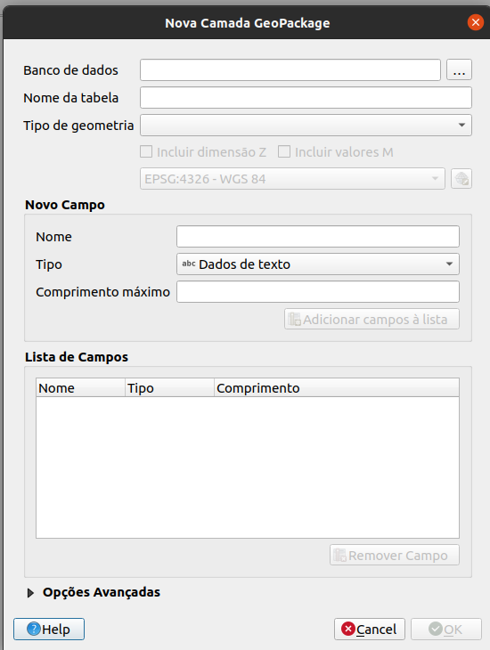
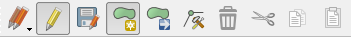
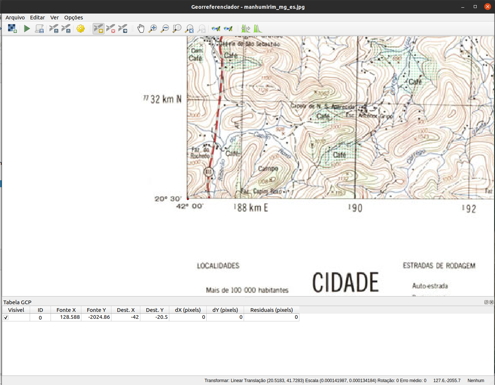

# Módulo 7 - Criando e editando camadas

**Autor**: Ketty

## Introdução pedagógica

Este módulo foi desenvolvido para te ensinar como usar as ferramentas QGIS para criar uma nova camada GIS. Nele, você aprenderá conceitos como digitalização e georreferenciamento.

## Pré-requisitos

* Um bom conhecimento de todos os módulos anteriores
* Conhecimento básico de operação de um computador

## Recursos adicionais

* Criação de camadas - [https://docs.qgis.org/3.16/en/docs/user_manual/managing_data_source/create_layers.html](https://docs.qgis.org/3.16/en/docs/user_manual/managing_data_source/create_layers.html)
* Digitalização de áreas florestais - [https://docs.qgis.org/3.16/en/docs/training_manual/forestry/stands_digitazing.html?highlight=digitizing](https://docs. qgis.org/3.16/en/docs/training_manual/forestry/stands_digitazing.html?highlight=digitizing)
* Leitura adicional - [Georreferenciando um mapa](https://docs.qgis.org/3.16/en/docs/training_manual/forestry/map_georeferencing.html?highlight=georeferencing)

## Introdução temática

Vamos começar com um exemplo:

Vamos imaginar que seu departamento esteja planejando construir novos hospitais para a cidade. Eles podem querer realizar uma pré-avaliação ambiental para o projeto de infraestrutura que foi planejado. A avaliação pode envolver a realização de pesquisas sobre quais dados estão disponíveis. Como você pode imaginar, há uma grande quantidade de dados geográficos disponíveis em formatos que não podem ser integrados imediatamente com outros dados GIS. Alguns desses dados podem estar na forma de mapas antigos, imagens de satélite de alta resolução ou imagens de sensoriamento remoto que costumam ser usadas para fazer mapas digitais como o Google Maps ou OpenStreetMap. É aqui que entra a criação e edição de camadas. Uma maneira pela qual novos dados podem ser criados em um GIS é por meio da digitalização. Outros métodos incluem georreferenciamento, escaneamento e vetorização, recorte, seleção e salvamento. É importante lembrar que os dados criados dependem dos daos originais serem únicos. Por exemplo, a imagem abaixo mostra que cada produto de imagem produzirá um conjunto de dados únicos.

Figura 7.1: Imagens de sensoriamento remoto de diferentes áreas costeiras. A. Dados interferométricos do radar de abertura sintética (IFSAR) (usando microondas para coletar dados para a criação de imagens representativas), B. dados topográficos e batimétricos LIDAR (dados de altura e elevação representados por cores), C. imagens hiperespectrais (adicionando cor à energia invisível) , e D. fotografia digital (cores visíveis do olho humano representadas como elas próprias)

## Detalhamento dos conceitos

Digitalizar em SIG é o processo de “traçar”, de forma geograficamente correta, informações de mídias/mapas. O processo de georreferenciamento conta com a coordenação de pontos na imagem digitalizada (dados a serem georreferenciados) com pontos em dados geograficamente referenciados (dados para os quais a imagem será georreferenciada). Ao “vincular” pontos na imagem com essas mesmas localizações nos dados geograficamente referenciados, você criará uma transformação que converte a localização de toda a imagem na localização geográfica correta.

 sobre uma foto aérea")

Figura 7.2: Aqui, os edifícios foram digitalizado (traçados) em cima de uma foto aérea

Georreferenciamento, por outro lado, é o processo de obtenção de uma imagem digital, que pode ser por exemplo um mapa geológico digitalizado ou uma imagem de um mapa topográfico, e de adicionar informações geográficas à imagem para que o GIS ou software de mapeamento possam 'posicionar' a imagem em seu local correto no mundo real.

## Conteúdo principal

O QGIS permite que você crie novas camadas em diferentes formatos. Ele fornece ferramentas para criar GeoPackage, Shapefile, SpatiaLite, formato GPX e camadas Temporary Scratch (também conhecidas como camadas de memória). A edição permite adicionar, excluir e modificar recursos em conjuntos de dados vetoriais. A primeira etapa é colocar o conjunto de dados no modo de edição. Selecione a camada no painel Camadas e clique em Camada | Alternar edição. Como alternativa, você pode clicar com o botão direito do mouse em uma camada no painel Camadas e escolher Alternar Edição no menu de contexto. Várias camadas podem ser editadas ao mesmo tempo. A camada que está sendo editada atualmente é aquela selecionada no painel Camadas. Uma vez no modo de edição, a barra de ferramentas de digitalização pode ser usada para adicionar, excluir e modificar recursos.

Digitalizar, como você deve ter adivinhado, é a arte (ou ciência) de criar dados vetoriais digitais a partir de outra fonte, como uma imagem raster. Para começar a digitalização, devemos primeiro entrar no modo de edição. O software GIS geralmente requer um modo separado para edição, para evitar que os usuários editem ou apaguem acidentalmente dados importantes. O modo de edição é ativado ou desativado individualmente para cada camada.

### Título da Fase 1: Criando uma nova camada GeoPackage ou Shapefile

#### **Criando uma nova camada GeoPackage**

1. Para criar uma nova camada GeoPackage, pressione o botão Nova Camada GeoPackage 
 no menu Camada Criar Nova Camada ou na barra de ferramentas do Datasource Manager. A caixa de diálogo Nova Camada GeoPackage será exibida conforme mostrado na Figura 7.3.

Figura 7.3: Diálogo de nova camada GeoPackage

2. O primeiro passo é indicar a localização do arquivo de banco de dados. Isso pode ser feito pressionando o botão  à direita do campo Banco de dados e selecionando um arquivo GeoPackage existente ou criando um novo. O QGIS adicionará automaticamente a extensão correta ao nome que você fornecer.
3. Digite um nome para a nova camada ("Nome da tabela")
4. Defina o tipo de geometria. Se não for uma camada sem geometria, você pode especificar se deve incluir dimensão Z e/ou incluir valores M.
5. Especifique o sistema de referência de coordenadas usando o botão 

6. Para adicionar campos à camada que você está criando:

    1. Insira o Nome do campo
    2. Selecione o Tipo de dados . Os tipos suportados são dados de texto, número inteiro (inteiro e inteiro 64), número decimal, data e data e hora, binário (BLOB) e booleano.
    4. Dependendo do formato de dados selecionado, insira o Comprimento máximo dos valores.
    5. Clique no botão Adicionar à lista de campos 

7. Reproduza as etapas acima para cada campo que você precisar adicionar
8. Quando estiver satisfeito com os atributos, clique em OK. O QGIS adicionará a nova camada à legenda, e você poderá começar a editá-la.

#### **Criando um novo Shapefile**

1. Para criar uma nova camada de formato ESRI Shapefile, pressione  Novo botão Shapefile Layer… no menu Camada ‣ Criar Nova Camada ‣ ou na barra de ferramentas Data Source Manager. A caixa de diálogo Nova Camada Shapefile será exibida conforme mostrado na Figura 7.4.

Figura 7.4: Diálogo da nova camada do shapefile

2. Forneça um caminho e nome de arquivo usando o botão … próximo ao campo Nome do arquivo. O QGIS adicionará automaticamente a extensão correta ao nome que você fornecer.
3. Em seguida, indique a codificação do arquivo dos dados
4. Escolha o tipo de geometria da camada: Sem geometria (resultando em um arquivo de formato .DBF), ponto, multiponto, linha ou polígono
5. Especifique se a geometria deve ter dimensões adicionais: Nenhum, Z (valores + M) ou valores M
6. Especifique o sistema de referência de coordenadas usando o botão ; você pode selecionar o WGS 84 universal que é adequado para projetos de mapeamento web em todo o mundo

7. Para adicionar campos à camada que você está criando:
    1. Insira o Nome do campo
    2. Selecione o Tipo de dados. Somente número decimal, número inteiro, dados de texto e data são suportados.
    3. Dependendo do formato de dados selecionado, insira o Comprimento e a Precisão.
    4. Clique no botão Adicionar campos à lista 

8. Reproduza as etapas acima para cada campo que você precisar adicionar
9. Quando estiver satisfeito com os atributos, clique em OK. O QGIS adicionará a nova camada à legenda e você poderá editá-la conforme descrito a seguir, 'Digitalizando uma camada existente'.

### Título da fase 2: digitalizando uma camada existente

#### **Conteúdo/Tutorial**

Este tutorial mostrará como criar um novo arquivo usando dados auxiliares, como imagens de satélite fornecidas pelo Google. É importante saber qual tipo de feições (geometrias) você gostaria de criar de antemão; por exemplo, seriam pontos, linhas ou polígonos? Quando criamos a camada, devemos definir que tipo de dados ela conterá. O objetivo deste tutorial é criar um tipo de dado que possa ser facilmente manipulado, analisado e armazenado em um sistema GIS, daí a necessidade de criar arquivos vetoriais. Criaremos recursos de polígono como exemplo.

1. Antes de adicionar novos dados vetoriais, você precisa de um conjunto de dados vetoriais (uma camada) para adicioná-los. Em nosso caso, começaremos criando uma nova camada de dados e, em seguida, adicionaremos recursos a ela. Primeiro, devemos definir nosso conjunto de dados.
2. Crie um novo projeto no QGIS clicando no ícone _Novo Projeto_ .
3. Vá para _Camada ‣ Criar camada ‣ Nova camada GeoPackage_. Crie uma camada como a da imagem a seguir:

Figura 7.5: Nova caixa de diálogo GeoPackage

Neste ponto, devemos decidir que tipo de conjunto de dados queremos criar. Lembre-se de que uma camada de dados pode conter apenas feições de pontos, apenas linhas ou apenas polígonos - nunca mais de um tipo na mesma camada. Quando criamos a camada, devemos definir que tipo de dados ela conterá.

Como os polígonos são compostos de pontos e linhas, vamos criar polígonos. Depois de dominar isso, criar um ponto ou uma camada de linha deve ser fácil!

Dentro do diálogo, especifique um nome de arquivo para o novo arquivo, codificação de arquivo, tipo de geometria, o CRS e adicione dados específicos para o Novo Campo. Adicione outros nomes de campo. Isso requer um modelo de dados predefinido que capture adequadamente todas as informações sobre o referido recurso.

4. A segunda etapa é adicionar a camada de satélite ESRI World Imagery à tela do mapa QGIS. Adicionamos isso em um módulo anterior e deve estar disponível para uso no **Painel do navegador** em **XYZ Tiles**.

Figura 7.6.1: Tela QGIS após adicionar a camada ESRI World Imagery

5. Amplie a imagem até que você possa ver características como telhados, estradas, árvores, etc. Os telhados podem atuar como um proxy 2D para edifícios, portanto vamos digitalizar a camada de construção recém-criada.

Figura 7.6.2: Camada ESRI World Imagery ampliada

6. Vamos entrar no modo de edição para a camada _edificios_
7. Selecione _edificios_ no painel Layers
8. Clique no botão _Alternar Edição_ .
9. Se você não conseguir encontrar este botão, certifique-se de que a barra de ferramentas Digitalização está habilitada. Deve haver uma marca de seleção ao lado da entrada do menu _Ver ‣ Barras de ferramentas ‣ Digitalização_
10. Assim que estiver no modo de edição, as ferramentas de digitalização ficarão ativas

Figura 7.7: Ferramentas de digitalização

Da esquerda para a direita na imagem acima, são elas:

* **Alternar Edição**: ativa/desativa o modo de edição.
* **Salvar edições de camada**: salva as alterações feitas na camada.
* **Adicionar recurso**: comece a digitalizar um novo recurso.
* **Mover recurso(s)**: mover um recurso inteiro.
* **Ferramenta Nó**: mova apenas uma parte de um recurso.
* **Excluir Selecionado**: exclui o recurso selecionado (ativo apenas se um recurso for selecionado).
* **Cortar recursos**: corta o recurso selecionado (ativo apenas se um recurso for selecionado).
* **Copiar recursos**: copia o recurso selecionado (ativo apenas se um recurso for selecionado).
* **Colar recursos**: cole um recurso recortado ou copiado de volta no mapa (ativo apenas se um recurso foi recortado ou copiado).

Queremos adicionar um novo recurso.

11. Clique no botão _Adicionar feição_  para iniciar a digitalização. Vamos digitalizar os edifícios
12. Comece clicando em um ponto em algum lugar ao longo da borda do edifício
13. Coloque mais pontos clicando mais ao longo da borda, até que a forma que você está desenhando cubra completamente o campo. Isso é muito semelhante a desenhar um polígono. O vértice inicial e o vértice final devem se tocar, caso contrário, permanece uma linha.
14. Para colocar o último ponto, **clique com o botão direito onde você deseja que ele esteja**. Isso finalizará o recurso e abrirá a caixa de diálogo Atributos.
15. Preencha os valores conforme mostrado aqui

Figura 7.8.1: Digitalizando novo recurso

Figura 7.8.2: Adicionando os atributos

16. Clique em _OK_. Você criou um novo recurso!

Figura 7.8.3: Novo recurso criado

Se você cometer um erro ao digitalizar um recurso, poderá editá-lo posteriormente. Basta terminar de digitalizar o recurso e seguir estas etapas:

* Selecione o recurso com a ferramenta _Select Feature_

* Em seguida, use uma dessas ferramentas para editar o recurso

<table>
  <tr>
   <td>

   </td>
   <td> Mover ferramentas de recurso(s)
   </td>
   <td>Move todo o(s) recurso(s)
   </td>
  </tr>
  <tr>
   <td>

   </td>
   <td> Ferramentas de nó
   </td>
   <td>Move apenas um ponto onde você pode ter clicado incorretamente
   </td>
  </tr>
  <tr>
   <td>

   </td>
   <td> Excluir selecionado
   </td>
   <td>Elimina totalmente o recurso para que você possa tentar novamente
   </td>
  </tr>
  <tr>
   <td> Vá para Editar ‣ Desfazer ou pressione Ctrl + Z no teclado
   </td>
   <td> Desfazer erros
   </td>
   <td>
   </td>
  </tr>
</table>

17. Agora tente sozinho, digitalize todos os edifícios na imagem.

### Título da Fase 3: Georreferenciando um mapa Topográfico

#### **Conteúdo/Tutorial**

Para georreferenciar o mapa;

1. Abra a ferramenta Georeferenciador, Raster ► Georeferenciador
2. Clique no botão Adicionar raster  para adicionar o arquivo de imagem do mapa, [Mapa Topográfico de Pampanga](data/manhumirim_mg_es.jpeg), como imagem a georreferenciar. O mapa topográfico será adicionado à tela do georreferenciador. Agora você pode ampliar para ler os detalhes do mapa. Uma maneira de fazer isso é lendo os metadados e as informações de legenda na parte inferior e, em seguida, relacionando-os com os recursos no mapa.

Figura 7.9: Mapa na tela do Georreferenciador

Em seguida, você deve definir as configurações de transformação para georreferenciar o mapa:

3. Abra Configurações ► Configurações de transformação ou clique em Transformação Botão de configurações.
4. Clique no ícone  próximo à caixa Raster de saída, vá para a pasta e crie a pasta 'dados pampanga' e nomeie o arquivo como pampanga_georef.tif.
5. Defina o resto dos parâmetros conforme mostrado abaixo

Figura 7.10: Parâmetros de transformação

Ao selecionar os parâmetros de transformação, os itens a serem considerados são:
* a complexidade do mapa e distorção (mapas de formato regular normalmente só precisam usar parâmetros de transformação simples)
* o número de GCPs que você pode obter no mapa - quanto mais complexo o tipo de transformação, mais GCPs são necessários para obter bons resultados.
* a distribuição de GCPs no mapa - uma distribuição pobre de GCP resulta em mais distorção, especialmente em equações de transformação de ordem superior.
* mais (ou mais complexo) nem sempre é melhor.

| Ordem de Transformação | GCPs mínimos exigidos |
|: -----------------------: |: ---------------------: |
| 1 | 3  |
| 2 | 6  |
| 3 | 10 |
| 4 | 15 |
| 5 | 21 |
| 6 | 28 |
| 7 | 36 |

Por segurança, tenha sempre pelo menos um a mais do que o mínimo para adicionar redundância.

6. Clique em OK.
7. O mapa contém várias retículas marcando as coordenadas no mapa, usaremos esses para georreferenciar esta imagem. Você pode usar as ferramentas de zoom e panorâmica como costuma fazer no QGIS para inspecionar a imagem na janela do Georreferenciador.
8. Aproxime o zoom no canto inferior esquerdo do mapa e observe que há um par de coordenadas, X e Y, que como mencionado antes estão no CRS EPSG:4225, conforme a legenda do mapa topográfico.
9. Clique no botão Adicionar ponto e clique na interseção do canto inferior esquerdo do mapa.
10. Na caixa de diálogo Insira as coordenadas do mapa, escreva as coordenadas que aparecem no mapa (Y: -20 30 00.00 e X: -42 00 00.00).

Figura 7.11.1: Insira as coordenadas do mapa

Figura 7.11.2 : Insira as coordenadas do mapa

11. Clique em OK.

A primeira coordenada para o georreferenciamento está pronta. Abaixo está uma captura de tela do que esperar neste ponto

Figura 7.12: Primeira coordenada para o georreferenciamento

12. Digitalize pelo menos mais três pontos de controle de solo (GCPs) da mesma maneira que você fez o primeiro. Dica: Certifique-se de que os pontos estejam distribuídos de forma justa pela imagem, por exemplo, nos quatro cantos da imagem ou em distâncias iguais entre si. Isso afeta o desempenho do algoritmo de transformação.

13. Com três pontos de controle de solo já digitalizados, você poderá ver o erro de georreferenciamento como uma linha vermelha saindo dos pontos. O erro em pixels pode ser visto também na tabela GCP nas colunas dX [pixels] e dY [pixels]. Os residuais não devem ser maiores do que um limite que você definiu. Se forem, você deve revisar os pontos digitalizados e as coordenadas inseridas para descobrir qual é o problema. Você pode usar a imagem acima como um guia.

14. Adicione mais pontos de controle até ficar satisfeito com os resultados esperados.
14. Você pode salvar o arquivo de GCPs **Arquivo ► Salvar pontos de GCP como…**.
15. Finalmente, georreferencie seu mapa com **Arquivo ► Iniciar georreferenciamento** ou o botão Iniciar Georreferenciamento .

Figura 7.13: GCPs adicionados

Figura 7.14: Mapa carregado no QGIS e georreferenciado

Nota: Para verificar se seus dados estão georreferenciados corretamente, você pode abrir o mapa topográfico. Seu mapa e esta imagem devem corresponder muito precisamente. Defina a transparência do mapa para 75% e compare-a com a imagem aérea.

#### **Perguntas do questionário**

1. O que é digitalização em GIS? (caixas de seleção)
2. Qual dos seguintes conjuntos de dados auxiliares suportará a digitalização? (caixas de seleção)
3. Quais fatores podem afetar a precisão dos dados durante a digitalização? (botão de opção)
4. O que pode ser feito para melhorar a precisão? (caixas de seleção)
5. Por que um modelo de dados é importante ao criar novos dados? (botão de opção)

#### Respostas do questionário

1. a. o processo de conversão de dados geográficos de uma imagem digitalizada ou imagem digital em dados vetoriais traçando as suas características

   b. descreve a conversão pura de analógico para digital de dados e documentos existentes

   c. processo pelo qual as coordenadas de um mapa, imagem ou outras fontes de dados são convertidas em um formato digital em um _GIS_

   d. refere-se à criação de uma representação digital de objetos físicos ou atributos

2. a. Pontos de dados GPS

   b. Mapas topográficos

   c. Imagem de satélite

   d. Gráficos e tabelas

3. a. Resolução dos dados (espacial, temporal, radiométrico)

   b. Iluminação

   c. Localização do recurso

   d. Tipo de recurso

4. a. obter fontes de dados precisas

   b. definir metas de qualidade de dados

   c. revise os dados e reedite ou reverta as edições

5. a. permite capturar informações abrangentes sobre o recurso

   b. automatiza o processo

   c. captura erros de digitalização
