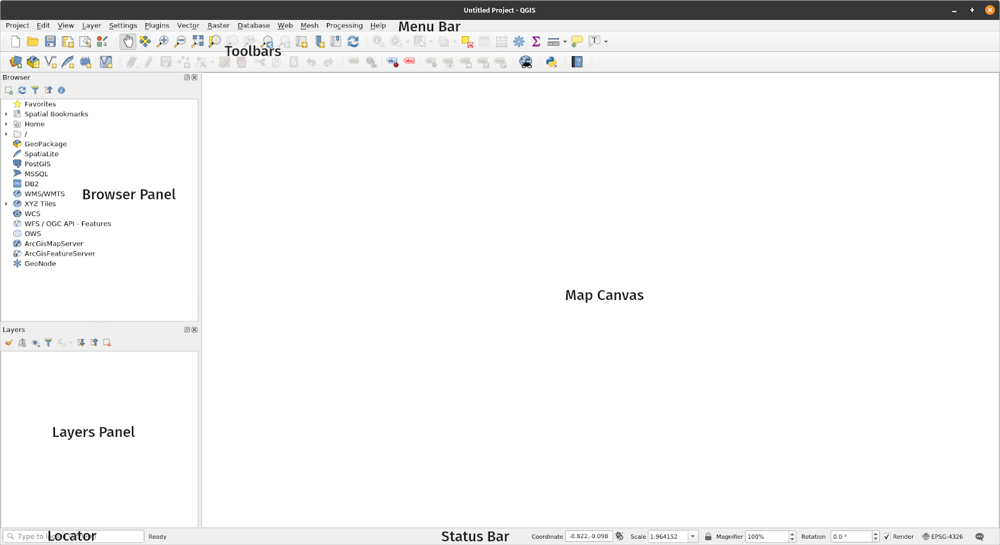
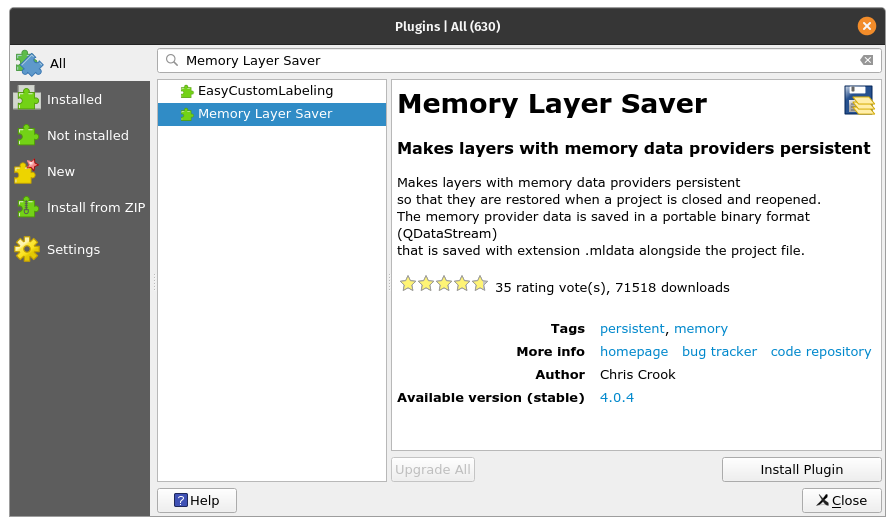

# Module 1 - Giới thiệu QGIS
 
**Tác giả**: Ben Hur

**Dịch và bản địa hoá**: Quách Đồng Thắng

## Giới thệu chung

Module này giới thiệu về QGIS. Kết thúc module, người học sẽ làm quen với:

*   QGIS là gì
*   Giao diện QGIS
*   Các thiết lập QGIS
*   Trình cắm QGSI (QGIS Plugin)

Và học cách:
*   Cài đặt và khởi chạy QGIS.
*   Các thành phần và tính năng của giao diện QGIS.
*   Chỉnh sửa bố cục giao diện và chủ đề (theme).   
*   Các thiết lập QGIS (QGIS setting), cách thay đổi và xem kết quả thay đổi trên QGIS.
*   Hồ sơ người dùng (user profile) là gì và cách sử dụng.
*   Trình cắm (plugin) là gì và cách cài đặt.

Module này cũng thảo luận một số đặc điểm của QGIS và điều gì làm cho nó độc đáo và khác biệt so với các phần mềm GIS khác, ví dụ như khuôn dạng dữ liệu QGIS (file format).

## Các công cụ và tài nguyên cần thiết

Các công cụ và tài nguyên cần thiết cho Module này gồm:

*   Máy tính
*   Kết nối Internet
*   QGIS 3.16 đã được cài đặt trên máy tính ([https://qgis.org/en/site/forusers/download.html](https://qgis.org/en/site/forusers/download.html))

## Yêu cầu về kỹ năng

*   Kiến thức cơ bản về vận hành máy tính

## Tài liệu tham khảo

* QGIS User Guide - [https://docs.qgis.org/3.16/en/docs/user_manual/](https://docs.qgis.org/3.16/en/docs/user_manual/)
* QGIS Training Manual - [https://docs.qgis.org/3.16/en/docs/training_manual/index.html](https://docs.qgis.org/3.16/en/docs/training_manual/index.html)

## Giới thiệu chuyên đề

Bản đồ dưới đây ([https://flic.kr/p/2jFfGJP](https://flic.kr/p/2jFfGJP)) cho thấy một phần thành phố Bogota ở Columbia theo phong cách của Vincent van Gogh’s “Starry Starry Night”, tác giả: Andrés Felipe Lancheros Sánchez.

Bản đồ kế tiếp ([https://flic.kr/p/2jAsphv](https://flic.kr/p/2jAsphv)) thể hiện dữ liệu theo dõi các cơn bão của NOAA từ năm 1851 đến 2020, tác giả: Fajr Alim

Tiếp thep ([https://flic.kr/p/FA9TiR](https://flic.kr/p/FA9TiR)) là bản đồ đảo Kerguelen được thực hiện bởi Heinrich Lingnau Schneider

Cuối cùng, ([https://flic.kr/p/2kqVzsg](https://flic.kr/p/v2kqVzsg)) là số lần ghi điểm trên sân và số điểm ghi được trong mỗi lần ghi điểm thuộc giải UAAP Men’s Basketball Tournament Season 81 ở Philippines, tác giả: Ben Hur Pintor

Tất cả các bản đồ này có điểm gì chung? Chúng được tạo ra bằng QGIS.

## Phân tích các khái niệm

Các bản đồ trên đều được tao ra bằng QGIS ([https://qgis.org/en/site/](https://qgis.org/en/site/)), một phần mềm GIS mã nguồn mở tự do. QGIS có thể được sử dụng với tất các các loại dữ liệu không gian (như dữ liệu môn bóng rổ trong ví dụ cuối) và không chỉ với dữ liệu không gian địa lý.

Mọi người có thể tạo các bản đồ tuyệt vời và đáng kinh ngạc như các ví dụ nêu trên vì QGIS là phần mềm tự do, mã nguồn mở và có khả năng quản lý, phân tích và trình diễn dữ liệu mạnh mẽ.

## Nội dung chính

### Phase 1: Giới thiệu QGIS và giao diện QGIS.

#### **QGIS là gì**

**QGIS**, trước kia là Quantum GIS với các phiên bản 2.X là một phần mềm GIS hoàn thiện, đa nền tảng, tự do, mã nguồn mở.

Đây là một phần mềm GIS sẵn dùng cho doanh nghiệp với các tính năng thu thập, lưu trữ, phân tích, trình diễn và quản lý dữ liệu không gian và phi không gian. Nó cũng tích hợp tốt với các công nghệ không gian địa lý hiện hữu khác và đóng vai trò như một phần không thể thiếu trong tập hợp các phần mềm của FOSS4G.

Là một phần mềm đa nền tảng, QGIS có thể chạy trên GNU/Linux, macOS, Windows và ngay cả Android.

#### **Chu kỳ phát hành và các phiên bản**

Các phiên bản phát hành và phát triển của QGIS tuân theo một lộ trình dựa trên các mốc thời gian ([https://www.qgis.org/en/site/getinvolved/development/roadmap.html](https://www.qgis.org/en/site/getinvolved/development/roadmap.html)).

Một bản phát hành của QGIS được xác định bởi 03 con số (X.Y.Z). Ví dụ QGIS 3.16.4.

*   X là phiên bản chính. Trong trường hợp này là QGIS 3.
*   Y refers to the release version. In this case release version 16. Release versions are always even numbers since odd numbers are reserved for development versions.
*   Y là phiên bản phát hành. Trong trường hợp này phiên bản phát hành là 16. Các phiên bản phát hành luôn là số chẳn vì các số lẻ dành cho các phiên bản phát triển.
*  Z là điểm phát hành của phiên bản (Point Release -PR). Đối với phiên bản 3.16.4 có nghĩa là đây là điểm phát hành thứ tư của phiên bản 3.16.

Có 03 nhánh chính của QGIS mà người dùng có thể cài đặt: Dài hạn - **Long Term Release (LTR)**, Mới nhất - **Latest Release (LR)** và Phát triển - **Development (Nightly)**

*   **Phiên bản dài hạn (Long Term Release - LTR)** được bảo trì và sửa lỗi cho đến khi một phiên bản LTR tiếp theo được phát hành. Hiện tại thời gian xuất bản LRT là 01 năm. Vào tháng 02/2021, phiên bản LTR là 3.16.4 nên nó sẽ được thay thế bằng phiên bản 3.22.4 vào tháng 02/2022.
*   **Phiên bản mới nhất (Latest Release - LR)** là phiên bản chứa các tính năng mới nhất của QGIS. Phiên bản LR được phát hành mỗi 04 tháng. Ví dụ, phiên bản 3.18 LR mới được phát hành vào tháng 02/2021. Phiên bản LR kết tiếp (3.20) sẽ được phát hành sau 04 tháng nữa, tức là tháng 06/2021. Hiện tại, cứ sau mỗi 03 phiên bản LR sẽ đến phiên bản LRT kế tiếp. Ví dụ, phiên bản LTR tháng 02/2021 là 3.16. Phiên bản LR thứ 3 từ 3.16 là 3.22, do đó phiên bản LTR kế tiếp sẽ dựa trên phiên bản 3.22.
*  **Phiên bản phát triển (Development/Nightly)** dựa trên phiên bản mã nguồn mới nhất của QGIS nhưng hữu ích cho mục đích kiểm tra, sửa lỗi hoặc giúp phát triển QGIS. 

Vậy bạn nên dùng phiên bản nào? Câu trả lời là tùy vào nhu cầu. Nếu bạn muốn một phiên bản được bảo trì trong một thời gian dài hơn và bạn không cần các tính năng mới nhất thì nên sử dụng phiên bản LTR. Nếu bạn muốn có những tính năng mới nhất và không ngại nâng cấp vài tháng một lần, thì sử dụng phiên bản LR. Đôi khi bạn tò mò hoặc hào hứng với các tính năng sắp có thì nên xem qua phiên bản phát triển (Development/ Nightly)

Để biết thêm thông tin, hãy truy cập: [https://bnhr.xyz/2020/10/26/about-qgis-versions-release-cycle-english.html](https://bnhr.xyz/2020/10/26/about-qgis-versions-release-cycle-english.html)

#### **Các ví dụ về bản đồ được tạo bằng QGIS trong thực tế**

Hình 1.1. QGIS Map Showcase

Để xem thêm các bản đồ được tạo bằng QGIS, hãy truy cập: [https://www.flickr.com/groups/2244553@N22/pool/with/50355460063/](https://www.flickr.com/groups/2244553@N22/pool/with/50355460063/)

#### **Cài đặt QGIS**

QGIS là phần mềm đa nền tảng, có thể chạy trên Linux, Windows và macOS. Nhờ mã nguồn mở, bạn có thể build và cài đặt QGIS từ mã nguồn trên [https://github.com/qgis/QGIS/](https://github.com/qgis/QGIS/).

Bộ cài đặt và hướng dẫn cài đặt cũng có trên [https://qgis.org/en/site/forusers/download.html](https://qgis.org/en/site/forusers/download.html) hoặc [https://qgis.org/en/site/forusers/alldownloads.html](https://qgis.org/en/site/forusers/alldownloads.html).

Đối với **Linux (hoặc GNU/Linux)**, QGIS thường có sẵn trong trình quản lý gói (package manager). Đối với Debian/Ubuntu, QGIS có các kho lưu trữ (repositories) cho các nhánh phân phối LR, LTR, Development/Nightly cũng như các phiên bản của QGIS trong ubuntugis-unstable PPA (Personal Package Archives). QGIS cũng có thể được cài đặt thông qua Flatpak package hoặc Conda.

Đối với **Windows**, người dùng có thể cài đặt bằng OSGeo4W Network Installer hoặc Standalone installers cho phiên bản LTR và LR. 

Standalone installers là cách dễ nhất để cài đặt và được khuyến cáo sử dụng cho người mới bắt đầu. Có thể cài đặt cung luc nhiều phiên bản của QGIS trên cùng một máy tính, có nghĩa là bạn có thể cùng lúc cài đặt và sử dụng 02 phiên bản QGIS 3.16 và QGIS 3.18.

Bộ cài đặt OSGeo4W Network Installer hơi nâng cao và phức tạp so với standalone installers, nhưng nó cũng cho phép người dùng cập nhật và nâng cấp phiên bản QGIS tại chỗ, nghĩa là bạn không cần gỡ phiên bản cài đặt cũ để cài đặt phiên bản mới hơn.

Trong một số trường hợp, bạn cần quyền quản trị viên (administrator) để cài đặt QGIS, nên nếu bạn đang cài đặt QGIS trên máy tính với vai trò không phải là quản trị viên, bạn cần yêu cầu quản trị viên CNTT hoặc văn phòng cài đặt giúp bạn.

The installation in Windows also comes with QGIS with GRASS (another Free and Open Source GIS).
Phiên bản cài đặt trên Windows có thêm QGIS with GRASS (một phần mềm mã nguồn mở tự do khác)

Cần lưu ý là QGIS đang [dần bỏ hỗ trợ phiên bản 32-bit cho Window](https://blog.qgis.org/2020/10/15/phasing-out-32-bit-support-in-qgis/), nên tốt nhất là cài đặt QGIS trên máy tính chạy hệ điều hành 64-bit. 

Đối với macOS, có trình cài đặt All-in-one signed installers cho macOS High Sierra (10.13) và các phiên bản mới hơn. QGIS chưa được chứng thực theo yêu cầu của các quy tắc bảo mật macOS Catalina (10.15). Do đó, ở lần khởi chạy đầu tiên, click chuột phải trên biểu tượng QGIS, kết hợp nhấn phím Option, sau đó chọn Open.

#### **Các thành phần giao diện của QGIS**

Sau khi cài đặt QGIS, bạn có thể chạy hoặc mở nó như bất cứ một chương trình nào khác trên máy tính. Khi mở QGIS, bạn sẽ được chào mừng bằng giao diện người dùng (User Interface - UI) mặc định giống như sau:

Hình 1.2. Giao diện QGIS khi mới cài đặt

There are six main parts of the QGIS User Interface -- the Menu Bar, Map Canvas, Toolbars, Panels, Status Bar, and the Locator.
Có 6 thành phần chính của giao diện QGIS – Menu Bar (thanh menu), Map Canvas (vùng bản đồ), Toolbars (thanh công cụ), Panels (bảng điều khiển), Status Bar (thanh trạng thái), and và Locator bar (Thanh định vị).

Trung tâm của giao diện là Map Canvas. Panels và Toolbars có thể được đặt xung quanh Map Canvas. Các panel có thể được gắn với nhau để tạo thành một panel nhiều tab. Ngoài ra còn có các thành phần khác của UI như giao diện Python, plugin window,…

**Menu Bar** – là một menu phân cấp đơn giản, cung cấp quyền truy cập đến các các hàm và lệnh của GIS. Nó thường nằm ở trên cùng của UI.

**Map Canvas** – là nơi hiển thị các lớp dữ liệu được tải trong QGIS. Đây cũng là nơi hiển thị kết quả của các phép filter (lọc), select (chọn), biên tập hiển thị(symbology) của người dùng. Có thể có nhiều map canvas hiển thị cùng lúc. Người dùng có thể phóng to, thu nhỏ, di chuyển hoặc thậm chí xoay map canvas. Map canvas cũng có thể hiển thị dữ liệu 3D.  

**Toolbars** – chứa các nút bấm và chạy (click-and-run buttons). Chúng cho phép truy cập dễ dàng đến các lệnh, tính năng, plugin,…trong QGIS. Người dùng có thể di chuyển và gắn các toolbar tại bất kỳ vị trí nào xung quanh Map Canvas. Danh sách các toolbars có thể được tìm thấy, kích hoạt và hủy kích hoạt từ Menu bar bằng cách vào **View ‣ Toolbars**, ví dụ như Attributes Toolbar, Digitizing Toolbar.

**Panels** –  panel tương tự với toolbar nhưng thay vì là các nút bấm, nó cung cấp giao diện cửa sổ cho các chức năng và tính năng phức tạp hơn. Ví dụ như Layer Panel và Browser Panel. Tương tự như toolbar, các panel có thể được di chuyển và gắn xung quanh Map Canvas. Danh sách các panel có thể được tìm thấy, kích hoạt và hủy kích hoạt từ thanh menu bằng cách vào **View ‣ Panels**.

**Status Bar** – thường nằm dưới cùng của UI, hiển thị các thông tin liên quan như hệ quy chiếu tọa độ - CRS, tỉ lệ bản đồ, thông báo,… 

**Locator Bar** – nằm ở góc dưới bên trái của giao diện QGIS, cho phép người dùng truy cập dễ dàng đến các lớp dữ liệu, thuộc tính, thuật toán xử lý và các thành phần khác trong QGIS. Đây là một trong những tính năng mạnh mẽ nhất của QGIS.

Hình 1.3. Các thành phần giao diện của QGIS

Một trong những điểm hay của QGIS là khả năng tùy biến, bắt đầu với giao diện người dùng. Chỉ cần chỉnh sửa một vài thiết lập và di chuyển một vài thành phần của giao diện, bạn có thể có giao diện QGIS như hình bên dưới:

Hình 1.4. Giao diện QGIS với một số tùy biến

#### **Hướng dẫn/ Bài tập 1: Thay đổi hiển thị và bố cục của giao diện QGIS

1. Mở **QGIS**
2. Kích chọn menu **View**

3. Mở menu **Panels**

4. Mở menu **Toolbars**

5. Chọn các **Toolbars** và **Panels** mà bạn muốn hiển thị trong giao diện người dùng. Một số Panel hữu ích như  **Layer Styling** và **Processing Toolbox**. 
    
6. Di chuyển các **Toolbars** and **Panels** đến các vị trí yêu thích của bạn 

**Thiết lập lại giao diện QGIS**

To reset your display to the default settings, go to**: Settings ‣ Options ‣ System Tab ‣ Settings ‣ Reset** button and restart QGIS
Đế thiết lập lại hiển thị trở lại chế độ mặc định, truy cập **Settings ‣ Options ‣ System Tab ‣ Settings ‣ Reset** 

#### **Câu hỏi

1. True or False:
    1. Bạn có thể có nhiều map canvas -- ***True***
    2. Bạn có thể hiển thị hoặc ẩn các panel và toolbar -- ***True***
    3. Bạn chỉ có thể đặt các panel ở bên trái hoặc phải của Map Canvas -- ***False (bạn cũng có thể đặt các panel phía trên hoặc dưới Map Canvas)***

### Phase 2 : QGIS Plugins

Khả năng thêm, tạo và mở rộng các chức năng QGIS thông qua các plugin là một trong những tính năng mạnh mẽ nhất của QGIS.

Từ QGIS 3.16.3, có trên 1000 plugin có sẵn cho người dùng download và cải tiến. Các plugin này có chức năng từ phức tạp tới đơn giản.

QGIS plugin có thể được phân loại thành:

*   **Core plugins** - các plugin tích hợp sẵn trong QGIS, không thể gỡ cài đặt. 
*   **External plugins** - được cài đặt thủ công bằng cách tìm trong kho lưu trữ bên ngoài (các QGIS Official Plugin Repository) hoặc cài đặt trực tiếp từ mã nguồn.

Plugin có thể được cài đặt bằng ba cách sau:

1. Sử dụng Manage and Install Plugins (**Plugins ‣ Manage and Install Plugins**)
2. Cài đặt từ file ZIP thông qua chức năng **Install from ZIP** trong giao diện Manage and Install Plugins.
3. Thêm mã nguồn thủ công trong thư mục plugin của QGIS profile. Thư mục này thường nằm ở:
    1. **Linux**: .local/share/QGIS/QGIS3/profiles/default/python/plugins
    2. **Mac OS X**: Library/Application/Support/QGIS/QGIS3/profiles/default/python/plugins
    3. **Windows: **C:\\Users<User>\AppData\Roaming\QGIS\QGIS3\profiles\default\python\plugins

Hình 1.5. Chức năng Manage and Install Plugins

**Giao diện Manage and Install Plugins**

Giao diện Manage and Install Plugins kết nối đến QGIS Official Plugin repository (hoặc bất cứ repository nào được thiết lập trong tab Settings) để tìm nạp các plugin có sẵn cho phiên bản QGIS của bạn. Nó có 05 tab:  

*   **All Tab** – Hiển thị tất cả các plugin có sẵn cho phiên bản QGIS của bạn, bao gồm các plugin đã được cài đặt.
*   **Installed Tab** – Chỉ hiển thị các plugin đã được cài đặt.
*   **Not installed Tab** – Hiển thị các plugin chưa được cài đặt.
*   **Install from ZIP**– Cài đặt plugin bằng ZIP file
*   **Settings Tab** – Thiết lập các tuỳ chọn thời điểm kiểm tra các bản cập nhật plugin, có bao gồm các plugin thử nghiệm hoặc không dùng nữa hay không, hoặc thêm/ thay đổi repository chứa các plugin

Nếu plugin bạn đang tìm kiếm được gắn thẻ là experimental hoặc deprecated, bạn cần chọn **Show experimental plugins** và **Show deprecated** plugins trong tab Settings.

The **Search Bar** allows you to search for plugins found in the plugin repository/ies that you are connected to.
**Search Bar** cho phép bạn tìm kiếm các plugin trong các repository được kết nối.

Hình 1.6. Giao diện Manage and Install Plugins

#### **Hướng dẫn/ bài tập 2: Cài đặt QGIS Plugin**

1. Truy cập **Manage and Install Plugins dialog** từ **Plugins ‣ Manage and Install Plugins** trên Menu bar để mở giao diện Manage and Install Plugins

2. Cài đặt các plugin sau đây bằng cách tìm kiếm trong **All Tab**, kích chọn **Install Plugin** trong góc dưới bên phải của giao diện Manage and Install plugins.
   - Memory Layer Saver

   - QuickOSM

3. Kiểm tra xem các plugin đã cài đặt thành công hay chưa. Memory Layer Saver plugin sẽ nằm ở **Plugins ‣ Memory Layer Saver** trên Menu bar, trong khi QuickOSM plugin nằm ở **Vector ‣ QuickOSM** trên Menu bar.

#### **Câu hỏi**

1. True or False
    1. Bạn có thể bỏ hoặc gỡ cài đặt các core plugin -- ***False***
    2. Bạn có thể thêm các plugin không có trong Official QGIS Plugin Repository -- ***True***

### Phase 3: QGIS Settings

**System and Project Settings**

QGIS Settings cho phép bạn chỉnh sửA và quản lý nhiều thứ trong QGIS như user profiles, styles, coordinate reference systems, keyboard shortcuts, user interface, default colors,... System settings có thể được tìm thấy trong menu **Settings** và là các thiết lập mặc định của QGIS trừ khi bị ghi đè bởi Project settings. 
Project Settings có thể được tìm thấy trong **Project ‣ Properties** và liên quan đến settings hoặc properties cho project hiện hành. Các thiết lập này sẽ ghi đè các thiết lập mặc định của hệ thống.

Hình 1.7. System Settings

Hình 1.8. Project Settings

**Thay đổi QGIS Theme**

Bạn có thể thay đổi giao diện (look-and-feel) của QGIS tại **Settings ‣ Options ‣ General** Tab.

Bạn có thể chọn giữa 03 chủ đề (theme) -- default, Blend of Gray và Night Mapping. Bạn cũng có thể thay đổi kích thước của các icon, font chữ và các thiết lập hệ thống mặc định của QGIS.

Hình 1.9. General Settings trong QGIS

Đối với một số thiết lập trong QGIS, bạn có thể cần khởi động lại ứng dụng để chúng có hiệu lực.

**User Profiles**

QGIS 3.X giới thiệu khái niệm QGIS User Profiles.

Một User Profile là một tập hợp các thiết lập về các plugin được cài đặt, các toolbar được kích hoạt, sắp xếp giao diện người dùng và các thiết lập khác. QGIS có sẵn một User Profile mặc định, có tân là default. User profile cho phép người dùng tạo các thiết lập khác nhau cho các phân tích cụ thể (ví dụ như user profile cho quản lý tài nguyên nước, số hoá dữ liệu, biên tập bản đồ,...), các dự án hoặc khách hàng cụ thể.

User Profiles có thể được tạo và truy cập từ menu bar: **Settings ‣ User Profiles**.

User profile đang hoạt động được hiển thị với tên [User Profile] trên title bar.

Hình 1.10. Truy cập User Profiles

User profiles được lưu trữ trong một thư mục trên máy tính và có thể truy cập qua **Settings ‣ User Profiles ‣ Open Active Profile Folder**.

#### **Hướng dẫn/ Bài tập 03: Tạo User Profile** 

1. Truy cập **Settings ‣ User Profiles ‣ New Profile...**

2. Đặt tên cho user profile.

3. Một cửa sổ QGIS mới được mở với user profile mới vừa tạo. Cần chú ý là nên user profile được hiển thị trên title bar.

4. Bạn có thấy bất kì sự khác biệt nào trong user profile mới không? Kiểm tra giao diện, plugins và settings của profile cũ so với profile mới vừa tạo.

#### **Câu hỏi**

1. True or False
    1. Bạn chỉ có thể có một user profile trong QGIS. -- ***False (you can have multiple user profiles)***
    2. Bạn không thể ghi đè system settings và properties -- ***False***

### Phase 4 (bổ sung): Các định dạng file QGIS

#### **QGIS Project File (QGS/QGZ)**

Các QGIS Projects cũng giống như các file .mxd của ArcMap. Các file này có dạng  **QGS (*.qgs)** hoặc  ** QGZ (*.qgz)**. Khác biệt chính giữa 02 dạng này ở chỗ định dạng QGZ là một file nén (zip) chứa một QGS file và một QGD file. QGS là một định dạng XML để luu trữ các QGIS project. QGD file là một sqlite database đi cùng với QGIS project, chứa các dữ liệu bổ trợ cho project. Nếu không có dư4 liệu bổ trợ, QGD file sẽ rỗng.

Một QGIS Project file chứa tất cả những thứ cần thiết để lưu trữ một QGIS project, bao gồm:

*   project title
*   project CRS
*   the layer tree
*   snapping settings
*   relations
*   the map canvas extent
*   project models
*   legend
*   mapview docks (2D and 3D)
*   the layers with links to the underlying datasets (data sources) and other layer properties including extent, SRS, joins, styles, renderer, blend mode, opacity and more.
*   project properties

QGIS project fils có thể được lưu trong một GeoPackage hoặc một Postgis database. Lưu  project file cùng với style file và các layer liên quan trong một GeoPackage duy nhất sẽ giúp chia sẻ các QGIS project được dễ dàng.

#### **QGIS Layer Definition (QLR)**

QGIS Layer Definition file (**QLR**) là một XML file chứa con trỏ đến các layer cùng với các thông tin style của layer. Hiện tại, một QLR file chỉ tương ứng với một layer.

Trường hợp sử dụng cho file này rất đơn giản: Có một file duy nhất để mở một nguồn dữ liệu cùng với tất cả các thông tin style tương ứng. QLR file cũng cho phép che nguồn dữ liệu bên dưới thông qua một file dễ mở.

Một ví dụ cho sử dụng QLR là để mở một layer từ PostGIS databse. Thay vì phải kết nối đến database, tìm kiếm layer, áp dụnp một bộ lọc, bạn chỉ cần mở một .qlr file trỏ đến đúng PostGIS layer với style và bộ lọc tương ứng.

#### **QGIS Style File (QML)**

**QML** là một định dạng XML để lưu trữ layer styling. Một QML file (.qml) chứa tất cả các thông tin cho QGIS biết cách hiển thị các đối tượng hình học với các thiết lập symbol, size, rotation, labeling, opacity, blend mode, và nhiều thiết lập styling khác. 

Một .qml file phải có cùng tên với layer tương ứng. Khi chúng được tìm thấy trong cùng thư mục với layer, khi tải layer sẽ tự động tải style đã được định nghĩa trong .qml file.

Ví dụ, nếu bạn có một GeoJSON tên là regions.geojson và một QML file có tên regions. qml. khi tải regions.geojson trong QGIS, nó sẽ áp dụng style được định nghĩa trong regions.qml.

Khi sử dụng GeoPackages (.gpkg), một .qml file đôi khi không cần thiết vì bạn có thể lưu style của layer trực tiếp trong GeoPackage.

### Nếu bạn muốn tìm hiểu kĩ hơn:  

Bạn có thể tạo một QGIS plugin của riêng mình. Nếu không có plugin nào đáp ứng nhu cầu của bạn thì bạn luôn có thể tạo một plugin cho riêng mình.

**Plugin Builder** là một plugin tạo một template có thể đóng vai trò là điểm khởi đầu cho phát triển QGIS plugin, nên bạn không cần phải tạo plugin từ đầu. Bạn có thể cài đặt Plugin Builder trong giao diện Manage and Install Plugins. 

Tất nhiên, bạn luôn có thể tạo một plugin từ đầu. Nếu bạn quan tâm đến việc tạo plugin cho riêng mình, bạn có thể tham khảo Official QGIS documentation ([https://documentation.qgis.org/](https://documentation.qgis.org/)). Đối với Python plugins, bạn nên tham khảo PyQGIS Developer Cookbook ([https://docs.qgis.org/3.16/en/docs/pyqgis_developer_cookbook/](https://docs.qgis.org/3.16/en/docs/pyqgis_developer_cookbook/)).

Để biết thêm thông tin, vui lòng truy cập: [https://bnhr.xyz/2018/10/08/qgis-plugins-3.0.html](https://bnhr.xyz/2018/10/08/qgis-plugins-3.0.html)

### Để thực hành các kỹ năng mới, hãy thử:

*   Thay đổi theme của giao diện QGIS cho phù hợp với sở thích của bạn.
*   Cài đặt các QGIS plugin khác.  
*   Thay đổi các QGIS settings khác.
    *   Tạp một custom coordinate reference system    
    *   Thêm một custom splash screen ([https://bnhr.xyz/2020/09/05/custom-splash-screen-qgis.html](https://bnhr.xyz/2020/09/05/custom-splash-screen-qgis.html))

### Mẹo 

N/A
