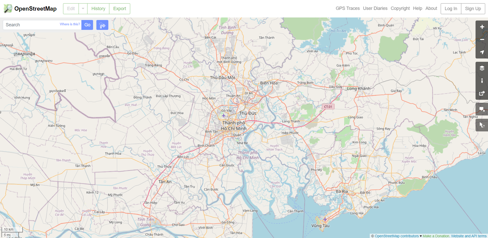
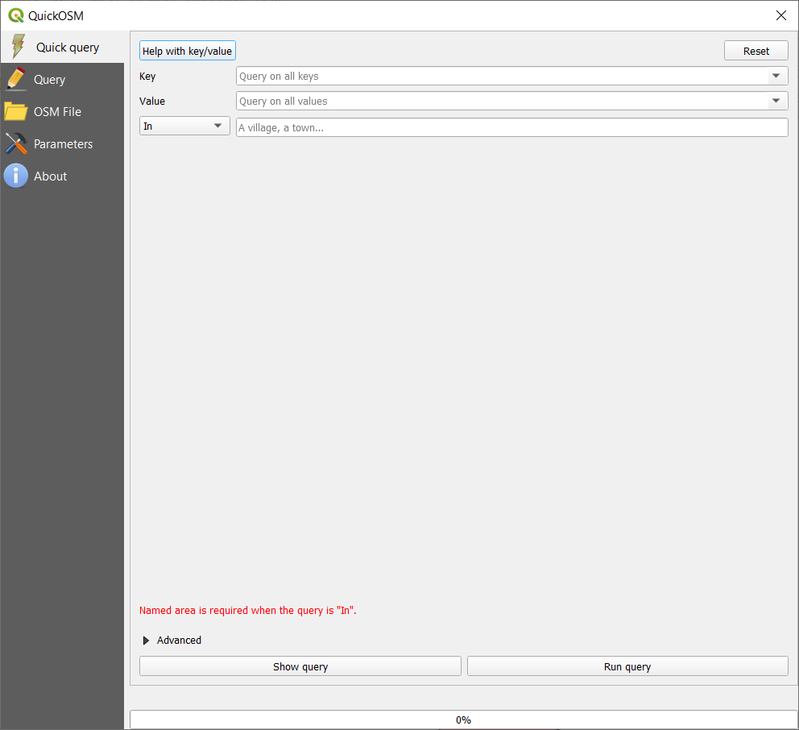
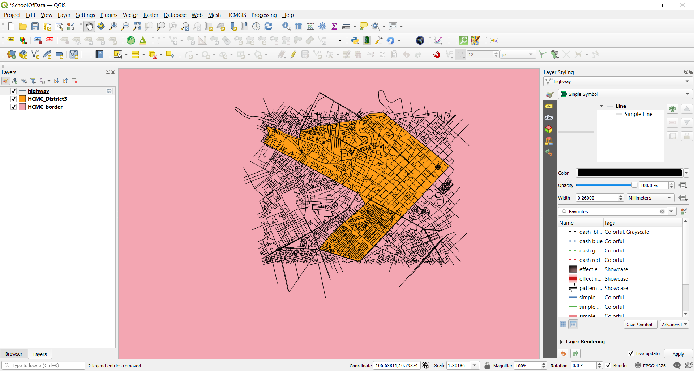
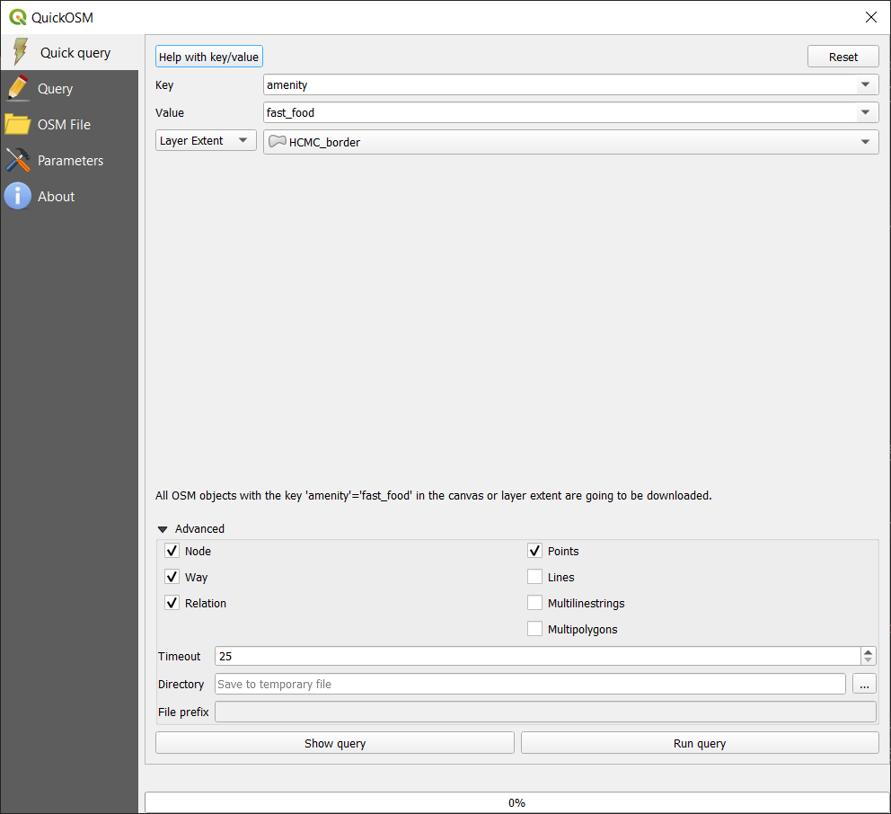
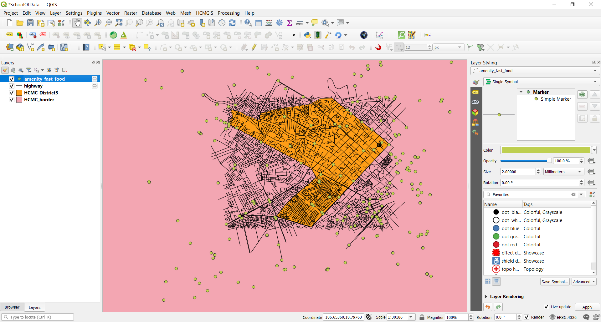
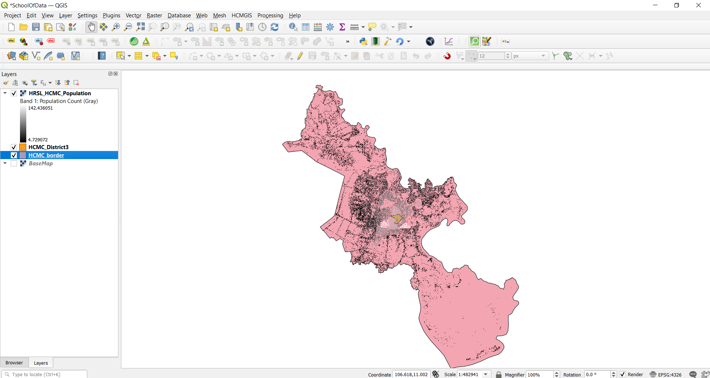
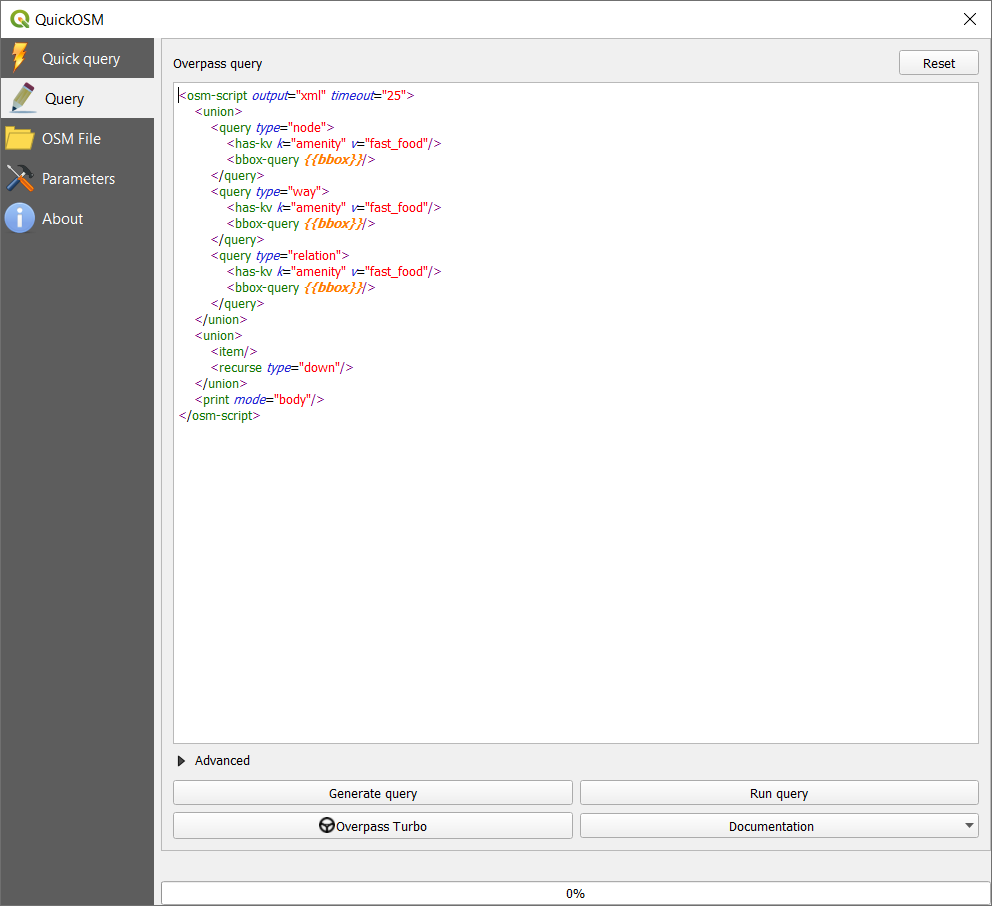
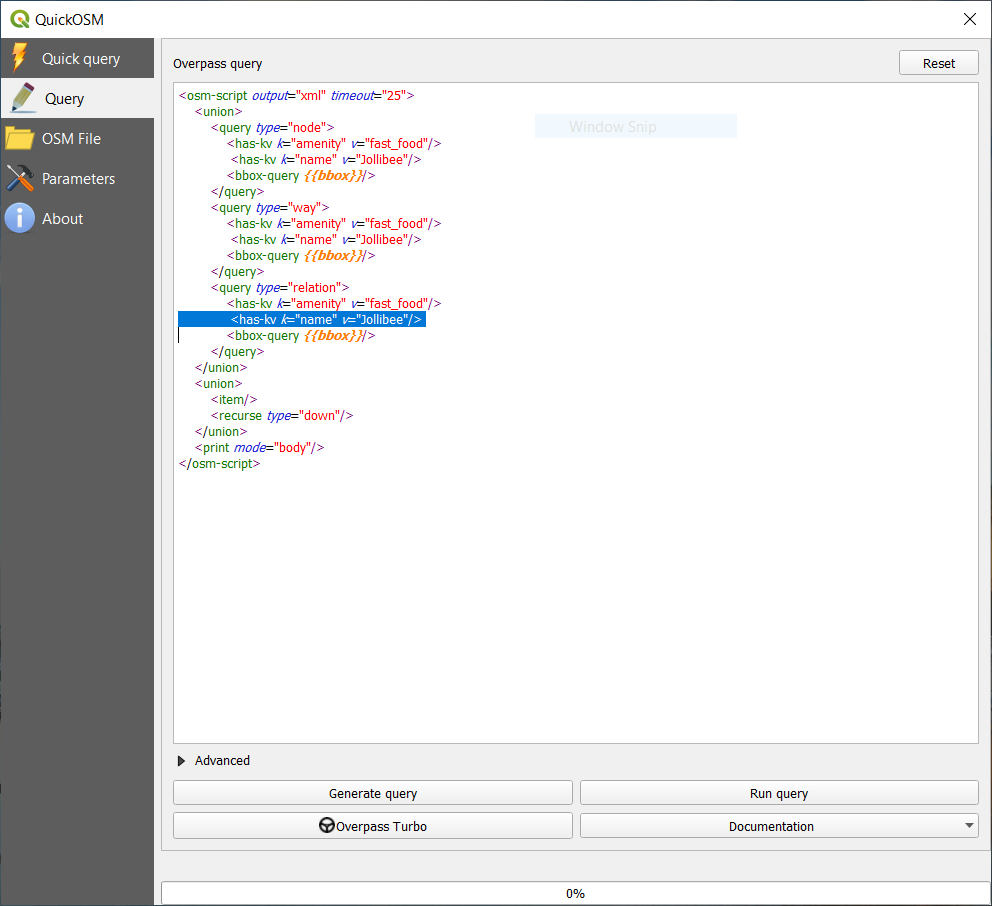
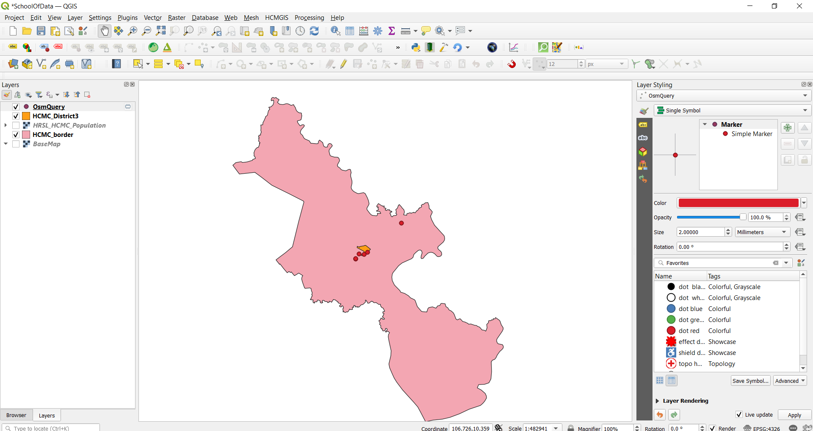

# Module 3 - OpenStreetMap và High Resolution Settlement Layer

**Tác giả**: Ben Hur

**Biên dịch và bản địa hoá**: Quách Đồng Thắng

## Giới thiệu chung

Module này sẽ giới thiệu OpenStreetMap (OSM) và High Resolution Settlement Layer (HRSL). Sau module này, người học sẽ làm quen với:

*   Các nguyên tắc của OpenStreetMap
*	Dữ liệu OpenStreetMap và các trường hợp sử dụng.
*	Dữ liệu High Resolution Settlement Layer và các trường hợp sử dụng.

Đồng thời, người học có thể:

*	Tải dữ liệu OSM định dạng vector và định dạng tile trong QGIS
*	Tải dữ liệu raster HRSL trong QGIS

## Các công cụ và tài nguyên cần thiết

Các công cụ và tài nguyên cần thiết cho modulue này gồm:

*   Máy tính
*   Kết nối Internet
*   QGIS 3.16 đã được cài đặt trên máy tính  ([https://qgis.org/en/site/forusers/download.html](https://qgis.org/en/site/forusers/download.html))
*   Pampanga_province and Pampanga_SanFernando vector layer (trong [module3.gpkg](module3.gpkg)).

## Yêu cầu về kỹ năng

*   Kiến thức cơ bản về vận hành máy tính
*   Quen thuộc với các định dạng dữ liệu không gian, giao diện QGIS, cách tải các lớp dữ liệu vào QGIS (hoàn thành Module 0,1 và 2)

## Tài liệu tham khảo

* OpenStreetMap - [https://www.openstreetmap.org/](https://www.openstreetmap.org/)
* OpenStreetMap Wiki - [https://wiki.openstreetmap.org/](https://wiki.openstreetmap.org/)
* Overpass API User Manual - [https://dev.overpass-api.de/overpass-doc/en/](https://dev.overpass-api.de/overpass-doc/en/)
* Facebook - High Resolution Settlement Layer - [https://research.fb.com/downloads/high-resolution-settlement-layer-hrsl/](https://research.fb.com/downloads/high-resolution-settlement-layer-hrsl/)
* CEISIN - High Resolution Settlement Layer - [https://ciesin.columbia.edu/data/hrsl/](https://ciesin.columbia.edu/data/hrsl/)
* HDX HRSL - [https://data.humdata.org/search?organization=facebook&q=%22High%20Resolution%20Population%20Density%20Maps%20%2B%20Demographic%20Estimates%22](https://data.humdata.org/search?organization=facebook&q=%22High%20Resolution%20Population%20Density%20Maps%20%2B%20Demographic%20Estimates%22)

## Giới thiệu chuyên đề

Bản đồ đã trở nên phổ biến trong cuộc sống hàng ngày của chúng ta. Chúng ta có thể chỉ cần cầm điện thoại và mở các ứng dụng sử dụng các bản đồ và dữ liệu về vị trí. Có các ứng dụng được sử dụng để định hướng và định vị chính mình, để điều hướng từ nơi này đến nơi khác, bản đồ được hiển thị khi chúng ta đặt thức ăn từ dịch vụ giao hàng yêu thích,… Bản đồ đã trở nên không thể thiếu cho các hoạt động hàng ngày của chúng ta đến mức chúng ta có xu hướng quên rằng có những nơi trên thế giớ vẫn chưa được lập bản đồ hoặc không được tìm thấy trong các bản đồ số mà chúng ta sử dụng.

## Phân tích các khái niệm

Sự phổ biến của bản đồ trong cuộc sống của chúng ta là sản phẩm phụ của lượng lớn dữ liệu về vị trí và dữ liệu không gian mà chúng ta đang thu thập. Các cơ hội và tiềm năng để tạo ra những điều tốt đẹp từ dữ liệu không gian sẵn có là rất nổi bật, nhưng nó chỉ có thể hiện thực được nếu các dữ liệu không gian địa lý này miễn phí và mở.

## Nội dung chính

### Phase 1: Dữ liệu OpenStreetMap (OSM)

#### **OpenStreetMap (OSM) là gì?**

OpenStreetMap (OSM) ([https://www.openstreetmap.org/](https://www.openstreetmap.org/)) là một bản đồ miễn phí, có thể chỉnh sửa trên phạm vi toàn cầu, được xây dựng bởi các tình nguyện viên trên toàn thế giới và được phát hành với giấy phép nội dung mở (open-content license). Đây là một dự án nhằm tạo và phân phối dữ liệu không gian địa lý mở cho thế giới – một bản đồ thế giới của mọi người và vì mọi người. Nếu thấy thiếu gì đó trên OSM, bạn có thể tự do thêm vào. Nếu có điều gì sai trên OSM, bạn có thể tự do chỉnh sửa. OSM là một tài sản số của cộng đồng giúp khuếch đại đáng kể giá trị của thông tin được thêm vào.

Hình 3.1. OpenStreetMap

Tìm hiểu thêm thông tin tại sao OpenStreetMap tồn tại và tầm quan trọng của nó tại đây [https://wiki.openstreetmap.org/wiki/FAQ#Why_OpenStreetMap.3F](https://wiki.openstreetmap.org/wiki/FAQ#Why_OpenStreetMap.3F)

Bạn cũng có thể tham khảo: [https://wiki.openstreetmap.org/wiki/About_OpenStreetMap](https://wiki.openstreetmap.org/wiki/About_OpenStreetMap)

Theo OpenStreetMap, nó là “dữ liệu mở, với giấy phép Open Data Commons Open Database License (ODbL) ([https://opendatacommons.org/licenses/odbl/](https://opendatacommons.org/licenses/odbl/)) bởi tổ chức OpenStreetMap Foundation (OSMF) ([https://osmfoundation.org/](https://osmfoundation.org/))” và “bạn có quyền tự do sao chép, phân phối, truyền tải và điều chỉnh dữ liệu, miễn là ghi nhận dẫn nguồn từ OpenStreetMap và các nhà đóng góp cho OpenStreetMap. Nếu bạn thay đổi hoặc xây dựng dựa trên dữ liệu của chúng tôi, bạn chỉ có thể phân phối kết quả với cùng giấy phép”. Nghĩa là, khi tạo một bản đồ sử dụng dữ liệu OSM, bạn phải dẫn nguồn “© OpenStreetMap contributors”. Bạn có thể tìm hiểu thêm về bản quyền và giấy phép OpenStreetMap tại đây [https://www.openstreetmap.org/copyright](https://www.openstreetmap.org/copyright)

#### **OpenStreetMap được sử dụng ở đâu?**

Một trong những giá trị cốt lõi của OSM là khả năng thu thập, chỉnh sửa và chia sẻ dữ liệu bản đồ có thể được sử dụng cho nhiều mục đích khác nhau. Đó là quyền tự do được cung cấp bởi ObDL. Vì OSM cho phép người dùng sử dụng dữ liệu với rất ít hạn chế, nên có rất nhiều ứng dụng, dịch vụ và trường hợp sử dụng được xây dựng, đang xây dựng hoặc có thể được xây dựng với OSM. OSM được dùng cho tạo bản đồ, dịch vụ định tuyến, giáo dục và ngay cả mục đích nhân đạo và vận động (chính sách/ phong trào).

Thực tế, có nhóm Humanitarian OpenStreetMap Team (HOT) ([https://www.hotosm.org/](https://www.hotosm.org/)), là một nhóm quốc tế dành riêng cho hoạt động nhân đạo và phát triển cộng đồng thông qua việc xây dựng bản đồ mở. 

OpenStreetMap is also a crucial part of some advocacy mapping communities such as MapBeks ([https://wiki.openstreetmap.org/wiki/MapBeks](https://wiki.openstreetmap.org/wiki/MapBeks)) -- an online LGBT mapping community, based in the Philippines, that advocates for diversity inclusion and representation focused specifically for Lesbians, Gays, Bisexuals, Transgender, Queer, Intersex, etc. (LGBTQI+) on OpenStreetMap; and Mental Health AWHEREness ([https://mentalhealthawhereness.com/](https://mentalhealthawhereness.com/)) -- a volunteer-organized online platform and map that shows the locations of mental health facilities and services that offer help to people on their mental health within the Philippines.

OSM cũng là một phần quan trọng trong một số cộng đồng lập bản đồ vận động ủng hộ như MapBeks ([https://wiki.openstreetmap.org/wiki/MapBeks](https://wiki.openstreetmap.org/wiki/MapBeks)) – một cộng đồng lập bản đồ LGBT trực tuyến, có trụ sở tại Philippines, ủng hộ đa dạng hóa sự hòa hợp và đại diện tập trung đặc biệt cho Lesbians, Gays, Bisexuals, Transgender, Queer, Intersex,...(LGBTQI+) trên OSM; và Mental Health AWHEREness ([https://mentalhealthawhereness.com/](https://mentalhealthawhereness.com/)) -- Một nền tảng và bản đồ trực tuyến tình nguyện thể hiện vị trí của các cơ sở và dịch vụ chăm sóc sức khỏe tâm thần, cung cấp trợ giúp cho các bệnh nhân tâm thần ở Philippines.

Danh sách các dịch vụ dựa trên OSM tại đây [https://wiki.openstreetmap.org/wiki/List_of_OSM-based_services](https://wiki.openstreetmap.org/wiki/List_of_OSM-based_services).

#### **Sử dụng OSM trong QGIS như thế nào?**

Dữ liệu OSM có thể được sử dụng trong QGIS bằng nhiều cách. Cách đầu tiên là sử dụng các tile layer có nguồn gốc từ OSM như là các bản đồ nền. Trong thực tế QGIS mặc định đã có sẵn một kết nối đến OSM tile layer. Bạn có thể thấy layer có tên “OpenStreetMap” dưới mục XYZ Tiles trong Browser Panel. 

Bạn có thể thêm các OSM tile layer khác trong QGIS theo danh sách các lớp được liệt kê trong Leaflet Providers ([https://leaflet-extras.github.io/leaflet-providers/preview/](https://leaflet-extras.github.io/leaflet-providers/preview/)). Các lớp OSM tile layer cung cấp cho người dùng quyền truy cập mở và miễn phí đến bản đồ nền mới nhất vì các tile này thường xuyên được cập nhật theo OSM.

Bạn cũng có thể tải dữ liệu từ OSM dưới dạng dữ liệu vector trong QGIS bằng cách sử dụng các trang web như GEOFABRIK ([https://www.geofabrik.de/data/download.html](https://www.geofabrik.de/data/download.html)).

Dữ liệu OSM cũng có thể được tải trực tiếp trong QGIS sử dụng QuickOSM plugin. Plugin này sử dụng Overpass API ([https://wiki.openstreetmap.org/wiki/Overpass_API](https://wiki.openstreetmap.org/wiki/Overpass_API)), cho phép người dùng chọn nhanh một tập con của dữ liệu OSM bằng các lệnh truy vấn. Điều này có thể thực hiện được là do các đối tượng trong OSM ([https://wiki.openstreetmap.org/wiki/Mapfeatures](https://wiki.openstreetmap.org/wiki/Mapfeatures)) được gắn thẻ bằng một hệ thống gắn thẻ miễn phí ([https://wiki.openstreetmap.org/wiki/Tags](https://wiki.openstreetmap.org/wiki/Tags)), cho phép bản đồ có thể quản lý không giới hạn các thuộc tính ứng với từng đối tượng. Các thẻ này có thể được sử dụng để truy vấn các đối tượng dựa vào thuộc tính/ thẻ của chúng.

Thông thường, cộng đồng OSM và các cộng đồng địa phương đồng ý về một số tổ hợp key và value nhất định phù hợp với các thẻ được sử dụng phổ biến nhất mà 10 thẻ này hoạt động như một tiêu chuẩn không chính thức. Điều này đảm bảo rằng người dùng dữ liệu có thể mong đợi sự nhất quán trong việc gắn thẻ các đối tượng địa lý chung như đường xá, tòa nhà, v.v. Tuy nhiên, người dùng luôn có thể tạo các thẻ mới để style bản đồ hoặc hỗ trợ các phân tích dựa trên các thuộc tính hoặc thẻ của các đối tượng địa lý chưa được lập bản đồ trước đó.

#### **Bài tập 1: Tải dữ liệu OSM trong QGIS sử dụng QuickOSM Plugin**

Trong bài thực hành này, chúng ta sẽ tải dữ liệu mạng lưới giao thông và vị trí của các chuỗi thức ăn nhanh từ OSM thuộc Tp.HCM sử dụng QuickOSM Plugin.

QuickOSM hoạt động bằng cách truy vấn các tags (keys and values) của các đối tượng trong OSM. Để biết thêm thông tin về cách sử dụng key/value trong QuickOSM, truy cập [https://wiki.openstreetmap.org/wiki/Mapfeatures](https://wiki.openstreetmap.org/wiki/Mapfeatures.).

1. Tải các lớp dữ liệu vector HCMC_province và HCMC_SanFernando có trong module3 geopackage

Hình 3.2. Các layer HCMC được tải trong QGIS

2. Kiểm tra QuickOSM plugin đã được cài đặt và kích hoạt. Nó sẽ xuất hiện ở **Vector ‣ QuickOSM** trong Menu bar. Nếu không thấy, hãy cài đặt và kích hoạt plugin sử dụng Manage and Install Plugins
3. Mở QuickOSM plugin (**Vector ‣ QuickOSM ‣ QuickOSM**). Một hộp thoại sẽ được mở với 5 tab:
    1. Quick Query
        * Cho phép người dùng tạo và chạy một truy vấn đơn giản với một tổ hợp khóa – giá trị (key-value) để tải một tập con của dữ liệu OSM thỏa yêu cầu của truy vấn.
 
    2. Query
        * Cho phép người dùng chạy các truy vấn phức tạp sử dụng Overpass API
        * Liên kết đến ứng dụng web Overpass Turbo
 
    3. OSM File:
        * Cho phép người dùng tải dữ liệu thô OSM (ví dụ: .pbf)

    4. Parameters:
        * Cho phép người dùng chọn sử dụng Overpass API.

    5. About:
        * Thông tin giới thiệu về plugin.

Figure 3.3. QuickOSM plugin

1. Tải tất các các đường cao tốc trong phạm vi HCMC_SanFernando layer.
    * Key: highway
    * Value: &lt;blank> (blank nghĩa là chọn tất cả)
    * Layer Extent: HCMC_SanFernando
    * Advanced:
        * Chọn Node, Way, Relation, Lines, Multilinestrings

Hình 3.4. Tải các highways trong phạm vi HCMC_SanFernando layer

2. Chọn Run query. Về cơ bản những gì chúng ta đang yêu cầu QuickOSM làm là lấy tất các các đối tượng đường (line/ multilinestring) được gắn thẻ “highway” và tải vào QGIS. Khi plugin hoàn thành việc tải dữ liệu, kết quả như sau:

Hình 3.5. Dữ liệu highway được tải từ OSM

3. Cần chú ý là tất cả các lớp dữ liệu tải bởi QuickOSM là các lớp tạm (temporary layer). Bạn nên lưu các lớp này lại trên máy tính để sử dụng về sau.

4. Nếu bạn muốn thấy phiên bản truy vấn Overpass của Quick Query, chọn Show query để hiển thị truy vấn trong tab Query. Bạn có thể thay đổi câu truy vấn để tạo câu truy vấn phức tạp hơn.

Hình 3.6. Phiên bản Overpass query của Quick query để tải highway

5. Tiếp theo, tải tất cả vị trí các nhà hàng thức ăn nhanh trong phạm vi HCMC_province layer. Mở QuickOSM plugin và nhập các tham số sau vào tab Quick query:

    * Key: amenity
    * Value: fast_food
    * Layer Extent: HCMC_province
    * Advanced:
        * Chọn Node, Way, Relation, Points

Figure 3.7: Tải các điểm tiện ích với thẻ fast_food trong phạm vi lớp HCMC_province

6. Kết quả như hình sau:

Hình 3.8: Fast food locations loaded from OSM

7.	Cần chú ý là ngay cả các dữ liệu bên ngoài phạm vi lớp polygon HCMC_province cũng được tải. Điều này là do chúng ta đang sử dụng layer extent dạng bounding box. Nếu chỉ cần các đối tượng nằm trong polygon, chúng ta có thể chọn và clip các đối tượng này (cách làm xem trong các Module kế tiếp).

#### **Câu hỏi**

1. True or False:

    1. Một đối tượng trong OSM chỉ có thể có một thẻ (tag) hoặc thuộc tính (attribute). -- ***False***
    2. Bạn chỉ có thể tải các lớp dạng điểm từ OSM. -- ***False (Bạn cũng có thể tải các đô1i tượng khác như line và polygon)***
    3. OSM chỉ có thể được sử dụng ở dạng bản đồ trực tuyến.  -- ***False (Bạn cũng có thể download và sử dụng vector data có trên OSM như khi sử dụng chúng với QuickOSM plugin)***

### Phase 2 : Dữ liệu High Resolution Settlement Layer (HRSL)

#### **What is the High Resolution Settlement Layer (HRSL)?**

Theo Facebook và the Center for International Earth Science Information Network (CIESIN) tại Đại học Columbia, “High Resolution Settlement Layer (HRSL) cung cấp các ước tính về phân bố dân số với độ phân giải 1 giây góc (arc-second, tương đương 30m)”.

Population grids đã được phát triển cho 140 quốc gia và có thể được truy cập từ Humanitarian Data Exchange([https://data.humdata.org/search?organization=facebook&q=%22High%20Resolution%20Population%20Density%20Maps%20%2B%20Demographic%20Estimates%22](https://data.humdata.org/search?organization=facebook&q=%22High%20Resolution%20Population%20Density%20Maps%20%2B%20Demographic%20Estimates%22)). 

Ước tính dân số dựa trên dữ liệu điều tra dân số và ảnh vệ tinh độ phân giải cao (0.5m) từ DigitalGlobe. Các nhà ở và công trình xây dựng được xác định trong ảnh nhờ áp dụng các công nghệ thị giác máy tính (computer vision). Các vị trí này sau đó được sử dụng để xác định những nơi mà người dân sinh sống, Tiếp theo, CIESIN sử dụng phương pháp phân bổ theo tỉ lệ (proportional allocation) để phân bố dân số từ dữ liệu điểu tra dân số vào các ô lưới.

Dữ liệu HRSL hiện tại có 7 bản đồ/ tập dữ liệu về phân bố dân số như sau: 

1. Overall population density - Mật độ tổng dân số
2. Women - Dân số nữ
3. Men - Dân số nam
4. Children (ages 0-5) - Trẻ em 
5. Youth (ages 15-24) - Thanh niên
6. Elderly (ages 60+) - Người già
7. Women of reproductive age (ages 15-49) - Phụ nữ trong độ tuổi sinh sản

Figure 3.9: Dữ liệu HRSL trên HDX

#### **Các trường hợp sử dụng của HRSL**

Lưới dân số - population grids cung cấp thông tin chính xác và có độ phân giải cao trong cả việc phân định các khu định cư ở thành thị và nông thôn, cũng như số lượng người đang sinh sống trong các khu vực này. Thông tin này hữu ích cho nhiều lĩnh vực nghiên cứu như ứng phó thảm họa và nhân đạo, quy hoạch, và phát triển hạ tầng.

Để tìm hiểu thêm về HRSL, truy cập:

How to work with Facebook population density data - [http://www.statsmapsnpix.com/2021/01/how-to-work-with-facebook-population.html](http://www.statsmapsnpix.com/2021/01/how-to-work-with-facebook-population.html)

Open population and open challenges - [https://engineering.fb.com/2016/11/15/core-data/open-population-datasets-and-open-challenges/](https://engineering.fb.com/2016/11/15/core-data/open-population-datasets-and-open-challenges/)

Connecting the world with better maps - [https://engineering.fb.com/2016/02/21/core-data/connecting-the-world-with-better-maps/](https://engineering.fb.com/2016/02/21/core-data/connecting-the-world-with-better-maps/)

Mapping the world population one building at a time - [https://arxiv.org/abs/1712.05839](https://arxiv.org/abs/1712.05839)

#### **Bài tập 2: Tải dữ liệu HRSL trong QGIS**

Dữ liệu HRSL có trên HDX ở định dạng GeoTIFF (raster) và CSV (vector). Dữ liệu CSV là vị trí các điểm tương ứng với dân số. Trong bài tập này, một tập con dữ liệu của Việt Nam đã được chuẩn bị nhưng bạn luôn có thể download toàn bộ dữ liệu hoặc thậm chí các tập dữ liệu khác để thực hành.

1. Tải raster **HRSL_HCMC_Population** trong QGIS

Hình 3.10: HRSL cho HCMC, Vietnam

2. Click phải vào lớp HRSL và chọn Properties
3. Bạn cũng có thể chỉnh sửa Symbology và Style cho raster (sẽ được đề cập trong các Module sau)

#### **Câu hỏi**

1. Tập dữ liệu nào được sử dụng để lấy vị trí của các khu dân cư và phân bổ dân số của các khu dân cư này?
2. HRSL lấy vị trí của các khu dân cư này bằng cách nào?
3. Dân số của một khu vực được phân bổ vào các khu dân cư này bằng cách nào?

### Thực hành thêm:  

#### **Sử dụng Overpass API tạo truy vấn trong OSM**

Overpass API ([https://wiki.openstreetmap.org/wiki/Overpass_API](https://wiki.openstreetmap.org/wiki/Overpass_API)) trước đây được gọi là OSM Server Side Scripting, hoặc OSM3S trước năm 2011, là một API chỉ đọc (read-only) cho phép tùy chọn từ dữ liệu OSM. Khác với API chính, vốn tối ưu cho việc biên tập, Overpass API tối ưu cho người dùng dữ liệu trích xuất một tập con nhỏ dữ liệu trong khoảng 10 triệu phần tử dữ liệu trong OSM. Các tập con này có thể được chọn bằng các tiêu chí tìm kiếm như vị trí, loại đối tượng, thẻ, thuộc tính, lân cận, hoặc kết hợp các tiêu chí này. Overpass API đóng vai trò là backend cho các dịch vụ dựa trên OSM, như QuickOSM plugin.

Sử dụng một truy vấn Overpass cho phép tạo truy vấn đối tượng phức tạp hơn là sử dụng QuickOSM. Ví dụ, tải tất cả các nhà hàng thức ăn nhanh trong phạm vi HCMC_province nhưng lần này chỉ tải các chi nhánh của jollibee. Nếu bạn nhìn bảng thuộc tính của lớp fast food, bạn sẽ thấy có cột **name**. Các cột trong bảng thuộc tính của dữ liệu OSM tương ứng với các khóa thẻ, nên nếu chúng ta chỉ muốn chọn các chi nhánh Jollibee, cần thêm một bộ lọc (filter) để chọn đối tượng có **key:value** là **name: Jollibee**. Bộ lọc này có thể được thêm vào dễ dàng trong Overpass API.

1. Mở QuickOSM plugin và nhập các tham số mà chúng ta đã nhập bên trên để truy vấn tất cả các nhà hàng thức ăn nhanh.

Quick query để tải tất cả các điểm tiện ích được gắn thẻ fastfood 

2. Chọn Show query.

Overpass API tương ứng để tải tất cả các tiện ích được gắn thẻ fastfood

3. Chỉnh sửa query bằng cách thêm vào dòng **&lt;has-kv k="name" v="Jollibee"/>** sau mỗi dòng &lt;has-kv k="amenity" v="fast_food"/>

Overpass query tải tất cả các tiện ích được gắn thẻ fast food có tên là Jollibee

4. Chọn Run query. Lớp OsmQuery được tải với các điểm tiện ích được gắn thẻ fast_food có tên là Jollibee

Các điểm tiện ích được gắn thẻ fast food có tên là Jollibee được tải từ OSM

5. Try it with other fast food chains.

Bạn cũng có thể thử nghiệm và tạo các Overpass query trên Overpoass turbo ([https://wiki.openstreetmap.org/wiki/Overpass_turbo](https://wiki.openstreetmap.org/wiki/Overpass_turbo)), một ứng dụng web khai phá dữ liệu OSM.

### Thực hành các kỹ năng mới:

#### **Load more features from OSM using the QuickOSM plugin**

1. Tải thêm nhiều đối tượng (point, line, polygon) như bệnh viện, trường học,...sử dụng QuickOSM plugin

### Mẹo 

Nếu bạn không thể tìm thấy đối tượng bạn muốn hoặc cần trên OSM, bạn luôn có thể thêm hoặc chỉnh sửa các đối tượng trên bản đồ. Đăng ký tại[https://www.openstreetmap.org/](https://www.openstreetmap.org/) và bắt đầu đóng góp!.
