# Module 5 - Tạo bản đồ

**Tác giả**: Ketty

**Biên dịch và bản địa hoá**: Quách Đồng Thắng

## Giới thiệu

Module này sẽ cung cấp cho bạn cái nhìn tổng quan về các bước phổ biến cần thiết để hoàn tất một bản đồ trong QGIS. Kết thúc module, người học sẽ nắm được các khái niệm;

*   Map canvas và các layer liên quan
*   Bản in - Print layout 
*   Các yếu tố và thuộc tính của bản đồ

Ngoài ra bạn sẽ học được các kỹ năng;

*   Sử dụng print layout để tạo bản đồ
*   Thêm các yếu tố bản đồ vào bản đồ
*   Quản lý nhiều print layout khác nhau

## Các công cụ và tài nguyên cần thiết

*   Máy tính
*   Kết nối Internet
*   QGIS 3.16 trở lên
*   Lớp ranh giới hành chính Tp.HCM - HCMC_border (trong [module5.gpkg](data/module5.gpkg))
*   Cơ sở y tế Tp.HCM - HCMC_clinics (trong [module5.gpkg](data/module5.gpkg))
*   Ranh giới hành chính tỉnh thành Việt Nam - Vietnam_provinces (inside [module5.gpkg](data/module5.gpkg))
*   [HCM City High Resolution Settlement Layer](data/HRSL_HCMC_Population.tif)

## Prerequisites

*   Kiến thức cơ bản về vận hành máy tính
*   Nắm vững các Module trước

## Tài liệu tham khảo

*   QGIS Map LayOut - [https://docs.qgis.org/3.16/en/docs/training_manual/map_layout/map_layout.html](https://docs.qgis.org/3.16/en/docs/training_manual/map_layout/map_layout.html )
*   Layout Templates - [https://layout-hub.github.io/](https://layout-hub.github.io/)
*   Style Manager - [https://docs.qgis.org/3.16/en/docs/user_manual/style_library/style_manager.html](https://docs.qgis.org/3.16/en/docs/user_manual/style_library/style_manager.html)
*   Style Library - [https://docs.qgis.org/3.16/en/docs/user_manual/style_library/index.html](https://docs.qgis.org/3.16/en/docs/user_manual/style_library/index.html)

## Giới thiệu chuyên đề

Hãy bắt đầu với một ví dụ: 

Để tạo một bản đồ, bạn cần một đề tài mà bạn có thể muốn hiểu rõ hơn, chẳng hạn như 'Sự phân bố không gian của các cơ sở y tế ở Tp.HCM'. Bạn sẽ nhận thấy đề tài này cung cấp cả chủ đề để khám phá và vị trí địa lý. Được trang bị thông tin này và các dữ liệu liên quan cho phép bạn khám phá thêm câu hỏi, bạn có thể tiến hành tạo một bản đồ.

Phân tích các khái niệm

Module này sẽ tập trung vào các khái niệm chính để thành lập bản đồ sau đây; map canvas và các layer liên quan, print layout và các thành phần và thuộc tính bản đồ. Đầu tiên là các định nghĩa ngắn gọn cho từng khái niệm;

*   **Map canvas và các layer liên quan**: có lẽ là thành phần quan trọng nhất trong QGIS bởi vì nó hiển thị bản đồ được tạo từ các layer được chồng lớp lên nhau và cho phép tương tác với bản đồ và các layer. Điều này đã được đề cập trong Module 0: Giới thiệu QGIS. 
*   **Pprint layout** : Print layout cung cấp khả năng dàn trang và in bản đồ. Nó cho phép thêm các thành phần như Map canvas, text labels, images, legends, scale bars, basic shapes, arrows, attribute tables và HTML frames. Với Print layout bạn có thể tạo các bản đồ đẹp mắt và atlas để có thể in và lưu lại thành PDF, image hoặc SVG file. Đây là một cách mạnh mẽ để chia sẻ thông tin địa lý được sản xuất bởi QGIS có thể được đưa vào báo cáo hoặc xuất bản. Bạn có thể lưu layout như là một template và tải lại trong một phiên làm việc khác. Cuối cùng, việc tạo một số bản đồ dựa trên template có thể được thực hiện thông qua atlas generator. Hình sau thể hiện print layout và giao diện khi tạo mới một print layout.
  

Hình 5.1: Print layout

*   **Các thành phần và thuộc tính bản đồ**: Các bản đồ chứa rất nhiều thông tin. Hầu hết các bản đồ sẽ có 5 yếu tố: Title, Legend, Grid, Compass Rose để chỉ hướng và thước tỉ lệ. Title cho biết những gì đang được thể hiện

## Nội dung chính

### Phase 1 : Kết xuất map canvas

Trong hướng dẫn này, chúng tôi sẽ chỉ ra hai cách để 'Kết xuất map canvas' sang print layout. Cách đầu tiên là đơn giản trong khi cách thứ hai sẽ khám phá các khả năng nâng cao được cung cấp bởi print layout.

#### **Ca1h thứ nhất: Kết xuất map canvas không cần print layout**

1. Các layer trước tiên phải được thêm vào map canvas. Các layer có thể được styling để truyền đạt thông tin trong dữ liệu của bạn. Thêm map decoration bằng cách kích chuột vào **View ‣ Decorations**. Chọn các map decoration yêu thích của bạn, vì dụ như bạn có thể thêm Title Label, Scale bar và Copyright Label. Với mỗi decoration bạn phải nhập các thiết lập trong một dialog.
2. Bước cuối cùng là kết xuất bản đồ sang dạng image hoặc pdf bằng cách kích chuột vào **Project ‣ Import/Export**, sau đó chọn định dạng kết xuất như hình sau

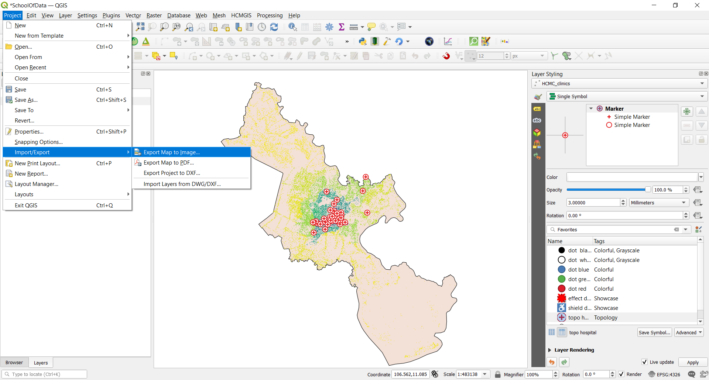

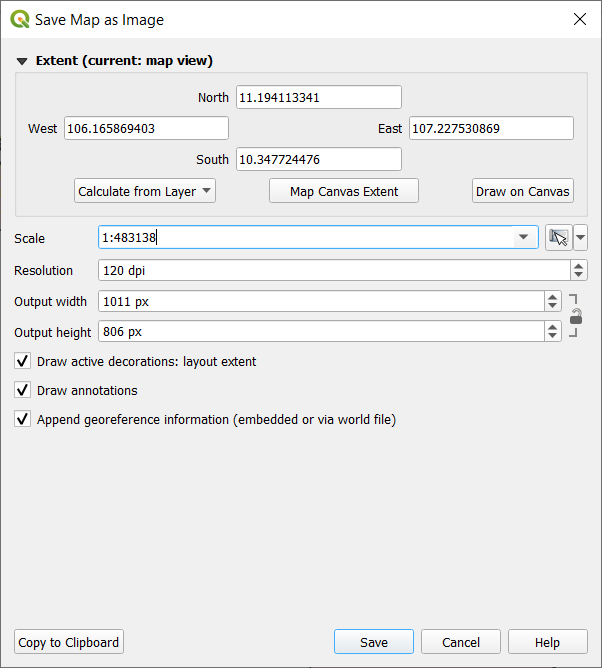

Hình 5.2: Kết xuất map canvas

3. Chọn **Save**. Map canvas sẽ được lưu lại thành một file image hoặc pdf. Chọn nơi lưu trữ và bạn có thể in hoặc chia sẻ bản đồ.

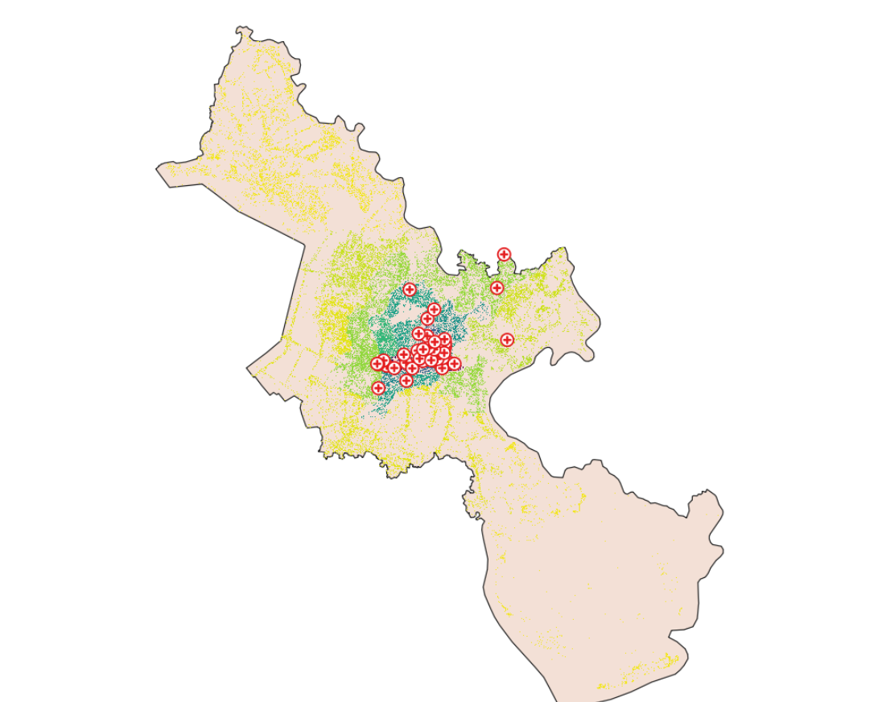

Hình 5.3: Kết xuất map canvas thành image

#### **Cách thứ hai: Kết xuất map canvas sang print layout**

1. Trong hướng dẫn này, chúng ta sẽ tạo một bản đồ hiển thị 1.) Vị trí của các cơ sở y tế và 2.) Mật độ dân số của Tp. Hồ Chí Minh. Các layer này phải được thêm vào map canvas trước khi kết xuất. Các layer sau đó có thể được styling để truyền đạt thông tin của dữ liệu.

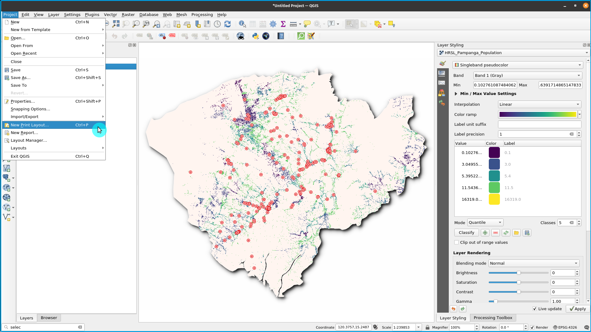

Hình 5.4: Tạo mới Print Layout

2. Map canvas bây giờ có thể được kết xuất sang print layout. Kích chọn nút ‘New Print layout’ , có thể được truy cập từ Tool bar hoặc bằng 'Project' menu bar. Một title dialog sẽ mở ra để nhập tiêu đề cho Print Layout, trong trường hợp này là 'Ho Chi Minh City', sau đó chọn OK.

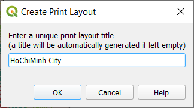

Hình 5.5: Đặt tên Print Layout

3. Giao diện Print Layout

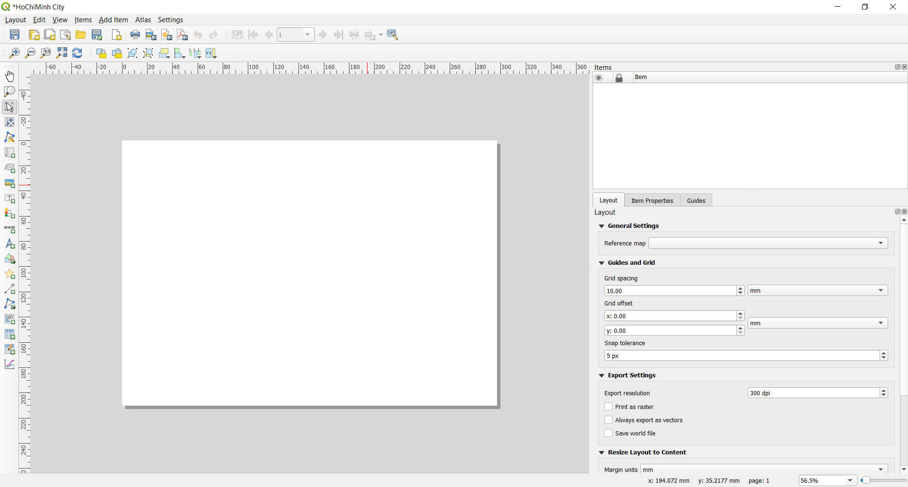

Hình 5.6: Giao diện Print Layout

4. Bạn sẽ nhận thấy print layput canvas trống. Để thêm bản đồ từ Map canvas, kích chọn e ‘Add new map to layout button’ , kích tr1i chuột và vẽ một hình chữ nhật ở khu vực trung tâm của print layout để chứa map canvas. Tới đây, bạn vừa kết xuất map canvas sang print layout, có thể thêm tất cả các thành phần bản đồ khác như title, legend, grids,...

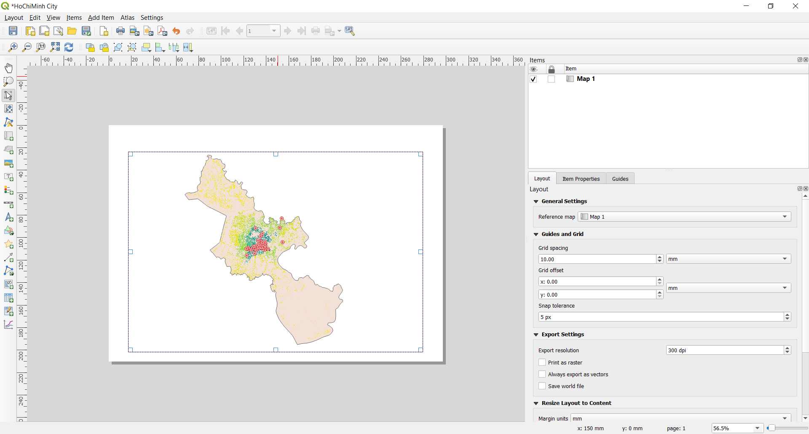

Hình 5.7: Thêm Map vào Print Layout

#### **Câu hỏi**

1. QGIS map canvas là gì? (chọn một hoặc nhiều phương án trả lời)
2. Print layout là gì? (chọn một hoặc nhiều phương án trả lời)
3. Thành phần nào sau đây không phải là thành phần bản đồ? (Chỉ chọn một phương án trả lời)
    
#### **Quiz answers**

1. a. shows the map composed from overlaid map layers
   b. allows interaction with the map and layers
   c. a widget for making maps

2. a. provides growing layout and printing capabilities
   b. allows you to add map elements
   c. handle both exporting and printing of maps

3. a. Title
   b. Scale
   c. Legend
   d. Colors and designs

### Phase 2 : Thêm và chỉnh sửa các thành phần bản đồ trong print layout

#### **Nội dung/ Hướng dẫn**

Bây giờ bản đồ đã được thêm vào print laypout, đã đến lúc thêm các thành phần bản đồ liên quan như title, scale, legend, grid, metadata,...vào print layout. Hầu hết các nút thêm vào nằm phía bên trái của print layout.

1. Chọn nút ‘Add label’ 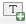, giữ chuột trái và vẽ một hình chữ nhật (thông thường là phía trên của print layout) để đặt tiêu đề cho bản đồ. Nhập tiêu đề trong menu ‘Main properties’ ở bên phải của print layout. Các thiết lập font chữ có thể được thay đổi ở mục 'Appearance'.

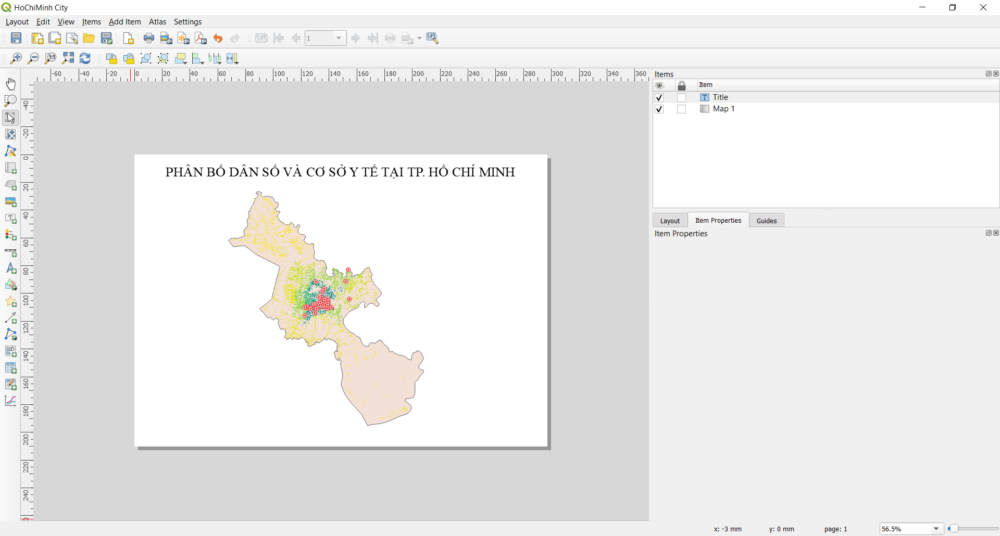

Hình 5.8: Thêm tiêu đề cho bản đồ.

2. Tiếp theo, chúng ta sẽ thêm legend và scale. Một tuyên bố bản quyền (data attribution) có thể được thêm vào bằng cách ‘Add label’. Di chuyển con trỏ đến các nút bấm bên trái print layout để chọn. Thực hiện các bước tương tự như bước 1 bên trên đề thêm các thành phần bản đồ vào print layout. Bạn có thể thêm các thành phần bản đồ khác, nhưng hãy cẩn thận để bản đồ không quá lộn xộn.

Hình 5.9: Thêm thước tỉ lệ - scale bar vào bản đồ

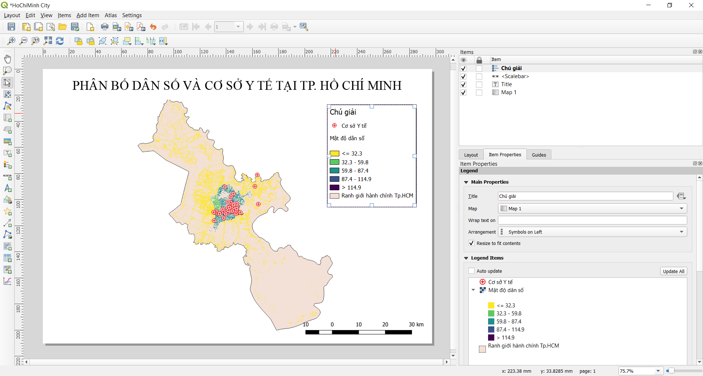

Hình 5.9: Thêm chú giải - legend vào bản đồ

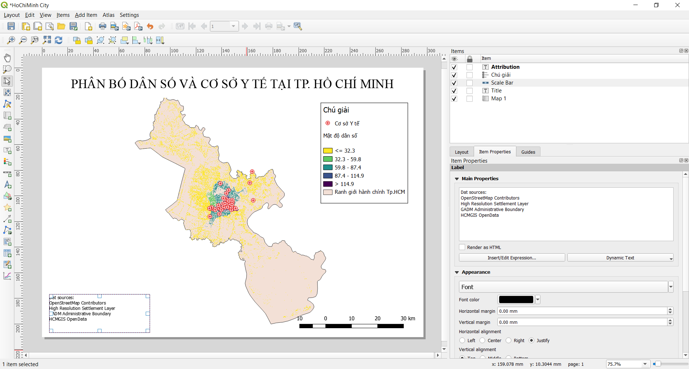

Hình 5.10: Thêm thông tin tác giả - attribution vào bản đồ.

3. Nếu map layout đạt yêu cầu, bản đồ có thể được kết xuất  sang pdf, png, jpeg hoặc svg, sẵn sàng cho in ấn hoặc lưu lại. Tất cả các chức năng lưu có thể được truy cập thông qua menu ‘layout’.

4. Lưu bản đồ thành image sử dụng **Layout ‣ Export as Image...** hoặc kích chọn nút **Export as Image**  . QGIS sẽ hỏi nơi lưu trữ bản đồ cũng như các thông số của image.

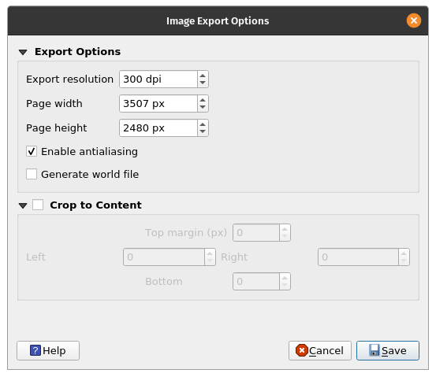

Hình 5.10: Các thông số của image

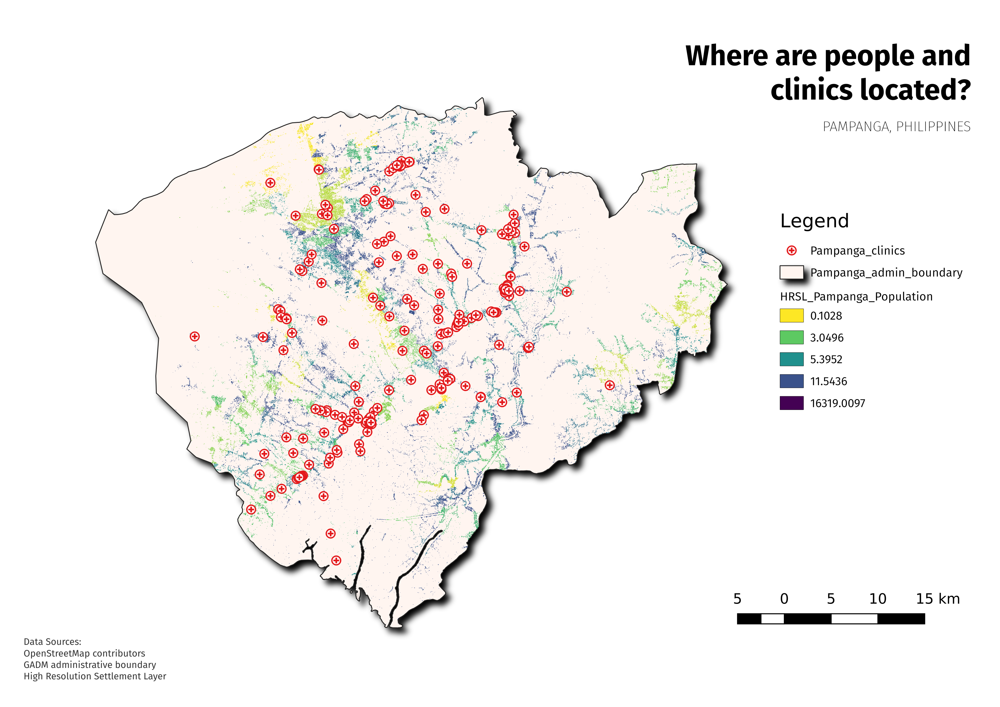

Hình 5.11: Bản đồ được kết xuất thành image

#### **Câu hỏi**

1. Ở tab nào sau đây bạn có thể thay đổi properties của các thành phần bản đồ (Chỉ chọn một phương án trả lời)
2. Bạn có thể thêm thông tin tác giả - attribution vào map layout bằng cách nào

#### **Quiz answers**

1. a. Composition
   b. Item properties
   c. Atlas generation
2. Thêm một title box, sau đó gõ thông tin tác giả. Chú ý là title box cho phép bạn thêm tất cả các dạng text vào bản đồ.

### Phase 3: Tạo bản đồ tự động bằng chức năng Atlas

#### **Nội dung/ Hướng dẫn**
Nếu tổ chức của bạn xuất bản các bản đồ in hoặc bản đồ trực tuyến, bạn thường cần tạo nhiều bản đồ với cùng một template - thường là cho từng đơn vị hành chính hoặc một khu vực quan tâm. Tạo các bản đồ này thủ công có thể toe61n nhiều thời gian và nếu bạn muốn cập nhật những bản đồ này mô5t cách thường xuyên, nó có thể trể thành một việc nhàm chán. QGIS có một công cụ gọi là Atlas có thể giúp bạn tạo một map template và dễ dàng xuất bản một số lượng lớn bản đồ cho các khu vực địa lý khác nhau. Chúng ta sẽ lấy các tỉnh thành khác nhau của Việt nam làm ví dụ, với ranh giới hành chính cho 63 tỉnh thành.

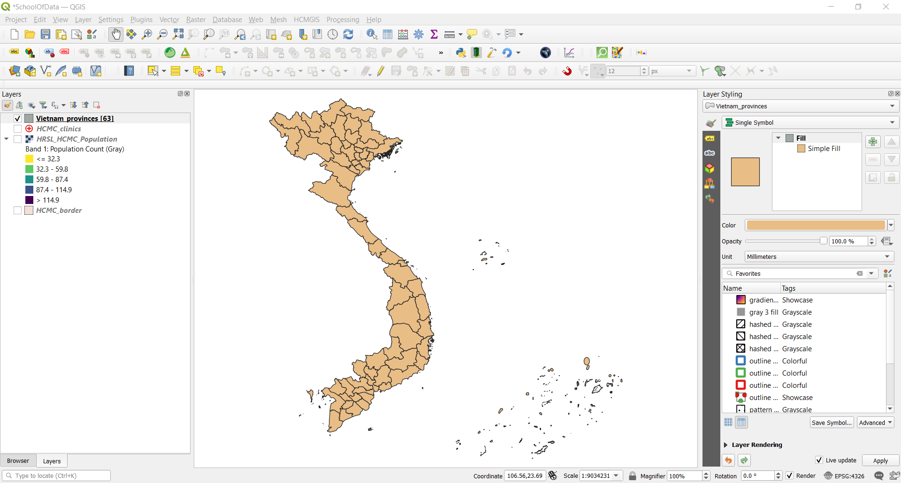

Hình 5.12: Ranh giới hành chính 63 tỉnh thành

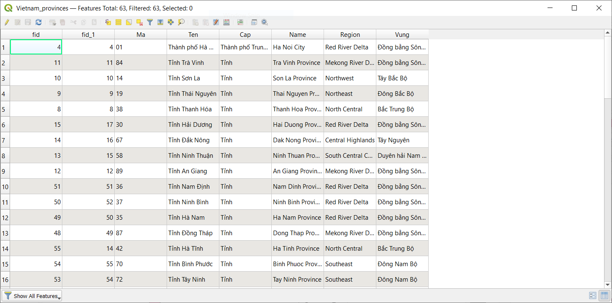

Hình 5.13: Bảng thuộc tính

1. Layer này sẽ đóng vai trò là coverage layer, nghĩa là Atlas sẽ gồm 63 bản đồ tương ứng với 63 đối tượng của layer - 63 tỉnh thành của Việt Nam.

2. Tạo mới Print Layout và thêm vào một bản đồ.

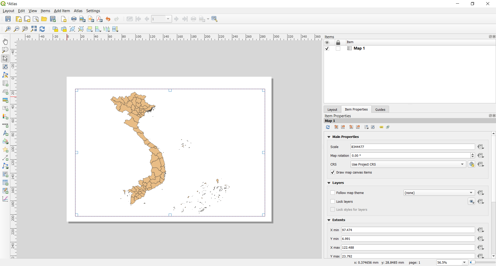

Hình 5.14: Atlas Print Layout

3. Ở bên phải của Print Layout, đảm bảo chọn **Atlas** menu và kích chọn **Generate an atlas**. Bạn cũng có thể mở thiết lập Atlas bằng cách kích vào nút Atlas Settings  trên Atlas toolbar.

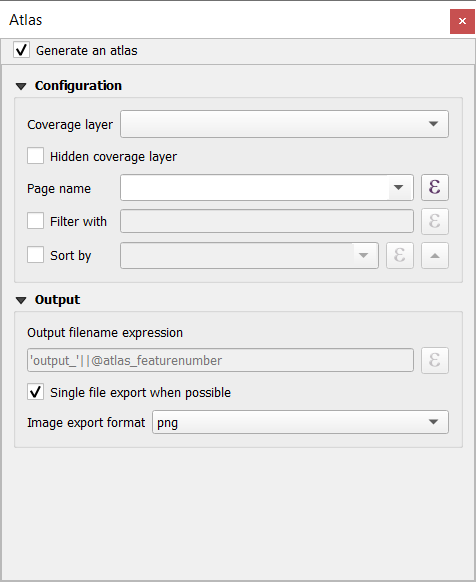

Hình 5.15: Tạo Atlas

3. Bước tiếp theo là chọn coverage layer; Coverage layer là một index layer được dùng để tạo từng trang in. Một bản đồ/ trang in của Atlas sẽ được tạo tương ứng với mỗi đối tượng của coverage layer. Trong trường hợp của chúng ta, sử dụng Vietnam_provinces coverage layer sẽ tạo 63 bản đồ tương ứng với 63 tỉnh thành. QGIS Atlas sẽ tự động thay đổi khung nhìn cho từng đối tượng trong coverage layer. Bạn có thể chọn ẩn coverage layer trong các bản đồ được tạo (nghĩa là) coverage layer sẽ không được hiển thị trong Print Layout) và chọn tên cho từng trang in của Atlas. Bạn cũng có thể thực hiện một số bộ lọc và sắp xếp cho coverage layer nều cần. Đối với **Output**, bạn có thể chọn đầu ra là một file duy nhất bằng các kích chọn **Singe file export when possible**, ngược lại nếu không chọn thì sẽ tạo ra mỗi file riêng cho từng bản đồ.
   
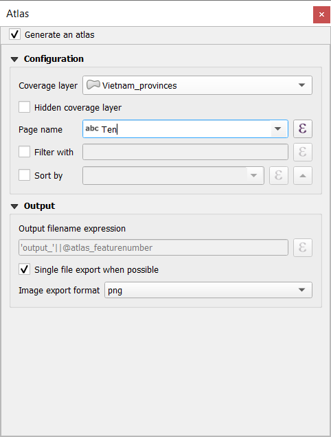

Hình 5.16: Chọn Coverage Layer

4. Bây giờ chúng ta đã chọn coverage layer, chúng ta nên yêu cầu Print Layout sử dụng atlas để điều khiển khung nhìn của các bản đồ sẽ được tạo ra. Trong tab **Item Properties**, kích chọn **Controlled By Atlas**

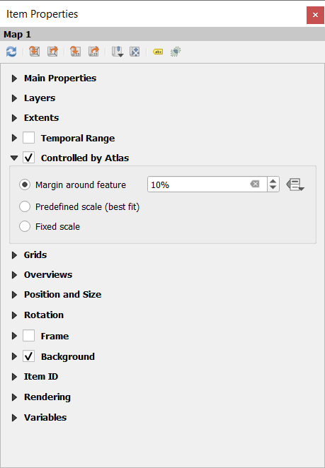

Hình 5.17: Đảm bảo rằng khung nhìn bản đồ được điều khiển bởi Atlas

5. Để xem trước Atlas, kích chọn nút Preview Atlas  trên Atlas Toolbar. Nó sẽ hiển thị 63 bản đồ mà bạn đã tạo. Sử dụng Atlas toolbar  đề lần lượt xem các bản đồ có trong Atlas.

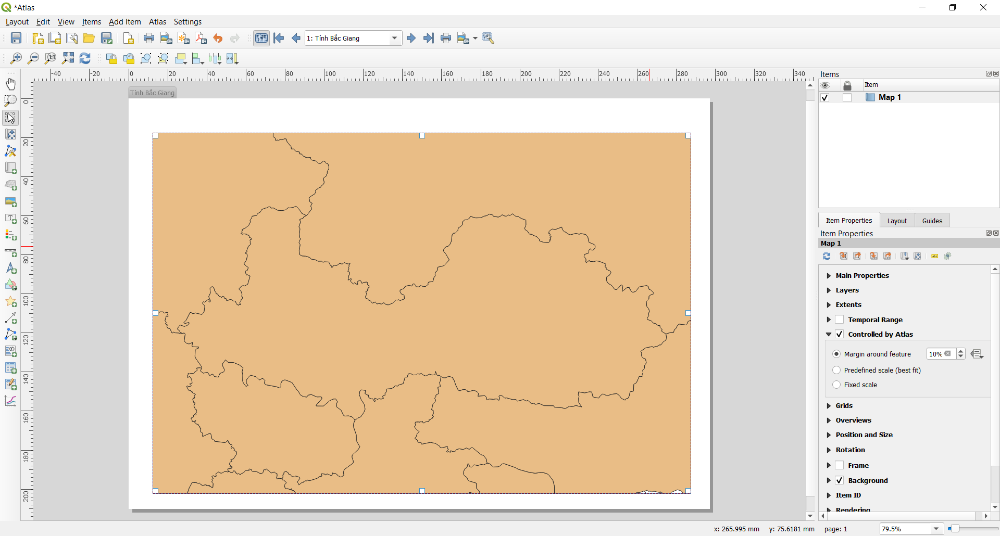

Hình 5.18: Xem trước Atlas

6. Bạn có thể xuất các bản đồ Atals bằng nút **Export Atlas**  sang dạng image hoặc pdf. Chọn **Export Atlas as Image**, bạn sẽ có 63 bản đồ tương ứng với 63 tỉnh thành.

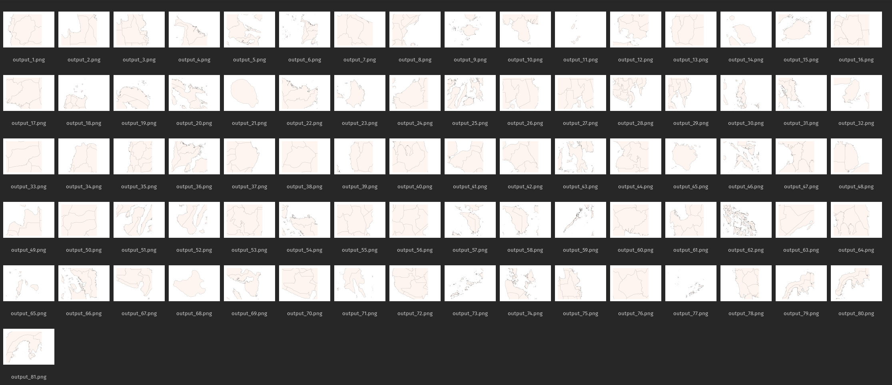

Hình 5.18: Kết quả đầu ra của Atlas

7. **MẸO**: Đối với ví dụ này chúng ta chỉ tạo bản đồ từ coverage layer. Sức mạnh của Atlas là khi chúng ta có nhiều layer. Ví dụ, lớp cơ sở y tế, giao thông và mật độ dân số của cả nước được tải trong QGIS. Sau đó, chúng ta muốn tạo một bản đồ cho từng tỉnh thành có cùng các layer. Sử dụng Atlas sẽ chỉ yêu cầu chúng ta tạo một layout template và để Atlas quản lý việc tạo các bản đồ khác dựa trên coverage layer được sử dụng. 

9. **MẸO**: Bạn có thể sử dụng QGIS Expressions và Data Defined để ghi đè thiết lập các thành phần bản đồ trong Atlas để chúng có thể thay đổi tự động theo các đối tượng của coverage layer. Ví dụ, bạn có thể sử dụng QGIS expression để gọi giá trị của trường NAME_1 cho label để nó thay đổi tự động giá trị của NAME_1 tương ứng với từng đối tượng của coverage layer

Để tìm hiểu thêm về QGIS Atlas, tham khảo tại đây  [https://www.youtube.com/watch?v=tOnMJBUvEjY](https://www.youtube.com/watch?v=tOnMJBUvEjY).

#### **Quiz questions**

n/a

#### **Quiz answers**

n/a