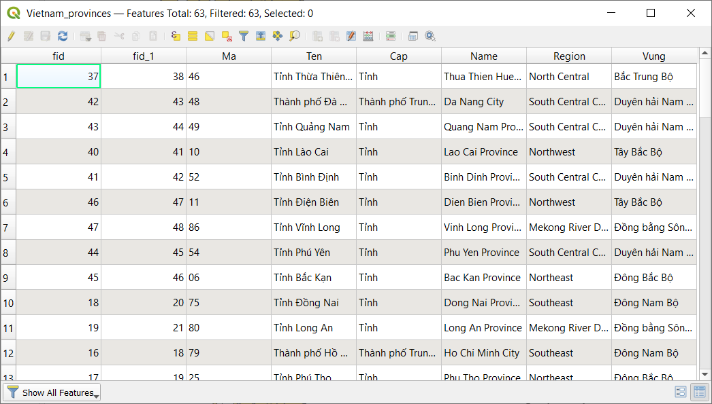
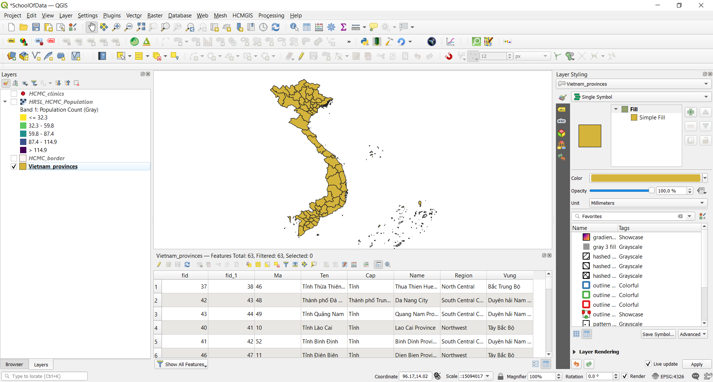
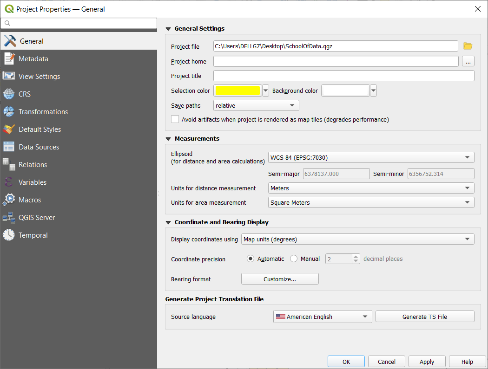
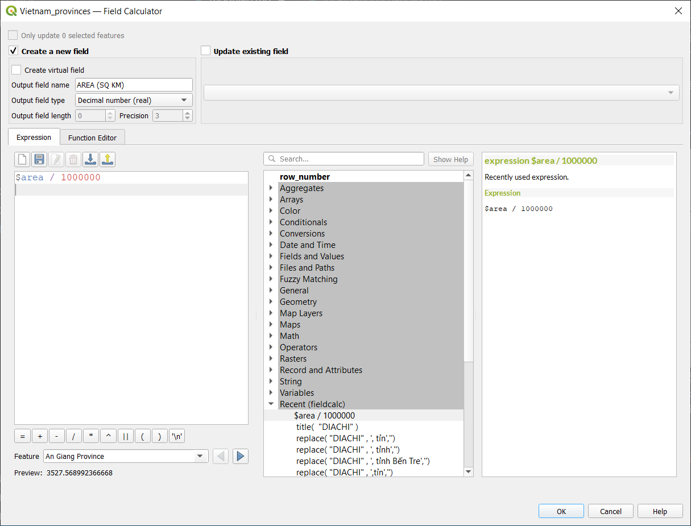
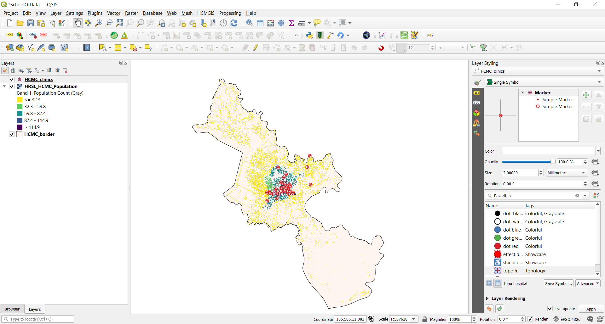
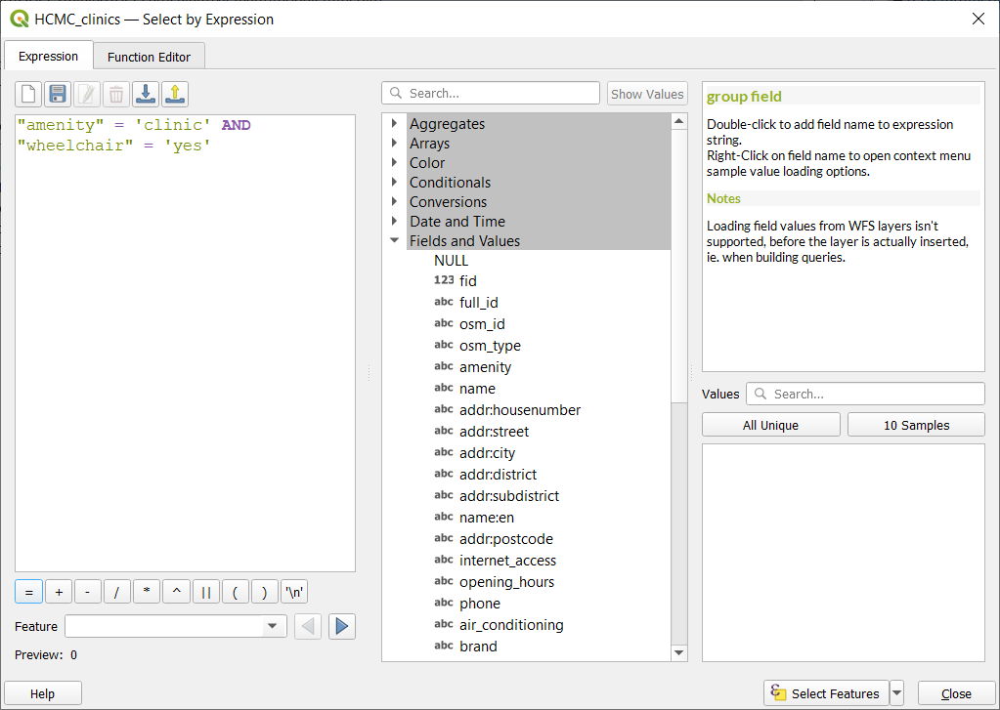
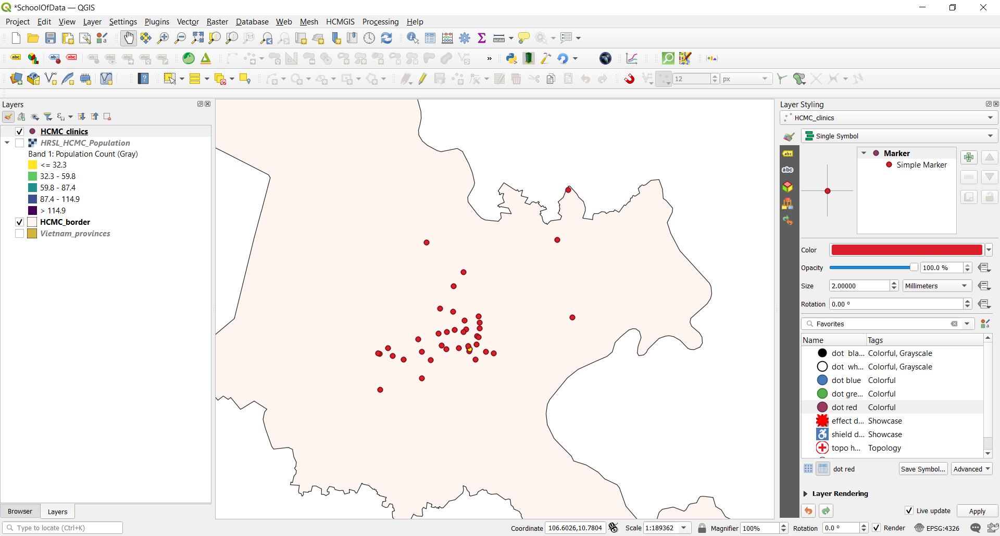
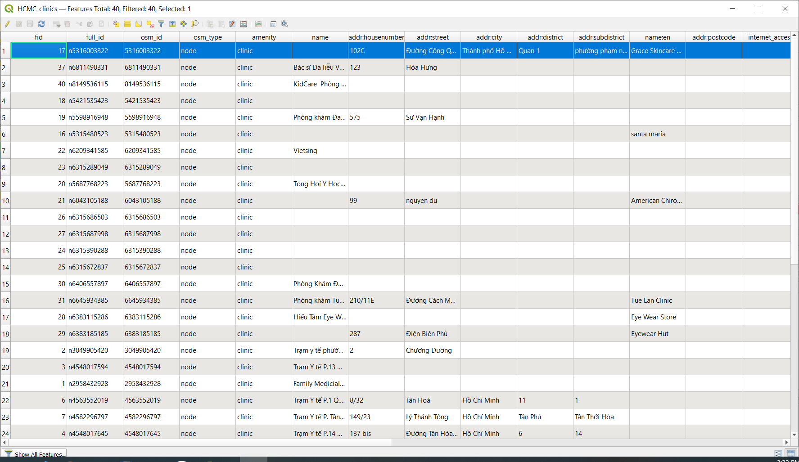

# Module 6 - Layer attributes

**Tác giả**: Ketty

**Biên dịch và bản địa hoá**: Quách Đồng Thắng


## Giới thiệu chung

Module này sẽ trang bị cho bạn một cái nhìn tổng quan về các bước chung cần thiết để làm việc với bảng thuộc tính - attribute table và thuộc tính của layer trong QGIS. Kết thúc Module, bạn có thể nắm được các khái niệm sau;

*   Làm việc với attribute table
*   Sử dụng field calculator
*   QGIS expression engine
*   Cấu trúc lại các trường dữ liệu

Ngoài ra, bạn sẽ học được các kỹ năng sau;

*   Giới thiệu giao diện attribute table
*   Tương tác với đối tượng trong attribute table
*   Lưu các đối tượng được chọn thành layer mới
*   Chỉnh sửa các trường thuộc tính của layer

Bạn sẽ sử dụng field calculator và QGIS expression engine để chạy các phép toán và hàm trong QGIS.


## Các công cụ và tài nguyên cần thiết

*   Máy tính
*   Kết nối Internet
*   QGIS 3.16 trở lên
*   Lớp ranh giới hành chính Tp.HCM (trong [module6.gpkg](data/module6.gpkg))
*   Cơ sở y tế Tp.HCM (trong [module6.gpkg](data/module6.gpkg))
*   Vietnam provinces (trong [module6.gpkg](data/module6.gpkg))
*   [HCM City High Resolution Settlement Layer](data/HRSL_HCMC_Population.tif)


## Yêu cầu về kỹ năng

*   Nắm được các Module trước
*   Kiến thức cơ bản về vận hành máy tính


## Tài liệu tham khảo

*   Working with the Attribute Table - [https://docs.qgis.org/3.16/en/docs/user_manual/working_with_vector/attribute_table.html?highlight=layer%20attributes](https://docs.qgis.org/3.16/en/docs/user_manual/working_with_vector/attribute_table.html?highlight=layer%20attributes)
*   QGIS Expressions - [https://docs.qgis.org/3.16/en/docs/pyqgis_developer_cookbook/expressions.html](https://docs.qgis.org/3.16/en/docs/pyqgis_developer_cookbook/expressions.html)


## Giới thiệu chuyên đề

Hãy bắt đầu với một ví dụ: 

Trong một số trường hợp, ví dụ cho mục đích quy hoạch cơ sở hạ tầng, bạn có thể muốn biết diện tích của polygon trong một layer. Nếu bạn có một polygon, điều này không là vấn đề. Nhưng nếu bạn có nhiều polygon trong một layer thì sao? Để tính toán diện tích cho từng polygon gần như là không thể. Lớp dữ liệu ranh giới hành chính Việt Nam có nhiều polygon sẽ là một bộ dữ liệu tốt cho Hướng dẫn này. Chúng ta sẽ tính diện tích cho từng polygon một cách tự động. Tổng cộng sẽ có 63 polygon được tính diện tích.


## Phân tích các khái niệm

Phần lớn công việc bạn làm khi tạo bản đồ liên quan đến việc làm việc với thuộc tính của layer. Cho dù bạn đang vẽ layer, cấu hình một cửa sổ popup, thực hiện các phép phân tích hay trực quan hoá, bạn cần có một số kiến thức về các trường dữ liệu của lớp và các giá trị của chúng. Nếu đó là layer của riêng bạn, bạn biết và hiểu các thuộc tính của nó. Nhưng nếu không phải, làm sao bạn có thể hiểu được? Có thể, bạn kiểm tra tên trường dữ liệu và giá trị cả nó để tìm một số manh mối. Và nếu bạn may mắn, bạn có thể tìm một vài tài liệu mô tả thuộc tính của layer.  

Bảng thuốc tính hiển thị thông tin của các đối tượng của một layer được chọn. Mỗi dòng trong bảng thể hiện một đối tượng (có thể có hoặc không có yếu tố hình học), mỗi cột chứa một phần thông tin cụ thể của đối tượng. Các đối tượng trong bảng có thể được tìm kiến, chọn, di chuyển hoặc thậm chí chỉnh sửa. Đặc biệt, có 02 thuộc tính mới của trường mô tả các giá trị được chứa trong trường dữ liệu;

*   **Field description** –  một vài từ, một câu hoặc một đoạn văn bản mô tả các giá trị trong trường dữ liệu.
*   **Field value type** – một từ khoá phân loại giá trị dữ liệu chứa trong trường dữ liệu. Từ khoá giúp chúng ta hiểu cách sử dụng các giá trị này và cho phép QGIS và các ứng dụng khác đưa ra các đề xuất thông minh hơn để làm việc với chúng, ví dụ, loại giá trị của trường dữ liệu có thể là integer, string, boolean, double và floating point

Sau đây là một ví dụ; Giả sử bạn có một lớp thửa đất với các trường dữ liệu sau:

*   Parcel ID – Integer
*   Owner – String
*   Street Address – String
*   Property Description – String
*   Buildings – Integer
*   Land Area – Double
*   Assessed Value – Double
*   Assessment Date – Date

Nếu bạn muốn mô tả các giá trị trường dữ liệu này, bạn có thể viết như sau: 

*   Parcel ID –  Số định danh duy nhất của thửa đất
*   Owner – Tên chủ sở hữu
*   Street Address – Địa chỉ thửa đất
*   Property Description – Thông tin pháp lý của thửa đất
*   Buildings – Số căn nhà trên thửa đất
*   Land Area – Diện tích thửa đất
*   Assessed value – Giá trị của thửa đất và các căn nhà trên thửa đất.
*   Assessment Date – Ngày tính giá trị của thửa đất.

Khi nhìn vào các mô tả này, một số từ nổi bật như: mã định danh, tên, địa chỉ, thông tin pháp lý, số lượng, kích tước, giá trị và ngày. Chúng là các _từ khoá_ để mô tả các giá trị của trường là gì. Các từ khoá loại giá trị trường dữ liệu được tạo dựa trên các loại từ này. Gồm có:

*   Tên gọi hoặc tiêu đề 
*   Mô tả
*   Kiểu, loại
*   Số đếm,  số lượng
*   Phần trăm, tỉ lệ
*   Đo đạc
*   Mã định danh
*   Thứ tự hoặc xếp hạng
*   Nhị phân
*   Vị trí hoặc tên địa điểm
*   Toạ độ
*   Thời gian và ngày tháng

Trong lớp thửa đất ở ví dụ trên, trường Parcel ID có kiểu là số nguyên - integer. Nếu loại trường dữ liệu 
là mã định danh thay vì số đếm, QGIS sẽ không đề xuất vẽ thuộc tính này sử dụng màu hoặc ký hiệu.

Ngoài ra, các khái niệm khác như chức năng field calculator trong bảng thuộc tính cho phép người dùng thực hiện các tính toán dựa trên giá trị các thuộc tính có sẵn hoặc các hàm được định nghĩa, ví dụ như để tính toán chiều dài, diện tích hoặc mật độ dân số. Cần chú ý là các phép tính có thể được xác định bởi các thuộc tính hoặc tính toán từ dữ liệu. Ví dụ, chỉ có thể tính toán mật độ dân số nếu có trường dân số. Sử dụng công cụ biểu thức tính toán và field calculator, bạn có thể xây dựng một biểu thức hoặc công thức tính toán để tính toán mật độ dân số. Trong trường hợp này công thức là tổng dân số/ diện tích. Bạn có thể thấy rằng điều quan trọng là biết được mỗi trường dữ liệu trong bảng thuộc tính biểu diễn cho cái gì. Điều này có nghĩa là bạn cần biết và hiểu rõ dữ liệu của mình, qua đó giúp cho việc áp dụng các hàm và biểu thức tính toán dễ dàng hơn để thực hiện các phép phân tích và bản đồ có ý nghĩa.

### Phase 1 : Chỉnh sửa layer attributes

#### **Nội dung**

Bảng thuộc tính hiển thị thông tin của các đối tượng của layer được chọn. Mỗi dòng trong bảng biểu diễn một đối tượng (có hoặc không có yếu tố hình học), và mỗi cột chứa một phần thông tin về đối tượng Các đối tượng trong bảng có thể được tìm kiếm, chọn, di chuyển hoặc thậm chí chỉnh sửa.

1. Tải lớp ranh giới hành chính Việt Nam trong QGIS (trong [module6.gpkg](data/module6.gpkg)). Bạn có thể xem số lượng đối tượng của layer bằng cách **Kích chuột phải vào layer trong Layers Panel - Show Feature Count**. Bạn có thể thấy trong hình bên dưới, vector layer có nhiều đối tượng, Tổng cộng có 63 đối tượng tương ứng với 63 tỉnh thành.


Hình 6.1: Số lượng polygon của vector layer


2. Bước tiếp theo là khám phá giao diện bảng thuộc tính. Mở bảng thuộc tính bằng cách **Kích chuột phải tại layer trong Layers Panel- Open Attribute Table**. Bạn cũng có thể kích chọn  **Open Attribute Table button**  từ Attributes Toolbar. Hình bên dưới là bảng thuộc tính. Có nhiều nút bấm phía trên bảng thuộc tính, di chuyển chuột trên mỗi nút bấm để xem chức năng tương ứng. 



Hình 6.2: Bảng thuộc tính ở dạng cửa sổ nổi mà gắn vào giao diện QGIS, bạn có thể kích chọn **Dock attribute table button** , lúc này bảng thuộc tính sẽ hiển thị dạng tab thay vì một cửa sổ riêng.



Hình 6.3: Bảng thuộc tính dạng tab


3. Để tính toán diện tích, hệ quy chiếu toạ độ CRS phải ở dạng hệ toạ độ phẳng. Điều nay cho phép bạn có thể tính toán khoảng cách chính xác. Nên nhớ rằng, mối quan tâm của chúng ta là tính toán diện tích tự động cho từng tỉnh thành. Kiểm tra CRS của vector layer. Nếu nó là hệt toạ độ địa lý, phải reproject để chuyển đổi sang hệ toạ độ phẳng. Tham khảo thông tin các hệ toạ độ trên [EPSG](https://epsg.io/?q=Vietnam+kind%3APROJCRS). Đối với Việt Nam chúng ta có thể sử dụng  [VN-2000 / UTM zone 48N](https://epsg.io/3405). Ở các Module trước đã đề cập đến các hệ quy chiếu toạ độ bản đồ, nên bạn có thể đã hiểu hệ toạ độ nào được lựa chọn sử dụng cho một khu vực địa lý nhất định.

5. Chọn Project Settings **Project ‣ Properties Properties ‣ General**.



Hình 6.4: General settings

5. Tiếp theo, kích chọn **Open field calculator**  trên Attibute Toolbar để mở cửa sổ field calculator; điền các tham số như ouput field name, trong trường hợp này là ‘AREA (SQ KM)’. Chọn Output field type là Decimal number (double), với precision là 2 decimal places. Để tính toán diện tích, nhập vào biểu thức sau:

```
AREA (SQ KM)
```

 Tham số $area nằm trong mục **Geometry**. Chọn OK để tính toán tự động diện tích của từng polygon. Cần chú ý là việc tính toán diện tính tuỳ thuộc vào CRS mà chúng ta sử dụng, nên có thể có nhiều kết quả tính toán khác nhau tuỳ vào CRS. Bạn cũng có thể tìm kiếm thông tin về các biểu thức ở phía bên phải của Field Calculator hoặc sử dụng Expression Builder



Hình 6.5: Field calculator dialogue

6. Trở lại bảng thuộc tính để xem kết quả. Bạn vừa thay đổi nội dung của attribute table một cách tự động thay vì phải nhập từng giá trị trên từng ô của bảng thuộc tính.


Hình 6.6: Bảng thuộc tính với trường AREA vừa được tính toán


#### **Câu hỏi**

1. Một bảng thuộc tính là một CSDL hoặc tệp dạng bảng chứa thông tin về một tập các đối tượng địa lý.

3.  Các đối tượng địa lý thường được sắp xếp sao cho mỗi dòng biểu diễn một đối tượng và mỗi cột biểu diển một thuộc tính của đối tượng.

5. Cần phải chuyển đổi hệ toạ độ các layer trước khi tính toán diện tích khi layer đang ở hệ toạ độ địa lý.


#### **Đáp án**

1. True
2. True
3. True


### Phase 2 : Hiểu và làm việc với dữ liệu thuộc tính, truy vấn và phân tích

#### **Nội dung**

Bạn có thể thấy rằng bảng thuộc tính chứa dữ liệu không gian lẫn phi không gian. Trong bài hướng dẫn này bạn sẽ khám phá các phương pháp làm việc với dữ liệu thuộc tính. Ví dụ, sử dụng biểu thức tính toán, chọn các cơ sở y tế ở Tp.HCM có Phòng cấp cứu, tất cả đều sử dụng dữ liệu thuộc tính. 

1. Thêm các dữ liệu sau của Việt Nam vào QGIS map canvas;

*   Ranh giới hành chính Tp.HCM - HCMC_border (trong [module6.gpkg](data/module6.gpkg))
*   Cơ sở Y tế Tp.HCM - HCMC_clinics (trong [module6.gpkg](data/module6.gpkg))
*   Ranh giới hành chính các tỉnh thành Việt Namp - Vietnam_provinces (trong [module6.gpkg](data/module6.gpkg))
*   [HCM City High Resolution Settlement Layer](data/HRSL_HCMC_Population.tif)



Hình 6.7: Thêm các layer vào QGIS

2. Phép chọn được áp dụng trên lớp cơ sở y tế, do đó mở bảng thuộc tính của lớp cơ sở y tế. Kích chọn  select features using expression  và nhập vào biểu thức sau trong expression builder

```
"amenity" = 'clinic' AND "wheelchair" = 'yes'
```

Bạn có thể thấy rằng biểu thức có một số toán tử như so sánh (=), toán tử logic (AND) và một chuỗi nằm trong dấu nháy đơn (‘ ‘). Ngoài ra còn có 02 thuộc tính (amenity, wheelchair) và giá trị thuộc tính tương ứng (clinic,yes). 



Hình 6.8: Select by Expression builder dialogue

3. Khi lớp cơ sở y tế được chọn. Bạn có thể thấy các đối tượng được chọn sẽ được tô màu vàng ở map canvas và màu xanh ở bảng thuộc tính. 



Hình 6.9: Các cơ sở y tế được chọn ở map canvas(màu vàng)




Hình 6.10: Các cơ sở y tế được chọn trong bảng thuộc tính(màu xanh)

Bạn cũng có thể chọn đối tượng bằng cách kích chuột trực tiếp trên map canvas.

xây dựng một biểu thức chọn bắt đầu với việc hiểu về dữ liệu của bạn; ví dụ như các thuộc tính và các giá trị của chúng. Tiếp đó, đặt ra những câu hỏi đúng và cuối cùng, xây dựng một biểu thức chính xác, xem xét tất cả các quy tắc toán học để tạo ra một biểu thức không có lỗi.

#### **Câu hỏi**

1. Các toán tử sau được cung cấp bởi expression builder. {+, -, *}
2. Các chuỗi (string) phải được chứa trong dấu nháy đơn.
3. Bảng thuộc tính chỉ chứa các thông tin phi không gian.

#### **Đáp án**

1. True
2. True
3. False


### Phase 3 : Advanced QGIS expressions 

Cửa sổ Expression builder cung cấp truy cập đến:

* Expression tab ([https://docs.qgis.org/2.18/en/docs/user_manual/working_with_vector/expression.html#functions-list](https://docs.qgis.org/2.18/en/docs/user_manual/working_with_vector/expression.html#functions-list)) chứa danh sách các hàm được định nghĩa trước, giúp cho việc viết và kiểm tra các hàm/ biểu thức.
* Function Editor tab ([https://docs.qgis.org/2.18/en/docs/user_manual/working_with_vector/expression.html#function-editor](https://docs.qgis.org/2.18/en/docs/user_manual/working_with_vector/expression.html#function-editor)) hỗ trợ mở rộng các hàm có sẵn bằng cách tự định nghĩa các hàm tính toán mới.

#### **Nội dung**

Có nhiều trường hợp sử dụng cho các biểu thức, sau đây là một số ví dụ. Chú ý cách mà các biểu thức được xây dựng và các toán tử hay vị từ nào được sử dụng. Điều quan trọng nữA là các biểu thức tính toán này được xây dựng dựa trên nội dung của dữ liệu. Bạn có thể điều chỉnh cho phù hợp với tập dữ liệu mà bạn có.

1. Từ Field Calculator, tính toán “pop_density” sử dụng 02 trường đã có “total_pop” và “area_km2”
    
```
"total_pop" / "area_km2"
```

2. Cập nhật trường “density_level” căn cứ vào giá trị “pop_density” vừa tính toán:
    
```
CASE WHEN "pop_density" < 50 THEN 'Low population density'
     WHEN "pop_density" >= 50 AND  "pop_density" < 150 THEN 'Medium population density'
     WHEN "pop_density" > 150 THEN 'High population density'
END
```

3. Áp dụng style dạng categorized cho tất cả các đối tượng theo giá nhà trung bình trên mỗi mét vuông nhỏ hơn hoặc lớn hơn một giá trị nhất định :

```
"price_m2" > 10000000
```

4. Sử dụng công cụ “Select By Expression...”, chọn tất cả các đối tượng các khu vực có "Mật độ dân số cao" và có giá nhà cao hơn 10 triệu/ m2
    
```
"density level" = 'High population density' and "price_m2" > 10000000
```

5. Tương tự như vậy, biểu thức trên cũng có thể được dùng để định nghĩa các đối tượng được gán nhãn hoặc hiển thị trên bản đồ.


#### **Câu hỏi**

1.  Cả Field Calculator và Select by Expression dialogue đều có thể được dùng để xây dựng các biểu thức -- ***True***
2.  Các biểu thức có thể được sử dụng để cập nhật một thuộc tính mới -- ***True***
3.  Các biểu thức có thể được sử dụng để định nghĩa kiểu hiển thị - style  -- ***True***