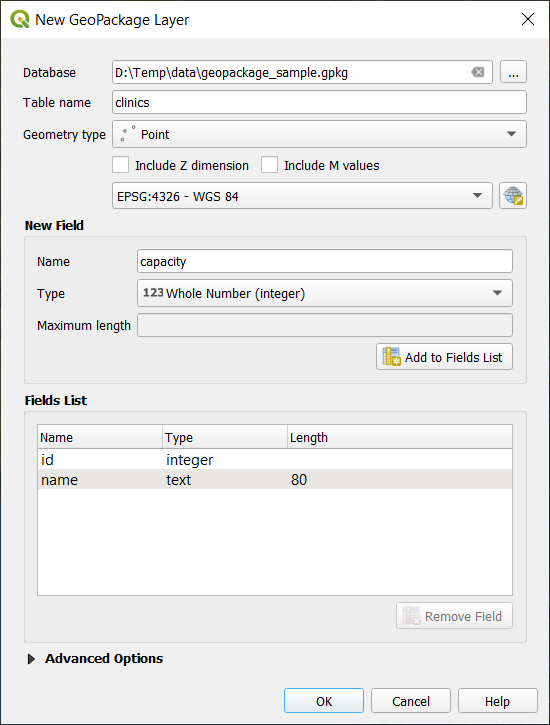
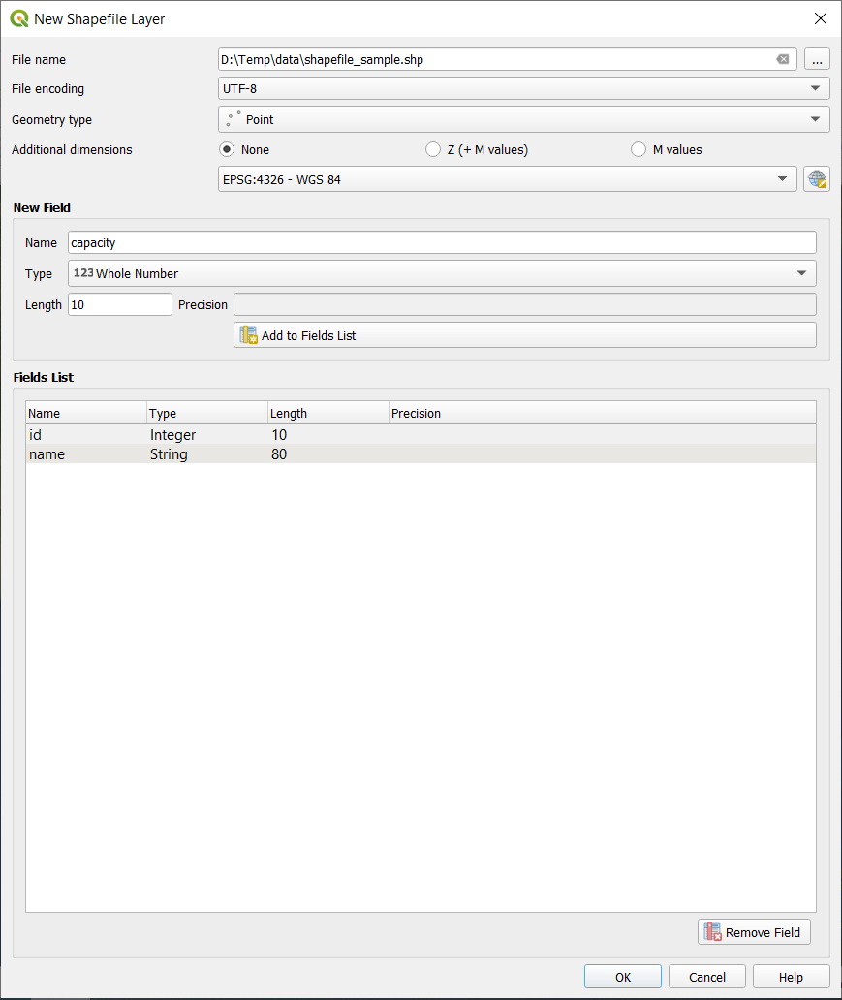
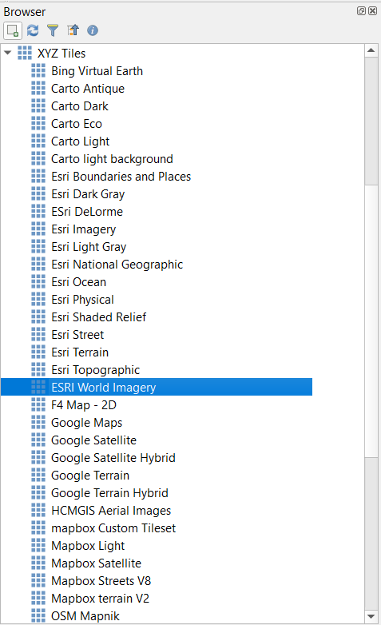
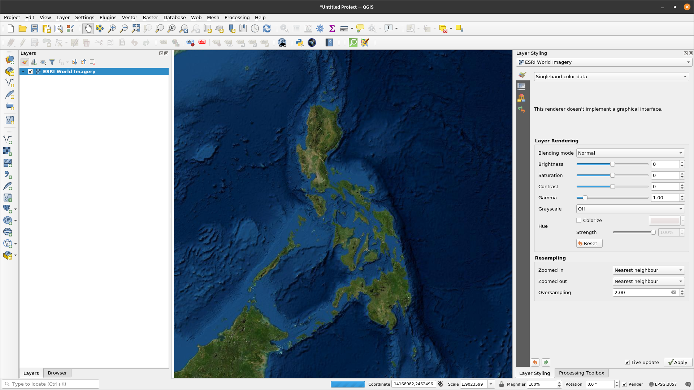
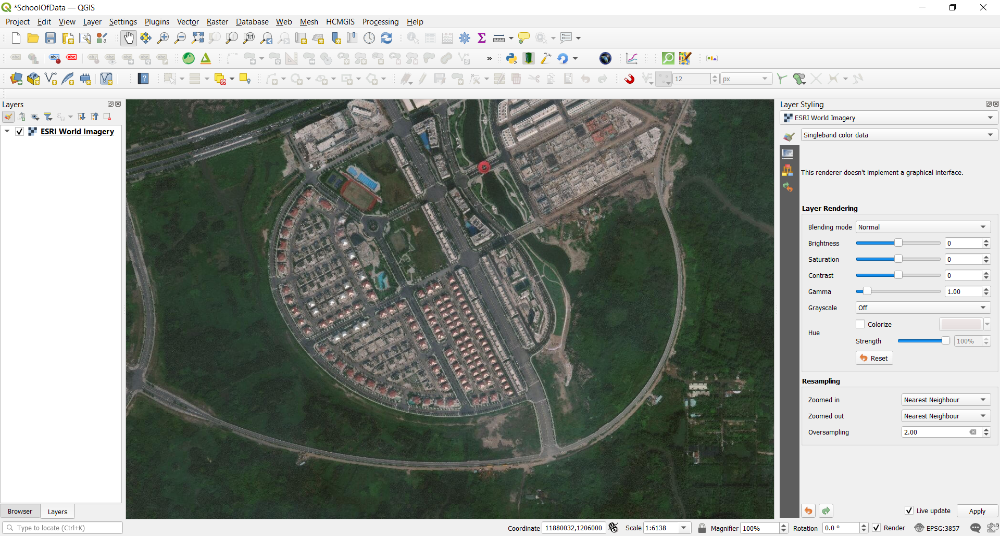
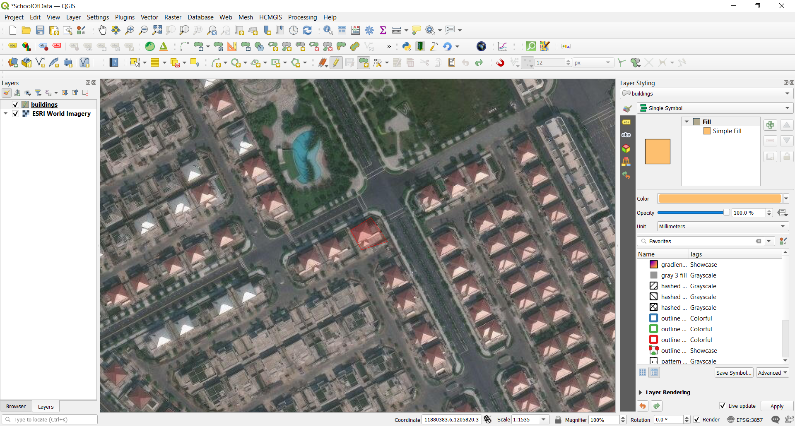
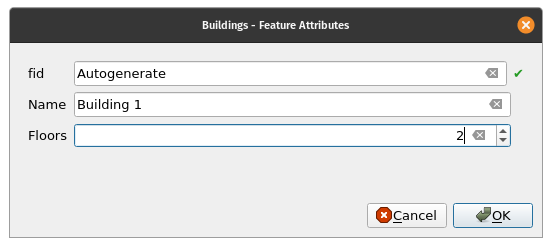
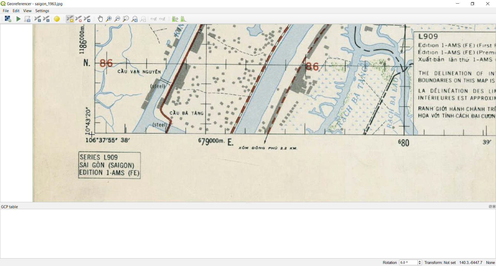
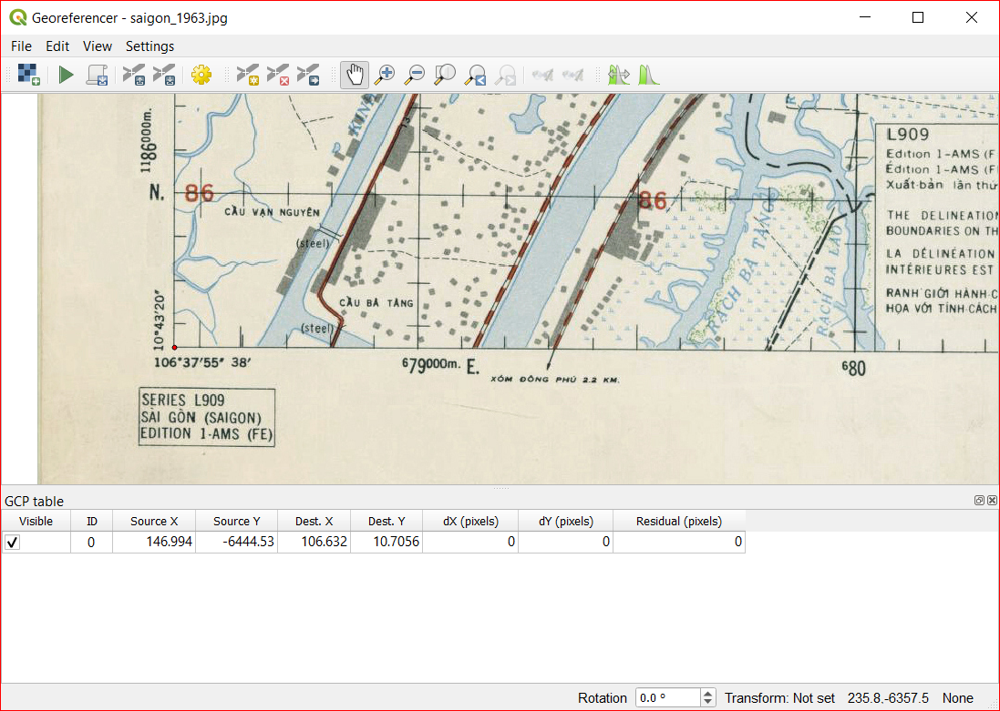
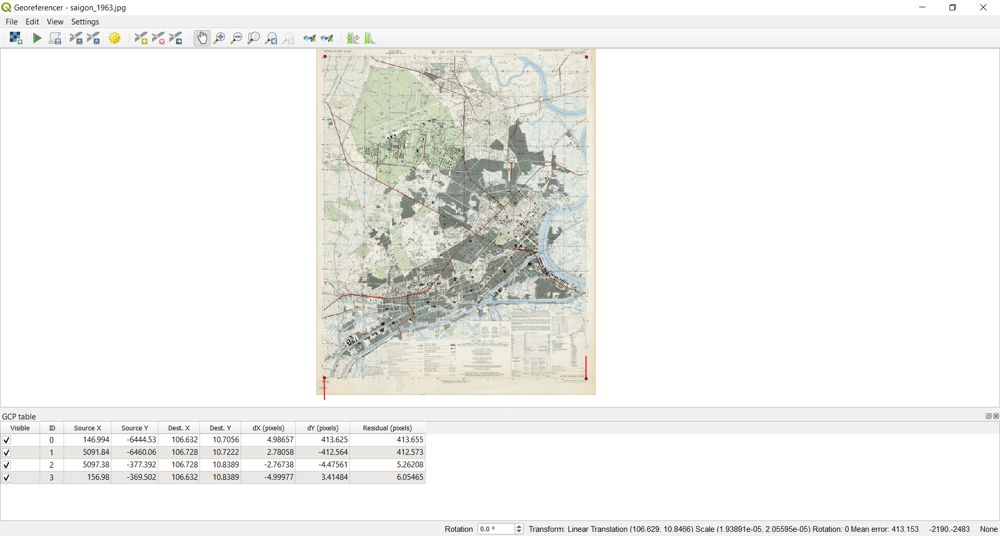

# Module 7 - Tạo và chỉnh sửa Layers

**Tác giả**: Ketty

**Biên dịch và bản địa hoá**: Quách Đồng Thắng

## Giới thiệu chung

Module này được thiết kế để hướng dẫn bản cách sử dụng các công cụ QGIS để tạo một layer mới trong QGIS. Bạn sẽ học các khái niệm như số hoá (digitizing) và đăng ký toạ độ (georeferencing)

## Các công cụ và tài nguyên cần thiết

*   Máy tính
*   Kết nối Internet
*   QGIS 3.16 trở lên
*   [Bản đồ Sài Gòn năm 1963](data/saigon_1963.jpg)

## Yêu cầu về kỹ năng

*   Nắm được các Module trước
*   Kiến thức cơ bản về vận hành máy tính

## Tài liệu tham khảo

*   Creating Layers - [https://docs.qgis.org/3.16/en/docs/user_manual/managing_data_source/create_layers.html](https://docs.qgis.org/3.16/en/docs/user_manual/managing_data_source/create_layers.html)
*   Digitizing Forest Stands - [https://docs.qgis.org/3.16/en/docs/training_manual/forestry/stands_digitazing.html?highlight=digitizing](https://docs.qgis.org/3.16/en/docs/training_manual/forestry/stands_digitazing.html?highlight=digitizing)
*   Further reading: [Georeferencing a Map](https://docs.qgis.org/3.16/en/docs/training_manual/forestry/map_georeferencing.html?highlight=georeferencing)

## Giới thiệu chuyên đề

Hãy bắt đầu bằng một ví dụ: 
Hãy tưởng tượng cơ quan của bạn đang lên kế hoạch xây dựng các bệnh viện mới tại một tỉnh nào đó. Họ có thể muốn tiến hành một đánh giá tác động môi trường của dự án quy hoạch cơ sở hạ tầng. Đánh giá này có thể bao gồm tiến hành các nghiên cứu dựa trên các dữ liệu sẵn có. Như bạn có thể tưởng tượng, có rất nhiều dữ liệu địa lý có sẵn ở nhiều định dạng khác nhau, không thể tích hợp ngay với các dữ liệu GIS khác. Một số dữ liệu này có thể là các bản đồ cũ, ảnh vệ tinh độ phân giải cao hoặc ảnh viễn thám thường được dùng cho việc tạo các bản đồ số như Google Maps hoặc OpenStreetMap. Tạo và chỉnh sửa là cách tốt cho việc cập nhật các thay đổi cho các layer hoặc database. Một cách để tạo mới dữ liệu trong GIS là số hoá. Các cách khác bao gồm đăng ký ảnh (georeference), quét ảnh và vector hoá, cắt (clipping), chọn và lưu dữ liệu. Điều quan trọng cần nhớ là dữ liệu được tạo ra phụ thuộc vào tính duy nhất của nguồn ban đầu. Ví dụ, hình sau thể hiện mỗi image sẽ tạo ra một tập dữ liệu duy nhất.

Hình 7.1: Anh viễn thám của các đường bờ biển khác nhau. A. Interferometric Synthetic Aperture Radar (IFSAR), sử dụng microwave thu thập dữ liệu để tạo bản đồ, B. Dữ liệu LiDAR đo cao và đo sâu (cao độ được thể hiện bằng màu sắc), C. Ảnh đa phổ (thêm các kênh phổ ngoài phổ khả kiến) và D. Ảnh kỹ thuật số (kênh phổ khả kiến).

## Phân tích các khái niệm

Số hoá trong GIS là một quá trình "theo vết - tracing", một cách chính xác về mặt địa lý, thông tin từ các phương tiện/ bản đồ. Quy trình số hoá dựa trên sự phối hợp giữa các điểm trên ảnh quét với các điểm trên dữ liệu tham chiếu địa lý. Bằng cách "kết nối" các điểm trên ảnh quét với các điểm ở cùng vị trí trên dữ liệu tham chiếu địa lý, bạn sẽ tạo một phép chuyển đổi để chuyển vị trí của toàn bộ bản đồ quét sang vị trí địa lý chính xác.

 trên một ảnh hàng không")

Hình 7.2: Các toà nhà được số hoá (theo vết) trên một ảnh hàng không

Mặt khác, đăng ký ảnh là một quá trình chụp một ảnh số, có thể là ảnh hàng không, bản đồ quét hoặc ảnh của bản đồ địa hình, và thêm thông tin địa lý vào ảnh để GIS và các phần mềm bản đồ có thể 'đặt' hình ảnh ở vị trí thích hợp trong thế giới thực.

## Nội dung chính

QGIS cho phép bạn tạo layer mới ở nhiều định dạng khác nhau. Nó cung cấp các công cụ để tạo GeoPackage, Shapefile, SpatiaLite, GPX và Temporary Scratch layer (memory layer). Công cụ Editing cho phép bạn thêm, xoá và chỉnh sửa các đối tượng trong dữ liệu vector. Bước đầu tiên là bật chế độ edit cho dữ liệu. Chọn layer trong Layers Panel và chọn Layer | Toggle Editing. Ngoài ra, bạn có thể kích chuột phải trên layer trong Layers Panel và chọn Toggle Editing từ menu ngữ cảnh. Nhiều layer có thể được chỉnh sửa cùng lúc. Layer hiện đang được chỉnh sửa là layer được chọn trong Layers Panel. Khi bật chế độ chỉnh sửa, Digitizing Toolbar có thể được dùng để thêm, xoá và chỉnh sửa các đối tượng.

Số hoá, như bạn có thể đoán, là nghệ thuật (hoặc khoa học) để tạo dữ liệu vector số hoá từ nguồn khác, như ảnh raster. Đề bắt đầu số hoá, đầu tiên chúng ta phải bật chế độ chỉnh sửa. Các phần mềm GIS thường yêu cầu chế độ chỉnh sửa riêng để ngăn người dùng vô tình chỉnh sửa hoặc xoá các dữ liệu quan trọng. Chế độ chỉnh sửa được bật hoặc tắt riêng cho từng layer.

### Phase 1 : Tạo mới một GeoPackage layer hoặc Shapefile

#### **Tạo mới một GeoPackage layer**

1. Để tạo mới một GeoPackage layer, chọn nút New GeoPackage Layer  trong Layer ‣ Create Layer menu hoặc từ Datasource Manager toolbar. Giao diện New GeoPackage Layer sẽ được hiển thị như Hình 7.3.

Hình 7.3: Giao diện New GeoPackage Layer

2. Bước đầu tiên là xác định vị trí của file bằng cách bấm nút , sau đó chọn file GeoPackage có sẵn hoặc tạo mới. QGIS sẽ tự động thêm phần mở rộng thích hợp cho tên file được nhập.
3. Nhập tên cho layer/ table mới
4. Định nghĩa kiểu dữ liệu. Nếu là một lớp hình học, bạn có thể chỉ định có bao gồm Z dimension và hoặc/ M value hay không.
5. Chọn CRS sử dụng nút 

6. Thêm các trường dữ liệu cho layer:

    1. Nhập tên trường dữ liệu
    2. Chọn kiểu dữ liệu: Text, Whole number (integer và integer64),  Decimal number, Date và Date and time, Binary (BLOB) và Boolean
    3. Tuỳ vào kiểu dữ liệu được chọn, nhập Maximum length of values.
    4. Kích chọn nút Add to Fields List 

7. Lặp lại các bước như trên cho mỗi trường dữ liệu cần thêm vào.
8. Khi đã nhập đủ các trường dữ liệu, chọn OK. QGIS sẽ thêm một layer mới vào legend (Layers Panel), và bạn có thể chỉnh sửa nó theo hướng dẫn trong Phase 2 ‘Digitizing an existing layer' của Module này.

 

#### **Tạo một Shapefile mới**

1. Để tạo một layer định dạng ESRI Shapefile, nhấn nút New Shapefile Layer…  trong Layer ‣ Create Layer ‣ menu hoặc từ Data Source Manager toolbar. Giao diện New Shapefile Layer sẽ được hiển thị như Hình 7.4.

Hình 7.4: Giao diện New shapefile layer

2. Nhập đường dẫn và tên file sử dụng nút … cạnh tên file. QGIS sẽ tự động thêm phần mở rộng thích hợp cho tên file được nhập.
3. Tiếp theo, xác định File encoding (UTF-8, hỗ trợ tiếng Việt Unicode)
4. Chọn kiểu dữ liệu cho layer: No Geometry (định dạn .DBF), point, multipoint, line hoặc polygon
5. Xác định có thêm các chiều bổ sung cho kiểu dữ liệu hay không: None, Z (+ M values) hoặc M values.
6. Xác định CRS sử dụng nút , bạn có thể chọn WGS 84 để phù hợp tốt cho các dự án bản đồ web toàn thế giới.

7. Thêm các trường dữ liệu cho layer:
    1. Nhập tên trường dữ liệu
    2. Chọn kiểu dữ liệu. QGIS hỗ trợ các kiểu dữ liệu Decimal number, Whole number, Text và Date 
    3. Tuỳ vào kiểu dữ liệu được chọn, nhập các thông số cho Length và Precision.
    5. Kích chọn nút Add to Fields List .

7.  Lặp lại các bước như trên cho mỗi trường dữ liệu cần thêm vào.
8. Khi đã nhập đủ các trường dữ liệu, chọn OK. QGIS sẽ thêm một layer mới vào legend (Layers Panel), và bạn có thể chỉnh sửa nó theo hướng dẫn trong Phase 2 ‘Digitizing an existing layer' của Module này.

### Phase 2: Số hoá layer hiện có

#### **Nội dung/ Hướng dẫn**

Hướng dẫn này sẽ chỉ cách tạo một shapefile mới sử dụng dữ liệu phụ trợ như ảnh vệ tinh của Google. Trong thực tế, dữ liệu chính xác sẽ có sẵn. Đây sẽ là dữ liệu định tính chính xác về các đối tượng có tính topology. Điều quan trọng là phải biết trước đối tượng bạn muốn tạo là gì, chẳng hạn như point, line hay polygon layer. Khi tạo layer, chúng ta phải định nghĩa kiểu dữ liệu mà nó sẽ chứa. Mục đích của hướng dẫn này là tạo một kiểu dữ liệu có thể dễ dàng thao tác, phân tích và lưu trữ sử dụng một hệ GIS, nên cần tạo dữ liệu vector. Chúng ta sẽ tạo các đối tượng polygon như là một ví dụ;

1. TrưỚc khi thêm và một dữ liệu vector mới, bạn cần một vector layer để thêm vào. Trong trường hợp này, chúng ta sẽ bắt dầu bằng việc tạo một layer mới, và sau đó chúng ta sẽ thêm các đối tượng vào nó. Đầu tiên, chúng ta cần định nghĩa layer cần tạo.
2. Tạo một project mới trong QGIS bằng cách kích chọn biểu tượng  _New Project_ 
3. Vào _Layer ‣ Create Layer ‣ New GeoPackage Layer_ sẽ xuất hiện giao diện như sau:

Hình 7.5: Giao diện New GeoPackage

Đến đây, chúng ta phải quyết định loại layer cần tạo. Hãy nhớ là layer có thể chứa các đối tượng dạng point, line hoặc polygon - không bao giờ là hỗn hợp của các kiểu dữ liệu này. Khi tạo layer, chúng ta phải định nghĩa kiểu dữ liệu mà nó sẽ chứa.

Bởi vì polygon được tạo ra từ point và line, hãy tạo polygon. Khi bạn thành thạo điều này, việc tạo point hoặc line layer sẽ trở nên dễ dàng!

Trong giao diện New GeoPakage, chọn tên file, file encoding, geometry type, CRS và các trưỜng dữ liệu. Điều này yêu cầu một mô hình dữ liệu được thiết kế trước để có thể nắm nắt tất cả thông tin của đối tượng cần tạo.

4. Bước tiếp theo là thêm ESRI World Imagery satellite layer vào map canvas. Chúng ta đã thêm vào trong Module trước nên nó sẽ có sẵn trong  **Browser Panel**, mục **XYZ Tiles**.

Hình 7.6.1: QGIS canvas sau khi thêm ESRI World Imagery layer

5. Phóng to bản đồ cho đến khi bạn có thể thấy các đối tượng như mái nhà, đường phố, cây xanh,... Các mái nhà có thể được xem như một đại diện 2D cho các toà nhà, do đó chúng ta sẽ số hoá buildings layer mới được tạo.

Hình 7.6.2: Phóng to ESRI World Imagery layer

6. Bết chế độ chỉnh sửa cho _buildings_ layer
7. Chọn _buildings_ trong Layers Panel
8. Kích chọn nút _Toggle Editing_ 
9. Nếu bạn không tìm thấy nút này, hãy đảm bảo rằng Digitising toolbar được bật bằng cách chọn _View ‣ Toolbars ‣ Digitizing Toolbar_
10. Khi bạn ở chế độ chỉnh sửa, Digitising tools sẽ được kích hoạt

Hình 7.7: Digitizing tools

Các chức năng trên Digitizing Toolbar :

*   **Toggle Editing**: Bật/ tắt chế độ chỉnh sửa
*   **Save Layer Edits**: Lưu các thay đổi.
*   **Add Feature**: Thêm đối tượng mới.
*   **Move Feature(s)**: Di chuyển một hoặc nhiều đối tượng.
*   **Node Tool**: Chỉnh sửa các Node của đối tượng.
*   **Delete Selected**: xoá các đối tượng được chọn (chỉ được kích hoạt nếu có ít nhất một đối tượng được chọn).
*   **Cut Features**: cut các đối tượng được chọn (chỉ được kích hoạt nếu có ít nhất một đối tượng được chọn).
*   **Copy Features**: copy đối tượng được chọn (chỉ được kích hoạt nếu có ít nhất một đối tượng được chọn).
*   **Paste Features**: paste một đối tượng được cut hoặc copy (chỉ được kích hoạt nếu có ít nhất một đối tượng được cut hoặc copy).

Chúng ta muốn thêm một đối tượng mới.

11.  Kích chọn nút _Add Feature_ [alt_text](media/add-feature.png "image_tooltip")  button to start digitizing. Chúng ta sẽ số hoá các buildings.
12. Bắt đầu bằng cách kích vào một điểm nào đó nằm trên biên của building
13. Thêm nhiều điểm hơn bằng cách kích chọn dọc biên building cho đến khi phủ hoàn toàn building. Điều này rất giống với việc vẽ một polygon. Vertex đầu và cuối phải trùng nhau, nếu không thì nó vẫn chỉ là một line.
14. Để thêm một điểm cuối, **kích chuột phải ở chỗ mà bạn muốn**. Nó sẽ kết thúc vẽ đối tượng và hiện lên giao diện Attributes.
15. Nhập các giá trị như hình sau

Hình 7.8.1: Số hoá một đối tượng mới.

Hình 7.8.2: Nhập thuộc tính

16. Chọn _OK_. Bạn đã tạo một đối tượng mới!

Hình 7.8.3: Đối tượng mới được tạo.

Nếu bạn mắc lỗi khi số hoá một đối tượng, bạn luôn có thể chỉnh sửa sau. Chỉ cần kết thúc số hoá đối tượng và làm theo các bước sau: 

* Chọn đối tượng bằng công cụ _Select Feature_

*   Sau đó sử dụng một trong các công cụ sau để chỉnh sửa đối tượng

<table>
  <tr>
   <td>

   </td>
   <td>Move feature(s) tools
   </td>
   <td>Di chuyển toàn bộ đối tượng
   </td>
  </tr>
  <tr>
   <td>

   </td>
   <td>Node tools
   </td>
   <td>Chỉ di chuyển node mà bạn có thể đã số hoá lỗi.
   </td>
  </tr>
  <tr>
   <td>

   </td>
   <td>Delete selected
   </td>
   <td>Xoá các đối tượng được chọn để vẽ lại
   </td>
  </tr>
  <tr>
   <td>Vàp Edit ‣ Undo hoặc nhấn tổ hợp phím Ctrl+Z
   </td>
   <td>Undo
   </td>
   <td>
   </td>
  </tr>
</table>

17. Bây giờ hãy thử làm một mình, số hoá tất cả các building trong ảnh.

### Phase 3 : Đăng ký toạ độ cho bản đồ địa hình

#### **Nội dung/ Hướng dẫn**

Để đăng ký toạ độ cho bản đồ;

1. Truy cập Georeferencer tool, Raster ► Georeferencer 
2. Chọn nút Add raster  để thêm bản đồ dạng ảnh, [Bản đồ Sài Gòn năm 1963](data/saigon_1963.jpg) cần đăng ký toạ độ. Bản đồ địa hình sẽ được thêm vào trong georeferencer canvas. Bây giờ bạn có thể phóng to để xem chi tiết bản đồ bằng cách đọc metadata và thông tin chú giải ở góc dưới bản đồ và liên hệ nó đến các đối tượng trên bản đồ.
    

Hình 7.9: Bản đồ trong Georeferencer canvas

Tiếp theo bạn sẽ định nghĩa các thiết lập chuyển đổi để đăng ký toạ độ cho bản đồ:

3. Vào Settings ► Transformation settings hoặc kích chuột vào nút Transformation Settings .
4. Kích chọn biểu tượng  cạnh Output raster, tạo thư mục 'pampanga data’ và nhập tên file là HCMC_georef.tif
5. Nhập các tham số khác như Hình sau:

Hình 7.10: Các tham số chuyển đổi

Khi chọn các tham số chuyển đổi, những điều cần xem xét là:
* Độ phức tạp và biến dạng của bản đồ (các bản đồ có hình dạng thông thường thì chỉ cần sử dụng các tham số chuyển đổi đơn giản)
* Số lượng các điểm khống chế (Ground Control Point - GCP) mà bạn có thể tạo trên bản đồ - loại phép chuyển đổi càng phức tạp thì càng cần nhiều điểm GCP để cho kết quả tốt.
* Phân bố các điểm GCP trên bản đồ -- Phân bố GCP không tốt se dẫn đến biến dạng nhiều hơn, đặc biệt là đối với các phương trình chuyển đổi có bậc cao hơn.
* Phép chuyển đổi phức tạp hơn không phải lúc nào cũng tốt hơn.

| Bậc của phương trình chuyển đổi | Số lượng GCP tối thiểu |
|:-------------------------------:|:----------------------:|
|                1                |           3            |
|                2                |           6            |
|                3                |           10           |
|                4                |           15           |
|                5                |           21           |
|                6                |           28           |
|                7                |           36           |

Để cho an toàn, luôn có nhiều hơn ít nhất 1 điểm so với yêu cầu tối thiểu để dự phòng.

6. Chọn OK.
7. Bản đồ chứa một số dấu thập đánh dấu các toạ độ trên bản đồ, chúng ta sẽ sử dụng chúng để đăng ký toạ độ cho ảnh. Bạn có thê sử dụng các công cụ phóng to/ thu nhỏ, di chuyển bản đồ như bạn hay dùng trong QGIS để kiểm tra ảnh trong cửa sổ Georeferencer.
8. Phóng to góc dưới bên trái bản đồ và chú ý rằng có một dấu thập với cặp toạ độ (X,Y), như đã đề cập trước đây trong CRS, PRS 19992 cũng được viết là PRS 92, như được tham chiếu trong legend của bản đồ địa hình.
9. Chọn nút Add point và nhấp vào giao điểm của dấu chéo (di chuyển và phóng to nếu cần thiết).
10. Trong hộp thoại Enter map coordinates, nhập các toạ độ xuất hiện trong bản đồ (Y: 10° 43’ 20’’ and X: 106° 37’ 55’’).

Hình 7.11.1: Chọn các điểm khống chế - GCP

Hình 7.11.2: Nhập các cặp toạ độ

11. Chọn OK.

Toạ độ của điểm GCP đầu tiên cho việc đăng ký ảnh đã sẵn sàng như hình sau:

Hình 7.12: Toạ độ điểm GCP đầu tiên cho việc đăng ký ảnh

12. Thu nhỏ bản đồ và di chuyển về bên phải cho đến khi thấy dấu thập khác, và ước tính xem bạn đã di chuyển bao nhiêu km. Cố gắng chọn các GCP càng xa nhau càng tốt. Số hoá ít nhất 3 điểm GCP nữa như cách đã làm cho GCP đầu tiên. Mẹo: Đảm bảo rằng các GCP phân bố tương đối d0o62ng đều trên bản đồ, ví dụ tại 04 góc của bản đồ hoặc có khoảng cách bằng nhau. Điều này ảnh hưởng đến hiệu suất của thuật toán chuyển đổi, có thể dẫn đến tỉ lệ lỗi cao hơn. 

15. Với 03 điểm GCP được số hoá, bạn có thể sẽ thấy lỗi georeference bằng một đường màu đỏ tại các điểm. Lỗi tính bằng pixel cũng có thể thấy trong GCP table với cột dX[pixels] và dY[pixels]. Các giá trị này không nên cao hơn một ngưỡng đã thiết lập, trong trường hợp cao hơn, bạn nên xem lại các điểm đã được số hoá và các toạ độ đã nhập để tìm hiểu vấn đề là gì. Bạn có thể sử dụng bản đồ bên trên để tham khảo.

17. Thêm nhiều GCP hơn nữa cho đến khi bạn hài lòng với kết quả mong đợi.
19. Bạn có thể lưu các GCP bằng cách vào **File ► Save GCP points as…**.
20. Cuối cùng, thực hiện đặng ký toạ độ cho bản đồ bằng cách vào **File ► Start georeferencing** hoặc kích chọn nút .

Hình 7.13: Các GCP được thêm vào

Hình 7.14: Bản đồ đã được đăng ký toạ độ được tải trong QGIS

Chú ý: Để kiểm tra dữ liệu của bạn có được đăng ký toạ độ chính xác không, bạn có thể mở bản đồ địa hình. Bản đồ của bạn và hình ảnh sẽ khá khớp nhau. Chọn độ trong suốt transparency là 75% để so sánh với ảnh hàng không. 

#### **Câu hỏi**

1.  Số hoá trong GIS là gì? (Chọn một hoặc nhiều phương án trả lời đúng).
2.  Bộ dữ liệu phụ trợ nào sau đây sẽ hỗ trợ số hoá? (Chọn một hoặc nhiều phương án trả lời đúng).
3.  Các yếu tố nào có thể ảnh hưởng đến độ chính xác của dữ liệu trong tiến trình số hoá? (Chỉ chọn một phương án trả lời đúng).
4.  Có thể làm gì để cải thiện độ chính xác? (Chọn một hoặc nhiều phương án trả lời đúng).
5.  Tại sao mô hình dữ liệu là quan trọng khi tạo dữ liệu mới  (Chỉ chọn một phương án trả lời đúng).

#### Trả lời

1. a. Quá trình chuyển đổi dữ liệu địa lý từ hình ảnh được quét hoặc hình ảnh kỹ thuật số thành dữ liệu vectơ bằng cách theo vết (tracing) các đối tượng.
  
   b. Mô tả  sự chuyển đổi thuần tuý giữa từ tương tự (analog) sang kỹ thuật số của các dữ liệu và tài liệu hiện có.
   
   c. Quá trình mà theo đó toạ độ từ một bản đồ, hình ảnh, hoặc các nguồn dữ liệu khác được chuyển đổi thành định dạng số trong một hệ _GIS_.
   
   d. Đề cập đến việc tạo ra một biểu diễn kỹ thuật số của các đối tượng hoặc thuộc tính vật lý.

2. a. Các điểm GPS
   
   b. Bản đồ địa hình
   
   c. Ảnh vệ tinh
   
   d. Đồ thị và bảng biểu

3. a. Độ phân giải của dữ liệu (Không gian, Thời gian, Phổ)
   
   b. Ánh sáng
   
   c. Vị trí của đối tượng
   
   d. Loại đối tượng

6. a. Chọn các nguồn dữ liệu chính xác
   
   b. Đặt các mục tiêu chất lượng dữ liệu
   
   c. Xem lại dữ liệu và chỉnh sửa lại hoặc hoàn nguyên các chỉnh sửa

7. a. Cho phép nắm bắt thông tin toàn diện về đối tượng
   
   b. Tự động hoá xử lý
   
   c. Nắm bắt các lỗi số hoá