# **Module 8 - Xử lý và phân tích dữ liệu Vector**

**Tác giả**: Codrina

**Biên dịch và bản địa hoá**: Quách Đồng Thắng


## Giới thiệu

Module này tập trung vào mô hình dữ liệu địa lý cụ thể, đó là mô hình vector.

Kết thúc Module này, người học sẽ nắm được các kiến thức cơ bản về các khái niệm sau:

*   vector data model
*   metadata
*   vector processing
*   spatial data analysis
*   geostatistics
*   topology
*   geoprocessing

và có được các kỹ năng sau

*   Kiểm tra chất lượng dữ liệu vector sử dụng các thuật toán kiểm tra topology và thực hiện các hiệu chỉnh tự động cơ bản;
*   Làm việc với các thuật toán để xác định các lỗi có trong bảng thuộc tính;
*   Vector data processing - Chạy các thuật toán xử lý không gian đơn giải để trả lời các câu hỏi như có bao nhiêu toà nhà/ công trình công cộng trong một khu vực địa lý nhất định?
*   Vector data processing - sử dụng các thuật toán thống kê không gian để điền các dữ liệu còn thiếu.

## Các công cụ và tài nguyên cần thiết

*   Module này được thiết kế sử dụng [QGIS version 3.16.1 - Hannover](https://qgis.org/en/site/forusers/download.html)
*   Dữ liệu được sử dụng trong các bài tập cụ thể của Module này được trình bày trong bảng bên dưới:
*   CRS được sử dụng là VN-2000 / UTM zone 48N, EPSG:3405. Bởi vì đây là hệ toạ độ phẳng, cho phép thực hiện các tính toán hình học.

## Yêu cầu về kỹ năng

*   Kiến thức cơ bản về vận hành máy tính
*   Nắm vững các Module 0,1, 2 và 6. Module 0 giới thiệu khái niệm về mô hình dữ liệu vector, là cốt lõi của Module này. Nắm vững các Module 1,2 và 6 cho phép bạn tập trung hoàn toàn vào các khái niệm và chức năng mới của QIS được giới thiệu trong Module này mà không cần phải băn khoăn về cách tải một layer mới vào project, hoặc cách làm việc với bảng thuộc tính.

Là một phần của Module này, bạn sẽ học cách làm việc hiệu quả với dữ liệu vector để từ đó có thể trích xuất thông tin mới. Điều này bao gồm một hiểu biết sâu hơn về dữ liệu vector là gì, các tiêu chuẩn chất lượng nào phải tuân theo để nó thực sự hữu dụng, các phép toán thường dùng nhất nào được thực hiện trên dữ liệu vector (geoprocessing, geostatistics)


## Tài liệu tham khảo: 

*   [https://docs.qgis.org/3.16/en/docs/user_manual/working_with_vector/functions_list.html](https://docs.qgis.org/3.16/en/docs/user_manual/working_with_vector/functions_list.html) 
*   [http://www.geo.hunter.cuny.edu/~jochen/gtech361/lectures/lecture12/concepts/01%20What%20is%20geoprocessing.htm](http://www.geo.hunter.cuny.edu/~jochen/gtech361/lectures/lecture12/concepts/01%20What%20is%20geoprocessing.htm)
*   [Encyclopedia of GIS, 2017 Edition, Editors: Shashi Shekhar, Hui Xiong, Xun Zhou](https://link.springer.com/referencework/10.1007/978-3-319-17885-1)<span style="text-decoration:underline;"></span>
*   [Metadata And Catalogue Services](https://www.geo-train.eu/modules/metadata/pdf/Metadata.pdf), author Mariana Belgiu, UNIGIS Salzburg;
*   [Basics of Metadata](https://www.fgdc.gov/resources/factsheets/documents/GeospatialMetadata-July2011.pdf) by the Federal Geographic Data Committee;


## Giới thiệu chuyên đề

Hãu bắt đầu với một ví dụ: bạn vừa đáp chuyến máy bay để đi nghỉ ở một nơi xa lạ và bạn cần di chuyển từ sân bay đến khách sạn. Bạn không biết vị trí của sân bay cũng như khách sạn, nên điều đầu tiên bạn làm là mở bản đồ để tìm đường đi. Bạn lấy điện thoại ra, mở ứng dụng bản đồ và chọn điểm bắt đầu - sân bay và điểm kết thúc - khách sạn - và tìm đường đi (đi bộ, xe máy, ô tô hoặc xe bus). Chỉ trong vài giây, ứng dụng sẽ cung cấp cho bạn giải pháp tốt nhất để đi từ điểm A đến điểm B, và làm nổi bật nó bằng cách vẽ một đường đi riêng, chồng lên các đường phố như hình bên dưới


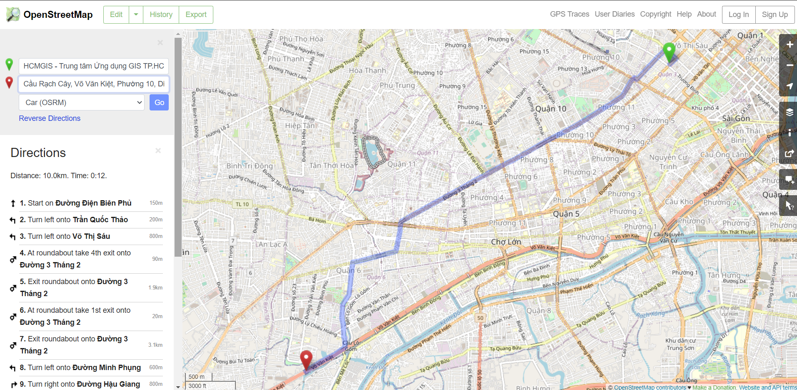

Hình 8.1 - Đường đi từ điểm A đến điểm B trong Openstreetmap


## Phân tích các khái niệm

Đây là một ví dụ cổ điển về sử dụng dữ liệu vector và nó được chia thành một số khái niệm sẽ được định nghĩa bên dưới.

Dữ liệu được sử dụng là dữ liệu không gian - nó có mội vị trí được xác định rất tốt trên trái đất, các thuộc tính của nó cũng được xác định rõ ràng. Do đó, một điểm có kinh độ, vĩ độ và tên thuộc tính name = Tan San nhot International Airport biểu diễn điểm bắt đầu A và một điểm thứ 2 với kinh độ, vĩ độ và thuộc tính name = Caravelle Hotel biểu diễn điểm kết thúc B. Các đường phố được biểu diễn bằng các line bao gồm các đoạn thẳng (segment) và đỉnh (vertice, được biểu diễn bằng các hình tròn nhỏ màu xanh trong Hình 8.2), với các thuộc tính như name, direction, speed limitation,... 


Hình 8.2 - Vector line thể hiện đường phố và bảng thuộc tính

Đường phố biểu diễn một mô hình mạng về cơ bản là một tập hợp các đối tượng điểm và đường được kết nối với nhau theo một cấu trúc liên kết. Kết quả của thuậ toán tính toán lộ trình từ điểm A đến điểm B - trong trường hợp này là từ sân bay đến khách sạn - phụ thuộc rất nhiều vào chất lượng của các dữ liêu vector, trong cả yếu tố hình họ - topology và thuộc tính - ví dụ như đối với đường một chiều hoặc 2 chiều thì kết quả lộ trình sẽ khác.

### Mô hình dữ liệu vector

Như đã giới thiệu trong Module 0, có 2 mô hình dữ liệu được sử dụng trong GIS: raster và vector. Dữ liệu không gian địa lý luôn bao gồm một thành phần **spatial** thể hiện vị trí hoặc phân bố không gian của sự vật/ hiện tượng v2 thành phần **attribute** để mô tả các thuộc tính của nó. Việc lựa chọn sử dụng mô hình raster hoặc vector cho một trường hợp cụ thể phụ thộc vào nguồn dữ liệu cũng như mục đích sử dụng.

Mô hình dữ liệu vector được dùng để biểu diễn vùng, đường và điểm (Hình 8.1)


Hình 8.1 - vector data với attribute table


### Metadata

Siêu dữ liệu Metadata là dữ liệu về dữ liệu. Nó mô tả, ở các mức chi tiết khác nhau về tập dữ liệu với cách thông tin như: Nhà cung cấp/ sở hữu dữ liệu, loại giấy phép sử dụng dữ liệu, ngôn ngữ của thuộc tính dữ liệu, hệ quy chiếu toạ độ, khu vực địa lý, thời điểm xuất bản, từ khoá, giới hạn, độ chính xác, phạm vi ban đầu của tập dữ liệu và nhiều thông tin khác.

Metadata là rất quan trọng vì hiểu biết rõ ràng về dữ liệu được sử dụng trong một phân tích cụ thể có thể tạo ra sự khác biệt giữa một quyết định đúng hay sai. Nếu ai đó phải xác định vị trí để đặt một bệnh viện mới, nhưng dữ liệu giao thông đã cũ và không phản ánh đúng thực tế, thì quyết định dựa trên dữ liệu này sẽ không chính xác. 

Do tầm quan trọng của metadata, các danh mục metadata (định nghỉa, tên, loại thông tin lưu trữ,...) tuân thủ các cấu trúc được định nghĩa rõ ràng và được chuẩn hoá. Các thông tin metadata được cấu trúc tốt có thể được tích hợp trong các danh mục chuyên dụng, cho phép người dùng tìm kiếm dữ liệu không gian địa lý chỉ bằng cách truy vấn các thông tin mà họ quan tâm mà không cần tự tải xuống và xem xét dữ liệu. Có nhiều dạnh mục metadata và, khi được chuẩn hoá, chúng có thể được truy cập thông qua các chức năng khác nhau trong các phần mềm GIS. Một ví dụ cho vấn đề này sẽ được trình bày trong Module 9 QGIS Plugins.

Cần phải nói thêm rằng metadata không chỉ chuyên dùng cho dữ liệu không gian địa lý mà nó áp dụng cho bất kì loại dữ liệu nào.


### Rational of vector processing

Sức mạnh của GIS nằm ở khả năng kết nối yếu tố hình học thể hiện các sự vật hiện tượng trho thế giới thực với các thuộc tính của nó - thông qua quan sát, đo lường hoặc tính toán - và cho phép thông qua các phần mềm chuyên dụng thực hiện các phép toán hình học, thuộc tính hoặc cả hai để thu được thông tin mới, có giá trị.

Mặc dù thông thường, GIS được kết hợp chặt chẽ với các bản đồ để hiển thị các thông tin địa lý, các chức năng của nó vượt xa việc chỉ tạo ra các trình diễn bản đồ, dù là bản đồ động hay tĩnh. 

**Spatial data analysis** - phân tích không gian (đồng nghĩa: spatial analysis, geospatial analysis, geographical analysis, spatial interaction) là một thuật ngữ chung, đề cập đến bất kỳ kỹ thuật nào được thiết kế để xác định các mẫu, phát hiện các bất thường và để kiểm tra các lý thuyết dựa trên dữ liệu không gian. Một phân tích được gọi là phân tích không gian khi và chỉ khi các kết quả phù hợp với việc chuyển vị trí của các đối tượng được phân tích, nói một cách đơn giản là **location matters**. Khi công nghệ thông tin phát triển, các nhà khoa học bắt đầu áp dụng nhiều công nghệ từ thống kê, hình học, topology và các ngành khoa học khác trong phân tích dữ liệu địa lý để nghiên cứu các mô hình và sự vật/ hiện tượng trên bề mặt trái đất.

**Geostatistics** - thống kê không gian là một nhánh của thống kê áp dụng cho dữ liệu không gian. Các phương pháp thường được áp dụng nhất liên quan đến phép nội suy, là một quá trình toán học cho phép ước tính các giá trị chưa biết dựa trên các giá trị đã biết.

**Topology** là một nhánh của toán học cho phép người dùng GIS kiểm soát mối quan hệ về mặt hình học giữa các đối tượng và đảm bảo tính toàn vẹn hình học. Topology được hiểu là một tập các luật để đảm bảo chất lượng dữ liệu, áp dụng trên cùng một hoặc nhiều vector layer. Các luật này được thiết kế theo hướng tôn trọng các mối quan hệ trong thế giới thực mà các vector layer này biểu diễn. Ví dụ, sẽ không có các lỗ hổng (gaps) giữa các polygon biểu diễn các thửa đất trong một khu vực, hoặc không có điểm nào thuộc vector layer thể hiện cây xanh độc lập có thể được chứa trong bất cứ polygon nào trong vetor layer biểu diễn cho các toà nhà.

Các phần mềm GIS cung cấp các chức năng cho phép người dùng định nghĩa các luật topology liên quan, cũng như các thuật toán để kiểm tra topology và làm sạch/ chỉnh sửa các lỗi topology của vector layer.

**Geoprocessing** - xử lý không gian là một thuật ngữ chung được dùng để định nghĩa bất cứ phép toán - quy trình nào áp dụng cho tập dữ liệu địa lý để thu được một tập dữ liệu mới, mở ra những hiểu biết mới về dữ liệu. Các phép toán xử lý không gian phổ biến như chồng lớp, chọn và phân tích, xử lý topology và chuyển đổi dữ liệu. Geoprocessing cho phép người dùng định nghĩa, quản lý và phân tích thông tin địa lý để hỗ trợ ra quyết định.


Hình 8.4 - Cấu trúc một geoprocessing


## Nội dung chính: 

### Phase 1: Hiểu dữ liệu của bạn.

Có nhiều phép toán geoprocessing có thể thực hiện trên vector data, phổ biến nhất bao gồm chồng lớp, chọn và phân tích đối tượng, xử lý topoplogy và chuyển đổi dữ liệu. Trong phase 1, chúng ta sẽ làm quen với một trong số phép toán này, hiểu cách chúng làm việc và những kết quả mà chúng ta có thể mong đợi.


#### **Bước 1. Chuẩn bị môi trường làm việc.**

Mở QGIS, thiết lập CRS mà bạn sẽ làm việc - EPSG 3405 - và thêm các layer sau:

*   Polygons - ranh giới hành chính; nhà; sử dụng đất
*   Lines - giao thông, thuỷ hệ
*   Points - cơ sở tôn giáo, địa điểm tham quan

Kết quả sau khi thêm vào QGIS như hình 8.5 (tất nhiên có thể QGIS tô màu khác nhau cho các layer) 

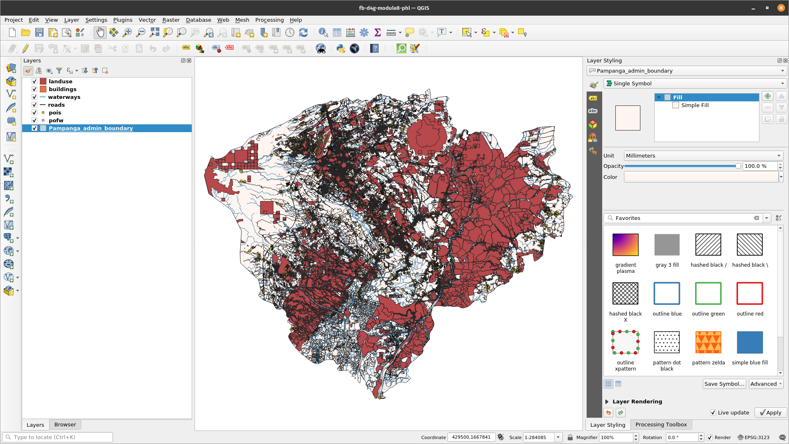

Hình 8.5 - Các lớp dữ liệu vector được tải: points, line và polygons

**Kiểm tra!** Tất cả các layer ở cùng CRS (EPSG 3405) bằng cách quan sát góc phải bên dưới trong giao diện QGIS. 

#### **Bước 2. Hiểu những gì bạn đang nhìn thấy.** 

Chúng ta đang có 7 layer được tải vào QGIS project. Bước tiếp theo sẽ giúp chúng ta hiểu dữ liệu của mình.

*   Kiểm tra số đối tượng có trong từng layer - có nhiều cách để làm việc này:

```
Kích đúp chuột vào layer - Properties - Information - Faeature count
Mở bảng thuộc tính và nhìn vào phía trên của bảng thuộc tính 
```

Trước khi chạy một số thống kê cơ bản, chúng ta hãy hoàn chỉnh bảng thuộc tính với một số thuộc tính hình học (xem lại Module 6)

*   Lớp giao thông - tính toán chiều dài của từng đường giao thông bổ sung vào bảng thuộc tính: output field name - length `round($length, 2)`
*   Lớp nhà - tính toán diện tích của từng căn nhà và bổ sung vào bảng thuộc tính; output field name - area `round($area, 2)`

Bây giờ bảng thuộc tính đã đầy đủ, nếu bạn chưa chắc chắn đơn vị tính QGIS sử dụng để tính toán chiều dài đường giao thông và diện tích của căn nhà, hãy kiểm tra lại CRS (CRS ở dạng Projected - hệ toạ độ phẳng) 

Kích chuột vào góc phải bên dưới của QGIS, EPSG 3405 để mở cửa sổ như hình 8.6

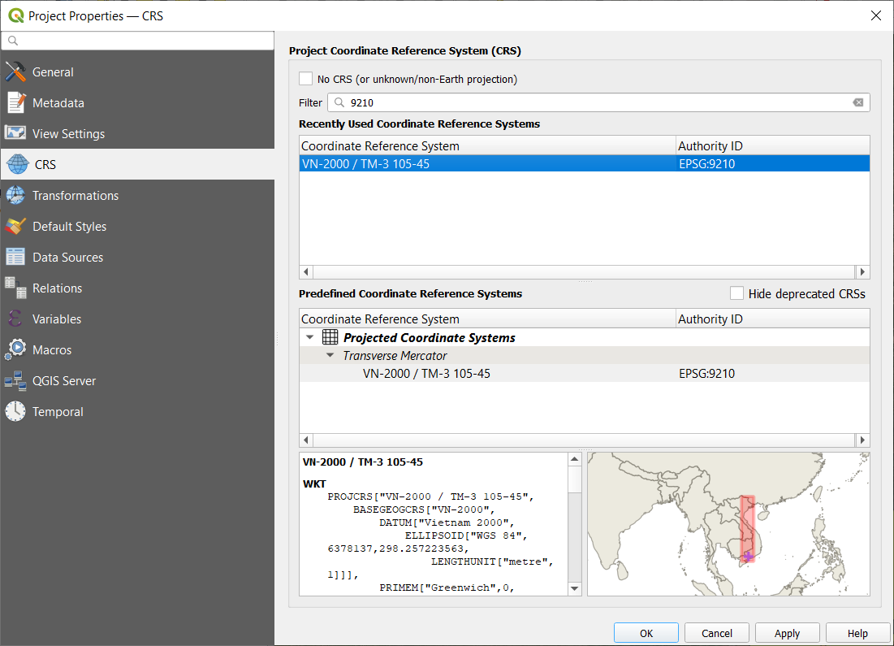

Hình 8.6 - Các thông số của CRS

Theo đó, chúng ta thấy rằng đơn vị đo lường là mét, nên chiều dài tính toán là mét và diện tích là mét vuông.

*   Chạy một số thống kê cơ bản trên các layer để hiểu hơn về dữ liệu của bạn (Hình 8.7)

```
Vector menu ‣ Analysis Tools ‣ Basic statistics for fields
Processing toolbox window ‣ tìm 'stats'
```


Hình 8.7 - Các thống kê cơ bản cho thuộc tính

Kết quả thống kê tuỳ thuộc vào loại trường dữ liệu chúng ta chọn và được tạo dưới dạng HTML file

Hãy chạy thống kê trên lớp giao thông và xem kết quả. Nhập các thông số như hình 8.8.


Hình 8.8 - Chuẩn bị chạy thống kê cơ bản cho lớp giao thông

File đầi ra ở dạng HTML, có thể mở bằng các trình duyệt như Firefox, Chrome, Safari,... như hình bên dưới:

```
Analyzed field: length
Count: 64473
Unique values: 33106
NULL (missing) values: 0
Minimum value: 0.04
Maximum value: 19690.45
Range: 19690.41
Sum: 13927358.250000086
Mean value: 216.01846121632445
Median value: 111.18
Standard deviation: 372.48583667812585
Coefficient of Variation: 1.724324090546652
Minority (rarest occurring value): 0.04
Majority (most frequently occurring value): 0.55
First quartile: 51.03
Third quartile: 239.99
Interquartile Range (IQR): 188.96
```


Từ các thống kê cơ bản này, chúng ta thấy rằng có 64473 đường giao thông trong lớp giao thông, với đường ngắn nhất là 0.04m và đường dài nhất là longest 19690.45m. Chúng ta thấy rằng tổng số lượng đường giao thông tại Tp.HCM là khoảng ...km. Giả sử giá trị trung bình mean lớn hơn trung vị median, nó cho chúng ta thấy rằng nửa trên của tập dữ liệu chứa các đoạn đường dài hơn và lớn hơn các đoạn đường ở nửa đầu. Tuy nhiên, giá trị trung vị median cho thấy hầu hết các đoạn đường có độ dài khoảng ....m

Chạy các thống kê cơ bản cho lớp nhà cho trường type, chúng ta có kết quả như sau:

```
Analyzed field: type
Count: 827657
Unique values: 74
NULL (missing) values: 773210
Minimum value: Brgy. San Vicente
Maximum value: yes;house
Minimum length: 0
Maximum length: 20
```

Mean length: 0.3669563599413767

Kết quả trông không giống bên trên, chúng ta không có mean, median hoặc standard deviation. Điều này là do trường thuộc tính mà chúng ta chạy thuật toán khác nhau - kiểu chuỗi so với kiểu số - trong trường hợp này là loại nhà. Chúng ta thấy rằng có ..... căn nhà ở Tp.HCM, trong đó có ..... căn nhà không có thông tin loại nhà, đồng thời có .... loại nhà khác nhau. 

#### **Bước 3. Các kiểm tra cơ bản để tìm nhanh các lỗi trong dữ liệu.**

Các tập dữ liệu hoàn hảo giống như khí lý tưởng trong vật lý. Không có điều gì là hoàn hảo, chỉ là gần hảo mà thôi. Do đó, trước khi thực hiện bất cứ phân tích nào để trích lọc thông tin, ít nhất một số kiểm tra cơ bản là cần thiết để _làm sạch_ dữ liệu.   

Có nhiều loại lỗi có thể ảnh hưởng đến châ1t lượng dữ liệu, trong trường hợp phân tích không gian, ảnh hưởng của chúng lên kết quả cuối cùng có thể quan trọng ít nhiều. Ví dụ, nếu bạn sử dụng dữ liệu không gian địa lý để tìm lộ trình từ điểm A đến điểm B bằng ô tô, thì việc có lớp giao thông hoàn chỉnh với các thuộc tính như đường một chiều hoặc đườc cấm là rất cần thiết để có một kết quả khả thi. Tuy nhiên, nếu là lộ trình đi bộ, thì các thông tin này là không quan trọng. 

Khi nói đến lỗi dữ liệu không gian, có 02 khái niệm cần nắm rõ:

**Accuracy - Độ chính xác** là mức độ mà thông tin trên bản đồ khớp với các giá trị trong thế giới thực về cả không gian và thuộc tính

**Precision - Độ chính xác phép đo** đề cập đến mức độ đo lường và độ chính xác của mô tả trong tập dữ liệu không gian địa lý

**An error - lỗi** bao gồm cả imprecision và inaccuratacy. **Data quality - Chất lượng dữ liệu** đề cấp đến mức độ của precision và accuracy của tập dữ liệu và nó thường được thể hiện trong các báo cáo chất lượng dữ liệu. 

Phân tích và _làm sạch_ một tập dữ liệu không gian địa lý có thể rất tốn thời gian và nặng nề, tuy nhiên - như trong ví dụ trên -  nó rất quan trọng. Phần này trình bày một số chức năng GIS cho phép người dùng thực hiện các kiểm tra nhanh trên dữ liệu vector và đưa ra một số kết luận sơ bộ về chất lượng dữ liệu.

**Kiểm tra Topology.**

QGIS cung cấp chức năng cho phép người dùng thực hiện một chuỗi các kiểm tra topology trên các tập dữ liệu được tải trong QGIS, được gọi là Topology Checker. Nó có thể được kích hoạt từ panels (Hình 8.9.a) và sau khi được kích hoạt như Hình 8.9.b


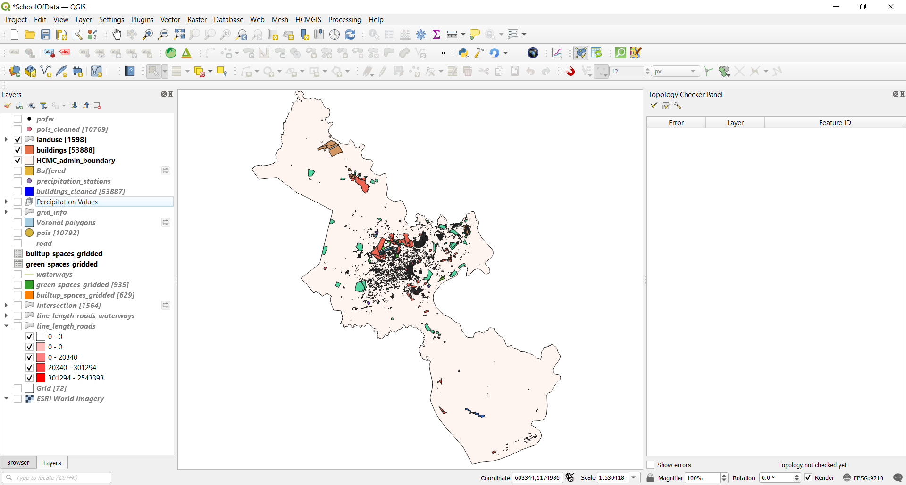


Hình 8.9.a - Topology checker panel; b - Topology checker window

Để định nghĩa các luật topology, kích chuột vào icon thứ ba để mở cửa sổ như Hình 8.10


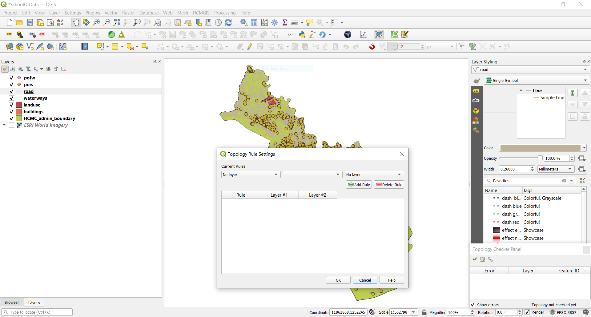

Hình 8.10 - Topology rule settings window

Chúng ta sẽ thiết lập một số luật cho các layer đã tải vào QGIS project, xem xét các đối tượng trong thế giới thực mà chúng mô tả - giao thông, nhà, thuỷ hệ.

Cấu hình Topology rất đơn giản, vì các luật có thể được áp dụng tuỳ theo layer được chọn từ danh sách các layer có trong project, như hình 8.11


Hình 8.11 - Topology rules dropdown theo các layer được chọn 

Chọn các luật topology được mô tả trong hình 8.12, sau đó chọn icon thứ nhất trong cửa sổ để chạy và đợi xem kết quả.


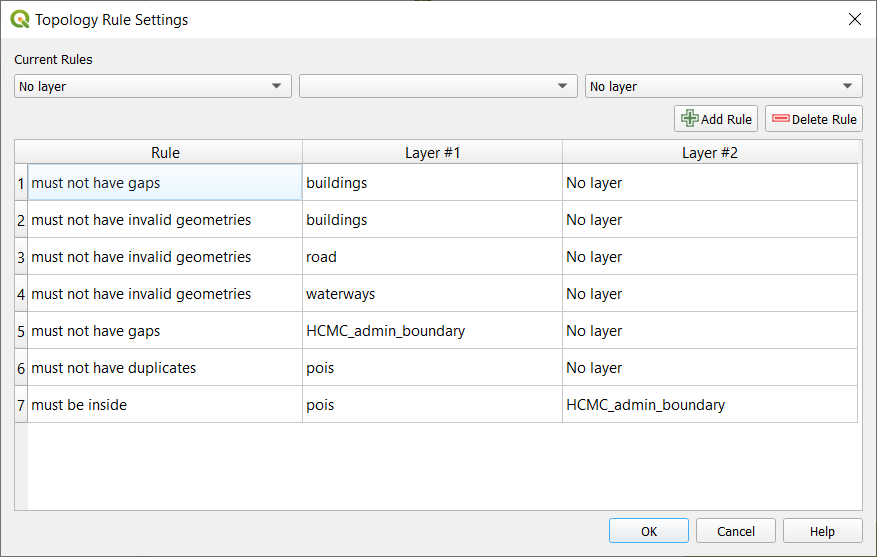

Hình 8.12 - Chọn các luật topology

Sau khi chạy topology check như hình 8.13


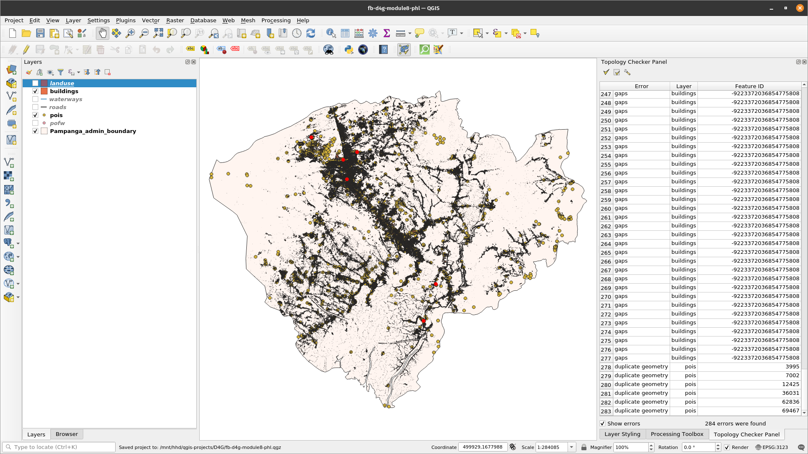

Hình 8.13 - Kết quả kiểm tra Topology

Ở phía góc dưới bên phải, cửa sổ topology checker liệt kê tất cả các lỗi được xác định dựa trên các luật mà chúng ta đã định nghĩa ở bước trên. Nếu chọn "Show errors", các lỗi sẽ được tô màu đỏ trong map canvas. Kích đúp chuột vào một lỗi để di chuyển nhanh đến vị trí lỗi trên bản đồ.

Quy trính để chỉnh sửa các lỗi dữ liệu, có thể là lỗi hình học (duplicates, gaps,...) hoặc lỗi thuộc tính (nhập thiếu, lỗi chính tả,...) được gọi là làm sạch dữ liệu - rất cần thiết nhưng cũng mất thời gian. Mặc dù có các chức năng hỗ trợ làm sạch bán tự động, thường cần phải có sự can thiệp của người dùng. Ví dụ, trong Hình 8.14, chúng ta đã zoom tới một lỗi trong lớp POI (Điểm tham quan), một điểm bị trùng lặp (duplicated). Có thể thấy rằng, có 02 điểm đều là một quán cafe, sự khác biệt nằm trong bảng thuộc tính - có 01 điểm thực sự là quán cafe và một là “doityourself”.

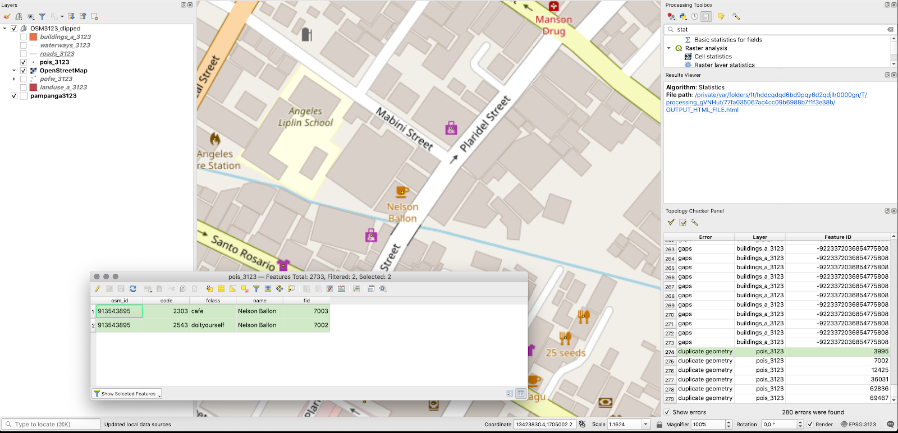

Hình 8.14 - Lỗi duplicated của lớp POI

Trong trường hợp cụ thể này, quyết định của người dùng có thể là xoá điểm duplicated này, vì nó có thể phát sinh lỗi cho các phân tích không gian sâu hơn. Ví dụ, nếu nhà quản lý muốn biết có bao nhiêu nhà hàng và cafe trong một khu vực nào đó, thì điểm duplicate này sẽ phát sinh lỗi trong kết quả phân tích và có thể dẫn đến các quyết định sai lầm.

Do đó, chúng ta sẽ xử lý các điểm trùng lặp này một cách tự động bằng chức năng có sẵn của QGIS - Delete duplicate geometries - trong processing toolbox, như Hình 8.15


Hình 8.15 - Delete duplicate geometries cho lớp POI

Sau khi chạy thuật toán, cửa sổ hiển thị kết quả, nó chỉ ra ....điểm trùng lặp, giống như công cụ topology checker, và nó thông báo đến người dùng là đã xoá tất cả các điểm trùng lặp, do đó lớp POI lúc này chỉ còn .... đối tượng


Hình 8.16 - Kết quả delete duplicate geometries

Lúc này, chạy lại topology checker với luật topology là "no geometric duplicates" cho lớp POI sẽ cho kết quả là 0 errors

**Lưu ý!** Thuật toán chỉ quan tâm đến yếu tố hình học **only geometries**, không quan tâm đến thuộc tính. Nếu trong trường hợp thuộc tính của các điểm duplicate này là khác nhau, người dùng sẽ không thể lựa chọn nên giữ lại đối tượng nào. Do đó, nếu muốn tất cả các thông tin được giữ lại, đầu tiên nó cần phải được sao chép vào tất cả các đối tượng, nên khi một đối tượng trùng lặp bị xoá thì không bị mất thông tin.

Chúng ta hãy chạy một topology check khác cho lớp nhà. Cấu hình các luật sau đây:

*   No duplicate
*   No invalid geometries

Chạy thuật toán. 

Kết quả như Hình 8.17. 


Hình 8.17 - Kết quả topology check cho lớp nhà

Xoá các đối tượng trùng lặp theo cách đã làm bên trên (Hình 8.18)


Hình 8.18 - Kết quả Delete duplicate geometries


#### **Bước 4. Xem kĩ hơn thông tin đính kèm với các lớp point, line và polygon.**

Hãy chạy thêm một thuật toán để cho biết các thuộc tính của các lớp dữ liệu là gì. Sau khi chúng ta xác định số lượng đối tượng trong từng layer, hãy xem có bao nhiêu giá trị duy nhất ứng với các thuộc tính sau:

*   layer buildings_a_3405_cleaned - attribute type;
*   layer Pois_3405_cleaned - attribute fclass;
*   layer waterways_3405 - attribute fclass;
*   layer pofw_3405 - attribute fclass;
*   layer roads_3405 -attribute fclass;
*   layer landuse_a_3405 - attribute fclass;

Truy cập `Vector ‣ Analysis Tools ‣ List unique values (Hình 8.19)`


Hình 8.19 - Liệt kê các giá trị duy nhất trong vector layer

Lần lượt thêm vào các layer và thuộc tính theo danh sách bên trên, kết quả như sau:

<table>
  <tr>
   <td><strong>Layer name</strong>
   </td>
   <td><strong>No. of unique values</strong>
   </td>
   <td><strong>Unique values</strong>
   </td>
  </tr>
  <tr>
   <td>buildings_a_3123_cleaned
   </td>
   <td>74
   </td>
   <td>'military;parking;gymnasium;mosque;yes;house;NULL;track;college;Idelfonso '
<p>
'Tuazon Str;terrace;with '
<p>
'roof;construction;veterinary;gazebo;hut;connector_bridge_sky;barn;roof;Yakult;kindergarten;hospital;pharmacy;laboratory;apartments;multipurpose;public;warehouse;farm;quarry;school;footway;Not_sure.;temple;service;garage;office;allotment_house;train_station;commercial;transportation;industrial;storage_tank;hotel;marketplace;farm_auxiliary;university;Unsure_-_please_chec;power_substation;clinic;hall;hangar;greenhouse;gawad '
<p>
'kaling phase 1;tennis;church;Brgy. San '
<p>
'Vicente;fire_station;toilets;civic;pumping_station;retail;residential;shed;chapel;supermarket;clubhouse;dormitory;Pineda '
<p>
'Residence;government;carport;manufacture;garages;motorway;house
   </td>
  </tr>
  <tr>
   <td>pois_3123_cleaned
   </td>
   <td>105
   </td>
   <td>alpine_hut;artwork;bicycle_shop;comms_tower;college;chalet;beverages;tourist_info;veterinary;hunting_stand;greengrocer;gift_shop;food_court;restaurant;ruins;pharmacy;bank;fountain;convenience;monument;clothes;caravan_site;cafe;camera_surveillance;recycling;atm;furniture_shop;sports_shop;post_office;hospital;viewpoint;guesthouse;kindergarten;cinema;biergarten;garden_centre;doityourself;florist;lighthouse;fast_food;butcher;mobile_phone_shop;sports_centre;nightclub;motel;department_store;graveyard;fire_station;bar;car_rental;shoe_shop;stationery;golf_course;picnic_site;post_box;pitch;theatre;recycling_metal;playground;school;shelter;stadium;computer_shop;toy_shop;doctors;beauty_shop;bakery;kiosk;hostel;recycling_glass;laundry;pub;bicycle_rental;water_well;archaeological;nursing_home;swimming_pool;camp_site;town_hall;supermarket;toilet;bookshop;water_tower;park;courthouse;telephone;attraction;memorial;library;optician;mall;hotel;travel_agent;car_dealership;observation_tower;video_shop;tower;water_works;dentist;police;community_centre;car_wash;bench;hairdresser;museum
   </td>
  </tr>
  <tr>
   <td>waterways_3123
   </td>
   <td>4
   </td>
   <td>'river;canal;drain;stream'
   </td>
  </tr>
  <tr>
   <td>pofw_3123
   </td>
   <td>5
   </td>
   <td>'christian_evangelical;christian_methodist;buddhist;christian_catholic;christian'
   </td>
  </tr>
  <tr>
   <td> roads_3123 
   </td>
   <td>25
   </td>
   <td>'secondary;trunk;track;bridleway;primary;tertiary;path;track_grade2;steps;footway;cycleway;trunk_link;track_grade4;unclassified;service;primary_link;pedestrian;unknown;tertiary_link;secondary_link;living_street;track_grade5;residential;motorway_link;motorway'
   </td>
  </tr>
  <tr>
   <td>landuse_a_3123
   </td>
   <td>19
   </td>
   <td>'military;park;forest;cemetery;recreation_ground;nature_reserve;heath;farmland;quarry;commercial;vineyard;industrial;scrub;orchard;grass;farmyard;meadow;retail;residential'
   </td>
  </tr>
</table>


Bảng 8.1 - Bảng liệt kê số lượng của từng giá trị duy nhất ứng với từng thuộc tính được chọn

Để phân tích sâu hơn các thuộc tính của vector layer, chúng ta sẽ sử dụng GroupStats plugin. Nó được phát triển để hỗ trợ các tính toán thống kê cho các nhóm đối tượng trong một vector layer, rất hữu dụng để hiểu thêm về dữ liệu cũng như phát hiện các lỗi có thể có trong các thuộc tính

Vào  `Vector ‣ GroupStats ‣ GroupStats`. 

Một cửa sổ mới được mở ra như Hình 8.20


Hình 8.20 - GroupStats window

Đối với mỗi phân tích đã thực hiện trước đây, chúng ta thấy rằng đối với lớp nhà, chúng ta có .... loại (type), nhưng mỗi loại có bao nhiêu đối tượng và diện tích xây dựng cho mỗi loại? Có bao nhiêu không gian cho trường học, chợ, nhà ở? GroupStats có thể giúp chúng ta trả lời câu hỏi này. Ở bên phải cửa sổ, có một control panel để chọn các thông tin cần tính toán cũng như cách sắp xếp dữ liệu. Sử dụng kéo - thả, theo sự sắp xếp trong Hình 8.21, và chọn calculate


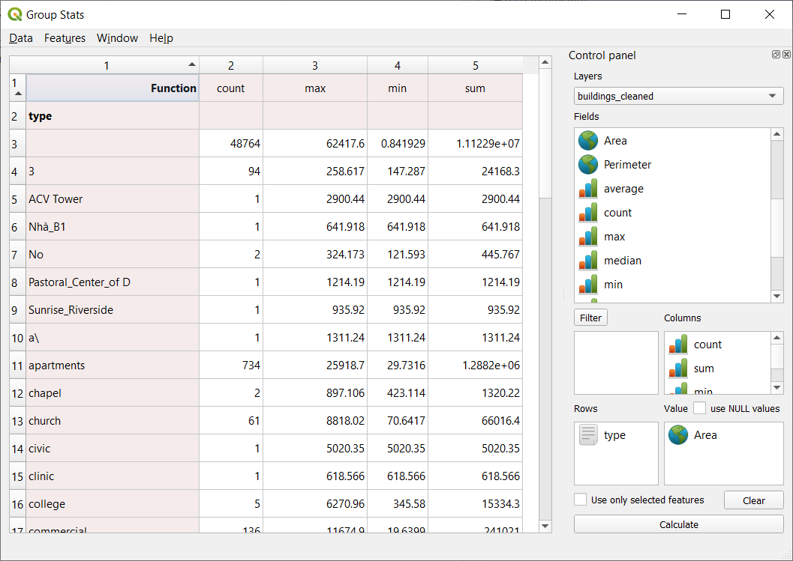

Hình 8.21 - Chạy GroupStats cho lớp nhà. 

Nhìn vào kết quả, chúng ta có thể trích lọc các thông tin quan trọng từ dữ liệu. Ví dụ, cho mục đích đất ở, chúng ta có ....toà nhà với tổng diện tích xây dựng là.... m2, khoảng....ha. Chúng ta cũng thấy rằng toà nhà lớn nhất có diện tích ....m2, toà nhà nhỏ nhất có diện tích ...m2. Và chúng ta có thể tiếp tục phân tích cho các thông tin giá trị hơn nữa.

Một phân tích thú vị khác có thể chạy trên lớp giao thông. Hình 8.22 cho thấy cách tính toán chiều dài của các đường giao thông theo từng loại đường khác nhau (primary, residential, motorway,...) và tốc độ tối đa cho phép.


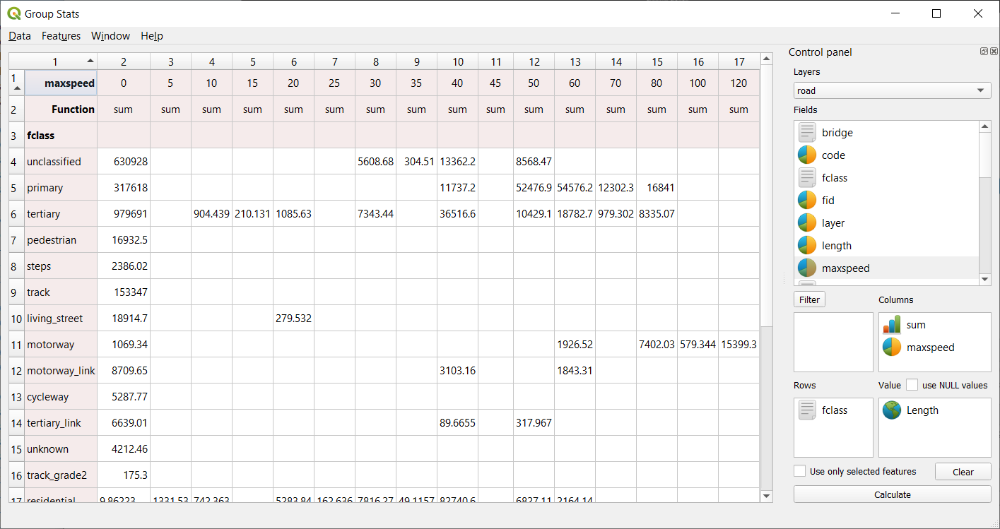

Hình 8.22 - Chạy GroupStats cho lớp giao thông. 


#### **Câu hỏi**

1. Metadata có quan trọng không? 
*   _<span style="text-decoration:underline;">Yes, because it gives insight into the geographical data that otherwise one could not gain. </span>_
*   _No, it’s just bureaucracy. _
2. Topology is relevant to the geometry or to the attribute table of a vector layer?
*   _to the geometry of the vector layer. _
3. What is more important, the geometry or the attribute data? 
*   _Geometry._
*   _Attribute data._
*   _<span style="text-decoration:underline;">Both.</span>_


### **Phase 2: Giới thiệu vector processing **

Phase 1 của Module này đã giới thiệu ngắn gọn các bước để người dùng có được những hiểu biết căn bản về dữ liệu không gian của mình. 

Phase 2 sẽ hướng dẫn bạn sâu hơn về xử lý dữ liệu vector để trích lọc các thông tin giá trị, hỗ trợ ra quyết định. Theo các khái niệm đã được trình bày trong phần đầu của Module, geoprocessing là bất cứ xử lý nào áp dụng cho dữ liệu địa lý nhằm thu được một tập dữ liệu dẫn xuất, mở ra những hiểu biết mới về dư4 liệu. Và đây là những gì chúng tôi cố gắng thực hiện trong phần tiếp theo. 

Có nhiều phép toán có thể thực hiện trên một hoặc nhiều tập dữ liệu không gian và trong bước đầu tiên này, chúng ta sẽ chạy một số phép xử lý thông dụng nhất để hiểu cách hoạt động của nó.

**Buffer.** Hãy tưởng tượng bạn cần phân tích một điều luật mới yêu cầu rằng trong vòng bán kính 30m tính từ cơ sở tôn giáo thì không cho phép công trình xây dựng nào khác. Bạn sẽ muốn xem chính xác những khu vực này là gì và có thể thậm chí nó chiếm diện tích bao nhiêu. Bước đầu tiên là định nghĩa một buffer - vùng đệm xung quanh các cơ sở tôn giáo: `Vector ‣ geoprocessing tools ‣ buffer. ` và nhập các thông số như hình 8.23:


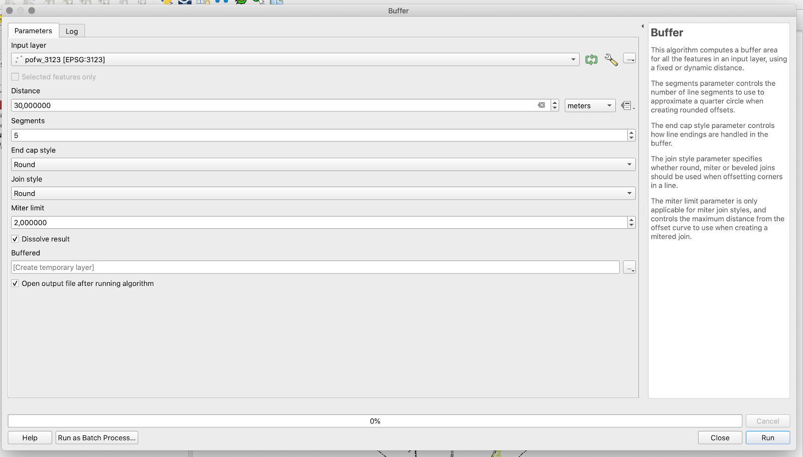

Hình 8.23 - Nhập thông số 30m buffer xung quanh cơ sở tôn giáo

Chi tiết kết quả trong hình 8.24:


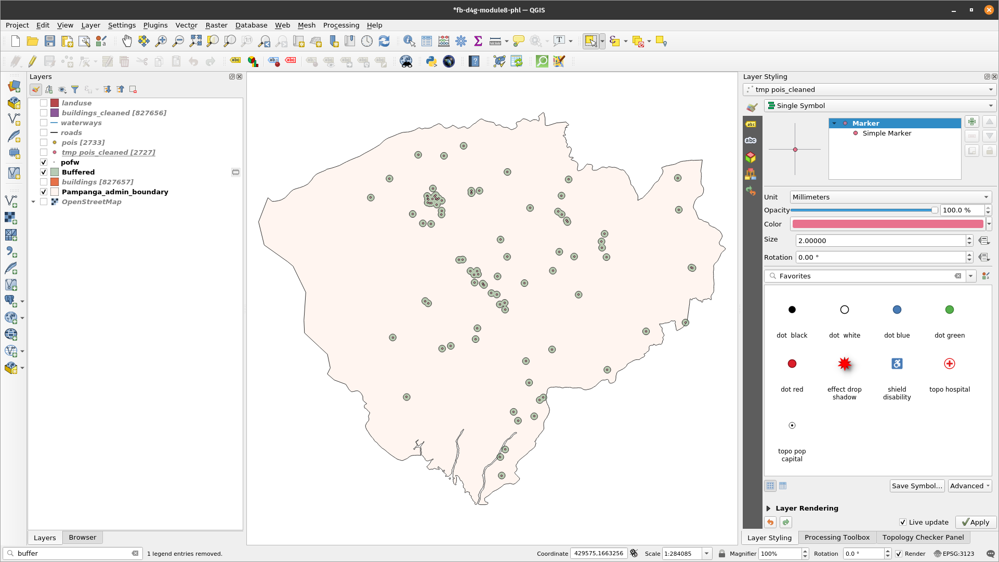

Hình 8.24 - Chạy buffer trên một lớp điểm

Để hoàn tất trả lời cho câu hỏi ban đầu, bước tiếp theo là tính diện tích của tất cả các buffer và tính tổng của chúng (xem Phase 1, bước 4) - hình 8.25


Hình 8.25 - Tính diện tích cho lớp buffer vừa tạo, sau đó sử dụng GroupStats để tính tổng diện tích.

**Clip.** Hãy tưởng tượng bạn muốn biết tất cảc các khu công nghiệp trong khu vực và bao nhiêu toà nhà trong phạm vi đó. Kiểm tra trực quan dữ liệu vector, bạn thấy rằng có một số khu công nghiệp chứa một số toà nhà. Bạn muốn tách các toà nhà và sử dụng chúng sau này. Đầu tiên là chọn tất cả các đối tượng trong lớp landuse_a_3405 có thuộc tính industrial (Xem lại Module 6). Sau đó, vào `Vector ‣ Geoprocessing tools ‣ Clip ` và chọn layer được clip là buildings_a_3405_cleaned. Kết quả như Hình 8.26


Figure 8.26 - Reduced selection of a few buildings and industrial landuse, so the computation can finish faster. 

Sau khi chạy thuật toán, kê1t quả sẽ như hình 8.27. Các toà nhà được clip có màu hồng. Trong phạm vi, chúng ta đã chọn có ... toà nhà chiếm diện tích khoảng ...ha. Vậy có bao nhiêu toà nhà công nghiệp bạn đã clip?


Hình 8.27 - Kết quả của chức năng clip

**Thiessen (Voronoi) polygons.** Hãy tưởng tượng bạn phải đưa ra một loạt các quyết định hành chính dựa trên số lượng trường học và phạm vi đáp ứng của chúng trong khu vực. Phân tích không gian có thể hỗ trợ điều này. Bạn có thể bắt đầu bằng việc tính toán Thiessen polygon. Dựa trên một khu vư5c chứa ít nhất 2 điểm, một Thiessen Polygon là một đối tượng hình học 2 chiều có ranh giới chứa tất cả các 
Imagine you have to make a series of administrative decisions in your district based on how many schools there are and what specific areas they serve. Geospatial analysis can be of assistance. You can start by calculating the Thiessen polygons. Based on an area containing at least two points, a Thiessen Polygon is a 2-dimensional shape which boundaries contain all space which is closer to a point within the area than any other point without the area. A good use example is in meteorology, where weather stations are discrete points, yet the information collected is considered to be measured out on the surface based on the thiessen polygons. 

To respond to the above question, we will run the algorithm only for points that have the attribute school at type. Thus, make the selection as instructed in module 6. You should have 88 features selected on layer pois_3123_cleaned. Go to `Vector ‣ Geometry Tools ‣ Voronoi Polygons..` After setting the parameters - select the point layer for which we want the Voronoi polygons calculated and a 30% extension so that the entire Pampanga province is contained, you should see a result like in figure 8.28. 


 polygons algorithm to a point vector layer")

Figure 8.28 - Results of applying Thiessen (Voronoi) polygons algorithm to a point vector layer

Sometimes, the necessities impose the requirement of having information in smaller, clearly defined and equal areas and not for an entire large region, such as a country or a big city. Therefore, the data needs to be analysed and visualised in a sliced, well-defined way, allowing comparison that otherwise could prove difficult without a ground common reference. 

Let us assume that you have to present a report that will allow comparisons done for units of 10X10 km over the administrative unit, including: 

1. density of green spaces (parks, forests) in report to the built-up space per unit;
2. total length of streets for each unit;
3. total length of waterways for each unit;
4. total number of public buildings for each unit (schools, kindergartens, hospitals , town halls etc.).

We’ve seen that there are tools that can assist us in calculating the total surface occupied by a certain type of feature, however the first step is to create our 10X10 units - cell grids. To do that, go to: `Vector ‣ Research Tools ‣ Create grid.. `Set the parameters to: grid type - Rectangle (polygon), Horizontal spacing - 10 km, Vertical spacing - 10 km and you should get a result like in figure 8.29. 


Figure 8.29 - Creating a 10X10km vector grid for the Pampanga province

Going further in answering the questions in our exercise, we need to do the following:

1. green spaces (parks, forests) built-up space per unit ratio:

Green spaces and built-up spaces is data contained by the landuse_a_3121 vector layer, polygon type. To know exactly what are the ‘green spaces’ we need to see what are the categories enclosed in the dataset. For that, we run `List unique values` algorithm on the `fclass` attribute and find out that we have the following ‘green’ classes: meadow, grass, nature_reserve, park, forest and the following ‘built-up space’ classes: retail, commercial, industrial,  residential.  Figure 8.30 presents a visualisation of our selections: 


Figure 8.30 - Spatial distribution of the green areas and built-up space in Pampanga 

The second step to answer the requirement, is to identify how much green space and how much built-up space there is in each 10X10 km. To obtain that we will **intersect** the 2 overlaid polygon vector layers. The algorithm extracts the overlapping portions of features in the Input - the landuse layer and Overlay layer - the grid layer. Go to `Vector - Geoprocessing Tools - Intersect.. `Set the algorithm parameters as in figure 8.31.


Figure 8.31 - Parameters for the intersect algorithm

The result should look like in figure 8.32. Please, take note that the intersection algorithm was applied to the entire landuse_a_3123 layer, which contains more features than just the ones we selected for our exercise. 


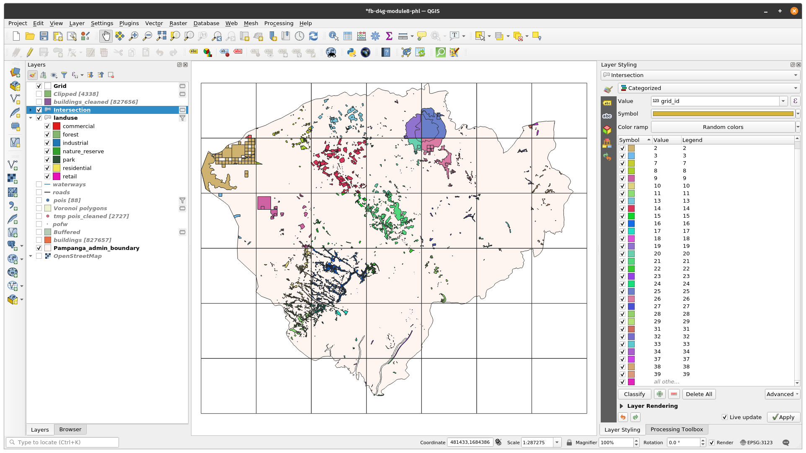

Figure 8.32 - Result of running the intersection algorithm to clip the landuse vector polygons to the grid layer. 

Now for each 10X10 km unit, we have the landuse features that we can work with. The attribute table also stores this information, as each grid cell - unit - has a unique id, see figure 8.33. 


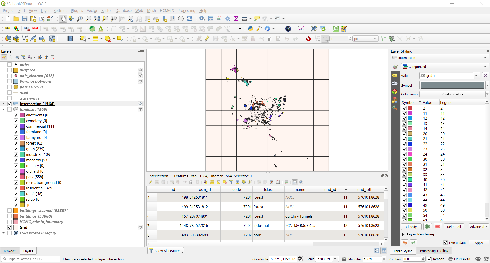

Figure 8.33 - Landuse features clipped per each grid cell and it's associated attribute table. 

Now, that we have all landuse features per 10X10 km unit, we will continue with separating the geometries of the ones that make up the green space and built-up space as defined earlier - for each grid cell.  Thus, for green space, we will select all features that have the attribute value for `fclass: `meadow, grass, nature_reserve, park, forest. In attribute table, in the expression filed write down: ` "fclass" =  'meadow' or  "fclass" =  'grass' or  "fclass" =  'nature_reserve' or  "fclass" =  'park' or  "fclass"  =  'forest'` and export selected features as green_spaces_gridded  (see module 6 for more details). Your new output should have 820 features. Do the same for the built-up space. Select the features in landuse_a_3123 that have the attribute value for `fclass` the following: retail, commercial, industrial,  residential, by writing the following expression in the Expression based filter window: `"fclass" =  'retail' or  "fclass" =  'commercial' or  "fclass" =  'industrial' or  "fclass" =  'residential'. `Select the filtered geometries and export as builtup_spaces_gridded. Your new output should have 3849 features. Next, calculate the area occupied by each feature of the 2 layers. Go to the attribute table of each layer and then add the geometric column area by inserting the expression `round($area,2) `in the field calculator.  (see module 6 for details, if needed). However, the 10X10km grid of the Pampanga province has a known number of grid cells, and that is 42. Therefore, we need to summarise the areas for all types of green spaces (forests, parks etc.) an built-up spaces (commercial, residential etc.) and join it accordingly to all of the 42 grid cells. To do this, we will use the **GroupStats** plugin to sum up for each grid_id all the green categories, respectively all the built-up categories. For the green_spaced_gridded vector layer, set the parameters as in figure 8.34. 


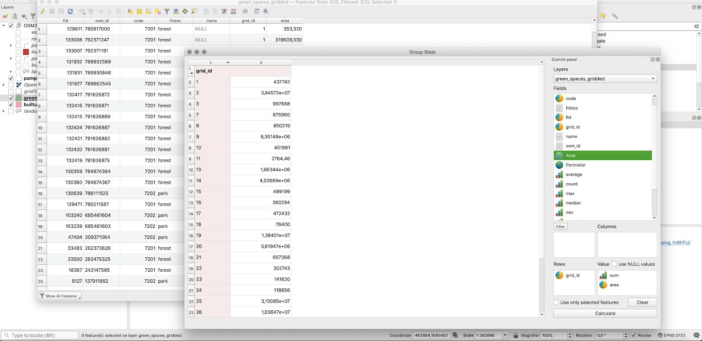

Figure 8.34 - GroupStat parameters setup to sum up the green areas per each 10X10km grid cell.

Afterwards, save the results as a .csv file named green_spaces_gridded. Go to `Data - Save all to CSV file. `

Run GroupStats for the built-up space in the same manner and then save it as a csv file named builtup_spaces_gridded. 

Next, we will bring the 2 csv files calculated with GroupStat into QGIS  (`Layer - Add layer - Add delimited text layer` - see more details in module 2).  Moving forward, we need to join the calculated spaces - green and built-up - to each 10X10 km cell grid. For that, select the grid10km vector layer in the TOC, open the properties window and go to `Joins. `This functionality allows you to join by a common attribute field, others. In our case, using the common grid_id value we will join, the sum of the built-up areas and green spaces fro the 2 csv files obtained in the previous stage.

In the **Join** window, push on the green plus button below and set the parameters like in figure 8.35, for green spaces. Then repeat for built-up spaces. 


Figure 8.35 - Setting the parameters to join by common field grid_id/id the sums of green and built-up spaces for each grid cell - 10X10km unit.

The results of the two joins are visible in the attribute table, as can be seen in figure 8.36. We have kept the grid_id in both joins, to be sure no mistakes occurred. We can visually quickly check to make sure the 3 attribute fields: id, builtupgrid_id and greengrid_id are exactly the same. 


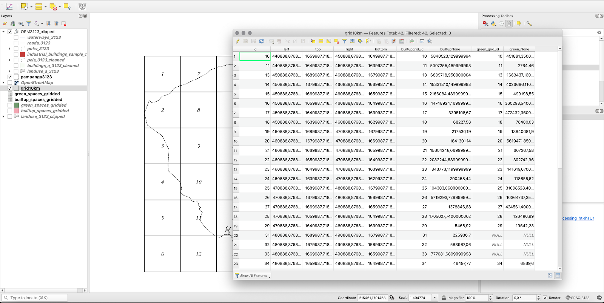

Figure 8.36 - Attribute table of the grid10km vector layer containing the total areas for green and built-up spaces. 


As we have gathered all the needed information for green and built-up spaces in the attribute table of the grid layer, all we need to do is calculate the percentage of these spaces within the 10X10 km grid cell. We will calculate it using the field calculator, using the following expression: `round(100*green_None/100000000,5)` and `round(100*builtupNone/100000000,5).` Next, we add a new field in which we calculate the report of the GreenPre/BuilupPer, and thus reaching the answer to our request: green spaces (parks, forests) built-up space per unit ratio: `round( "greenPer" / "builtupPer" , 5).` To have a clear overview of our dataset, in cases where there is no built-up space in the grid cell - we insert the value 1000 in the attribute table, in cases where there is no green space, we will insert value 999. The final result would look like in figure 8.37. 


Figure 8.37 - Spatial distribution of the green vs built-up spaces ration per 10X10 km in Pampanga

2. total length of streets and waterways for each unit;

To accomplish this task, QGIS offers an algorithm that takes a polygon layer and a line layer and measures the total length of lines and the total number of them that cross each polygon. The resulting layer has the same features as the input polygon layer, but with two additional attributes containing the length and count of the lines across each polygon. Go to `Analysis Tools - Sum Line Lengths` and set the parameters as follows: polygons - grid10km, lines - roads_3123, lines length field name - roadsL, lines count field name - roadsC. You can create a temporary layer or save it as a file on your computer. If for representation, you use natural breaks, your map should look like în figure 8.38. 


Figure 8.38 - Spatial distribution of 10X10km units with most roads

Now, repeat the same processing for waterways lengths in each grid cell. Running the process on the grid file obtained earlier will help you in having all information obtained so far attached to the same geometry. We advise you save this file on your computer with line_lengths_gridded.  If for representation, you use natural breaks, your map should look like în figure 8.39.


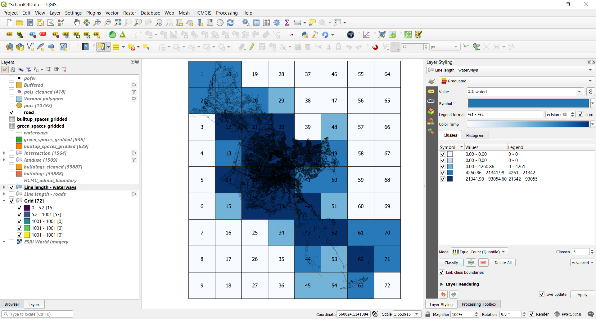

Figure 8.39 -  Spatial distribution of 10X10km units with most waterways 

3. total number of public buildings for each unit (schools, kindergartens, hospitals , town halls etc.).

To count the total number of public buildings in the 10X10 unit, we will use the pois_3123_cleaned. First, we run` List unique values.. (Analysis Tools)` and decide which building we consider public.  We will select from our vector point data layer the following features: `"fclass" = 'town_hall' or "fclass" = 'kindergarten' or "fclass" = 'hospital' or "fclass" = 'doctors' or "fclass" = 'fire_station' or "fclass" = 'community_centre' or "fclass" = 'stadium' or "fclass" = 'museum' or "fclass" = 'school' or "fclass" = 'theatre'. `Your selection should have 246 features in total. To answer our request, we will use `Count point in polygon `algorithm, available under `Analysis Tools`. This algorithm takes a points layer and a polygon layer and counts the number of points from the first one in each polygons of the second one. A new polygons layer is generated, with the exact same content as the input polygons layer, but containing an additional field with the points count corresponding to each polygon. Set the point layer to pois_3123_cleand and the polygon layer the grid layer with the calculated information in the previous round. For the points, check the `Selected features only` checkbox, so the algorithm calculates only the selected points - the public buildings. Save the output file as grid_info. 


Figure 8.40 - Spatial distribution of public buildings density per unit 10X10km


#### **Quiz questions**

Q: If I have 2 vector layers - one represents the extent of the city where I am working and the second, the built roads in the entire country - what processing tool would I use to extract only the roads in my city: buffer or clip? 

A: Clip. 

Q. Is the buffer tool useful in the following case: I have a polygon vector layer with historic monuments in my region and I want to draw a 50m protection area around them? 

A: Yes

Q: Which one of the three geoprocessing tools would you use to merge two similar vector layers ? Voronoi polygons, dissolve, intersection? 

A: Dissolve. 


### Phase 3: Thống kê không gian. Nội suy - ước tính dữ liệu bị thiếu

Phần cuối này giới thiệu khái niệm về ước tính dữ liệu. Chúng ta đã quen với việc ước tính hầu như hàng ngày về các chủ đề khác nhau, ví dụ như tốn bao nhiêu thời gian để đi từ nhà đến cơ quan trong một số điều kiện nhất định. Chúng ta cũng quen với việc đưa ra các dự đoán tốt nhất dựa trên kinh nghiệm trước kia và linh cảm.
The last phase of the vector data module introduces the concept of data estimation. We are used to estimating almost daily on various topics, for example how much time it will take to get from home to work in certain conditions. We are used to giving our best guess,  based on previous experience and hunches. However, in estimating missing data the best guess is replaced by very well defined mathematical equations with well known limitations. 

The subject requires significant knowledge in statistics and results should always be regarding through the light of their limitations. 

That being said, we will introduce a short example of data estimation that will make the transition to the next module - raster data processing. 

**Interpolation** is a mathematical process through which one can estimate the values that are missing based on a limited number of values that do exist. And those situations are common - imagine meteorological information. Data on surface temperatures and of how much rain has fallen can be measured only in specific points at calibrated meteo stations, and not on the entirety of a surface. However, we don’t have “blind spots'' of no temperatures on the maps we see in the meteo section. Thus, the rest of the values - as to construct the seamless phenomena - are obtained by interpolation. 
The assumption on which interpolation is based is that spatially distributed objects are spatially correlated; in other words, things that are close together tend to have similar characteristics. 

There are many interpolation methods implemented in GIS software packages, deciding which one is the best in each particular case depends on the specificity of the data, what it represents and the geostatistics understanding of the user doing the interpolation. 

To make a quick check on what interpolation methods are available in QGIS, go to the Processing Toolbox and write in the search bar the keyword interpolation. The result should look like in figure 8.41. 


Figure 8.41 - Interpolation methods available in QGIS


As can be observed, through QGIS the user has access to other algorithms, implemented in GRASS or SAGA, as a result of the integration into QGIS of these (and other) very powerful software solutions. 

Diving into the math behind each interpolation algorithm is beyond the scope of this module. However, for demonstration purposes, we will simulate precipitation data interpolation to obtain a seamless dataset on the quantity of precipitations fallen in our area of interest, Pampanga province. 

As the exercise is purely for showing purposes, we will create our own set of point data - to represent the meteo stations where precipitation values have been registered for the course of one week. 

Thus, the first step is creating a new vector layer - point type - with points randomly assigned inside the extent of the Pampanga province. There are several ways to do that, either with the algorithm of **Random points in polygons..** or with the algorithm **Random points in layer bounds..**. Go to **Vector ‣ Research Tools ‣ Random points in polygons…**. You may also search for the algorithm in the Processing Toolbox or Locator bar. Choose as parameters: 
* 93 points
* minimum 5 km.

The result should look like in figure 8.42. 


Figure 8.42 - Creating random points inside a polygon layer


The resulting point layer will look approximately like in figure 8.43.


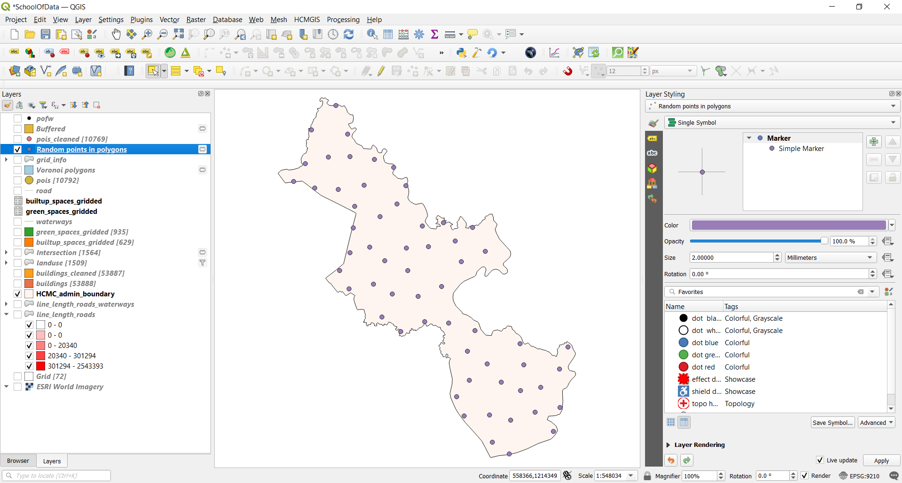

Figure 8.43 - Point data layer - randomly created within specified polygons.

Now that we have our imaginary meteo stations that measure precipitations in Pampanga province, we will continue by adding fictitious measurements on the course of 7 days. 

To do that, we can use the random function provided by QGIS. Open the attribute table of the point data layer created and open field calculator. In a newly created field (Whole number integer), insert the following formula rand(min, max), where min and max will be replaced by the following pair of numbers for the corresponding 7 days (see figure 8.44):

1. 0 - 59;
2. 2 - 35;
3. 10 - 45;
4. 0 - 21;
5. 5 - 63;
6. 0 - 10;
7. 0 - 21. 


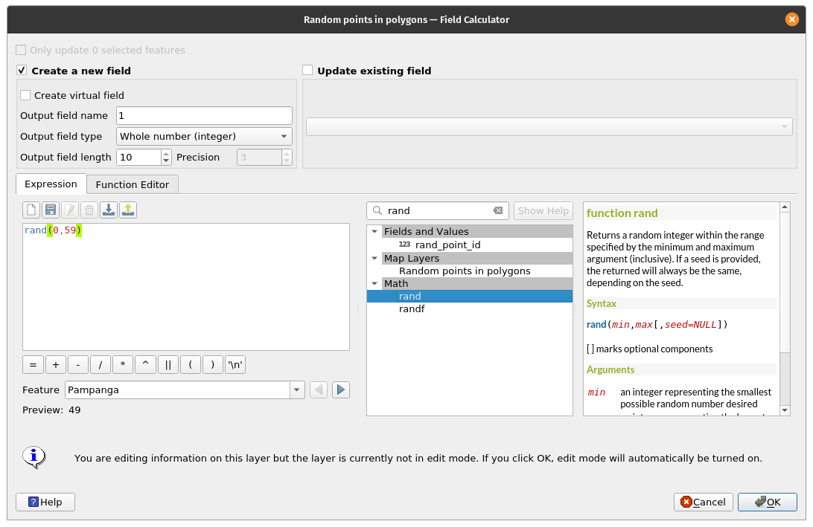

Figure 8.44 - Creating random values within specified limits

After adding all 7 columns, your attribute table should look like in figure 8.45. 


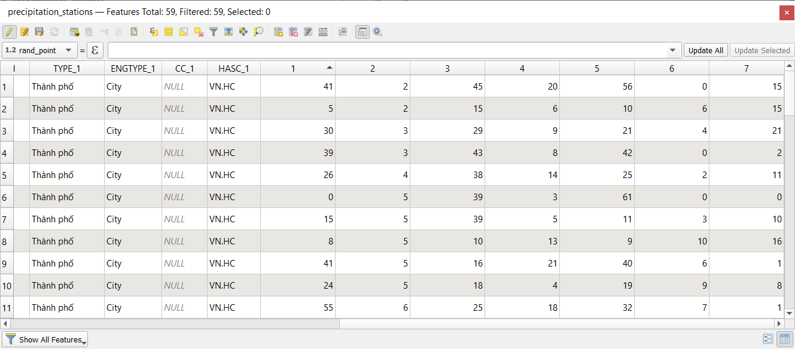

Figure 8.45 - Fictitious precipitation data for the 93 fictitious meteo stations in Pampanga province.

Next, we will interpolate these values for each of the 7 days  to obtain a seamless layer that covers the entire territory of the province. Given that the operation is repetitive, we will use batch processing. The selected interpolation method selected - strictly for demonstration purposes! - is IDW - inverse distance weighted. 

Set the following parameters: 
* distance coefficient: 2
* extent: Pampanga_admin_boundary
* output raster size: 50. 

Your parameters should look like in the following figure 8.46.


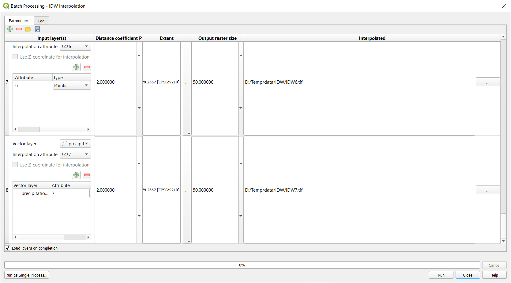

Figure 8.46 - Setting up the batch processing window to interpolate the precipitation values for all 7 days

The interpolation result will look approximately like in figure 8.47. 


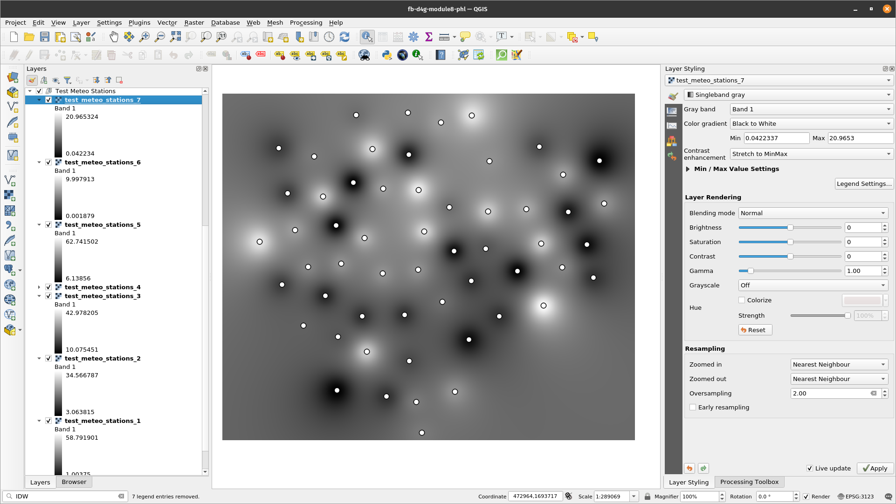

Figure 8.47 - Interpolated datasets

The meteo stations are visible on the map canvas and in the TOC you can see all the 7 newly created raster datasets that represent precipitation values for each day in the Pampanga province. 

Next, let’s change the symbology of the 7 layers to a more colourful one (**Properties ‣ Symbology ‣ Singleband pseudocolour ‣ Magma**). 

Looking at the point data and the raster datasets created based on them, we can notice that now we have values for the entire region and not only in the measured location. There are many processing algorithms that can be applied to these rasters in order to extract information, but more on that in the next module - processing and visualisation of raster data.  

However, as we have interpolated values for 7 days, let us prepare a short animation on how precipitation values have evolved for the Pampanga province. 

To do that, open the **Properties dialog of test_meteo_stations_1 raster ‣ click on the Temporal tab ‣ tick the Temporal option ‣ select start and end date**, like in figure 8.48. Do the same for all 7 raster layers. 


")


")


")

Figure 8.48 - Setting temporal information to the raster dataset (1, 2, 7).


Open Temporal Controller Panel (can be found in **View ‣ Panels ‣ Temporal Controller Panel**) and set the parameters as in figure 8.49. 


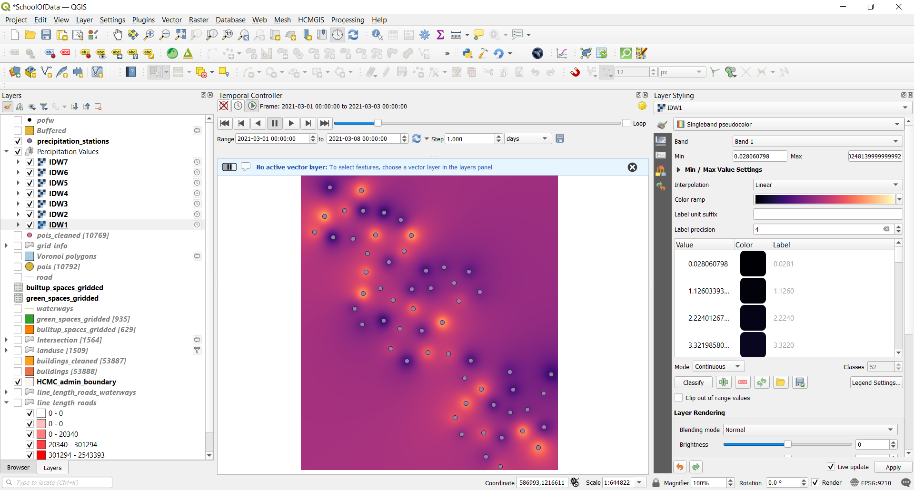

Figure 8.49 - Set the parameters of the Time Controller Panel. 

Click on the play button  and see how the values change. You can choose what other layers to be visible. In figure 8.50, we added the buildings vector layer. 


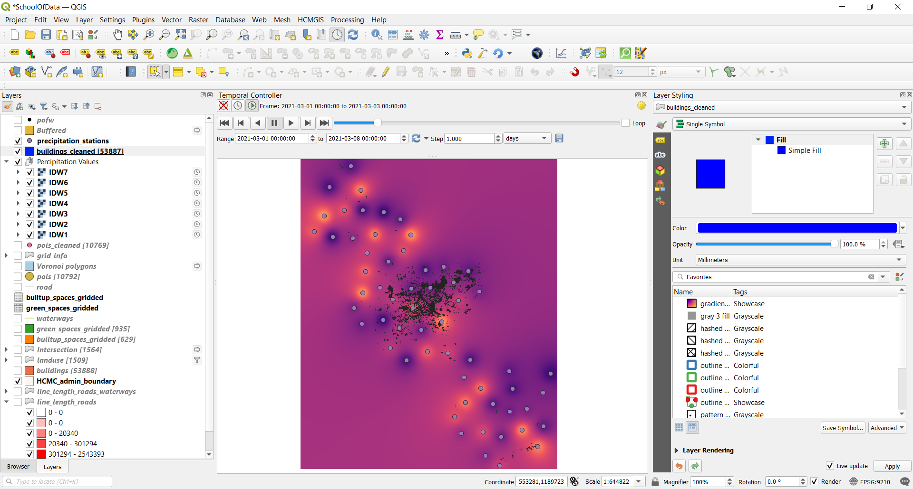

Figure 8.50 - Selecting other layers to be visible in the temporal animation.


Quiz questions

1. Is there one algorithm to interpolate data in QGIS or more?

*There are more algorithms implemented.*

2. What is interpolation useful for?

*Interpolation is useful to estimate data based on known data.*


