# **Module 9 - Raster processing and analysis**

**Tác giả**: Codrina

**Biên dịch và bản địa hoá**: Quách Đồng Thắng

## Giới thiệu chung

Module này tập trung vào một mô hình dữ liệu địa lý cụ thể: mô hình raster

Kết thúc Module này, người học sẽ có những kiến thức cơ bản về các khái niệm sau:

*   Mô hình dữ liệu vector
*   grid point và grid cell
*   các kênh của ảnh raster
*   map algebra 
*   4 loại độ phân giải của raster (không gian, thời gian, phổ và bức xạ)
*   Resampling 
*   Batch processing - xử lý hàng loạt
*   change detection - phát hiện biến động 


## Các công cụ và tài nguyên cần thiết

*   [QGIS version 3.16 - Hannover](https://qgis.org/en/site/forusers/download.html)
*   [module9.gpkg](data/module9.gpkg)
    *   Ranh giới hành chính Tp.HCM
*   [High Resolution Settlement Layer](data/HRSL_HCMC_Population.tif)
*   [SRTM Digital Elevation Model](data/SRTM_DEM)
*   [Global Land Cover Map 2015-2019](data/Global_Land_Cover_Map)
*   CRS sử dụng là VN-2000 / UTM zone 48N, EPSG 3405. 

## Yên cầu kỹ năng: 

*   Kiến thức cơ bản về vận hành máy tính
*   Nắm vững Module 0, 1, 2, 6 và 8


## Giới thiệu chuyên đề

## Phân tích các khái niệm

### Raster data model

Raster là một ma trận các giá trị như Hình 9.1


Hình 9.1 -Ma trận các giá trị

Các giá trị có thể được gán tại **grid points**, chủ yếu là tâm, và trong trường hợp này raster có thể được xem như là một mạng tinh thể - lattice. Tuỳ chọn thứ hai là các giá trị được gán cho toàn bộ **grid cell** - được gọi là pixel (Hình 9.2). Trong trường hợp thứ nhất, raster thông thường biểu diện một bề mặt liên tục, như độ cao, nhiệt độ, lượng mưa, nồng độ hoá chất,... Đối với trường hợp thứ hai, khi các giá trị được gán cho toàn bộ các pixel, raster thông thường biểu diễn cho một hình ảnh - một ảnh vệt tinh, bản đồ quét, bản đồ vector được chuyển đổi (xem Phase 2). Cần phải chú ý là mô hình dữ liệu này không đặc biệt hiệu quả cho các mạng và các loại dữ liệu khác phụ thuộc nhiều vào line, ví dụ như ranh giới nhà. 


Hình 9.2 - Ở bên trái, các giá trị được gán tại tâm. Ở bên phải, các giá trị được gán tại grid cell - pixel. 

On the right, values are assigned to the grid cell area - the pixel. 				


### Raster processing

Như trong trường hợp vector processing, cơ sở lý luận phía sau raster processing dựa trên khả năng rất giống nhau của các hệ thống thông tin địa lý trong việc lưu trữ, xử lý và trình diễn thông tin của các hiện tượng trong thế giới thực, chỉ là khác nhau trong cách thực hiện. Thay vì có các point, line và polygon rời rạc, được chứa trong một tập hợp các toạ độ x và y, chúng ta có một ma trận các giá trị bao phủ trên một khu vực nhất định như một lưới. Để có hình dung rõ ràng hơn, hãy tưởng tượng các bản đồ nhiệt được hiểm thị trên TV. Nhiệt độ là một trường liên tục, không có nơi nào trên trái đất không có nhiệt độ, dù là giá trị dương, âm hoặc 0.

Nhiều phép toán có thể được thực hiện trên dữ liệu raster, khái niệm geoprocessing trong Module 8 cũng được áp dụng tại đây. Thuật ngữ được sử dụng để bao gồm các phép toán có thể được thực hiện trên raster là _map algebra_. 

**Map algebra** biểu diễn một tập các phép toán nguyên thuỷ - primitive operation [^1] trong một hệ GIS cho phép 02 hoặc nhiều raster layer _có cùng số chiều_ để tạo một raster layer mới sư3 dụng nhiều phép toán như cộng, trừ, so sánh,...

Có 04 loại phép toán có thể thực hiện trên raster như sau:

*   Các phép toán số học - Arithmetic operations: cộng, trừ, nhân, chia.
*   Các phép toán thống kê - Statistical operations: lớn nhất, nhỏ nhất, trung bình, trung vị.
*   Các phép toán quan hệ cung cấp các so sánh giữa các cell sử dụng các hàm như lớn hơn, nhỏ hơn hoặc bằng.
*   Các phép toán lượng giác - Trigonometric operations: sin, cosin, tang, arcsin giữa 02 hoặc nhiều raster.
*   Các phép toán luỹ thừa và logarit - Exponential and logarithmic

Ứng với mỗi phép toán này, có các thuật toán được triển khai trong hầu hết các môi trường GIS cho phép người dùng áp dụng trên dữ liệu của mình. Trong phần tiếp theo, chúng tôi cũng sẽ cài đặt một số phép toán thông dụng nhất để hiểu cách làm việc và những gì người dùng mong đợi từ kiểu xử lý dữ liệu này.

Khái niệm _similar dimensions_ đề cập đến các đặc điểm của dữ liệu raster. Đó là, các phép toán chi tiết bên trên không thể cho ra các kết quả có ý nghĩa trên 2 tập dữ liệu raster khác nhau về yếu tố không gian, thời gian và độ phân giải phổ. Trong phần tiếp theo, chúng tôi sẽ giới thiệu rất ngắn tất cả 04 loại độ phân giải có liên quan đến ảnh raster.

Ghi nhớ 04 loại độ phân giải của ảnh vệ tinh (raster với giá trị được gán cho cell - pixel)

1. **Độ phân giải không gian - Spatial resolution** tương ứng với kích thước cơ bản của mặt đất đo được, nó được biểu thị bằng đơn vị chiều dài và nó đại diện cho chiều dài của một cạnh pixel (Hình 9.3). Ví dụ, như bạn đã thấy trong Module 3, High Resolution Settlement Layer Data có độ phân giải không gian là 30m, nghĩa là một pixel của raster ước tính chó số người sống trong phạm vi 30m.

2. **Độ phân giải thời gian - Temporal resolution** thường gắn với các hình ảnh thu thập bằng vệ tinh, máy bay, trực thăng, máy bay không người lái, và nó tương ứng với khoảng thời gian giữa 02 ảnh liên tiếp tại cùng một vị trí trên trái đất, được chụp trong cùng điều kiện (nhiều nhất có thể), như cùng một máy bay, vệ tinh,... Ví dụ, Landsat 8 có độ phân giải thời gian là 16 ngày, nghĩa là một điểm trên trái đất sẽ được vệ tinh Lansat 8 chụp lại mỗi 16 ngày [^2].

3. **Độ phân giải phổ - Spectral resolution** - các cảm biến trên các vệ tinh hoặc máy bay ghi nhận các bức xạ điện từ từ tất cả các vật thể trên bề mặt trái đất - nước, nhà ở, rừng, đường xá, toà nhà, đất trống,... - và các cảm biến được chế tạo đặc biệt để thu nhận bức xạ điện từ ở một dải phổ đã biết (hoặc bước sóng). Mắt người có thể thấy một phần rất nhỏ trong quang phổ điện từ - ánh sáng nhìn thấy (red, green, blue), nhưng các cảm biến có thể ‘see’ nhiều hơn (Hình 9.4)


)](media/fig94.png "Electromagnetic spectrum (photo credit [NASA Science](https://science.nasa.gov/ems/01_intro))")

Hình 9.4 - Quang phổ điện từ (photo credit NASA Science - [https://science.nasa.gov/ems/01_intro](https://science.nasa.gov/ems/01_intro))

4. **Radiometric resolution** được xác định bởi số bit mà các bức xạ ghi nhận được phân chia. Đối với ảnh 8-bit, các giá trị cấp độ xám - digital numbers (DN) có thể nằm trong khoảng 0 - 255 cho mỗi pixel (2^8 = 256 giá trị cấp độ xám). Rõ ràng, nhiều bit hơn có nghĩa là cảm biến có thể nhận biết những thay đổi tinh vi hơn trong năng lượng mà nó thu nhận, dẫn đến một hình ảnh 'rõ hơn', độ chính xác bức xạ của cảm biến cao hơn nhưng đồng thời yêu cầu thêm không gian lưu trữ dữ liệu.

**Spectral bands - Các kênh phố**
Một raster chứa một hoặc nhiều layer được gọi là các kênh ảnh. Mỗi kênh ảnh chá một tập thông tin khác nhau trên khu vực mà raster bao phủ. Mỗi kênh ảnh có cùng phạm vi và tạo độ, nhưng không nhất thiết phải cùng độ phân giải không gian.  Ngoài ra, bên cạnh các giá trị được lưu trữ, còn có các thuộc tính chính khác như: giá trị lớn nhất, nhỏ nhất và trung bình và _histogram_ 

Một **histogram** là một biểu diễn gần đúng của phân phối dữ liệu số (Hình 9.5), nói cách khác là một cách mà qua đó người dùng có thể hiểu được dữ liệu.


Hình 9.5 - Một ví dụ về histogram, trong đó x là raster layer

Tại sao điều này quan trọng trong ngữ cảnh của chúng ta? Bởi vì, như đã đề cập lúc đầu, một raster là một ma trận của các giá trị số liên tục (hãy nhớ ví dụ về nhiệt độ) và histogram giúp người dùng hiểu các giá trị của raster được phân phối như thế nào. Mỗi cột trong histogram nhóm các giá trị nằm trong một phạm vi nhất định, cột càng cao càng có nhiều ô có giá trị nằm trong phạm vi này. Trong trường hợp raster có nhiều kênh ảnh, histogram sẽ được tính toán tương ứng cho từng kênh. Không có khoảng hở giữa các khoảng giá trị trong histogram, và histogram chỉ sử dụng cho dữ liệu liên tục.

## Nội dung chính 

### Phase 1: Hiểu dữ liệu raster của bạn.

Trong 02 thập kỷ gần đây, số lượng các vệ tinh thu thập dữ liệu trên trái đất đã tăng lên theo cấp số nhân. Hơn nữa, một chính sách truy cập dữ liệu mở được các cơ quan không gian khác nhau áp dụng, như NASA với  [Landsat program](https://www.usgs.gov/core-science-systems/nli/landsat/landsat-data-access?qt-science_support_page_related_con=0#qt-science_support_page_related_con) hoặc European Space Agency với[Copernicus program](https://www.copernicus.eu/en/access-data), đã mở ra cánh cửa cho một lương lớn dữ liệu quan sát trái đất. Như một kết quả tự nhiên, tiến bộ khoa học của các thuật toán, phương pháp và sự phát triển của các công cụ mạnh mẽ hơn trong xử lý dữ liệu raster - đặc biệt là ảnh vệ tinh - đã rất ấn tưỢng và sâu rô5ng trong các lĩnh vực như nông nghiệp, lâm nghiệp, phát triển đô thị, hoạt động nhân đạo, giám sát đại dương và nước biển, an ninh,... Trong 3 phần sau, chúng ta sẽ giới thiệu một số kỹ thuật xử lý thông dụng nhất và các kết quả mong đợi từ chúng.


#### **Bước 1. Chuẩn bị môi trường làm việc.**

Chúng ta sẽ bắt đầu bằng việc thêm vào trong QGIS project tất cả các raster mà chúng ta sẽ làm việc, gồm:

*   High Resolution Settlement Layer Data 
*   Shuttle Radar Topography Mission (SRTM) Digital Elevation Model (DEM)
*   Moderate Dynamic Land Cover: the 5 available epochs 2015, 2016, 2017, 2018 and 2019. 

Vì High Resolution Settlement Layer Data đã được trình bày trong Module trước, chúng tôi cũng sẽ chi tiết thông tin về 2 tập dữ liệu khác sẽ sử dụng trong Module này.

1. Shuttle Radar Topography Mission (SRTM) Digital Elevation Model (DEM) là một mô hình số bề mặt ( Digital Surface Model - DSM) toàn cầu với độ phân giải ngang xấp xỉ 30m. Một DSM gồm bề mặt đất, thảm thực vật và các công trình nhân tạo như toà nhà, cầu,...khác với mô hình số địa hình (Digital Terrain Model - DTM) chỉ bao gồm bề mặt địa hình.

3. Dynamic Land Cover Map là một sản phẩm của Copernicus Global Land Service (CGLS) bắt nguồn từ PROBA-V 100 m time-series và một số tập dữ liệu lớp phủ mặt đất khác. Dữ liệu này gồm các lớp rời rạc về lớp phủ mặt đất chính, cũng như các lớp dữ liệu liên tục cho các lớp phủ mặt đất cơ bản, cung cấp các ước tính tỉ lệ cơ bản về lớp phủ thực vật/ mặt đất cho các loại lớp phủ mặt đất. Sản phẩm gồm có 03 kênh: iscrete_classification, forest_type và urban_coverfraction. Hai bảng sau trình bày các giá trị cho mỗi lớp riêng rẻ:

4. is a Copernicus Global Land Service (CGLS) product derived from the PROBA-V 100 m time-series and several other land cover datasets.  The product provides primary land cover discrete classes, as well as continuous field layers for all basic land cover classes that provide proportional estimates for vegetation/ground cover for the land cover types. The product has 3 bands: discrete_classification, forest_type and urban_coverfraction. The following 2 tables present the values for each discrete class: 

Tabel 1 Discrete_classification band value table

<table>
  <tr>
   <td><strong>Value</strong>
   </td>
   <td><strong>Color</strong>
   </td>
   <td><strong>Description</strong>
   </td>
  </tr>
  <tr>
   <td>0
   </td>
   <td>282828
   </td>
   <td>Unknown. No or not enough satellite data available.
   </td>
  </tr>
  <tr>
   <td>20
   </td>
   <td>FFBB22
   </td>
   <td>Shrubs. Woody perennial plants with persistent and woody stems and without any defined main stem being less than 5 m tall. The shrub foliage can be either evergreen or deciduous.
   </td>
  </tr>
  <tr>
   <td>30
   </td>
   <td>FFFF4C
   </td>
   <td>Herbaceous vegetation. Plants without persistent stem or shoots above ground and lacking definite firm structure. Tree and shrub cover is less than 10 %.
   </td>
  </tr>
  <tr>
   <td>40
   </td>
   <td>F096FF
   </td>
   <td>Cultivated and managed vegetation / agriculture. Lands covered with temporary crops followed by harvest and a bare soil period (e.g., single and multiple cropping systems). Note that perennial woody crops will be classified as the appropriate forest or shrub land cover type.
   </td>
  </tr>
  <tr>
   <td>50
   </td>
   <td>FA0000
   </td>
   <td>Urban / built up. Land covered by buildings and other man-made structures.
   </td>
  </tr>
  <tr>
   <td>60
   </td>
   <td>B4B4B4
   </td>
   <td>Bare / sparse vegetation. Lands with exposed soil, sand, or rocks and never has more than 10 % vegetated cover during any time of the year.
   </td>
  </tr>
  <tr>
   <td>70
   </td>
   <td>F0F0F0
   </td>
   <td>Snow and ice. Lands under snow or ice cover throughout the year.
   </td>
  </tr>
  <tr>
   <td>80
   </td>
   <td>0032C8
   </td>
   <td>Permanent water bodies. Lakes, reservoirs, and rivers. Can be either fresh or salt-water bodies.
   </td>
  </tr>
  <tr>
   <td>90
   </td>
   <td>0096A0
   </td>
   <td>Herbaceous wetland. Lands with a permanent mixture of water and herbaceous or woody vegetation. The vegetation can be present in either salt, brackish, or fresh water.
   </td>
  </tr>
  <tr>
   <td>100
   </td>
   <td>FAE6A0
   </td>
   <td>Moss and lichen.
   </td>
  </tr>
  <tr>
   <td>111
   </td>
   <td>58481F
   </td>
   <td>Closed forest, evergreen needle leaf. Tree canopy >70 %, almost all needle leaf trees remain green all year. Canopy is never without green foliage.
   </td>
  </tr>
  <tr>
   <td>112
   </td>
   <td>9900
   </td>
   <td>Closed forest, evergreen broad leaf. Tree canopy >70 %, almost all broadleaf trees remain green year round. Canopy is never without green foliage.
   </td>
  </tr>
  <tr>
   <td>113
   </td>
   <td>70663E
   </td>
   <td>Closed forest, deciduous needle leaf. Tree canopy >70 %, consists of seasonal needle leaf tree communities with an annual cycle of leaf-on and leaf-off periods.
   </td>
  </tr>
  <tr>
   <td>114
   </td>
   <td>00CC00
   </td>
   <td>Closed forest, deciduous broad leaf. Tree canopy >70 %, consists of seasonal broadleaf tree communities with an annual cycle of leaf-on and leaf-off periods.
   </td>
  </tr>
  <tr>
   <td>115
   </td>
   <td>4E751F
   </td>
   <td>Closed forest, mixed.
   </td>
  </tr>
  <tr>
   <td>116
   </td>
   <td>7800
   </td>
   <td>Closed forest, not matching any of the other definitions.
   </td>
  </tr>
  <tr>
   <td>121
   </td>
   <td>666000
   </td>
   <td>Open forest, evergreen needle leaf. Top layer- trees 15-70 % and second layer- mixed of shrubs and grassland, almost all needle leaf trees remain green all year. Canopy is never without green foliage.
   </td>
  </tr>
  <tr>
   <td>122
   </td>
   <td>8DB400
   </td>
   <td>Open forest, evergreen broad leaf. Top layer- trees 15-70 % and second layer- mixed of shrubs and grassland, almost all broadleaf trees remain green year round. Canopy is never without green foliage.
   </td>
  </tr>
  <tr>
   <td>123
   </td>
   <td>8D7400
   </td>
   <td>Open forest, deciduous needle leaf. Top layer- trees 15-70 % and second layer- mixed of shrubs and grassland, consists of seasonal needle leaf tree communities with an annual cycle of leaf-on and leaf-off periods.
   </td>
  </tr>
  <tr>
   <td>124
   </td>
   <td>A0DC00
   </td>
   <td>Open forest, deciduous broad leaf. Top layer- trees 15-70 % and second layer- mixed of shrubs and grassland, consists of seasonal broadleaf tree communities with an annual cycle of leaf-on and leaf-off periods.
   </td>
  </tr>
  <tr>
   <td>125
   </td>
   <td>929900
   </td>
   <td>Open forest, mixed.
   </td>
  </tr>
  <tr>
   <td>126
   </td>
   <td>648C00
   </td>
   <td>Open forest, not matching any of the other definitions.
   </td>
  </tr>
  <tr>
   <td>200
   </td>
   <td>80
   </td>
   <td>Oceans, seas. Can be either fresh or salt-water bodies.
   </td>
  </tr>
</table>


Tabel 2 forest_type band value table

<table>
  <tr>
   <td>Value
   </td>
   <td>Color
   </td>
   <td>Description
   </td>
  </tr>
  <tr>
   <td>0
   </td>
   <td>282828
   </td>
   <td>Unknown
   </td>
  </tr>
  <tr>
   <td>1
   </td>
   <td>666000
   </td>
   <td>Evergreen needle leaf
   </td>
  </tr>
  <tr>
   <td>2
   </td>
   <td>9900
   </td>
   <td>Evergreen broad leaf
   </td>
  </tr>
  <tr>
   <td>3
   </td>
   <td>70663E
   </td>
   <td>Deciduous needle leaf
   </td>
  </tr>
  <tr>
   <td>4
   </td>
   <td>A0DC00
   </td>
   <td>Deciduous broad leaf
   </td>
  </tr>
  <tr>
   <td>5
   </td>
   <td>929900
   </td>
   <td>Mix of forest types
   </td>
  </tr>
</table>


Để tổ chức các layer tố hơn, hãy nhóm chúng theo danh mục như sau: đối với 5 raster layer cho lớp phủ mặt đất, tạo một nhóm với tên Land Cover (trong Layers Panel, kích chọn Add Group) ). Đối với mô hình số bề mặt DSM, tạo một nhóm với tên là SRTM DEM.

Cũng đừng quên thêm ranh giới khu vực làm việc, tức Tp.HCM, là một vector layer.

QGIS map sẽ trông giống như Hình 9.6, có thể màu sắc hơi khác một chút.


Hình 9.6 - Các lớp dữ liệu raster


#### **Bước 2. Hiểu nhìn gì bạn đang nhìn thấy.** 

Tiếp theo, chúng ta sẽ dùng một loạt các công cụ cho phép chúng ta hiểu về dữ liệu mà chúng ta đang làm việc.

Sau khi tải tất cả các dữ liệu, chúng ta sẽ kiểm tra CRS của tất cả lớp các dữ liệu. Như đã biê1t trong các Module trước, QGIS cung cấp khả năng chuyển đổi hê5 toạ độ cho tất cả các lớp dữ liệu trong project trong khi tải (on the fly projection), tuy nhiên nó có thể dẫn đến các vấn đề về geoprocessing. Do đó, ngay khi tất cả các layer được chồng khớp với nhau thông quan kiểm tra trực quan, chúng ta sẽ chuyển đổi hệ toạ độ tất cả các layer này về hệ toạ độ địa phương của Tp.HCM - EPSG: 9210.

Có nhiều cách để lấy thông tin của các layer được tải trong QGIS, một số cung cấp cho người dùng nhiều chi tiết hơn. Để có cái nhìn tổng quan nhanh về metadata, **kích đúp chuột vào layer và họn Properties ‣ Information**

Đối vơ1i layer HRSL_HCMC_Population, cửa sổ thông tin như Hình 9.7

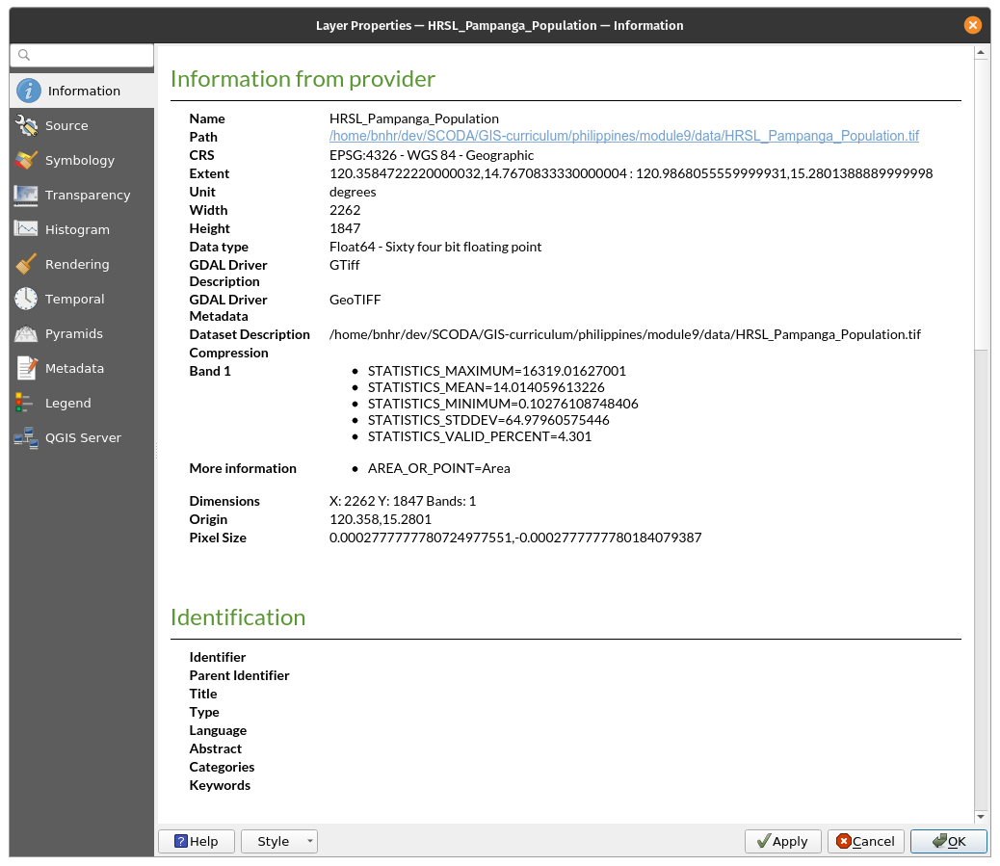

Hình 9.7 - Thông tin metadata cơ bản của raster layer

Đối với câu hỏi đầu tiên của chúng ta về CRS nào đang được dùng cho các lớp dữ liệu đã được tải, chúng ta có thể quan sát rằng ngay cả khi HRSL được chồng lớp chính xác, hệ toạ độ góc của nó là EPSG 4326 - WGS84 - Geographic, với đơn vị đo là độ. Chúng ta cũng xác đặt rằng raster layer này chỉ có một kênh ảnh, và kích thước pixel rất khó đọc vì đơn vị đo là độ chứ không phải là mét - vốn giúp dễ hiểu hơn.

Do đó, đều đầu tiên là chuyển đổi toạ độ tất cả các lớp dữ liệu mà chúng ta sẽ làm việc về cùng một CRS - EPSG 9210.

Bắt đầu với lớp HRSL, truy cập **Raster ‣ Projections ‣ Warp (Reproject)** (Hình 9.8).


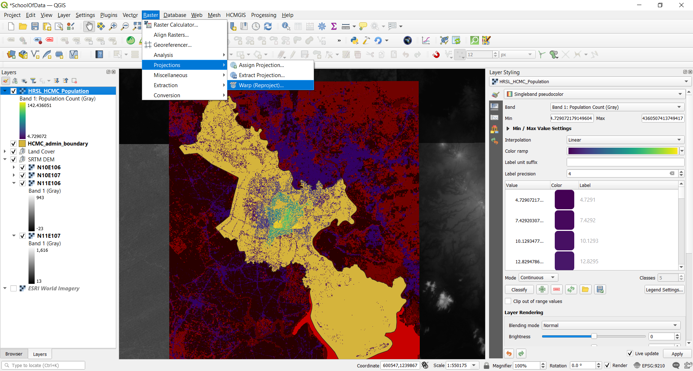

Hình 9.8 - Chức năng reproject trong QGIS

Sau khi chọn chư1c năng Warp, một cửa sổ mới sẽ xuất hiện, cho phép người dùng nhập các thông số chính xác (Hình 9.9a)

")

Hình 9.9a - Giao diện Warp (reproject)

Nếu bạn chọn output là **[Save to temporary file]** thì sẽ có một raster layer với tên `Reprojected` trong Layers Panel. Đây là một memory layer và bạn có thể đổi tên layer thành Reprojected_HRSL_HCMC_Population và lưu lại trong máy tính.


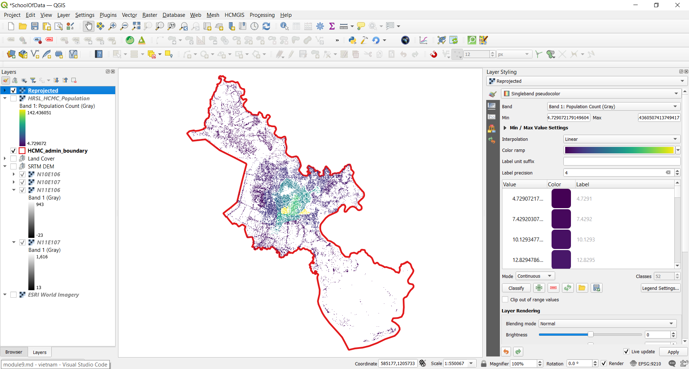

Hình 9.9b - Reprojected HRSL

Bạn se thấy rằng không giống như khi bạn chuyển đổi toạ độ cho vector, có một tham số mới mà bạn có thể thiết lập là “Resampling method to use”

**Resampling (tái chia mẫu)** mô tả phép nội suy của các cell value để chuyển đổi raster theo thiết lập của người dùng. Có nhiều phương pháp resampling có sẵn trong chức năng warp, mỗi phương pháp có hỗ trợ toán học riêng. Tuy nhiên, giải thích chi tiết cho từng phương pháp resampling nằm ngoài khuôn khổ của bài tập này, nên bạn có thể đọc thêm tài liệu tham khảo. 

Trong trường hợp cụ thể này, chúng ta muốn chuyển đổi toạ độ cho dữ liệu dân số - các giá trị số và dựa trên phương pháp resampling (nearest neighbour), mỗi toạ độ của từng pixel đầu ra sẽ được dùng để tính toán một giá trị mới từ các giá trị pixel lân cận trong layer đầu vào (Hình 9.10)


Hình 9.10 - Resample method - nearest neighbour (photo credit: ILWIS documentation - [(http://spatial-analyst.net/ILWIS/htm/ilwisapp/resample_functionality.htm](http://spatial-analyst.net/ILWIS/htm/ilwisapp/resample_functionality.htm))

Các pixel đầu vào được biểu diễn bởi các đường đứt nét màu đen, toạ độ của các pixel đầu vào là các điểm màu đen; các pixel đầu ra được biểu diễn bởi các đường liền nét màu đỏ, toạ độ của các pixel đầu ra là các dấu cộng màu đỏ. Các mũi tên màu xám cho biết các các giá trị đầu ra được xác định. Có thể thấy trong Hình 9.10, một số giá trị của bản đồ đầu vào có thể được sử dụng 02 lần trong bản đồ đầu ra, trong khi các giá trị đầu vào khác có thể hoàn toàn không được sử dụng. Đó là lí do tại sao, mặc dù là một trong những phương pháp nhanh nhất để resample, nó không thích hợp trong trường hợp của chúng ta, vì chúng ta đang làm việc với dữ liệu kiểu số - cụ thể là dữ liệu dân số. Phương pháp resampling thích hợp cho các dữ liệu dạng danh mục - như các giá trị lớp phủ mặt đất.

Để chuyển đổi toạ độ dữ liệu dân số raster, chúng ta sẽ dùng phương pháp nội suy song tuyến (bilinear interpolation) để resample các giá trị pixel (Hình 9.11)


Hình 9.11 - Resample method - bilinear (photo credit: ILWIS documentation - [(http://spatial-analyst.net/ILWIS/htm/ilwisapp/resample_functionality.htm](http://spatial-analyst.net/ILWIS/htm/ilwisapp/resample_functionality.htm))

Phương pháp nội suy song tuyến xác định giá trị mới cho một cell dựa trên giá trị trung bình khoảng cách có trọng số của 04 cell gần nhất. Phương pháp này hữu ích cho dữ liệu liên tục và sẽ gây ra một số tình trạng làm mịn (smoothing) dữ liệu.

Chúng ta tiến hành kiểm tra CRS của 5 lớp dữ liệu land cover đã được tải vào QGIS project. Truy cập **Layer properties ‣ information**, chúng ta thấy rằng tất cả 5 lớp land cover có hệ toạ độ là EPSG:3857 - WGS 84 / Pseudo-Mercator. Một giải pháp sẽ sử dụng là dùng công cụ Reproject và cấu hình riêng cho mỗi layer. Tuy nhiên, mô5t cách nhanh hơn cho việc này là chạy reproject với **batch process**

**Batch processing** là khả năng chạc các process lặp lại trên dữ liệu, với tương tác người dùng tối thiểu. Hầu hết các chức năng trong QGIS có tuỳ chọn này và có thể được kích hoạt trong cửa sổ process bằng cách kích chuột **Run Batch Process**  và  chuyển sang tab Run batch process (Hình 9.12)

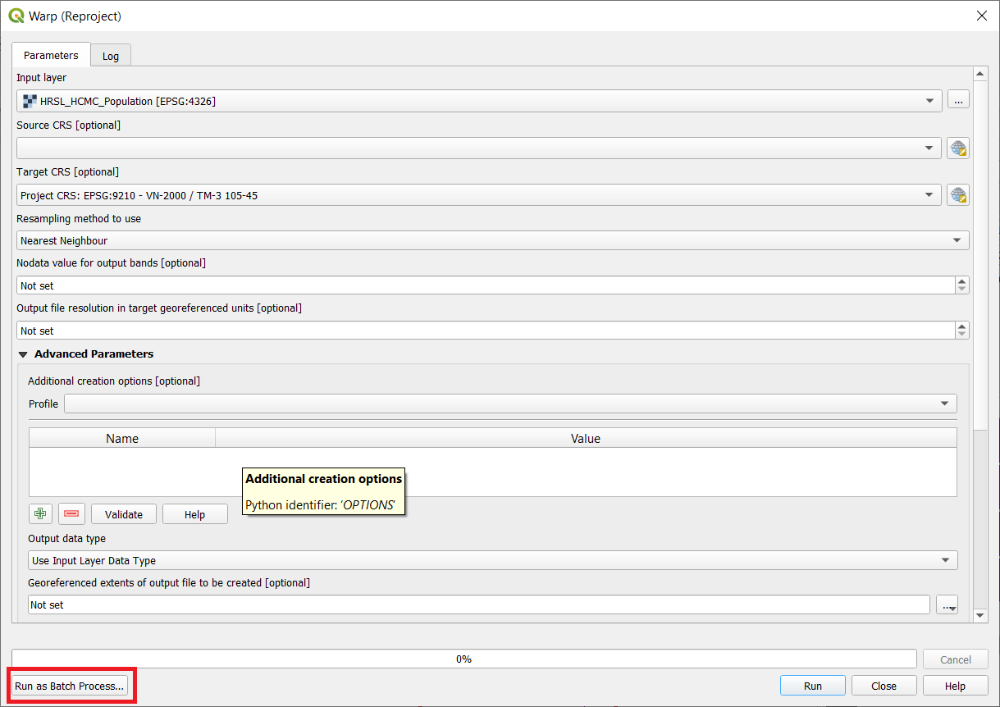

Hình 9.12 - Run as Batch Process trong QGIS


Đối với 05 lớp raster land cover, chúng ta sẽ sử dụng batch processing và phương pháp resampling là nearest neighbour. Để thêm một layer mới, chọn biểu tượng có dấu +. Để tự động điền CRS và các tham số resampling, chọn nút autofill phía trên mỗi cột và chọn `Fill down`. Đổi tên lớp raster được reproject bằng cách thêm mã EPSG ở cuối tên, ví dụ LandCover2015 sẽ trở thành landCover2015_9210. Nhập các tham số như Hình 9/13: sourcr CRS: EPSG: 3857, target CRS: EPSG 3123, resampling method: nearest neighbour (đã giải thích trong phần trên),  nodata value for output bands: 255 (từ information window, chúng ta thấy kiểu dữ liệu là 8bit unsigned integer - có nghĩa là giá trị lớp nhất là 255), output resolution:100m (giống như lớp land cover raster ban đầu). Sau khi thiết lập xong tất cả các tham số, tích chọn **Load layers on completion** và chọn **Run**.


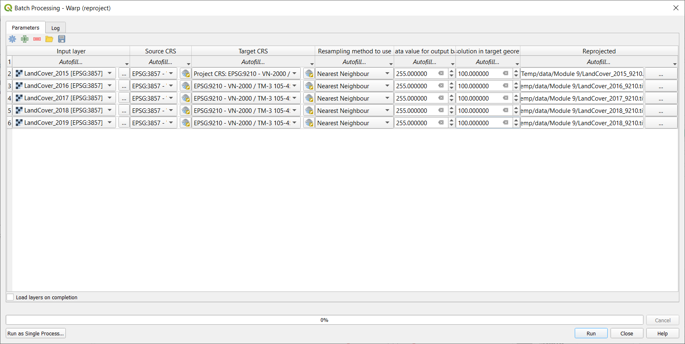

Hình 9.13a - Reproject land cover rasters sử dụng Batch Processing


Hình 9.13b - Autofill output names


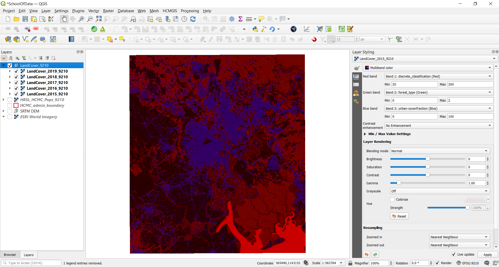

Hình 9.13c - Land cover rasters đã được chuyển đổi hệ toạ độ

Tiếp theo là DSM raster. Như chúng ta thấy, để bao phủ khu vực qua tâm, chúng ta cần một số _raster tiles_. Khi raster file trở nên quá lớn - tưởng tưỢng một DSM file duy nhất ở độ phân giải 30m cho toàn bộ châu Âu với 10 triệu km2 - chúng được chia thành các **tiles** bởi vì, ở những khu vực nhỏ hơn sẽ dễ quản lý hơn.

Mặc dù chúng ta có thể sử dụng wrap tool ở dạng Batch Processing để chuyển đổi hệ toạ độ cho các DSM raster, nhưng khi kiểm tra trực quan, chúng ta có thể thấy rằng đường phân định giữa các tile là khá rõ ràng, làm cho nó ít nhất không hấp dẫn về mặt hiển thị. Sẽ là hữu ích nếu có một các nhìn tổng quan đầy đủ về địa hình như một hiện tượng liên tục - trên thực tế là như vậy - mà không có sự gián đoạn nhân tạo nào, Để đạt được điều này, chúng ta sẽ sử dụng GDAL merge tool, có sẵn trong Processing toolbar để hợp nhất tất cả các DSM raster với nhau. Truy cập **Processing ‣ Toolbox** và tìm kiếm bằng từ khoá **Merge** (Hình 9.14). Ngoài ra, bạn có thể tìm kiếm trong Locator Bar.

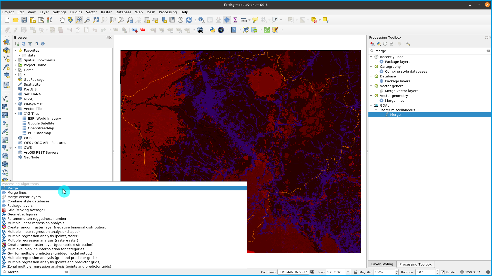

Hình 9.14 - Tìm kiếm GDAL merge tool trong Processing Toolbox 

Trong cửa sổ merge, chọn các DSM raster muốn hợp nhất và chọn run. Kết quả như hình 9.15c

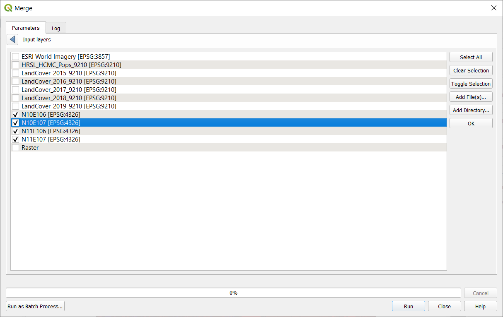

Hình 9.15a - Chọn các SRTM layer để hợp nhất


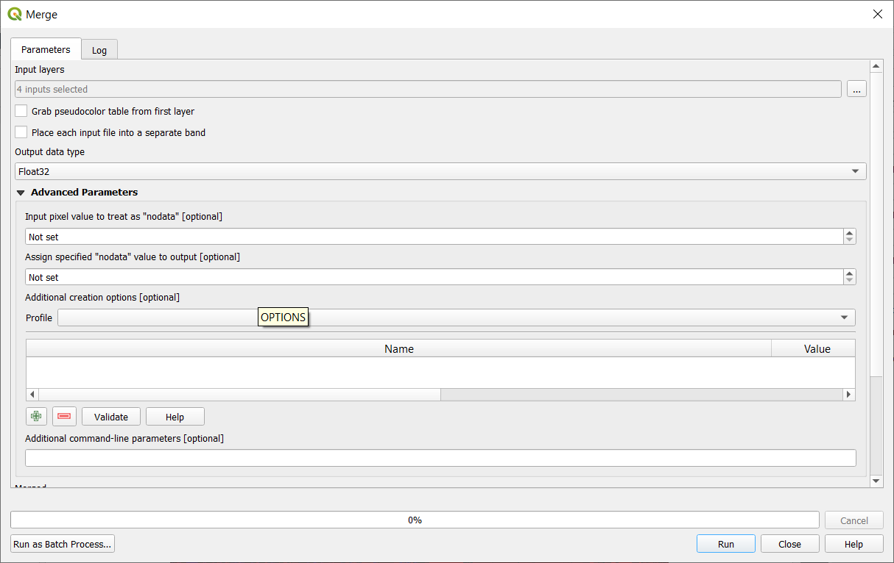

Hình 9.15b - Các tham số của chức năng Merge


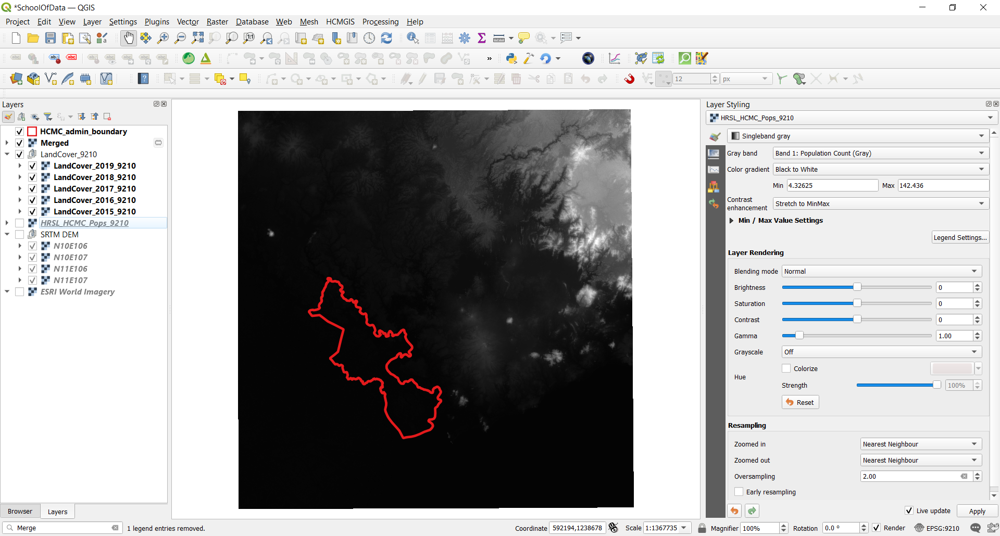

Hình 9.15c - Kết quả hợp nhất các DSM file


Bây giờ, chúng ta có thể chuyển đổi hệ toạ độ của file đã được hợp nhất này thay vì 6 file. Truy cập  **Raster ‣ projection ‣ Wrap (reproject)** và nhập các tham số:

   * Source CRS EPSG 4326
   * Target CRS: EPSG:9210 
   * Resampling method: Nearest neighbour
   * Output file resolution - 30 m. 

Tại thời điểm này, tất cả các layer đề có cùng CRS - EPSG 9210. 


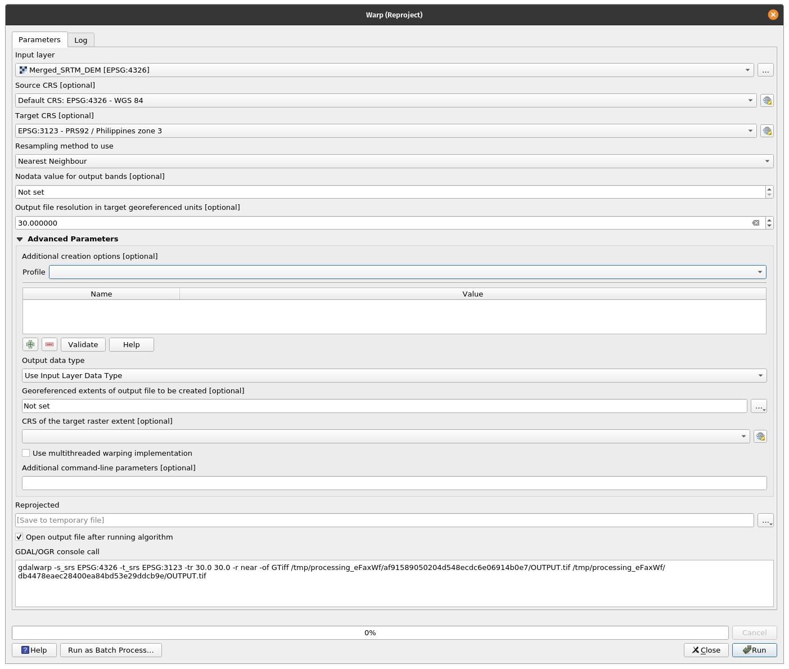

Hình 9.15d - Chuyển đổi hệ toạ độ cho raster đã được merge

Chúng ta có thể thực hiện một kiểm tra khác để đảm bảo rằng tất cả các raster mà chúng ta đang làm việc đã được reproject cũng như xem các thông tin bổ sung bằng cách chạy một batch process Raster Information cho tất cả raster. Truy cập **Raster ‣ Miscellaneous ‣ Raster Information**. Cửa số Batch Processing cho Raster Information như Hình 9.16


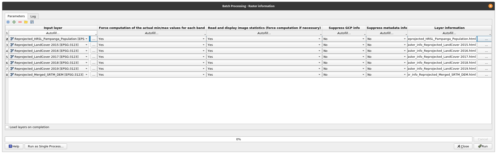

Hình 9.16 - Batch process trích lọc thông tin thành một HTML file cho các raster layer

Một HTML về raster information sẽ như bên dưới, có thể mở bằng các text editor hoặc web browser.

```
        Driver: GTiff/GeoTIFF
        Files: /Users/codrinamariailie/Google Drive/02_OK/Gov_Geospatial_Trainings/Data/module9/Reprojected_LandCover2019.tif
        Size is 678, 570
        Coordinate System is:
        PROJCRS["PRS92 / Philippines zone 3",
            BASEGEOGCRS["PRS92",
                DATUM["Philippine Reference System 1992",
                    ELLIPSOID["Clarke 1866",6378206.4,294.978698213898,
                        LENGTHUNIT["metre",1]]],
                PRIMEM["Greenwich",0,
                    ANGLEUNIT["degree",0.0174532925199433]],
                ID["EPSG",4683]],
            CONVERSION["Philippines zone III",
                METHOD["Transverse Mercator",
                    ID["EPSG",9807]],
                PARAMETER["Latitude of natural origin",0,
                    ANGLEUNIT["degree",0.0174532925199433],
                    ID["EPSG",8801]],
                PARAMETER["Longitude of natural origin",121,
                    ANGLEUNIT["degree",0.0174532925199433],
                    ID["EPSG",8802]],
                PARAMETER["Scale factor at natural origin",0.99995,
                    SCALEUNIT["unity",1],
                    ID["EPSG",8805]],
                PARAMETER["False easting",500000,
                    LENGTHUNIT["metre",1],
                    ID["EPSG",8806]],
                PARAMETER["False northing",0,
                    LENGTHUNIT["metre",1],
                    ID["EPSG",8807]]],
            CS[Cartesian,2],
                AXIS["easting (X)",east,
                    ORDER[1],
                    LENGTHUNIT["metre",1]],
                AXIS["northing (Y)",north,
                    ORDER[2],
                    LENGTHUNIT["metre",1]],
            USAGE[
                SCOPE["unknown"],
                AREA["Philippines - zone III"],
                BBOX[3,119.7,21.62,122.21]],
            ID["EPSG",3123]]
        Data axis to CRS axis mapping: 1,2
        Origin = (430713.282723263022490,1690115.897022359305993)
        Pixel Size = (100.000000000000000,-100.000000000000000)
        Metadata:
          AREA_OR_POINT=Area
        Image Structure Metadata:
          INTERLEAVE=PIXEL
        Corner Coordinates:
        Upper Left  (  430713.283, 1690115.897) (120d21'17.68"E, 15d16'55.47"N)
        Lower Left  (  430713.283, 1633115.897) (120d21'23.24"E, 14d46' 0.88"N)
        Upper Right (  498513.283, 1690115.897) (120d59'10.17"E, 15d16'58.81"N)
        Lower Right (  498513.283, 1633115.897) (120d59'10.29"E, 14d46' 4.10"N)
        Center      (  464613.283, 1661615.897) (120d40'15.34"E, 15d 1'30.61"N)
        Band 1 Block=678x4 Type=Byte, ColorInterp=Red
          Description = discrete_classification
            Computed Min/Max=0.000,200.000
          Minimum=0.000, Maximum=200.000, Mean=67.557, StdDev=35.613
          NoData Value=255
          Metadata:
            STATISTICS_MAXIMUM=200
            STATISTICS_MEAN=67.556567003835
            STATISTICS_MINIMUM=0
            STATISTICS_STDDEV=35.612833384649
            STATISTICS_VALID_PERCENT=99.72
        Band 2 Block=678x4 Type=Byte, ColorInterp=Green
          Description = forest_type
            Computed Min/Max=0.000,2.000
          Minimum=0.000, Maximum=2.000, Mean=0.473, StdDev=0.850
          NoData Value=255
          Metadata:
            STATISTICS_MAXIMUM=2
            STATISTICS_MEAN=0.47292184572588
            STATISTICS_MINIMUM=0
            STATISTICS_STDDEV=0.84981681513547
            STATISTICS_VALID_PERCENT=99.72
        Band 3 Block=678x4 Type=Byte, ColorInterp=Blue
          Description = urban-coverfraction
            Computed Min/Max=0.000,100.000
          Minimum=0.000, Maximum=100.000, Mean=14.485, StdDev=30.631
          NoData Value=255
          Metadata:
            STATISTICS_MAXIMUM=100
            STATISTICS_MEAN=14.484993486711
            STATISTICS_MINIMUM=0
            STATISTICS_STDDEV=30.631074729814
            STATISTICS_VALID_PERCENT=99.72
```

Sau khi chuẩn bị các raster bằng cách reproject và đọc metadata để hiểu rõ hơn về dữ liệu, đã đến lúc đi sâu vào dữ liệu thực tế. Để đạt được điều đó, chúng ta sẽ tính toán và giải thích các histogram của các raster này (Chi tiết xem lại mục Phân tích các Khái niệm bên trên).


Để tính toán một histogram, chọn raster layer, kích đúp chuột vào cửa sổ `Properties` và di chuyển đến  `Histogram` (Hình 9.17). 


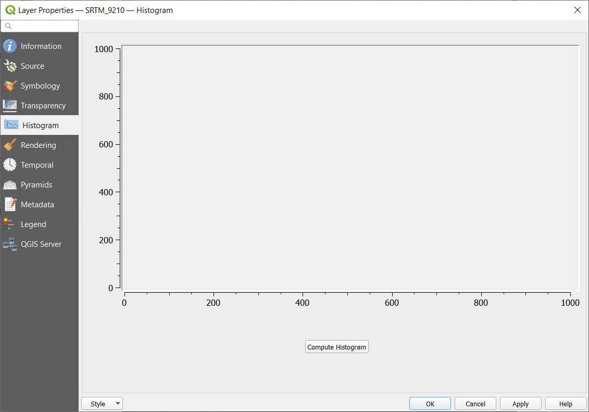

Hình 9.17 - Histogram window

Chọn `Compute histogram` để QGIS tính toán tự động.

Sau khi tính toán histogram, chúng ta có thể thấy rằng con trỏ chuột biến biểu tượgng kính lúp, cho phép kiểm tra histogram, xem tần suất của các khoản giá trị khác nhau, phóng to để thấy như hình 9.18

Để trở lại chế độ full view, kích trái chuột.
To go back to full view, click left. 


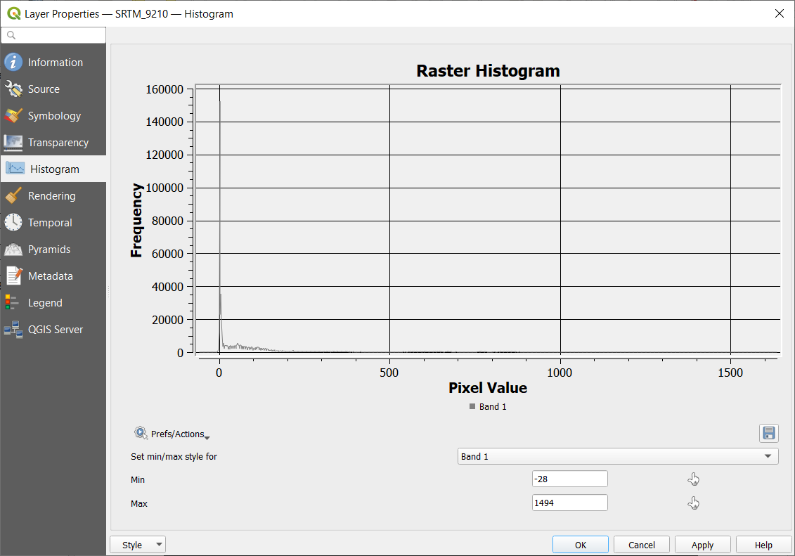

Hình 9.18 - Phóng to histogram vừa được tính toán của DSM_mosaic_9210 

Không chỉ là xem phân phối của các giá trị số của pixel, histogram cho phép người dùng tái phân loại các giá trị để trực quan hoá raster. Để làm điều này, sử dụng 02 công cụ để xác định các giá trị min và max mới trên histogram (Hình 9.19) 


Hình 9.19 - Chọn giá trị min và max để tái phân loại raster

Sau khi chọn Apply, raster sẽ hiển thị lại với khoản min-max mới này. Chức năng này cho phép người dùng bỏ qua các giá trị cực trị có thể dẫn đến việc phóng đại các dị thường của raster.

Mặc dù công cụ kết tiếp chúng ta sử dụng là một plugin (xem Module 1 - giới thiệu Plugin), chúng tôi cho rằng nó rất hữu dụng khi bắt đầu làm việc với raster. Chúng tôi đang đề cập đến **Value Tool**, cho phép xác định tức thời các giá trị cell bằng cách di chuột qua các raster layer.

Vào **Plugin ‣ Manage and Install Plugins**, tìm **Value Tool** plugin và chọn install. Sau đó, kích phải chuột vào thanh cửa sổ chính của QGIS để mở tất cả các Panels và Toobars sẵn dùng trong QGIS và chọn **Value Tool panel**. Kiểm tra lại giao diện QGIS để xem nó đã mở ở đâu.


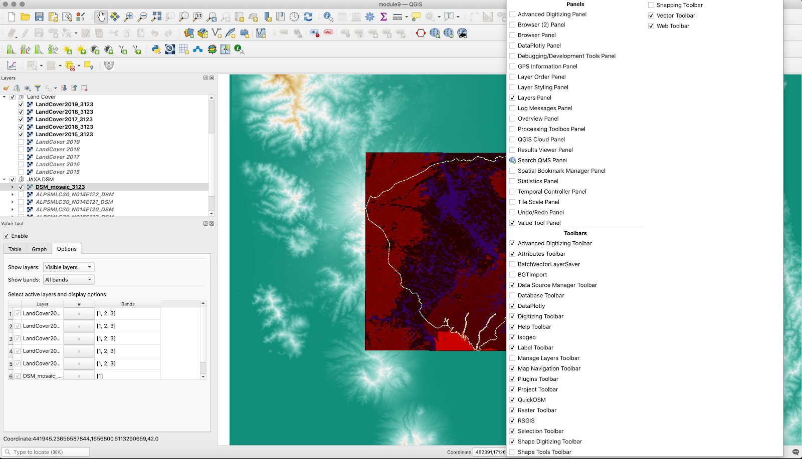

Hình 9.20 - Value Tool Panel

Tính thực tế của công cụ này nằm ở sự đơn giản khi sử dụng, chỉ với một vài các kích chuột, người dùng có thể rất dễ dàng trích trọc giá trị các cell trong các khu vực quan tâm. Hơn nữa, nó cho phép xem cùng lúc tất cả các raster layer được tải trong QGIS.

Value Tool có 3 tab: Table, Graph, Options (Hình 9.21).

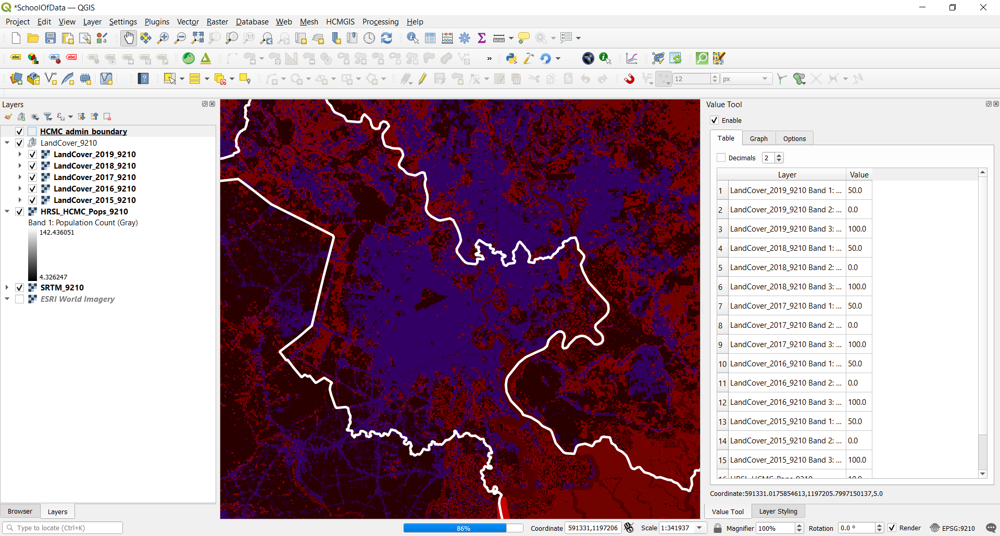

Hình 9.21 - Value Tool với tab đầu tiên - Table

Tab đầu tiên - Table - hiển thị danh sách các layer được load trong QGIS và giá trị của các cell khi người dùng di chuyển chuột. Ngoài ra có thể tuỳ chọn bao nhiêu số thập phân để hiển thị giá trị. Nếu con trỏ chuột di chuyển ra ngoài phạm vi của raster, thay vì hiển thị giá trị, một thông báo sẽ được hiển thị: “out of extent”.

Tab thứ hai - Graph - hiển thị một biểu đồ duy nhất cho tất cả các dữ liệu mà nó đọc được từ vị trí con trỏ chuột. Nó cho phép người dùng thêm các giá trị min và max trên trục Y - là trục của các giá trị cell. Trục X liệt kê tất cả các kênh ảnh của raster hiển thị trong Table, với các số thứ tự tương ứng: kênh ảnh có số thứ tự 1 trong tab đầu tiên cũng sẽ có thứ tự 1 trong Graph.

Tab thứ ba cho phép người dùng tuỳ chỉnh hiển thị cho `Value Tool`: layer (tất cả, chỉ các visible layer hoặc chỉ các layer được chọn), các kênh ảnh hiển thị,...


#### **Câu hỏi**

1. Các raster layer có thể được reproject sang CRS khác được không?
*   <span style="text-decoration:underline;">Yes.</span>
*   No
2. Có thể có bất cứ khoảng hở nào giữa các khoản giá trị trong histogram của một raster layer?
*   Yes. 
*   <span style="text-decoration:underline;">No.</span>
3. Các kênh ảnh khác nhau của cùng một raster có thể có độ phân giải khác nhau hay không?
*   _Yes._ 
*   No. 


### Phase 2: Làm việc với dữ liệu raster

Bây giờ chúng ta đã học cách trích lọc các thông tin cơ bản của raster, chúng ta sẽ tiếp tục với xử lý dữ liệu raster chuyên sâu để có được các raster dẫn xuất mới, và do đó, có thêm thông tin. 

Như bạn có thể nhận thấy, do cấu trúc mô hình dữ liệu raster, các layer chúng ta đã tải có phạm vi phủ trùm lớn hơn ranh giới hành chính của Tp.HCM. Đó là điều không mong muốn do một số lí do, nhưng lí do chính là bởi vì bạn xử lý nhiều dữ liệu hơn bạn thực sự cần, điều này dẫn đến nhu cầu lưu trữ và tính toán lớn hơn. Đó là lí do tại sao, trước khi tiếp tục các bước tiếp theo, chúng ta sẽ đảm bảo rằng chúng ta xử lý đúng với dữ liệu mà chúng ta cần. **Hãy lưu ý** khi bạn bắt đầu làm việc với dữ liệu của mình, kích thước của file là một yếu tố quan trọng khi nói đến thời gian xử lý. Khi file càng lớn thì cần nhiều thời gian hơn để xử lý. Do cấu trúc mô hình dữ liệu - raster so với vector - các file raster thường lớn hơn nhiều. 

Như bạn đã thấy bây giờ, các lớp dữ liệu được tải trong QGIS có thể được xử lý cùng nhau ngay cả khi chúng có bản chất khác nhau, như việc nối các bảng csv vào vector để thêm thông tin thuộc tính. Điều này cũng tương tự cho dữ liệu raster và vector, như chúng ta sẽ thấy sau đây.

Để chỉ làm việc với raster layer trong phạm vi ranh giới Tp.HCM, chúng ta sẽ sử dụng layer HCMC_admin_boundary để cut/ clip tất cả các raster layer liên quan. Truy cập **Raster ‣ Extraction ‣ Clip Raster by Mask Layer** (Hình 9.22). Tương tự, bạn có thể tìm kiếm từ khoá Clip trong Processing Toolbar hoặc Locator bar.


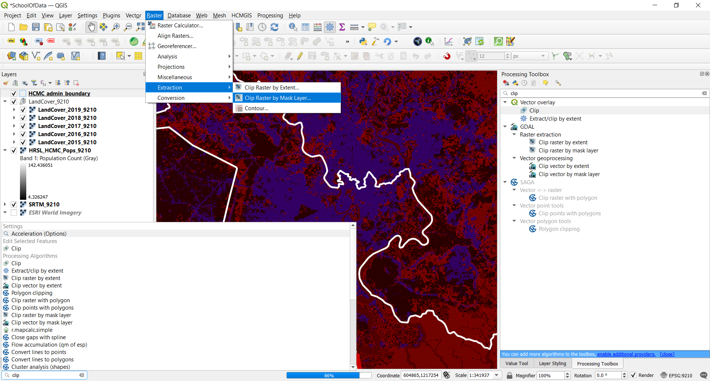

Hình 9.22 - Sử dụng một vector mask để trích lọc dữ liệu raster trong một khu vực cụ thể

Giả sử rằng chúng ta sẽ làm việc với 7 raster layer - 5 Land Cover layer - DSM và HRSLl, chúng ta sẽ sử dụng Batch Processing để clip tất cả các layer cùng lúc. **Hãy lưu ý,** nếu bạn bỏ qua bước reproject các layer, thuật toán này sẽ không thể thực thi hoặc cho ra kết quả không mong muốn.

Cửa sổ thiết lập Batch Processing như Hình 9.23


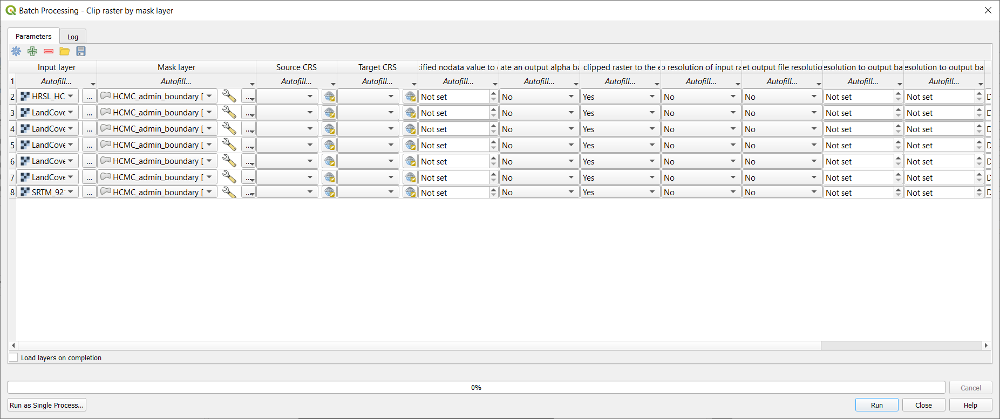

Hình 9.23 - Batch process clip tất cả các raster layer bởi ranh giới hành chính TP.HCM

Các tham số được nhập như sau:
* mask layer: HCMC_admin_boundary
* source và target CRS: EPSG 9210
* Chọn yes: `match the extent of the clipped raster to the mask layer` và `keep resolution of input layer`. 
* Lưu ý, đối với DSM_mosaic chúng ta sẽ chỉ chọn yes ` to create an output alpha band`
* Chọn `Load layers at completion`

Nếu mọi thứ diễn ra suôn sẻ, kết quả như Hình 9.24


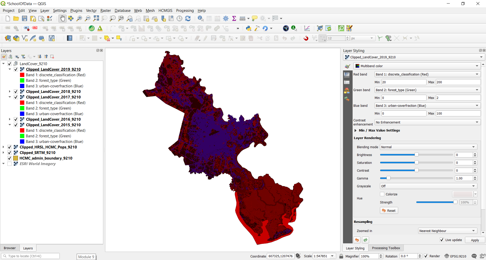

Hình 9.24 - Raster layers được clip bởi ranh hành chính Tp.HCM.  

Bây giờ, tưởng tượng bạn phải chuẩn bị một báo cáo những nơi mà hầu hết cư dân đang sinh sống nhưng có xem xét đến cao độ[^4]. Bạn phải biết có bao nhiêu người dân sinh sống trong khoảng cao độ 0 - 20m ở Tp.HCM. Có một số yếu tố cần xem xét. Đầu tiên, các dữ liệu chúng ta sẽ sử dũng là gì và đặc điểm của chúng. Đối với dân số, chúng ta có High Resolution Settlement Layer Data và đối với lớp địa hình, chúng ta có ALOS World 3D - 30m (AW3D30). Cả 2 raster layer này đều có cùng độ phân giải không gian 30m, cho phép chúng ta tiến hành các xem xét khác. Địa hình là một yếu tố liên tục, trong khi phân bố dân số thì rời rạc, nhưng báo cáo sẽ không có ý nghĩa với pixel 30m. Chúng ta cần xác định tất cả các pixel có giá trị trong khoảng 0 - 200. Xem xét histogram của DSM_mosaic, chúng ta đã thấy hầu hết giá trị của các cell nằm trong khoản 0 - 200. Chúng ta có thể xử lý để tạo một bản đồ địa hình cơ bản dựa trên các khoản sau:

1. 0 - 50m
2. 51 - 100m
3. 101 - 150m
4. 151 - 200m
5. 250 - 600m
6. 600 - 1300m

Sử dụng các kiến thức đã học trong Module 4, chúng ta có thể style DSM layer theo các khoản giá trị này, như Hình 9.25


Hình 9.25 - DSM_mosaic_clipped

Để tính toán số cư dân dựa trên dữ liệu raster HRSL sống ở độ cao 200m ở Tp.HCM, chúng ta phải xem pixel nào thuộc vào từng khoản giá trị này. Để làm điều đó, chúng ta sẽ sử dụng **Raster Calculator**. Chư1c năng này cho phép người dùng thực hiện các tính toán trên cơ sở của các giá trị pix. Các kết quả được lưu thành một raster layer mới ở định dạng hỗ trợ bởi thư viện xử lý dữ liệu rastert GDAL [^5].

Có một số cách để gọi raster calculator trong QGIS. bạn có thể truy cập từ Menu bar **Raster ‣ Raster Calculator** hoặc tìm kiếm trong Processing Toolbox hoặc Locator bar. Nếu chúng ta chạy Raster Calculator từ Raster Analysis trong Processing Toolbox, cửa sổ như Hình 9.26b sẽ xuất hiện


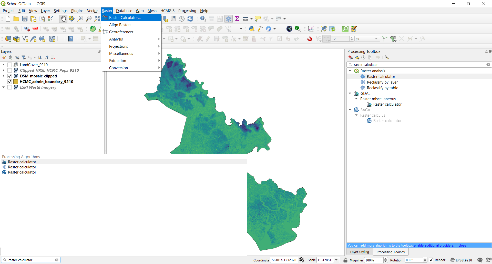

Hình 9.26a - Truy cập Raster calculator


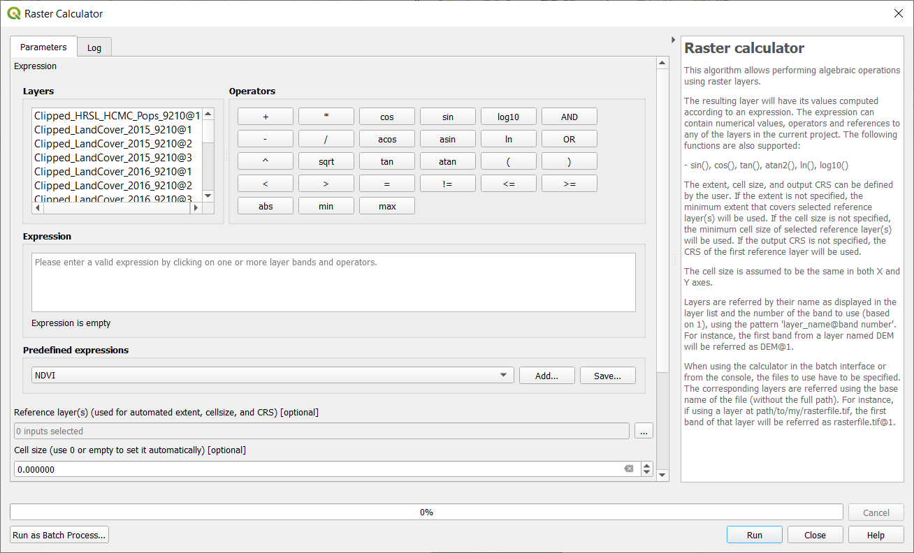

Hình 9.26b - Giao diện Raster calculator

Trong cửa sổ này, chúng ta có thể nhận thấy các phép toán đã được trình bày trong phần Khái niệm như cộng, trừ, so sánh,... (xem trang 3). **Clipped_Reprojected_Merged_SRTM@1** là quy ước tên gọi của các raster: phần phía trước @ là tên của raster layer, phía sau @ là số hiệu kênh phổ.

Tiếp theo, chúng ta sẽ ‘slice’ DSM_mosaic_clipped raster layerd để chỉ trích lọc các pixel có giá trị đến 200m. Chúng ta biết rằng các giá trị cell của DSM-mosaic_clipped represent biểu diễn các dữ liệu số liên tục (không phải là giá trị rời rạc như lớp LandCover). Do đó, phép toán chúng ta cần thực thi trong trường hợp này là phép toán so sánh - cell values <= 200m, với công thức tính toán như sau: 

```
"Clipped_Reprojected_Merged_SRTM@1" <= 200
``` 
Chọn **Reference layer** là **Clipped_Reprojected_Merged_SRTM@1** như Hình 9.27

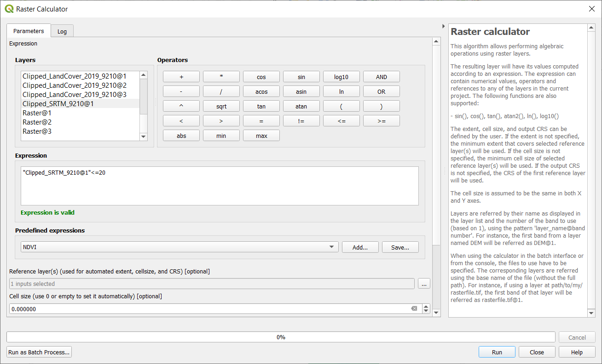

Figure 9.27 - Thêm công thức tính toán trong Raster Calculator. 

Kết quả như hình 9.28


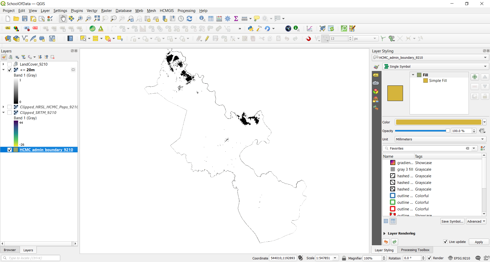

Hình 9.28 - Kết quả xác định các pixel có giá trị <= 200m trong Raster Calculator

Kết quả sẽ được đặt tên là `Output`. Bạn có thể sửa tên thành `< 200`. Như chúng ta có thể thấy trong Layers Panel, raster layer vừa tính toán chỉ có 02 giá trị là 0 và 1. Đó là do chúng ta sử dụng phép toán so sánh, do đó các pixel có giá trị <= 200m sẽ nhận giá trị mới = 1 và ngược lại là = 0. Chúng ta có thể kiểm tra điều này bằng `Value Tool`. Hình 9.29 chỉ hiển thị các pixel có giá trị 1, hay nói cách khác là các pixel chúng ta quan tâm trong bài tập này.


Hình 9.29 - Phân bố không gian của tất cả các pixel có giá trị 1, nghĩa là có cao độ <= 200m 

Đi xa hơn, chúng ta có thể hiển thị phân bố không gian của dân số ở độ phân giải không gian 30m chỉ trong khu vực địa lý cụ thể này - Tp.HCM và có cao độ dưới 200m. Để làm điều này, chúng ta tiếp tục sử dụng Raster Calculator.

Công thức khá đơn giản, với tất cả các giá trị DSM cell mà chúng ta quan tâm có giá trị là 1.

Mở Raster Calculator và thêm vào công thức sau:

```
"< 200@1"*"Reprojected_HRSL_Pampanga_Population@1"
```


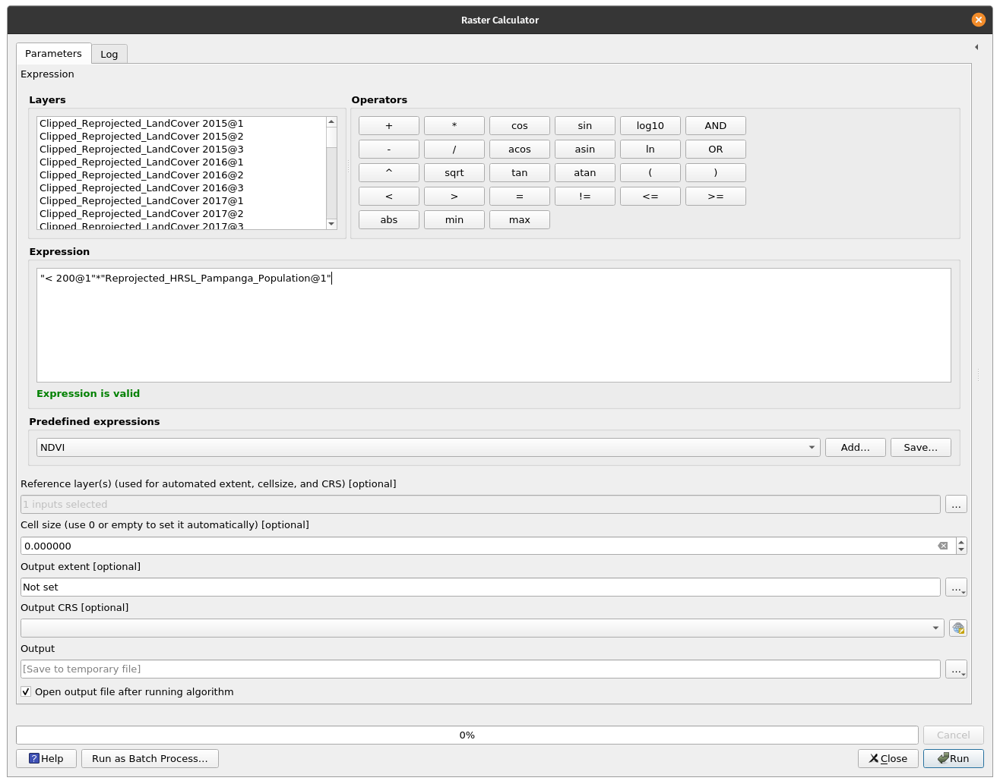

Hình 9.30 - Sử dụng Raster Calculator để xác định các lớp phân bố dân cư có cao độ <= 200m

Khác với công thức Raster Calculator đã dùng ở trên, chúng ta sử dụng 2 raster layer khác nhau để có được kết quả mong muốn, tuy nhiên bạn sẽ thấy rằng ngay cả khi có các pixel nằm ngoài DMS_clipped200.tif trong kết quả, giá trị của chúng là 0. Sử dụng Value Tool để kiểm tra (Hình 9.31)

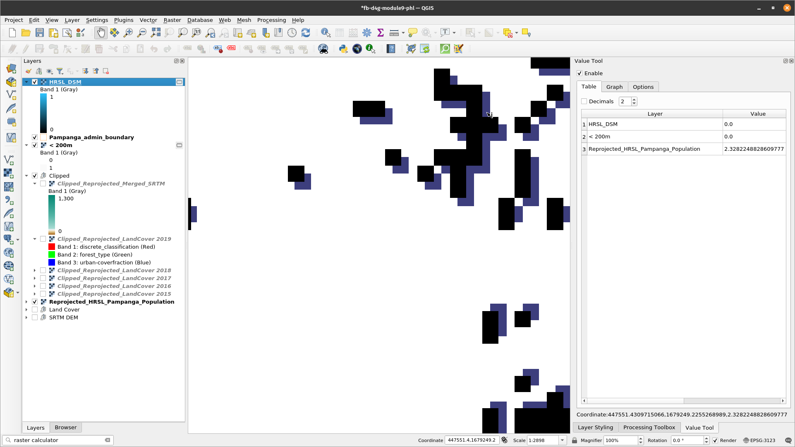

Hình 9.31 - Sử dụng Value Tool để kiểm tra kết quả của Raster Calculator

Bạn có thể thầy rằng ngay cả khi Reprojected_HRSL_Pampanga_Population có các giá trị ở các vị trí con trỏ chuột cụ thể này, raster thu được bằng Raster Calculator HRSL_DSM có giá trị 0.

Tiếp theo, chúng ta biểu diễn sự phân bố không gian của dân số sống dưới cao độ 200m ở Tp.HCM. Để chọn phương pháp phân lớp thích hợp, chúng ta tính toán histogram. Chúng ta có thể thấy rằng hầu hết các giá trị nằm trong khoảng 0.1 - 200 người/ 30m, như Hình 9.32


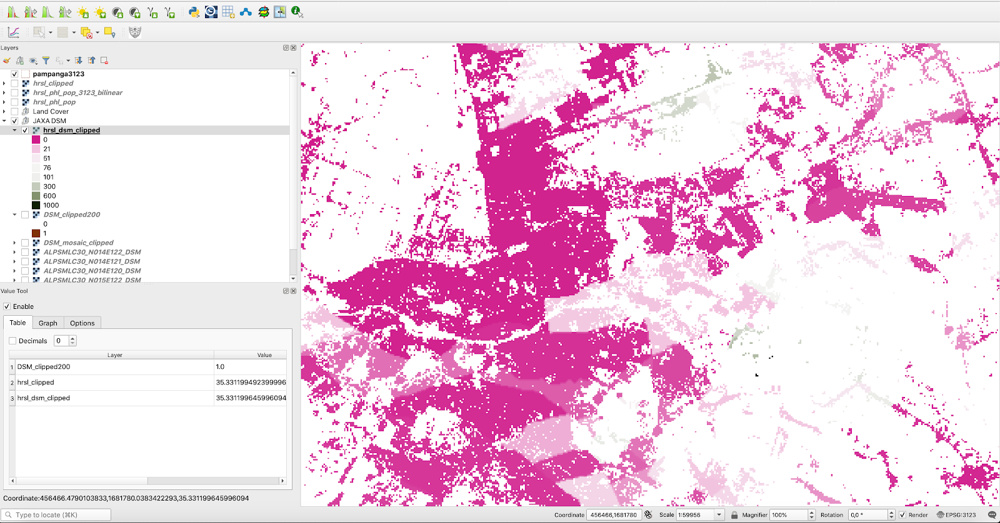

Hình 9.32 - Phân bố của dân số sống dưới cao độ 200m ở Tp.HCM, độ phân giải 30m.

Nếu chúng ta quan tâm đến tổng số dân sống dưới cao độ 200m ở Tp.HCM mà không quan tâm sự phân bố địa lý ở độ phân giải 30m, chúng ta cần tính tổng tất cả các giá trị pixel của raster layer HRSL_DSM. Một cách để có được con số này là chuyển đổi DSM_clipped200 từ raster thành vector [....]

Truy cập **Raster ‣ Conversion ‣ Polygonize (Raster to Vector)** (Hình 9.33)


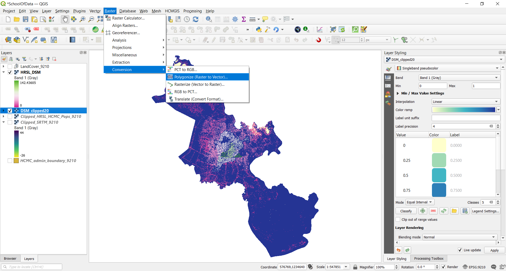

Hình 9.33a - Chuyển đổi raster sang vector

Nên nhớ rằng raster layer này chỉ có 2 giá trị - 0 và 1, vì vậy hãy chọn làm tham số để tạo vetor là DN (digital number)


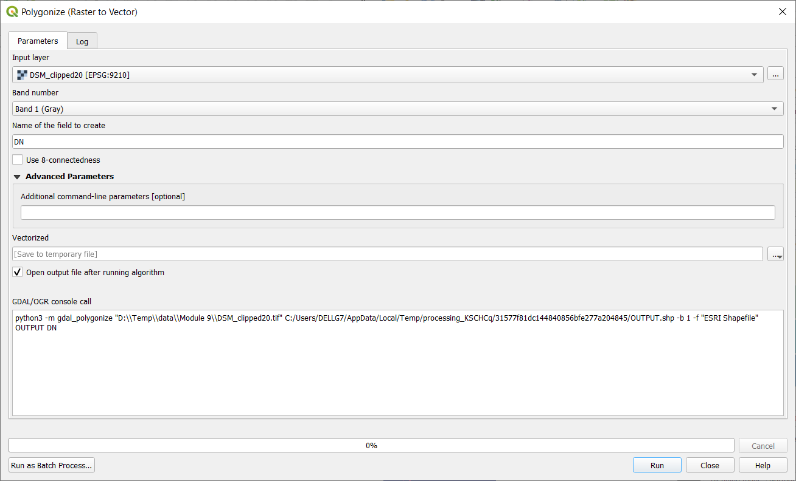

Hình 9.33a - Các tham số chuyển đổi Raster sang vector

Kết quả như Hình 9.34. 


Hình 9.34 -  Kết quả sau khi chuyển đổi raster sang vector. 

Xoá các đối tượng có giá trị 0.

Để tìm câu trả lời, chúng ta sẽ sử dụng **Zonal Statistics**, Để tìm nhanh chức năng này, mở Processing Toolbox và gõ vào ô tìm kiếm từ khoá “zonal” (Hình 9.35).


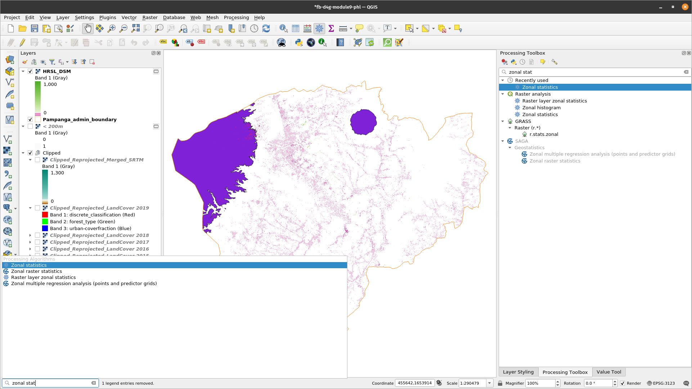

Hình 9.35 - Tìm Zonal Statistics trong Processing Toolbox

Chọn các tham số như Hình 9.36. Ở mục statistics to calculate, chọn: count, sum, min và max. 


Hình 9.36 - Thiết lập các tham số cho Zonal Statistics

Kết quả là một vector layer có các thuộc tính thống kê đã được chọn trong bước trên (Hình 9.37)


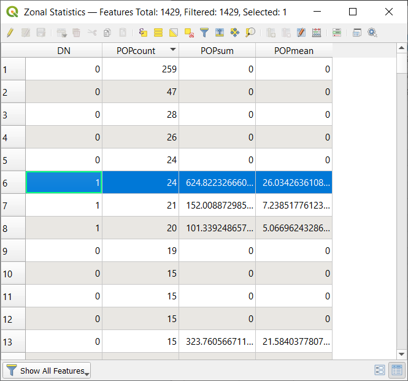

Hình 9.37 - Kết quả của Zonal Statistics

Bước cuối cùng này đã trả lời cho bài tập của chúng ta, có bao nhiêu người (và ở đâu) đang sống dưới cao độ 200m tại Tp.HCM.


#### **Câu hỏi**

1. Dữ liệu raster có thể clip được không?
*   _<span style="text-decoration:underline;">Yes</span>._
*   _No._
2. Người dùng có thể sử dụng vector layer có trong QGIS project trong Raster Calculator không?
*   _Yes._
*   _<span style="text-decoration:underline;">No.</span>_
3. Có thể chuyển đổi raster sang vector hay không?
*   _<span style="text-decoration:underline;">Yes</span>._
*   _No._


### **Phase 3: Làm việc với dữ liệu raster và vector.**

Trong phần trước, chúng ta đã thấy cách xử lý 2 raster để lấy thông tin mới. Chúng ta đã sử dụng DSM và High Resolution Settlement Layer để tìm xem có bao nhiêu người sống dưới cao độ 200m ở Tp.HCM. Trước khi thực hiện bất kì phân tích nào, chúng ta đảm bảo rằng các dữ liệu phải cùng hệ toạ độ, hơn nữa, nếu raster có cùng độ phân giải không gian thì các kết quả nhận được là khả thi. Khi nói đến cùng CRS thì đã rõ, nhưng tại sao lại cùng độ phân giải không gian?

Hãy nhớ lại độ phân giải không gian là kích thước của bề mặt đất được đo bằng đơn vị chiều dài, hay nói cách khác, kích thưƠ1c của pixel được đo trên mặt đất. Nếu một raster có độ phân giản 30m, điều đó có nghĩa là vật thể tuyến tính nhỏ nhất mà chúng ta có thể phát hiện trên ảnh đó là 30m, nếu nhỏ hơn thì chúng ta không thể phát hiện được. Tương tự, chúng ta có thể so sánh với tỉ lệ bản đồ. Nếu bản đồ có tỉ lệ 1:25000, điều đó có nghĩa là 1 đơn vị chiều dài trên bản đồ tương ứng với 25000 đơn vị chiều dài trên mặt đất, 1cm trên bản đồ bằng 250m ngoài thực địa, Ví dụ, một con đường dài 2km sẽ có chiều dài 8cm trên bản đồ.

Tại sao điều này lại quan trọng khi làm việc với dữ liệu raster? Hình 9.38 có thể đưa ra lời giải thích


Hình 9.38 - Ví dụ về các độ phân giải khác nhau cho các ảnh vệ tinh khác nhau - Landsata và SPOT - cho cùng một khu vực

_(Photo credit: Congedo,  L.  and  Munafò,  M, (2013) Assessment  of  Land  Cover  Change  Using Remote  Sensing:  Objectives,  Methods  and  Results, Rome:  Sapienza  University.  Available  at:
http://www.planning4adaptation.eu/_

Hình 9.38 mô tả chi tiết mối quan hệ giữa độ phân giải của ảnh vệ tinh và thông tin lớp phủ mặt đất được trích xuất từ những hình ảnh thu được này. Như chúng tôi đã trình bày chi tiết trong phần đầu, giá trị của pixel đại diện cho toàn bộ khu vực mà nó bao phủ, nhưng điều đó không có nghĩa là đúng so với thực địa. Những quyết định do các chuyên gia EO đưa ra các sản phẩm khác nhau dựa trên hình ảnh quan sát trái đất - tát cả đều được ghi lại trong các bài báo và mô tả thuật toán được bình duyệt. Các giải thích sâu hơn nằm ngoại phạm vi của Module, nhưng điều quan trọng là phải ghi nhớ mối quan hệ giữa các cảm biến trên các vệ tinh và các sản phẩm mà chúng ta sử dụng.

Trở lại khu vực nghiên cứu - Tp.HCM - chúng ta có thể kiểm tra những sự khác nhau này với các dữ liệu chúng ta có trong tay. Chúng ta đã tải vào QGIS project 5 raster layer về LandCover trong 5 năm: 2015, 2016, 2017, 2018 và 2019. Tiếp theo, chúc ta sẽ tải một ảnh mosaic của Sentinel-2[^6]. Chúng ta sẽ tải WMS layer  EOX Sentinel-2 cloudless, có [tại đây](https://s2maps.eu/). , vào **Layer ‣ Add layer ‣ Add WM/WMTS Layer..**

Nhập các tham số sau đây:
```
Name: EOX Sentinel-2
URL: https://tiles.maps.eox.at/wms?service=wms&request=getcapabilities
```


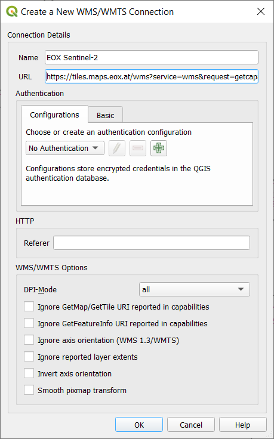

Hình 9.39 - Thêm WMS layer vào QGIS 

Sau khi kết nối đến WMS mới thêm vào, chúng ta sẽ tải Sentinel-2 cloudless layer for 2019 by EOX - 4326 vào QGIS. Sau khi phóng to đến khu vực nghiên cứu sẽ như Hình 9.40


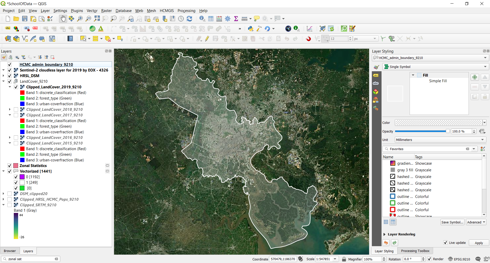

Hình 9.40  - Sentinel-2 cloudless layer for 2019 by EOX - 4326 Cho Tp.HCM

Mặc dù các sản phẩm LandCover được thu thập sư3 dụng dữ liệu vệ tinh khác (Proba-V), chúng ta hãy so sánh 2 layer để chúng ta có thể hiểu ý nghĩa của việc khác độ phân giải là gì. Nên nhớ rằng dữ liệu LandCover có độ phân giản 100m và ảnh Sentinel 2 có độ phân giải 10m. Để làm điều này, chúng ta sẽ mở Clipped_Reprojected_LandCover 2019 và WMS layer. Để so sánh giữa 02 layer, chúng ta sẽ sử dụng một plugin mới: truy cập **Plugins ‣ manage and install plugins**, tìm kiếm `MapSwipe Tool` và chọn install. Sau khi cài đặt thành công, một biểu tượng mới xuất hiện trên QGIS Toolbar  (). 


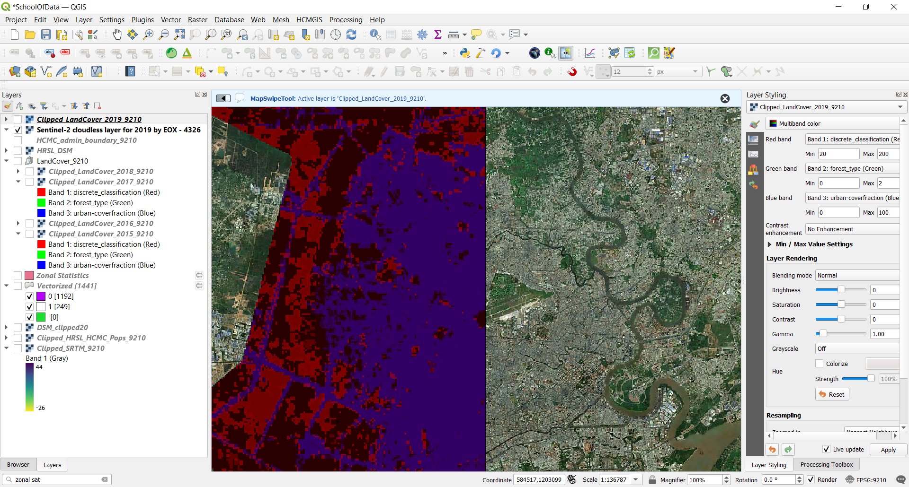

Hình 9.41 - So sánh 2 raster layer sử dụng MapSwipe Tool plugin 

Để kích hoạt MapSwipe tool, kích vào công cụ này trong khi raster layer được chọn trong Layers Panel. Sự khác biệt về độ phân giải là rõ dàng, cũng như thực tế là sản phẩm vệ tinh (Land Cover) được phát triển sử dụng ảnh vệ tinh (PROBA-V) có độ phân giải thấp hơn (Hình 9.42) 


 nằm trên ảnh Sentinel 2 mosaic (30m)")

Hình 9.42 - LandCover2019 được tạo từ PROBA-V(100m) nằm trên ảnh Sentinel 2 mosaic (30m)

Thêm layer HRSL vào bản đồ sẽ cho thấy sự phù hợp tốt giữa HRSL và LandCover. Các khu vực đô thị được biểu diễn bằng màu đỏ như bạn thấy trong Hình 9.43, nó hầu như được bao phủ hoàn toàn bởi HRSL layer.


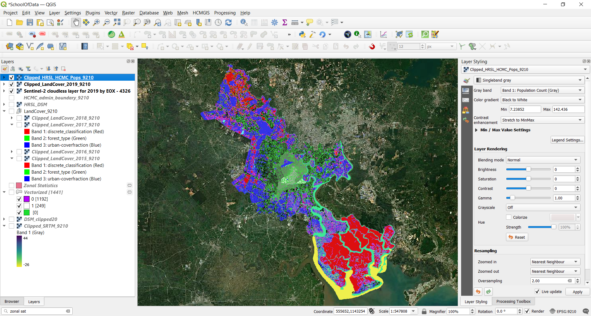

Hình 9.43 - HRSL được thêm vào nằm trên Clipped_Reprojected_LandCover 2019.

Tuy nhiên, khi phóng to bạn có thể thấy sự khác biệt về độ phân giải giữa 2 raster như Hình 9.44

 và Clipped_Reprojected_LandCover 2019  (100m - màu đỏ và màu cánh sen)e_tooltip")

Hình 9.44 - Sự khác biệt về độ phân giải giữa HRSL (30m - màu hồng nhạt) và Clipped_Reprojected_LandCover 2019  (100m - màu đỏ và màu cánh sen)

Bây giờ, nếu có bất cứ phép phân tích nào được thực hiện trên các raster này, thì kết quả sẽ không khả thi, bởi vì chúng ta phải so sánh các giá trị pixel ở các độ phân giải khác nhau. Ở giai đoạn tiền xử lý, người dùng phải _resample_ để đưa các raster về cùng độ phân giải không gian.

**Resampling** là việc thay đổi các giá trị cell do như4ng thay đổi trong cell grid và chỉ có 2 tuỳ chọn: (1) **upsampling** cho trường hợp chúng ta đang chuyển lên độ phân giải cao hơn/ kích thước cell nhỏ hơn và (2) **downsampling** là resampling xuống độ phân giải thấp hơn/ kích thước cell lớn hơn.

Chúng ta hãy tưởng tượng bài tập sau. Chúng ta cần xác định dân số cho mỗi nhóm của lớp phủ mặt đất mà chúng ta đã định nghĩa trong Tp.HCM. Như đã giải thích trong phần trên, chúng ta cần _tiền xử lý_ dư4 liệu chúng ta có để có được các kết quả khả thi từ phân tích dữ liệu, nghĩa là, trong trường hợp này, chúng ta cần đưa cả 02 tập dữ liệu raster về cùng độ phân giải không gian. Như đã trình bày chi tiết ở trên, chúng ta có thể tăng hoặc giảm kích thước của pixel. Cần phải nhất mạnh rằng, resample, dù là upsample hay downsample sẽ liên quan đến phép nội suy (chi tiết xem trang 12) - do đó kết quả sẽ xuất hiện lỗi thống kê. Thực tế thông thường là resample tất cả các raster để tương ứng với raster có độ phân giải thấp hơn, nhưng một lần nữa quyết định này phải được xem xét đến tất cả các yếu tố. Chi tiết về quy trình ra quyết định cho resampling raster layer vượt xa phạm vi của giáo trình này. 

Cần nhấn mạnh sự khác biệt giữa 02 sản phẩm: LandCover bao phủ **toàn bộ khu vực** trong phạm vi nghiên cứu, trái với HSRL với raster layer chỉ chứa đúng các cell có giá trị > 0. Tình huống này đặt ra các vấn đề khi nội suy các giá trị cell để resample, bởi vì bất kể phương pháp nội suy nào đưỢc chọn, nó cũng xem xét các pixel xung quanh, tuân theo một thuật toán cụ thể được xác định rõ ràng và trong trường hợp cụ thể này, các pixel biên không nằm trên biên của khu vực nghiên cứu mà nằm bên trong đó. Do đó, trong trường hợp thử nghiệm, chúng ta sẽ xem xét việc upsampling LandCover từ độ phân giải 100m lên 30m để phụ hợp với độ phân giải của LandCover. Phương pháp resampling mà chúng ta chọn là quan trọng vì kết quả có thể thay đổi đáng kể. Với mục đích thử nghiệm, chúng ta sẽ resmaple LandCover sử dụng 02 phương pháp khác nhau - Nearest Neighbour và Mode. 

Để resample, truy cập **Raster ‣ Projections ‣ Wrap (reproject).** và nhập các tham số sau:
* input layer: Clipped_Reprojected_LandCover 2019, 
* Source CRS and Target CRS: EPSG: 9210, 
* Resampling method: Nearest Neighbour, 
* No data: 255, output file resolution: 30, 
* Output data type: giống như input layer type, 
* georeference extent: Clipped_Reprojected_LandCover 2019 layer. 

Lưu layer đầu ra là LC2019_NearestNeighbour


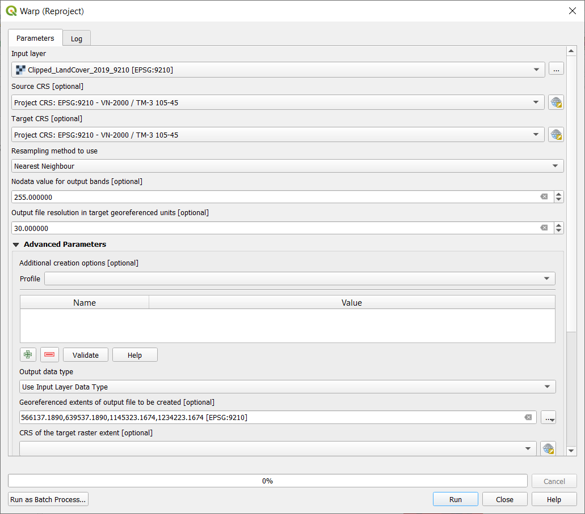

Hình 9.45 - Resampling Land Cover layer


Thực hiện theo các bước như trên, chỉ khác là Resampling method chọn là Mode. Lưu layer đầu ra là LC2019_Mode.

Bây giờ, hãy so sánh các kết quả - xem Hình 9.46a và 9.46b


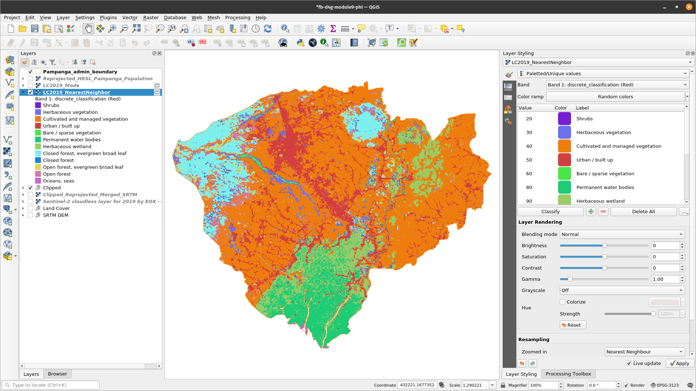

Hình 9.46a - Resampling Land Cover sử dụng phương pháp Nearest Neighbour


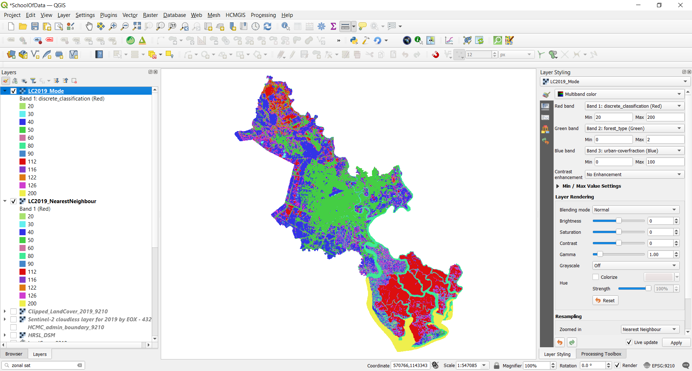

Hình 9.46b - Resampling Land Cover sử dụng phương pháp Nearest Neighbour

Cả hai raster đều được áp dùng cùng một symbology và chúng ta có thể thấy rằng trong Hình 9.45 có các giá trị không thuộc danh mục nào - pixel không hiển thị. Tuy nhiên, chúng ta biết rằng LandCover là một layer liên tục - không có khoảng cách giữa các danh mục giống nhau được định nghĩa. Chúng ta hãy tìm hiểu sâu hơn và quan sát histogram của 03 layer này. Truy cập **Properties ‣ Histogram** và chọn từ Prefs/Actions để chỉ hiển thị Band 1. Lưu histogram bằng cách kích chuột vào biểu tượng save nằm bên phải cửa sổ (Hình 9.47)


Hình 9.47 - Chỉ hiển thị các giá trị của band được chọn trong histogram 

Figure 9.48 (a), (b) and (c) trình bày 03 histogram. 


 Clipped_Reprojected_LandCover 2019")

 LC2019_NearestNeighbour")

 LC2019_Mode")

Hình 9.48 - Histograms của (a) Clipped_Reprojected_LandCover 2019 (100m), (b) LC2019_NearestNeighbour và (c) LC2019_Mode

Chúng ta có thể thấy sự khác biệt trong phân bố các giá trị của 3 tập dữ liệu, nhấn mạnh vào (b), trong đó chúng ta đã sử dụng phương pháp nearest neighbour resampling, kết quả - như mong đợi - trong các giá trị pixel được tính toán và dẫn đến các giá trị không tương ứng với bất kì giá trị nào của Land Cover (xem Bảng 1, trang 7). Do đó, các khoảng trắng - pixel không được gán màu như trong hình 9.45. Suy ra, phương pháp mode resampling - hoặc gọi là majority resampling - chọn giá trị xuất hiện thường xuyên nhất.

Đến đây, map canvas sẽ như Hình 9.49. 


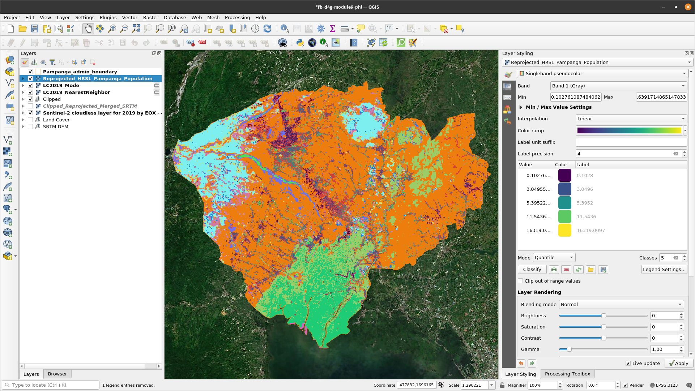

Hình 9.49 - Hai lớp raster: Land Cover 2019 và HRSL. 

Trơ3 lại bài tập của chúng ta, yêu cầu là xác định dân số tương ư1ng với từng loại lớp phủ mặt đất mà chúng ta đã xác định ở Tp.HCM. Đến thời điểm này, chúng ta đã tiền xử lý dữ liệu raster, cụ thể là chuyển về cùng hệ toạ độ và cùng độ phân giải không gian. Chúng ta sẽ tiếp tục với thuật toán chuyển đổi - chuyển Land Cover raster sang vector với kiểu là polygon. Điều này sẽ cho phép chúng ta xác định dễ dàng hơn dân số cho mỗi loại đất.

Để chuyển đổi raster sang polygon, cũng như từ vector sang polygon, truy cập **Raster ‣ Conversion**. Chúng ta sẽ chọn **Polygonize (Raster to vector)..** để chuyển sang vector các raster mới nhất mà chúng ta vừa có: LC2019_Mode. Kết quả như Hình 9.50b


 raster layer chuyển sang polygon")

Hình 9.50a - Chuyển LC2019_Mode (30m) raster layer sang polygon


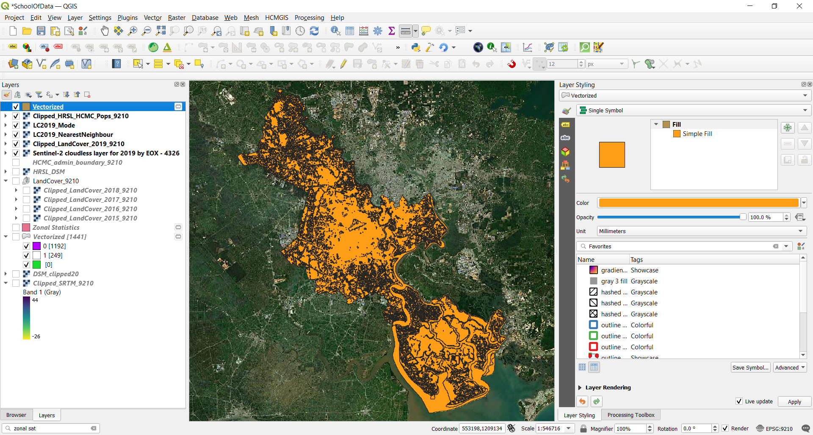

Hình 9.50b - Kết quả chuyển LC2019_Mode (30m) sang polygon

Như chúng ta có thể thấy, mỗi pixel - mỗi nhóm các pixel liền kề có cùng mã danh mục (xem bảng 1, trang 7) được chuyển đổi sang polygon. Tuy nhiên, chúng ta không quan tâm đến từng khu vực riêng biệt, mà trong toàn bộ danh mục. Do đó, chúng ta sẽ sử dụng chức năng dissolve vector layer theo thuộc tính mã danh mục (**Vector ‣ Geoprocessing tools ‣ Dissolve** - chi tiết xem Module 8).


Áp dụng cùng styling với raster layer và chúng ta có thể thấy kết quả như Hình 9.51


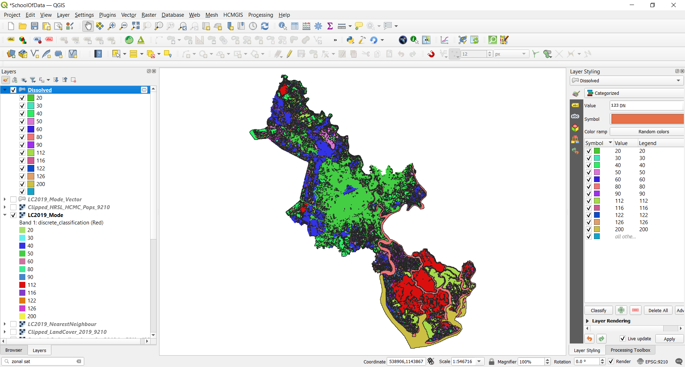

Hình 9.51 - LC2019_Mode dạng polygon 

Như chúng ta có thể thấy các pixel của HRSL, như mong đợim không hoàn toàn nằm trong một polygon của Land Civer (Hình 9.52)


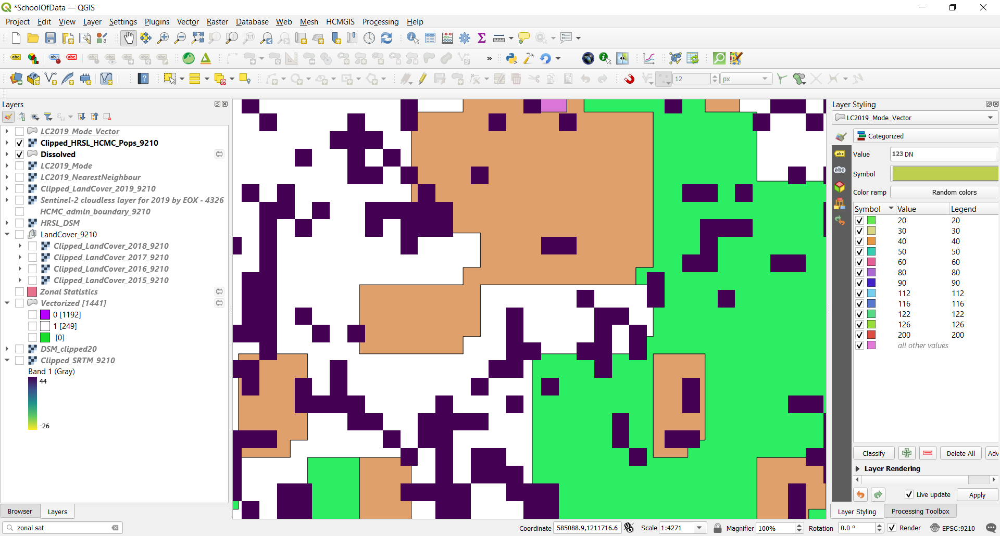

Hình 9.52 - Sự không khớp của pixel HRSl và tập dữ liệu vectơ lớp phủ mặt đất.

Để loại bỏ sự bất tiện này, chúng ta cũng sẽ vector hoá HRSL layer, chỉ là lần này chúng ta sẽ chuyển các giá trị pixel sang dạng điểm - là tâm của mỗi pixel.

Truy cập **Processing ‣ Toolbox**, gõ vào ô tìm kiếm từ khoá `raster point` và chọn `Raster pixels to points` (Hình 9.53a). Lưu kết quả với tên HRSL_points.


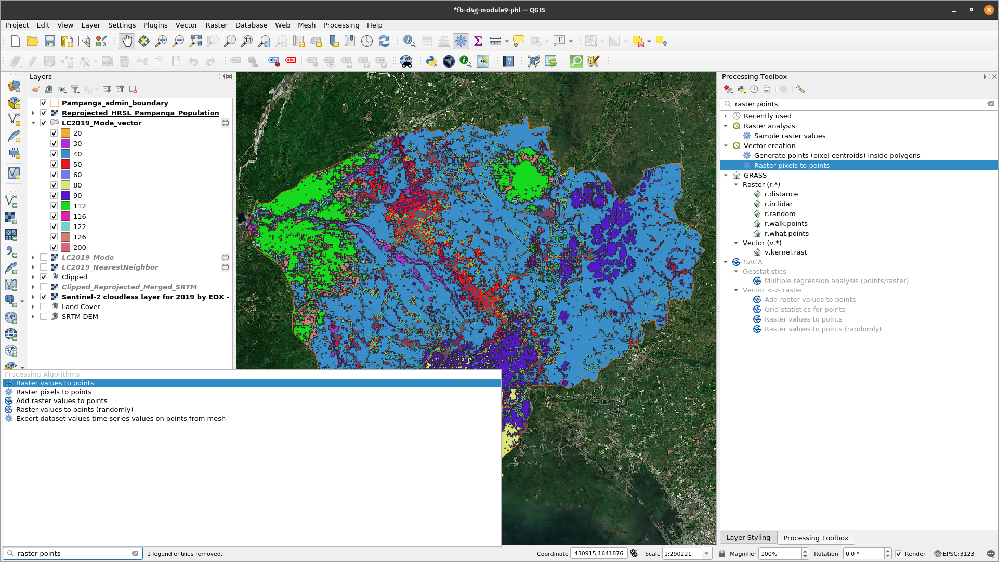

Hình 9.53a - Chức năng Raster pixels to points


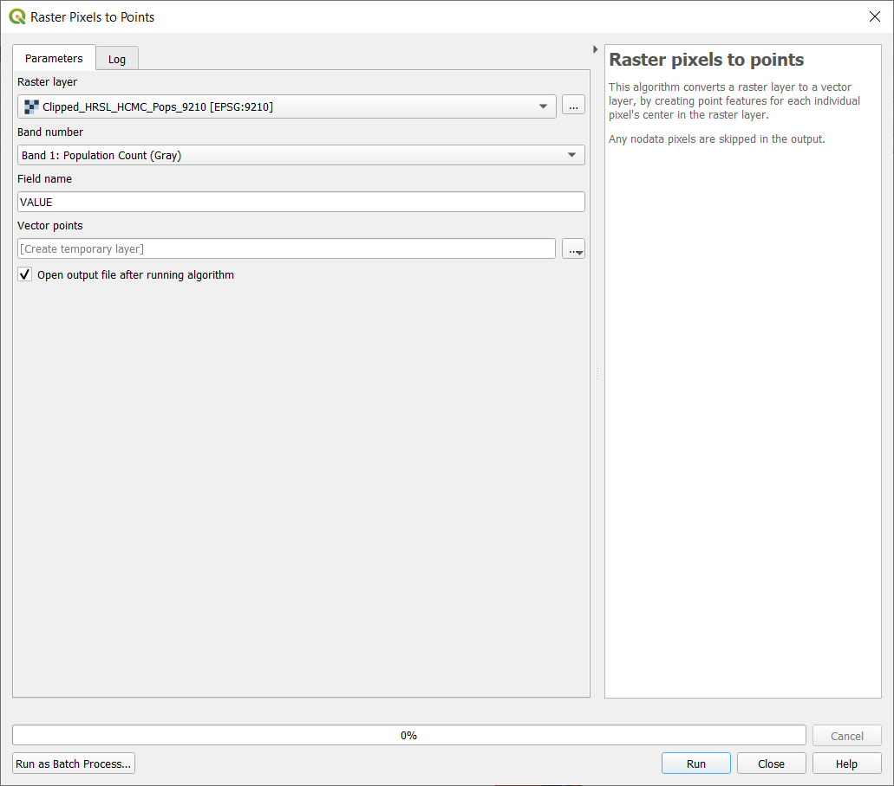

Hình 9.53b - Giao diện Raster pixels to points

Do khu vực nghiên cứu khá rộng, thao tác này có thể khá tốn thời gian. Hình 9.54 cho thấy có bao nhiêu điểm đã được chuyển đổi


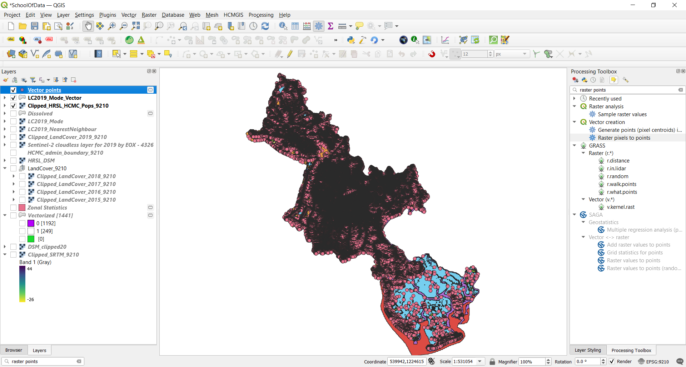

Hình 9.54 - Point vector sau khi chuyển đổi

Số lượng các đối tượng cao đáng kể và nếu không được nhập vào CSDL, bất kì phép xử lý hoặc hiển thị nào cũng đòi hỏi nhiều thời gian. Trong những loại tình huống này, giải pháp hợp lý là chia tập dữ liệu mà chúng ta phải xử lý thành các phần có thể quản lý được. Do đó, chúng ta sẽ xem xét xử lý các tính toán cần thiết trên các khu vực nhỏ hơn được xác định rõ ràng. Để chia HRSL layer, chúng ta sẽ sử dụng tuỳ chọn đê 3ta5o một VRT. Chọn HRSL layer và chọn **Export as..**, chọn **Create VRT** và nhập các tham số sau: thư mục lưu trữ kết quả, CRS: EPSG: 9210, VRT tiles: max columns 1000, max rows: 1000 (Hình 9.55).


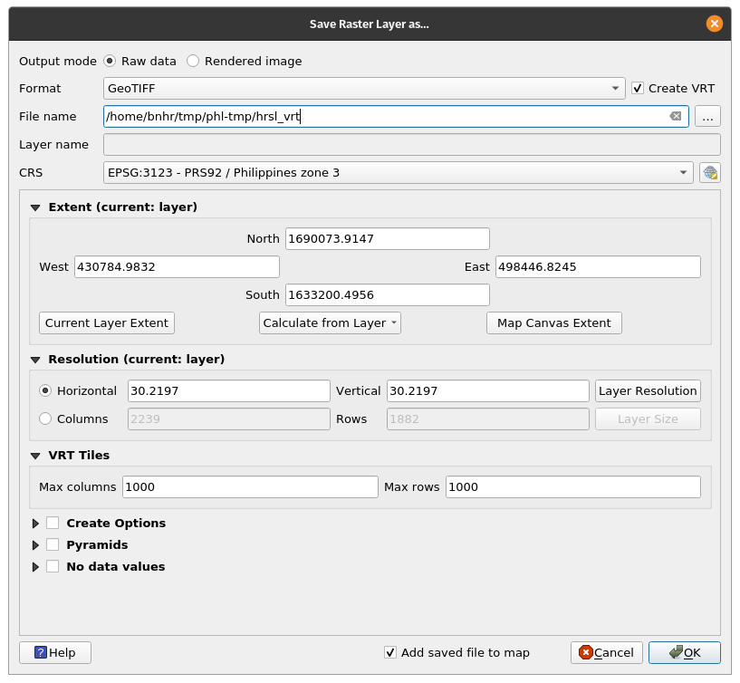

Hình 9.55 - Tạo một VRT file vớ các raster tile cụ thể

Sau khi kết xuất, tải tất cả các raster tile vào QGIS project. Kết quả như Hình 9.56


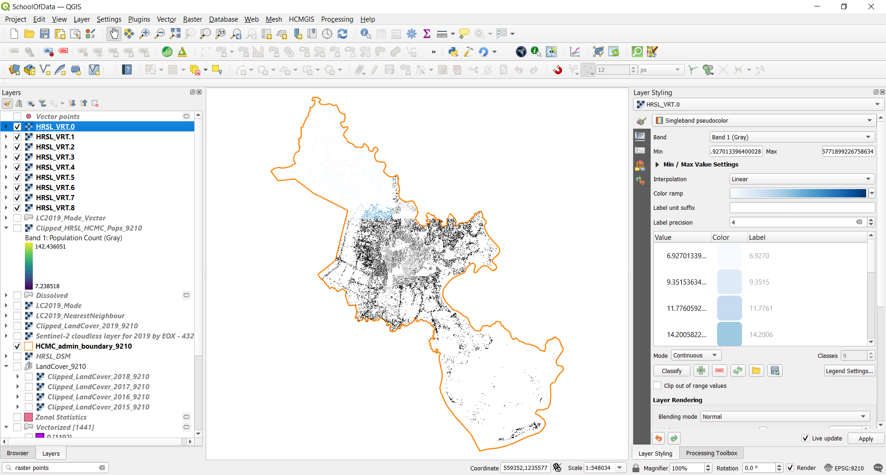

Hình 9.56 - Raster tiles cho HRSL Tp.HCM.

Tiếp theo, chúng ta sẽ chạy lại **Raster pixels to points** cho từng raster tile này. Bởi vì chúng ta có nhiều raster tile, chúng ta sẽ sử dụng chức năng batch processing (Hình 9.57)


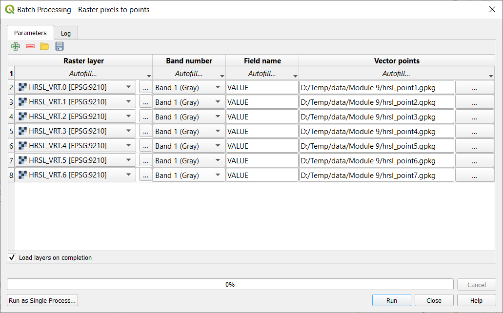

Hình 9.57 - Chạy raster to points cho tất cả raster tile.

Các vector point kết quả như Hình 9.58


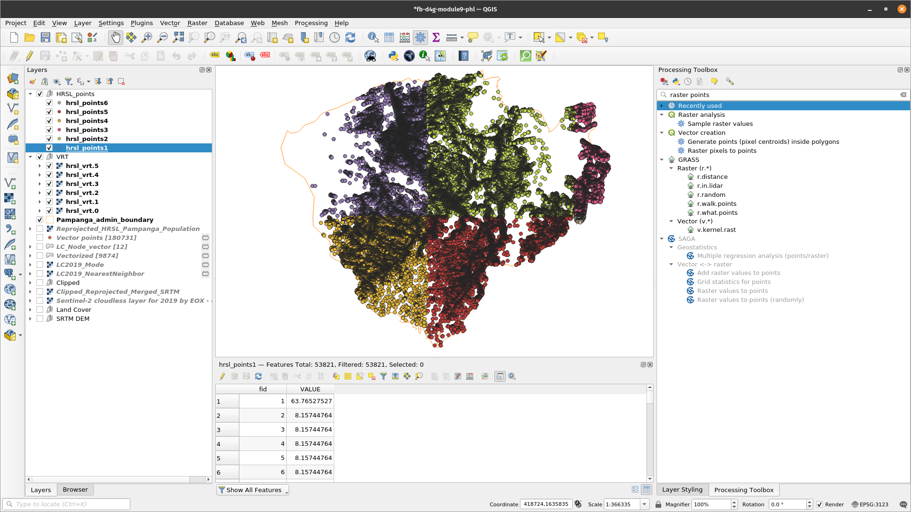

Hình 9.58 - Point vector cho HRSL layer với các giá trị pixel được lưu trữ trong cột VALUE

Xem xét kĩ hơn các kết quả của thuật toán, chúng ta có thể thấy rằng các vector point nằm chính xác ở tâm pixel mà chúng trích xuất giá trị từ đó (Hình 9.59).


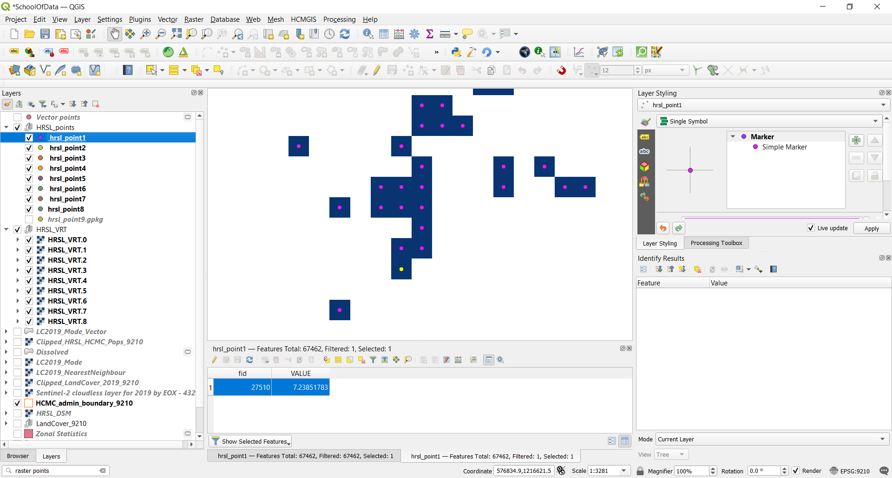

Hình 9.59 - Xác minh các giá trị của point vector so với giá trị pixel của raster.

Để giải bài tập này, tổng của các giá trị của các điểm trích xuất từ HRSL nằm trong mỗi polygon của lớp phủ mặt đất phải được tính toán. Để làm điều này, chúng ta sẽ sử dụng một chức năng có sẵn trong Field Calculator -  `aggregation()`. Chức năng này khá mạnh mẽ bởi vì nó thực hiện spatial join ngay khi tính toán cho phép thực hiện nhiều phép tính khác nhau. Trong trường hợp của chúng ta, chức năng này phải xác định các điểm nằm trong mỗi polygon và sau đó tính tổng các giá trị của các điểm này. Để làm điều này, mở Attribute Table của layer LC2019_Mode và chọn Field Calculator. Tạo một field mới và nhập công thức sau:


```
aggregate(
    layer:= 'HRSL_vectors1',
    aggregate:='sum',
    expression:=VALUE,
    filter:=intersects($geometry, geometry(@parent))
)
```


Trong đó, <code>layer<em> </em></code> là tên của lớp dữ liệu mà chúng ta muốn trích lọc thông tin (trong trường hợp này là lớp điểm chứa giá trị pixel của HRSL raster layer), <code>aggregate</code> - cho biết phép tính được thư5c hiện khi spatial join được xác nhận (sum, count, mean, median, concatenate,...), <code>expression - </code> trường dữ liệu mà chúng ta muốn trích lọc thông tin, <code>filter - </code>chỉ ra<code> </code>hàm geometry (intersect, within,...) (see figure 9.60).


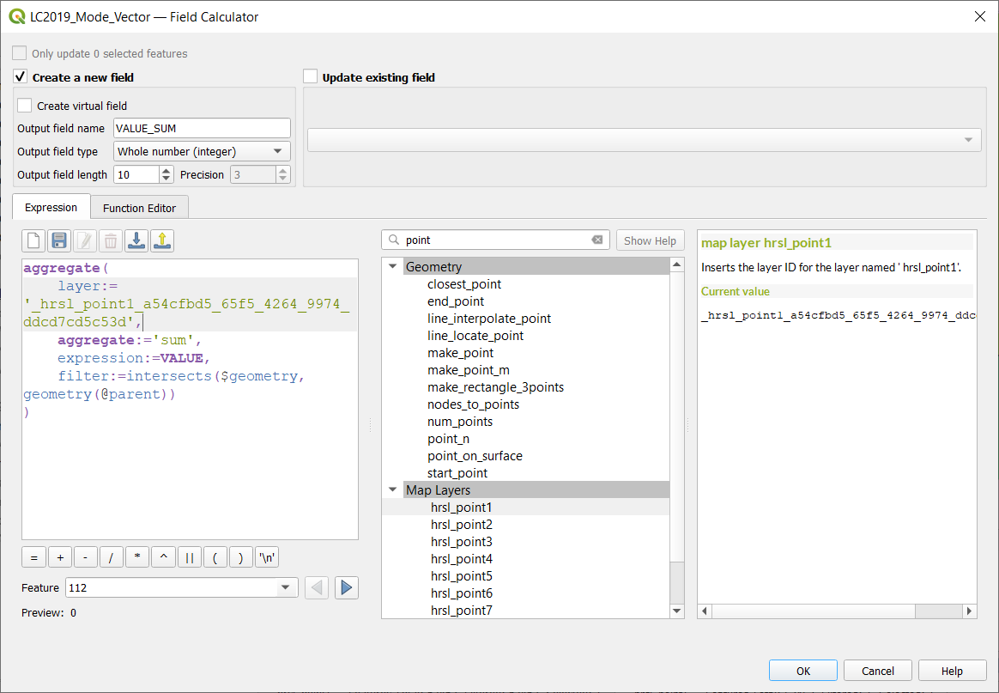

Hình 9.60 - Sử dụng các hàm tích hợp sẵn với Field Calculator

Kết quả, như mong đợi, được lưu trong bảng thuộc tính của LC2019_Mode. Và do đó, bài tập đã hoàn thành.

**Xin lưu ý! Bước cuối cùng này có thể tốn nhiều thời gian tuỳ thuộc vào khối lượng dữ liệu của bạn! Hãy kiểm tra đề tìm ra tuỳ chọn kích cỡ tiling phù hợp nhất cho dữ liệu của bạn**

Nếu sử dụng Field Calculator và hàm aggregate không hoạt động, chúng ta cũng có thể sử dụng công cụ **Join attributes by location (summary)** để tính tổng các giá trị của các điểm nằm trong các đối tượng của LC_Mode_vector


")

Hình 9.61 - Các tham số cho chức năng Join attributes by location (summary).


")

Hình 9.62 - Kết quả của Join attributes by location (summary).

Trong phase 3 của Module 9, chúng ta đã làm việc với dữ liệu raster cũng như vector. Chúng ta đã xem xét kĩ hơn resampling có nghĩa là gì và ý nghĩa của các đặc điểm của raster, như CRS, độ phân giải không gian,... Thông thường, người dùng phải làm việc với cả dữ liệu raster và vector, và do đó, điều quan trọng là phải biết một số cách để thực hiện. Chúng ta cũng đã thư3 một số phép chuyển đổi, từ raster sang vector và ngược lại. Tuy nhiên, trong quá trình xử lý chúng ta không được để mất các hiện tượng mà chúng ta đang nghiên cứu, cũng như tỉ lệ ban đầu mà dữ liệu được thu thập, là dữ liệu vector hay raster. Khi thực hiện chuyển đổi dữ liệu, điều quan trọng là phải biết sự tương ứng giữa tỉ lệ bản đồ và độ phân giải của raster. Theo nhà bản đồ học Waldo Tobler “Quy tắc là chia mẫu số của tỉ lệ bản đồ cho 1000 để có được kích thước có thể phát hiện được tính bằng mét. Độ phân giải là một nửa của con số này". Nói cách khác, công thức là `tỉ lệ bản đồ = độ phân giải raster (mét) X 2 X 1000. `  

Các giải pháp cho các bài tập trong Module này, cũng như trong Module 8, chỉ là một cách để giải quyê1t vấn đề. Khi bạn tiến bộ trong việc nghiên cứu các công cụ GIS mã nguồn mở, bạn có thể tìm nhiều khả năng để đạt được cùng một kệt quả - một số tốt hơn các giải pháp khác.


#### Câu hỏi

1. Tên gọi của process mà độ phân giải của raster có thể được nâng cao hoặc hạ thấp?
*   _<span style="text-decoration:underline;">Resampling.</span>_ 
2. Một biểu đồ histogram cho chúng ta thấy điều gì? 
*   <span style="text-decoration:underline;">Tần suát của các giá trị pixel, được sắp xếp trong các khoản giá trị liền kề nhau.</span>
3. Có thể chuyển đổi raster sang polygon hay không? Và ngược lại có được không?
*   <span style="text-decoration:underline;">Yes and yes. </span>


## Tài lệu tham khảo:

Center for International Earth Science Information Network - CIESIN - Columbia University. 2018. Gridded Population of the World, Version 4 (GPWv4): Population Density, Revision 11. Palisades, NY: NASA Socioeconomic Data and Applications Center (SEDAC). [https://doi.org/10.7927/H49C6VHW](https://doi.org/10.7927/H49C6VHW). Accessed DAY MONTH YEAR.

Resampling methods: [https://gisgeography.com/raster-resampling/](https://gisgeography.com/raster-resampling/)


<!-- Footnotes themselves at the bottom. -->
## Chú thích

[^1]:
     Một phép toán nguyên thủ là một phép tính cơ bản được thực hiện bởi một thuật toán.     
[^2]:
     Độ phân giải thời gian phụ thuộc vào vĩ độ.
[^3]:
     JAXA là viết tắt của Japan Aerospace Exploration Agency 
[^4]:
     Đối với bài tập này chúng ta sẽ xem DSM như là DEM. Để biết thêm chi tiết về sự khác biệt vui lòng xem lại phần Phân tích các khái niệm.
[^5]:
     Geospatial Data Abstraction Library (GDAL) là một thư viện phần mềm để đọc và ghi dữ liệu raster và vector.
[^6]:
     Sentinel-2 là một sứ mệnh quan sát trái đất từ chương trình Copernicus nhằm thu thập một cách có hệ thống các ảnh quang học có độ phân giải không gian cao (10 m đến 60 m) trên đất liền và vùng nước ven biển. Để biết thêm chi tiết, truy cập [tại đây](https://sentinel.esa.int/web/sentinel/missions/sentinel-2).